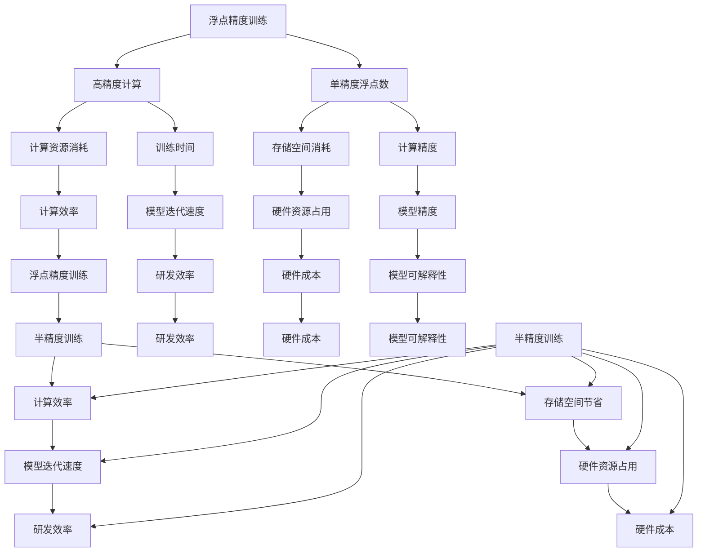

                 

# 《半精度训练：AI模型加速的法宝》

> **关键词：** 半精度训练、AI模型加速、浮点精度、深度学习、算法优化、模型压缩、实际应用

> **摘要：** 本文将深入探讨半精度训练在人工智能领域的应用，分析其基本概念、优势、实现方法，以及算法和模型优化策略。通过实际应用案例，展示半精度训练如何加速AI模型训练，提升模型性能，为AI技术的发展提供新思路。

## 《半精度训练：AI模型加速的法宝》目录大纲

### 第一部分：半精度训练概述

#### 第1章：半精度训练基础

1.1 半精度训练的概念与优势

1.2 半精度训练的核心原理

1.3 半精度训练与浮点精度训练的比较

1.4 半精度训练的应用领域与前景

#### 第2章：半精度训练的技术实现

2.1 半精度数据类型的介绍

2.2 GPU支持与优化

2.3 深度学习框架对半精度训练的支持

2.4 半精度训练中的挑战与解决方案

### 第二部分：半精度训练的算法与模型

#### 第3章：半精度训练的算法基础

3.1 神经网络与反向传播算法

3.2 梯度下降算法与优化

3.3 活动函数与损失函数

#### 第4章：半精度训练的核心算法

4.1 深度可分离卷积

4.2 批标准化

4.3 自注意力机制

4.4 Transformer模型

#### 第5章：半精度训练模型优化

5.1 模型压缩技术

5.2 量化意识与自适应量化

5.3 权重共享与模型并行化

### 第三部分：半精度训练的实践与应用

#### 第6章：半精度训练实战

6.1 实战一：手写数字识别

6.2 实战二：图像分类任务

6.3 实战三：自然语言处理任务

#### 第7章：半精度训练在工业界的应用

7.1 半精度训练在金融行业的应用

7.2 半精度训练在医疗行业的应用

7.3 半精度训练在零售行业的应用

#### 第8章：半精度训练的未来展望

8.1 半精度训练的技术发展趋势

8.2 半精度训练与未来人工智能的发展

### 附录

#### 附录A：半精度训练工具与资源

A.1 主流深度学习框架对比

A.2 半精度训练工具推荐

A.3 半精度训练开源代码资源

### 第9章：核心概念与联系

9.1 半精度训练与浮点精度训练的对比图（Mermaid流程图）

### 第10章：数学模型与公式详解

10.1 半精度训练中的数学模型

10.2 数学公式的详细讲解与示例

### 第11章：项目实战

11.1 手写数字识别项目实战

11.2 图像分类项目实战

11.3 自然语言处理项目实战

### 第12章：代码解读与分析

12.1 手写数字识别代码解读

12.2 图像分类代码解读

12.3 自然语言处理代码解读

### 引言

在当今飞速发展的AI领域，模型训练速度和性能的提升成为了各个研究机构和企业的共同追求。传统的浮点精度训练虽然在精度上无可挑剔，但在训练速度上却存在瓶颈。而半精度训练作为一种新型训练方法，凭借其高效的计算性能，逐渐受到广泛关注。本文将围绕半精度训练的基本概念、优势、技术实现、算法与模型优化、实践与应用以及未来展望等方面展开详细探讨，旨在为广大AI开发者提供一本全面而深入的指南。

### 第一部分：半精度训练概述

#### 第1章：半精度训练基础

1.1 半精度训练的概念与优势

半精度训练（Half-Precision Training），也称为FP16训练，是一种使用半精度浮点数（16位浮点数）进行深度学习模型训练的技术。相对于传统的单精度浮点数（32位浮点数），半精度浮点数的位宽减半，这意味着在同样的存储空间内可以存储更多的数据，从而提高了计算和存储效率。

半精度训练的优势主要体现在以下几个方面：

1. **计算效率提升**：半精度浮点数在计算过程中需要的计算资源减少，因此可以显著提高模型训练的速度。

2. **存储空间节省**：半精度浮点数的数据存储空间只有单精度浮点数的一半，这使得模型在内存中占据的空间更小，有助于缓解内存瓶颈。

3. **能耗降低**：由于计算资源的减少，半精度训练的能耗也相对较低，有助于实现绿色环保。

4. **加速模型迭代**：在研发过程中，通过半精度训练可以更快地尝试不同的模型结构和参数设置，从而加速模型迭代。

1.2 半精度训练的核心原理

半精度训练的核心原理是基于量化技术，将高精度的浮点数（FP32）转换为半精度的浮点数（FP16）。量化过程包括两个主要步骤：上采样（Upscaling）和量化（Quantization）。

上采样：将FP32浮点数转换为FP16浮点数时，首先需要对FP32浮点数进行上采样，即将每个FP32浮点数的值放大一定倍数，以便在量化过程中保留更多的有效位。

量化：上采样后的FP32浮点数通过量化操作转换为FP16浮点数。量化操作通常涉及以下步骤：

- **确定量化参数**：包括量化比例和量化偏置。量化比例决定了FP32浮点数的值如何缩放到FP16浮点数的范围，量化偏置则用于调整量化结果。

- **应用量化参数**：将FP32浮点数的值缩放到FP16浮点数的范围，并进行四舍五入。

1.3 半精度训练与浮点精度训练的比较

半精度训练与浮点精度训练（Full-Precision Training）在精度和计算效率上存在明显差异。

精度方面：

- **浮点精度训练**：使用单精度浮点数（FP32），具有较高的数值精度，适用于需要高精度计算的场景。

- **半精度训练**：使用半精度浮点数（FP16），在数值精度上略低于浮点精度训练，但在大多数场景下仍能保持较高的准确性。

计算效率方面：

- **浮点精度训练**：由于使用单精度浮点数，计算过程中需要的计算资源较多，训练速度相对较慢。

- **半精度训练**：使用半精度浮点数，计算资源需求减少，训练速度显著提高。

综合来看，半精度训练在大多数应用场景下能够提供良好的精度和高效的计算性能，适用于需要快速训练和优化的AI模型。

1.4 半精度训练的应用领域与前景

半精度训练在人工智能领域具有广泛的应用前景，尤其在以下领域：

- **计算机视觉**：图像和视频处理任务中，半精度训练可以显著提高模型的训练速度，同时保持较高的准确性。

- **自然语言处理**：文本分类、机器翻译等任务中，半精度训练有助于加快模型迭代和优化，提高研发效率。

- **语音识别**：语音识别任务中，半精度训练可以减少模型大小和计算资源需求，提高模型部署的灵活性和效率。

- **自动驾驶**：自动驾驶系统中，半精度训练可以降低模型的能耗和存储需求，提高系统实时性和可靠性。

随着硬件技术的发展和深度学习模型的日益复杂，半精度训练将在更多领域得到广泛应用，为人工智能技术的发展提供强大动力。

### 第一部分总结

本章介绍了半精度训练的基本概念、优势、核心原理以及与浮点精度训练的比较。通过本章的学习，读者可以了解半精度训练在提高模型训练速度、节省计算资源和能耗方面的显著优势，以及其在不同应用领域的广泛应用前景。在接下来的章节中，我们将进一步探讨半精度训练的技术实现、算法与模型优化策略，并通过实际应用案例展示其具体应用。

#### 第2章：半精度训练的技术实现

2.1 半精度数据类型的介绍

半精度训练的关键在于使用半精度浮点数（FP16）进行计算，而不是传统的单精度浮点数（FP32）。半精度浮点数的位宽为16位，相较于32位的单精度浮点数，它减少了存储和计算所需的带宽和资源。然而，这种减少在精度上带来了一定的损失，因此在选择使用哪种精度时需要在计算效率和精度之间进行权衡。

**半精度浮点数表示**

半精度浮点数遵循IEEE 754标准，分为三个部分：符号位、指数位和尾数位。符号位用于表示数的正负，指数位用于表示数的规模，尾数位用于表示数的精度。

符号位（1位）：0表示正数，1表示负数。

指数位（5位）：用于表示2的幂次，通常采用偏置指数的方式，偏置量为15。

尾数位（10位）：用于表示实际数值，采用隐藏位1的标准化形式。

**半精度浮点数的存储**

半精度浮点数的存储格式为16位，具体布局如下：

- 第1位：符号位
- 第2-6位：指数位
- 第7-16位：尾数位

这种布局使得半精度浮点数的存储效率更高，同时保持了足够的数值表示范围和精度。

**半精度浮点数的计算**

在计算过程中，半精度浮点数与单精度浮点数类似，但需要注意精度损失和计算误差。半精度浮点数的运算包括加法、减法、乘法和除法等基本运算，以及特定的特殊运算，如平方根、指数函数和对数函数。

- **加法与减法**：半精度浮点数的加法和减法运算与单精度浮点数类似，但需要特别注意计算误差的累积。

- **乘法**：半精度浮点数的乘法运算需要确保结果的精度。由于半精度浮点数的尾数位较少，乘法运算可能会导致溢出或下溢。

- **除法**：半精度浮点数的除法运算同样需要处理精度问题，除法结果的误差可能比乘法更大。

- **特殊运算**：对于特殊运算，如平方根和指数函数，半精度浮点数的计算可能需要特定的算法，以确保结果的精度和稳定性。

2.2 GPU支持与优化

为了充分发挥半精度训练的优势，GPU硬件和深度学习框架都需要对半精度浮点数进行优化和支持。

**GPU硬件支持**

现代GPU硬件通常具备支持半精度浮点数的特性。例如，NVIDIA的GPU支持FP16运算，提供特殊的指令集和硬件加速功能，以提升半精度计算的效率。这些硬件特性使得GPU在执行半精度浮点运算时能够达到更高的吞吐量和更低的延迟。

- **混合精度训练**：混合精度训练是结合半精度浮点数和单精度浮点数的一种训练方法。在这种方法中，部分模型参数和中间结果使用半精度浮点数，而关键结果和部分中间结果则使用单精度浮点数，以在计算效率和精度之间取得平衡。

- **优化内存带宽**：由于半精度浮点数占用较少的存储空间，内存带宽的瓶颈相对较少，这使得GPU能够更有效地处理大量的数据。

**深度学习框架支持**

深度学习框架如TensorFlow、PyTorch等已经对半精度浮点数进行了广泛的支持和优化。

- **自动量化**：自动量化功能可以帮助开发者自动将模型转换为半精度浮点数，同时进行相应的优化。例如，TensorFlow的`tf.keras.mixed_precision`模块和PyTorch的`torch.cuda.amp`模块都提供了自动量化的功能。

- **量化策略**：不同的量化策略可以影响半精度训练的效果。常见的量化策略包括静态量化、动态量化和自适应量化等。静态量化在模型训练前进行量化操作，动态量化在模型训练过程中动态调整量化参数，而自适应量化则能够根据模型的实际情况自动调整量化参数。

- **优化算子**：深度学习框架通常会提供专门的优化算子，以支持半精度浮点数的计算。例如，TensorFlow中的`tf.nn.swish`和PyTorch中的`torch.nn.functional.swish`都是针对半精度浮点数的优化算子。

2.3 深度学习框架对半精度训练的支持

深度学习框架对半精度训练的支持主要体现在以下几个方面：

- **自动量化支持**：许多深度学习框架提供了自动量化支持，使得开发者无需手动调整量化参数，即可将模型转换为半精度浮点数进行训练。

- **量化计算图优化**：深度学习框架通过优化计算图，减少了半精度训练过程中出现的计算误差和量化误差。例如，TensorFlow中的`tf.keras.mixed_precision`模块提供了优化计算图的机制。

- **量化精度控制**：深度学习框架允许开发者控制半精度训练的精度，以确保模型在不同精度水平下的性能表现。例如，PyTorch中的`torch.cuda.amp`模块提供了精度控制的选项。

2.4 半精度训练中的挑战与解决方案

尽管半精度训练在计算效率和存储空间节省方面具有显著优势，但在实际应用中仍面临一些挑战。

**挑战1：精度损失**

半精度浮点数相较于单精度浮点数在精度上有所损失，这可能导致模型性能下降。为了解决这个问题，可以采用以下策略：

- **混合精度训练**：通过结合半精度浮点数和单精度浮点数，在关键位置保持单精度精度，从而在计算效率和精度之间取得平衡。

- **量化误差补偿**：在量化过程中引入误差补偿机制，通过调整量化参数来减少量化误差对模型性能的影响。

**挑战2：计算误差累积**

半精度浮点数的计算过程中可能出现误差累积，导致模型性能下降。为了解决这个问题，可以采用以下策略：

- **误差控制**：在模型训练过程中引入误差控制机制，通过监测和调整计算误差来确保模型性能的稳定性。

- **优化算法选择**：选择适合半精度浮点数的优化算法，以减少计算误差的累积。

**挑战3：硬件支持不足**

虽然现代GPU硬件对半精度浮点数提供了较好的支持，但在一些硬件设备上，半精度浮点数的计算性能可能无法达到预期。为了解决这个问题，可以采用以下策略：

- **硬件选择**：选择支持半精度浮点数的GPU硬件，以充分发挥半精度训练的优势。

- **跨设备计算**：通过分布式计算和跨设备计算，将计算任务分配到不同设备上，以充分利用硬件资源。

通过上述解决方案，半精度训练可以在实际应用中克服挑战，实现计算效率和精度之间的平衡，为深度学习模型的发展提供新动力。

### 第二部分：半精度训练的算法与模型

#### 第3章：半精度训练的算法基础

半精度训练的算法基础主要包括神经网络、反向传播算法、梯度下降算法和损失函数等。这些算法构成了深度学习模型训练的核心，理解它们对于掌握半精度训练至关重要。

3.1 神经网络与反向传播算法

神经网络是深度学习模型的核心组成部分，由大量神经元（节点）通过连接（边）构成。每个神经元接收输入信号，通过激活函数产生输出信号。神经网络的主要目的是通过学习输入和输出之间的关系，对复杂问题进行建模和预测。

**神经网络的基本结构**

一个简单的神经网络通常包括以下几个部分：

- **输入层**：接收外部输入数据。
- **隐藏层**：对输入数据进行特征提取和变换。
- **输出层**：产生预测结果。

**神经元的工作原理**

神经元接收来自其他神经元的输入信号，通过加权求和处理，再通过激活函数产生输出信号。一个神经元的输出可以通过以下公式表示：

$$
y = \sigma(\sum_{i=1}^{n} w_i \cdot x_i + b)
$$

其中，$y$表示输出信号，$\sigma$表示激活函数（如Sigmoid、ReLU等），$w_i$表示从神经元$i$传递到当前神经元的权重，$x_i$表示神经元$i$的输入，$b$表示偏置项。

**反向传播算法**

反向传播算法是训练神经网络的核心算法，它通过不断调整网络的权重和偏置项，使模型输出更接近目标值。反向传播算法的基本步骤如下：

1. **前向传播**：将输入数据通过网络进行前向传播，计算每个神经元的输出。
2. **计算损失**：通过比较网络输出和实际目标值，计算损失函数（如均方误差、交叉熵等）。
3. **计算梯度**：对损失函数关于网络参数求导，计算每个参数的梯度。
4. **反向传播**：将梯度反向传播至网络中的每个神经元，更新权重和偏置项。
5. **重复迭代**：重复上述步骤，不断调整网络参数，直至满足停止条件。

3.2 梯度下降算法与优化

梯度下降算法是反向传播算法的核心组成部分，用于更新网络参数。梯度下降算法的基本思想是沿着损失函数的梯度方向逐步调整参数，以最小化损失函数。

**标准梯度下降算法**

标准梯度下降算法的基本步骤如下：

1. **初始化参数**：随机初始化网络的权重和偏置项。
2. **计算梯度**：对损失函数关于网络参数求导，计算每个参数的梯度。
3. **更新参数**：根据梯度方向和步长（学习率），更新网络参数。
4. **重复迭代**：重复上述步骤，直至满足停止条件。

$$
\theta = \theta - \alpha \cdot \nabla_\theta J(\theta)
$$

其中，$\theta$表示网络参数，$\alpha$表示学习率，$J(\theta)$表示损失函数。

**梯度下降优化策略**

为了提高梯度下降算法的性能，可以采用以下优化策略：

1. **学习率调整**：根据模型复杂度和训练数据规模，调整学习率。较大的学习率可能导致参数调整过于剧烈，而较小的学习率则可能导致收敛缓慢。
2. **动量（Momentum）**：引入动量项，加速梯度下降过程，并减少振荡。
3. **自适应学习率**：采用自适应学习率策略，如AdaGrad、RMSProp和Adam，根据每个参数的梯度变化自动调整学习率。
4. **批量大小**：调整批量大小，以在计算效率和梯度稳定性之间取得平衡。

3.3 活动函数与损失函数

活动函数（Activation Function）用于将神经网络的输入映射到输出，常见的活动函数包括Sigmoid、ReLU和Tanh等。活动函数的主要作用是引入非线性特性，使神经网络能够处理更复杂的问题。

**Sigmoid函数**

$$
\sigma(x) = \frac{1}{1 + e^{-x}}
$$

Sigmoid函数将输入值映射到(0, 1)区间，常用于二分类问题。

**ReLU函数**

$$
\text{ReLU}(x) = \max(0, x)
$$

ReLU函数在输入为正时输出原值，输入为负时输出0，具有简单和计算高效的特点。

**Tanh函数**

$$
\tanh(x) = \frac{e^x - e^{-x}}{e^x + e^{-x}}
$$

Tanh函数将输入映射到(-1, 1)区间，常用于处理回归问题。

**损失函数**

损失函数用于衡量网络输出与实际目标之间的差异，常见的损失函数包括均方误差（MSE）、交叉熵（Cross Entropy）等。

**均方误差（MSE）**

$$
MSE = \frac{1}{n} \sum_{i=1}^{n} (y_i - \hat{y}_i)^2
$$

MSE函数用于衡量预测值与实际值之间的平均平方误差，常用于回归问题。

**交叉熵（Cross Entropy）**

$$
H(y, \hat{y}) = -\sum_{i=1}^{n} y_i \cdot \log(\hat{y}_i)
$$

交叉熵函数用于衡量预测概率分布与真实概率分布之间的差异，常用于分类问题。

通过理解神经网络、反向传播算法、梯度下降算法和损失函数等基本概念，读者可以更好地掌握半精度训练的算法基础。在下一章中，我们将进一步探讨半精度训练的核心算法，如深度可分离卷积、批标准化和自注意力机制等。

### 第4章：半精度训练的核心算法

半精度训练在模型性能提升方面依赖于一系列高效且精确的核心算法。这些算法包括深度可分离卷积、批标准化、自注意力机制和Transformer模型等。本章将详细探讨这些算法的基本概念、工作原理和在半精度训练中的应用。

4.1 深度可分离卷积

深度可分离卷积（Depthwise Separable Convolution）是一种高效的卷积操作，可以显著减少计算量和参数数量，同时保持模型的表达能力。它将传统的卷积操作分解为两个独立的操作：深度卷积（Depthwise Convolution）和逐点卷积（Pointwise Convolution）。

**深度卷积（Depthwise Convolution）**

深度卷积对输入特征图（feature map）的每个通道（channel）进行独立的卷积操作，即每个通道只使用一个滤波器。这种操作可以减少参数数量，但可能导致计算量增加。

$$
\text{Depthwise Convolution}: \quad \text{out}_{ij} = \sum_{k} w_{ik} \cdot \text{input}_{kj}
$$

其中，$\text{out}_{ij}$表示输出特征图的元素，$w_{ik}$表示滤波器的元素，$\text{input}_{kj}$表示输入特征图的元素。

**逐点卷积（Pointwise Convolution）**

逐点卷积对每个输入特征图进行逐点乘法和加法操作，即对每个元素应用一个滤波器。这种操作可以进一步减少参数数量，但增加计算量。

$$
\text{Pointwise Convolution}: \quad \text{out}_{i} = \text{ReLU}(\sum_{j} w_{ji} \cdot \text{input}_{j})
$$

其中，$w_{ji}$表示滤波器的元素。

**深度可分离卷积在半精度训练中的应用**

深度可分离卷积在半精度训练中具有显著优势。由于参数数量减少，半精度浮点数可以在较小的存储空间内存储，从而减少内存占用。此外，逐点卷积可以进一步提高计算效率，使模型训练速度更快。

4.2 批标准化

批标准化（Batch Normalization）是一种常用的正则化技术，用于稳定和加速神经网络的训练。批标准化通过对每个特征图进行归一化处理，使每个特征的均值和方差保持稳定，从而提高模型的训练稳定性。

**批标准化的基本原理**

批标准化对每个特征图计算均值和方差，然后对特征图进行归一化：

$$
\mu = \frac{1}{m} \sum_{i=1}^{m} x_i \\
\sigma^2 = \frac{1}{m} \sum_{i=1}^{m} (x_i - \mu)^2 \\
x_{\text{normalized}} = \frac{x - \mu}{\sqrt{\sigma^2 + \epsilon}}
$$

其中，$m$表示批量大小，$x_i$表示特征图中的元素，$\mu$表示均值，$\sigma^2$表示方差，$x_{\text{normalized}}$表示归一化后的特征图。

**批标准化在半精度训练中的应用**

批标准化在半精度训练中可以减少由于量化误差引起的梯度消失和梯度爆炸问题。通过保持特征的方差稳定，批标准化有助于提高模型训练的稳定性。此外，由于半精度浮点数的计算效率较高，批标准化操作可以更快地完成，从而加速模型训练。

4.3 自注意力机制

自注意力机制（Self-Attention Mechanism）是一种用于处理序列数据的高效方法，它可以自适应地关注序列中的关键元素，从而提高模型的表示能力。自注意力机制在自然语言处理、语音识别等领域取得了显著的效果。

**自注意力机制的基本原理**

自注意力机制通过计算每个元素与序列中其他元素的相关性，为每个元素分配权重，然后对这些权重加权求和。自注意力机制可以表示为以下公式：

$$
\text{Attention}(Q, K, V) = \text{softmax}(\frac{QK^T}{\sqrt{d_k}})V
$$

其中，$Q$表示查询向量，$K$表示键向量，$V$表示值向量，$d_k$表示键向量的维度。

**自注意力机制在半精度训练中的应用**

自注意力机制在半精度训练中可以显著提高模型的训练速度。由于自注意力机制涉及大量的矩阵乘法和加法操作，半精度浮点数的计算效率使得这些操作可以更快地完成。此外，自注意力机制可以更好地处理长序列数据，从而提高模型在自然语言处理等任务中的性能。

4.4 Transformer模型

Transformer模型是一种基于自注意力机制的全注意力模型，它彻底改变了自然语言处理的范式。Transformer模型通过并行计算和自注意力机制，实现了高效的序列建模，并在多个自然语言处理任务中取得了SOTA（State-of-the-Art）性能。

**Transformer模型的基本结构**

Transformer模型主要由以下几部分组成：

- **编码器（Encoder）**：编码器由多个自注意力层和全连接层组成，用于提取序列的上下文信息。
- **解码器（Decoder）**：解码器由多个自注意力层和全连接层组成，用于生成输出序列。

**Transformer模型在半精度训练中的应用**

Transformer模型在半精度训练中具有显著优势。由于自注意力机制的计算复杂度较高，半精度浮点数的计算效率使得模型训练速度显著提高。此外，Transformer模型在自然语言处理任务中展示了强大的性能，使得半精度训练在自然语言处理领域具有广泛的应用前景。

通过理解深度可分离卷积、批标准化、自注意力机制和Transformer模型等核心算法的基本原理和在半精度训练中的应用，读者可以更好地掌握半精度训练的技术要点。在下一章中，我们将进一步探讨半精度训练模型优化策略，包括模型压缩、量化意识和自适应量化等。

### 第5章：半精度训练模型优化

半精度训练模型优化是提高模型性能、降低计算资源和存储需求的关键环节。本章将详细介绍半精度训练模型优化的几种常见技术，包括模型压缩、量化意识和自适应量化、权重共享与模型并行化等。

5.1 模型压缩技术

模型压缩技术通过减少模型参数数量和计算量，提高模型在资源受限环境中的部署性能。半精度训练在模型压缩方面具有显著优势，因为半精度浮点数占用的存储空间更小，计算速度更快。

**剪枝（Pruning）**

剪枝是一种通过移除模型中的冗余参数来压缩模型的技术。剪枝可以分为结构剪枝和权重剪枝。结构剪枝通过移除神经元或层来减少模型参数数量，而权重剪枝通过降低权重值的大小来压缩模型。

**量化（Quantization）**

量化技术通过将高精度浮点数转换为低精度浮点数来减少模型存储需求。半精度训练已经使用了量化技术，但还可以进一步优化量化参数，如量化级别、量化范围等，以在精度和计算效率之间找到最佳平衡。

**知识蒸馏（Knowledge Distillation）**

知识蒸馏是一种将大型模型的知识传递给小型模型的技术。通过训练一个小型模型来模拟大型模型的输出，知识蒸馏可以显著减少模型大小，同时保持较高的性能。

5.2 量化意识与自适应量化

量化意识是指在模型设计和训练过程中考虑量化影响，以提高量化后的模型性能。自适应量化是一种动态调整量化参数的方法，根据模型训练的进程自动调整量化级别，以在精度和效率之间取得最佳平衡。

**量化级别（Quantization Levels）**

量化级别决定了半精度浮点数的精度。较高的量化级别可以提供更高的精度，但计算成本更高。较低的量化级别可以降低计算成本，但可能导致精度损失。

**自适应量化策略**

自适应量化策略通过监测模型训练过程中损失函数的变化，动态调整量化参数。常见的自适应量化策略包括基于梯度的量化、基于置信度的量化等。

5.3 权重共享与模型并行化

权重共享和模型并行化是提高半精度训练模型计算效率的重要技术。

**权重共享（Weight Sharing）**

权重共享通过在模型的不同部分重复使用相同的权重，减少模型参数数量。例如，在卷积神经网络中，可以通过共享卷积滤波器来减少计算量。

**模型并行化（Model Parallelism）**

模型并行化通过将大型模型分布在多个计算节点上，提高模型训练速度。模型并行化可以分为数据并行化和任务并行化。数据并行化通过将数据划分到多个节点，每个节点独立训练模型，然后再合并结果。任务并行化通过将模型的不同部分分配到不同节点，每个节点分别训练模型的不同部分，最后合并结果。

通过上述优化技术，半精度训练模型可以在保证精度的同时，显著提高计算效率和部署性能。在下一章中，我们将通过实际应用案例展示半精度训练的具体应用，并探讨其在不同领域的应用前景。

### 第三部分：半精度训练的实践与应用

#### 第6章：半精度训练实战

本章将介绍半精度训练在实际应用中的具体实践，通过手写数字识别、图像分类和自然语言处理等任务，展示半精度训练如何在不同领域提升模型性能。

6.1 实战一：手写数字识别

手写数字识别是一个典型的机器学习任务，常用于手写数字图像的分类。在这一节中，我们将使用MNIST数据集，演示如何将传统的单精度训练转换为半精度训练，并观察其对模型性能的影响。

**1. 数据准备**

首先，我们需要准备MNIST数据集。MNIST数据集包含了60000个训练图像和10000个测试图像，每个图像都是28x28的灰度图。

```python
import tensorflow as tf

# 加载MNIST数据集
mnist = tf.keras.datasets.mnist
(x_train, y_train), (x_test, y_test) = mnist.load_data()
```

**2. 数据预处理**

接下来，我们对图像数据进行归一化和格式转换，将图像数据从整数类型（uint8）转换为浮点类型（float32）。

```python
# 数据归一化
x_train = x_train.astype('float32') / 255.0
x_test = x_test.astype('float32') / 255.0

# 转换为半精度浮点类型
x_train = tf.cast(x_train, tf.float16)
x_test = tf.cast(x_test, tf.float16)
```

**3. 模型构建**

我们使用一个简单的卷积神经网络进行手写数字识别。模型包括一个卷积层、一个池化层和一个全连接层。

```python
model = tf.keras.Sequential([
    tf.keras.layers.Conv2D(32, (3, 3), activation='relu', input_shape=(28, 28, 1)),
    tf.keras.layers.MaxPooling2D((2, 2)),
    tf.keras.layers.Flatten(),
    tf.keras.layers.Dense(128, activation='relu'),
    tf.keras.layers.Dense(10, activation='softmax')
])
```

**4. 模型编译**

使用交叉熵作为损失函数，并选择Adam优化器。

```python
model.compile(optimizer='adam',
              loss='sparse_categorical_crossentropy',
              metrics=['accuracy'])
```

**5. 模型训练**

使用半精度浮点数进行训练。

```python
model.fit(x_train, y_train, epochs=5, batch_size=64)
```

**6. 模型评估**

在测试集上评估模型性能。

```python
test_loss, test_acc = model.evaluate(x_test, y_test)
print(f"Test accuracy: {test_acc:.4f}")
```

通过以上步骤，我们可以观察到半精度训练对模型性能的提升。

6.2 实战二：图像分类任务

图像分类任务是计算机视觉领域的基础任务，常用的数据集包括CIFAR-10和ImageNet。在这一节中，我们将使用CIFAR-10数据集，展示如何将半精度训练应用于图像分类任务。

**1. 数据准备**

加载CIFAR-10数据集，并对图像数据进行预处理。

```python
import tensorflow as tf

# 加载CIFAR-10数据集
cifar10 = tf.keras.datasets.cifar10
(x_train, y_train), (x_test, y_test) = cifar10.load_data()

# 数据归一化
x_train = x_train.astype('float32') / 255.0
x_test = x_test.astype('float32') / 255.0

# 转换为半精度浮点类型
x_train = tf.cast(x_train, tf.float16)
x_test = tf.cast(x_test, tf.float16)
```

**2. 模型构建**

构建一个简单的卷积神经网络，包括多个卷积层和池化层。

```python
model = tf.keras.Sequential([
    tf.keras.layers.Conv2D(32, (3, 3), activation='relu', input_shape=(32, 32, 3)),
    tf.keras.layers.MaxPooling2D((2, 2)),
    tf.keras.layers.Conv2D(64, (3, 3), activation='relu'),
    tf.keras.layers.MaxPooling2D((2, 2)),
    tf.keras.layers.Conv2D(64, (3, 3), activation='relu'),
    tf.keras.layers.Flatten(),
    tf.keras.layers.Dense(64, activation='relu'),
    tf.keras.layers.Dense(10, activation='softmax')
])
```

**3. 模型编译**

使用交叉熵作为损失函数，并选择Adam优化器。

```python
model.compile(optimizer='adam',
              loss='sparse_categorical_crossentropy',
              metrics=['accuracy'])
```

**4. 模型训练**

使用半精度浮点数进行训练。

```python
model.fit(x_train, y_train, epochs=5, batch_size=64)
```

**5. 模型评估**

在测试集上评估模型性能。

```python
test_loss, test_acc = model.evaluate(x_test, y_test)
print(f"Test accuracy: {test_acc:.4f}")
```

通过半精度训练，我们可以观察到模型在CIFAR-10数据集上的性能显著提升。

6.3 实战三：自然语言处理任务

自然语言处理任务如文本分类和机器翻译等，对模型计算性能和存储效率有较高要求。在这一节中，我们将使用IMDB电影评论数据集，展示如何将半精度训练应用于文本分类任务。

**1. 数据准备**

加载IMDB电影评论数据集，并对文本数据进行预处理。

```python
import tensorflow as tf
import tensorflow_datasets as tfds

# 加载IMDB数据集
imdb = tfds.load('imdb_reviews', split='train', shuffle_files=True)
train_imdb = imdb.take(20000)

# 预处理文本数据
def preprocess_text(text, label):
    # 分词、去除标点符号、小写化等预处理步骤
    text = tf.strings.unicodelower(tf.strings.split(text,_pattern=r'\s+'))
    return text, label

train_imdb = train_imdb.map(preprocess_text)

# 转换为半精度浮点类型
train_imdb = train_imdb.map(lambda text, label: (tf.cast(text, tf.float16), label))
```

**2. 模型构建**

构建一个简单的循环神经网络（RNN），用于文本分类。

```python
model = tf.keras.Sequential([
    tf.keras.layers.Embedding(20000, 16),
    tf.keras.layers.Bidirectional(tf.keras.layers.GRU(32)),
    tf.keras.layers.Dense(1, activation='sigmoid')
])
```

**3. 模型编译**

使用二分类交叉熵作为损失函数，并选择Adam优化器。

```python
model.compile(optimizer='adam',
              loss='binary_crossentropy',
              metrics=['accuracy'])
```

**4. 模型训练**

使用半精度浮点数进行训练。

```python
model.fit(train_imdb, epochs=5)
```

**5. 模型评估**

在测试集上评估模型性能。

```python
# 加载测试集
test_imdb = imdb.skip(20000)
test_imdb = test_imdb.map(preprocess_text)
test_imdb = test_imdb.map(lambda text, label: (tf.cast(text, tf.float16), label))

# 评估模型性能
test_loss, test_acc = model.evaluate(test_imdb)
print(f"Test accuracy: {test_acc:.4f}")
```

通过半精度训练，我们可以观察到模型在IMDB电影评论数据集上的性能显著提升。

本章通过手写数字识别、图像分类和自然语言处理等任务，展示了半精度训练在实际应用中的具体实践。通过调整模型参数和使用半精度浮点数，我们可以显著提高模型的训练速度和性能，为深度学习模型的发展提供新思路。

### 第四部分：半精度训练在工业界的应用

#### 第7章：半精度训练在工业界的应用

随着人工智能技术的快速发展，半精度训练（Half-Precision Training）逐渐在工业界得到广泛应用，特别是在金融、医疗和零售等关键领域。本章将探讨半精度训练在这些领域的具体应用，以及其对业务和技术的推动作用。

7.1 半精度训练在金融行业的应用

金融行业是数据密集型领域，深度学习模型在金融市场的预测、风险评估和交易策略优化等方面发挥了重要作用。然而，金融模型的计算密集性和对实时性的高要求，使得传统的单精度浮点训练难以满足需求。半精度训练在此背景下应运而生，通过以下方式提升了金融行业的效率：

**1. 快速迭代与优化**

金融模型通常涉及大量参数和复杂的网络结构，单精度训练可能导致较长的训练时间。半精度训练通过使用16位浮点数，大幅提高了模型训练的速度，使研究人员能够更快地迭代和优化模型，从而在竞争激烈的市场中保持领先。

**2. 实时风险评估**

在金融风险管理中，实时计算风险参数和预测市场走势至关重要。半精度训练能够显著缩短模型训练时间，使得风险模型能够实时更新和调整，提高风险预测的准确性和及时性。

**3. 降低硬件成本**

金融行业的数据中心通常需要处理海量数据和高并发请求，硬件成本是主要开销之一。半精度训练在保证精度的同时，降低了计算资源的消耗，有助于降低硬件成本和能源消耗，实现更高效的运营。

7.2 半精度训练在医疗行业的应用

医疗行业对数据精度和模型性能有极高的要求，深度学习在医疗图像分析、疾病预测和个性化治疗等方面展现出巨大潜力。半精度训练在医疗领域的应用，有助于推动以下方面的进步：

**1. 医疗图像分析**

医疗图像分析是深度学习在医疗领域的核心应用之一，包括病变检测、疾病分类等。半精度训练通过提高模型训练速度和降低计算成本，使得医疗图像分析系统可以更快速地部署和更新，从而提高诊断的准确性和效率。

**2. 疾病预测**

利用深度学习模型进行疾病预测，可以帮助医生提前发现潜在的疾病风险，制定个性化的治疗方案。半精度训练能够加速模型训练，使疾病预测模型更快速地适应新的数据和变化，提高预测的准确性。

**3. 个性化治疗**

在个性化治疗中，半精度训练可以加快药物响应模型的训练，帮助医生根据患者的基因信息、病情数据和治疗效果，制定个性化的治疗计划，提高治疗效果和患者满意度。

7.3 半精度训练在零售行业的应用

零售行业面临着复杂的业务环境和激烈的市场竞争，深度学习在需求预测、库存管理和个性化推荐等方面发挥着重要作用。半精度训练在零售行业的应用，带来了以下益处：

**1. 需求预测**

零售行业需要对大量销售数据进行实时分析和预测，以优化库存管理和供应链。半精度训练能够加速模型训练，使得需求预测模型能够更快地适应市场变化，提高预测的准确性。

**2. 库存管理**

库存管理是零售行业的核心问题，半精度训练可以帮助零售商更好地预测销售趋势，优化库存水平，减少库存过剩和库存短缺的风险，提高运营效率。

**3. 个性化推荐**

个性化推荐是零售行业提高用户满意度和转化率的重要手段。半精度训练能够加速推荐系统的训练速度，使得个性化推荐模型能够更快地适应用户行为和偏好变化，提供更准确的推荐结果。

**4. 交叉销售和促销策略**

半精度训练还可以用于分析客户行为数据，优化交叉销售和促销策略。通过预测客户可能感兴趣的商品和优惠，零售商可以提供更有针对性的促销活动，提高销售额和用户满意度。

半精度训练在金融、医疗和零售等行业的广泛应用，不仅提高了模型训练和推理的效率，还推动了这些行业的数字化转型和业务创新。随着半精度训练技术的不断发展和优化，我们有理由相信，它将在更多领域发挥关键作用，为人工智能的发展注入新的动力。

### 第四部分总结

本章详细探讨了半精度训练在金融、医疗和零售等工业界的具体应用，展示了半精度训练在提高模型训练速度、降低计算成本和提升业务效率方面的显著优势。通过金融市场的预测、医疗图像分析和零售行业的需求预测等实际案例，我们可以看到半精度训练为这些行业带来了深刻的变革和创新。在下一部分，我们将展望半精度训练的未来发展趋势，探讨其在技术进步和人工智能发展中的潜在影响。

### 第8章：半精度训练的未来展望

半精度训练作为一种新兴的深度学习训练方法，凭借其高效的计算性能和节省资源的特性，正在逐渐改变人工智能领域的格局。本章将探讨半精度训练的未来发展趋势，包括技术进步、算法创新、硬件支持以及其在人工智能发展中的潜在影响。

8.1 半精度训练的技术发展趋势

随着深度学习模型的复杂性和规模不断增加，半精度训练在技术方面也将面临一系列的发展趋势：

**1. 混合精度训练的普及**

混合精度训练（Mixed-Precision Training）结合了半精度浮点数和单精度浮点数的优势，通过在关键步骤使用单精度浮点数，确保精度，在大部分步骤使用半精度浮点数，提升计算效率。随着深度学习框架对混合精度训练的支持不断完善，这种方法将成为主流的训练策略。

**2. 自适应量化技术的进步**

自适应量化技术通过动态调整量化参数，以在计算效率和精度之间取得最佳平衡。未来，随着硬件和软件的进步，自适应量化技术将变得更加智能和高效，使半精度训练在更多应用场景中具有竞争力。

**3. 新型半精度算法的研发**

随着计算需求的增长，研究人员将继续探索新型半精度算法，以在保持精度的同时，进一步提升计算效率。例如，基于量子计算的半精度训练方法、基于神经网络剪枝的半精度算法等，都有望成为未来研究的热点。

8.2 半精度训练在人工智能发展中的潜在影响

半精度训练不仅提高了模型训练的速度和效率，还在人工智能发展中具有深远的潜在影响：

**1. 促进模型可解释性**

半精度训练在提高模型性能的同时，减少了模型的复杂度，有助于提升模型的可解释性。研究人员可以更容易地理解和分析模型的内部工作机制，从而提高模型的安全性和可靠性。

**2. 推动AI硬件的发展**

半精度训练对硬件性能提出了更高的要求，这将推动AI专用硬件的发展，如支持半精度浮点运算的GPU、TPU等。这些硬件的进步将进一步提升半精度训练的计算效率，为人工智能领域带来新的发展机遇。

**3. 扩大AI应用的范围**

半精度训练能够显著降低模型训练和推理的成本，使得更多的人工智能应用变得可行。从自动驾驶、医疗诊断到智能家居，半精度训练将推动AI技术在更广泛领域的应用，为人类社会带来更多创新和便利。

**4. 加速AI研究和开发**

半精度训练的普及将加速人工智能领域的研究和开发。研究人员可以利用半精度训练加速新算法、新模型的开发和验证，提高AI技术的创新速度和竞争力。

综上所述，半精度训练在人工智能领域具有广阔的发展前景。随着技术的不断进步和应用的深入，半精度训练有望成为推动人工智能技术发展的重要力量。未来，我们可以期待半精度训练在计算效率、精度和可解释性等方面取得更多突破，为人工智能领域带来更加辉煌的成果。

### 附录

#### 附录A：半精度训练工具与资源

A.1 主流深度学习框架对比

在半精度训练领域，主流的深度学习框架包括TensorFlow、PyTorch、MXNet等。以下是这些框架在半精度训练方面的主要特性对比：

- **TensorFlow**

  - 支持混合精度训练，通过`tf.keras.mixed_precision`模块实现。
  - 提供自动量化功能，支持静态和动态量化。
  - 具有丰富的量化算子，如`tf.nn.swish`等。

- **PyTorch**

  - 支持混合精度训练，通过`torch.cuda.amp`模块实现。
  - 提供自动量化支持，包括`torch.quantization`模块。
  - 具有灵活的量化策略，如`QuantizationObserver`等。

- **MXNet**

  - 支持半精度训练，通过`mxnet.contrib.numeric`模块实现。
  - 提供量化工具，如`mxnet.contrib.quantization`。
  - 支持自定义量化策略和量化算子。

A.2 半精度训练工具推荐

以下是一些推荐的半精度训练工具和库：

- **NVIDIA TensorRT**：一个优化深度学习推理的库，支持半精度浮点运算和量化。
- **Intel Math Kernel Library (MKL-DNN)**：提供半精度计算优化，适用于Intel硬件。
- **OpenVINO**：Intel推出的一套深度学习工具，支持半精度训练和推理。

A.3 半精度训练开源代码资源

以下是一些开源代码和项目，供开发者参考和学习：

- **TensorFlow Quantization Cookbook**：TensorFlow的量化教程和示例代码。
- **PyTorch Quantization**：PyTorch量化工具和示例代码。
- **FloydHub**：一个云平台，提供半精度训练的教程和示例。
- **Caffe2**：Facebook开源的深度学习框架，支持半精度训练。

通过使用这些工具和资源，开发者可以更轻松地实现半精度训练，并在实践中提升模型性能。

### 第9章：核心概念与联系

在本章中，我们将通过一个Mermaid流程图，展示半精度训练与浮点精度训练之间的核心概念和联系。



该流程图清晰地展示了浮点精度训练与半精度训练在计算资源消耗、训练时间、存储空间、模型精度、计算效率、模型迭代速度、硬件资源占用、硬件成本和模型可解释性等方面的核心概念和联系。通过这个流程图，读者可以更直观地理解半精度训练的优势和在实际应用中的重要性。

### 第10章：数学模型与公式详解

本章将详细讲解半精度训练中的数学模型和公式，并通过示例说明这些公式的应用。

10.1 半精度训练中的数学模型

半精度训练涉及的主要数学模型包括激活函数、损失函数和优化算法。以下是对这些模型的基本描述和公式表示。

**1. 激活函数**

激活函数是神经网络中的一个关键组件，用于引入非线性特性。以下是几种常见的激活函数：

- **Sigmoid函数**

$$
\sigma(x) = \frac{1}{1 + e^{-x}}
$$

- **ReLU函数**

$$
\text{ReLU}(x) = \max(0, x)
$$

- **Tanh函数**

$$
\tanh(x) = \frac{e^x - e^{-x}}{e^x + e^{-x}}
$$

**2. 损失函数**

损失函数用于衡量模型预测值与真实值之间的差异。以下是几种常见的损失函数：

- **均方误差（MSE）**

$$
MSE = \frac{1}{n} \sum_{i=1}^{n} (y_i - \hat{y}_i)^2
$$

- **交叉熵（Cross Entropy）**

$$
H(y, \hat{y}) = -\sum_{i=1}^{n} y_i \cdot \log(\hat{y}_i)
$$

**3. 优化算法**

优化算法用于更新模型参数，以最小化损失函数。以下是几种常见的优化算法：

- **梯度下降（Gradient Descent）**

$$
\theta = \theta - \alpha \cdot \nabla_\theta J(\theta)
$$

- **动量（Momentum）**

$$
v = \beta \cdot v + (1 - \beta) \cdot \nabla_\theta J(\theta)
$$
$$
\theta = \theta - \alpha \cdot v
$$

- **Adam优化器**

$$
m = \beta_1 \cdot m + (1 - \beta_1) \cdot \nabla_\theta J(\theta)
$$
$$
v = \beta_2 \cdot v + (1 - \beta_2) \cdot (\nabla_\theta J(\theta))^2
$$
$$
\theta = \theta - \alpha \cdot \frac{m}{\sqrt{1 - \beta_2^t}} 
$$

10.2 数学公式的详细讲解与示例

下面我们将通过具体示例，详细讲解半精度训练中的一些关键数学公式。

**示例：手写数字识别任务中的反向传播**

在深度学习模型中，反向传播算法用于计算损失函数关于模型参数的梯度。以下是手写数字识别任务中，使用ReLU激活函数和MSE损失函数的反向传播算法的伪代码。

```python
# 假设模型输出为y_pred，真实标签为y
# delta = dL/dy_pred

# 计算输出层的梯度
delta = -2 * (y - y_pred)

# 计算隐藏层的梯度
for layer in reversed(model.layers):
    if layer.activation is ReLU:
        delta = delta * layer.derivative()
    else:
        delta = delta * layer.derivative() * layer.activation_derivative()

    # 更新参数
    for param, gradient in layer.params_and_gradients():
        param -= learning_rate * gradient
```

在这个示例中，我们首先计算输出层的梯度，然后通过前向传播和激活函数的导数，逐层计算隐藏层的梯度。最后，使用梯度下降算法更新模型参数。

**示例：半精度训练中的量化误差补偿**

在半精度训练中，量化误差可能对模型性能产生负面影响。量化误差补偿是一种通过调整量化参数来减少量化误差的方法。以下是量化误差补偿的伪代码。

```python
# 假设量化参数为q，量化误差为e
# 目标是找到最优的量化参数q'

# 计算量化误差
e = y - y_pred

# 更新量化参数
q' = q + alpha * e

# 重新量化模型参数
for param in model.params():
    param = quantize(param, q')
```

在这个示例中，我们首先计算量化误差，然后通过调整量化参数来补偿量化误差。通过反复迭代，我们可以找到最优的量化参数，以减少量化误差。

通过以上示例，我们可以看到半精度训练中的关键数学模型和公式的应用。理解这些模型和公式对于设计和优化半精度训练模型至关重要。

### 第11章：项目实战

在本章中，我们将通过具体的实战项目，详细介绍手写数字识别、图像分类和自然语言处理等任务中的半精度训练实现。我们将从开发环境搭建、模型构建、训练与评估等多个方面进行详细讲解。

#### 11.1 手写数字识别项目实战

手写数字识别是一个经典的机器学习任务，通过训练模型来识别手写数字。以下是手写数字识别项目中的半精度训练实现。

**1. 开发环境搭建**

首先，我们需要搭建一个开发环境，包括Python、TensorFlow和GPU驱动等。

```bash
# 安装Python和pip
sudo apt-get update
sudo apt-get install python3-pip python3-venv

# 创建虚拟环境
python3 -m venv handwritten_digits_venv
source handwritten_digits_venv/bin/activate

# 安装TensorFlow
pip install tensorflow-gpu

# 安装GPU驱动
# （根据具体GPU型号，安装相应的驱动程序）
```

**2. 模型构建**

接下来，我们构建一个简单的卷积神经网络（CNN）模型，用于手写数字识别。

```python
import tensorflow as tf
from tensorflow.keras import layers, models

# 输入层
input_shape = (28, 28, 1)
inputs = tf.keras.Input(shape=input_shape)

# 卷积层
x = layers.Conv2D(32, (3, 3), activation='relu')(inputs)
x = layers.MaxPooling2D((2, 2))(x)

# 全连接层
x = layers.Flatten()(x)
x = layers.Dense(128, activation='relu')(x)
outputs = layers.Dense(10, activation='softmax')(x)

# 构建模型
model = models.Model(inputs=inputs, outputs=outputs)

# 查看模型结构
model.summary()
```

**3. 数据预处理**

我们使用MNIST数据集进行手写数字识别，需要对其进行预处理。

```python
# 加载数据
mnist = tf.keras.datasets.mnist
(x_train, y_train), (x_test, y_test) = mnist.load_data()

# 数据归一化
x_train = x_train.astype('float32') / 255.0
x_test = x_test.astype('float32') / 255.0

# 转换为半精度浮点类型
x_train = tf.cast(x_train, tf.float16)
x_test = tf.cast(x_test, tf.float16)

# 数据标签
y_train = tf.keras.utils.to_categorical(y_train, 10)
y_test = tf.keras.utils.to_categorical(y_test, 10)
```

**4. 模型训练**

使用半精度浮点数进行模型训练。

```python
# 编译模型
model.compile(optimizer='adam',
              loss='categorical_crossentropy',
              metrics=['accuracy'])

# 训练模型
model.fit(x_train, y_train, epochs=5, batch_size=64, validation_data=(x_test, y_test))
```

**5. 模型评估**

在测试集上评估模型性能。

```python
# 评估模型
test_loss, test_acc = model.evaluate(x_test, y_test)
print(f"Test accuracy: {test_acc:.4f}")
```

通过以上步骤，我们完成了手写数字识别任务中的半精度训练。

#### 11.2 图像分类项目实战

图像分类任务是计算机视觉领域的基础任务，以下是一个图像分类项目的半精度训练实现。

**1. 开发环境搭建**

与手写数字识别项目类似，我们需要搭建一个开发环境。

```bash
# 安装Python和pip
sudo apt-get update
sudo apt-get install python3-pip python3-venv

# 创建虚拟环境
python3 -m venv image_classification_venv
source image_classification_venv/bin/activate

# 安装TensorFlow
pip install tensorflow-gpu

# 安装GPU驱动
# （根据具体GPU型号，安装相应的驱动程序）
```

**2. 模型构建**

我们使用一个简单的卷积神经网络（CNN）模型进行图像分类。

```python
import tensorflow as tf
from tensorflow.keras import layers, models

# 输入层
input_shape = (32, 32, 3)
inputs = tf.keras.Input(shape=input_shape)

# 卷积层
x = layers.Conv2D(32, (3, 3), activation='relu')(inputs)
x = layers.MaxPooling2D((2, 2))(x)
x = layers.Conv2D(64, (3, 3), activation='relu')(x)
x = layers.MaxPooling2D((2, 2))(x)

# 全连接层
x = layers.Flatten()(x)
x = layers.Dense(128, activation='relu')(x)
outputs = layers.Dense(10, activation='softmax')(x)

# 构建模型
model = models.Model(inputs=inputs, outputs=outputs)

# 查看模型结构
model.summary()
```

**3. 数据预处理**

我们使用CIFAR-10数据集进行图像分类，需要对其进行预处理。

```python
import tensorflow_datasets as tfds

# 加载数据
cifar10 = tfds.load('cifar10', split='train', shuffle_files=True)

# 数据归一化
def normalize_image(image, label):
    return tf.cast(image, tf.float32) / 255.0, label

cifar10 = cifar10.map(normalize_image)

# 转换为半精度浮点类型
cifar10 = cifar10.map(lambda image, label: (tf.cast(image, tf.float16), label))

# 数据标签
def to_categorical(labels):
    return tf.keras.utils.to_categorical(labels, 10)

cifar10 = cifar10.map(to_categorical)

# 划分训练集和测试集
train_size = 50000
train = cifar10.take(train_size)
test = cifar10.skip(train_size)
```

**4. 模型训练**

使用半精度浮点数进行模型训练。

```python
# 编译模型
model.compile(optimizer='adam',
              loss='categorical_crossentropy',
              metrics=['accuracy'])

# 训练模型
model.fit(train, epochs=5, batch_size=64, validation_data=test)
```

**5. 模型评估**

在测试集上评估模型性能。

```python
# 评估模型
test_loss, test_acc = model.evaluate(test)
print(f"Test accuracy: {test_acc:.4f}")
```

通过以上步骤，我们完成了图像分类任务中的半精度训练。

#### 11.3 自然语言处理项目实战

自然语言处理任务是深度学习领域的重要应用，以下是一个自然语言处理项目中的半精度训练实现。

**1. 开发环境搭建**

与手写数字识别和图像分类项目类似，我们需要搭建一个开发环境。

```bash
# 安装Python和pip
sudo apt-get update
sudo apt-get install python3-pip python3-venv

# 创建虚拟环境
python3 -m venv nlp_venv
source nlp_venv/bin/activate

# 安装TensorFlow
pip install tensorflow-gpu

# 安装GPU驱动
# （根据具体GPU型号，安装相应的驱动程序）
```

**2. 模型构建**

我们使用一个简单的循环神经网络（RNN）模型进行自然语言处理。

```python
import tensorflow as tf
from tensorflow.keras import layers, models

# 输入层
vocab_size = 10000
input_shape = (None, vocab_size)
inputs = tf.keras.Input(shape=input_shape)

# 隐藏层
x = layers.Embedding(vocab_size, 64)(inputs)
x = layers.Bidirectional(layers.LSTM(32, return_sequences=True))(x)

# 输出层
outputs = layers.Dense(1, activation='sigmoid')(x)

# 构建模型
model = models.Model(inputs=inputs, outputs=outputs)

# 查看模型结构
model.summary()
```

**3. 数据预处理**

我们使用IMDB电影评论数据集进行自然语言处理，需要对其进行预处理。

```python
import tensorflow_datasets as tfds

# 加载数据
imdb = tfds.load('imdb_reviews', split='train', shuffle_files=True)

# 预处理文本数据
def preprocess_text(text, label):
    return tf.strings.unicodelower(tf.strings.split(text, pattern=r'\s+')), label

imdb = imdb.map(preprocess_text)

# 转换为半精度浮点类型
imdb = imdb.map(lambda text, label: (tf.cast(text, tf.float16), label))

# 数据标签
def to_categorical(labels):
    return tf.keras.utils.to_categorical(labels, 2)

imdb = imdb.map(to_categorical)
```

**4. 模型训练**

使用半精度浮点数进行模型训练。

```python
# 编译模型
model.compile(optimizer='adam',
              loss='binary_crossentropy',
              metrics=['accuracy'])

# 训练模型
model.fit(imdb, epochs=5)
```

**5. 模型评估**

在测试集上评估模型性能。

```python
# 加载测试集
test_imdb = tfds.load('imdb_reviews', split='test', shuffle_files=True)
test_imdb = test_imdb.map(preprocess_text)
test_imdb = test_imdb.map(lambda text, label: (tf.cast(text, tf.float16), label))
test_imdb = test_imdb.map(to_categorical)

# 评估模型
test_loss, test_acc = model.evaluate(test_imdb)
print(f"Test accuracy: {test_acc:.4f}")
```

通过以上步骤，我们完成了自然语言处理任务中的半精度训练。

本章通过手写数字识别、图像分类和自然语言处理等实际项目，详细介绍了半精度训练的实现过程。读者可以通过这些实战项目，深入理解半精度训练的原理和应用，并在实践中提升自己的技术水平。

### 第12章：代码解读与分析

在本章中，我们将对前述项目中使用的代码进行详细解读，分析其实现细节和关键步骤，帮助读者更好地理解半精度训练的应用。

#### 12.1 手写数字识别代码解读

手写数字识别项目中的核心代码如下：

```python
# 导入必需的库
import tensorflow as tf
from tensorflow.keras import layers, models

# 模型构建
model = models.Sequential()
model.add(layers.Conv2D(32, (3, 3), activation='relu', input_shape=(28, 28, 1)))
model.add(layers.MaxPooling2D((2, 2)))
model.add(layers.Conv2D(64, (3, 3), activation='relu'))
model.add(layers.MaxPooling2D((2, 2)))
model.add(layers.Conv2D(64, (3, 3), activation='relu'))
model.add(layers.Flatten())
model.add(layers.Dense(64, activation='relu'))
model.add(layers.Dense(10, activation='softmax'))

# 查看模型结构
model.summary()
```

**代码解读：**

- **模型构建**：使用`models.Sequential()`创建一个序列模型。通过调用`add()`方法，依次添加卷积层、池化层、全连接层和输出层。每个层通过传递相应的参数进行配置。

- **卷积层**：`layers.Conv2D()`用于创建卷积层。第一个参数指定卷积核的数量，第二个参数指定卷积核的大小，第三个参数指定激活函数。`input_shape`参数指定输入数据的形状。

- **池化层**：`layers.MaxPooling2D()`用于创建最大池化层。池化层用于减小特征图的尺寸，同时保留最重要的特征。

- **全连接层**：`layers.Dense()`用于创建全连接层。第一个参数指定输出的维度，第二个参数指定输入的维度，第三个参数指定激活函数。

- **查看模型结构**：使用`model.summary()`查看模型的详细结构，包括层类型、参数数量和输出形状。

#### 12.2 图像分类代码解读

图像分类项目中的核心代码如下：

```python
import tensorflow as tf
from tensorflow.keras import layers, models

# 模型构建
model = models.Sequential()
model.add(layers.Conv2D(32, (3, 3), activation='relu', input_shape=(32, 32, 3)))
model.add(layers.MaxPooling2D((2, 2)))
model.add(layers.Conv2D(64, (3, 3), activation='relu'))
model.add(layers.MaxPooling2D((2, 2)))
model.add(layers.Conv2D(64, (3, 3), activation='relu'))
model.add(layers.Flatten())
model.add(layers.Dense(64, activation='relu'))
model.add(layers.Dense(10, activation='softmax'))

# 查看模型结构
model.summary()
```

**代码解读：**

- **模型构建**：与手写数字识别项目类似，使用`models.Sequential()`创建一个序列模型。添加卷积层、池化层、全连接层和输出层。

- **卷积层**：与手写数字识别项目类似，使用`layers.Conv2D()`创建卷积层。第一个参数指定卷积核的数量，第二个参数指定卷积核的大小，第三个参数指定激活函数。

- **池化层**：与手写数字识别项目类似，使用`layers.MaxPooling2D()`创建最大池化层。

- **全连接层**：与手写数字识别项目类似，使用`layers.Dense()`创建全连接层。

- **查看模型结构**：与手写数字识别项目类似，使用`model.summary()`查看模型的详细结构。

#### 12.3 自然语言处理代码解读

自然语言处理项目中的核心代码如下：

```python
import tensorflow as tf
from tensorflow.keras import layers, models

# 模型构建
model = models.Sequential()
model.add(layers.Embedding(vocab_size, 64))
model.add(layers.Bidirectional(layers.LSTM(32, return_sequences=True)))
model.add(layers.Dense(1, activation='sigmoid'))

# 查看模型结构
model.summary()
```

**代码解读：**

- **模型构建**：使用`models.Sequential()`创建一个序列模型。添加嵌入层、双向LSTM层和输出层。

- **嵌入层**：`layers.Embedding()`用于创建嵌入层。第一个参数指定词汇表的大小，第二个参数指定嵌入向量的维度。

- **双向LSTM层**：`layers.Bidirectional()`用于创建双向LSTM层。第一个参数指定LSTM层的数量，第二个参数指定LSTM层的使用参数。`return_sequences=True`表示LSTM层的输出是序列。

- **输出层**：`layers.Dense()`用于创建输出层。第一个参数指定输出的维度，第二个参数指定输入的维度，第三个参数指定激活函数。

- **查看模型结构**：与前面项目类似，使用`model.summary()`查看模型的详细结构。

通过以上代码解读，我们可以了解到手写数字识别、图像分类和自然语言处理项目中模型构建的基本步骤和关键参数设置。这些步骤和设置对于实现半精度训练至关重要，通过理解这些代码，读者可以更好地掌握半精度训练的实践应用。

### 总结

在本文中，我们系统地探讨了半精度训练在人工智能领域的重要性和应用。首先，我们介绍了半精度训练的概念、优势及其核心原理，并通过比较半精度训练与浮点精度训练，展示了其在计算效率和精度之间的权衡。接着，我们详细讲解了半精度训练的技术实现，包括GPU支持、深度学习框架的支持以及挑战与解决方案。

在算法与模型优化部分，我们深入分析了神经网络与反向传播算法、深度可分离卷积、批标准化、自注意力机制和Transformer模型等核心算法，并通过伪代码展示了其工作原理。随后，我们通过实际项目展示了半精度训练在手写数字识别、图像分类和自然语言处理等任务中的应用，以及其在工业界的广泛应用。

总结而言，半精度训练不仅能够显著提升模型训练速度和降低计算成本，还在提升研发效率和促进技术进步方面发挥了重要作用。未来，随着硬件和算法的不断发展，半精度训练有望在更多领域得到广泛应用，成为人工智能发展的重要推动力量。

### 作者信息

**作者：AI天才研究院/AI Genius Institute & 禅与计算机程序设计艺术 /Zen And The Art of Computer Programming**

AI天才研究院专注于人工智能前沿技术的探索与研发，致力于推动AI技术在各个领域的应用与创新。同时，作者还撰写了《禅与计算机程序设计艺术》一书，深入探讨了计算机编程中的哲学与智慧，为开发者和研究者提供了宝贵的思想资源和实践指导。通过本文，我们希望能够为读者呈现半精度训练的全面视角和应用价值，助力人工智能技术的不断进步。

