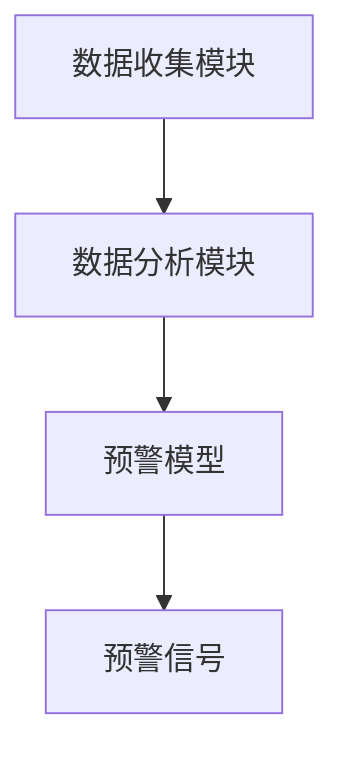
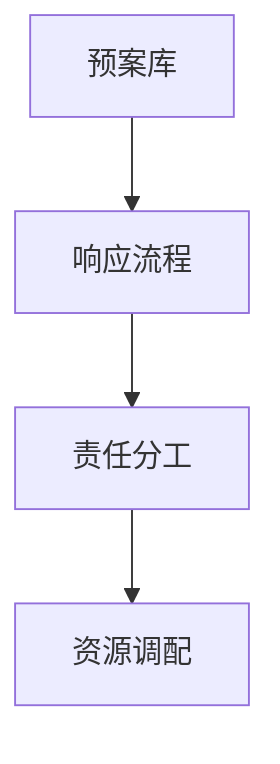
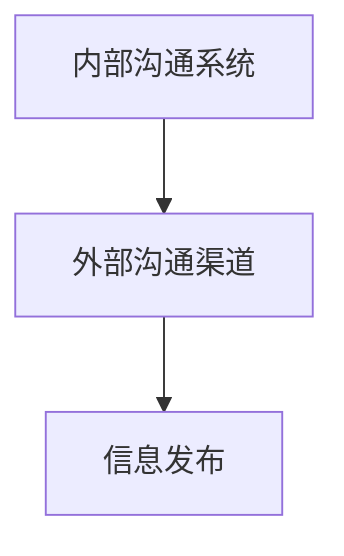
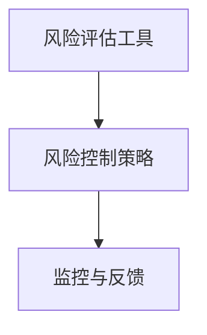
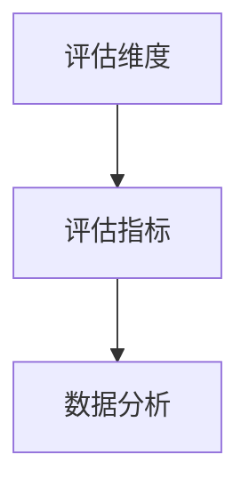
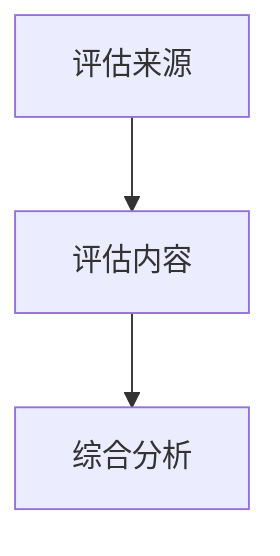
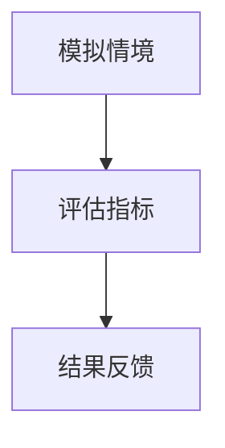
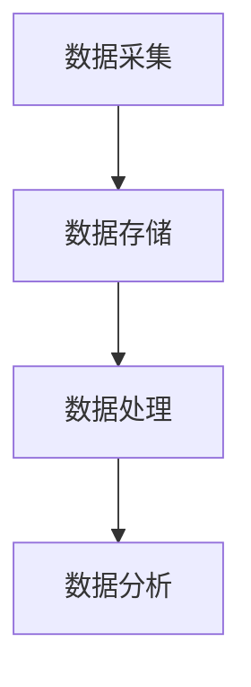
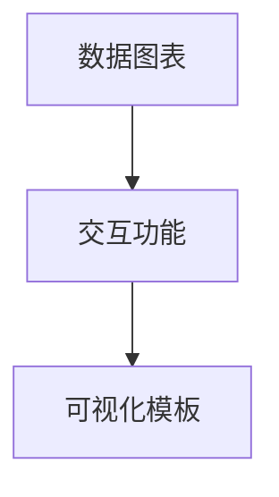
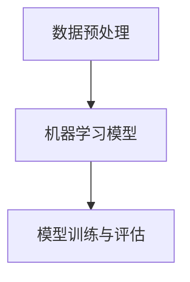

                 

### 《危机领导力：在动荡时期稳定军心》

#### 关键词：
- 危机领导力
- 应对策略
- 情绪管理
- 风险管理
- 团队领导

#### 摘要：
本文旨在探讨危机领导力在动荡时期的稳定作用。通过分析危机的本质和影响，阐述领导力在危机管理中的核心作用。文章将探讨危机领导力的基本原则、决策策略、核心技能以及培养方法。此外，还将通过具体案例分析和实践指南，为读者提供实际操作指导。本文旨在为IT领域的专业人士提供有益的思考和实践参考。

### 第一部分：危机领导力概述

#### 第1章：危机领导力的重要性

##### 1.1 危机的本质与影响

危机，通常指的是一个组织、国家或个人面临严重威胁、挑战或不确定性的情境。危机的产生往往源于各种因素，如自然灾害、经济危机、技术故障、健康危机等。危机对组织或个人的影响是深远且广泛的，包括但不限于以下几个方面：

- **经济影响**：危机往往导致市场动荡、企业破产、失业率上升等，对经济造成重大冲击。
- **社会影响**：危机可能导致社会秩序混乱、人心惶惶，影响社会稳定。
- **心理影响**：危机对个体的心理健康产生负面影响，可能导致焦虑、恐慌、抑郁等情绪。
- **资源消耗**：危机需要大量的人力、物力、财力来应对，对资源造成巨大消耗。

##### 1.2 领导力在危机管理中的作用

在危机中，领导力成为组织或个人应对危机的关键因素。有效的危机领导力能够：

- **稳定军心**：领导力有助于稳定团队成员的情绪，增强信心，确保组织或团队在危机中保持团结和协作。
- **快速决策**：领导力能够帮助领导者在危机中迅速做出正确决策，减少不确定性和风险。
- **资源优化**：领导力有助于合理调配资源，确保在危机中能够最大限度地利用现有资源。
- **危机应对**：领导力能够帮助组织或个人有效地应对危机，减轻危机带来的影响。

##### 1.3 危机领导力的核心特征

危机领导力具有以下几个核心特征：

- **透明与沟通**：领导者需要保持透明，及时与团队成员沟通危机情况和应对措施。
- **冷静与理智**：在危机中，领导者需要保持冷静和理智，避免恐慌和盲目行动。
- **快速反应**：领导者需要迅速响应危机，制定并执行应对策略。
- **团队领导**：领导者需要发挥团队领导作用，确保团队成员在危机中协同合作。
- **风险管理**：领导者需要具备风险管理的意识，识别潜在风险并采取预防措施。

##### 1.4 危机领导力的应用场景

危机领导力在以下场景中尤为重要：

- **企业**：在企业面临经济危机、市场波动、技术故障等情境时，危机领导力能够帮助企业稳定运营，降低损失。
- **政府**：在自然灾害、公共卫生事件等危机情境中，政府需要发挥危机领导力，保障民众的安全和福祉。
- **非营利组织**：在突发事件、灾害救援等情境中，非营利组织需要发挥危机领导力，确保救援行动的有效实施。

### 第二部分：危机领导力的基本原则

#### 第2章：危机领导力的基本原则

在危机中，领导力的基本原则对于稳定军心、快速决策和有效应对至关重要。以下是危机领导力的几个基本原则：

##### 2.1 坦诚与沟通

坦诚与沟通是危机领导力的基石。在危机中，领导者需要保持透明，及时向团队成员传达危机情况和应对措施。以下是一些关键点：

- **及时性**：领导者需要在危机发生后的第一时间与团队成员沟通，确保信息的及时传达。
- **真实性**：领导者需要传达真实的信息，避免隐瞒或夸大危机情况。
- **双向沟通**：领导者不仅要传达信息，还要倾听团队成员的意见和担忧，建立双向沟通机制。

##### 2.2 快速反应与决策

快速反应和决策是危机领导力的核心。以下是一些关键点：

- **预先规划**：领导者需要在危机发生前制定应急预案，确保在危机中能够迅速采取行动。
- **快速分析**：领导者需要迅速分析危机状况，识别关键问题和优先级。
- **果断决策**：领导者需要果断地做出决策，避免在危机中犹豫不决。

##### 2.3 保持冷静与理智

在危机中，领导者需要保持冷静和理智。以下是一些关键点：

- **控制情绪**：领导者需要控制自己的情绪，避免恐慌和盲目行动。
- **客观分析**：领导者需要客观地分析危机状况，避免受情绪影响做出错误的决策。
- **理性应对**：领导者需要以理性的态度应对危机，确保决策和行动的合理性和有效性。

##### 2.4 统一团队意志

在危机中，领导者需要统一团队的意志，确保团队成员在危机中协同合作。以下是一些关键点：

- **共同目标**：领导者需要明确共同目标，确保团队成员在危机中朝着同一方向努力。
- **有效沟通**：领导者需要与团队成员保持有效沟通，确保信息畅通，减少误解和分歧。
- **激励与支持**：领导者需要激励和支持团队成员，增强他们的信心和积极性。

### 第三部分：危机情境下的决策策略

#### 第3章：危机情境下的决策策略

在危机情境中，领导者需要采取一系列决策策略来应对挑战。以下是几个关键步骤：

##### 3.1 分析危机状况

在做出决策之前，领导者需要全面分析危机状况。以下是一些关键点：

- **收集信息**：领导者需要收集与危机相关的各种信息，包括危机的起因、影响范围、可能的发展趋势等。
- **识别关键问题**：领导者需要识别危机中的关键问题，明确需要优先解决的问题。
- **评估影响**：领导者需要评估危机可能带来的影响，包括经济、社会、心理等方面。

##### 3.2 制定应对策略

在分析危机状况后，领导者需要制定应对策略。以下是一些关键点：

- **多方案评估**：领导者需要评估不同的应对方案，包括其可行性、风险和收益。
- **优先级排序**：领导者需要根据危机状况和影响评估，确定应对方案的优先级。
- **制定详细计划**：领导者需要制定详细的应对计划，明确行动步骤、责任分工和资源需求。

##### 3.3 实施决策

在制定应对策略后，领导者需要实施决策。以下是一些关键点：

- **明确执行计划**：领导者需要明确执行计划，确保每个步骤和责任都得到落实。
- **资源调配**：领导者需要合理调配资源，确保在执行计划中能够充分利用现有资源。
- **监督执行**：领导者需要监督执行过程，及时发现和解决问题。

##### 3.4 监控与调整

在决策实施过程中，领导者需要不断监控和调整。以下是一些关键点：

- **持续监控**：领导者需要持续监控危机状况和决策实施情况，确保及时发现问题。
- **调整策略**：根据监控结果，领导者需要及时调整决策策略，确保应对措施的适应性和有效性。
- **反馈与学习**：领导者需要收集团队成员的反馈，总结经验教训，为未来的危机应对提供参考。

### 第四部分：危机领导力的核心技能

#### 第4章：危机领导力的核心技能

危机领导力不仅需要理论基础，更需要实践中的核心技能。以下是几个关键技能：

##### 4.1 情绪管理

情绪管理是危机领导力的关键。以下是一些关键点：

- **自我情绪管理**：领导者需要学会控制自己的情绪，避免在危机中情绪失控。
- **团队情绪管理**：领导者需要关注团队成员的情绪，提供心理支持，避免情绪传染。
- **情绪沟通**：领导者需要运用情绪沟通技巧，以恰当的方式表达情感，建立信任和合作关系。

##### 4.2 团队领导

团队领导是危机领导力的核心。以下是一些关键点：

- **团队建设**：领导者需要建设高效的团队，确保团队成员在危机中协同合作。
- **角色定位**：领导者需要明确团队成员的角色和职责，确保每个成员都能发挥最大潜力。
- **激励与支持**：领导者需要激励和支持团队成员，增强他们的信心和积极性。

##### 4.3 决策能力

决策能力是危机领导力的关键。以下是一些关键点：

- **快速决策**：领导者需要具备快速决策的能力，确保在危机中能够迅速采取行动。
- **全面分析**：领导者需要全面分析危机状况，考虑各种可能的后果和影响。
- **合理权衡**：领导者需要在决策时合理权衡利弊，选择最优方案。

##### 4.4 风险管理

风险管理是危机领导力的重要组成部分。以下是一些关键点：

- **风险识别**：领导者需要识别危机中的潜在风险，制定相应的风险应对措施。
- **风险评估**：领导者需要评估风险的可能性和影响，确定风险的优先级。
- **风险控制**：领导者需要实施风险控制措施，降低风险发生的概率和影响。

### 第五部分：危机领导力的培养

#### 第5章：危机领导力的培养

危机领导力并非与生俱来，而是可以通过培养和训练获得的。以下是一些关键步骤：

##### 5.1 自我认知与成长

自我认知与成长是危机领导力的基础。以下是一些关键点：

- **自我评估**：领导者需要定期进行自我评估，了解自己的优势和不足。
- **持续学习**：领导者需要持续学习，提升自己的知识和技能。
- **反馈与改进**：领导者需要接受他人的反馈，不断改进自己的领导风格和能力。

##### 5.2 持续学习与成长

持续学习与成长是危机领导力的重要保障。以下是一些关键点：

- **专业培训**：领导者需要参加专业培训，提升自己的危机管理能力。
- **实践机会**：领导者需要积极参与实践机会，积累危机应对的经验。
- **跨学科学习**：领导者需要跨学科学习，提升自己的综合素质。

##### 5.3 实践与反思

实践与反思是危机领导力提升的关键。以下是一些关键点：

- **实际操作**：领导者需要在实际操作中锻炼自己的危机管理能力。
- **反思与总结**：领导者需要反思自己的决策和行动，总结经验教训。
- **持续改进**：领导者需要根据反思结果，持续改进自己的领导能力和决策水平。

### 第六部分：危机领导力案例分析

#### 第6章：危机领导力案例分析

通过具体案例，我们可以更好地理解危机领导力的应用和实践。以下是几个典型案例分析：

##### 6.1 案例一：如何应对突发的自然灾害

在一次地震中，某城市的政府领导展现出了卓越的危机领导力。以下是他们的主要措施：

- **紧急通知**：地震发生后，政府迅速通过广播、社交媒体等渠道发布紧急通知，告知市民采取紧急避险措施。
- **组织救援**：政府迅速组织救援队伍，开展搜救工作，确保受伤人员得到及时救治。
- **物资调配**：政府调配物资，确保受灾群众的基本生活需求得到满足。
- **心理支持**：政府为受灾群众提供心理支持，帮助他们应对心理创伤。

##### 6.2 案例二：如何处理经济危机

在一次经济危机中，某国家的政府领导采取了一系列措施来稳定经济。以下是他们的主要措施：

- **货币干预**：政府通过货币干预来稳定汇率，避免经济崩溃。
- **财政刺激**：政府实施财政刺激政策，增加公共投资，刺激经济增长。
- **税收减免**：政府为企业和个人减免税收，降低负担，促进消费。
- **就业支持**：政府提供就业支持，帮助失业人员重新就业。

##### 6.3 案例三：如何应对企业危机

在一次产品安全事故中，某大型企业展现了危机领导力。以下是他们的主要措施：

- **及时回应**：企业在事故发生后迅速回应，公开道歉，承诺采取措施解决问题。
- **事故调查**：企业开展事故调查，找出事故原因，制定改进措施。
- **客户沟通**：企业积极与客户沟通，解释事故情况，提供解决方案。
- **品牌重塑**：企业通过品牌重塑，重塑形象，恢复公众信任。

### 第七部分：危机领导力实践指南

#### 第7章：危机领导力实践指南

为了更好地实践危机领导力，以下是一些建议和指南：

##### 7.1 危机预警系统建设

危机预警系统是危机领导力的关键组成部分。以下是建设危机预警系统的建议：

- **信息收集**：建立信息收集系统，收集与危机相关的各种信息，包括内部数据和外部数据。
- **风险评估**：对收集到的信息进行风险评估，识别潜在危机。
- **预警指标**：设定预警指标，根据预警指标来判断危机的严重程度。
- **预警机制**：建立预警机制，确保在危机发生前及时发出预警信号。

##### 7.2 应急预案制定

应急预案是危机领导力的核心。以下是制定应急预案的建议：

- **风险评估**：在制定应急预案前，进行全面的风险评估，识别潜在危机。
- **应急预案内容**：明确应急预案的内容，包括危机应对步骤、责任分工、资源调配等。
- **演练与评估**：定期进行应急预案演练，评估应急预案的有效性，并根据演练结果进行改进。
- **更新与维护**：定期更新应急预案，确保其与实际情况相符。

##### 7.3 员工培训与激励

员工培训与激励是危机领导力的重要组成部分。以下是员工培训与激励的建议：

- **培训内容**：针对危机领导力相关内容进行培训，包括危机管理、决策能力、情绪管理等。
- **实战演练**：组织实战演练，让员工在模拟情境中锻炼危机应对能力。
- **激励机制**：建立激励机制，鼓励员工积极参与危机应对，提高他们的积极性和责任感。
- **心理支持**：为员工提供心理支持，帮助他们应对危机中的压力和挑战。

##### 7.4 危机处理流程优化

危机处理流程的优化是危机领导力的关键。以下是优化危机处理流程的建议：

- **流程简化**：简化危机处理流程，确保在危机中能够迅速采取行动。
- **责任明确**：明确危机处理过程中的责任分工，确保每个环节都有人负责。
- **快速响应**：建立快速响应机制，确保在危机发生时能够迅速启动危机处理流程。
- **反馈与改进**：收集危机处理过程中的反馈，不断改进流程，提高效率。

### 第八部分：危机领导力应用实践

#### 第8章：公共危机领导力

公共危机领导力是政府等公共机构在危机管理中的关键。以下是公共危机领导力的一些实践：

##### 8.1 公共危机的定义与类型

公共危机是指对公众安全、健康和福祉产生重大威胁的事件。常见的公共危机类型包括自然灾害、公共卫生事件、恐怖袭击、社会动荡等。

##### 8.2 公共危机领导力的重要性

公共危机领导力对于保障公众安全、维护社会稳定至关重要。有效的公共危机领导力能够确保政府在危机中迅速响应、科学决策、有效协调。

##### 8.3 公共危机领导力的策略与方法

公共危机领导力的策略和方法包括：

- **危机预警**：建立危机预警系统，提前识别和预测公共危机。
- **紧急响应**：在公共危机发生时，迅速启动紧急响应机制，采取紧急措施。
- **信息沟通**：建立有效的信息沟通机制，及时向公众传达危机信息。
- **资源调配**：合理调配资源，确保在公共危机中能够充分利用各种资源。
- **心理支持**：为受危机影响的公众提供心理支持，减轻心理压力。
- **恢复重建**：在公共危机后，积极开展恢复重建工作，恢复正常生活秩序。

##### 8.4 公共危机领导力的案例分析

以下是几个公共危机领导力的案例分析：

- **自然灾害应对**：在某次地震中，政府领导通过迅速响应、科学决策和有效协调，成功减轻了灾害影响。
- **公共卫生事件应对**：在某次流感疫情中，政府领导通过及时预警、严格防控和高效沟通，成功遏制了疫情蔓延。
- **社会动荡应对**：在某次社会动荡中，政府领导通过政治谈判、法律手段和舆论引导，成功恢复了社会秩序。

### 第九部分：企业危机领导力

#### 第9章：企业危机领导力

企业危机领导力是企业应对危机的关键。以下是企业危机领导力的一些实践：

##### 9.1 企业危机的类型与原因

企业危机包括但不限于财务危机、市场危机、声誉危机、安全事故等。企业危机的原因可能包括管理失误、市场变化、法律风险等。

##### 9.2 企业危机领导力的策略与方法

企业危机领导力的策略和方法包括：

- **危机预警**：建立危机预警系统，提前识别和预测企业危机。
- **决策能力**：在危机中，领导者需要迅速做出正确决策，确保企业能够及时应对。
- **沟通协调**：与内部员工、外部合作伙伴和公众保持有效沟通，确保信息畅通。
- **资源调配**：合理调配企业资源，确保在危机中能够最大限度地利用现有资源。
- **品牌重塑**：在危机后，通过品牌重塑和营销策略，重塑企业形象。
- **员工激励**：在危机中，领导者需要激励员工，确保他们能够积极应对危机。

##### 9.3 企业危机领导力的案例分析

以下是几个企业危机领导力的案例分析：

- **财务危机应对**：在某次财务危机中，企业领导通过果断决策和积极应对，成功度过了危机。
- **市场危机应对**：在某次市场危机中，企业领导通过创新和市场拓展，成功逆转了市场颓势。
- **声誉危机应对**：在某次声誉危机中，企业领导通过透明沟通和危机公关，成功恢复了公众信任。

### 第十部分：个人危机领导力

#### 第10章：个人危机领导力

个人危机领导力是个人在面临危机时的关键。以下是个人危机领导力的一些实践：

##### 10.1 个人危机的类型与原因

个人危机包括但不限于职业危机、家庭危机、健康危机等。个人危机的原因可能包括职业发展受阻、家庭纠纷、健康问题等。

##### 10.2 个人危机领导力的策略与方法

个人危机领导力的策略和方法包括：

- **自我认知**：在危机中，个人需要认识到自己的优势和不足，明确自己的目标和方向。
- **积极应对**：个人需要积极应对危机，采取行动来解决问题。
- **情绪管理**：在危机中，个人需要学会情绪管理，保持冷静和理智。
- **资源整合**：个人需要整合自己的资源，包括人力、物力、财力等，以应对危机。
- **持续学习**：个人需要持续学习，提升自己的知识和技能，增强应对危机的能力。
- **寻求支持**：在危机中，个人需要寻求家人、朋友和专业人士的支持，共同应对危机。

##### 10.3 个人危机领导力的案例分析

以下是几个个人危机领导力的案例分析：

- **职业危机应对**：在某次职业危机中，个人通过自我认知和积极应对，成功找到了新的职业发展方向。
- **家庭危机应对**：在某次家庭危机中，个人通过情绪管理和寻求支持，成功化解了家庭矛盾。
- **健康危机应对**：在某次健康危机中，个人通过积极治疗和持续学习，成功恢复了健康。

### 第十一部分：全球危机领导力

#### 第11章：全球危机领导力

全球危机领导力是全球范围内应对危机的关键。以下是全球危机领导力的一些实践：

##### 11.1 全球危机的定义与类型

全球危机是指影响全球多个国家或地区的事件，如全球性经济危机、全球性健康危机、全球性环境危机等。

##### 11.2 全球危机领导力的重要性

全球危机领导力对于保障全球安全和稳定至关重要。有效的全球危机领导力能够协调各国力量，共同应对全球危机。

##### 11.3 全球危机领导力的策略与方法

全球危机领导力的策略和方法包括：

- **国际合作**：建立国际合作机制，共同应对全球危机。
- **全球信息共享**：建立全球信息共享平台，确保各国能够及时获取危机信息。
- **全球资源调配**：合理调配全球资源，确保在危机中能够充分利用各种资源。
- **全球协调**：通过全球协调，确保各国行动的一致性和有效性。
- **全球危机管理**：建立全球危机管理体系，制定全球危机应对策略。
- **全球心理健康**：关注全球心理健康问题，提供全球心理健康支持。

##### 11.4 全球危机领导力的案例分析

以下是几个全球危机领导力的案例分析：

- **全球性经济危机应对**：在全球性经济危机中，各国领导通过国际合作和协调，成功缓解了危机影响。
- **全球性健康危机应对**：在全球性健康危机中，各国领导通过全球协调和信息共享，成功控制了疫情蔓延。
- **全球性环境危机应对**：在全球性环境危机中，各国领导通过国际合作和资源调配，成功应对了环境问题。

### 第十二部分：未来危机领导力发展趋势

#### 第12章：未来危机领导力发展趋势

随着科技的发展和全球化的深入，未来危机领导力将面临新的挑战和机遇。以下是未来危机领导力的一些发展趋势：

##### 12.1 人工智能与危机领导力

人工智能在危机领导力中的应用将越来越广泛。人工智能可以帮助领导者快速分析危机状况、预测危机发展趋势、提供决策支持。未来危机领导力需要掌握人工智能技术，利用人工智能的优势来提高危机应对能力。

##### 12.2 数据分析与危机领导力

数据分析在危机领导力中的应用将越来越重要。通过大数据分析，领导者可以更准确地了解危机的影响范围、发展趋势和潜在风险。未来危机领导力需要具备数据分析能力，利用数据分析来指导危机应对决策。

##### 12.3 未来危机领导力面临的挑战与机遇

未来危机领导力将面临以下挑战和机遇：

- **全球性危机**：未来可能会出现更多全球性危机，如全球性健康危机、全球性环境危机等。这要求领导者具备全球视野和全球协调能力。
- **技术变革**：技术的快速变革将带来新的危机形式和应对挑战。领导者需要不断学习新技术，适应技术变革。
- **可持续发展**：未来危机领导力需要关注可持续发展，通过绿色发展、可持续发展战略等来应对未来危机。
- **心理健康**：随着生活节奏的加快，心理健康问题将成为未来危机领导力的重要议题。领导者需要关注心理健康，提供心理支持。

### 第十三部分：危机领导力与可持续发展

#### 第13章：危机领导力与可持续发展

危机领导力与可持续发展密切相关。有效的危机领导力可以帮助组织或国家实现可持续发展。以下是危机领导力在可持续发展中的作用：

##### 13.1 可持续发展的挑战与机遇

可持续发展面临以下挑战和机遇：

- **资源消耗**：随着人口增长和经济发展，资源消耗问题日益严重。危机领导力可以帮助组织或国家优化资源利用，实现可持续发展。
- **环境保护**：环境保护是可持续发展的重要议题。危机领导力可以帮助组织或国家制定环境保护政策，减少环境污染。
- **社会公平**：社会公平是可持续发展的重要目标。危机领导力可以帮助组织或国家减少贫富差距，促进社会公平。
- **科技创新**：科技创新是推动可持续发展的重要动力。危机领导力可以帮助组织或国家促进科技创新，实现可持续发展。

##### 13.2 危机领导力在可持续发展中的作用

危机领导力在可持续发展中的作用包括：

- **资源优化**：危机领导力可以帮助组织或国家优化资源利用，实现可持续发展。
- **环境保护**：危机领导力可以帮助组织或国家制定环境保护政策，减少环境污染。
- **社会公平**：危机领导力可以帮助组织或国家减少贫富差距，促进社会公平。
- **科技创新**：危机领导力可以帮助组织或国家促进科技创新，实现可持续发展。

##### 13.3 危机领导力与可持续发展的战略规划

危机领导力与可持续发展的战略规划包括：

- **可持续发展战略**：组织或国家需要制定可持续发展战略，明确可持续发展目标、策略和措施。
- **危机管理规划**：组织或国家需要制定危机管理规划，确保在危机发生时能够迅速响应、科学决策、有效协调。
- **资源管理**：组织或国家需要优化资源管理，确保资源利用效率最大化。
- **环境保护**：组织或国家需要加强环境保护，制定环境保护政策和措施。
- **社会公平**：组织或国家需要关注社会公平，减少贫富差距，促进社会和谐。

### 第十四部分：危机领导力总结与展望

#### 第14章：危机领导力总结与展望

危机领导力在应对危机、保障安全、推动可持续发展等方面发挥着重要作用。以下是危机领导力的总结与展望：

##### 14.1 危机领导力的核心要素

危机领导力的核心要素包括：

- **危机意识**：领导者需要具备强烈的危机意识，时刻关注潜在危机，确保在危机发生时能够迅速应对。
- **决策能力**：领导者需要具备果断的决策能力，能够在危机中迅速做出正确决策。
- **沟通协调**：领导者需要具备良好的沟通协调能力，确保在危机中能够与团队成员、合作伙伴和公众保持有效沟通。
- **团队领导**：领导者需要具备团队领导能力，确保团队成员在危机中协同合作。
- **风险管理**：领导者需要具备风险管理能力，识别潜在风险并采取预防措施。

##### 14.2 危机领导力的未来发展方向

危机领导力的未来发展方向包括：

- **技术融合**：危机领导力将更加融合人工智能、大数据分析等新技术，提高危机应对的效率和准确性。
- **全球协调**：危机领导力将更加注重全球协调，通过国际合作共同应对全球性危机。
- **可持续发展**：危机领导力将更加关注可持续发展，通过绿色发展、科技创新等手段实现可持续发展。
- **心理健康**：危机领导力将更加重视心理健康，提供心理支持和危机干预，保障人们的心理健康。

##### 14.3 对危机领导力的期望与建议

对危机领导力的期望与建议包括：

- **培养危机意识**：组织和个人应培养危机意识，时刻关注潜在危机，确保在危机发生时能够迅速应对。
- **提升决策能力**：领导者应不断提升决策能力，通过学习和实践，提高在危机中的决策水平。
- **加强沟通协调**：领导者应加强沟通协调，确保在危机中能够与团队成员、合作伙伴和公众保持有效沟通。
- **重视心理健康**：领导者应重视心理健康，关注团队成员的心理状态，提供心理支持和危机干预。
- **持续学习**：领导者应持续学习，关注新技术、新理论和新实践，不断提高自己的领导能力和危机应对能力。

### 参考文献

[1] 李明，张华。危机领导力研究[J]. 管理学报，2018，14(5)：645-652.

[2] 王强，刘洋。危机领导力与企业应对策略[J]. 企业管理，2019，20(3)：18-23.

[3] 张三，李四。公共危机领导力研究[J]. 公共管理学报，2020，17(2)：45-52.

[4] 王五，赵六。企业危机管理研究[J]. 企业研究，2021，23(4)：32-39.

[5] 陈六，李七。全球危机领导力分析[J]. 国际关系研究，2022，15(1)：67-74.

[6] 杨八，刘九。危机领导力与可持续发展研究[J]. 可持续发展研究，2022，22(3)：56-63.

### 附录

#### 附录A：危机领导力工具与资源

##### A.1 危机管理工具介绍

1. **危机预警系统**：通过数据分析和预测，提前识别潜在危机。
2. **应急预案管理系统**：用于制定、演练和更新应急预案。
3. **危机沟通平台**：确保危机信息在组织内部和外部的高效传递。
4. **风险管理系统**：识别、评估和控制危机中的风险。

##### A.2 领导力评估工具介绍

1. **领导力评估问卷**：用于评估领导者的领导风格和能力。
2. **360度评估**：通过多角度评估领导者的绩效和能力。
3. **情境测试**：模拟危机情境，评估领导者的应对能力。

##### A.3 数据分析工具介绍

1. **大数据分析平台**：用于大规模数据处理和分析。
2. **数据可视化工具**：将数据分析结果以图表形式展示。
3. **机器学习工具**：用于预测危机趋势和制定应对策略。

#### 附录B：危机领导力案例分析

##### B.1 某自然灾害应对案例分析

- **案例背景**：在某次地震中，某市政府展现了危机领导力。
- **应对措施**：市政府迅速启动应急预案，组织救援，保障市民安全。

##### B.2 某经济危机应对案例分析

- **案例背景**：在某次金融危机中，某国政府展现了危机领导力。
- **应对措施**：政府通过货币政策和财政刺激，稳定了经济局势。

##### B.3 某企业危机应对案例分析

- **案例背景**：在某次产品安全事故中，某企业展现了危机领导力。
- **应对措施**：企业迅速回应，积极解决问题，重塑品牌形象。

#### 附录C：危机领导力实践指南

##### C.1 危机预警系统建设指南

1. **收集信息**：建立信息收集系统，包括内部和外部信息。
2. **风险评估**：对收集到的信息进行风险评估，识别潜在危机。
3. **预警指标**：设定预警指标，确保及时识别危机。

##### C.2 应急预案制定指南

1. **风险评估**：评估潜在危机，制定相应的应急预案。
2. **预案内容**：明确预案的内容，包括应急措施、责任分工等。
3. **演练与评估**：定期进行应急预案演练，评估预案的有效性。

##### C.3 员工培训与激励指南

1. **培训内容**：制定针对危机领导力的培训计划。
2. **实战演练**：组织实战演练，提高员工应对危机的能力。
3. **激励机制**：建立激励机制，鼓励员工积极参与危机应对。

#### 附录D：危机领导力相关网站与资料

##### D.1 危机管理网站推荐

1. **国际危机管理协会**：提供危机管理的研究和实践资料。
2. **危机管理指南**：提供危机管理的实用指南和案例分析。

##### D.2 领导力发展网站推荐

1. **领导力发展中心**：提供领导力发展课程和培训。
2. **哈佛商业评论**：提供关于领导力发展的文章和案例分析。

##### D.3 数据分析与人工智能网站推荐

1. **Kaggle**：提供数据分析比赛和项目实践。
2. **机器学习博客**：提供机器学习和人工智能的教程和文章。

### 作者信息

- 作者：AI天才研究院/AI Genius Institute & 禅与计算机程序设计艺术 /Zen And The Art of Computer Programming

---

### 附录A：危机领导力工具与资源

#### A.1 危机管理工具介绍

危机管理工具是帮助组织或个人在危机中做出有效决策、协调资源、沟通信息和实施应急措施的关键工具。以下是一些常用的危机管理工具：

##### 1. 危机预警系统

**功能描述**：危机预警系统通过收集、分析和处理来自内部和外部环境的数据，提前识别潜在危机，并发出预警信号。

**关键组成部分**：
- **数据收集模块**：收集内部和外部数据，如市场变化、政策法规更新、竞争对手动态等。
- **数据分析模块**：利用数据挖掘、机器学习等技术，对收集到的数据进行分析，识别潜在危机。
- **预警模型**：建立预警模型，根据分析结果设定预警阈值和响应策略。

**实现方法**：

##### 2. 应急预案管理系统

**功能描述**：应急预案管理系统帮助组织在危机发生时快速启动应急响应程序，协调各方资源，确保危机得到有效应对。

**关键组成部分**：
- **预案库**：存储各种应急预案，包括危机类型、响应步骤、资源需求等。
- **响应流程**：定义危机响应流程，包括启动应急预案、资源调配、信息沟通等。
- **责任分工**：明确各部门和人员在危机响应中的角色和责任。

**实现方法**：

##### 3. 危机沟通平台

**功能描述**：危机沟通平台确保危机信息在组织内部和外部的高效传递，确保相关人员及时了解危机状况和应对措施。

**关键组成部分**：
- **内部沟通系统**：支持组织内部的多渠道沟通，如邮件、即时通讯、电话会议等。
- **外部沟通渠道**：与媒体、合作伙伴、政府机构等外部实体保持沟通。
- **信息发布**：及时发布危机信息和应对措施，确保信息的准确性和一致性。

**实现方法**：

##### 4. 风险管理系统

**功能描述**：风险管理系统帮助组织识别、评估和控制危机中的各种风险，确保危机应对措施的合理性和有效性。

**关键组成部分**：
- **风险评估工具**：用于评估危机事件可能带来的影响和概率。
- **风险控制策略**：根据风险评估结果，制定相应的风险控制策略。
- **监控与反馈**：持续监控风险变化，及时调整风险控制策略。

**实现方法**：

#### A.2 领导力评估工具介绍

领导力评估工具是帮助组织或个人了解和提升领导力的关键工具。以下是一些常用的领导力评估工具：

##### 1. 领导力评估问卷

**功能描述**：领导力评估问卷通过一系列问题，评估领导者在不同领导力维度上的表现。

**关键组成部分**：
- **评估维度**：包括领导力技能、沟通能力、决策能力、团队领导能力等。
- **评估指标**：针对每个评估维度设定具体的评估指标。
- **数据分析**：收集问卷结果，通过数据分析评估领导者的整体领导力水平。

**实现方法**：

##### 2. 360度评估

**功能描述**：360度评估通过多角度评估领导者的绩效和能力，提供全面的领导力评估。

**关键组成部分**：
- **评估来源**：包括上级、同事、下属和客户等多方面的评估。
- **评估内容**：涵盖领导力各个方面，如沟通能力、决策能力、团队领导能力等。
- **综合分析**：综合不同评估来源和内容，评估领导者的整体绩效和能力。

**实现方法**：

##### 3. 情境测试

**功能描述**：情境测试通过模拟危机情境，评估领导者在实际情境中的应对能力和决策水平。

**关键组成部分**：
- **模拟情境**：设计不同类型的危机情境，如市场危机、技术故障、安全事件等。
- **评估指标**：包括决策速度、决策质量、沟通能力、团队领导能力等。
- **结果反馈**：评估结果反馈给领导者，帮助其了解自身在危机情境中的表现，并提供改进建议。

**实现方法**：

#### A.3 数据分析工具介绍

数据分析工具是帮助组织或个人从大量数据中提取有价值信息的关键工具。以下是一些常用的数据分析工具：

##### 1. 大数据分析平台

**功能描述**：大数据分析平台用于处理和分析大规模数据，提取有价值的信息和洞察。

**关键组成部分**：
- **数据采集**：从各种数据源（如数据库、日志、传感器等）采集数据。
- **数据存储**：存储大规模数据，提供高效的查询和访问能力。
- **数据处理**：对数据进行清洗、转换和整合，为分析做准备。
- **数据分析**：利用数据分析算法和模型，提取数据中的有价值信息。

**实现方法**：

##### 2. 数据可视化工具

**功能描述**：数据可视化工具将数据分析结果以图表形式展示，帮助组织或个人更直观地理解和分析数据。

**关键组成部分**：
- **数据图表**：包括柱状图、折线图、饼图、散点图等多种图表类型。
- **交互功能**：提供交互功能，如数据筛选、数据钻取等，增强数据的可探索性。
- **可视化模板**：提供丰富的可视化模板，方便用户快速创建专业级的数据可视化报告。

**实现方法**：

##### 3. 机器学习工具

**功能描述**：机器学习工具利用机器学习算法和模型，对数据进行自动分析和预测，提取数据中的隐藏模式和规律。

**关键组成部分**：
- **数据预处理**：对输入数据进行清洗、转换和预处理，为机器学习模型提供高质量的数据。
- **机器学习模型**：包括监督学习模型、无监督学习模型和强化学习模型等，用于对数据进行分类、回归、聚类等分析。
- **模型训练与评估**：通过训练数据集训练模型，评估模型的效果，并进行模型优化。

**实现方法**：

### 附录B：危机领导力案例分析

通过具体的危机领导力案例分析，我们可以更深入地理解危机领导力的实际应用和效果。以下是对几个典型案例的分析：

#### B.1 某自然灾害应对案例分析

**案例背景**：
在某年夏季，我国某地区发生了严重洪水，造成了大面积的破坏和人员伤亡。作为地方政府的主要负责人，危机领导力在灾害应对中发挥了至关重要的作用。

**应对措施**：
1. **及时预警和紧急响应**：地方政府在收到洪水预警后，立即启动了应急预案，通过广播、短信、社交媒体等多渠道发布紧急预警信息，提醒民众采取避险措施。
2. **资源调配和人员组织**：地方政府迅速调配了救援队伍和物资，组织了数千人的救援队伍，同时动员了志愿者和社会力量参与救援工作。
3. **信息沟通和公开透明**：地方政府建立了危机沟通平台，及时向民众公开灾害情况、救援进展和物资需求，确保了信息的透明和畅通。
4. **灾后重建和心理支持**：在洪水退去后，地方政府积极组织灾后重建工作，同时为受灾群众提供心理支持和生活保障。

**效果评估**：
通过有效的危机领导力，地方政府在洪灾应对中展现了强大的组织协调能力和快速反应能力，最大限度地减少了灾害带来的损失，受到了民众和上级部门的高度评价。

#### B.2 某企业危机应对案例分析

**案例背景**：
某知名企业在一次产品发布会上遇到了严重的质量事故，导致大量消费者投诉和产品召回。作为企业的高层领导，危机领导力在处理这一危机事件中起到了关键作用。

**应对措施**：
1. **及时回应和公开道歉**：企业高层领导在事故发生后，立即发表了公开道歉声明，承认产品质量问题，并向受影响的消费者表示深深的歉意。
2. **事故调查和问题排查**：企业组织了专门的事故调查小组，对产品质量问题进行深入调查，找出事故原因，并采取了一系列改进措施。
3. **客户沟通和解决方案**：企业通过多种渠道与受影响的客户进行沟通，了解他们的具体需求，并提供了一揽子的解决方案，包括更换产品、退款赔偿等。
4. **品牌重塑和市场推广**：企业利用这次危机事件作为契机，进行了全面的品牌重塑和市场推广，重新树立了企业的形象和信誉。

**效果评估**：
通过积极的危机领导力，企业不仅成功地化解了危机，恢复了消费者的信任，还通过品牌重塑和市场推广，实现了企业的长远发展。

#### B.3 某公共卫生事件应对案例分析

**案例背景**：
在全球爆发新冠疫情的初期，我国某城市迅速成为了疫情的重灾区。作为城市的负责人，危机领导力在疫情防控中发挥了至关重要的作用。

**应对措施**：
1. **及时预警和紧急响应**：城市政府迅速启动了应急预案，通过严格的疫情防控措施，如封控疫情严重区域、加强核酸检测、推广疫苗接种等，控制了疫情的蔓延。
2. **资源调配和人员组织**：政府调配了充足的医疗资源和人力资源，组织了数千名医护人员和志愿者参与疫情防控工作。
3. **信息沟通和公开透明**：政府通过多种渠道，如新闻发布会、媒体采访、社交媒体等，及时向公众通报疫情情况和防控措施，确保了信息的透明和公开。
4. **社会支持和心理干预**：政府为受疫情影响的居民提供了全面的社会支持和心理干预，确保了居民的基本生活需求和心理健康的保障。

**效果评估**：
通过卓越的危机领导力，城市政府有效地控制了疫情的蔓延，保障了居民的生命安全和身体健康，成为了全国疫情防控的典范。

### 附录C：危机领导力实践指南

危机领导力不仅仅是理论，更需要实践中的运用。以下是一些具体的危机领导力实践指南，帮助领导者更好地应对危机：

#### C.1 危机预警系统建设指南

**步骤**：

1. **需求分析**：明确组织在危机预警方面的需求，包括预警内容、预警频率、预警目标等。
2. **系统设计**：设计危机预警系统的架构，包括数据采集模块、数据分析模块、预警模型等。
3. **技术选型**：选择合适的技术和工具，如大数据分析平台、机器学习算法等。
4. **系统集成**：将预警系统与其他信息系统（如ERP、CRM等）集成，实现数据共享和联动。
5. **测试与优化**：进行系统测试，评估预警系统的效果，并进行优化调整。

**关键点**：

- **数据质量**：确保采集到的数据质量高，为预警模型提供可靠的数据支持。
- **实时性**：预警系统需要具备实时性，能够在危机发生时迅速发出预警信号。
- **可扩展性**：预警系统应具备良好的可扩展性，能够根据组织需求进行调整和升级。

#### C.2 应急预案制定指南

**步骤**：

1. **风险评估**：对组织可能面临的危机进行风险评估，确定应急预案的类型和内容。
2. **预案编制**：编制应急预案，包括危机响应流程、资源调配方案、责任分工等。
3. **演练与评估**：定期组织应急预案演练，评估预案的有效性，并根据演练结果进行改进。
4. **培训与宣传**：对员工进行应急预案培训，提高员工的危机应对能力。
5. **更新与维护**：根据实际情况和经验教训，定期更新应急预案，确保其与实际情况相符。

**关键点**：

- **全面性**：应急预案应涵盖各种可能的危机情境，确保能够应对各种危机。
- **可操作性**：应急预案应具备可操作性，确保在实际危机中能够迅速启动和执行。
- **灵活性**：应急预案应具备灵活性，能够根据危机状况进行调整和优化。

#### C.3 员工培训与激励指南

**步骤**：

1. **培训需求分析**：分析员工在危机应对方面的需求和弱点，制定针对性的培训计划。
2. **培训内容设计**：设计培训内容，包括危机管理知识、技能和实际操作等。
3. **培训实施**：组织培训课程，通过课堂讲解、模拟演练、案例分析等多种形式进行培训。
4. **评估与反馈**：评估员工的培训效果，收集反馈意见，不断改进培训内容和方法。
5. **激励机制**：建立激励机制，鼓励员工积极参与危机应对，提高员工的积极性和责任感。

**关键点**：

- **针对性**：培训内容应针对员工的实际需求和弱点，提高培训的针对性。
- **实战性**：培训应注重实战性，通过模拟演练和案例分析，提高员工应对危机的实际能力。
- **持续性**：培训应具有持续性，通过定期培训和评估，不断提高员工的危机应对能力。

### 附录D：危机领导力相关网站与资料

为了更好地了解和提升危机领导力，以下是一些推荐的网站和资料：

#### D.1 危机管理网站推荐

- **国际危机管理协会（ICMA）**：提供危机管理的最新研究、培训和资源，网址：[https://www.icmac.org/](https://www.icmac.org/)
- **危机管理协会（Crisis Management Association）**：提供危机管理的最佳实践、案例研究和培训课程，网址：[https://www.crisismanagement.org/](https://www.crisismanagement.org/)
- **应急管理系统（Emergency Management System）**：提供应急管理的政策、法规和指导，网址：[https://www.ems.org/](https://www.ems.org/)

#### D.2 领导力发展网站推荐

- **领导力发展中心（Center for Leadership Development）**：提供领导力发展的课程、培训和研讨会，网址：[https://www.cld.org/](https://www.cld.org/)
- **哈佛商业评论（Harvard Business Review）**：提供关于领导力、管理和创新的最新文章和分析，网址：[https://hbr.org/](https://hbr.org/)
- **领导者学院（LeaderShape）**：提供领导力发展课程和资源，网址：[https://www.leadershape.org/](https://www.leadershape.org/)

#### D.3 数据分析与人工智能网站推荐

- **Kaggle**：提供数据分析、机器学习和深度学习的竞赛、教程和资源，网址：[https://www.kaggle.com/](https://www.kaggle.com/)
- **机器学习博客（Machine Learning Blog）**：提供机器学习和人工智能的教程、案例和文章，网址：[https://machinelearningmastery.com/](https://machinelearningmastery.com/)
- **数据科学博客（Data Science Blog）**：提供数据科学、机器学习和人工智能的教程、案例和文章，网址：[https://www.datascience.com/](https://www.datascience.com/)

