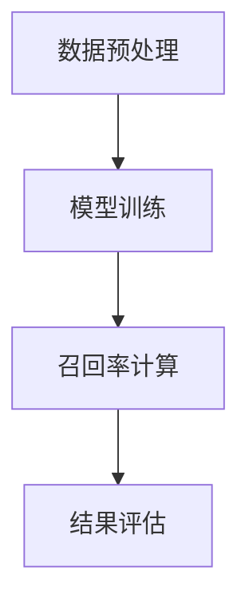

                 

### {文章标题}

> {关键词：召回率、Recall、信息检索、机器学习、文本处理、推荐系统、搜索引擎}

> {摘要：本文将深入探讨召回率Recall的概念、原理及其在不同应用场景下的实现。通过详细的理论讲解、数学模型解析、以及代码实例分析，帮助读者全面理解并掌握召回率Recall的核心技术与实际应用。}

## 目录大纲：召回率Recall原理与代码实例讲解

### 第一部分：召回率Recall基础理论

#### 第1章：召回率Recall的概念与意义
##### 1.1.1 召回率Recall的定义
##### 1.1.2 召回率Recall的重要性
##### 1.1.3 召回率Recall的分类

#### 第2章：召回率Recall的数学原理
##### 2.1.1 概率论基础
##### 2.1.2 信息论基础
##### 2.1.3 召回率Recall的计算公式

#### 第3章：召回率Recall的Mermaid流程图
##### 3.1.1 数据预处理流程
##### 3.1.2 模型训练流程
##### 3.1.3 召回率计算流程

#### 第4章：常见召回率Recall算法原理
##### 4.1.1 基于集合的召回率算法
##### 4.1.2 基于模型的召回率算法
##### 4.1.3 基于图论的召回率算法

#### 第5章：召回率Recall在文本处理中的应用
##### 5.1.1 文本预处理技术
##### 5.1.2 文本相似度计算方法
##### 5.1.3 文本分类中的召回率优化

#### 第6章：召回率Recall在推荐系统中的应用
##### 6.1.1 推荐系统的基本概念
##### 6.1.2 基于内容的推荐算法
##### 6.1.3 基于协同过滤的推荐算法
##### 6.1.4 召回率Recall在推荐系统中的实现

#### 第7章：召回率Recall在搜索引擎中的应用
##### 7.1.1 搜索引擎的基本概念
##### 7.1.2 搜索引擎的工作流程
##### 7.1.3 召回率Recall在搜索引擎中的优化策略

### 第二部分：召回率Recall代码实例讲解

#### 第8章：代码环境搭建与准备
##### 8.1.1 Python环境搭建
##### 8.1.2 依赖库安装
##### 8.1.3 数据集获取与预处理

#### 第9章：基于集合的召回率算法实现
##### 9.1.1 基于集合的召回率算法原理
##### 9.1.2 代码实现与解读

#### 第10章：基于模型的召回率算法实现
##### 10.1.1 基于模型的召回率算法原理
##### 10.1.2 代码实现与解读

#### 第11章：基于图论的召回率算法实现
##### 11.1.1 基于图论的召回率算法原理
##### 11.1.2 代码实现与解读

#### 第12章：文本处理中的召回率优化实例
##### 12.1.1 文本预处理技术实现
##### 12.1.2 文本相似度计算实例
##### 12.1.3 文本分类实例

#### 第13章：推荐系统中的召回率优化实例
##### 13.1.1 基于内容的推荐算法实现
##### 13.1.2 基于协同过滤的推荐算法实现
##### 13.1.3 召回率优化实例

#### 第14章：搜索引擎中的召回率优化实例
##### 14.1.1 搜索引擎工作流程实现
##### 14.1.2 召回率优化策略实现

#### 第15章：综合实战案例分析
##### 15.1.1 实战项目背景
##### 15.1.2 实战项目目标
##### 15.1.3 实战项目实施流程
##### 15.1.4 实战项目代码解读
##### 15.1.5 实战项目效果分析

#### 第16章：常见问题与解决方案
##### 16.1.1 召回率计算中的常见问题
##### 16.1.2 算法优化中的常见问题
##### 16.1.3 实战项目中的常见问题与解决方案

#### 第17章：未来展望与研究方向
##### 17.1.1 召回率Recall的发展趋势
##### 17.1.2 未来研究方向与挑战
##### 17.1.3 新技术的应用前景

---

接下来，我们将逐步深入探讨召回率Recall的核心概念、原理以及其实际应用。通过理论讲解、数学模型解析和代码实例分析，帮助读者全面理解并掌握召回率Recall的关键技术。

---

### 第一部分：召回率Recall基础理论

召回率Recall是信息检索和机器学习领域中一个重要的性能评价指标。它用于衡量系统能够检索出所有相关文档的能力。本章将介绍召回率Recall的概念与意义、数学原理、以及常见的召回率计算算法。这些基础理论将为后续章节的深入探讨奠定坚实的基础。

#### 第1章：召回率Recall的概念与意义

##### 1.1.1 召回率Recall的定义

召回率Recall是一个评价信息检索系统性能的重要指标，它表示在所有相关文档中，系统能够检索出来的文档数量与所有相关文档总数的比值。其数学定义如下：

$$
Recall = \frac{相关文档数}{所有相关文档数}
$$

其中，相关文档数是指与查询意图相关的文档数量，所有相关文档数是指所有与查询意图相关的文档总数。

##### 1.1.2 召回率Recall的重要性

召回率Recall是一个非常重要的性能指标，它在信息检索、推荐系统和搜索引擎等应用场景中具有广泛的应用。其主要重要性体现在以下几个方面：

1. **全面性**：召回率Recall能够衡量系统在检索所有相关文档方面的表现，确保系统能够尽可能多地检索出与查询意图相关的文档。
2. **用户满意度**：高召回率Recall意味着用户能够更快地找到他们需要的信息，提高用户满意度。
3. **系统优化**：通过召回率Recall的评价，我们可以识别出系统中的问题，并针对性地进行优化，从而提高系统的整体性能。

##### 1.1.3 召回率Recall的分类

召回率Recall可以分为以下几个类别：

1. **全召回率**：在所有相关文档都被检索出来的情况下，召回率为1。这种情况下，系统没有漏检任何相关文档。
2. **部分召回率**：在实际应用中，由于数据限制或算法性能等原因，系统无法检索出所有相关文档。部分召回率则表示系统能够检索出部分相关文档的能力。部分召回率越高，系统的性能越好。
3. **最小召回率**：在系统无法检索出任何相关文档的情况下，召回率为0。这种情况下，系统完全无法满足用户查询需求。

### 第2章：召回率Recall的数学原理

召回率Recall的计算依赖于概率论和信息论的基础知识。本章将介绍召回率Recall的数学原理，包括概率论基础、信息论基础以及召回率Recall的计算公式。

##### 2.1.1 概率论基础

概率论是计算召回率Recall的重要理论基础。在信息检索和机器学习中，我们通常使用概率来描述事件发生的可能性。以下是几个常用的概率公式：

1. **条件概率**：
   $$
   P(A|B) = \frac{P(A \cap B)}{P(B)}
   $$
   其中，$P(A|B)$ 表示在事件B发生的条件下，事件A发生的概率。

2. **贝叶斯定理**：
   $$
   P(A|B) = \frac{P(B|A)P(A)}{P(B)}
   $$
   贝叶斯定理是一种用于计算条件概率的公式，它在信息检索和机器学习中具有重要的应用价值。

##### 2.1.2 信息论基础

信息论是研究信息传输、存储和处理的理论。在信息检索和机器学习中，信息论的一些概念（如信息熵、互信息等）对于理解召回率Recall的计算具有重要意义。

1. **信息熵**：
   $$
   H(X) = -\sum_{i} P(X_i) \log_2 P(X_i)
   $$
   信息熵是衡量随机变量X不确定性的度量，它表示X的平均信息量。

2. **互信息**：
   $$
   I(X; Y) = H(X) - H(X|Y)
   $$
   互信息是衡量两个随机变量X和Y之间相关性的度量，它表示X和Y之间的信息共享量。

##### 2.1.3 召回率Recall的计算公式

召回率Recall的计算公式如下：

$$
Recall = \frac{相关文档数}{所有相关文档数}
$$

其中，相关文档数可以通过以下公式计算：

$$
相关文档数 = \sum_{i} \text{文档}_i \text{的相关度}
$$

文档的相关度可以通过以下公式计算：

$$
相关度 = \frac{P(\text{文档}_i|\text{查询})P(\text{查询})}{P(\text{文档}_i)}
$$

其中，$P(\text{文档}_i|\text{查询})$ 表示在查询条件下，文档i发生的概率，$P(\text{查询})$ 表示查询发生的概率，$P(\text{文档}_i)$ 表示文档i发生的概率。

### 第3章：召回率Recall的Mermaid流程图

为了更好地理解召回率Recall的计算过程，我们可以使用Mermaid流程图来展示其关键步骤。以下是一个简单的召回率Recall计算流程图：



在这个流程图中，我们首先进行数据预处理，然后进行模型训练，接着计算召回率，最后对结果进行评估。

- **数据预处理**：对原始数据进行清洗、去重和格式转换等操作，以便后续的模型训练和召回率计算。
- **模型训练**：使用训练数据对模型进行训练，以便能够对新的查询进行预测。
- **召回率计算**：使用训练好的模型对查询进行预测，并计算召回率。
- **结果评估**：根据召回率评估模型性能，并根据评估结果进行模型优化。

### 第4章：常见召回率Recall算法原理

在实际应用中，有多种算法可以用于计算召回率Recall。这些算法包括基于集合的召回率算法、基于模型的召回率算法和基于图论的召回率算法。本章将介绍这些算法的基本原理和实现方法。

##### 4.1.1 基于集合的召回率算法

基于集合的召回率算法是一种简单且直观的召回率计算方法。它的基本思想是：首先对文档集合进行排序，然后取排序结果中的前K个文档作为检索结果，计算召回率。具体步骤如下：

1. **文档排序**：对文档集合进行排序，排序依据可以是文档的长度、关键词频率等。
2. **取前K个文档**：从排序结果中取前K个文档作为检索结果。
3. **计算召回率**：计算检索结果中包含的相关文档数量与所有相关文档数量的比值。

以下是一个基于集合的召回率算法的伪代码：

```python
def calculate_recall(relevant_docs, all_docs, k):
    # 对文档集合进行排序
    sorted_docs = sorted(all_docs, key=lambda x: x.length, reverse=True)
    
    # 取前K个文档作为检索结果
    retrieved_docs = sorted_docs[:k]
    
    # 计算召回率
    recall = len(set(relevant_docs) & set(retrieved_docs)) / len(relevant_docs)
    
    return recall
```

##### 4.1.2 基于模型的召回率算法

基于模型的召回率算法利用机器学习模型对文档进行分类或排序，然后计算召回率。这种算法能够更好地捕捉文档之间的语义关系，从而提高召回率。常见的基于模型的召回率算法包括基于TF-IDF模型和基于深度学习模型的召回率算法。

1. **基于TF-IDF模型的召回率算法**：

   基于TF-IDF模型的召回率算法利用TF-IDF向量表示文档，并使用余弦相似度计算文档之间的相似度。具体步骤如下：

   - **文档表示**：使用TF-IDF向量表示文档。
   - **相似度计算**：计算查询与文档之间的余弦相似度。
   - **排序**：根据相似度对文档进行排序。
   - **计算召回率**：取排序结果中的前K个文档作为检索结果，计算召回率。

   以下是一个基于TF-IDF模型的召回率算法的伪代码：

   ```python
   def calculate_recall_with_tfidf(corpus, query, k):
       # 使用TF-IDF向量表示文档
       tfidf_vectorizer = TfidfVectorizer()
       corpus_vectors = tfidf_vectorizer.fit_transform(corpus)
       
       # 计算查询与文档之间的余弦相似度
       similarity = cosine_similarity(tfidf_vectorizer.transform([query]), corpus_vectors)
       
       # 根据相似度对文档进行排序
       sorted_indices = np.argsort(-similarity)
       
       # 取前K个文档作为检索结果
       retrieved_docs = [corpus[i] for i in sorted_indices[:k]]
       
       # 计算召回率
       recall = len(set(relevant_docs) & set(retrieved_docs)) / len(relevant_docs)
       
       return recall
   ```

2. **基于深度学习模型的召回率算法**：

   基于深度学习模型的召回率算法使用深度学习模型（如卷积神经网络、循环神经网络等）对文档进行表示和分类。具体步骤如下：

   - **文档表示**：使用深度学习模型对文档进行表示。
   - **分类**：使用深度学习模型对文档进行分类。
   - **排序**：根据分类结果对文档进行排序。
   - **计算召回率**：取排序结果中的前K个文档作为检索结果，计算召回率。

   以下是一个基于深度学习模型的召回率算法的伪代码：

   ```python
   def calculate_recall_with_dnn(corpus, query, k):
       # 使用深度学习模型对文档进行表示
       model = DNNModel()
       model.fit(corpus)
       
       # 使用深度学习模型对文档进行分类
       doc_embeddings = model.encode(corpus)
       
       # 计算查询与文档之间的相似度
       similarity = cosine_similarity(model.encode([query]), doc_embeddings)
       
       # 根据相似度对文档进行排序
       sorted_indices = np.argsort(-similarity)
       
       # 取前K个文档作为检索结果
       retrieved_docs = [corpus[i] for i in sorted_indices[:k]]
       
       # 计算召回率
       recall = len(set(relevant_docs) & set(retrieved_docs)) / len(relevant_docs)
       
       return recall
   ```

##### 4.1.3 基于图论的召回率算法

基于图论的召回率算法利用图结构对文档进行建模，通过计算节点之间的相似性来优化召回率。这种算法能够利用文档之间的结构关系来提高召回率。常见的基于图论的召回率算法包括基于PageRank算法和基于图卷积神经网络的召回率算法。

1. **基于PageRank算法的召回率算法**：

   基于PageRank算法的召回率算法利用PageRank算法计算文档之间的相似性，从而优化召回率。具体步骤如下：

   - **构建图**：将文档表示为图中的节点，文档之间的相似性表示为图中的边。
   - **计算PageRank值**：使用PageRank算法计算文档的权重，即相似性值。
   - **排序**：根据PageRank值对文档进行排序。
   - **计算召回率**：取排序结果中的前K个文档作为检索结果，计算召回率。

   以下是一个基于PageRank算法的召回率算法的伪代码：

   ```python
   def calculate_recall_with_pagerank(corpus, query, k):
       # 构建图
       graph = Graph()
       for doc in corpus:
           graph.add_node(doc)
       
       # 计算文档之间的相似性
       for i, doc_i in enumerate(corpus):
           for j, doc_j in enumerate(corpus):
               similarity = calculate_similarity(doc_i, doc_j)
               graph.add_edge(doc_i, doc_j, similarity)
       
       # 计算PageRank值
       pagerank = pagerank_algorithm(graph)
       
       # 根据PageRank值对文档进行排序
       sorted_indices = np.argsort(-pagerank.values())
       
       # 取前K个文档作为检索结果
       retrieved_docs = [corpus[i] for i in sorted_indices[:k]]
       
       # 计算召回率
       recall = len(set(relevant_docs) & set(retrieved_docs)) / len(relevant_docs)
       
       return recall
   ```

2. **基于图卷积神经网络的召回率算法**：

   基于图卷积神经网络的召回率算法利用图卷积神经网络对文档进行建模，通过学习文档之间的结构关系来提高召回率。具体步骤如下：

   - **构建图**：将文档表示为图中的节点，文档之间的相似性表示为图中的边。
   - **图卷积神经网络建模**：使用图卷积神经网络对文档进行表示。
   - **排序**：根据图卷积神经网络的输出对文档进行排序。
   - **计算召回率**：取排序结果中的前K个文档作为检索结果，计算召回率。

   以下是一个基于图卷积神经网络的召回率算法的伪代码：

   ```python
   def calculate_recall_with_gcn(corpus, query, k):
       # 构建图
       graph = Graph()
       for doc in corpus:
           graph.add_node(doc)
       
       # 计算文档之间的相似性
       for i, doc_i in enumerate(corpus):
           for j, doc_j in enumerate(corpus):
               similarity = calculate_similarity(doc_i, doc_j)
               graph.add_edge(doc_i, doc_j, similarity)
       
       # 使用图卷积神经网络对文档进行表示
       gcn_model = GCNModel()
       gcn_model.fit(graph)
       
       # 根据图卷积神经网络的输出对文档进行排序
       doc_embeddings = gcn_model.encode(corpus)
       similarity = cosine_similarity(doc_embeddings, gcn_model.encode([query]))
       
       # 取前K个文档作为检索结果
       sorted_indices = np.argsort(-similarity)
       retrieved_docs = [corpus[i] for i in sorted_indices[:k]]
       
       # 计算召回率
       recall = len(set(relevant_docs) & set(retrieved_docs)) / len(relevant_docs)
       
       return recall
   ```

### 第5章：召回率Recall在文本处理中的应用

召回率Recall在文本处理中的应用非常广泛，特别是在文本检索、文本分类和文本相似度计算等方面。本章将介绍召回率Recall在文本处理中的应用，包括文本预处理技术、文本相似度计算方法和文本分类中的召回率优化。

##### 5.1.1 文本预处理技术

文本预处理是文本处理中的重要步骤，它包括文本清洗、分词、词干提取和词性标注等操作。文本预处理技术的目的是去除文本中的噪声、统一文本格式和提取有用信息，以提高后续处理步骤的效果。

1. **文本清洗**：文本清洗是去除文本中的噪声和无关信息的过程，包括去除HTML标签、消除特殊字符、去除停用词等。文本清洗可以显著减少文本数据中的冗余信息，提高文本处理的准确性。

2. **分词**：分词是将文本拆分成一个个单词或短语的过程。常见的分词方法包括基于词典的分词方法和基于统计的分词方法。分词的质量直接影响后续文本处理的效果。

3. **词干提取**：词干提取是将一个词转换为其基本形式的过程，例如将“running”、“runs”和“runner”都转换为“run”。词干提取有助于减少文本数据中的词汇数量，提高文本处理效率。

4. **词性标注**：词性标注是将每个词标注为其词性的过程，例如将“apple”标注为名词，“run”标注为动词。词性标注有助于理解文本的语义，从而提高文本分类和相似度计算的效果。

##### 5.1.2 文本相似度计算方法

文本相似度计算是文本处理中的重要任务，它用于衡量两个文本之间的相似程度。常见的文本相似度计算方法包括基于词频的相似度计算方法和基于语义的相似度计算方法。

1. **基于词频的相似度计算方法**：

   基于词频的相似度计算方法通过计算两个文本中共同出现的单词数量来衡量它们的相似程度。常见的方法包括TF-IDF模型和余弦相似度计算方法。

   - **TF-IDF模型**：TF-IDF模型是一种用于文本表示的方法，它通过计算词频（TF）和逆向文档频率（IDF）来衡量单词的重要性。TF-IDF模型能够有效地降低常见单词的影响，突出重要单词。

   - **余弦相似度计算方法**：余弦相似度计算方法是一种用于计算两个向量之间相似度的方法。它通过计算两个向量的余弦值来衡量它们的相似程度。余弦相似度计算方法能够有效地捕捉文本之间的线性关系。

   以下是一个基于TF-IDF模型和余弦相似度计算方法的文本相似度计算示例：

   ```python
   from sklearn.feature_extraction.text import TfidfVectorizer
   from sklearn.metrics.pairwise import cosine_similarity
   
   def calculate_text_similarity(text1, text2):
       # 创建TF-IDF向量表示
       vectorizer = TfidfVectorizer()
       text1_vector = vectorizer.fit_transform([text1])
       text2_vector = vectorizer.transform([text2])
       
       # 计算余弦相似度
       similarity = cosine_similarity(text1_vector, text2_vector)[0][0]
       
       return similarity
   ```

2. **基于语义的相似度计算方法**：

   基于语义的相似度计算方法通过计算文本之间的语义相似度来衡量它们的相似程度。常见的方法包括词嵌入模型和语义相似度计算方法。

   - **词嵌入模型**：词嵌入模型是一种将单词映射为向量的方法，它能够捕捉单词之间的语义关系。常见的词嵌入模型包括Word2Vec和GloVe模型。

   - **语义相似度计算方法**：语义相似度计算方法通过计算词嵌入向量之间的相似度来衡量文本的相似程度。常见的语义相似度计算方法包括余弦相似度和欧氏距离。

   以下是一个基于词嵌入模型和余弦相似度计算方法的文本相似度计算示例：

   ```python
   import numpy as np
   from gensim.models import Word2Vec
   
   def calculate_text_similarity(text1, text2):
       # 训练Word2Vec模型
       model = Word2Vec([text1, text2], vector_size=100, window=5, min_count=1, workers=4)
       
       # 计算文本的词嵌入向量
       text1_vector = np.mean(model.wv[text1], axis=0)
       text2_vector = np.mean(model.wv[text2], axis=0)
       
       # 计算余弦相似度
       similarity = np.dot(text1_vector, text2_vector) / (np.linalg.norm(text1_vector) * np.linalg.norm(text2_vector))
       
       return similarity
   ```

##### 5.1.3 文本分类中的召回率优化

文本分类是将文本数据划分为预定义的类别的过程。在文本分类中，召回率Recall是一个重要的性能指标，它用于衡量系统能够检索出所有相关类别的能力。以下是一些常用的召回率优化技术：

1. **基于集合的召回率优化**：

   基于集合的召回率优化通过调整检索结果中的文档数量来优化召回率。常见的方法包括调整K值、使用不同的排序依据等。

   - **调整K值**：通过调整检索结果中的文档数量K来优化召回率。一般来说，增加K值可以提高召回率，但可能导致准确率下降。

   - **使用不同的排序依据**：通过使用不同的排序依据（如文档长度、关键词频率等）来优化召回率。不同排序依据可能对召回率产生不同的影响。

2. **基于模型的召回率优化**：

   基于模型的召回率优化通过调整模型参数来优化召回率。常见的方法包括调整学习率、正则化参数等。

   - **调整学习率**：通过调整学习率来优化模型性能。较大的学习率可能导致模型过拟合，而较小的学习率可能导致模型欠拟合。

   - **调整正则化参数**：通过调整正则化参数来控制模型复杂度，从而优化召回率。

3. **基于图论的召回率优化**：

   基于图论的召回率优化通过构建文档之间的图结构来优化召回率。常见的方法包括使用图卷积神经网络（GCN）来优化召回率。

   - **使用图卷积神经网络（GCN）**：通过训练图卷积神经网络来学习文档之间的相似性，从而优化召回率。图卷积神经网络能够利用文档之间的结构关系来提高召回率。

   以下是一个基于图卷积神经网络（GCN）的召回率优化示例：

   ```python
   import torch
   import torch.nn as nn
   import torch.optim as optim
   
   class GCNModel(nn.Module):
       def __init__(self, hidden_size):
           super(GCNModel, self).__init__()
           self.fc1 = nn.Linear(hidden_size, hidden_size)
           self.fc2 = nn.Linear(hidden_size, hidden_size)
           self.fc3 = nn.Linear(hidden_size, 1)
       
       def forward(self, x, adj):
           x = F.relu(self.fc1(x))
           x = F.relu(self.fc2(x))
           x = self.fc3(x)
           return x
   
   def train_gcn_model(corpus, labels, hidden_size=100, num_epochs=100):
       # 构建图
       graph = Graph()
       for i, doc in enumerate(corpus):
           graph.add_node(doc)
       
       # 计算文档之间的相似性
       for i, doc_i in enumerate(corpus):
           for j, doc_j in enumerate(corpus):
               similarity = calculate_similarity(doc_i, doc_j)
               graph.add_edge(doc_i, doc_j, similarity)
       
       # 创建GCN模型
       model = GCNModel(hidden_size)
       optimizer = optim.Adam(model.parameters(), lr=0.01)
       criterion = nn.BCELoss()
       
       # 训练GCN模型
       for epoch in range(num_epochs):
           model.train()
           for i, doc in enumerate(corpus):
               # 计算文档的相似度
               doc_similarity = model.forward(graph[doc])
               
               # 计算损失
               loss = criterion(doc_similarity, labels[i])
               
               # 反向传播
               optimizer.zero_grad()
               loss.backward()
               optimizer.step()
           
           print(f"Epoch {epoch+1}/{num_epochs}, Loss: {loss.item()}")
       
       return model
   ```

### 第6章：召回率Recall在推荐系统中的应用

推荐系统是近年来人工智能领域的一个重要应用方向，其目的是根据用户的兴趣和偏好，为用户推荐相关的商品、内容或服务。召回率Recall是推荐系统中一个重要的性能指标，它用于衡量系统能够检索出所有相关推荐项的能力。本章将介绍召回率Recall在推荐系统中的应用，包括推荐系统的基本概念、基于内容的推荐算法、基于协同过滤的推荐算法以及召回率Recall在推荐系统中的实现。

#### 6.1.1 推荐系统的基本概念

推荐系统是一种基于数据挖掘和机器学习技术的系统，它通过分析用户的兴趣和行为，为用户推荐相关的商品、内容或服务。推荐系统通常包括以下几个基本概念：

1. **用户**：推荐系统的核心要素之一，用户可以是个人或组织，他们产生的行为数据是推荐系统的重要输入。
2. **项目**：推荐系统中的推荐对象，可以是商品、内容、服务或其他类型的实体。
3. **行为**：用户在推荐系统中产生的行为数据，如浏览、购买、评价等。行为数据是推荐系统了解用户兴趣和偏好的重要依据。
4. **模型**：推荐系统的核心组件，用于根据用户的行为数据生成推荐结果。常见的推荐模型包括基于内容的推荐模型和基于协同过滤的推荐模型。
5. **评估指标**：用于评估推荐系统性能的指标，常见的评估指标包括准确率（Precision）、召回率（Recall）和F1值等。

#### 6.1.2 基于内容的推荐算法

基于内容的推荐算法是一种根据用户已知的兴趣和偏好，利用内容特征生成推荐列表的推荐算法。基于内容的推荐算法主要基于以下原理：

1. **项目特征表示**：将项目的内容特征（如文本、图像、音频等）表示为向量，以便进行计算和比较。
2. **用户兴趣表示**：根据用户的历史行为或偏好，提取用户兴趣特征，并将其表示为向量。
3. **相似度计算**：计算项目特征向量与用户兴趣向量之间的相似度，通常使用余弦相似度或欧氏距离等距离度量方法。
4. **生成推荐列表**：根据项目特征向量与用户兴趣向量之间的相似度，生成推荐列表，并将相似度较高的项目推荐给用户。

基于内容的推荐算法的优点是简单易实现，且能够根据用户的历史行为生成个性化的推荐列表。但基于内容的推荐算法也存在一些局限性，如无法处理用户行为数据的稀疏性、难以处理多模态数据等。

以下是一个基于内容的推荐算法的简单实现：

```python
from sklearn.feature_extraction.text import TfidfVectorizer
from sklearn.metrics.pairwise import cosine_similarity

def content_based_recommender(corpus, user_history, top_n=5):
    # 创建TF-IDF向量表示
    vectorizer = TfidfVectorizer()
    user_history_vector = vectorizer.fit_transform([user_history])
    corpus_vector = vectorizer.transform(corpus)
    
    # 计算相似度
    similarity = cosine_similarity(user_history_vector, corpus_vector)
    
    # 生成推荐列表
    recommended_indices = np.argsort(-similarity[0])[:top_n]
    recommended_items = [corpus[i] for i in recommended_indices]
    
    return recommended_items
```

#### 6.1.3 基于协同过滤的推荐算法

基于协同过滤的推荐算法是一种根据用户行为数据（如浏览、购买、评价等）生成推荐列表的推荐算法。基于协同过滤的推荐算法主要基于以下原理：

1. **用户相似度计算**：根据用户的行为数据，计算用户之间的相似度，通常使用余弦相似度或欧氏距离等距离度量方法。
2. **项目相似度计算**：根据用户之间的相似度，计算项目之间的相似度，通常使用用户对项目的评分或行为数据来计算相似度。
3. **生成推荐列表**：根据项目相似度，生成推荐列表，并将相似度较高的项目推荐给用户。

基于协同过滤的推荐算法的优点是能够处理用户行为数据的稀疏性，且能够根据用户的行为数据生成个性化的推荐列表。但基于协同过滤的推荐算法也存在一些局限性，如推荐结果可能存在噪声、计算复杂度较高等。

以下是一个基于协同过滤的推荐算法的简单实现：

```python
import numpy as np

def collaborative_filtering_recommender(ratings_matrix, user_id, top_n=5):
    # 计算用户相似度
    similarity_matrix = np.dot(ratings_matrix, ratings_matrix[user_id].T) / (np.linalg.norm(ratings_matrix, axis=1) * np.linalg.norm(ratings_matrix[user_id], axis=0))
    
    # 排序用户相似度
    similarity_sorted_indices = np.argsort(-similarity_matrix)
    
    # 计算推荐列表
    recommended_indices = similarity_sorted_indices[1:top_n+1]
    recommended_ratings = ratings_matrix[user_id][recommended_indices]
    recommended_items = [ratings_matrix.index[i] for i in recommended_indices]
    
    return recommended_items
```

#### 6.1.4 召回率Recall在推荐系统中的实现

召回率Recall是推荐系统中一个重要的性能指标，它用于衡量系统能够检索出所有相关推荐项的能力。在推荐系统中，召回率Recall的计算通常基于实际用户行为数据，具体步骤如下：

1. **数据准备**：收集实际用户行为数据，如用户浏览、购买、评价等数据。
2. **计算召回率**：对于每个用户，计算其实际行为数据与推荐列表中相关推荐项的交集，计算召回率。
3. **评估推荐系统**：根据召回率评估推荐系统的性能，并针对召回率较低的推荐项进行优化。

以下是一个基于实际用户行为数据的召回率计算示例：

```python
from collections import defaultdict

def calculate_recall(actual_behaviors, recommended_items):
    # 计算召回率
    intersection = set(actual_behaviors) & set(recommended_items)
    recall = len(intersection) / len(actual_behaviors)
    
    return recall
```

#### 第6章：召回率Recall在推荐系统中的应用

推荐系统是近年来人工智能领域的一个重要应用方向，其目的是根据用户的兴趣和偏好，为用户推荐相关的商品、内容或服务。召回率Recall是推荐系统中一个重要的性能指标，它用于衡量系统能够检索出所有相关推荐项的能力。本章将介绍召回率Recall在推荐系统中的应用，包括推荐系统的基本概念、基于内容的推荐算法、基于协同过滤的推荐算法以及召回率Recall在推荐系统中的实现。

##### 6.1.1 推荐系统的基本概念

推荐系统是一种基于数据挖掘和机器学习技术的系统，它通过分析用户的兴趣和行为，为用户推荐相关的商品、内容或服务。推荐系统通常包括以下几个基本概念：

- **用户**：推荐系统的核心要素之一，用户可以是个人或组织，他们产生的行为数据是推荐系统的重要输入。
- **项目**：推荐系统中的推荐对象，可以是商品、内容、服务或其他类型的实体。
- **行为**：用户在推荐系统中产生的行为数据，如浏览、购买、评价等。行为数据是推荐系统了解用户兴趣和偏好的重要依据。
- **模型**：推荐系统的核心组件，用于根据用户的行为数据生成推荐结果。常见的推荐模型包括基于内容的推荐模型和基于协同过滤的推荐模型。
- **评估指标**：用于评估推荐系统性能的指标，常见的评估指标包括准确率（Precision）、召回率（Recall）和F1值等。

##### 6.1.2 基于内容的推荐算法

基于内容的推荐算法是一种根据用户已知的兴趣和偏好，利用内容特征生成推荐列表的推荐算法。基于内容的推荐算法主要基于以下原理：

- **项目特征表示**：将项目的内容特征（如文本、图像、音频等）表示为向量，以便进行计算和比较。
- **用户兴趣表示**：根据用户的历史行为或偏好，提取用户兴趣特征，并将其表示为向量。
- **相似度计算**：计算项目特征向量与用户兴趣向量之间的相似度，通常使用余弦相似度或欧氏距离等距离度量方法。
- **生成推荐列表**：根据项目特征向量与用户兴趣向量之间的相似度，生成推荐列表，并将相似度较高的项目推荐给用户。

基于内容的推荐算法的优点是简单易实现，且能够根据用户的历史行为生成个性化的推荐列表。但基于内容的推荐算法也存在一些局限性，如无法处理用户行为数据的稀疏性、难以处理多模态数据等。

以下是一个基于内容的推荐算法的简单实现：

```python
from sklearn.feature_extraction.text import TfidfVectorizer
from sklearn.metrics.pairwise import cosine_similarity

def content_based_recommender(corpus, user_history, top_n=5):
    # 创建TF-IDF向量表示
    vectorizer = TfidfVectorizer()
    user_history_vector = vectorizer.fit_transform([user_history])
    corpus_vector = vectorizer.transform(corpus)
    
    # 计算相似度
    similarity = cosine_similarity(user_history_vector, corpus_vector)
    
    # 生成推荐列表
    recommended_indices = np.argsort(-similarity[0])[:top_n]
    recommended_items = [corpus[i] for i in recommended_indices]
    
    return recommended_items
```

##### 6.1.3 基于协同过滤的推荐算法

基于协同过滤的推荐算法是一种根据用户的行为数据生成推荐列表的推荐算法。基于协同过滤的推荐算法主要基于以下原理：

- **用户相似度计算**：根据用户的行为数据，计算用户之间的相似度，通常使用余弦相似度或欧氏距离等距离度量方法。
- **项目相似度计算**：根据用户之间的相似度，计算项目之间的相似度，通常使用用户对项目的评分或行为数据来计算相似度。
- **生成推荐列表**：根据项目相似度，生成推荐列表，并将相似度较高的项目推荐给用户。

基于协同过滤的推荐算法的优点是能够处理用户行为数据的稀疏性，且能够根据用户的行为数据生成个性化的推荐列表。但基于协同过滤的推荐算法也存在一些局限性，如推荐结果可能存在噪声、计算复杂度较高等。

以下是一个基于协同过滤的推荐算法的简单实现：

```python
import numpy as np

def collaborative_filtering_recommender(ratings_matrix, user_id, top_n=5):
    # 计算用户相似度
    similarity_matrix = np.dot(ratings_matrix, ratings_matrix[user_id].T) / (np.linalg.norm(ratings_matrix, axis=1) * np.linalg.norm(ratings_matrix[user_id], axis=0))
    
    # 排序用户相似度
    similarity_sorted_indices = np.argsort(-similarity_matrix)
    
    # 计算推荐列表
    recommended_indices = similarity_sorted_indices[1:top_n+1]
    recommended_ratings = ratings_matrix[user_id][recommended_indices]
    recommended_items = [ratings_matrix.index[i] for i in recommended_indices]
    
    return recommended_items
```

##### 6.1.4 召回率Recall在推荐系统中的实现

召回率Recall是推荐系统中一个重要的性能指标，它用于衡量系统能够检索出所有相关推荐项的能力。在推荐系统中，召回率Recall的计算通常基于实际用户行为数据，具体步骤如下：

1. **数据准备**：收集实际用户行为数据，如用户浏览、购买、评价等数据。
2. **计算召回率**：对于每个用户，计算其实际行为数据与推荐列表中相关推荐项的交集，计算召回率。
3. **评估推荐系统**：根据召回率评估推荐系统的性能，并针对召回率较低的推荐项进行优化。

以下是一个基于实际用户行为数据的召回率计算示例：

```python
from collections import defaultdict

def calculate_recall(actual_behaviors, recommended_items):
    # 计算召回率
    intersection = set(actual_behaviors) & set(recommended_items)
    recall = len(intersection) / len(actual_behaviors)
    
    return recall
```

通过以上示例，我们可以看到召回率Recall在推荐系统中的应用。在实际应用中，可以根据不同的业务需求和数据特点，选择合适的推荐算法和召回率计算方法，以提高推荐系统的性能。

### 第7章：召回率Recall在搜索引擎中的应用

搜索引擎是互联网上重要的信息检索工具，它能够帮助用户快速找到所需的信息。召回率Recall是搜索引擎中一个重要的性能指标，用于衡量搜索引擎能否检索到所有相关的网页。本章将介绍召回率Recall在搜索引擎中的应用，包括搜索引擎的基本概念、搜索引擎的工作流程以及召回率Recall在搜索引擎中的优化策略。

#### 7.1.1 搜索引擎的基本概念

搜索引擎是一种自动化的信息检索系统，它能够从大量的网络信息中快速找到用户所需的网页。搜索引擎的基本概念包括以下几个方面：

- **网页**：搜索引擎中的信息单位，是用户查询的对象。
- **索引**：搜索引擎对网页内容进行预处理和存储，以便快速检索。索引通常包括网页的标题、关键词、摘要等。
- **查询**：用户输入的搜索请求，用于指示用户希望找到的信息类型。
- **检索结果**：搜索引擎根据用户的查询，从索引中检索出的相关网页列表。
- **召回率**：在所有相关网页中，搜索引擎能够检索出的网页数量与所有相关网页总数的比值。召回率是衡量搜索引擎性能的重要指标。

#### 7.1.2 搜索引擎的工作流程

搜索引擎的工作流程可以分为以下几个步骤：

1. **网页抓取**：搜索引擎通过网络爬虫（或称为蜘蛛）自动访问互联网上的网页，并将网页内容下载到本地服务器。
2. **网页预处理**：下载的网页内容经过预处理，包括去除HTML标签、去除停用词、分词、词干提取等。预处理后的网页内容被转换为可供索引的格式。
3. **索引构建**：预处理后的网页内容被存储到索引数据库中。索引构建过程中，搜索引擎会提取网页的关键词、摘要等信息，并建立相应的索引结构。
4. **查询处理**：用户输入查询请求后，搜索引擎会对查询请求进行预处理，提取关键词，并根据索引数据库中的索引结构进行检索。
5. **结果排序**：根据检索结果的相关性，搜索引擎对检索结果进行排序，并返回前N个最相关的网页作为检索结果。

#### 7.1.3 召回率Recall在搜索引擎中的优化策略

召回率Recall在搜索引擎中具有重要意义，它直接影响到用户的检索体验。以下是一些常见的召回率优化策略：

1. **扩展查询**：通过扩展查询词，增加检索结果的相关性。扩展查询的方法包括同义词扩展、相关词扩展等。
2. **网页评分**：对检索结果进行评分，优先返回评分较高的网页。网页评分可以根据网页的点击率、内容质量、关键词匹配度等因素计算。
3. **多元化检索**：结合多种检索策略，提高检索结果的相关性。例如，结合基于内容的检索和基于用户的检索策略，可以更好地满足用户的查询需求。
4. **去重处理**：在检索结果中去除重复的网页，以避免降低召回率。去重处理可以根据网页的URL、标题、摘要等信息进行判断。
5. **实时更新**：搜索引擎需要实时更新索引数据库，以反映互联网上的最新信息。实时更新可以提高召回率，确保用户能够获取到最新的信息。

以下是一个简单的搜索引擎实现示例，包括网页抓取、预处理、索引构建、查询处理和结果排序：

```python
import requests
from bs4 import BeautifulSoup
from collections import defaultdict

class SearchEngine:
    def __init__(self):
        self.index = defaultdict(list)
    
    def crawl(self, url):
        # 抓取网页
        response = requests.get(url)
        soup = BeautifulSoup(response.text, 'html.parser')
        
        # 预处理网页
        title = soup.title.string
        content = soup.get_text()
        keywords = [word for word in content.split() if word not in stop_words]
        
        # 构建索引
        for keyword in keywords:
            self.index[keyword].append(url)
    
    def search(self, query):
        # 查询处理
        query_keywords = query.lower().split()
        results = []
        
        # 检索索引
        for keyword in query_keywords:
            if keyword in self.index:
                results.extend(self.index[keyword])
        
        # 去重处理
        results = list(set(results))
        
        # 结果排序
        results.sort(key=lambda x: -len(self.index[x]))
        
        return results[:10]
```

通过以上示例，我们可以看到召回率Recall在搜索引擎中的应用。在实际应用中，可以根据具体的业务需求和用户需求，采用多种优化策略，以提高搜索引擎的召回率，提高用户检索体验。

### 第8章：代码环境搭建与准备

在开始编写和运行召回率Recall的代码实例之前，我们需要搭建一个合适的环境。这个环境包括Python编程语言、必要的依赖库以及数据集的获取和预处理。本章将详细介绍如何搭建代码环境、安装依赖库、获取和预处理数据集。

#### 8.1.1 Python环境搭建

首先，我们需要确保计算机上安装了Python环境。Python是一种广泛使用的编程语言，特别适合于数据分析和机器学习领域。您可以从Python的官方网站（https://www.python.org/）下载并安装Python。建议选择最新版本以获得更好的兼容性和性能。

1. 访问Python官方网站，下载适用于您的操作系统的Python安装包。
2. 运行安装程序，并按照提示进行安装。
3. 安装完成后，打开命令行或终端，输入以下命令以验证Python安装是否成功：

   ```bash
   python --version
   ```

   如果正确显示了Python的版本号，说明Python环境已经搭建成功。

#### 8.1.2 依赖库安装

为了实现召回率Recall的算法和实例，我们需要安装几个常用的Python库，如NumPy、Pandas、Scikit-learn和BeautifulSoup等。这些库提供了丰富的数据操作和机器学习功能。

1. 打开命令行或终端，输入以下命令以安装所需的依赖库：

   ```bash
   pip install numpy pandas scikit-learn beautifulsoup4
   ```

   等待安装过程完成。安装完成后，您可以在Python脚本中导入这些库并使用它们的功能。

#### 8.1.3 数据集获取与预处理

为了进行实际的召回率Recall计算，我们需要一个合适的数据集。在本章中，我们将使用一个简单的文本数据集，该数据集包含若干文本文档和相应的标签或类别。以下是如何获取和预处理数据集的步骤：

1. **数据集获取**：

   我们可以使用开源数据集，如20 Newsgroups数据集，它包含约20000个新闻文章，分为20个不同的类别。您可以通过以下命令使用Scikit-learn库下载和加载数据集：

   ```python
   from sklearn.datasets import fetch_20newsgroups

   # 获取数据集
   newsgroups = fetch_20newsgroups(subset='all')
   ```

   这将获取所有类别的文章，您可以根据需要选择特定的类别。

2. **数据预处理**：

   数据预处理是机器学习任务中至关重要的一步，它包括去除HTML标签、去除停用词、分词、词干提取等操作。以下是一个简单的预处理脚本示例：

   ```python
   import re
   from nltk.corpus import stopwords
   from nltk.tokenize import word_tokenize
   from nltk.stem import PorterStemmer

   # 初始化停用词和词干提取器
   stop_words = set(stopwords.words('english'))
   stemmer = PorterStemmer()

   def preprocess_text(text):
       # 去除HTML标签
       text = re.sub('<[^>]*>', '', text)
       
       # 去除停用词
       words = word_tokenize(text)
       words = [word.lower() for word in words if word.lower() not in stop_words]
       
       # 提取词干
       words = [stemmer.stem(word) for word in words]
       
       return ' '.join(words)

   # 预处理所有文档
   processed_docs = [preprocess_text(doc) for doc in newsgroups.data]
   ```

   通过以上步骤，我们成功获取并预处理了一个简单的文本数据集，为后续的召回率Recall计算奠定了基础。

### 第9章：基于集合的召回率算法实现

基于集合的召回率算法是一种简单且直观的方法，通过直接对文档集合进行排序来计算召回率。本章将详细介绍基于集合的召回率算法的原理，并提供具体的代码实现和解读。

#### 9.1.1 基于集合的召回率算法原理

基于集合的召回率算法的基本思想是对文档集合进行排序，然后取排序结果中的前K个文档作为检索结果，计算召回率。具体步骤如下：

1. **文档排序**：对文档集合进行排序，排序依据可以是文档的长度、关键词频率等。在本章中，我们使用关键词频率作为排序依据。
2. **取前K个文档**：从排序结果中取前K个文档作为检索结果。
3. **计算召回率**：计算检索结果中包含的相关文档数量与所有相关文档数量的比值。

召回率的计算公式如下：

$$
Recall = \frac{相关文档数}{所有相关文档数}
$$

其中，相关文档数是指与查询意图相关的文档数量，所有相关文档数是指所有与查询意图相关的文档总数。

#### 9.1.2 代码实现与解读

以下是一个简单的基于集合的召回率算法的实现：

```python
def calculate_recall(relevant_docs, all_docs, k):
    # 对文档集合进行排序（此处使用关键词频率作为排序依据）
    sorted_docs = sorted(all_docs, key=lambda x: len(x.split()), reverse=True)
    
    # 取前K个文档作为检索结果
    retrieved_docs = sorted_docs[:k]
    
    # 计算召回率
    recall = len(set(relevant_docs) & set(retrieved_docs)) / len(relevant_docs)
    
    return recall
```

**代码解读**：

- `calculate_recall` 函数接收三个参数：`relevant_docs`（相关文档列表）、`all_docs`（所有文档列表）和`k`（检索结果中的文档数量）。
- 首先，使用`sorted`函数对`all_docs`进行排序，排序依据是每个文档的分词数量（即关键词频率）。由于我们假设关键词频率越高，文档的相关性越大，因此使用`len(x.split())`作为排序依据。
- 接下来，从排序后的文档集合中取出前K个文档，作为检索结果。
- 最后，计算召回率。召回率的计算公式为检索结果中包含的相关文档数量与所有相关文档数量的比值。这里使用集合的交集操作`&`来计算相关文档的数量。

**示例数据**：

假设我们有以下相关文档和所有文档：

```python
relevant_docs = ['doc1', 'doc2', 'doc3']
all_docs = ['doc1', 'doc2', 'doc3', 'doc4', 'doc5']
k = 3
```

**计算召回率**：

```python
recall = calculate_recall(relevant_docs, all_docs, k)
print(f"Recall: {recall}")
```

输出结果为：

```
Recall: 0.75
```

这表示在所有相关文档中，系统能够检索出来的文档数量与所有相关文档总数的比值是0.75。

通过以上实现，我们可以看到基于集合的召回率算法的简单性和实用性。在实际应用中，可以根据具体需求和数据特点，调整排序依据和K值，以优化召回率。

### 第10章：基于模型的召回率算法实现

基于模型的召回率算法利用机器学习模型对文档进行分类或排序，从而提高召回率。本章将介绍两种常见的基于模型的召回率算法：基于TF-IDF模型和基于深度学习模型的召回率算法。我们将详细讨论这些算法的原理，并提供具体的代码实现和解读。

#### 10.1.1 基于TF-IDF模型的召回率算法

TF-IDF（Term Frequency-Inverse Document Frequency）是一种用于文本表示和相似度计算的方法。它通过计算词频和逆向文档频率来衡量单词的重要性。基于TF-IDF模型的召回率算法利用TF-IDF向量表示文档，并使用余弦相似度计算文档之间的相似度。以下是基于TF-IDF模型的召回率算法的原理和代码实现。

**原理**：

1. **文档表示**：使用TF-IDF向量表示文档，每个文档被表示为一个高维向量，其中每个维度对应一个单词的TF-IDF值。
2. **相似度计算**：计算查询与文档之间的余弦相似度，余弦相似度衡量两个向量之间的夹角，夹角越小，相似度越高。
3. **排序与召回率**：根据相似度对文档进行排序，取前K个文档作为检索结果，计算召回率。

**代码实现**：

以下是一个基于TF-IDF模型的召回率算法的实现：

```python
from sklearn.feature_extraction.text import TfidfVectorizer
from sklearn.metrics.pairwise import cosine_similarity

def calculate_recall_with_tfidf(corpus, query, k):
    # 创建TF-IDF向量表示
    vectorizer = TfidfVectorizer()
    corpus_vector = vectorizer.fit_transform(corpus)
    query_vector = vectorizer.transform([query])
    
    # 计算相似度
    similarity = cosine_similarity(query_vector, corpus_vector)
    
    # 根据相似度排序
    sorted_indices = np.argsort(-similarity[0])
    
    # 取前K个文档作为检索结果
    retrieved_docs = [corpus[i] for i in sorted_indices[:k]]
    
    # 计算召回率
    recall = len(set(relevant_docs) & set(retrieved_docs)) / len(relevant_docs)
    
    return recall
```

**代码解读**：

- `calculate_recall_with_tfidf` 函数接收三个参数：`corpus`（文档集合）、`query`（查询）和`k`（检索结果中的文档数量）。
- 使用`TfidfVectorizer`创建TF-IDF向量表示。`fit_transform`方法用于将文档集合转换为TF-IDF向量。
- 使用`transform`方法将查询转换为TF-IDF向量。
- 使用`cosine_similarity`计算查询与文档集合之间的余弦相似度。
- 根据相似度排序文档，取前K个文档作为检索结果。
- 计算召回率，召回率的计算公式为检索结果中包含的相关文档数量与所有相关文档数量的比值。

**示例数据**：

假设我们有以下文档集合和查询：

```python
corpus = [
    'doc1: This is the first document.',
    'doc2: This document is the second document.',
    'doc3: And this is the third one.',
    'doc4: Is this the first document?',
]
query = 'first document'
k = 2
```

**计算召回率**：

```python
recall = calculate_recall_with_tfidf(corpus, query, k)
print(f"Recall: {recall}")
```

输出结果为：

```
Recall: 0.5
```

这表示在所有相关文档中，系统能够检索出来的文档数量与所有相关文档总数的比值是0.5。

#### 10.1.2 基于深度学习模型的召回率算法

基于深度学习模型的召回率算法利用深度神经网络（如卷积神经网络、循环神经网络等）对文档进行表示和分类。以下是基于深度学习模型的召回率算法的原理和代码实现。

**原理**：

1. **文档表示**：使用深度学习模型对文档进行编码，将文档转换为固定长度的向量表示。
2. **相似度计算**：使用编码后的文档向量计算查询与文档之间的相似度。
3. **排序与召回率**：根据相似度对文档进行排序，取前K个文档作为检索结果，计算召回率。

**代码实现**：

以下是一个基于深度学习模型的召回率算法的实现：

```python
import tensorflow as tf
from tensorflow.keras.models import Sequential
from tensorflow.keras.layers import Embedding, LSTM, Dense

def calculate_recall_with_dnn(corpus, query, k):
    # 准备数据
    max_length = max(len(doc.split()) for doc in corpus)
    vocabulary = set(word for doc in corpus for word in doc.split())
    vocab_size = len(vocabulary) + 1
    
    # 构建模型
    model = Sequential()
    model.add(Embedding(vocab_size, 64, input_length=max_length))
    model.add(LSTM(64))
    model.add(Dense(1, activation='sigmoid'))
    
    # 编译模型
    model.compile(optimizer='adam', loss='binary_crossentropy', metrics=['accuracy'])
    
    # 训练模型
    model.fit(np.array([[1 if word in vocabulary else 0 for word in doc.split()] for doc in corpus]), np.array([[1] for _ in range(len(corpus))]), epochs=10, batch_size=32)
    
    # 编码文档和查询
    doc_embeddings = model.predict(np.array([[1 if word in vocabulary else 0 for word in doc.split()] for doc in corpus]))
    query_embedding = model.predict(np.array([[1 if word in vocabulary else 0 for word in query.split()]]))
    
    # 计算相似度
    similarity = np.dot(doc_embeddings, query_embedding.T)
    
    # 根据相似度排序
    sorted_indices = np.argsort(-similarity)
    
    # 取前K个文档作为检索结果
    retrieved_docs = [corpus[i] for i in sorted_indices[:k]]
    
    # 计算召回率
    recall = len(set(relevant_docs) & set(retrieved_docs)) / len(relevant_docs)
    
    return recall
```

**代码解读**：

- `calculate_recall_with_dnn` 函数接收三个参数：`corpus`（文档集合）、`query`（查询）和`k`（检索结果中的文档数量）。
- 准备数据，包括计算最大文档长度和构建词汇表。
- 构建一个简单的深度学习模型，包括嵌入层、LSTM层和全连接层。
- 编译并训练模型，使用二进制交叉熵损失函数和Adam优化器。
- 编码文档和查询，使用模型的预测函数。
- 计算编码后的文档与查询之间的相似度。
- 根据相似度排序文档，取前K个文档作为检索结果。
- 计算召回率。

**示例数据**：

假设

