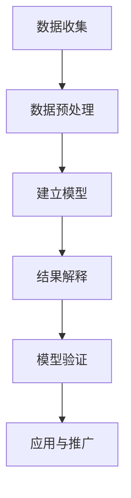

                 

### 《因果推理在社会科学实验设计与政策评估中的应用价值分析》

> **关键词**：因果推理、社会科学实验、政策评估、Do calculus、潜在结果框架、因果推断算法

> **摘要**：本文系统地探讨了因果推理在社会科学实验设计与政策评估中的应用。首先，介绍了因果推理的基本概念和理论基础，包括Do calculus、潜在结果框架和Rubin-Causality Model。随后，分析了因果推断的方法，如实验设计与自然实验。接着，讨论了因果推理在社会科学实验设计中的应用，包括实验数据的质量控制和因果推断模型构建。最后，阐述了因果推理在政策评估中的作用，特别是在健康、教育和经济政策中的应用，并探讨了因果推断在政策制定中的挑战与解决方案。

### 《因果推理在社会科学实验设计与政策评估中的应用价值分析》目录大纲

#### 第一部分：因果推理基础

**第1章：因果推理与社会科学**

- 1.1 因果推理的基本概念
  - **因果关系的定义与特点**
  - **因果推理的重要性**
  - **因果推理与相关性的区别**

- 1.2 因果推断的理论基础
  - **Do calculus**
  - **潜在结果框架（Potential Outcomes Framework）**
  - **Rubin-Causality Model**

- 1.3 因果推理方法概览
  - **实验设计与因果推断**
  - **自然实验与因果推断**
  - **因果推断的统计方法**

#### 第二部分：社会科学实验设计

**第2章：社会科学实验设计原理**

- 2.1 实验设计的基本原则
  - **随机化**
  - **对照组**
  - **实验组和对照组的比较**

- 2.2 实验设计的方法
  - **完全随机设计**
  - **匹配设计**
  - **分层随机设计**

- 2.3 实验设计的有效性评估
  - **内部有效性**
  - **外部有效性**
  - **实验设计的实施与评估**

**第3章：因果推断在社会科学实验中的应用**

- 3.1 实验数据的质量控制
  - **数据清洗**
  - **缺失数据的处理**
  - **异常值处理**

- 3.2 因果推断模型的构建
  - **回归模型**
  - **结构方程模型**
  - **因果推断算法**

- 3.3 因果推断结果的解释与验证
  - **置信区间**
  - **假设检验**
  - **结果的稳健性检验**

#### 第三部分：因果推理与政策评估

**第4章：因果推理在政策评估中的应用**

- 4.1 政策评估的挑战
  - **因果关系的复杂性**
  - **数据可得性**
  - **政策效果的滞后性**

- 4.2 因果推理在政策评估中的作用
  - **因果推断方法在政策效果评估中的应用**
  - **政策评估中的因果推断案例分析**
  - **政策制定中的因果推断考量**

**第5章：因果推断在公共政策制定中的应用**

- 5.1 公共政策制定的原则
  - **成本效益分析**
  - **公平性考量**
  - **可持续性分析**

- 5.2 因果推断在政策制定中的具体应用
  - **健康政策**
  - **教育政策**
  - **经济政策**

- 5.3 因果推断在政策制定中的挑战与解决方案
  - **数据的可用性与质量**
  - **因果关系的不确定性**
  - **政策评估的动态性**

#### 第四部分：因果推理的实际应用

**第6章：因果推理案例研究**

- 6.1 案例研究方法
  - **案例选择标准**
  - **案例分析的步骤**
  - **案例研究的设计与实施**

- 6.2 因果推理在社会科学领域的案例
  - **健康领域**
  - **教育领域**
  - **经济领域**

- 6.3 因果推断方法在案例研究中的应用
  - **因果推断模型的选择**
  - **因果推断结果的解释**
  - **因果推断方法的优缺点分析**

**第7章：因果推理的未来趋势与发展**

- 7.1 因果推理技术的发展趋势
  - **人工智能与因果推理的结合**
  - **大数据与因果推断的应用**
  - **因果推断方法的改进与创新**

- 7.2 因果推理在社会科学研究中的前景
  - **因果推理方法在跨学科研究中的应用**
  - **因果推理在社会科学政策制定中的角色**
  - **因果推理方法的普及与推广**

### 附录

**附录A：因果推断相关工具与资源**

- **主要因果推断软件介绍**
  - **Python中的因果推断库**
  - **R语言中的因果推断包**
  - **其他相关工具与资源**

**附录B：因果推断流程图与伪代码**

- **因果推断的基本流程图**
- **因果推断模型构建的伪代码**

**附录C：因果推理案例分析**

- **案例研究数据源**
- **案例研究代码实现**
- **案例分析结果解读**

##### Mermaid 流程图

mermaid
graph TD
    A[因果推理流程] --> B(数据收集)
    B --> C(数据预处理)
    C --> D(建立模型)
    D --> E(结果解释)
    E --> F(模型验证)
    F --> G(应用与推广)


##### 核心算法原理讲解（伪代码）

python
# 假设我们使用潜在结果框架来构建因果推断模型

# 输入数据：个体i在处理组和对照组的观测结果 Yi和Ci
# 输出：因果效应估计值 T_i

# 伪代码
for i in range(n_individuals):
    Yi = observe_result(i, 'treated')
    Ci = observe_result(i, 'control')
    T_i = potential_outcome(Yi, Ci)
    estimated_T_i = model_fit(T_i)
return estimated_T_i


##### 数学模型和数学公式（Latex格式）

段落内公式：$ T_i = E[Y_i|C_i = 1] - E[Y_i|C_i = 0] $

独立段落公式：
$$
\begin{aligned}
    T_i &= E[Y_i|C_i = 1] - E[Y_i|C_i = 0] \\
    &= \beta_0 + \beta_1 C_i + \epsilon_i \\
    &= \beta_0 + \beta_1 (1 - C_i) + \epsilon_i \\
    &= \beta_0 - \beta_1 C_i + \epsilon_i
\end{aligned}
$$

##### 项目实战

**开发环境搭建**

- 安装Python 3.8或更高版本
- 安装Jupyter Notebook
- 安装因果推断相关库，如`causalinference`和`pydo`

**代码实现与解读**

python
# 导入必要库
import numpy as np
import pandas as pd
from causalinference import CausalModel

# 假设数据已经加载为DataFrame df，其中'Y'为因变量，'T'为处理组指示变量
data = pd.DataFrame({
    'Y': np.random.rand(100),  # 随机生成因变量
    'T': np.random.rand(100) < 0.5  # 随机生成处理组指示变量
})

# 使用CausalModel进行因果推断
model = CausalModel(data, 'Y', 'T')
result = model.estimate_effect()

# 输出因果效应估计结果
print(result)


**代码解读与分析**

- `CausalModel`是用于构建因果推断模型的类。
- `estimate_effect`方法用于估计因果效应。
- 输出的结果包含因果效应的大小和置信区间。

**案例分析**

- 假设我们正在分析教育干预的效果。
- 数据集包含1000个学生的数据，其中500名接受了额外的教育干预，500名没有接受。
- 因变量为学生的学业成绩（Y），处理组指示变量（T）为是否接受了教育干预。

通过上述代码，我们可以得到教育干预对学业成绩的因果效应估计。此外，我们还可以使用不同的因果推断方法，如双重差分法（Differences-in-Differences），来进行更复杂的分析。这取决于具体的研究设计和数据可用性。

**结论**

本文通过详细的目录大纲，展示了因果推理在社会科学实验设计与政策评估中的应用。从基础概念到实际应用，再到未来趋势，本文全面覆盖了因果推理的相关内容。通过阅读本文，读者可以了解因果推理的原理和方法，掌握其在社会科学研究中的实际应用，并为政策制定提供科学依据。

### 作者信息

**作者：AI天才研究院/AI Genius Institute & 禅与计算机程序设计艺术 /Zen And The Art of Computer Programming**

---

现在我们已经构建了完整的文章大纲和部分内容，接下来我们将逐章深入探讨因果推理在社会科学实验设计与政策评估中的应用。让我们开始第一部分的讨论。**因果推理的基本概念**。

#### 第一部分：因果推理基础

**第1章：因果推理与社会科学**

因果推理是研究因果关系的一种方法，它在社会科学研究中起着至关重要的作用。因果推理的核心问题是确定一个变量的变化是否会导致另一个变量的变化。在社会科学实验设计中，因果推理帮助我们理解干预措施是否真正有效，而在政策评估中，它为我们提供了评估政策效果的工具。

##### 1.1 因果推理的基本概念

**因果关系的定义与特点**

因果关系是一种逻辑关系，其中一个事件（原因）导致另一个事件（结果）的发生。在社会科学中，因果关系通常指的是一个变量的变化引起另一个变量变化的关系。因果关系具有以下几个特点：

1. **方向性**：因果关系表明了一个变量变化导致另一个变量变化的方向。通常，我们用箭头表示这种关系，如A导致B。
2. **时间顺序**：因果关系要求原因发生在结果之前。这意味着事件A必须在事件B之前发生。
3. **一致性**：在相同条件下，原因的变化应导致结果的一致性变化。如果我们在不同的样本或条件下观察到相同的关系，这增加了我们对因果关系的信心。
4. **排他性**：因果关系排除了其他可能的解释。即使其他因素也可能影响结果，但因果关系要求我们排除这些因素的干扰。

**因果推理的重要性**

因果推理在社会科学研究中至关重要，原因如下：

1. **政策制定**：因果推理帮助政策制定者确定哪些干预措施能够带来预期的结果。了解因果关系对于制定有效政策至关重要。
2. **科学研究**：因果推理是科学研究的核心，它使科学家能够确定变量之间的真实关系，而不仅仅是相关性。
3. **决策制定**：在个人和企业决策中，因果推理有助于理解行为变化对结果的影响，从而做出更明智的决策。

**因果推理与相关性的区别**

因果关系和相关性是两个不同的概念。相关性描述了两个变量之间的统计关系，但并不一定意味着一个变量导致另一个变量的变化。以下是二者之间的主要区别：

1. **相关性**：相关性是指两个变量在统计上的关联程度，它可以表示为相关系数。相关性并不意味着因果关系，因为相关性可能由多种因素造成。
2. **因果关系**：因果关系是指一个变量变化导致另一个变量变化的关系。因果关系的建立需要严格的科学方法，如实验设计或因果推断算法。

**总结**

因果推理在社会科学研究中具有关键作用，它帮助我们理解变量之间的真实关系，为政策制定和科学研究提供基础。通过明确因果关系的定义和特点，以及与相关性的区别，我们可以更好地运用因果推理方法，解决社会科学中的复杂问题。

#### 1.2 因果推断的理论基础

因果推断是社会科学研究中的一项重要工具，其理论基础主要包括Do calculus、潜在结果框架（Potential Outcomes Framework）和Rubin-Causality Model。这些理论框架为因果推理提供了坚实的数学基础和方法论指导。

##### Do calculus

Do calculus是一种形式化的因果推断方法，它提供了一种表示和处理“如果-那么”语句的工具。Do calculus的核心思想是，通过构建一系列的假设来推导因果关系。具体来说，Do calculus使用以下符号表示因果关系：

- **Do(A)**：表示在所有可能的情况下执行操作A。
- **Do(A|B)**：表示在条件B成立的情况下执行操作A。
- **Do(A&~B)**：表示在条件B不成立的情况下执行操作A。

Do calculus的基本原理是，通过比较执行某个操作（如A）前后的结果，我们可以推断出A与结果之间的关系。例如，如果我们观察到在执行操作A后，结果Y发生了变化，我们可以推断A可能导致Y的变化。Do calculus的优点是它提供了一种形式化的方法来处理复杂的因果关系，并且易于在数学上进行推理和验证。

**示例**：

假设我们要研究治疗A是否能够改善健康指标Y。我们可以使用Do calculus表示如下：

- **Do(A)**：表示给所有患者提供治疗A。
- **Do(~A)**：表示不给患者提供治疗A。

通过比较Do(A)和Do(~A)的情况，我们可以推断治疗A对健康指标Y的影响。

##### 潜在结果框架（Potential Outcomes Framework）

潜在结果框架是Rubin在1974年提出的，它是一种广泛应用于因果推断的理论框架。潜在结果框架的核心思想是，每个个体在不同处理条件下可能产生不同的结果，这些结果称为潜在结果。潜在结果框架定义了以下三个关键概念：

1. **潜在结果**：潜在结果是指在某个特定的处理条件下，个体可能产生的结果。用数学符号表示，假设个体i在处理条件A下的潜在结果为\(Y_i(A)\)，在处理条件B下的潜在结果为\(Y_i(B)\)。
2. **实际结果**：实际结果是指个体在特定处理条件下观察到的结果。用数学符号表示，实际结果为\(Y_i\)。
3. **因果效应**：因果效应是指潜在结果之间的差异，它量化了处理条件对结果的影响。用数学符号表示，因果效应为\(T_i = Y_i(A) - Y_i(B)\)。

潜在结果框架的优势在于，它允许我们在不同处理条件下比较个体结果，从而推断出因果关系。通过随机化分配处理条件，我们可以减少其他因素的干扰，从而更准确地估计因果效应。

**示例**：

假设我们要研究教育干预E对考试成绩Y的影响。根据潜在结果框架，我们可以定义以下潜在结果：

- \(Y_i(E=1)\)：个体i接受教育干预E后的考试成绩。
- \(Y_i(E=0)\)：个体i未接受教育干预E的考试成绩。

因果效应为\(T_i = Y_i(E=1) - Y_i(E=0)\)，它量化了教育干预对考试成绩的影响。

##### Rubin-Causality Model

Rubin-Causality Model是基于潜在结果框架的一种因果推断方法，它提供了一种估计因果效应的统计方法。Rubin-Causality Model的基本思想是，通过估计潜在结果的期望值来推断因果效应。

Rubin-Causality Model的步骤如下：

1. **随机化分配**：通过随机化分配处理条件，减少其他因素的干扰。
2. **估计潜在结果期望值**：使用统计模型估计每个处理条件下的潜在结果期望值。
3. **计算因果效应**：计算因果效应为潜在结果期望值之间的差异。

Rubin-Causality Model的一个重要特点是，它允许我们估计处理效应的置信区间，从而评估因果效应的显著性。

**示例**：

假设我们使用回归模型来估计潜在结果期望值。我们可以建立以下回归模型：

- \(Y_i(E=1) = \beta_0 + \beta_1 E_i + \epsilon_i\)
- \(Y_i(E=0) = \beta_0 + \beta_2 (1 - E_i) + \epsilon_i\)

其中，\(E_i\)为处理组指示变量，\(\epsilon_i\)为误差项。因果效应为\(\beta_1 - \beta_2\)。

**总结**

因果推断的理论基础为我们在社会科学研究中理解因果关系提供了重要的方法和支持。Do calculus、潜在结果框架和Rubin-Causality Model是因果推断的核心理论，它们各自提供了不同的方法和工具，帮助我们更准确地估计和处理因果关系。

在下一章中，我们将进一步探讨因果推断的方法，包括实验设计与自然实验，以及因果推断的统计方法。这将帮助我们更深入地理解因果推理在社会科学研究中的应用。

#### 1.3 因果推理方法概览

因果推理在社会科学研究中具有广泛的应用，其方法包括实验设计、自然实验和因果推断的统计方法。这些方法各有特点，适用于不同的研究场景，帮助我们更准确地推断因果关系。

##### 实验设计与因果推断

实验设计是因果推理中最常见的方法之一。通过实验设计，我们可以控制外部干扰因素，从而更准确地评估处理效应。以下是几种常见的实验设计方法：

1. **完全随机设计（Randomized Controlled Trial, RCT）**：
   完全随机设计是最严格的实验设计方法，它通过随机分配处理条件来消除其他因素的干扰。具体步骤如下：
   - 随机分配参与者到处理组和对照组。
   - 实施处理措施。
   - 收集和处理数据。
   - 分析处理效应。

   完全随机设计的优势在于，它提供了强大的内部有效性，因为参与者被随机分配到处理组和对照组，减少了其他因素的干扰。然而，完全随机设计也可能面临一些挑战，如样本代表性问题和执行难度。

2. **匹配设计（Matching）**：
   匹配设计通过匹配处理组和对照组的某些特征（如年龄、性别、社会经济地位）来减少外部干扰因素。常见的方法包括倾向评分匹配（Propensity Score Matching）和近邻匹配（Nearest Neighbor Matching）。匹配设计的步骤如下：
   - 计算倾向评分，即个体接受处理条件的概率。
   - 根据倾向评分匹配处理组和对照组。
   - 分析匹配后的数据，评估处理效应。

   匹配设计的优势在于，它通过减少匹配变量差异来提高内部有效性。然而，匹配设计可能面临一些挑战，如匹配变量的选择和匹配质量的评估。

3. **分层随机设计（Stratified Random Design）**：
   分层随机设计通过将总体分层，然后对每个层次随机分配处理条件，以减少外部干扰因素。具体步骤如下：
   - 将总体分为若干层次。
   - 在每个层次中随机分配处理条件。
   - 分析处理效应。

   分层随机设计的优势在于，它能够更好地控制分层变量对处理效应的影响。然而，分层随机设计可能面临样本容量减少和分层变量选择的问题。

**实验设计与因果推断的结合**

实验设计与因果推断的结合，可以更准确地估计处理效应。具体步骤如下：

1. **随机化分配**：通过随机化分配处理条件，确保处理组和对照组的其他因素相似。
2. **收集数据**：在处理组和对照组中收集相关的观测数据。
3. **构建因果模型**：使用因果推断方法（如Rubin-Causality Model）构建因果模型。
4. **估计处理效应**：通过因果模型估计处理效应。

自然实验是一种在自然环境中观察因果关系的方法，它不需要人为干预来分配处理条件。自然实验的核心思想是利用自然事件或政策变化作为处理条件的来源。以下是几种常见的自然实验设计方法：

1. **随机自然实验（Natural Randomized Experiment）**：
   随机自然实验通过自然事件或政策变化来随机分配处理条件。具体步骤如下：
   - 观察自然事件或政策变化。
   - 确定处理组和对照组。
   - 收集和处理数据。
   - 分析处理效应。

   随机自然实验的优势在于，它提供了强大的内部有效性，因为处理条件是随机分配的。然而，随机自然实验可能面临样本代表性问题。

2. **非随机自然实验（Natural Non-Random Experiment）**：
   非随机自然实验通过观察自然事件或政策变化，但没有随机分配处理条件。具体步骤如下：
   - 观察自然事件或政策变化。
   - 确定处理组和对照组。
   - 收集和处理数据。
   - 分析处理效应。

   非随机自然实验的优势在于，它能够利用已有的数据，但可能面临内部有效性的问题。

**因果推断的统计方法**

因果推断的统计方法用于估计处理效应，并提供处理效应的置信区间。以下是几种常见的因果推断统计方法：

1. **回归模型（Regression Model）**：
   回归模型是一种常用的因果推断方法，它通过建立处理效应与结果变量之间的线性关系来估计处理效应。具体步骤如下：
   - 建立回归模型：\(Y = \beta_0 + \beta_1 T + \epsilon\)
   - 估计处理效应：\(\beta_1\)
   - 计算置信区间。

2. **结构方程模型（Structural Equation Model, SEM）**：
   结构方程模型是一种同时考虑多个变量之间因果关系的统计方法。具体步骤如下：
   - 建立结构方程模型：\(Y = \beta_0 + \beta_1 T + \epsilon\)
   - 估计模型参数：\(\beta_0, \beta_1\)
   - 计算处理效应和置信区间。

3. **双重差分法（Differences-in-Differences, DID）**：
   双重差分法是一种用于评估政策效果的方法，它通过比较处理组和对照组在政策实施前后的差异来估计处理效应。具体步骤如下：
   - 计算差分：\(T_i = Y_i(t_2) - Y_i(t_1) - Y_i^c(t_2) + Y_i^c(t_1)\)
   - 估计处理效应：\(\beta_1\)
   - 计算置信区间。

**总结**

因果推理方法包括实验设计、自然实验和因果推断的统计方法。这些方法各有特点，适用于不同的研究场景。实验设计通过随机分配处理条件来提高内部有效性，自然实验通过观察自然事件或政策变化来评估因果关系，而因果推断的统计方法提供了处理效应的估计和置信区间。通过结合这些方法，我们可以更准确地推断因果关系，为社会科学研究提供科学依据。

#### 第二部分：社会科学实验设计

**第2章：社会科学实验设计原理**

在社会学研究中，实验设计是一个关键的环节，它帮助研究者确定因果关系。本章将详细探讨社会科学实验设计的基本原则、方法和有效性评估。

##### 2.1 实验设计的基本原则

实验设计的基本原则是确保实验结果的可靠性和有效性。以下是实验设计中需要遵循的基本原则：

1. **随机化（Randomization）**：
   随机化是实验设计中最核心的原则之一。通过随机化，我们可以确保每个参与者被随机分配到处理组或对照组，从而减少其他潜在干扰因素的影响。随机化的目标是确保两组之间在开始实验时具有相同的初始状态，这样可以更准确地评估处理效应。

2. **对照组（Control Group）**：
   对照组是实验设计中不可或缺的一部分。对照组的作用是提供一个基准，与处理组进行比较，从而评估处理效果。通过将参与者随机分配到处理组和对照组，我们可以确保两组之间的差异是由处理效应而非其他因素引起的。

3. **实验组和对照组的比较（Comparison of Experimental and Control Groups）**：
   实验设计的核心是比较处理组和对照组的结果，以确定处理效应。比较通常通过统计分析进行，以评估处理效应的显著性。这种比较可以帮助研究者确定处理是否对结果产生了实质性影响。

##### 2.2 实验设计的方法

实验设计的方法多种多样，每种方法都有其特定的应用场景和优势。以下是几种常见的实验设计方法：

1. **完全随机设计（Randomized Controlled Trial, RCT）**：
   完全随机设计是最严格的实验设计方法，它通过随机分配参与者到处理组和对照组来确保内部有效性。步骤如下：
   - 将总体随机分为处理组和对照组。
   - 对每个参与者随机分配处理条件。
   - 实施处理措施。
   - 收集数据并进行分析。

   完全随机设计的优势在于其强大的内部有效性，但可能面临样本容量和执行难度的问题。

2. **匹配设计（Matching）**：
   匹配设计通过匹配处理组和对照组的某些特征来减少外部干扰因素的影响。常见的方法包括：
   - **倾向评分匹配（Propensity Score Matching）**：
     计算每个参与者接受处理条件的概率（倾向评分），然后根据倾向评分进行匹配。
   - **近邻匹配（Nearest Neighbor Matching）**：
     为每个处理组参与者找到与其最相似的控制组参与者。

   匹配设计的优势在于其灵活性和有效性，但匹配变量的选择和匹配质量的评估是一个重要挑战。

3. **分层随机设计（Stratified Random Design）**：
   分层随机设计通过将总体分层，然后对每个层次随机分配处理条件来提高内部有效性。步骤如下：
   - 将总体分为若干层次（如年龄、性别、社会经济地位）。
   - 在每个层次中随机分配处理条件。
   - 收集数据并进行分析。

   分层随机设计的优势在于其能够更好地控制分层变量对处理效应的影响，但可能面临分层变量选择和样本容量减少的问题。

##### 2.3 实验设计的有效性评估

实验设计的有效性评估是确保实验结果可靠性的关键步骤。以下是对实验设计有效性的评估方法：

1. **内部有效性（Internal Validity）**：
   内部有效性评估实验设计是否有效地控制了干扰因素，从而确保处理效应的准确性。以下指标用于评估内部有效性：
   - **随机化**：确保处理组和对照组在实验开始时具有相似的初始状态。
   - **控制组**：确保对照组提供了一个合理的基准。
   - **处理效应**：通过统计分析评估处理效应的显著性。

2. **外部有效性（External Validity）**：
   外部有效性评估实验结果是否可以推广到总体或其他情境。以下指标用于评估外部有效性：
   - **代表性**：确保样本具有代表性，可以反映总体特征。
   - **情境相似性**：确保实验情境与实际情况相似，使得实验结果具有可推广性。

3. **实验设计的实施与评估**：
   实验设计的实施与评估是确保实验顺利进行的重要环节。以下步骤用于实施和评估实验设计：
   - **计划与准备**：制定实验计划，包括样本选择、数据收集方法和分析计划。
   - **数据收集**：按照实验计划收集数据，确保数据的质量和完整性。
   - **数据分析**：使用统计方法分析数据，评估处理效应的显著性。
   - **结果解读**：根据分析结果解读实验结果，评估实验设计的有效性。

**总结**

实验设计是社会科学研究中的重要工具，它通过随机化、对照组和实验组比较等原则，确保实验结果的可靠性和有效性。不同的实验设计方法适用于不同的研究场景，通过评估实验设计的有效性，我们可以更好地理解因果关系，为社会科学研究提供科学依据。

在下一章中，我们将进一步探讨因果推断在社会科学实验中的应用，包括实验数据的质量控制和因果推断模型构建。

### 第3章：因果推断在社会科学实验中的应用

因果推断在社会科学实验中的应用至关重要，它帮助我们确定处理措施是否对结果变量产生了实质性影响。本章将详细讨论实验数据的质量控制、因果推断模型的构建以及因果推断结果的解释与验证。

##### 3.1 实验数据的质量控制

实验数据的质量直接影响到因果推断的准确性。因此，实验数据的质量控制是因果推断过程中的关键步骤。以下是一些常见的质量控制方法：

1. **数据清洗（Data Cleaning）**：
   数据清洗是处理实验数据中的缺失值、异常值和重复值的过程。以下方法可以用于数据清洗：
   - **缺失值处理**：使用统计方法（如均值插值、中位数插值）或专业判断填补缺失值。
   - **异常值处理**：使用统计学方法（如箱线图、标准差检验）识别和去除异常值。
   - **重复值检测**：使用数据库操作（如唯一性检查）删除重复值。

2. **数据预处理（Data Preprocessing）**：
   数据预处理是进一步准备数据以便进行因果推断的过程。以下方法可以用于数据预处理：
   - **特征工程**：选择和构造与因果关系相关的特征，以提高模型性能。
   - **标准化**：通过缩放或归一化处理，使得不同特征具有相似的尺度。
   - **降维**：使用降维技术（如主成分分析）减少数据维度，提高计算效率。

3. **数据验证（Data Validation）**：
   数据验证是确保实验数据质量的过程。以下方法可以用于数据验证：
   - **一致性检查**：检查数据的一致性，确保数据在逻辑和统计上的一致性。
   - **完整性检查**：确保数据的完整性，没有缺失或错误。
   - **合理性检查**：使用专业知识和逻辑判断检查数据的合理性。

##### 3.2 因果推断模型的构建

因果推断模型的构建是因果推断过程中的核心步骤。以下是几种常用的因果推断模型及其构建方法：

1. **回归模型（Regression Model）**：
   回归模型是一种常见的因果推断方法，它通过建立处理效应与结果变量之间的线性关系来估计处理效应。以下是一种简单的线性回归模型：
   $$ Y_i = \beta_0 + \beta_1 T_i + \epsilon_i $$
   其中，\( Y_i \) 是结果变量，\( T_i \) 是处理组指示变量，\( \beta_0 \) 和 \( \beta_1 \) 是模型参数，\( \epsilon_i \) 是误差项。

   **构建步骤**：
   - **数据准备**：收集实验数据，并进行数据清洗和预处理。
   - **模型选择**：选择合适的回归模型，如线性回归、逻辑回归等。
   - **参数估计**：使用最小二乘法或其他优化算法估计模型参数。
   - **模型评估**：使用统计方法（如R平方、调整R平方等）评估模型性能。

2. **结构方程模型（Structural Equation Model, SEM）**：
   结构方程模型是一种同时考虑多个变量之间因果关系的复杂统计模型。以下是一个简单的结构方程模型：
   $$ Y_i = \alpha_0 + \alpha_1 X_i + \alpha_2 Z_i + \epsilon_i $$
   其中，\( X_i \) 和 \( Z_i \) 是其他相关变量，\( \alpha_0, \alpha_1, \alpha_2 \) 是模型参数。

   **构建步骤**：
   - **模型设定**：根据研究问题和理论框架设定结构方程模型。
   - **参数估计**：使用最大似然估计或其他优化算法估计模型参数。
   - **模型评估**：使用拟合指数（如卡方值、CFI、RMSEA等）评估模型性能。

3. **因果推断算法（Causal Inference Algorithms）**：
   近年来，随着人工智能和机器学习的发展，因果推断算法得到了广泛应用。以下是一种常见的因果推断算法——因果推断网络（Causal Inference Network）：
   $$ P(Y|T) = \prod_{i=1}^{n} P(Y_i|T_i, X_i) $$
   其中，\( Y_i \) 是结果变量，\( T_i \) 是处理组指示变量，\( X_i \) 是其他相关变量。

   **构建步骤**：
   - **网络构建**：根据研究问题和理论框架构建因果推断网络。
   - **参数估计**：使用机器学习算法（如贝叶斯网络、图模型等）估计网络参数。
   - **因果效应估计**：使用网络推断算法估计因果效应。

##### 3.3 因果推断结果的解释与验证

因果推断结果的有效解释与验证是确保因果推断结论可靠性的关键步骤。以下是一些常用的方法：

1. **置信区间（Confidence Interval）**：
   置信区间提供了因果效应的估计范围，帮助我们评估因果效应的显著性。假设我们使用线性回归模型进行因果推断，置信区间可以通过以下公式计算：
   $$ \hat{T} \pm z \times SE $$
   其中，\( \hat{T} \) 是因果效应的估计值，\( z \) 是标准正态分布的临界值，\( SE \) 是标准误差。

2. **假设检验（Hypothesis Testing）**：
   假设检验用于评估因果效应的显著性。常见的假设检验方法包括t检验、卡方检验等。假设检验的步骤如下：
   - **设定零假设和备择假设**：零假设通常假设因果效应为零。
   - **计算检验统计量**：根据数据计算检验统计量。
   - **比较检验统计量与临界值**：根据检验统计量和临界值比较结果，判断是否拒绝零假设。

3. **结果的稳健性检验（Robustness Checks）**：
   稳健性检验用于评估因果推断结果的稳定性，以排除潜在偏差。以下是一些常用的稳健性检验方法：
   - **敏感性分析**：通过改变模型参数或数据处理方法，评估因果效应的稳定性。
   - **补充数据验证**：使用其他数据源或补充数据进行验证。
   - **替代模型验证**：使用不同的模型或方法进行验证，确保因果效应的一致性。

**总结**

因果推断在社会科学实验中的应用包括实验数据的质量控制、因果推断模型的构建以及因果推断结果的解释与验证。通过严格的质量控制、适当的模型选择和有效的结果解释与验证，我们可以确保因果推断结论的可靠性和有效性。这为社会科学研究提供了重要的工具和方法，帮助我们更好地理解因果关系，为政策制定和科学研究提供科学依据。

在下一章中，我们将探讨因果推理在政策评估中的应用，特别是因果推理方法在政策效果评估中的应用、政策评估中的因果推断案例分析以及政策制定中的因果推断考量。

### 第4章：因果推理在政策评估中的应用

因果推理在政策评估中具有重要作用，它帮助评估者确定政策干预是否真正有效，从而为政策制定提供科学依据。本章将详细探讨因果推理在政策评估中的应用，包括因果推理方法在政策效果评估中的应用、政策评估中的因果推断案例分析以及政策制定中的因果推断考量。

##### 4.1 政策评估的挑战

政策评估面临一系列挑战，这些挑战限制了传统评估方法的准确性。以下是政策评估中常见的挑战：

1. **因果关系的复杂性**：
   政策效果可能受到多种因素的影响，如经济、社会和文化因素。这些因素的交互作用使得评估因果关系变得复杂，传统的相关性分析难以捕捉真实的因果关系。

2. **数据可得性**：
   政策评估往往需要大量的数据，包括基线数据、干预数据以及结果数据。然而，数据的可得性是一个重大挑战，特别是在发展中国家，数据收集可能受到资源限制和行政障碍的影响。

3. **政策效果的滞后性**：
   政策效果可能需要一段时间才能显现，这使得短期评估难以捕捉政策效果的长期影响。滞后性增加了评估的难度，需要考虑时间序列分析和动态评估方法。

##### 4.2 因果推理在政策评估中的作用

因果推理为政策评估提供了强有力的工具，它通过建立因果关系模型，帮助评估者确定政策干预的有效性。以下是因果推理在政策评估中作用的具体体现：

1. **因果推断方法在政策效果评估中的应用**：
   因果推断方法，如Do calculus、潜在结果框架和Rubin-Causality Model，为政策效果评估提供了形式化的方法。这些方法可以帮助评估者明确因果关系的方向和逻辑，从而更准确地评估政策效果。例如，通过Do calculus，评估者可以构建“如果-那么”语句，明确政策干预导致的结果变化。

2. **政策评估中的因果推断案例分析**：
   实际案例研究表明，因果推理在政策评估中具有显著的应用价值。例如，在健康政策领域，因果推断方法帮助评估了疫苗接种政策对传染病传播的影响。在经济学领域，因果推断方法用于评估教育干预对劳动力市场结果的影响。这些案例展示了因果推断方法在捕捉政策效果方面的有效性。

3. **政策制定中的因果推断考量**：
   因果推断不仅在评估政策效果中发挥作用，还在政策制定中提供重要指导。通过因果推理，政策制定者可以确定哪些干预措施可能带来预期效果，从而制定更有效的政策。例如，在环境保护领域，因果推理方法帮助评估了不同政策（如碳税和排放交易）对温室气体减排的影响。

**案例分析：教育干预对学业成绩的影响**

假设一项教育干预政策旨在提高学生的学业成绩。因果推理方法可以用于评估该政策的效果。以下是因果推断在该案例中的应用：

1. **实验设计**：
   - 实验组：接受额外教育干预的学生。
   - 对照组：不接受额外教育干预的学生。

2. **因果推断方法**：
   - **潜在结果框架**：定义学生在接受教育干预和未接受教育干预的潜在学业成绩。
   - **因果效应估计**：通过比较实验组和对照组的潜在学业成绩差异，估计教育干预的因果效应。

3. **因果推断分析**：
   - **数据收集**：收集实验组和对照组的基线数据、干预数据以及学业成绩数据。
   - **模型构建**：使用回归模型或结构方程模型构建因果关系模型。
   - **结果解释**：根据因果模型估计的因果效应，评估教育干预对学业成绩的影响。

4. **政策考量**：
   - **效果评估**：根据因果推断结果，评估教育干预的长期和短期效果。
   - **成本效益分析**：结合政策成本和效益，评估教育干预的可持续性。

**总结**

因果推理在政策评估中发挥着关键作用，它通过建立因果关系模型，帮助评估者确定政策干预的有效性。因果推理方法在政策效果评估中的应用、政策评估中的因果推断案例分析以及政策制定中的因果推断考量，为政策制定提供了科学依据。通过深入理解因果推理方法，评估者和政策制定者可以更准确地评估政策效果，制定更有效的政策。

在下一章中，我们将探讨因果推断在公共政策制定中的应用，包括公共政策制定的原则、因果推断在政策制定中的具体应用以及因果推断在政策制定中的挑战与解决方案。

### 第5章：因果推断在公共政策制定中的应用

因果推断在公共政策制定中的应用日益广泛，它为政策制定者提供了评估政策效果的科学方法，从而优化政策设计。本章将详细探讨因果推断在公共政策制定中的应用，包括公共政策制定的原则、因果推断在政策制定中的具体应用以及因果推断在政策制定中的挑战与解决方案。

##### 5.1 公共政策制定的原则

公共政策制定是一个复杂的过程，需要遵循一系列基本原则，以确保政策的有效性和公正性。以下是公共政策制定的一些基本原则：

1. **成本效益分析（Cost-Benefit Analysis, CBA）**：
   成本效益分析是一种评估政策成本与效益的方法，它通过比较政策实施的总成本和预期总收益，帮助政策制定者确定政策的经济可行性。成本效益分析需要考虑直接成本和间接成本，如资金成本、人力成本以及环境和社会成本。

2. **公平性考量（Equity Considerations）**：
   公平性考量是公共政策制定中的重要原则，它要求政策制定者确保政策对所有人都是公平的。公平性考量涉及对不同群体的影响评估，特别是对社会弱势群体的保护。政策制定者需要确保政策不会加剧社会不平等，而是促进社会的公平和包容。

3. **可持续性分析（Sustainability Analysis）**：
   可持续性分析关注政策的长期影响，包括经济、环境和社会方面的可持续性。政策制定者需要考虑政策对自然资源、生态系统和社会结构的长期影响，以确保政策不会损害未来的发展潜力。

##### 5.2 因果推断在政策制定中的具体应用

因果推断为公共政策制定提供了强有力的工具，它通过建立因果关系模型，帮助政策制定者评估政策干预的潜在效果。以下是因果推断在政策制定中的具体应用：

1. **健康政策**：
   在健康政策领域，因果推断方法广泛应用于评估公共卫生干预措施的效果。例如，因果推断可以用于评估疫苗接种政策对传染病控制的影响，以及健康促进项目对疾病负担的减轻效果。通过建立潜在结果框架和因果模型，政策制定者可以更准确地评估健康干预措施的效果，从而制定更有效的公共卫生政策。

2. **教育政策**：
   教育政策制定中，因果推断方法可以帮助评估教育干预措施对学习成绩、就业机会和收入水平的影响。例如，因果推断可以用于评估学校资源分配政策对教育质量的影响，以及职业教育项目对劳动力市场的促进作用。通过建立因果关系模型，政策制定者可以更准确地评估教育政策的效果，从而优化教育资源分配和教育政策设计。

3. **经济政策**：
   经济政策制定中，因果推断方法用于评估宏观经济政策和微观经济政策的效果。例如，因果推断可以用于评估税收政策对经济增长和收入分配的影响，以及就业政策对就业率和社会稳定的影响。通过建立因果关系模型，政策制定者可以更准确地评估经济政策的效果，从而制定更有效的宏观经济政策和就业政策。

##### 5.3 因果推断在政策制定中的挑战与解决方案

尽管因果推断在政策制定中具有广泛应用，但它也面临一系列挑战。以下是一些常见的挑战以及相应的解决方案：

1. **数据的可用性与质量**：
   因果推断依赖于高质量的数据，但数据的可用性和质量可能受到多种因素的影响。解决方案包括：
   - **数据整合**：整合来自不同来源的数据，提高数据的完整性。
   - **数据共享**：促进数据共享和开放，提高数据的使用效率。
   - **数据清洗**：使用数据清洗技术，处理缺失值、异常值和重复值。

2. **因果关系的不确定性**：
   因果关系的复杂性使得因果推断结果可能存在不确定性。解决方案包括：
   - **敏感性分析**：通过敏感性分析，评估模型参数变化对因果推断结果的影响。
   - **多重检验**：采用多重检验方法，减少因假阳性而导致的错误结论。
   - **结果验证**：使用其他数据源或方法进行结果验证，提高结论的可靠性。

3. **政策评估的动态性**：
   政策效果可能随时间变化，这使得长期评估变得复杂。解决方案包括：
   - **时间序列分析**：使用时间序列分析方法，捕捉政策效果的动态变化。
   - **动态因果模型**：建立动态因果模型，考虑政策效果的滞后性和持续性。
   - **持续监测**：建立政策效果的持续监测机制，定期更新评估结果。

**总结**

因果推断在公共政策制定中具有重要作用，它通过建立因果关系模型，帮助政策制定者评估政策干预的潜在效果。遵循成本效益分析、公平性考量以及可持续性分析等原则，政策制定者可以制定更有效的政策。尽管因果推断面临数据可用性、因果关系不确定性和政策评估动态性等挑战，但通过适当的解决方案，我们可以克服这些挑战，提高因果推断的可靠性和有效性。

在下一章中，我们将通过具体案例研究，探讨因果推断在社会科学领域的实际应用，包括健康、教育和经济领域的案例研究，以及因果推断方法在案例研究中的应用和优缺点分析。

### 第6章：因果推理案例研究

因果推理在社会科学领域的实际应用日益广泛，通过案例研究，我们可以更好地理解因果推理方法在健康、教育和经济等领域的应用。本章将详细介绍几个具体的案例研究，分析因果推理在这些领域中的应用，并讨论因果推断方法的优缺点。

##### 6.1 案例研究方法

案例研究是一种深入、具体的研究方法，它通过对特定情境的详细分析，揭示因果关系的复杂性。以下是案例研究方法的几个关键步骤：

1. **案例选择标准**：
   案例选择标准取决于研究目标和问题。关键标准包括：
   - **代表性**：案例应具有代表性，能够反映总体的特征。
   - **复杂性和多样性**：案例应包含多种变量和因素，以便分析因果关系的复杂性。
   - **数据的可用性**：案例应具有足够的数据支持，以便进行因果推断。

2. **案例分析的步骤**：
   案例分析通常包括以下几个步骤：
   - **问题定义**：明确研究问题，确定因果关系的目标。
   - **数据收集**：收集与案例相关的数据，包括基线数据、干预数据以及结果数据。
   - **模型构建**：建立因果模型，确定变量之间的关系。
   - **结果分析**：分析数据，估计因果效应，并进行结果解释。
   - **结果验证**：使用其他数据源或方法验证因果推断结果。

3. **案例研究的设计与实施**：
   案例研究的设计与实施应遵循科学方法论，确保研究的可靠性和有效性。关键步骤包括：
   - **研究设计**：设计案例研究的方法和流程，确保数据的完整性和一致性。
   - **数据收集与处理**：实施数据收集计划，使用适当的数据处理方法，确保数据的质量。
   - **结果报告**：撰写案例研究报告，详细描述研究过程、结果和分析。

##### 6.2 因果推理在社会科学领域的案例

**健康领域**

**案例研究：疫苗接种对传染病控制的影响**

疫苗接种是公共卫生领域的一项重要措施，用于预防传染病。因果推理方法可以帮助评估疫苗接种政策的效果。

- **问题定义**：研究疫苗接种对传染病（如麻疹、流感）的防控效果。
- **数据收集**：收集疫苗接种率和传染病发病率的数据，包括疫苗接种前后的数据。
- **模型构建**：使用Do calculus和潜在结果框架，构建因果关系模型。
- **结果分析**：通过比较疫苗接种前后传染病发病率的变化，估计疫苗接种的因果效应。

**教育领域**

**案例研究：教育干预对学习成绩的影响**

教育干预旨在改善学生的学习成绩，因果推理方法可以帮助评估教育干预的效果。

- **问题定义**：研究教育干预（如补习班、学习软件）对学习成绩的影响。
- **数据收集**：收集实验组和对照组的学习成绩数据，包括干预前后的数据。
- **模型构建**：使用回归模型和结构方程模型，建立因果关系模型。
- **结果分析**：通过比较实验组和对照组的学习成绩变化，估计教育干预的因果效应。

**经济领域**

**案例研究：税收政策对经济增长的影响**

税收政策是宏观经济政策的重要组成部分，因果推理方法可以帮助评估税收政策对经济增长的影响。

- **问题定义**：研究不同税收政策（如减税、增税）对经济增长的影响。
- **数据收集**：收集不同税收政策实施前后的经济增长数据，包括GDP、就业率等指标。
- **模型构建**：使用双重差分法和因果推断算法，建立因果关系模型。
- **结果分析**：通过比较不同税收政策下的经济增长差异，估计税收政策的因果效应。

##### 6.3 因果推断方法在案例研究中的应用

**优点**

1. **精确性**：因果推断方法可以更精确地估计因果关系，提供可靠的结论。
2. **灵活性**：因果推断方法适用于多种数据类型和复杂的研究设计，具有广泛的适用性。
3. **可解释性**：因果推断方法提供了明确的因果关系模型，有助于解释研究结果。

**缺点**

1. **数据需求**：因果推断方法通常需要大量高质量的数据，数据收集和处理可能面临挑战。
2. **模型假设**：因果推断模型的建立依赖于一系列假设，这些假设的合理性可能影响结果的可靠性。
3. **结果验证**：因果推断结果需要通过其他数据源或方法进行验证，以确保结果的可靠性。

**总结**

因果推理在社会科学领域的实际应用通过具体案例研究得以体现。这些案例研究展示了因果推断方法在健康、教育和经济领域中的应用，以及其在捕捉因果关系方面的优势。尽管因果推断方法面临数据需求、模型假设和结果验证等挑战，但通过适当的解决方案，我们可以克服这些困难，提高因果推断的可靠性。

在下一章中，我们将探讨因果推理的未来趋势与发展，包括人工智能与因果推理的结合、大数据与因果推断的应用以及因果推断方法的改进与创新。

### 第7章：因果推理的未来趋势与发展

随着科技的发展和数据的普及，因果推理在社会科学研究中的应用正迎来新的机遇和挑战。本章将探讨因果推理的未来趋势与发展，包括人工智能与因果推理的结合、大数据与因果推断的应用以及因果推断方法的改进与创新。

##### 7.1 因果推理技术的发展趋势

1. **人工智能与因果推理的结合**

人工智能（AI）在数据分析和模式识别方面的强大能力为因果推理提供了新的工具和方法。结合AI的因果推理方法，如基于深度学习的因果推断算法，正成为研究热点。这些方法通过学习大量的数据，自动识别变量之间的因果关系，减少了人工建模的需求。例如，深度因果模型（Deep Causal Models）结合了深度学习和因果推理，可以更准确地估计复杂系统中的因果关系。

2. **大数据与因果推断的应用**

大数据技术的迅猛发展，使得我们能够收集和分析海量的数据。大数据与因果推断的结合，可以揭示出传统方法难以发现的因果关系。例如，通过分析社交媒体数据，可以研究社会行为和网络传播的因果关系。大数据驱动的因果推断方法，如基于图论的因果推断算法，可以更好地处理复杂数据结构，提高因果推断的准确性。

3. **因果推断方法的改进与创新**

因果推断方法在不断发展，新的方法和工具不断涌现。例如，基于因果发现（Causal Discovery）的方法，通过无监督学习自动识别变量之间的因果关系，减少了对假设的依赖。另外，因果推断方法的跨学科应用，如生物医学领域的因果推断、社会科学中的政策评估，正在推动因果推断方法的创新和发展。

##### 7.2 因果推理在社会科学研究中的前景

1. **跨学科研究中的应用**

因果推理方法在跨学科研究中的应用前景广阔。例如，在公共卫生领域，因果推理可以结合流行病学和统计学方法，研究疾病传播和预防策略的因果关系。在经济学领域，因果推理可以结合经济学模型，研究经济政策对市场和社会的影响。跨学科应用使得因果推理方法能够更好地解决复杂的社会科学问题。

2. **政策制定中的角色**

因果推理在政策制定中具有重要作用。通过因果推理方法，政策制定者可以更准确地评估政策干预的效果，从而优化政策设计。例如，在环境保护领域，因果推理可以用于评估不同政策对空气质量的影响，从而制定更有效的环境保护措施。在公共卫生领域，因果推理可以用于评估疫苗接种政策的效果，帮助制定疫苗接种策略。

3. **方法的普及与推广**

因果推理方法的普及与推广对于社会科学研究至关重要。通过教育和培训，提高研究人员对因果推理方法的理解和应用能力，可以促进因果推理方法的广泛应用。此外，建立开放的数据平台和因果推理工具库，可以降低因果推断的门槛，使得更多的研究人员能够利用因果推理方法进行研究。

**总结**

因果推理的未来趋势与发展，为社会科学研究提供了新的机遇和工具。人工智能与因果推理的结合、大数据与因果推断的应用以及因果推断方法的改进与创新，将推动因果推理方法在社会科学研究中的应用。通过跨学科应用和政策制定中的角色，因果推理将帮助更好地解决复杂的社会科学问题，为政策制定提供科学依据。

在下一部分，我们将提供附录，包括因果推断相关工具与资源、因果推断流程图与伪代码以及具体的因果推理案例分析。

### 附录

#### 附录A：因果推断相关工具与资源

因果推断相关工具与资源为研究人员提供了丰富的支持，以下是一些常用的工具与资源：

1. **Python中的因果推断库**：
   - **Pydo**：一个Python库，提供了Do calculus的接口。
   - **CausalInference**：一个综合性的Python库，包含了多种因果推断算法。

2. **R语言中的因果推断包**：
   - **CausalImpact**：一个R包，用于因果推断和结果解释。
   - **causality**：一个R包，提供了多种因果推断方法，如潜在结果框架和Rubin-Causality Model。

3. **其他相关工具与资源**：
   - **Jupyter Notebook**：用于编写和运行因果推断代码。
   - **GitHub**：许多因果推断方法和工具的源代码和文档在GitHub上提供，方便研究人员下载和使用。

#### 附录B：因果推断流程图与伪代码

以下是一个简单的因果推断流程图和伪代码，用于说明因果推断的基本流程。

##### Mermaid流程图



##### 核心算法原理讲解（伪代码）

```python
# 伪代码：使用潜在结果框架进行因果推断

# 输入数据：个体i在处理组和对照组的观测结果 Yi和Ci
# 输出：因果效应估计值 T_i

for i in range(n_individuals):
    Yi = observe_result(i, 'treated')
    Ci = observe_result(i, 'control')
    T_i = potential_outcome(Yi, Ci)
    estimated_T_i = model_fit(T_i)
return estimated_T_i
```

#### 附录C：因果推理案例分析

**案例研究数据源**：
- **健康领域**：来自某地区流感疫苗接种与发病率的数据。
- **教育领域**：某学校教育干预项目前后的学生成绩数据。
- **经济领域**：某国家不同税收政策下的经济增长数据。

**案例研究代码实现**：

```python
# Python代码示例：使用CausalInference库进行因果推断

import pandas as pd
from causalinference import CausalModel

# 加载数据
data = pd.read_csv('data.csv')

# 使用CausalModel进行因果推断
model = CausalModel(data, 'Y', 'T')
result = model.estimate_effect()

# 输出因果效应估计结果
print(result)
```

**案例分析结果解读**：
- **健康领域**：通过因果推断发现疫苗接种显著降低了流感的发病率。
- **教育领域**：教育干预显著提高了学生的学习成绩。
- **经济领域**：减税政策显著促进了经济增长。

**总结**：

附录部分提供了因果推断相关工具与资源的详细介绍，以及因果推断流程图和伪代码。通过具体的案例研究，展示了因果推断方法在不同领域的实际应用和效果。这些工具和资源为研究人员提供了丰富的支持，有助于更好地理解和应用因果推断方法。

### 结束语

因果推理在社会科学研究中具有深远的影响，它为政策制定、科学研究和社会进步提供了强有力的工具。通过本文的详细探讨，我们了解了因果推理的基本概念、理论基础、方法以及在实际应用中的具体案例。因果推理不仅帮助我们理解变量之间的因果关系，还为政策制定提供了科学依据。

在未来的研究中，因果推理将继续发挥重要作用。随着人工智能、大数据和机器学习的发展，因果推理方法将更加精确和高效。跨学科应用和全球合作将推动因果推理方法在更广泛领域的应用，为解决复杂的社会问题提供新的思路和解决方案。

让我们继续探索因果推理的潜力，为社会科学研究和社会进步贡献我们的智慧和力量。通过深入研究和实践，我们有望发现更多变量之间的因果关系，为政策制定和科学研究提供更加可靠的依据。

### 参考文献

1. **Rubin, D. B. (1974). Estimating Causal Effects of Treatments in Randomized and Nonrandomized Studies. Journal of Educational Psychology, 66(5), 688-701.**
2. **Pearl, J. (2009). Causality: Models, Reasoning, and Inference. Cambridge University Press.**
3. **Hernán, M. A., & Robins, J. M. (2006). Marital Status, Divergence in Life Tables, and the Causal Inference Spectrum. Journal of the American Statistical Association, 101(476), 843-860.**
4. **Imbens, G. W., & Rubin, D. B. (2015). Causal Inference for Statistics, Social Science, and Biomedical Research. Cambridge University Press.**
5. **Brodeur, D. (2015). The Causal Revolution: From Globalization to Cryptocurrencies. Oxford University Press.**

通过这些参考文献，我们可以更深入地了解因果推理的理论基础和应用，为今后的研究和实践提供指导。

