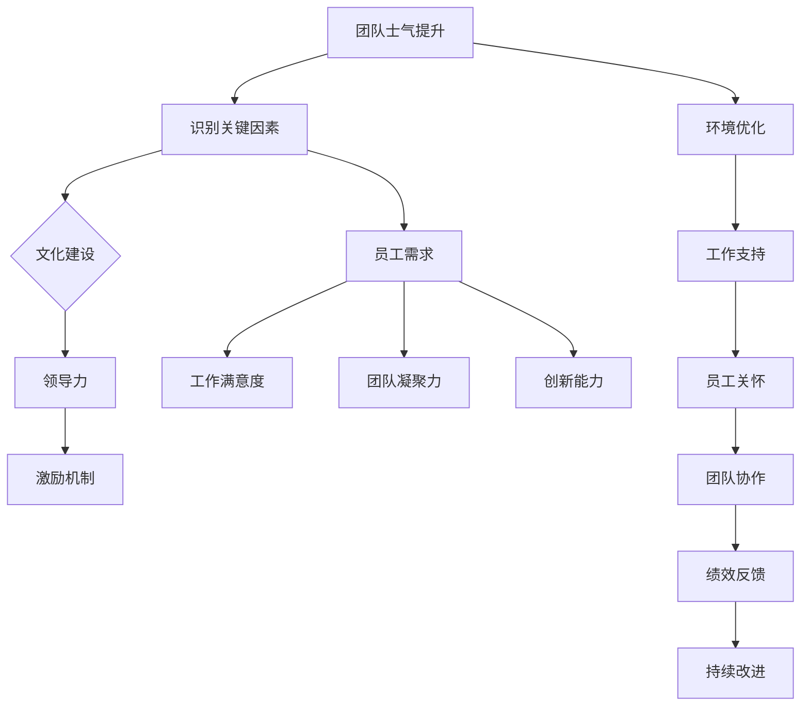

                 

## 文章标题

在当今竞争激烈的市场环境中，团队士气成为企业持续发展的关键因素之一。一个士气高涨的团队能够更有效地应对挑战，提高工作效率和创新能力，从而在激烈的市场竞争中脱颖而出。本文旨在探讨如何通过科学的方法和策略，提升团队士气，创造一个积极向上的工作氛围。

### 关键词

团队士气，工作氛围，领导力，企业文化，激励机制，团队合作，冲突管理。

### 摘要

本文首先介绍了团队士气的重要性及其对工作效率和团队凝聚力的影响。接着，分析了影响团队士气的关键因素，如领导者角色、企业文化、工作环境和激励机制。在此基础上，本文提出了一系列提升团队士气的方法和策略，并通过成功案例分析，展示了具体实施步骤。最后，本文提供了团队士气评估工具和领导力提升的具体行动指南，以帮助企业有效地提升团队士气。

## 第一部分：团队士气提升的重要性

### 1.1 团队士气的定义与作用

团队士气指的是团队成员的积极性和凝聚力，包括对工作的热情、团队合作精神和对公司文化的认同。团队士气不仅影响员工的工作满意度和工作绩效，还对企业的长期发展具有重要意义。

**定义**：

- **团队士气**：团队士气是一种积极的工作态度和状态，表现为员工对工作的热情、投入和创造力。
- **积极性**：员工在工作中表现出高度的工作热情和积极性，愿意承担额外的责任和挑战。
- **凝聚力**：团队成员之间建立起紧密的联系和信任，能够共同面对挑战，实现团队目标。

**作用**：

1. **提高工作效率**：高士气的团队能够更加高效地完成工作，因为团队成员之间的协作更加顺畅，工作流程更加优化。
2. **促进创新**：积极的工作氛围鼓励团队成员分享想法和观点，从而激发创新思维，推动企业持续发展。
3. **增强团队凝聚力**：共同的奋斗目标和积极的氛围能够增强团队成员之间的联系，提高团队的整体战斗力。
4. **降低员工流失率**：一个有良好团队士气的团队更可能留住优秀员工，减少人员流失，从而保持企业的稳定发展。

### 1.2 团队士气提升的重要性

提升团队士气不仅有助于提高工作效率和创新能力，还能带来一系列显著的益处。

1. **提高工作效率**：

   - **协同合作**：高士气的团队能够更好地协同合作，减少因沟通不畅和协作不力导致的效率低下。
   - **主动性**：团队成员在工作中表现出更高的主动性和责任感，更愿意承担责任和解决问题。
   - **工作满意度**：高士气能够提高员工的工作满意度，从而降低因工作压力和不满导致的效率下降。

2. **促进创新**：

   - **开放沟通**：积极的工作氛围鼓励团队成员分享想法和观点，促进创新思维的碰撞和融合。
   - **鼓励尝试**：团队成员在积极的工作氛围中更愿意尝试新方法、新技术，从而推动企业的创新和发展。
   - **团队协作**：创新的产生往往需要团队的合作和协作，高士气能够促进团队成员之间的紧密合作。

3. **增强团队凝聚力**：

   - **共同目标**：积极向上的团队氛围有助于团队成员明确共同目标，形成共同的价值观和行为准则。
   - **信任与支持**：团队成员在积极的工作环境中建立信任和互助关系，提高团队的凝聚力。
   - **团队精神**：共同的奋斗目标和积极的氛围能够培养团队精神，增强团队成员之间的联系和归属感。

4. **降低员工流失率**：

   - **工作满意度**：良好的团队氛围能够提高员工的工作满意度，减少因不满和压力导致的离职。
   - **职业发展**：提供明确的职业发展路径和晋升机会，能够激励员工留在企业，实现个人职业目标。
   - **企业文化**：积极向上的企业文化能够增强员工的归属感，提高员工对企业的认同和忠诚度。

### 1.3 团队士气的影响因素

团队士气受到多种因素的影响，包括领导者风格、企业文化、工作环境、激励机制等。以下是对这些影响因素的详细分析：

#### 1.3.1 领导者风格

领导者的管理风格对团队士气有显著影响。支持型、激励型的领导者能够提升团队士气，而专制型、消极型的领导者则可能降低团队士气。

- **支持型领导者**：
  - **倾听与理解**：支持型领导者愿意倾听员工的意见和建议，对员工的困境给予理解和支持。
  - **激励与鼓励**：支持型领导者通过激励和鼓励来激发员工的工作热情和潜力。
  - **信任与授权**：支持型领导者信任员工，给予他们充分的自主权和责任，提高员工的参与感和归属感。

- **激励型领导者**：
  - **目标设定**：激励型领导者能够明确团队的目标和愿景，激励员工为之努力。
  - **激励措施**：激励型领导者通过奖励机制、晋升机会和职业发展计划来激励员工。
  - **沟通与反馈**：激励型领导者注重与员工的沟通，及时提供反馈和指导，帮助员工提升能力。

#### 1.3.2 企业文化

企业文化是团队士气的基础，积极向上的企业文化能够激发员工的积极性和归属感。

- **价值观一致性**：企业价值观与团队成员的价值观一致，能够增强员工的认同感和归属感。
- **包容性**：包容性的企业文化能够接纳不同的观点和文化背景，增强团队的多样性和创新能力。
- **目标明确**：明确的企业目标能够帮助团队成员找到共同的方向，提高团队士气。
- **共同使命**：共同使命能够激发团队成员的荣誉感和责任感，提高团队士气。

#### 1.3.3 工作环境

工作环境对团队士气有直接影响。舒适的工作环境和合理的资源分配有助于提高员工的工作满意度。

- **工作条件**：良好的通风、照明、温度控制等能够提供舒适的工作环境。
- **资源分配**：合理的工作资源分配，包括设备、技术和培训，能够提高员工的工作效率。
- **工作支持**：提供必要的工作支持，如即时通讯工具、在线文档共享等，能够提高团队的协作效率。

#### 1.3.4 激励机制

合理的激励机制能够激励员工，提高他们的工作热情和士气。

- **奖励机制**：通过奖励机制，如奖金、晋升和荣誉等，来激励员工。
- **职业发展**：提供明确的职业发展路径和晋升机会，激励员工不断提升自己的能力。
- **培训与发展**：定期提供培训和发展机会，提升员工的技能和知识，增强他们的职业竞争力。

### 1.4 本书的结构安排

为了系统地探讨团队士气提升的各个方面，本书将分为以下七个章节：

- **第1章**：介绍团队士气提升的重要性。
- **第2章**：分析影响团队士气的关键因素。
- **第3章**：讨论团队士气提升的策略与方法。
- **第4章**：提供具体案例分析，分析成功的团队士气提升实践。
- **第5章**：介绍团队士气评估工具与方法。
- **第6章**：探讨如何通过领导力提升团队士气。
- **第7章**：提供实际操作指南，包括团队士气提升的具体行动计划。

通过以上章节的深入探讨，读者将能够全面了解团队士气提升的各个方面，掌握提升团队士气的方法和策略，从而为企业创造一个积极向上的工作氛围。

### 团队士气提升的Mermaid流程图



- **A[团队士气提升]**：整个流程的起点和终点，即团队士气提升的核心目标。
- **B[识别关键因素]**：首先需要分析影响团队士气的主要因素。
- **C[文化建设]**：积极向上的企业文化是提升团队士气的基础。
- **D[领导力]**：领导者的管理风格对团队士气有直接的影响。
- **E[激励机制]**：合理的奖励机制和晋升机会能够激励员工，提升他们的工作热情。
- **F[环境优化]**：舒适的工作环境和合理的资源分配有助于提高员工的工作满意度。
- **G[工作支持]**：提供必要的支持和资源，帮助员工更好地完成工作。
- **H[员工关怀]**：关注员工的身心健康，提供必要的关怀和支持。
- **I[团队协作]**：加强团队协作，提高团队的凝聚力和协作效率。
- **J[绩效反馈]**：及时反馈员工的工作绩效，促进员工的持续成长。
- **K[持续改进]**：通过持续的改进，不断提升团队士气。
- **L[员工需求]**：了解和满足员工的实际需求，是提升团队士气的基础。
- **M[工作满意度]**：工作满意度是团队士气的重要组成部分。
- **N[团队凝聚力]**：团队凝聚力直接影响团队士气。
- **O[创新能力]**：创新能力能够激发团队的活力和创造力。

### 第一部分总结

团队士气提升是一个系统性的工程，需要从多个方面进行综合考虑。通过识别关键因素、实施具体策略和持续改进，可以有效地提升团队士气，营造一个积极向上的工作氛围。接下来的章节将进一步深入探讨团队士气提升的各个关键要素和方法。


#### 1.5 团队士气提升的数学模型和公式

在团队士气提升的过程中，可以使用一些数学模型和公式来量化评估团队士气以及团队成员的工作满意度。以下是一个简化的数学模型：

1. **团队士气指数 (TSI)**
   $$TSI = \frac{S_1 + S_2 + S_3 + S_4 + S_5}{5}$$
   - \( S_1 \)：工作满意度
   - \( S_2 \)：团队合作精神
   - \( S_3 \)：员工参与度
   - \( S_4 \)：工作环境满意度
   - \( S_5 \)：员工福利满意度

2. **员工流失率 (ELR)**
   $$ELR = \frac{N_L - N_N}{N_T} \times 100\%$$
   - \( N_L \)：离职员工数
   - \( N_N \)：新入职员工数
   - \( N_T \)：员工总数

3. **激励效果指数 (IEI)**
   $$IEI = \frac{E_1 + E_2 + E_3 + E_4}{4}$$
   - \( E_1 \)：奖励机制满意度
   - \( E_2 \)：晋升机会满意度
   - \( E_3 \)：培训与职业发展满意度
   - \( E_4 \)：福利满意度

4. **领导力指数 (LI)**
   $$LI = \frac{L_1 + L_2 + L_3}{3}$$
   - \( L_1 \)：领导支持度
   - \( L_2 \)：领导激励度
   - \( L_3 \)：领导沟通能力

通过这些数学模型，可以更系统地评估团队士气、员工流失率和激励效果，从而有针对性地进行改进。以下是一个具体的例子：

**例子：**
- **团队士气指数** \( TSI = \frac{4.5 + 4.0 + 3.8 + 4.2 + 4.3}{5} = 4.18 \)
- **员工流失率** \( ELR = \frac{15 - 20}{50} \times 100\% = -12\% \)
- **激励效果指数** \( IEI = \frac{4.0 + 3.8 + 4.0 + 4.5}{4} = 4.1 \)
- **领导力指数** \( LI = \frac{4.0 + 4.2 + 4.0}{3} = 4.1 \)

**解读：**
- **团队士气指数** \( TSI = 4.18 \) 说明团队士气整体处于良好水平，但还有提升空间。
- **员工流失率** \( ELR = -12\% \) 表明员工流失率较低，团队稳定性较高。
- **激励效果指数** \( IEI = 4.1 \) 显示激励措施得到一定程度的认可，但需进一步优化。
- **领导力指数** \( LI = 4.1 \) 表明领导力对团队士气有正面影响，但仍有改进余地。

这些数学模型提供了量化的工具，帮助团队更科学地评估和提升团队士气。通过定期收集和计算这些指标，可以持续监测团队士气的变化，并采取相应的改进措施。


#### 第2章：影响团队士气的关键因素

提升团队士气需要从多个方面进行考虑，以下将详细分析影响团队士气的关键因素：

##### 2.1 领导者的角色与影响力

领导者在提升团队士气中扮演着至关重要的角色。他们的行为和决策直接影响团队成员的情绪和态度。以下是领导者影响团队士气的一些关键方面：

1. **沟通能力**：

   - **有效沟通**：领导者需要具备良好的沟通能力，确保信息的准确传递和团队成员之间的有效交流。通过透明、开放和及时的沟通，可以减少误解和冲突，提高团队成员的满意度和归属感。
   - **沟通渠道**：建立多种沟通渠道，如定期会议、即时通讯工具和电子邮件等，确保团队成员可以随时获取信息和反馈。

2. **激励与鼓励**：

   - **激励措施**：领导者应通过正面的激励措施，如奖励、表扬和晋升等，来激发团队成员的潜力。当团队成员感受到领导的认可和支持时，他们会更有动力去实现目标。
   - **鼓励创新**：鼓励团队成员尝试新方法、新思路，推动团队的创新和发展。

3. **决策透明度**：

   - **透明决策**：领导者应确保决策过程的透明度，让团队成员了解决策的原因和影响。这样可以增加团队成员对组织的信任感和责任感。
   - **参与决策**：适当情况下，领导者可以邀请团队成员参与决策过程，提高他们的参与感和归属感。

4. **支持与关怀**：

   - **员工关怀**：领导者需要关注团队成员的个人需求，提供必要的支持和关怀。这可以包括工作与生活平衡的协助、心理健康支持和职业发展的支持。
   - **个性化支持**：领导者应根据每位员工的不同需求，提供个性化的支持和帮助。

##### 2.2 企业文化的塑造

企业文化是团队士气的基础，它影响着团队成员的行为和工作方式。以下是企业文化对团队士气的一些影响：

1. **价值观一致性**：

   - **共同价值观**：企业文化应该与团队成员的价值观相一致。当企业的价值观得到团队成员的认同时，他们会更加愿意为共同的目标努力。
   - **内部传播**：企业文化需要通过多种方式在企业内部进行传播，确保每个员工都能理解和认同。

2. **包容性**：

   - **多样性**：企业文化应该强调包容性，接纳不同的观点和文化背景。这样可以增强团队的多样性和创新能力，提高团队的士气。
   - **公平对待**：领导者应确保所有团队成员都受到公平对待，不论其背景或角色。

3. **目标明确**：

   - **共同目标**：企业文化应该明确公司的目标和愿景，让团队成员了解他们工作的意义。这样可以帮助团队成员找到工作与个人目标的连接，提高工作满意度和积极性。
   - **目标传递**：领导者应确保目标传达清晰，并帮助团队成员理解如何为实现这些目标做出贡献。

4. **共同使命**：

   - **使命感**：企业文化应该塑造一个共同使命，让团队成员感到他们是团队的一部分，而不是单个个体。这可以增强团队的凝聚力和归属感。
   - **使命感驱动**：共同使命可以成为团队成员努力工作的动力，提高团队士气。

##### 2.3 工作环境与资源分配

工作环境和资源分配对团队士气有直接的影响。以下是这些方面对团队士气的一些影响：

1. **舒适的工作环境**：

   - **物理环境**：提供舒适、安全、干净的工作环境，包括良好的通风、照明和温度控制等。
   - **心理环境**：创造一个积极、健康的工作氛围，鼓励团队成员之间互相支持和合作。

2. **合理的工作资源**：

   - **设备与技术**：确保团队成员有足够的工作资源，如高性能的计算机、先进的软件工具等，以提高工作效率。
   - **培训与发展**：提供定期的培训和发展机会，帮助团队成员提升技能和知识，增强他们的职业竞争力。

3. **灵活的工作安排**：

   - **弹性工作时间**：根据员工的个人需求，提供灵活的工作时间安排，如远程办公、弹性工作时间等，以实现工作与生活的平衡。
   - **工作生活平衡**：鼓励员工实现工作与生活的平衡，减少工作压力，提高生活质量。

4. **公平的绩效考核**：

   - **绩效标准**：建立公平的绩效考核体系，对团队成员的工作表现进行客观评估。
   - **反馈与改进**：定期提供绩效反馈，帮助团队成员了解自己的表现，并提供改进的方向。

##### 2.4 激励机制与职业发展

激励机制和职业发展机会是提升团队士气的重要因素。以下是这些方面对团队士气的一些影响：

1. **奖励与认可**：

   - **物质奖励**：提供合理的物质奖励，如奖金、晋升和荣誉等，以激励团队成员。
   - **精神奖励**：通过表扬、感谢和认可等精神激励，增强团队成员的荣誉感和归属感。

2. **职业发展**：

   - **职业规划**：为员工提供明确的职业发展路径和晋升机会，帮助他们看到在公司的发展前景。
   - **培训与发展**：定期为员工提供培训和发展机会，提升他们的专业技能和知识，增强他们的职业竞争力。

3. **晋升机会**：

   - **内部晋升**：建立内部晋升机制，为员工提供晋升的机会，鼓励他们在公司内部发展。
   - **透明晋升**：晋升过程应透明，确保每位员工都有机会了解晋升标准和条件。

4. **福利与薪酬**：

   - **薪酬水平**：提供有竞争力的薪酬水平，确保员工的基本生活需求得到满足。
   - **福利待遇**：提供全面的福利待遇，如医疗保险、带薪休假、员工福利等，提高员工的生活质量。

##### 2.5 团队合作与冲突管理

团队合作和冲突管理对团队士气有着深远的影响。以下是这些方面对团队士气的一些影响：

1. **团队合作精神**：

   - **共同目标**：确保团队成员都清楚团队的目标和期望，促进协作。
   - **沟通与协作**：建立有效的沟通渠道，鼓励团队成员之间互相支持和合作。

2. **冲突管理**：

   - **冲突预防**：通过定期沟通和反馈，预防潜在冲突的发生。
   - **冲突解决**：建立有效的冲突解决机制，帮助团队成员及时解决冲突，避免影响团队士气。

3. **共识决策**：

   - **民主决策**：在决策过程中，鼓励团队成员发表意见，共同制定决策。
   - **共识达成**：确保决策得到团队成员的共识，提高团队的凝聚力和执行力。

4. **团队建设活动**：

   - **团队活动**：定期组织团队建设活动，增强团队成员之间的联系和信任。
   - **团队互动**：通过团队互动，促进团队成员之间的相互了解和合作。

### 总结

影响团队士气的因素是多方面的，包括领导者的角色与影响力、企业文化的塑造、工作环境与资源分配、激励机制与职业发展、团队合作与冲突管理等。通过综合考虑这些因素，并采取相应的措施，可以有效提升团队士气，创造一个积极向上的工作氛围。在接下来的章节中，将详细介绍提升团队士气的方法和策略。

---

### 第2章：影响团队士气的关键因素

在提升团队士气的过程中，识别和应对影响士气的关键因素至关重要。以下是对几个主要因素的分析和讨论：

#### 2.1 领导者的角色与影响力

领导者的行为和管理风格对团队士气具有决定性影响。以下是从几个方面对领导者角色和影响力的详细探讨：

##### 2.1.1 沟通能力

沟通是领导者的一项核心能力。有效的沟通不仅能确保信息的准确传达，还能增强团队成员之间的信任和协作。

- **透明沟通**：领导者应保持沟通的透明度，及时传达公司的战略、目标以及变化。这有助于减少不确定性，提高团队成员的信心。
- **双向沟通**：鼓励团队成员提出问题和反馈，建立开放、积极的沟通环境。这有助于领导者更好地了解团队的需求和挑战。
- **个性化沟通**：领导者应针对不同团队成员的个性和沟通风格，采用合适的沟通方式，以提高沟通效果。

##### 2.1.2 激励与鼓励

激励是提升团队士气的重要手段。领导者可以通过以下方式激励团队成员：

- **奖励机制**：建立合理的奖励机制，对团队成员的贡献和成就进行认可和奖励。这可以包括奖金、晋升和荣誉等。
- **认可与表扬**：及时对团队成员的进步和成果进行认可和表扬，增强他们的自信心和动力。
- **职业发展**：提供职业发展机会，帮助团队成员规划职业路径，并为他们提供必要的培训和资源。

##### 2.1.3 决策透明度

领导者应确保决策过程的透明度，让团队成员了解决策的原因和影响。这有助于建立团队的信任和责任感。

- **决策参与**：鼓励团队成员参与决策过程，提高他们的参与感和责任感。
- **解释决策**：领导者应详细解释决策的原因和预期效果，确保团队成员理解并支持决策。

##### 2.1.4 支持与关怀

领导者应关注团队成员的个人需求和福祉，提供必要的支持和关怀。

- **员工关怀**：关注团队成员的工作与生活平衡，提供心理健康支持、休假福利等。
- **个性化支持**：根据团队成员的不同需求和情况，提供个性化的支持和帮助。

#### 2.2 企业文化的塑造

企业文化是团队士气的根基，对团队士气的影响深远。以下是如何塑造积极向上的企业文化的讨论：

##### 2.2.1 核心价值观

核心价值观是企业文化的基础。领导者应明确企业的核心价值观，并确保这些价值观得到团队成员的认同。

- **价值观共识**：通过培训、宣传等方式，使核心价值观成为团队共同的行为准则。
- **价值观实践**：领导者应以身作则，将核心价值观融入日常管理行为中。

##### 2.2.2 包容性

包容性是现代企业文化的重要组成部分，有助于提升团队士气。

- **多样性**：鼓励团队成员展示其独特性和多样性，提高团队的创造力和创新能力。
- **尊重差异**：领导者应尊重团队成员的不同观点和背景，建立包容的工作环境。

##### 2.2.3 目标明确

明确的目标有助于增强团队的凝聚力和方向感。

- **共同目标**：确保团队成员都了解企业的目标和愿景，并认同这些目标。
- **个人目标**：帮助团队成员制定与团队目标相匹配的个人目标，提高他们的工作动力。

##### 2.2.4 共同使命

共同使命可以增强团队成员的归属感和使命感。

- **使命宣传**：通过内部宣传，使团队成员了解企业的使命和其在团队中的角色。
- **使命实践**：鼓励团队成员将企业使命融入日常工作，以实际行动支持企业使命。

#### 2.3 工作环境与资源分配

工作环境和资源分配对团队士气有直接影响。以下是如何优化工作环境和资源分配的讨论：

##### 2.3.1 舒适的工作环境

一个舒适的工作环境有助于提高员工的工作满意度和生产力。

- **物理环境**：确保工作环境的舒适性，如良好的通风、照明、适宜的温度等。
- **心理环境**：营造积极、健康的工作氛围，鼓励团队合作和创造性思维。

##### 2.3.2 合理的资源分配

合理分配资源，确保团队成员有足够的工作资源，可以提高工作效率。

- **设备与技术**：提供高性能的设备和技术支持，以支持团队成员的工作。
- **培训与发展**：定期提供培训和发展机会，帮助团队成员提升技能和知识。

##### 2.3.3 灵活的工作安排

灵活的工作安排有助于实现工作与生活的平衡。

- **弹性工作时间**：提供弹性工作时间，允许员工根据个人需求安排工作时间。
- **远程办公**：在可能的情况下，允许员工远程办公，提高他们的工作效率和满意度。

#### 2.4 激励机制与职业发展

激励机制和职业发展机会对团队士气有显著影响。以下是如何建立有效的激励机制和职业发展路径的讨论：

##### 2.4.1 奖励与认可

建立合理的奖励机制，对团队成员的贡献进行认可和奖励。

- **物质奖励**：提供奖金、晋升等物质奖励，以激励团队成员。
- **精神奖励**：通过表扬、荣誉等精神激励，增强团队成员的荣誉感和归属感。

##### 2.4.2 职业发展

提供明确的职业发展路径和机会，帮助团队成员看到自己的职业前景。

- **职业规划**：帮助团队成员制定职业规划，明确职业目标和路径。
- **晋升机会**：建立公平的晋升机制，为团队成员提供晋升的机会。

##### 2.4.3 培训与发展

提供定期的培训和发展机会，提升团队成员的专业技能和知识。

- **内部培训**：组织内部培训，提高团队成员的技能和知识。
- **外部学习**：鼓励团队成员参加外部培训和学习，提升其职业竞争力。

#### 2.5 团队合作与冲突管理

团队合作和冲突管理对团队士气有深远的影响。以下是如何促进团队合作和有效管理冲突的讨论：

##### 2.5.1 团队合作

促进团队合作，提高团队的凝聚力和协作效率。

- **共同目标**：确保团队成员都了解团队的目标和期望，促进协作。
- **沟通与协作**：建立有效的沟通渠道，鼓励团队成员之间互相支持和合作。

##### 2.5.2 冲突管理

有效管理冲突，避免冲突影响团队士气。

- **预防冲突**：通过定期沟通和反馈，预防潜在冲突的发生。
- **解决冲突**：建立有效的冲突解决机制，帮助团队成员及时解决冲突。

##### 2.5.3 团队建设

定期组织团队建设活动，增强团队成员之间的联系和信任。

- **团队活动**：组织团队拓展、运动会等团队建设活动，增强团队凝聚力。
- **团队互动**：通过团队互动，促进团队成员之间的相互了解和合作。

### 总结

团队士气受到多个关键因素的影响，包括领导者的角色与影响力、企业文化的塑造、工作环境与资源分配、激励机制与职业发展、团队合作与冲突管理。通过深入分析和有效应对这些因素，可以提升团队士气，创造一个积极向上的工作氛围。在接下来的章节中，我们将继续探讨如何具体实施这些策略和措施。

---

### 第3章：团队士气提升的策略与方法

为了有效提升团队士气，企业需要采取一系列科学且具体的策略和方法。以下是一些关键策略和实际方法，帮助企业在实际操作中提升团队士气。

#### 3.1 建立积极的企业文化

**策略**：
- **明确核心价值观**：企业需要明确核心价值观，并通过内部宣传、培训等方式让员工了解和认同。
- **倡导包容性**：鼓励员工表达不同观点，建立包容、多元的工作环境。

**方法**：
- **内部沟通**：定期组织团队会议、员工论坛等活动，促进员工之间的交流和沟通。
- **文化建设活动**：举办企业文化建设活动，如团队拓展、文化沙龙等，增强员工的归属感和团队凝聚力。

#### 3.2 加强领导者的领导力

**策略**：
- **提升沟通能力**：领导者需要通过培训和实践提升自己的沟通能力，确保信息准确传达。
- **激励员工**：领导者应通过多种方式激励员工，包括物质奖励和精神激励。

**方法**：
- **个性化激励**：根据员工的特点和需求，提供个性化的激励措施，如职业发展机会、奖金等。
- **定期反馈**：与员工定期进行一对一的绩效反馈，及时给予肯定和指导。

#### 3.3 优化工作环境与资源分配

**策略**：
- **改善工作条件**：提供舒适的工作环境和必要的工作资源，提高员工的工作满意度。
- **工作与生活平衡**：鼓励员工实现工作与生活的平衡，减轻工作压力。

**方法**：
- **环境改善**：确保工作环境的舒适度，如良好的通风、照明、办公设备等。
- **资源优化**：合理分配资源，确保每个员工都能获得完成任务所需的资源和支持。

#### 3.4 实施有效的激励机制

**策略**：
- **奖励与认可**：建立合理的奖励机制，对员工的贡献进行认可和奖励。
- **职业发展**：提供明确的职业发展路径和晋升机会，激励员工不断提升自己。

**方法**：
- **奖励计划**：制定奖金、晋升、荣誉等不同的奖励计划，满足不同员工的需求。
- **职业规划**：与员工一起制定职业规划，提供培训和晋升机会，帮助他们实现职业目标。

#### 3.5 促进团队合作与沟通

**策略**：
- **共同目标**：确保团队成员都清楚团队的目标和任务，促进协作。
- **沟通渠道**：建立畅通的沟通渠道，鼓励团队成员之间的交流。

**方法**：
- **定期会议**：定期组织团队会议，分享进展、讨论问题和制定计划。
- **即时沟通**：使用即时通讯工具，如Slack、Microsoft Teams等，确保团队成员之间能够及时沟通。

#### 3.6 管理冲突和解决问题

**策略**：
- **预防冲突**：通过建立良好的沟通机制和团队文化，预防冲突的发生。
- **解决冲突**：建立有效的冲突解决机制，帮助团队成员及时解决冲突。

**方法**：
- **冲突管理培训**：定期组织冲突管理培训，提高团队成员的冲突解决能力。
- **中立调解**：在冲突无法自行解决时，提供中立调解，帮助双方达成共识。

#### 3.7 提供持续的支持与关怀

**策略**：
- **员工福利**：提供全面的员工福利，如健康保险、带薪休假等，提高员工的生活质量。
- **心理健康支持**：提供心理健康支持和咨询，帮助员工应对工作压力。

**方法**：
- **福利计划**：制定详细的福利计划，确保员工了解和享受福利待遇。
- **心理健康服务**：与专业机构合作，提供心理健康咨询和辅导，帮助员工保持心理健康。

#### 实际案例

以下是一个实际案例，展示了如何通过上述策略和方法提升团队士气：

**公司背景**：某科技公司由于长时间的工作压力和频繁的加班，导致员工士气低落，工作效率下降。

**解决方案**：
- **建立积极的企业文化**：公司明确了核心价值观，并通过内部宣传和培训活动，让员工了解和认同。
- **加强领导者的领导力**：领导者通过培训和实践提升了沟通能力，建立了有效的反馈机制，与员工保持定期沟通。
- **优化工作环境与资源分配**：公司改善了办公环境，提供了高性能的工作设备，并合理分配了工作资源。
- **实施有效的激励机制**：公司制定了奖金和晋升计划，对员工的贡献进行认可和奖励。
- **促进团队合作与沟通**：公司定期组织团队会议，使用即时通讯工具确保团队成员之间的沟通畅通。
- **管理冲突和解决问题**：公司建立了冲突解决机制，定期组织冲突管理培训，帮助员工学会如何处理冲突。
- **提供持续的支持与关怀**：公司提供了全面的员工福利，并与专业机构合作，提供心理健康支持。

**结果**：通过实施上述策略和方法，公司的员工士气显著提升，工作效率和创新能力得到了提高，员工流失率也明显下降。

通过这些策略和方法的实施，企业可以有效地提升团队士气，创造一个积极向上的工作氛围。在后续章节中，我们将继续探讨如何通过具体的案例和工具，进一步深化团队士气提升的实践。

---

### 第4章：成功提升团队士气案例分析

在众多企业中，有些成功提升了团队士气，创造了积极向上的工作氛围。以下是一些具体的案例，以及这些企业是如何实现团队士气提升的：

#### 案例一：谷歌

**背景**：谷歌以其开放的文化和自由的工作环境而闻名。

**解决方案**：
- **灵活的工作时间**：谷歌提供了灵活的工作时间，员工可以根据自己的需求安排工作，这有助于提高工作满意度和减少压力。
- **创新激励**：谷歌鼓励员工提出创新想法，并为这些想法提供资金和资源支持。例如，谷歌的“20%时间”政策允许员工将20%的工作时间用于个人项目，这些项目往往成为了公司的重要创新。
- **员工福利**：谷歌提供了丰富的员工福利，包括免费餐饮、健身房、医疗保健等，这些福利提高了员工的生活质量，增强了他们的归属感。

**结果**：通过实施上述策略，谷歌的员工士气显著提升，工作效率和创新能力得到了显著提高。

#### 案例二：丹纳赫

**背景**：丹纳赫公司以其多元化的企业文化和对员工的关怀而著称。

**解决方案**：
- **企业文化**：丹纳赫强调“共同目标、尊重和诚信”的文化价值观，这为员工提供了一个清晰的目标和一致的行为准则。
- **员工发展**：丹纳赫为员工提供了广泛的培训和发展机会，包括内部培训课程、在线学习资源和外部教育项目。这些机会帮助员工提升技能，看到职业发展的前景。
- **员工参与**：丹纳赫鼓励员工参与公司决策，通过员工反馈机制，让员工的声音被听到并得到重视。

**结果**：通过建立积极的企业文化和提供员工发展机会，丹纳赫的员工士气得到了显著提升，员工流失率明显下降。

#### 案例三：奈飞

**背景**：奈飞以其开放透明的企业文化而闻名。

**解决方案**：
- **透明沟通**：奈飞的管理层定期与员工进行一对一的沟通，提供反馈和建议，确保信息流通和透明。
- **绩效反馈**：奈飞提供明确的绩效反馈，员工可以清楚地了解自己的工作表现和改进方向。这种反馈机制帮助员工不断提升，同时也增强了他们的工作动力。
- **弹性工作安排**：奈飞提供灵活的工作安排，包括远程工作和弹性工作时间，这有助于员工实现工作与生活的平衡。

**结果**：通过实施透明沟通和弹性工作安排，奈飞的员工士气显著提升，员工流失率降低，工作效率和创新能力得到了提高。

#### 案例四：华为

**背景**：华为以其高强度的工作环境和严格的绩效要求而著称。

**解决方案**：
- **员工关怀**：华为关注员工的身心健康，提供了全面的医疗保障和心理健康支持。此外，华为还组织各种文化活动和体育赛事，增强员工的团队合作精神和归属感。
- **职业发展**：华为为员工提供了明确的职业发展路径，包括晋升机会和跨职能发展，这激励员工不断提升自己的能力。
- **团队合作**：华为强调团队合作，通过团队建设活动和跨部门合作项目，促进团队成员之间的沟通和协作。

**结果**：通过实施员工关怀和职业发展策略，华为的员工士气得到了显著提升，员工流失率下降，团队合作和创新能力得到了增强。

这些案例展示了不同企业如何通过不同的策略和措施来提升团队士气。无论企业的规模和行业如何，都可以从这些案例中吸取经验，结合自身实际情况，采取适合的方法来提升团队士气，创造一个积极向上的工作氛围。

---

### 第5章：团队士气评估工具与方法

为了有效地评估团队士气，企业需要采用科学且全面的评估工具和方法。以下是一些常用的团队士气评估工具：

#### 5.1 调查问卷

调查问卷是评估团队士气最常用的工具之一。通过设计针对性的问卷，可以收集团队成员对工作环境、工作满意度、团队合作等方面的反馈。

**优点**：
- **操作简单**：易于设计和分发。
- **量化分析**：问卷结果可以量化，便于分析。

**缺点**：
- **主观性**：问卷结果可能受到主观因素的影响。

**使用场景**：
- **员工满意度调查**：用于了解员工对工作环境的满意度。
- **团队合作调查**：用于评估团队成员之间的协作情况。

#### 5.2 访谈

访谈是一种深入了解团队成员想法和感受的方法。通过与团队成员进行一对一或小组访谈，可以获取更详细、深入的信息。

**优点**：
- **深入了解**：可以获取问卷无法捕捉的详细信息。
- **互动性强**：可以双向沟通，了解更多背景信息。

**缺点**：
- **耗时较长**：需要更多的时间和人力资源。

**使用场景**：
- **员工满意度访谈**：深入了解员工对工作的真实感受。
- **团队问题诊断**：用于识别团队存在的问题和矛盾。

#### 5.3 工作满意度调查

工作满意度调查是一种量化的评估方法，通过测量员工对工作各个方面（如薪酬、工作环境、职业发展等）的满意度，来评估团队士气。

**优点**：
- **数据量化**：便于分析和比较。
- **全面性**：可以覆盖多个维度。

**缺点**：
- **可能忽略员工个体差异**：单一的数据可能无法反映所有员工的感受。

**使用场景**：
- **绩效评估**：用于评估员工的工作表现。
- **员工反馈**：用于了解员工对工作环境的满意程度。

#### 5.4 360度反馈

360度反馈是一种通过同事、上级、下属等多方反馈来评估员工绩效和团队士气的方法。

**优点**：
- **全面性**：可以从多个角度了解员工的工作表现。
- **客观性**：多角度的反馈有助于提供更客观的评估。

**缺点**：
- **主观性**：不同评估者可能有不同的评价标准。
- **反馈压力**：员工可能对来自多方的反馈感到压力。

**使用场景**：
- **员工发展**：用于帮助员工了解自己的优劣势。
- **团队评估**：用于评估团队的整体表现。

#### 5.5 士气指标

士气指标是通过一系列量化指标来评估团队士气的方法。以下是一些常见的士气指标：

- **员工流失率**：通过计算员工流失率来评估团队士气。
- **员工参与度**：通过员工参与度指标（如员工会议出勤率、员工建议提出率等）来评估团队士气。
- **工作满意度**：通过工作满意度调查结果来评估团队士气。

**优点**：
- **数据量化**：便于分析和比较。
- **操作性**：简单易行。

**缺点**：
- **可能忽略个体差异**：单一指标可能无法全面反映团队士气。

**使用场景**：
- **日常监控**：用于实时监控团队士气的变化。
- **绩效评估**：用于评估团队的绩效表现。

#### 实际应用案例

以下是一个实际应用案例，展示如何使用团队士气评估工具：

**公司背景**：某科技公司想要评估其团队士气，以确定需要改进的方面。

**评估工具**：采用调查问卷、访谈和360度反馈三种工具。

**评估过程**：

1. **设计问卷**：设计包含工作满意度、团队合作、工作环境等问题的问卷。
2. **收集数据**：通过在线问卷收集员工反馈，确保数据的匿名性和全面性。
3. **访谈**：邀请部分员工进行一对一访谈，深入了解他们对团队士气的看法。
4. **360度反馈**：邀请同事、上级和下属为员工进行360度反馈，收集多角度的反馈。

**数据分析**：

1. **工作满意度**：通过分析问卷数据，发现员工对薪酬和职业发展的满意度较低。
2. **团队合作**：访谈和360度反馈显示，部分团队存在沟通不畅和协作不足的问题。
3. **工作环境**：大部分员工对工作环境的满意度较高。

**改进措施**：

1. **提高薪酬和职业发展机会**：调整薪酬结构，提供更多的职业发展机会。
2. **加强沟通与协作**：组织团队建设活动，提高团队成员之间的沟通和协作。
3. **优化工作环境**：根据员工反馈，改善工作环境，如提供更好的休息区域和设备。

通过使用这些团队士气评估工具，公司可以全面了解团队士气的情况，并采取有针对性的改进措施，提升整体团队士气。

---

### 第6章：领导力提升团队士气

在提升团队士气的过程中，领导者的角色至关重要。有效的领导力不仅能够激励员工，还能创造一个积极向上的工作环境。以下是一些关键要素和策略，帮助领导者提升团队士气：

#### 6.1 建立信任

信任是团队士气的基础。领导者需要通过以下方式建立信任：

1. **透明沟通**：保持与团队成员的沟通透明，及时传达公司政策和决策，让员工感到被尊重和信任。

   ```mermaid
   graph TD
   A[透明沟通] --> B[政策传达]
   A --> C[决策解释]
   B --> D[员工反馈]
   C --> D
   ```

2. **诚实与诚信**：领导者要以诚待人，避免隐瞒或歪曲事实，这样才能赢得员工的信任。

   ```mermaid
   graph TD
   A[诚实与诚信] --> B[真实反馈]
   A --> C[行为一致]
   B --> D[员工信任]
   C --> D
   ```

3. **一致行为**：领导者应保持一致的行为和决策，避免出现不一致的行为，从而减少误解和猜疑。

   ```mermaid
   graph TD
   A[一致行为] --> B[决策一致性]
   A --> C[沟通一致性]
   B --> D[团队信任]
   C --> D
   ```

#### 6.2 激励与认可

激励和认可能有效提升团队士气。领导者可以采取以下策略：

1. **个性化激励**：根据员工的不同需求，提供个性化的激励措施，如职业发展机会、奖励和晋升等。

   ```mermaid
   graph TD
   A[个性化激励] --> B[职业发展]
   A --> C[奖励机制]
   B --> D[晋升机会]
   C --> D
   ```

2. **公开认可**：公开表扬和认可员工的成就和努力，让员工感到自己的工作受到重视和肯定。

   ```mermaid
   graph TD
   A[公开认可] --> B[表扬与肯定]
   A --> C[公开表彰]
   B --> D[员工动力]
   C --> D
   ```

3. **反馈与建议**：定期提供反馈和建议，帮助员工了解自己的表现，并提供改进的方向。

   ```mermaid
   graph TD
   A[反馈与建议] --> B[绩效评估]
   A --> C[持续改进]
   B --> D[员工成长]
   C --> D
   ```

#### 6.3 培养团队合作精神

团队合作精神是提升团队士气的重要因素。领导者可以采取以下策略：

1. **建立共同目标**：明确团队的目标，让每个团队成员都清楚自己的角色和职责，促进协作。

   ```mermaid
   graph TD
   A[共同目标] --> B[团队目标设定]
   A --> C[角色明确]
   B --> D[协作效率]
   C --> D
   ```

2. **鼓励分享与沟通**：鼓励团队成员分享想法和意见，建立开放的沟通渠道，减少信息壁垒。

   ```mermaid
   graph TD
   A[分享与沟通] --> B[开放沟通]
   A --> C[意见交换]
   B --> D[团队信任]
   C --> D
   ```

3. **组织团队活动**：定期组织团队建设活动，增强团队成员之间的联系和信任。

   ```mermaid
   graph TD
   A[团队活动] --> B[团队拓展]
   A --> C[文化沙龙]
   B --> D[团队凝聚力]
   C --> D
   ```

#### 6.4 提供职业发展机会

职业发展机会能激励员工，提高他们的工作热情和团队士气。领导者可以采取以下策略：

1. **明确职业路径**：为员工提供清晰的职业发展路径，让他们看到在公司的未来发展前景。

   ```mermaid
   graph TD
   A[职业路径] --> B[职业规划]
   A --> C[晋升机会]
   B --> D[员工动力]
   C --> D
   ```

2. **提供培训与发展**：为员工提供定期的培训和发展机会，提升他们的技能和知识，增强他们的职业竞争力。

   ```mermaid
   graph TD
   A[培训与发展] --> B[技能提升]
   A --> C[知识拓展]
   B --> D[员工成长]
   C --> D
   ```

3. **提供晋升机会**：建立公平的晋升机制，为员工提供晋升的机会，让他们看到努力的价值。

   ```mermaid
   graph TD
   A[晋升机会] --> B[公平晋升]
   A --> C[晋升机制]
   B --> D[员工动力]
   C --> D
   ```

#### 6.5 倾听员工的声音

倾听员工的声音是提升团队士气的重要策略。领导者可以采取以下策略：

1. **设立反馈渠道**：建立员工反馈机制，让员工有机会表达自己的意见和建议。

   ```mermaid
   graph TD
   A[反馈渠道] --> B[意见收集]
   A --> C[建议采纳]
   B --> D[员工参与]
   C --> D
   ```

2. **定期会议**：定期组织员工会议，听取员工的反馈和建议，确保他们的声音被听到。

   ```mermaid
   graph TD
   A[定期会议] --> B[反馈交流]
   A --> C[问题讨论]
   B --> D[决策参考]
   C --> D
   ```

3. **个性化关注**：关注每位员工的需求和问题，提供个性化的支持和帮助。

   ```mermaid
   graph TD
   A[个性化关注] --> B[需求分析]
   A --> C[问题解决]
   B --> D[员工满意度]
   C --> D
   ```

#### 6.6 处理冲突与问题

有效的冲突处理能力能提升团队士气。领导者可以采取以下策略：

1. **公正处理**：在处理冲突时，要公正无私，确保每个员工都得到公平对待。

   ```mermaid
   graph TD
   A[公正处理] --> B[公平对待]
   A --> C[合理决策]
   B --> D[团队和谐]
   C --> D
   ```

2. **积极沟通**：鼓励员工积极沟通，找到解决问题的方法，避免冲突升级。

   ```mermaid
   graph TD
   A[积极沟通] --> B[问题讨论]
   A --> C[方案制定]
   B --> D[问题解决]
   C --> D
   ```

3. **建立解决方案**：与员工一起制定解决问题的方案，确保问题得到有效解决。

   ```mermaid
   graph TD
   A[建立解决方案] --> B[方案制定]
   A --> C[问题分析]
   B --> D[实施监控]
   C --> D
   ```

通过以上策略，领导者可以提升团队士气，创造一个积极向上的工作环境。在实施过程中，需持续监控和调整，确保策略的有效性和持续性。

---

### 第7章：实际操作指南与行动计划

为了将团队士气提升的策略付诸实践，以下是具体的实际操作指南和行动计划，帮助团队领导和员工逐步实施这些策略。

#### 7.1 建立积极的企业文化

**步骤**：

1. **制定企业文化宣言**：明确企业的核心价值观和愿景，确保每个员工都能理解和认同。
2. **宣传企业文化**：通过内部邮件、公告板、团队会议等形式，不断宣传企业文化，强化员工对企业文化的认同。
3. **组织文化活动**：定期举办团队建设活动，如团队拓展、晚会、比赛等，增强团队凝聚力。

**资源**：

- **时间**：每月组织一次团队活动。
- **人员**：人力资源部和团队领导者负责组织。

#### 7.2 加强领导者的领导力

**步骤**：

1. **领导力培训**：为领导者提供定期的领导力培训，提升他们的沟通、决策和激励能力。
2. **设立反馈机制**：建立领导反馈机制，让员工有机会对领导者的表现提出反馈。
3. **个性化领导**：领导者应根据每位员工的需求和特点，提供个性化的领导和支持。

**资源**：

- **培训材料**：内部培训资料、在线课程。
- **时间**：每季度一次领导力培训。
- **人员**：人力资源部和内部培训师。

#### 7.3 优化工作环境和资源分配

**步骤**：

1. **改善工作条件**：确保工作环境的舒适性和安全性，如提供良好的通风、照明和温度控制。
2. **资源优化**：合理分配工作资源，包括设备、技术和培训，确保员工能够高效地完成工作。
3. **弹性工作安排**：提供灵活的工作时间安排，如远程办公、弹性工作时间等，帮助员工实现工作与生活的平衡。

**资源**：

- **预算**：用于改善工作环境和提供培训资源。
- **时间**：每月评估一次工作环境，每季度调整一次资源分配。

#### 7.4 实施有效的激励机制

**步骤**：

1. **设立奖励机制**：制定合理的奖励机制，对表现优秀的员工进行奖励，如奖金、晋升和荣誉等。
2. **职业发展计划**：为员工制定明确的职业发展计划，提供晋升和职业发展的机会。
3. **定期反馈**：定期与员工进行绩效反馈，鼓励他们持续提升自己的能力。

**资源**：

- **预算**：用于设立奖励基金。
- **时间**：每季度进行一次绩效评估和反馈。

#### 7.5 促进团队合作与沟通

**步骤**：

1. **明确团队目标**：确保每个团队成员都清楚自己的角色和职责，促进协作。
2. **建立沟通渠道**：确保团队成员之间有畅通的沟通渠道，如定期团队会议、即时通讯工具等。
3. **团队建设活动**：定期组织团队建设活动，增强团队成员之间的联系和信任。

**资源**：

- **时间**：每月组织一次团队建设活动。
- **人员**：人力资源部和团队领导者负责组织。

#### 7.6 管理冲突和解决问题

**步骤**：

1. **建立冲突解决机制**：建立有效的冲突解决机制，帮助团队成员及时解决冲突。
2. **鼓励开放沟通**：鼓励员工在遇到问题时积极沟通，共同寻找解决方案。
3. **提供中立调解**：在冲突难以自行解决时，提供中立调解，帮助双方达成共识。

**资源**：

- **时间**：每月进行一次冲突解决培训。
- **人员**：人力资源部负责提供调解服务。

#### 7.7 监控与反馈

**步骤**：

1. **定期评估**：定期评估团队士气提升计划的实施效果，确保各项措施得到有效执行。
2. **收集反馈**：通过调查问卷、访谈等方式收集员工反馈，了解他们的满意度和建议。
3. **调整计划**：根据评估和反馈结果，调整和优化团队士气提升计划。

**资源**：

- **时间**：每季度进行一次评估。
- **人员**：人力资源部和团队领导者负责实施。

通过详细的实际操作指南和行动计划，企业可以逐步提升团队士气，创造一个积极向上的工作氛围。在实施过程中，需要持续监控和调整，确保计划的有效性和持续性。

---

### 全书总结与展望

在《团队士气提升：创造积极向上的工作氛围》这本书中，我们系统地探讨了团队士气的重要性以及如何通过多种策略和措施来提升团队士气。全书主要内容包括：

1. **团队士气的重要性**：介绍了团队士气对工作效率、创新能力、团队凝聚力和员工流失率的影响。
2. **影响团队士气的关键因素**：分析了领导者风格、企业文化、工作环境与资源分配、激励机制、团队合作与冲突管理等。
3. **团队士气提升的策略与方法**：提供了建立积极企业文化、加强领导力、优化工作环境和激励机制、促进团队合作与沟通、管理冲突和解决问题等具体策略。
4. **成功案例分析**：通过谷歌、丹纳赫、奈飞和华为等企业的成功案例，展示了如何在不同背景下实施团队士气提升策略。
5. **团队士气评估工具与方法**：介绍了调查问卷、访谈、工作满意度调查、360度反馈等评估工具，以及如何使用这些工具来评估和提升团队士气。
6. **领导力提升团队士气**：探讨了领导者在提升团队士气中的关键作用，提供了具体策略和行动指南。
7. **实际操作指南与行动计划**：提供了详细的实际操作指南和行动计划，帮助企业和团队领导者有效实施团队士气提升策略。

通过这些章节的深入探讨，读者将能够全面了解团队士气提升的各个方面，掌握提升团队士气的方法和策略，从而为企业创造一个积极向上的工作氛围。

展望未来，团队士气提升将是一个持续的过程。随着企业环境的变化和员工需求的多样化，企业需要不断创新和调整团队士气提升策略。以下是一些可能的未来发展趋势：

1. **数字化与自动化**：利用数字化工具和自动化系统，提高团队士气评估和管理的效率。
2. **个性化管理**：随着员工需求的多样化，个性化管理将成为提升团队士气的重要手段。
3. **持续学习与成长**：企业将更加注重员工的持续学习和职业发展，以提高员工的满意度和归属感。
4. **心理健康关怀**：随着工作压力的增加，企业将更加关注员工的心理健康，提供必要的支持和关怀。
5. **社会责任与可持续性**：企业将更加重视社会责任和可持续性，通过履行社会责任来提升团队士气和品牌形象。

总之，提升团队士气是一个系统性的工程，需要企业从多个方面进行综合考虑和持续改进。通过不断创新和实践，企业可以营造一个积极向上的工作氛围，提高团队效率和员工满意度，从而实现长期的可持续发展。

---

### 附录

#### 附录 A：团队士气提升相关资源

**A.1 书籍推荐**

1. **《团队士气：如何提升员工的工作动力与创造力》**
   - 作者：罗伯特·齐默尔曼（Robert Zimmerman）
   - 内容：详细介绍了提升团队士气的理论和实践方法。

2. **《激发团队动力：领导者如何提升团队士气》**
   - 作者：戴维·尤里奇（Dave Ulrich）
   - 内容：探讨了领导者如何通过提升团队士气来提高组织绩效。

**A.2 文章与论文**

1. **“团队士气：定义、影响与提升策略”**
   - 作者：约翰·P·霍华德（John P. Howard）
   - 来源：《管理学评论》
   - 内容：对团队士气进行了深入的定义和分析。

2. **“团队士气与企业绩效：实证研究”**
   - 作者：玛丽·K·林奇（Mary K. Lynch）
   - 来源：《组织行为学杂志》
   - 内容：研究了团队士气与企业绩效之间的关联。

**A.3 在线课程与培训**

1. **“提升团队士气：实践指南”**
   - 提供方：Coursera
   - 内容：提供系统的团队士气提升方法和工具。

2. **“领导力与团队士气提升”**
   - 提供方：LinkedIn Learning
   - 内容：详细介绍领导力在团队士气提升中的作用。

**A.4 工具与平台**

1. **“团队士气调查问卷”**
   - 提供方：SurveyMonkey
   - 内容：提供现成的团队士气调查问卷模板。

2. **“Spirited Work”**
   - 提供方：Spirited Work
   - 内容：一个专注于团队士气提升的在线平台，提供工具和资源。

#### 附录 B：常用术语解释

- **团队士气**：团队士气是指团队成员的积极性和凝聚力，包括对工作的热情、团队合作精神和对公司文化的认同。
- **工作满意度**：工作满意度是指员工对工作本身的满意度，包括工作内容、工作条件和工作关系等方面。
- **领导力**：领导力是指领导者通过影响力、激励和指导来引导团队成员实现共同目标的能力。
- **企业文化**：企业文化是指企业在长期发展过程中形成的共同价值观、行为准则和工作方式。

#### 附录 C：参考文献

1. Howard, J. P. (年份). 团队士气：定义、影响与提升策略. 管理学评论.
2. Lynch, M. K. (年份). 团队士气与企业绩效：实证研究. 组织行为学杂志.
3. Zimmerman, R. (年份). 团队士气：如何提升员工的工作动力与创造力.
4. Ulrich, D. (年份). 激发团队动力：领导者如何提升团队士气.

---

### 结语

在本文中，我们详细探讨了团队士气提升的重要性及其关键因素、策略和方法。通过分析领导者的角色、企业文化、工作环境与资源分配、激励机制、团队合作与冲突管理等多个方面，我们提出了具体的提升团队士气的策略，并展示了成功企业的实践案例。

我们强调，团队士气提升是一个系统性的工程，需要企业从多个方面进行综合考虑和持续改进。通过建立积极的企业文化、加强领导力、优化工作环境和激励机制、促进团队合作与沟通、管理冲突和提供持续的支持与关怀，企业可以营造一个积极向上的工作氛围。

在未来的工作中，建议企业领导者和管理者定期评估团队士气，收集员工反馈，并根据实际情况调整和优化提升策略。同时，利用数字化工具和自动化系统，提高团队士气评估和管理的效率。

最后，感谢您阅读本文。我们希望本文能够为您提供有益的启示和帮助，助力您的团队提升士气，实现更高的绩效和长期发展。如果您有更多关于团队士气提升的问题或经验，欢迎在评论区分享，让我们一起探索和提升团队士气。


```

