                 

### 第1章：团队沟通的重要性

#### 1.1 沟通的概述

沟通是团队协作的核心，是信息传递、思想交流、情感表达的重要方式。有效的沟通能够消除误解、增进理解、提高工作效率，从而促进团队目标的实现。

在技术领域，团队沟通的重要性尤为突出。团队成员需要通过沟通来分享技术知识、讨论解决方案、协调工作进度。以下是团队沟通的几个关键要素：

1. **信息传递**：团队成员需要及时、准确地传递信息，包括任务要求、技术方案、问题反馈等。这不仅有助于团队协作，还能提高项目效率。
2. **思想交流**：团队成员之间的思想碰撞能够激发创新思维，促进技术进步。通过有效沟通，团队成员可以共同探讨问题、分享经验，从而提升整体技术水平。
3. **情感表达**：沟通是表达情感和建立信任的重要途径。通过沟通，团队成员可以增进彼此的了解，建立互信关系，从而增强团队凝聚力。

#### 1.2 沟通的重要性

- **信息传递**：确保团队成员了解任务需求、项目进度、问题解决方案等关键信息。良好的信息传递有助于减少误解、提高工作效率。
- **团队协作**：促进团队成员之间的合作，提高团队整体效能。通过有效沟通，团队成员可以明确各自的角色和职责，从而更好地协同工作。
- **问题解决**：快速识别并解决团队内部出现的各种问题，避免问题扩大化。有效的沟通能够帮助团队成员共同面对挑战，找到最佳的解决方案。
- **情感表达**：增强团队成员之间的情感联系，提高团队凝聚力。通过沟通，团队成员可以分享喜悦、分担困难，从而增强团队凝聚力。

#### 1.3 团队沟通的独特性

团队沟通相较于个人沟通，具有以下特点：

- **多方参与**：沟通参与者不止一人，需要考虑多方意见和利益。在团队沟通中，每个成员都有发言权和影响力，这要求沟通者具备更高的协调能力。
- **复杂性**：团队成员背景、文化、沟通风格各异，沟通过程更具复杂性。为了确保沟通效果，团队成员需要了解彼此的沟通习惯和偏好，并采取相应的沟通策略。
- **目标导向**：沟通的目标明确，以实现团队目标为核心。在团队沟通中，沟通者需要始终围绕团队目标展开讨论，避免偏离主题。

#### 1.4 团队沟通的原则

- **诚实守信**：沟通过程中应坦诚相对，保持真实和诚信。诚实守信是建立团队信任的基础，有助于营造良好的沟通氛围。
- **尊重理解**：尊重他人的观点和意见，增进理解，避免误解。尊重理解是有效沟通的关键，能够减少冲突、提高团队凝聚力。
- **有效反馈**：及时给予反馈，确保信息准确传达。有效反馈有助于团队成员了解彼此的意见和需求，从而调整后续沟通策略。
- **积极正面**：保持积极正面的态度，避免消极情绪影响沟通。积极正面是营造良好沟通氛围的重要因素，能够提高沟通效果、增强团队凝聚力。

**Mermaid 流程图：团队沟通的核心概念与联系**

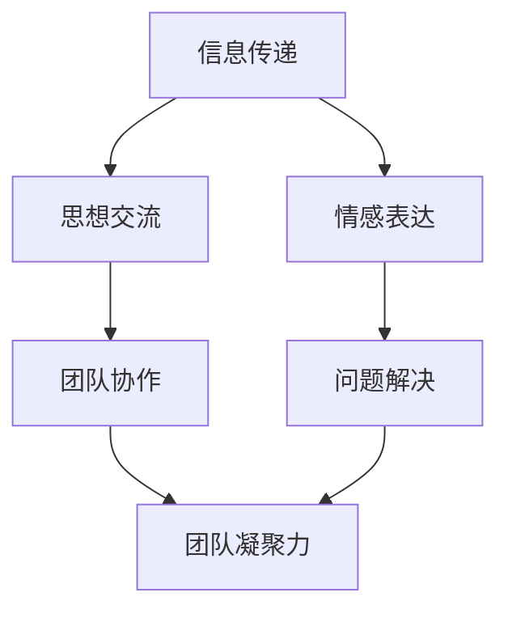

通过上述流程图，我们可以看到团队沟通的核心概念及其相互联系。信息传递、思想交流和情感表达共同构成了团队沟通的基础，而团队协作、问题解决和情感表达则直接影响了团队的效率和凝聚力。

在接下来的章节中，我们将进一步探讨团队沟通的基本原则、提升沟通效果的方法、沟通障碍与解决策略，以及团队沟通在项目管理中的应用。通过这些内容，我们将深入理解团队沟通的重要性，掌握有效的沟通技巧，为团队的成功奠定坚实基础。

#### 1.5 团队沟通的实际应用场景

在技术团队中，团队沟通的实际应用场景多种多样，以下是一些常见的场景：

- **项目启动会**：在项目启动阶段，团队成员需要通过沟通明确项目目标、任务分工、时间表和预期成果。有效的沟通有助于确保团队成员对项目的理解一致，从而避免后续的误解和冲突。
- **日常会议**：技术团队通常需要定期召开会议来讨论项目进展、解决问题和分享经验。会议的沟通效果直接影响到团队的工作效率和项目进度。
- **代码评审**：在软件开发过程中，代码评审是一种常见的沟通方式，团队成员通过评审交流代码，提出建议和改进意见，从而提高代码质量和项目进度。
- **需求讨论**：在需求分析阶段，团队成员需要通过沟通明确客户需求，确保需求文档的准确性和可行性。有效沟通有助于减少需求变更，降低项目风险。
- **紧急问题处理**：在项目过程中，可能会出现一些紧急问题，如突发故障、需求变更等。团队需要通过快速沟通，共同应对这些问题，确保项目顺利进行。

**核心算法原理讲解**

在团队沟通中，信息传递是一个核心环节。为了确保信息准确、高效地传递，我们可以采用以下算法原理：

1. **编码与解码**：信息传递过程中，发送者需要将信息编码成可传递的形式（如文字、语音、图表等），接收者需要解码这些信息，以理解其含义。为了提高编码和解码的准确性，可以采用一些规范化的编码方法，如使用统一的术语和定义。
2. **反馈机制**：为了确认接收者正确理解了信息，发送者需要接收反馈。在团队沟通中，反馈机制可以通过提问、复述、确认等方式实现。例如，发送者可以询问：“关于这个问题，你的理解是什么？”以验证信息的准确性。
3. **冗余编码**：为了提高信息传递的可靠性，可以采用冗余编码方法。冗余编码通过添加额外的信息来检测和纠正传输过程中的错误。例如，在发送文本信息时，可以同时发送文本的摘要或关键字，以便接收者验证信息的完整性。

**数学模型和公式**

在团队沟通中，信息的传递和反馈可以抽象为一个概率模型。设信息传递的概率为 \( P(\text{成功传递}) \)，信息错误传递的概率为 \( P(\text{错误传递}) \)，则在一个信息传递过程中，信息成功传递的数学模型可以表示为：

\[ P(\text{成功传递}) = 1 - P(\text{错误传递}) \]

为了提高信息传递的准确性，可以通过增加冗余信息来降低错误传递的概率。设冗余信息的比例为 \( \alpha \)，则冗余编码后的信息成功传递的概率可以表示为：

\[ P(\text{成功传递}|\text{冗余编码}) = 1 - (1 - \alpha) \times P(\text{错误传递}) \]

通过优化冗余信息的比例，可以在保证信息传输速度的同时，提高信息传递的准确性。

**举例说明**

假设在一个团队中，信息错误传递的概率为 0.05，通过添加 20% 的冗余信息，可以降低错误传递的概率。计算如下：

\[ P(\text{错误传递}) = 0.05 \]
\[ \alpha = 0.20 \]
\[ P(\text{成功传递}|\text{冗余编码}) = 1 - (1 - 0.20) \times 0.05 = 0.95 \]

通过添加冗余信息，错误传递的概率降低了 0.05，提高了信息传递的可靠性。

在团队沟通中，采用上述算法原理和数学模型，可以帮助团队成员更准确地传递和接收信息，从而提高沟通效果，实现团队目标。

#### 1.6 团队沟通的案例分析

为了更好地理解团队沟通的实际应用和效果，我们可以通过以下两个案例进行分析。

**案例一：项目启动会的成功沟通**

在一次大型软件开发项目的启动会上，项目经理通过详细的PPT演示和互动式讨论，成功地向团队成员传达了项目目标、任务分工和时间表。在会议中，项目经理强调了项目的重要性，明确了团队的目标和期望，并鼓励团队成员积极提问和反馈。以下是该案例的成功要素：

1. **明确的目标**：项目经理在启动会上明确了项目的目标和期望，确保团队成员对项目的理解一致。
2. **互动式讨论**：项目经理鼓励团队成员提问和反馈，增加了信息的互动性，提高了团队成员的参与度。
3. **及时的反馈**：在会议过程中，项目经理及时解答团队成员的问题，确保信息准确传达。

**案例二：日常会议的沟通障碍**

在一个小型技术团队中，由于成员间的沟通不畅，导致项目进度缓慢。在一次日常会议上，团队成员A提出了一个技术问题，但团队成员B在回答时使用了专业术语，导致团队成员C无法理解。以下是该案例中的沟通障碍和解决策略：

1. **沟通障碍**：团队成员B使用了专业术语，导致团队成员C无法理解。
2. **解决策略**：为了解决沟通障碍，团队成员B在回答问题时，使用了更通俗易懂的语言，并在必要时进行了详细的解释。此外，团队成员C也主动提问，确保自己正确理解了问题。

通过这两个案例，我们可以看到，成功的团队沟通需要明确的目标、互动式的讨论和及时的反馈。而在遇到沟通障碍时，团队成员需要主动寻求解决方案，以确保沟通的有效性。

#### 1.7 总结

团队沟通是技术团队成功的关键因素之一。通过有效的沟通，团队成员可以更准确地传递和接收信息，增进彼此的理解，从而提高团队的工作效率和凝聚力。在接下来的章节中，我们将进一步探讨团队沟通的基本原则、提升沟通效果的方法、沟通障碍与解决策略，以及团队沟通在项目管理中的应用。通过这些内容，我们将深入理解团队沟通的重要性，掌握有效的沟通技巧，为团队的成功奠定坚实基础。

### 第2章：团队沟通的基本原则

#### 2.1 明确沟通目标

明确沟通目标是确保沟通有效性的前提。在团队沟通中，明确的目标有助于提高沟通效率，避免因目标不明确而导致的误解和冲突。为了实现这一目标，团队需要遵循以下步骤：

1. **确定沟通目标**：在每次沟通前，团队应明确沟通的目标，例如传达信息、解决问题、协调资源等。目标应具体、明确，避免模糊不清。
2. **分解目标**：将大目标分解为小目标，逐一实现。这样可以确保团队在每次沟通中都有明确的方向，避免偏离主题。
3. **设定优先级**：根据目标的重要性和紧急程度，设定优先级。确保在沟通中优先处理重要且紧急的目标。
4. **持续评估**：在沟通过程中，定期评估目标的实现情况，及时调整沟通策略。这样可以确保目标在既定时间内得到有效实现。

**Mermaid 流程图：明确沟通目标的步骤**

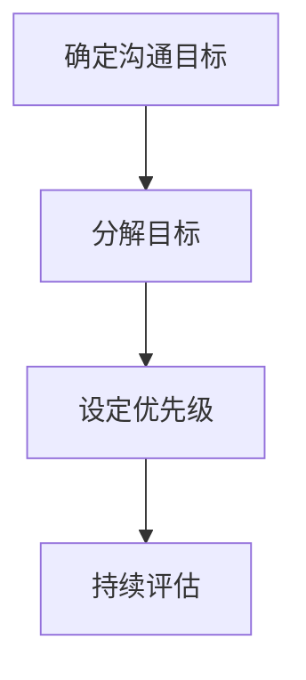

通过上述步骤，团队可以确保沟通目标的明确性和实现的有效性。

#### 2.2 尊重与倾听

尊重与倾听是建立良好沟通关系的基础。在团队沟通中，尊重他人的观点和意见，倾听他人的需求和建议，有助于消除误解、增进理解。以下是一些关键技巧：

1. **倾听**：倾听是有效沟通的关键。在他人发言时，保持专注，避免分心。可以通过点头、目光接触等非语言行为，表示在倾听。
2. **尊重**：尊重他人的观点和意见，即使你不完全同意，也要给予尊重。这样可以建立互信，营造积极的沟通氛围。
3. **反馈**：在他人发言后，给予积极的反馈。可以通过复述对方的话，确认自己正确理解了对方的观点，例如：“你刚才提到……，我理解的是……，对吗？”
4. **避免打断**：在他人发言时，避免打断，等对方说完再发表自己的意见。这样可以表现出对对方的尊重和倾听。

**核心算法原理讲解**

在团队沟通中，尊重与倾听可以抽象为一个反馈机制。设 \( T \) 表示沟通的总体时长，\( T_s \) 表示发言者的发言时长，\( T_r \) 表示倾听者的倾听时长。则倾听者在沟通中的参与度可以表示为：

\[ \text{倾听者参与度} = \frac{T_r}{T} \]

为了提高倾听者的参与度，可以采用以下算法原理：

1. **延长倾听时间**：通过延长倾听时间，提高倾听者在沟通中的参与度。例如，在每次会议中，设定专门的倾听时间，让团队成员有更多时间倾听他人发言。
2. **设定反馈机制**：通过设定反馈机制，确保倾听者正确理解发言者的观点。例如，在会议结束时，对每个议题进行总结，确保团队成员对议题的理解一致。

**数学模型和公式**

为了量化倾听者的参与度，可以采用以下数学模型：

\[ \text{倾听者参与度} = \frac{T_r}{T} = \frac{\sum_{i=1}^{n} T_{r_i}}{\sum_{i=1}^{n} (T_s + T_{r_i})} \]

其中，\( n \) 表示沟通的次数，\( T_{r_i} \) 和 \( T_s \) 分别表示第 \( i \) 次沟通中倾听者和发言者的时长。

通过上述模型，可以量化倾听者在沟通中的参与度，从而评估团队沟通的效果。

**举例说明**

假设在一个团队会议中，共有 5 个议题，每次议题的发言时长和倾听时长如下表所示：

| 议题 | 发言时长（分钟） | 倾听时长（分钟） |
| ---- | -------------- | -------------- |
| 1    | 20             | 30             |
| 2    | 15             | 25             |
| 3    | 10             | 20             |
| 4    | 25             | 15             |
| 5    | 12             | 18             |

则倾听者的参与度可以计算如下：

\[ \text{倾听者参与度} = \frac{30 + 25 + 20 + 15 + 18}{20 + 30 + 15 + 25 + 12 + 30 + 25 + 20 + 15 + 18} = \frac{98}{185} \approx 0.532 \]

通过这个例子，我们可以看到，倾听者的参与度约为 53.2%，这表明团队在沟通中还需要进一步提高倾听者的参与度。

#### 2.3 积极反馈与正面交流

积极反馈与正面交流是团队沟通的重要原则。通过积极的反馈和正面的交流，团队成员可以及时了解彼此的工作进展、意见和需求，从而提高沟通效果、增强团队凝聚力。以下是一些关键技巧：

1. **正面肯定**：在团队沟通中，对于团队成员的贡献和努力，要给予积极的肯定。这可以增强团队成员的自信心和积极性，促进团队的合作氛围。
2. **建设性反馈**：在给予反馈时，要采用建设性的方式，指出问题，并提供改进建议。这样可以避免消极情绪的影响，帮助团队成员更好地改进工作。
3. **及时反馈**：在团队沟通中，要及时给予反馈，避免问题的积累。这样可以确保团队成员及时了解自己的工作表现，从而调整工作策略。
4. **透明交流**：在团队沟通中，要建立透明的交流机制，确保信息畅通。这样可以避免信息不对称，减少误解和冲突。

**Mermaid 流�程图：积极反馈与正面交流的步骤**

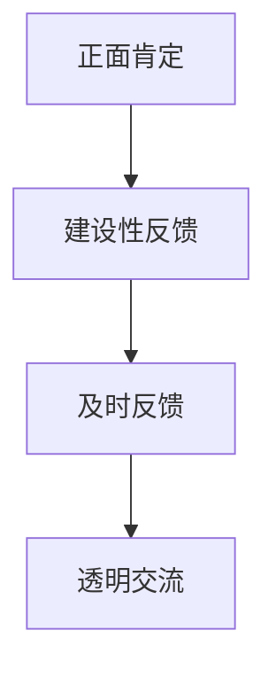

通过上述步骤，团队可以建立积极、正面的沟通氛围，提高沟通效果。

#### 2.4 适时的沟通方式

选择合适的沟通方式和时机，是提高沟通效果的重要因素。以下是一些关键技巧：

1. **面对面沟通**：在可能的情况下，采用面对面沟通。这样可以更好地表达情感和意图，减少误解和沟通障碍。
2. **书面沟通**：对于复杂或重要的信息，采用书面沟通。这样可以确保信息的准确性和完整性，减少误解。
3. **电话或视频沟通**：对于紧急或需要实时讨论的信息，采用电话或视频沟通。这样可以快速传达信息，及时解决问题。
4. **会议沟通**：在团队会议中，采用讨论和互动的方式。这样可以激发团队成员的思维，促进团队合作。
5. **选择合适的时机**：在沟通前，选择合适的时机。例如，避免在团队成员忙碌或情绪低落时进行沟通。

**Mermaid 流程图：选择合适的沟通方式和时机**

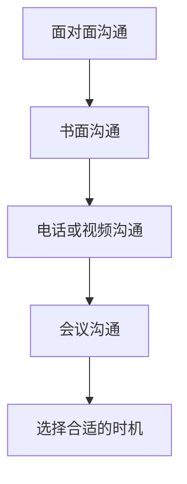

通过上述步骤，团队可以确保沟通的及时性、准确性和有效性。

#### 2.5 团队成员的角色和责任

在团队沟通中，每个成员都扮演着特定的角色，承担着相应的责任。以下是一些常见的角色和责任：

1. **领导者**：领导者负责制定沟通目标和策略，协调团队成员的工作，确保沟通的顺利进行。他们需要具备良好的沟通技巧，能够引导团队成员达成共识。
2. **团队成员**：团队成员负责参与沟通，分享信息，提出问题和建议。他们需要积极参与，确保沟通的开放性和有效性。
3. **记录员**：记录员负责记录沟通内容，整理会议纪要，确保信息的准确性和完整性。他们需要具备良好的记录和整理能力。
4. **反馈者**：反馈者负责收集团队成员的反馈，提出改进建议，确保沟通效果的持续优化。

**Mermaid 流程图：团队成员的角色和责任**

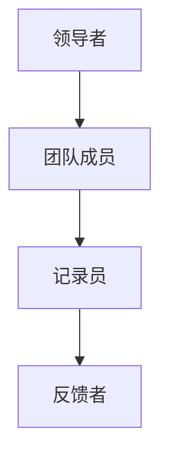

通过明确团队成员的角色和责任，可以确保团队沟通的有序进行，提高沟通效果。

#### 2.6 总结

团队沟通的基本原则是确保沟通有效性的基础。通过明确沟通目标、尊重与倾听、积极反馈与正面交流、选择合适的沟通方式和时机，以及明确团队成员的角色和责任，团队可以建立有效的沟通机制，提高沟通效果，促进团队协作。在接下来的章节中，我们将探讨提升沟通效果的方法，以及团队沟通中的障碍与解决策略。

### 第3章：提升沟通效果的方法

#### 3.1 倾听的技巧

倾听是沟通的重要组成部分，是确保信息准确传递和理解的关键。为了提升沟通效果，团队成员需要掌握以下倾听技巧：

1. **主动倾听**：主动倾听意味着全身心地专注于对方的话语，避免分心。在对方发言时，保持眼神接触，避免低头看手机或其他物品，确保对方感受到你的专注。
   
2. **反馈与确认**：在对方发言后，给予及时的反馈，例如点头、微笑或“嗯”、“我明白”等非言语信号。这样可以表明你在认真倾听，并确认自己正确理解了对方的观点。你可以通过复述对方的话语，例如：“你的意思是……，对吗？”来进一步确认。

3. **避免打断**：在对方发言时，避免打断他们的讲话。即使你有不同的观点或问题，也要等对方说完后再表达。这样可以避免对方感到被忽视或不被尊重。

4. **保持开放心态**：保持开放心态，不要带着预设的观点或偏见去倾听。尝试从对方的角度理解问题，这有助于建立互信和增进理解。

**Mermaid 流程图：倾听技巧**

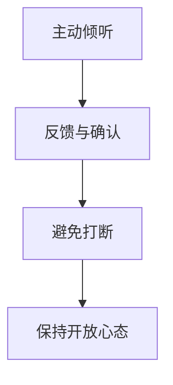

通过上述倾听技巧，团队成员可以更有效地理解对方的信息，减少误解，提高沟通效果。

#### 3.2 提供有效反馈

有效反馈是沟通中的重要环节，可以帮助团队成员了解彼此的意见和需求，从而调整工作策略。以下是一些提供有效反馈的技巧：

1. **具体、客观**：在提供反馈时，要具体、客观，避免模糊和主观的描述。例如，可以说：“你的报告中有几个关键点我有些疑问，可以详细解释一下吗？”而不是说：“你的报告感觉有些问题。”

2. **及时反馈**：及时反馈可以确保问题在初期阶段得到解决，避免问题的积累和恶化。例如，在项目进展中的每个里程碑，都可以进行一次反馈会议，及时了解团队成员的工作情况和需求。

3. **建设性反馈**：提供建设性反馈，不仅要指出问题，还要提供改进建议。例如，可以说：“这个设计有几个方面可以优化，你可以考虑增加一个模块来处理……”

4. **正面表达**：在反馈时，保持积极正面的态度，避免负面情绪的影响。例如，可以说：“这个部分的设计思路很有创意，但在实现时可以注意……”

**Mermaid 流程图：有效反馈的技巧**

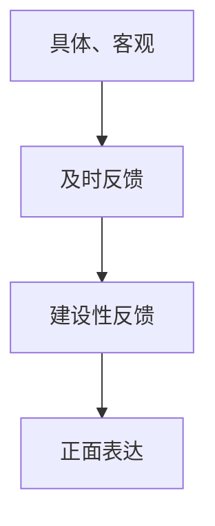

通过上述反馈技巧，团队成员可以更有效地接收和利用反馈，提高工作质量和沟通效果。

#### 3.3 反馈的技巧与注意事项

在提供反馈时，有一些技巧和注意事项可以帮助团队成员更有效地沟通：

1. **选择合适的时间和地点**：在提供反馈时，选择一个安静、私密的环境，避免在公共场合或他人面前给出负面反馈。这样可以减少对方的心理压力，增加接受反馈的意愿。

2. **避免直接批评**：直接批评容易引起对方的防御心理，从而影响沟通效果。可以采用更委婉的方式，例如：“这个部分的设计有几个问题，我们可以一起讨论一下解决方案。”

3. **注意语气和表情**：在反馈时，注意语气和表情，保持温和、友好。通过积极的肢体语言和语气，可以缓解对方的紧张情绪，增加反馈的接受度。

4. **关注对方反应**：在反馈过程中，关注对方的反应，例如他们的表情、语气和态度。如果对方表现出抵触情绪，可以适当调整反馈的方式和内容，以便更好地沟通。

**Mermaid 流程图：反馈的技巧与注意事项**

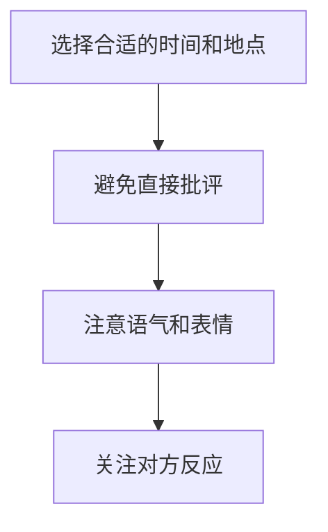

通过上述技巧和注意事项，团队成员可以更有效地提供和接受反馈，从而提升沟通效果。

#### 3.4 提高沟通效率的工具和平台

在团队沟通中，使用适当的工具和平台可以提高沟通效率，减少信息传递的障碍。以下是一些常用的工具和平台：

1. **即时通讯工具**：如 Slack、Microsoft Teams、WhatsApp 等，可以实时交流，快速传递信息。

2. **电子邮件**：用于正式的、详细的沟通，确保信息的准确性和可追溯性。

3. **视频会议软件**：如 Zoom、Microsoft Teams、Google Meet 等，适用于远程团队或需要实时讨论的场景。

4. **项目管理工具**：如 Trello、Asana、Jira 等，可以帮助团队跟踪项目进度，协调工作。

5. **知识库**：如 Confluence、Notion 等，用于存储和共享团队的知识和文档，方便成员查阅。

6. **协作工具**：如 Google Docs、Sheet 等，可以实现多人实时协作，提高工作效率。

**Mermaid 流程图：沟通工具和平台的选择**

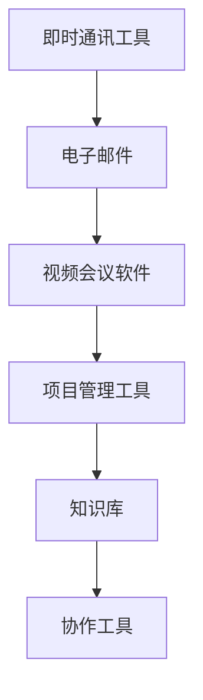

通过选择合适的工具和平台，团队可以更好地组织沟通，提高工作效率。

#### 3.5 团队成员的角色和职责

在团队沟通中，明确团队成员的角色和职责是确保沟通有效性的重要一环。以下是一些关键的角色和职责：

1. **沟通协调者**：负责组织会议、协调沟通时间，确保团队成员能够及时沟通。他们需要具备良好的沟通能力和组织能力。

2. **信息传递者**：负责将信息准确地传递给团队成员，确保信息不被误解。他们需要具备良好的口头和书面沟通能力。

3. **问题解决者**：负责识别和解决团队内部的问题，确保沟通不被障碍所阻碍。他们需要具备分析问题和解决问题的能力。

4. **记录员**：负责记录沟通内容，整理会议纪要，确保信息完整、准确。他们需要具备良好的记录能力和整理能力。

5. **反馈收集者**：负责收集团队成员的反馈，提出改进建议，确保沟通效果的持续优化。他们需要具备敏锐的观察力和良好的沟通技巧。

**Mermaid 流程图：团队成员的角色和职责**

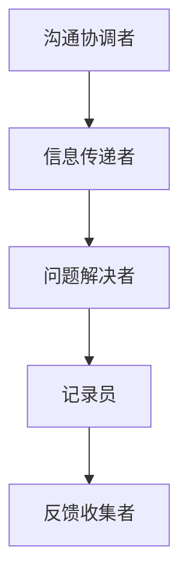

通过明确团队成员的角色和职责，团队可以确保沟通的有序进行，提高沟通效果。

#### 3.6 总结

提升沟通效果是团队协作中至关重要的一环。通过掌握倾听技巧、提供有效反馈、注意反馈的技巧与注意事项、选择合适的工具和平台、明确团队成员的角色和职责，团队可以建立有效的沟通机制，提高沟通效率，促进团队协作。在接下来的章节中，我们将探讨团队沟通中的障碍和解决策略，以进一步优化团队沟通效果。

### 第4章：沟通障碍与解决策略

#### 4.1 沟通障碍的类型

在团队沟通中，沟通障碍是影响沟通效果的重要因素。常见的沟通障碍类型包括：

1. **信息过滤**：信息在传递过程中被过滤或修改，导致信息失真。例如，一个团队成员可能会因为担心负面反馈而修改自己的发言。

2. **语言障碍**：语言障碍可能由于文化差异、语言不通或专业术语的使用不当而引起。例如，来自不同国家的团队成员可能因为语言差异而难以理解对方的意思。

3. **心理障碍**：心理障碍包括个人情绪、压力、偏见等。例如，一个团队成员可能因为情绪低落或压力过大而无法有效沟通。

4. **技术障碍**：技术障碍包括网络故障、设备问题等。例如，视频会议软件出现问题可能导致团队成员无法实时沟通。

5. **组织障碍**：组织障碍包括组织结构、管理制度等。例如，一个团队成员可能因为组织结构的复杂而无法找到合适的沟通渠道。

#### 4.2 沟通障碍的原因分析

沟通障碍的原因多种多样，主要包括以下几个方面：

1. **信息量过大**：随着项目的进展，信息量逐渐增加，团队成员可能难以处理和消化这些信息，从而导致沟通障碍。

2. **个人差异**：团队成员的背景、经验、沟通风格等差异可能导致沟通障碍。例如，一个团队成员可能习惯于直接沟通，而另一个成员可能更喜欢书面沟通。

3. **心理因素**：团队成员的情绪、压力、焦虑等心理因素会影响沟通效果。例如，一个团队成员可能因为情绪低落而无法有效参与讨论。

4. **沟通方式不当**：不合适的沟通方式可能导致信息传递不畅。例如，使用过于正式或过于随意的语言可能导致对方难以理解。

5. **管理不善**：组织的管理不善可能导致沟通障碍。例如，组织结构过于复杂或管理制度不完善，可能导致信息传递受阻。

#### 4.3 解决沟通障碍的策略

为了克服沟通障碍，团队可以采取以下策略：

1. **明确沟通目标**：在每次沟通前，明确沟通的目标和期望，确保团队成员了解沟通的重点和目的。

2. **简化沟通流程**：简化沟通流程，减少不必要的层级和环节，确保信息能够迅速传递。

3. **使用多种沟通方式**：结合书面、口头、视频等多种沟通方式，确保信息能够被有效传递和理解。

4. **加强培训**：定期对团队成员进行沟通技巧培训，提高他们的沟通能力和意识。

5. **建立反馈机制**：建立反馈机制，鼓励团队成员提供反馈，及时解决沟通中的问题。

6. **优化沟通工具**：选择合适的沟通工具和平台，确保沟通的顺利进行。

7. **关注心理健康**：关注团队成员的心理健康，提供心理支持和帮助，减少沟通中的心理障碍。

**Mermaid 流程图：解决沟通障碍的策略**

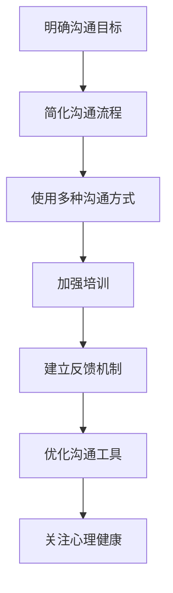

通过上述策略，团队可以有效地克服沟通障碍，提高沟通效果。

#### 4.4 实际案例：沟通障碍的解决之道

以下是一个团队沟通障碍的实际案例及解决策略：

**案例背景**：
在一个大型软件开发项目中，团队成员A和B因为沟通不畅导致项目进度受阻。团队成员A习惯于书面沟通，而团队成员B更喜欢口头沟通。此外，两人来自不同的文化背景，对某些专业术语的理解存在差异。

**问题分析**：
1. **沟通方式差异**：团队成员A和B的沟通方式不同，导致信息传递不畅。
2. **文化差异**：文化差异导致对专业术语的理解不一致，增加了沟通难度。

**解决策略**：
1. **采用多种沟通方式**：团队成员A开始定期与团队成员B进行面对面沟通，同时保持书面沟通，以确保信息准确传达。
2. **共同制定术语表**：团队成员A和B共同制定了一份专业术语表，确保双方对术语的理解一致。
3. **定期反馈**：团队成员A和B定期交换反馈，确保对方了解自己的需求和意见。

**解决方案效果**：
通过上述策略，团队成员A和B的沟通障碍得到了有效解决。项目进度得到了显著提升，团队成员之间的信任和理解也得到了增强。

#### 4.5 总结

沟通障碍是影响团队协作的重要因素，通过分析沟通障碍的类型和原因，可以采取有效的解决策略。明确沟通目标、简化沟通流程、使用多种沟通方式、加强培训、建立反馈机制、优化沟通工具和关注心理健康是克服沟通障碍的关键策略。在实际案例中，通过针对性的解决策略，团队可以有效地解决沟通障碍，提高沟通效果，促进项目成功。

### 第5章：非言语沟通的力量

#### 5.1 非言语沟通的概述

非言语沟通是指通过身体语言、面部表情、眼神交流等非语言手段进行的沟通。它在人际交往中起着至关重要的作用，能够补充和强化言语沟通的效果。以下是一些常见的非言语沟通方式：

1. **身体语言**：包括姿态、手势、肢体动作等。例如，站立姿势可以传达自信和专注，而频繁的点头可以表示同意和关注。

2. **面部表情**：面部表情是人类情感的重要表达方式。例如，微笑可以传达友好和积极，而皱眉可以表示不满或困惑。

3. **眼神交流**：眼神交流是建立信任和沟通的重要手段。直接的眼神交流可以表示尊重和诚实，而回避眼神则可能传达不安或逃避。

4. **空间距离**：空间距离可以影响沟通的氛围和亲密感。例如，亲密的空间距离可以表示信任和亲近，而较远的空间距离则可能传达疏远或冷漠。

#### 5.2 身体语言的表达

身体语言在团队沟通中具有重要作用，能够补充和强化言语沟通。以下是一些关键的身体语言表达：

1. **姿态**：良好的姿态可以传达自信和专业。例如，保持挺直的姿势可以显得自信和专注，而低头或弯腰则可能传达不安或自卑。

2. **手势**：手势可以增强言语表达的效果。例如，适时的手势可以强调关键点，使信息更加生动和有说服力。同时，避免过于夸张的手势，以免分散对方的注意力。

3. **肢体动作**：肢体动作可以传达情感和态度。例如，开放的肢体动作可以表示友好和欢迎，而关闭的肢体动作则可能传达防御和拒绝。

4. **触摸**：适当的触摸可以传达关心和支持。例如，轻拍对方肩膀可以表示鼓励和认可，而频繁的触摸则可能引起不适或反感。

**Mermaid 流程图：身体语言的表达**

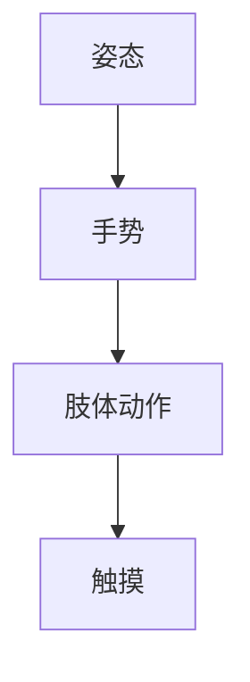

通过运用上述身体语言表达，团队成员可以更好地理解和传达情感和态度，从而提高沟通效果。

#### 5.3 面部表情与眼神交流

面部表情和眼神交流是人际沟通中最重要的非言语手段之一。以下是一些关键点：

1. **面部表情**：面部表情可以传达情感和态度。例如，微笑可以表示友好和积极，而皱眉可以表示不满或困惑。为了确保沟通效果，团队成员应该注意自己的面部表情，确保传达正确的情感和态度。

2. **眼神交流**：眼神交流是建立信任和沟通的重要手段。直接的眼神交流可以表示尊重和诚实，而回避眼神则可能传达不安或逃避。在团队沟通中，团队成员应该保持适当的眼神交流，以增强沟通的效果。

3. **微笑**：微笑是一种简单而有效的非言语沟通方式，可以传达友好和积极。团队成员应该学会在适当的时候微笑，以缓解紧张氛围、增进彼此的了解。

4. **目光接触**：目光接触可以表示关注和尊重。在团队沟通中，团队成员应该避免频繁地回避目光，以免给对方留下不尊重或不感兴趣的印象。

**Mermaid 流程图：面部表情与眼神交流**

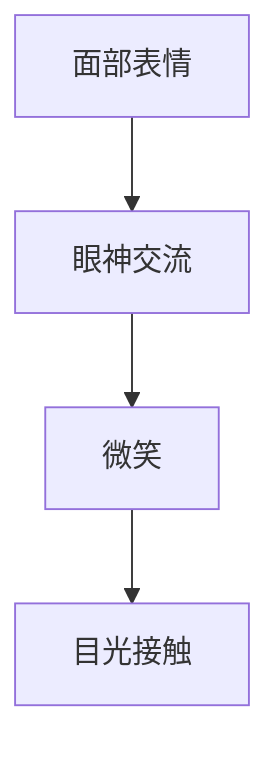

通过理解和运用面部表情和眼神交流，团队成员可以更好地理解和传达情感和态度，从而提高沟通效果。

#### 5.4 非言语沟通的应用

在实际的团队沟通中，非言语沟通的应用至关重要。以下是一些具体的应用场景：

1. **会议沟通**：在会议中，团队成员可以通过身体语言和面部表情来展示自己的参与度和态度。例如，点头表示同意，微笑表示鼓励，这些非言语信号可以增强会议的互动性和有效性。

2. **项目协调**：在项目协调过程中，非言语沟通可以帮助团队成员更好地理解和传达信息。例如，通过眼神交流确认对方是否理解了信息，通过肢体动作展示对项目的热情和承诺。

3. **团队协作**：在团队协作中，非言语沟通可以增强团队成员之间的信任和合作。例如，通过适时的触摸表达关心和支持，通过微笑和目光接触传递友好和积极的态度。

**Mermaid 流程图：非言语沟通的应用**

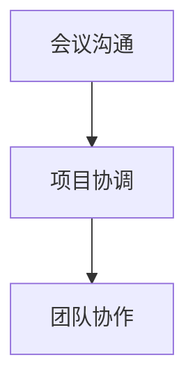

通过在团队沟通中有效运用非言语沟通，团队成员可以更好地理解彼此的情感和态度，提高沟通效果，促进团队协作。

#### 5.5 总结

非言语沟通在团队沟通中具有重要作用，能够补充和强化言语沟通的效果。通过了解和运用身体语言、面部表情、眼神交流等非言语手段，团队成员可以更好地理解和传达情感和态度，从而提高沟通效果。在实际应用中，团队成员应该注重非言语沟通的细节，以增强沟通的互动性和有效性。

### 第6章：团队沟通技巧的实践

#### 6.1 团队成员的角色定位

在团队沟通中，明确团队成员的角色和职责是确保沟通有效性的重要一环。每个团队成员在沟通中都有自己的角色和责任，以下是一些常见的角色和职责：

1. **领导者**：领导者负责制定沟通目标和策略，确保团队成员能够按照既定的方向进行沟通。他们需要具备良好的沟通技巧，能够引导团队成员达成共识，并解决沟通中的冲突。

2. **信息传递者**：信息传递者负责将信息准确地传递给团队成员。他们需要具备良好的口头和书面沟通能力，确保信息不被误解或失真。在团队沟通中，信息传递者通常是项目管理者或技术负责人。

3. **记录员**：记录员负责记录沟通内容，整理会议纪要，确保信息的准确性和完整性。他们需要具备良好的记录和整理能力，确保重要信息不被遗漏。记录员通常是项目助理或秘书。

4. **反馈收集者**：反馈收集者负责收集团队成员的反馈，提出改进建议，确保沟通效果的持续优化。他们需要具备敏锐的观察力和良好的沟通技巧，能够有效地收集和传达团队成员的意见。

5. **协调者**：协调者负责协调沟通时间和方式，确保团队成员能够及时、有效地参与沟通。他们需要具备良好的组织能力和沟通技巧，能够合理安排沟通的时间和形式。

**Mermaid 流程图：团队成员的角色和职责**

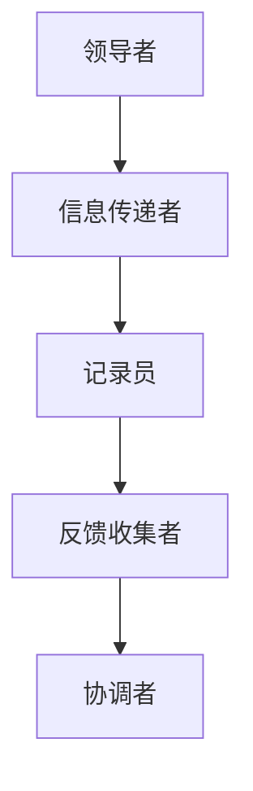

通过明确团队成员的角色和职责，可以确保沟通的有序进行，提高沟通效果。

#### 6.2 高效会议的技巧

会议是团队沟通的重要方式之一，高效的会议可以显著提高团队的工作效率。以下是一些高效会议的技巧：

1. **提前准备**：在召开会议前，应提前准备会议议程、相关资料和演示材料。确保会议内容具体、明确，避免在会议中浪费时间。

2. **控制会议时间**：会议应在预定时间内完成，避免拖延。可以设定时间限制，确保每个议题都有充足的时间讨论，但不过度占用时间。

3. **积极参与**：鼓励团队成员积极参与会议，发表意见和观点。会议主持人应确保每个成员都有机会发言，避免会议变成个别人的演讲。

4. **明确议题**：在会议中，应明确每个议题的目标和期望，确保讨论内容集中、具体。避免在会议中偏离主题，提高会议效率。

5. **记录和跟进**：会议结束后，记录员应整理会议纪要，明确每个议题的讨论结果和行动计划。确保团队成员了解会议成果，并跟进执行情况。

**Mermaid 流程图：高效会议的技巧**

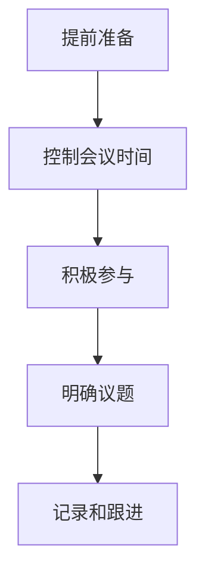

通过上述高效会议的技巧，团队可以确保会议的顺利进行，提高沟通效果。

#### 6.3 团队协作的工具与平台

在团队协作中，选择合适的工具和平台可以显著提高沟通效率和工作效果。以下是一些常用的团队协作工具和平台：

1. **视频会议软件**：如 Zoom、Microsoft Teams 和 Google Meet，适用于远程团队或需要实时讨论的场景。

2. **即时通讯工具**：如 Slack、WhatsApp 和 Telegram，适用于实时沟通和信息传递。

3. **项目管理工具**：如 Trello、Asana 和 Jira，用于跟踪项目进度、分配任务和管理资源。

4. **知识库**：如 Confluence 和 Notion，用于存储和共享团队的知识和文档，方便成员查阅。

5. **协作工具**：如 Google Docs 和 Sheets，适用于多人实时协作，提高工作效率。

**Mermaid 流程图：团队协作的工具与平台**

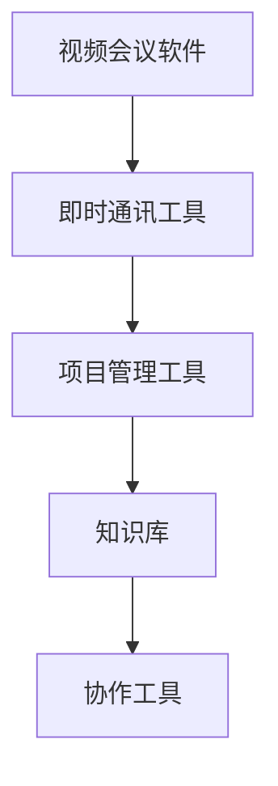

通过使用这些工具和平台，团队可以更好地组织沟通和协作，提高工作效率。

#### 6.4 实际案例：团队沟通技巧的实践

以下是一个团队沟通技巧实际应用的案例：

**案例背景**：
一个由五人组成的技术团队正在开发一款新的应用程序。由于团队成员分布在不同的城市，他们需要通过远程协作来完成项目。团队成员之间沟通不畅，导致项目进度缓慢。

**解决方案**：
1. **明确角色和职责**：团队首先明确了各自的角色和职责，领导者负责制定项目计划，信息传递者负责协调任务，记录员负责整理会议纪要，反馈收集者负责收集成员的反馈，协调者负责安排会议和沟通时间。

2. **使用视频会议软件**：团队开始使用 Zoom 进行每周的定期会议，确保团队成员能够实时讨论项目进展和问题。

3. **采用即时通讯工具**：团队使用 Slack 进行日常沟通，实时交流信息，确保问题能够及时解决。

4. **使用项目管理工具**：团队使用 Trello 跟踪项目进度，分配任务，确保每个成员都清楚自己的任务和截止日期。

5. **建立知识库**：团队使用 Notion 建立了一个知识库，存储项目文档、技术文档和会议纪要，方便成员查阅和参考。

**解决方案效果**：
通过上述解决方案，团队成员之间的沟通变得更加顺畅，项目进度得到了显著提升。团队成员之间的信任和协作也得到了增强，项目最终成功完成。

#### 6.5 总结

团队沟通技巧的实践对于提高团队协作效率至关重要。通过明确团队成员的角色和职责、使用高效会议技巧、选择合适的协作工具与平台，团队可以建立有效的沟通机制，提高沟通效果。在实际案例中，通过具体实践，团队成功地克服了沟通障碍，提高了工作效率，实现了项目目标。

### 第7章：团队沟通在项目管理中的应用

#### 7.1 项目沟通的目标与策略

项目沟通是项目管理中的关键环节，其目标主要包括确保团队成员对项目目标、进度和问题有清晰的理解，促进团队协作，提高项目效率。为了实现这些目标，团队需要制定有效的沟通策略：

1. **明确项目目标**：在项目启动阶段，明确项目目标、范围和预期成果。确保所有团队成员对项目目标有共同的理解和认识。

2. **制定沟通计划**：制定详细的沟通计划，包括沟通频率、方式、参与人员和沟通内容。根据项目进度和需求，灵活调整沟通计划。

3. **建立沟通渠道**：建立多渠道的沟通机制，如定期会议、即时通讯工具、邮件等，确保信息能够及时、有效地传递。

4. **培养沟通技能**：定期对团队成员进行沟通技能培训，提高他们的沟通能力，确保项目沟通的顺畅进行。

5. **及时反馈**：建立及时反馈机制，确保团队成员能够及时了解项目进展、问题和改进措施，避免问题的积累和扩大。

#### 7.2 项目进度与风险沟通

项目进度和风险沟通是项目沟通的重要组成部分，以下是一些关键点：

1. **项目进度沟通**：
   - **定期汇报**：团队成员应定期汇报项目进度，确保项目进度透明，团队成员对项目进展有清晰的认识。
   - **问题反馈**：在汇报进度时，及时反馈遇到的问题和困难，确保问题得到及时解决。
   - **调整计划**：根据项目进展和实际情况，灵活调整项目计划，确保项目能够按期完成。

2. **风险沟通**：
   - **识别风险**：在项目启动和执行过程中，定期识别潜在风险，确保所有团队成员对风险有清晰的认识。
   - **风险评估**：对识别出的风险进行评估，确定风险的可能性和影响，制定相应的应对措施。
   - **风险报告**：定期向团队成员报告风险状况，确保团队成员对风险有充分的了解。

**Mermaid 流程图：项目进度与风险沟通**

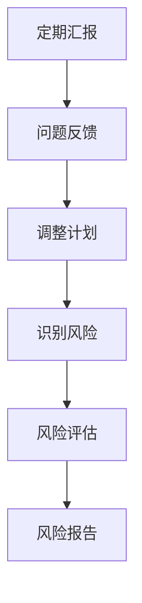

通过有效的项目进度与风险沟通，团队可以及时了解项目进展和风险状况，确保项目顺利进行。

#### 7.3 项目报告与演示技巧

项目报告和演示是团队沟通的重要形式，以下是一些关键技巧：

1. **内容简洁明了**：项目报告应简洁明了，避免冗长的描述和复杂的技术术语。确保所有团队成员都能理解和掌握报告内容。

2. **结构清晰**：项目报告应具备清晰的逻辑结构，包括项目目标、进展、问题和改进措施等。确保报告内容有条理，易于阅读和理解。

3. **数据支持**：项目报告应包含相关的数据和分析，以支持报告内容。通过数据展示项目进展和效果，增强报告的说服力。

4. **图表辅助**：使用图表、图形等辅助手段，使报告内容更加直观和易于理解。例如，通过甘特图展示项目进度，通过饼图展示项目成本等。

5. **演示技巧**：在演示过程中，使用适当的语言、表情和肢体动作，增强演示效果。确保演示内容生动、有趣，能够吸引观众的注意力。

**Mermaid 流程图：项目报告与演示技巧**

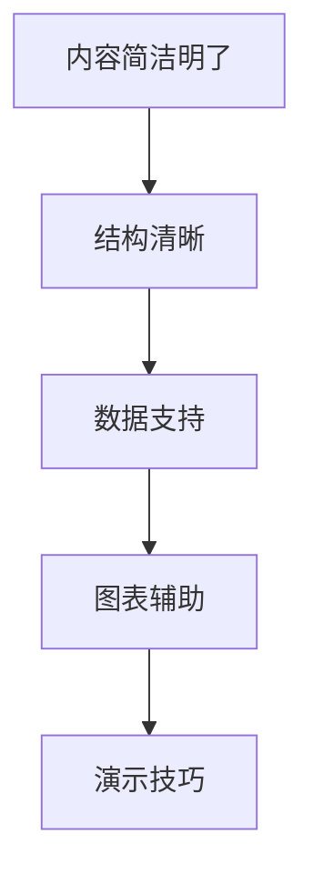

通过运用上述技巧，团队可以有效地撰写和展示项目报告，提高沟通效果。

#### 7.4 实际案例：项目沟通在项目管理中的应用

以下是一个项目沟通实际应用的案例：

**案例背景**：
一个软件开发团队正在开发一款新应用程序，项目计划为期六个月。由于团队成员分布在不同的城市，项目沟通成为关键问题。

**解决方案**：
1. **建立沟通计划**：团队制定了详细的沟通计划，包括每周的定期会议、即时通讯工具的使用和邮件汇报。确保所有团队成员都能及时了解项目进展和问题。

2. **使用项目管理工具**：团队使用 Trello 跟踪项目进度，分配任务，确保每个成员都清楚自己的任务和截止日期。

3. **定期汇报**：团队成员每周通过会议和邮件汇报项目进展，及时反馈问题和困难，确保问题得到及时解决。

4. **项目报告**：团队定期撰写项目报告，包括项目目标、进展、问题和改进措施。报告通过数据和支持图表展示，确保所有团队成员对项目进展有清晰的认识。

5. **演示技巧**：在项目关键节点，团队通过演示报告向管理层展示项目进展和效果，确保项目得到充分的关注和支持。

**解决方案效果**：
通过有效的项目沟通，团队成功地克服了地理位置上的障碍，确保项目进度和质量的控制。项目最终按时完成，并获得客户的高度评价。

#### 7.5 总结

项目沟通在项目管理中至关重要，通过制定明确的沟通目标与策略、进行有效的项目进度与风险沟通、掌握项目报告与演示技巧，团队可以确保项目信息的准确传递和理解，提高项目效率和质量。在实际案例中，通过具体应用这些沟通技巧，团队成功实现了项目目标。

### 第8章：团队沟通在危机管理中的应用

#### 8.1 危机沟通的原则

在危机管理中，有效的沟通是至关重要的。危机沟通的原则包括以下方面：

1. **及时性**：危机发生时，及时沟通是关键。及时传递信息，可以迅速控制事态发展，避免问题扩大。

2. **准确性**：确保信息的准确传递，避免误传或误导。准确的信息有助于团队迅速做出正确的决策和应对措施。

3. **透明性**：保持沟通的透明，增强团队信任。透明的沟通有助于团队成员了解危机的实际情况，共同应对危机。

4. **主动性**：在危机发生时，主动寻求沟通，积极解决问题。主动沟通可以减少不确定性，增强团队的凝聚力。

5. **协同性**：危机沟通需要多方参与，协同合作。协调各方力量，共同应对危机，提高解决问题的效率。

**Mermaid 流程图：危机沟通的原则**

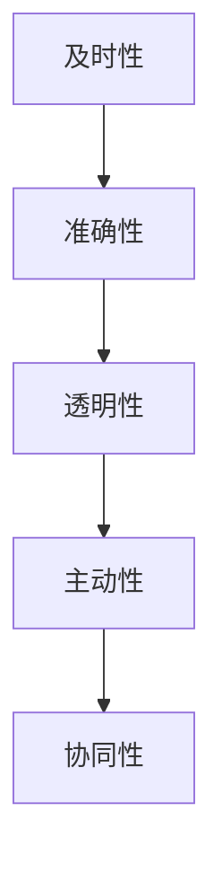

通过遵循这些原则，团队可以在危机管理中建立有效的沟通机制，提高危机应对能力。

#### 8.2 应对突发事件的沟通策略

在应对突发事件时，沟通策略至关重要。以下是一些关键策略：

1. **快速响应**：突发事件发生时，应立即启动应急响应机制，快速响应。立即召开紧急会议，评估事态，确定应对措施。

2. **多方参与**：确保多方参与，协调各方力量。紧急会议应包括关键团队成员、管理层和相关部门，共同讨论应对方案。

3. **信息共享**：确保信息畅通，信息共享。通过电话、邮件、即时通讯工具等多种渠道，及时传递关键信息，确保团队成员了解事态发展和应对措施。

4. **分级汇报**：根据事件的严重程度，分级汇报。对于重大危机，需要逐级上报，确保高层领导及时了解情况，提供指导和支持。

5. **动态调整**：在应对突发事件的过程中，根据事态发展和反馈信息，动态调整应对策略。灵活应对，确保决策和行动的及时性。

**Mermaid 流程图：应对突发事件的沟通策略**

```mermaid
graph TD
A[快速响应] --> B[多方参与]
B --> C[信息共享]
C --> D[分级汇报]
D --> E[动态调整]
```

通过这些策略，团队可以迅速、有效地应对突发事件，降低危机的影响。

#### 8.3 危机沟通的案例分析

以下是一个危机沟通的实际案例分析：

**案例背景**：
一家知名科技公司遭遇了一次重大数据泄露事件，导致大量客户信息被泄露。这一事件对公司声誉和客户信任造成了严重威胁。

**解决方案**：
1. **快速响应**：公司立即启动应急响应机制，组织危机管理团队，快速响应。召开紧急会议，评估事态，制定初步应对措施。

2. **多方参与**：邀请关键团队成员、管理层和相关部门参与，共同讨论应对方案。确保各方力量协同合作，提高应对效率。

3. **信息共享**：通过电话、邮件、公司内部网络等渠道，及时传递关键信息。向员工、客户和公众发布公告，说明事件情况和公司应对措施。

4. **分级汇报**：根据事件的严重程度，逐级上报。向公司高层领导汇报情况，寻求指导和支持。

5. **动态调整**：在应对过程中，根据事态发展和反馈信息，动态调整应对策略。及时更新公告，公布最新进展和应对措施。

**解决方案效果**：
通过有效的危机沟通，公司迅速控制了事态发展，减少了数据泄露的影响。公司声誉和客户信任得到保护，危机得到了有效应对。

#### 8.4 总结

团队沟通在危机管理中具有重要作用。通过遵循危机沟通的原则、采取有效的应对策略，团队可以迅速、有效地应对突发事件，降低危机的影响。在实际案例中，有效的危机沟通帮助团队成功地应对了危机，保护了公司声誉和客户信任。通过学习这些案例，团队可以提升危机管理能力，为未来的挑战做好准备。

### 第9章：跨文化沟通的挑战与对策

#### 9.1 跨文化沟通的重要性

在全球化背景下，跨文化沟通成为团队沟通的一个重要方面。有效的跨文化沟通有助于国际团队之间的协作，提高项目效率，促进文化理解和尊重。以下是一些跨文化沟通的重要性：

1. **提高沟通效果**：不同文化背景的团队成员可能在语言、沟通风格、价值观等方面存在差异，有效的跨文化沟通有助于减少误解和冲突，提高沟通效果。

2. **促进文化理解**：跨文化沟通使团队成员能够更好地了解彼此的文化背景、价值观和行为习惯，促进文化理解和尊重，增强团队凝聚力。

3. **提升项目效率**：通过有效的跨文化沟通，团队成员可以更准确地理解项目目标、需求和期望，从而提高项目执行效率，减少错误和重复工作。

4. **增强国际竞争力**：在全球化的商业环境中，能够进行有效跨文化沟通的团队更具竞争力。这有助于企业拓展国际市场，建立国际合作关系。

#### 9.2 跨文化沟通的障碍

跨文化沟通中存在一些障碍，以下是一些常见的障碍：

1. **语言障碍**：语言差异是跨文化沟通中最明显的障碍。不同语言之间的词汇、语法和表达方式可能存在差异，导致信息传递不准确或误解。

2. **非语言沟通差异**：不同文化中，身体语言、面部表情和眼神交流等非语言沟通方式可能有不同的含义。例如，在某些文化中，直视对方表示尊重，而在其他文化中可能被视为不礼貌。

3. **价值观差异**：不同文化中，人们的价值观和信仰可能存在差异，这可能导致对同一问题或行为的看法和期望不一致。

4. **时间观念差异**：不同文化中，对时间的重要性、准时性等观念可能存在差异。这可能导致沟通中时间管理的困难。

#### 9.3 跨文化沟通的技巧

为了克服跨文化沟通的障碍，以下是一些有效的沟通技巧：

1. **了解文化差异**：团队成员应主动了解彼此的文化背景、价值观和行为习惯。通过文化培训和学习，提高跨文化沟通的敏感性和理解力。

2. **尊重差异**：在跨文化沟通中，尊重对方的差异是非常重要的。避免对对方的行为或观点进行评判，保持开放和包容的心态。

3. **积极沟通**：在跨文化沟通中，主动寻求沟通，表达自己的观点和需求。通过积极的沟通，可以减少误解和冲突，促进双方的理解。

4. **使用明确的语言**：在跨文化沟通中，使用明确、具体的语言，避免使用模糊或含糊的表达。这有助于减少误解，提高沟通效果。

5. **非语言沟通的适应性**：团队成员应了解并适应不同文化中的非语言沟通方式。例如，在有些文化中，保持适当的目光接触是尊重的体现，而在其他文化中可能被视为不礼貌。

**Mermaid 流程图：跨文化沟通的技巧**

```mermaid
graph TD
A[了解文化差异] --> B[尊重差异]
B --> C[积极沟通]
C --> D[使用明确的语言]
D --> E[非语言沟通的适应性]
```

通过运用这些技巧，团队成员可以更有效地进行跨文化沟通，提高团队协作效率。

#### 9.4 跨文化沟通的实际案例

以下是一个跨文化沟通的实际案例：

**案例背景**：
一个国际团队正在开发一款全球化的软件产品，团队成员来自不同的国家和地区，包括美国、中国、印度和巴西。由于文化差异，团队成员在沟通中遇到了一些挑战。

**解决方案**：
1. **文化培训**：团队为所有成员提供了文化培训，介绍了彼此的文化背景、价值观和行为习惯。这有助于团队成员更好地理解彼此。

2. **使用翻译**：在跨语言沟通中，团队使用了专业的翻译服务，确保信息的准确传达。翻译不仅帮助团队成员理解彼此的语言，还提供了文化上的解释。

3. **积极沟通**：团队成员鼓励彼此主动沟通，表达观点和需求。通过定期的视频会议和即时通讯，团队成员保持了紧密的沟通。

4. **明确沟通**：在沟通中，团队成员使用了明确、具体的语言，避免使用模糊或含糊的表达。这有助于减少误解，提高沟通效果。

**解决方案效果**：
通过有效的跨文化沟通，团队克服了文化差异带来的沟通障碍，项目进展顺利，最终成功开发出了一款全球化的软件产品。团队成员之间的信任和理解也得到了增强。

#### 9.5 总结

跨文化沟通在全球化团队中具有重要意义。通过了解文化差异、尊重差异、积极沟通和明确语言表达，团队成员可以克服沟通障碍，提高沟通效果，促进团队协作。在实际案例中，有效的跨文化沟通帮助团队成功应对了挑战，实现了项目目标。通过学习这些案例，团队可以提升跨文化沟通能力，为未来的全球化项目做好准备。

### 第10章：团队沟通的评估与持续改进

#### 10.1 沟通评估的方法与工具

为了确保团队沟通的有效性，定期的沟通评估至关重要。以下是一些常用的评估方法和工具：

1. **问卷调查**：通过问卷调查收集团队成员对沟通效果的反馈。问卷可以设计成定量和定性的问题，如满意度评分、意见和改进建议等。

2. **访谈**：与团队成员进行一对一访谈，深入了解他们对沟通的感受和意见。访谈可以揭示问卷调查中未能发现的问题。

3. **观察**：观察团队成员在沟通过程中的行为和互动，评估沟通的实际情况。观察可以帮助识别沟通中的障碍和问题。

4. **绩效评估**：将沟通效果与团队绩效联系起来，评估沟通对团队目标实现的影响。绩效评估可以包括项目进展、团队协作和问题解决等方面。

5. **反馈会议**：定期召开反馈会议，让团队成员分享对沟通的观察和感受，讨论改进措施。反馈会议可以促进团队成员之间的沟通和合作。

**Mermaid 流程图：沟通评估的方法与工具**

```mermaid
graph TD
A[问卷调查] --> B[访谈]
B --> C[观察]
C --> D[绩效评估]
D --> E[反馈会议]
```

通过这些方法和工具，团队可以全面评估沟通效果，发现和解决问题。

#### 10.2 沟通改进的策略

为了持续提升团队沟通效果，以下是一些改进策略：

1. **加强培训**：定期对团队成员进行沟通技巧培训，提高他们的沟通能力和意识。培训可以包括沟通技巧、非言语沟通、冲突解决等。

2. **优化沟通流程**：简化沟通流程，减少不必要的环节和层级。优化沟通流程可以确保信息迅速传递，提高沟通效率。

3. **引入新的沟通工具**：根据团队需求，引入新的沟通工具和平台，如视频会议软件、项目管理工具和协作平台。新的工具可以提高沟通的便捷性和有效性。

4. **建立反馈机制**：建立持续的反馈机制，鼓励团队成员提供反馈和建议。通过及时反馈，团队可以迅速识别和解决问题。

5. **促进跨部门沟通**：加强跨部门沟通，促进不同部门之间的协作和合作。跨部门沟通可以提升整体团队效能，减少信息孤岛。

**Mermaid 流程图：沟通改进的策略**

```mermaid
graph TD
A[加强培训] --> B[优化沟通流程]
B --> C[引入新的沟通工具]
C --> D[建立反馈机制]
D --> E[促进跨部门沟通]
```

通过这些策略，团队可以不断优化沟通，提高整体效能。

#### 10.3 团队沟通文化的建设

团队沟通文化是团队内部沟通行为和价值观的集合。建设积极的团队沟通文化对于提高沟通效果至关重要。以下是一些关键措施：

1. **建立共识**：明确团队沟通的目标和价值观，确保所有团队成员对此有共同的理解和认同。

2. **鼓励沟通**：营造鼓励沟通的氛围，鼓励团队成员主动分享观点和意见。避免压抑团队成员的表达，鼓励开放和坦诚的沟通。

3. **尊重差异**：尊重团队成员的不同意见和观点，避免因文化、背景差异导致的冲突。通过尊重差异，增强团队的凝聚力和合作性。

4. **建立信任**：建立信任是团队沟通文化的基础。通过积极沟通、诚实守信和相互支持，增强团队成员之间的信任。

5. **奖励与认可**：对在沟通中表现出色的团队成员给予奖励和认可，鼓励积极沟通的行为。奖励和认可可以激发团队成员的积极性和主动性。

**Mermaid 流程图：团队沟通文化的建设**

```mermaid
graph TD
A[建立共识] --> B[鼓励沟通]
B --> C[尊重差异]
C --> D[建立信任]
D --> E[奖励与认可]
```

通过建设积极的团队沟通文化，团队可以建立良好的沟通机制，提高沟通效果，促进团队协作。

#### 10.4 实际案例：沟通评估与改进

以下是一个团队沟通评估与改进的实际案例：

**案例背景**：
一个技术团队在项目开发过程中，发现沟通不畅导致项目进度缓慢，团队内部出现了一些矛盾和冲突。

**解决方案**：
1. **沟通评估**：团队通过问卷调查和访谈，收集了团队成员对沟通效果的反馈。评估结果显示，团队成员在沟通方式、频率和反馈机制方面存在一些问题。

2. **改进措施**：
   - **加强培训**：团队对全体成员进行了沟通技巧培训，提高了他们的沟通能力和意识。
   - **优化流程**：简化了沟通流程，明确了沟通的目标和职责，确保信息迅速传递。
   - **引入新工具**：引入了新的沟通工具，如即时通讯软件和项目管理平台，提高了沟通的便捷性和效率。
   - **建立反馈机制**：建立了持续的反馈机制，鼓励团队成员提供反馈和建议。

**解决方案效果**：
通过上述改进措施，团队的沟通效果显著提升，项目进度加快，团队内部的矛盾和冲突减少，团队凝聚力得到了增强。

#### 10.5 总结

团队沟通的评估与持续改进是提高沟通效果的关键。通过评估沟通效果、制定改进策略、建设沟通文化，团队可以建立有效的沟通机制，提高沟通效率，促进团队协作。在实际案例中，有效的沟通评估与改进措施帮助团队克服了沟通障碍，提高了项目效率和团队凝聚力。

### 附录A：团队沟通技巧实践案例

#### A.1 案例一：高效团队沟通的成功实践

**案例背景**：
一家大型科技公司正在开发一款创新产品，项目时间紧、任务重。团队成员分布在不同的城市和时区，沟通成为了项目成功的关键。

**解决方案**：
1. **明确的沟通目标**：项目启动时，团队明确了项目的目标和预期成果，确保所有成员对项目有共同的理解。
2. **多样化的沟通方式**：团队采用了多种沟通方式，包括视频会议、即时通讯、邮件和项目管理工具，确保信息迅速、准确传递。
3. **定期的沟通会议**：团队每周召开沟通会议，讨论项目进展、问题和解决方案，确保团队协作顺畅。
4. **透明的沟通机制**：所有项目文档和会议记录都通过项目管理工具共享，确保所有成员都能及时获取信息。

**效果**：
通过高效的沟通，项目在规定时间内顺利完成，团队成员之间的信任和理解得到了增强。

#### A.2 案例二：沟通障碍的解决之道

**案例背景**：
一个软件开发团队在项目执行过程中，由于沟通不畅导致项目进度延误，团队成员之间出现了矛盾。

**解决方案**：
1. **沟通评估**：团队通过问卷调查和访谈，识别了沟通中的主要障碍，包括信息过滤、语言差异和心理障碍。
2. **建立反馈机制**：团队建立了定期的反馈机制，鼓励成员提出问题和建议，确保信息能够及时反馈和调整。
3. **跨文化沟通培训**：团队进行了跨文化沟通培训，帮助成员理解不同文化背景下的沟通习惯和期望。
4. **优化沟通流程**：团队简化了沟通流程，明确了沟通的目标和责任，确保信息能够迅速传递。

**效果**：
通过解决沟通障碍，项目进度恢复正常，团队成员之间的矛盾减少，团队协作效率提高。

#### A.3 案例三：跨文化沟通的挑战与应对

**案例背景**：
一个国际团队在开发一款全球化的软件产品时，由于文化差异和语言障碍，沟通出现了困难。

**解决方案**：
1. **文化培训**：团队为所有成员提供了文化培训，介绍了不同文化背景下的沟通习惯和期望。
2. **翻译支持**：在跨语言沟通中，团队使用了专业的翻译服务，确保信息的准确传达。
3. **积极的沟通态度**：团队鼓励成员积极沟通，表达自己的观点和需求，避免误解和冲突。
4. **使用明确的语言**：团队在沟通中使用了明确、具体的语言，避免使用模糊或含糊的表达。

**效果**：
通过有效的跨文化沟通，团队克服了文化差异和语言障碍，项目进展顺利，最终成功完成了全球化软件产品的开发。

### 附录B：团队沟通技巧相关资源

#### B.1 推荐书籍

1. 《沟通的艺术》（作者：罗恩·胡德、兰达·范德维尔）
2. 《非暴力沟通》（作者：马歇尔·卢森堡）
3. 《有效沟通》（作者：史蒂芬·罗宾斯）
4. 《跨文化沟通》（作者：达芙妮·米尔斯）

#### B.2 在线资源

1. Coursera - “Effective Communication Skills for Business and Life”
2. edX - “Introduction to Communication”
3. Khan Academy - “Introduction to Public Speaking”
4. TED Talks - “The Power of Communication”

#### B.3 团队沟通技巧培训课程

1. LinkedIn Learning - “Business Communication Skills”
2. Udemy - “Effective Communication Skills for Leaders and Managers”
3. MindTools - “Communication Skills for Teams”
4. OpenLearn - “Understanding Communication”

