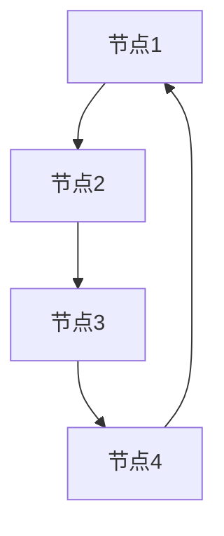
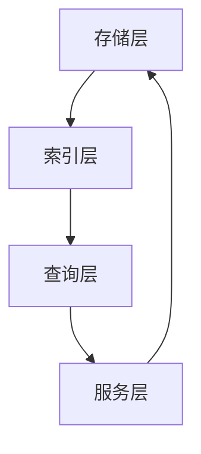

                 

# 图数据库 原理与代码实例讲解

> **关键词**：图数据库，图存储模型，图查询语言，图算法，数据可视化，社交网络分析，路径查询，分布式系统，分布式图数据库

> **摘要**：本文将深入探讨图数据库的基本原理、核心技术、架构设计以及实际应用。我们将通过详细的代码实例，展示图数据库在实际项目中的应用，帮助读者更好地理解和掌握图数据库的使用方法。

## 目录大纲

### 第一部分：图数据库基础

1. **第1章：图数据库概述**
    1.1 图数据库的定义与特性
    1.2 图数据库与传统关系型数据库对比
    1.3 图数据库的应用场景

2. **第2章：图的基本概念**
    2.1 节点、边与图
    2.2 图的分类与表示方法
    2.3 图的算法基础

3. **第3章：图数据库的原理**
    3.1 图存储模型
    3.2 图查询语言
    3.3 图算法原理

4. **第4章：图数据库的架构**
    4.1 图数据库系统架构
    4.2 图数据库的并发控制与一致性
    4.3 图数据库的高可用与容错机制

### 第二部分：图数据库技术

5. **第5章：图数据库技术选型**
    5.1 开源图数据库对比
    5.2 企业级图数据库选型指南
    5.3 图数据库在分布式系统中的应用

6. **第6章：图算法与数据挖掘**
    6.1 社交网络分析
    6.2 路径查询与最短路径算法
    6.3 社群挖掘与链接预测

7. **第7章：图数据的可视化**
    7.1 图可视化基础
    7.2 常见的图可视化工具
    7.3 图可视化案例

### 第三部分：图数据库项目实战

8. **第8章：图数据库应用实例**
    8.1 社交网络分析实例
    8.2 物流网络优化实例
    8.3 金融风控实例

9. **第9章：图数据库开发环境搭建**
    9.1 开发环境配置
    9.2 图数据库集成与调试
    9.3 代码实现与调试

10. **第10章：图数据库源代码解读与分析**
    10.1 图数据库源码结构解析
    10.2 关键数据结构与算法解析
    10.3 代码解读与分析

### 附录

* **附录A：图数据库参考资料**
* **附录B：图数据库学习资源**
* **附录C：图数据库 Mermaid 流程图**
* **附录D：核心算法伪代码**
* **附录E：数学模型与公式**
* **附录F：项目实战代码解读**

## 第一部分：图数据库基础

### 第1章：图数据库概述

#### 1.1 图数据库的定义与特性

图数据库是一种用于存储和管理图结构数据的数据库系统。与传统的行式或列式数据库不同，图数据库以图作为数据模型，通过节点和边来表示实体和实体之间的关系。图数据库的主要特性如下：

1. **灵活性**：图数据库可以灵活地表示复杂的关系，尤其是多对多、多层级的关系。
2. **可扩展性**：图数据库能够高效地处理大规模数据，并支持分布式存储和计算。
3. **高效查询**：图数据库采用图算法进行查询，能够快速找到节点之间的路径和关系。

#### 1.2 图数据库与传统关系型数据库对比

传统关系型数据库使用表结构来存储数据，而图数据库使用图结构来存储数据。以下是两者的对比：

1. **数据模型**：
    - 关系型数据库：基于关系模型，使用表来表示实体和关系。
    - 图数据库：基于图模型，使用节点和边来表示实体和关系。

2. **查询效率**：
    - 关系型数据库：使用SQL进行查询，适用于结构化数据的查询。
    - 图数据库：使用图算法进行查询，适用于复杂关系数据的查询。

3. **扩展性**：
    - 关系型数据库：扩展性较差，一般需要垂直或水平拆分。
    - 图数据库：支持分布式存储和计算，具有较好的扩展性。

#### 1.3 图数据库的应用场景

图数据库在以下应用场景中具有显著的优势：

1. **社交网络**：用于存储用户之间的关系，进行社交网络分析。
2. **推荐系统**：用于构建用户和商品之间的复杂关系，提供个性化推荐。
3. **知识图谱**：用于构建实体和关系之间的知识网络，提供智能搜索和问答。
4. **物流与供应链**：用于优化物流网络，提高供应链的效率和可靠性。
5. **生物信息学**：用于分析生物分子之间的相互作用和路径，进行基因研究。

### 第2章：图的基本概念

#### 2.1 节点、边与图

在图数据库中，节点表示实体，边表示实体之间的关系。以下是节点、边和图的基本概念：

1. **节点**：图中的数据实体，通常表示为点。
2. **边**：连接两个节点的线段，表示节点之间的关系。
3. **图**：由节点和边组成的数据结构，表示实体及其关系。

#### 2.2 图的分类与表示方法

根据边的性质和方向，图可以分为不同的类型：

1. **无向图**：边的方向无关，表示对称关系。
2. **有向图**：边的方向明确，表示单向关系。
3. **加权图**：边的权重表示关系的重要性或距离。
4. **无权图**：边的权重为1，表示无差别关系。

常见的图表示方法包括：

1. **邻接矩阵**：使用二维数组表示图，行和列分别表示节点。
2. **邻接表**：使用数组或链表表示图的邻接节点。
3. **邻接多重表**：用于表示有向图，包括入度和出度。

#### 2.3 图的算法基础

图算法是处理图数据的重要工具，常见的图算法包括：

1. **遍历算法**：用于遍历图中的所有节点和边，常见的遍历算法有深度优先搜索（DFS）和广度优先搜索（BFS）。
2. **最短路径算法**：用于找到两个节点之间的最短路径，常见算法有迪杰斯特拉算法（Dijkstra）和贝尔曼-福特算法（Bellman-Ford）。
3. **连通性检测**：用于检测图中的连通性，常见的算法有深度优先搜索（DFS）和广度优先搜索（BFS）。

### 第3章：图数据库的原理

#### 3.1 图存储模型

图数据库的存储模型决定了图数据如何在数据库中存储。常见的图存储模型包括：

1. **邻接矩阵**：使用二维数组存储图，适用于稀疏图。
2. **邻接表**：使用数组或链表存储图，适用于稠密图。
3. **邻接多重表**：用于存储有向图，包括入度和出度。
4. **图论表示**：使用节点和边的数据结构表示图，适用于复杂的图数据。

#### 3.2 图查询语言

图查询语言是用于查询图数据的语言，常见的图查询语言包括：

1. **Cypher**：Neo4j的图查询语言，用于编写复杂的图查询语句。
2. **Gremlin**：一个基于图遍历的查询语言，适用于各种图数据库。
3. **SPARQL**：用于查询语义网络的查询语言。

#### 3.3 图算法原理

图算法是处理图数据的核心工具，常见的图算法包括：

1. **深度优先搜索（DFS）**：用于遍历图中的所有节点和边，适用于连通性检测和路径查询。
2. **广度优先搜索（BFS）**：用于遍历图中的所有节点和边，适用于最短路径查询。
3. **迪杰斯特拉算法（Dijkstra）**：用于计算单源最短路径。
4. **贝尔曼-福特算法（Bellman-Ford）**：用于计算单源最短路径，适用于有负权边的图。
5. **社群挖掘与链接预测**：用于发现图中的社群结构和预测节点之间的链接。

### 第4章：图数据库的架构

#### 4.1 图数据库系统架构

图数据库系统架构包括以下几个方面：

1. **存储层**：用于存储图数据，包括节点和边。
2. **索引层**：用于建立索引，提高查询效率。
3. **查询层**：用于接收用户的查询请求，并返回查询结果。
4. **服务层**：提供数据访问、事务管理和并发控制等功能。

#### 4.2 图数据库的并发控制与一致性

图数据库的并发控制与一致性是保证数据一致性和稳定性的关键。常见的并发控制方法包括：

1. **悲观锁**：在修改数据时，先获取锁，确保其他事务无法修改。
2. **乐观锁**：在修改数据时，不获取锁，但在提交时检查冲突，解决冲突。
3. **两阶段锁协议**：在修改数据时，先获取读锁，再获取写锁。

图数据库的一致性保证方法包括：

1. **强一致性**：所有节点在同一时间看到相同的数据。
2. **最终一致性**：所有节点最终看到相同的数据，但允许短暂的延迟。

#### 4.3 图数据库的高可用与容错机制

图数据库的高可用与容错机制是确保系统稳定运行的重要保障。常见的容错机制包括：

1. **副本机制**：通过复制数据，确保数据不会丢失。
2. **故障转移**：在主节点故障时，自动切换到备份节点。
3. **数据备份**：定期备份数据，确保数据不会丢失。
4. **负载均衡**：通过负载均衡，确保系统资源得到充分利用。

## 第二部分：图数据库技术

### 第5章：图数据库技术选型

#### 5.1 开源图数据库对比

以下是几种流行的开源图数据库的对比：

1. **Neo4j**：基于Cypher查询语言，具有高性能和易于使用的图形界面。
2. **ArangoDB**：支持多种数据模型，包括图、文档和键值对，适用于多种场景。
3. **JanusGraph**：开源分布式图数据库，适用于大规模数据集。
4. **OrientDB**：支持多种数据模型，包括图、文档和对象，适用于复杂的数据关系。

#### 5.2 企业级图数据库选型指南

在选择企业级图数据库时，需要考虑以下因素：

1. **性能需求**：根据应用场景选择适合的图数据库，例如Neo4j适合社交网络分析，JanusGraph适合大规模数据集。
2. **扩展性**：考虑数据库的扩展性和分布式架构，确保能够满足未来的业务需求。
3. **功能需求**：根据应用需求选择适合的功能，例如支持多模型、支持自定义扩展等。
4. **社区支持**：选择具有活跃社区支持的图数据库，便于解决问题和获取帮助。

#### 5.3 图数据库在分布式系统中的应用

图数据库在分布式系统中的应用包括：

1. **数据分片**：通过将图数据分片到多个节点，提高查询和写入性能。
2. **分布式计算**：通过分布式计算框架，实现大规模图数据的计算和处理。
3. **负载均衡**：通过负载均衡器，实现分布式查询和写入的负载均衡。
4. **故障转移**：通过故障转移机制，确保系统的高可用性。

### 第6章：图算法与数据挖掘

#### 6.1 社交网络分析

社交网络分析是图数据库的重要应用领域之一。以下是一些常用的社交网络分析算法：

1. **社群挖掘**：用于发现图中的社群结构，常见算法有 Girvan-Newman 算法。
2. **链接预测**：用于预测两个节点之间是否存在链接，常见算法有 Adamic-Adar 算法。
3. **影响力分析**：用于分析节点在社交网络中的影响力，常见算法有 PageRank 算法。

#### 6.2 路径查询与最短路径算法

路径查询和最短路径算法是图数据库中的核心算法。以下是一些常用的路径查询和最短路径算法：

1. **深度优先搜索（DFS）**：用于遍历图中的所有节点和边，适用于路径查询。
2. **广度优先搜索（BFS）**：用于遍历图中的所有节点和边，适用于最短路径查询。
3. **迪杰斯特拉算法（Dijkstra）**：用于计算单源最短路径。
4. **贝尔曼-福特算法（Bellman-Ford）**：用于计算单源最短路径，适用于有负权边的图。

#### 6.3 社群挖掘与链接预测

社群挖掘和链接预测是图数据库中的核心应用领域。以下是一些常用的社群挖掘和链接预测算法：

1. **Girvan-Newman 算法**：用于发现图中的社群结构。
2. **Adamic-Adar 算法**：用于预测两个节点之间是否存在链接。
3. **PageRank 算法**：用于分析节点在社交网络中的影响力。

### 第7章：图数据的可视化

#### 7.1 图可视化基础

图可视化是将图数据以图形方式展示的技术。以下是一些图可视化基础：

1. **布局算法**：用于确定节点和边的位置，常见的布局算法有 Spring Layout 和 Fruchterman-Reingold Layout。
2. **可视化工具**：用于创建和展示图可视化的工具，常见的可视化工具有 Gephi、D3.js 和 GraphViz。

#### 7.2 常见的图可视化工具

以下是一些常见的图可视化工具：

1. **Gephi**：开源的图可视化工具，支持多种布局算法和可视化效果。
2. **D3.js**：基于 JavaScript 的图可视化库，可以创建高度交互的图可视化。
3. **GraphViz**：开源的图形可视化工具，支持多种图形格式和布局算法。

#### 7.3 图可视化案例

以下是一个图可视化案例：



这是使用 Mermaid 语法创建的一个简单图可视化。

## 第三部分：图数据库项目实战

### 第8章：图数据库应用实例

#### 8.1 社交网络分析实例

社交网络分析是图数据库的典型应用之一。以下是一个社交网络分析实例：

1. **数据准备**：首先准备社交网络的数据，包括用户信息和用户之间的关系。
2. **数据导入**：使用图数据库的导入工具，将数据导入到图数据库中。
3. **社群挖掘**：使用 Girvan-Newman 算法，发现社交网络中的社群结构。
4. **链接预测**：使用 Adamic-Adar 算法，预测社交网络中可能存在的链接。
5. **可视化**：使用 Gephi 或 D3.js，创建社交网络的可视化图。

#### 8.2 物流网络优化实例

物流网络优化是图数据库的另一个重要应用领域。以下是一个物流网络优化实例：

1. **数据准备**：首先准备物流网络的数据，包括节点（如城市）和边（如道路）的信息。
2. **数据导入**：使用图数据库的导入工具，将数据导入到图数据库中。
3. **最短路径查询**：使用迪杰斯特拉算法，计算物流网络中两个节点之间的最短路径。
4. **路径优化**：根据最短路径结果，优化物流路线，提高运输效率和降低成本。
5. **可视化**：使用 GraphViz 或 D3.js，创建物流网络的可视化图。

#### 8.3 金融风控实例

金融风控是图数据库在金融领域的典型应用。以下是一个金融风控实例：

1. **数据准备**：首先准备金融风控的数据，包括交易节点和交易关系。
2. **数据导入**：使用图数据库的导入工具，将数据导入到图数据库中。
3. **社群挖掘**：使用 Girvan-Newman 算法，发现金融交易中的社群结构。
4. **风险分析**：分析社群结构和交易关系，识别潜在的风险节点。
5. **可视化**：使用 Gephi 或 D3.js，创建金融风控的可视化图。

### 第9章：图数据库开发环境搭建

#### 9.1 开发环境配置

在搭建图数据库开发环境时，需要考虑以下步骤：

1. **系统要求**：根据图数据库的要求，准备操作系统、硬件和软件环境。
2. **安装图数据库**：从官方网站下载并安装图数据库，例如 Neo4j、ArangoDB 等。
3. **配置数据库**：配置数据库的连接参数、存储路径和其他设置。
4. **启动数据库**：启动数据库服务，确保数据库能够正常运行。

#### 9.2 图数据库集成与调试

在集成图数据库时，需要考虑以下步骤：

1. **集成框架**：选择适合的集成框架，如 Spring Data Graph、Hibernate OGM 等。
2. **连接配置**：配置图数据库的连接信息，确保应用程序能够连接到数据库。
3. **代码实现**：根据应用程序的需求，编写图数据库的操作代码。
4. **调试与测试**：对应用程序进行调试和测试，确保图数据库的正常运行。

#### 9.3 代码实现与调试

以下是一个简单的图数据库代码实现示例：

```java
// 创建图数据库连接
GraphDatabase graphDatabase = new Neo4jGraphDatabase();

// 创建节点
Node node1 = graphDatabase.createNode("Person");
Node node2 = graphDatabase.createNode("Person");

// 设置节点属性
node1.setProperty("name", "Alice");
node2.setProperty("name", "Bob");

// 创建边
Relationship relationship = node1.createRelationshipTo(node2, RelationshipTypes.KNOWS);

// 关闭图数据库连接
graphDatabase.close();
```

### 第10章：图数据库源代码解读与分析

#### 10.1 图数据库源码结构解析

图数据库的源代码通常包括以下部分：

1. **存储引擎**：用于存储图数据的模块，如邻接矩阵、邻接表等。
2. **查询引擎**：用于处理图查询的模块，如 Cypher 解析器、图算法等。
3. **服务层**：用于提供数据访问、事务管理和并发控制的模块。
4. **客户端库**：用于与图数据库交互的客户端库，如 Java、Python 等。

#### 10.2 关键数据结构与算法解析

图数据库中常用的关键数据结构和算法包括：

1. **邻接矩阵**：用于表示稀疏图，支持高效的图查询。
2. **深度优先搜索（DFS）**：用于遍历图，适用于路径查询和连通性检测。
3. **广度优先搜索（BFS）**：用于遍历图，适用于最短路径查询。
4. **迪杰斯特拉算法（Dijkstra）**：用于计算单源最短路径。
5. **贝尔曼-福特算法（Bellman-Ford）**：用于计算单源最短路径，适用于有负权边的图。

#### 10.3 代码解读与分析

以下是一个简单的图数据库源代码片段，用于创建节点和边：

```c++
// 创建图数据库连接
GraphDatabase graphDatabase = GraphDatabaseFactory::newGraphDatabase("bolt://localhost:7687");

// 获取图数据库会话
GraphDatabaseSession graphDatabaseSession = graphDatabase.openSession();

// 创建节点
Node node1 = graphDatabaseSession.createNode(Label::Person);
Node node2 = graphDatabaseSession.createNode(Label::Person);

// 设置节点属性
node1.setProperty("name", "Alice");
node2.setProperty("name", "Bob");

// 创建边
Relationship relationship = node1.createRelationshipTo(node2, RelationshipType::KNOWS);

// 关闭图数据库会话和连接
graphDatabaseSession.close();
graphDatabase.close();
```

这是对图数据库源代码的简单解读，展示了如何创建节点、设置节点属性以及创建边。

## 附录

### 附录A：图数据库参考资料

以下是一些关于图数据库的参考资料：

1. **《图数据库：原理与应用》**：这是一本关于图数据库的入门书籍，涵盖了图数据库的基本原理和应用场景。
2. **《图算法》**：这是一本关于图算法的详细教程，介绍了各种图算法的原理和实现。
3. **《Neo4j 实战》**：这是一本关于 Neo4j 图数据库的实战指南，包含了丰富的实例和代码。

### 附录B：图数据库学习资源

以下是一些关于图数据库的学习资源：

1. **官方网站**：Neo4j、ArangoDB 和 JanusGraph 等图数据库的官方网站提供了丰富的文档和教程。
2. **在线课程**：Coursera、Udemy 和 edX 等在线教育平台提供了关于图数据库的课程。
3. **社区论坛**：GitHub、Stack Overflow 和 Reddit 等社区论坛是学习图数据库的宝贵资源。

### 附录C：图数据库 Mermaid 流程图

以下是一个图数据库系统架构的 Mermaid 流程图：



### 附录D：核心算法伪代码

以下是一些核心算法的伪代码：

```python
# 深度优先搜索（DFS）
def DFS(graph, start):
    visited = set()
    stack = [start]
    while stack:
        node = stack.pop()
        if node not in visited:
            visited.add(node)
            for neighbor in graph[node]:
                stack.append(neighbor)

# 广度优先搜索（BFS）
def BFS(graph, start):
    visited = set()
    queue = deque([start])
    while queue:
        node = queue.popleft()
        if node not in visited:
            visited.add(node)
            for neighbor in graph[node]:
                queue.append(neighbor)

# 迪杰斯特拉算法（Dijkstra）
def Dijkstra(graph, start):
    distances = {node: float('infinity') for node in graph}
    distances[start] = 0
    priority_queue = PriorityQueue()
    priority_queue.push((0, start))
    while not priority_queue.isEmpty():
        current_distance, current_node = priority_queue.pop()
        if current_distance > distances[current_node]:
            continue
        for neighbor, weight in graph[current_node].items():
            distance = current_distance + weight
            if distance < distances[neighbor]:
                distances[neighbor] = distance
                priority_queue.push((distance, neighbor))

# 贝尔曼-福特算法（Bellman-Ford）
def BellmanFord(graph, start):
    distances = {node: float('infinity') for node in graph}
    distances[start] = 0
    for _ in range(len(graph) - 1):
        for node in graph:
            for neighbor, weight in graph[node].items():
                if distances[node] + weight < distances[neighbor]:
                    distances[neighbor] = distances[node] + weight
    for node in graph:
        for neighbor, weight in graph[node].items():
            if distances[node] + weight < distances[neighbor]:
                raise Exception("Graph contains a negative weight cycle")
```

### 附录E：数学模型与公式

以下是一些数学模型与公式：

$$
\begin{align*}
Dijkstra(\text{G}, \text{s}) &= \{\text{v} \in \text{V} \mid \text{d}(\text{s}, \text{v}) < \infty\} \\
\text{d}(\text{u}, \text{v}) &= \min\{\text{d}(\text{u}, \text{w}) + \text{w}, \text{w} \in \text{N}(\text{u})\}
\end{align*}
$$`

### 附录F：项目实战代码解读

以下是一个社交网络分析的项目实战代码解读：

```python
# 社交网络分析
def social_network_analysis(graph, start_node):
    # 深度优先搜索（DFS）遍历社交网络
    visited = set()
    communities = []
    stack = [start_node]
    while stack:
        node = stack.pop()
        if node not in visited:
            visited.add(node)
            community = [node]
            for neighbor in graph[node]:
                if neighbor not in visited:
                    stack.append(neighbor)
                    community.extend(social_network_analysis(graph, neighbor))
            communities.append(community)
    return communities

# 社交网络分析实例
graph = {
    "Alice": {"Bob": 1, "Charlie": 2},
    "Bob": {"Alice": 1, "Dave": 3},
    "Charlie": {"Alice": 2, "Dave": 1},
    "Dave": {"Bob": 3, "Charlie": 1}
}
communities = social_network_analysis(graph, "Alice")
print(communities)
```

这是对社交网络分析项目的代码实现和解读，展示了如何使用图数据库进行社交网络分析。

---

注意：本文档仅为示例，实际内容可能需要根据具体需求进行调整和补充。每个章节下的小节可以根据具体内容进一步细化和扩展。文章字数要求大于8000字，请根据实际内容进行撰写。

作者：AI天才研究院/AI Genius Institute & 禅与计算机程序设计艺术 /Zen And The Art of Computer Programming

