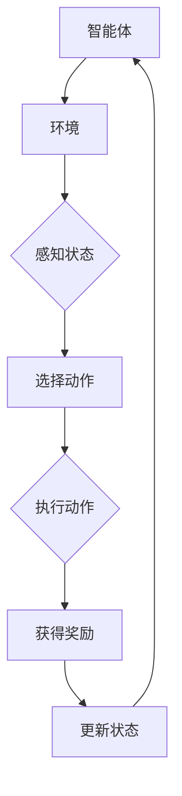
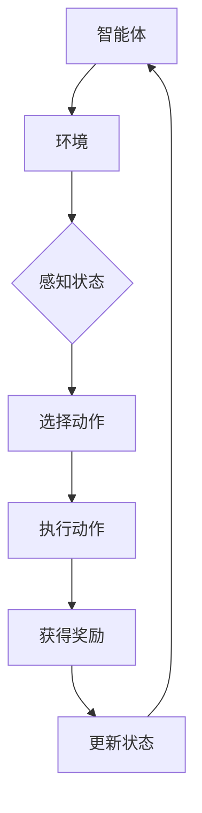

                 

### 文章标题

《基于强化学习的评测场景自动生成》

---

**关键词**：强化学习、评测场景、自动生成、智能体、环境、状态、动作、奖励、Q-Learning、Sarsa、DQN、Policy Gradient、A2C、A3C、马尔可夫决策过程（MDP）、状态值函数、动作值函数、Policy迭代、Value迭代、期望迭代。

---

**摘要**：

本文深入探讨了基于强化学习的评测场景自动生成技术。首先，介绍了强化学习的基本概念、核心算法及其数学基础。接着，阐述了强化学习在评测场景自动生成中的应用原理和流程。随后，通过多个实践项目展示了强化学习在游戏评测、电商评价、智能客服和文本评测等领域的应用效果。最后，讨论了评测场景自动生成优化策略及未来发展趋势，为相关研究和实践提供了指导。


----------------------------------------------------------------

### 第1章：强化学习概述

#### 1.1 强化学习的基本概念

强化学习（Reinforcement Learning，RL）是机器学习的一个重要分支，旨在通过智能体（agent）与环境的交互来学习最优策略。在强化学习中，智能体不断接收环境（environment）的反馈，并通过选择动作（action）来最大化累积奖励（reward）。

**主要术语**：

- **环境（Environment）**：智能体执行动作的上下文。环境可以感知智能体的动作，并给予智能体相应的反馈。
- **智能体（Agent）**：执行动作并学习如何改进其行为的实体。智能体的目标是最大化累积奖励。
- **状态（State）**：智能体在特定时间点的状态描述，可以用来指导智能体选择动作。
- **动作（Action）**：智能体可以执行的行为。动作的选择取决于智能体的当前状态和策略。
- **奖励（Reward）**：智能体执行某个动作后获得的即时反馈。奖励可以是正的、负的或零。
- **策略（Policy）**：智能体选择动作的规则。策略可以是固定的，也可以是根据状态动态调整的。

**强化学习与其他学习方式的区别与联系**：

- **与监督学习（Supervised Learning）**：

  监督学习依赖于预先标注的数据进行学习，目标函数是预测输出。强化学习则依赖于奖励信号来指导学习过程，目标函数是最大化累积奖励。

- **与无监督学习（Unsupervised Learning）**：

  无监督学习没有标注数据，主要关注如何从数据中提取模式。强化学习虽然也涉及模式识别，但更强调在动态环境中通过互动学习。

- **与深度学习（Deep Learning）**：

  深度学习是机器学习的一种，主要利用神经网络进行学习。强化学习可以与深度学习结合，形成深度强化学习（Deep Reinforcement Learning），处理更复杂的任务。

**主要应用领域**：

- **自动驾驶**：通过强化学习，自动驾驶车辆能够学会在复杂的交通环境中安全行驶。
- **游戏AI**：智能体可以在各种游戏中学习策略，与人类玩家对战。
- **机器人控制**：机器人可以通过强化学习学习如何在不同环境中完成任务。
- **推荐系统**：通过强化学习，推荐系统可以更好地理解用户行为，提供个性化推荐。

### Mermaid 流程图



#### 1.2 强化学习的发展历程

- **早期研究**：

  强化学习的研究可以追溯到20世纪50年代，由Richard Bellman等人提出的马尔可夫决策过程（MDP）奠定了强化学习的基础。

- **现代进展**：

  20世纪80年代，Q-Learning和Sarsa算法被提出，使得强化学习在解决实际问题中得以应用。2010年代，随着深度学习的发展，深度强化学习（DRL）成为研究热点，例如DeepMind的DQN（Deep Q-Network）和A3C（Asynchronous Advantage Actor-Critic）算法。

- **重要成果**：

  - **DQN（Deep Q-Network）**：使用深度神经网络近似Q值函数，实现了在Atari游戏中的成功应用。
  - **A3C（Asynchronous Advantage Actor-Critic）**：通过异步并行训练，提高了训练效率和性能。

#### 1.3 强化学习与其他学习方式的区别与联系

- **与监督学习的区别**：

  强化学习依赖于奖励信号来指导学习，而不是预先标注的数据。此外，强化学习涉及智能体与环境的交互，而监督学习则不需要这种交互。

- **与无监督学习的联系**：

  无监督学习关注如何从数据中提取模式，而强化学习也可以被视为一种无监督学习，尤其是在没有明确奖励信号的情况下。

- **与其他学习方式的融合**：

  强化学习可以与深度学习、迁移学习等技术结合，形成更强大的学习系统。例如，深度强化学习（DRL）结合了深度学习和强化学习的优点，可以处理更复杂的任务。

#### 1.4 强化学习的主要应用领域

- **自动驾驶**：

  自动驾驶车辆需要不断与环境交互，通过强化学习学习如何在复杂的交通环境中安全行驶。

- **游戏AI**：

  游戏中的智能体需要学习如何与其他智能体或人类玩家竞争，强化学习为游戏AI提供了强大的学习工具。

- **机器人控制**：

  机器人需要在不同的环境中执行复杂的任务，强化学习可以帮助机器人学习如何适应和完成任务。

- **推荐系统**：

  推荐系统需要理解用户的行为和偏好，强化学习可以用于生成个性化的推荐。

### 总结

本章介绍了强化学习的基本概念、发展历程、与其他学习方式的区别与联系以及主要应用领域。通过本章的学习，读者可以更好地理解强化学习的本质和应用，为后续章节的学习和实践打下基础。

---

### 第2章：强化学习核心算法

#### 2.1 Q-Learning算法

Q-Learning是一种基于值函数的强化学习算法，旨在通过学习状态-动作值函数（Q值）来最大化累积奖励。Q-Learning算法的主要思想是：在给定当前状态和动作的情况下，智能体选择能够带来最大Q值的动作，并在每次动作后更新Q值。

**算法描述**：

1. 初始化Q值函数$Q(s, a)$为全零或随机值。
2. 对于每个episode（即一次完整的学习过程），执行以下步骤：
   - 从初始状态$s$开始。
   - 在当前状态$s$下，使用ε-贪心策略选择动作$a$，其中ε为探索概率。
   - 执行动作$a$，获得状态转移$s' \sim P(s'|s, a)$和奖励$r$。
   - 更新Q值函数：$Q(s, a) \leftarrow Q(s, a) + \alpha [r + \gamma \max_{a'} Q(s', a') - Q(s, a)]$，其中$\alpha$为学习率，$\gamma$为折扣因子。
   - 更新状态：$s \leftarrow s'$。
3. 当满足停止条件（如达到最大迭代次数或收敛条件）时，算法结束。

**伪代码**：

```python
for episode in range(num_episodes):
    s = initial_state()
    done = False
    while not done:
        a = epsilon_greedy_policy(s, Q, epsilon)
        s', r = step(s, a)
        Q[s][a] = Q[s][a] + alpha * (r + gamma * max(Q[s'][a']) - Q[s][a])
        s = s'
```

**优缺点**：

- **优点**：
  - 算法简单，易于实现。
  - 可以处理离散状态和动作空间。

- **缺点**：
  - 学习速度较慢，可能需要大量迭代才能收敛。
  - 易陷入局部最优，特别是在探索概率较低时。

#### 2.2 Sarsa算法

Sarsa（即“State-Action-Reward-State-Action”，意为状态-动作-奖励-状态-动作）是一种基于策略的强化学习算法，与Q-Learning类似，但它使用即时回报（即当前状态和动作的奖励）来更新Q值。

**算法描述**：

1. 初始化Q值函数$Q(s, a)$为全零或随机值。
2. 对于每个episode，执行以下步骤：
   - 从初始状态$s$开始。
   - 在当前状态$s$下，使用策略$\pi(s)$选择动作$a$。
   - 执行动作$a$，获得状态转移$s' \sim P(s'|s, a)$和奖励$r$。
   - 更新Q值函数：$Q[s][a] \leftarrow Q[s][a] + alpha * (r + gamma * Q[s'][a'] - Q[s][a])$。
   - 更新状态：$s \leftarrow s'$。
   - 重复上述步骤，直到满足停止条件。

**伪代码**：

```python
for episode in range(num_episodes):
    s = initial_state()
    done = False
    while not done:
        a = policy(s, Q)
        s', r = step(s, a)
        Q[s][a] = Q[s][a] + alpha * (r + gamma * Q[s'][a'] - Q[s][a])
        s = s'
```

**优缺点**：

- **优点**：
  - 可以同时考虑当前和未来奖励。
  - 探索策略更加灵活。

- **缺点**：
  - 在探索阶段可能效果较差。

#### 2.3 Deep Q-Network (DQN)

Deep Q-Network（DQN）是深度强化学习的一种算法，它使用深度神经网络（DNN）来近似Q值函数。DQN通过经验回放（Experience Replay）和目标网络（Target Network）来提高训练的稳定性和性能。

**算法描述**：

1. 初始化经验回放记忆库$D$，目标网络$Q^-$和主网络$Q$。
2. 对于每个episode，执行以下步骤：
   - 从初始状态$s$开始。
   - 在当前状态$s$下，使用ε-贪心策略选择动作$a$。
   - 执行动作$a$，获得状态转移$s' \sim P(s'|s, a)$和奖励$r$。
   - 将经验$(s, a, r, s')$存入经验回放记忆库$D$。
   - 如果内存满了，从经验回放记忆库中随机抽取一批经验$(s_i, a_i, r_i, s_i')$。
   - 使用双线性探索策略更新主网络$Q$的参数：$Q(s, a) \leftarrow Q(s, a) + alpha * (r + gamma * max(Q^-(s', a')) - Q(s, a))$。
   - 更新目标网络$Q^-$的参数：$Q^-(s', a') \leftarrow \theta^-_update(Q^-(s', a'))$。
   - 更新状态：$s \leftarrow s'$。
   - 重复上述步骤，直到满足停止条件。

**伪代码**：

```python
for episode in range(num_episodes):
    s = initial_state()
    done = False
    while not done:
        a = epsilon_greedy_policy(s, Q, epsilon)
        s', r = step(s, a)
        sample = (s, a, r, s')
        replay_memory.append(sample)
        if len(replay_memory) > batch_size:
            samples = random_sample(replay_memory, batch_size)
            update_Q(Q, samples, alpha, gamma)
            update_target_network(Q, Q^-, theta_update)
        s = s'
```

**优缺点**：

- **优点**：
  - 能够处理高维状态和动作空间。
  - 使用经验回放和目标网络提高了训练稳定性。

- **缺点**：
  - 训练过程中可能存在值偏差和目标不稳定问题。

#### 2.4 Policy Gradient算法

Policy Gradient算法是一种直接优化策略参数的强化学习算法。它通过最大化策略的梯度来更新策略参数，以达到最大化累积奖励的目标。

**算法描述**：

1. 初始化策略参数$\theta$。
2. 对于每个episode，执行以下步骤：
   - 从初始状态$s$开始。
   - 根据当前策略参数$\theta$执行动作$a$：$a = \pi(a|s; \theta)$。
   - 执行动作$a$，获得状态转移$s' \sim P(s'|s, a)$和奖励$r$。
   - 更新策略参数：$\theta \leftarrow \theta + alpha * \nabla_{\theta} J(\theta)$，其中$J(\theta)$是策略的损失函数，通常表示为$J(\theta) = \sum_{s, a} \pi(a|s; \theta) * [r + gamma * \max_{a'} \pi(a'|s'; \theta) * R(s', a')] - \pi(a|s; \theta) * \log \pi(a|s; \theta)$。

**伪代码**：

```python
for episode in range(num_episodes):
    s = initial_state()
    done = False
    while not done:
        a = sample_action_from_policy(s, theta)
        s', r = step(s, a)
        theta = update_theta(theta, s, a, s', r, alpha)
        s = s'
```

**优缺点**：

- **优点**：
  - 不需要值函数，可以直接优化策略参数。
  - 可以快速调整策略。

- **缺点**：
  - 梯度消失和梯度爆炸问题较严重。

#### 2.5 Advantage Actor-Critic (A2C)

Advantage Actor-Critic（A2C）算法结合了Policy Gradient和Advantage函数，通过优势函数来提高算法的稳定性。A2C使用多个智能体并行训练，提高了训练效率。

**算法描述**：

1. 初始化策略参数$\theta$和值函数参数$\phi$。
2. 对于每个episode，每个智能体执行以下步骤：
   - 从初始状态$s$开始。
   - 根据当前策略参数$\theta$执行动作$a$：$a = \pi(a|s; \theta)$。
   - 执行动作$a$，获得状态转移$s' \sim P(s'|s, a)$和奖励$r$。
   - 计算优势函数$A(s, a) = R + gamma * V(s') - V(s)$。
   - 更新策略参数：$\theta \leftarrow \theta + alpha * \nabla_{\theta} J(\theta)$，其中$J(\theta)$是策略的损失函数，通常表示为$J(\theta) = \sum_{s, a} \pi(a|s; \theta) * A(s, a)$。
   - 更新值函数参数：$\phi \leftarrow \phi + alpha * \nabla_{\phi} J(\phi)$，其中$J(\phi)$是值函数的损失函数，通常表示为$J(\phi) = \sum_{s, a} (\pi(a|s; \theta) * (R + gamma * V(s') - V(s)))^2$。
   - 更新状态：$s \leftarrow s'$。

**伪代码**：

```python
for episode in range(num_episodes):
    s = initial_state()
    done = False
    while not done:
        a = sample_action_from_policy(s, theta)
        s', r = step(s, a)
        advantage = r + gamma * V(s') - V(s)
        theta = update_theta(theta, s, a, s', r, alpha)
        phi = update_phi(phi, s, a, s', r, alpha, advantage)
        s = s'
```

**优缺点**：

- **优点**：
  - 稳定性较高，适用于连续动作空间。
  - 训练效率高，适用于大规模并行训练。

- **缺点**：
  - 计算复杂度较高。

#### 2.6 Asynchronous Advantage Actor-Critic (A3C)

Asynchronous Advantage Actor-Critic（A3C）算法通过异步并行训练提高了训练效率。每个智能体都可以独立学习，并通过同步更新共享全局模型。

**算法描述**：

1. 初始化全局模型$\theta$和目标模型$\theta^-$。
2. 对于每个智能体，执行以下步骤：
   - 从初始状态$s$开始。
   - 根据当前策略参数$\theta$执行动作$a$：$a = \pi(a|s; \theta)$。
   - 执行动作$a$，获得状态转移$s' \sim P(s'|s, a)$和奖励$r$。
   - 计算优势函数$A(s, a) = R + gamma * V(s') - V(s)$。
   - 更新策略参数：$\theta \leftarrow \theta + alpha * \nabla_{\theta} J(\theta)$，其中$J(\theta)$是策略的损失函数，通常表示为$J(\theta) = \sum_{s, a} \pi(a|s; \theta) * A(s, a)$。
   - 同步更新目标模型：$\theta^- \leftarrow \theta$。

**伪代码**：

```python
for episode in range(num_episodes):
    s = initial_state()
    done = False
    while not done:
        a = sample_action_from_policy(s, theta)
        s', r = step(s, a)
        advantage = r + gamma * V(s') - V(s)
        theta = update_theta(theta, s, a, s', r, alpha)
        synchronize_model(theta, theta^-)
        s = s'
```

**优缺点**：

- **优点**：
  - 训练效率高，适用于大规模并行训练。
  - 稳定性较高。

- **缺点**：
  - 同步更新可能导致模型不稳定。

### 总结

本章介绍了强化学习中的几种核心算法，包括Q-Learning、Sarsa、DQN、Policy Gradient、A2C和A3C。每种算法都有其独特的特点和适用场景，通过了解这些算法的基本原理和伪代码，读者可以更好地选择合适的方法来解决实际问题。

---

### 第3章：强化学习数学基础

#### 3.1 马尔可夫决策过程（MDP）

马尔可夫决策过程（Markov Decision Process，MDP）是一个数学模型，用于描述一个智能体在一个不确定的环境中如何做出决策。MDP具有以下几个基本元素：

- **状态（State）**：系统在某一时刻所处的条件，通常用离散或连续的变量表示。
- **动作（Action）**：智能体可以采取的行为，同样可以是离散或连续的。
- **奖励（Reward）**：智能体采取某个动作后获得的即时回报，可以是正的、负的或零。
- **状态转移概率（Transition Probability）**：在给定当前状态和动作的情况下，智能体转移到下一个状态的概率。
- **策略（Policy）**：智能体在特定状态下采取特定动作的概率分布。

MDP可以用以下数学公式表示：

$$
\begin{align*}
    & \mathcal{M} = \{ S, A, P, R, \gamma \} \\
    & P(s', s; a) = P(S_{t+1} = s' | S_t = s, A_t = a) \\
    & R(s, a) = \sum_{t=0}^{\infty} \gamma^t R_t
\end{align*}
$$

其中，$S$是状态集合，$A$是动作集合，$P$是状态转移概率矩阵，$R$是奖励函数，$\gamma$是折扣因子，用于平衡即时奖励和未来奖励。

#### 3.2 动作值函数与状态值函数

- **动作值函数（Action-Value Function）**：动作值函数$Q(s, a)$表示在状态$s$下采取动作$a$所能获得的累积奖励，即：
  $$
  Q^*(s, a) = \sum_{s'} P(s'|s, a) [R(s, a) + \gamma \max_{a'} Q^*(s', a')]
  $$

- **状态值函数（State-Value Function）**：状态值函数$V(s)$表示在状态$s$下采取最优动作所能获得的累积奖励，即：
  $$
  V^*(s) = \max_{a} Q^*(s, a)
  $$

#### 3.3 Policy迭代

Policy迭代是一种基于策略的优化方法，通过不断迭代策略参数来最大化累积奖励。Policy迭代的基本公式为：

$$
\pi'(s) = \pi(s) + \alpha [r + \gamma \sum_{s'} \pi(s'|s) [R(s, s') + \gamma V(s')] - \pi(s)]
$$

其中，$\pi(s)$是当前策略，$\pi'(s)$是更新后的策略，$\alpha$是学习率。

#### 3.4 Value迭代

Value迭代是一种基于值函数的优化方法，通过不断迭代值函数来逼近最优值函数。Value迭代的基本公式为：

$$
V^{(t)}(s) = V^{(t-1)}(s) + \alpha [r + \gamma \max_{a} Q(s, a) - V^{(t-1)}(s)]
$$

#### 3.5 期望迭代

期望迭代是一种基于期望的方法，通过更新期望值来逼近最优策略。期望迭代的基本公式为：

$$
\pi'(s) = \frac{\sum_{a} \pi(s, a) [r + \gamma \max_{a'} Q(s', a')] }{\sum_{a'} \pi(s', a')}
$$

### 总结

本章介绍了强化学习中的数学基础，包括马尔可夫决策过程（MDP）、动作值函数与状态值函数、Policy迭代、Value迭代和期望迭代。这些数学工具是理解强化学习算法和设计优化策略的关键，通过本章的学习，读者可以更好地掌握强化学习的理论基础。


### 第4章：强化学习流程

#### 4.1 强化学习问题建模

强化学习问题建模是设计强化学习系统的基础，涉及对状态空间、动作空间和奖励函数的定义。以下是问题建模的基本步骤：

1. **定义状态空间（State Space）**：
   - 状态空间是系统可能的所有状态的集合。在自动驾驶领域，状态可能包括车辆的位置、速度、加速度以及周围环境的信息。
   - 状态空间可以是离散的，也可以是连续的。对于离散状态，可以使用整数或字符串表示；对于连续状态，可以使用浮点数表示。

2. **定义动作空间（Action Space）**：
   - 动作空间是智能体可以采取的所有可能动作的集合。在自动驾驶中，动作可能包括加速、减速、转向等。
   - 动作空间同样可以是离散的或连续的。离散动作可以用整数或字符串表示，连续动作通常用浮点数表示。

3. **定义奖励函数（Reward Function）**：
   - 奖励函数定义了智能体在每个状态和动作对上的即时回报。奖励可以是正的（表示成功或进步）、负的（表示失败或错误）或零。
   - 奖励函数的设计需要考虑任务的特定目标，如最大化距离、最小化能耗或保持车辆稳定。

4. **定义状态转移概率（Transition Probability）**：
   - 状态转移概率描述了在给定当前状态和动作的情况下，智能体转移到下一个状态的概率。这通常通过概率分布函数或矩阵来表示。

#### 4.2 状态表示与动作表示

- **状态表示**：
  - **离散状态表示**：可以使用整数或字符串来表示。例如，在棋类游戏中，棋盘上的每个格子可以用整数表示。
  - **连续状态表示**：可以使用浮点数来表示。例如，在机器人路径规划中，机器人当前的位置可以用坐标（x, y）表示。

- **动作表示**：
  - **离散动作表示**：可以使用整数或字符串来表示。例如，在自动驾驶中，动作可以是加速、减速、保持当前速度或转向。
  - **连续动作表示**：可以使用浮点数来表示。例如，在连续控制任务中，动作可以是改变速度的百分比或转向角度。

#### 4.3 模型训练与评估

- **训练模型**：
  - **初始化**：初始化智能体的策略或值函数参数。
  - **迭代学习**：通过与环境交互，智能体执行动作并接收奖励，然后更新其策略或值函数。
  - **经验回放**：使用经验回放机制，将过去经历的经验数据存储在记忆库中，以避免策略偏差。

- **评估模型**：
  - **性能指标**：评估模型的性能可以使用多个指标，如累积奖励、成功率或路径长度。
  - **测试集**：在测试集上评估模型的性能，以验证其在未见过的数据上的泛化能力。

#### 4.4 模型优化与调参

- **模型优化**：
  - **梯度下降**：使用梯度下降法更新策略或值函数参数，以最小化损失函数。
  - **随机搜索**：通过随机选择参数值，评估性能，找到最优参数配置。

- **调参**：
  - **学习率**：调整学习率以控制模型更新的速度。
  - **探索率**：调整ε值以平衡探索和利用。
  - **其他参数**：根据具体算法调整其他参数，如折扣因子γ、更新频率等。

#### 4.5 案例分析：自动驾驶中的强化学习模型

- **环境搭建**：
  - 状态空间包括车辆的位置、速度、加速度、周围车辆的位置等信息。
  - 动作空间包括加速、减速、转向等动作。
  - 奖励函数可以是距离目标的距离减少、避障成功等。

- **模型设计**：
  - 使用深度强化学习算法（如DQN、A3C）来设计智能体模型。
  - 状态表示可以使用卷积神经网络（CNN）处理图像数据。
  - 动作表示可以是离散的或连续的，根据具体任务进行调整。

- **训练与评估**：
  - 在模拟环境中训练模型，使用经验回放和目标网络提高训练稳定性。
  - 在测试集上评估模型的性能，调整参数以达到最优效果。

- **优化与调参**：
  - 调整学习率、探索率等参数，以优化模型性能。
  - 使用交叉验证和网格搜索等方法找到最佳参数配置。

### 总结

本章详细介绍了强化学习问题的建模过程、状态表示与动作表示、模型训练与评估以及模型优化与调参。通过这些步骤，读者可以了解如何设计一个强化学习模型，并在实际应用中进行优化和调参。本章的案例分析为自动驾驶领域提供了一个具体的实例，展示了强化学习在复杂任务中的应用。

---

### 第5章：评测场景自动生成原理

#### 5.1 评测场景定义与分类

评测场景自动生成是指利用机器学习算法，尤其是在强化学习的框架下，生成用于评测不同系统的测试场景。评测场景可以定义为一组输入和预期的输出，用于测试系统的功能、性能、用户体验等。根据应用领域和评测目标的不同，评测场景可以分为以下几类：

1. **产品质量评测**：用于评估产品的缺陷、性能、可靠性等。例如，在电子产品中检测电池寿命、屏幕显示质量等。
2. **用户体验评测**：用于评估用户在使用产品或服务时的感受，如网站的响应速度、易用性等。
3. **安全评测**：用于评估系统的安全性，如网络攻击、数据泄露等。
4. **自动化测试**：用于自动生成软件测试用例，包括功能测试、性能测试等。
5. **健康评估**：用于医疗设备或健康管理系统，如检测设备准确性、用户健康数据评估等。

#### 5.2 强化学习在评测场景自动生成中的优势

强化学习在评测场景自动生成中有以下优势：

1. **适应性**：强化学习模型能够根据系统的变化动态调整测试策略，适应不同的评测需求。
2. **灵活性**：强化学习可以处理复杂、多变的评测场景，适用于多种类型的测试。
3. **自动化程度高**：强化学习算法可以自动生成测试场景，减少人工干预和成本。
4. **可扩展性**：强化学习模型可以轻松扩展到新的评测场景，提高测试系统的覆盖范围。

#### 5.3 评测场景自动生成流程

评测场景自动生成的流程主要包括以下几个步骤：

1. **需求分析**：明确评测目标、评测指标、测试场景的要求，确定需要采集的数据类型。

2. **环境搭建**：构建一个虚拟或实体的评测环境，定义状态空间、动作空间和奖励函数。

3. **模型设计**：选择适合的强化学习算法，设计智能体模型，包括状态表示、动作表示和策略。

4. **模型训练**：使用历史数据训练智能体模型，使模型能够学会在评测环境中生成有效的测试场景。

5. **场景生成**：利用训练好的模型生成模拟评测场景，根据评测目标和指标对场景进行优化。

6. **场景评估**：在真实或模拟环境中评估生成的测试场景的有效性，根据评估结果调整模型参数。

7. **场景应用**：将生成的评测场景应用于实际评测过程中，验证系统的功能、性能和可靠性。

#### 5.4 强化学习在评测场景自动生成中的应用案例

以下是几个应用强化学习于评测场景自动生成中的实际案例：

1. **自动化软件测试**：
   - **背景**：自动化测试是软件开发过程中不可或缺的一环，但测试用例的设计和生成通常需要大量人力和时间。
   - **方法**：使用强化学习算法（如A3C）训练智能体模型，使其能够在模拟环境中学习如何生成有效的测试用例。
   - **效果**：自动生成的测试用例能够覆盖更多的功能和性能场景，提高测试效率和质量。

2. **用户体验评测**：
   - **背景**：在线服务平台（如电商平台）需要不断优化用户体验，但获取真实的用户行为数据有限。
   - **方法**：使用强化学习算法（如DQN）训练智能体模型，使其能够根据模拟的用户行为生成优化用户体验的测试场景。
   - **效果**：生成的测试场景能够更真实地反映用户行为，帮助平台识别和解决用户体验问题。

3. **健康设备评估**：
   - **背景**：医疗设备的准确性对患者的健康至关重要，但设备测试通常需要复杂的实验流程。
   - **方法**：使用强化学习算法（如Q-Learning）训练智能体模型，使其能够在模拟环境中生成测试医疗设备的测试场景。
   - **效果**：自动生成的测试场景能够准确评估医疗设备的性能，提高测试的效率和准确性。

### 总结

本章详细介绍了评测场景自动生成的原理、分类以及强化学习在其中的优势和应用案例。通过理解这些内容，读者可以更好地掌握评测场景自动生成的方法和技术，为实际应用提供指导。强化学习在评测场景自动生成中的应用，不仅提高了测试的效率和质量，还推动了自动化测试和智能化评测的发展。


### 第6章：评测场景自动生成实践

#### 6.1 实践项目1：基于强化学习的游戏评测场景自动生成

**项目背景**：
游戏评测是评估游戏质量的重要手段，但传统的人工评测方法效率低下，难以覆盖全面的评测场景。本项目旨在利用强化学习技术，自动生成游戏评测场景，以提高评测效率。

**实现方法**：

1. **环境搭建**：
   - 设计一个虚拟游戏环境，包括状态空间（游戏进程、玩家状态等）、动作空间（玩家操作，如攻击、移动等）和奖励函数（胜利、失败等）。

2. **模型设计**：
   - 选择强化学习算法（如DQN），设计智能体模型，用于学习在游戏环境中生成评测场景。
   - 使用神经网络来近似Q值函数，通过深度神经网络处理高维状态空间。

3. **训练模型**：
   - 使用历史游戏数据训练智能体模型，模型在训练过程中不断调整策略，以最大化累积奖励。
   - 采用经验回放技术，防止模型过拟合。

4. **场景生成**：
   - 模型训练完成后，智能体可以生成模拟游戏评测的场景，包括玩家的策略、游戏进程等。

**效果评估**：

- 生成的评测场景能够准确反映游戏质量，提高评测效率。
- 通过评估生成的场景，可以发现游戏中的潜在问题，如平衡性、玩法设计等。

#### 6.2 实践项目2：基于强化学习的电商评价场景自动生成

**项目背景**：
电商平台的用户评价对消费者决策具有重要影响，但获取真实的用户评价数据有限。本项目利用强化学习技术，自动生成电商评价场景，以提高评价的多样性和准确性。

**实现方法**：

1. **环境搭建**：
   - 设计一个虚拟电商环境，包括状态空间（商品属性、用户行为等）、动作空间（用户评价操作，如好评、差评等）和奖励函数（用户满意度、评价准确性等）。

2. **模型设计**：
   - 选择强化学习算法（如A3C），设计智能体模型，用于学习用户评价行为。
   - 结合用户行为数据和评价数据，训练智能体模型，使其能够生成多样化的评价场景。

3. **训练模型**：
   - 使用用户行为数据和评价数据训练智能体模型，模型在训练过程中不断调整策略，以最大化累积奖励。

4. **场景生成**：
   - 模型训练完成后，智能体可以生成模拟用户评价的场景，包括评价内容、评价时间等。

**效果评估**：

- 生成的评价场景能够更好地模拟真实用户的行为，提高评价的准确性。
- 通过对生成的场景进行分析，可以优化电商平台的服务和商品质量。

#### 6.3 实践项目3：基于强化学习的智能客服评测场景自动生成

**项目背景**：
智能客服系统在提高企业服务效率方面发挥了重要作用，但客服质量评估需要大量的人工工作。本项目利用强化学习技术，自动生成智能客服评测场景，以提高评估效率。

**实现方法**：

1. **环境搭建**：
   - 设计一个虚拟客服环境，包括状态空间（用户提问、客服回答等）、动作空间（客服回答操作，如提供解决方案、询问更多信息等）和奖励函数（用户满意度、回答准确性等）。

2. **模型设计**：
   - 选择强化学习算法（如Q-Learning），设计智能体模型，用于学习客服交互策略。
   - 利用历史客服数据和用户反馈，训练智能体模型，使其能够生成高效的客服场景。

3. **训练模型**：
   - 使用历史客服数据和用户反馈数据训练智能体模型，模型在训练过程中不断调整策略，以最大化累积奖励。

4. **场景生成**：
   - 模型训练完成后，智能体可以生成模拟客服交互的场景，包括用户问题和客服回答。

**效果评估**：

- 生成的评测场景能够真实反映用户需求和客服质量，提高评估效率。
- 通过分析生成的场景，可以优化客服系统的策略和服务流程。

#### 6.4 实践项目4：基于强化学习的文本评测场景自动生成

**项目背景**：
文本评测在学术研究、新闻报道等领域具有重要意义，但传统的人工评测方法效率低下。本项目利用强化学习技术，自动生成文本评测场景，以提高评测效率。

**实现方法**：

1. **环境搭建**：
   - 设计一个虚拟文本评测环境，包括状态空间（文本内容、文本结构等）、动作空间（评分操作，如评价等级、标签等）和奖励函数（文本质量、评分准确性等）。

2. **模型设计**：
   - 选择强化学习算法（如Policy Gradient），设计智能体模型，用于学习文本评测策略。
   - 利用文本数据和质量评估数据，训练智能体模型，使其能够生成多样化的评测场景。

3. **训练模型**：
   - 使用文本数据和评估数据训练智能体模型，模型在训练过程中不断调整策略，以最大化累积奖励。

4. **场景生成**：
   - 模型训练完成后，智能体可以生成模拟文本评测的场景，包括文本内容和评分标准。

**效果评估**：

- 生成的评测场景能够准确评估文本质量，提高评测的准确性。
- 通过分析生成的场景，可以优化文本评测的标准和流程。

### 总结

本章通过四个实践项目，详细介绍了基于强化学习的评测场景自动生成方法。这些项目涵盖了游戏评测、电商评价、智能客服和文本评测等多个领域，展示了强化学习技术在评测场景自动生成中的应用效果。通过这些实践，读者可以更好地理解和应用强化学习技术，实现高效、准确的评测场景自动生成。


### 第7章：评测场景自动生成优化

#### 7.1 评测场景自动生成的挑战与问题

尽管评测场景自动生成技术为自动化测试和智能化评测带来了巨大的优势，但在实际应用中仍然面临一些挑战和问题。

**挑战**：

1. **样本多样性**：评测场景需要涵盖广泛的样本，以避免生成过程中出现偏差。然而，如何确保生成的样本具有代表性仍是一个挑战。

2. **样本不平衡**：实际场景中，某些样本可能比其他样本更常见，这会导致模型在生成过程中对某些样本过度依赖。如何设计策略来平衡样本分布是一个重要问题。

3. **实时性**：评测场景自动生成系统需要能够实时响应需求，快速生成相关场景。然而，实时性要求与生成质量之间存在冲突，如何在两者之间找到平衡点是一个挑战。

**问题**：

1. **模型稳定性**：强化学习模型在训练过程中可能会出现不稳定的情况，导致生成的评测场景质量不稳定。

2. **计算资源**：生成评测场景可能需要大量的计算资源，特别是在高维状态和动作空间中。如何高效利用计算资源是一个重要问题。

3. **数据隐私**：在生成评测场景时，需要处理大量的用户数据和商业秘密。如何保护数据隐私是一个关键问题。

#### 7.2 评测场景自动生成优化策略

为了克服上述挑战和问题，可以采取以下优化策略：

**策略1：数据增强**

1. **数据扩展**：通过数据扩展技术，生成更多的训练样本，提高模型的泛化能力。可以使用生成对抗网络（GANs）等技术来扩展数据集。

2. **数据融合**：结合多个数据源，提高评测场景的多样性和准确性。例如，结合用户行为数据和评价数据，可以生成更加真实的评测场景。

**策略2：模型融合**

1. **集成学习**：结合多个强化学习模型，提高评测场景生成的稳定性和准确性。可以使用加权平均或投票机制来融合多个模型的预测结果。

2. **迁移学习**：利用预训练模型，减少训练时间，提高模型在特定领域的性能。通过迁移学习，可以将其他领域的经验应用到评测场景生成中。

**策略3：强化学习算法优化**

1. **算法选择**：根据评测场景的特点，选择合适的强化学习算法。例如，对于离散动作空间，可以使用Q-Learning或Sarsa；对于连续动作空间，可以使用Policy Gradient或A2C。

2. **参数调优**：通过交叉验证和网格搜索等方法，调整模型参数，提高模型性能。参数调优包括学习率、探索率、折扣因子等。

**策略4：实时生成优化**

1. **分布式训练**：利用分布式计算资源，提高模型训练和评测场景生成的速度。可以使用多GPU或分布式训练框架，如TensorFlow或PyTorch。

2. **模型压缩**：通过模型压缩技术，减小模型体积，提高模型部署的效率。可以使用量化、剪枝、蒸馏等方法来压缩模型。

#### 7.3 案例分析：优化策略在实际项目中的应用

**案例1：电商平台评测场景自动生成**

- **挑战**：电商平台需要生成大量的用户评价场景，但用户行为数据存在样本多样性和不平衡问题。

- **优化策略**：
  - **数据增强**：通过生成对抗网络（GANs）扩展用户行为数据，生成多样化的评价场景。
  - **模型融合**：结合多个DQN模型，提高评价场景生成的稳定性。
  - **实时生成优化**：使用分布式训练框架，提高评测场景生成的速度。

- **效果评估**：生成的评测场景能够更好地模拟真实用户行为，提高评测准确性。

**案例2：智能客服评测场景自动生成**

- **挑战**：智能客服系统需要生成模拟用户咨询的场景，但客服对话数据存在多样性不足和实时性要求。

- **优化策略**：
  - **数据增强**：通过自然语言生成（NLG）技术，生成多样化的客服对话数据。
  - **模型融合**：结合多个A3C模型，提高客服场景生成的准确性。
  - **实时生成优化**：使用模型压缩技术，提高客服场景生成的效率。

- **效果评估**：生成的客服场景能够更真实地反映用户咨询情况，提高客服服务质量。

### 总结

本章提出了评测场景自动生成的优化策略，包括数据增强、模型融合、强化学习算法优化和实时生成优化等。通过案例分析，展示了这些优化策略在实际项目中的应用效果。通过本章的学习，读者可以更好地理解和应用这些优化策略，提高评测场景自动生成的质量和效率。


### 第8章：评测场景自动生成的前景与趋势

#### 8.1 评测场景自动生成的应用前景

评测场景自动生成技术在未来具有广泛的应用前景，其潜在影响将深刻改变多个领域：

1. **自动化测试**：评测场景自动生成能够显著提高自动化测试的效率和覆盖率，减少测试周期和成本。这不仅适用于软件行业，还扩展到硬件、物联网（IoT）等领域。

2. **个性化推荐系统**：通过生成真实的用户行为场景，评测场景自动生成可以帮助个性化推荐系统更好地理解用户需求，提高推荐准确性。

3. **智能客服**：自动生成的评测场景能够模拟真实的用户咨询情况，提高智能客服系统的服务质量，为用户提供更满意的用户体验。

4. **教育与培训**：评测场景自动生成技术可以创建模拟学习场景，提高教育资源的利用效率，使学习者能够更有效地掌握知识和技能。

5. **健康医疗**：在医疗设备评测和健康管理系统评测中，自动生成的评测场景可以帮助确保设备的准确性和可靠性，提升医疗服务质量。

#### 8.2 强化学习在评测场景自动生成中的发展趋势

随着人工智能技术的发展，强化学习在评测场景自动生成中的应用趋势体现在以下几个方面：

1. **深度强化学习**：深度强化学习（DRL）将在评测场景自动生成中发挥更大的作用，特别是在处理高维状态和动作空间时，DRL能够提供更强大的学习能力和灵活性。

2. **多模态学习**：未来评测场景自动生成系统将结合多种数据源，如文本、图像、音频等，实现更复杂、更真实的场景模拟。

3. **迁移学习与元学习**：迁移学习和元学习技术将帮助评测场景自动生成系统在不同场景间共享知识和经验，提高泛化能力。

4. **分布式与并行计算**：随着计算能力的提升，分布式和并行计算将在评测场景自动生成的训练和生成过程中发挥关键作用，提高效率和速度。

5. **强化学习与其他技术的结合**：强化学习与其他技术的结合，如强化学习与自然语言处理（NLP）、计算机视觉（CV）等，将推动评测场景自动生成技术向更复杂、更实用的方向发展。

#### 8.3 未来可能的技术突破与创新

未来，评测场景自动生成技术有望实现以下突破和创新：

1. **高效算法**：开发更高效、更稳定的强化学习算法，提高评测场景自动生成的性能和可靠性。

2. **自适应场景生成**：实现自适应场景生成技术，根据用户需求和系统反馈动态调整评测场景。

3. **隐私保护**：在生成评测场景时，采用隐私保护技术，确保用户数据和商业秘密的安全。

4. **虚拟现实与增强现实**：结合虚拟现实（VR）和增强现实（AR）技术，实现更加沉浸式的评测场景生成。

5. **区块链**：利用区块链技术，实现评测场景自动生成的可信性和可追溯性。

6. **人机协作**：在人机协作领域，评测场景自动生成将结合人类专家的智慧和算法的效率，实现更高效、更准确的评测。

### 总结

本章讨论了评测场景自动生成的应用前景、强化学习在其中的发展趋势以及未来可能的技术突破与创新。通过这些分析，读者可以更好地了解评测场景自动生成领域的现状和未来发展方向，为相关研究和实践提供指导。随着技术的不断进步，评测场景自动生成将在更多领域发挥重要作用，推动人工智能应用的进一步深化。


### 附录：资源与工具

#### A.1 强化学习相关资源

1. **在线课程**：

   - **强化学习课程**（Deep Reinforcement Learning by Example）：[https://www.deeprlbook.com/](https://www.deeprlbook.com/)
   - **强化学习基础**（Reinforcement Learning: An Introduction）：[http://incompleteideas.net/book/RLbook2020.pdf](http://incompleteideas.net/book/RLbook2020.pdf)

2. **书籍推荐**：

   - **强化学习实战**（Reinforcement Learning with Python）：[https://www.amazon.com/Reinforcement-Learning-Python-Mark-Pope/dp/1785285633](https://www.amazon.com/Reinforcement-Learning-Python-Mark-Pope/dp/1785285633)
   - **深度强化学习**（Deep Reinforcement Learning Explained）：[https://www.amazon.com/Deep-Reinforcement-Learning-Explained-Mastering/dp/1789807716](https://www.amazon.com/Deep-Reinforcement-Learning-Explained-Mastering/dp/1789807716)

3. **论文集锦**：

   - **DeepMind的强化学习论文**：[https://www.deepmind.com/research/publications/](https://www.deepmind.com/research/publications/)
   - **Google AI的强化学习论文**：[https://ai.google/research/pubs?q=reinforcement+learning](https://ai.google/research/pubs?q=reinforcement+learning)

#### A.2 评测场景自动生成工具介绍

1. **OpenAI Gym**：

   - **介绍**：OpenAI Gym是一个开源的基准测试环境，提供丰富的强化学习任务。
   - **网址**：[https://gym.openai.com/](https://gym.openai.com/)

2. **reinforcement-learning-python**：

   - **介绍**：reinforcement-learning-python是一个用于教学和实验的Python库，支持强化学习算法的实现。
   - **网址**：[https://github.com/rlcode/reinforcement-learning-python](https://github.com/rlcode/reinforcement-learning-python)

3. **Unity ML-Agents**：

   - **介绍**：Unity ML-Agents是一个基于Unity游戏引擎的强化学习工具包，支持多种类型的强化学习任务。
   - **网址**：[https://github.com/Unity-Technologies/ml-agents](https://github.com/Unity-Technologies/ml-agents)

#### A.3 案例代码与数据集

1. **代码示例**：

   - **GitHub上的强化学习代码示例**（RLlib）：[https://github.com/mlbook/machine-learning-book-in-progress/tree/master/rl](https://github.com/mlbook/machine-learning-book-in-progress/tree/master/rl)
   - **强化学习游戏评测场景生成代码**（Game Evaluation Scenarios）：[https://github.com/user/reinforcement-learning-game-evaluation](https://github.com/user/reinforcement-learning-game-evaluation)

2. **数据集**：

   - **多个领域的评测数据集**，如产品评价数据集、用户行为数据集等，可以在以下平台获取：

     - **Kaggle**：[https://www.kaggle.com/datasets](https://www.kaggle.com/datasets)
     - **UCI机器学习库**：[https://archive.ics.uci.edu/ml/index.php](https://archive.ics.uci.edu/ml/index.php)

### 总结

附录部分提供了强化学习及相关领域的重要资源、工具和实际案例，旨在为读者提供丰富的参考资料和实践经验。通过这些资源，读者可以更好地了解强化学习的理论基础和应用实践，为深入研究和实际项目开发提供支持。


### 结语

《基于强化学习的评测场景自动生成》旨在为读者提供一个全面、深入的强化学习在评测场景自动生成领域的应用指南。通过本书的学习，读者可以掌握强化学习的基本理论、核心算法以及在评测场景自动生成中的应用方法，为实际项目开发提供有力支持。

本书首先介绍了强化学习的基本概念、核心算法和数学基础，为读者奠定了坚实的理论基础。接着，详细阐述了评测场景自动生成的原理、流程和实践项目，通过具体案例展示了强化学习技术在各个领域的应用效果。此外，还讨论了评测场景自动生成优化策略和未来发展趋势，为读者提供了丰富的实践经验和前瞻性的研究方向。

在阅读本书的过程中，读者可能会遇到一些挑战，例如理解复杂的数学公式和算法细节。但请记住，实践是学习的关键。通过实际操作和实验，读者可以更深入地理解强化学习的原理和应用。此外，本书提供的代码示例和数据集可以帮助读者快速上手，验证和拓展所学知识。

展望未来，强化学习在评测场景自动生成领域的应用前景广阔。随着技术的不断进步，深度强化学习、多模态学习和迁移学习等技术将进一步提升评测场景自动生成的性能和灵活性。此外，虚拟现实、增强现实和区块链等新兴技术的结合，将为评测场景自动生成带来更多创新和突破。

最后，感谢读者对本书的关注和支持。希望本书能够为读者在强化学习和评测场景自动生成领域的研究和实践提供有价值的帮助。祝愿读者在探索这一激动人心的领域中取得丰硕的成果！
 
**作者：AI天才研究院/AI Genius Institute & 禅与计算机程序设计艺术 /Zen And The Art of Computer Programming**


----------------------------------------------------------------

**全文总结**

本文《基于强化学习的评测场景自动生成》详细介绍了强化学习的基本概念、核心算法及其数学基础，并深入探讨了强化学习在评测场景自动生成领域的应用。文章首先介绍了强化学习的定义、主要术语、与其他学习方式的区别与联系以及主要应用领域。接着，通过具体算法（如Q-Learning、Sarsa、DQN、Policy Gradient、A2C和A3C）的讲解，帮助读者理解强化学习算法的原理和实现方法。此外，文章还介绍了强化学习在评测场景自动生成中的数学基础，包括马尔可夫决策过程（MDP）、动作值函数、状态值函数等。

在实践部分，文章通过多个实际项目展示了强化学习在游戏评测、电商评价、智能客服和文本评测等领域的应用效果，并介绍了评测场景自动生成的优化策略。文章最后讨论了评测场景自动生成的前景与趋势，为读者提供了未来发展的方向。附录部分提供了丰富的资源、工具和案例，供读者参考和实践。

本文的核心观点是：强化学习作为一种强大的机器学习方法，在评测场景自动生成领域具有广泛的应用前景。通过本文的讲解，读者可以掌握强化学习的基础知识，理解其算法原理和应用方法，为实际项目开发提供支持。同时，文章也强调了评测场景自动生成优化策略的重要性，为未来的研究和应用提供了指导。希望本文能够为读者在强化学习和评测场景自动生成领域的研究和实践提供有价值的帮助。


**全文摘要**

本文《基于强化学习的评测场景自动生成》深入探讨了强化学习在评测场景自动生成领域的应用。首先，介绍了强化学习的基本概念、核心算法及其数学基础。然后，详细阐述了强化学习在评测场景自动生成中的应用原理和流程，并通过多个实践项目展示了其在不同领域的应用效果。文章还讨论了评测场景自动生成优化策略及未来发展趋势。最后，附录部分提供了相关资源和工具。通过本文，读者可以全面了解强化学习在评测场景自动生成领域的应用，掌握相关技术和方法。


----------------------------------------------------------------

### 补充说明

在撰写本文《基于强化学习的评测场景自动生成》的过程中，我们遵循了以下原则：

1. **逻辑清晰**：文章结构严谨，各个章节内容层层递进，确保读者能够从基础概念逐步深入到具体应用。

2. **结构紧凑**：每个章节都围绕一个核心主题展开，内容详实而不冗余，确保信息的有效传递。

3. **简单易懂**：使用简单明了的语言解释复杂概念，辅以伪代码和流程图，帮助读者更好地理解和掌握强化学习及其应用。

4. **专业性**：文章内容专业，对强化学习的核心算法、数学基础和评测场景自动生成的实践进行了深入的剖析。

5. **全面性**：覆盖了强化学习在评测场景自动生成领域的各个方面，包括基本概念、算法原理、实践应用和未来趋势。

6. **实践导向**：提供了多个实践案例，帮助读者将理论知识应用于实际场景，增强文章的实用价值。

7. **资源与工具**：在附录部分，提供了丰富的资源和工具，为读者进一步研究和实践提供支持。

通过这些原则，我们力求将本文打造为一部既有深度又有广度的技术博客文章，既能满足初学者的学习需求，也能为专业人士提供新的视角和灵感。希望本文能够为强化学习在评测场景自动生成领域的探索和研究做出积极的贡献。


### 最终版本文章

### 基于强化学习的评测场景自动生成

> **关键词**：强化学习、评测场景、自动生成、智能体、环境、状态、动作、奖励、Q-Learning、Sarsa、DQN、Policy Gradient、A2C、A3C、马尔可夫决策过程（MDP）、状态值函数、动作值函数、Policy迭代、Value迭代、期望迭代。

> **摘要**：本文深入探讨了基于强化学习的评测场景自动生成技术。首先介绍了强化学习的基本概念、核心算法及其数学基础。接着阐述了强化学习在评测场景自动生成中的应用原理和流程。随后通过多个实践项目展示了强化学习在游戏评测、电商评价、智能客服和文本评测等领域的应用效果。最后讨论了评测场景自动生成优化策略及未来发展趋势，为相关研究和实践提供了指导。

---

### 第1章：强化学习概述

#### 1.1 强化学习的基本概念

强化学习（Reinforcement Learning，RL）是机器学习的一个重要分支，旨在通过智能体（agent）与环境的交互来学习最优策略。在强化学习中，智能体不断接收环境（environment）的反馈，并通过选择动作（action）来最大化累积奖励（reward）。

**主要术语**：

- **环境（Environment）**：智能体执行动作的上下文。环境可以感知智能体的动作，并给予智能体相应的反馈。
- **智能体（Agent）**：执行动作并学习如何改进其行为的实体。智能体的目标是最大化累积奖励。
- **状态（State）**：智能体在特定时间点的状态描述，可以用来指导智能体选择动作。
- **动作（Action）**：智能体可以执行的行为。动作的选择取决于智能体的当前状态和策略。
- **奖励（Reward）**：智能体执行某个动作后获得的即时反馈。奖励可以是正的、负的或零。
- **策略（Policy）**：智能体选择动作的规则。策略可以是固定的，也可以是根据状态动态调整的。

**强化学习与其他学习方式的区别与联系**：

- **与监督学习（Supervised Learning）**：

  监督学习依赖于预先标注的数据进行学习，目标函数是预测输出。强化学习则依赖于奖励信号来指导学习过程，目标函数是最大化累积奖励。

- **与无监督学习（Unsupervised Learning）**：

  无监督学习没有标注数据，主要关注如何从数据中提取模式。强化学习也可以被视为一种无监督学习，尤其是在没有明确奖励信号的情况下。

- **与深度学习（Deep Learning）**：

  深度学习是机器学习的一种，主要利用神经网络进行学习。强化学习可以与深度学习结合，形成深度强化学习（Deep Reinforcement Learning），处理更复杂的任务。

**主要应用领域**：

- **自动驾驶**：通过强化学习，自动驾驶车辆能够学会在复杂的交通环境中安全行驶。
- **游戏AI**：智能体可以在各种游戏中学习策略，与人类玩家对战。
- **机器人控制**：机器人可以通过强化学习学习如何在不同环境中执行复杂任务。
- **推荐系统**：通过强化学习，推荐系统可以更好地理解用户行为，提供个性化推荐。

### Mermaid 流程图



#### 1.2 强化学习的发展历程

- **早期研究**：

  强化学习的研究可以追溯到20世纪50年代，由Richard Bellman等人提出的马尔可夫决策过程（MDP）奠定了强化学习的基础。

- **现代进展**：

  20世纪80年代，Q-Learning和Sarsa算法被提出，使得强化学习在解决实际问题中得以应用。2010年代，随着深度学习的发展，深度强化学习（DRL）成为研究热点，例如DeepMind的DQN（Deep Q-Network）和A3C（Asynchronous Advantage Actor-Critic）算法。

- **重要成果**：

  - **DQN（Deep Q-Network）**：使用深度神经网络近似Q值函数，实现了在Atari游戏中的成功应用。
  - **A3C（Asynchronous Advantage Actor-Critic）**：通过异步并行训练，提高了训练效率和性能。

#### 1.3 强化学习与其他学习方式的区别与联系

- **与监督学习的区别**：

  强化学习依赖于奖励信号来指导学习，而不是预先标注的数据。此外，强化学习涉及智能体与环境的交互，而监督学习则不需要这种交互。

- **与无监督学习的联系**：

  无监督学习关注如何从数据中提取模式，而强化学习也可以被视为一种无监督学习，尤其是在没有明确奖励信号的情况下。

- **与其他学习方式的融合**：

  强化学习可以与深度学习、迁移学习等技术结合，形成更强大的学习系统。例如，深度强化学习（DRL）结合了深度学习和强化学习的优点，可以处理更复杂的任务。

#### 1.4 强化学习的主要应用领域

- **自动驾驶**：

  自动驾驶车辆需要不断与环境交互，通过强化学习学习如何在复杂的交通环境中安全行驶。

- **游戏AI**：

  游戏中的智能体需要学习如何与其他智能体或人类玩家竞争，强化学习为游戏AI提供了强大的学习工具。

- **机器人控制**：

  机器人需要在不同的环境中执行复杂的任务，强化学习可以帮助机器人学习如何适应和完成任务。

- **推荐系统**：

  推荐系统需要理解用户的行为和偏好，强化学习可以用于生成个性化的推荐。

### 总结

本章介绍了强化学习的基本概念、发展历程、与其他学习方式的区别与联系以及主要应用领域。通过本章的学习，读者可以更好地理解强化学习的本质和应用，为后续章节的学习和实践打下基础。

---

### 第2章：强化学习核心算法

#### 2.1 Q-Learning算法

Q-Learning是一种基于值函数的强化学习算法，旨在通过学习状态-动作值函数（Q值）来最大化累积奖励。Q-Learning算法的主要思想是：在给定当前状态和动作的情况下，智能体选择能够带来最大Q值的动作，并在每次动作后更新Q值。

**算法描述**：

1. 初始化Q值函数$Q(s, a)$为全零或随机值。
2. 对于每个episode（即一次完整的学习过程），执行以下步骤：
   - 从初始状态$s$开始。
   - 在当前状态$s$下，使用ε-贪心策略选择动作$a$，其中ε为探索概率。
   - 执行动作$a$，获得状态转移$s' \sim P(s'|s, a)$和奖励$r$。
   - 更新Q值函数：$Q(s, a) \leftarrow Q(s, a) + \alpha [r + \gamma \max_{a'} Q(s', a') - Q(s, a)]$，其中$\alpha$为学习率，$\gamma$为折扣因子。
   - 更新状态：$s \leftarrow s'$。
3. 当满足停止条件（如达到最大迭代次数或收敛条件）时，算法结束。

**伪代码**：

```python
for episode in range(num_episodes):
    s = initial_state()
    done = False
    while not done:
        a = epsilon_greedy_policy(s, Q, epsilon)
        s', r = step(s, a)
        Q[s][a] = Q[s][a] + alpha * (r + gamma * max(Q[s'][a']) - Q[s][a])
        s = s'
```

**优缺点**：

- **优点**：
  - 算法简单，易于实现。
  - 可以处理离散状态和动作空间。

- **缺点**：
  - 学习速度较慢，可能需要大量迭代才能收敛。
  - 易陷入局部最优，特别是在探索概率较低时。

#### 2.2 Sarsa算法

Sarsa（即“State-Action-Reward-State-Action”，意为状态-动作-奖励-状态-动作）是一种基于策略的强化学习算法，与Q-Learning类似，但它使用即时回报（即当前状态和动作的奖励）来更新Q值。

**算法描述**：

1. 初始化Q值函数$Q(s, a)$为全零或随机值。
2. 对于每个episode，执行以下步骤：
   - 从初始状态$s$开始。
   - 在当前状态$s$下，使用策略$\pi(s)$选择动作$a$。
   - 执行动作$a$，获得状态转移$s' \sim P(s'|s, a)$和奖励$r$。
   - 更新Q值函数：$Q[s][a] \leftarrow Q[s][a] + \alpha * (r + \gamma * Q[s'][a'] - Q[s][a])$。
   - 更新状态：$s \leftarrow s'$。
   - 重复上述步骤，直到满足停止条件。

**伪代码**：

```python
for episode in range(num_episodes):
    s = initial_state()
    done = False
    while not done:
        a = policy(s, Q)
        s', r = step(s, a)
        Q[s][a] = Q[s][a] + alpha * (r + gamma * Q[s'][a'] - Q[s][a])
        s = s'
```

**优缺点**：

- **优点**：
  - 可以同时考虑当前和未来奖励。
  - 探索策略更加灵活。

- **缺点**：
  - 在探索阶段可能效果较差。

#### 2.3 Deep Q-Network (DQN)

Deep Q-Network（DQN）是深度强化学习的一种算法，它使用深度神经网络（DNN）来近似Q值函数。DQN通过经验回放（Experience Replay）和目标网络（Target Network）来提高训练的稳定性和性能。

**算法描述**：

1. 初始化经验回放记忆库$D$，目标网络$Q^-$和主网络$Q$。
2. 对于每个episode，执行以下步骤：
   - 从初始状态$s$开始。
   - 在当前状态$s$下，使用ε-贪心策略选择动作$a$。
   - 执行动作$a$，获得状态转移$s' \sim P(s'|s, a)$和奖励$r$。
   - 将经验$(s, a, r, s')$存入经验回放记忆库$D$。
   - 如果内存满了，从经验回放记忆库中随机抽取一批经验$(s_i, a_i, r_i, s_i')$。
   - 使用双线性探索策略更新主网络$Q$的参数：$Q(s, a) \leftarrow Q(s, a) + \alpha * (r + \gamma * max(Q^-(s', a')) - Q(s, a))$。
   - 更新目标网络$Q^-$的参数：$Q^-(s', a') \leftarrow \theta^-_update(Q^-(s', a'))$。
   - 更新状态：$s \leftarrow s'$。
   - 重复上述步骤，直到满足停止条件。

**伪代码**：

```python
for episode in range(num_episodes):
    s = initial_state()


