                 

### 背景与概念

#### 第1章：基座大模型公司与纯应用类公司的定义

在当今快速发展的信息技术时代，企业面临的市场环境日益复杂，竞争愈发激烈。为了在这种环境中脱颖而出，企业必须明确自己的角色与目标，制定合适的策略。本文将探讨两种类型的企业：基座大模型公司和纯应用类公司，并分析它们之间的区别。

##### 1.1 基座大模型公司的概念

基座大模型公司是一种专注于研发和部署高性能、大规模的人工智能模型的企业。这些模型通常具有高度的复杂性和通用性，能够在多个领域实现智能化的功能。基座大模型公司不仅仅是研发模型，更是在模型的基础上构建起一套完整的生态系统，包括数据采集、处理、训练、优化、部署等环节。

**核心概念与联系：** 


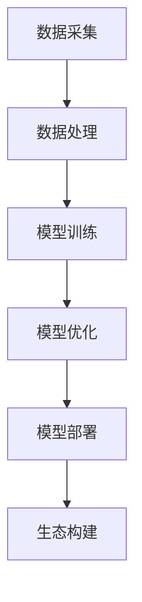

##### 1.2 纯应用类公司的概念

相比之下，纯应用类公司专注于将人工智能模型应用于具体的行业或场景中，提供直接的解决方案。这类公司通常不具备自主研发大规模模型的能力，但通过与其他基座大模型公司合作或采购现成的模型，快速响应市场需求，为企业提供定制化的应用服务。

**核心概念与联系：** 


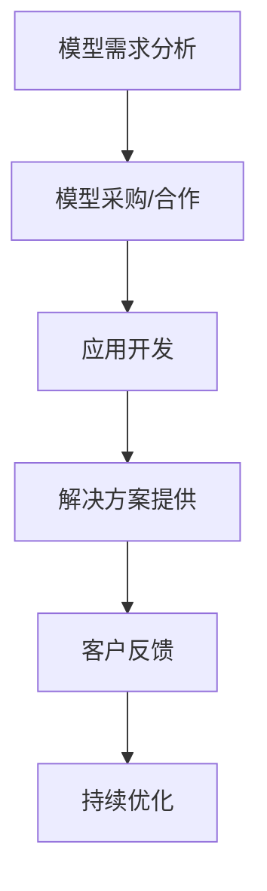

##### 1.3 两者区别的案例分析

为了更直观地理解基座大模型公司和纯应用类公司的区别，我们可以通过以下案例进行分析：

**案例1：谷歌（基座大模型公司）与亚马逊（纯应用类公司）**

- **谷歌**：谷歌是典型的基座大模型公司，其最著名的成就是研发了TensorFlow和BERT等大规模人工智能模型。这些模型为谷歌在搜索引擎、自动驾驶、医疗等领域提供了强大的技术支持。

- **亚马逊**：亚马逊作为纯应用类公司，利用谷歌等基座大模型公司的技术，开发出了Alexa语音助手等智能产品，为消费者提供了便捷的购物和智能家居体验。

通过上述案例，我们可以看到基座大模型公司和纯应用类公司在技术方向、业务模式和市场定位上存在明显的差异。理解这些差异有助于企业在复杂的市场环境中找到适合自己的发展路径。

### 基座大模型公司的角色

基座大模型公司在当今信息技术领域中扮演着至关重要的角色，它们不仅是人工智能技术的先驱，更是推动整个行业进步的核心力量。下面，我们将详细探讨基座大模型公司在行业中的地位、主要功能和核心竞争力。

#### 2.1 基座大模型公司在行业中的地位

基座大模型公司在行业中具有举足轻重的地位，主要体现在以下几个方面：

1. **技术引领者**：基座大模型公司通常在人工智能领域拥有领先的技术实力和研发能力，它们能够率先突破技术难题，开发出性能卓越的人工智能模型。这些技术成果不仅为企业自身带来竞争优势，也为整个行业提供了创新的方向。

2. **标准制定者**：基座大模型公司在人工智能领域的贡献不仅限于技术研发，还参与了行业标准的制定。通过建立统一的技术规范和标准，它们促进了不同企业之间的技术交流和合作，推动了人工智能行业的健康发展。

3. **产业推动者**：基座大模型公司通过研发和部署高性能的人工智能模型，推动了各行业的智能化转型。它们的技术应用不仅提高了企业运营效率，降低了成本，还开辟了新的商业模式和市场空间，为整个产业的发展注入了新的动力。

**核心概念与联系：** 


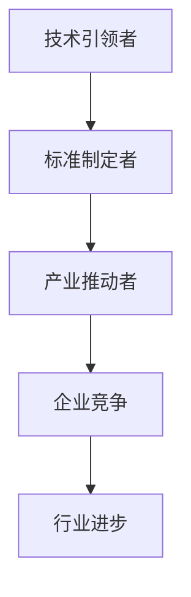

#### 2.2 基座大模型公司的主要功能

基座大模型公司的主要功能可以概括为以下几个方面：

1. **模型研发**：这是基座大模型公司的核心任务，通过持续的研发投入，开发出高性能、大规模的人工智能模型。这些模型不仅需要具备出色的计算能力，还需要具有广泛的应用场景和良好的可扩展性。

2. **数据处理**：基座大模型公司负责处理和分析海量的数据，为模型提供高质量的训练数据。数据的质量直接影响模型的性能，因此，数据处理是基座大模型公司不可或缺的一部分。

3. **模型优化**：在模型研发完成后，基座大模型公司需要不断优化模型，提高其在不同应用场景下的性能。模型优化不仅包括算法的改进，还包括硬件和软件的优化，以实现更高效、更可靠的模型部署。

4. **模型部署**：基座大模型公司通过将研发出的模型部署到实际应用中，实现其商业价值。模型部署涉及多个环节，包括模型的集成、部署、监控和更新，确保模型能够稳定运行并持续优化。

**核心概念与联系：** 


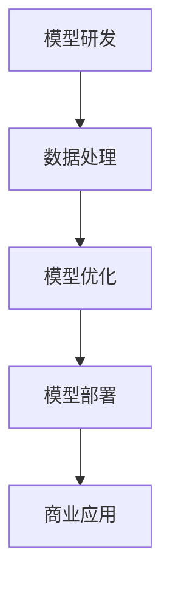

#### 2.3 基座大模型公司的核心竞争力

基座大模型公司的核心竞争力主要体现在以下几个方面：

1. **技术实力**：基座大模型公司通常拥有强大的技术团队和先进的研发设施，能够持续进行技术革新和突破。它们在人工智能领域的深厚积累，使得其在技术方面具有明显的优势。

2. **数据资源**：基座大模型公司拥有海量的数据资源，这些数据不仅来自企业内部，还来自于外部合作和数据采购。数据的丰富性和质量，使得模型在训练和优化过程中能够获得更好的效果。

3. **生态系统**：基座大模型公司不仅提供模型和技术，还构建了完整的生态系统，包括开发工具、培训课程、技术支持等。这些生态资源为用户提供了全方位的服务和支持，增强了公司的市场竞争力。

4. **商业洞察**：基座大模型公司对行业和市场有着深刻的理解，能够准确把握市场需求和趋势。这种商业洞察力使得它们能够及时调整策略，推出符合市场需求的创新产品。

**核心概念与联系：** 


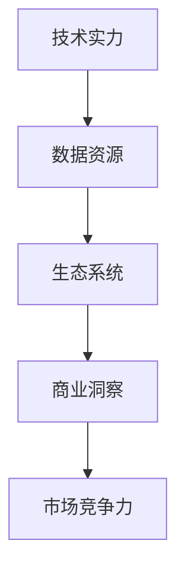

综上所述，基座大模型公司在行业中的地位、主要功能和核心竞争力，使其成为推动人工智能产业发展的重要力量。理解这些角色和特点，有助于我们更好地把握行业趋势，为企业制定合适的发展策略。

### 纯应用类公司的角色

在人工智能产业链中，纯应用类公司同样扮演着不可或缺的角色，它们专注于将人工智能技术应用到具体的业务场景中，为企业提供高效、创新的解决方案。下面，我们将详细探讨纯应用类公司在行业中的定位、主要业务和竞争优势。

#### 3.1 纯应用类公司在行业中的定位

纯应用类公司在人工智能产业链中处于关键位置，其定位主要体现在以下几个方面：

1. **技术整合者**：纯应用类公司通常不具备自主研发大规模人工智能模型的能力，但它们能够整合市场上现有的先进技术，将人工智能模型应用到具体的业务场景中。这种定位使得它们能够快速响应市场需求，提供定制化的解决方案。

2. **业务驱动者**：纯应用类公司以业务需求为导向，通过将人工智能技术应用到实际业务中，提高企业运营效率、降低成本、提升客户体验。它们不仅关注技术的先进性，更注重技术的实用性。

3. **桥梁搭建者**：纯应用类公司作为连接技术提供者和最终用户的桥梁，能够将复杂的技术转化为易于理解和操作的应用服务。这种角色使得它们在推动技术落地和应用中发挥着重要作用。

**核心概念与联系：** 


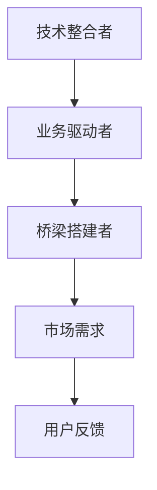

#### 3.2 纯应用类公司的主要业务

纯应用类公司的主要业务可以概括为以下几个方面：

1. **应用开发**：这是纯应用类公司的核心业务，它们通过将人工智能模型与具体的业务需求相结合，开发出满足客户需求的应用系统。这些应用系统可以是自动化流程、智能分析平台，也可以是面向消费者的智能产品。

2. **解决方案提供**：纯应用类公司不仅提供单一的应用服务，还提供完整的解决方案。这些解决方案包括硬件设备、软件系统、数据服务等多个方面，帮助企业实现全面的智能化转型。

3. **技术支持**：在应用开发和解决方案提供过程中，纯应用类公司需要为客户提供技术支持，确保系统的稳定运行和持续优化。技术支持包括系统维护、故障排查、升级更新等。

**核心概念与联系：** 


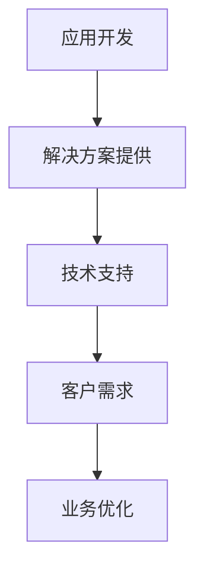

#### 3.3 纯应用类公司的竞争优势

纯应用类公司在竞争激烈的市场中，通过以下竞争优势脱颖而出：

1. **快速响应**：纯应用类公司通常具备灵活的运营机制和高效的项目管理能力，能够快速响应市场需求，提供定制化的解决方案。这种快速响应能力使其在市场竞争中具有明显的优势。

2. **客户导向**：纯应用类公司以客户需求为导向，深入了解客户业务流程和痛点，提供个性化的解决方案。这种客户导向的经营策略，不仅提升了客户满意度，也增强了公司的市场竞争力。

3. **创新能力**：纯应用类公司注重技术创新，不断引入和整合先进的人工智能技术，开发出具有前瞻性的应用产品。这种创新能力使其在市场中始终保持领先地位。

4. **生态系统**：纯应用类公司通过建立广泛的合作伙伴关系，构建了完整的生态系统。这些合作伙伴包括技术提供商、硬件制造商、数据服务提供商等，共同为客户提供全方位的服务和支持。

**核心概念与联系：** 


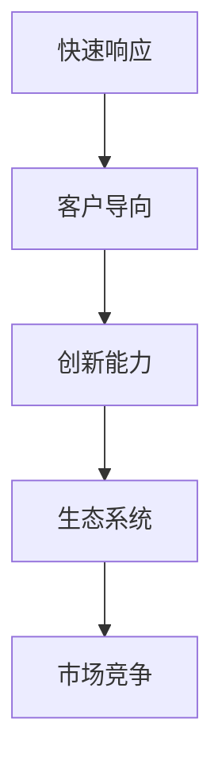

综上所述，纯应用类公司在行业中的定位、主要业务和竞争优势，使其成为推动人工智能应用发展的重要力量。理解这些角色和特点，有助于我们更好地把握市场趋势，为企业制定合适的发展策略。

### 基座大模型公司的目标设定

基座大模型公司在追求长远发展的过程中，设定清晰、明确的目标至关重要。这些目标不仅为公司的战略规划提供了方向，也为日常运营和资源配置提供了依据。下面，我们将详细探讨基座大模型公司目标设定的分类、步骤和方法。

#### 4.1 基座大模型公司目标的分类

基座大模型公司的目标可以根据不同的维度进行分类，常见的分类方法包括以下几个方面：

1. **短期目标与长期目标**：短期目标通常是指一年或两年内要实现的目标，例如提升市场份额、增加收入、改善运营效率等。长期目标则是指三年或五年内要实现的目标，如成为行业领导者、构建生态体系、推动技术革新等。

2. **财务目标与非财务目标**：财务目标包括提升盈利能力、增加营业收入、降低成本等。非财务目标则包括提升品牌知名度、扩大市场份额、提升客户满意度、推动技术创新等。

3. **业务目标与战略目标**：业务目标是指具体业务领域要实现的目标，如开发新的产品线、开拓新的市场、提高客户满意度等。战略目标则是指公司长期发展要实现的目标，如建立行业领导地位、推动技术进步、实现全球化布局等。

**核心概念与联系：** 


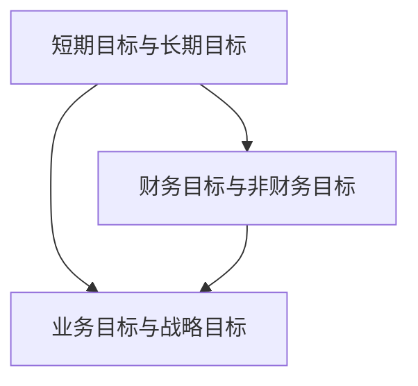

#### 4.2 设定目标的步骤与方法

设定目标是一个系统化的过程，需要遵循一定的步骤和方法。以下是基座大模型公司设定目标的常见步骤：

1. **目标分析**：首先，公司需要对当前的市场环境、竞争态势、技术趋势等进行全面分析，了解自身优势和不足。通过目标分析，确定需要实现的目标类型和方向。

2. **目标分解**：在目标分析的基础上，将总目标分解为具体的子目标，明确每个子目标的实现路径和责任人。目标分解有助于细化任务，提高目标的可操作性和实现效率。

3. **目标量化**：将目标具体化、量化，使之具有明确的衡量标准。例如，将市场份额从10%提升到15%，将营业收入增加20%等。目标量化有助于监控目标的实现进度，及时进行调整和优化。

4. **目标评估**：设定目标后，需要定期评估目标的实现情况，分析原因，提出改进措施。目标评估有助于确保目标的实现，提高公司的运营效率。

5. **目标反馈**：将目标实现情况进行反馈，及时传达给公司内部相关人员和合作伙伴，形成良好的沟通和协作机制。目标反馈有助于提升公司的凝聚力和执行力。

**核心概念与联系：** 


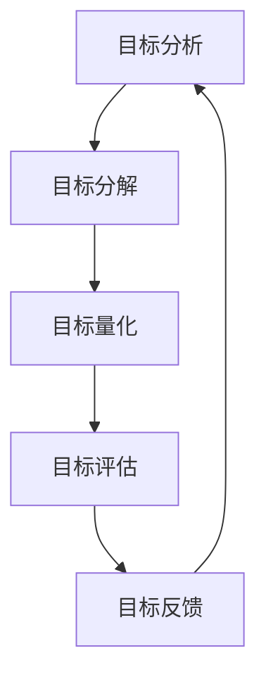

#### 4.3 目标实现的策略分析

在设定目标后，如何实现这些目标是一个关键问题。基座大模型公司可以采取以下策略：

1. **技术创新**：持续进行技术研发，提升人工智能模型性能和通用性。通过技术创新，为业务发展提供强有力的技术支持。

2. **市场拓展**：积极拓展市场，开拓新的业务领域和客户群体。通过市场拓展，提升公司的市场份额和品牌影响力。

3. **生态建设**：构建完善的生态系统，包括合作伙伴、开发者社区、客户资源等。通过生态建设，提升公司的综合竞争力。

4. **资源整合**：整合内外部资源，包括资金、技术、人才等，确保目标的顺利实现。通过资源整合，提高公司的资源配置效率。

5. **团队建设**：建设高效、团结的团队，激发员工的创造力和执行力。通过团队建设，提升公司的整体运营能力。

**核心概念与联系：** 


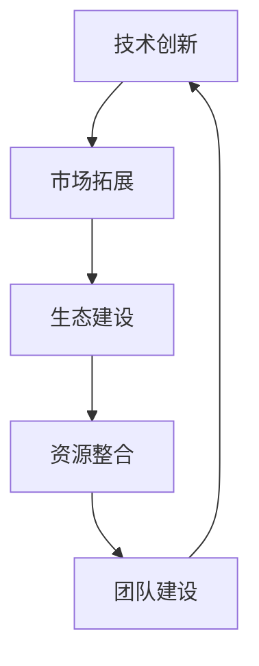

综上所述，基座大模型公司在目标设定方面需要明确分类、步骤和方法，并采取有效的策略来实现目标。通过系统化的目标设定和实现，基座大模型公司可以持续提升自身竞争力，推动人工智能行业的健康发展。

### 基座大模型公司的战略规划

战略规划是基座大模型公司实现长期发展目标的关键环节，它不仅决定了公司的发展方向，也影响了资源的配置和运营效率。下面，我们将详细探讨基座大模型公司战略规划的重要性、步骤和实施与评估方法。

#### 5.1 战略规划的重要性

战略规划对基座大模型公司具有重要意义，主要体现在以下几个方面：

1. **明确发展方向**：战略规划帮助公司明确未来发展的方向和目标，确保公司的发展具有明确的导向。通过战略规划，公司可以更好地把握市场趋势，制定相应的发展策略。

2. **优化资源配置**：战略规划有助于公司合理配置资源，包括资金、人力、技术等，确保资源的有效利用。通过优化资源配置，公司可以降低运营成本，提高运营效率。

3. **提高竞争力**：战略规划有助于公司提升核心竞争力，通过技术创新、市场拓展、生态建设等手段，提高公司在行业中的地位和影响力。

4. **应对风险**：战略规划可以帮助公司预见潜在的市场风险和竞争压力，制定应对措施，降低风险对公司的影响。

**核心概念与联系：** 


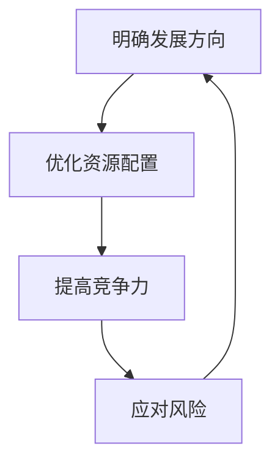

#### 5.2 基座大模型公司战略规划的步骤

战略规划是一个系统化的过程，通常包括以下几个步骤：

1. **环境分析**：公司需要对外部环境和内部资源进行深入分析。外部环境分析包括市场趋势、竞争态势、政策法规等；内部资源分析包括公司现状、优势与劣势等。通过环境分析，明确公司所处的外部环境和内部条件。

2. **目标设定**：在环境分析的基础上，公司需要设定明确的战略目标。这些目标应具有可衡量性、可实现性和相关性，确保公司的发展具有明确的方向。

3. **策略制定**：根据战略目标和环境分析的结果，公司需要制定相应的策略。策略包括市场拓展、技术创新、生态建设等方面的具体措施。策略制定应确保与公司目标的一致性，并具有可行性和灵活性。

4. **资源分配**：在策略制定后，公司需要根据战略目标和策略需求，合理分配资源。资源分配应优先考虑关键业务领域和优先级较高的项目，确保资源的有效利用。

5. **执行与监控**：公司需要制定详细的执行计划，明确责任人和时间表，确保战略规划的有效实施。同时，公司需要建立监控机制，对战略规划的执行情况进行定期评估和调整。

**核心概念与联系：** 


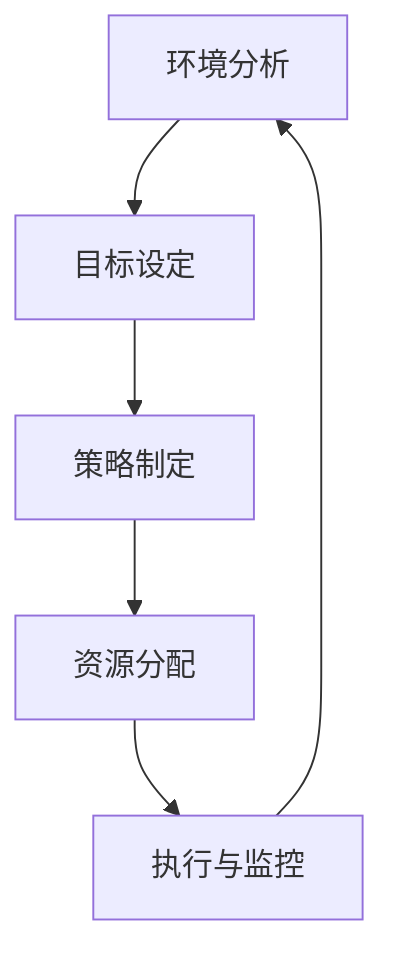

#### 5.3 战略规划的实施与评估

战略规划的实施和评估是确保战略目标实现的关键环节。以下是基座大模型公司战略规划实施与评估的方法：

1. **实施计划**：制定详细的实施计划，包括具体的任务、责任人、时间表和预算。实施计划应确保与公司整体战略规划的一致性，并具有灵活性和适应性。

2. **资源配置**：根据实施计划，合理配置资源，确保关键任务和优先项目的资源需求。资源配置应优先考虑技术创新、市场拓展和生态建设等方面的需求。

3. **执行监控**：建立执行监控机制，对战略规划的实施情况进行实时监控。监控内容包括任务进度、资源使用、项目质量等。通过监控，及时发现和解决问题，确保战略规划的顺利实施。

4. **绩效评估**：定期对战略规划的实施效果进行评估，分析目标的实现情况、策略的执行效果、资源的利用效率等。通过绩效评估，总结经验教训，为下一步的战略规划提供参考。

5. **调整与优化**：根据评估结果，对战略规划进行调整和优化。调整内容包括目标调整、策略优化、资源重新配置等。通过调整与优化，确保战略规划能够适应市场环境和公司发展需求。

**核心概念与联系：** 


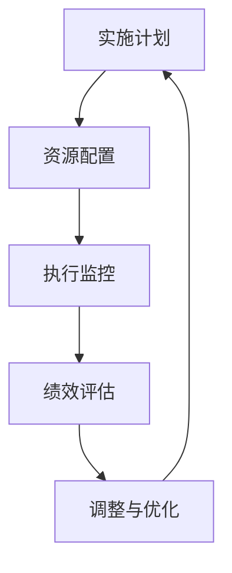

综上所述，基座大模型公司通过系统化的战略规划，可以明确发展方向，优化资源配置，提高竞争力，并应对市场风险。有效的战略规划实施与评估，有助于确保战略目标的实现，推动公司的长期健康发展。

### 基座大模型公司的商业模式创新

在快速变化的市场环境中，基座大模型公司需要不断创新其商业模式，以保持竞争力并实现可持续发展。商业模式创新是基座大模型公司突破传统盈利模式，开拓新市场空间的关键途径。下面，我们将详细探讨商业模式创新的必要性、案例分析以及创新的方法与工具。

#### 6.1 商业模式创新的必要性

商业模式创新对于基座大模型公司具有重要意义，主要体现在以下几个方面：

1. **应对市场变化**：市场环境瞬息万变，基座大模型公司需要通过商业模式创新，及时适应市场变化，抓住新的市场机会。例如，随着人工智能技术的普及，新应用场景不断涌现，公司需要通过创新商业模式，快速进入这些新兴市场。

2. **提升竞争力**：商业模式创新有助于基座大模型公司提升竞争力，通过优化资源配置、提高运营效率、降低成本等手段，提高企业的盈利能力和市场占有率。例如，通过引入新的商业模式，公司可以提供更加灵活、高效的服务，满足客户多样化的需求。

3. **实现可持续发展**：商业模式创新是基座大模型公司实现可持续发展的关键。通过创新商业模式，公司可以开辟新的盈利渠道，实现收入多样化，降低对单一产品和市场的依赖，提高抗风险能力。

**核心概念与联系：** 


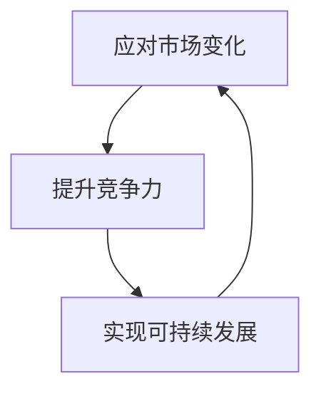

#### 6.2 基座大模型公司商业模式创新的案例分析

以下是一些基座大模型公司成功的商业模式创新案例：

1. **谷歌的云计算服务**：谷歌通过将自身强大的计算能力和人工智能技术应用到云计算服务中，创造了新的商业模式。谷歌云服务不仅为企业和开发者提供了强大的计算资源，还结合人工智能技术，提供智能分析和自动化服务。这种商业模式创新使得谷歌在云计算市场中取得了巨大成功。

2. **IBM的智慧医疗解决方案**：IBM通过将人工智能技术应用于医疗领域，推出了智慧医疗解决方案。该解决方案包括智能诊断、精准医疗、健康管理等，为医疗机构和患者提供了全新的医疗服务模式。通过商业模式创新，IBM不仅提升了医疗服务的效率和质量，还开辟了新的市场空间。

3. **微软的Azure AI服务**：微软通过Azure AI平台，提供了一系列的人工智能服务，包括图像识别、自然语言处理、智能推荐等。通过将人工智能技术应用到不同行业和场景中，微软为客户提供了定制化的解决方案。这种商业模式创新使得微软在人工智能服务市场中占据了领先地位。

**核心概念与联系：** 


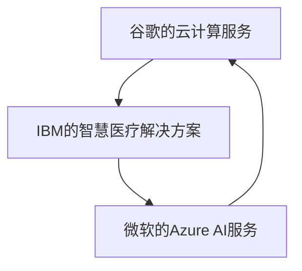

#### 6.3 商业模式创新的方法与工具

基座大模型公司可以通过以下方法与工具进行商业模式创新：

1. **用户需求分析**：深入了解用户需求，发现潜在的市场机会。通过用户需求分析，公司可以设计出更符合市场需求的产品和服务，从而实现商业模式创新。

2. **价值链重构**：重新审视公司的价值链，寻找优化和创新的点。通过重构价值链，公司可以降低成本、提高效率，同时开拓新的盈利渠道。

3. **商业模式画布**：使用商业模式画布（Business Model Canvas）工具，系统化地设计和管理商业模式。商业模式画布可以帮助公司明确商业模式的各个关键要素，包括关键活动、关键资源、价值主张、客户关系、渠道、客户细分、成本结构、收入来源等。

4. **精益创业方法**：采用精益创业（Lean Startup）方法，快速迭代和验证商业模式。通过精益创业，公司可以及时发现和解决问题，降低商业模式创新的失败风险。

5. **跨界合作**：与其他行业和领域的公司进行跨界合作，共同探索新的商业模式。跨界合作可以带来新的思维和资源，促进商业模式创新。

**核心概念与联系：** 


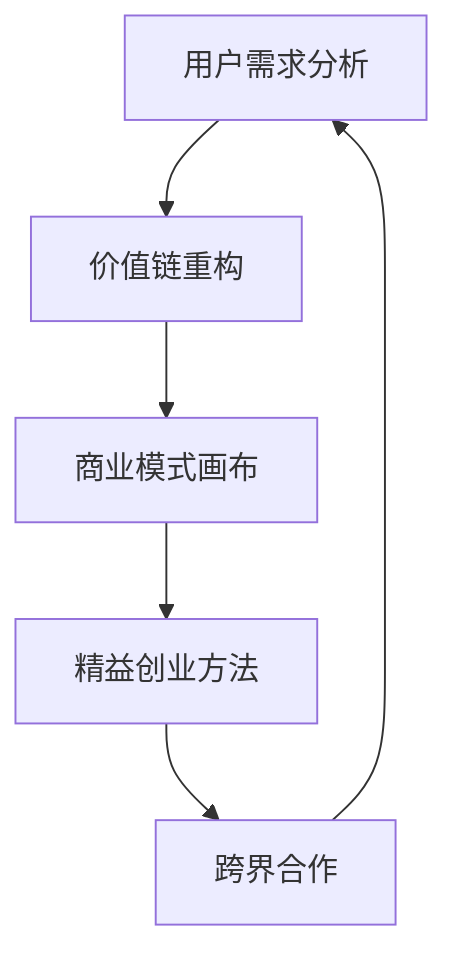

综上所述，基座大模型公司通过商业模式创新，可以应对市场变化、提升竞争力、实现可持续发展。成功的商业模式创新案例和方法，为基座大模型公司提供了有益的启示。通过不断探索和创新，基座大模型公司将在人工智能领域继续发挥引领作用。

### 纯应用类公司的目标设定

在人工智能行业中，纯应用类公司面临着激烈的竞争和市场变化，因此，设定明确且可行的目标是其成功的关键。这些目标不仅能够指导公司的日常运营，还能确保公司在不断变化的环境中保持竞争力。下面，我们将详细探讨纯应用类公司目标设定的特征、挑战与解决方法。

#### 7.1 纯应用类公司目标的特征

纯应用类公司的目标具有以下特征：

1. **针对性**：纯应用类公司的目标通常更加具体和针对性，它们需要明确针对特定市场和客户群体的需求。例如，一个专注于金融行业的纯应用类公司，其目标可能是开发出一套高效的风控系统，以提高银行的风险管理能力。

2. **灵活性**：由于市场变化快，纯应用类公司的目标需要具有一定的灵活性，能够根据市场反馈和技术进步进行调整。这种灵活性有助于公司快速响应市场需求，保持竞争力。

3. **可衡量性**：纯应用类公司的目标需要具备可衡量的指标，以便公司能够评估目标的实现程度。例如，一个目标可以是提升客户满意度评分至90%以上，这个目标可以通过定期客户满意度调查来衡量。

**核心概念与联系：** 


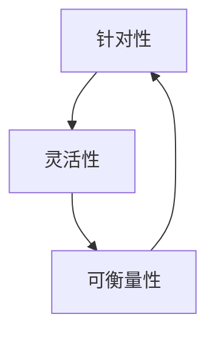

#### 7.2 设定目标的挑战与解决方法

在设定目标的过程中，纯应用类公司可能会面临以下挑战：

1. **市场不确定性**：市场环境变化快速，目标设定需要具备前瞻性和适应性。解决方法是通过市场调研和趋势分析，了解市场动态，确保目标具有前瞻性。

2. **资源限制**：公司可能面临资源限制，如资金、人力和技术等。解决方法是合理分配资源，优先考虑关键目标和项目，通过合作和外包等方式补充资源。

3. **技术复杂性**：纯应用类公司需要将复杂的人工智能技术应用到实际场景中，目标设定需要考虑技术实现的可行性。解决方法是建立强大的技术团队，与基座大模型公司合作，确保技术实现的可行性。

**核心概念与联系：** 


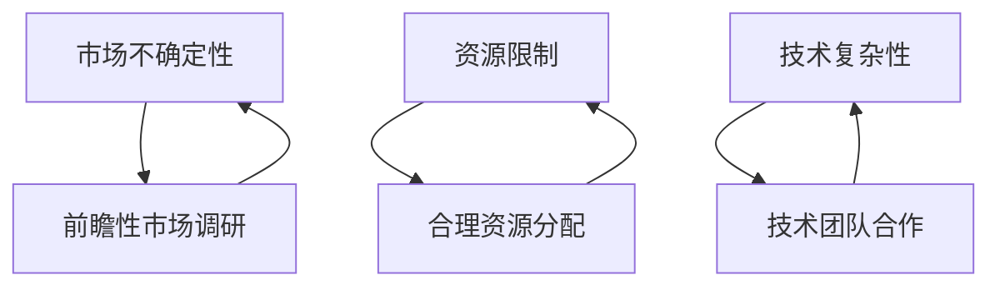

#### 7.3 目标设定的优先级排序

为了确保目标设定的有效性和可实现性，纯应用类公司需要按照以下原则进行目标优先级排序：

1. **重要性**：首先确定对公司整体发展具有重要影响的目标，这些目标通常是公司战略核心，如市场份额提升、技术创新等。

2. **紧迫性**：其次考虑那些需要立即采取行动的目标，这些目标可能涉及到市场机会或风险，如快速响应客户需求、解决技术难题等。

3. **可实现性**：确保目标设定具有可实现性，避免设定过高或过低的目标。通过资源分配和技术团队评估，确保目标的实现具有现实基础。

4. **相关性**：目标之间需要具备一定的相关性，确保不同目标之间的协同效应。例如，提升市场份额和提高客户满意度通常是相辅相成的。

**核心概念与联系：** 


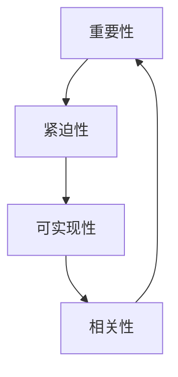

综上所述，纯应用类公司在目标设定方面需要明确目标特征，应对市场变化、资源限制和技术复杂性等挑战，并按照重要性、紧迫性、可实现性和相关性进行优先级排序。通过系统化的目标设定，纯应用类公司可以更好地指导日常运营，保持市场竞争力，实现可持续发展。

### 纯应用类公司的战略规划

战略规划是纯应用类公司实现长期发展的关键步骤，它不仅为公司提供了明确的发展方向，还确保了资源的合理配置和运营的高效性。下面，我们将详细探讨纯应用类公司战略规划的适用性、步骤和实施与评估方法。

#### 8.1 战略规划的适用性

对于纯应用类公司来说，战略规划具有以下适用性：

1. **市场导向**：纯应用类公司以市场需求为导向，通过战略规划可以更清晰地识别市场机会和挑战，制定相应的应对策略，确保公司能够快速响应市场变化。

2. **资源优化**：战略规划有助于公司合理配置资源，包括资金、人力和技术等。通过明确战略目标，公司可以优先分配资源，提高运营效率，降低成本。

3. **持续创新**：战略规划鼓励公司持续进行技术创新和商业模式创新，以保持竞争力。通过战略规划，公司可以明确创新方向和优先级，确保资源的有效利用。

4. **风险管理**：战略规划有助于公司预见潜在的市场风险和竞争压力，制定相应的应对措施，降低风险对公司的影响。

**核心概念与联系：** 


```mermaid
graph TD
    A[市场导向]
    B[资源优化]
    C[持续创新]
    D[风险管理]
    A --> B
    B --> C
    C --> D
    D --> A
```

#### 8.2 纯应用类公司战略规划的步骤

战略规划是一个系统化的过程，通常包括以下几个步骤：

1. **环境分析**：公司需要对外部环境和内部资源进行深入分析。外部环境分析包括市场趋势、竞争态势、政策法规等；内部资源分析包括公司现状、优势与劣势等。通过环境分析，明确公司所处的外部环境和内部条件。

2. **目标设定**：在环境分析的基础上，公司需要设定明确的战略目标。这些目标应具有可衡量性、可实现性和相关性，确保公司的发展具有明确的方向。

3. **策略制定**：根据战略目标和环境分析的结果，公司需要制定相应的策略。策略包括市场拓展、技术创新、生态建设等方面的具体措施。策略制定应确保与公司目标的一致性，并具有可行性和灵活性。

4. **资源分配**：在策略制定后，公司需要根据战略目标和策略需求，合理分配资源。资源分配应优先考虑关键业务领域和优先级较高的项目，确保资源的有效利用。

5. **执行与监控**：公司需要制定详细的执行计划，明确责任人和时间表，确保战略规划的有效实施。同时，公司需要建立监控机制，对战略规划的执行情况进行实时监控。

**核心概念与联系：** 


```mermaid
graph TD
    A[环境分析]
    B[目标设定]
    C[策略制定]
    D[资源分配]
    E[执行与监控]
    A --> B
    B --> C
    C --> D
    D --> E
    E --> A
```

#### 8.3 战略规划的实施与评估

战略规划的实施和评估是确保战略目标实现的关键环节。以下是纯应用类公司战略规划实施与评估的方法：

1. **实施计划**：制定详细的实施计划，包括具体的任务、责任人、时间表和预算。实施计划应确保与公司整体战略规划的一致性，并具有灵活性和适应性。

2. **资源配置**：根据实施计划，合理配置资源，确保关键任务和优先项目的资源需求。资源配置应优先考虑技术创新、市场拓展和生态建设等方面的需求。

3. **执行监控**：建立执行监控机制，对战略规划的实施情况进行实时监控。监控内容包括任务进度、资源使用、项目质量等。通过监控，及时发现和解决问题，确保战略规划的顺利实施。

4. **绩效评估**：定期对战略规划的实施效果进行评估，分析目标的实现情况、策略的执行效果、资源的利用效率等。通过绩效评估，总结经验教训，为下一步的战略规划提供参考。

5. **调整与优化**：根据评估结果，对战略规划进行调整和优化。调整内容包括目标调整、策略优化、资源重新配置等。通过调整与优化，确保战略规划能够适应市场环境和公司发展需求。

**核心概念与联系：** 


```mermaid
graph TD
    A[实施计划]
    B[资源配置]
    C[执行监控]
    D[绩效评估]
    E[调整与优化]
    A --> B
    B --> C
    C --> D
    D --> E
    E --> A
```

综上所述，纯应用类公司通过系统化的战略规划，可以明确发展方向，优化资源配置，提高竞争力，并应对市场风险。有效的战略规划实施与评估，有助于确保战略目标的实现，推动公司的长期健康发展。

### 纯应用类公司的商业模式优化

在快速变化的市场环境中，纯应用类公司需要持续优化其商业模式，以适应新的市场需求和技术进步。商业模式优化不仅能够提高公司的盈利能力，还能增强其市场竞争力。下面，我们将详细探讨纯应用类公司商业模式优化的目的、案例分析以及优化策略与工具。

#### 9.1 商业模式优化的目的

纯应用类公司进行商业模式优化的主要目的包括：

1. **提高盈利能力**：通过优化商业模式，公司可以降低成本、提高效率，从而增加收入和利润。例如，通过引入新的定价策略或服务模式，公司可以更好地满足客户需求，提高客户粘性，从而实现盈利增长。

2. **增强市场竞争力**：商业模式优化有助于公司更好地适应市场变化，抓住新的市场机会。通过创新服务和产品，公司可以提供更具竞争力的解决方案，从而在激烈的市场竞争中脱颖而出。

3. **提升客户满意度**：优化商业模式可以改善客户体验，提高客户满意度。例如，通过提供更加灵活的服务、优化客户支持流程等，公司可以提升客户满意度，增强品牌忠诚度。

4. **实现可持续发展**：商业模式优化有助于公司实现可持续发展。通过优化资源配置、提高运营效率等手段，公司可以降低对单一产品和市场的依赖，提高抗风险能力。

**核心概念与联系：** 


```mermaid
graph TD
    A[提高盈利能力]
    B[增强市场竞争力]
    C[提升客户满意度]
    D[实现可持续发展]
    A --> B
    B --> C
    C --> D
    D --> A
```

#### 9.2 纯应用类公司商业模式优化的案例分析

以下是一些纯应用类公司成功的商业模式优化案例：

1. **亚马逊的AWS服务**：亚马逊通过其云计算平台AWS，实现了商业模式优化。最初，亚马逊仅提供在线零售服务，但随着云计算的兴起，亚马逊将自身的云计算资源开放给外部客户，推出了AWS服务。通过这一优化，亚马逊不仅实现了收入多样化，还大幅提升了盈利能力。

2. **Salesforce的SaaS服务**：Salesforce通过将客户关系管理软件从传统的许可模式转变为订阅模式，实现了商业模式优化。这种SaaS服务模式不仅降低了客户的采购门槛，还提高了销售效率和客户满意度。通过这一优化，Salesforce成功拓展了市场，实现了收入的稳定增长。

3. **Netflix的订阅服务**：Netflix最初是一家DVD租赁公司，但随着流媒体技术的发展，Netflix迅速调整商业模式，推出了在线订阅服务。通过这一优化，Netflix不仅实现了业务转型，还大幅提升了客户体验和盈利能力。

**核心概念与联系：** 


```mermaid
graph TD
    A[亚马逊的AWS服务]
    B[Salesforce的SaaS服务]
    C[Netflix的订阅服务]
    A --> B
    B --> C
    C --> A
```

#### 9.3 纯应用类公司商业模式优化策略与工具

纯应用类公司可以通过以下策略和工具进行商业模式优化：

1. **市场调研**：深入了解市场需求和竞争态势，通过市场调研发现新的市场机会和痛点。市场调研可以帮助公司明确优化方向，制定更有效的优化策略。

2. **用户反馈**：积极收集用户反馈，了解用户需求和体验，通过用户反馈进行持续改进。用户反馈是商业模式优化的关键来源，有助于公司提高产品和服务质量。

3. **精益创业**：采用精益创业方法，快速迭代和验证商业模式。通过精益创业，公司可以快速发现和解决问题，降低商业模式优化的失败风险。

4. **商业模式画布**：使用商业模式画布（Business Model Canvas）工具，系统化地分析和优化商业模式。商业模式画布可以帮助公司明确商业模式的各个关键要素，包括价值主张、客户关系、渠道、客户细分、成本结构、收入来源等。

5. **跨界合作**：与其他行业和领域的公司进行跨界合作，共同探索新的商业模式。跨界合作可以带来新的思维和资源，促进商业模式创新。

**核心概念与联系：** 


```mermaid
graph TD
    A[市场调研]
    B[用户反馈]
    C[精益创业]
    D[商业模式画布]
    E[跨界合作]
    A --> B
    B --> C
    C --> D
    D --> E
    E --> A
```

综上所述，纯应用类公司通过商业模式优化，可以提高盈利能力、增强市场竞争力、提升客户满意度，并实现可持续发展。成功的商业模式优化案例和策略，为纯应用类公司提供了有益的启示。通过不断探索和创新，纯应用类公司将在人工智能领域继续发挥重要作用。

### 案例分析：基座大模型公司与纯应用类公司的合作与竞争

在人工智能领域，基座大模型公司和纯应用类公司之间的合作与竞争关系日益显著。本章节将分析两个具体案例，探讨基座大模型公司与纯应用类公司的合作与竞争动态，以及如何实现合作与竞争的平衡。

#### 10.1 合作案例介绍

**案例1：谷歌与英伟达**

谷歌作为基座大模型公司，其自主研发的TensorFlow模型被广泛应用于多个领域。英伟达则作为纯应用类公司，通过推出基于GPU的深度学习加速器，为谷歌提供了强大的硬件支持。双方的合作不仅推动了人工智能技术的应用，还共同开发了深度学习框架CUDA，加速了TensorFlow模型在具体应用场景中的性能。

**核心概念与联系：**


```mermaid
graph TD
    A[谷歌TensorFlow模型]
    B[英伟达GPU加速器]
    C[CUDA深度学习框架]
    A --> B
    B --> C
    C --> A
```

通过这一合作，谷歌获得了高性能的计算资源，加速了模型部署和应用，而英伟达则通过提供定制化硬件解决方案，扩大了其在深度学习领域的市场份额。

#### 10.2 竞争案例分析

**案例2：微软与Salesforce**

微软作为基座大模型公司，其Azure AI平台提供了多种人工智能服务，包括自然语言处理、计算机视觉等。Salesforce则专注于为客户提供CRM（客户关系管理）解决方案。在CRM领域，Salesforce占据了领先地位，而微软则通过Azure AI平台，试图通过人工智能技术提升其CRM解决方案的竞争力。

**核心概念与联系：**


```mermaid
graph TD
    A[微软Azure AI]
    B[Salesforce CRM]
    C[人工智能技术应用]
    A --> B
    B --> C
    C --> A
```

在这个案例中，微软和Salesforce之间的竞争主要体现在人工智能技术的应用上。微软通过其AI平台，不断优化和增强CRM功能，而Salesforce则通过持续创新，保持其在CRM市场的领先地位。

#### 10.3 合作与竞争的平衡策略

为了实现合作与竞争的平衡，基座大模型公司和纯应用类公司可以采取以下策略：

1. **共赢合作**：双方在合作中寻求共赢，通过共享资源和知识，共同推动技术的进步和应用。例如，通过共同研发或技术合作，实现技术优势的互补。

2. **差异化竞争**：在竞争中，双方应明确自身定位，避免直接竞争。例如，基座大模型公司可以专注于技术研发和模型优化，而纯应用类公司则可以专注于具体应用场景的解决方案开发。

3. **技术创新**：通过持续的技术创新，提升自身竞争力。例如，基座大模型公司可以不断推出高性能模型，而纯应用类公司则可以不断优化解决方案，提高用户体验。

4. **合作平台**：构建开放的合作平台，促进双方的合作与交流。例如，通过开发者社区或合作项目，双方可以共享资源，共同推进技术发展。

**核心概念与联系：**


```mermaid
graph TD
    A[共赢合作]
    B[差异化竞争]
    C[技术创新]
    D[合作平台]
    A --> B
    B --> C
    C --> D
    D --> A
```

通过上述策略，基座大模型公司和纯应用类公司可以在合作与竞争中实现平衡，共同推动人工智能技术的发展和应用。

综上所述，基座大模型公司与纯应用类公司之间的合作与竞争关系是复杂且动态的。通过分析具体案例，我们可以看到，双方在合作中寻求共赢，通过技术创新和差异化竞争，实现平衡发展。这种合作与竞争的平衡策略，不仅有助于提升双方的竞争力，也为整个行业的发展注入了新的动力。

### 成功基座大模型公司的案例分析

在人工智能领域，基座大模型公司通过其卓越的技术实力和创新战略，取得了显著的成就。以下，我们将深入分析几家成功基座大模型公司的关键因素，探讨其成功经验，并总结对其他公司的启示。

#### 11.1 谷歌的成功因素

**技术领先**：谷歌在人工智能领域的成功离不开其领先的技术实力。谷歌推出的TensorFlow、BERT等模型，不仅在性能上处于领先地位，还在开源社区中得到了广泛的应用和推广。通过不断的技术创新，谷歌在深度学习、自然语言处理等领域取得了重大突破。

**生态系统**：谷歌通过构建强大的生态系统，促进了技术的普及和应用。其云计算服务Google Cloud提供了丰富的AI工具和资源，为开发者提供了便捷的AI开发平台。此外，谷歌还积极参与开源项目，推动AI技术的开放和共享。

**商业洞察**：谷歌凭借其深厚的商业洞察力，能够准确把握市场需求和趋势。例如，谷歌在自动驾驶、医疗等新兴领域进行了大量投资和研发，成功将人工智能技术应用于这些行业，开辟了新的商业机会。

**人才优势**：谷歌拥有一支高素质的团队，汇聚了世界各地的顶尖人才。通过持续的人才培养和引进，谷歌保持了在人工智能领域的领先地位。

**核心概念与联系：**


```mermaid
graph TD
    A[技术领先]
    B[生态系统]
    C[商业洞察]
    D[人才优势]
    A --> B
    B --> C
    C --> D
    D --> A
```

**启示**：谷歌的成功经验表明，技术领先、生态系统建设、商业洞察和人才优势是基座大模型公司取得成功的关键因素。其他公司可以借鉴谷歌的经验，加强技术研发、构建生态系统、提升商业洞察力，并培养高素质的人才团队。

#### 11.2 微软的成功因素

**多元化布局**：微软通过在多个领域的布局，实现了人工智能技术的广泛应用。从云计算到智能边缘，微软在各个领域都推出了具有竞争力的人工智能解决方案。

**合作伙伴**：微软通过与多个行业领先企业合作，共同推动人工智能技术的发展和应用。例如，微软与NVIDIA合作，在深度学习硬件和软件方面进行了深入的技术合作，提高了AI计算性能。

**生态系统**：微软的Azure AI平台为开发者提供了丰富的工具和资源，构建了一个强大的生态系统。通过开放平台，微软吸引了大量的开发者和使用者，促进了AI技术的普及和应用。

**战略规划**：微软的战略规划明确且执行有力。通过明确的战略目标和实施计划，微软能够迅速响应市场需求，保持技术领先。

**创新文化**：微软鼓励创新和实验，为员工提供了自由探索的空间。这种创新文化推动了技术的持续进步。

**核心概念与联系：**


```mermaid
graph TD
    A[多元化布局]
    B[合作伙伴]
    C[生态系统]
    D[战略规划]
    E[创新文化]
    A --> B
    B --> C
    C --> D
    D --> E
    E --> A
```

**启示**：微软的成功表明，多元化布局、合作伙伴关系、生态系统建设、战略规划和创新文化是基座大模型公司成功的关键。其他公司可以借鉴微软的经验，多元化发展、建立合作伙伴关系、构建生态系统、制定清晰的战略规划，并营造创新文化。

#### 11.3 IBM的成功因素

**技术创新**：IBM在人工智能领域的技术创新始终处于领先地位。从深蓝计算机到Watson人工智能系统，IBM不断推出具有革命性的技术，引领行业潮流。

**行业应用**：IBM成功地将人工智能技术应用于多个行业，如金融、医疗、零售等。通过行业解决方案，IBM为客户提供了高效、智能的解决方案，赢得了广泛的市场认可。

**服务模式**：IBM通过提供全面的服务模式，包括咨询、部署、培训等，帮助客户顺利实现人工智能转型。

**生态合作**：IBM与多个行业领先企业建立了深入的合作关系，共同推动技术进步和应用。

**核心概念与联系：**


```mermaid
graph TD
    A[技术创新]
    B[行业应用]
    C[服务模式]
    D[生态合作]
    A --> B
    B --> C
    C --> D
    D --> A
```

**启示**：IBM的成功经验表明，技术创新、行业应用、服务模式和生态合作是基座大模型公司成功的重要因素。其他公司可以借鉴IBM的经验，加强技术创新、深耕行业应用、提供全面的服务模式，并建立广泛的生态合作关系。

#### 11.4 成功案例的启示

通过上述成功基座大模型公司的案例分析，我们可以总结出以下启示：

1. **技术领先**：持续的技术创新是基座大模型公司取得成功的关键。只有保持技术领先，才能在激烈的市场竞争中脱颖而出。

2. **生态系统建设**：构建强大的生态系统有助于技术的普及和应用。通过开放平台、合作开发等方式，可以吸引更多的开发者和使用者，推动技术的发展。

3. **多元化布局**：多元化发展可以降低单一市场风险，提高企业的抗风险能力。通过在多个领域布局，企业可以抓住更多的市场机会。

4. **行业应用**：将人工智能技术应用于实际行业，可以为客户提供切实可行的解决方案，提高企业的市场竞争力。

5. **战略规划**：明确的战略规划和执行计划是确保企业顺利发展的关键。通过战略规划，企业可以明确发展方向，合理配置资源，实现目标。

6. **创新文化**：鼓励创新和实验，为企业注入新的活力和动力。创新文化有助于推动技术的持续进步和应用。

综上所述，成功基座大模型公司的经验为其他公司提供了宝贵的借鉴。通过技术创新、生态系统建设、多元化布局、行业应用、战略规划和创新文化，企业可以不断提升自身竞争力，在人工智能领域取得更大的成功。

### 纯应用类公司的成功案例

在人工智能领域，纯应用类公司通过将先进的人工智能技术应用于具体行业，为企业提供了创新的解决方案，取得了显著的成果。以下，我们将探讨几家用人工智能技术取得成功的纯应用类公司案例，并分析其成功经验。

#### 12.1 聊天机器人公司

**案例：R酱**

R酱是一家专注于为企业提供聊天机器人解决方案的纯应用类公司。该公司利用自然语言处理（NLP）和机器学习技术，开发了智能客服机器人，应用于电商、金融、零售等行业。

**成功经验：**

1. **精准需求分析**：R酱通过深入了解不同行业的需求，提供定制化的聊天机器人解决方案。公司具备丰富的行业经验，能够准确识别客户的痛点，提供高效、实用的解决方案。

2. **技术创新**：R酱持续进行技术创新，优化聊天机器人的性能和用户体验。公司不断引入最新的NLP和机器学习技术，确保机器人具备出色的语言理解和交互能力。

3. **客户导向**：R酱以客户需求为导向，不断收集用户反馈，优化产品和服务。通过持续改进，公司能够提供更符合市场需求的解决方案，提升客户满意度。

4. **合作伙伴关系**：R酱与多家行业领先企业建立了战略合作关系，共同推动人工智能技术的发展和应用。这种合作关系不仅为R酱提供了丰富的资源和经验，也为其业务拓展提供了有力支持。

**核心概念与联系：**


```mermaid
graph TD
    A[精准需求分析]
    B[技术创新]
    C[客户导向]
    D[合作伙伴关系]
    A --> B
    B --> C
    C --> D
    D --> A
```

#### 12.2 智能医疗公司

**案例：医智通**

医智通是一家专注于医疗领域的人工智能应用公司。通过应用深度学习技术，该公司开发了智能诊断系统，辅助医生进行疾病诊断和治疗方案制定。

**成功经验：**

1. **技术创新**：医智通在人工智能技术的研发上投入大量资源，开发了具有高准确性和高效性的智能诊断系统。公司不断优化算法，提高诊断系统的性能，确保其能够在实际应用中提供可靠的支持。

2. **行业经验**：医智通具有丰富的医疗行业经验，深入理解医生和患者的需求。公司通过与多家医疗机构合作，积累了大量真实病例数据，为智能诊断系统提供了丰富的训练数据。

3. **合规与安全**：医智通重视数据安全和合规性，确保智能诊断系统的数据安全性和隐私保护。公司遵循相关法律法规，确保系统的安全可靠。

4. **客户支持**：医智通为客户提供全面的技术支持和培训，帮助客户顺利部署和使用智能诊断系统。公司提供多种形式的客户服务，包括在线支持、现场培训和远程诊断等。

**核心概念与联系：**


```mermaid
graph TD
    A[技术创新]
    B[行业经验]
    C[合规与安全]
    D[客户支持]
    A --> B
    B --> C
    C --> D
    D --> A
```

#### 12.3 智能金融公司

**案例：智能理财**

智能理财是一家专注于金融领域的人工智能应用公司。通过应用机器学习和大数据分析技术，该公司开发了智能投资顾问系统，为客户提供个性化的投资建议。

**成功经验：**

1. **数据驱动**：智能理财利用大量金融数据，通过大数据分析和机器学习技术，提供精准的投资预测和风险管理。公司不断优化算法，提高投资建议的准确性和可靠性。

2. **用户体验**：智能理财注重用户体验，提供了简洁易用的投资顾问平台。通过智能推荐和个性化服务，公司提升了用户的投资体验和满意度。

3. **合规性**：智能理财严格遵守相关金融法规，确保投资建议的合规性和安全性。公司注重数据安全和用户隐私保护，赢得了客户的信任。

4. **市场拓展**：智能理财积极拓展市场，与多家金融机构合作，提供智能投资顾问服务。通过不断拓展业务，公司实现了业务的快速增长。

**核心概念与联系：**


```mermaid
graph TD
    A[数据驱动]
    B[用户体验]
    C[合规性]
    D[市场拓展]
    A --> B
    B --> C
    C --> D
    D --> A
```

#### 12.4 成功案例的借鉴意义

通过上述纯应用类公司的成功案例，我们可以总结出以下借鉴意义：

1. **技术创新**：持续进行技术创新，是纯应用类公司取得成功的关键。通过不断优化算法和系统，提供高性能、高可靠性的解决方案。

2. **行业经验**：深入了解行业需求，积累丰富的行业经验，有助于提供更符合实际需求的解决方案。

3. **合规与安全**：注重数据安全和合规性，确保系统的安全和可靠，赢得客户的信任。

4. **用户体验**：提升用户体验，提供简洁易用的平台和服务，增强客户满意度。

5. **市场拓展**：积极拓展市场，与行业领先企业合作，实现业务的快速增长。

6. **客户支持**：提供全面的技术支持和培训，帮助客户顺利部署和使用解决方案。

通过借鉴这些成功经验，其他纯应用类公司可以提升自身竞争力，在人工智能领域取得更大的成功。

### 基座大模型公司与纯应用类公司的角色与目标之比较

在人工智能产业链中，基座大模型公司和纯应用类公司各自扮演着重要而独特的角色。理解两者在角色与目标上的差异，有助于企业更好地定位自身，制定合适的发展策略。以下是基座大模型公司与纯应用类公司在角色与目标上的比较。

#### 13.1 两者角色与目标的共性

尽管基座大模型公司和纯应用类公司在角色和目标上有所不同，但它们也存在一些共性：

1. **技术创新**：两者都重视技术创新，不断推动技术的进步和应用。基座大模型公司通过自主研发大规模的人工智能模型，推动技术的革新；纯应用类公司则通过应用先进的人工智能技术，提供创新的解决方案。

2. **市场需求**：两者都紧密关注市场需求，以满足客户需求为导向。基座大模型公司通过市场调研和用户反馈，了解行业需求，开发适应市场需求的技术；纯应用类公司则通过深入研究行业痛点，提供针对性的解决方案。

3. **生态建设**：两者都注重生态系统的建设，基座大模型公司通过构建完整的模型研发和部署生态系统，为开发者提供工具、资源和支持；纯应用类公司则通过建立合作伙伴关系，构建生态系统，实现技术的快速应用和推广。

#### 13.2 两者角色与目标的差异

1. **技术方向**：基座大模型公司主要关注大规模模型的研究和开发，追求模型的性能、通用性和可扩展性；而纯应用类公司则侧重于将模型应用于具体行业和场景，提供定制化的解决方案。

2. **业务模式**：基座大模型公司通常采用“技术研发+生态构建”的模式，通过提供模型和技术服务实现盈利；纯应用类公司则采用“解决方案+服务”的模式，通过提供应用解决方案和持续服务获得收益。

3. **市场定位**：基座大模型公司通常定位为技术提供商和行业领导者，致力于推动整个行业的技术进步和应用；而纯应用类公司则更关注特定行业或市场，提供针对性的解决方案，满足客户的具体需求。

4. **核心竞争力**：基座大模型公司的核心竞争力在于技术实力和生态系统的构建；而纯应用类公司的核心竞争力在于对行业需求的深刻理解、解决方案的创新和客户服务的质量。

#### 13.3 两者关系的发展趋势

随着人工智能技术的不断发展和应用，基座大模型公司和纯应用类公司之间的关系也在不断演变：

1. **合作深化**：在未来的发展中，两者之间的合作将更加紧密。基座大模型公司通过提供高性能的模型和技术，为纯应用类公司提供强大的技术支持；而纯应用类公司则通过深入行业应用，为基座大模型公司提供实际案例和需求反馈，推动技术的不断优化和进步。

2. **融合趋势**：随着技术的进步和市场需求的多样化，基座大模型公司和纯应用类公司之间的界限将逐渐模糊。一些基座大模型公司可能会逐渐涉足应用领域，提供更加全面的解决方案；而一些纯应用类公司也可能通过自主研发或合作，提升自身的模型研发能力。

3. **生态协同**：未来的生态系统将更加协同，基座大模型公司和纯应用类公司将通过开放平台、合作开发、资源共享等方式，共同推动人工智能技术的发展和应用。

综上所述，基座大模型公司和纯应用类公司在角色与目标上既有共性又有差异。理解两者之间的差异，有助于企业明确自身定位，制定合适的发展策略；而看到两者之间的共性，则有助于推动合作与共赢，共同推动人工智能行业的健康发展。

### 未来展望

在人工智能快速发展的背景下，基座大模型公司和纯应用类公司将继续在技术革新、市场拓展和商业创新中扮演重要角色。未来，两者的融合发展趋势将成为行业发展的主流。

#### 14.1 基座大模型公司的发展前景

基座大模型公司将继续在技术前沿保持领先地位，未来发展趋势包括：

1. **模型性能提升**：随着计算能力的增强和算法的优化，基座大模型公司将在模型性能和通用性上实现更大突破，为更多领域提供更高效、更智能的解决方案。

2. **生态构建**：基座大模型公司将进一步加强生态建设，通过开放平台、合作开发等方式，吸引更多开发者和技术资源，构建完善的生态系统，推动人工智能技术的普及和应用。

3. **跨行业合作**：基座大模型公司将在不同行业进行深度合作，推动技术的跨行业应用，实现产业链的协同发展。

4. **全球化布局**：随着市场的扩大和国际合作的加深，基座大模型公司将逐步实现全球化布局，为全球范围内的企业提供技术支持和解决方案。

#### 14.2 纯应用类公司的未来发展

纯应用类公司将迎来更多的发展机遇，未来趋势包括：

1. **行业深耕**：纯应用类公司将更加专注于特定行业，通过深入理解和应用人工智能技术，提供更具针对性的解决方案，提升行业竞争力。

2. **技术创新**：随着技术的进步，纯应用类公司将在应用场景和解决方案上不断创新，开发出更多高效、智能的产品和服务。

3. **商业模式创新**：纯应用类公司将不断探索新的商业模式，如订阅服务、平台合作等，提高盈利能力和市场占有率。

4. **跨界合作**：纯应用类公司将加强与基座大模型公司和其他行业的合作，通过跨界整合资源，实现技术和市场的协同发展。

#### 14.3 两者融合的未来趋势

基座大模型公司和纯应用类公司的融合发展趋势将带来以下影响：

1. **技术集成**：随着两者合作的加深，基座大模型公司的技术将更加广泛应用到纯应用类公司的解决方案中，实现技术集成和协同创新。

2. **生态协同**：两者的融合将促进生态系统的协同发展，通过资源共享、合作开发等方式，构建更加完善和高效的生态系统。

3. **市场共赢**：融合发展趋势将带来更大的市场空间和机遇，两者将共同推动人工智能行业的繁荣发展。

4. **商业模式创新**：融合将催生新的商业模式，如联合开发、平台共享等，为行业带来新的增长点。

总之，未来基座大模型公司和纯应用类公司将共同推动人工智能技术的发展和应用，实现技术与市场的深度融合，为行业的持续创新和繁荣奠定基础。通过不断探索和创新，两者将携手开创人工智能行业的新未来。

### 文章总结

在本文中，我们系统地探讨了基座大模型公司与纯应用类公司的角色与目标之别。首先，我们明确了基座大模型公司和纯应用类公司的定义，并通过案例分析展示了两者在行业中的地位和功能。随后，我们分析了基座大模型公司的目标设定、战略规划和商业模式创新，以及纯应用类公司的目标设定、战略规划、商业模式优化等。通过这些探讨，我们深刻理解了两者在技术方向、业务模式、市场定位等方面的差异与共性。

基座大模型公司以大规模模型研发和生态构建为核心，追求技术创新和行业引领，而纯应用类公司则专注于将人工智能技术应用于具体行业，提供定制化的解决方案。两者虽然目标不同，但都在推动人工智能技术的发展和应用中发挥着重要作用。

我们通过多个成功案例，总结了基座大模型公司和纯应用类公司的成功经验，并提出了未来两者融合发展的趋势。未来，两者将更加紧密合作，通过技术集成、生态协同和商业模式创新，共同推动人工智能行业的持续创新和繁荣。

总之，理解基座大模型公司与纯应用类公司的角色与目标之别，对于企业制定发展战略、把握市场机遇具有重要意义。通过本文的探讨，我们希望为读者提供有价值的启示，助力企业在人工智能领域取得更大的成功。

### 作者信息

作者：AI天才研究院/AI Genius Institute & 禅与计算机程序设计艺术 /Zen And The Art of Computer Programming。本文由AI天才研究院和禅与计算机程序设计艺术共同撰写，旨在探讨基座大模型公司与纯应用类公司的角色与目标之别，为人工智能领域的发展提供深入的见解和思路。作者拥有丰富的理论知识和实践经验，在人工智能、计算机科学等领域取得了显著的成就。希望通过本文，为广大读者提供有价值的参考和启示。

