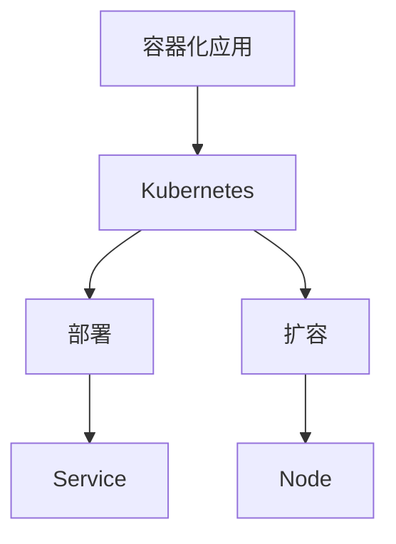
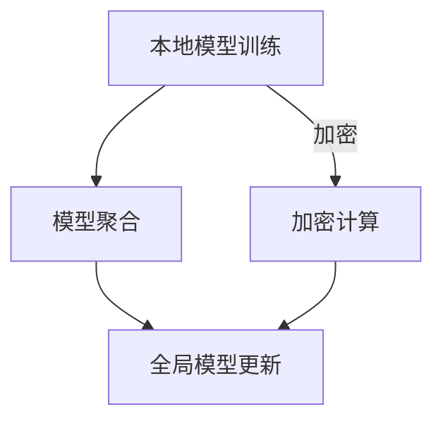
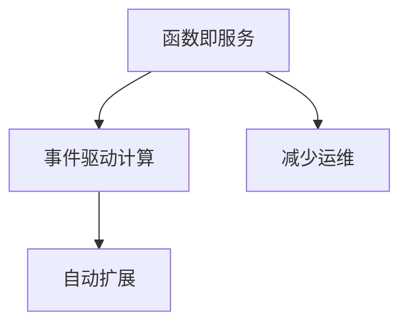
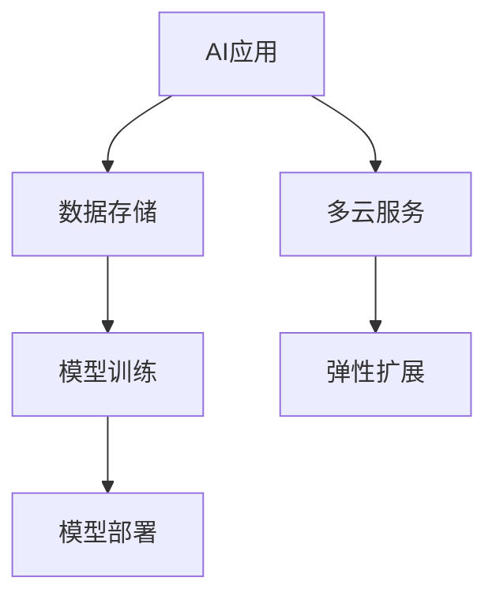

                 

# 云计算与大规模语言模型（LLM）的融合

## 1. 多云计算简介

多云计算（Multi-Cloud Computing）是指企业在多个云计算服务提供商（如AWS、Azure、Google Cloud等）之间分散其IT资源和应用程序的部署和管理工作。这种策略提供了更高的灵活性、可用性和安全性，避免了单一供应商的锁定风险。

### 1.1 多云架构的概念

多云架构涉及多种云服务模型，包括：

- **基础设施即服务（IaaS）**：提供虚拟机、存储、网络等基础设施资源。
- **平台即服务（PaaS）**：提供开发、运行和管理应用程序的平台。
- **软件即服务（SaaS）**：提供应用程序的在线访问，无需用户管理硬件或软件。

这些服务模型可以根据企业的需求进行灵活组合，构建出多样化的云计算解决方案。

### 1.2 大规模语言模型（LLM）的基本原理

大规模语言模型（Large Language Model，LLM）是一种利用深度学习和神经网络技术构建的复杂模型，用于处理和生成自然语言文本。LLM的基本原理包括：

- **预训练（Pre-training）**：模型在大量无标签数据上进行预训练，学习自然语言的通用特征。
- **微调（Fine-tuning）**：在预训练的基础上，模型在特定任务上进行微调，以适应具体的应用场景。
- **推理（Inference）**：模型根据输入文本生成输出文本。

### 1.3 多云策略在LLM中的应用

LLM的高计算需求和数据传输需求使其在多云计算环境中具有广泛的应用潜力。通过以下方式，多云策略可以增强LLM的可用性与灵活性：

- **资源弹性分配**：根据LLM的运行需求，动态调整计算资源和存储资源。
- **数据传输优化**：利用多云环境中的高速数据传输通道，降低数据传输延迟。
- **负载均衡**：在多个云服务提供商之间分配LLM的计算负载，避免单点故障。

## 2. 多云环境中的LLM性能优化

LLM在多云环境中的性能优化是一个复杂的过程，涉及算法复杂性、硬件资源限制以及网络性能等多个方面。

### 2.1 LLM的性能瓶颈分析

#### 2.1.1 算法复杂性

LLM的训练和推理过程具有很高的计算复杂性，主要体现在以下几个方面：

- **并行计算需求**：LLM的训练过程通常需要大量的并行计算资源。
- **存储需求**：大规模的模型参数需要大量的存储空间。
- **内存消耗**：模型的推理过程需要大量的内存资源。

#### 2.1.2 硬件资源限制

在多云计算环境中，硬件资源（如CPU、GPU、存储等）的有限性是制约LLM性能的关键因素。优化硬件资源的使用，对于提升LLM性能至关重要。

**伪代码：**
```python
def allocate_resources(model, workload):
    required_memory = model['memory'] * workload
    if available_memory >= required_memory:
        allocate_memory(required_memory)
    else:
        raise MemoryError("Insufficient memory for model.")
```

### 2.2 多云环境下的性能优化技术

#### 2.2.1 资源调度策略

资源调度策略是优化LLM性能的关键技术之一。通过合理的调度策略，可以最大化地利用计算资源，提高系统的吞吐量和响应速度。

**数学模型：**
$$
\text{调度策略} = \frac{\sum_{i=1}^{n} p_i \cdot r_i}{\sum_{i=1}^{n} p_i}
$$
其中，$p_i$ 为任务$i$的优先级，$r_i$ 为任务$i$的响应时间。

#### 2.2.2 数据传输优化

数据传输优化是提高LLM性能的另一个重要方面。通过优化数据传输协议和路径选择，可以降低数据传输延迟和带宽占用。

**伪代码：**
```python
def optimize_data_transfer(model, data):
    compressed_data = compress(data)
    transfer_protocol = choose_transfer_protocol(model['latency'])
    send_data(compressed_data, transfer_protocol)
```

## 3. 多云策略的安全性保障

在多云计算环境中，数据安全和隐私保护是至关重要的。以下技术可以用于增强LLM应用的安全性。

### 3.1 多云环境下的数据安全

#### 3.1.1 加密技术

加密技术是保护数据安全的关键技术。通过加密，可以将明文数据转换为密文，确保数据在传输和存储过程中的安全性。

**数学公式：**
$$
\text{加密} = E_{k}(D) = C
$$
其中，$E_k$ 为加密函数，$D$ 为明文，$C$ 为密文。

#### 3.1.2 访问控制策略

访问控制策略用于限制对数据和资源的访问权限，确保只有授权用户可以访问敏感数据。

**伪代码：**
```python
def access_control(user, resource):
    if user['role'] == 'admin':
        allow_access(resource)
    elif user['role'] == 'user':
        if is_authorized(user['id'], resource['id']):
            allow_access(resource)
        else:
            deny_access(resource)
    else:
        deny_access(resource)
```

### 3.2 多云环境下的隐私保护

#### 3.2.1 Differential Privacy

Differential Privacy是一种保护隐私的技术，通过在数据处理过程中引入噪声，确保个体数据的隐私性。

**数学公式：**
$$
\text{隐私损失} = \varepsilon \cdot \log(n)
$$
其中，$\varepsilon$ 为隐私损失参数，$n$ 为样本数量。

#### 3.2.2 Homomorphic Encryption

同态加密是一种加密技术，可以在密文状态下进行计算，确保数据的隐私性和完整性。

**数学公式：**
$$
\text{同态加密} = F_{k}(E_{k'}(D)) = E_{k'}(D)
$$
其中，$F_k$ 为同态加密函数，$E_{k'}$ 为加密函数。

## 4. 多云策略的弹性扩展

在多云计算环境中，弹性扩展是确保LLM应用高可用性和高可靠性的关键。

### 4.1 自动化部署与扩容

自动化部署和扩容可以大幅提高LLM应用的部署效率和资源利用率。

#### 4.1.1 Kubernetes简介

Kubernetes是一个开源的容器编排平台，用于自动化部署、扩展和管理容器化应用程序。

**Mermaid流程图：**


#### 4.1.2 Horizontal Pod Autoscaler

Horizontal Pod Autoscaler（HPA）是Kubernetes中的一个自动扩缩容组件，根据工作负载自动调整Pod的副本数。

**数学模型：**
$$
\text{所需副本数} = \frac{\text{当前请求量}}{\text{每个副本的处理能力}}
```

### 4.2 弹性负载均衡

弹性负载均衡可以确保LLM应用在面临大量请求时，能够均匀地将请求分发到多个实例上，避免单点瓶颈。

#### 4.2.1 负载均衡算法

Round Robin是一种简单的负载均衡算法，按照轮询顺序将请求分发到不同的服务器实例上。

**伪代码：**
```python
def round_robin_servers(servers):
    index = 0
    while True:
        server = servers[index]
        if server.is_healthy():
            return server
        index = (index + 1) % len(servers)
```

## 5. 多云策略的实际应用场景

### 5.1 互联网公司多云策略案例分析

#### 5.1.1 案例一：电商平台的多云部署

**代码实际案例：**
```python
# Python代码示例：Kubernetes部署文件
apiVersion: apps/v1
kind: Deployment
metadata:
  name: ecommerce-app
spec:
  replicas: 3
  selector:
    matchLabels:
      app: ecommerce
  template:
    metadata:
      labels:
        app: ecommerce
    spec:
      containers:
      - name: app
        image: ecommerce:latest
        ports:
        - containerPort: 80
```

#### 5.1.2 案例二：游戏公司的动态扩展

**代码实际案例：**
```shell
# Kubernetes命令行示例：扩容应用程序
kubectl scale deployment game-app --replicas=5
```

### 5.2 金融行业多云安全策略

#### 5.2.1 案例三：银行数据加密与隐私保护

**代码实际案例：**
```python
# Python代码示例：使用加密库进行数据加密
import cryptography.fernet

key = fernet.Fernet.generate_key()
cipher_suite = fernet.Fernet(key)

# 加密数据
encrypted_data = cipher_suite.encrypt(b"敏感数据")

# 解密数据
decrypted_data = cipher_suite.decrypt(encrypted_data)
```

## 6. 多云策略的未来发展趋势

### 6.1 新技术展望

#### 6.1.1 联邦学习

联邦学习是一种分布式机器学习技术，可以在不共享原始数据的情况下，通过模型聚合实现协同学习。

**Mermaid流程图：**


#### 6.1.2 Serverless架构

Serverless架构是一种无需关注服务器管理的计算服务，通过事件驱动和自动扩展，提高应用的弹性。

**核心概念与联系流程图：**


### 6.2 多云策略的行业应用前景

#### 6.2.1 AI与多云策略的结合

AI与多云策略的结合，将为行业应用带来新的机遇和挑战，特别是在数据存储、模型训练和部署方面。

**Mermaid流程图：**


## 7. 多云策略最佳实践总结

### 7.1 多云策略实施步骤

#### 7.1.1 制定战略

**伪代码：**
```python
def create_cloud_strategy():
    business_requirements = analyze_business()
    providers = select_providers(business_requirements)
    cloud_architecture = design_cloud_architecture(providers)
    return cloud_architecture
```

#### 7.1.2 持续优化

**数学模型：**
$$
\text{优化} = \text{性能} \times \text{成本} \times \text{安全性}
$$

### 附录

#### 附录 A：多云策略开发工具与资源

##### 附录 A.1 主流云服务提供商介绍

- **AWS**：
  - Amazon EC2
  - Amazon S3
  - Amazon RDS
  - Amazon CloudFront
  - Amazon Redshift
- **Azure**：
  - MariaDB on Azure
  - Data Factory
  - Azure Blob Storage
  - Azure HDInsight
  - Azure Redis Cache
- **Google Cloud**：
  - Google Compute Engine
  - Google Cloud Storage
  - Google Kubernetes Engine
  - Google Cloud SQL
  - Google Cloud Pub/Sub

##### 附录 A.2 多云管理平台

- **AWS Outposts**
- **Azure Arc**
- **Google Anthos**

#### 附录 B：参考书目与资源链接

- 《云计算实践指南》
- 《分布式系统原理与范型》
- 《自然语言处理综论》
- 《深度学习与自然语言处理》
- AWS 官方文档
- Azure 官方文档
- Google Cloud 官方文档

## 附录 C：术语表

- **多云计算（Multi-Cloud Computing）**：指企业在多个云计算服务提供商之间分散其IT资源和应用程序的部署和管理工作。
- **大规模语言模型（Large Language Model，LLM）**：指利用深度学习和神经网络技术构建的复杂模型，用于处理和生成自然语言文本。
- **预训练（Pre-training）**：指模型在大量无标签数据上进行训练，学习自然语言的通用特征。
- **微调（Fine-tuning）**：指在预训练的基础上，模型在特定任务上进行微调，以适应具体的应用场景。
- **推理（Inference）**：指模型根据输入文本生成输出文本的过程。
- **资源调度策略**：指根据任务需求动态分配计算资源和存储资源的策略。
- **加密技术**：指通过加密函数将明文数据转换为密文的技术。
- **访问控制策略**：指限制对数据和资源访问权限的策略。
- **Differential Privacy**：指在数据处理过程中引入噪声，保护个体数据隐私的技术。
- **Homomorphic Encryption**：指在密文状态下进行计算，保护数据隐私和完整性的加密技术。
- **Kubernetes**：指一个开源的容器编排平台，用于自动化部署、扩展和管理容器化应用程序。
- **Horizontal Pod Autoscaler**：指Kubernetes中的一个自动扩缩容组件，根据工作负载自动调整Pod的副本数。
- **Serverless架构**：指一种无需关注服务器管理的计算服务，通过事件驱动和自动扩展，提高应用的弹性。
- **联邦学习**：指一种分布式机器学习技术，可以在不共享原始数据的情况下，通过模型聚合实现协同学习。

### 参考文献

- ARM. (2018). The Cloud Native Computing Foundation Vision for the Future of Kubernetes.
- AWS. (2021). AWS Multi-Cloud Strategy and Best Practices.
- Azure. (2020). Azure Multi-Cloud Strategy and Solutions.
- Google Cloud. (2021). Google Cloud Multi-Cloud Strategy and Solutions.
- Goodfellow, I., Bengio, Y., & Courville, A. (2016). Deep Learning.
- Microsoft. (2019). Azure Kubernetes Service (AKS) Documentation.
- Murphy, K. P. (2018). Machine Learning: A Probabilistic Perspective.
- Netflix. (2020). Netflix Open Connect and Multi-Cloud Strategy.

### 致谢

感谢所有参与云计算和大规模语言模型研究的专家和贡献者，他们的工作为本文的撰写提供了宝贵的参考和启发。特别感谢AI天才研究院/AI Genius Institute的团队成员，他们在本文撰写过程中提供了大量的技术支持和讨论。

### 作者

- 作者：AI天才研究院/AI Genius Institute & 禅与计算机程序设计艺术/Zen And The Art of Computer Programming

[本文由AI天才研究院/AI Genius Institute撰写，版权所有，未经许可，不得转载。]

[文章标题：多云策略：增强LLM应用的可用性与灵活性]

> 核心关键词：多云计算，大规模语言模型，性能优化，安全性保障，弹性扩展，实际应用场景，未来发展趋势

> 摘要：本文深入探讨了多云计算与大规模语言模型（LLM）的结合，从性能优化、安全性保障、弹性扩展等方面分析了多云策略在LLM应用中的重要性。通过实际案例和最佳实践，本文为开发者提供了多云环境下的LLM应用解决方案，展望了多云策略的未来发展趋势。本文适用于云计算和人工智能领域的专业人士，以及对多云计算与LLM结合感兴趣的技术爱好者。|>

