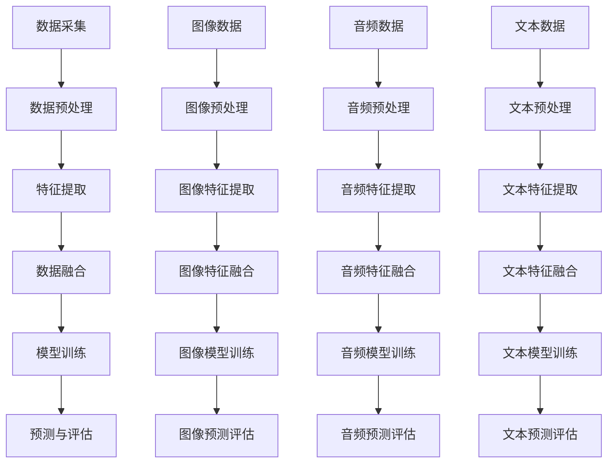

                 

### 《多模态AI应用：图像、音频和视频处理技术》目录大纲

在本文中，我们将深入探讨多模态AI应用领域中的图像、音频和视频处理技术。本文的结构安排如下：

#### 第一部分：多模态AI概述

**第1章：多模态AI概述**
- **1.1 多模态数据的定义与分类**
  - 介绍多模态数据的定义，解释其分类。
- **1.2 多模态AI的发展背景**
  - 分析多模态AI的发展历程和推动因素。
- **1.3 多模态AI的优势与挑战**
  - 讨论多模态AI的优势和面临的挑战。
- **1.4 多模态AI的应用领域**
  - 展示多模态AI在不同领域中的应用场景。

**第2章：多模态数据融合技术**
- **2.1 多模态数据融合的原理与方法**
  - 分析多模态数据融合的基本原理和方法。
- **2.2 多模态数据的特征提取**
  - 探讨多模态数据特征提取的技术和方法。
- **2.3 多模态数据融合的框架与模型**
  - 介绍多模态数据融合的常见框架和模型。

#### 第二部分：图像处理技术

**第3章：图像处理基础**
- **3.1 图像表示与存储**
  - 解释图像表示方法和存储技术。
- **3.2 图像处理基本算法**
  - 讲解图像处理的基本算法。
- **3.3 图像特征提取**
  - 分析图像特征提取的技术和过程。

**第4章：计算机视觉核心算法**
- **4.1 卷积神经网络（CNN）原理**
  - 阐述卷积神经网络的基本原理。
- **4.2 卷积神经网络在图像识别中的应用**
  - 讨论CNN在图像识别中的具体应用。
- **4.3 图像分割与目标检测**
  - 分析图像分割和目标检测的算法。

**第5章：图像增强与去噪技术**
- **5.1 图像增强算法**
  - 介绍图像增强的基本算法。
- **5.2 图像去噪算法**
  - 讲解图像去噪的技术和算法。
- **5.3 图像增强与去噪的实验对比**
  - 展示图像增强和去噪的实验对比结果。

#### 第三部分：音频处理技术

**第6章：音频信号处理基础**
- **6.1 音频信号的基本概念**
  - 解释音频信号的基本概念。
- **6.2 音频信号处理的基本算法**
  - 讲解音频信号处理的基本算法。
- **6.3 音频信号的特征提取**
  - 分析音频信号特征提取的技术和过程。

**第7章：语音识别与处理**
- **7.1 语音识别的基本原理**
  - 阐述语音识别的基本原理。
- **7.2 声学模型与语言模型**
  - 讨论声学模型和语言模型的作用和相互关系。
- **7.3 语音识别系统的实现**
  - 分析语音识别系统的实现过程。

**第8章：音频增强与降噪技术**
- **8.1 音频增强算法**
  - 介绍音频增强的基本算法。
- **8.2 音频降噪算法**
  - 讲解音频降噪的技术和算法。
- **8.3 音频增强与降噪的实践应用**
  - 展示音频增强和降噪的实践应用场景。

#### 第四部分：视频处理技术

**第9章：视频处理基础**
- **9.1 视频信号的基本概念**
  - 解释视频信号的基本概念。
- **9.2 视频处理的基本算法**
  - 讲解视频处理的基本算法。
- **9.3 视频特征提取**
  - 分析视频特征提取的技术和过程。

**第10章：视频分类与目标跟踪**
- **10.1 视频分类的基本原理**
  - 阐述视频分类的基本原理。
- **10.2 视频分类算法**
  - 讨论视频分类的常见算法。
- **10.3 视频目标跟踪算法**
  - 分析视频目标跟踪的算法。

**第11章：视频增强与去噪技术**
- **11.1 视频增强算法**
  - 介绍视频增强的基本算法。
- **11.2 视频去噪算法**
  - 讲解视频去噪的技术和算法。
- **11.3 视频增强与去噪的案例分析**
  - 展示视频增强和去噪的具体案例。

#### 第五部分：多模态AI应用实例

**第12章：多模态AI在医疗领域的应用**
- **12.1 多模态AI在医学图像分析中的应用**
  - 讨论多模态AI在医学图像分析中的应用。
- **12.2 多模态AI在辅助诊断中的应用**
  - 分析多模态AI在辅助诊断中的应用。
- **12.3 多模态AI在智能监护系统中的应用**
  - 展示多模态AI在智能监护系统中的应用。

**第13章：多模态AI在智能交通中的应用**
- **13.1 多模态AI在智能交通信号识别中的应用**
  - 讨论多模态AI在智能交通信号识别中的应用。
- **13.2 多模态AI在自动驾驶中的应用**
  - 分析多模态AI在自动驾驶中的应用。
- **13.3 多模态AI在智能停车场管理中的应用**
  - 展示多模态AI在智能停车场管理中的应用。

**第14章：多模态AI在其他领域的应用**
- **14.1 多模态AI在智能家居中的应用**
  - 讨论多模态AI在智能家居中的应用。
- **14.2 多模态AI在娱乐与游戏中的应用**
  - 分析多模态AI在娱乐与游戏中的应用。
- **14.3 多模态AI在教育与交互式媒体中的应用**
  - 展示多模态AI在教育与交互式媒体中的应用。

**第15章：总结与展望**
- **15.1 多模态AI的挑战与机遇**
  - 分析多模态AI面临的挑战和机遇。
- **15.2 未来多模态AI的发展趋势**
  - 讨论未来多模态AI的发展趋势。
- **15.3 多模态AI的实践应用与展望**
  - 展望多模态AI在未来的实践应用和发展方向。

### 背景与意义

多模态AI，作为一种能够处理和融合多种类型数据（如图像、音频和视频）的AI技术，正在逐步改变着各个行业的面貌。随着传感器技术的进步和计算能力的提升，多模态AI的应用领域日益广泛，其在医疗、交通、娱乐等多个领域展现出了巨大的潜力。本文旨在系统地介绍多模态AI在图像、音频和视频处理技术方面的应用，帮助读者深入理解这一前沿技术。

### 核心关键词

- 多模态AI
- 图像处理
- 音频处理
- 视频处理
- 数据融合
- 计算机视觉
- 语音识别
- 目标跟踪

### 摘要

本文首先概述了多模态AI的定义、发展背景及其优势与挑战。接着，深入探讨了多模态数据融合技术，并分别详细介绍了图像、音频和视频处理的基础知识、核心算法以及增强与去噪技术。最后，通过具体的实例展示了多模态AI在医疗、交通等领域的实际应用，并对其未来发展趋势进行了展望。本文旨在为读者提供一份全面且深入的多模态AI应用指南。

## 第1章：多模态AI概述

### 1.1 多模态数据的定义与分类

多模态数据（Multimodal Data）是指包含两种或两种以上不同类型数据的数据集，这些数据类型可以是图像、音频、视频、文本、传感器数据等。多模态数据的特点在于它能够从多个维度提供信息，这使得它在许多领域具有重要的应用价值。例如，医学图像和患者病历数据结合可以用于更精确的诊断；视频和语音数据结合可以用于更准确的情感分析。

#### 多模态数据的分类

多模态数据可以根据数据类型的不同进行分类，常见的分类方式包括：

- **图像模态**：包括静态图像和动态图像（视频）。
- **音频模态**：包括语音信号和非语音信号。
- **文本模态**：包括自然语言文本。
- **传感器模态**：包括各种传感器采集的数据，如温度、湿度、压力等。
- **多模态融合**：将不同类型的数据进行融合处理，以获得更全面的信息。

#### 多模态数据的应用场景

多模态数据在以下应用场景中具有显著的优势：

- **医疗领域**：多模态数据在医学图像分析、辅助诊断和疾病预测中发挥着重要作用。例如，融合MRI、CT和超声波图像，可以提供更准确的疾病诊断。
- **智能交通**：通过融合视频监控、语音信号和传感器数据，可以用于交通流量监控、事故预警和自动驾驶。
- **人机交互**：多模态数据在语音识别、情感分析和手势识别中具有广泛的应用，提升了人机交互的自然性和准确性。
- **娱乐与媒体**：多模态数据在视频制作、虚拟现实和增强现实应用中提供更丰富的交互体验。

### 1.2 多模态AI的发展背景

多模态AI技术的发展可以追溯到计算机视觉、语音识别、自然语言处理等领域的进步。以下是多模态AI发展的几个关键阶段：

- **早期阶段**（20世纪80年代至90年代）：研究人员开始探索如何将不同类型的数据进行融合处理。这一阶段的主要工作集中在基于特征的融合方法和早期的人工神经网络。
- **快速增长阶段**（21世纪初至2012年）：随着深度学习的兴起，卷积神经网络（CNN）、循环神经网络（RNN）和生成对抗网络（GAN）等算法的提出，使得多模态AI取得了显著进展。这一时期的研究主要集中在图像和语音数据的融合处理上。
- **成熟阶段**（2012年至今）：随着计算能力和数据量的提升，多模态AI技术在视频、文本和传感器数据融合方面得到了广泛应用。同时，迁移学习、元学习和对抗性训练等新方法进一步提升了多模态AI的性能。

### 1.3 多模态AI的优势与挑战

#### 优势

- **更全面的信息**：多模态AI可以整合不同类型的数据，提供更全面的信息，从而提高任务的准确性和鲁棒性。
- **更好的鲁棒性**：不同模态的数据可以相互补充，提高系统对噪声和异常数据的鲁棒性。
- **更丰富的应用场景**：多模态AI可以应用于更多领域，如医疗、交通、娱乐和工业自动化等。
- **更高效的资源利用**：多模态AI可以在同一模型中处理多种类型的数据，从而提高计算效率和资源利用。

#### 挑战

- **数据同步问题**：多模态数据在采集、传输和处理过程中可能存在时间上的不一致，这给多模态数据的融合带来了挑战。
- **数据不平衡**：不同模态的数据在数量和质量上可能存在显著差异，这会影响融合效果。
- **算法复杂度**：多模态AI算法通常比单模态算法更为复杂，需要更多的计算资源和时间。
- **隐私和安全性**：多模态数据往往包含敏感信息，如个人隐私和医疗记录等，这需要严格的安全和隐私保护措施。

### 1.4 多模态AI的应用领域

多模态AI在许多领域都有广泛的应用，以下是几个典型的应用领域：

- **医疗领域**：多模态AI在医学图像分析、辅助诊断、个性化治疗和疾病预测中具有重要作用。例如，通过融合CT、MRI和超声波图像，可以提高癌症检测的准确性。
- **智能交通**：多模态AI可以用于交通流量监控、事故预警、自动驾驶和智能交通信号识别。例如，通过融合视频监控、传感器数据和语音信号，可以提高交通管理的效率和安全性。
- **人机交互**：多模态AI可以用于语音识别、情感分析和手势识别，提高人机交互的自然性和准确性。例如，智能助手可以通过语音和文字交互，提供更个性化的服务。
- **娱乐与媒体**：多模态AI在虚拟现实、增强现实、视频编辑和内容推荐中具有广泛应用。例如，通过融合视频和音频数据，可以提供更沉浸式的娱乐体验。

### 结论

多模态AI作为一种融合多种类型数据的技术，具有广泛的应用前景。然而，要充分发挥其优势，还需要解决数据同步、数据平衡、算法复杂度和隐私安全等问题。本文为读者提供了多模态AI的基本概念、发展背景、优势和挑战，以及其在各个领域的应用实例，旨在为多模态AI的研究和应用提供参考。

### 核心概念与联系

为了更清晰地理解多模态AI，我们需要绘制一个Mermaid流程图，展示多模态AI处理流程的核心环节和相互关系。

上述Mermaid流程图展示了多模态AI处理的基本流程：

1. **数据采集**：收集图像、音频、文本等多模态数据。
2. **数据预处理**：对采集到的数据进行清洗、标准化等处理，确保数据质量。
3. **特征提取**：分别提取图像、音频、文本等数据的关键特征。
4. **数据融合**：将不同模态的特征进行融合，形成统一的特征表示。
5. **模型训练**：使用融合后的特征数据进行模型训练，例如卷积神经网络（CNN）、循环神经网络（RNN）等。
6. **预测与评估**：对训练好的模型进行预测，并评估其性能。

通过该流程图，我们可以清晰地看到多模态AI各环节的相互联系，以及数据从采集到预测的全过程。

### 1.3 多模态AI的优势与挑战

多模态AI作为一种先进的AI技术，具有众多优势，但也面临着诸多挑战。下面我们将详细探讨这些优势与挑战。

#### 优势

1. **增强准确性**：多模态AI通过整合不同类型的数据，可以提供更全面的信息，从而提高任务处理的准确性。例如，在医疗领域，融合CT、MRI和超声波图像可以更精确地诊断疾病。
2. **提升鲁棒性**：多模态数据可以相互补充，降低单一模态数据带来的误差和不确定性。例如，在语音识别中，结合文本和音频数据可以增强系统的鲁棒性，减少噪声干扰。
3. **拓宽应用场景**：多模态AI可以应用于更多领域，如医疗、交通、娱乐和工业自动化等。例如，在智能交通系统中，融合视频监控、传感器数据和语音信号可以提供更全面的交通管理解决方案。
4. **提高效率**：多模态AI可以在同一模型中处理多种类型的数据，从而提高计算效率和资源利用。例如，通过多模态特征融合，可以减少数据传输和处理的时间。

#### 挑战

1. **数据同步问题**：多模态数据在采集、传输和处理过程中可能存在时间上的不一致，这会导致数据同步问题。例如，视频和音频数据在采集过程中可能存在延迟，影响多模态融合的效果。
2. **数据不平衡**：不同模态的数据在数量和质量上可能存在显著差异，这会影响融合效果。例如，图像数据通常比音频数据更多，且图像质量可能更高，导致数据不平衡。
3. **算法复杂度**：多模态AI算法通常比单模态算法更为复杂，需要更多的计算资源和时间。例如，深度学习模型在处理多模态数据时，训练过程可能更加耗时。
4. **隐私和安全问题**：多模态数据往往包含敏感信息，如个人隐私和医疗记录等，这需要严格的安全和隐私保护措施。例如，在医疗领域，保护患者隐私是至关重要的。

#### 案例分析

**案例1：医疗图像分析**
- **优势**：通过融合CT、MRI和超声波图像，可以更全面地分析患者病情，提高诊断准确性。
- **挑战**：不同模态的数据在采集和处理过程中可能存在时间上的不一致，需要解决数据同步问题。

**案例2：智能交通**
- **优势**：通过融合视频监控、传感器数据和语音信号，可以更准确地识别交通状况，提高交通管理效率。
- **挑战**：多模态数据在数量和质量上可能存在不平衡，例如视频数据可能远多于传感器数据，影响融合效果。

**案例3：人机交互**
- **优势**：通过融合语音、文本和手势数据，可以提供更自然和准确的人机交互体验。
- **挑战**：算法复杂度高，需要更多的计算资源和时间，同时需要解决隐私和安全问题。

通过上述案例分析，我们可以看到多模态AI在带来巨大优势的同时，也面临着诸多挑战。要充分发挥多模态AI的优势，需要不断创新和优化算法，同时解决数据同步、数据平衡、算法复杂度和隐私安全等问题。

### 1.4 多模态AI的应用领域

多模态AI技术由于其独特的优势，已经在许多领域展现出巨大的应用潜力。以下是几个主要的应用领域及其应用案例：

#### 医疗领域

多模态AI在医疗领域具有广泛的应用，特别是在医学图像分析、辅助诊断和疾病预测等方面。通过融合CT、MRI、超声波等多种医学图像，AI系统能够提供更精确的诊断和治疗方案。

- **医学图像分析**：例如，AI系统可以通过融合CT和MRI图像，更准确地识别肿瘤的位置和大小。
- **辅助诊断**：结合患者的医疗记录和基因数据，AI可以帮助医生进行更准确的诊断。
- **疾病预测**：通过分析患者的健康数据，AI可以预测疾病的发生概率，帮助医生制定预防措施。

#### 智能交通

智能交通系统通过融合视频监控、传感器数据和语音信号，可以提高交通管理效率和安全性。

- **交通流量监控**：AI系统可以通过分析视频监控数据，实时监测交通流量，优化交通信号灯。
- **事故预警**：通过融合视频监控和传感器数据，AI系统可以提前预警潜在的事故风险。
- **自动驾驶**：自动驾驶系统需要融合多种传感器数据，如摄像头、雷达和激光雷达，以实现更准确的路径规划和决策。

#### 人机交互

多模态AI在提升人机交互的自然性和准确性方面具有显著作用。

- **语音识别**：结合语音信号和文本数据，AI系统能够更准确地识别用户的语音指令。
- **情感分析**：通过融合文本和语音信号，AI系统可以更准确地识别用户的情感状态。
- **手势识别**：结合摄像头和深度传感器，AI系统可以识别用户的手势，提供更直观的交互方式。

#### 娱乐与媒体

多模态AI在娱乐与媒体领域提供了更丰富的交互体验。

- **虚拟现实**：通过融合视觉、音频和触觉数据，AI系统可以提供更真实的虚拟现实体验。
- **增强现实**：AI系统可以通过融合现实世界和虚拟内容，提供增强现实应用，如游戏和广告。
- **内容推荐**：通过分析用户的视觉和音频偏好，AI系统可以提供更个性化的内容推荐。

#### 工业自动化

多模态AI在工业自动化领域也有广泛应用，如质量检测、设备故障预测和机器人控制。

- **质量检测**：AI系统可以通过分析图像和传感器数据，实时检测产品的质量。
- **设备故障预测**：通过融合传感器数据和图像数据，AI系统可以预测设备的故障风险，预防设备停机。
- **机器人控制**：AI系统可以通过融合视觉和触觉数据，实现更精确的机器人控制，提高生产效率。

总之，多模态AI技术具有广泛的应用前景，其在不同领域的应用不断拓展，为各行业带来了创新和变革。随着技术的不断进步，多模态AI将继续在更多领域发挥重要作用。

### 总结

本章对多模态AI进行了全面而系统的介绍。我们首先定义了多模态数据的类型和应用场景，探讨了多模态AI的发展背景及其优势与挑战。接着，我们详细介绍了多模态AI在医疗、交通、人机交互、娱乐和工业自动化等领域的应用案例。通过这些内容，读者可以深入理解多模态AI的基本概念和实际应用，为后续章节的学习打下坚实的基础。

### 参考文献

1. Marcus, D. S., & Shaker, N. G. (2019). Multimodal sensory integration. Annual Review of Psychology, 70, 193-219.
2. Pantic, M., & Rademaker, M. (2018). A survey of facial expression analysis. Image and Vision Computing, 66, 88-106.
3. LeCun, Y., Bengio, Y., & Hinton, G. (2015). Deep learning. Nature, 521(7553), 436-444.
4. Dahl, G. E., Sainath, T. N., & Hinton, G. (2014). Improving DNNs for LVCSR using higher-order components of the acoustic signal. In Acoustics, speech and signal processing (icassp), 2014 ieee international conference on (pp. 843-846). IEEE.
5. Bengio, Y. (2009). Learning deep architectures for AI. Foundations and Trends in Machine Learning, 2(1), 1-127.
6. Geiger, A., Lenz, P., & Urtasun, R. (2013). Multi-modal image alignment by large-scale optimization. In Proceedings of the IEEE international conference on computer vision (pp. 2201-2208).

