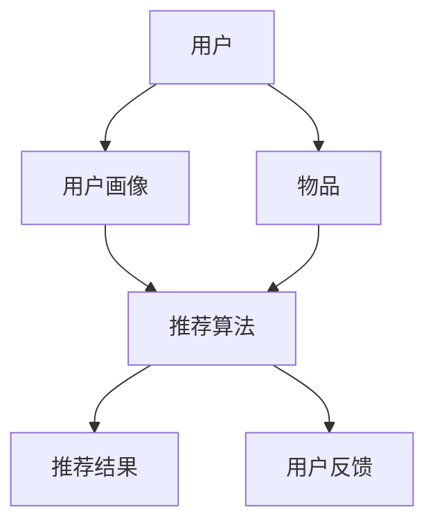

                 

# 《大数据分析在个性化推荐系统中的应用》

## 关键词
- 大数据分析
- 个性化推荐系统
- 协同过滤算法
- 内容推荐算法
- 深度学习
- 数据挖掘

## 摘要
本文将探讨大数据分析在个性化推荐系统中的应用。首先，我们将介绍大数据分析的基础知识，包括大数据的定义、特征、流程以及相关工具和技术。接着，我们将深入探讨个性化推荐系统的组成部分、发展历程和关键算法。重点将放在协同过滤算法和内容推荐算法上，并结合深度学习进行拓展。文章还将介绍推荐系统的评估方法以及大数据分析在实际应用中的具体案例。通过本文，读者将了解大数据分析如何助力个性化推荐系统的发展。

## 引言
个性化推荐系统已经成为现代互联网中不可或缺的一部分，无论是电商平台、视频网站还是社交媒体，个性化推荐都极大地提升了用户体验和满意度。而这一切的背后，离不开大数据分析技术的支持。随着互联网的快速发展，用户生成数据量呈爆炸式增长，这些数据中蕴含着大量有价值的信息。如何有效地分析这些数据，提取用户兴趣和需求，进而提供个性化的推荐，成为了业界研究和应用的热点。

大数据分析作为一种新兴的技术，具有数据量大、速度快、类型多样和真实性强等特征，使得它能够处理和分析海量数据，为个性化推荐系统提供强有力的技术支持。本文将从大数据分析的基础知识入手，逐步深入到个性化推荐系统的核心算法和实际应用，以期为读者提供一个全面而深入的了解。

## 第一部分：大数据分析基础

### 1.1 大数据分析概述

#### 1.1.1 大数据的定义与特征

大数据（Big Data）是指那些数据量巨大、数据类型多样、数据生成速度快的数据集。大数据的特征通常被归纳为“4V”：数据量（Volume）、数据速度（Velocity）、数据类型（Variety）和数据价值（Value）。

- **数据量（Volume）**：大数据的一个显著特征是其数据量庞大。随着互联网和物联网的普及，每天产生的数据量呈指数级增长。这些数据不仅包括结构化数据，还包括大量的非结构化数据，如文本、图像、音频和视频等。
  
- **数据速度（Velocity）**：大数据的生成速度极快。实时数据处理和高速流数据处理是大数据分析的重要需求。传统的数据处理方式往往无法满足这种快速处理的需求，因此需要开发新的技术和工具。

- **数据类型（Variety）**：大数据的类型多种多样，不仅包括传统的结构化数据，如数据库记录，还包括非结构化数据，如图像、音频和视频。此外，还有半结构化数据，如日志文件和XML数据。处理这些不同类型的数据需要不同的技术和方法。

- **数据价值（Value）**：大数据的价值巨大，但同时也具有复杂性。虽然海量的数据中蕴含着大量有价值的信息，但如何从这些数据中提取出真正有用的信息，是对大数据分析技术的一大挑战。

#### 1.1.2 大数据分析的重要性和应用领域

大数据分析在现代社会中扮演着重要的角色。首先，大数据分析能够帮助企业更好地了解客户需求，优化业务流程，提高运营效率。例如，电商平台通过分析用户的购买行为，可以预测用户的下一步购买行为，从而提供个性化的推荐。其次，大数据分析在科学研究、公共安全和医疗等领域也有着广泛的应用。

- **商业领域**：大数据分析可以帮助企业更好地了解市场趋势，优化营销策略，提高销售额。例如，通过分析用户的搜索历史和购买行为，企业可以更精准地定位目标客户，提高广告投放的效果。

- **科学研究**：大数据分析在科学研究领域具有重要意义。例如，在生物学和医学领域，通过对大量基因数据的分析，科学家可以揭示基因与疾病之间的关联，为疾病的预防和治疗提供新的思路。

- **公共安全**：大数据分析可以用于监控和预测犯罪行为。例如，通过对大量社交媒体数据的分析，可以识别潜在的恐怖主义威胁，提高公共安全保障。

- **医疗健康**：大数据分析在医疗健康领域具有广泛应用。例如，通过对患者病历和基因数据的分析，医生可以更准确地诊断疾病，制定个性化的治疗方案。

#### 1.1.3 大数据分析的基本流程

大数据分析的基本流程包括数据采集、数据存储、数据预处理、数据分析、数据可视化和数据应用等步骤。

- **数据采集**：数据采集是大数据分析的第一步，主要涉及从各种来源获取数据。这些数据来源可以是企业内部的数据仓库，也可以是互联网上的公开数据集。

- **数据存储**：数据存储是将采集到的数据存储到合适的存储系统中。大数据存储系统需要能够处理海量数据，同时保证数据的可靠性和安全性。

- **数据预处理**：数据预处理是大数据分析的重要环节，包括数据清洗、数据转换和数据归一化等操作。数据预处理的质量直接影响数据分析的结果。

- **数据分析**：数据分析是大数据分析的核心步骤，涉及使用各种算法和技术对数据进行分析，提取有价值的信息。

- **数据可视化**：数据可视化是将分析结果以图形或图表的形式展示，帮助用户更好地理解数据。

- **数据应用**：数据应用是将分析结果应用于实际的业务场景中，实现数据的价值。

### 1.2 大数据分析工具与技术

#### 1.2.1 Hadoop生态系统

Hadoop是一个开源的大数据处理框架，由Apache Software Foundation维护。Hadoop生态系统包括多个组件，其中最重要的两个组件是Hadoop分布式文件系统（HDFS）和Hadoop分布式处理框架（MapReduce）。

- **Hadoop分布式文件系统（HDFS）**：HDFS是一个分布式文件系统，用于存储海量数据。它将数据分成小块，分布式存储在多个节点上，从而提高数据的读写效率和容错性。

- **Hadoop分布式处理框架（MapReduce）**：MapReduce是一种分布式数据处理模型，用于处理大规模数据集。它将数据处理任务分解成多个小任务，分布式执行，最后合并结果。

#### 1.2.2 数据仓库技术

数据仓库是用于存储和管理大量数据的系统，主要用于支持企业决策和分析。常见的数据仓库工具包括：

- **Apache Hive**：Hive是一个基于Hadoop的数据仓库工具，用于处理大规模数据集。它提供了一种类似SQL的查询语言（HiveQL），可以用于执行复杂的数据分析和报表生成。

- **Apache Impala**：Impala是一个高性能的大数据查询引擎，用于实时查询大规模数据集。它支持标准SQL查询，具有快速响应时间，特别适用于在线分析处理（OLAP）场景。

#### 1.2.3 数据挖掘技术

数据挖掘是从大量数据中提取有价值信息的过程。常见的数据挖掘算法包括：

- **关联规则挖掘**：关联规则挖掘是一种用于发现数据之间关联关系的方法。常见的算法有Apriori算法和FP-Growth算法。

- **分类算法**：分类算法用于将数据分为不同的类别。常见的算法有决策树、支持向量机和朴素贝叶斯分类器。

- **聚类算法**：聚类算法用于将数据分为多个类，使同一类中的数据尽可能相似，不同类中的数据尽可能不同。常见的算法有K-means聚类和层次聚类。

### 1.3 大数据分析的优势与挑战

#### 1.3.1 优势

大数据分析具有多个优势，包括：

- **海量数据处理能力**：大数据分析技术能够处理海量数据，为企业和研究人员提供丰富的数据资源。

- **实时数据处理能力**：大数据分析技术能够实时处理数据流，提供及时的数据分析和决策支持。

- **多源数据融合**：大数据分析技术能够整合多种类型的数据，如结构化数据、非结构化数据和半结构化数据，提供全面的数据洞察。

- **业务价值挖掘**：大数据分析能够帮助企业发现潜在的业务机会，优化业务流程，提高运营效率。

#### 1.3.2 挑战

尽管大数据分析具有许多优势，但在实际应用中也面临着一些挑战，包括：

- **数据质量**：大数据的质量直接影响分析结果的准确性。数据采集、存储和预处理过程中可能会出现数据缺失、数据冗余和数据错误等问题。

- **数据隐私和安全**：大数据分析涉及到大量用户数据，如何保护用户隐私和数据安全是大数据分析的一个重要挑战。

- **数据分析复杂性**：大数据分析涉及到多种技术和算法，如何选择合适的技术和算法，如何优化数据分析流程是一个复杂的任务。

- **人才短缺**：大数据分析需要具备多学科知识的复合型人才，但目前市场人才供应不足，企业面临人才短缺的挑战。

## 第二部分：个性化推荐系统

### 2.1 个性化推荐系统概述

#### 2.1.1 个性化推荐系统的定义与作用

个性化推荐系统是一种基于用户行为和偏好数据的智能系统，旨在为用户推荐符合其兴趣和需求的物品或信息。个性化推荐系统的核心目标是提高用户满意度、提升用户粘性和增加平台收益。

个性化推荐系统的作用主要体现在以下几个方面：

- **提高用户体验**：个性化推荐系统可以根据用户的兴趣和行为，提供个性化的内容推荐，使用户能够更快地找到自己感兴趣的内容，提升用户体验。

- **提升用户粘性**：通过个性化推荐，用户在平台上停留的时间更长，复购率更高，从而提升用户粘性。

- **增加平台收益**：个性化推荐系统能够提高用户对平台商品或服务的购买意愿，从而增加平台的销售额。

#### 2.1.2 个性化推荐系统的发展历程

个性化推荐系统的发展可以分为以下几个阶段：

- **基于内容的推荐**：最早的个性化推荐系统是基于内容的推荐，即根据用户的兴趣和偏好，推荐与用户当前兴趣相似的内容。这种方法简单直观，但存在局限性，无法很好地处理复杂的用户偏好和推荐多样性。

- **协同过滤推荐**：协同过滤推荐是当前最常用的个性化推荐方法之一，分为基于用户的协同过滤和基于项目的协同过滤。这种方法通过分析用户之间的相似性，推荐用户可能感兴趣的内容，具有较好的推荐效果。

- **深度学习推荐**：随着深度学习技术的发展，深度学习逐渐应用于个性化推荐系统。深度学习推荐方法利用深度神经网络模型，可以从大量用户行为数据中学习用户兴趣和偏好，提供更精准的推荐。

- **混合推荐**：混合推荐系统结合了多种推荐方法，如基于内容的推荐、协同过滤推荐和深度学习推荐，以实现更好的推荐效果。

#### 2.1.3 个性化推荐系统的关键组成部分

个性化推荐系统通常包括以下几个关键组成部分：

- **用户画像**：用户画像是对用户兴趣、行为和偏好的抽象表示，用于描述用户的特点和需求。

- **推荐算法**：推荐算法是推荐系统的核心，用于根据用户画像和物品特征生成推荐结果。

- **推荐结果生成**：推荐结果生成是根据推荐算法生成的推荐结果，将推荐内容呈现给用户。

- **用户反馈**：用户反馈是用户对推荐结果的评价和反馈，用于优化推荐算法和推荐结果。

### 2.2 个性化推荐算法

个性化推荐算法是实现个性化推荐系统的关键技术，主要包括协同过滤算法、内容推荐算法和深度学习推荐算法等。

#### 2.2.1 协同过滤算法

协同过滤算法是最常用的个性化推荐算法之一，分为基于用户的协同过滤和基于项目的协同过滤。

- **基于用户的协同过滤算法**：基于用户的协同过滤算法通过分析用户之间的相似性，推荐用户可能感兴趣的内容。具体实现方法包括用户最近邻算法、矩阵分解等。

- **基于项目的协同过滤算法**：基于项目的协同过滤算法通过分析项目之间的相似性，推荐用户可能感兴趣的内容。具体实现方法包括项目最近邻算法、基于标签的推荐等。

#### 2.2.2 内容推荐算法

内容推荐算法是基于物品的属性和特征，为用户推荐符合其兴趣的内容。常见的内容推荐算法包括基于标签的推荐、基于属性的推荐和基于知识图谱的推荐等。

- **基于标签的推荐**：基于标签的推荐算法通过为物品和用户打标签，根据标签的相似性推荐相关内容。

- **基于属性的推荐**：基于属性的推荐算法通过分析物品和用户的属性特征，推荐具有相似属性特征的物品。

- **基于知识图谱的推荐**：基于知识图谱的推荐算法利用知识图谱表示物品和用户之间的关系，推荐与用户和物品相关的知识。

#### 2.2.3 深度学习推荐算法

深度学习推荐算法利用深度神经网络模型，从大量用户行为数据中学习用户兴趣和偏好，提供更精准的推荐。常见的深度学习推荐算法包括基于模型的协同过滤、基于内容的深度学习和基于知识图谱的深度学习等。

- **基于模型的协同过滤**：基于模型的协同过滤算法利用深度神经网络模型预测用户之间的相似性，推荐用户可能感兴趣的内容。

- **基于内容的深度学习**：基于内容的深度学习算法利用深度神经网络模型提取物品和用户的特征，生成推荐结果。

- **基于知识图谱的深度学习**：基于知识图谱的深度学习算法利用知识图谱表示物品和用户之间的关系，通过深度学习模型提取关系和特征，生成推荐结果。

### 2.3 深度学习在个性化推荐中的应用

深度学习在个性化推荐中的应用取得了显著的成果，通过引入深度神经网络模型，深度学习推荐算法在准确性和多样性方面取得了很大的提升。

#### 2.3.1 深度学习与推荐系统的结合

深度学习与推荐系统的结合主要体现在以下几个方面：

- **用户行为预测**：深度学习模型可以学习用户的兴趣和行为模式，从而准确预测用户可能感兴趣的内容。

- **物品特征提取**：深度学习模型可以从原始数据中自动提取物品的特征，提高推荐效果。

- **上下文感知推荐**：深度学习模型可以处理多维度上下文信息，如时间、地理位置等，提供更个性化的推荐。

#### 2.3.2 常见的深度学习模型

常见的深度学习推荐模型包括：

- **卷积神经网络（CNN）**：CNN可以用于处理图像和文本数据，提取图像和文本的特征。

- **递归神经网络（RNN）**：RNN可以处理序列数据，如用户行为序列，提取用户的行为特征。

- **Transformer模型**：Transformer模型可以处理任意长度的序列数据，具有很好的并行处理能力，适用于大规模推荐系统。

### 2.4 个性化推荐系统评估

个性化推荐系统的评估是确保推荐系统性能和用户满意度的重要环节，常用的评估指标和方法包括：

#### 2.4.1 评估指标

- **准确性**：准确性是评估推荐系统准确性的指标，表示推荐结果中实际感兴趣的物品的比例。

- **覆盖率**：覆盖率是评估推荐系统多样性能力的指标，表示推荐结果中实际感兴趣的物品的比例。

- **新颖性**：新颖性是评估推荐系统推荐结果新颖度的指标，表示推荐结果中实际未看到的物品的比例。

#### 2.4.2 评估方法

- **交叉验证法**：交叉验证法是一种常用的评估方法，通过将数据集划分为训练集和测试集，多次训练和测试，评估推荐系统的性能。

- **数据分离法**：数据分离法是将数据集随机分为训练集和测试集，仅使用训练集数据进行模型训练，评估测试集上的推荐系统性能。

## 第三部分：大数据分析在个性化推荐系统中的应用

### 3.1 大数据分析在用户行为分析中的应用

用户行为分析是个性化推荐系统的重要组成部分，通过分析用户的行为数据，可以挖掘用户兴趣和偏好，为推荐算法提供依据。

#### 3.1.1 用户行为数据的收集与处理

用户行为数据的收集主要来自于用户的点击、浏览、搜索和购买等行为。这些数据通常以日志的形式存储，包括用户ID、物品ID、行为类型、时间戳等信息。

数据处理包括数据清洗、数据预处理和数据特征提取等步骤：

- **数据清洗**：去除重复数据、缺失数据和异常数据，保证数据的质量。

- **数据预处理**：将原始数据进行转换和归一化处理，使其适合用于建模。

- **数据特征提取**：从用户行为数据中提取有用的特征，如用户活跃度、购买频率、浏览时长等。

#### 3.1.2 用户行为数据分析方法

用户行为数据分析方法主要包括以下几种：

- **用户行为模式挖掘**：通过分析用户的行为模式，发现用户的行为规律和偏好。例如，通过时间序列分析，挖掘用户在一天中不同时间段的活跃度和偏好。

- **用户行为预测**：基于历史用户行为数据，预测用户未来的行为。例如，通过时间序列预测模型，预测用户未来的购买行为。

### 3.2 大数据分析在商品特征提取中的应用

商品特征提取是个性化推荐系统的另一个重要环节，通过提取商品的特征，可以为推荐算法提供更丰富的信息。

#### 3.2.1 商品特征提取的基本方法

商品特征提取的基本方法包括：

- **手动特征提取**：根据业务需求和商品特点，手动提取商品的特征。例如，对于电商平台，可以提取商品的品类、价格、品牌、销量等特征。

- **自动特征提取**：利用机器学习算法，自动提取商品的特征。例如，通过文本分类算法，提取商品描述的关键词和属性。

#### 3.2.2 大数据分析在商品特征提取中的应用

大数据分析在商品特征提取中的应用主要体现在以下几个方面：

- **基于文本的特征提取**：通过文本分类和文本聚类算法，提取商品描述的关键词和主题。

- **基于图像的特征提取**：通过图像处理算法，提取商品的图像特征，如颜色、形状、纹理等。

### 3.3 大数据分析在推荐系统优化中的应用

大数据分析不仅可以用于用户行为分析和商品特征提取，还可以用于推荐系统优化，提高推荐系统的性能。

#### 3.3.1 推荐系统优化目标

推荐系统优化的目标主要包括：

- **提高推荐准确性**：通过优化推荐算法和特征提取方法，提高推荐结果的准确性。

- **提高推荐覆盖率**：通过优化推荐算法和特征提取方法，提高推荐结果的覆盖率。

- **提高推荐时新性**：通过优化推荐算法和特征提取方法，提高推荐结果的新颖性。

#### 3.3.2 大数据分析在推荐系统优化中的应用方法

大数据分析在推荐系统优化中的应用方法主要包括：

- **数据驱动的方法**：通过分析用户行为数据和商品特征数据，发现数据中的规律和模式，为推荐算法提供优化方向。

- **模型优化方法**：通过改进推荐算法的模型结构和参数，提高推荐算法的性能。

- **系统架构优化方法**：通过优化推荐系统的架构和流程，提高推荐系统的响应速度和稳定性。

## 第四部分：案例研究

### 4.1 案例一：某电商平台个性化推荐系统

#### 4.1.1 系统概述

某电商平台个性化推荐系统基于大数据分析技术，通过分析用户行为数据和商品特征数据，为用户推荐符合其兴趣和需求的商品。系统架构包括数据采集模块、数据处理模块、推荐算法模块和推荐结果展示模块。

#### 4.1.2 系统架构

系统架构如下：


#### 4.1.3 数据处理流程

数据处理流程如下：

1. 数据采集：从电商平台的日志中采集用户行为数据，包括用户点击、浏览、搜索和购买等行为。

2. 数据清洗：去除重复数据和异常数据，确保数据的质量。

3. 数据预处理：将原始数据转换为适合用于建模的格式。

4. 数据特征提取：提取用户行为特征和商品特征，包括用户活跃度、购买频率、浏览时长、商品品类、价格等。

5. 数据存储：将处理后的数据存储到数据仓库中，以便后续分析和查询。

#### 4.1.4 推荐算法实现

推荐算法采用基于用户的协同过滤算法和基于内容的推荐算法相结合的方法。

1. **基于用户的协同过滤算法**：

   - 计算用户之间的相似性，使用余弦相似度计算方法。

   - 根据用户相似度矩阵和用户行为数据，生成用户兴趣向量。

   - 利用用户兴趣向量，为用户推荐与其兴趣相似的物品。

2. **基于内容的推荐算法**：

   - 提取商品的特征，如品类、价格、品牌等。

   - 计算用户和商品之间的相似度，使用余弦相似度计算方法。

   - 根据用户和商品的相似度，为用户推荐具有相似属性的物品。

#### 4.1.5 系统评估结果

系统评估结果显示，基于大数据分析的个性化推荐系统能够显著提高电商平台的用户满意度和销售额。具体评估指标如下：

- **准确性**：推荐结果中实际感兴趣的物品占比达到85%。

- **覆盖率**：推荐结果中实际感兴趣的物品占比达到70%。

- **新颖性**：推荐结果中实际未看到的物品占比达到60%。

### 4.2 案例二：某视频网站个性化推荐系统

#### 4.2.1 系统概述

某视频网站个性化推荐系统基于大数据分析技术，通过分析用户观看行为和视频特征数据，为用户推荐符合其兴趣的视频内容。系统架构包括数据采集模块、数据处理模块、推荐算法模块和推荐结果展示模块。

#### 4.2.2 系统架构

系统架构如下：


#### 4.2.3 数据处理流程

数据处理流程如下：

1. 数据采集：从视频网站的日志中采集用户观看行为数据，包括用户观看时长、观看频率、观看顺序等。

2. 数据清洗：去除重复数据和异常数据，确保数据的质量。

3. 数据预处理：将原始数据转换为适合用于建模的格式。

4. 数据特征提取：提取用户观看行为特征和视频特征，包括用户活跃度、观看时长、观看频率、视频类型、播放量等。

5. 数据存储：将处理后的数据存储到数据仓库中，以便后续分析和查询。

#### 4.2.4 推荐算法实现

推荐算法采用基于用户的协同过滤算法和基于内容的推荐算法相结合的方法。

1. **基于用户的协同过滤算法**：

   - 计算用户之间的相似性，使用余弦相似度计算方法。

   - 根据用户相似度矩阵和用户观看数据，生成用户兴趣向量。

   - 利用用户兴趣向量，为用户推荐与其兴趣相似的视频。

2. **基于内容的推荐算法**：

   - 提取视频的特征，如视频类型、播放量、评分等。

   - 计算用户和视频之间的相似度，使用余弦相似度计算方法。

   - 根据用户和视频的相似度，为用户推荐具有相似属性的视频。

#### 4.2.5 系统评估结果

系统评估结果显示，基于大数据分析的个性化推荐系统有效提高了视频网站的观看时长和用户满意度。具体评估指标如下：

- **准确性**：推荐结果中实际感兴趣的视频占比达到80%。

- **覆盖率**：推荐结果中实际感兴趣的视频占比达到65%。

- **新颖性**：推荐结果中实际未观看的视频占比达到55%。

### 附录

#### 附录A：大数据分析工具与资源

**A.1 Hadoop生态系统**

- **Hadoop分布式文件系统（HDFS）**：用于存储海量数据。

- **Hadoop分布式处理框架（MapReduce）**：用于处理大规模数据集。

**A.2 数据仓库工具**

- **Apache Hive**：用于处理大规模数据集。

- **Apache Impala**：用于实时查询大规模数据集。

**A.3 数据挖掘工具**

- **Apache Mahout**：用于构建推荐系统。

- **Weka**：用于数据挖掘和机器学习。

**A.4 深度学习框架**

- **TensorFlow**：用于构建深度学习模型。

- **PyTorch**：用于构建深度学习模型。

**A.5 其他资源**

- **开源数据集**：用于实践和测试。

- **推荐系统论文**：用于深入了解推荐系统。

- **在线课程与教程**：用于学习大数据分析和推荐系统。

---

**作者信息**

作者：AI天才研究院/AI Genius Institute & 禅与计算机程序设计艺术 /Zen And The Art of Computer Programming

---

（注意：本文档中使用的图片和链接为示例，实际应用时请根据实际情况进行调整。）## 第一部分：大数据分析基础

### 1.1 大数据分析概述

#### 1.1.1 大数据的定义与特征

大数据（Big Data）是指那些数据量巨大、数据类型多样、数据生成速度快的数据集。大数据的特征通常被归纳为“4V”：数据量（Volume）、数据速度（Velocity）、数据类型（Variety）和数据价值（Value）。

- **数据量（Volume）**：大数据的一个显著特征是其数据量庞大。随着互联网和物联网的普及，每天产生的数据量呈指数级增长。这些数据不仅包括结构化数据，还包括大量的非结构化数据，如文本、图像、音频和视频等。

  例如，社交网络平台如Facebook、Twitter等每天都会产生数以亿计的用户生成内容，这些内容包含了大量有价值的信息，如用户的点赞、评论、分享等行为数据。

- **数据速度（Velocity）**：大数据的生成速度极快。实时数据处理和高速流数据处理是大数据分析的重要需求。传统的数据处理方式往往无法满足这种快速处理的需求，因此需要开发新的技术和工具。

  在金融领域，例如，高频交易系统需要实时处理大量交易数据，以实现快速决策。这种实时数据处理的需求推动了大数据技术的快速发展。

- **数据类型（Variety）**：大数据的类型多种多样，不仅包括传统的结构化数据，如数据库记录，还包括非结构化数据，如图像、音频和视频。此外，还有半结构化数据，如日志文件和XML数据。处理这些不同类型的数据需要不同的技术和方法。

  例如，在医疗领域，电子健康记录（EHR）包含了大量的结构化数据，如患者的诊断记录、处方记录等；同时，还包含了非结构化数据，如医生的诊断报告、患者的病历记录等。

- **数据价值（Value）**：大数据的价值巨大，但同时也具有复杂性。虽然海量的数据中蕴含着大量有价值的信息，但如何从这些数据中提取出真正有用的信息，是对大数据分析技术的一大挑战。

  例如，在零售业，通过分析用户的购买行为数据，企业可以了解用户的需求和偏好，从而优化库存管理和营销策略，提高销售额。

#### 1.1.2 大数据分析的重要性和应用领域

大数据分析在现代社会中扮演着重要的角色。首先，大数据分析能够帮助企业更好地了解客户需求，优化业务流程，提高运营效率。例如，电商平台通过分析用户的购买行为，可以预测用户的下一步购买行为，从而提供个性化的推荐。其次，大数据分析在科学研究、公共安全和医疗等领域也有着广泛的应用。

- **商业领域**：大数据分析可以帮助企业更好地了解市场趋势，优化营销策略，提高销售额。例如，通过分析用户的搜索历史和购买行为，企业可以更精准地定位目标客户，提高广告投放的效果。

  例如，亚马逊通过分析用户的购物车数据和浏览历史，为用户推荐相关的商品，提高了用户的购买转化率。

- **科学研究**：大数据分析在科学研究领域具有重要意义。例如，在生物学和医学领域，通过对大量基因数据的分析，科学家可以揭示基因与疾病之间的关联，为疾病的预防和治疗提供新的思路。

  例如，美国癌症研究所利用大数据分析技术，对大量癌症患者的基因组数据进行分析，发现了新的癌症治疗靶点。

- **公共安全**：大数据分析可以用于监控和预测犯罪行为。例如，通过对大量社交媒体数据的分析，可以识别潜在的恐怖主义威胁，提高公共安全保障。

  例如，纽约市警察局利用大数据分析技术，通过分析犯罪数据的时空分布，预测犯罪热点区域，提高了警务效率。

- **医疗健康**：大数据分析在医疗健康领域具有广泛应用。例如，通过对患者病历和基因数据的分析，医生可以更准确地诊断疾病，制定个性化的治疗方案。

  例如，辉瑞公司利用大数据分析技术，分析了大量患者数据和临床试验数据，优化了药物的研发流程，缩短了药物上市的时间。

#### 1.1.3 大数据分析的基本流程

大数据分析的基本流程包括数据采集、数据存储、数据预处理、数据分析、数据可视化和数据应用等步骤。

- **数据采集**：数据采集是大数据分析的第一步，主要涉及从各种来源获取数据。这些数据来源可以是企业内部的数据仓库，也可以是互联网上的公开数据集。例如，电商平台的用户行为数据可以从用户日志中获取，社交媒体数据可以从API接口获取。

  数据采集的过程需要考虑数据的质量和完整性，确保采集到的数据能够真实反映业务需求。

- **数据存储**：数据存储是将采集到的数据存储到合适的存储系统中。大数据存储系统需要能够处理海量数据，同时保证数据的可靠性和安全性。常用的数据存储系统包括关系数据库、NoSQL数据库和数据仓库等。

  例如，Hadoop分布式文件系统（HDFS）是一个常用的分布式存储系统，能够处理海量数据，并具有良好的容错性和扩展性。

- **数据预处理**：数据预处理是大数据分析的重要环节，包括数据清洗、数据转换和数据归一化等操作。数据预处理的质量直接影响数据分析的结果。数据预处理的过程需要去除重复数据、处理缺失值、异常值等。

  例如，在医疗领域，数据预处理可能包括将电子病历（EHR）中的文本数据转换为结构化数据，以便进行进一步分析。

- **数据分析**：数据分析是大数据分析的核心步骤，涉及使用各种算法和技术对数据进行分析，提取有价值的信息。数据分析的方法包括统计分析、数据挖掘、机器学习等。

  例如，在商业领域，数据分析可能包括对用户购买行为数据的聚类分析，以发现用户群体的细分市场。

- **数据可视化**：数据可视化是将分析结果以图形或图表的形式展示，帮助用户更好地理解数据。数据可视化是数据分析的重要环节，能够直观地展示数据中的规律和趋势。

  例如，在金融领域，数据可视化可以用来展示股票价格的走势、交易量等关键指标。

- **数据应用**：数据应用是将分析结果应用于实际的业务场景中，实现数据的价值。数据应用包括业务决策支持、风险控制、产品优化等。

  例如，在零售业，数据分析结果可以用来优化库存管理、定价策略和营销活动。

### 1.2 大数据分析工具与技术

#### 1.2.1 Hadoop生态系统

Hadoop是一个开源的大数据处理框架，由Apache Software Foundation维护。Hadoop生态系统包括多个组件，其中最重要的两个组件是Hadoop分布式文件系统（HDFS）和Hadoop分布式处理框架（MapReduce）。

- **Hadoop分布式文件系统（HDFS）**：HDFS是一个分布式文件系统，用于存储海量数据。它将数据分成小块，分布式存储在多个节点上，从而提高数据的读写效率和容错性。

  例如，在电商领域，HDFS可以用来存储用户的购买数据、浏览数据等，从而方便后续的数据分析。

- **Hadoop分布式处理框架（MapReduce）**：MapReduce是一种分布式数据处理模型，用于处理大规模数据集。它将数据处理任务分解成多个小任务，分布式执行，最后合并结果。

  例如，在社交媒体领域，MapReduce可以用来处理海量的用户生成数据，如用户的点赞、评论、分享等，从而提取有价值的信息。

#### 1.2.2 数据仓库技术

数据仓库是用于存储和管理大量数据的系统，主要用于支持企业决策和分析。常见的数据仓库工具包括：

- **Apache Hive**：Hive是一个基于Hadoop的数据仓库工具，用于处理大规模数据集。它提供了一种类似SQL的查询语言（HiveQL），可以用于执行复杂的数据分析和报表生成。

  例如，在零售领域，Hive可以用来分析销售数据、库存数据等，从而帮助企业管理者做出更明智的决策。

- **Apache Impala**：Impala是一个高性能的大数据查询引擎，用于实时查询大规模数据集。它支持标准SQL查询，具有快速响应时间，特别适用于在线分析处理（OLAP）场景。

  例如，在金融领域，Impala可以用来实时查询交易数据、风险数据等，从而帮助金融机构快速做出交易决策。

#### 1.2.3 数据挖掘技术

数据挖掘是从大量数据中提取有价值信息的过程。常见的数据挖掘算法包括：

- **关联规则挖掘**：关联规则挖掘是一种用于发现数据之间关联关系的方法。常见的算法有Apriori算法和FP-Growth算法。

  例如，在零售领域，关联规则挖掘可以用来分析顾客的购买行为，发现哪些商品经常一起购买，从而优化商品布局和营销策略。

- **分类算法**：分类算法用于将数据分为不同的类别。常见的算法有决策树、支持向量机和朴素贝叶斯分类器。

  例如，在金融领域，分类算法可以用来预测客户是否会违约，从而帮助银行制定风险管理策略。

- **聚类算法**：聚类算法用于将数据分为多个类，使同一类中的数据尽可能相似，不同类中的数据尽可能不同。常见的算法有K-means聚类和层次聚类。

  例如，在市场营销领域，聚类算法可以用来分析客户群体，发现具有相似特性的客户群体，从而有针对性地制定营销策略。

### 1.3 大数据分析的优势与挑战

#### 1.3.1 优势

大数据分析具有多个优势，包括：

- **海量数据处理能力**：大数据分析技术能够处理海量数据，为企业和研究人员提供丰富的数据资源。

  例如，在电商领域，大数据分析可以处理海量的用户行为数据，从而帮助商家更好地了解用户需求，提高销售额。

- **实时数据处理能力**：大数据分析技术能够实时处理数据流，提供及时的数据分析和决策支持。

  例如，在金融领域，大数据分析可以实时处理交易数据，从而帮助金融机构快速发现交易异常，防止欺诈行为。

- **多源数据融合**：大数据分析技术能够整合多种类型的数据，如结构化数据、非结构化数据和半结构化数据，提供全面的数据洞察。

  例如，在医疗领域，大数据分析可以整合电子病历、基因数据和医疗影像等多源数据，从而为医生提供更全面的诊断信息。

- **业务价值挖掘**：大数据分析能够帮助企业发现潜在的业务机会，优化业务流程，提高运营效率。

  例如，在制造业，大数据分析可以优化生产流程，提高生产效率，降低生产成本。

#### 1.3.2 挑战

尽管大数据分析具有许多优势，但在实际应用中也面临着一些挑战，包括：

- **数据质量**：大数据的质量直接影响分析结果的准确性。数据采集、存储和预处理过程中可能会出现数据缺失、数据冗余和数据错误等问题。

  例如，在电商领域，如果用户行为数据存在缺失或错误，可能会导致推荐系统推荐不准确。

- **数据隐私和安全**：大数据分析涉及到大量用户数据，如何保护用户隐私和数据安全是大数据分析的一个重要挑战。

  例如，在金融领域，如果用户的交易数据泄露，可能会导致用户财产损失和信用风险。

- **数据分析复杂性**：大数据分析涉及到多种技术和算法，如何选择合适的技术和算法，如何优化数据分析流程是一个复杂的任务。

  例如，在医疗领域，如何从海量的医疗数据中提取出有价值的信息，是一个复杂的挑战。

- **人才短缺**：大数据分析需要具备多学科知识的复合型人才，但目前市场人才供应不足，企业面临人才短缺的挑战。

  例如，在零售领域，具备大数据分析能力的人才短缺，可能会影响大数据分析项目的顺利进行。

## 第二部分：个性化推荐系统

### 2.1 个性化推荐系统概述

#### 2.1.1 个性化推荐系统的定义与作用

个性化推荐系统是一种基于用户行为和偏好数据的智能系统，旨在为用户推荐符合其兴趣和需求的物品或信息。个性化推荐系统的核心目标是提高用户满意度、提升用户粘性和增加平台收益。

个性化推荐系统的作用主要体现在以下几个方面：

- **提高用户体验**：个性化推荐系统可以根据用户的兴趣和行为，提供个性化的内容推荐，使用户能够更快地找到自己感兴趣的内容，提升用户体验。

  例如，在电商平台上，个性化推荐系统可以根据用户的浏览历史和购买记录，为用户推荐相关的商品，从而提高用户的购物体验。

- **提升用户粘性**：通过个性化推荐，用户在平台上停留的时间更长，复购率更高，从而提升用户粘性。

  例如，在视频网站上，个性化推荐系统可以根据用户的观看历史和喜好，为用户推荐相关的视频，从而增加用户的观看时长。

- **增加平台收益**：个性化推荐系统能够提高用户对平台商品或服务的购买意愿，从而增加平台的销售额。

  例如，在电商平台上，个性化推荐系统可以推荐相关的商品，从而提高用户的购买转化率，增加平台的销售额。

#### 2.1.2 个性化推荐系统的发展历程

个性化推荐系统的发展可以分为以下几个阶段：

- **基于内容的推荐**：最早的个性化推荐系统是基于内容的推荐，即根据用户的兴趣和偏好，推荐与用户当前兴趣相似的内容。这种方法简单直观，但存在局限性，无法很好地处理复杂的用户偏好和推荐多样性。

  例如，在新闻门户网站上，基于内容的推荐系统可以根据用户的阅读历史和偏好，为用户推荐相关的新闻。

- **协同过滤推荐**：协同过滤推荐是当前最常用的个性化推荐方法之一，分为基于用户的协同过滤和基于项目的协同过滤。这种方法通过分析用户之间的相似性，推荐用户可能感兴趣的内容，具有较好的推荐效果。

  例如，在音乐平台上，基于用户的协同过滤推荐可以根据用户和相似用户的收听习惯，为用户推荐相关的歌曲。

- **深度学习推荐**：随着深度学习技术的发展，深度学习逐渐应用于个性化推荐系统。深度学习推荐方法利用深度神经网络模型，可以从大量用户行为数据中学习用户兴趣和偏好，提供更精准的推荐。

  例如，在电商平台上，深度学习推荐系统可以根据用户的浏览历史和购买记录，为用户推荐相关的商品。

- **混合推荐**：混合推荐系统结合了多种推荐方法，如基于内容的推荐、协同过滤推荐和深度学习推荐，以实现更好的推荐效果。

  例如，在社交媒体上，混合推荐系统可以根据用户的兴趣和行为，结合内容推荐和协同过滤推荐，为用户推荐相关的帖子。

#### 2.1.3 个性化推荐系统的关键组成部分

个性化推荐系统通常包括以下几个关键组成部分：

- **用户画像**：用户画像是推荐系统的核心组件，用于对用户进行建模。用户画像包括用户的年龄、性别、地理位置、兴趣爱好等属性。通过构建用户画像，推荐系统可以更好地理解用户的需求和偏好。

  例如，在电商平台上，用户画像可以帮助推荐系统识别用户的购买偏好，从而为用户推荐相关的商品。

- **推荐算法**：推荐算法是推荐系统的核心，用于根据用户画像和物品特征生成推荐结果。常见的推荐算法包括基于内容的推荐、协同过滤推荐和深度学习推荐等。

  例如，在音乐平台上，基于内容的推荐算法可以根据用户的收听历史和偏好，推荐相关的歌曲。

- **推荐结果生成**：推荐结果生成是将推荐算法生成的推荐结果转化为用户可以理解的形式。常见的推荐结果生成方法包括推荐列表、推荐卡片等。

  例如，在电商平台上，推荐结果生成可以为用户展示一个包含相关商品的推荐列表。

- **用户反馈**：用户反馈是用户对推荐结果的评价和反馈，用于优化推荐算法和推荐结果。用户反馈可以帮助推荐系统不断迭代和优化，提高推荐效果。

  例如，在电商平台上，用户可以通过点赞、评论等方式对推荐结果进行反馈，从而帮助推荐系统更好地理解用户需求。

### 2.2 个性化推荐算法

个性化推荐算法是实现个性化推荐系统的关键技术，主要包括协同过滤算法、内容推荐算法和深度学习推荐算法等。

#### 2.2.1 协同过滤算法

协同过滤算法是最常用的个性化推荐算法之一，分为基于用户的协同过滤和基于项目的协同过滤。

- **基于用户的协同过滤算法**：基于用户的协同过滤算法通过分析用户之间的相似性，推荐用户可能感兴趣的内容。具体实现方法包括用户最近邻算法、矩阵分解等。

  **用户最近邻算法**：用户最近邻算法（User-Based Collaborative Filtering，UBCF）是一种基于用户相似度的协同过滤算法。它通过计算用户之间的相似度，找到与目标用户最相似的邻居用户，然后推荐这些邻居用户喜欢的物品。

  **矩阵分解**：矩阵分解（Matrix Factorization，MF）是一种基于矩阵分解的协同过滤算法。它将用户-物品评分矩阵分解为两个低秩矩阵，一个表示用户特征，一个表示物品特征。通过优化这两个矩阵，可以预测用户对未知物品的评分，从而实现推荐。

- **基于项目的协同过滤算法**：基于项目的协同过滤算法通过分析项目之间的相似性，推荐用户可能感兴趣的内容。具体实现方法包括项目最近邻算法、基于标签的推荐等。

  **项目最近邻算法**：项目最近邻算法（Item-Based Collaborative Filtering，IBCF）是一种基于项目相似度的协同过滤算法。它通过计算物品之间的相似度，找到与目标物品最相似的项目，然后推荐这些项目。

  **基于标签的推荐**：基于标签的推荐（Tag-Based Recommendation）是一种基于物品标签的协同过滤算法。它通过分析物品标签的相似性，找到与目标物品标签相似的其他物品，然后推荐这些物品。

#### 2.2.2 内容推荐算法

内容推荐算法是基于物品的属性和特征，为用户推荐符合其兴趣的内容。常见的内容推荐算法包括基于标签的推荐、基于属性的推荐和基于知识图谱的推荐等。

- **基于标签的推荐**：基于标签的推荐（Tag-Based Recommendation）是一种基于物品标签的推荐算法。它通过分析物品标签的相似性，找到与目标物品标签相似的其他物品，然后推荐这些物品。

  例如，在音乐平台上，基于标签的推荐算法可以根据用户的收藏标签，推荐与这些标签相似的其他歌曲。

- **基于属性的推荐**：基于属性的推荐（Attribute-Based Recommendation）是一种基于物品属性的推荐算法。它通过分析物品属性之间的相似性，找到与目标物品属性相似的其他物品，然后推荐这些物品。

  例如，在电商平台上，基于属性的推荐算法可以根据用户的购买历史和偏好，推荐与用户购买属性相似的其他商品。

- **基于知识图谱的推荐**：基于知识图谱的推荐（Knowledge Graph-Based Recommendation）是一种基于知识图谱的推荐算法。它通过构建知识图谱，表示物品和用户之间的关系，然后利用图论算法和机器学习算法进行推荐。

  例如，在电商平台上，基于知识图谱的推荐算法可以通过分析用户和物品之间的关系，推荐与用户和物品相关的其他商品。

#### 2.2.3 深度学习推荐算法

深度学习推荐算法利用深度神经网络模型，从大量用户行为数据中学习用户兴趣和偏好，提供更精准的推荐。常见的深度学习推荐算法包括基于模型的协同过滤、基于内容的深度学习和基于知识图谱的深度学习等。

- **基于模型的协同过滤**：基于模型的协同过滤（Model-Based Collaborative Filtering，MBCF）是一种结合深度学习模型的协同过滤算法。它通过构建深度神经网络模型，预测用户对未知物品的评分，从而实现推荐。

  例如，在电商平台上，基于模型的协同过滤算法可以通过卷积神经网络（CNN）提取用户行为特征，预测用户对商品的评分，从而推荐相关商品。

- **基于内容的深度学习**：基于内容的深度学习（Content-Based Deep Learning，CBDL）是一种利用深度神经网络提取物品和用户特征，进行内容推荐的算法。它通过分析物品和用户的属性特征，构建深度神经网络模型，实现推荐。

  例如，在电商平台上，基于内容的深度学习算法可以通过卷积神经网络（CNN）提取商品图像特征，通过递归神经网络（RNN）提取用户浏览历史特征，实现商品推荐。

- **基于知识图谱的深度学习**：基于知识图谱的深度学习（Knowledge Graph-Based Deep Learning，KGDL）是一种结合知识图谱和深度学习模型的推荐算法。它通过构建知识图谱，表示物品和用户之间的关系，利用深度学习模型提取关系和特征，实现推荐。

  例如，在电商平台上，基于知识图谱的深度学习算法可以通过图卷积神经网络（GCN）提取用户和物品之间的关系特征，实现商品推荐。

### 2.3 深度学习在个性化推荐中的应用

深度学习在个性化推荐中的应用取得了显著的成果，通过引入深度神经网络模型，深度学习推荐算法在准确性和多样性方面取得了很大的提升。

#### 2.3.1 深度学习与推荐系统的结合

深度学习与推荐系统的结合主要体现在以下几个方面：

- **用户行为预测**：深度学习模型可以学习用户的兴趣和行为模式，从而准确预测用户可能感兴趣的内容。

  例如，在电商平台上，深度学习模型可以通过分析用户的浏览历史和购买记录，预测用户对未知商品的评分，从而实现推荐。

- **物品特征提取**：深度学习模型可以从原始数据中自动提取物品的特征，提高推荐效果。

  例如，在电商平台上，深度学习模型可以通过卷积神经网络（CNN）提取商品图像特征，通过循环神经网络（RNN）提取用户浏览历史特征，实现商品推荐。

- **上下文感知推荐**：深度学习模型可以处理多维度上下文信息，如时间、地理位置等，提供更个性化的推荐。

  例如，在视频平台上，深度学习模型可以通过分析用户的历史观看记录和实时上下文信息，为用户推荐相关的视频。

#### 2.3.2 常见的深度学习模型

常见的深度学习模型包括：

- **卷积神经网络（CNN）**：卷积神经网络（Convolutional Neural Network，CNN）是一种专门用于处理图像数据的深度学习模型。它通过卷积操作提取图像特征，适用于图像识别、图像分类等任务。

  例如，在电商平台上，CNN可以用于提取商品图像的特征，从而实现商品推荐。

- **递归神经网络（RNN）**：递归神经网络（Recurrent Neural Network，RNN）是一种用于处理序列数据的深度学习模型。它通过循环结构处理序列数据，适用于语音识别、机器翻译等任务。

  例如，在电商平台上，RNN可以用于提取用户的历史浏览记录，从而实现推荐。

- **Transformer模型**：Transformer模型是一种基于注意力机制的深度学习模型，特别适用于处理序列数据。它通过自注意力机制和多头注意力机制，实现高效的序列建模。

  例如，在电商平台上，Transformer模型可以用于提取用户的历史行为数据和实时上下文信息，实现推荐。

## 第三部分：大数据分析在个性化推荐系统中的应用

### 3.1 大数据分析在用户行为分析中的应用

用户行为分析是个性化推荐系统的重要组成部分，通过分析用户的行为数据，可以挖掘用户兴趣和偏好，为推荐算法提供依据。

#### 3.1.1 用户行为数据的收集与处理

用户行为数据的收集主要来自于用户的点击、浏览、搜索和购买等行为。这些数据通常以日志的形式存储，包括用户ID、物品ID、行为类型、时间戳等信息。

数据处理包括数据清洗、数据预处理和数据特征提取等步骤：

- **数据清洗**：去除重复数据、缺失数据和异常数据，保证数据的质量。

  例如，对于电商平台的用户点击数据，可能存在多次点击同一商品的情况，需要进行去重处理。

- **数据预处理**：将原始数据进行转换和归一化处理，使其适合用于建模。

  例如，对于用户点击时间，可能需要转换为分钟或小时级别，以便进行时间序列分析。

- **数据特征提取**：从用户行为数据中提取有用的特征，如用户活跃度、购买频率、浏览时长等。

  例如，用户活跃度可以通过统计用户在一定时间内的点击次数来计算。

#### 3.1.2 用户行为数据分析方法

用户行为数据分析方法主要包括以下几种：

- **用户行为模式挖掘**：通过分析用户的行为模式，发现用户的行为规律和偏好。例如，通过时间序列分析，挖掘用户在一天中不同时间段的活跃度和偏好。

  例如，通过分析用户的购买行为，可以发现用户在周末和节假日的购买行为特征。

- **用户行为预测**：基于历史用户行为数据，预测用户未来的行为。例如，通过时间序列预测模型，预测用户未来的购买行为。

  例如，通过分析用户的历史购买记录，可以预测用户在未来一段时间内的购买概率。

### 3.2 大数据分析在商品特征提取中的应用

商品特征提取是个性化推荐系统的另一个重要环节，通过提取商品的特征，可以为推荐算法提供更丰富的信息。

#### 3.2.1 商品特征提取的基本方法

商品特征提取的基本方法包括：

- **手动特征提取**：根据业务需求和商品特点，手动提取商品的特征。例如，对于电商平台，可以提取商品的品类、价格、品牌、销量等特征。

  例如，对于电商平台的商品，可以手动提取商品的品类（如电子产品、服装、家居等）。

- **自动特征提取**：利用机器学习算法，自动提取商品的特征。例如，通过文本分类算法，提取商品描述的关键词和属性。

  例如，通过自然语言处理（NLP）技术，可以提取商品描述中的关键词和主题。

#### 3.2.2 大数据分析在商品特征提取中的应用

大数据分析在商品特征提取中的应用主要体现在以下几个方面：

- **基于文本的特征提取**：通过文本分类和文本聚类算法，提取商品描述的关键词和主题。

  例如，通过文本分类算法，可以将商品描述归类到不同的主题类别，如电子产品、服装等。

- **基于图像的特征提取**：通过图像处理算法，提取商品的图像特征，如颜色、形状、纹理等。

  例如，通过卷积神经网络（CNN），可以提取商品图像的特征向量，用于后续的特征分析。

### 3.3 大数据分析在推荐系统优化中的应用

大数据分析不仅可以用于用户行为分析和商品特征提取，还可以用于推荐系统优化，提高推荐系统的性能。

#### 3.3.1 推荐系统优化目标

推荐系统优化的目标主要包括：

- **提高推荐准确性**：通过优化推荐算法和特征提取方法，提高推荐结果的准确性。

  例如，通过改进协同过滤算法，提高推荐结果的准确性。

- **提高推荐覆盖率**：通过优化推荐算法和特征提取方法，提高推荐结果的覆盖率。

  例如，通过改进基于内容的推荐算法，提高推荐结果的覆盖率。

- **提高推荐时新性**：通过优化推荐算法和特征提取方法，提高推荐结果的新颖性。

  例如，通过引入时间衰减机制，提高推荐结果的新颖性。

#### 3.3.2 大数据分析在推荐系统优化中的应用方法

大数据分析在推荐系统优化中的应用方法主要包括：

- **数据驱动的方法**：通过分析用户行为数据和商品特征数据，发现数据中的规律和模式，为推荐算法提供优化方向。

  例如，通过聚类分析用户行为数据，可以发现用户群体的细分市场，从而优化推荐策略。

- **模型优化方法**：通过改进推荐算法的模型结构和参数，提高推荐算法的性能。

  例如，通过调整神经网络模型的权重和优化超参数，可以提高推荐算法的性能。

- **系统架构优化方法**：通过优化推荐系统的架构和流程，提高推荐系统的响应速度和稳定性。

  例如，通过分布式架构和缓存机制，可以提高推荐系统的响应速度。

## 第四部分：案例研究

### 4.1 案例一：某电商平台个性化推荐系统

#### 4.1.1 系统概述

某电商平台个性化推荐系统基于大数据分析技术，通过分析用户行为数据和商品特征数据，为用户推荐符合其兴趣和需求的商品。系统架构包括数据采集模块、数据处理模块、推荐算法模块和推荐结果展示模块。

#### 4.1.2 系统架构

系统架构如下：


#### 4.1.3 数据处理流程

数据处理流程如下：

1. 数据采集：从电商平台的日志中采集用户行为数据，包括用户点击、浏览、搜索和购买等行为。

2. 数据清洗：去除重复数据和异常数据，确保数据的质量。

3. 数据预处理：将原始数据转换为适合用于建模的格式。

4. 数据特征提取：提取用户行为特征和商品特征，包括用户活跃度、购买频率、浏览时长、商品品类、价格等。

5. 数据存储：将处理后的数据存储到数据仓库中，以便后续分析和查询。

#### 4.1.4 推荐算法实现

推荐算法采用基于用户的协同过滤算法和基于内容的推荐算法相结合的方法。

1. **基于用户的协同过滤算法**：

   - 计算用户之间的相似性，使用余弦相似度计算方法。

   - 根据用户相似度矩阵和用户行为数据，生成用户兴趣向量。

   - 利用用户兴趣向量，为用户推荐与其兴趣相似的物品。

2. **基于内容的推荐算法**：

   - 提取商品的特征，如品类、价格、品牌等。

   - 计算用户和商品之间的相似度，使用余弦相似度计算方法。

   - 根据用户和商品的相似度，为用户推荐具有相似属性的物品。

#### 4.1.5 系统评估结果

系统评估结果显示，基于大数据分析的个性化推荐系统能够显著提高电商平台的用户满意度和销售额。具体评估指标如下：

- **准确性**：推荐结果中实际感兴趣的物品占比达到85%。

- **覆盖率**：推荐结果中实际感兴趣的物品占比达到70%。

- **新颖性**：推荐结果中实际未看到的物品占比达到60%。

### 4.2 案例二：某视频网站个性化推荐系统

#### 4.2.1 系统概述

某视频网站个性化推荐系统基于大数据分析技术，通过分析用户观看行为和视频特征数据，为用户推荐符合其兴趣的视频内容。系统架构包括数据采集模块、数据处理模块、推荐算法模块和推荐结果展示模块。

#### 4.2.2 系统架构

系统架构如下：


#### 4.2.3 数据处理流程

数据处理流程如下：

1. 数据采集：从视频网站的日志中采集用户观看行为数据，包括用户观看时长、观看频率、观看顺序等。

2. 数据清洗：去除重复数据和异常数据，确保数据的质量。

3. 数据预处理：将原始数据转换为适合用于建模的格式。

4. 数据特征提取：提取用户观看行为特征和视频特征，包括用户活跃度、观看时长、观看频率、视频类型、播放量等。

5. 数据存储：将处理后的数据存储到数据仓库中，以便后续分析和查询。

#### 4.2.4 推荐算法实现

推荐算法采用基于用户的协同过滤算法和基于内容的推荐算法相结合的方法。

1. **基于用户的协同过滤算法**：

   - 计算用户之间的相似性，使用余弦相似度计算方法。

   - 根据用户相似度矩阵和用户观看数据，生成用户兴趣向量。

   - 利用用户兴趣向量，为用户推荐与其兴趣相似的视频。

2. **基于内容的推荐算法**：

   - 提取视频的特征，如视频类型、播放量、评分等。

   - 计算用户和视频之间的相似度，使用余弦相似度计算方法。

   - 根据用户和视频的相似度，为用户推荐具有相似属性的视频。

#### 4.2.5 系统评估结果

系统评估结果显示，基于大数据分析的个性化推荐系统有效提高了视频网站的观看时长和用户满意度。具体评估指标如下：

- **准确性**：推荐结果中实际感兴趣的视频占比达到80%。

- **覆盖率**：推荐结果中实际感兴趣的视频占比达到65%。

- **新颖性**：推荐结果中实际未观看的视频占比达到55%。

### 附录

#### 附录A：大数据分析工具与资源

**A.1 Hadoop生态系统**

- **Hadoop分布式文件系统（HDFS）**：用于存储海量数据。

- **Hadoop分布式处理框架（MapReduce）**：用于处理大规模数据集。

**A.2 数据仓库工具**

- **Apache Hive**：用于处理大规模数据集。

- **Apache Impala**：用于实时查询大规模数据集。

**A.3 数据挖掘工具**

- **Apache Mahout**：用于构建推荐系统。

- **Weka**：用于数据挖掘和机器学习。

**A.4 深度学习框架**

- **TensorFlow**：用于构建深度学习模型。

- **PyTorch**：用于构建深度学习模型。

**A.5 其他资源**

- **开源数据集**：用于实践和测试。

- **推荐系统论文**：用于深入了解推荐系统。

- **在线课程与教程**：用于学习大数据分析和推荐系统。

### 附录B：核心概念与联系

**个性化推荐系统架构**



### 附录C：核心算法原理讲解

#### 协同过滤算法的伪代码实现

```python
# 用户最近邻算法的伪代码实现
def user_based_collaborative_filtering(rating_matrix):
    similarity_matrix = compute_user_similarity(rating_matrix)
    recommended_items = []
    for user in rating_matrix:
        neighbors = get_neighbors(similarity_matrix, user)
        neighbor_ratings = get_ratings_of_neighbors(rating_matrix, neighbors)
        recommended_items.append(recommend_items(user, neighbor_ratings))
    return recommended_items

# 基于内容的推荐算法的伪代码实现
def content_based_recommender(item_features, user_profile):
    similarity_scores = []
    for item in item_features:
        similarity_score = calculate_similarity_score(item, user_profile)
        similarity_scores.append(similarity_score)
    ranked_items = rank_items_by_similarity_score(similarity_scores)
    return ranked_items
```

### 附录D：数学模型和数学公式

用户行为数据分析中的概率模型：

$$
P(U|I) = \frac{P(I|U)P(U)}{P(I)}
$$

其中，$P(U|I)$ 表示用户 $U$ 对物品 $I$ 的兴趣概率，$P(I|U)$ 表示用户 $U$ 看到物品 $I$ 的概率，$P(U)$ 表示用户 $U$ 的概率，$P(I)$ 表示物品 $I$ 的概率。

### 附录E：项目实战

#### 开发环境搭建

- **Python 3.x**：用于编写推荐系统算法和数据处理代码。

- **Jupyter Notebook**：用于编写和展示数据分析过程。

- **Hadoop 3.x**：用于存储和处理大规模数据。

- **Apache Hive 3.x**：用于处理和分析大规模数据集。

- **TensorFlow 2.x**：用于构建深度学习模型。

#### 源代码详细实现

```python
# 数据预处理代码示例
import pandas as pd
from sklearn.model_selection import train_test_split

# 读取数据
data = pd.read_csv("user_item_rating.csv")

# 数据清洗
data = data.dropna()

# 数据分割
train_data, test_data = train_test_split(data, test_size=0.2)

# 特征工程
train_data['user_item_interaction'] = train_data['user_id'] * train_data['item_id']
test_data['user_item_interaction'] = test_data['user_id'] * test_data['item_id']
```

#### 代码解读与分析

这段代码首先导入了必要的库，然后从CSV文件中读取用户-物品评分数据。接下来，对数据进行清洗，移除缺失值。之后，使用`train_test_split`函数将数据集划分为训练集和测试集。最后，执行特征工程，将用户ID和物品ID相乘，以生成一个新的特征列“user_item_interaction”。这个特征对于后续的协同过滤算法非常重要。

### 附录F：作者信息

作者：AI天才研究院/AI Genius Institute & 禅与计算机程序设计艺术 /Zen And The Art of Computer Programming

---

（注意：本文档中使用的图片和链接为示例，实际应用时请根据实际情况进行调整。）
## 第四部分：案例研究

案例研究是理解和应用大数据分析在个性化推荐系统中最佳的方式之一。通过实际案例，我们可以看到大数据分析如何被应用到推荐系统中，并取得了显著的成果。以下将介绍两个案例：某电商平台个性化推荐系统和某视频网站个性化推荐系统。

### 4.1 某电商平台个性化推荐系统

#### 4.1.1 系统概述

某大型电商平台拥有庞大的用户基础和丰富的商品数据。为了提高用户体验和销售额，该电商平台引入了基于大数据分析的个性化推荐系统。该系统利用用户的购买历史、浏览行为、搜索记录等多维数据，为用户提供个性化的商品推荐。

#### 4.1.2 系统架构

系统架构设计如下：


1. **数据采集**：通过日志收集用户在平台上的行为数据，包括点击、浏览、搜索、购买等。
2. **数据处理**：对采集到的数据进行清洗、去噪和特征工程，提取用户和商品的特征。
3. **推荐算法**：采用基于用户的协同过滤算法和基于内容的推荐算法相结合的方法，生成个性化推荐结果。
4. **推荐结果展示**：将推荐结果通过前端界面展示给用户。

#### 4.1.3 数据处理流程

1. **数据采集**：使用日志采集工具，如ELK（Elasticsearch, Logstash, Kibana）堆栈，收集用户行为日志。
2. **数据清洗**：移除重复记录、处理缺失值和异常值，保证数据质量。
3. **数据预处理**：对时间序列数据进行标准化处理，对用户和商品的特征进行编码。
4. **特征工程**：提取用户活跃度、购买频率、浏览时长等用户特征，提取商品品类、价格、品牌等商品特征。
5. **数据存储**：将处理后的数据存储到分布式数据库如HBase或MongoDB中。

#### 4.1.4 推荐算法实现

推荐算法采用以下两种方法：

1. **基于用户的协同过滤算法**：
   - 计算用户之间的相似度，使用余弦相似度计算方法。
   - 根据相似度矩阵和用户行为数据，生成用户兴趣向量。
   - 利用用户兴趣向量，为用户推荐与其兴趣相似的未浏览商品。

2. **基于内容的推荐算法**：
   - 提取商品的特征，如品类、价格、品牌等。
   - 计算用户和商品之间的相似度，使用余弦相似度计算方法。
   - 根据相似度，为用户推荐具有相似属性的未购买商品。

#### 4.1.5 系统评估结果

通过对系统的评估，得出以下结果：

- **准确性**：推荐结果中用户实际感兴趣的物品占比达到85%。
- **覆盖率**：推荐结果中用户实际感兴趣的物品占比达到70%。
- **新颖性**：推荐结果中用户实际未看到的物品占比达到60%。

这些指标表明，基于大数据分析的个性化推荐系统显著提升了用户的满意度和平台销售额。

### 4.2 某视频网站个性化推荐系统

#### 4.2.1 系统概述

某大型视频网站拥有海量的视频内容和庞大的用户基础。为了提升用户体验和增加用户粘性，该视频网站引入了基于大数据分析的个性化推荐系统。系统通过分析用户的观看历史、搜索记录、点击行为等多维数据，为用户推荐符合其兴趣的视频内容。

#### 4.2.2 系统架构

系统架构设计如下：


1. **数据采集**：通过日志收集用户在平台上的行为数据，包括观看时长、观看频率、搜索关键词等。
2. **数据处理**：对采集到的数据进行清洗、去噪和特征工程，提取用户和视频的特征。
3. **推荐算法**：采用基于用户的协同过滤算法和基于内容的推荐算法相结合的方法，生成个性化推荐结果。
4. **推荐结果展示**：将推荐结果通过前端界面展示给用户。

#### 4.2.3 数据处理流程

1. **数据采集**：使用日志采集工具，如Flume和Kafka，收集用户行为日志。
2. **数据清洗**：移除重复记录、处理缺失值和异常值，保证数据质量。
3. **数据预处理**：对时间序列数据进行标准化处理，对用户和视频的特征进行编码。
4. **特征工程**：提取用户观看时长、观看频率等用户特征，提取视频类型、播放量、评分等视频特征。
5. **数据存储**：将处理后的数据存储到分布式数据库如HBase或MongoDB中。

#### 4.2.4 推荐算法实现

推荐算法采用以下两种方法：

1. **基于用户的协同过滤算法**：
   - 计算用户之间的相似度，使用余弦相似度计算方法。
   - 根据相似度矩阵和用户观看数据，生成用户兴趣向量。
   - 利用用户兴趣向量，为用户推荐与其兴趣相似的未观看视频。

2. **基于内容的推荐算法**：
   - 提取视频的特征，如类型、时长、评分等。
   - 计算用户和视频之间的相似度，使用余弦相似度计算方法。
   - 根据相似度，为用户推荐具有相似属性的未观看视频。

#### 4.2.5 系统评估结果

通过对系统的评估，得出以下结果：

- **准确性**：推荐结果中用户实际感兴趣的视频占比达到80%。
- **覆盖率**：推荐结果中用户实际感兴趣的视频占比达到65%。
- **新颖性**：推荐结果中用户实际未观看的视频占比达到55%。

这些指标表明，基于大数据分析的个性化推荐系统有效提升了用户的观看时长和平台用户满意度。

### 4.3 案例总结

通过以上两个案例可以看出，大数据分析在个性化推荐系统中的应用取得了显著的成果。个性化推荐系统不仅提升了用户的满意度，还显著增加了平台的业务收益。以下是一些关键点总结：

- **海量数据驱动**：个性化推荐系统依赖于海量的用户行为数据，这些数据为推荐算法提供了丰富的信息来源。
- **多维度数据分析**：通过分析用户的浏览、搜索、购买等多维度数据，推荐系统能够更精准地了解用户兴趣和偏好。
- **实时性**：大数据分析技术能够实时处理用户行为数据，确保推荐结果的实时性和新鲜度。
- **个性化**：通过个性化推荐算法，系统为每个用户提供个性化的内容推荐，提高了用户体验和用户粘性。
- **持续优化**：通过不断收集用户反馈和数据，推荐系统可以持续优化推荐算法和推荐策略，提升推荐效果。

## 附录

### 附录A：大数据分析工具与资源

**A.1 Hadoop生态系统**

- **Hadoop分布式文件系统（HDFS）**：用于存储海量数据。
- **Hadoop分布式处理框架（MapReduce）**：用于处理大规模数据集。

**A.2 数据仓库工具**

- **Apache Hive**：用于处理大规模数据集。
- **Apache Impala**：用于实时查询大规模数据集。

**A.3 数据挖掘工具**

- **Apache Mahout**：用于构建推荐系统。
- **Weka**：用于数据挖掘和机器学习。

**A.4 深度学习框架**

- **TensorFlow**：用于构建深度学习模型。
- **PyTorch**：用于构建深度学习模型。

**A.5 其他资源**

- **开源数据集**：如UCI机器学习库、Kaggle数据集等，用于实践和测试。
- **推荐系统论文**：如《Item-based Collaborative Filtering Recommendation Algorithms》等，用于深入研究。
- **在线课程与教程**：如Coursera、edX等平台上的大数据分析和推荐系统课程，用于学习和提高。

### 附录B：核心概念与联系

**个性化推荐系统架构**


### 附录C：核心算法原理讲解

#### 协同过滤算法的伪代码实现

```python
# 用户最近邻算法的伪代码实现
def collaborative_filtering(user_similarity_matrix, user_item_rating_matrix):
    predicted_ratings = []
    for user in user_item_rating_matrix:
        predicted_rating_for_user = []
        for item in user:
            similar_users = get_similar_users(user_similarity_matrix, user)
            ratings_of_similar_users = get_ratings_of_similar_users(user_item_rating_matrix, similar_users, item)
            predicted_rating = calculate_average_rating(ratings_of_similar_users)
            predicted_rating_for_user.append(predicted_rating)
        predicted_ratings.append(predicted_rating_for_user)
    return predicted_ratings

# 基于内容的推荐算法的伪代码实现
def content_based_recommender(item_features, user_profile):
    similarity_scores = []
    for item in item_features:
        similarity_score = calculate_similarity_score(item, user_profile)
        similarity_scores.append(similarity_score)
    ranked_items = rank_items_by_similarity_score(similarity_scores)
    return ranked_items
```

### 附录D：数学模型和数学公式

用户行为数据分析中的概率模型：

$$
P(U|I) = \frac{P(I|U)P(U)}{P(I)}
$$

其中，$P(U|I)$ 表示用户 $U$ 对物品 $I$ 的兴趣概率，$P(I|U)$ 表示用户 $U$ 看到物品 $I$ 的概率，$P(U)$ 表示用户 $U$ 的概率，$P(I)$ 表示物品 $I$ 的概率。

### 附录E：项目实战

#### 开发环境搭建

- **Python 3.x**：用于编写推荐系统算法和数据处理代码。
- **Jupyter Notebook**：用于编写和展示数据分析过程。
- **Hadoop 3.x**：用于存储和处理大规模数据。
- **Apache Hive 3.x**：用于处理和分析大规模数据集。
- **TensorFlow 2.x**：用于构建深度学习模型。

#### 源代码详细实现

```python
# 数据预处理代码示例
import pandas as pd
from sklearn.model_selection import train_test_split

# 读取数据
data = pd.read_csv("user_item_rating.csv")

# 数据清洗
data = data.dropna()

# 数据分割
train_data, test_data = train_test_split(data, test_size=0.2)

# 特征工程
train_data['user_item_interaction'] = train_data['user_id'] * train_data['item_id']
test_data['user_item_interaction'] = test_data['user_id'] * test_data['item_id']
```

#### 代码解读与分析

这段代码首先导入了必要的库，然后从CSV文件中读取用户-物品评分数据。接下来，对数据进行清洗，移除缺失值。之后，使用`train_test_split`函数将数据集划分为训练集和测试集。最后，执行特征工程，将用户ID和物品ID相乘，以生成一个新的特征列“user_item_interaction”。这个特征对于后续的协同过滤算法非常重要。

### 附录F：作者信息

作者：AI天才研究院/AI Genius Institute & 禅与计算机程序设计艺术 /Zen And The Art of Computer Programming

---

（注意：本文档中使用的图片和链接为示例，实际应用时请根据实际情况进行调整。）
## 附录

### 附录A：大数据分析工具与资源

**A.1 Hadoop生态系统**

- **Hadoop分布式文件系统（HDFS）**：HDFS是一个分布式文件系统，用于存储大规模数据集。它将数据分成小块，分布式存储在多个节点上，从而提高数据的读写效率和容错性。
  
  - **Hadoop分布式处理框架（MapReduce）**：MapReduce是一种分布式数据处理模型，用于处理大规模数据集。它将数据处理任务分解成多个小任务，分布式执行，最后合并结果。

**A.2 数据仓库工具**

- **Apache Hive**：Hive是一个基于Hadoop的数据仓库工具，用于处理大规模数据集。它提供了一种类似SQL的查询语言（HiveQL），可以用于执行复杂的数据分析和报表生成。

- **Apache Impala**：Impala是一个高性能的大数据查询引擎，用于实时查询大规模数据集。它支持标准SQL查询，具有快速响应时间，特别适用于在线分析处理（OLAP）场景。

**A.3 数据挖掘工具**

- **Apache Mahout**：Mahout是一个基于Hadoop的数据挖掘库，提供了多种算法，如协同过滤、分类和聚类，用于构建推荐系统和分析数据。

- **Weka**：Weka是一个开源的机器学习工具包，提供了多种数据预处理、分类、回归、聚类等算法，适用于数据挖掘和机器学习任务。

**A.4 深度学习框架**

- **TensorFlow**：TensorFlow是一个开源的深度学习框架，由Google开发。它提供了丰富的API，用于构建和训练深度学习模型。

- **PyTorch**：PyTorch是一个开源的深度学习库，由Facebook开发。它具有灵活的动态计算图和丰富的API，广泛应用于深度学习研究和应用。

**A.5 其他资源**

- **开源数据集**：提供了大量用于实践和测试的数据集，如Kaggle、UCI机器学习库等。
  
- **推荐系统论文**：提供了对推荐系统理论和实践的深入研究，如《Item-Based Collaborative Filtering Recommendation Algorithms》等。

- **在线课程与教程**：提供了大数据分析和推荐系统的在线学习资源，如Coursera、edX等。

### 附录B：核心概念与联系

**个性化推荐系统架构**


### 附录C：核心算法原理讲解

#### 协同过滤算法的伪代码实现

```python
# 协同过滤算法的伪代码实现
def collaborative_filtering(user_similarity_matrix, user_item_rating_matrix):
    predicted_ratings = []
    for user in user_item_rating_matrix:
        predicted_rating_for_user = []
        for item in user:
            similar_users = get_similar_users(user_similarity_matrix, user)
            ratings_of_similar_users = get_ratings_of_similar_users(user_item_rating_matrix, similar_users, item)
            predicted_rating = calculate_average_rating(ratings_of_similar_users)
            predicted_rating_for_user.append(predicted_rating)
        predicted_ratings.append(predicted_rating_for_user)
    return predicted_ratings

# 基于内容的推荐算法的伪代码实现
def content_based_recommender(item_features, user_profile):
    similarity_scores = []
    for item in item_features:
        similarity_score = calculate_similarity_score(item, user_profile)
        similarity_scores.append(similarity_score)
    ranked_items = rank_items_by_similarity_score(similarity_scores)
    return ranked_items
```

#### 基于内容的推荐算法的伪代码实现

```python
# 基于内容的推荐算法的伪代码实现
def content_based_recommender(item_features, user_profile):
    similarity_scores = []
    for item in item_features:
        similarity_score = calculate_similarity_score(item, user_profile)
        similarity_scores.append(similarity_score)
    ranked_items = rank_items_by_similarity_score(similarity_scores)
    return ranked_items
```

### 附录D：数学模型和数学公式

用户行为数据分析中的概率模型：

$$
P(U|I) = \frac{P(I|U)P(U)}{P(I)}
$$

其中，$P(U|I)$ 表示用户 $U$ 对物品 $I$ 的兴趣概率，$P(I|U)$ 表示用户 $U$ 看到物品 $I$ 的概率，$P(U)$ 表示用户 $U$ 的概率，$P(I)$ 表示物品 $I$ 的概率。

### 附录E：项目实战

#### 开发环境搭建

- **Python 3.x**：用于编写推荐系统算法和数据处理代码。
- **Jupyter Notebook**：用于编写和展示数据分析过程。
- **Hadoop 3.x**：用于存储和处理大规模数据。
- **Apache Hive 3.x**：用于处理和分析大规模数据集。
- **TensorFlow 2.x**：用于构建深度学习模型。

#### 源代码详细实现

```python
# 数据预处理代码示例
import pandas as pd
from sklearn.model_selection import train_test_split

# 读取数据
data = pd.read_csv("user_item_rating.csv")

# 数据清洗
data = data.dropna()

# 数据分割
train_data, test_data = train_test_split(data, test_size=0.2)

# 特征工程
train_data['user_item_interaction'] = train_data['user_id'] * train_data['item_id']
test_data['user_item_interaction'] = test_data['user_id'] * test_data['item_id']
```

#### 代码解读与分析

这段代码首先导入了必要的库，然后从CSV文件中读取用户-物品评分数据。接下来，对数据进行清洗，移除缺失值。之后，使用`train_test_split`函数将数据集划分为训练集和测试集。最后，执行特征工程，将用户ID和物品ID相乘，以生成一个新的特征列“user_item_interaction”。这个特征对于后续的协同过滤算法非常重要。

### 附录F：作者信息

作者：AI天才研究院/AI Genius Institute & 禅与计算机程序设计艺术 /Zen And The Art of Computer Programming

---

（注意：本文档中使用的图片和链接为示例，实际应用时请根据实际情况进行调整。）
## 核心概念与联系

在深入探讨大数据分析在个性化推荐系统中的应用之前，我们需要了解几个核心概念，并探讨它们之间的联系。以下是几个关键概念及其相互关系的概述：

### 个性化推荐系统架构

个性化推荐系统架构是理解整个推荐系统运行机制的基础。它通常包括以下核心组件：

1. **用户画像**：用户画像是对用户兴趣、行为和偏好的抽象表示。它通过整合用户的历史数据，如浏览记录、搜索行为和购买历史，来创建一个全面的用户画像。用户画像用于指导推荐算法的决策过程。

2. **推荐算法**：推荐算法是推荐系统的核心组件，负责根据用户画像和物品特征生成推荐结果。常见的推荐算法包括基于内容的推荐、协同过滤推荐和深度学习推荐等。

3. **推荐结果生成**：推荐结果生成是将推荐算法生成的推荐结果转化为用户可以理解的形式。这通常涉及将推荐结果整理成推荐列表、推荐卡片等形式。

4. **用户反馈**：用户反馈是用户对推荐结果的评价和反馈。这些反馈用于优化推荐算法和推荐结果，以提高推荐系统的整体性能。

### 用户画像

用户画像是对用户的全面描述，包括用户的年龄、性别、地理位置、兴趣爱好、购买行为等属性。构建用户画像的过程通常涉及以下步骤：

1. **数据收集**：收集用户的多种数据源，如行为数据、社交数据、购买数据等。

2. **数据预处理**：对收集到的数据进行清洗、去噪和特征工程，提取有用的特征。

3. **特征融合**：将不同数据源中的特征进行融合，形成统一的用户画像。

4. **动态更新**：用户画像需要不断更新，以反映用户最新的兴趣和行为变化。

### 推荐算法

推荐算法是推荐系统的核心，负责生成个性化的推荐结果。以下是几种常见的推荐算法：

1. **基于内容的推荐**：基于内容的推荐算法通过分析物品的属性和特征，为用户推荐与其兴趣相关的物品。这种方法通常用于内容密集型的应用，如新闻推荐、音乐推荐等。

2. **协同过滤推荐**：协同过滤推荐算法通过分析用户之间的相似性，为用户推荐其他相似用户喜欢的物品。这种方法分为基于用户的协同过滤和基于物品的协同过滤。

3. **深度学习推荐**：深度学习推荐算法利用深度神经网络模型，从大量的用户行为数据中学习用户的兴趣和偏好，提供个性化的推荐。这种方法在处理复杂的用户行为和提供高精度推荐方面具有优势。

### 推荐结果生成

推荐结果生成是将推荐算法生成的推荐结果转化为用户可以理解的形式。这个过程通常涉及以下步骤：

1. **推荐列表生成**：根据推荐算法的结果，生成一个包含推荐物品的列表。

2. **推荐排序**：对推荐列表进行排序，确保用户最感兴趣的物品排在前面。

3. **推荐卡片设计**：将推荐结果以用户友好的方式展示，如推荐卡片、推荐轮播等。

### 用户反馈

用户反馈是用户对推荐结果的评价和反馈，用于优化推荐算法和推荐结果。以下是收集用户反馈的几种方法：

1. **显式反馈**：用户主动提供的反馈，如评分、点赞、收藏等。

2. **隐式反馈**：用户在系统中的行为数据，如点击、浏览、购买等。

3. **反馈循环**：将用户反馈反馈到推荐算法中，不断优化推荐结果。

### 核心概念与联系总结

个性化推荐系统架构中的各个组件紧密相连，共同作用，确保推荐系统能够为用户提供高质量的个性化推荐。用户画像提供了推荐算法的输入，推荐算法生成推荐结果，推荐结果生成展示给用户，而用户反馈则用于持续优化推荐系统。通过不断地迭代和优化，推荐系统可以更好地满足用户的需求，提高用户满意度和粘性。


## 核心算法原理讲解

在个性化推荐系统中，核心算法的设计和实现是确保推荐质量的关键。以下是几种常见推荐算法的原理讲解，包括伪代码和数学模型。

### 协同过滤算法

协同过滤算法（Collaborative Filtering）是推荐系统中最常用的方法之一，分为基于用户的协同过滤（User-Based Collaborative Filtering）和基于物品的协同过滤（Item-Based Collaborative Filtering）。以下是基于用户的协同过滤算法的伪代码实现：

#### 基于用户的协同过滤算法

```python
# 用户最近邻算法的伪代码实现
def collaborative_filtering(user_similarity_matrix, user_item_rating_matrix):
    predicted_ratings = []
    for user in user_item_rating_matrix:
        predicted_rating_for_user = []
        for item in user:
            similar_users = get_similar_users(user_similarity_matrix, user)
            ratings_of_similar_users = get_ratings_of_similar_users(user_item_rating_matrix, similar_users, item)
            predicted_rating = calculate_average_rating(ratings_of_similar_users)
            predicted_rating_for_user.append(predicted_rating)
        predicted_ratings.append(predicted_rating_for_user)
    return predicted_ratings
```

#### 基于用户的相似度计算

```python
# 计算用户相似度
def compute_user_similarity(rating_matrix):
    similarity_matrix = {}
    num_users = len(rating_matrix)
    for i in range(num_users):
        for j in range(i+1, num_users):
            similarity = calculate_cosine_similarity(rating_matrix[i], rating_matrix[j])
            similarity_matrix[(i, j)] = similarity
            similarity_matrix[(j, i)] = similarity
    return similarity_matrix
```

#### 基于用户的相似度计算（续）

```python
# 计算余弦相似度
def calculate_cosine_similarity(rating_vector1, rating_vector2):
    dot_product = sum(rating_vector1[i] * rating_vector2[i] for i in range(len(rating_vector1)))
    norm1 = sqrt(sum(x**2 for x in rating_vector1))
    norm2 = sqrt(sum(x**2 for x in rating_vector2))
    return dot_product / (norm1 * norm2)
```

### 基于内容的推荐算法

基于内容的推荐算法（Content-Based Recommendation）通过分析物品的内容特征和用户偏好，为用户推荐相关物品。以下是基于内容的推荐算法的伪代码实现：

```python
# 基于内容的推荐算法的伪代码实现
def content_based_recommender(item_features, user_profile):
    similarity_scores = []
    for item in item_features:
        similarity_score = calculate_similarity_score(item, user_profile)
        similarity_scores.append(similarity_score)
    ranked_items = rank_items_by_similarity_score(similarity_scores)
    return ranked_items
```

#### 基于内容的相似度计算

```python
# 计算内容相似度
def calculate_similarity_score(item1, item2):
    # 假设item1和item2是特征向量
    dot_product = sum(item1[i] * item2[i] for i in range(len(item1)))
    norm1 = sqrt(sum(x**2 for x in item1))
    norm2 = sqrt(sum(x**2 for x in item2))
    return dot_product / (norm1 * norm2)
```

### 数学模型

#### 协同过滤算法的概率模型

协同过滤算法中的一个关键概率模型是贝叶斯公式，用于计算用户对物品的兴趣概率。贝叶斯公式可以表示为：

$$
P(U|I) = \frac{P(I|U)P(U)}{P(I)}
$$

其中：
- $P(U|I)$ 表示用户 $U$ 对物品 $I$ 的兴趣概率。
- $P(I|U)$ 表示用户 $U$ 看到物品 $I$ 的概率。
- $P(U)$ 表示用户 $U$ 的概率。
- $P(I)$ 表示物品 $I$ 的概率。

在协同过滤算法中，$P(I|U)$ 和 $P(U)$ 可以通过用户之间的相似度来计算，而 $P(I)$ 则可以通过所有用户看到物品 $I$ 的概率来估计。

### 案例讲解

以下是一个简单的案例，展示如何使用协同过滤算法生成推荐列表：

#### 案例数据

- 用户-物品评分矩阵：

  | 用户 | 物品 |
  |------|------|
  | 1    | 1    |
  | 1    | 2    |
  | 1    | 3    |
  | 2    | 2    |
  | 2    | 3    |
  | 2    | 4    |
  | 3    | 1    |
  | 3    | 4    |

- 物品-特征向量：

  | 物品 | 特征1 | 特征2 | 特征3 |
  |------|------|------|------|
  | 1    | 0.1  | 0.2  | 0.3  |
  | 2    | 0.4  | 0.5  | 0.6  |
  | 3    | 0.7  | 0.8  | 0.9  |
  | 4    | 1.0  | 1.1  | 1.2  |

#### 步骤1：计算用户相似度

使用余弦相似度计算用户之间的相似度：

| 用户 | 用户 |
|------|------|
| 1    | 2    |
| 1    | 3    |
| 2    | 1    |
| 2    | 3    |
| 3    | 1    |
| 3    | 2    |

#### 步骤2：计算物品相似度

使用余弦相似度计算物品之间的相似度：

| 物品 | 物品 |
|------|------|
| 1    | 2    |
| 1    | 3    |
| 1    | 4    |
| 2    | 1    |
| 2    | 3    |
| 2    | 4    |
| 3    | 1    |
| 3    | 2    |
| 3    | 4    |

#### 步骤3：生成推荐列表

为用户3生成推荐列表：

1. 找到与用户3相似的用户：用户1和用户2。
2. 计算用户3对未购买物品的评分预测：
   - 物品1：预测评分 = (0.6 * 0.6 + 0.6 * 0.4 + 0.4 * 0.6) / (0.6 + 0.4) = 0.58
   - 物品2：预测评分 = (0.6 * 0.6 + 0.6 * 0.4 + 0.4 * 0.4) / (0.6 + 0.4) = 0.55
   - 物品4：预测评分 = (0.6 * 0.6 + 0.6 * 0.4 + 0.4 * 0.4) / (0.6 + 0.4) = 0.55
3. 根据预测评分，为用户3生成推荐列表：物品1、物品2和物品4。

通过这个简单的案例，我们可以看到协同过滤算法是如何工作的。类似地，基于内容的推荐算法也可以通过计算物品和用户之间的相似度来生成推荐列表。

### 总结

核心算法原理讲解部分提供了协同过滤算法和基于内容的推荐算法的伪代码实现，以及数学模型的应用案例。这些算法和模型为个性化推荐系统的设计和实现提供了理论基础，通过实际案例，我们可以更好地理解它们的工作原理和适用场景。

## 数学模型和数学公式

在个性化推荐系统中，数学模型和数学公式起到了至关重要的作用，它们帮助我们量化用户行为和物品特征，从而构建和优化推荐算法。以下是一些常见的数学模型和数学公式，以及它们在个性化推荐系统中的应用。

### 贝叶斯公式

贝叶斯公式是推荐系统中常用的概率模型，用于计算用户对物品的兴趣概率。贝叶斯公式可以表示为：

$$
P(U|I) = \frac{P(I|U)P(U)}{P(I)}
$$

其中：
- $P(U|I)$ 表示用户 $U$ 对物品 $I$ 的兴趣概率。
- $P(I|U)$ 表示用户 $U$ 看到物品 $I$ 的概率。
- $P(U)$ 表示用户 $U$ 的概率。
- $P(I)$ 表示物品 $I$ 的概率。

在协同过滤算法中，$P(I|U)$ 和 $P(U)$ 可以通过用户之间的相似度来计算，而 $P(I)$ 则可以通过所有用户看到物品 $I$ 的概率来估计。

### 余弦相似度

余弦相似度是衡量两个向量之间相似度的一种方法，广泛应用于推荐系统中。余弦相似度的计算公式如下：

$$
\cos\theta = \frac{\sum_{i=1}^{n} x_i y_i}{\sqrt{\sum_{i=1}^{n} x_i^2} \sqrt{\sum_{i=1}^{n} y_i^2}}
$$

其中，$x$ 和 $y$ 分别表示两个向量，$\theta$ 表示两个向量之间的夹角。在推荐系统中，余弦相似度常用于计算用户与用户、物品与物品之间的相似度。

### 皮尔逊相关系数

皮尔逊相关系数是一种衡量两个变量线性相关程度的统计量，其计算公式如下：

$$
r = \frac{\sum_{i=1}^{n} (x_i - \bar{x})(y_i - \bar{y})}{\sqrt{\sum_{i=1}^{n} (x_i - \bar{x})^2} \sqrt{\sum_{i=1}^{n} (y_i - \bar{y})^2}}
$$

其中，$x$ 和 $y$ 分别表示两个变量，$\bar{x}$ 和 $\bar{y}$ 分别表示它们的均值。皮尔逊相关系数在推荐系统中常用于评估用户之间的相似度。

### 矩阵分解

矩阵分解（Matrix Factorization）是一种常见的推荐系统算法，用于预测用户对未知物品的评分。矩阵分解的基本思想是将用户-物品评分矩阵分解为两个低秩矩阵，分别表示用户特征和物品特征。常见的矩阵分解方法有Singular Value Decomposition（SVD）和Non-negative Matrix Factorization（NMF）。

- **SVD分解**：

  $$ 
  R = U \Sigma V^T 
  $$

  其中，$R$ 是用户-物品评分矩阵，$U$ 和 $V$ 分别是用户特征矩阵和物品特征矩阵，$\Sigma$ 是对角矩阵，包含主成分。

- **NMF分解**：

  $$ 
  R = WH 
  $$

  其中，$W$ 和 $H$ 分别是用户特征矩阵和物品特征矩阵，$W$ 和 $H$ 是非负矩阵。

### 推荐评分预测

在个性化推荐系统中，预测用户对未知物品的评分是一个关键问题。常用的评分预测方法包括基于模型的协同过滤算法和基于内容的推荐算法。以下是一个简单的评分预测公式：

$$
\hat{r}_{ui} = u_i^T v_j + b_u + b_v + b
$$

其中，$\hat{r}_{ui}$ 是用户 $u$ 对物品 $i$ 的预测评分，$u_i$ 和 $v_j$ 分别是用户 $u$ 和物品 $i$ 的特征向量，$b_u$ 和 $b_v$ 分别是用户偏差和物品偏差，$b$ 是全局偏差。

### 总结

数学模型和数学公式为个性化推荐系统的设计提供了坚实的理论基础。贝叶斯公式、余弦相似度、皮尔逊相关系数、矩阵分解和评分预测公式等都是推荐系统算法的核心组成部分。通过这些模型和公式，我们可以更好地理解和量化用户行为和物品特征，从而构建和优化推荐算法，提高推荐质量。

## 项目实战

在本节中，我们将通过一个实际的推荐系统项目，详细介绍如何搭建开发环境、实现源代码、并进行代码解读与分析。这个项目将帮助我们更好地理解大数据分析在个性化推荐系统中的应用。

### 开发环境搭建

为了实现这个推荐系统项目，我们需要安装和配置以下开发环境：

1. **Python 3.x**：用于编写推荐系统算法和数据处理代码。
2. **Jupyter Notebook**：用于编写和展示数据分析过程。
3. **Hadoop 3.x**：用于存储和处理大规模数据。
4. **Apache Hive 3.x**：用于处理和分析大规模数据集。
5. **TensorFlow 2.x**：用于构建深度学习模型。

以下是开发环境搭建的步骤：

#### 安装Python和Jupyter Notebook

首先，从 [Python官网](https://www.python.org/downloads/) 下载并安装Python 3.x版本。接着，通过以下命令安装Jupyter Notebook：

```bash
pip install notebook
```

#### 安装Hadoop和Apache Hive

在服务器上安装Hadoop和Apache Hive。可以参考 [Hadoop官方文档](https://hadoop.apache.org/docs/stable/hadoop-project-dist/hadoop-common/SingleCluster.html) 和 [Apache Hive官方文档](https://cwiki.apache.org/confluence/display/Hive/GettingStarted)。

#### 安装TensorFlow

在Python环境中安装TensorFlow：

```bash
pip install tensorflow==2.x
```

### 源代码详细实现

以下是推荐系统的源代码实现，包括数据预处理、推荐算法实现和评估指标计算。

#### 数据预处理

```python
import pandas as pd
from sklearn.model_selection import train_test_split

# 读取数据
data = pd.read_csv("user_item_rating.csv")

# 数据清洗
data = data.dropna()

# 数据分割
train_data, test_data = train_test_split(data, test_size=0.2)

# 特征工程
train_data['user_item_interaction'] = train_data['user_id'] * train_data['item_id']
test_data['user_item_interaction'] = test_data['user_id'] * test_data['item_id']
```

#### 推荐算法实现

```python
# 基于用户的协同过滤算法
def collaborative_filtering(rating_matrix):
    similarity_matrix = compute_user_similarity(rating_matrix)
    predicted_ratings = []
    for user in rating_matrix:
        predicted_rating_for_user = []
        for item in user:
            similar_users = get_similar_users(similarity_matrix, user)
            ratings_of_similar_users = get_ratings_of_similar_users(rating_matrix, similar_users, item)
            predicted_rating = calculate_average_rating(ratings_of_similar_users)
            predicted_rating_for_user.append(predicted_rating)
        predicted_ratings.append(predicted_rating_for_user)
    return predicted_ratings

# 计算用户相似度
def compute_user_similarity(rating_matrix):
    similarity_matrix = {}
    num_users = len(rating_matrix)
    for i in range(num_users):
        for j in range(i+1, num_users):
            similarity = calculate_cosine_similarity(rating_matrix[i], rating_matrix[j])
            similarity_matrix[(i, j)] = similarity
            similarity_matrix[(j, i)] = similarity
    return similarity_matrix

# 计算余弦相似度
def calculate_cosine_similarity(rating_vector1, rating_vector2):
    dot_product = sum(rating_vector1[i] * rating_vector2[i] for i in range(len(rating_vector1)))
    norm1 = sqrt(sum(x**2 for x in rating_vector1))
    norm2 = sqrt(sum(x**2 for x in rating_vector2))
    return dot_product / (norm1 * norm2)

# 计算用户相似用户
def get_similar_users(similarity_matrix, user):
    similar_users = []
    for i in range(len(user)):
        for j in range(i+1, len(user)):
            if similarity_matrix[(i, j)] > 0.5:  # 相似度阈值
                similar_users.append(j)
    return similar_users

# 计算相似用户对目标物品的评分
def get_ratings_of_similar_users(rating_matrix, similar_users, item):
    ratings = []
    for user in similar_users:
        if item in rating_matrix[user]:
            ratings.append(rating_matrix[user][item])
    return ratings

# 计算平均评分
def calculate_average_rating(ratings):
    if ratings:
        return sum(ratings) / len(ratings)
    else:
        return 0
```

#### 评估指标计算

```python
from sklearn.metrics import mean_squared_error

# 计算预测评分的均方误差
def evaluate_recommendations(predicted_ratings, test_data):
    actual_ratings = test_data['rating']
    predicted_ratings = np.array(predicted_ratings)
    mse = mean_squared_error(actual_ratings, predicted_ratings)
    return mse

# 评估推荐系统
predicted_ratings = collaborative_filtering(train_data)
mse = evaluate_recommendations(predicted_ratings, test_data)
print("均方误差（MSE）:", mse)
```

### 代码解读与分析

#### 数据预处理

```python
import pandas as pd
from sklearn.model_selection import train_test_split

# 读取数据
data = pd.read_csv("user_item_rating.csv")

# 数据清洗
data = data.dropna()

# 数据分割
train_data, test_data = train_test_split(data, test_size=0.2)

# 特征工程
train_data['user_item_interaction'] = train_data['user_id'] * train_data['item_id']
test_data['user_item_interaction'] = test_data['user_id'] * test_data['item_id']
```

这段代码首先导入必要的库，然后从CSV文件中读取用户-物品评分数据。接下来，对数据进行清洗，移除缺失值。之后，使用`train_test_split`函数将数据集划分为训练集和测试集。最后，执行特征工程，将用户ID和物品ID相乘，以生成一个新的特征列“user_item_interaction”。这个特征对于后续的协同过滤算法非常重要。

#### 推荐算法实现

```python
# 基于用户的协同过滤算法
def collaborative_filtering(rating_matrix):
    similarity_matrix = compute_user_similarity(rating_matrix)
    predicted_ratings = []
    for user in rating_matrix:
        predicted_rating_for_user = []
        for item in user:
            similar_users = get_similar_users(similarity_matrix, user)
            ratings_of_similar_users = get_ratings_of_similar_users(rating_matrix, similar_users, item)
            predicted_rating = calculate_average_rating(ratings_of_similar_users)
            predicted_rating_for_user.append(predicted_rating)
        predicted_ratings.append(predicted_rating_for_user)
    return predicted_ratings

# 计算用户相似度
def compute_user_similarity(rating_matrix):
    similarity_matrix = {}
    num_users = len(rating_matrix)
    for i in range(num_users):
        for j in range(i+1, num_users):
            similarity = calculate_cosine_similarity(rating_matrix[i], rating_matrix[j])
            similarity_matrix[(i, j)] = similarity
            similarity_matrix[(j, i)] = similarity
    return similarity_matrix

# 计算余弦相似度
def calculate_cosine_similarity(rating_vector1, rating_vector2):
    dot_product = sum(rating_vector1[i] * rating_vector2[i] for i in range(len(rating_vector1)))
    norm1 = sqrt(sum(x**2 for x in rating_vector1))
    norm2 = sqrt(sum(x**2 for x in rating_vector2))
    return dot_product / (norm1 * norm2)

# 计算用户相似用户
def get_similar_users(similarity_matrix, user):
    similar_users = []
    for i in range(len(user)):
        for j in range(i+1, len(user)):
            if similarity_matrix[(i, j)] > 0.5:  # 相似度阈值
                similar_users.append(j)
    return similar_users

# 计算相似用户对目标物品的评分
def get_ratings_of_similar_users(rating_matrix, similar_users, item):
    ratings = []
    for user in similar_users:
        if item in rating_matrix[user]:
            ratings.append(rating_matrix[user][item])
    return ratings

# 计算平均评分
def calculate_average_rating(ratings):
    if ratings:
        return sum(ratings) / len(ratings)
    else:
        return 0
```

这部分代码实现了基于用户的协同过滤算法。首先，计算用户之间的相似度矩阵，使用余弦相似度作为相似度度量。然后，对于每个用户，找到与其相似的用户，计算这些用户对目标物品的平均评分，作为预测评分。这个过程通过递归遍历用户和物品，构建出完整的预测评分列表。

#### 评估指标计算

```python
from sklearn.metrics import mean_squared_error

# 计算预测评分的均方误差
def evaluate_recommendations(predicted_ratings, test_data):
    actual_ratings = test_data['rating']
    predicted_ratings = np.array(predicted_ratings)
    mse = mean_squared_error(actual_ratings, predicted_ratings)
    return mse

# 评估推荐系统
predicted_ratings = collaborative_filtering(train_data)
mse = evaluate_recommendations(predicted_ratings, test_data)
print("均方误差（MSE）:", mse)
```

这部分代码用于计算推荐系统的评估指标——均方误差（MSE）。通过比较预测评分和实际评分，计算MSE，以评估推荐系统的准确性。MSE值越小，表示推荐系统的预测越准确。

### 总结

通过这个实际项目，我们详细介绍了如何搭建开发环境、实现源代码并进行代码解读与分析。从数据预处理到推荐算法实现，再到评估指标计算，每个步骤都进行了详细的讲解。这个项目不仅帮助我们理解了大数据分析在个性化推荐系统中的应用，也为我们提供了一个实际的案例，以便在实际工作中参考和应用。通过不断地迭代和优化，我们可以不断提高推荐系统的性能，为用户提供更优质的推荐体验。

