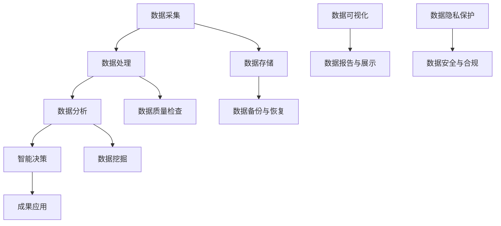
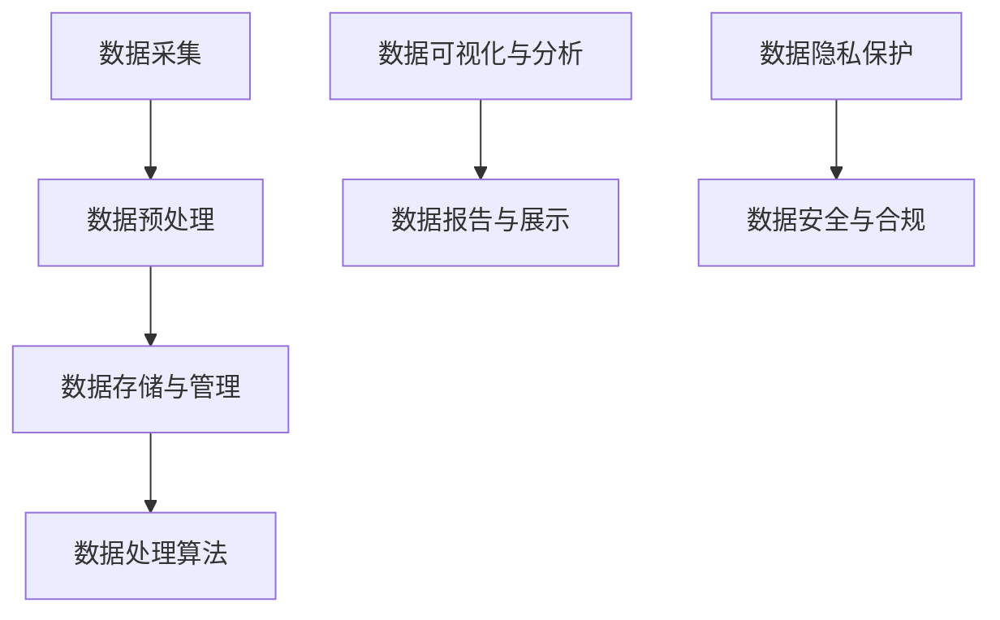
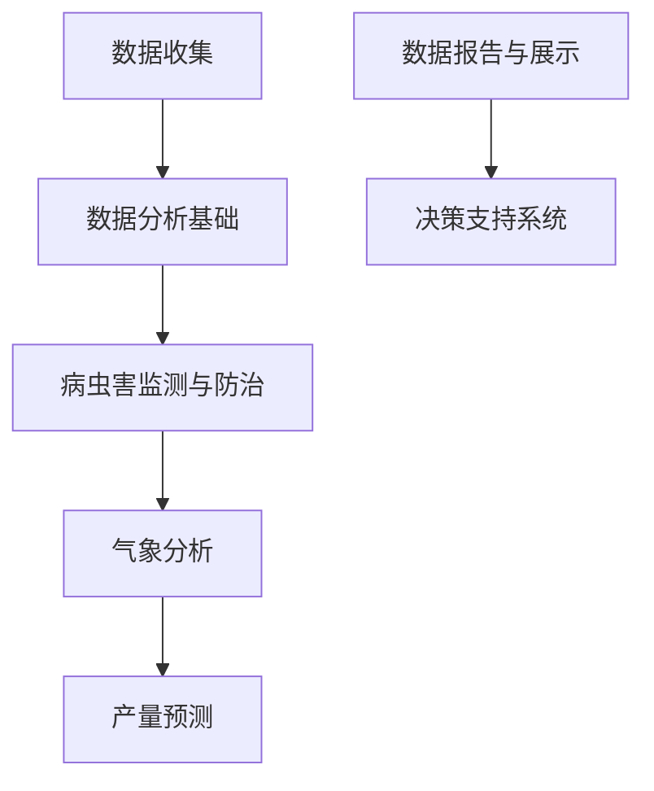
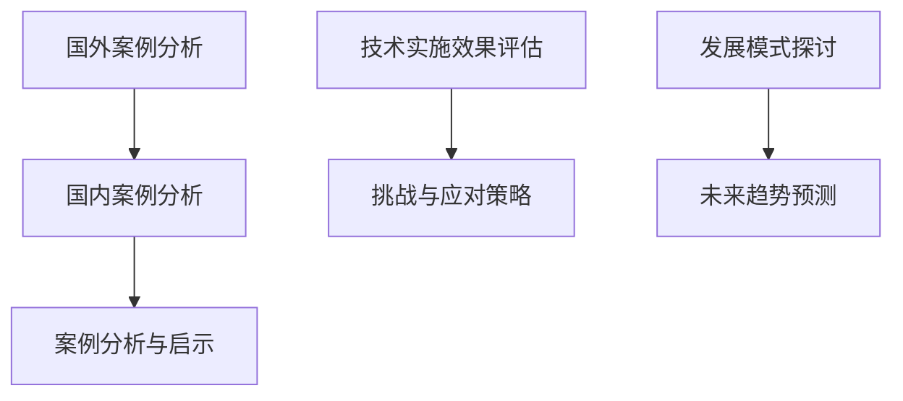
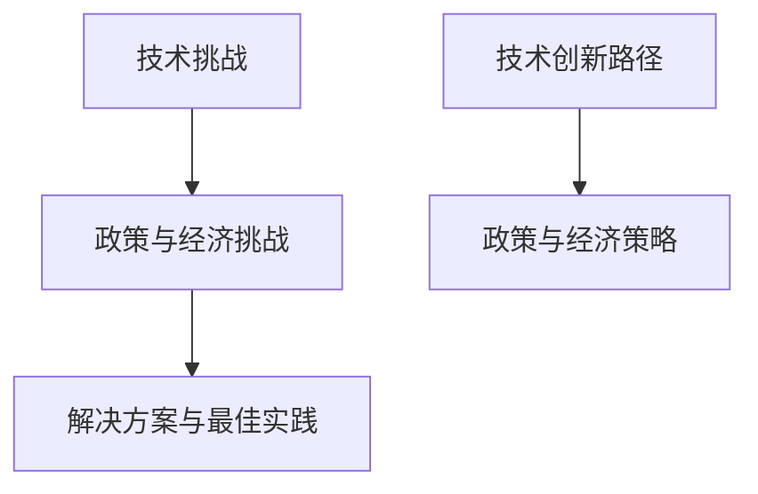
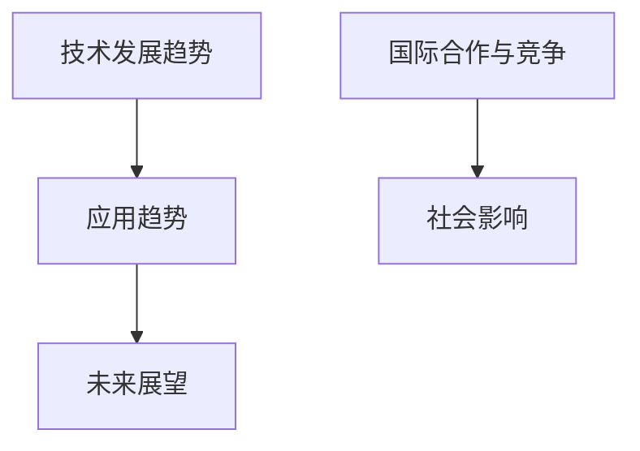
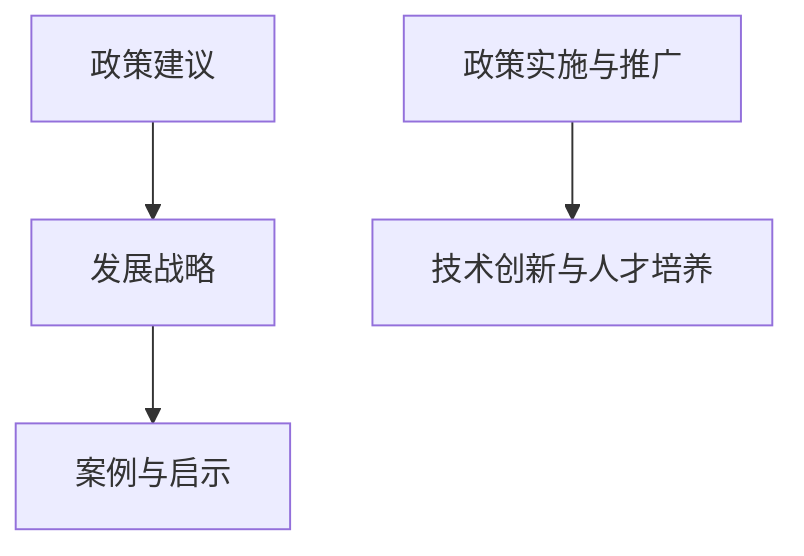

                 

## 大数据在智慧农业中的应用与挑战

关键词：大数据、智慧农业、应用案例、技术挑战、解决方案

摘要：
本文深入探讨了大数据在智慧农业中的应用及其面临的挑战。首先，我们概述了大数据和智慧农业的基本概念及其关系。接着，我们详细分析了大数据在智慧农业中的采集、处理、分析和应用技术。通过国外和国内的实际案例，我们展示了大数据在智慧农业中的成功应用，并讨论了其在农业病虫害监测、气象分析和产量预测等方面的应用实例。随后，我们提出了大数据在智慧农业中面临的技术挑战、政策与经济挑战，并提出了相应的解决方案。最后，我们对大数据在智慧农业中的未来发展趋势进行了展望，并提出了相关政策建议和发展战略。

### 第一部分：大数据在智慧农业中的应用与挑战概述

#### 第1章：大数据与智慧农业

**1.1 引言**

大数据是一种复杂的数据集合，它具有数据量（Volume）、数据速度（Velocity）、数据多样性（Variety）和数据价值（Value）的4V特性。大数据技术的快速发展，为各行各业带来了前所未有的变革。智慧农业则是指利用现代信息技术，特别是大数据、物联网、人工智能等手段，实现对农业生产过程的全面感知、精准管理和智能决策。

**1.2 大数据与智慧农业的关系**

大数据是智慧农业的核心驱动力，通过数据的采集、处理和分析，可以为农业生产提供科学依据，优化农业生产过程，提高农业产量和产品质量。大数据在智慧农业中的作用主要体现在以下几个方面：

1. **数据采集与感知**：利用传感器、遥感技术和物联网设备，实现对农业环境的实时监测和精准感知，获取大量农业生产数据。
2. **数据处理与分析**：通过数据清洗、集成、存储和管理，对农业数据进行深度分析，提取有价值的信息，为农业生产提供科学决策支持。
3. **智能决策与优化**：利用大数据分析结果，制定合理的农业种植计划、病虫害防治方案、水资源管理策略等，实现农业生产的智能化和优化。
4. **数据驱动的农业管理**：通过大数据分析，实现农业生产过程的可视化和智能化管理，提高农业生产的效率和质量。

**1.3 大数据与智慧农业的发展趋势**

随着大数据技术的不断成熟，智慧农业的发展呈现出以下几个趋势：

1. **精准农业的普及**：利用大数据技术，实现农作物生长的精准监测和精准管理，提高农业生产的效率和质量。
2. **智能化农业设备的广泛应用**：智能农业设备，如无人机、智能灌溉系统、智能温室等，将大量应用于农业生产，提高农业生产的自动化水平。
3. **农业物联网的生态建设**：通过物联网技术，实现农业生产过程中的设备互联和数据共享，构建智慧农业生态系统。
4. **大数据与农业产业链的深度融合**：大数据技术将在农业产业链的各个环节得到广泛应用，从种植、养殖、加工到销售，实现全产业链的数字化和智能化。

**1.4 大数据在智慧农业中的应用案例**

全球智慧农业发展迅速，许多国家都取得了显著的成果。以下是一些典型国家和地区的智慧农业应用案例：

1. **荷兰温室农业**：荷兰是全球领先的温室农业国家，通过大数据技术，实现了温室环境监控、作物生长监测和自动化种植系统的全面应用。
2. **美国精准农业**：美国是精准农业的先驱国家，利用大数据和遥感技术，实现了农田的精准监测、作物产量预测和耕地利用优化的广泛应用。
3. **中国智慧农业试点**：中国积极开展智慧农业试点项目，通过农业物联网、大数据分析和智能化设备的广泛应用，实现了农业生产过程的全面数字化和智能化。

**1.5 大数据在智慧农业中的挑战与问题**

尽管大数据在智慧农业中具有巨大的应用潜力，但在实际应用过程中仍面临许多挑战和问题：

1. **数据质量问题**：农业数据来源多样，数据质量参差不齐，如何保证数据准确性、完整性和一致性是一个重要问题。
2. **技术实施与人才培养难题**：智慧农业技术的实施需要高水平的技术团队和大量的专业人才，如何培养和引进这些人才是一个重要挑战。
3. **隐私保护与伦理问题**：农业数据的广泛收集和应用涉及农民的隐私，如何保护农民的隐私和数据安全是一个重要问题。
4. **政策与经济支持不足**：智慧农业的发展需要政策支持和经济投入，如何制定有效的政策和支持措施，吸引更多的投资，是当前面临的一个挑战。

**1.6 总结与展望**

大数据在智慧农业中具有广阔的应用前景，但也面临着一系列的挑战。通过加强技术创新、人才培养和政策支持，我们可以更好地发挥大数据在智慧农业中的作用，推动农业现代化和可持续发展。未来，大数据技术将继续与智慧农业深度融合，实现农业生产的智能化、精准化和高效化，为全球农业发展带来新的机遇和挑战。

### 第1章：大数据与智慧农业的Mermaid流程图

通过这个流程图，我们可以清晰地看到大数据在智慧农业中的应用流程，从数据采集、处理、分析到智能决策，每一个环节都至关重要，共同构建了一个完整的智慧农业生态系统。

### 第2章：大数据采集与处理技术

#### 2.1 数据采集技术

**2.1.1 农业数据源**

在智慧农业中，数据采集是基础和关键的一环。农业数据源主要包括以下几种：

1. **传感器数据**：传感器是农业数据采集的重要设备，它可以监测土壤湿度、温度、光照、二氧化碳浓度等环境参数，以及植物的高度、颜色等生长状态参数。
   
2. **地理信息系统（GIS）数据**：GIS数据包含了土地的地理信息、地形地貌、土壤类型等，这些数据对于农业规划、土地利用和资源管理具有重要意义。

3. **农业遥感数据**：遥感技术可以通过卫星或无人机获取大范围的农业信息，如植被指数、作物类型、病虫害情况等，为农业管理和决策提供重要依据。

**2.1.2 数据采集方法**

为了有效获取农业数据，需要采用多种数据采集方法：

1. **传感器网络**：在农田、果园等区域部署传感器，通过无线通信网络将数据传输到中央处理系统。这种方法可以实现实时、连续的数据采集。

2. **数据融合技术**：由于农业数据来源多样，数据格式和类型各异，需要采用数据融合技术将不同来源的数据进行整合，提高数据的完整性和准确性。

3. **远程监控与自动化设备**：利用远程监控技术，可以实现对农田、温室等农业生产环境的远程监控。自动化设备如自动灌溉系统、自动施肥系统等，可以根据采集的数据自动调整工作状态，实现精准农业。

#### 2.2 数据预处理技术

数据预处理是大数据处理的重要环节，主要包括以下几种技术：

**2.2.1 数据清洗**

数据清洗是指对原始数据进行清洗和过滤，去除重复数据、缺失值和异常值，保证数据的质量和一致性。具体包括：

- **缺失值处理**：对于缺失值，可以通过插值法、平均值法或删除法进行处理。
- **异常值检测与处理**：通过统计学方法或机器学习算法，检测并处理异常值，确保数据的准确性。

**2.2.2 数据集成**

数据集成是将不同来源、不同格式、不同结构的数据进行整合，形成统一的数据视图。主要方法包括：

- **数据来源整合**：将不同数据源的数据进行整合，统一数据格式和结构。
- **数据模型转换**：将异构数据转换为统一的数据模型，如关系型数据库或NoSQL数据库。
- **数据一致性检查**：确保数据在不同系统、不同存储介质中的一致性。

#### 2.3 数据存储与管理技术

**2.3.1 数据库选型**

在智慧农业中，选择合适的数据库对于数据存储和管理至关重要。常见的数据库选型包括：

- **关系型数据库**：如MySQL、PostgreSQL等，适用于结构化数据的存储和管理。
- **非关系型数据库**：如MongoDB、Cassandra等，适用于大规模、分布式数据的存储和管理。
- **分布式存储系统**：如Hadoop、Spark等，适用于大规模、高并发数据存储和处理。

**2.3.2 数据仓库与数据湖**

数据仓库（Data Warehouse）和数据湖（Data Lake）是两种常见的数据存储架构：

- **数据仓库**：是一种面向主题的、集成的、相对稳定的、反映历史变化的数据存储结构。适用于数据分析和报告。
- **数据湖**：是一种大规模存储原始数据的架构，不区分数据格式和结构，适用于大数据处理和实时分析。

**2.3.3 数据生命周期管理**

数据生命周期管理是指对数据从生成、存储、处理到销毁的全过程进行管理，包括：

- **数据生成**：数据的采集和生成过程。
- **数据存储**：根据数据的重要性和访问频率选择合适的存储方式。
- **数据处理**：对数据进行清洗、转换、分析等处理。
- **数据备份与恢复**：确保数据的安全性和可靠性，防止数据丢失和损坏。
- **数据销毁**：根据数据的安全要求和法律法规，对不再需要的数据进行销毁。

#### 2.4 数据处理算法

**2.4.1 数据压缩与索引**

数据压缩与索引是提高数据存储效率和查询速度的重要技术：

- **数据压缩**：通过算法将数据压缩，减少存储空间和提高处理速度。常用的压缩算法包括Huffman编码、LZ77等。
- **索引技术**：通过建立索引，加速数据的查询速度。常用的索引技术包括B树索引、哈希索引等。

**2.4.2 数据流处理技术**

数据流处理技术适用于处理实时、大规模的数据流：

- **实时数据处理框架**：如Apache Kafka、Apache Flink等，适用于实时数据采集、传输和处理。
- **微服务架构**：将数据处理任务分解为多个微服务，实现分布式、高可用数据处理。

#### 第2章：大数据采集与处理技术的Mermaid流程图

这个流程图展示了大数据在智慧农业中从数据采集、预处理、存储与管理、数据处理算法到数据隐私保护与安全合规的完整应用流程。

### 第3章：大数据分析技术在智慧农业中的应用

#### 3.1 数据分析基础

**3.1.1 数据分析方法**

在智慧农业中，数据分析是关键环节，主要包括以下几种分析方法：

- **描述性分析**：对农业数据进行统计分析，描述数据的分布特征、趋势和关联性。常用的统计方法包括均值、方差、标准差、相关系数等。

- **趋势分析**：分析农业数据的时间序列特征，预测未来的发展趋势。常用的方法包括移动平均、指数平滑、时间序列模型（如ARIMA）等。

- **相关性分析**：分析农业数据之间的相关性，找出影响农业生产的关键因素。常用的方法包括皮尔逊相关系数、Spearman秩相关系数等。

- **分类与预测**：对农业数据进行分析，将数据分类到不同的类别，预测未来的农业生产情况。常用的算法包括决策树、随机森林、支持向量机、神经网络等。

**3.1.2 数据分析工具**

在实际应用中，常用的数据分析工具包括：

- **Python**：Python具有丰富的数据处理和机器学习库，如NumPy、Pandas、Scikit-learn、TensorFlow等，适用于各种数据分析任务。

- **R语言**：R语言是统计分析和数据可视化领域的专业工具，适用于复杂的统计分析、数据挖掘和可视化。

- **Tableau**：Tableau是一款强大的数据可视化工具，可以快速创建交互式的可视化报表，帮助农业管理人员理解数据分析结果。

#### 3.2 农业病虫害监测与防治

**3.2.1 病虫害数据收集**

病虫害监测是农业大数据分析的重要应用之一，数据收集是关键步骤。主要数据来源包括：

- **田间监测数据**：通过安装在农田中的传感器，实时监测土壤湿度、温度、光照等环境参数，以及植物的生长状态。

- **遥感数据**：通过卫星或无人机，获取大范围的农业遥感图像，分析植被指数、病虫害情况等。

- **人工调查数据**：通过田间调查，记录病虫害的发生情况、分布范围和危害程度。

**3.2.2 病虫害预测模型**

基于收集到的病虫害数据，可以建立预测模型，预测未来的病虫害发生情况。常用的预测模型包括：

- **回归模型**：通过建立回归模型，分析环境因素与病虫害之间的关系，预测未来病虫害的发生趋势。

- **分类模型**：将历史病虫害数据分类为不同类别，通过分类模型预测未来病虫害的类型和发生程度。

- **时间序列模型**：分析病虫害发生的时间序列特征，建立时间序列模型，预测未来的病虫害发生情况。

**3.2.3 病虫害防治策略优化**

基于病虫害预测模型，可以制定合理的病虫害防治策略，优化防治效果。主要策略包括：

- **预警机制**：在病虫害发生前，及时发布预警信息，指导农民采取预防措施。

- **防治方案优化**：根据病虫害预测结果，制定科学的防治方案，选择合适的防治时间和方法，降低防治成本。

- **病虫害综合防治**：结合物理、化学、生物等多种防治手段，实现病虫害的全面控制。

#### 3.3 农业气象分析

**3.3.1 气象数据收集**

农业气象分析是智慧农业的重要应用之一，数据收集是基础步骤。主要数据来源包括：

- **地面气象站数据**：通过地面气象站，实时监测气温、湿度、风速、降水量等气象要素。

- **卫星气象数据**：通过气象卫星，获取大范围的气象图像，分析云量、降水、温度等气象要素。

- **气象模型数据**：通过气象模型，模拟预测未来的气象条件。

**3.3.2 气候变化影响评估**

基于气象数据，可以评估气候变化对农业生产的影响。主要评估方法包括：

- **气象因素分析**：分析气象因素与农业生产的关系，评估气象条件对作物生长和产量影响。

- **气候变化趋势分析**：分析历史气象数据，预测未来的气候变化趋势，评估气候变化对农业生产的潜在影响。

- **风险模型构建**：建立气候变化风险模型，评估不同气候情景下的农业生产风险。

**3.3.3 气象预报模型**

基于气象数据和气候变化评估结果，可以建立气象预报模型，预测未来的气象条件。常用的模型包括：

- **统计模型**：通过历史气象数据，建立统计模型，预测未来的气象条件。

- **物理模型**：通过气象物理原理，建立物理模型，模拟预测未来的气象条件。

- **混合模型**：结合统计模型和物理模型，提高气象预报的准确性和可靠性。

#### 3.4 农业产量预测

**3.4.1 产量数据收集**

农业产量预测是智慧农业的重要应用之一，数据收集是关键步骤。主要数据来源包括：

- **田间测量数据**：通过田间测量，收集作物生长状态、成熟度等数据。

- **遥感数据**：通过遥感技术，获取作物覆盖度、植被指数等数据。

- **历史产量数据**：收集历史产量数据，作为预测模型的基础数据。

**3.4.2 产量预测模型**

基于收集到的产量数据，可以建立预测模型，预测未来的农业产量。常用的预测模型包括：

- **回归模型**：通过建立回归模型，分析影响产量的关键因素，预测未来的产量。

- **时间序列模型**：通过分析产量数据的时间序列特征，建立时间序列模型，预测未来的产量。

- **机器学习模型**：利用机器学习算法，如神经网络、支持向量机等，建立预测模型，预测未来的产量。

**3.4.3 产量波动分析**

基于产量预测模型，可以分析产量波动的原因，为农业生产决策提供支持。主要分析方法包括：

- **影响因素分析**：分析影响产量的关键因素，如气象条件、土壤质量、病虫害等。

- **季节性分析**：分析产量数据的季节性特征，识别产量波动的周期性和规律性。

- **异常值检测**：通过异常值检测算法，识别产量数据中的异常值，分析异常值产生的原因。

### 第3章：大数据分析技术在智慧农业中的应用的Mermaid流程图

这个流程图展示了大数据分析技术在智慧农业中的应用流程，从数据收集、数据分析到决策支持系统，全面体现了大数据在农业中的应用价值。

### 第4章：大数据驱动的智慧农业案例分析

#### 4.1 国外智慧农业案例分析

**4.1.1 荷兰温室农业**

荷兰是全球温室农业的领导者之一，其智慧农业应用具有广泛的示范效应。以下是荷兰温室农业中的几个典型案例：

1. **温室环境监控**：荷兰的温室通过安装各种传感器，实时监测温度、湿度、光照、二氧化碳浓度等环境参数。这些数据通过物联网技术传输到中央控制系统，实现环境参数的自动调控，为作物生长提供最佳条件。

2. **自动化种植系统**：荷兰的温室农业广泛采用自动化种植系统，包括自动灌溉、自动施肥、自动采收等。这些系统可以根据传感器采集的数据，自动调整灌溉量和施肥量，提高作物产量和品质。

**4.1.2 美国精准农业**

美国是精准农业的先驱，其智慧农业应用在农田管理、作物种植等方面取得了显著成效。以下是美国的几个典型案例：

1. **农田遥感监测**：美国利用卫星遥感技术，对农田进行大范围的遥感监测，获取作物生长状态、病虫害情况等数据。这些数据用于指导农田管理和作物种植决策。

2. **耕地利用优化**：美国通过大数据分析和地理信息系统（GIS），对耕地进行详细分析，优化耕地利用，提高农业生产效率。

#### 4.2 国内智慧农业案例分析

**4.2.1 中国智慧农业试点**

中国积极推动智慧农业的发展，在多个地区开展了智慧农业试点项目。以下是几个典型案例：

1. **农业物联网应用**：在中国的智慧农业试点地区，广泛采用农业物联网技术，实现对农田环境、作物生长的实时监测和管理。这些数据通过物联网平台进行集成和分析，为农业生产提供科学依据。

2. **大数据种植指导**：中国利用大数据技术，对农业生产过程中的各种数据进行分析，生成种植指导建议，提高农业生产效率。例如，通过分析土壤数据、气象数据、作物生长数据等，为农民提供科学的种植方案。

**4.2.2 农业大数据公司案例**

中国的农业大数据公司也在智慧农业中发挥了重要作用。以下是几个典型案例：

1. **平台建设**：农业大数据公司通过建设农业大数据平台，集成农业生产、销售、物流等各个环节的数据，实现农业生产过程的数字化和智能化管理。

2. **服务模式创新**：农业大数据公司通过创新服务模式，提供定制化的农业解决方案。例如，根据农民的需求，提供精准施肥、精准灌溉、病虫害防治等服务。

#### 4.3 案例分析与启示

**4.3.1 技术实施效果评估**

通过对国外和国内智慧农业案例的分析，我们可以看到大数据技术在智慧农业中的应用取得了显著效果。主要表现在：

1. **提高农业生产效率**：通过大数据技术的应用，可以实现精准农业管理，提高农业生产效率。例如，荷兰的自动化种植系统和美国的农田遥感监测技术，都显著提高了作物产量。

2. **降低生产成本**：大数据技术的应用，可以实现生产过程的智能化管理，降低生产成本。例如，中国农业物联网应用和农业大数据公司提供的定制化服务，都帮助农民降低了生产成本。

3. **提升农产品质量**：大数据技术的应用，可以帮助农民制定科学的种植方案，提高农产品质量。例如，中国的大数据种植指导服务，通过分析各种数据，为农民提供最佳的种植方案，提升农产品品质。

**4.3.2 挑战与应对策略**

尽管大数据技术在智慧农业中具有巨大潜力，但在实际应用过程中仍面临一些挑战。以下是一些常见的挑战和应对策略：

1. **数据质量问题**：农业数据的来源多样，数据质量参差不齐。应对策略包括：建立完善的数据采集和管理体系，确保数据的准确性和一致性。

2. **技术实施难度**：智慧农业技术的实施需要高水平的技术团队和大量的专业人才。应对策略包括：加强人才培养，引进高端人才，提高技术团队的执行力。

3. **数据隐私保护**：农业数据的广泛收集和应用涉及农民的隐私，如何保护农民的隐私和数据安全是一个重要问题。应对策略包括：加强数据加密和隐私保护技术，制定完善的隐私保护政策和法规。

4. **政策支持与经济投入**：智慧农业的发展需要政策支持和经济投入。应对策略包括：政府制定支持政策，提供经济激励措施，吸引社会资本投入。

**4.3.3 智慧农业发展模式探讨**

智慧农业的发展模式可以根据不同的国家和地区特点进行探讨。以下是一些典型的智慧农业发展模式：

1. **技术驱动型模式**：以大数据、物联网、人工智能等新技术为核心，推动智慧农业的发展。例如，荷兰和美国的智慧农业模式。

2. **平台服务型模式**：通过建立农业大数据平台，提供数据采集、处理、分析和应用等服务，推动智慧农业的发展。例如，中国的农业大数据公司模式。

3. **生态协同型模式**：通过产业链的整合和协同发展，推动智慧农业的发展。例如，中国的一些智慧农业试点地区，通过农业物联网平台，实现农业生产、销售、物流等环节的协同。

通过以上案例分析，我们可以看到大数据技术在智慧农业中的应用取得了显著成果，但也面临一系列挑战。通过加强技术创新、政策支持和产业链协同，可以推动智慧农业的可持续发展。

### 第4章：大数据驱动的智慧农业案例分析的Mermaid流程图

这个流程图展示了大数据驱动的智慧农业案例分析的应用流程，从国外和国内案例分析到案例分析启示、技术实施效果评估、挑战与应对策略以及发展模式探讨，全面反映了智慧农业的发展趋势和未来展望。

### 第5章：大数据在智慧农业中的挑战与解决方案

#### 5.1 技术挑战

大数据在智慧农业中面临的技术挑战主要包括以下几个方面：

**5.1.1 数据质量问题**

农业数据的来源广泛，数据质量参差不齐。数据质量问题主要体现在数据准确性、完整性和一致性方面。例如，传感器采集的数据可能受到环境噪声的干扰，导致数据不准确；不同数据源的格式和结构可能不一致，导致数据难以整合。解决数据质量问题需要建立完善的数据采集和管理体系，采用数据清洗和去噪技术，确保数据的准确性和一致性。

**5.1.2 数据处理速度与存储**

农业数据通常具有高维度、高频率和高实时性的特点，这对数据处理速度和存储系统提出了挑战。例如，农田环境参数的实时监测需要快速处理和分析大量数据，以确保农业生产过程的及时响应。解决这一问题需要采用高效的数据处理算法和分布式存储系统，如分布式计算框架（如Hadoop、Spark）和大容量数据库（如HBase、Cassandra）。

**5.1.3 数据安全与隐私保护**

农业数据涉及农民的隐私，如何保护农民的隐私和数据安全是大数据在智慧农业中面临的重要挑战。数据泄露和滥用可能导致严重的后果，如农民隐私泄露、农业损失等。解决数据安全与隐私保护问题需要采用数据加密技术、访问控制机制和隐私保护算法，确保数据在采集、存储、传输和使用过程中的安全。

**5.1.4 技术实施与人才培养**

智慧农业技术的实施需要高水平的技术团队和大量的专业人才，但目前农业领域的技术人才储备不足。此外，农业技术的应用场景复杂，技术人员需要具备跨学科的知识和技能。解决技术实施与人才培养问题需要加强人才培养，通过校企合作、专业培训等方式，培养具备农业和信息技术双能力的专业人才。

#### 5.2 政策与经济挑战

大数据在智慧农业中面临的政策与经济挑战主要包括以下几个方面：

**5.2.1 政策支持与实施**

智慧农业的发展需要政府制定和实施一系列支持政策，如资金扶持、税收优惠、土地使用等。然而，政策制定和实施的效率不高，政策效果评估机制不完善，导致政策执行不到位。解决政策支持与实施问题需要加强政策制定的科学性和前瞻性，完善政策评估和反馈机制，确保政策的有效实施。

**5.2.2 经济效益分析**

智慧农业技术的应用需要大量投资，包括硬件设备、软件系统、人才培养等。然而，智慧农业的经济效益往往难以在短期内显现，导致投资者信心不足。解决经济效益分析问题需要加强智慧农业的经济效益评估，通过示范项目、典型案例等方式，展示智慧农业的应用价值和经济效益，吸引更多投资者。

**5.2.3 产业链整合**

智慧农业的发展需要农业产业链各环节的协同，然而，当前农业产业链各环节相对独立，缺乏有效的整合机制。解决产业链整合问题需要加强产业链上下游企业的合作，通过建立农业大数据平台，实现数据共享和协同，提高产业链的整体效能。

#### 5.3 解决方案与最佳实践

**5.3.1 技术创新路径**

为了应对大数据在智慧农业中面临的技术挑战，需要推进技术创新。具体路径包括：

1. **人工智能与大数据技术的结合**：利用人工智能算法，如深度学习、强化学习等，对农业大数据进行分析和预测，提高农业生产的智能化水平。

2. **边缘计算与云计算的结合**：将边缘计算与云计算相结合，实现实时数据处理和远程协同，提高数据处理速度和效率。

3. **物联网与智能设备的普及**：推广物联网设备和智能农业设备，实现农业生产过程的自动化和智能化。

**5.3.2 政策与经济策略**

为了应对大数据在智慧农业中面临的政策与经济挑战，需要制定有效的政策和经济策略。具体措施包括：

1. **政策扶持与激励**：政府通过制定扶持政策，提供资金支持、税收优惠等，鼓励企业和农民采用智慧农业技术。

2. **产业链整合与协同**：加强农业产业链上下游企业的合作，通过建立农业大数据平台，实现数据共享和协同，提高产业链的整体效能。

3. **经济效益评估与宣传**：加强智慧农业的经济效益评估，通过示范项目、典型案例等方式，展示智慧农业的应用价值和经济效益，提高投资者信心。

**5.3.3 解决方案与最佳实践**

在智慧农业中，许多国家和地区已经探索出一些有效的解决方案和最佳实践。以下是一些典型的解决方案和最佳实践：

1. **荷兰温室农业**：荷兰的温室农业通过大数据技术和物联网设备的广泛应用，实现了环境参数的实时监测和自动化调控，提高了农业生产效率。

2. **美国精准农业**：美国利用卫星遥感技术和大数据分析，实现了农田的精准监测和作物产量预测，提高了农业生产效率和产品质量。

3. **中国智慧农业试点**：中国通过农业物联网平台和大数据分析，实现了农业生产过程的数字化和智能化管理，提高了农业生产效率和产品质量。

通过以上解决方案和最佳实践，我们可以看到大数据在智慧农业中的广泛应用，也为我们提供了宝贵的经验和启示。

### 第5章：大数据在智慧农业中的挑战与解决方案的Mermaid流程图

这个流程图展示了大数据在智慧农业中的挑战与解决方案的完整应用流程，从技术挑战、政策与经济挑战到解决方案与最佳实践，全面反映了智慧农业的发展路径。

### 第6章：大数据在智慧农业中的未来发展趋势

#### 6.1 技术发展趋势

**6.1.1 人工智能与大数据的深度融合**

随着人工智能技术的发展，其在智慧农业中的应用越来越广泛。未来，人工智能与大数据的深度融合将成为智慧农业发展的重要趋势。例如，利用深度学习和机器学习算法，可以实现对农业数据的实时分析和预测，优化农业生产过程。此外，基于图像识别和语音识别技术，可以实现对农作物病虫害的自动检测和诊断，提高农业生产的智能化水平。

**6.1.2 边缘计算与物联网的普及**

边缘计算和物联网技术的普及将极大地提升智慧农业的应用效能。通过在农田、温室等现场部署边缘计算设备，可以实现对数据的实时处理和分析，减少数据传输延迟，提高决策的实时性。物联网设备的广泛应用，将实现农业生产全过程的自动化和智能化，从土壤湿度、光照强度到作物生长状态，实现全方位的监控和管理。

**6.1.3 大数据与区块链技术的结合**

大数据与区块链技术的结合将为智慧农业带来新的发展机遇。区块链技术可以确保数据的安全性和透明性，解决数据隐私保护问题。通过将农业生产数据上链，可以实现数据的永久保存和不可篡改，提高农业生产的可信度。此外，区块链技术还可以促进农业供应链的透明化，提高农产品的追溯能力。

#### 6.2 应用趋势

**6.2.1 精准农业的进一步推广**

精准农业是大数据在智慧农业中的重要应用领域，其核心思想是通过大数据技术实现农作物生长的精准监测和精准管理。未来，精准农业将进一步推广，应用于更多的农作物和农业领域。例如，通过无人机和卫星遥感技术，可以实现对农田的精细化管理，实现精准播种、精准灌溉和精准施肥，提高农业生产的效率和质量。

**6.2.2 大数据分析与农业产业链的深度融合**

大数据技术在农业产业链的各个环节都有广泛的应用前景。未来，大数据分析将与农业产业链深度融合，从种植、养殖、加工到销售，实现全产业链的数字化和智能化。例如，通过大数据分析，可以优化农产品供应链，提高农产品的流通效率；通过大数据预测，可以预测农产品的市场需求，指导农业生产和销售。

**6.2.3 农业金融的创新**

大数据技术在农业金融中的应用将带来新的发展机遇。通过大数据分析，可以评估农民的信用风险，提供个性化的金融产品和服务，如农业贷款、保险等。此外，大数据分析还可以帮助金融机构预测农产品价格波动，降低金融风险，提高金融服务的安全性。

#### 6.3 未来展望

**6.3.1 智慧农业的国际合作与竞争**

随着全球农业问题的日益突出，智慧农业的国际合作与竞争将日益激烈。未来，各国将加强在智慧农业领域的合作，共享技术、资源和经验，共同应对全球农业挑战。同时，各国也将加大智慧农业的研发投入，争夺智慧农业领域的领导地位。

**6.3.2 智慧农业对社会的影响**

智慧农业的发展将对社会产生深远的影响。首先，智慧农业将提高农业生产的效率和质量，保障食品安全。其次，智慧农业将促进农村经济的发展，提高农民的收入水平。此外，智慧农业还将推动农业现代化和城乡一体化，促进社会的和谐与进步。

通过以上分析，我们可以看到大数据在智慧农业中具有广阔的发展前景。未来，大数据技术将继续与智慧农业深度融合，推动农业生产的智能化、精准化和高效化，为全球农业发展带来新的机遇和挑战。

### 第6章：大数据在智慧农业中的未来发展趋势的Mermaid流程图

这个流程图展示了大数据在智慧农业中的未来发展趋势，从技术发展趋势、应用趋势到未来展望，全面反映了智慧农业的发展前景。

### 第7章：大数据在智慧农业中的政策建议与发展战略

#### 7.1 政策建议

为了推动大数据在智慧农业中的发展，政府需要制定和实施一系列政策建议，以支持智慧农业的数字化转型和可持续发展。以下是一些关键的政策建议：

**7.1.1 政策支持与规划**

- **制定专项政策**：政府应制定智慧农业专项政策，明确发展目标和政策措施，提供政策引导和支持。
- **资金支持**：政府应设立专项资金，支持智慧农业技术研发、示范项目和基础设施建设。
- **政策试点**：在部分地区开展智慧农业试点，总结试点经验，推广成功案例，推动智慧农业的普及。

**7.1.2 技术创新与研发**

- **加大研发投入**：政府和企业应加大对智慧农业技术研发的投入，推动大数据、人工智能、物联网等关键技术的创新应用。
- **产学研合作**：加强高校、科研机构和企业之间的合作，共同开展智慧农业技术研发和成果转化。
- **人才引进与培养**：政府应出台人才引进政策，吸引高端人才投身智慧农业领域，同时加强农业技术人才的培养。

**7.1.3 数据共享与开放**

- **建立数据共享平台**：政府应推动建立农业数据共享平台，促进农业生产、科研和商业数据的高效利用。
- **数据开放政策**：制定数据开放政策，鼓励公共数据和私人数据共享，提高数据透明度和可获取性。

#### 7.2 发展战略

为了实现大数据在智慧农业中的全面发展，需要制定系统的发展战略，从产业链协同、产业融合、国际合作等方面进行布局。

**7.2.1 产业协同发展**

- **产业链整合**：推动农业生产、加工、销售等产业链各环节的协同发展，实现大数据在农业全产业链中的应用。
- **产业平台建设**：建立智慧农业产业平台，整合产业链上下游资源，提供数据采集、处理、分析和应用的一站式服务。
- **产业政策协同**：政府应制定产业政策，支持产业链各环节的协同发展，提高产业链的整体效能。

**7.2.2 产业融合**

- **农业与信息技术融合**：推动大数据、物联网、人工智能等信息技术与农业的深度融合，实现农业生产、管理和服务的智能化。
- **农业与金融融合**：发展农业金融，利用大数据分析评估农民信用，提供个性化的金融产品和服务。
- **农业与电商融合**：推动农业电商发展，利用大数据技术优化农产品供应链，提高农产品流通效率。

**7.2.3 国际合作**

- **技术交流与合作**：加强国际智慧农业技术交流与合作，引进先进技术和管理经验，提升我国智慧农业水平。
- **市场拓展**：积极参与国际智慧农业市场，推动我国智慧农业产品和服务走向国际。
- **政策协调**：与国际组织合作，推动全球智慧农业政策协调，共同应对全球农业挑战。

#### 7.3 案例与启示

**7.3.1 成功案例分析**

在国内外，智慧农业的成功案例为我们提供了宝贵的经验和启示。以下是一些典型的成功案例：

- **荷兰温室农业**：荷兰利用大数据和物联网技术，实现了温室农业的自动化和智能化管理，提高了作物产量和质量。
- **中国智慧农业试点**：中国在多个地区开展了智慧农业试点，通过农业物联网平台和大数据分析，实现了农业生产过程的数字化和智能化。
- **美国精准农业**：美国利用卫星遥感和大数据分析，实现了农田的精准监测和作物产量预测，提高了农业生产效率和产品质量。

**7.3.2 启示与借鉴**

- **加强技术创新**：借鉴成功案例，加强大数据、物联网、人工智能等关键技术的研发和应用。
- **政策支持**：借鉴政策经验，制定支持智慧农业发展的政策，提供资金、技术和管理支持。
- **产业协同**：推动产业链上下游企业的协同发展，实现资源整合和优势互补。

通过以上案例分析和启示，我们可以更好地把握大数据在智慧农业中的发展方向，推动我国智慧农业的可持续发展。

### 第7章：大数据在智慧农业中的政策建议与发展战略的Mermaid流程图

这个流程图展示了大数据在智慧农业中的政策建议与发展战略的完整实施路径，从政策建议、发展战略到案例与启示，再到政策实施与推广和技术创新与人才培养，全面反映了智慧农业的发展策略和实施步骤。

