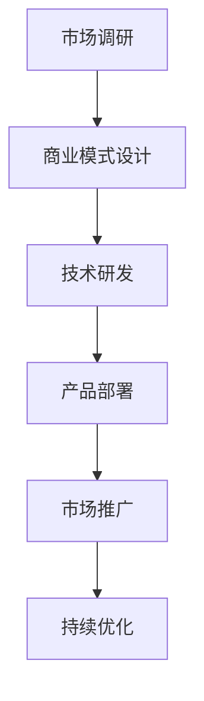

                 

# 大模型创业免费模式走不通，良性商业化是关键

> 关键词：大模型，创业，免费模式，良性商业化，策略

> 摘要：随着人工智能技术的迅速发展，大模型在创业中的应用越来越广泛。然而，传统的免费模式在商业化过程中面临诸多挑战。本文将探讨大模型创业中免费模式的局限性，分析大模型商业化的必要性，并提出良性商业化的策略与路径。

## 《大模型创业免费模式走不通，良性商业化是关键》目录大纲

### 第一部分：大模型与创业环境分析

#### 第1章：大模型技术概述

- 1.1 大模型的概念与分类
    - 大模型的定义
    - 大模型的分类
- 1.2 大模型技术的发展趋势
    - 大模型技术的演进
    - 未来发展方向
- 1.3 大模型在创业中的地位与作用
    - 大模型在创业中的应用场景
    - 大模型对创业模式的影响

#### 第2章：创业环境与大模型需求

- 2.1 当代创业环境概述
    - 创业趋势
    - 创业挑战
- 2.2 大模型在创业中的需求分析
    - 创业者对大模型的需求
    - 创业项目对大模型的要求
- 2.3 大模型在创业中的应用策略
    - 应用案例
    - 应用策略分析

### 第二部分：免费模式与大模型商业化

#### 第3章：免费模式概述

- 3.1 免费模式的概念与特点
    - 免费模式的定义
    - 免费模式的优势与劣势
- 3.2 免费模式在创业中的应用
    - 成功案例分析
    - 失败案例分析
- 3.3 免费模式的局限性与风险
    - 免费模式的风险
    - 免费模式的局限性

#### 第4章：大模型商业化的必要性

- 4.1 大模型商业化的背景
    - 大模型成本下降
    - 市场需求增长
- 4.2 大模型商业化的优势
    - 商业价值
    - 长期盈利能力
- 4.3 大模型商业化的挑战
    - 技术挑战
    - 市场挑战

#### 第5章：良性商业化的策略与路径

- 5.1 良性商业化的概念与原则
    - 良性商业化的定义
    - 良性商业化的原则
- 5.2 良性商业化的策略
    - 策略分析
    - 实施步骤
- 5.3 良性商业化的路径
    - 成功路径
    - 挑战与应对

### 第三部分：大模型商业案例解析

#### 第6章：成功大模型商业化案例

- 6.1 案例一：公司X的大模型商业化实践
    - 公司背景
    - 商业模式
    - 成功经验
- 6.2 案例二：公司Y的大模型商业化之路
    - 公司背景
    - 商业模式
    - 成功经验

#### 第7章：失败大模型商业化案例

- 7.1 案例一：公司A的大模型商业化困境
    - 公司背景
    - 商业模式
    - 失败原因
- 7.2 案例二：公司B的大模型商业化失败
    - 公司背景
    - 商业模式
    - 失败原因

### 附录

#### 附录A：大模型商业化资源与工具

- A.1 开源工具介绍
    - 工具1：TensorFlow
    - 工具2：PyTorch
    - 工具3：其他常用工具
- A.2 商业化案例分析报告
    - 成功案例报告
    - 失败案例报告
- A.3 大模型商业化相关书籍与论文推荐
    - 顶级论文
    - 经典书籍

#### 附录B：大模型商业化流程图

- B.1 大模型商业化流程图
    - 流程图描述
    - 关键步骤详解

#### 附录C：大模型商业化算法伪代码

- C.1 算法一：大模型训练伪代码
    - 算法描述
    - 伪代码实现
- C.2 算法二：大模型商业化策略优化伪代码
    - 算法描述
    - 伪代码实现

#### 附录D：大模型商业化示例代码

- D.1 示例代码一：大模型训练代码实现
    - 代码描述
    - 代码实现
- D.2 示例代码二：大模型商业化策略优化代码实现
    - 代码描述
    - 代码实现

#### 附录E：大模型商业化案例分析

- E.1 案例一：大模型在金融行业的应用
    - 案例描述
    - 案例分析
- E.2 案例二：大模型在医疗行业的应用
    - 案例描述
    - 案例分析

## 第一部分：大模型与创业环境分析

### 第1章：大模型技术概述

#### 1.1 大模型的概念与分类

大模型是指那些拥有数百万甚至数十亿参数的神经网络模型。这些模型具有强大的表示能力和计算能力，能够处理大量的数据并从中学习到复杂的模式和知识。根据模型的规模和应用领域，大模型可以分为以下几类：

1. **通用大模型**：如GPT-3、ChatGPT等，它们能够处理多种语言任务，包括文本生成、翻译、问答等。
2. **领域大模型**：如BERT、ERNIE等，这些模型专门针对某个特定领域进行训练，如自然语言处理、计算机视觉等。
3. **混合大模型**：如Transformer、BERT等，它们结合了多个模型的优点，以提高模型的性能。

#### 1.2 大模型技术的发展趋势

大模型技术在过去几年中取得了显著的进展。以下是一些主要的发展趋势：

1. **模型规模增大**：随着计算能力和存储技术的提升，大模型的规模越来越大，参数数量达到数十亿甚至百亿级别。
2. **训练效率提升**：通过分布式训练和优化算法的改进，大模型的训练时间显著缩短。
3. **应用领域拓展**：大模型不仅在自然语言处理和计算机视觉领域取得了突破，还在金融、医疗、制造等行业得到广泛应用。

#### 1.3 大模型在创业中的地位与作用

大模型在创业中的应用越来越广泛，成为推动创新的重要力量。以下是几个方面的作用：

1. **提升业务能力**：大模型能够处理海量的数据，从数据中挖掘出有价值的信息，帮助企业提升业务决策和运营效率。
2. **创新产品与服务**：基于大模型的技术，创业者可以开发出具有竞争力的新产品和服务，如智能客服、智能推荐系统等。
3. **降低创业门槛**：开源的大模型框架和工具降低了创业者在模型开发方面的技术门槛，使得更多创业者能够参与到人工智能领域。

### 第2章：创业环境与大模型需求

#### 2.1 当代创业环境概述

当代创业环境发生了显著变化，呈现出以下趋势：

1. **市场竞争加剧**：随着创业项目的增多，市场竞争日益激烈，创业者需要不断创新和提升自身竞争力。
2. **政策支持与鼓励**：政府出台了一系列支持创新创业的政策，如税收优惠、融资支持等，为创业者提供了良好的发展环境。
3. **科技驱动创新**：人工智能、大数据等新技术成为推动创业创新的重要力量，创业者需要紧跟技术发展趋势。

#### 2.2 大模型在创业中的需求分析

创业者在选择大模型时，主要考虑以下需求：

1. **准确性**：大模型在处理业务问题时需要具有较高的准确性，以确保决策和服务的可靠性。
2. **可扩展性**：随着业务的增长，大模型需要能够扩展到更大的规模，以适应不断变化的需求。
3. **实时性**：某些业务场景需要大模型能够实时响应和处理，以满足实时决策和服务的需求。

#### 2.3 大模型在创业中的应用策略

创业者可以根据以下策略应用大模型：

1. **业务场景分析**：首先分析创业项目的业务场景，确定哪些场景适合使用大模型技术。
2. **数据准备**：准备足够高质量的数据集，以保证大模型的训练效果。
3. **模型选择**：根据业务需求选择合适的大模型框架和算法。
4. **持续优化**：通过不断的模型迭代和优化，提升大模型的性能和业务价值。

## 第二部分：免费模式与大模型商业化

### 第3章：免费模式概述

#### 3.1 免费模式的概念与特点

免费模式是指企业或组织为吸引用户，免费提供产品或服务的一种商业模式。免费模式具有以下特点：

1. **零成本进入**：用户无需支付费用即可获得产品或服务。
2. **用户获取成本低**：通过免费策略，企业可以快速吸引用户，降低用户获取成本。
3. **后续盈利方式**：企业通过其他途径实现盈利，如广告收入、增值服务收费等。

#### 3.2 免费模式在创业中的应用

免费模式在创业中的应用具有以下案例：

1. **成功案例**：如腾讯微信、百度搜索等，通过免费模式快速占领市场，再通过增值服务实现盈利。
2. **失败案例**：如ofo共享单车，虽然免费提供服务，但由于商业模式不清晰，最终导致失败。

#### 3.3 免费模式的局限性与风险

免费模式在商业化过程中面临以下局限性与风险：

1. **盈利模式不明确**：免费模式需要后续的盈利方式，但如果盈利模式不明确，可能导致企业难以实现盈利。
2. **用户体验下降**：免费模式可能导致用户体验下降，影响企业品牌形象。
3. **市场竞争加剧**：免费模式容易引发市场竞争，导致企业面临更大的压力。

### 第4章：大模型商业化的必要性

#### 4.1 大模型商业化的背景

大模型商业化面临着以下背景：

1. **大模型成本下降**：随着计算能力和存储技术的提升，大模型的训练和部署成本显著降低。
2. **市场需求增长**：随着人工智能技术的应用场景不断拓展，市场需求持续增长，为企业提供了广阔的商业空间。

#### 4.2 大模型商业化的优势

大模型商业化具有以下优势：

1. **商业价值**：大模型能够处理海量数据，为企业提供有价值的信息和决策支持，提高业务效率。
2. **长期盈利能力**：通过大模型的应用，企业可以持续优化业务流程，提高盈利能力。

#### 4.3 大模型商业化的挑战

大模型商业化面临以下挑战：

1. **技术挑战**：大模型的训练和部署需要高性能计算资源，对技术要求较高。
2. **市场挑战**：大模型商业化需要了解市场需求，找准定位，以适应不断变化的市场环境。

### 第5章：良性商业化的策略与路径

#### 5.1 良性商业化的概念与原则

良性商业化是指企业通过合理的商业模式和策略，实现可持续发展的一种经营模式。其基本原则包括：

1. **盈利性**：商业模式应具备盈利性，以确保企业持续发展。
2. **可持续性**：商业模式应具有可持续性，以适应长期的市场变化。
3. **用户价值**：商业模式应关注用户价值，以提高用户满意度和忠诚度。

#### 5.2 良性商业化的策略

良性商业化可采取以下策略：

1. **差异化定位**：找准市场定位，提供差异化产品和服务。
2. **创新驱动**：持续进行技术创新，以提升产品竞争力。
3. **合作共赢**：与产业链上下游企业合作，实现共赢发展。

#### 5.3 良性商业化的路径

良性商业化的路径包括：

1. **市场调研**：了解市场需求，确定产品定位。
2. **商业模式设计**：设计合理的商业模式，实现盈利。
3. **持续优化**：通过数据分析和用户反馈，不断优化产品和服务。

## 第三部分：大模型商业案例解析

### 第6章：成功大模型商业化案例

#### 6.1 案例一：公司X的大模型商业化实践

公司X是一家专注于自然语言处理技术的人工智能企业。以下是其大模型商业化实践：

1. **公司背景**：公司X成立于2010年，专注于自然语言处理技术的研究和应用。
2. **商业模式**：公司X通过提供基于大模型的自然语言处理服务，为企业提供智能客服、智能推荐等解决方案。
3. **成功经验**：
   - 精准的技术定位：公司X专注于自然语言处理技术，具有深厚的研发背景。
   - 强大的技术团队：公司X拥有一支高水平的技术团队，能够快速实现技术突破。
   - 客户资源丰富：公司X通过与多家企业合作，积累了丰富的客户资源。

#### 6.2 案例二：公司Y的大模型商业化之路

公司Y是一家专注于计算机视觉技术的人工智能企业。以下是其大模型商业化之路：

1. **公司背景**：公司Y成立于2015年，专注于计算机视觉技术的研究和应用。
2. **商业模式**：公司Y通过提供基于大模型的计算机视觉服务，为企业提供智能安防、自动驾驶等解决方案。
3. **成功经验**：
   - 技术创新：公司Y不断进行技术创新，推出了具有竞争力的产品。
   - 市场拓展：公司Y积极拓展市场，与多家企业建立合作关系。
   - 品牌影响力：公司Y在行业内具有较高知名度，提升了品牌影响力。

### 第7章：失败大模型商业化案例

#### 7.1 案例一：公司A的大模型商业化困境

公司A是一家专注于人工智能技术的人工智能企业。以下是其大模型商业化困境：

1. **公司背景**：公司A成立于2012年，专注于人工智能技术的研究和应用。
2. **商业模式**：公司A计划通过提供基于大模型的人工智能服务，为企业提供智能推荐、智能客服等解决方案。
3. **失败原因**：
   - 技术研发不足：公司A在技术研发方面投入不足，导致产品性能不稳定。
   - 市场定位不清：公司A在市场定位方面存在困惑，无法准确把握市场需求。
   - 资金短缺：公司A在商业化过程中资金短缺，导致业务发展受阻。

#### 7.2 案例二：公司B的大模型商业化失败

公司B是一家专注于自然语言处理技术的人工智能企业。以下是其大模型商业化失败：

1. **公司背景**：公司B成立于2013年，专注于自然语言处理技术的研究和应用。
2. **商业模式**：公司B计划通过提供基于大模型的自然语言处理服务，为企业提供智能客服、智能推荐等解决方案。
3. **失败原因**：
   - 产品同质化：公司B的产品与竞争对手的产品存在同质化问题，缺乏竞争力。
   - 市场推广不足：公司B在市场推广方面投入不足，导致产品知名度不高。
   - 资金链断裂：公司B在商业化过程中资金链断裂，导致业务无法持续发展。

## 附录

### 附录A：大模型商业化资源与工具

#### A.1 开源工具介绍

- **TensorFlow**：由谷歌开发的开源机器学习框架，适用于大模型的训练和部署。
- **PyTorch**：由Facebook开发的开源机器学习框架，具有灵活的动态计算图。
- **其他常用工具**：如Keras、Scikit-learn等，适用于不同场景的机器学习应用。

#### A.2 商业化案例分析报告

- **成功案例报告**：分析成功大模型商业化的案例，总结成功经验。
- **失败案例报告**：分析失败大模型商业化的案例，总结失败原因。

#### A.3 大模型商业化相关书籍与论文推荐

- **顶级论文**：如《Attention Is All You Need》、《BERT: Pre-training of Deep Bidirectional Transformers for Language Understanding》等。
- **经典书籍**：如《深度学习》（Goodfellow et al.）、《神经网络与深度学习》（邱锡鹏）等。

### 附录B：大模型商业化流程图

以下是大模型商业化的流程图：



### 附录C：大模型商业化算法伪代码

#### C.1 算法一：大模型训练伪代码

```python
# 大模型训练伪代码
def train_large_model(data_loader, model, optimizer, loss_function, num_epochs):
    for epoch in range(num_epochs):
        for data, target in data_loader:
            optimizer.zero_grad()
            output = model(data)
            loss = loss_function(output, target)
            loss.backward()
            optimizer.step()
        print(f"Epoch {epoch+1}/{num_epochs}, Loss: {loss.item()}")
```

#### C.2 算法二：大模型商业化策略优化伪代码

```python
# 大模型商业化策略优化伪代码
def optimize_business_strategy(data_loader, model, strategy_optimizer, strategy_loss_function, num_epochs):
    for epoch in range(num_epochs):
        for data, target in data_loader:
            strategy_optimizer.zero_grad()
            output = model(data)
            strategy_loss = strategy_loss_function(output, target)
            strategy_loss.backward()
            strategy_optimizer.step()
        print(f"Epoch {epoch+1}/{num_epochs}, Strategy Loss: {strategy_loss.item()}")
```

### 附录D：大模型商业化示例代码

#### D.1 示例代码一：大模型训练代码实现

```python
# 大模型训练代码实现
import torch
import torch.nn as nn
import torch.optim as optim

# 定义大模型
class LargeModel(nn.Module):
    def __init__(self):
        super(LargeModel, self).__init__()
        # 定义模型结构，如卷积层、全连接层等

    def forward(self, x):
        # 定义前向传播过程
        return x

# 加载数据集
data_loader = DataLoader(dataset, batch_size=64, shuffle=True)

# 初始化模型、优化器和损失函数
model = LargeModel()
optimizer = optim.Adam(model.parameters(), lr=0.001)
loss_function = nn.CrossEntropyLoss()

# 训练模型
train_large_model(data_loader, model, optimizer, loss_function, num_epochs=10)
```

#### D.2 示例代码二：大模型商业化策略优化代码实现

```python
# 大模型商业化策略优化代码实现
import torch
import torch.nn as nn
import torch.optim as optim

# 定义大模型
class LargeModel(nn.Module):
    def __init__(self):
        super(LargeModel, self).__init__()
        # 定义模型结构，如卷积层、全连接层等

    def forward(self, x):
        # 定义前向传播过程
        return x

# 加载数据集
data_loader = DataLoader(dataset, batch_size=64, shuffle=True)

# 初始化模型、优化器和损失函数
model = LargeModel()
strategy_optimizer = optim.Adam(model.parameters(), lr=0.001)
strategy_loss_function = nn.CrossEntropyLoss()

# 优化模型
optimize_business_strategy(data_loader, model, strategy_optimizer, strategy_loss_function, num_epochs=10)
```

### 附录E：大模型商业化案例分析

#### E.1 案例一：大模型在金融行业的应用

**案例描述**：某金融公司利用大模型技术进行风险控制。

**案例分析**：
- **风险预测**：通过大模型分析历史数据，预测未来可能出现的风险，为企业提供风险预警。
- **信用评估**：利用大模型对客户信用进行评估，提高信用评估的准确性。
- **投资策略**：通过大模型分析市场数据，为投资决策提供支持。

#### E.2 案例二：大模型在医疗行业的应用

**案例描述**：某医疗公司利用大模型技术进行疾病预测。

**案例分析**：
- **疾病预测**：通过大模型分析患者病历和生物特征数据，预测患者未来可能出现的疾病。
- **个性化治疗**：根据大模型分析的结果，为患者制定个性化的治疗方案。
- **药物研发**：通过大模型分析药物分子结构和疾病特征，加速药物研发过程。

