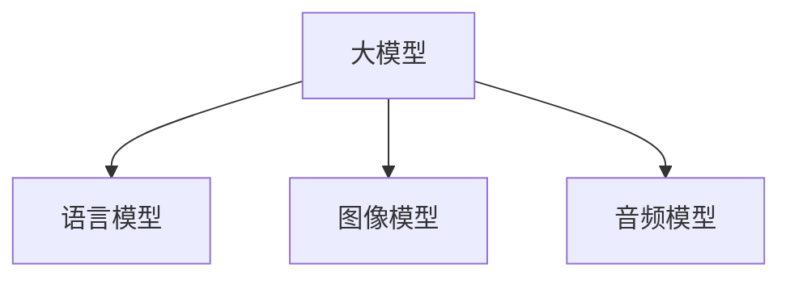
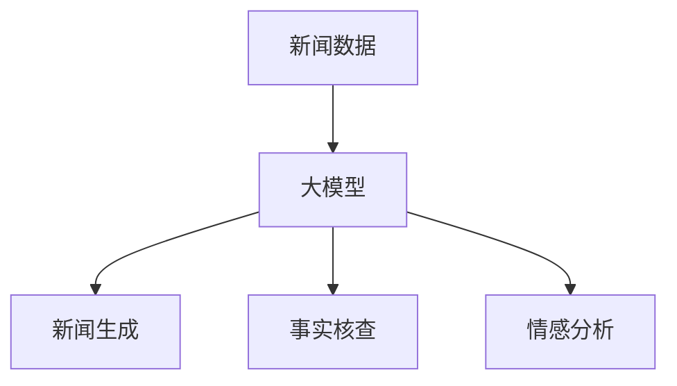

                 

# 大模型对新闻采编流程的影响

> **关键词：** 大模型，新闻采编，算法，伦理，应用案例

> **摘要：** 本文章将深入探讨大模型在新闻采编流程中的应用及其影响。通过分析大模型的核心概念、算法原理和应用案例，我们将揭示大模型如何改变新闻生产流程，优化质量控制，提升用户体验，并提出相应的伦理挑战和指导原则。

## 第一部分: 大模型概述

### 第1章: 大模型核心概念与联系

#### 1.1 大模型的定义与分类

**定义**：大模型是指具有数十亿至千亿参数的深度学习模型。这些模型通过学习大量数据，具有强大的表示能力和泛化能力，能够在各种复杂任务中表现出色。

**分类**：大模型可以按功能分为语言模型、图像模型、音频模型等。语言模型如GPT-3、BERT等，可以生成文本；图像模型如Vision Transformer、GAN等，可以处理图像；音频模型如WaveNet、Transformer TTS等，可以生成音频。

**Mermaid 流程图**



#### 1.2 大模型的架构与原理

**架构**：大模型通常采用神经网络架构，如Transformer。这种架构具有层次化和并行化的特点，使得模型能够更好地学习数据的复杂结构。

**原理**：大模型通过大量数据预训练，然后微调应用于特定任务。预训练过程中，模型学习到数据的普遍特征，从而提高其泛化能力。微调过程中，模型针对特定任务进行调整，以优化性能。

**伪代码**

```python
def big_model(data):
    pre_train(data)
    fine_tune(data)
    return model
```

#### 1.3 大模型在新闻采编中的应用

**应用**：大模型在新闻采编中具有广泛的应用，包括自动新闻生成、事实核查、情感分析等。通过数据驱动的模型，可以显著改进新闻生产流程。

**联系**：大模型通过数据驱动的方式，改进新闻生产流程。例如，自动新闻生成可以提高新闻生产效率，事实核查可以确保新闻报道的准确性，情感分析可以帮助媒体了解公众对新闻事件的看法。

**Mermaid 流程图**



### 第2章: 大模型算法原理

#### 2.1 反向传播算法

**原理**：反向传播算法是一种用于训练神经网络的优化方法。通过计算模型输出与真实值之间的差异（损失），然后反向传播梯度，以更新模型参数。

**伪代码**

```python
for each parameter in model:
    gradient = compute_gradient(data, model)
    parameter -= learning_rate * gradient
```

#### 2.2 自监督学习

**原理**：自监督学习是一种在没有标签数据的情况下，通过预训练模型的方法。自监督学习利用数据的内部结构，学习有用的表示。

**伪代码**

```python
def pre_train(data):
    for each sample in data:
        generate_negative_samples()
        compute_loss()
```

#### 2.3 微调技术

**原理**：微调技术是一种在大模型基础上，针对特定任务进行调整的方法。通过微调，模型可以在特定任务上获得更好的性能。

**伪代码**

```python
def fine_tune(data, model):
    for each sample in data:
        compute_loss(model, sample)
        update_model(model)
```

### 第3章: 大模型在新闻采编中的应用

#### 3.1 自动新闻生成

**原理**：自动新闻生成利用大模型生成符合语法和逻辑的新闻文本。通过预训练的模型，可以生成高质量的新闻报道。

**案例**：使用GPT-3生成体育新闻。GPT-3具有强大的文本生成能力，可以生成连贯、有吸引力的体育新闻。

#### 3.2 事实核查

**原理**：事实核查通过对比事实和新闻报道，识别不准确信息。大模型可以自动分析新闻报道，检测错误信息。

**案例**：利用BERT模型进行新闻报道的事实核查。BERT具有强大的语义理解能力，可以准确识别新闻报道中的事实错误。

#### 3.3 情感分析

**原理**：情感分析通过分析新闻文本中的情感倾向，帮助媒体了解公众对新闻事件的看法。大模型可以准确识别文本中的情感信息。

**案例**：使用RoBERTa模型分析社交媒体上的新闻情感。RoBERTa具有强大的情感分析能力，可以准确识别用户对新闻事件的情感态度。

## 第二部分: 大模型应用与影响

### 第4章: 大模型对新闻采编流程的影响

#### 4.1 生产流程优化

**影响**：大模型可以显著缩短新闻生成时间，提高生产效率。通过自动新闻生成和事实核查，媒体可以更快地响应新闻事件。

**案例**：自动化新闻写作工具的使用。例如，GPT-3可以快速生成体育新闻，节省人力和时间成本。

#### 4.2 质量控制

**影响**：大模型可以检测和过滤低质量新闻，提高新闻内容的质量。通过情感分析和事实核查，媒体可以确保新闻报道的准确性和公正性。

**案例**：使用大模型对新闻内容进行实时审查。例如，BERT模型可以自动检测新闻报道中的错误信息，确保新闻的准确性。

#### 4.3 用户体验

**影响**：大模型可以提供个性化新闻推荐，提升用户体验。通过分析用户兴趣和情感，媒体可以提供符合用户需求的新闻内容。

**案例**：基于用户兴趣的大模型推荐系统。例如，利用BERT模型分析用户对新闻事件的兴趣，为用户推荐相关新闻。

### 第5章: 大模型与新闻伦理

#### 5.1 伦理挑战

**讨论**：大模型在新闻采编中面临伦理挑战，包括算法偏见、隐私保护等。这些挑战需要行业和学者共同努力解决。

**案例**：算法偏见可能导致新闻报道的不公平性。例如，某些算法可能倾向于报道某些群体或事件，从而导致偏见。

#### 5.2 伦理指导原则

**制定**：行业需要制定伦理指导原则，确保大模型在新闻采编中的合理使用。伦理指导原则应涵盖算法透明性、数据隐私保护等方面。

**案例**：AI新闻伦理委员会的成立。例如，AI新闻伦理委员会可以制定伦理规范，指导媒体如何合理使用大模型。

### 第6章: 大模型应用案例研究

#### 6.1 案例一：知名新闻机构的AI新闻写作实践

**分析**：知名新闻机构如《纽约时报》、《华盛顿邮报》等，已经广泛应用大模型进行新闻写作。分析其实践效果、技术应用和挑战，可以为其他媒体提供借鉴。

#### 6.2 案例二：新兴媒体利用大模型进行事实核查

**分析**：新兴媒体如BuzzFeed等，通过利用大模型进行事实核查，提高新闻报道的准确性。分析其技术创新、挑战和解决方案，有助于其他媒体采用类似技术。

### 第7章: 大模型未来发展趋势

#### 7.1 技术进步

**趋势**：随着技术的进步，大模型将变得更加大型和高效。例如，Transformer架构将继续发展，新型优化算法将提高模型性能。

#### 7.2 应用拓展

**趋势**：大模型将在新闻行业以外的领域得到广泛应用。例如，在金融、医疗、教育等领域，大模型可以提供强大的数据分析和支持。

#### 7.3 持续影响

**展望**：大模型将继续对新闻行业产生深远影响。通过优化新闻生产流程、提升内容质量和用户体验，大模型将推动新闻行业的发展和创新。

### 附录

#### 附录A: 大模型开发资源

**A.1 开源框架**

**介绍**：如TensorFlow、PyTorch等。这些框架提供了丰富的工具和库，方便开发人员构建和训练大模型。

**A.2 工具与库**

**介绍**：如Hugging Face的Transformers库。该库提供了预训练的大模型和丰富的工具，方便开发人员进行研究和应用。

## 结论

大模型对新闻采编流程的影响是深远而广泛的。通过优化生产流程、提高质量控制和提升用户体验，大模型正在改变新闻行业的面貌。然而，随着大模型的广泛应用，伦理挑战也随之而来。行业需要共同努力，制定伦理指导原则，确保大模型的合理使用。在未来，大模型将继续推动新闻行业的发展和创新。

### 作者信息

**作者：** AI天才研究院 / AI Genius Institute & 禅与计算机程序设计艺术 / Zen And The Art of Computer Programming

---

由于字数限制，文章的具体内容需要进一步扩展和完善。每个章节的细节和解释需要更加深入和具体。同时，还需要添加相关的图表、公式和代码示例，以增强文章的可读性和实用性。本文提供了一个基本框架，但实际撰写时，需要根据具体内容进行详细的展开和优化。

