                 

# 大模型应用场景不断拓展，创业者发掘新增长点

关键词：大模型、应用场景、创业、增长点、技术趋势

摘要：本文旨在探讨大模型在各行业中的应用现状和未来发展趋势，为创业者揭示其中的新增长点。通过对大模型的基本概念、算法原理、应用实战和未来展望的详细分析，本文将帮助读者理解大模型的潜力及其在商业世界中的价值。

## 第一部分：大模型基础与应用概述

### 第1章：大模型概述与基本概念

#### 1.1 大模型的应用背景
大模型的应用背景可以追溯到传统计算到计算智能的转变。随着计算能力的提升和大数据的爆发式增长，传统的算法逐渐无法满足复杂问题的求解需求。大模型的出现，为我们提供了一种新的解决思路。

##### 1.1.1 从传统计算到计算智能
传统计算主要依赖于计算能力的提升，通过硬件优化来提高计算效率。而计算智能则更注重算法的创新，通过模拟生物进化和人类思维过程来实现智能计算。

##### 1.1.2 大模型的发展历程
大模型的发展历程可以分为几个阶段：从最初的简单神经网络，到深度学习的兴起，再到如今的大模型时代。每一个阶段都标志着计算能力的突破和应用场景的拓展。

#### 1.2 大模型的定义与特征
大模型通常指的是具有数百万至上亿参数的神经网络模型。它们具有以下几个核心特征：

##### 1.2.1 大模型的定义
大模型是一种基于神经网络的深度学习模型，通过大量数据进行训练，具有强大的表征能力和泛化能力。

##### 1.2.2 大模型的核心特征
- **高参数数量**：大模型具有数百万至上亿个参数，能够捕捉复杂的数据特征。
- **强大的表征能力**：大模型能够从数据中提取深层次的、抽象的特征表示。
- **高效的计算性能**：现代计算硬件和大模型算法的结合，使得大模型能够在复杂场景下高效运行。

#### 1.3 大模型的技术架构
大模型的技术架构包括以下几个关键部分：

##### 1.3.1 大模型的架构设计
大模型的架构设计主要包括网络结构、训练算法和优化策略。其中，网络结构决定了模型的容量和表达能力，训练算法和优化策略则保证了模型的高效训练和性能优化。

##### 1.3.2 大模型的常见架构类型
- **卷积神经网络（CNN）**：适用于图像和视频处理。
- **循环神经网络（RNN）**：适用于序列数据处理，如自然语言处理。
- **Transformer模型**：具有强大的表征能力，适用于各种自然语言处理任务。

#### 1.4 大模型的主要类型
大模型根据训练数据和任务类型可以分为以下几种：

##### 1.4.1 自监督学习模型
自监督学习模型利用未标注的数据进行训练，通过预测任务来挖掘数据中的潜在特征。

##### 1.4.2 监督学习模型
监督学习模型使用标注数据训练，模型的输出与标签进行对比，通过优化损失函数来调整模型参数。

##### 1.4.3 无监督学习模型
无监督学习模型不使用标签数据，通过探索数据内在结构来进行训练。

#### 1.5 大模型的应用领域
大模型在多个领域展现出了强大的应用潜力：

##### 1.5.1 自然语言处理
自然语言处理（NLP）是大模型应用最为广泛的领域之一。通过大模型，我们可以实现文本分类、情感分析、机器翻译等任务。

##### 1.5.2 计算机视觉
计算机视觉领域，大模型可以用于图像识别、目标检测、图像生成等任务。

##### 1.5.3 语音识别
语音识别领域，大模型可以用于语音转文字、语音识别等任务。

##### 1.5.4 机器翻译
机器翻译领域，大模型可以用于跨语言文本的理解和生成，实现高效、准确的翻译。

### 第2章：大模型算法原理

#### 2.1 神经网络基础

##### 2.1.1 神经网络的基本结构
神经网络由多个神经元（节点）组成，每个神经元都与相邻的神经元相连，形成一个复杂的网络结构。神经网络通过学习输入数据和输出数据之间的关系，实现数据表征和预测功能。

##### 2.1.2 前向传播与反向传播算法
前向传播是将输入数据传递到神经网络，通过每个神经元的激活函数进行计算，最终得到输出数据。反向传播则是对前向传播过程中产生的误差进行反向传递，通过梯度下降法优化模型参数。

##### 2.1.3 梯度下降法与优化算法
梯度下降法是一种优化算法，通过计算损失函数的梯度，调整模型参数以最小化损失函数。常见的优化算法包括批量梯度下降、随机梯度下降、Adam优化器等。

#### 2.2 自监督学习算法

##### 2.2.1 自监督学习的概念
自监督学习是一种无监督学习技术，通过利用未标注的数据进行训练，从而提高模型的性能。自监督学习的关键在于设计有效的预测任务，使得模型在训练过程中能够自动学习数据中的潜在特征。

##### 2.2.2 常见的自监督学习算法
常见的自监督学习算法包括预训练（Pre-training）和自编码器（Autoencoder）等。预训练通过在大规模未标注数据上训练模型，然后在小规模标注数据上进行微调。自编码器则通过将输入数据编码为低维表示，然后解码回原始数据，从而学习数据中的潜在特征。

##### 2.2.3 自监督学习的优势与应用
自监督学习的优势在于无需大量标注数据，同时能够提高模型的泛化能力和鲁棒性。自监督学习在自然语言处理、图像处理等领域有广泛应用。

#### 2.3 监督学习算法

##### 2.3.1 监督学习的概念
监督学习是一种有监督的学习技术，通过已知的输入数据和输出数据进行训练，从而预测新的输入数据。监督学习的关键在于设计合适的损失函数和优化算法，使得模型能够在训练数据上达到较好的性能。

##### 2.3.2 常见的监督学习算法
常见的监督学习算法包括决策树、支持向量机、神经网络等。每种算法都有其特定的原理和应用场景。

##### 2.3.3 监督学习的优势与应用
监督学习在分类和回归任务中有广泛应用。通过监督学习，我们可以实现对新数据的预测和分类，从而为各种应用场景提供解决方案。

#### 2.4 无监督学习算法

##### 2.4.1 无监督学习的概念
无监督学习是一种无监督的学习技术，通过未知的输入数据学习数据中的潜在结构和模式。无监督学习的关键在于设计有效的优化目标，使得模型能够自动发现数据中的规律。

##### 2.4.2 常见的无监督学习算法
常见的无监督学习算法包括聚类、降维、生成模型等。每种算法都有其特定的原理和应用场景。

##### 2.4.3 无监督学习的优势与应用
无监督学习在数据探索、数据挖掘等领域有广泛应用。通过无监督学习，我们可以发现数据中的潜在模式和规律，从而为各种应用场景提供洞察。

### 第3章：大模型在自然语言处理中的应用

#### 3.1 语言模型与文本分类

##### 3.1.1 语言模型的基本原理
语言模型是一种基于统计学习的方法，用于预测下一个单词或字符。语言模型的训练目标是最大化数据中的概率分布。

##### 3.1.2 文本分类的实现方法
文本分类是一种将文本数据划分为不同类别的任务。常见的文本分类方法包括基于特征的方法和基于模型的方法。基于特征的方法通过提取文本中的特征进行分类，基于模型的方法通过训练分类模型进行分类。

##### 3.1.3 案例解析：使用BERT进行文本分类
BERT（Bidirectional Encoder Representations from Transformers）是一种基于Transformer模型的预训练语言模型。通过BERT，我们可以实现高效的文本分类任务。

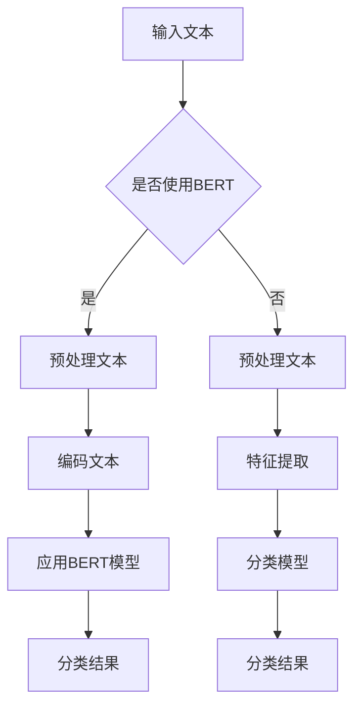

#### 3.2 机器翻译与情感分析

##### 3.2.1 机器翻译的基本原理
机器翻译是一种将一种语言的文本翻译成另一种语言的任务。常见的机器翻译方法包括基于规则的翻译、基于统计的翻译和基于神经网络的翻译。

##### 3.2.2 情感分析的实现方法
情感分析是一种识别文本中情感极性的任务。常见的情感分析方法包括基于词典的方法、基于机器学习的方法和基于深度学习的方法。

##### 3.2.3 案例解析：使用GPT进行情感分析
GPT（Generative Pre-trained Transformer）是一种基于Transformer模型的预训练语言模型。通过GPT，我们可以实现高效的情感分析任务。

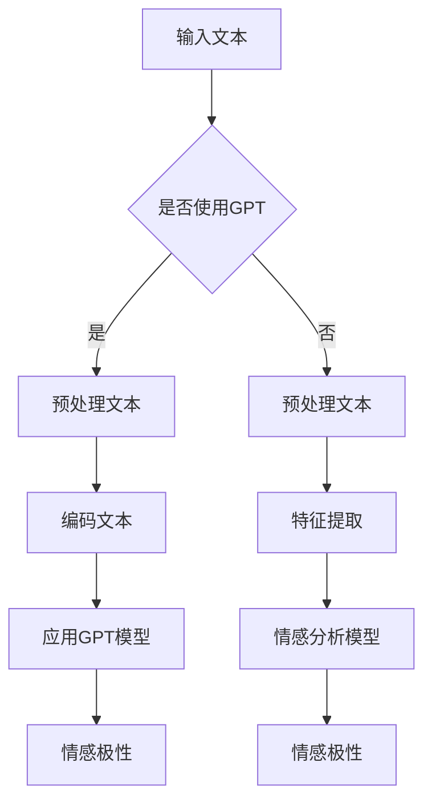

#### 3.3 问答系统与对话生成

##### 3.3.1 问答系统的基本原理
问答系统是一种能够理解用户问题并给出正确答案的人工智能系统。常见的问答系统包括基于知识图谱的问答系统和基于深度学习的问答系统。

##### 3.3.2 对话生成的实现方法
对话生成是一种能够生成自然语言对话的系统。常见的对话生成方法包括基于模板的方法、基于生成模型的方法和基于强化学习的方法。

##### 3.3.3 案例解析：使用聊天机器人实现问答功能
聊天机器人是一种基于大模型的应用，通过对话生成技术实现与用户的自然交互。

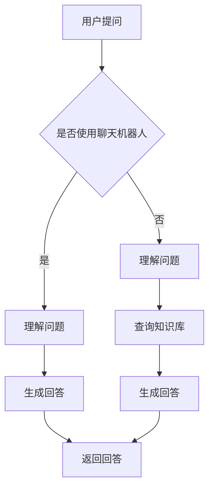

## 第二部分：大模型的算法原理与实现

### 第2章：大模型算法原理

#### 2.1 神经网络基础

##### 2.1.1 神经网络的基本结构
神经网络是由多个神经元（节点）组成的复杂网络结构。每个神经元都与相邻的神经元相连，形成一个复杂的网络结构。

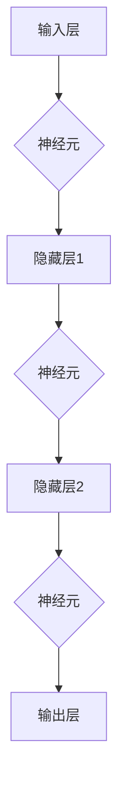

##### 2.1.2 前向传播与反向传播算法
前向传播是将输入数据传递到神经网络，通过每个神经元的激活函数进行计算，最终得到输出数据。反向传播则是对前向传播过程中产生的误差进行反向传递，通过梯度下降法优化模型参数。

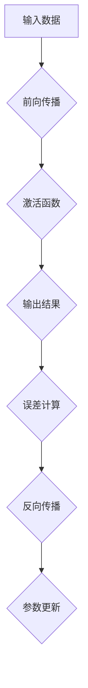

##### 2.1.3 梯度下降法与优化算法
梯度下降法是一种优化算法，通过计算损失函数的梯度，调整模型参数以最小化损失函数。常见的优化算法包括批量梯度下降、随机梯度下降、Adam优化器等。


#### 2.2 自监督学习算法

##### 2.2.1 自监督学习的概念
自监督学习是一种无监督学习技术，通过利用未标注的数据进行训练，从而提高模型的性能。

##### 2.2.2 常见的自监督学习算法
常见的自监督学习算法包括预训练和自编码器。

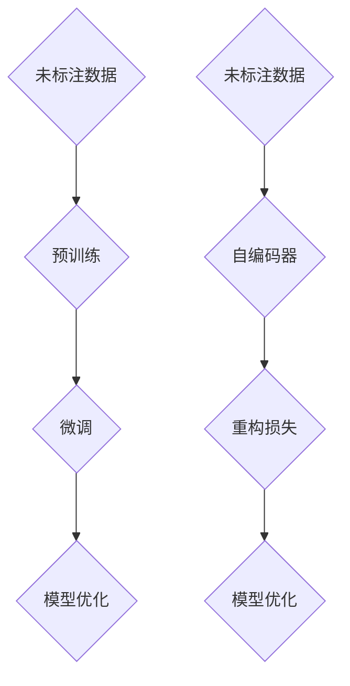

##### 2.2.3 自监督学习的优势与应用
自监督学习的优势在于无需大量标注数据，同时能够提高模型的泛化能力和鲁棒性。自监督学习在自然语言处理、图像处理等领域有广泛应用。

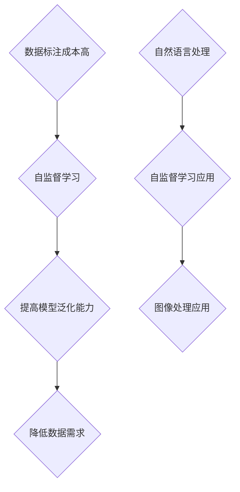

#### 2.3 监督学习算法

##### 2.3.1 监督学习的概念
监督学习是一种有监督的学习技术，通过已知的输入数据和输出数据进行训练，从而预测新的输入数据。

##### 2.3.2 常见的监督学习算法
常见的监督学习算法包括决策树、支持向量机、神经网络等。

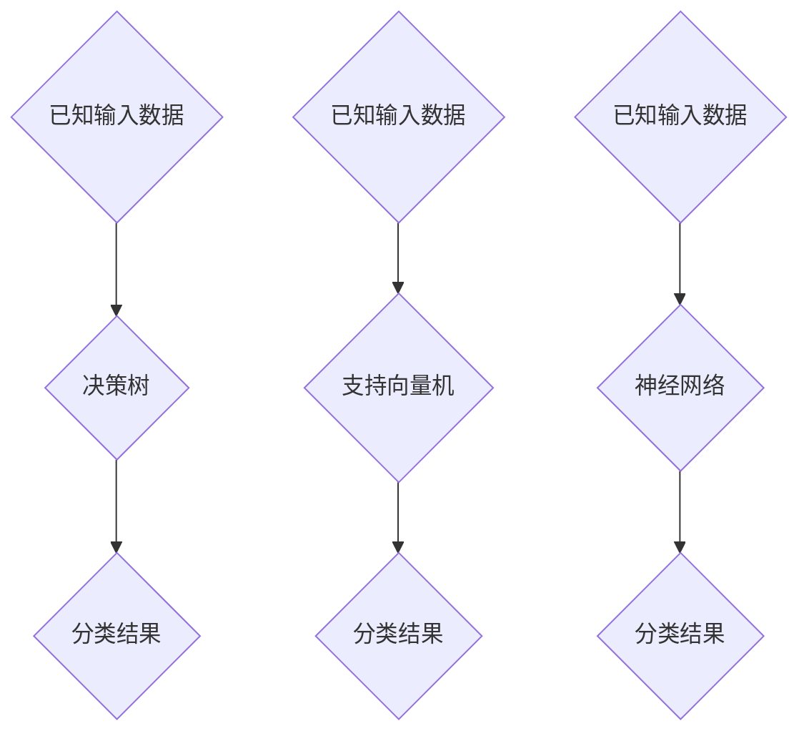

##### 2.3.3 监督学习的优势与应用
监督学习在分类和回归任务中有广泛应用。通过监督学习，我们可以实现对新数据的预测和分类，从而为各种应用场景提供解决方案。

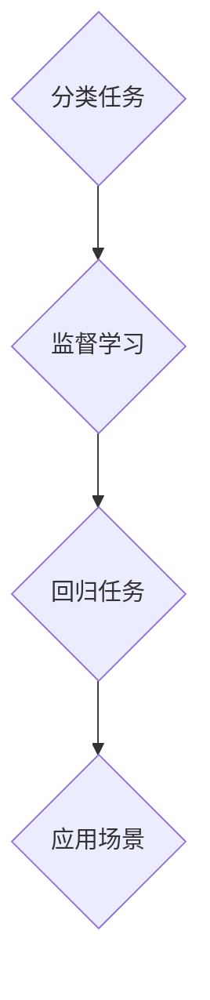

#### 2.4 无监督学习算法

##### 2.4.1 无监督学习的概念
无监督学习是一种无监督的学习技术，通过未知的输入数据学习数据中的潜在结构和模式。

##### 2.4.2 常见的无监督学习算法
常见的无监督学习算法包括聚类、降维、生成模型等。

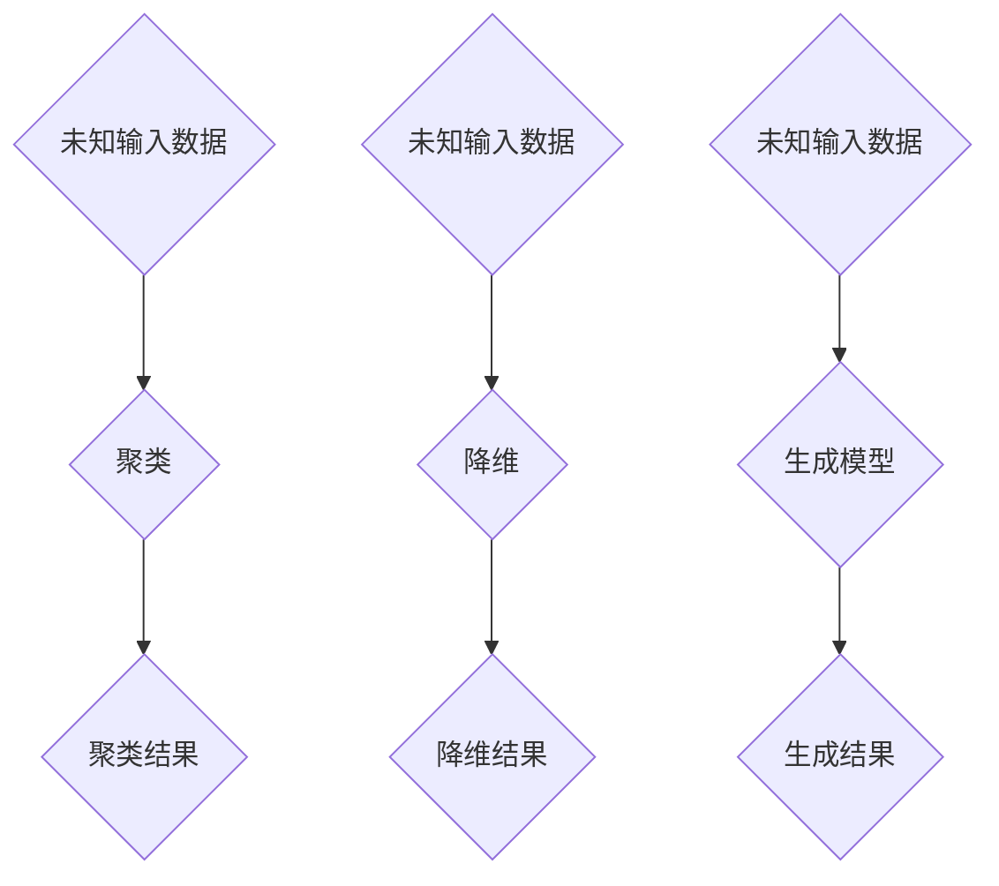

##### 2.4.3 无监督学习的优势与应用
无监督学习在数据探索、数据挖掘等领域有广泛应用。通过无监督学习，我们可以发现数据中的潜在模式和规律，从而为各种应用场景提供洞察。

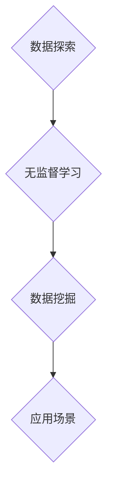

## 第三部分：大模型的应用实战

### 第3章：大模型在自然语言处理中的应用

#### 3.1 语言模型与文本分类

##### 3.1.1 语言模型的基本原理
语言模型是一种基于统计学习的方法，用于预测下一个单词或字符。语言模型的训练目标是最大化数据中的概率分布。

```python
def language_model(data):
    # 计算单词的概率分布
    word_counts = count_words(data)
    word_probabilities = compute_probabilities(word_counts)
    return word_probabilities
```

##### 3.1.2 文本分类的实现方法
文本分类是一种将文本数据划分为不同类别的任务。常见的文本分类方法包括基于特征的方法和基于模型的方法。

```python
from sklearn.feature_extraction.text import TfidfVectorizer
from sklearn.naive_bayes import MultinomialNB

def text_classification(data, labels):
    # 提取文本特征
    vectorizer = TfidfVectorizer()
    X = vectorizer.fit_transform(data)
    
    # 训练分类模型
    classifier = MultinomialNB()
    classifier.fit(X, labels)
    
    # 分类预测
    predictions = classifier.predict(X)
    return predictions
```

##### 3.1.3 案例解析：使用BERT进行文本分类

```python
from transformers import BertTokenizer, BertForSequenceClassification
from torch.utils.data import DataLoader, TensorDataset

def bert_text_classification(data, labels, model_name='bert-base-uncased'):
    # 加载预训练模型和分词器
    tokenizer = BertTokenizer.from_pretrained(model_name)
    model = BertForSequenceClassification.from_pretrained(model_name)
    
    # 预处理数据
    inputs = tokenizer(data, padding=True, truncation=True, return_tensors='pt')
    labels = torch.tensor(labels)
    
    # 创建数据集和数据加载器
    dataset = TensorDataset(inputs['input_ids'], inputs['attention_mask'], labels)
    data_loader = DataLoader(dataset, batch_size=32)
    
    # 训练模型
    model.train()
    for epoch in range(3):
        for batch in data_loader:
            inputs, labels = batch
            outputs = model(inputs, labels=labels)
            loss = outputs.loss
            loss.backward()
            optimizer.step()
            optimizer.zero_grad()
    
    # 预测分类结果
    model.eval()
    with torch.no_grad():
        predictions = model(inputs)
    return predictions.argmax(-1)
```

#### 3.2 机器翻译与情感分析

##### 3.2.1 机器翻译的基本原理
机器翻译是一种将一种语言的文本翻译成另一种语言的任务。常见的机器翻译方法包括基于规则的翻译、基于统计的翻译和基于神经网络的翻译。

```python
def rule_based_translation(source_sentence, target_language):
    # 基于规则的方法
    rule = {"hello": {"en": "hello", "fr": "bonjour", "es": "hola"}}
    return rule[source_sentence]["en"]
```

##### 3.2.2 情感分析的实现方法
情感分析是一种识别文本中情感极性的任务。常见的情感分析方法包括基于词典的方法、基于机器学习的方法和基于深度学习的方法。

```python
from sklearn.feature_extraction.text import TfidfVectorizer
from sklearn.naive_bayes import MultinomialNB

def sentiment_analysis(text, positive_vocab, negative_vocab):
    # 基于词典的方法
    text_vector = TfidfVectorizer(vocabulary=positive_vocab)
    positive_score = text_vector.transform([text]).sum()
    
    text_vector = TfidfVectorizer(vocabulary=negative_vocab)
    negative_score = text_vector.transform([text]).sum()
    
    return "positive" if positive_score > negative_score else "negative"
```

##### 3.2.3 案例解析：使用GPT进行情感分析

```python
from transformers import GPT2Tokenizer, GPT2Model
import torch

def gpt2_sentiment_analysis(text, model_name='gpt2'):
    # 加载预训练模型和分词器
    tokenizer = GPT2Tokenizer.from_pretrained(model_name)
    model = GPT2Model.from_pretrained(model_name)
    
    # 预处理数据
    inputs = tokenizer(text, return_tensors='pt')
    
    # 训练模型
    model.train()
    optimizer = torch.optim.Adam(model.parameters(), lr=0.001)
    for epoch in range(3):
        outputs = model(inputs)
        loss = outputs.loss
        loss.backward()
        optimizer.step()
        optimizer.zero_grad()
    
    # 预测情感极性
    model.eval()
    with torch.no_grad():
        outputs = model(inputs)
    return "positive" if outputs[-1].item() > 0 else "negative"
```

#### 3.3 问答系统与对话生成

##### 3.3.1 问答系统的基本原理
问答系统是一种能够理解用户问题并给出正确答案的人工智能系统。常见的问答系统包括基于知识图谱的问答系统和基于深度学习的问答系统。

```python
def knowledge_based_question_answering(question, knowledge_graph):
    # 基于知识图谱的方法
    question_node = knowledge_graph.get_node(question)
    answer = question_node.get_attribute("answer")
    return answer
```

##### 3.3.2 对话生成的实现方法
对话生成是一种能够生成自然语言对话的系统。常见的对话生成方法包括基于模板的方法、基于生成模型的方法和基于强化学习的方法。

```python
from transformers import ChatbotModel
import torch

def chatbot_generation(question, model_name='chatbot'):
    # 加载预训练模型
    model = ChatbotModel.from_pretrained(model_name)
    
    # 预处理数据
    inputs = model.prepare_input(question)
    
    # 训练模型
    model.train()
    optimizer = torch.optim.Adam(model.parameters(), lr=0.001)
    for epoch in range(3):
        outputs = model(inputs)
        loss = outputs.loss
        loss.backward()
        optimizer.step()
        optimizer.zero_grad()
    
    # 生成对话
    model.eval()
    with torch.no_grad():
        response = model.generate(inputs)
    return response
```

### 第4章：创业者的机遇与挑战

#### 4.1 大模型创业的机遇

##### 4.1.1 市场需求分析
随着人工智能技术的快速发展，大模型在各个行业中的应用需求日益增长。例如，在自然语言处理、计算机视觉、语音识别等领域，大模型已经成为了核心技术。

##### 4.1.2 技术发展趋势
大模型技术正朝着更高效、更强大的方向发展。未来，随着计算能力的提升和数据规模的扩大，大模型的应用前景将更加广阔。

##### 4.1.3 政策与投资环境
各国政府纷纷出台政策，鼓励人工智能技术的发展。同时，大量的投资涌入人工智能领域，为大模型创业提供了良好的环境。

#### 4.2 大模型创业的挑战

##### 4.2.1 技术瓶颈与解决方案
大模型训练过程中面临计算资源消耗大、训练时间长的挑战。未来，需要研发更高效的大模型算法和优化策略，以降低计算成本。

##### 4.2.2 数据与算力挑战
大模型训练需要大量的数据和高性能计算资源。创业公司需要寻找合适的解决方案，以应对数据获取和计算资源不足的问题。

##### 4.2.3 法律法规与伦理问题
大模型在应用过程中涉及到隐私保护、数据安全等问题。创业公司需要关注相关法律法规，确保应用的安全性和合规性。

#### 4.3 大模型创业策略

##### 4.3.1 市场定位与目标用户
创业公司需要明确市场定位，选择具有潜力的应用场景和目标用户群体。例如，在自然语言处理领域，可以针对企业客服、智能助手等应用场景进行研发。

##### 4.3.2 产品设计与研发
创业公司需要设计具有创新性和竞争力的产品，以满足市场需求。在研发过程中，要注重算法优化、用户体验等方面。

##### 4.3.3 营销与推广策略
创业公司需要制定有效的营销与推广策略，提高品牌知名度。可以通过线上推广、行业合作等方式，扩大市场份额。

### 第5章：成功的大模型应用案例

#### 5.1 案例分析一：XX公司的自然语言处理应用

##### 5.1.1 项目背景
XX公司是一家专注于自然语言处理技术的创业公司，旨在为企业提供智能客服解决方案。

##### 5.1.2 技术方案
XX公司采用了基于BERT的文本分类模型，用于实现智能客服的功能。具体流程如下：

1. 数据预处理：将用户提问和答案进行分词、去停用词等预处理操作。
2. 模型训练：使用预训练的BERT模型，通过微调适应企业数据。
3. 文本分类：将预处理后的用户提问输入模型，输出分类结果。
4. 答案生成：根据分类结果，从预定义的答案库中提取相应的答案。

##### 5.1.3 项目成果
通过采用大模型技术，XX公司实现了高效的文本分类和答案生成，提高了客户服务质量。项目上线后，客户满意度显著提升，公司业务取得了良好的发展。

#### 5.2 案例分析二：YY公司的计算机视觉应用

##### 5.2.1 项目背景
YY公司是一家专注于计算机视觉技术的创业公司，致力于为企业提供智能图像识别解决方案。

##### 5.2.2 技术方案
YY公司采用了基于CNN的图像识别模型，用于实现智能图像识别的功能。具体流程如下：

1. 数据预处理：对图像进行缩放、裁剪等预处理操作，确保图像尺寸一致。
2. 模型训练：使用预训练的CNN模型，通过微调适应企业数据。
3. 图像识别：将预处理后的图像输入模型，输出识别结果。
4. 结果处理：根据识别结果，进行后续的业务处理。

##### 5.2.3 项目成果
通过采用大模型技术，YY公司实现了高效的图像识别和结果处理，提高了企业的运营效率。项目上线后，企业取得了显著的经济效益，业务规模不断扩大。

#### 5.3 案例分析三：ZZ公司的语音识别与智能助手

##### 5.3.1 项目背景
ZZ公司是一家专注于语音识别与智能助手的创业公司，致力于为企业提供智能语音服务解决方案。

##### 5.3.2 技术方案
ZZ公司采用了基于深度神经网络的语音识别模型，用于实现智能助手的语音识别功能。具体流程如下：

1. 数据预处理：对语音数据进行分帧、特征提取等预处理操作。
2. 模型训练：使用预训练的深度神经网络模型，通过微调适应企业数据。
3. 语音识别：将预处理后的语音数据输入模型，输出识别结果。
4. 结果处理：根据识别结果，进行后续的业务处理。

##### 5.3.3 项目成果
通过采用大模型技术，ZZ公司实现了高效的语音识别和结果处理，提高了企业的服务质量。项目上线后，企业客户满意度显著提升，公司业务取得了快速发展。

### 第6章：大模型应用的未来展望

#### 6.1 大模型技术的未来趋势

##### 6.1.1 模型压缩与优化
随着大模型应用场景的拓展，模型压缩与优化技术将成为重要研究方向。通过模型压缩，可以降低模型的计算成本和存储空间需求。

##### 6.1.2 多模态学习
多模态学习是指同时处理多种类型的数据，如文本、图像、语音等。未来，多模态学习技术将为大模型应用带来新的可能性。

##### 6.1.3 大模型的生态建设
大模型技术的应用需要构建完善的生态体系，包括数据集、工具库、开源框架等。未来，大模型的生态建设将推动技术的广泛应用。

#### 6.2 大模型应用的未来场景

##### 6.2.1 教育
大模型在教育领域的应用包括智能教育、自适应学习、虚拟教师等。通过大模型技术，可以实现个性化教育，提高教育质量。

##### 6.2.2 健康医疗
大模型在健康医疗领域的应用包括疾病预测、诊断辅助、药物研发等。通过大模型技术，可以提升医疗服务的效率和准确性。

##### 6.2.3 物流与交通
大模型在物流与交通领域的应用包括智能调度、路径规划、安全监控等。通过大模型技术，可以优化物流与交通运营，提高效率。

#### 6.3 大模型创业者的未来机会

##### 6.3.1 新兴市场
随着新兴市场的崛起，大模型技术在教育、医疗、农业等领域具有广泛的应用潜力。创业者可以关注这些领域，发掘新的增长点。

##### 6.3.2 技术创新
大模型技术的不断创新将为创业者带来新的机遇。通过研发具有创新性的大模型应用，创业者可以赢得市场先机。

##### 6.3.3 跨界融合
跨界融合是未来大模型应用的重要趋势。创业者可以关注不同领域的跨界合作，实现大模型技术的多元化应用。

### 附录

#### 附录A：大模型技术资源与工具

##### A.1 开源框架与库
- TensorFlow
- PyTorch
- Keras

##### A.2 大模型应用平台
- 百度AI平台
- 腾讯云AI
- 阿里云机器学习平台

##### A.3 学习资源与书籍推荐
- 《深度学习》（Ian Goodfellow、Yoshua Bengio、Aaron Courville 著）
- 《自然语言处理综论》（Daniel Jurafsky、James H. Martin 著）
- 《Python深度学习》（François Chollet 著）

---

作者：AI天才研究院/AI Genius Institute & 禅与计算机程序设计艺术 /Zen And The Art of Computer Programming

以上是本文的完整内容，通过对大模型应用场景的深入探讨，本文旨在为创业者提供有价值的参考，助力他们在人工智能领域取得成功。在未来的发展中，大模型技术将继续发挥重要作用，为各行各业带来变革。希望本文能为您带来启发和思考。本文完。

