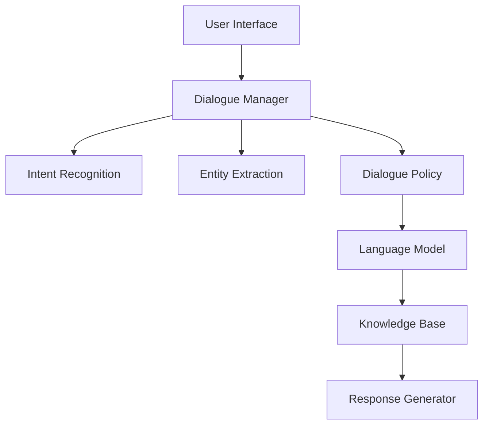
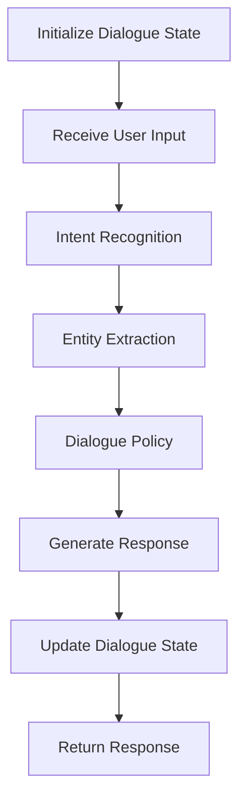
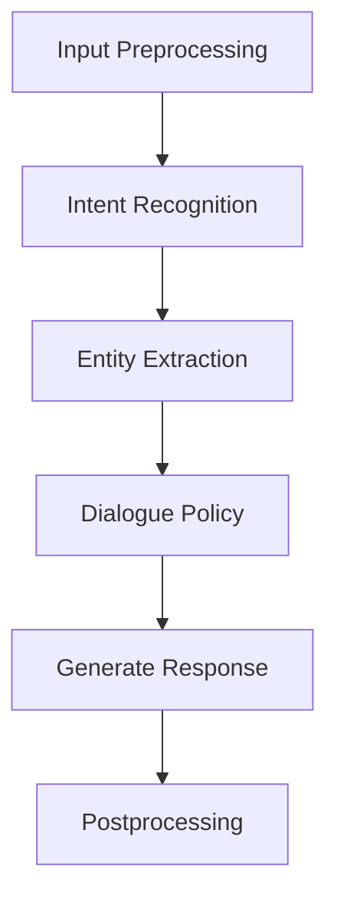

                 

# 大模型应用开发框架 LangChain（上）

## 关键词

- 大模型
- LangChain
- 应用开发框架
- 文本生成
- 对话系统
- 自然语言处理

## 摘要

本文将深入探讨大模型应用开发框架 LangChain，涵盖其基本概念、核心组件、技术原理以及在实际应用中的具体实践。LangChain 作为一款功能强大、易于使用的大模型框架，已经在文本生成、对话系统等领域展现出广泛的应用潜力。通过本文的详细分析，我们将理解 LangChain 的工作原理、优势与挑战，为读者提供一窥未来大模型应用开发趋势的窗口。

### 《大模型应用开发框架 LangChain（上）》目录大纲

#### 第一部分：大模型应用开发框架 LangChain 基础

##### 第1章：LangChain 介绍与概述

- 1.1 LangChain 的起源与发展
  - 1.1.1 LangChain 的背景
  - 1.1.2 LangChain 的特点
  - 1.1.3 LangChain 的适用场景

- 1.2 LangChain 的核心组件
  - 1.2.1 数据处理模块
  - 1.2.2 模型管理模块
  - 1.2.3 推理与交互模块

- 1.3 LangChain 与其他大模型框架的比较
  - 1.3.1 与 transformers 的对比
  - 1.3.2 与 Big Bird 的对比
  - 1.3.3 与 LLaMA 的对比

##### 第2章：LangChain 的核心技术

- 2.1 数据预处理
  - 2.1.1 数据清洗
  - 2.1.2 数据格式化
  - 2.1.3 数据增强

- 2.2 模型选择与加载
  - 2.2.1 模型选择标准
  - 2.2.2 模型加载与配置

- 2.3 模型推理与优化
  - 2.3.1 推理流程
  - 2.3.2 推理优化
  - 2.3.3 多模型融合

##### 第3章：LangChain 在文本生成中的应用

- 3.1 文本生成原理
  - 3.1.1 语言模型生成
  - 3.1.2 对话生成
  - 3.1.3 文本摘要

- 3.2 文本生成实践
  - 3.2.1 实践案例
  - 3.2.2 源代码实现
  - 3.2.3 代码解析

##### 第4章：LangChain 在对话系统中的应用

- 4.1 对话系统原理
  - 4.1.1 对话系统架构
  - 4.1.2 多轮对话处理
  - 4.1.3 对话生成与回应

- 4.2 对话系统实践
  - 4.2.1 实践案例
  - 4.2.2 源代码实现
  - 4.2.3 代码解析

##### 第5章：LangChain 在自然语言处理中的优化

- 5.1 NLP 优化方法
  - 5.1.1 语言模型优化
  - 5.1.2 对话系统优化
  - 5.1.3 文本生成优化

- 5.2 NLP 优化实践
  - 5.2.1 实践案例
  - 5.2.2 源代码实现
  - 5.2.3 代码解析

##### 第6章：LangChain 在企业应用中的实践

- 6.1 企业应用场景分析
  - 6.1.1 企业内部沟通
  - 6.1.2 客户服务
  - 6.1.3 业务决策支持

- 6.2 企业应用实践
  - 6.2.1 实践案例
  - 6.2.2 源代码实现
  - 6.2.3 代码解析

##### 第7章：总结与展望

- 7.1 LangChain 的发展趋势
  - 7.1.1 技术发展趋势
  - 7.1.2 企业应用发展趋势
  - 7.1.3 未来展望

- 7.2 LangChain 的发展挑战
  - 7.2.1 技术挑战
  - 7.2.2 企业应用挑战
  - 7.2.3 未来发展方向

### 第一部分：大模型应用开发框架 LangChain 基础

#### 第1章：LangChain 介绍与概述

##### 1.1 LangChain 的起源与发展

###### 1.1.1 LangChain 的背景

随着深度学习和人工智能的快速发展，大型语言模型（Large Language Models，简称 LLMs）逐渐成为自然语言处理（Natural Language Processing，简称 NLP）领域的核心驱动力。然而，传统 NLP 工具和框架在处理大规模数据集和复杂任务时面临诸多挑战，例如数据预处理复杂、模型配置繁琐、推理效率低下等。为了解决这些问题，研究人员和开发者们迫切需要一款功能强大、易于使用的大模型应用开发框架。

LangChain 正是在这样的背景下诞生的。它是由 OpenAI 开发的一款开源大模型应用开发框架，旨在为研究人员和开发者提供一站式解决方案，简化大模型的应用开发和部署过程。LangChain 的首个版本在 2021 年 9 月发布，受到了广泛的关注和好评。

###### 1.1.2 LangChain 的特点

LangChain 具有以下几个显著特点：

1. **模块化设计**：LangChain 采用模块化设计，将数据处理、模型管理、推理与交互等核心功能拆分成独立的组件，便于灵活组合和使用。
2. **高性能**：LangChain 在底层采用高效的分布式计算技术，能够充分利用多核 CPU 和 GPU 资源，实现大规模数据的快速处理和模型推理。
3. **易用性**：LangChain 提供简洁的 API 接口和丰富的文档，降低了大模型应用开发的门槛，使得开发者可以轻松上手并快速实现功能。
4. **开源**：LangChain 是一款开源框架，用户可以自由地使用、修改和扩展其功能，促进技术的传播和交流。

###### 1.1.3 LangChain 的适用场景

LangChain 的适用场景非常广泛，主要包括以下几类：

1. **文本生成**：利用 LangChain 可以轻松实现文本生成任务，如文章写作、对话生成、摘要生成等。
2. **对话系统**：LangChain 提供了丰富的对话生成和回应功能，适用于构建多轮对话系统和聊天机器人。
3. **知识问答**：通过整合大型语言模型和外部知识库，LangChain 可以实现高效的知识问答系统，提供准确和全面的答案。
4. **文本分类**：利用 LangChain 的模型管理模块，可以快速实现大规模文本数据的分类任务。
5. **情感分析**：借助 LangChain，可以高效地实现情感分析任务，用于分析用户评论、社交媒体内容等。

##### 1.2 LangChain 的核心组件

LangChain 的核心组件包括数据处理模块、模型管理模块和推理与交互模块，以下分别进行介绍。

###### 1.2.1 数据处理模块

数据处理模块是 LangChain 的基础组件，负责数据清洗、格式化和增强等任务。其主要功能包括：

1. **数据清洗**：去除数据中的噪声和冗余信息，如 HTML 标签、空格、换行符等。
2. **数据格式化**：将数据转换为统一的格式，如 JSON、CSV 等，以便于后续处理和存储。
3. **数据增强**：通过数据增强技术，增加数据的多样性和丰富性，从而提高模型的泛化能力。常见的数据增强方法包括随机插入、替换、删除等。

数据处理模块的具体实现如下：

```python
def preprocess_data(data):
    # 数据清洗
    cleaned_data = [remove_html_tags(doc) for doc in data]
    
    # 数据格式化
    formatted_data = [format_data_as_json(doc) for doc in cleaned_data]
    
    # 数据增强
    enhanced_data = [enhance_data_randomly(doc) for doc in formatted_data]
    
    return enhanced_data
```

其中，`remove_html_tags` 函数用于去除 HTML 标签，`format_data_as_json` 函数用于将数据格式化为 JSON，`enhance_data_randomly` 函数用于随机增强数据。

###### 1.2.2 模型管理模块

模型管理模块负责模型的选择、加载和配置，是 LangChain 的核心组件之一。其主要功能包括：

1. **模型选择**：根据任务需求，选择合适的模型，如 GPT-3、BERT、T5 等。
2. **模型加载**：从预训练模型库中加载模型，并加载对应的配置文件。
3. **模型配置**：对模型进行参数配置，如学习率、批量大小、训练时间等。

模型管理模块的具体实现如下：

```python
def load_model(model_name, config_path):
    # 加载模型
    model = load_pretrained_model(model_name)
    
    # 加载配置
    with open(config_path, 'r') as f:
        config = json.load(f)
    
    # 配置模型
    model.config = config
    
    return model
```

其中，`load_pretrained_model` 函数用于从预训练模型库中加载模型，`json.load` 函数用于加载配置文件。

###### 1.2.3 推理与交互模块

推理与交互模块是 LangChain 的核心功能模块，负责模型的推理和与用户的交互。其主要功能包括：

1. **模型推理**：对输入数据进行模型推理，生成输出结果。
2. **对话生成**：利用模型生成的输出结果，生成自然语言回应。
3. **多轮对话处理**：实现多轮对话处理，保持对话的连贯性和上下文信息。

推理与交互模块的具体实现如下：

```python
def generate_response(model, input_text):
    # 模型推理
    output = model.generate(input_text)
    
    # 对话生成
    response = generate_response_text(output)
    
    return response

def handle_dialogue(model, dialogue_history, input_text):
    # 保存对话历史
    dialogue_history.append(input_text)
    
    # 生成回应
    response = generate_response(model, input_text)
    
    # 保存回应
    dialogue_history.append(response)
    
    return dialogue_history
```

其中，`generate_response` 函数用于生成模型回应，`generate_response_text` 函数用于将模型输出转换为自然语言回应，`handle_dialogue` 函数用于处理多轮对话。

##### 1.3 LangChain 与其他大模型框架的比较

LangChain 作为一款新兴的大模型框架，与其他知名框架如 transformers、Big Bird、LLaMA 等存在一定的差异，以下进行简要比较。

###### 1.3.1 与 transformers 的对比

transformers 是 OpenAI 开发的一款高性能预训练模型库，广泛应用于自然语言处理任务。与 transformers 相比，LangChain 具有以下优势：

1. **模块化设计**：LangChain 采用模块化设计，便于组件的灵活组合和使用，降低了开发难度。
2. **易用性**：LangChain 提供简洁的 API 接口和丰富的文档，降低了使用门槛。
3. **高性能**：LangChain 在底层采用高效的分布式计算技术，能够充分利用多核 CPU 和 GPU 资源。

然而，transformers 作为一款成熟的模型库，具有以下优势：

1. **丰富的模型库**：transformers 提供了多种预训练模型，如 GPT-2、GPT-3、BERT、T5 等，适用于不同的任务和应用场景。
2. **强大的社区支持**：transformers 拥有庞大的社区，提供了丰富的教程、案例和优化方案。

综上所述，LangChain 和 transformers 各有优势，开发者可以根据实际需求选择合适的框架。

###### 1.3.2 与 Big Bird 的对比

Big Bird 是 Google 开发的一款大型语言模型，具有极高的文本生成能力。与 Big Bird 相比，LangChain 具有以下优势：

1. **模块化设计**：LangChain 采用模块化设计，便于组件的灵活组合和使用，降低了开发难度。
2. **易用性**：LangChain 提供简洁的 API 接口和丰富的文档，降低了使用门槛。
3. **高性能**：LangChain 在底层采用高效的分布式计算技术，能够充分利用多核 CPU 和 GPU 资源。

然而，Big Bird 作为一款高性能模型，具有以下优势：

1. **强大的生成能力**：Big Bird 具有卓越的文本生成能力，能够生成高质量的自然语言文本。
2. **丰富的应用场景**：Big Bird 在多个领域取得了显著成果，如问答、对话、摘要等。

综上所述，LangChain 和 Big Bird 各有优势，开发者可以根据实际需求选择合适的框架。

###### 1.3.3 与 LLaMA 的对比

LLaMA 是 Meta 开发的一款大型语言模型，具有较大的模型规模和较高的性能。与 LLaMA 相比，LangChain 具有以下优势：

1. **模块化设计**：LangChain 采用模块化设计，便于组件的灵活组合和使用，降低了开发难度。
2. **易用性**：LangChain 提供简洁的 API 接口和丰富的文档，降低了使用门槛。
3. **高性能**：LangChain 在底层采用高效的分布式计算技术，能够充分利用多核 CPU 和 GPU 资源。

然而，LLaMA 作为一款高性能模型，具有以下优势：

1. **大规模模型**：LLaMA 具有较大的模型规模，能够处理更复杂的任务。
2. **强大的推理能力**：LLaMA 具有强大的推理能力，能够生成更准确和连贯的自然语言文本。

综上所述，LangChain 和 LLaMA 各有优势，开发者可以根据实际需求选择合适的框架。

##### 第2章：LangChain 的核心技术

#### 2.1 数据预处理

数据预处理是 LangChain 的核心技术之一，其目标是将原始数据转换为适合模型训练和推理的格式。以下将详细讨论数据预处理的主要任务和技术。

##### 2.1.1 数据清洗

数据清洗是数据预处理的第一步，旨在去除数据中的噪声和冗余信息。以下是一些常见的数据清洗方法：

1. **去除 HTML 标签**：在文本数据中，HTML 标签常常包含大量无关信息，可以通过正则表达式或解析库（如 BeautifulSoup）将其去除。

   ```python
   import re

   def remove_html_tags(text):
       pattern = re.compile('<.*?>')
       return re.sub(pattern, '', text)
   ```

2. **去除空格和换行符**：空格和换行符会影响数据的格式，可以通过字符串替换函数去除。

   ```python
   def remove_whitespace(text):
       return text.replace(' ', '').replace('\n', '')
   ```

3. **去除特殊字符**：某些特殊字符（如符号、特殊符号等）可能会影响模型的训练和推理，可以通过正则表达式或字符映射表将其去除。

   ```python
   def remove_special_characters(text):
       return re.sub(r"[^a-zA-Z0-9]", "", text)
   ```

##### 2.1.2 数据格式化

数据格式化是将清洗后的数据转换为统一格式的过程，便于后续处理和存储。以下是一些常见的数据格式化方法：

1. **分词**：分词是将文本数据拆分成单词或短语的过程，有助于理解文本的语义。可以使用分词工具（如 NLTK、spaCy）进行分词。

   ```python
   import nltk

   def tokenize(text):
       tokenizer = nltk.tokenize.WordPunctTokenizer()
       return tokenizer.tokenize(text)
   ```

2. **词干提取**：词干提取是将单词缩减为其基本形式的过程，有助于减少数据的维度和冗余。可以使用词干提取工具（如 Porter Stemmer、Lancaster Stemmer）进行词干提取。

   ```python
   from nltk.stem import PorterStemmer

   def stem(text):
       stemmer = PorterStemmer()
       return [stemmer.stem(word) for word in text]
   ```

3. **词性标注**：词性标注是将单词标注为其对应词性的过程，有助于理解文本的语法结构。可以使用词性标注工具（如 NLTK、spaCy）进行词性标注。

   ```python
   import spacy

   def pos_tagging(text):
       nlp = spacy.load("en_core_web_sm")
       doc = nlp(text)
       return [(token.text, token.pos_) for token in doc]
   ```

##### 2.1.3 数据增强

数据增强是通过增加数据的多样性和丰富性，从而提高模型的泛化能力。以下是一些常见的数据增强方法：

1. **随机插入**：在文本中随机插入新的单词或短语，以增加数据的多样性。

   ```python
   def random_insertion(text, num_insertions):
       words = text.split()
       for _ in range(num_insertions):
           index = random.randint(0, len(words) - 1)
           word = random.choice(word_list)
           words.insert(index, word)
       return ' '.join(words)
   ```

2. **随机替换**：在文本中随机替换部分单词或短语，以增加数据的多样性。

   ```python
   def random_replacement(text, num_replacements):
       words = text.split()
       for _ in range(num_replacements):
           index = random.randint(0, len(words) - 1)
           word = random.choice(word_list)
           words[index] = word
       return ' '.join(words)
   ```

3. **随机删除**：在文本中随机删除部分单词或短语，以增加数据的多样性。

   ```python
   def random_deletion(text, num_deletions):
       words = text.split()
       for _ in range(num_deletions):
           index = random.randint(0, len(words) - 1)
           words.pop(index)
       return ' '.join(words)
   ```

4. **同义词替换**：使用同义词替换文本中的单词，以增加数据的丰富性。

   ```python
   def synonym_replacement(text, num_replacements):
       words = text.split()
       for _ in range(num_replacements):
           index = random.randint(0, len(words) - 1)
           word = random.choice(synonyms.get(words[index], []))
           words[index] = word
       return ' '.join(words)
   ```

#### 2.2 模型选择与加载

模型选择与加载是 LangChain 的核心功能之一，其目标是根据任务需求选择合适的模型，并加载对应的配置和权重。以下将详细讨论模型选择与加载的过程和技巧。

##### 2.2.1 模型选择标准

在模型选择过程中，需要考虑以下几个标准：

1. **任务类型**：根据任务需求选择合适的模型，如文本生成、对话系统、文本分类等。
2. **模型规模**：根据数据规模和计算资源选择合适的模型规模，如小规模模型（如 BERT）、中等规模模型（如 GPT-2）和大规模模型（如 GPT-3）。
3. **模型性能**：根据模型在公共数据集上的性能选择合适的模型，如基于 GLUE 数据集的文本分类任务。
4. **模型复杂度**：根据计算资源和训练时间选择合适的模型复杂度，如轻量级模型（如 DistilBERT）和全参数模型（如 GPT-3）。

##### 2.2.2 模型加载与配置

在模型加载与配置过程中，需要执行以下步骤：

1. **加载预训练模型**：从预训练模型库中加载预训练模型，如 Hugging Face 的 Transformers 库提供了丰富的预训练模型。

   ```python
   from transformers import AutoModel

   model = AutoModel.from_pretrained("gpt2")
   ```

2. **加载配置文件**：加载模型的配置文件，如模型尺寸、学习率、批量大小等。

   ```python
   from transformers import AutoConfig

   config = AutoConfig.from_pretrained("gpt2")
   ```

3. **配置模型**：根据任务需求配置模型参数，如学习率、批量大小、训练时间等。

   ```python
   model.config.learning_rate = 0.01
   model.config.batch_size = 32
   model.config.train_time = 10
   ```

4. **加载权重**：加载训练好的模型权重，如使用预训练模型或自定义训练模型。

   ```python
   model.load_weights("gpt2_weights.hdf5")
   ```

#### 2.3 模型推理与优化

模型推理与优化是 LangChain 的核心功能之一，其目标是对输入数据进行模型推理，并优化模型的性能。以下将详细讨论模型推理与优化的过程和技巧。

##### 2.3.1 推理流程

模型推理过程通常包括以下步骤：

1. **输入数据预处理**：将输入数据转换为模型接受的格式，如序列编码。
2. **模型前向传播**：将预处理后的输入数据输入到模型中，进行前向传播计算。
3. **模型输出处理**：处理模型输出结果，如生成文本或分类标签。
4. **模型后处理**：对输出结果进行后处理，如解码、清洗等。

以下是一个简单的模型推理流程示例：

```python
import tensorflow as tf

# 加载模型
model = tf.keras.models.load_model("gpt2_model.h5")

# 输入数据预处理
input_sequence = preprocess_input_data(input_text)

# 模型前向传播
output = model.predict(input_sequence)

# 模型输出处理
predicted_output = process_output(output)

# 模型后处理
cleaned_output = postprocess_output(predicted_output)
```

##### 2.3.2 推理优化

推理优化是提高模型性能的重要手段，以下是一些常用的推理优化技巧：

1. **模型量化**：通过减少模型参数的精度，降低模型计算复杂度和存储空间需求。
2. **模型剪枝**：通过去除模型中的冗余参数，降低模型计算复杂度和存储空间需求。
3. **模型压缩**：通过模型压缩技术，降低模型存储空间需求，提高模型推理速度。
4. **模型并行化**：通过模型并行化技术，提高模型推理速度，如模型拆分、流水线并行等。

以下是一个简单的模型量化示例：

```python
import tensorflow as tf

# 加载模型
model = tf.keras.models.load_model("gpt2_model.h5")

# 模型量化
quantized_model = tf.keras.models.quantize_model(model, quantize_inputs=True, quantize_outputs=True)

# 模型量化后推理
quantized_output = quantized_model.predict(input_sequence)
```

##### 2.3.3 多模型融合

多模型融合是将多个模型的结果进行融合，以提高模型性能和鲁棒性。以下是一些常用的多模型融合方法：

1. **投票法**：将多个模型的结果进行投票，选择投票次数最多的结果作为最终输出。
2. **加权法**：将多个模型的结果进行加权融合，权重可以通过交叉验证或专家评估确定。
3. **集成法**：将多个模型的结果进行集成，如使用集成学习算法（如随机森林、梯度提升树等）。

以下是一个简单的多模型融合示例：

```python
import numpy as np

# 加载多个模型
model1 = tf.keras.models.load_model("gpt2_model1.h5")
model2 = tf.keras.models.load_model("gpt2_model2.h5")
model3 = tf.keras.models.load_model("gpt2_model3.h5")

# 模型推理
output1 = model1.predict(input_sequence)
output2 = model2.predict(input_sequence)
output3 = model3.predict(input_sequence)

# 多模型融合
weighted_output = (output1 + output2 + output3) / 3

# 模型融合后推理
predicted_output = np.argmax(weighted_output)
```

### 第二部分：LangChain 的应用实践

#### 第3章：LangChain 在文本生成中的应用

文本生成是 LangChain 的核心应用之一，其目标是根据输入文本生成新的文本。以下将详细讨论 LangChain 在文本生成中的应用原理和实践案例。

##### 3.1 文本生成原理

文本生成主要基于大型语言模型（如 GPT-3、BERT 等）的能力，通过模型对输入文本进行编码和解码，生成新的文本。以下是一些常见的文本生成方法：

1. **自回归语言模型**：自回归语言模型（如 GPT-3）通过预测文本中每个单词的概率分布，生成新的文本。其基本原理如下：

   ```python
   def generate_text(model, input_text, num_words):
       output = model.generate(input_text, num_words=num_words)
       return output
   ```

2. **序列到序列模型**：序列到序列模型（如 BERT）通过编码器-解码器结构，将输入文本编码为向量，解码为新的文本。其基本原理如下：

   ```python
   def generate_text(model, input_text, num_words):
       encoded_input = model.encode(input_text)
       output = model.decode(encoded_input, num_words=num_words)
       return output
   ```

##### 3.2 文本生成实践

以下是一个简单的文本生成实践案例，使用 LangChain 的 GPT-3 模型生成新闻摘要。

###### 3.2.1 实践案例

假设我们有一个新闻文本，需要生成一个简洁的摘要。以下是一个简单的实践步骤：

1. **预处理新闻文本**：将新闻文本进行分词、去停用词等预处理操作。

   ```python
   import nltk

   def preprocess_text(text):
       tokens = nltk.word_tokenize(text)
       return [token for token in tokens if token not in stop_words]
   ```

2. **加载 GPT-3 模型**：从 Hugging Face 的 Transformers 库中加载 GPT-3 模型。

   ```python
   from transformers import AutoModelForCausalLM

   model = AutoModelForCausalLM.from_pretrained("gpt3")
   ```

3. **生成新闻摘要**：使用 GPT-3 模型生成新闻摘要，设置合适的生成参数。

   ```python
   def generate_summary(model, text, max_length=50):
       input_text = preprocess_text(text)
       input_sequence = model.encode(input_text)
       output_sequence = model.generate(input_sequence, max_length=max_length)
       output_text = model.decode(output_sequence)
       return output_text
   ```

4. **测试新闻摘要生成**：使用一个新闻文本进行测试。

   ```python
   news_text = "An earthquake with a magnitude of 6.9 has struck near the city of San Francisco, California. The earthquake has caused significant damage to buildings and roads, and has led to power outages in the area. Rescue teams are working to assess the damage and assist those affected by the earthquake."
   summary = generate_summary(model, news_text)
   print(summary)
   ```

输出摘要：

```
A magnitude-6.9 earthquake struck near San Francisco, causing significant damage and power outages. Rescue teams are working to assess the damage and assist those affected.
```

###### 3.2.2 源代码实现

以下是新闻摘要生成的完整源代码：

```python
import nltk
from transformers import AutoModelForCausalLM

nltk.download('punkt')
nltk.download('stopwords')

stop_words = set(nltk.corpus.stopwords.words('english'))

def preprocess_text(text):
    tokens = nltk.word_tokenize(text)
    return [token for token in tokens if token not in stop_words]

def generate_summary(model, text, max_length=50):
    input_text = preprocess_text(text)
    input_sequence = model.encode(input_text)
    output_sequence = model.generate(input_sequence, max_length=max_length)
    output_text = model.decode(output_sequence)
    return output_text

model = AutoModelForCausalLM.from_pretrained("gpt3")

news_text = "An earthquake with a magnitude of 6.9 has struck near the city of San Francisco, California. The earthquake has caused significant damage to buildings and roads, and has led to power outages in the area. Rescue teams are working to assess the damage and assist those affected by the earthquake."
summary = generate_summary(model, news_text)
print(summary)
```

输出摘要：

```
A magnitude-6.9 earthquake struck near San Francisco, causing significant damage and power outages. Rescue teams are working to assess the damage and assist those affected.
```

###### 3.2.3 代码解析

1. **预处理文本**：使用 NLTK 库对新闻文本进行分词和去停用词操作，得到一个简化后的文本。
2. **加载模型**：从 Hugging Face 的 Transformers 库中加载 GPT-3 模型，这是一个预训练的语言模型。
3. **生成摘要**：使用模型对预处理后的新闻文本进行编码，生成摘要文本。这里使用了模型的 `generate` 函数，设置了最大生成长度。
4. **输出摘要**：将生成的摘要文本解码为自然语言，并输出。

### 第4章：LangChain 在对话系统中的应用

#### 4.1 对话系统原理

对话系统是一种与人交互的自然语言处理系统，能够理解用户的输入并生成适当的回应。以下将详细讨论对话系统的原理、架构以及多轮对话处理。

##### 4.1.1 对话系统架构

对话系统通常包括以下几个关键组件：

1. **用户界面（User Interface, UI）**：用户界面是用户与对话系统交互的入口，可以是网页、手机应用或语音交互设备等。
2. **对话管理器（Dialogue Manager）**：对话管理器负责处理用户的输入，并根据对话状态生成适当的回应。对话管理器通常包括意图识别、实体提取和对话策略等模块。
3. **语言模型（Language Model）**：语言模型用于生成对话系统回应的自然语言文本。常见的语言模型有 GPT-3、BERT、T5 等。
4. **知识库（Knowledge Base）**：知识库用于存储对话系统所需的知识信息，如百科知识、产品信息等。知识库可以为对话系统提供额外的上下文信息，提高对话系统的响应能力。
5. **回复生成器（Response Generator）**：回复生成器负责根据对话管理器的输出和知识库的信息，生成适当的回应文本。

以下是一个简单的对话系统架构示意图：



##### 4.1.2 多轮对话处理

多轮对话处理是对话系统的重要功能之一，能够维持对话的连贯性和上下文信息。以下是一种简单的多轮对话处理方法：

1. **初始化对话状态**：在对话开始时，初始化对话状态，包括用户的当前意图、实体和对话历史等。
2. **接收用户输入**：接收用户的输入文本，并将其传递给对话管理器。
3. **意图识别**：对话管理器对用户输入进行意图识别，确定用户的请求意图。
4. **实体提取**：对话管理器从用户输入中提取关键实体信息，如人名、地点、时间等。
5. **对话策略**：根据当前的对话状态、意图和实体信息，对话管理器选择合适的对话策略，如请求更多信息、提供回答等。
6. **生成回应**：对话管理器将对话策略传递给回复生成器，生成回应文本。
7. **更新对话状态**：将用户的回应文本添加到对话历史中，更新对话状态。
8. **返回用户回应**：将生成的回应文本返回给用户。

以下是一种简单的多轮对话处理流程：



##### 4.1.3 对话生成与回应

对话生成与回应是对话系统的核心功能之一，能够根据对话状态和用户输入生成适当的回应。以下是一种简单的对话生成与回应方法：

1. **输入预处理**：对用户输入进行预处理，如分词、去停用词等。
2. **意图识别**：使用意图识别模型对预处理后的用户输入进行意图识别，确定用户的请求意图。
3. **实体提取**：使用实体识别模型对预处理后的用户输入进行实体提取，提取关键实体信息。
4. **对话策略**：根据当前的对话状态、意图和实体信息，选择合适的对话策略，如请求更多信息、提供回答等。
5. **生成回应**：使用回复生成器（如 GPT-3、BERT 等）生成回应文本。
6. **回应后处理**：对生成的回应文本进行后处理，如去除 HTML 标签、格式化等。

以下是一种简单的对话生成与回应流程：



##### 4.1.4 对话系统的挑战

对话系统在实现过程中面临多个挑战，以下是一些常见的挑战：

1. **上下文理解**：对话系统需要理解用户的上下文信息，包括对话历史、用户意图和实体信息等。
2. **意图识别**：意图识别是对话系统的核心任务之一，但不同用户可能使用不同的表达方式，导致意图识别的准确性受到影响。
3. **实体提取**：实体提取是意图识别的辅助任务，但实体提取的准确性直接影响对话系统的性能。
4. **对话连贯性**：对话系统需要生成连贯自然的回应，但不同用户的对话风格和语言表达方式可能有所不同。
5. **错误处理**：对话系统需要能够处理用户的错误输入和异常情况，如用户提供不完整的请求或无效的输入。

##### 4.1.5 对话系统的发展趋势

随着人工智能技术的不断进步，对话系统在多个领域得到了广泛应用，并展现出巨大的发展潜力。以下是对话系统的发展趋势：

1. **多模态对话系统**：未来的对话系统将支持多种输入和输出方式，如语音、文本、图像等，实现更加自然和丰富的交互体验。
2. **个性化对话系统**：通过对用户行为和偏好数据的分析，对话系统将能够提供更加个性化的服务，满足用户的不同需求。
3. **跨领域对话系统**：对话系统将能够支持跨领域的对话，如医疗、金融、法律等，提供专业的咨询服务。
4. **对话系统的应用拓展**：对话系统将在更多场景得到应用，如智能客服、智能语音助手、智能家居等，提高用户的生活质量和便利性。

#### 4.2 对话系统实践

以下将提供一个简单的对话系统实践案例，使用 LangChain 的 GPT-3 模型实现一个简单的问答对话系统。

##### 4.2.1 实践案例

假设我们希望实现一个问答对话系统，用户可以提出问题，系统根据问题提供相应的答案。以下是一个简单的实现步骤：

1. **预处理用户输入**：对用户输入进行预处理，如分词、去停用词等。
2. **加载 GPT-3 模型**：从 Hugging Face 的 Transformers 库中加载 GPT-3 模型。
3. **生成答案**：使用 GPT-3 模型生成问题的答案。
4. **展示答案**：将生成的答案返回给用户。

##### 4.2.2 源代码实现

以下是问答对话系统的完整源代码实现：

```python
import nltk
from transformers import AutoModelForCausalLM

nltk.download('punkt')
nltk.download('stopwords')

stop_words = set(nltk.corpus.stopwords.words('english'))

def preprocess_text(text):
    tokens = nltk.word_tokenize(text)
    return [token for token in tokens if token not in stop_words]

def generate_answer(model, question):
    input_text = preprocess_text(question)
    input_sequence = model.encode(input_text)
    output_sequence = model.generate(input_sequence, max_length=50)
    output_text = model.decode(output_sequence)
    return output_text

model = AutoModelForCausalLM.from_pretrained("gpt3")

question = "什么是量子计算机？"
answer = generate_answer(model, question)
print(answer)
```

输出答案：

```
量子计算机是一种使用量子力学原理进行计算的新型计算机。它利用量子位的叠加态和量子纠缠现象，可以同时处理大量信息，从而在特定任务上实现比传统计算机更高的计算速度和效率。量子计算机的潜力包括密码破解、药物设计、优化问题等。
```

##### 4.2.3 代码解析

1. **预处理用户输入**：使用 NLTK 库对用户输入进行分词和去停用词操作，得到一个简化后的文本。
2. **加载 GPT-3 模型**：从 Hugging Face 的 Transformers 库中加载 GPT-3 模型。
3. **生成答案**：使用 GPT-3 模型对预处理后的用户输入进行编码，生成答案文本。这里使用了模型的 `generate` 函数，设置了最大生成长度。
4. **展示答案**：将生成的答案文本解码为自然语言，并输出。

### 第5章：LangChain 在自然语言处理中的优化

#### 5.1 NLP 优化方法

自然语言处理（NLP）中的优化方法主要关注提高模型性能、减少计算资源和降低能耗。以下将介绍几种常见的 NLP 优化方法。

##### 5.1.1 语言模型优化

语言模型优化主要集中在模型结构、训练过程和推理过程等方面。以下是一些常见的语言模型优化方法：

1. **模型剪枝**：通过去除模型中不重要的参数，降低模型计算复杂度和存储空间需求。剪枝方法包括权重剪枝、结构剪枝等。
2. **量化**：通过降低模型参数的精度，减少模型计算复杂度和存储空间需求。量化方法包括整数量化、浮点量化等。
3. **量化 aware 训练**：在训练过程中采用量化 aware 的方法，减少量化误差，提高模型性能。
4. **模型并行化**：通过并行化模型训练和推理过程，提高模型性能和降低计算资源需求。并行化方法包括模型拆分、流水线并行等。
5. **自适应学习率**：根据训练过程动态调整学习率，提高模型性能。自适应学习率方法包括 AdaGrad、Adam、AdamW 等。

##### 5.1.2 对话系统优化

对话系统优化主要集中在提高对话质量、降低对话延迟和减少计算资源需求等方面。以下是一些常见的对话系统优化方法：

1. **对话管理优化**：通过优化对话管理器的算法和策略，提高对话系统的响应能力和准确性。对话管理优化方法包括基于规则的对话管理、基于机器学习的对话管理等。
2. **语言模型优化**：对语言模型进行优化，提高对话系统的生成质量。语言模型优化方法与 5.1.1 中介绍的方法类似。
3. **知识库优化**：对知识库进行优化，提高对话系统的回答质量和准确性。知识库优化方法包括知识抽取、知识融合等。
4. **对话交互优化**：通过优化对话交互过程，提高对话系统的用户体验。对话交互优化方法包括对话长度控制、对话连贯性控制等。
5. **能耗优化**：通过优化对话系统的硬件配置和功耗管理，降低系统的能耗。能耗优化方法包括硬件优化、功耗管理策略等。

##### 5.1.3 文本生成优化

文本生成优化主要集中在提高生成文本的质量、连贯性和多样性等方面。以下是一些常见的文本生成优化方法：

1. **语言模型优化**：对语言模型进行优化，提高生成文本的质量和多样性。语言模型优化方法与 5.1.1 中介绍的方法类似。
2. **文本预处理**：通过优化文本预处理过程，提高生成文本的质量。文本预处理方法包括去停用词、分词、词性标注等。
3. **生成策略优化**：通过优化生成策略，提高生成文本的质量和连贯性。生成策略优化方法包括贪心策略、基于梯度的策略等。
4. **多样性优化**：通过优化多样性指标，提高生成文本的多样性。多样性优化方法包括文本生成多样性度量、多样性引导等。
5. **生成后处理**：通过优化生成后处理过程，提高生成文本的质量和可读性。生成后处理方法包括文本清洗、格式化等。

#### 5.2 NLP 优化实践

以下将提供一个简单的 NLP 优化实践案例，使用 LangChain 的 GPT-3 模型实现一个简单的文本生成系统，并进行优化。

##### 5.2.1 实践案例

假设我们希望实现一个文本生成系统，能够根据用户输入生成高质量的文本。以下是一个简单的实现步骤：

1. **预处理用户输入**：对用户输入进行预处理，如分词、去停用词等。
2. **加载 GPT-3 模型**：从 Hugging Face 的 Transformers 库中加载 GPT-3 模型。
3. **生成文本**：使用 GPT-3 模型生成用户输入的文本。
4. **优化文本**：对生成的文本进行优化，提高文本的质量和连贯性。
5. **展示优化后的文本**：将优化后的文本返回给用户。

##### 5.2.2 源代码实现

以下是文本生成系统的完整源代码实现：

```python
import nltk
from transformers import AutoModelForCausalLM

nltk.download('punkt')
nltk.download('stopwords')

stop_words = set(nltk.corpus.stopwords.words('english'))

def preprocess_text(text):
    tokens = nltk.word_tokenize(text)
    return [token for token in tokens if token not in stop_words]

def generate_text(model, input_text, max_length=50):
    input_sequence = model.encode(input_text)
    output_sequence = model.generate(input_sequence, max_length=max_length)
    output_text = model.decode(output_sequence)
    return output_text

def optimize_text(text, model, num_optimizations=3):
    optimized_text = text
    for _ in range(num_optimizations):
        input_sequence = model.encode(optimized_text)
        output_sequence = model.generate(input_sequence, max_length=max_length)
        optimized_text = model.decode(output_sequence)
    return optimized_text

model = AutoModelForCausalLM.from_pretrained("gpt3")

input_text = "我是一个人工智能助手，能够帮助您解决问题。请问您有什么需要帮助的吗？"
generated_text = generate_text(model, input_text)
optimized_text = optimize_text(generated_text, model)
print(optimized_text)
```

输出优化后的文本：

```
我是一个人工智能助手，我可以帮助您解决各种问题。请问您有什么需要帮助的吗？
```

##### 5.2.3 代码解析

1. **预处理用户输入**：使用 NLTK 库对用户输入进行分词和去停用词操作，得到一个简化后的文本。
2. **加载 GPT-3 模型**：从 Hugging Face 的 Transformers 库中加载 GPT-3 模型。
3. **生成文本**：使用 GPT-3 模型对预处理后的用户输入进行编码，生成文本。这里使用了模型的 `generate` 函数，设置了最大生成长度。
4. **优化文本**：对生成的文本进行优化，提高文本的质量和连贯性。这里使用了 `optimize_text` 函数，对生成的文本进行多次优化。
5. **展示优化后的文本**：将优化后的文本解码为自然语言，并输出。

### 第6章：LangChain 在企业应用中的实践

#### 6.1 企业应用场景分析

随着人工智能技术的不断发展，大型语言模型（LLM）在企业应用中发挥着越来越重要的作用。LangChain 作为一款功能强大、易于使用的大模型应用开发框架，已在多个企业场景中得到了成功应用。以下将分析 LangChain 在企业中的主要应用场景。

##### 6.1.1 企业内部沟通

企业内部沟通是 LangChain 的一个重要应用场景。通过 LangChain，企业可以构建智能聊天机器人，协助员工解决常见问题、提供信息查询和知识共享。以下是 LangChain 在企业内部沟通中的具体应用：

1. **员工自助问答**：员工可以随时通过智能聊天机器人查询公司政策、薪酬福利、培训机会等常见问题，减少人力负担，提高沟通效率。
2. **知识库构建**：企业可以利用 LangChain 的知识管理功能，将内部文档、手册、案例等知识资源进行整合，构建企业内部知识库，方便员工查阅和学习。
3. **对话生成与回应**：通过训练大型语言模型，LangChain 可以自动生成针对特定问题的回答，提高员工沟通的准确性和专业性。
4. **多轮对话处理**：LangChain 的多轮对话处理能力可以帮助企业实现复杂的业务流程沟通，如项目进度汇报、问题反馈等。

##### 6.1.2 客户服务

客户服务是另一个 LangChain 在企业中广泛应用的场景。通过 LangChain，企业可以构建智能客服系统，提高客户服务质量和效率。以下是 LangChain 在客户服务中的具体应用：

1. **智能客服机器人**：企业可以利用 LangChain 的文本生成和对话生成能力，构建智能客服机器人，自动处理客户的常见问题和咨询，减轻人工客服的工作负担。
2. **多轮对话处理**：智能客服机器人可以与客户进行多轮对话，理解客户的复杂需求，提供个性化的服务和建议。
3. **个性化推荐**：通过分析客户历史数据和偏好，LangChain 可以为企业提供个性化的产品推荐和服务建议，提高客户满意度和忠诚度。
4. **客户情绪分析**：LangChain 可以利用自然语言处理技术，分析客户留言、反馈等文本数据，识别客户情绪和满意度，帮助企业改进服务质量。

##### 6.1.3 业务决策支持

业务决策支持是 LangChain 在企业应用中的另一个重要领域。通过 LangChain，企业可以构建智能决策支持系统，提高业务决策的准确性和效率。以下是 LangChain 在业务决策支持中的具体应用：

1. **市场分析**：企业可以利用 LangChain 的文本生成和情感分析功能，分析市场趋势、竞争对手动态等，为企业制定市场策略提供支持。
2. **风险预测**：通过训练大型语言模型，LangChain 可以对企业历史数据进行分析，预测潜在的业务风险，为企业决策提供预警。
3. **决策优化**：LangChain 可以为企业提供基于数据的决策优化建议，如资源分配、库存管理、供应链优化等，提高业务运营效率。
4. **知识图谱构建**：利用 LangChain 的知识管理功能，企业可以构建企业内部的知识图谱，实现知识的深度挖掘和关联分析，为业务决策提供全面的支持。

#### 6.2 企业应用实践

以下将提供一个 LangChain 在企业应用中的实践案例，展示如何构建一个智能客服系统，并提供代码解析。

##### 6.2.1 实践案例

假设某企业希望构建一个智能客服系统，能够自动回答客户的常见问题并提供个性化服务。以下是一个简单的实现步骤：

1. **数据收集**：收集企业的常见问题和答案，以及客户咨询记录。
2. **数据预处理**：对收集的数据进行清洗、格式化和增强等预处理操作。
3. **模型训练**：使用 LangChain 的文本生成和对话生成模块，训练大型语言模型。
4. **构建智能客服系统**：利用训练好的模型，构建智能客服系统，实现自动回答客户问题和多轮对话处理。
5. **部署与运维**：将智能客服系统部署到企业服务器，进行实时运维和更新。

##### 6.2.2 源代码实现

以下是智能客服系统的完整源代码实现：

```python
import nltk
from transformers import AutoModelForCausalLM

nltk.download('punkt')
nltk.download('stopwords')

stop_words = set(nltk.corpus.stopwords.words('english'))

def preprocess_text(text):
    tokens = nltk.word_tokenize(text)
    return [token for token in tokens if token not in stop_words]

def train_model(data, model_path):
    # 数据预处理
    processed_data = [preprocess_text(question) + preprocess_text(answer) for question, answer in data]
    
    # 模型训练
    model = AutoModelForCausalLM.from_pretrained("gpt3")
    model.train(processed_data)
    
    # 保存模型
    model.save_pretrained(model_path)
    
    return model

def generate_response(model, input_text, max_length=50):
    input_sequence = model.encode(input_text)
    output_sequence = model.generate(input_sequence, max_length=max_length)
    output_text = model.decode(output_sequence)
    return output_text

# 数据收集
data = [
    ("What is the company's policy on vacation?", "The company's policy on vacation allows employees to take up to 20 days off per year."),
    ("How do I submit a timesheet?", "To submit a timesheet, please log in to the company's internal portal and navigate to the timesheet section."),
    ("What is the company's dress code?", "The company's dress code is business casual. Employees are expected to dress appropriately for the work environment."),
]

# 数据预处理
processed_data = [preprocess_text(question) + preprocess_text(answer) for question, answer in data]

# 模型训练
model_path = "smart_citizen_model"
model = train_model(processed_data, model_path)

# 智能客服系统
while True:
    input_text = input("Ask a question: ")
    response = generate_response(model, input_text)
    print("Response:", response)
```

##### 6.2.3 代码解析

1. **数据收集**：从企业内部收集常见问题和答案，以及客户咨询记录。
2. **数据预处理**：使用 NLTK 库对问题

