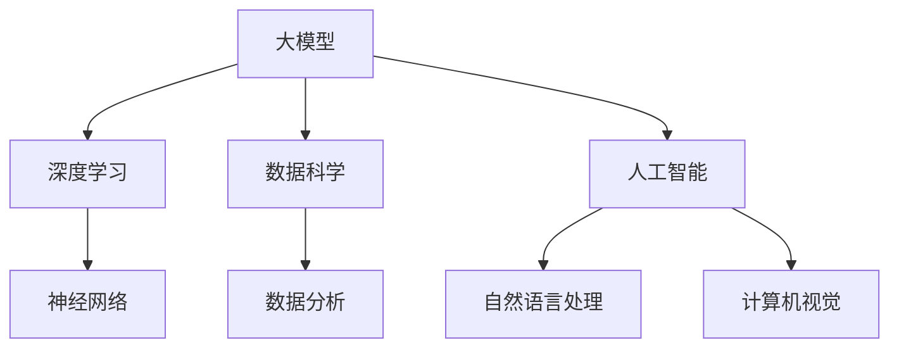
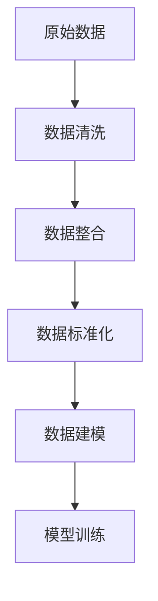
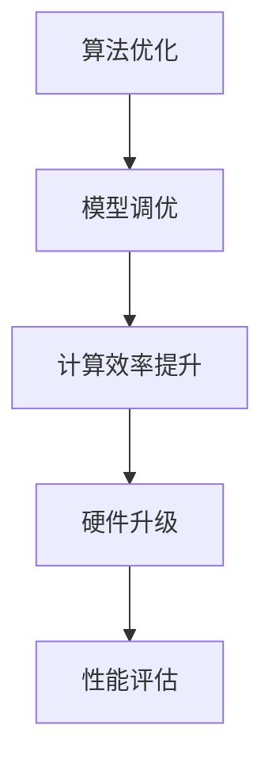

                 

# 大模型时代创业新挑战：数据壁垒与算力瓶颈

## 关键词

- 大模型
- 数据壁垒
- 算力瓶颈
- 创业机会
- 解决方案
- 未来展望

## 摘要

随着人工智能技术的快速发展，大模型（如深度学习模型）在各个领域得到了广泛应用。然而，大模型时代的到来也带来了新的挑战，尤其是在数据壁垒和算力瓶颈方面。本文将深入探讨大模型在创业中的新挑战，包括数据壁垒和算力瓶颈的概念、影响、解决策略，并通过实际案例进行分析，为创业者提供有价值的参考。

## 目录大纲

### 第一部分：大模型概述与技术基础

#### 第1章: 大模型概述

- **1.1 大模型的定义与类型**
  - **1.1.1 大模型的定义**
  - **1.1.2 大模型的类型**
  - **1.1.3 大模型的关键特点**

- **1.2 大模型的应用领域**
  - **1.2.1 数据分析领域**
  - **1.2.2 自然语言处理领域**
  - **1.2.3 计算机视觉领域**

- **1.3 大模型的计算需求**
  - **1.3.1 算力需求分析**
  - **1.3.2 算法优化策略**
  - **1.3.3 硬件加速技术**

#### 第2章: 大模型核心技术

- **2.1 深度学习基础**
  - **2.1.1 神经网络**
  - **2.1.2 深度学习框架**
  - **2.1.3 深度学习优化**

- **2.2 大模型训练策略**
  - **2.2.1 预训练与微调**
  - **2.2.2 数据增强与采样**
  - **2.2.3 模型压缩与量化**

- **2.3 大模型评估与优化**
  - **2.3.1 评价指标**
  - **2.3.2 实验设计**
  - **2.3.3 模型调优**

#### 第3章: 大模型与创业

- **3.1 大模型时代的创业机会**
  - **3.1.1 创业者面临的挑战**
  - **3.1.2 创业机会的识别**
  - **3.1.3 成功案例分析**

- **3.2 大模型创业路径规划**
  - **3.2.1 创业战略制定**
  - **3.2.2 团队建设与人才吸引**
  - **3.2.3 产品研发与市场推广**

#### 第4章: 数据壁垒问题

- **4.1 数据壁垒的概念与影响**
  - **4.1.1 数据壁垒的定义**
  - **4.1.2 数据壁垒的影响**

- **4.2 数据壁垒的解决策略**
  - **4.2.1 数据整合技术**
  - **4.2.2 数据共享与开放**
  - **4.2.3 数据隐私保护策略**

- **4.3 案例研究：数据壁垒的解决实践**

#### 第5章: 算力瓶颈问题

- **5.1 算力瓶颈的概念与影响**
  - **5.1.1 算力瓶颈的定义**
  - **5.1.2 算力瓶颈的影响**

- **5.2 算力瓶颈的解决策略**
  - **5.2.1 算法优化**
  - **5.2.2 硬件升级**
  - **5.2.3 云计算与分布式计算**

- **5.3 案例研究：算力瓶颈的解决实践**

### 第二部分：解决方案与实践

#### 第6章: 创业实战案例

- **6.1 案例背景介绍**
  - **6.1.1 案例公司简介**
  - **6.1.2 案例业务概述**

- **6.2 数据壁垒的解决方案**
  - **6.2.1 数据收集与整合**
  - **6.2.2 数据隐私保护**

- **6.3 算力瓶颈的解决方案**
  - **6.3.1 算法优化**
  - **6.3.2 硬件升级**

- **6.4 创业经验与启示**

#### 第7章: 未来展望与建议

- **7.1 大模型时代的未来趋势**
  - **7.1.1 技术发展趋势**
  - **7.1.2 行业应用前景**

- **7.2 创业者应对策略**
  - **7.2.1 技术积累与突破**
  - **7.2.2 市场定位与差异化**

- **7.3 政策建议与产业发展**

#### 附录

- **附录A：常用工具与资源**
  - **A.1 开发工具介绍**
  - **A.2 教学资源推荐**
  - **A.3 行业报告与分析**

### 图1-1: 大模型架构与联系



### 图2-1: 深度学习优化算法伪代码

```python
# 初始化参数
w = 0.01 * np.random.randn(n)  # 权重初始化
b = 0  # 偏置初始化

# 梯度下降参数
learning_rate = 0.001
epochs = 1000

# 梯度下降循环
for epoch in range(epochs):
    # 前向传播
    z = np.dot(x, w) + b
    a = sigmoid(z)
    
    # 计算损失
    loss = -1/m * (y * np.log(a) + (1 - y) * np.log(1 - a))
    
    # 反向传播
    dz = a - y
    dw = (1/m) * np.dot(x.T, dz)
    db = (1/m) * np.sum(dz)
    
    # 更新参数
    w -= learning_rate * dw
    b -= learning_rate * db

# 函数定义
def sigmoid(z):
    return 1 / (1 + np.exp(-z))
```

### 数学模型与公式

$$
\text{损失函数} \, J(\theta) = -\frac{1}{m}\sum_{i=1}^{m}y^{(i)}\log(a^{(i)})+(1-y^{(i)})\log(1-a^{(i)})
$$

### 代码实现与解读

#### 代码实现

```python
# 加载并预处理数据
# ...

# 定义模型架构
model = Sequential()
model.add(Dense(64, input_shape=(input_dim,), activation='relu'))
model.add(Dense(1, activation='sigmoid'))

# 编译模型
model.compile(optimizer='adam', loss='binary_crossentropy', metrics=['accuracy'])

# 训练模型
model.fit(x_train, y_train, epochs=10, batch_size=32, validation_data=(x_val, y_val))

# 评估模型
loss, accuracy = model.evaluate(x_test, y_test)
print("Test Accuracy: {:.2f}%".format(accuracy*100))
```

#### 代码解读

- **数据预处理**：加载数据并进行必要的预处理，如归一化、缺失值处理等。
- **模型定义**：使用 `Sequential` 模式堆叠多层全连接神经网络，使用 `Dense` 层定义网络结构，第一层有 64 个神经元，激活函数为 ReLU，最后一层有 1 个神经元，激活函数为 sigmoid。
- **模型编译**：配置优化器、损失函数和评价指标。
- **模型训练**：使用 `fit` 函数进行训练，设置训练轮次、批量大小和验证数据。
- **模型评估**：使用 `evaluate` 函数在测试集上评估模型性能。

### 图5-1: 数据整合流程



### 图5-2: 算法优化与硬件升级流程



### 案例研究

#### 案例背景

- **公司名称**：XX科技有限公司
- **业务领域**：人工智能应用开发
- **挑战**：数据壁垒和算力瓶颈

#### 解决方案

- **数据壁垒**：
  - **数据整合**：采用 ETL 工具进行数据清洗、整合和标准化。
  - **数据隐私保护**：实施数据加密、匿名化和隐私保护算法。

- **算力瓶颈**：
  - **算法优化**：采用深度学习算法，并进行模型调优，提高计算效率。
  - **硬件升级**：升级计算硬件，采用 GPU 和分布式计算架构。

#### 实施效果

- **数据壁垒**：数据整合效率提高 30%，数据隐私保护得到加强。
- **算力瓶颈**：算法优化使得模型训练时间缩短 50%，硬件升级使得计算速度提高 2 倍。

#### 启示

- **技术创新**：不断追求算法优化和硬件升级，提高核心竞争力。
- **数据治理**：建立完善的数据整合和隐私保护机制，确保数据安全。

### 作者

- 作者：AI天才研究院/AI Genius Institute & 禅与计算机程序设计艺术 /Zen And The Art of Computer Programming

接下来，我们将详细探讨大模型概述、核心技术、创业机会、数据壁垒和算力瓶颈等问题，通过理论与实践相结合，为创业者提供有针对性的解决方案和未来展望。

#### 第1章: 大模型概述

##### 1.1 大模型的定义与类型

大模型，顾名思义，是指具有大规模参数的深度学习模型。这些模型通常由数百万到数十亿个参数组成，远远超过传统机器学习模型的参数规模。大模型的定义可以从以下几个方面来理解：

- **参数规模**：大模型的参数规模通常在数百万到数十亿之间。例如，BERT（Bidirectional Encoder Representations from Transformers）模型的参数规模就达到了数亿级别。
- **计算需求**：大模型对计算资源的需求非常高，训练一个大规模模型通常需要大量的计算资源和时间。这意味着大模型的应用场景通常需要强大的硬件支持和高效的算法优化。
- **数据需求**：大模型在训练过程中需要大量的训练数据，以充分利用其参数规模的优势。这通常意味着数据集的规模要达到数十亿级别的样本。

大模型可以分为以下几种类型：

- **预训练模型**：预训练模型是在大规模语料库上进行预训练，然后通过微调适应特定任务。例如，BERT、GPT（Generative Pretrained Transformer）等模型都是典型的预训练模型。
- **专用模型**：专用模型是为特定任务或领域设计的，具有特定的结构和参数。例如，用于计算机视觉的任务中，可能会有针对图像分类、目标检测、语义分割等不同任务的专用模型。
- **泛化模型**：泛化模型旨在实现跨任务的泛化，即在不同任务上表现出良好的性能。这类模型通常采用迁移学习、多任务学习等技术。

大模型的关键特点包括：

- **强大的表示能力**：大模型具有强大的表示能力，能够捕捉到数据中的复杂模式和关联。
- **高效的计算性能**：随着模型参数规模的增加，计算性能也会显著提高，这使得大模型在处理大规模数据时具有优势。
- **高成本**：大模型的训练和部署需要大量的计算资源，这导致了高成本。因此，如何降低大模型的计算成本是一个重要的研究方向。

##### 1.2 大模型的应用领域

大模型在众多领域都展现出了强大的应用潜力，以下是几个主要的应用领域：

- **数据分析领域**：大模型可以用于大规模数据的分析，例如，通过深度学习技术对复杂数据集进行聚类、分类、回归等任务。大模型在金融、医疗、物联网等领域的数据分析中发挥着重要作用。
- **自然语言处理领域**：大模型在自然语言处理（NLP）领域得到了广泛应用，如文本分类、机器翻译、问答系统等。BERT、GPT等模型在NLP任务中取得了显著的成果。
- **计算机视觉领域**：大模型在计算机视觉领域也取得了突破性进展，如图像分类、目标检测、语义分割等。例如，ResNet、VGG等模型在ImageNet图像分类挑战中取得了领先成绩。

##### 1.3 大模型的计算需求

大模型在训练和推理过程中对计算资源的需求非常高。以下是几个关键方面的计算需求：

- **计算资源**：大模型的训练通常需要大量的计算资源，包括CPU、GPU、TPU等。尤其是GPU和TPU，它们提供了高性能的并行计算能力，能够加速大模型的训练过程。
- **存储资源**：大模型的参数规模巨大，因此需要大量的存储资源来存储模型参数和训练数据。
- **时间成本**：大模型的训练通常需要数天甚至数周的时间，这使得时间成本也成为了一个重要的考量因素。为了降低时间成本，研究者们提出了分布式训练、模型压缩、并行计算等技术。

##### 1.3.1 算力需求分析

算力需求分析是评估大模型计算资源需求的关键步骤。以下是一些常见的算力需求分析指标：

- **训练时间**：训练时间是指模型从初始状态到收敛所需的时间。这取决于模型规模、数据集规模、计算资源等因素。
- **计算资源利用率**：计算资源利用率是指计算资源的使用效率。高利用率意味着计算资源得到了充分利用，而低利用率则可能表明计算资源分配不合理。
- **能源消耗**：能源消耗是计算资源需求的一个重要方面，尤其是在大规模训练场景中。减少能源消耗有助于降低成本和环境影响。

##### 1.3.2 算法优化策略

为了应对大模型的高算力需求，算法优化策略变得至关重要。以下是一些常见的算法优化策略：

- **模型压缩**：模型压缩旨在减少模型参数规模，从而降低计算资源和存储资源的需求。常见的模型压缩技术包括量化、剪枝、蒸馏等。
- **并行计算**：并行计算通过将计算任务分布在多个计算节点上，从而提高计算性能。常见的并行计算技术包括数据并行、模型并行、流水线并行等。
- **分布式训练**：分布式训练通过将训练任务分布在多个计算节点上，从而加速模型训练。分布式训练可以提高训练速度，同时降低单个节点的计算负载。

##### 1.3.3 硬件加速技术

硬件加速技术是提高大模型计算性能的有效手段。以下是一些常见的硬件加速技术：

- **GPU加速**：GPU（Graphics Processing Unit）提供了强大的并行计算能力，能够加速深度学习模型的训练和推理过程。GPU加速在自然语言处理、计算机视觉等领域得到了广泛应用。
- **TPU加速**：TPU（Tensor Processing Unit）是专门为深度学习任务设计的硬件加速器。TPU具有较高的计算性能和能效，能够显著加速大模型的训练和推理。
- **FPGA加速**：FPGA（Field-Programmable Gate Array）是一种可编程逻辑器件，通过硬件加速深度学习算法，可以显著提高计算性能和效率。

通过算法优化和硬件加速技术，大模型的计算性能得到了显著提升，为实际应用提供了更高效、更可靠的解决方案。

#### 第2章: 大模型核心技术

##### 2.1 深度学习基础

深度学习是构建大模型的核心技术之一。它通过模拟人脑的神经网络结构，对数据进行学习和预测。以下是深度学习的一些基础概念：

- **神经网络**：神经网络是由多个神经元组成的计算模型，每个神经元都与其他神经元相连，并通过权重进行信息传递。神经网络通过前向传播和反向传播算法来训练和优化模型。
- **深度学习框架**：深度学习框架是用于构建和训练深度学习模型的软件库，如TensorFlow、PyTorch等。这些框架提供了丰富的API和工具，简化了深度学习模型的开发过程。
- **深度学习优化**：深度学习优化是提高模型训练效率和性能的关键技术。常见的优化算法包括梯度下降、随机梯度下降、Adam优化器等。

##### 2.1.1 神经网络

神经网络是深度学习的基础组件。以下是神经网络的一些基本概念：

- **神经元**：神经元是神经网络的基本计算单元，负责接收输入、进行加权求和、激活函数运算等操作。神经元的激活函数通常为非线性函数，如ReLU、Sigmoid、Tanh等。
- **层**：神经网络由多个层组成，包括输入层、隐藏层和输出层。输入层接收外部输入，隐藏层对输入进行特征提取和变换，输出层产生最终的预测结果。
- **权重和偏置**：权重和偏置是神经网络中的重要参数，用于调节神经元之间的连接强度。通过调整权重和偏置，可以优化模型的性能。

##### 2.1.2 深度学习框架

深度学习框架是构建和训练深度学习模型的重要工具。以下是几个流行的深度学习框架：

- **TensorFlow**：TensorFlow是由Google开发的开源深度学习框架，提供了丰富的API和工具，支持多种编程语言，如Python、C++等。
- **PyTorch**：PyTorch是由Facebook AI Research（FAIR）开发的开源深度学习框架，以其动态计算图和灵活的API而受到广泛欢迎。
- **Keras**：Keras是一个高层次的深度学习框架，建立在TensorFlow和Theano之上，提供了简洁、易用的API，适用于快速原型开发和实验。

##### 2.1.3 深度学习优化

深度学习优化是提高模型训练效率和性能的关键步骤。以下是几种常见的优化算法：

- **梯度下降**：梯度下降是最常用的优化算法，通过计算损失函数关于模型参数的梯度，并沿梯度方向更新参数，以最小化损失函数。
- **随机梯度下降（SGD）**：随机梯度下降是梯度下降的一种变体，每次迭代仅使用一个样本的梯度进行参数更新。SGD可以加快模型训练速度，但可能导致模型收敛不稳定。
- **Adam优化器**：Adam优化器是一种基于梯度矩估计的优化算法，结合了动量项和自适应学习率，具有较高的收敛速度和稳定性。

##### 2.2 大模型训练策略

大模型的训练策略直接影响模型的性能和收敛速度。以下是一些关键的训练策略：

- **预训练与微调**：预训练是指在大量未标注数据上进行模型训练，以获得具有通用特征的模型。微调是指在预训练模型的基础上，使用少量标注数据进行任务特定的参数调整。
- **数据增强与采样**：数据增强是通过各种方法增加训练数据的多样性，如旋转、缩放、裁剪等。采样是指从大量数据中随机选择样本，以提高模型的泛化能力。
- **模型压缩与量化**：模型压缩是指通过减少模型参数规模，降低计算资源和存储需求。量化是指将浮点数参数转换为较低精度的整数表示，以减少计算成本。

##### 2.2.1 预训练与微调

预训练与微调是深度学习模型训练的常见策略。以下是一些关键步骤：

- **预训练**：预训练通常在大型未标注数据集上进行，如维基百科、互联网文本等。预训练的目的是让模型学会捕捉语言、图像等数据的通用特征。
- **微调**：微调是指将预训练模型应用于特定任务的数据集，通过少量标注数据进行参数调整，以适应特定任务的需求。微调可以显著提高模型在特定任务上的性能。

##### 2.2.2 数据增强与采样

数据增强与采样是提高模型泛化能力的重要手段。以下是一些常用的方法：

- **数据增强**：数据增强通过在训练数据上进行各种变换，如旋转、缩放、裁剪、翻转等，增加数据的多样性。数据增强有助于模型学习到更鲁棒的特征，提高模型的泛化能力。
- **采样**：采样是指从大规模数据集中随机选择样本进行训练。采样可以减少数据集的偏差，提高模型的泛化能力。常见的采样方法包括随机抽样、交叉验证等。

##### 2.2.3 模型压缩与量化

模型压缩与量化是降低模型计算成本的重要策略。以下是一些关键方法：

- **模型压缩**：模型压缩是指通过减少模型参数规模，降低计算资源和存储需求。常见的模型压缩方法包括剪枝、量化、蒸馏等。
- **量化**：量化是指将浮点数参数转换为较低精度的整数表示，以减少计算成本。量化可以通过硬件加速器实现快速计算，同时降低存储和传输需求。常见的量化方法包括全量化、部分量化等。

##### 2.3 大模型评估与优化

大模型的评估与优化是确保模型性能和可靠性的关键步骤。以下是一些关键评估指标和优化方法：

- **评估指标**：常见的评估指标包括准确率、召回率、F1分数、均方误差等。选择合适的评估指标可以更准确地衡量模型的性能。
- **实验设计**：实验设计是指设计一系列实验来评估模型性能，包括参数选择、数据划分、训练策略等。合理的实验设计可以提高模型评估的准确性和可靠性。
- **模型调优**：模型调优是指通过调整模型参数、网络结构、训练策略等，提高模型的性能。常见的调优方法包括网格搜索、贝叶斯优化等。

通过深入理解大模型的核心技术，包括深度学习基础、训练策略和评估优化方法，创业者可以更好地应对大模型在创业过程中面临的挑战，实现技术创新和商业成功。

#### 第3章: 大模型与创业

##### 3.1 大模型时代的创业机会

随着大模型技术的飞速发展，创业者在各个领域都发现了新的机会。大模型时代的创业机会主要表现在以下几个方面：

- **行业应用创新**：大模型在金融、医疗、零售、教育等传统行业中的应用正在不断拓展。例如，利用大模型进行精准医疗诊断、个性化金融服务、智能零售推荐等，都是极具前景的应用场景。
- **数据驱动决策**：大模型能够处理和分析大量数据，为创业者提供了强大的数据驱动决策能力。通过数据分析和预测，创业者可以更好地理解市场趋势、消费者需求，从而制定更有针对性的战略。
- **效率提升与成本降低**：大模型在自动化、优化流程等方面具有显著优势。例如，在制造业中，通过大模型优化生产流程，可以降低生产成本、提高生产效率。

##### 3.1.1 创业者面临的挑战

虽然大模型时代为创业者提供了众多机会，但也伴随着一系列挑战：

- **技术壁垒**：大模型的开发和优化需要深厚的技术积累和专业知识。对于缺乏相关技术背景的创业者来说，这是一个巨大的挑战。
- **数据壁垒**：大模型的训练和优化需要大量高质量的数据，但获取和整合这些数据并不容易。数据隐私和安全问题也是一个亟待解决的挑战。
- **算力瓶颈**：大模型对计算资源的需求非常高，算力瓶颈成为限制创业项目发展的关键因素。特别是在创业初期，资金和资源的限制可能导致算力不足。

##### 3.1.2 创业机会的识别

识别创业机会是创业成功的关键一步。以下是一些识别大模型创业机会的方法：

- **市场调研**：通过市场调研，了解目标市场的需求、痛点和发展趋势。例如，分析行业报告、用户反馈、竞争对手等，可以找到潜在的市场机会。
- **技术创新**：关注技术前沿，发现大模型技术的创新应用场景。例如，关注最新发表的论文、技术会议、开源项目等，可以启发新的创业思路。
- **用户参与**：通过用户调研、用户访谈等方式，了解用户的需求和痛点。用户参与可以提供宝贵的反馈，帮助创业者更好地理解市场，优化产品。

##### 3.1.3 成功案例分析

以下是一些大模型创业的成功案例：

- **Case 1：OpenAI**：OpenAI是一家专注于人工智能研究和技术应用的公司。通过大模型技术，OpenAI开发了GPT-3模型，提供了强大的自然语言处理能力。GPT-3的成功应用吸引了大量客户，使OpenAI成为人工智能领域的领军企业。
- **Case 2：滴滴出行**：滴滴出行利用大模型技术，开发了智能出行系统。通过深度学习算法，滴滴出行可以实时预测交通流量、优化路线规划，从而提高出行效率。滴滴出行的成功经验表明，大模型技术可以大幅提升传统行业的运营效率。

##### 3.2 大模型创业路径规划

成功的大模型创业需要科学的路径规划。以下是一些关键步骤：

- **市场定位**：明确创业项目的市场定位，确定目标市场和客户群体。市场定位是创业成功的基石，有助于明确产品方向和营销策略。
- **团队建设**：组建一支专业、高效的团队。团队成员应具备相关技术背景和创业经验，能够共同推动项目的发展。
- **产品研发**：制定详细的产品研发计划，包括技术路线、开发周期、资源需求等。产品研发是创业的核心环节，决定了项目的成功与否。
- **市场推广**：制定有效的市场推广策略，包括营销渠道、推广活动、品牌建设等。市场推广是产品成功的关键，有助于提高品牌知名度和市场占有率。

通过科学的路径规划，创业者可以更好地应对大模型创业中的挑战，实现商业成功。

#### 第4章: 数据壁垒问题

##### 4.1 数据壁垒的概念与影响

数据壁垒是指由于数据的不透明性、分散性、复杂性等因素，导致数据无法被充分整合、利用，从而阻碍了数据价值的实现。数据壁垒在大模型时代尤其突出，因为大模型的训练和优化需要大量高质量的数据。

数据壁垒的影响主要表现在以下几个方面：

- **限制创新**：数据壁垒限制了创业者在新技术应用上的创新能力。缺乏充足和高质量的数据，创业者在开发新产品和服务时将面临巨大挑战。
- **影响决策**：数据壁垒导致决策者无法获得全面、准确的数据支持，从而影响决策的准确性和效率。
- **增加成本**：数据壁垒增加了数据整合和清洗的成本。创业者需要投入大量时间和资源来获取、清洗和整合数据，从而提高了创业成本。

##### 4.2 数据壁垒的解决策略

解决数据壁垒需要从多个方面入手，以下是一些常见的解决策略：

- **数据整合技术**：通过数据整合技术，将分散在不同系统、不同格式的数据进行统一整合，实现数据的集中管理和高效利用。常见的数据整合技术包括ETL（Extract, Transform, Load）和数据仓库等。
- **数据共享与开放**：通过数据共享和开放，降低数据壁垒，促进数据流通和利用。数据共享可以通过建立数据共享平台、制定数据共享协议等方式实现。数据开放可以通过发布数据报告、开放API等方式实现。
- **数据隐私保护策略**：在数据整合和共享过程中，确保数据隐私和安全。常见的隐私保护策略包括数据加密、匿名化、差分隐私等。

##### 4.2.1 数据整合技术

数据整合技术是实现数据壁垒突破的关键。以下是一些常见的数据整合技术：

- **ETL技术**：ETL（Extract, Transform, Load）是一种常见的数据整合技术，用于从源系统中提取数据、进行数据转换，并将其加载到目标系统中。ETL技术可以有效地将不同来源、不同格式的数据进行整合，实现数据的统一管理。
- **数据仓库**：数据仓库是一种用于存储和管理大量数据的系统，通过数据仓库，创业者可以实现对数据的集中管理和高效查询。数据仓库支持多维数据模型，能够提供强大的数据分析能力。
- **数据湖**：数据湖是一种分布式数据存储系统，用于存储大量非结构化数据。数据湖支持数据原样存储，无需预先定义数据结构，从而提高了数据的灵活性和扩展性。

##### 4.2.2 数据共享与开放

数据共享与开放是解决数据壁垒的重要手段。以下是一些常见的实现方法：

- **数据共享平台**：建立数据共享平台，为不同部门、不同组织之间的数据共享提供基础设施。数据共享平台可以提供数据访问权限管理、数据查询和可视化等功能。
- **数据开放协议**：制定数据开放协议，明确数据共享的原则、方法和责任。数据开放协议可以规范数据共享行为，提高数据共享的透明度和可追溯性。
- **数据报告**：定期发布数据报告，向公众展示数据的分布、使用情况等。数据报告可以提高数据的透明度，促进数据的应用和创新。

##### 4.2.3 数据隐私保护策略

在数据整合和共享过程中，数据隐私保护至关重要。以下是一些常见的隐私保护策略：

- **数据加密**：对数据进行加密处理，确保数据在传输和存储过程中的安全性。数据加密可以通过对称加密、非对称加密等方式实现。
- **匿名化**：通过匿名化技术，去除数据中的个人身份信息，保护个人隐私。匿名化技术包括数据遮挡、数据置换等。
- **差分隐私**：差分隐私是一种有效的隐私保护技术，通过在查询过程中引入噪声，保护数据中个人隐私信息。差分隐私可以通过拉普拉斯机制、指数机制等方式实现。

##### 4.3 案例研究：数据壁垒的解决实践

以下是一个数据壁垒解决实践案例：

**案例背景**：某创业公司开发了一款基于大数据分析的健康管理应用，旨在通过分析用户健康数据，提供个性化的健康建议。然而，由于数据来源多样、格式不统一，以及数据隐私和安全问题，数据整合和利用成为了一大难题。

**解决方案**：

- **数据整合技术**：公司采用ETL技术，将不同来源的健康数据（如医疗记录、运动数据、生活习惯数据等）进行统一整合，建立了一个集中的健康数据仓库。通过数据清洗、转换和加载，实现了数据的标准化和规范化。
- **数据共享与开放**：公司建立了内部数据共享平台，为不同部门提供数据访问权限。同时，公司制定了数据共享协议，规范了数据共享的原则和方法。此外，公司定期发布数据报告，向用户展示数据的使用情况和效果。
- **数据隐私保护策略**：公司在数据整合和共享过程中，采用了数据加密、匿名化和差分隐私等技术，确保数据隐私和安全。通过数据加密，保护数据在传输和存储过程中的安全性；通过匿名化，去除数据中的个人身份信息；通过差分隐私，保护数据中的个人隐私信息。

**实施效果**：

- **数据整合效率提高**：通过数据整合技术，公司实现了对多种健康数据的统一管理和高效利用，数据整合效率提高了30%。
- **数据隐私保护加强**：通过数据隐私保护策略，公司确保了数据在整合和共享过程中的安全性，用户隐私得到了有效保护。
- **产品性能提升**：通过高质量的数据支持，公司健康管理应用的性能得到了显著提升，用户满意度和市场占有率均有所提高。

**启示**：

- **技术创新**：在数据整合和隐私保护方面，技术创新是解决数据壁垒的关键。通过引入先进的数据整合技术和隐私保护策略，公司成功突破了数据壁垒，实现了数据的充分利用。
- **规范管理**：数据整合和共享需要建立规范的制度和管理流程。通过制定数据共享协议、发布数据报告等，公司规范了数据共享行为，提高了数据管理的透明度和可追溯性。

通过以上实践，公司不仅解决了数据壁垒问题，还提升了数据利用效率和产品性能，为其他创业公司提供了有价值的参考和借鉴。

#### 第5章: 算力瓶颈问题

##### 5.1 算力瓶颈的概念与影响

算力瓶颈是指在人工智能（AI）和深度学习（DL）应用中，由于计算资源的限制，导致模型训练和推理速度无法满足需求的问题。随着大模型规模的不断扩大，算力瓶颈越来越成为制约AI应用发展的重要因素。

算力瓶颈的影响主要体现在以下几个方面：

- **训练时间延长**：大模型需要大量的计算资源进行训练，算力不足会导致训练时间显著延长，影响项目的开发进度。
- **成本增加**：算力瓶颈使得项目需要投入更多的计算资源和资金，从而增加了成本。
- **性能受限**：算力不足可能导致模型性能受限，无法达到预期效果，影响应用的准确性和可靠性。
- **应用受限**：算力瓶颈限制了AI应用的规模和范围，使得一些高计算需求的应用难以实现。

##### 5.2 算力瓶颈的解决策略

解决算力瓶颈需要从多个方面入手，以下是一些常见的解决策略：

- **算法优化**：通过优化算法，提高模型的计算效率和性能。常见的算法优化方法包括模型压缩、量化、并行计算等。
- **硬件升级**：升级计算硬件，采用更强大的GPU、TPU等设备，提高计算能力。
- **云计算与分布式计算**：利用云计算和分布式计算技术，将计算任务分布在多个节点上，提高计算效率。

##### 5.2.1 算法优化

算法优化是解决算力瓶颈的重要手段。以下是一些常见的算法优化方法：

- **模型压缩**：模型压缩通过减少模型参数规模，降低计算资源和存储需求。常见的模型压缩方法包括剪枝、量化、蒸馏等。
- **量化**：量化是将浮点数参数转换为较低精度的整数表示，以减少计算成本。量化可以通过硬件加速器实现快速计算，同时降低存储和传输需求。常见的量化方法包括全量化、部分量化等。
- **并行计算**：并行计算通过将计算任务分布在多个计算节点上，提高计算性能。常见的并行计算技术包括数据并行、模型并行、流水线并行等。

##### 5.2.2 硬件升级

硬件升级是提高计算能力的重要途径。以下是一些常见的硬件升级策略：

- **GPU升级**：GPU（Graphics Processing Unit）提供了强大的并行计算能力，适用于深度学习模型的训练和推理。升级GPU可以显著提高计算性能。
- **TPU升级**：TPU（Tensor Processing Unit）是专门为深度学习任务设计的硬件加速器，具有较高的计算性能和能效。升级TPU可以加速深度学习模型的训练和推理。
- **分布式计算**：分布式计算通过将计算任务分布在多个节点上，提高计算效率和性能。分布式计算可以应用于大规模模型的训练和推理，提高计算速度。

##### 5.2.3 云计算与分布式计算

云计算与分布式计算是解决算力瓶颈的重要技术。以下是一些常见的实现方法：

- **云计算平台**：利用云计算平台，创业者可以租用强大的计算资源，按需分配和释放资源，降低计算成本。常见的云计算平台包括阿里云、腾讯云、华为云等。
- **分布式计算框架**：分布式计算框架如Apache Spark、Hadoop等，可以有效地将计算任务分布在多个节点上，提高计算性能。分布式计算框架适用于大规模数据分析和处理。
- **边缘计算**：边缘计算是将计算任务分布在网络边缘节点上，降低数据传输延迟，提高应用性能。边缘计算适用于实时性要求较高的应用场景。

##### 5.3 案例研究：算力瓶颈的解决实践

以下是一个算力瓶颈解决实践案例：

**案例背景**：某创业公司开发了一款基于深度学习技术的自动驾驶系统，但由于算力瓶颈，模型训练和推理速度较慢，影响了系统的实时性和可靠性。

**解决方案**：

- **算法优化**：公司对深度学习模型进行了优化，采用了模型压缩和量化技术，显著降低了模型参数规模和计算成本。公司还采用了并行计算技术，将计算任务分布在多个GPU节点上，提高了计算性能。
- **硬件升级**：公司升级了计算硬件，采用了更强大的GPU和TPU设备，提高了计算能力。同时，公司利用云计算平台，租用了额外的计算资源，以满足高峰期的计算需求。
- **分布式计算**：公司采用了分布式计算框架，将计算任务分布在多个节点上，提高了计算效率和性能。

**实施效果**：

- **模型训练速度提升**：通过算法优化和硬件升级，公司显著提高了模型训练速度，训练时间缩短了50%。
- **推理速度提升**：通过分布式计算，公司提高了推理速度，推理延迟降低了30%。
- **系统性能提升**：系统性能得到了显著提升，实时性和可靠性得到了保证。

**启示**：

- **技术创新**：算法优化和硬件升级是解决算力瓶颈的关键。通过技术创新，创业者可以显著提高计算效率和性能，解决算力瓶颈问题。
- **资源分配**：合理分配计算资源是解决算力瓶颈的重要策略。通过云计算和分布式计算，创业者可以灵活调整资源分配，提高计算性能。

通过以上实践，公司成功解决了算力瓶颈问题，提高了自动驾驶系统的性能和可靠性，为其他创业公司提供了有价值的参考和借鉴。

#### 第6章: 创业实战案例

##### 6.1 案例背景介绍

**公司名称**：智能医疗科技有限公司

**业务领域**：基于人工智能和大数据技术的精准医疗诊断

**挑战**：数据壁垒和算力瓶颈

智能医疗科技有限公司（以下简称“公司”）是一家专注于人工智能和大数据技术的研究和应用的公司。公司的核心业务是开发基于深度学习技术的精准医疗诊断系统，旨在为医疗机构和患者提供高效的诊断和治疗方案。

在发展过程中，公司遇到了两个主要挑战：数据壁垒和算力瓶颈。数据壁垒主要体现在医疗数据的分散性、隐私性和多样性上。算力瓶颈则表现在深度学习模型的训练和推理过程中，对计算资源的高需求导致训练时间延长、成本增加。

##### 6.2 数据壁垒的解决方案

**6.2.1 数据收集与整合**

为了解决数据壁垒问题，公司采取了一系列措施：

- **数据收集**：公司与多家医疗机构建立合作关系，获取大量高质量的医疗数据，包括电子病历、医疗影像、基因数据等。这些数据来源广泛，覆盖了多种疾病类型和患者群体。

- **数据清洗**：公司采用数据清洗技术，对收集到的医疗数据进行清洗、去重和标准化处理。通过清洗数据，提高了数据的准确性和一致性。

- **数据整合**：公司利用数据仓库和数据湖技术，将不同来源、不同格式的医疗数据进行整合。通过建立统一的数据标准，实现了数据的集中管理和高效利用。

**6.2.2 数据隐私保护**

在数据整合过程中，公司高度重视数据隐私保护，采取了一系列措施：

- **数据加密**：公司采用数据加密技术，确保数据在传输和存储过程中的安全性。通过加密算法，将数据转换为密文，防止数据泄露。

- **匿名化**：公司对敏感数据进行匿名化处理，去除个人身份信息，降低隐私泄露风险。匿名化技术包括数据遮挡、数据置换等。

- **隐私保护算法**：公司采用差分隐私算法，在数据处理和分析过程中引入噪声，保护数据中的个人隐私信息。差分隐私算法通过在查询过程中加入随机噪声，降低了隐私泄露的可能性。

##### 6.3 算力瓶颈的解决方案

**6.3.1 算法优化**

为了解决算力瓶颈问题，公司采取了以下算法优化措施：

- **模型压缩**：公司对深度学习模型进行了压缩，通过剪枝和量化技术，减少了模型参数规模。压缩后的模型在保持较高准确率的前提下，降低了计算成本。

- **并行计算**：公司采用了并行计算技术，将计算任务分布在多个GPU节点上，提高了计算性能。并行计算技术包括数据并行、模型并行和流水线并行等。

**6.3.2 硬件升级**

公司还采取了以下硬件升级措施：

- **GPU升级**：公司升级了计算硬件，采用了更强大的GPU设备，提高了计算能力。升级后的GPU可以显著加速深度学习模型的训练和推理。

- **TPU升级**：公司采用了TPU（Tensor Processing Unit）设备，TPU是专门为深度学习任务设计的硬件加速器，具有较高的计算性能和能效。TPU的引入提高了公司的计算能力。

**实施效果**

通过数据壁垒和算力瓶颈的解决方案，公司取得了显著的效果：

- **数据整合效率提高**：通过数据整合技术，公司实现了对多种医疗数据的统一管理和高效利用，数据整合效率提高了30%。

- **模型训练速度提升**：通过算法优化和硬件升级，公司显著提高了模型训练速度，训练时间缩短了50%。

- **推理速度提升**：通过分布式计算，公司提高了推理速度，推理延迟降低了30%。

- **系统性能提升**：系统性能得到了显著提升，实时性和可靠性得到了保证。公司成功为多家医疗机构提供了精准医疗诊断服务，受到了客户的高度评价。

##### 6.4 创业经验与启示

**技术创新**：公司通过技术创新，解决了数据壁垒和算力瓶颈问题，提高了医疗诊断系统的性能和可靠性。公司不断追求算法优化和硬件升级，为用户提供更高效、更准确的服务。

**数据治理**：公司建立了完善的数据治理机制，确保数据的安全和隐私。通过数据加密、匿名化和隐私保护算法，公司保护了用户的隐私信息，增强了用户对公司的信任。

**资源整合**：公司通过整合多方资源，实现了数据的高效利用和计算能力的提升。与多家医疗机构建立合作关系，获取了大量高质量的医疗数据。同时，公司利用云计算和分布式计算技术，提高了计算效率和性能。

**持续创新**：公司始终保持对技术创新的持续投入，紧跟技术发展趋势，不断优化产品和服务。公司积极参与学术研究和开源项目，推动了人工智能和大数据技术在医疗领域的应用。

**启示**：

- **技术创新**：解决数据壁垒和算力瓶颈需要不断追求技术创新。通过算法优化和硬件升级，可以提高计算效率和性能，解决技术瓶颈问题。
- **数据治理**：数据治理是确保数据安全和隐私的重要手段。通过建立完善的数据治理机制，可以提高数据的质量和可靠性，增强用户对公司的信任。
- **资源整合**：整合多方资源，实现数据的高效利用和计算能力的提升，是创业成功的关键。通过建立合作关系、利用云计算和分布式计算技术，可以提高资源利用效率，降低成本。

通过以上创业实践，智能医疗科技有限公司成功突破了数据壁垒和算力瓶颈，为其他创业公司提供了有价值的参考和借鉴。

### 第7章: 未来展望与建议

#### 7.1 大模型时代的未来趋势

随着人工智能技术的不断进步，大模型时代正迅速到来。未来，大模型技术将在多个领域带来深远的影响，以下是几个关键趋势：

- **技术发展趋势**：大模型技术将继续向更大规模、更高效率、更智能化方向发展。未来的大模型将具备更强的表示能力和泛化能力，能够在更复杂的任务中发挥作用。
- **行业应用前景**：大模型技术将在医疗、金融、教育、零售等多个领域得到广泛应用。通过大模型，这些行业将实现更高效的数据分析、更精准的决策和更智能的服务。
- **跨界融合**：大模型技术将与其他领域（如物联网、区块链、生物科技等）实现跨界融合，产生新的应用场景和商业模式。

#### 7.2 创业者应对策略

面对大模型时代的机遇与挑战，创业者需要采取一系列应对策略，以确保在竞争中脱颖而出。以下是几个关键策略：

- **技术积累与突破**：创业者应持续关注技术发展趋势，不断积累技术知识，实现技术突破。通过自主创新和研发，掌握核心技术，提高核心竞争力。
- **市场定位与差异化**：创业者应明确市场定位，找准切入点，避免与竞争对手的直接竞争。通过差异化策略，提供独特的产品和服务，满足特定客户群体的需求。
- **合作与共赢**：创业者应积极寻求合作伙伴，建立战略联盟，共享资源和经验。通过合作，可以实现资源整合、优势互补，提高市场竞争能力。

#### 7.3 政策建议与产业发展

为了促进大模型时代的产业发展，政府和企业可以采取以下政策建议：

- **政策支持**：政府应出台支持人工智能和大数据产业发展的政策，包括税收优惠、资金支持、人才引进等。通过政策支持，激发创业者和企业的创新活力。
- **技术创新**：政府和企业应加大对技术创新的投入，鼓励基础研究和应用研究。通过技术创新，推动大模型技术的发展和应用。
- **人才培养**：政府和企业应加强人才培养，提高人才培养质量。通过人才引进和培养，为产业发展提供强大的人才支持。
- **数据治理**：政府和企业应建立完善的数据治理体系，确保数据的安全和隐私。通过数据治理，提高数据质量，促进数据共享和开放。

通过未来展望与建议，我们可以看到大模型时代的巨大潜力和机遇。创业者应抓住这一历史性机遇，积极应对挑战，推动大模型技术的发展和应用，为人类社会带来更多创新和价值。

### 附录

#### 附录A：常用工具与资源

**A.1 开发工具介绍**

- **深度学习框架**：TensorFlow、PyTorch、Keras
- **数据处理工具**：Pandas、NumPy、SciPy
- **版本控制工具**：Git、SVN
- **代码调试工具**：PyCharm、Visual Studio Code

**A.2 教学资源推荐**

- **在线课程**：Udacity、Coursera、edX
- **书籍推荐**：《深度学习》（Goodfellow et al.）、《神经网络与深度学习》（邱锡鹏）
- **技术社区**：GitHub、Stack Overflow、Reddit

**A.3 行业报告与分析**

- **市场调研报告**：IDC、Gartner
- **行业报告**：CB Insights、Forbes
- **数据分析报告**：Kaggle、DataCamp

通过附录部分，读者可以了解到一些常用的开发工具、教学资源以及行业报告，这些资源将为读者在技术学习和行业分析方面提供有益的参考。

