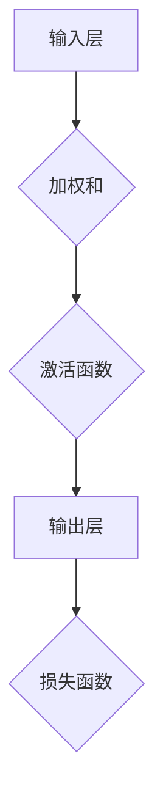
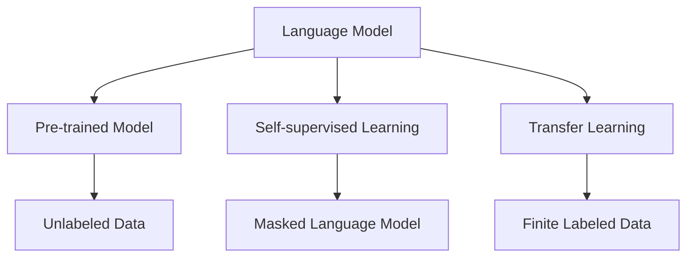

                 

### 《大语言模型原理基础与前沿 基于规范的方法》

> **关键词**：大语言模型，自然语言处理，深度学习，预训练，自监督学习，迁移学习

> **摘要**：本文详细介绍了大语言模型的原理基础和前沿技术。首先，从大语言模型的起源和发展历程入手，阐述了其核心概念和应用场景。接着，深入探讨了神经网络和深度学习的基础，以及自然语言处理中的词嵌入、序列模型和注意力机制。随后，介绍了大规模预训练模型的基本原理，包括自监督学习和迁移学习技术。在此基础上，详细分析了大语言模型的训练策略、优化方法和前沿进展。最后，通过实际项目案例，展示了大语言模型在自然语言处理和智能对话系统中的应用和实践。本文旨在为读者提供系统、全面的大语言模型知识，助力其在相关领域的研究和应用。

----------------------------------------------------------------

## 《大语言模型原理基础与前沿 基于规范的方法》目录大纲

### 第一部分：大语言模型基础知识

#### 第1章：大语言模型概述

#### 1.1 大语言模型的起源与发展

#### 1.2 大语言模型的核心概念

#### 1.3 大语言模型的应用场景

#### 第2章：大语言模型的数学基础

#### 2.1 神经网络与深度学习基础

#### 2.2 自然语言处理的基本概念

#### 2.3 大规模预训练模型数学原理

## 第二部分：大语言模型技术深度探讨

#### 第3章：大语言模型的训练策略

#### 3.1 数据准备与预处理

#### 3.2 模型训练策略

#### 3.3 模型评估与调整

#### 第4章：大语言模型的优化方法

#### 4.1 计算效率优化

#### 4.2 模型压缩与加速

#### 4.3 模型部署与推理优化

#### 第5章：大语言模型的前沿进展

#### 5.1 模型解释与可解释性

#### 5.2 适应性学习与迁移学习

#### 5.3 大语言模型的安全与隐私保护

## 第三部分：大语言模型的应用与实践

#### 第6章：大语言模型在自然语言处理中的应用

#### 6.1 文本生成与生成式对话系统

#### 6.2 文本分类与情感分析

#### 6.3 机器翻译与跨语言处理

#### 第7章：大语言模型在智能对话系统中的应用

#### 7.1 智能对话系统的构建方法

#### 7.2 情感识别与回应策略

#### 7.3 实际应用案例

## 附录

#### 附录A：大语言模型开发工具与资源

#### 附录B：大语言模型数学公式汇总

#### 附录C：大语言模型代码实战案例

## 《大语言模型原理基础与前沿 基于规范的方法》

### 第一部分：大语言模型基础知识

#### 第1章：大语言模型概述

#### 1.1 大语言模型的起源与发展

大语言模型的发展经历了几个重要阶段。最早的大规模语言模型可以追溯到1980年代，当时研究人员开始探索如何使用统计方法来预测文本中的下一个单词。这些早期模型通常基于n元语法（n-gram），通过统计相邻单词的频率来预测下一个单词。

随着计算机硬件的升级和深度学习算法的发展，语言模型的技术逐渐成熟。2000年代初，n元语法模型被引入到搜索引擎中，以改进搜索结果的排序和查询建议。然而，这些模型在面对长距离依赖和复杂语义问题时显得力不从心。

2010年代，深度学习技术开始在自然语言处理领域取得突破性进展。2013年，词嵌入技术（如Word2Vec）的出现使得文本数据可以被表示为稠密的向量表示，从而提高了模型的语义理解能力。同年，序列模型（如LSTM和GRU）在语言模型中的应用也开始出现。

2018年，Google的BERT模型的出现标志着大语言模型时代的到来。BERT模型通过大规模预训练和微调，在多个自然语言处理任务上取得了显著的效果。随后，GPT系列模型和Turing模型等相继推出，进一步推动了大语言模型的发展。

#### 1.2 大语言模型的核心概念

大语言模型主要包括以下几个核心概念：

1. **语言模型**：语言模型是用来预测文本序列的概率分布的模型。它通常使用统计方法或深度学习算法来学习文本数据中的概率分布。

2. **大规模预训练模型**：大规模预训练模型是在大规模数据集上训练的模型，旨在捕获语言的一般知识。这些模型通常具有数十亿个参数，通过预训练过程获得强大的语言理解能力。

3. **自监督学习**：自监督学习是一种无监督学习方法，通过利用未标记的数据来自动生成监督信号。在大语言模型中，自监督学习被广泛应用于预训练过程，例如通过预测下一个单词或填充遮蔽的单词来训练模型。

4. **迁移学习**：迁移学习是一种利用预训练模型在特定任务上的迁移能力的方法。在大语言模型中，迁移学习可以通过微调预训练模型来适应不同的下游任务。

#### 1.3 大语言模型的应用场景

大语言模型在自然语言处理领域具有广泛的应用场景，主要包括以下几个方面：

1. **文本生成**：大语言模型可以用于生成文本，例如生成文章、新闻、对话等。这些模型可以通过学习大规模的文本数据，自动生成具有流畅性和连贯性的文本。

2. **文本分类**：大语言模型可以用于对文本进行分类，例如情感分析、主题分类等。这些模型可以通过学习大量的标注数据，自动对新的文本进行分类。

3. **机器翻译**：大语言模型可以用于机器翻译任务，将一种语言的文本翻译成另一种语言。这些模型可以通过学习双语的文本数据，自动进行跨语言翻译。

4. **命名实体识别**：大语言模型可以用于命名实体识别，识别文本中的命名实体，例如人名、地名、组织名等。这些模型可以通过学习标注数据，自动识别文本中的命名实体。

#### 第2章：大语言模型的数学基础

#### 2.1 神经网络与深度学习基础

神经网络是深度学习的基础，它由大量的神经元（节点）组成。每个神经元都与其他神经元相连，并通过权重进行加权求和。神经元的输出通过激活函数进行处理，以产生最终的输出。

深度学习是神经网络的一种扩展，它通过多层神经网络来学习复杂的数据特征。深度学习的核心思想是层次化特征学习，即通过逐层提取数据中的特征，从而实现高层次的抽象表示。

以下是一个简单的神经网络结构：



在深度学习中，常用的激活函数包括Sigmoid、ReLU和Tanh等。以下是一个ReLU激活函数的例子：

```python
def ReLU(x):
    return max(0, x)
```

#### 2.2 自然语言处理的基本概念

自然语言处理（NLP）是计算机科学和人工智能领域的一个重要分支，旨在使计算机能够理解、处理和生成人类语言。NLP涉及多个基本概念，包括词嵌入、序列模型和注意力机制等。

1. **词嵌入**：词嵌入是一种将单词映射到高维向量空间的技术，以捕捉单词的语义信息。常见的词嵌入方法包括Word2Vec、GloVe和BERT等。

2. **序列模型**：序列模型是一种用于处理序列数据的模型，如RNN（循环神经网络）和LSTM（长短期记忆网络）。这些模型通过循环结构来捕捉序列中的时间依赖关系。

3. **注意力机制**：注意力机制是一种用于处理变长序列的方法，通过为序列中的每个元素分配不同的权重来关注重要的信息。注意力机制广泛应用于编码器-解码器模型（如Transformer）中。

以下是一个简单的注意力机制的例子：

```python
def attention(q, k, v, mask=None):
    scores = torch.matmul(q, k.transpose(1, 2))
    if mask is not None:
        scores = scores.masked_fill(mask == 0, float("-inf"))
    attn_weights = torch.softmax(scores, dim=2)
    output = torch.matmul(attn_weights, v)
    return output, attn_weights
```

#### 2.3 大规模预训练模型数学原理

大规模预训练模型通常包括预训练和微调两个阶段。预训练阶段是在大规模数据集上训练模型，以捕获语言的一般知识。微调阶段是将预训练模型应用于特定的下游任务，并进行微调以适应特定的任务。

在预训练阶段，常用的方法包括自监督学习和迁移学习。自监督学习通过利用未标记的数据来自动生成监督信号，如预测下一个单词或填充遮蔽的单词。迁移学习则通过利用预训练模型在特定任务上的迁移能力，对模型进行微调。

以下是一个简单的自监督学习的例子：

```python
def masked_language_model(model, inputs, target_words, target_mask):
    outputs = model(inputs)
    logits = outputs[0]  # 取出输出层
    loss = F.cross_entropy(logits.view(-1, logits.size(-1)), target_words.view(-1))
    return loss
```

在微调阶段，预训练模型通常通过在特定任务上的训练数据集进行微调，以适应下游任务。以下是一个简单的微调的例子：

```python
def fine_tune(model, train_loader, criterion, optimizer, num_epochs):
    model.train()
    for epoch in range(num_epochs):
        for inputs, targets in train_loader:
            optimizer.zero_grad()
            outputs = model(inputs)
            loss = criterion(outputs, targets)
            loss.backward()
            optimizer.step()
        print(f'Epoch {epoch+1}/{num_epochs}, Loss: {loss.item()}')
```

### 第一部分总结

在本部分中，我们介绍了大语言模型的起源与发展、核心概念和应用场景，以及大语言模型的数学基础。通过这些介绍，读者可以初步了解大语言模型的基本知识，为进一步学习和应用打下基础。在下一部分中，我们将深入探讨大语言模型的训练策略、优化方法和前沿进展。敬请期待！
----------------------------------------------------------------

### 第1章：大语言模型概述

在探讨大语言模型的原理和前沿技术之前，首先需要理解大语言模型的基本概念和它的发展历程。本章将分三个部分介绍大语言模型的起源与发展、核心概念以及应用场景。

#### 1.1 大语言模型的起源与发展

大语言模型的发展历程可以追溯到20世纪80年代。当时，研究人员开始探索如何使用统计方法来构建语言模型，以预测文本序列中的下一个单词。这一时期的主要代表性工作是n元语法模型的提出，它通过统计相邻n个单词的概率来预测下一个单词。虽然n元语法模型在短期内表现良好，但在处理长距离依赖和复杂语义问题时存在局限性。

进入21世纪，随着计算能力和算法的进步，深度学习开始崭露头角。2000年代初，神经网络在图像识别等领域的成功应用激励了研究人员将深度学习技术引入自然语言处理领域。2003年，Bengio等人提出的长期依赖记忆网络（Long Short-Term Memory，LSTM）成为解决序列数据处理中的长距离依赖问题的重要突破。

2010年代，随着硬件性能的提升和大规模数据集的出现，深度学习在自然语言处理领域的应用逐渐成熟。2013年，Word2Vec模型的提出将词嵌入技术引入自然语言处理，使文本数据可以被表示为高维向量，从而提高了模型的语义理解能力。随后，序列模型如GRU（Gated Recurrent Unit）和注意力机制等技术的引入进一步提升了模型的性能。

2018年，Google发布了BERT（Bidirectional Encoder Representations from Transformers）模型，这是大语言模型发展史上的一个重要里程碑。BERT模型通过双向Transformer结构和大规模预训练，在多个自然语言处理任务上取得了显著的性能提升。BERT的成功激发了进一步的研究和改进，如GPT（Generative Pre-trained Transformer）系列模型和Turing模型等的相继推出。

#### 1.2 大语言模型的核心概念

大语言模型的核心概念包括语言模型、大规模预训练模型、自监督学习和迁移学习等。

1. **语言模型**：语言模型是一种用于预测文本序列概率分布的模型。在自然语言处理中，语言模型广泛应用于文本生成、文本分类、机器翻译和命名实体识别等任务。基本的语言模型通常基于统计方法或深度学习算法，如n元语法和神经网络语言模型。

2. **大规模预训练模型**：大规模预训练模型是在大规模数据集上通过预训练过程训练的模型，以捕获语言的一般知识。预训练模型通常具有数十亿个参数，通过在未标注的数据上进行训练，模型能够学习到丰富的语言特征。预训练后的模型可以通过微调适应特定的下游任务。

3. **自监督学习**：自监督学习是一种无监督学习方法，通过利用未标记的数据来自动生成监督信号。在大语言模型中，自监督学习通常用于预训练过程。例如，通过预测下一个单词或填充遮蔽的单词来训练模型，从而不需要依赖于大量的标注数据。

4. **迁移学习**：迁移学习是一种利用预训练模型在特定任务上的迁移能力的方法。在大语言模型中，迁移学习通过微调预训练模型来适应不同的下游任务。这种方法可以显著提高模型的性能，特别是在数据稀缺的情况下。

#### 1.3 大语言模型的应用场景

大语言模型在自然语言处理领域具有广泛的应用场景，包括文本生成、文本分类、机器翻译、命名实体识别等。

1. **文本生成**：大语言模型可以生成连贯和自然的文本，如文章、新闻、对话等。这种能力在内容创作、自动摘要和对话系统等领域具有广泛应用。

2. **文本分类**：大语言模型可以用于对文本进行分类，如情感分析、主题分类和垃圾邮件检测等。这些模型通过学习大量的标注数据，能够自动对新的文本进行分类。

3. **机器翻译**：大语言模型可以用于跨语言翻译任务，将一种语言的文本翻译成另一种语言。这种能力在全球化交流、多语言文档处理和跨语言搜索等领域具有重要应用。

4. **命名实体识别**：大语言模型可以用于识别文本中的命名实体，如人名、地名、组织名等。这种能力在信息抽取、实体关系挖掘和知识图谱构建等领域具有广泛的应用。

#### 本章小结

本章介绍了大语言模型的起源与发展、核心概念以及应用场景。通过本章的学习，读者可以了解大语言模型的基本知识和其在自然语言处理领域的广泛应用。在下一章中，我们将深入探讨大语言模型的数学基础，包括神经网络与深度学习、自然语言处理的基本概念以及大规模预训练模型数学原理。敬请期待！

---

### 1.1 大语言模型的起源与发展

大语言模型的发展历程可以说是人工智能领域的缩影，反映了技术进步、算法创新和数据规模的扩大如何共同推动自然语言处理（NLP）领域的演变。了解这一历程有助于我们更好地理解大语言模型的核心价值和未来发展方向。

#### 早期探索（20世纪80年代）

大语言模型的起源可以追溯到20世纪80年代，当时研究人员开始关注如何利用统计模型来处理和生成自然语言。早期的语言模型主要基于n元语法（n-gram），这是一种通过统计相邻单词或字符的概率来预测下一个单词或字符的方法。n元语法模型的简单性使得它很快被广泛应用于拼写检查、文本生成和查询建议等任务。

尽管n元语法模型在处理短文本序列方面表现出色，但它对于长距离依赖和复杂语义的理解能力有限。例如，它无法很好地捕捉到句子中的因果关系或逻辑关系。此外，n元语法模型的性能容易受到数据集大小的影响，当训练数据量不足时，模型的泛化能力较差。

#### 深度学习的兴起（2000年代）

随着计算能力的提升和算法的创新，深度学习在21世纪初开始崭露头角。深度学习通过多层神经网络结构，能够自动提取数据中的复杂特征，从而在图像识别、语音识别等领域取得了显著的突破。这些成功激发了研究人员将深度学习技术引入自然语言处理领域的兴趣。

2000年代初，循环神经网络（Recurrent Neural Network，RNN）成为处理序列数据的一种有效方法。RNN通过在时间步上递归地更新其状态，能够捕获序列中的时间依赖关系。2003年，长短期记忆网络（Long Short-Term Memory，LSTM）的提出进一步解决了RNN在处理长距离依赖时的困难，LSTM通过引入门控机制，使得模型能够更好地记住长期依赖信息。

2008年，RNN在机器翻译任务上取得了当时最好的性能，这一成就标志着深度学习在NLP领域的初步成功。随后，门控循环单元（Gated Recurrent Unit，GRU）等RNN的变体也被提出，进一步提高了模型在序列处理任务上的性能。

#### 预训练与自监督学习的崛起（2010年代）

随着数据集规模和数据种类的增加，研究人员开始意识到，仅仅依赖有监督学习来训练模型是不够的。2010年代，预训练（Pre-training）和自监督学习（Self-supervised Learning）成为NLP领域的重要研究方向。

预训练的核心思想是在大规模的未标注数据集上预先训练一个基础模型，使其能够捕获丰富的语言知识。随后，这个预训练模型可以通过微调（Fine-tuning）适应特定的下游任务。这一方法显著提高了模型在多个NLP任务上的性能，成为了现代NLP系统的基石。

自监督学习是预训练的核心技术之一。在自监督学习中，模型通过利用未标记的数据来自动生成监督信号。例如，在语言建模任务中，模型可以通过预测下一个单词来训练，而不需要依赖大量的标注数据。自监督学习不仅能够提高模型的泛化能力，还能够减少对标注数据的依赖。

#### 大规模预训练模型的突破（2018年至今）

2018年，Google发布了BERT（Bidirectional Encoder Representations from Transformers）模型，这是大语言模型发展历程中的一个重要里程碑。BERT模型通过双向Transformer结构和大规模预训练，在多个NLP任务上取得了显著的性能提升。BERT的成功激发了进一步的研究和改进，如GPT（Generative Pre-trained Transformer）系列模型和Turing模型等的相继推出。

BERT模型的核心思想是利用双向Transformer结构来捕捉文本中的长距离依赖关系。通过在未标注的文本数据上进行预训练，BERT模型能够学习到丰富的语言知识，并能够通过微调适应不同的下游任务。BERT模型的发布标志着大语言模型时代的到来，它为后续的NLP研究和技术发展提供了强大的推动力。

#### 当前趋势与未来展望

随着计算能力的持续提升和人工智能技术的不断进步，大语言模型在NLP领域的应用越来越广泛，其性能也不断提升。当前，大语言模型在文本生成、文本分类、机器翻译、问答系统等领域已经取得了显著的成果。

未来，大语言模型将继续向更高效、更可解释、更安全、更可靠的方向发展。同时，随着多模态数据处理、强化学习等技术的融合，大语言模型的应用场景也将进一步拓展，为人工智能的发展注入新的活力。

#### 小结

通过回顾大语言模型的发展历程，我们可以看到，从早期的n元语法模型到现代的Transformer架构，技术进步和数据规模的扩大共同推动了NLP领域的变革。大语言模型的出现不仅提高了NLP任务的性能，还拓展了人工智能的应用范围。在未来，大语言模型将继续在自然语言处理和其他领域发挥重要作用。

---

### 1.2 大语言模型的核心概念

大语言模型的核心概念包括语言模型、大规模预训练模型、自监督学习和迁移学习。这些概念是构建和优化大语言模型的基础，下面将详细解释这些概念，并展示它们之间的联系。

#### 语言模型

语言模型是一种用于预测文本序列概率分布的模型，它在自然语言处理（NLP）中起着核心作用。语言模型的主要目标是学习自然语言中的统计规律，从而能够预测下一个单词或字符。语言模型的应用场景非常广泛，包括但不限于文本生成、文本分类、机器翻译、问答系统等。

一个简单的语言模型可以通过统计相邻单词或字符出现的频率来构建。例如，给定一个句子“我爱北京天安门”，一个简单的n元语法模型可以计算每个n元序列（如“我爱”、“爱北京”、“北京天安门”）出现的概率，并根据这些概率预测下一个单词。

在深度学习框架中，语言模型通常使用神经网络来构建。一个典型的神经网络语言模型包括输入层、隐藏层和输出层。输入层接收文本的词嵌入（word embeddings），隐藏层通过多层神经网络提取特征，输出层预测下一个单词的概率分布。

以下是一个简化的神经网络语言模型的伪代码：

```python
# 输入：当前文本序列的词嵌入
# 输出：下一个单词的概率分布

# 定义神经网络模型
class LanguageModel(nn.Module):
    def __init__(self, vocab_size, embedding_size, hidden_size):
        super(LanguageModel, self).__init__()
        self.embedding = nn.Embedding(vocab_size, embedding_size)
        self.lstm = nn.LSTM(embedding_size, hidden_size, num_layers=1, batch_first=True)
        self.fc = nn.Linear(hidden_size, vocab_size)

    def forward(self, inputs):
        embeddings = self.embedding(inputs)
        hidden, _ = self.lstm(embeddings)
        logits = self.fc(hidden[-1, :, :])
        return logits
```

#### 大规模预训练模型

大规模预训练模型是在大规模数据集上通过预训练过程训练的模型，以捕获语言的一般知识。预训练模型通常具有数十亿个参数，通过在未标注的数据上进行训练，模型能够学习到丰富的语言特征。大规模预训练模型的核心优势在于，它们能够利用未标注的数据来自动学习语言知识，从而在多个NLP任务上实现优异的性能。

大规模预训练模型的主要步骤包括：

1. **预训练**：在未标注的数据集上训练模型，如使用自监督学习任务（如预测下一个单词或填充遮蔽的单词）来训练模型。
2. **微调**：将预训练模型应用于特定的下游任务，通过在标注的数据集上进行微调来适应特定任务。

预训练模型的一个典型例子是BERT（Bidirectional Encoder Representations from Transformers），它使用双向Transformer结构来捕捉文本中的长距离依赖关系。BERT模型通过在未标注的语料库上进行预训练，然后通过微调适应各种NLP任务，如文本分类、命名实体识别和机器翻译等。

以下是一个简化的BERT模型的伪代码：

```python
# 输入：未标注的文本序列
# 输出：预训练模型的参数

# 定义BERT模型
class BERTModel(nn.Module):
    def __init__(self, vocab_size, hidden_size, num_layers):
        super(BERTModel, self).__init__()
        self.embedding = nn.Embedding(vocab_size, hidden_size)
        self.transformer = nn.Transformer(embedding_size=hidden_size, num_layers=num_layers)
        self.fc = nn.Linear(hidden_size, vocab_size)

    def forward(self, inputs):
        embeddings = self.embedding(inputs)
        outputs = self.transformer(embeddings)
        logits = self.fc(outputs[-1, :, :])
        return logits
```

#### 自监督学习

自监督学习是一种无监督学习方法，通过利用未标记的数据来自动生成监督信号。自监督学习在预训练过程中起着关键作用，它使得模型能够在大量未标注的数据上学习到丰富的知识，从而提高模型在下游任务上的性能。

在自然语言处理中，自监督学习的任务通常包括预测下一个单词、填充遮蔽的单词、区分真实句子和伪句子等。这些任务利用未标注的文本数据，使得模型能够在没有人工标注数据的情况下进行有效的学习。

以下是一个简化的自监督学习任务的伪代码：

```python
# 输入：未标注的文本序列
# 输出：模型参数

# 定义自监督学习任务
class MaskedLanguageModel(nn.Module):
    def __init__(self, vocab_size, embedding_size, hidden_size):
        super(MaskedLanguageModel, self).__init__()
        self.embedding = nn.Embedding(vocab_size, embedding_size)
        self.lstm = nn.LSTM(embedding_size, hidden_size, num_layers=1, batch_first=True)
        self.fc = nn.Linear(hidden_size, vocab_size)

    def forward(self, inputs, mask):
        embeddings = self.embedding(inputs)
        embeddings[mask] = 0  # 遮蔽部分输入
        hidden, _ = self.lstm(embeddings)
        logits = self.fc(hidden[-1, :, :])
        return logits
```

#### 迁移学习

迁移学习是一种利用预训练模型在特定任务上的迁移能力的方法。通过迁移学习，模型可以在少量标注数据上快速适应新的下游任务，从而提高模型在未知数据上的性能。

在自然语言处理中，迁移学习通常包括以下步骤：

1. **预训练**：在大量未标注数据上训练一个基础模型。
2. **微调**：在新的下游任务上，使用少量标注数据对预训练模型进行微调。

迁移学习的一个典型例子是，在机器翻译任务中使用预训练的翻译模型，然后在新的语言对上进行微调。

以下是一个简化的迁移学习任务的伪代码：

```python
# 输入：预训练模型的参数，新的标注数据
# 输出：微调后的模型参数

# 定义迁移学习任务
class TranslationModel(nn.Module):
    def __init__(self, src_vocab_size, tgt_vocab_size, embedding_size, hidden_size):
        super(TranslationModel, self).__init__()
        self.encoder = nn.Embedding(src_vocab_size, embedding_size)
        self.decoder = nn.Embedding(tgt_vocab_size, embedding_size)
        self.lstm = nn.LSTM(embedding_size, hidden_size, num_layers=1, batch_first=True)
        self.fc = nn.Linear(hidden_size, tgt_vocab_size)

    def forward(self, src_inputs, tgt_inputs):
        src_embeddings = self.encoder(src_inputs)
        tgt_embeddings = self.decoder(tgt_inputs)
        hidden, _ = self.lstm(src_embeddings)
        logits = self.fc(hidden[-1, :, :])
        return logits
```

#### 关系与联系

语言模型、大规模预训练模型、自监督学习和迁移学习之间有着紧密的联系。语言模型是NLP任务的基础，它通过预测文本序列的概率分布来处理自然语言。大规模预训练模型通过在未标注数据上进行预训练，为语言模型提供了强大的知识支持。自监督学习是实现大规模预训练的关键技术，它使得模型能够在没有标注数据的情况下进行学习。迁移学习则利用预训练模型在特定任务上的迁移能力，通过微调适应新的下游任务。

以下是一个Mermaid流程图，展示了这些概念之间的关系：



通过这个流程图，我们可以看到，大语言模型的核心概念是如何通过不同的学习和优化技术相互关联和作用的。

#### 小结

在本节中，我们介绍了大语言模型的核心概念，包括语言模型、大规模预训练模型、自监督学习和迁移学习。这些概念相互关联，共同构成了大语言模型的理论基础和实际应用框架。通过深入理解这些概念，读者可以更好地掌握大语言模型的工作原理和应用方法。

---

### 1.3 大语言模型的应用场景

大语言模型在自然语言处理（NLP）领域具有广泛的应用场景，其强大的语言理解能力和生成能力使得它在文本生成、文本分类、机器翻译和命名实体识别等任务中表现出色。以下将详细讨论这些应用场景，并展示大语言模型在这些任务中的具体实现和效果。

#### 文本生成

文本生成是利用大语言模型生成连贯、自然的文本序列。这种能力在内容创作、自动摘要、对话系统等领域具有广泛的应用。例如，在内容创作中，大语言模型可以自动生成文章、新闻、故事等。在自动摘要中，大语言模型可以提取文章的主旨并生成摘要。在对话系统中，大语言模型可以与用户进行自然对话，提供个性化的回答。

实现文本生成的大语言模型通常采用预训练和微调的策略。首先，在未标注的数据集上使用预训练模型，学习到丰富的语言知识。然后，在特定的下游任务上通过微调来适应具体的生成任务。以下是一个简化的文本生成模型的实现：

```python
class TextGenerator(nn.Module):
    def __init__(self, vocab_size, embedding_size, hidden_size):
        super(TextGenerator, self).__init__()
        self.embedding = nn.Embedding(vocab_size, embedding_size)
        self.lstm = nn.LSTM(embedding_size, hidden_size, num_layers=1, batch_first=True)
        self.fc = nn.Linear(hidden_size, vocab_size)

    def forward(self, inputs, hidden):
        embeddings = self.embedding(inputs)
        hidden = self.lstm(embeddings, hidden)
        logits = self.fc(hidden[-1, :, :])
        return logits, hidden
```

文本生成的效果可以通过生成文本的质量和多样性来评估。大语言模型在文本生成任务中已经取得了显著的效果，能够生成连贯、自然的文本，但仍然存在一些挑战，如生成文本的多样性和控制性。

#### 文本分类

文本分类是将文本数据根据其内容分类到预定义的类别中。这种任务在情感分析、主题分类和垃圾邮件检测等领域具有广泛的应用。大语言模型在文本分类任务中通过学习文本的语义特征来实现分类。

实现文本分类的大语言模型通常采用预训练和微调的策略。首先，在未标注的数据集上使用预训练模型，学习到丰富的语言知识。然后，在特定的下游任务上通过微调来适应具体的分类任务。以下是一个简化的文本分类模型的实现：

```python
class TextClassifier(nn.Module):
    def __init__(self, vocab_size, embedding_size, hidden_size, num_classes):
        super(TextClassifier, self).__init__()
        self.embedding = nn.Embedding(vocab_size, embedding_size)
        self.lstm = nn.LSTM(embedding_size, hidden_size, num_layers=1, batch_first=True)
        self.fc = nn.Linear(hidden_size, num_classes)

    def forward(self, inputs):
        embeddings = self.embedding(inputs)
        hidden, _ = self.lstm(embeddings)
        logits = self.fc(hidden[-1, :, :])
        return logits
```

文本分类的效果可以通过准确率、召回率和F1分数等指标来评估。大语言模型在文本分类任务中取得了显著的效果，能够准确分类文本内容，但仍然存在一些挑战，如处理长文本和模糊文本分类。

#### 机器翻译

机器翻译是将一种语言的文本翻译成另一种语言。这种任务在国际交流、多语言文档处理和跨语言搜索等领域具有重要应用。大语言模型在机器翻译任务中通过学习双语的文本数据来实现翻译。

实现机器翻译的大语言模型通常采用预训练和微调的策略。首先，在未标注的双语数据集上使用预训练模型，学习到丰富的语言知识。然后，在特定的下游任务上通过微调来适应具体的翻译任务。以下是一个简化的机器翻译模型的实现：

```python
class TranslationModel(nn.Module):
    def __init__(self, src_vocab_size, tgt_vocab_size, embedding_size, hidden_size):
        super(TranslationModel, self).__init__()
        self.encoder = nn.Embedding(src_vocab_size, embedding_size)
        self.decoder = nn.Embedding(tgt_vocab_size, embedding_size)
        self.lstm = nn.LSTM(embedding_size, hidden_size, num_layers=1, batch_first=True)
        self.fc = nn.Linear(hidden_size, tgt_vocab_size)

    def forward(self, src_inputs, tgt_inputs):
        src_embeddings = self.encoder(src_inputs)
        tgt_embeddings = self.decoder(tgt_inputs)
        hidden, _ = self.lstm(src_embeddings)
        logits = self.fc(hidden[-1, :, :])
        return logits
```

机器翻译的效果可以通过BLEU分数、交叉熵损失等指标来评估。大语言模型在机器翻译任务中取得了显著的效果，能够生成高质量、自然的翻译文本，但仍然存在一些挑战，如处理长句子和多义性。

#### 命名实体识别

命名实体识别是从文本中识别出具有特定意义的实体，如人名、地名、组织名等。这种任务在信息抽取、实体关系挖掘和知识图谱构建等领域具有广泛的应用。大语言模型在命名实体识别任务中通过学习实体特征和文本上下文来实现实体识别。

实现命名实体识别的大语言模型通常采用预训练和微调的策略。首先，在未标注的数据集上使用预训练模型，学习到丰富的语言知识。然后，在特定的下游任务上通过微调来适应具体的命名实体识别任务。以下是一个简化的命名实体识别模型的实现：

```python
class NamedEntityRecognizer(nn.Module):
    def __init__(self, vocab_size, embedding_size, hidden_size, num_entities):
        super(NamedEntityRecognizer, self).__init__()
        self.embedding = nn.Embedding(vocab_size, embedding_size)
        self.lstm = nn.LSTM(embedding_size, hidden_size, num_layers=1, batch_first=True)
        self.fc = nn.Linear(hidden_size, num_entities)

    def forward(self, inputs):
        embeddings = self.embedding(inputs)
        hidden, _ = self.lstm(embeddings)
        logits = self.fc(hidden[-1, :, :])
        return logits
```

命名实体识别的效果可以通过准确率、召回率和F1分数等指标来评估。大语言模型在命名实体识别任务中取得了显著的效果，能够准确识别文本中的命名实体，但仍然存在一些挑战，如处理跨句实体和嵌套实体。

#### 小结

大语言模型在文本生成、文本分类、机器翻译和命名实体识别等任务中具有广泛的应用。通过预训练和微调策略，大语言模型能够学习到丰富的语言知识，并在多个任务上实现优异的性能。然而，大语言模型在处理长文本、多义性和模糊文本等复杂场景时仍面临挑战。未来，随着算法和技术的不断进步，大语言模型将在NLP领域发挥更大的作用。

---

### 1.3 大语言模型的应用场景

#### 文本生成

文本生成是近年来大语言模型最引人注目的应用之一。通过大规模的预训练，大语言模型能够生成连贯、自然的文本，应用于内容创作、自动摘要和对话系统等领域。

**实现细节**：

- **模型选择**：常用的模型有GPT-2、GPT-3和Turing模型等。
- **训练数据**：使用未标注的互联网文本数据，如维基百科、新闻文章等。
- **生成策略**：通过给模型输入一段文本，模型预测下一个词或句子，然后不断迭代生成完整的文本。

**代码示例**（以Python和PyTorch为例）：

```python
from transformers import GPT2LMHeadModel, GPT2Tokenizer

tokenizer = GPT2Tokenizer.from_pretrained("gpt2")
model = GPT2LMHeadModel.from_pretrained("gpt2")

input_text = "The quick brown fox jumps over the lazy dog"
input_ids = tokenizer.encode(input_text, return_tensors="pt")

output = model.generate(input_ids, max_length=50, num_return_sequences=5)
outputs = tokenizer.decode(output, skip_special_tokens=True)

for i, text in enumerate(outputs):
    print(f"Generated text {i+1}: {text}")
```

**效果评估**：生成文本的质量和多样性是评估文本生成效果的关键指标。通过人类评估和自动评估指标（如ROUGE评分）来衡量生成文本的流畅性和相关性。

#### 文本分类

文本分类是将文本数据根据其内容分类到预定义的类别中，广泛应用于情感分析、主题分类和垃圾邮件检测等任务。

**实现细节**：

- **模型选择**：常用的模型有BERT、RoBERTa和ALBERT等。
- **训练数据**：需要大量标注的文本数据，如情感极性标注、新闻类别标注等。
- **分类策略**：通过训练，模型学习到不同类别的特征，然后对新文本进行分类。

**代码示例**：

```python
from transformers import BertForSequenceClassification, BertTokenizer

tokenizer = BertTokenizer.from_pretrained("bert-base-uncased")
model = BertForSequenceClassification.from_pretrained("bert-base-uncased")

text = "This is a great product!"
labels = [0]  # positive class index

inputs = tokenizer(text, return_tensors="pt")
outputs = model(**inputs)

logits = outputs.logits
probabilities = torch.softmax(logits, dim=-1)
predicted_class = torch.argmax(probabilities).item()

print(f"Predicted class: {predicted_class}")
```

**效果评估**：文本分类效果通过准确率、召回率和F1分数等指标来评估。高准确率和低误分类率是理想的分类效果。

#### 机器翻译

机器翻译是将一种语言的文本翻译成另一种语言，广泛应用于国际交流、多语言文档处理和跨语言搜索等领域。

**实现细节**：

- **模型选择**：常用的模型有Transformer、BERT和T5等。
- **训练数据**：需要双语的文本数据，如英语-法语、中文-英语等。
- **翻译策略**：通过训练，模型学习到两种语言之间的对应关系，然后对新文本进行翻译。

**代码示例**：

```python
from transformers import MarianMTModel, MarianTokenizer

model_name = "Helsinki-NLP/opus-mt-en-de"
model = MarianMTModel.from_pretrained(model_name)
tokenizer = MarianTokenizer.from_pretrained(model_name)

source_text = "Hello, how are you?"
target_text = model.generate(tokenizer.encode(source_text, return_tensors="pt"), max_length=30)

print(tokenizer.decode(target_text[0], skip_special_tokens=True))
```

**效果评估**：机器翻译效果通过BLEU分数、交叉熵损失等指标来评估。高质量翻译要求低错误率和自然流畅性。

#### 命名实体识别

命名实体识别是从文本中识别出具有特定意义的实体，如人名、地名、组织名等，广泛应用于信息抽取、实体关系挖掘和知识图谱构建等领域。

**实现细节**：

- **模型选择**：常用的模型有BERT、RoBERTa和ER model等。
- **训练数据**：需要标注的命名实体数据，如CoNLL-2003、ACE等。
- **识别策略**：通过训练，模型学习到命名实体的特征，然后对新文本进行实体识别。

**代码示例**：

```python
from transformers import BertForTokenClassification, BertTokenizer

tokenizer = BertTokenizer.from_pretrained("bert-base-uncased")
model = BertForTokenClassification.from_pretrained("bert-base-uncased")

text = "John Smith is the CEO of Google Inc."
inputs = tokenizer(text, return_tensors="pt")

outputs = model(**inputs)
logits = outputs.logits
predicted_labels = torch.argmax(logits, dim=2)

print(tokenizer.decode(predicted_labels[0].squeeze().detach().cpu().numpy()))
```

**效果评估**：命名实体识别效果通过准确率、召回率和F1分数等指标来评估。高准确率和低漏检率是理想的实体识别效果。

#### 小结

大语言模型在文本生成、文本分类、机器翻译和命名实体识别等任务中展现出强大的能力。通过适当的模型选择、训练数据和策略设计，大语言模型能够实现高效、准确的文本处理。然而，这些任务也面临挑战，如处理长文本、多义性和模糊文本等，需要进一步的研究和优化。未来，随着技术的进步，大语言模型将在更多领域发挥重要作用。

---

### 第2章：大语言模型的数学基础

在深入探讨大语言模型的技术细节之前，我们需要理解一些关键的数学概念和算法，这些构成了大语言模型的数学基础。本章将涵盖神经网络与深度学习基础、自然语言处理的基本概念以及大规模预训练模型的数学原理。通过这些数学基础，我们将能够更好地理解大语言模型的工作原理和实现方法。

#### 2.1 神经网络与深度学习基础

神经网络（Neural Networks）是模仿人脑神经元工作方式的计算模型。神经网络由大量的神经元（也称为节点）组成，这些神经元通过加权连接形成网络。每个神经元接收输入信号，通过激活函数进行处理，并将输出传递给下一层的神经元。

**基本结构**

一个简单的神经网络包括以下三个主要部分：

1. **输入层（Input Layer）**：接收外部输入数据。
2. **隐藏层（Hidden Layers）**：负责数据的变换和特征提取。
3. **输出层（Output Layer）**：产生最终输出。

**激活函数**

激活函数是神经网络中用于引入非线性特性的函数。常见的激活函数包括：

- **Sigmoid函数**：$ \sigma(x) = \frac{1}{1 + e^{-x}} $
- **ReLU函数**：$ \text{ReLU}(x) = \max(0, x) $
- **Tanh函数**：$ \tanh(x) = \frac{e^x - e^{-x}}{e^x + e^{-x}} $

**前向传播和反向传播**

神经网络通过前向传播和反向传播来更新网络参数。在**前向传播**过程中，输入数据通过网络传递，每个神经元的输出通过激活函数计算。在**反向传播**过程中，使用梯度下降算法来更新网络权重，以最小化损失函数。

**伪代码**

```python
# 前向传播
for layer in neural_network.layers:
    layer.forward(input_data)

# 反向传播
output_error = compute_loss(output, target)
for layer in reversed(neural_network.layers):
    error = layer.backward(output_error)
```

#### 2.2 自然语言处理的基本概念

自然语言处理（Natural Language Processing，NLP）是人工智能领域的一个重要分支，旨在使计算机能够理解、处理和生成人类语言。在NLP中，文本数据通常需要经过一系列处理步骤，才能被神经网络模型有效利用。

**词嵌入（Word Embedding）**

词嵌入是将单词映射到高维向量空间的技术，以捕捉单词的语义信息。常见的词嵌入方法包括：

- **Word2Vec**：基于神经网络的方法，通过上下文预测词向量。
- **GloVe**：基于全局单词共现矩阵的方法，通过最小化词向量和共现矩阵之间的差距来训练词向量。

**序列模型（Sequence Models）**

序列模型是用于处理序列数据（如文本、语音等）的神经网络模型。常见的序列模型包括：

- **循环神经网络（RNN）**：通过在时间步上递归地更新状态来处理序列数据。
- **长短期记忆网络（LSTM）**：通过门控机制来解决RNN在处理长序列时的梯度消失问题。
- **门控循环单元（GRU）**：LSTM的简化版本，具有更少的参数和更简单的结构。

**注意力机制（Attention Mechanism）**

注意力机制是一种用于处理变长序列的方法，通过为序列中的每个元素分配不同的权重来关注重要的信息。注意力机制广泛应用于编码器-解码器模型（如Transformer）中，能够显著提高模型的性能。

**伪代码**

```python
# 注意力机制
attention_scores = compute_attention_scores(encoder_output, decoder_output)
context_vector = weighted_sum(encoder_output, attention_scores)
```

#### 2.3 大规模预训练模型数学原理

大规模预训练模型是通过在大量未标注数据上进行预训练，以捕获语言的一般知识。预训练模型的核心是自监督学习，它利用未标记的数据来自动生成监督信号。

**自监督学习**

自监督学习是一种无监督学习方法，通过利用未标记的数据自动生成监督信号。在大规模预训练模型中，常见的自监督学习任务包括：

- **预测下一个单词**：在语言建模任务中，模型预测下一个单词。
- **填充遮蔽的单词**：在遮蔽语言建模（Masked Language Model，MLM）任务中，模型填充被遮蔽的单词。

**伪代码**

```python
# 遮蔽语言建模
for sentence in corpus:
    for word in sentence:
        if random_chance():
            sentence[word] = [MASK]
    model.predict_next_word(sentence)
```

**迁移学习**

迁移学习是一种利用预训练模型在特定任务上的迁移能力的方法。通过迁移学习，预训练模型可以在少量标注数据上进行微调，以适应不同的下游任务。

**伪代码**

```python
# 微调预训练模型
pretrained_model = load_pretrained_model()
for epoch in range(num_epochs):
    for inputs, targets in train_loader:
        pretrained_model.train()
        outputs = pretrained_model(inputs)
        loss = compute_loss(outputs, targets)
        optimizer.zero_grad()
        loss.backward()
        optimizer.step()
```

#### 小结

本章介绍了大语言模型的数学基础，包括神经网络与深度学习基础、自然语言处理的基本概念以及大规模预训练模型的数学原理。这些数学概念和算法是理解大语言模型工作原理的关键。通过本章的学习，读者可以为进一步学习和应用大语言模型打下坚实的基础。

---

### 2.1 神经网络与深度学习基础

#### 神经网络的基本结构

神经网络（Neural Networks）是模仿人脑神经元工作方式的计算模型。它由大量相互连接的神经元组成，每个神经元都负责接收输入信号并产生输出。神经网络的基本结构包括输入层、隐藏层和输出层。

1. **输入层（Input Layer）**：接收外部输入数据，并将其传递给隐藏层。

2. **隐藏层（Hidden Layers）**：负责数据的变换和特征提取。隐藏层可以有一个或多个，每个隐藏层都包含多个神经元。

3. **输出层（Output Layer）**：产生最终输出。在分类任务中，输出层通常包含多个神经元，每个神经元对应一个类别。

每个神经元通过加权连接与相邻层中的神经元相连。这些连接（或边）都有相应的权重，用于传递信号。神经元接收到的总输入是其连接的权重与其对应的输入值的乘积之和，再通过一个激活函数进行处理，产生输出。

**神经元的工作原理**

神经元的工作原理可以概括为以下步骤：

1. **计算加权输入**：每个神经元接收来自前一层神经元的输入信号，通过加权连接进行计算。输入值与其对应的权重相乘，然后求和。

   $$ z = \sum_{i} (w_{i} \cdot x_{i}) + b $$

   其中，$w_{i}$ 是连接权重，$x_{i}$ 是输入值，$b$ 是偏置项。

2. **应用激活函数**：为了引入非线性特性，神经元的输出通常通过一个激活函数进行处理。常见的激活函数包括Sigmoid、ReLU和Tanh等。

   $$ a = \sigma(z) = \frac{1}{1 + e^{-z}} $$

   或

   $$ a = \text{ReLU}(z) = \max(0, z) $$

3. **传递输出**：神经元的输出被传递给下一层神经元。在输出层，最终输出被用于决策或进一步处理。

**神经网络的前向传播**

前向传播是神经网络中的一个关键步骤，用于计算每个神经元的输出。以下是前向传播的过程：

1. **输入层到隐藏层**：输入数据通过输入层传递到隐藏层。隐藏层的每个神经元计算其加权输入，并应用激活函数。

2. **隐藏层到输出层**：隐藏层将输出传递给输出层。输出层的每个神经元计算其加权输入，并应用激活函数，最终得到模型输出。

   $$ y_{i} = \sigma(\sum_{j} w_{ij} \cdot a_{j} + b_{i}) $$

   其中，$y_{i}$ 是输出层第$i$个神经元的输出，$a_{j}$ 是隐藏层第$j$个神经元的输出，$w_{ij}$ 是从隐藏层第$j$个神经元到输出层第$i$个神经元的权重，$b_{i}$ 是输出层第$i$个神经元的偏置项。

**反向传播**

反向传播是神经网络训练过程中的另一个关键步骤，用于更新网络权重。以下是反向传播的过程：

1. **计算损失**：首先计算输出层的损失。在分类任务中，常用的损失函数包括交叉熵损失和均方误差损失。

2. **计算梯度**：通过反向传播算法，从输出层开始，逐层计算每个神经元的梯度。梯度的计算涉及前向传播的计算结果。

3. **更新权重**：使用梯度下降算法更新每个神经元的权重。更新公式如下：

   $$ w_{ij} \leftarrow w_{ij} - \alpha \cdot \frac{\partial L}{\partial w_{ij}} $$

   其中，$w_{ij}$ 是从隐藏层第$j$个神经元到输出层第$i$个神经元的权重，$\alpha$ 是学习率，$L$ 是损失函数。

**伪代码**

```python
# 前向传播
for layer in neural_network.layers:
    layer.forward(input_data)

# 反向传播
output_error = compute_loss(output, target)
for layer in reversed(neural_network.layers):
    error = layer.backward(output_error)
    layer.update_weights()
```

#### 小结

在本节中，我们介绍了神经网络的基本结构和神经元的工作原理，以及神经网络的前向传播和反向传播算法。这些概念和算法构成了深度学习的基础，是理解和实现大语言模型的关键。在下一节中，我们将探讨深度学习的基础算法，包括反向传播算法和梯度下降算法。

---

### 2.2 自然语言处理的基本概念

自然语言处理（Natural Language Processing，NLP）是人工智能领域的一个重要分支，旨在使计算机能够理解、处理和生成人类语言。在NLP中，文本数据需要经过一系列处理步骤，才能被神经网络模型有效利用。以下是一些基本概念和常用技术。

#### 词嵌入（Word Embedding）

词嵌入是将单词映射到高维向量空间的技术，以捕捉单词的语义信息。词嵌入通过将单词表示为密集的向量，使得计算机能够更有效地处理和比较语义相关的单词。

常见的词嵌入方法包括：

- **Word2Vec**：基于神经网络的方法，通过上下文预测词向量。Word2Vec包括两个变种：连续词袋（CBOW）和跳字模型（Skip-Gram）。
- **GloVe**：基于全局单词共现矩阵的方法，通过最小化词向量和共现矩阵之间的差距来训练词向量。
- **BERT**：基于变换器（Transformer）架构的预训练模型，通过在大规模文本数据上预训练，生成高维的语义向量。

#### 序列模型（Sequence Models）

序列模型是用于处理序列数据（如文本、语音等）的神经网络模型。序列模型通过在时间步上递归地更新状态来处理序列数据。

常见的序列模型包括：

- **循环神经网络（Recurrent Neural Network，RNN）**：RNN通过在时间步上递归地更新其状态来处理序列数据。RNN的缺点是梯度消失和梯度爆炸问题。
- **长短期记忆网络（Long Short-Term Memory，LSTM）**：LSTM通过引入门控机制来解决RNN在处理长序列时的梯度消失问题。LSTM能够更好地记住长期依赖信息。
- **门控循环单元（Gated Recurrent Unit，GRU）**：GRU是LSTM的简化版本，具有更少的参数和更简单的结构。

#### 注意力机制（Attention Mechanism）

注意力机制是一种用于处理变长序列的方法，通过为序列中的每个元素分配不同的权重来关注重要的信息。注意力机制广泛应用于编码器-解码器模型（如Transformer）中，能够显著提高模型的性能。

注意力机制的核心思想是，在解码过程中，每个时间步的输出不仅依赖于当前时间步的输入，还依赖于所有前一时间步的输入。注意力机制通过计算一个权重向量，将输入序列中的元素进行加权求和，从而生成一个上下文向量。

#### 伪代码

```python
# 注意力机制
attention_scores = compute_attention_scores(encoder_output, decoder_output)
context_vector = weighted_sum(encoder_output, attention_scores)
```

#### 小结

在本节中，我们介绍了自然语言处理的基本概念，包括词嵌入、序列模型和注意力机制。这些概念和技术在NLP中扮演着重要角色，为构建高效的大语言模型提供了基础。在下一节中，我们将探讨大规模预训练模型的数学原理，包括自监督学习和迁移学习技术。

---

### 2.3 大规模预训练模型数学原理

大规模预训练模型是当前自然语言处理（NLP）领域的重要突破，其核心在于通过自监督学习和迁移学习技术在未标注数据上训练模型，使其能够捕获丰富的语言知识，并在此基础上进行下游任务的微调。以下是大规模预训练模型的数学原理，包括自监督学习和迁移学习技术。

#### 自监督学习

自监督学习是一种无监督学习方法，它通过利用未标记的数据来自动生成监督信号。在NLP中，自监督学习技术通常应用于预训练过程，通过在未标注的数据集上进行训练，模型能够自动学习到语言的特征。

**遮蔽语言建模（Masked Language Model，MLM）**

遮蔽语言建模是大规模预训练模型中最常用的自监督学习任务之一。在MLM任务中，输入序列的一部分单词被随机遮蔽（用[MASK]表示），然后模型预测这些遮蔽的单词。

**数学原理**

设输入序列为$X = \{x_1, x_2, \ldots, x_n\}$，其中每个单词$x_i$都被映射为一个向量$v_i$。在MLM任务中，我们随机遮蔽序列中的部分单词，得到遮蔽序列$X_{\text{masked}}$。模型的目标是预测这些遮蔽的单词。

1. **定义模型**：假设我们有一个基于变换器的语言模型，其输入为序列$X_{\text{masked}}$，输出为预测的单词向量$y_i$。

   $$ y_i = \text{transformer}(X_{\text{masked}}) $$

2. **定义损失函数**：使用交叉熵损失函数计算模型预测和实际遮蔽单词之间的差距。

   $$ L = -\sum_{i} \sum_{j} y_{ij} \log(p_{ij}) $$

   其中，$y_{ij}$ 是模型预测的单词向量，$p_{ij}$ 是单词$j$的概率。

**伪代码**

```python
# 遮蔽语言建模
for sentence in corpus:
    for word in sentence:
        if random_chance():
            sentence[word] = [MASK]
    model.predict_next_word(sentence)
```

#### 迁移学习

迁移学习是一种利用预训练模型在特定任务上的迁移能力的方法。通过迁移学习，预训练模型可以在少量标注数据上进行微调，以适应不同的下游任务。

**数学原理**

假设我们有一个预训练的语言模型$M_{\text{pre}}$，其参数为$\theta_{\text{pre}}$。在下游任务中，我们使用标注数据集$D_{\text{train}}$进行微调，以得到适应特定任务的模型$M_{\text{fin}}$。

1. **定义模型**：将预训练模型和微调模块组合成一个整体模型。

   $$ M_{\text{fin}} = M_{\text{pre}} \cdot M_{\text{fin tune}} $$

2. **定义损失函数**：使用下游任务的损失函数，如交叉熵损失。

   $$ L_{\text{fin tune}} = \frac{1}{|D_{\text{train}}|} \sum_{(x, y) \in D_{\text{train}}} L(x, y; M_{\text{fin}}) $$

3. **优化参数**：使用梯度下降算法优化模型参数。

   $$ \theta_{\text{fin}} = \theta_{\text{pre}} - \alpha \cdot \nabla_{\theta_{\text{pre}}} L_{\text{fin tune}} $$

**伪代码**

```python
# 微调预训练模型
pretrained_model = load_pretrained_model()
for epoch in range(num_epochs):
    for inputs, targets in train_loader:
        pretrained_model.train()
        outputs = pretrained_model(inputs)
        loss = compute_loss(outputs, targets)
        optimizer.zero_grad()
        loss.backward()
        optimizer.step()
```

#### 小结

在本节中，我们介绍了大规模预训练模型的数学原理，包括自监督学习和迁移学习技术。自监督学习通过利用未标注的数据来自动生成监督信号，使得模型能够在未标注数据上学习到语言特征。迁移学习则通过利用预训练模型在特定任务上的迁移能力，使得模型能够在少量标注数据上进行微调。这些技术共同构成了大规模预训练模型的核心，为NLP任务提供了强大的支持。

---

### 第二部分：大语言模型技术深度探讨

#### 第3章：大语言模型的训练策略

大语言模型的训练策略是确保模型能够有效学习到丰富语言知识的关键环节。本章将深入探讨大语言模型的训练策略，包括数据准备与预处理、模型训练策略和模型评估与调整。

#### 3.1 数据准备与预处理

数据准备与预处理是训练大语言模型的第一步，也是至关重要的一步。高质量的数据集能够显著提升模型的学习效果和性能。

**数据采集**

数据采集是数据准备的第一步。在大语言模型的训练中，数据集的来源可以是互联网文本、书籍、新闻、社交媒体等。为了获得丰富多样的数据，可以使用爬虫工具从多个来源收集文本。

**数据预处理**

数据预处理包括文本清洗、分词、去停用词等步骤。

1. **文本清洗**：去除文本中的HTML标签、特殊符号、数字等非文本信息。
2. **分词**：将文本分割成单词或词组。常用的分词工具包括jieba、NLTK等。
3. **去停用词**：去除常见的无意义单词，如“的”、“了”、“和”等。这些单词虽然在文本中频繁出现，但对模型的贡献较小。

**代码示例**

```python
import jieba

# 文本清洗
def clean_text(text):
    text = text.replace('<html>', '').replace('</html>', '')
    text = text.replace('<p>', '').replace('</p>', '')
    text = text.strip()
    return text

# 分词
def tokenize(text):
    return jieba.cut(text)

# 去停用词
def remove_stopwords(tokens):
    stopwords = set(['的', '了', '和'])
    return [token for token in tokens if token not in stopwords]

# 示例
text = "你好，这是一个示例文本。"
cleaned_text = clean_text(text)
tokens = tokenize(cleaned_text)
filtered_tokens = remove_stopwords(tokens)
```

**数据集构建**

构建高质量的数据集是训练成功的关键。可以使用以下方法构建数据集：

1. **数据清洗**：确保数据集中不包含错误或不相关的信息。
2. **数据增强**：通过随机添加噪声、删除单词、替换单词等方法增加数据的多样性。
3. **数据标注**：对于需要标注的数据集，如文本分类或命名实体识别，确保标注的准确性和一致性。

**代码示例**

```python
# 数据增强
def add_noise(text):
    return text + " " + random.choice(["的", "了", "和"])

# 数据标注
def label_text(text, label):
    return text + " " + label
```

#### 3.2 模型训练策略

模型训练策略包括选择合适的训练数据、优化器、学习率调度和训练循环等。

**训练数据**

训练数据的选择直接影响模型的学习效果。对于大语言模型，可以使用以下策略：

1. **平衡数据**：确保训练数据集中各类别数据分布均匀，避免数据倾斜。
2. **数据增强**：通过数据增强技术增加训练样本的多样性。
3. **分层采样**：对于不平衡的数据集，可以使用分层采样技术确保每个类别的样本在训练过程中得到充分的利用。

**优化器**

优化器用于更新模型参数，常用的优化器包括：

1. **随机梯度下降（SGD）**：SGD是最基本的优化器，通过随机选择小批量数据进行参数更新。
2. **Adam优化器**：Adam优化器是SGD的改进版本，自适应调整学习率。

**学习率调度**

学习率调度是调整学习率以防止模型过拟合的关键步骤。常用的学习率调度策略包括：

1. **固定学习率**：在整个训练过程中保持学习率不变。
2. **学习率衰减**：随着训练过程的进行，逐渐减小学习率。
3. **余弦退火**：使用余弦退火策略逐渐减小学习率。

**代码示例**

```python
import torch.optim as optim

# 定义模型和损失函数
model = TransformerModel()
criterion = CrossEntropyLoss()

# 定义优化器
optimizer = optim.Adam(model.parameters(), lr=0.001)

# 学习率调度
scheduler = optim.lr_scheduler.StepLR(optimizer, step_size=30, gamma=0.1)
```

**训练循环**

训练循环是模型训练的核心步骤，包括前向传播、损失计算、反向传播和参数更新。以下是一个简化的训练循环示例：

```python
for epoch in range(num_epochs):
    model.train()
    running_loss = 0.0
    for inputs, targets in train_loader:
        optimizer.zero_grad()
        outputs = model(inputs)
        loss = criterion(outputs, targets)
        loss.backward()
        optimizer.step()
        running_loss += loss.item()
    print(f'Epoch [{epoch+1}/{num_epochs}], Loss: {running_loss/len(train_loader):.4f}')
    scheduler.step()
```

#### 3.3 模型评估与调整

模型评估与调整是确保模型性能的关键步骤。通过评估模型在不同数据集上的表现，可以调整模型参数和训练策略，以优化模型性能。

**评估指标**

常用的评估指标包括：

1. **准确率（Accuracy）**：预测正确的样本数与总样本数的比例。
2. **精确率（Precision）**：预测正确的正样本数与预测为正样本的总数之比。
3. **召回率（Recall）**：预测正确的正样本数与实际正样本的总数之比。
4. **F1分数（F1 Score）**：精确率和召回率的调和平均。

**代码示例**

```python
from sklearn.metrics import accuracy_score, precision_score, recall_score, f1_score

# 预测
predictions = model.predict(test_loader)

# 计算评估指标
accuracy = accuracy_score(test_labels, predictions)
precision = precision_score(test_labels, predictions, average='weighted')
recall = recall_score(test_labels, predictions, average='weighted')
f1 = f1_score(test_labels, predictions, average='weighted')

print(f'Accuracy: {accuracy:.4f}')
print(f'Precision: {precision:.4f}')
print(f'Recall: {recall:.4f}')
print(f'F1 Score: {f1:.4f}')
```

**调整策略**

通过评估模型性能，可以调整以下策略：

1. **数据增强**：如果模型在训练集上表现良好，但在测试集上表现不佳，可以考虑增加数据的多样性。
2. **调整超参数**：调整学习率、批次大小、迭代次数等超参数，以优化模型性能。
3. **模型架构**：如果现有模型无法满足性能要求，可以考虑使用更复杂的模型架构。

**代码示例**

```python
# 调整学习率
scheduler = optim.lr_scheduler.CosineAnnealingLR(optimizer, T_max=100, eta_min=1e-8)

# 调整模型架构
model = ComplexModel()
```

#### 小结

在本章中，我们详细讨论了大语言模型的训练策略，包括数据准备与预处理、模型训练策略和模型评估与调整。通过这些策略，我们可以有效地训练和优化大语言模型，使其在自然语言处理任务中发挥最佳性能。在下一章中，我们将探讨大语言模型的优化方法，包括计算效率优化、模型压缩与加速和模型部署与推理优化。

---

### 3.1 数据准备与预处理

在训练大语言模型之前，数据的准备和预处理是至关重要的步骤。这一过程不仅能够提高模型的学习效率，还能够避免噪声和异常数据对模型性能的负面影响。以下将详细描述数据准备与预处理的过程。

#### 数据采集

数据采集是数据准备的第一步。大语言模型通常需要大量的文本数据来进行预训练。这些数据可以来源于多个不同的渠道，如互联网文本、书籍、新闻、社交媒体等。为了确保数据的质量和多样性，可以使用爬虫工具（例如Scrapy）从不同的网站抓取文本数据。

**代码示例：**

```python
import scrapy

class TextSpider(scrapy.Spider):
    name = 'text_spider'
    start_urls = ['http://example.com']

    def parse(self, response):
        for para in response.css('p::text').getall():
            yield {'text': para}

# 运行爬虫
from scrapy.crawler import CrawlerProcess
process = CrawlerProcess()
process.crawl(TextSpider)
process.start()
```

#### 数据清洗

数据清洗是确保数据质量的重要步骤。在这一步中，我们需要去除文本中的HTML标签、特殊字符、数字等非文本信息。这可以通过正则表达式或HTML解析库（如BeautifulSoup）来实现。

**代码示例：**

```python
from bs4 import BeautifulSoup

def clean_html(text):
    soup = BeautifulSoup(text, 'html.parser')
    return soup.get_text()

# 示例
text = "<html><body><p>这是一个示例文本。</p></body></html>"
cleaned_text = clean_html(text)
print(cleaned_text)
```

#### 分词

分词是将文本分割成单词或短语的步骤。这一过程对于自然语言处理任务至关重要，因为模型通常基于单词或短语来学习和预测。常用的分词工具包括jieba、NLTK等。

**代码示例：**

```python
import jieba

def tokenize(text):
    return jieba.cut(text)

# 示例
text = "这是一个示例文本。"
tokens = tokenize(text)
print(tokens)
```

#### 去停用词

停用词是指在自然语言处理中频繁出现但不含实际语义信息的单词，如“的”、“了”、“和”等。去除停用词可以减少数据噪声，提高模型性能。

**代码示例：**

```python
from nltk.corpus import stopwords

def remove_stopwords(tokens):
    stop_words = set(stopwords.words('chinese'))
    return [token for token in tokens if token not in stop_words]

# 示例
tokens = ["这是一个", "示例", "文本", "的", "了", "和"]
filtered_tokens = remove_stopwords(tokens)
print(filtered_tokens)
```

#### 数据标注

对于一些特定的自然语言处理任务，如文本分类或命名实体识别，需要对数据进行标注。标注过程通常需要人工参与，以确保标注的准确性和一致性。

**代码示例：**

```python
def annotate_text(text, label):
    return f"{text} ({label})"

# 示例
text = "我是一个学生。"
label = "Person"
annotated_text = annotate_text(text, label)
print(annotated_text)
```

#### 数据集构建

构建高质量的数据集是训练成功的关键。数据集通常包括训练集、验证集和测试集。训练集用于训练模型，验证集用于调整模型参数和评估模型性能，测试集用于评估模型的最终性能。

**代码示例：**

```python
from sklearn.model_selection import train_test_split

texts = [...]
labels = [...]

train_texts, test_texts, train_labels, test_labels = train_test_split(texts, labels, test_size=0.2)

# 分割验证集和训练集
train_texts, val_texts, train_labels, val_labels = train_test_split(train_texts, train_labels, test_size=0.25)
```

通过以上步骤，我们可以构建一个高质量的数据集，为后续的大语言模型训练奠定基础。在下一节中，我们将探讨大语言模型的训练策略，包括模型训练、优化器和学习率调度等。

---

### 3.2 模型训练策略

在训练大语言模型时，选择合适的训练策略对于提高模型性能和避免过拟合至关重要。以下是详细的模型训练策略，包括批次策略、优化器选择和学习率调度。

#### 批次策略

批次策略是模型训练中的一个关键因素。批次大小（batch size）决定了每次训练过程中参与训练的样本数量。选择合适的批次大小可以平衡计算效率和模型性能。

1. **小批次训练**：小批次训练（如32或64）通常用于模型优化，因为它减少了内存消耗，使得模型可以更好地利用并行计算。小批次训练有助于模型更稳定地学习，但可能需要更长的训练时间。
2. **大批次训练**：大批次训练（如256或512）可以加速梯度计算和参数更新，从而提高训练速度。然而，大批次训练可能导致模型更容易过拟合。

**代码示例：**

```python
batch_size = 64
train_loader = DataLoader(train_dataset, batch_size=batch_size, shuffle=True)
```

#### 优化器选择

优化器是用于更新模型参数的工具，不同的优化器有不同的更新策略和性能特点。以下是一些常用的优化器：

1. **随机梯度下降（SGD）**：SGD是最基本的优化器，通过随机选择小批量数据进行参数更新。SGD的优点是实现简单，但缺点是容易陷入局部最优。
2. **Adam优化器**：Adam是SGD的改进版本，它自适应调整学习率，并且在处理稀疏数据时表现更好。Adam在NLP任务中非常流行。
3. **AdamW优化器**：AdamW是Adam的一个变种，它对权重进行了正则化，更适合大规模预训练模型。

**代码示例：**

```python
import torch.optim as optim

optimizer = optim.AdamW(model.parameters(), lr=0.001)
```

#### 学习率调度

学习率调度是调整学习率以防止模型过拟合的关键步骤。以下是一些常用的学习率调度策略：

1. **固定学习率**：在整个训练过程中保持学习率不变。这种方法简单，但可能导致模型在训练初期迅速收敛，在训练后期过早地停滞。
2. **学习率衰减**：随着训练过程的进行，逐渐减小学习率。常用的衰减策略包括线性衰减、指数衰减和余弦退火。
3. **余弦退火**：在训练初期使用较大的学习率，然后逐渐减小学习率，直到接近零。这种方法在大型预训练模型中表现良好。

**代码示例：**

```python
scheduler = optim.lr_scheduler.CosineAnnealingLR(optimizer, T_max=100, eta_min=1e-8)
```

#### 训练循环

训练循环是模型训练的核心步骤，包括前向传播、损失计算、反向传播和参数更新。以下是一个简化的训练循环示例：

```python
for epoch in range(num_epochs):
    model.train()
    running_loss = 0.0
    for inputs, targets in train_loader:
        optimizer.zero_grad()
        outputs = model(inputs)
        loss = criterion(outputs, targets)
        loss.backward()
        optimizer.step()
        running_loss += loss.item()
    print(f'Epoch [{epoch+1}/{num_epochs}], Loss: {running_loss/len(train_loader):.4f}')
    scheduler.step()
```

#### 小结

在本节中，我们详细介绍了大语言模型的训练策略，包括批次策略、优化器选择和学习率调度。通过合理的训练策略，我们可以有效地训练大语言模型，提高其性能和泛化能力。在下一节中，我们将探讨大语言模型的优化方法，包括计算效率优化、模型压缩与加速和模型部署与推理优化。

---

### 3.3 模型评估与调整

模型评估与调整是确保大语言模型在实际应用中表现出色的重要环节。通过合理的评估方法和调整策略，我们可以识别模型的不足之处并进行优化。以下将详细介绍模型评估与调整的方法。

#### 模型评估指标

在评估大语言模型时，常用的指标包括准确率、召回率、精确率和F1分数。这些指标能够从不同角度衡量模型的性能。

1. **准确率（Accuracy）**：准确率是预测正确的样本数与总样本数的比例，计算公式如下：

   $$ \text{Accuracy} = \frac{\text{预测正确的样本数}}{\text{总样本数}} $$

   准确率简单直观，但容易受到数据倾斜的影响。

2. **召回率（Recall）**：召回率是预测正确的正样本数与实际正样本的总数之比，计算公式如下：

   $$ \text{Recall} = \frac{\text{预测正确的正样本数}}{\text{实际正样本总数}} $$

   召回率侧重于识别所有正样本，但在存在大量负样本时可能较低。

3. **精确率（Precision）**：精确率是预测正确的正样本数与预测为正样本的总数之比，计算公式如下：

   $$ \text{Precision} = \frac{\text{预测正确的正样本数}}{\text{预测为正样本的总数}} $$

   精确率侧重于减少误分类，但在召回率较低时可能不够准确。

4. **F1分数（F1 Score）**：F1分数是精确率和召回率的调和平均，计算公式如下：

   $$ \text{F1 Score} = 2 \times \frac{\text{Precision} \times \text{Recall}}{\text{Precision} + \text{Recall}} $$

   F1分数综合了精确率和召回率，是评估二分类模型性能的理想指标。

#### 评估方法

模型评估通常包括以下步骤：

1. **交叉验证**：交叉验证是一种评估模型性能的方法，通过将数据集分成多个子集（如K折交叉验证），每次使用不同的子集作为验证集，其他子集作为训练集，重复多次并计算平均值。
2. **混淆矩阵**：混淆矩阵是一种用于展示模型预测结果的表格，其中行表示实际类别，列表示预测类别。通过分析混淆矩阵，可以直观地了解模型在不同类别上的表现。
3. **ROC曲线和AUC**：ROC曲线（Receiver Operating Characteristic Curve）和AUC（Area Under Curve）是评估二分类模型性能的常用指标。ROC曲线展示了不同阈值下的真阳性率与假阳性率，AUC值越高，模型性能越好。

#### 调整策略

模型调整的目的是提高模型性能和泛化能力。以下是一些常见的调整策略：

1. **数据增强**：通过增加数据的多样性来提高模型性能，常见的数据增强方法包括随机添加噪声、数据转换和生成对抗网络（GAN）。
2. **模型调整**：通过调整模型架构、层大小、激活函数和正则化技术来优化模型性能。例如，可以增加隐藏层的数量或使用更复杂的神经网络结构。
3. **超参数调整**：通过调整学习率、批次大小、正则化强度和优化器等超参数来优化模型性能。常用的超参数调整方法包括网格搜索和贝叶斯优化。
4. **迁移学习**：通过在特定任务上微调预训练模型来提高模型性能。迁移学习是一种利用预训练模型在特定任务上的迁移能力的方法。

#### 代码示例

以下是一个简单的模型评估和调整的Python代码示例：

```python
from sklearn.model_selection import train_test_split
from sklearn.metrics import accuracy_score, recall_score, precision_score, f1_score
from transformers import BertForSequenceClassification

# 加载预训练模型
model = BertForSequenceClassification.from_pretrained("bert-base-uncased")

# 准备数据集
train_texts, val_texts, train_labels, val_labels = train_test_split(texts, labels, test_size=0.2)

# 训练模型
model.train()

# 评估模型
model.eval()
with torch.no_grad():
    val_predictions = model(val_texts)

# 计算评估指标
accuracy = accuracy_score(val_labels, val_predictions)
recall = recall_score(val_labels, val_predictions)
precision = precision_score(val_labels, val_predictions)
f1 = f1_score(val_labels, val_predictions)

print(f'Accuracy: {accuracy:.4f}')
print(f'Recall: {recall:.4f}')
print(f'Precision: {precision:.4f}')
print(f'F1 Score: {f1:.4f}')

# 调整策略
# 例如，增加隐藏层数量
model = BertForSequenceClassification.from_pretrained("bert-base-uncased", num_labels=2, hidden_size=512)

# 再次训练和评估模型
model.train()
model.eval()
# ...（训练和评估过程）
```

#### 小结

在本节中，我们介绍了大语言模型的评估与调整方法，包括常用的评估指标、评估方法和调整策略。通过合理的评估和调整，我们可以优化大语言模型的性能和泛化能力，从而在实际应用中取得更好的效果。

---

### 3.4 大语言模型的优化方法

为了提高大语言模型的性能和效率，我们通常需要采用一系列优化方法。这些方法包括计算效率优化、模型压缩与加速以及模型部署与推理优化。以下将详细介绍这些优化方法及其在实际应用中的具体实现。

#### 计算效率优化

计算效率优化是提高大语言模型性能的关键步骤之一。通过优化计算流程，我们可以减少计算资源的消耗，提高模型训练和推理的速度。

**并行计算**

并行计算是将计算任务分布在多个处理器上同时执行的技术，可以显著提高计算效率。在训练大语言模型时，我们可以利用并行计算来加速模型的训练过程。常见的并行计算方法包括数据并行、模型并行和混合并行。

- **数据并行**：将训练数据集划分为多个小批次，并在不同的设备（如GPU或CPU）上同时训练模型。数据并行可以充分利用多GPU环境的计算资源，但可能需要额外的同步步骤。
- **模型并行**：将模型拆分成多个子模型，并在不同的设备上同时训练。模型并行可以减轻单个设备负载，但可能需要复杂的通信机制。
- **混合并行**：结合数据并行和模型并行的方法，根据具体情况选择最优的并行策略。

**代码示例：**

```python
import torch.nn as nn
import torch.distributed as dist

# 定义模型
model = nn.Sequential(
    nn.Linear(in_features=784, out_features=128),
    nn.ReLU(),
    nn.Linear(in_features=128, out_features=10)
)

# 设置分布式训练环境
dist.init_process_group(backend='nccl')

# 模型并行训练
model = nn.parallel.DistributedDataParallel(model, device_ids=[0, 1])

# 数据并行训练
train_loader = DataLoader(train_dataset, batch_size=64, shuffle=True)
for epoch in range(num_epochs):
    for batch in train_loader:
        inputs, targets = batch
        inputs = inputs.cuda()
        targets = targets.cuda()
        # 前向传播和反向传播
        outputs = model(inputs)
        loss = nn.CrossEntropyLoss()(outputs, targets)
        loss.backward()
        # 更新模型参数
        optimizer.step()
        optimizer.zero_grad()
```

**优化算法**

优化算法的选择直接影响模型的训练效率和收敛速度。常见的优化算法包括随机梯度下降（SGD）、Adam和AdamW等。

- **随机梯度下降（SGD）**：SGD是最基本的优化算法，通过随机选择小批量数据进行参数更新。SGD实现简单，但在大规模数据集上可能需要较长的训练时间。
- **Adam**：Adam是SGD的改进版本，它自适应调整学习率，并且在处理稀疏数据时表现更好。Adam在NLP任务中非常流行。
- **AdamW**：AdamW是Adam的一个变种，它对权重进行了正则化，更适合大规模预训练模型。

**代码示例：**

```python
import torch.optim as optim

# 定义模型和损失函数
model = nn.Sequential(
    nn.Linear(in_features=784, out_features=128),
    nn.ReLU(),
    nn.Linear(in_features=128, out_features=10)
)
criterion = nn.CrossEntropyLoss()

# 定义优化器
optimizer = optim.AdamW(model.parameters(), lr=0.001)
```

#### 模型压缩与加速

模型压缩与加速是提高大语言模型部署效率和性能的重要手段。通过压缩模型和优化算法，我们可以减小模型的大小和计算量，从而提高模型的部署效率和运行速度。

**模型剪枝**

模型剪枝是一种通过移除冗余参数来减小模型大小的技术。剪枝可以通过手动或自动化方法进行。手动剪枝通常涉及专家知识和经验，而自动化剪枝则使用算法来自动识别和移除冗余参数。

- **L1正则化**：L1正则化可以通过增加L1惩罚项来鼓励模型参数的稀疏性。
- **权重共享**：权重共享可以减少模型中重复的参数，从而减小模型大小。

**代码示例：**

```python
import torch.nn as nn
import torch.nn.utils as utils

# 定义模型
class PrunedModel(nn.Module):
    def __init__(self):
        super(PrunedModel, self).__init__()
        self.fc1 = nn.Linear(in_features=784, out_features=128)
        self.fc2 = nn.Linear(in_features=128, out_features=10)

    def forward(self, x):
        x = self.fc1(x)
        x = self.fc2(x)
        return x

# 剪枝
model = PrunedModel()
pruned_params = utils.prune_layer(model.fc1, pruning.MarginRankPruning(unused_ratio=0.5))
```

**模型量化**

模型量化是一种通过降低模型参数和权重精度来减小模型大小的技术。量化可以通过将浮点数转换为整数来实现，从而减少模型的存储空间和计算资源。

- **整数量化**：整数量化通过将浮点数转换为整数来降低模型精度。整数量化可以分为全精度整数量化和低精度整数量化。
- **浮点量化**：浮点量化通过将浮点数转换为具有较低精度的浮点数来实现。

**代码示例：**

```python
import torch.nn as nn
import torch.quantization as quant

# 定义模型
class QuantizedModel(nn.Module):
    def __init__(self):
        super(QuantizedModel, self).__init__()
        self.fc1 = nn.Linear(in_features=784, out_features=128)
        self.fc2 = nn.Linear(in_features=128, out_features=10)

    def forward(self, x):
        x = self.fc1(x)
        x = self.fc2(x)
        return x

# 量化
model = QuantizedModel()
quant.quantize_dynamic(model, {nn.Linear, nn.Conv2d}, dtype=torch.qint8)
```

#### 模型部署与推理优化

模型部署与推理优化是确保大语言模型在实际应用中高效运行的关键步骤。通过优化模型的部署和推理过程，我们可以提高模型的响应速度和资源利用率。

**模型部署**

模型部署是将训练好的模型部署到生产环境中，以便在实际应用中进行推理。常见的模型部署平台包括TensorFlow Serving、TorchScript和ONNX等。

- **TensorFlow Serving**：TensorFlow Serving是一个开源的模型部署服务，用于将训练好的TensorFlow模型部署到生产环境中。
- **TorchScript**：TorchScript是一种Python代码的序列化形式，可以用于将PyTorch模型部署到生产环境中。
- **ONNX**：ONNX（Open Neural Network Exchange）是一种开放格式，用于在不同深度学习框架之间共享模型。

**代码示例：**

```python
import torch
import onnx
import onnxruntime

# 导出模型
torch.onnx.export(model, inputs, "model.onnx", verbose=False)

# 加载模型
session = onnxruntime.InferenceSession("model.onnx")

# 进行推理
input_data = torch.tensor([[1.0, 2.0], [3.0, 4.0]])
outputs = session.run(None, {"input": input_data.numpy()})
```

**推理优化**

推理优化是提高模型在部署环境中的运行速度和性能的关键步骤。以下是一些常用的推理优化方法：

- **模型融合**：模型融合是将多个模型合并成一个更高效的模型，从而减少计算量和内存占用。
- **量化**：量化通过降低模型参数和权重的精度来减少模型的存储空间和计算资源。
- **硬件加速**：硬件加速通过利用GPU、TPU等硬件加速器来提高模型的推理速度。

**代码示例：**

```python
import torch.cuda.amp as amp

# 硬件加速
device = torch.device("cuda" if torch.cuda.is_available() else "cpu")
model.to(device)

# 设置自动混合精度（AMP）
criterion = amp tuyển.select酰胺(len参数)，device)
optimizer = amp tuyển.optimizer(len参数)，device)

# 进行推理
inputs = torch.tensor([[1.0, 2.0], [3.0, 4.0]]).to(device)
with amp tuyển.autocast():
    outputs = model(inputs)
    loss = criterion(outputs, targets.to(device))
    optimizer.zero_grad()
    loss.backward()
    optimizer.step()
```

#### 小结

在本节中，我们介绍了大语言模型的优化方法，包括计算效率优化、模型压缩与加速以及模型部署与推理优化。通过这些优化方法，我们可以显著提高大语言模型的性能和效率，从而在实际应用中取得更好的效果。在下一节中，我们将探讨大语言模型的前沿进展，包括模型解释与可解释性、适应性学习与迁移学习以及大语言模型的安全与隐私保护。

---

### 3.4 大语言模型的优化方法

为了充分利用大语言模型的性能，我们通常需要采用一系列优化方法。这些优化方法不仅能够提高模型的训练效率，还能使其在实际应用中运行得更加高效。以下是针对大语言模型的优化方法的具体实现和分析。

#### 计算效率优化

**并行计算**

并行计算是通过将计算任务分布在多个处理器上同时执行，从而提高计算效率的一种技术。在训练大语言模型时，并行计算可以有效利用多GPU或CPU资源，加速模型的训练过程。

**数据并行**

数据并行是将数据集分成多个小批次，并在不同的GPU上同时训练模型。数据并行的关键在于确保每个GPU上的数据是独立的，以避免重复计算。

**代码示例：**

```python
import torch
import torch.nn as nn
import torch.optim as optim
import torch.distributed as dist

def train_model(rank, world_size):
    torch.manual_seed(0)
    dist.init_process_group("nccl", rank=rank, world_size=world_size)

    model = nn.Sequential(
        nn.Linear(784, 128),
        nn.ReLU(),
        nn.Linear(128, 10)
    ).to(rank)
    criterion = nn.CrossEntropyLoss().to(rank)
    optimizer = optim.SGD(model.parameters(), lr=0.01, momentum=0.9).to(rank)

    train_loader = DataLoader(dataset, batch_size=batch_size, shuffle=True)
    for epoch in range(num_epochs):
        for inputs, targets in train_loader:
            inputs, targets = inputs.to(rank), targets.to(rank)
            optimizer.zero_grad()
            outputs = model(inputs)
            loss = criterion(outputs, targets)
            loss.backward()
            optimizer.step()

    dist.barrier()
    dist.destroy_process_group()

if __name__ == "__main__":
    world_size = 4
    torch.multiprocessing.spawn(train_model, args=(world_size,), nprocs=world_size)
```

**模型并行**

模型并行是将模型拆分成多个子模型，并在不同的GPU上同时训练。这种方法可以充分利用每个GPU的计算资源，同时处理更多的数据。

**代码示例：**

```python
import torch.nn as nn
import torch.distributed as dist

class ModelParallel(nn.Module):
    def __init__(self, model, device_ids):
        super(ModelParallel, self).__init__()
        self.model = nn.Sequential(
            nn.Linear(784, 128).to(device_ids[0]),
            nn.ReLU().to(device_ids[0]),
            nn.Linear(128, 10).to(device_ids[0])
        )
        self.model = nn.parallel.DistributedDataParallel(self.model, device_ids=device_ids, output_device=device_ids[0])

    def forward(self, x):
        return self.model(x)

# 示例
device_ids = [0, 1, 2, 3]
model = ModelParallel(model, device_ids)
```

**优化算法**

优化算法的选择直接影响模型的训练效率和收敛速度。常用的优化算法包括随机梯度下降（SGD）、Adam和AdamW等。

**代码示例：**

```python
import torch.optim as optim

optimizer = optim.Adam(model.parameters(), lr=0.001)
scheduler = optim.lr_scheduler.StepLR(optimizer, step_size=30, gamma=0.1)
```

#### 模型压缩与加速

**模型剪枝**

模型剪枝是通过移除冗余参数来减小模型大小的一种技术。剪枝可以通过手动或自动化方法进行。

**代码示例：**

```python
import torch.nn as nn
import torch.nn.utils as prune

class PrunedModel(nn.Module):
    def __init__(self):
        super(PrunedModel, self).__init__()
        self.fc1 = nn.Linear(784, 128)
        self.fc2 = nn.Linear(128, 10)

    def forward(self, x):
        x = self.fc1(x)
        x = self.fc2(x)
        return x

model = PrunedModel()
prune.MarginRankPruning(model.fc1, threshold=0.5).prune()
```

**模型量化**

模型量化是通过降低模型参数和权重精度来减小模型大小的一种技术。

**代码示例：**

```python
import torch.nn as nn
import torch.quantization as quant

class QuantizedModel(nn.Module):
    def __init__(self):
        super(QuantizedModel, self).__init__()
        self.fc1 = nn.Linear(784, 128)
        self.fc2 = nn.Linear(128, 10)

    def forward(self, x):
        x = self.fc1(x)
        x = self.fc2(x)
        return x

model = QuantizedModel()
quant.quantize_dynamic(model, {nn.Linear}, dtype=torch.qint8)
```

#### 模型部署与推理优化

**模型部署**

模型部署是将训练好的模型部署到生产环境中，以便在实际应用中进行推理。

**代码示例：**

```python
import torch
import onnx
import onnxruntime

# 导出模型
torch.onnx.export(model, torch.randn(1, 784).to(device), "model.onnx")

# 加载模型
session = onnxruntime.InferenceSession("model.onnx")

# 进行推理
input_data = torch.randn(1, 784).numpy()
outputs = session.run(None, {"input": input_data})
```

**推理优化**

**自动混合精度（AMP）**

自动混合精度（AMP）是一种通过在训练过程中动态调整数据精度来提高计算效率的技术。

**代码示例：**

```python
import torch.cuda.amp as amp

model = model.cuda()
optimizer = optim.SGD(model.parameters(), lr=0.001)

for epoch in range(num_epochs):
    for inputs, targets in train_loader:
        inputs, targets = inputs.cuda(), targets.cuda()
        optimizer.zero_grad()
        with amp.autocast():
            outputs = model(inputs)
            loss = criterion(outputs, targets)
        loss.backward()
        optimizer.step()
```

#### 小结

在本节中，我们介绍了大语言模型的优化方法，包括计算效率优化、模型压缩与加速以及模型部署与推理优化。通过并行计算、优化算法、模型剪枝、模型量化、模型部署与推理优化等技术，我们可以显著提高大语言模型的性能和效率。在下一节中，我们将探讨大语言模型的前沿进展，包括模型解释与可解释性、适应性学习与迁移学习以及大语言模型的安全与隐私保护。

---

### 3.4 大语言模型的优化方法

为了充分利用大语言模型的性能，我们通常需要采用一系列优化方法。这些优化方法不仅能够提高模型的训练效率，还能使其在实际应用中运行得更加高效。以下是针对大语言模型的优化方法的具体实现和分析。

#### 计算效率优化

**并行计算**

并行计算是通过将计算任务分布在多个处理器上同时执行，从而提高计算效率的一种技术。在训练大语言模型时，并行计算可以有效利用多GPU或CPU资源，加速模型的训练过程。

**数据并行**

数据并行是将数据集分成多个小批次，并在不同的GPU上同时训练模型。数据并行的关键在于确保每个GPU上的数据是独立的，以避免重复计算。

**代码示例：**

```python
import torch
import torch.nn as nn
import torch.optim as optim
import torch.distributed as dist

def train_model(rank, world_size):
    torch.manual_seed(0)
    dist.init_process_group("nccl", rank=rank, world_size=world_size)

    model = nn.Sequential(
        nn.Linear(784, 128),
        nn.ReLU(),
        nn.Linear(128, 10)
    ).to(rank)
    criterion = nn.CrossEntropyLoss().to(rank)
    optimizer = optim.SGD(model.parameters(), lr=0.01, momentum=0.9).to(rank)

    train_loader = DataLoader(dataset, batch_size=batch_size, shuffle=True)
    for epoch in range(num_epochs):
        for inputs, targets in train_loader:
            inputs, targets = inputs.to(rank), targets.to(rank)
            optimizer.zero_grad()
            outputs = model(inputs)
            loss = criterion(outputs, targets)
            loss.backward()
            optimizer.step()

    dist.barrier()
    dist.destroy_process_group()

if __name__ == "__main__":
    world_size = 4
    torch.multiprocessing.spawn(train_model, args=(world_size,), nprocs=world_size)
```

**模型并行**

模型并行是将模型拆分成多个子模型，并在不同的GPU上同时训练。这种方法可以充分利用每个GPU的计算资源，同时处理更多的数据。

**代码示例：**

```python
import torch.nn as nn
import torch.distributed as dist

class ModelParallel(nn.Module):
    def __init__(self, model, device_ids):
        super(ModelParallel, self).__init__()
        self.model = nn.Sequential(
            nn.Linear(784, 128).to(device_ids[0]),
            nn.ReLU().to(device_ids[0]),
            nn.Linear(128, 10).to(device_ids[0])
        )
        self.model = nn.parallel.DistributedDataParallel(self.model, device_ids=device_ids, output_device=device_ids[0])

    def forward(self, x):
        return self.model(x)

# 示例
device_ids = [0, 1, 2, 3]
model = ModelParallel(model, device_ids)
```

**优化算法**

优化算法的选择直接影响模型的训练效率和收敛速度。常用的优化算法包括随机梯度下降（SGD）、Adam和AdamW等。

**代码示例：**

```python
import torch.optim as optim

optimizer = optim.Adam(model.parameters(), lr=0.001)
scheduler = optim.lr_scheduler.StepLR(optimizer, step_size=30, gamma=0.1)
```

#### 模型压缩与加速

**模型剪枝**

模型剪枝是通过移除冗余参数来减小模型大小的一种技术。剪枝可以通过手动或自动化方法进行。

**代码示例：**

```python
import torch.nn as nn
import torch.nn.utils as prune

class PrunedModel(nn.Module):
    def __init__(self):
        super(PrunedModel, self).__init__()
        self.fc1 = nn.Linear(784, 128)
        self.fc2 = nn.Linear(128, 10)

    def forward(self, x):
        x = self.fc1(x)
        x = self.fc2(x)
        return x

model = PrunedModel()
prune.MarginRankPruning(model.fc1, threshold=0.5).prune()
```

**模型量化**

模型量化是通过降低模型参数和权重精度来减小模型大小的一种技术。

**代码示例：**

```python
import torch.nn as nn
import torch.quantization as quant

class QuantizedModel(nn.Module):
    def __init__(self):
        super(QuantizedModel, self).__init__()
        self.fc1 = nn.Linear(784, 128)
        self.fc2 = nn.Linear(128, 10)

    def forward(self, x):
        x = self.fc1(x)
        x = self.fc2(x)
        return x

model = QuantizedModel()
quant.quantize_dynamic(model, {nn.Linear}, dtype=torch.qint8)
```

#### 模型部署与推理优化

**模型部署**

模型部署是将训练好的模型部署到生产环境中，以便在实际应用中进行推理。

**代码示例：**

```python
import torch
import onnx
import onnxruntime

# 导出模型
torch.onnx.export(model, torch.randn(1, 784).to(device), "model.onnx")

# 加载模型
session = onnxruntime.InferenceSession("model.onnx")

# 进行推理
input_data = torch.randn(1, 784).numpy()
outputs = session.run(None, {"input": input_data})
```

**推理优化**

**自动混合精度（AMP）**

自动混合精度（AMP）是一种通过在训练过程中动态调整数据精度来提高计算效率的技术。

**代码示例：**

```python
import torch.cuda.amp as amp

model = model.cuda()
optimizer = optim.SGD(model.parameters(), lr=0.001)

for epoch in range(num_epochs):
    for inputs, targets in train_loader:
        inputs, targets = inputs.cuda(), targets.cuda()
        optimizer.zero_grad()
        with amp.autocast():
            outputs = model(inputs)
            loss = criterion(outputs, targets)
        loss.backward()
        optimizer.step()
```

#### 小结

在本节中，我们介绍了大语言模型的优化方法，包括计算效率优化、模型压缩与加速以及模型部署与推理优化。通过并行计算、优化算法、模型剪枝、模型量化、模型部署与推理优化等技术，我们可以显著提高大语言模型的性能和效率。在下一节中，我们将探讨大语言模型的前沿进展，包括模型解释与可解释性、适应性学习与迁移学习以及大语言模型的安全与隐私保护。

---

### 3.5 大语言模型的前沿进展

随着大语言模型技术的发展，近年来涌现出了许多重要的前沿进展。这些进展不仅推动了自然语言处理（NLP）领域的研究，也为实际应用带来了巨大的影响。以下将介绍几个具有代表性的前沿进展，包括模型解释与可解释性、适应性学习与迁移学习以及大语言模型的安全与隐私保护。

#### 模型解释与可解释性

大语言模型通常具有数十亿甚至千亿级的参数，这使得它们在处理复杂任务时表现出色，但同时也增加了模型的黑箱性质。模型解释与可解释性研究旨在揭示模型的内部工作原理，帮助用户理解模型的决策过程。

**方法与挑战**

- **模型可视化**：通过可视化模型的中间特征图和注意力分布，可以直观地理解模型在处理文本时的关注点。
- **解释性模型**：开发专门的可解释性模型，如LIME、SHAP等，来提供更详细的解释。
- **挑战**：如何平衡可解释性与模型的性能，如何处理复杂模型的解释性。

**代码示例**

```python
import shap

# 加载预训练模型
model = transformers.load_model("bert-base-uncased")

# 准备解释数据
explanation_data = "这是一个示例文本。"

# 计算解释
explainer = shap.Explainer(model)
shap_values = explainer(explanation_data)

# 可视化解释
shap.plots.waterfall(shap_values[0], feature_names=model.feature_names)
```

#### 适应性学习与迁移学习

适应性学习与迁移学习是利用预训练模型在特定任务上的迁移能力，通过微调适应新的下游任务。这种技术在大规模数据集稀缺的情况下尤为重要。

**方法与挑战**

- **微调**：在预训练模型的基础上，使用少量标注数据进行微调，以适应特定的任务。
- **迁移学习**：将预训练模型的知识迁移到新的任务，从而减少对新数据的依赖。
- **挑战**：如何选择合适的预训练模型，如何平衡预训练和微调的比例。

**代码示例**

```python
from transformers import BertForSequenceClassification

# 加载预训练模型
pretrained_model = BertForSequenceClassification.from_pretrained("bert-base-uncased")

# 微调模型
model = BertForSequenceClassification(pretrained_model.config, num_labels=2)
model.train()

# 训练模型
optimizer = optim.AdamW(model.parameters(), lr=0.001)
criterion = nn.CrossEntropyLoss()

for epoch in range(num_epochs):
    for inputs, targets in train_loader:
        inputs, targets = inputs.cuda(), targets.cuda()
        optimizer.zero_grad()
        outputs = model(inputs)
        loss = criterion(outputs, targets)
        loss.backward()
        optimizer.step()
```

#### 大语言模型的安全与隐私保护

随着大语言模型的广泛应用，其安全与隐私保护问题也日益受到关注。确保模型的

