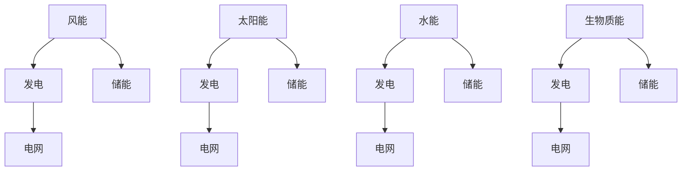
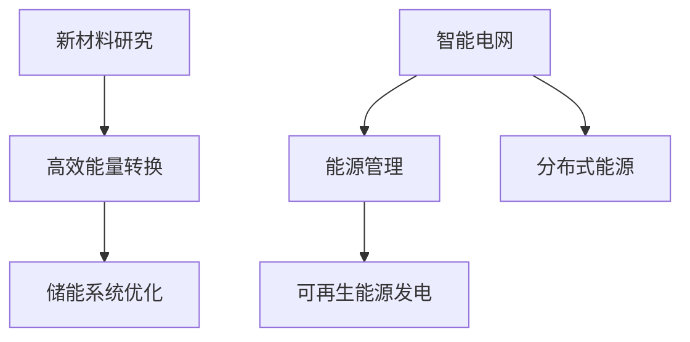
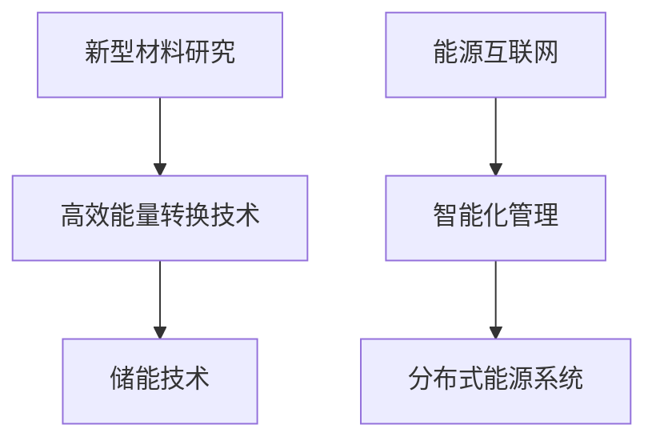

                 

### 第一部分：清洁能源领域技术概述

清洁能源领域的技术发展对于实现全球能源转型和减少环境污染具有重要意义。本部分将首先介绍清洁能源的基本概念与现状，并深入探讨相关的技术原理、算法和应用。

#### 第1章：清洁能源的基本概念与现状

**核心概念与联系**

清洁能源，通常指的是对环境污染较小或无污染的能源，包括风能、太阳能、水能、生物质能等。这些能源具有可再生性、低碳排放等优势，是实现能源结构优化和应对气候变化的重要手段。

- **风能**：利用风力旋转风车叶片产生动能，再通过发电机转化为电能。
- **太阳能**：通过太阳能电池板将太阳光能直接转化为电能或热能。
- **水能**：利用水的势能或动能转化为电能，如水力发电。
- **生物质能**：利用生物质材料（如木材、农作物残余物等）通过燃烧或发酵产生热能或电能。

**Mermaid流程图**

以下是清洁能源技术流程的Mermaid表示：



**核心算法原理讲解**

- **可再生能源预测模型**伪代码：

```python
def renewable_energy_prediction(model, parameters):
    # 输入参数：模型，预测参数
    # 输出：预测结果
    prediction = model.predict(parameters)
    return prediction
```

该模型通过输入历史数据和当前参数，预测未来一段时间内可再生能源的发电量。

- **清洁能源效率优化算法**伪代码：

```python
def energy_efficiency_optimization(model, objective_function, constraints):
    # 输入参数：模型，目标函数，约束条件
    # 输出：优化结果
    solution = model.optimize(objective_function, constraints)
    return solution
```

该算法通过优化目标函数和满足约束条件，寻找提高清洁能源系统效率的最佳方案。

**核心概念与联系**

清洁能源的技术创新，包括但不限于新型材料的研究、高效能量转换技术的开发、储能系统的优化等，都是推动清洁能源领域发展的关键。这些技术之间的联系在于它们共同致力于提高清洁能源的利用效率和降低成本。

**Mermaid流程图**

以下是清洁能源技术创新的Mermaid表示：



**数学模型和数学公式**

- **可再生能源发电成本模型**：

\[ C = C_0 + C_1 \cdot Q + C_2 \cdot Q^2 \]

其中，\( C \) 为总成本，\( C_0 \) 为固定成本，\( C_1 \) 为可变成本，\( Q \) 为产量。

通过这些模型和公式，我们可以更准确地评估和预测清洁能源项目的经济效益，为技术优化提供理论支持。

#### 第2章：清洁能源领域的技术创新

技术创新是推动清洁能源领域不断发展的核心动力。本章节将深入探讨清洁能源领域的技术创新，包括其定义、分类和应用。

**核心概念与联系**

技术创新，是指在现有的基础上，通过引入新的技术、工艺或方法，提高清洁能源的利用效率、降低成本、减少环境影响的过程。技术创新在清洁能源领域中主要体现在以下方面：

- **新型材料**：如高效率的太阳能电池材料、耐候性强的风能叶片材料等。
- **高效能量转换技术**：如高效的太阳能电池、风力发电机等。
- **储能技术**：如锂电池、氢能等高效、安全的储能系统。

**Mermaid流程图**

以下是清洁能源技术创新流程的Mermaid表示：



**数学模型和数学公式**

- **可再生能源发电成本模型**：

\[ C = C_0 + C_1 \cdot Q + C_2 \cdot Q^2 \]

其中，\( C \) 为总成本，\( C_0 \) 为固定成本，\( C_1 \) 为可变成本，\( Q \) 为产量。

该模型帮助评估不同清洁能源技术的经济效益，指导技术选择和优化。

通过技术创新，清洁能源系统在效率、成本和环保性等方面得到了显著提升。技术创新不仅推动了清洁能源技术的快速发展，也为全球能源转型提供了坚实的技术支撑。

#### 第3章：清洁能源技术案例分析

清洁能源技术的实际应用案例不仅展示了其可行性和效果，也为其他国家和地区提供了宝贵的经验和参考。本章节将介绍几个具有代表性的清洁能源技术案例，包括其背景、技术方案和效果评估。

**核心概念与联系**

案例研究在技术评估、政策制定和产业发展中具有重要价值。通过分析实际应用案例，可以深入理解清洁能源技术的性能、优势和挑战，为未来项目提供有益的指导。

**案例介绍**

1. **中国三峡水利枢纽工程**
   - **背景**：三峡水利枢纽工程是中国规模最大的水力发电站，位于长江上游。
   - **技术方案**：采用大型水力发电机组，结合水坝、水库和引水系统，实现高效发电。
   - **效果评估**：年发电量超过1000亿千瓦时，显著减少碳排放。

2. **丹麦风能发电项目**
   - **背景**：丹麦是世界上风能利用最广泛的国家之一。
   - **技术方案**：建设大规模风电场，采用高效风力发电机和智能电网控制系统。
   - **效果评估**：风能占丹麦总发电量的近一半，有效降低了对化石燃料的依赖。

3. **美国太阳能光伏项目**
   - **背景**：美国加利福尼亚州拥有丰富的太阳能资源。
   - **技术方案**：部署大规模太阳能光伏电站，结合储能系统实现稳定供电。
   - **效果评估**：显著减少了温室气体排放，提升了能源自给能力。

这些案例展示了清洁能源技术在不同应用场景下的成功实践，也为全球能源转型提供了有益的借鉴。通过不断优化和创新，清洁能源技术将在未来发挥更大的作用。

#### 第4章：数据驱动清洁能源优化

随着大数据和人工智能技术的快速发展，数据驱动方法在清洁能源优化中的应用越来越广泛。本章节将探讨数据驱动方法在清洁能源优化中的核心概念、数学模型和应用案例。

**核心概念与联系**

数据驱动方法，是指通过收集、处理和分析大量数据，发现数据中的规律和模式，从而指导实际决策和优化。在清洁能源领域，数据驱动方法主要用于以下方面：

- **发电量预测**：通过分析历史天气数据和能源消耗数据，预测未来一段时间内的能源需求。
- **系统效率优化**：通过分析运行数据，识别系统瓶颈和优化潜力，提高整体效率。
- **故障预测与维护**：通过监测设备运行状态，提前发现潜在故障，减少停机时间和维护成本。

**数学模型和数学公式**

- **优化目标函数**：

\[ \min Z = f(x_1, x_2, ..., x_n) \]

其中，\( Z \) 为优化目标，\( x_1, x_2, ..., x_n \) 为决策变量。

- **约束条件**：

\[ g(x) \leq 0 \]

\[ h(x) = 0 \]

这些公式帮助定义优化问题的目标和约束条件，确保优化结果的可行性和有效性。

**应用案例**

1. **美国德克萨斯州风电场优化**
   - **背景**：德克萨斯州拥有大量的风电场，但发电量波动较大。
   - **技术方案**：通过大数据分析，预测风电场的发电量，并优化调度策略。
   - **效果评估**：提高了风电场的发电稳定性，降低了系统运行成本。

2. **德国太阳能光伏电站优化**
   - **背景**：德国太阳能资源丰富，但光伏电站运行效率不高。
   - **技术方案**：通过数据分析和智能控制，优化光伏电站的运行参数。
   - **效果评估**：提高了光伏电站的发电效率，减少了能源浪费。

数据驱动方法在清洁能源优化中的应用，不仅提高了系统的运行效率和稳定性，也为清洁能源的可持续发展提供了有力支持。

#### 第5章：人工智能在清洁能源中的应用

人工智能（AI）技术的快速发展为清洁能源领域带来了全新的机遇和挑战。本章节将深入探讨人工智能在清洁能源中的应用，包括核心概念、技术原理和具体应用场景。

**核心概念与联系**

人工智能，是指通过计算机模拟人类智能行为，实现智能推理、学习和决策的技术。在清洁能源领域，人工智能主要用于以下几个方面：

- **能源预测与调度**：利用机器学习算法，预测能源需求和生产量，优化能源调度策略。
- **故障检测与维护**：利用深度学习算法，监测设备运行状态，提前发现潜在故障，提高设备可靠性。
- **能源管理优化**：利用强化学习算法，优化能源管理策略，提高系统效率。

**数学模型和数学公式**

- **智能电网优化模型**：

\[ \min \sum_{i=1}^{n} c_i \cdot x_i \]

\[ \text{s.t.} \quad Ax \leq b \]

其中，\( c_i \) 为第 \( i \) 项成本，\( x_i \) 为决策变量，\( A \) 为系数矩阵，\( b \) 为常数向量。

该模型通过优化成本函数和满足约束条件，实现电网运行的最优化。

**具体应用场景**

1. **智能电网调度**
   - **背景**：随着可再生能源的普及，电网调度变得更加复杂和动态。
   - **技术方案**：利用人工智能算法，预测电网负荷和可再生能源发电量，优化调度策略。
   - **效果评估**：提高了电网的调度效率和可靠性，降低了停电风险。

2. **风力发电故障预测**
   - **背景**：风力发电设备的故障可能导致停机，影响发电量和经济收益。
   - **技术方案**：利用深度学习算法，分析设备运行数据，预测潜在故障。
   - **效果评估**：提前发现故障，降低了维护成本，提高了设备运行效率。

人工智能在清洁能源领域的应用，不仅提升了能源利用效率和系统可靠性，也为能源行业的数字化转型提供了有力支持。

#### 第6章：清洁能源领域的系统集成与创新

在清洁能源领域，系统集成和创新是提高能源效率、降低成本和实现可持续发展的关键。本章节将探讨清洁能源系统集成与创新的核心概念、方法以及具体实现。

**核心概念与联系**

系统集成，是指将多种清洁能源技术、设备和系统进行有机整合，实现能源生产、传输和消费的优化。创新，则是指在现有技术基础上，通过改进、优化或引入新技术，提升系统的整体性能。

清洁能源系统集成与创新的核心概念包括：

- **多能协同**：通过整合风能、太阳能、水能等多种可再生能源，实现能源产量的稳定和多样化。
- **智能调控**：利用物联网、大数据和人工智能技术，实现能源系统的智能调度和优化。
- **储能优化**：通过储能系统与可再生能源的协同，提高能源利用效率和稳定性。

**数学模型和数学公式**

- **多能源系统优化模型**：

\[ \min \sum_{i=1}^{m} C_i \cdot y_i \]

\[ \text{s.t.} \quad A_x \cdot x + A_y \cdot y \leq b \]

其中，\( C_i \) 为第 \( i \) 项成本，\( y_i \) 为决策变量，\( A_x \) 和 \( A_y \) 为系数矩阵，\( b \) 为常数向量。

该模型通过优化成本和满足约束条件，实现多能源系统的最优配置和运行。

**具体实现方法**

1. **多能协同发电**
   - **背景**：单一可再生能源受天气和地理位置限制，发电不稳定。
   - **技术方案**：建设多能协同发电系统，结合风能、太阳能、水能等多种可再生能源。
   - **效果评估**：提高了能源供应的稳定性和可靠性，降低了能源成本。

2. **智能电网调控**
   - **背景**：智能电网可以实现能源的实时监测和动态调度。
   - **技术方案**：利用物联网技术，实现电网设备的互联互通，应用人工智能算法进行调度优化。
   - **效果评估**：提高了电网的调度效率和可靠性，减少了能源浪费。

3. **储能系统优化**
   - **背景**：储能系统能够调节可再生能源的供应与需求平衡，提高能源利用率。
   - **技术方案**：采用先进的储能技术，结合人工智能算法，优化储能系统的运行和管理。
   - **效果评估**：提高了储能系统的效率，降低了能源储存和释放的成本。

清洁能源领域的系统集成与创新，不仅推动了清洁能源技术的发展，也为实现全球能源转型和可持续发展目标提供了坚实的技术支撑。

#### 第7章：清洁能源领域的项目实施与运营

在清洁能源领域，项目实施与运营的成功离不开科学的管理和方法。本章节将探讨清洁能源项目实施与运营的核心概念、流程、关键技术和管理策略。

**核心概念与联系**

清洁能源项目的实施与运营涉及多个环节，包括项目规划、设计、建设、调试和运维。核心概念包括：

- **项目规划**：明确项目目标、范围、技术方案和投资预算。
- **设计**：根据项目需求，制定详细的工程设计方案。
- **建设**：按照设计要求，组织施工和设备安装。
- **调试**：进行设备调试和系统联调，确保正常运行。
- **运维**：持续监测和维护系统，保障稳定运行。

**项目实施流程**

1. **项目启动**：确定项目目标、范围和预算，组建项目团队。
2. **可行性研究**：进行市场调研、技术评估和经济分析。
3. **项目设计**：制定详细的设计方案，包括电气、结构、自动化等。
4. **招投标**：发布招标公告，选择合适的施工单位和设备供应商。
5. **项目施工**：按照设计要求，组织施工和设备安装。
6. **调试与验收**：进行设备调试和系统联调，确保系统正常运行。
7. **运维管理**：建立运维团队，制定运维手册，进行日常监控和维护。

**关键技术**

1. **可再生能源发电技术**：包括风能、太阳能、水能等可再生能源的发电技术。
2. **储能技术**：包括电池储能、氢能储能等先进储能技术。
3. **智能控制系统**：包括传感器、通信网络、控制系统等，实现能源系统的智能化和自动化。

**管理策略**

1. **项目管理**：采用项目管理方法，确保项目进度、质量和成本控制。
2. **风险管理**：识别项目风险，制定风险应对策略，降低风险影响。
3. **运维管理**：建立完善的运维体系，确保系统稳定运行和高效管理。

**项目实战**

以一个典型的清洁能源光伏发电项目为例：

1. **项目背景**：位于某地的光伏发电项目，计划装机容量为10兆瓦。
2. **技术方案**：采用多晶硅太阳能电池板，并配置储能系统和智能监控系统。
3. **实施过程**：
   - 项目启动：确定项目目标、预算和团队。
   - 可行性研究：分析项目地理位置、气候条件和经济性。
   - 设计：制定详细的电气、结构和自动化设计。
   - 招投标：选择合适的施工单位和设备供应商。
   - 施工：按照设计要求，进行光伏板安装和系统调试。
   - 调试与验收：进行系统联调，确保正常运行。
   - 运维管理：建立运维团队，进行日常监控和维护。

通过科学的项目实施与运营管理，清洁能源项目能够实现高效、稳定和可持续的运行，为能源转型和环境保护作出贡献。

#### 第8章：清洁能源领域的未来趋势与挑战

清洁能源领域的未来充满了机遇与挑战。随着技术的不断进步和全球环保意识的增强，清洁能源在未来能源结构中将扮演更加重要的角色。本章节将探讨清洁能源领域的未来趋势和面临的挑战，以及相应的数学模型和应用。

**核心概念与联系**

清洁能源的未来趋势包括以下几个方面：

- **技术进步**：新型材料、高效能量转换技术和先进储能系统的研发和应用。
- **市场化进程**：随着成本下降，清洁能源将在市场中逐渐取代传统化石能源。
- **政策支持**：全球范围内，各国政府纷纷出台政策，鼓励清洁能源的发展和利用。
- **系统集成**：多种清洁能源技术、设备和系统的协同，实现能源系统的优化和高效运行。

同时，清洁能源领域也面临一些挑战，如技术成熟度、成本、能源存储和电网稳定性等。

**数学模型和数学公式**

- **可再生能源发电容量规划模型**：

\[ P_t = \sum_{i=1}^{n} P_i \cdot y_i \]

其中，\( P_t \) 为总发电容量，\( P_i \) 为第 \( i \) 种可再生能源的发电容量，\( y_i \) 为是否建设的决策变量。

该模型用于规划不同清洁能源发电设施的规模和布局，以实现最佳经济效益和环保效果。

- **能源成本优化模型**：

\[ \min C = C_0 + C_1 \cdot Q + C_2 \cdot Q^2 \]

其中，\( C \) 为总成本，\( C_0 \) 为固定成本，\( C_1 \) 为可变成本，\( Q \) 为产量。

该模型帮助评估不同清洁能源技术的经济效益，指导技术选择和优化。

**未来趋势**

1. **技术进步**：新型材料如钙钛矿太阳能电池、高效风力发电机和固态电池等将在未来发挥重要作用，提高清洁能源的利用效率和降低成本。
2. **市场化进程**：随着清洁能源成本的下降和市场竞争的加剧，清洁能源将在能源市场中占据更大份额。
3. **政策支持**：各国政府将继续出台政策，鼓励清洁能源的发展和利用，推动全球能源转型。
4. **系统集成**：清洁能源系统的集成和协同将更加成熟，实现能源的高效、稳定和可持续利用。

**挑战与应对**

1. **技术成熟度**：提高清洁能源技术的成熟度和可靠性，通过研发和创新解决技术瓶颈。
2. **成本**：降低清洁能源的成本，通过规模经济、技术创新和政策支持等手段实现。
3. **能源存储**：发展高效的储能技术，解决可再生能源发电的波动性和电网稳定性问题。
4. **电网稳定性**：加强电网建设和智能化管理，提高电网的稳定性和适应性。

通过应对这些挑战，清洁能源将在未来发挥更加重要的作用，为全球能源转型和可持续发展做出贡献。

#### 第9章：技术能力与清洁能源领域的融合发展

技术能力的提升是推动清洁能源领域发展的重要动力。本章节将探讨技术能力在清洁能源领域的核心概念、评价方法和实际应用，并分析其与清洁能源领域的融合发展。

**核心概念与联系**

技术能力，是指一个组织或个人在技术研发、应用和管理方面的综合能力。在清洁能源领域，技术能力主要体现在以下几个方面：

- **技术研发能力**：包括清洁能源技术的研发、创新和优化。
- **技术应用能力**：将清洁能源技术应用于实际项目，实现能源的高效利用。
- **技术管理能力**：包括技术项目的管理、团队协作和风险控制。

技术能力与清洁能源领域的融合发展，意味着通过提升技术能力，实现清洁能源技术的突破和应用的深化，推动能源结构的优化和环境的改善。

**数学模型和数学公式**

- **技术能力评价模型**：

\[ C = \sum_{i=1}^{m} w_i \cdot C_i \]

其中，\( C \) 为技术能力评价总分，\( w_i \) 为第 \( i \) 项指标的权重，\( C_i \) 为第 \( i \) 项指标的得分。

该模型通过评价多个技术指标，综合评估一个组织或个人的技术能力。

**实际应用**

1. **技术研发能力提升**
   - **背景**：清洁能源技术不断更新，需要不断进行技术研发和创新。
   - **技术方案**：通过建立研发团队、投资研发设备和开展技术合作，提升技术研发能力。
   - **效果评估**：提高了清洁能源技术的成熟度和应用效果，推动了技术突破。

2. **技术应用能力提升**
   - **背景**：清洁能源项目需要高效、稳定的技术支持，实现能源的高效利用。
   - **技术方案**：通过培训技术人员、引进先进设备和优化项目管理，提升技术应用能力。
   - **效果评估**：提高了清洁能源项目的实施效率和质量，降低了项目风险。

3. **技术管理能力提升**
   - **背景**：清洁能源项目复杂，需要有效的技术管理来确保项目顺利实施。
   - **技术方案**：通过建立技术管理体系、制定技术标准和实施技术评审，提升技术管理能力。
   - **效果评估**：提高了项目的管理水平和运营效率，降低了技术风险。

技术能力与清洁能源领域的融合发展，不仅提升了清洁能源的技术水平和应用效果，也为实现全球能源转型和可持续发展提供了坚实的技术保障。

#### 第10章：政策与市场对清洁能源领域的影响

政策与市场是推动清洁能源领域发展的重要动力。本章节将探讨政策与市场对清洁能源领域的核心概念、机制影响和实际案例，分析其对清洁能源发展的推动作用。

**核心概念与联系**

政策，是指政府为推动清洁能源发展而制定的一系列法律、法规、规划和政策。市场，是指清洁能源技术、产品和服务进行交易和竞争的平台。政策与市场对清洁能源领域的影响主要体现在以下几个方面：

- **政策引导**：通过财政支持、税收优惠、补贴等政策手段，引导资金、技术和人才流向清洁能源领域。
- **市场机制**：通过市场竞争、价格机制、供需关系等市场机制，调节清洁能源的供需和价格。
- **市场环境**：通过完善基础设施、提高服务质量、促进技术创新等市场环境，为清洁能源的发展提供良好的外部条件。

**机制影响**

1. **政策引导**
   - **背景**：政府通过制定清洁能源发展政策，引导市场和社会资源投入清洁能源领域。
   - **影响**：政策引导可以激发企业和社会的清洁能源投资热情，促进技术创新和产业发展。

2. **市场机制**
   - **背景**：清洁能源市场竞争机制逐渐成熟，企业通过竞争实现技术进步和成本降低。
   - **影响**：市场竞争可以推动清洁能源技术的不断进步，降低清洁能源的使用成本，提高市场占有率。

3. **市场环境**
   - **背景**：政府通过改善市场环境，提高清洁能源的竞争力，推动清洁能源的广泛应用。
   - **影响**：良好的市场环境可以促进清洁能源项目的顺利实施，提高清洁能源的利用效率。

**实际案例**

1. **德国可再生能源政策**
   - **背景**：德国政府通过实施可再生能源法，提供大量补贴和税收优惠，推动可再生能源发展。
   - **影响**：德国在风能、太阳能等可再生能源领域取得了显著进展，成为全球清洁能源的领军国家。

2. **中国光伏市场**
   - **背景**：中国政府通过实施光伏补贴政策，推动光伏产业的发展。
   - **影响**：中国光伏产业迅速崛起，成为全球最大的光伏生产国和消费国，光伏成本大幅降低。

3. **美国电动汽车市场**
   - **背景**：美国政府通过实施税收优惠和补贴政策，推动电动汽车产业的发展。
   - **影响**：电动汽车市场迅速增长，推动了清洁能源产业的发展，降低了碳排放。

政策与市场对清洁能源领域的影响，通过引导投资、激发竞争和改善环境，推动了清洁能源的快速发展，为实现全球能源转型和可持续发展目标提供了有力支持。

### 附录

#### 第11章：技术资源与工具指南

在清洁能源领域，技术资源和工具的选择对于项目的成功实施至关重要。本章节将介绍一些常用的技术资源、工具及其功能和使用方法，以帮助读者更好地理解和应用这些工具。

**核心概念与联系**

技术资源和工具是清洁能源项目开发和实施过程中必不可少的支撑。合理选择和使用这些资源和工具，可以提高工作效率、降低成本、保证质量。

**工具介绍**

1. **智能电网管理系统（如Digsilent PowerFactory）**
   - **功能**：用于智能电网的规划、设计和运行管理。
   - **使用方法**：通过模拟和仿真，分析电网的运行状态和稳定性，优化电力调度。

2. **太阳能模拟工具（如PVsyst）**
   - **功能**：用于太阳能光伏系统的设计、模拟和性能评估。
   - **使用方法**：输入项目地点和太阳能电池板参数，进行系统模拟和优化设计。

3. **风能模拟工具（如WAsP）**
   - **功能**：用于风能资源评估和风能项目的规划。
   - **使用方法**：输入项目地点和风速数据，进行风能资源分析和方案设计。

4. **大数据分析平台（如Hadoop、Spark）**
   - **功能**：用于大规模数据处理和分析。
   - **使用方法**：通过分布式计算框架，处理和挖掘清洁能源项目产生的海量数据。

5. **机器学习平台（如TensorFlow、Keras）**
   - **功能**：用于开发机器学习模型和算法。
   - **使用方法**：设计并训练机器学习模型，用于清洁能源预测、故障检测等。

**功能和使用方法**

- **智能电网管理系统**：通过模拟电网运行，分析电网稳定性，优化电力调度，确保电网安全运行。
  - **示例**：利用PowerFactory进行电网故障分析和优化调度，提高电网的稳定性和可靠性。

- **太阳能模拟工具**：用于设计太阳能光伏系统，评估系统性能和经济效益。
  - **示例**：使用PVsyst进行光伏系统的布局优化，最大化光伏发电量。

- **风能模拟工具**：评估风能资源，设计风能项目，确保项目的经济效益和可行性。
  - **示例**：利用WAsP进行风能资源评估，确定最佳风电机组布局。

- **大数据分析平台**：处理和挖掘清洁能源项目数据，实现数据驱动决策。
  - **示例**：使用Hadoop和Spark进行风力发电数据的实时分析和预测。

- **机器学习平台**：开发机器学习模型，用于清洁能源系统的预测和优化。
  - **示例**：使用TensorFlow和Keras建立可再生能源发电量的预测模型，提高发电效率。

通过合理选择和使用这些技术资源和工具，可以显著提升清洁能源项目的实施效果，推动清洁能源领域的创新发展。

#### 第12章：清洁能源领域的未来研究展望

清洁能源领域的研究与发展是一个持续的过程，未来还将面临许多新的挑战和机遇。本章节将探讨清洁能源领域的未来研究方向、研究挑战和可能的突破点。

**核心概念与联系**

随着全球气候变化和能源需求不断增加，清洁能源的研究和发展成为了一个长期而重要的课题。未来研究的主要方向将集中在以下几个方面：

1. **高效能量转换技术**：研究新型材料和高效率能量转换设备，提高清洁能源的转换效率。
2. **先进储能技术**：开发高效、安全、低成本的储能技术，解决可再生能源的波动性和不稳定性。
3. **智能电网与能源互联网**：构建智能电网和能源互联网，实现清洁能源的高效调度和管理。
4. **多能协同与系统集成**：研究多种清洁能源的协同应用，实现能源的高效利用和可持续发展。

**未来研究方向**

1. **高效能量转换技术**
   - **研究挑战**：提高能量转换效率，降低转换损耗，延长设备寿命。
   - **突破点**：新型光伏材料、高效风力发电机和热能转换技术。

2. **先进储能技术**
   - **研究挑战**：提高储能密度，降低成本，确保安全性和可靠性。
   - **突破点**：固态电池、氢能和超级电容器。

3. **智能电网与能源互联网**
   - **研究挑战**：实现电网的智能化和自主化，提高电网的稳定性和适应性。
   - **突破点**：物联网技术、人工智能和大数据分析。

4. **多能协同与系统集成**
   - **研究挑战**：优化系统设计，实现多种能源的高效协同和集成。
   - **突破点**：多能协同系统模型、智能调度算法和系统集成技术。

**可能的研究成果**

1. **高效能量转换技术**：新型光伏材料和风力发电机将大幅提高清洁能源的转换效率，降低发电成本。
2. **先进储能技术**：固态电池和氢能技术的突破，将显著提高储能系统的性能和安全性。
3. **智能电网与能源互联网**：智能电网和能源互联网的构建，将实现清洁能源的高效调度和优化管理。
4. **多能协同与系统集成**：多种清洁能源的协同应用，将实现能源的高效利用和可持续发展。

通过未来的研究和创新，清洁能源领域将继续发展，为实现全球能源转型和可持续发展目标提供强有力的技术支撑。

