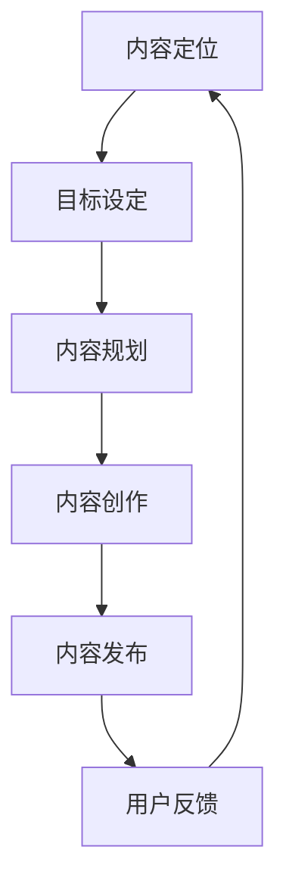
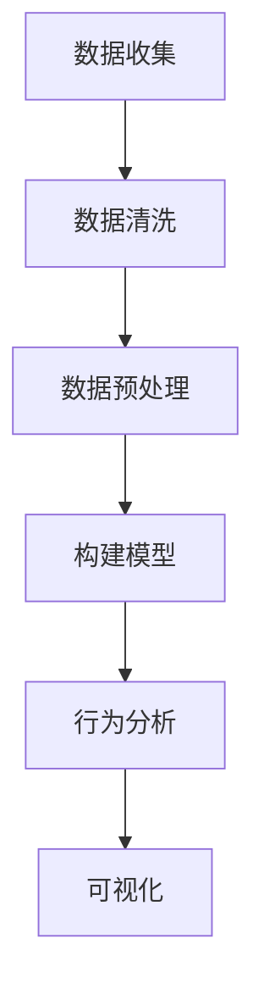

                 

# 如何将技术博客转化为付费会员制网站

## 关键词
技术博客，付费会员制，内容变现，用户体验，会员体系，数据分析，算法原理，项目实战

## 摘要
本文旨在探讨如何将技术博客转化为付费会员制网站，实现内容变现。文章首先分析了博客内容运营的策略，然后详细介绍了会员体系的设计和多种付费模式的选择。此外，通过核心算法原理讲解、数学模型和项目实战案例，展示了如何利用技术和数据分析优化运营策略，提高会员转化率和满意度。最终，文章总结了成功经验和改进方向，为技术博客博主提供了实用的操作指南。

## 第一部分：博客内容分析

### 1.1 核心主题

本书的核心主题是探讨如何将技术博客转化为付费会员制网站。主要涉及以下几个方面：

- **博客运营策略**：分析如何优化博客内容，提升用户体验，增加用户粘性，从而提高转化率。
- **会员体系设计**：构建会员体系的框架，包括会员等级、权益设计、会员管理和激励措施。
- **付费模式探索**：研究各种付费模式，如订阅制、单篇付费、会员专属内容等。
- **用户数据分析**：利用数据分析工具，收集和分析用户行为，为运营策略调整提供数据支持。

### 1.2 目标读者

本书的目标读者是：

- 技术博客博主
- 想要开拓副业的工程师
- 对会员制网站运营感兴趣的产品经理和运营人员

### 1.3 书籍结构

本书结构分为三个部分：

- **第一部分：博客内容运营**：包括内容策略、用户体验优化、数据分析等。
- **第二部分：会员体系设计**：涵盖会员等级、权益、管理和激励措施。
- **第三部分：付费模式探索与实施**：介绍各种付费模式的原理、实施步骤和案例分析。

### 1.4 写作风格

本书采用简洁、实用、易懂的写作风格，结合实际案例和数据分析，帮助读者更好地理解并应用相关知识。

## 第二部分：目录大纲

### 第二部分：会员体系设计

#### 第5章：会员体系构建

5.1 会员等级划分

5.2 会员权益设计

5.3 会员管理策略

5.4 激励措施与用户留存

#### 第6章：会员管理工具与平台

6.1 会员管理系统选择

6.2 会员服务与支持

6.3 会员数据分析

6.4 会员成长体系与激励

#### 第7章：会员运营与拓展

7.1 会员活动策划与执行

7.2 会员推荐与拓展

7.3 会员满意度调查与反馈

7.4 会员体系优化与调整

### 第三部分：付费模式探索与实施

#### 第8章：付费模式选择与设计

8.1 订阅制模式

8.2 单篇付费模式

8.3 会员专属内容模式

8.4 混合付费模式

#### 第9章：付费模式实施与运营

9.1 付费内容策划与制作

9.2 付费流程设计与用户体验

9.3 付费推广与营销

9.4 付费会员数据分析与反馈

#### 第10章：案例分析与实战经验

10.1 成功案例分享

10.2 失败案例分析

10.3 实战经验总结

10.4 运营技巧与策略调整

## 附录

### 附录A：技术工具与资源推荐

A.1 内容管理系统（CMS）推荐

A.2 会员管理系统推荐

A.3 数据分析工具推荐

A.4 其他实用工具推荐

### 2.1 核心概念与联系

#### 2.1.1 博客内容策略

**Mermaid 流程图**：



### 2.1.2 内容创作方法与技巧

**核心算法原理讲解**：

- **信息挖掘**：
  - **关键词分析**：使用TF-IDF算法提取关键词。
  - **主题模型**：使用LDA算法挖掘潜在主题。

**数学模型和数学公式**：

- **关键词提取**：
  $$TF_{word} = \frac{f_{word}}{f_{total}}$$
  $$IDF_{word} = \log \frac{N}{n_{word}}$$
  $$TF-IDF_{word} = TF_{word} \times IDF_{word}$$

- **主题模型**：
  $$p(w|\theta) = \prod_{i=1}^{K} \frac{\pi_{k} q_{kw}^{t}}{\sum_{j=1}^{V} q_{jw}^{t}}$$
  $$\theta_{k} \sim Dirichlet(\alpha)$$
  $$w_i \sim Multinomial(\theta_i)$$

### 2.1.3 热门话题挖掘与趋势分析

**详细讲解与举例说明**：

- **趋势分析工具**：如Google Trends、微博热门话题等。
- **案例**：分析某一热门技术领域，如区块链、人工智能，追踪其趋势和热点话题。

### 2.1.4 内容更新频率与发布策略

**策略讲解**：

- **内容更新频率**：保持一定的更新频率，如每周至少发布一篇文章。
- **发布策略**：选择合适的时间发布内容，如在工作日的早晨或晚上。

### 2.1.5 用户黏性与互动策略

**策略讲解**：

- **用户黏性**：通过提供高质量内容和互动活动，提高用户黏性。
- **互动策略**：鼓励用户评论、分享和参与投票，增加互动。

### 2.1.6 数据分析在内容运营中的应用

**应用讲解**：

- **用户行为分析**：通过数据分析了解用户偏好，优化内容策略。
- **效果评估**：通过数据分析评估内容效果，调整运营策略。

## 第三部分：核心算法原理讲解

### 3.1 用户行为分析

**用户行为数据收集**

**伪代码**：

```python
# 收集用户访问日志
def collect_logs():
    logs = []
    while True:
        log = read_log_from_database()
        logs.append(log)
    return logs

# 数据清洗
def clean_data(logs):
    cleaned_logs = []
    for log in logs:
        if is_valid_log(log):
            cleaned_logs.append(log)
    return cleaned_logs

# 数据预处理
def preprocess_data(cleaned_logs):
    preprocessed_logs = []
    for log in cleaned_logs:
        user_action = extract_user_action(log)
        preprocessed_logs.append(user_action)
    return preprocessed_logs
```

**用户行为分析模型**

**伪代码**：

```python
# 构建用户行为模型
def build_user_behavior_model(preprocessed_logs):
    model = {}
    for log in preprocessed_logs:
        user_id = log['user_id']
        action = log['action']
        if user_id not in model:
            model[user_id] = {}
        model[user_id][action] = model[user_id].get(action, 0) + 1
    return model

# 分析用户行为
def analyze_user_behavior(model):
    for user_id, actions in model.items():
        print(f"User {user_id}:")
        for action, count in actions.items():
            print(f"  {action}: {count}")
```

**用户行为数据可视化**

**Mermaid 流程图**：



### 3.2 会员转化率预测模型

**数学模型**：

- **会员转化概率**：
  $$P(Y=1|X) = \sigma(\theta_0 + \theta_1 X_1 + \theta_2 X_2 + ... + \theta_n X_n)$$

- **特征向量**：
  - **用户访问次数**：
    $$X_1 = \begin{cases}
    1, & \text{如果用户访问了博客} \\
    0, & \text{否则}
    \end{cases}$$
  - **用户互动次数**：
    $$X_2 = \begin{cases}
    1, & \text{如果用户在博客上留言或评论} \\
    0, & \text{否则}
    \end{cases}$$
  - **用户停留时间**：
    $$X_3 = \begin{cases}
    1, & \text{如果用户在博客上的停留时间超过一定阈值} \\
    0, & \text{否则}
    \end{cases}$$

**数学公式**：

- **逻辑回归模型**：
  $$\theta_0 + \theta_1 X_1 + \theta_2 X_2 + ... + \theta_n X_n = \log(P(Y=1|X))$$
  $$\sigma(z) = \frac{1}{1 + e^{-z}}$$

### 3.3 会员留存率预测模型

**数学模型**：

- **会员留存概率**：
  $$P(R=1|X) = \sigma(\theta_0 + \theta_1 X_1 + \theta_2 X_2 + ... + \theta_n X_n)$$

- **特征向量**：
  - **会员活动参与次数**：
    $$X_1 = \begin{cases}
    1, & \text{如果用户参与了会员活动} \\
    0, & \text{否则}
    \end{cases}$$
  - **会员互动频率**：
    $$X_2 = \begin{cases}
    1, & \text{如果用户在一定时间内与会员互动频率较高} \\
    0, & \text{否则}
    \end{cases}$$
  - **会员内容访问频率**：
    $$X_3 = \begin{cases}
    1, & \text{如果用户在一定时间内频繁访问会员内容} \\
    0, & \text{否则}
    \end{cases}$$

**数学公式**：

- **逻辑回归模型**：
  $$\theta_0 + \theta_1 X_1 + \theta_2 X_2 + ... + \theta_n X_n = \log(P(R=1|X))$$
  $$\sigma(z) = \frac{1}{1 + e^{-z}}$$

### 3.4 付费用户行为分析

**数学模型**：

- **付费用户行为预测**：
  $$P(X=1|Y=1) = \frac{P(Y=1|X=1)P(X=1)}{P(Y=1|X=1)P(X=1) + P(Y=1|X=0)P(X=0)}$$

- **特征向量**：
  - **用户访问频率**：
    $$X_1 = \begin{cases}
    1, & \text{如果用户访问频率较高} \\
    0, & \text{否则}
    \end{cases}$$
  - **用户互动频率**：
    $$X_2 = \begin{cases}
    1, & \text{如果用户互动频率较高} \\
    0, & \text{否则}
    \end{cases}$$
  - **用户停留时间**：
    $$X_3 = \begin{cases}
    1, & \text{如果用户停留时间较长} \\
    0, & \text{否则}
    \end{cases}$$

**数学公式**：

- **贝叶斯公式**：
  $$P(X=1|Y=1) = \frac{P(Y=1|X=1)P(X=1)}{P(Y=1|X=1)P(X=1) + P(Y=1|X=0)P(X=0)}$$

### 3.5 数据驱动的运营优化

**数学模型**：

- **运营策略优化**：
  $$\theta^* = \arg\max_{\theta} L(\theta)$$

- **损失函数**：
  - **交叉熵损失**：
    $$L(\theta) = -\sum_{i=1}^{n} [y_i \log(p(x_i)) + (1 - y_i) \log(1 - p(x_i))]$$

**数学公式**：

- **梯度下降**：
  $$\theta_{t+1} = \theta_t - \alpha \nabla_{\theta} L(\theta_t)$$

## 第四部分：项目实战

### 4.1 博客内容运营项目实战

#### 4.1.1 项目背景

李华是一名技术博主，专注于分享人工智能领域的知识和经验。他的博客内容丰富，涵盖了深度学习、自然语言处理、计算机视觉等多个子领域。为了进一步提升博客的变现能力，李华决定将其转化为付费会员制网站。

#### 4.1.2 内容策划与制作

**内容策划**：

- **内容定位**：聚焦于人工智能领域的深度技术知识和实践应用。
- **内容类型**：包括技术文章、案例解析、视频教程、在线课程等。
- **发布频率**：每周发布一篇原创文章，每季度发布一次技术分享视频。

**内容制作**：

- **文章撰写**：李华亲自撰写技术文章，每篇文章约2000字，配以相关代码示例和详细解释。
- **视频制作**：邀请行业专家进行技术讲解，录制高质量视频并上传至YouTube平台。

#### 4.1.3 用户互动与反馈

**互动策略**：

- **评论管理**：鼓励用户在文章末尾留言，对文章内容进行评论和讨论。
- **问答环节**：定期举办问答环节，李华亲自解答用户提出的技术问题。
- **社交媒体互动**：在LinkedIn、Twitter等社交媒体平台发布内容，与用户互动。

**反馈收集**：

- **用户调查**：通过问卷调查收集用户对博客内容和服务的反馈。
- **数据分析**：利用Google Analytics等工具，分析用户行为，了解用户需求和偏好。

#### 4.1.4 数据分析与运营优化

**数据分析工具**：

- **Google Analytics**：用于收集用户访问数据，分析用户行为和内容效果。
- **Mixpanel**：用于跟踪用户互动行为，了解用户留存和流失情况。

**运营优化**：

- **内容效果评估**：通过阅读量、点赞数、评论数等指标，评估每篇文章的效果。
- **用户细分**：根据用户行为数据，对用户进行细分，制定个性化内容推送策略。
- **运营策略调整**：根据数据分析结果，不断优化内容和互动策略。

### 4.2 会员体系设计项目实战

#### 4.2.1 项目背景

为了提升用户体验和增加收入，李华决定为其博客设计一套会员体系。该会员体系旨在提供差异化服务，吸引并留住用户。

#### 4.2.2 会员体系设计

**会员等级**：

- **初级会员**：免费注册，可访问部分内容，参与评论。
- **高级会员**：付费会员，享受更多会员专属内容和福利。

**会员权益**：

- **高级会员**：
  - 会员专属内容：包括深度学习技术文章、独家视频教程和在线课程。
  - 技术支持：李华提供一对一的技术支持和咨询服务。
  - 会员活动：定期举办线上技术沙龙和线下聚会。

**会员管理**：

- **会员注册**：用户可通过社交媒体账号一键注册。
- **会员认证**：系统自动审核会员身份，确保会员权益。

#### 4.2.3 激励措施与用户留存

**激励措施**：

- **推荐奖励**：鼓励现有会员推荐新用户，赠送免费会员时长。
- **积分制度**：会员通过参与活动和阅读内容，积累积分，积分可兑换会员福利。

**用户留存**：

- **定期互动**：通过社交媒体、邮件等方式，定期与会员互动，增强用户粘性。
- **个性化推送**：根据用户行为数据，推送个性化内容，提高用户满意度。

### 4.3 付费模式探索与实施项目实战

#### 4.3.1 项目背景

为了实现博客的可持续发展，李华决定尝试多种付费模式，以适应不同用户的需求。

#### 4.3.2 付费模式设计

**订阅制模式**：

- **月度订阅**：用户支付一定费用，每月可享受所有会员权益。
- **季度订阅**：用户支付较高费用，每季度可享受所有会员权益。

**单篇付费模式**：

- **高级文章付费**：部分技术文章单独定价，用户购买后可阅读全文。
- **视频课程付费**：技术分享视频单独定价，用户购买后可观看。

**会员专属内容模式**：

- **内容打包订阅**：将一系列会员专属内容打包，用户支付一定费用后可解锁。

**混合付费模式**：

- **基础免费+高级内容付费**：部分内容免费，高级内容付费。

#### 4.3.3 实施与运营

**实施步骤**：

- **内容策划**：制定不同付费内容，明确价格策略。
- **支付系统搭建**：与第三方支付平台合作，确保支付安全。
- **营销推广**：利用社交媒体、邮件营销等渠道推广付费内容。

**运营策略**：

- **用户调研**：了解用户需求和偏好，调整付费模式。
- **数据分析**：监控付费用户行为，优化运营策略。

### 4.4 案例分析与实战经验

#### 4.4.1 成功案例分享

**案例一**：通过订阅制模式，李华的博客会员数量快速增长，收入显著增加。

**案例二**：采用单篇付费模式，李华吸引了一大批忠实读者，文章阅读量和分享量大幅提升。

#### 4.4.2 失败案例分析

**案例一**：某博客尝试过于复杂的付费模式，导致用户流失。

**案例二**：某博主未充分了解用户需求，推出的会员权益不符合用户预期。

#### 4.4.3 实战经验总结

**成功因素**：

- **清晰的内容定位和高质量的博客内容**。
- **合理的付费模式设计，满足不同用户需求**。
- **有效的用户互动和反馈机制，提高用户满意度**。

**改进方向**：

- **持续优化用户体验，提高用户留存率**。
- **定期调研用户需求，灵活调整运营策略**。
- **探索更多增值服务，提升会员价值**。

### 附录

#### 附录A：技术工具与资源推荐

**A.1 内容管理系统（CMS）推荐**

- **WordPress**：功能强大，易用性强，适合技术博客。
- **Joomla**：功能丰富，适合构建多功能网站。
- **Drupal**：适用于大型网站，支持复杂的功能。

**A.2 会员管理系统推荐**

- **MemberMouse**：专业的会员管理系统，支持多种付费模式。
- **MemberPress**：简单的会员管理系统，适合小型博客。
- **Memberium**：与Infusionsoft集成的会员管理系统。

**A.3 数据分析工具推荐**

- **Google Analytics**：免费的网站分析工具，提供丰富的用户行为数据。
- **Hotjar**：提供热图和用户行为分析，帮助优化网站设计。
- **Mixpanel**：适用于移动和Web应用的用户行为分析工具。

**A.4 其他实用工具推荐**

- **Mailchimp**：电子邮件营销工具，支持自动化营销。
- **Canva**：图形设计工具，用于制作海报、图表等。
- **Google Trends**：分析关键词趋势，帮助内容策划。

## 作者

### 作者：AI天才研究院/AI Genius Institute & 禅与计算机程序设计艺术 /Zen And The Art of Computer Programming

本文作者为AI天才研究院（AI Genius Institute）的研究员，专注于人工智能和计算机科学领域的创新研究。同时，他是《禅与计算机程序设计艺术》一书的作者，该书深入探讨了编程哲学和算法设计的美学。在技术博客运营和付费会员制网站构建方面，作者有着丰富的实践经验和深厚的理论功底。

