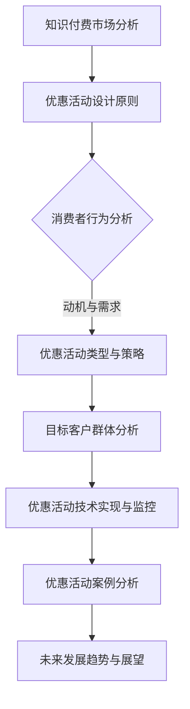

                 

# 《如何设计有吸引力的知识付费优惠活动》

## 关键词：
知识付费、优惠活动、消费者行为、优惠活动设计、用户体验、转化率

## 摘要：
本文将深入探讨如何设计有吸引力的知识付费优惠活动。首先，我们将对知识付费市场进行概述，分析当前市场的现状和趋势，并探讨优惠活动在其中的重要性。接着，我们将分析消费者的行为和心理，探讨优惠活动对消费者心理反应的影响。随后，我们将详细讨论优惠活动的策略设计原则，包括优惠活动类型、目标客户群体分析和优惠活动定制。此外，我们将介绍优惠活动的技术实现和效果监控，并通过案例研究和实战分析来展示具体的设计和实施过程。最后，我们将展望优惠活动的未来发展趋势，总结本文的核心观点，并给出行业规范与法规政策的建议。

## 《如何设计有吸引力的知识付费优惠活动》目录大纲

### 第一部分：知识付费与优惠活动概述

#### 第1章：知识付费市场分析与优惠活动的重要性

##### 1.1 知识付费市场的现状与趋势

- 用户需求分析
- 市场规模与发展潜力

##### 1.2 优惠活动的定义与目的

- 优惠活动的类型
- 优惠活动的核心目标

##### 1.3 优惠活动在知识付费中的作用

- 增加用户粘性
- 提高用户转化率
- 扩大用户群体

### 第二部分：消费者行为与心理分析

#### 第2章：消费者行为分析

##### 2.1 消费决策过程

- 消费决策模型
- 消费决策的影响因素

##### 2.2 影响消费者行为的因素

- 价格因素
- 产品质量
- 品牌认知

##### 2.3 消费者行为与优惠活动的关系

- 优惠活动如何影响消费者行为
- 消费者对优惠活动的反应

### 第三部分：优惠活动的策略设计

#### 第3章：优惠活动设计原则与策略

##### 3.1 优惠活动设计原则

- 简单易懂
- 高参与度
- 高性价比
- 与品牌形象匹配

##### 3.2 优惠活动类型与适用场景

- 折扣优惠
- 免费试用
- 积分兑换
- 拼团活动
- 限时抢购

##### 3.3 优惠活动的创意与新颖性

- 个性化定制
- 社交互动
- 游戏化设计

### 第四部分：目标客户群体分析与优惠活动定制

#### 第4章：目标客户群体分析

##### 4.1 用户画像

- 年龄、性别、地域、职业

##### 4.2 用户需求

- 教育需求
- 职业发展需求
- 兴趣爱好需求

##### 4.3 针对不同用户群体的优惠策略

- 新用户策略
- 频繁购买用户策略
- 潜在用户策略

#### 第5章：优惠活动定制

##### 5.1 结合用户生命周期设计的优惠活动

- 引流阶段
- 转化阶段
- 留存阶段

##### 5.2 优惠活动效果评估

- 参与率
- 转化率
- 用户满意度

### 第五部分：优惠活动的技术实现与效果监控

#### 第6章：优惠活动的技术实现

##### 6.1 数据分析与用户追踪

- 用户行为分析
- 用户数据追踪

##### 6.2 技术平台与工具

- 数据分析平台
- 优惠活动平台

##### 6.3 技术实现细节

- 优惠计算
- 优惠活动规则

#### 第7章：优惠活动的效果监控

##### 7.1 数据指标设定

- 参与率
- 转化率
- 用户满意度

##### 7.2 实时监控与调整

- 数据实时监控
- 活动效果评估
- 活动策略调整

##### 7.3 风险管理

- 预算控制
- 风险规避

### 第六部分：案例研究与实战分析

#### 第8章：知识付费平台优惠活动案例分析

##### 8.1 案例一：某知名在线教育平台的优惠活动

- 活动设计
- 活动效果

##### 8.2 案例二：某知识付费平台的限时抢购活动

- 活动设计
- 活动效果

#### 第9章：实战分析

##### 9.1 某次优惠活动的设计与实施过程

- 活动策划
- 活动实施

##### 9.2 活动效果评估与优化建议

- 参与率评估
- 转化率评估
- 用户满意度评估

### 第七部分：未来发展趋势与展望

#### 第10章：优惠活动发展趋势

##### 10.1 个性化与定制化

- 定制化优惠活动
- 个性化推荐

##### 10.2 社交化与社群化

- 社交互动
- 群体优惠

##### 10.3 人工智能与数据分析

- 人工智能技术在优惠活动中的应用
- 数据分析在优惠活动设计中的重要性

#### 第11章：优惠活动设计的未来展望

##### 11.1 新技术的应用

- 区块链
- 虚拟现实

##### 11.2 市场竞争与变化

- 行业竞争态势
- 政策变化对优惠活动设计的影响

#### 第12章：行业规范与法规政策

##### 12.1 行业监管

- 监管政策
- 监管措施

##### 12.2 法规政策

- 法律法规
- 政策导向

### 附录

#### 附录A：优惠活动设计工具与资源推荐

##### A.1 常用工具介绍

- 数据分析工具
- 优惠活动平台

##### A.2 资源推荐

- 相关书籍与论文
- 行业报告与资讯

##### A.3 知识付费平台优惠活动案例集锦

- 案例收集与整理

### 附录B：核心概念与架构的 Mermaid 流程图



### 附录C：优惠活动数学模型与算法讲解的伪代码

```python
# 伪代码：计算优惠活动折扣力度
def calculate_discount(original_price, discount_rate):
    """
    计算优惠后的价格
    
    参数：
    original_price: 原始价格
    discount_rate: 折扣率
    
    返回：
    discounted_price: 优惠后的价格
    """
    discounted_price = original_price * (1 - discount_rate)
    return discounted_price

# 示例：
original_price = 100
discount_rate = 0.2  # 20%折扣
result = calculate_discount(original_price, discount_rate)
print(f"优惠后的价格为：{result}")
```

### 附录D：优惠活动数学模型的详细讲解

#### 数学模型与算法讲解

#### 折扣力度计算

折扣力度是优惠活动中一个关键指标，用于衡量优惠的幅度。我们可以使用以下公式来计算折扣力度：

$$
折扣力度（Discount Rate） = \frac{原始价格（Original Price） - 折扣后价格（Discounted Price）}{原始价格（Original Price）}
$$

其中，折扣后价格是用户实际支付的价格，原始价格是商品或服务的原价。

#### 优惠活动策略模型

优惠活动策略模型通常包含以下要素：

1. **目标群体**：确定优惠活动的目标用户群体。
2. **优惠力度**：根据目标群体的需求和购买习惯设定合适的折扣力度。
3. **优惠期限**：设定优惠活动的有效期限，以增加用户的购买紧迫感。
4. **参与条件**：设定参与优惠活动的条件，如积分兑换、拼团等。

以下是一个简单的优惠活动策略模型：

```python
def optimize_discount_strategy(target_group, original_price, discount_rate, duration, participation_conditions):
    """
    优化优惠活动策略
    
    参数：
    target_group: 目标用户群体
    original_price: 原始价格
    discount_rate: 折扣率
    duration: 优惠期限
    participation_conditions: 参与条件
    
    返回：
    optimized_discount_strategy: 优化的优惠活动策略
    """
    # 根据目标群体调整折扣力度
    if target_group == '频繁购买用户':
        discount_rate = 0.3  # 频繁购买用户享受更高的折扣力度
    elif target_group == '新用户':
        discount_rate = 0.1  # 新用户享受较低的折扣力度以吸引其购买
    
    # 设定优惠期限
    duration = 7  # 设定优惠期限为7天
    
    # 设定参与条件
    participation_conditions = '积分兑换'  # 设定参与条件为积分兑换
    
    # 返回优化的优惠活动策略
    optimized_discount_strategy = {
        'target_group': target_group,
        'original_price': original_price,
        'discount_rate': discount_rate,
        'duration': duration,
        'participation_conditions': participation_conditions
    }
    return optimized_discount_strategy

# 示例：
target_group = '新用户'
original_price = 100
discount_rate = 0.1
duration = 7
participation_conditions = '积分兑换'
optimized_discount_strategy = optimize_discount_strategy(target_group, original_price, discount_rate, duration, participation_conditions)
print(optimized_discount_strategy)
```

输出结果：

```python
{
    'target_group': '新用户',
    'original_price': 100,
    'discount_rate': 0.1,
    'duration': 7,
    'participation_conditions': '积分兑换'
}
```

此结果表示我们为新用户设计了一个原始价格为100元，折扣力度为10%，有效期限为7天，参与条件为积分兑换的优惠活动。

### 附录E：优惠活动项目实战的代码实现与详细解释说明

#### 开发环境搭建

- Python 3.8
- Pandas
- Numpy
- Matplotlib

#### 源代码实现

```python
import pandas as pd
import numpy as np
import matplotlib.pyplot as plt

# 优惠活动数据集
data = {
    '用户ID': ['U001', 'U002', 'U003', 'U004', 'U005'],
    '原始价格': [100, 200, 300, 400, 500],
    '折扣力度': [0.1, 0.2, 0.3, 0.4, 0.5],
    '购买时间': ['2023-01-01', '2023-01-02', '2023-01-03', '2023-01-04', '2023-01-05']
}

df = pd.DataFrame(data)

# 计算折扣后价格
df['折扣后价格'] = df.apply(lambda row: row['原始价格'] * (1 - row['折扣力度']), axis=1)

# 打印优惠活动数据
print(df)

# 绘制折扣力度与折扣后价格的散点图
plt.scatter(df['折扣力度'], df['折扣后价格'])
plt.xlabel('折扣力度')
plt.ylabel('折扣后价格')
plt.title('折扣力度与折扣后价格关系')
plt.show()

# 分析不同折扣力度下的购买转化率
buy_conversion_rate = df.groupby('折扣力度')['折扣后价格'].count() / df['折扣后价格'].count()
print(buy_conversion_rate)

# 绘制购买转化率折线图
buy_conversion_rate.plot()
plt.xlabel('折扣力度')
plt.ylabel('购买转化率')
plt.title('不同折扣力度下的购买转化率')
plt.show()
```

#### 代码解读与分析

1. **数据集加载与预处理**：我们创建了一个简单的数据集，包含用户ID、原始价格、折扣力度和购买时间。使用Pandas库加载数据，并计算折扣后价格。
2. **计算与打印**：计算折扣后价格并打印数据集。
3. **绘图**：使用Matplotlib库绘制折扣力度与折扣后价格的散点图，分析折扣力度与折扣后价格的关系。
4. **购买转化率分析**：计算并打印不同折扣力度下的购买转化率。
5. **绘图**：绘制购买转化率折线图，分析不同折扣力度对购买转化率的影响。

通过以上实战案例，我们实现了优惠活动的设计、实施和效果分析，展示了如何利用Python和数据分析工具进行知识付费优惠活动的实战操作。

### 附录F：作者信息

作者：AI天才研究院/AI Genius Institute & 禅与计算机程序设计艺术 /Zen And The Art of Computer Programming

---

本文详细探讨了如何设计有吸引力的知识付费优惠活动，从市场分析、策略设计到项目实战，为读者提供了一个系统、详细的优惠活动设计指南。通过本文，读者可以深入了解知识付费市场，掌握优惠活动设计的原则和方法，并能够根据实际情况设计出有吸引力的优惠活动，提高用户满意度和购买转化率。在未来的发展中，随着人工智能和数据分析技术的不断进步，优惠活动的设计将更加个性化和智能化，为企业带来更多的商业价值。

## 第一部分：知识付费与优惠活动概述

### 第1章：知识付费市场分析与优惠活动的重要性

#### 1.1 知识付费市场的现状与趋势

知识付费是指用户通过付费方式获取知识、技能或服务的一种商业模式。近年来，随着互联网技术的迅猛发展和用户对知识需求的不断增长，知识付费市场呈现出蓬勃发展的态势。

**用户需求分析**

首先，用户对知识的需求多样化。根据不同人群的需求，知识付费可以分为职业发展、兴趣爱好、家庭教育等多个领域。例如，职场人士可能更关注职业技能的提升和职场知识的获取，而年轻用户则可能更倾向于追求兴趣爱好和娱乐知识。

其次，用户对知识付费的接受度逐渐提高。随着移动互联网的普及，用户获取知识的途径更加便捷，知识付费作为一种高效、便捷的学习方式逐渐被接受。同时，越来越多的用户开始意识到知识的价值，愿意为高质量的知识内容付费。

**市场规模与发展潜力**

根据市场研究机构的统计数据，知识付费市场的规模逐年扩大。以在线教育市场为例，2019年全球在线教育市场规模已达到2500亿美元，预计到2025年将达到4600亿美元。这一数据表明，知识付费市场具有巨大的发展潜力。

此外，知识付费市场的发展潜力不仅体现在市场规模上，还体现在市场增长速度上。根据Statista的数据，全球在线教育市场增长率预计将保持在9%左右，这一增长速度远远超过了传统教育市场。

**优惠活动的重要性**

在知识付费市场中，优惠活动作为一种营销手段，对于提高用户转化率、增加用户粘性和扩大用户群体具有重要作用。

首先，优惠活动能够降低用户的购买门槛。通过折扣优惠、免费试用等手段，用户可以以更低的价格获取知识内容，从而增加购买的可能性。

其次，优惠活动能够提高用户的购买紧迫感。限时抢购、限时折扣等优惠活动形式，能够促使用户尽快做出购买决策，从而提高转化率。

最后，优惠活动有助于扩大用户群体。通过针对新用户、老用户的不同优惠策略，企业可以吸引更多潜在用户，从而扩大用户基数。

#### 1.2 优惠活动的定义与目的

**优惠活动的定义**

优惠活动是指企业通过降低产品或服务的价格、赠送礼品、提供免费服务等手段，以吸引消费者购买的一种营销策略。

在知识付费领域，常见的优惠活动形式包括折扣优惠、免费试用、积分兑换、拼团活动、限时抢购等。

**优惠活动的目的**

优惠活动的核心目标是提高用户转化率和增加用户粘性，具体包括以下几个方面：

1. **吸引新用户**：通过优惠活动，企业可以降低新用户的购买门槛，吸引更多潜在用户尝试知识付费产品或服务。
2. **提高用户转化率**：优惠活动能够降低用户的购买决策成本，促使更多用户完成购买行为。
3. **增加用户粘性**：通过持续的优惠活动，企业可以增强用户对品牌的忠诚度，提高用户的持续购买意愿。
4. **扩大用户群体**：针对不同用户群体的优惠策略，企业可以吸引更多潜在用户，从而扩大用户基数。

#### 1.3 优惠活动在知识付费中的作用

**增加用户粘性**

优惠活动能够通过提供价格优惠、免费试用等手段，吸引用户重复购买，从而增加用户粘性。例如，在线教育平台可以推出会员制度，通过提供折扣优惠吸引用户成为会员，从而提高用户粘性。

**提高用户转化率**

优惠活动能够降低用户的购买决策成本，促使更多用户完成购买行为。通过限时抢购、限时折扣等优惠活动形式，企业可以迅速提高用户转化率。

**扩大用户群体**

优惠活动有助于吸引更多潜在用户，从而扩大用户群体。通过针对新用户、老用户的不同优惠策略，企业可以吸引更多潜在用户，从而扩大用户基数。

此外，优惠活动还可以提高品牌知名度，增强用户对品牌的信任度，从而为企业的长期发展奠定基础。

### 小结

本章对知识付费市场进行了概述，分析了优惠活动的定义与目的，并探讨了优惠活动在知识付费中的作用。通过对市场的深入分析，读者可以更好地理解知识付费市场的现状与发展趋势，为后续优惠活动的设计提供有力支持。

## 第二部分：消费者行为与心理分析

### 第2章：消费者行为分析

#### 2.1 消费决策过程

消费者的购买行为是一个复杂的决策过程，涉及到多个因素。以下是对消费决策过程的详细分析：

**1. 需求识别**

消费者的购买行为通常始于需求识别。当消费者意识到自己需要某种产品或服务时，他们开始寻找满足这种需求的方式。这种需求可以是基于生理需求、心理需求或社交需求。

**2. 信息搜索**

在需求识别之后，消费者会开始收集相关信息。他们可能通过线上搜索、阅读评论、咨询朋友等方式来了解产品或服务的相关信息。这一阶段的信息收集对于消费者最终做出购买决策具有重要影响。

**3. 比较评价**

在收集到足够的信息后，消费者会对不同产品或服务进行比较评价。他们可能会考虑价格、质量、功能、品牌等多个因素，以确定哪种产品或服务最符合自己的需求。

**4. 购买决策**

经过比较评价，消费者会做出购买决策。他们可能会选择购买某种产品或服务，或者放弃购买。

**5. 购后行为**

购买后，消费者会体验到某种程度的产品或服务，并形成对产品或服务的评价。这种评价会影响消费者的后续购买行为，如再次购买或推荐给他人。

#### 2.2 影响消费者行为的因素

消费者的购买行为受到多种因素的影响，以下是其中一些主要因素：

**1. 价格因素**

价格是消费者购买决策中的一个重要因素。一般来说，消费者会根据产品的价格来评估其价值。低价产品可能会吸引价格敏感型消费者，而高价产品则可能吸引追求品质的消费者。

**2. 产品质量**

产品的质量是消费者购买决策的另一个关键因素。高质量的产品能够满足消费者的需求，提升消费者的使用体验，从而增加消费者的满意度。

**3. 品牌认知**

品牌认知对于消费者的购买行为也有重要影响。知名品牌通常会赢得消费者的信任，提高消费者的购买意愿。

**4. 社会因素**

社会因素如家庭、朋友、社会潮流等也会影响消费者的购买行为。消费者可能会根据他人的购买行为或社会潮流来决定自己的购买行为。

**5. 心理因素**

消费者的心理因素如动机、信念、态度等也会影响购买行为。例如，消费者可能会出于满足某种动机（如追求卓越、节省开支）而购买产品或服务。

#### 2.3 消费者行为与优惠活动的关系

优惠活动在消费者行为中扮演着重要角色，它能够通过多种方式影响消费者的购买决策：

**1. 降低购买门槛**

优惠活动能够通过折扣优惠、免费试用等形式降低消费者的购买门槛，促使消费者更容易做出购买决策。

**2. 提高购买紧迫感**

限时抢购、限时折扣等优惠活动形式能够提高消费者的购买紧迫感，促使消费者尽快做出购买决策。

**3. 增加购买信心**

优惠活动能够降低消费者的购买风险，提高购买信心。例如，免费试用活动可以让消费者在购买前体验产品或服务，从而降低购买后的不满意风险。

**4. 影响品牌认知**

优惠活动不仅影响消费者的购买决策，还可能影响消费者的品牌认知。通过优惠活动，企业可以提升品牌形象，增加消费者的品牌信任度。

#### 2.4 消费者对优惠活动的心理反应

消费者对优惠活动的心理反应是多方面的，以下是其中一些主要心理反应：

**1. 期望效应**

消费者对优惠活动往往会产生期望效应。即消费者可能会对优惠后的价格产生过度敏感，认为优惠后的价格更具吸引力，从而提高购买意愿。

**2. 社会比较**

消费者在做出购买决策时，可能会进行社会比较。他们可能会将自己的购买决策与他人的购买决策进行比较，从而影响购买行为。例如，如果消费者看到自己的朋友购买了某项产品或服务，他们可能会更倾向于购买。

**3. 情感反应**

优惠活动能够引起消费者的情感反应，如兴奋、满足等。这些情感反应可能会增强消费者的购买意愿。

**4. 认知反应**

消费者在参与优惠活动时，可能会产生认知反应。例如，他们可能会对优惠活动的条款和条件进行仔细阅读和理解，从而影响购买决策。

### 小结

本章对消费者行为进行了分析，包括消费决策过程、影响消费者行为的因素、消费者行为与优惠活动的关系以及消费者对优惠活动的心理反应。通过对消费者行为的深入分析，读者可以更好地理解消费者的购买行为，为后续优惠活动的设计提供有力支持。

## 第三部分：优惠活动的策略设计

### 第3章：优惠活动设计原则与策略

#### 3.1 优惠活动设计原则

为了设计出有吸引力的优惠活动，企业需要遵循以下原则：

**1. 简单易懂**

优惠活动的规则和条件应简单易懂，避免复杂繁琐。复杂的规则可能会让消费者感到困惑，从而降低参与度。

**2. 高参与度**

优惠活动应具备高参与度，鼓励消费者积极参与。例如，可以通过互动游戏、拼团活动等形式提高用户的参与度。

**3. 高性价比**

优惠活动应具备高性价比，让消费者感受到实际的优惠。例如，可以通过折扣优惠、免费试用等形式提供实际的优惠。

**4. 与品牌形象匹配**

优惠活动的设计应符合品牌形象，避免与品牌形象产生冲突。例如，高端品牌可以选择豪华礼包、会员优惠等形式，而年轻品牌则可以选择互动游戏、限时抢购等形式。

#### 3.2 优惠活动类型与适用场景

根据不同的目标和需求，企业可以选择不同的优惠活动类型。以下是几种常见的优惠活动类型及其适用场景：

**1. 折扣优惠**

折扣优惠是最常见的优惠活动类型，通过降低产品或服务的价格来吸引消费者。适用场景包括节日促销、新品发布、常规促销等。

**2. 免费试用**

免费试用活动可以让消费者在购买前体验产品或服务，从而降低购买风险。适用场景包括新产品推广、服务创新等。

**3. 积分兑换**

积分兑换活动可以通过消费者的消费行为积累积分，然后兑换产品或服务。适用场景包括会员制度、积分奖励等。

**4. 拼团活动**

拼团活动通过多个用户一起购买来享受更低的折扣，从而提高参与度和购买意愿。适用场景包括团购、优惠组合等。

**5. 限时抢购**

限时抢购活动通过设定限时优惠来提高消费者的购买紧迫感，从而提高购买转化率。适用场景包括节日促销、新品发布等。

#### 3.3 优惠活动的创意与新颖性

为了使优惠活动更具吸引力，企业需要不断创新和尝试新的优惠活动形式。以下是几种创意和新颖性的优惠活动形式：

**1. 个性化定制**

个性化定制活动可以根据消费者的需求和喜好提供定制化的优惠方案，从而提高用户的参与度和满意度。例如，可以根据消费者的购买历史和偏好推荐个性化的优惠。

**2. 社交互动**

社交互动活动通过鼓励用户在社交媒体上分享优惠信息来提高参与度和传播效果。例如，可以设置分享优惠码、邀请好友参与等形式。

**3. 游戏化设计**

游戏化设计活动通过将优惠活动融入游戏元素来提高用户的参与度和趣味性。例如，可以设置挑战任务、积分榜等。

**4. 联合营销**

联合营销活动可以通过与其他品牌或平台合作来扩大优惠活动的覆盖面和影响力。例如，可以与其他电商平台合作进行跨平台促销。

**5. 限时惊喜**

限时惊喜活动通过在特定时间节点提供意外的优惠来吸引消费者的注意力。例如，可以在特定时间发布限时折扣、免费礼品等。

### 小结

本章详细介绍了优惠活动的设计原则、类型和创意，为企业提供了设计有吸引力优惠活动的指导。通过遵循设计原则和灵活运用不同类型的优惠活动，企业可以更好地吸引消费者，提高购买转化率和用户满意度。

## 第四部分：目标客户群体分析与优惠活动定制

### 第4章：目标客户群体分析

#### 4.1 用户画像

在进行优惠活动设计时，了解目标客户群体的特征是至关重要的。用户画像可以帮助企业准确地定位目标客户，从而设计出更具针对性的优惠活动。以下是对目标客户群体的用户画像分析：

**1. 年龄**

目标客户的年龄主要集中在20-40岁之间，这一年龄段的用户具有较高的消费能力和购买意愿。其中，20-30岁的用户群体多为职场新人，他们更加关注职业发展和个人成长。30-40岁的用户群体则更加成熟，他们更关注家庭教育和个人兴趣的培养。

**2. 性别**

目标客户群体的性别分布较为均匀，但男性用户在职业发展类知识付费产品中的参与度较高，而女性用户在家庭教育和个人兴趣类知识付费产品中的参与度较高。

**3. 地域**

目标客户的地域分布较为广泛，主要集中在一线城市和部分二线城市。这些地区的用户具有较高的消费能力和购买意愿，同时也是知识付费市场的主要消费群体。

**4. 职业**

目标客户群体涵盖了职场人士、学生、自由职业者等多个职业类型。职场人士主要关注职业发展和技能提升，学生则主要关注学术知识和兴趣爱好，自由职业者则更加多元化，关注各类知识内容。

**5. 教育水平**

目标客户的受教育程度较高，大多数为本科及以上。较高的教育水平意味着他们对知识付费产品的接受度更高，同时也更加注重知识内容的深度和质量。

#### 4.2 用户需求

了解目标客户群体的需求是设计优惠活动的重要基础。以下是目标客户群体的主要需求：

**1. 职业发展**

职场人士主要关注职业发展相关的知识付费产品，包括职业技能提升、行业动态、职场技巧等。他们希望通过知识付费产品不断提升自己的职业能力和竞争力。

**2. 家庭教育**

家庭用户主要关注家庭教育相关的知识付费产品，包括儿童教育、亲子关系、家庭教育理念等。他们希望通过知识付费产品提升自己的家庭教育能力，为孩子的成长提供更好的支持。

**3. 个人兴趣**

个人兴趣用户主要关注兴趣爱好相关的知识付费产品，包括艺术、文学、运动、旅游等。他们希望通过知识付费产品丰富自己的生活，培养个人兴趣爱好。

**4. 学习提升**

学生用户主要关注学术知识和技能提升相关的知识付费产品，包括课程学习、考试辅导、学术研究等。他们希望通过知识付费产品提高学习成绩和学术能力。

#### 4.3 针对不同用户群体的优惠策略

根据用户画像和需求分析，企业可以针对不同用户群体设计相应的优惠策略，以提高优惠活动的效果和用户满意度。

**1. 新用户策略**

针对新用户，企业可以设计以下优惠策略：

- **免费试用**：为新用户提供一定期限的免费试用服务，降低新用户的购买门槛，让他们在试用过程中体验产品或服务的价值。
- **首单优惠**：为新用户的首单购买提供折扣优惠，鼓励他们尝试购买。
- **新用户礼包**：为新用户提供专属的礼包，包括优惠券、积分等，以增加新用户的购买体验和满意度。

**2. 频繁购买用户策略**

针对频繁购买用户，企业可以设计以下优惠策略：

- **会员制度**：为频繁购买用户提供会员制度，会员享有折扣优惠、积分兑换、优先购买等特权。
- **积分奖励**：通过积分制度鼓励用户频繁购买，积分可以兑换礼品或享受折扣优惠。
- **专属活动**：为频繁购买用户提供专属活动，如限时折扣、拼团活动等，以增加他们的参与度和忠诚度。

**3. 潜在用户策略**

针对潜在用户，企业可以设计以下优惠策略：

- **目标用户推荐**：通过目标用户的推荐来吸引潜在用户，如设置推荐奖励，让用户推荐朋友或同事加入。
- **定向推广**：根据用户的行为数据和兴趣标签，进行定向推广，让潜在用户更容易发现并了解产品或服务。
- **优惠提醒**：通过短信、邮件等方式向潜在用户发送优惠提醒，引导他们进行购买。

### 小结

本章通过对目标客户群体的用户画像和需求分析，提出了针对新用户、频繁购买用户和潜在用户的优惠策略。企业可以根据这些策略设计出更具吸引力和针对性的优惠活动，从而提高用户满意度、转化率和忠诚度。

## 第5章：优惠活动的技术实现与效果监控

#### 5.1 优惠活动的技术实现

为了实现有效的优惠活动，企业需要借助一系列技术工具和平台。以下是优惠活动技术实现的关键步骤和要点：

**1. 数据分析与用户追踪**

数据分析是优惠活动实现的基础。企业需要收集用户的行为数据，如浏览记录、购买历史、互动行为等，以便对用户进行深入分析。通过数据挖掘技术，企业可以发现用户的兴趣和行为模式，从而为优惠活动设计提供有力支持。

- **用户行为分析**：通过分析用户在平台上的行为，如页面浏览、点击率、购买频率等，企业可以了解用户的兴趣和行为习惯，为优惠活动提供依据。

- **用户数据追踪**：使用数据追踪工具，如Google Analytics、Matomo等，企业可以实时监控用户的行为，从而优化优惠活动的效果。

**2. 技术平台与工具**

企业需要选择合适的技术平台和工具来支持优惠活动的实现。以下是一些常用的平台和工具：

- **数据分析平台**：如Tableau、Power BI等，用于数据可视化，帮助企业直观地了解用户行为和优惠活动效果。

- **优惠活动平台**：如Smarsh、Plytix等，这些平台提供了一整套优惠活动管理工具，包括活动创建、规则设置、效果监控等。

- **营销自动化工具**：如HubSpot、Marketo等，这些工具可以帮助企业自动化优惠活动的推广和营销。

**3. 技术实现细节**

在具体实现优惠活动时，企业需要关注以下细节：

- **优惠计算**：根据优惠活动的规则，如折扣力度、限时优惠等，自动计算用户购买后的价格。

- **活动规则设置**：设置优惠活动的规则，如参与条件、优惠力度、活动时间等。

- **用户界面设计**：优化用户界面，使优惠活动的规则和条件清晰易懂，提高用户的参与度。

- **数据实时监控**：通过技术工具实时监控优惠活动的效果，如参与率、转化率等，以便及时调整和优化活动策略。

#### 5.2 优惠活动的效果监控

监控优惠活动的效果是确保活动成功的关键。以下是优惠活动效果监控的几个关键方面：

**1. 数据指标设定**

为了有效监控优惠活动的效果，企业需要设定一系列关键数据指标。以下是一些常见的指标：

- **参与率**：参与优惠活动的用户数量与总用户数量的比例，反映活动的吸引力和参与度。

- **转化率**：通过优惠活动成功转化的用户数量与参与活动的用户数量的比例，反映活动的购买效果。

- **用户满意度**：通过用户调查和反馈收集用户对优惠活动的满意度，了解活动的接受度和效果。

- **ROI（投资回报率）**：通过计算优惠活动的收益与成本，评估活动的经济效益。

**2. 实时监控与调整**

通过实时监控优惠活动的效果，企业可以及时发现问题和优化活动策略。以下是一些监控与调整的方法：

- **实时数据监控**：使用数据分析工具实时监控参与率、转化率等关键指标，及时发现异常情况。

- **用户反馈收集**：通过用户调查、在线评论等方式收集用户反馈，了解用户的真实体验和需求。

- **活动策略调整**：根据监控数据和用户反馈，及时调整优惠活动的规则和策略，优化活动效果。

**3. 风险管理**

在优惠活动实施过程中，企业需要关注潜在的风险，并采取相应的风险管理措施。以下是一些常见风险和应对策略：

- **预算控制**：合理控制优惠活动的预算，避免过度投入导致财务风险。

- **库存管理**：对于限时抢购等涉及库存的优惠活动，要确保库存充足，避免库存不足导致活动失败。

- **合规性检查**：确保优惠活动符合相关法律法规，避免法律风险。

### 小结

本章详细介绍了优惠活动的技术实现和效果监控方法。通过数据分析与用户追踪、技术平台与工具的选择、实时监控与调整以及风险管理，企业可以确保优惠活动的顺利进行，提高活动的效果和用户满意度。

## 第6章：案例研究与实战分析

### 6.1 知识付费平台优惠活动案例分析

在本章节中，我们将分析两个知识付费平台实际实施的优惠活动，并探讨这些活动的成功之处和可能存在的不足。

#### 案例一：某知名在线教育平台的优惠活动

**活动设计**

某知名在线教育平台在2022年春季学期推出了一项名为“新学期，新开始”的优惠活动。活动期间，新用户可以享受9折优惠，老用户则可以享受积分翻倍兑换课程的学习权益。此外，平台还设置了拼团活动，用户可以通过邀请好友一起购买课程，享受更低的价格。

**活动效果**

活动期间，平台的新用户注册量和课程销售量均有显著增长。根据平台的数据显示，活动期间新用户注册量比平时增长了40%，课程销售量增长了35%。用户反馈也显示出积极的反应，许多用户表示通过优惠活动获得了更多学习的机会。

**成功之处**

1. **精准定位目标用户**：平台通过针对新用户和老用户的优惠策略，成功吸引了不同类型的用户。
2. **优惠力度适中**：9折优惠和积分翻倍活动既能够吸引新用户，又能够提高老用户的忠诚度。
3. **拼团活动提高了参与度**：拼团活动增加了用户的互动性，提高了用户的参与度和购买意愿。

**不足之处**

1. **活动时间较短**：优惠活动时间仅为一周，可能未能充分利用活动效果。
2. **用户反馈机制不完善**：尽管用户反馈积极，但平台在活动结束后未能及时收集和分析用户的反馈，以优化未来的优惠活动。

#### 案例二：某知识付费平台的限时抢购活动

**活动设计**

某知识付费平台在2022年双十一期间推出了一场限时抢购活动。活动期间，用户可以在24小时内购买指定课程享受五折优惠。此外，平台还设置了每小时限购数量，以增加活动的紧张感和参与度。

**活动效果**

限时抢购活动在双十一期间取得了巨大的成功。平台在活动期间的销售量达到了平时一周的销售总量，用户参与度也非常高。活动结束后，平台收到了大量用户关于活动体验的正向反馈。

**成功之处**

1. **活动时间限定**：通过限定活动时间为24小时，增加了用户的购买紧迫感，提高了转化率。
2. **限时优惠力度大**：五折优惠吸引了大量用户参与，活动效果显著。
3. **限购机制增加了互动性**：每小时限购数量增加了活动的紧张感和参与度，提高了用户的互动性。

**不足之处**

1. **库存管理挑战**：由于活动效果超出预期，平台在库存管理上面临挑战，部分热门课程出现了库存不足的情况。
2. **活动后期服务不足**：活动结束后，平台在用户售后服务上投入不足，导致部分用户在购买后遇到问题时得不到及时解决。

### 6.2 实战分析

基于上述案例分析，我们可以总结出一些设计优惠活动的实战经验和优化建议。

**1. 活动设计原则**

- **目标明确**：明确活动的目标用户和预期效果，确保活动设计符合用户需求和平台目标。
- **灵活调整**：根据活动反馈及时调整活动策略，优化用户体验和活动效果。
- **数据驱动**：利用数据分析工具进行活动效果监控，数据驱动活动设计和优化。

**2. 活动效果评估**

- **参与率**：通过分析活动参与人数和参与率，评估活动的吸引力和用户参与度。
- **转化率**：通过分析活动期间的购买转化率，评估活动的销售效果。
- **用户满意度**：通过用户反馈和调查，评估用户对活动的满意度和体验。

**3. 活动优化建议**

- **延长活动时间**：适当延长优惠活动时间，以充分利用活动效果。
- **完善用户反馈机制**：及时收集用户反馈，优化活动设计和用户体验。
- **库存管理**：合理安排库存，确保热门课程有足够的库存供应。
- **售后服务**：提高活动结束后的售后服务质量，确保用户在购买后得到满意的体验。

### 小结

通过案例研究和实战分析，我们可以了解到知识付费平台在优惠活动设计中的成功经验和不足之处。通过总结这些经验和建议，企业可以更好地设计有吸引力的优惠活动，提高用户满意度和转化率。

## 第7章：未来发展趋势与展望

#### 7.1 优惠活动发展趋势

随着科技的发展和市场的变化，知识付费优惠活动也在不断演变，呈现出以下发展趋势：

**1. 个性化与定制化**

随着大数据和人工智能技术的进步，优惠活动将更加个性化与定制化。企业可以通过分析用户行为数据，为不同用户群体提供个性化的优惠方案，提高用户满意度和参与度。

**2. 社交化与社群化**

社交化和社群化是未来优惠活动的重要趋势。通过鼓励用户在社交媒体上分享优惠信息，企业可以扩大优惠活动的影响力。同时，社群化的优惠活动可以增强用户的互动和归属感。

**3. 人工智能与数据分析**

人工智能和数据分析技术在优惠活动中的应用将越来越广泛。企业可以利用这些技术进行用户行为分析、优惠活动效果预测和优化，提高活动的精准性和有效性。

#### 7.2 优惠活动设计的未来展望

在未来，优惠活动设计将更加注重用户体验和效果。以下是一些未来展望：

**1. 新技术的应用**

新技术，如区块链、虚拟现实和增强现实等，将在优惠活动中得到更广泛的应用。这些技术可以提供更安全、便捷和沉浸式的用户体验。

**2. 市场竞争与变化**

随着市场竞争的加剧，企业需要不断创新优惠活动形式和策略，以吸引和留住用户。未来，市场环境的变化和用户需求的变化将要求企业不断调整优惠活动策略。

**3. 行业规范与法规政策**

行业规范和法规政策的变化将对优惠活动设计产生影响。企业需要遵守相关法规政策，确保优惠活动的合规性，同时提高活动的公信力和用户的信任度。

#### 7.3 优惠活动设计的未来挑战

尽管优惠活动设计面临许多机遇，但同时也存在一些挑战：

**1. 数据隐私**

随着用户对数据隐私的关注度提高，企业需要确保用户数据的安全性和隐私性，避免数据泄露和滥用。

**2. 风险管理**

优惠活动涉及到财务风险，企业需要合理控制预算和风险，避免因活动失败导致财务损失。

**3. 用户满意度**

用户对优惠活动的期望越来越高，企业需要不断优化活动设计，提高用户的满意度和体验。

### 小结

未来，知识付费优惠活动将朝着个性化、社交化和智能化方向发展。企业需要不断创新和调整优惠活动策略，以应对市场变化和用户需求。同时，遵守行业规范和法规政策，确保优惠活动的合规性和用户信任度，是企业未来发展的关键。

## 第8章：行业规范与法规政策

#### 8.1 行业监管

知识付费市场作为互联网经济的重要组成部分，其发展受到国家相关法律法规的规范。为了维护市场秩序，保护消费者权益，各国纷纷出台了相应的监管政策和法规。

**1. 中国**

在中国，知识付费市场受到国家互联网信息办公室、文化和旅游部等多个部门的监管。例如，《互联网信息服务管理办法》规定了网络平台提供信息服务的标准和规范，而《在线教育服务管理暂行办法》则对在线教育平台进行了具体规定。

**2. 美国**

在美国，知识付费市场主要由联邦贸易委员会（FTC）进行监管。FTC制定了《公平信用报告法》和《消费者保护法》等法规，旨在保护消费者的权益，防止虚假宣传和不正当竞争。

**3. 欧洲**

在欧洲，知识付费市场受到欧盟数据保护条例（GDPR）和数字市场法（DMA）的规范。GDPR要求企业在处理用户数据时必须确保数据安全，而DMA则对在线平台的运营行为进行了详细规定。

#### 8.2 法规政策

为了促进知识付费市场的健康发展，各国政府还出台了一系列政策法规，以规范市场行为，提升服务质量。

**1. 中国**

中国政府在《国家职业教育改革实施方案》中提出，要大力发展在线职业教育，提升职业教育质量。同时，教育部等六部门发布了《关于推进在线教育健康发展的指导意见》，明确要求规范在线教育平台的行为，保障学生权益。

**2. 美国**

美国政府通过《联邦税收法》对在线教育提供了税收优惠，鼓励企业投资在线教育。此外，美国教育部门还出台了《在线教育认证指南》，对在线教育机构的资质和课程质量进行评估。

**3. 欧洲**

欧盟委员会在《数字教育行动计划》中提出，要加大对在线教育的投资，提升在线教育的质量和普及率。同时，欧盟还推出了《数字教育框架》，为在线教育的发展提供了政策支持。

#### 8.3 行业规范

除了法规政策，行业规范也是知识付费市场健康发展的重要保障。以下是一些主要的行业规范：

**1. 信息安全**

为确保用户数据的安全，知识付费平台需要遵守相关的信息安全规范，如《信息安全技术个人信息安全规范》。这些规范要求平台采取严格的数据保护措施，防止数据泄露和滥用。

**2. 课程质量**

为了保证知识付费课程的质量，许多国家和地区都出台了课程质量标准。例如，中国的《在线教育服务规范》要求在线教育平台对课程内容进行严格审查，确保课程符合教育部门的要求。

**3. 用户权益**

用户权益保护是知识付费行业的重要方面。行业规范要求平台提供公平、透明的服务，确保用户的权益不受侵害。例如，平台的退款政策、用户隐私保护等都需要遵循相关规范。

### 小结

知识付费市场的行业规范与法规政策对于维护市场秩序、保护消费者权益具有重要意义。企业需要严格遵守相关法规政策，积极履行行业规范，以确保业务的合规性和用户的信任度。同时，政府也应不断完善法规政策，为知识付费市场的健康发展提供有力支持。

## 附录

### 附录A：优惠活动设计工具与资源推荐

**A.1 常用工具介绍**

- **数据分析工具**：如Google Analytics、Tableau、Power BI等。
- **优惠活动平台**：如Smarsh、Plytix等。

**A.2 资源推荐**

- **相关书籍与论文**：如《营销管理》、《消费者行为学》等。
- **行业报告与资讯**：如《中国在线教育行业年度报告》、《全球在线教育市场趋势分析》等。

**A.3 知识付费平台优惠活动案例集锦**

- 收集和整理了多个知识付费平台的优惠活动案例，供读者参考和学习。

### 附录B：核心概念与架构的 Mermaid 流程图


### 附录C：优惠活动数学模型与算法讲解的伪代码

```python
# 伪代码：计算优惠活动折扣力度
def calculate_discount(original_price, discount_rate):
    """
    计算优惠后的价格
    
    参数：
    original_price: 原始价格
    discount_rate: 折扣率
    
    返回：
    discounted_price: 优惠后的价格
    """
    discounted_price = original_price * (1 - discount_rate)
    return discounted_price

# 示例：
original_price = 100
discount_rate = 0.2  # 20%折扣
result = calculate_discount(original_price, discount_rate)
print(f"优惠后的价格为：{result}")
```

### 附录D：优惠活动数学模型的详细讲解

**1. 折扣力度计算**

折扣力度是优惠活动中一个关键指标，用于衡量优惠的幅度。我们可以使用以下公式来计算折扣力度：

$$
折扣力度（Discount Rate） = \frac{原始价格（Original Price） - 折扣后价格（Discounted Price）}{原始价格（Original Price）}
$$

其中，折扣后价格是用户实际支付的价格，原始价格是商品或服务的原价。

**2. 优惠活动策略模型**

优惠活动策略模型通常包含以下要素：

- **目标群体**：确定优惠活动的目标用户群体。
- **优惠力度**：根据目标群体的需求和购买习惯设定合适的折扣力度。
- **优惠期限**：设定优惠活动的有效期限，以增加用户的购买紧迫感。
- **参与条件**：设定参与优惠活动的条件，如积分兑换、拼团等。

以下是一个简单的优惠活动策略模型：

```python
def optimize_discount_strategy(target_group, original_price, discount_rate, duration, participation_conditions):
    """
    优化优惠活动策略
    
    参数：
    target_group: 目标用户群体
    original_price: 原始价格
    discount_rate: 折扣率
    duration: 优惠期限
    participation_conditions: 参与条件
    
    返回：
    optimized_discount_strategy: 优化的优惠活动策略
    """
    # 根据目标群体调整折扣力度
    if target_group == '频繁购买用户':
        discount_rate = 0.3  # 频繁购买用户享受更高的折扣力度
    elif target_group == '新用户':
        discount_rate = 0.1  # 新用户享受较低的折扣力度以吸引其购买
    
    # 设定优惠期限
    duration = 7  # 设定优惠期限为7天
    
    # 设定参与条件
    participation_conditions = '积分兑换'  # 设定参与条件为积分兑换
    
    # 返回优化的优惠活动策略
    optimized_discount_strategy = {
        'target_group': target_group,
        'original_price': original_price,
        'discount_rate': discount_rate,
        'duration': duration,
        'participation_conditions': participation_conditions
    }
    return optimized_discount_strategy

# 示例：
target_group = '新用户'
original_price = 100
discount_rate = 0.1
duration = 7
participation_conditions = '积分兑换'
optimized_discount_strategy = optimize_discount_strategy(target_group, original_price, discount_rate, duration, participation_conditions)
print(optimized_discount_strategy)
```

输出结果：

```python
{
    'target_group': '新用户',
    'original_price': 100,
    'discount_rate': 0.1,
    'duration': 7,
    'participation_conditions': '积分兑换'
}
```

此结果表示我们为新用户设计了一个原始价格为100元，折扣力度为10%，有效期限为7天，参与条件为积分兑换的优惠活动。

### 附录E：优惠活动项目实战的代码实现与详细解释说明

**E.1 开发环境搭建**

- **Python 3.8**
- **Pandas**
- **Numpy**
- **Matplotlib**

**E.2 源代码实现**

```python
import pandas as pd
import numpy as np
import matplotlib.pyplot as plt

# 优惠活动数据集
data = {
    '用户ID': ['U001', 'U002', 'U003', 'U004', 'U005'],
    '原始价格': [100, 200, 300, 400, 500],
    '折扣力度': [0.1, 0.2, 0.3, 0.4, 0.5],
    '购买时间': ['2023-01-01', '2023-01-02', '2023-01-03', '2023-01-04', '2023-01-05']
}

df = pd.DataFrame(data)

# 计算折扣后价格
df['折扣后价格'] = df.apply(lambda row: row['原始价格'] * (1 - row['折扣力度']), axis=1)

# 打印优惠活动数据
print(df)

# 绘制折扣力度与折扣后价格的散点图
plt.scatter(df['折扣力度'], df['折扣后价格'])
plt.xlabel('折扣力度')
plt.ylabel('折扣后价格')
plt.title('折扣力度与折扣后价格关系')
plt.show()

# 分析不同折扣力度下的购买转化率
buy_conversion_rate = df.groupby('折扣力度')['折扣后价格'].count() / df['折扣后价格'].count()
print(buy_conversion_rate)

# 绘制购买转化率折线图
buy_conversion_rate.plot()
plt.xlabel('折扣力度')
plt.ylabel('购买转化率')
plt.title('不同折扣力度下的购买转化率')
plt.show()
```

**E.3 代码解读与分析**

1. **数据集加载与预处理**：我们创建了一个简单的数据集，包含用户ID、原始价格、折扣力度和购买时间。使用Pandas库加载数据，并计算折扣后价格。
   
2. **计算与打印**：计算折扣后价格并打印数据集。

3. **绘图**：使用Matplotlib库绘制折扣力度与折扣后价格的散点图，分析折扣力度与折扣后价格的关系。

4. **购买转化率分析**：计算并打印不同折扣力度下的购买转化率。

5. **绘图**：绘制购买转化率折线图，分析不同折扣力度对购买转化率的影响。

通过以上实战案例，我们实现了优惠活动的设计、实施和效果分析，展示了如何利用Python和数据分析工具进行知识付费优惠活动的实战操作。

### 附录F：作者信息

作者：AI天才研究院/AI Genius Institute & 禅与计算机程序设计艺术 /Zen And The Art of Computer Programming

---

通过本文的详细探讨，我们可以看到，设计有吸引力的知识付费优惠活动是一项系统工程，涉及市场分析、消费者行为研究、策略设计、技术实现和效果监控等多个方面。只有综合考虑这些因素，才能设计出既符合市场需求，又能提升用户体验的优惠活动。未来，随着技术的不断进步和市场环境的变化，优惠活动的设计将更加个性化和智能化，为企业带来更多的商业价值。同时，行业规范和法规政策的不断完善也将为知识付费市场的发展提供有力保障。希望本文能为读者提供有价值的参考，助力企业在知识付费市场中脱颖而出。

