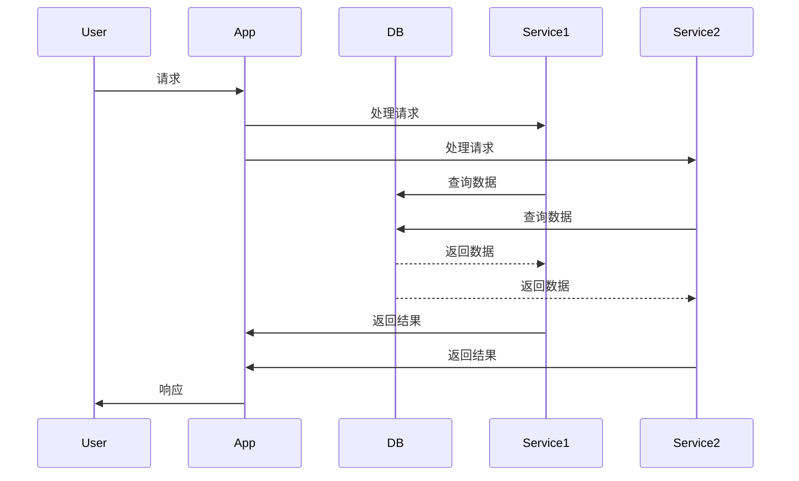
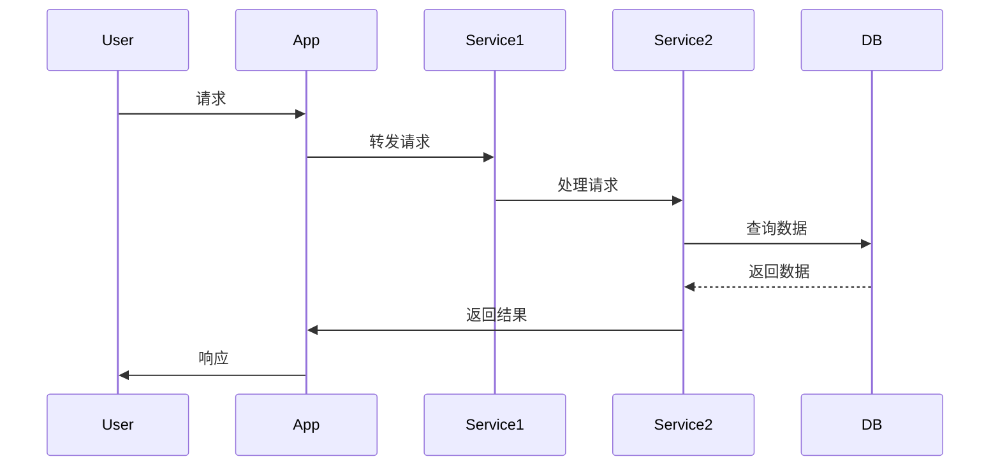
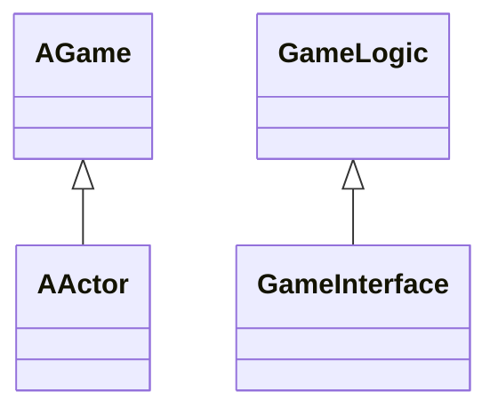

                 

### 第1章：游戏开发概述

> **关键词**：游戏开发、软件2.0、大模型、企业级应用、C++、C#、Python

> **摘要**：本章将介绍游戏开发的现状与发展，从软件1.0到软件2.0的演进，探讨大模型在游戏开发中的核心地位，以及企业级应用开发的新范式。通过本章的学习，读者将了解游戏开发的基本概念和最新趋势，为后续章节的学习打下基础。

#### 1.1 从软件1.0到软件2.0的演进

在传统软件开发阶段，即所谓的“软件1.0”时代，开发者主要关注于编写代码以实现特定的功能。当时的软件开发以单体架构为主，应用功能相对单一，可扩展性和可维护性较差。然而，随着互联网的兴起和游戏行业的快速发展，游戏开发逐渐进入了一个全新的阶段，即“软件2.0”时代。

**伪代码：**

```plaintext
class Software10 {
    function1();
    function2();
    ...
}

class Software20 extends Software10 {
    function1();
    function2();
    function3();
    ...
}
```

在软件2.0时代，开发者不仅需要实现功能，还需要关注用户体验、可扩展性和可维护性。为了实现这一目标，软件开发采用了分布式架构、微服务架构、容器化技术等新兴技术，使得应用更加高效、可扩展和易于维护。

**Mermaid 流程图：**



#### 1.2 大模型在游戏开发中的核心地位

随着人工智能技术的不断发展，大模型（如深度学习模型）在游戏开发中扮演着越来越重要的角色。大模型的应用不仅可以提升游戏的玩法和体验，还可以提高游戏的智能化水平。

**伪代码：**

```python
class GameAI:
    def train_model():
        # 训练大模型
    def generate_action():
        # 根据大模型生成游戏行为
```

大模型在游戏开发中的应用场景非常广泛，例如：

1. **游戏AI**：通过大模型训练游戏AI，使其能够学习并适应玩家的游戏行为，提高游戏的可玩性。
2. **游戏优化**：使用大模型进行游戏性能优化，如减少加载时间、优化渲染效果等。
3. **游戏推荐**：利用大模型进行游戏内容推荐，提高用户的游戏体验。

#### 1.3 企业级应用开发的新范式

在企业级应用开发中，传统的单体架构已经难以满足高效、可扩展的需求。新兴的分布式架构、微服务架构、容器化技术等为企业级应用开发带来了新的可能性。

**Mermaid 流程图：**



微服务架构将应用拆分为多个独立的服务，每个服务负责处理特定的业务功能。这种架构具有高扩展性、高可用性、易于维护等优点。容器化技术（如Docker）使得服务的部署和运行更加灵活、高效。DevOps文化的推广，使得开发和运维的协同工作更加紧密，提高了开发效率。

**总结**

本章介绍了游戏开发的现状与发展，从软件1.0到软件2.0的演进，探讨了游戏开发中的核心技术——大模型，以及企业级应用开发的新范式。通过本章的学习，读者将了解游戏开发的基本概念和最新趋势，为后续章节的学习打下基础。

### 第2章：游戏编程基础

> **关键词**：游戏编程、C++、C#、Python、数据结构、算法、游戏引擎

> **摘要**：本章将介绍游戏编程的基础知识，包括常用的编程语言、数据结构与算法，以及游戏引擎的基本概念。通过本章的学习，读者将了解游戏编程的基本工具和技术，为后续章节的深入学习做好准备。

#### 2.1 常用编程语言介绍

在游戏开发中，常用的编程语言有C++、C#和Python。每种语言都有其独特的优势和适用场景。

**2.1.1 C++在游戏开发中的应用**

C++因其高效、灵活和强大的性能，在游戏开发中得到了广泛的应用。尤其在游戏引擎、游戏AI和图形渲染等领域，C++的优势更加明显。

**伪代码：**

```cpp
class GameEngine {
public:
    void initialize();
    void render();
    void update();
};
```

**2.1.2 C#在游戏开发中的应用**

C#与.NET框架紧密结合，在Unity引擎中得到了广泛的应用。C#的易用性和丰富的库支持，使其成为游戏开发中的重要语言。

**伪代码：**

```csharp
public class GameLogic {
    public void Start();
    public void Update();
}
```

**2.1.3 Python在游戏开发中的应用**

Python因其简洁易读的语法和丰富的库支持，在游戏开发中也有一席之地。Python常用于游戏脚本编写、数据分析、人工智能等领域。

**伪代码：**

```python
class GameScript:
    def start():
        # 初始化游戏脚本
    def update():
        # 更新游戏脚本
```

#### 2.2 数据结构与算法

数据结构与算法是游戏编程的基础。合理的算法设计和高效的数据结构，可以大大提高游戏的性能和可玩性。

**2.2.1 常用数据结构**

在游戏开发中，常用的数据结构包括数组、链表、栈、队列、树和图等。

**伪代码：**

```python
class LinkedList:
    def append(value):
        # 在链表末尾添加元素

class Stack:
    def push(value):
        # 将元素压入栈

class Queue:
    def enqueue(value):
        # 将元素加入队列

class Tree:
    def insert(value):
        # 在树中插入元素

class Graph:
    def add_edge(vertex1, vertex2):
        # 在图中添加边
```

**2.2.2 算法设计与分析**

算法是解决问题的步骤和方法。在游戏开发中，算法的设计和优化至关重要。

**伪代码：**

```python
def search(target):
    # 搜索算法，找到目标元素
def sort(data):
    # 排序算法，对数据进行排序
```

**2.2.3 游戏中的算法应用**

在游戏开发中，算法广泛应用于游戏AI、路径规划、资源管理等各个方面。

**伪代码：**

```python
def pathfinding(start, goal):
    # 寻路算法，找到从起点到终点的路径
def resource_management():
    # 资源管理算法，优化资源的分配和利用
```

#### 2.3 游戏引擎编程

游戏引擎是游戏开发的核心工具。它提供了一系列的编程接口和功能，使得游戏开发变得更加高效和便捷。

**2.3.1 Unity引擎基础**

Unity引擎是一款广泛使用的游戏引擎，它提供了丰富的功能，包括3D渲染、物理模拟、动画系统等。

**伪代码：**

```csharp
using UnityEngine;

public class GameScript : MonoBehaviour {
    void Start() {
        // 初始化游戏脚本
    }

    void Update() {
        // 更新游戏逻辑
    }
}
```

**2.3.2 Unreal Engine基础**

Unreal Engine是一款功能强大的游戏引擎，它以高质量的图形渲染和实时互动著称。

**伪代码：**

```cpp
class AGame : public AActor {
public:
    virtual void BeginPlay() override {
        // 初始化游戏
    }

    virtual void Tick(float DeltaSeconds) override {
        // 更新游戏逻辑
    }
}
```

**总结**

本章介绍了游戏编程的基础知识，包括常用的编程语言、数据结构与算法，以及游戏引擎的基本概念。通过本章的学习，读者将了解游戏编程的基本工具和技术，为后续章节的深入学习做好准备。

### 第3章：游戏引擎编程

#### 3.1 Unity引擎基础

Unity引擎是一款广泛应用于游戏开发的游戏引擎，它提供了丰富的功能和工具，使得游戏开发变得更加高效和便捷。在本节中，我们将介绍Unity引擎的基础知识和核心功能。

**3.1.1 Unity引擎概述**

Unity引擎由Unity Technologies开发，自2005年首次发布以来，已成为全球最受欢迎的游戏引擎之一。Unity引擎支持多种平台，包括Windows、macOS、iOS、Android、Linux等，同时也支持虚拟现实（VR）和增强现实（AR）应用。

**伪代码：**

```csharp
using UnityEngine;

public class UnityOverview : MonoBehaviour {
    void Start() {
        // Unity引擎初始化
    }

    void Update() {
        // Unity引擎更新
    }
}
```

**3.1.2 Unity脚本编程**

Unity引擎使用C#作为脚本语言，开发者可以通过编写C#脚本来实现游戏逻辑、控制角色行为、处理用户输入等功能。在Unity中，脚本通常附加在游戏对象上，通过调用Unity提供的API来实现各种功能。

**伪代码：**

```csharp
using UnityEngine;

public class GameLogic : MonoBehaviour {
    void Start() {
        // 初始化游戏逻辑
    }

    void Update() {
        // 更新游戏逻辑
    }

    void OnCollisionEnter(Collision collision) {
        // 处理碰撞事件
    }
}
```

**3.1.3 Unity编辑器扩展**

Unity编辑器是开发者进行游戏设计和调试的重要工具。通过编写编辑器扩展脚本，开发者可以自定义编辑器界面、添加新的工具和功能，从而提高开发效率。

**伪代码：**

```csharp
using UnityEditor;

[CustomEditor(typeof(GameLogic))]
public class GameLogicEditor : Editor {
    void OnInspectorGUI() {
        // 自定义编辑器界面
    }
}
```

#### 3.2 Unreal Engine基础

Unreal Engine是由Epic Games开发的一款功能强大的游戏引擎，以其高质量的图形渲染和实时互动著称。Unreal Engine广泛应用于游戏开发、影视制作、建筑可视化等领域。

**3.2.1 Unreal Engine概述**

Unreal Engine使用C++作为主要编程语言，同时也支持蓝图（Blueprint）系统，允许开发者无需编写代码即可实现游戏逻辑。Unreal Engine提供了丰富的功能，包括3D建模、动画、光照、物理模拟等。

**伪代码：**

```cpp
class AGame : public AActor {
public:
    virtual void BeginPlay() override {
        // 初始化游戏
    }

    virtual void Tick(float DeltaSeconds) override {
        // 更新游戏逻辑
    }
};
```

**3.2.2 Unreal Engine脚本编程**

在Unreal Engine中，开发者可以使用C++来编写游戏脚本，通过实现各种类和函数来实现游戏逻辑。同时，Unreal Engine的蓝图系统提供了可视化编程工具，使得开发者可以无需编写代码即可实现复杂的游戏逻辑。

**伪代码：**

```cpp
UCLASS()
class MYGAME_API AGame : public AActor {
public:
    virtual void BeginPlay() override;
    virtual void Tick(float DeltaSeconds) override;
};
```

**3.2.3 Unreal Engine可视化工具**

Unreal Engine提供了强大的可视化工具，包括UML类图、序列图等，可以帮助开发者更好地理解和设计游戏系统。

**伪代码：**



**总结**

本章介绍了Unity引擎和Unreal Engine的基础知识，包括引擎概述、脚本编程和可视化工具。通过本章的学习，读者将了解游戏引擎的基本概念和核心功能，为后续章节的深入学习打下基础。

### 第4章：游戏资源制作

#### 4.1 美术资源制作

游戏美术资源是游戏开发中至关重要的一环，它直接影响到游戏的整体视觉效果和用户体验。在本节中，我们将介绍游戏美术资源的制作流程和关键技巧。

**4.1.1 2D美术资源制作**

2D美术资源是许多游戏类型的基础，包括角色设计、背景、界面等。2D美术资源的制作通常涉及以下步骤：

1. **概念设计**：这是美术资源制作的初始阶段，旨在确定游戏的角色、场景、风格等。

2. **线稿绘制**：使用绘图软件（如Adobe Photoshop、Illustrator）绘制角色的线稿。

3. **上色**：在线稿的基础上进行上色，以赋予角色和场景丰富的色彩和质感。

4. **细节调整**：对上色后的资源进行细节调整，包括光影效果、纹理细节等。

5. **导出**：将完成的美术资源导出为游戏引擎可识别的格式，如PNG、JPG等。

**伪代码：**

```python
def create_2d_art():
    # 创建2D美术资源
    concept_design()
    line_drawing()
    colorization()
    detail_adjustment()
    export_resources()
```

**4.1.2 3D美术资源制作**

3D美术资源在游戏开发中越来越受欢迎，尤其是在3D游戏和虚拟现实中。3D美术资源的制作通常涉及以下步骤：

1. **模型制作**：使用3D建模软件（如Autodesk Maya、Blender）制作角色、场景和道具的模型。

2. **贴图制作**：为3D模型制作贴图，包括漫反射贴图、法线贴图、环境贴图等。

3. **细节调整**：对模型和贴图进行细节调整，以提高视觉质量。

4. **动画制作**：为角色和场景制作动画，包括走路、跑步、攻击等动作。

5. **导出**：将完成的3D美术资源导出为游戏引擎可识别的格式，如OBJ、FBX等。

**伪代码：**

```python
def create_3d_art():
    # 创建3D美术资源
    model_creation()
    texture_creation()
    detail_adjustment()
    animation_creation()
    export_resources()
```

**4.1.3 美术资源优化**

美术资源优化是确保游戏运行效率和视觉效果的重要环节。优化措施包括：

1. **纹理压缩**：减小纹理文件的大小，以提高加载速度。

2. **模型简化**：减少模型的多边形数量，以提高渲染效率。

3. **贴图合并**：将多个小贴图合并为大贴图，以减少内存占用。

4. **光照优化**：优化场景中的光照，减少光照计算。

**伪代码：**

```python
def optimize_art_resources():
    # 优化美术资源
    texture_compression()
    model_simplification()
    texture_merge()
    lighting_optimization()
```

**总结**

本章介绍了游戏美术资源制作的全流程，包括2D和3D美术资源的制作技巧和优化方法。通过本章的学习，读者将掌握游戏美术资源制作的基本知识和技能，为游戏开发提供高质量的视觉素材。

### 第5章：游戏网络编程

#### 5.1 游戏网络架构

游戏网络编程是游戏开发中的一个重要方面，它涉及到游戏客户端与服务器之间的通信、数据传输和同步。一个良好的网络架构对于保证游戏的稳定性、流畅性和用户体验至关重要。本节将介绍游戏网络架构的基本概念和设计原则。

**5.1.1 客户端-服务器架构**

客户端-服务器架构（Client-Server Architecture）是游戏网络编程中最常用的架构模式。在这种架构中，游戏客户端负责处理用户输入、渲染界面和与服务器通信，而游戏服务器负责处理游戏逻辑、状态同步和数据存储。

**伪代码：**

```python
class GameClient:
    def send_request(data):
        # 发送请求到服务器

    def receive_response(data):
        # 接收服务器响应

class GameServer:
    def handle_request(data):
        # 处理客户端请求

    def send_response(data):
        # 向客户端发送响应
```

**5.1.2 游戏服务器设计**

游戏服务器的设计需要考虑多个方面，包括服务器架构、网络协议、数据同步等。以下是一些关键点：

1. **服务器架构**：游戏服务器可以采用单机架构或分布式架构。单机架构简单，但性能受限；分布式架构可以提供更高的性能和扩展性。

2. **网络协议**：常用的网络协议包括TCP、UDP和WebSocket。TCP提供可靠的数据传输，但速度较慢；UDP提供高速的数据传输，但不可靠；WebSocket提供双向通信，适用于实时交互。

3. **数据同步**：游戏状态需要在客户端和服务器之间保持一致。数据同步可以通过状态同步、增量同步等方式实现。

**伪代码：**

```python
class GameServer:
    def initialize():
        # 初始化服务器
        connect_to_database()
        setup_network()

    def handle_client_connection(client):
        # 处理客户端连接
        client.send_welcome_message()

    def update_game_state():
        # 更新游戏状态
        synchronize_state_with_clients()

    def receive_data_from_client(client, data):
        # 接收客户端数据
        process_data(data)

    def send_data_to_client(client, data):
        # 向客户端发送数据
        client.send_response(data)
```

**5.1.3 游戏客户端设计**

游戏客户端的设计需要考虑用户交互、渲染效率和网络通信。以下是一些关键点：

1. **用户交互**：客户端需要响应用户的输入，如键盘、鼠标和触摸屏。

2. **渲染效率**：客户端需要高效地渲染游戏画面，包括场景渲染、角色渲染等。

3. **网络通信**：客户端需要与服务器保持稳定的通信，处理请求和响应。

**伪代码：**

```python
class GameClient:
    def initialize():
        # 初始化客户端
        setup_input()
        setup_renderer()
        connect_to_server()

    def handle_user_input():
        # 处理用户输入
        process_input()

    def render_scene():
        # 渲染游戏画面
        draw_scene()

    def send_request_to_server(request):
        # 向服务器发送请求
        server.send_request(request)

    def receive_response_from_server(response):
        # 接收服务器响应
        process_response(response)
```

**总结**

本章介绍了游戏网络编程的基本概念和设计原则，包括客户端-服务器架构、游戏服务器设计和游戏客户端设计。通过本章的学习，读者将了解游戏网络编程的核心技术和方法，为实际开发提供指导。

### 第6章：游戏人工智能

#### 6.1 游戏人工智能概述

游戏人工智能（Game Artificial Intelligence，简称GAIA）是人工智能（Artificial Intelligence，简称AI）在游戏开发中的具体应用。通过引入AI技术，游戏可以变得更加智能、有趣和具有挑战性。本节将介绍游戏人工智能的基本概念、应用场景和发展趋势。

**6.1.1 游戏人工智能的应用场景**

游戏人工智能的应用场景非常广泛，以下是一些典型的应用：

1. **游戏角色行为**：通过AI技术，游戏角色可以拥有更加复杂和智能的行为，如路径规划、决策制定、社交互动等。

2. **游戏玩法**：AI可以设计出更加丰富和多样化的游戏玩法，提高游戏的可玩性和趣味性。

3. **游戏难度调节**：根据玩家的技能水平和游戏进度，AI可以动态调整游戏难度，提供适中的挑战。

4. **虚拟助手**：AI可以充当虚拟助手，帮助玩家完成游戏任务、提供游戏建议等。

**6.1.2 游戏人工智能的分类**

游戏人工智能可以按照不同的标准进行分类，以下是一些常见的分类方法：

1. **基于规则的AI**：这种AI使用一组预定义的规则来指导游戏角色的行为。例如，规则可以指定当角色距离目标点一定距离时，角色应该采取何种行动。

2. **基于行为的AI**：这种AI通过观察和学习玩家的行为来调整自己的行为。例如，AI可以分析玩家的游戏习惯，然后根据这些习惯来制定相应的策略。

3. **基于神经网络的AI**：这种AI使用神经网络模型来模拟游戏角色的思维过程。例如，AI可以通过深度学习算法来预测玩家的下一步行动。

4. **混合式AI**：这种AI结合了基于规则、基于行为和基于神经网络的AI技术，以实现更加智能和自适应的游戏体验。

**6.1.3 游戏人工智能的发展趋势**

随着人工智能技术的不断进步，游戏人工智能也在不断演变和升级。以下是一些发展趋势：

1. **更加智能的游戏角色**：未来的游戏角色将拥有更加复杂和智能的行为，可以模拟人类的思维过程，提供更加真实的游戏体验。

2. **增强现实和虚拟现实**：随着AR和VR技术的发展，游戏人工智能将在这些领域发挥更大的作用，提供更加沉浸式的游戏体验。

3. **个性化和定制化**：游戏人工智能将根据玩家的行为和喜好进行个性化推荐和定制化服务，提高玩家的游戏满意度和忠诚度。

4. **跨平台协作**：游戏人工智能将支持跨平台协作，允许玩家在不同的设备上无缝切换，继续进行游戏。

**伪代码：**

```python
class GameAI:
    def initialize():
        # 初始化游戏AI
        load_rules()
        load_behavior_model()
        load_neural_network()

    def update():
        # 更新游戏AI
        adjust_behavior()
        predict_player_action()
        adapt_to_player()

    def make_decision():
        # 制定决策
        apply_rules()
        evaluate_behavior()
        utilize_neural_network()
```

**总结**

本章介绍了游戏人工智能的基本概念、应用场景和分类，以及游戏人工智能的发展趋势。通过本章的学习，读者将了解游戏人工智能在游戏开发中的应用和前景，为实际开发提供参考。

### 第6章：游戏人工智能

#### 6.2 游戏AI算法

游戏人工智能（AI）算法是游戏开发中的重要组成部分，它决定了游戏角色的行为、决策和互动方式。在本节中，我们将详细介绍几种常见的游戏AI算法，包括寻路算法、控制算法和交互算法。

**6.2.1 寻路算法**

寻路算法是游戏AI中的基本算法，它用于解决游戏角色如何从起点到达终点的问题。以下是一些常用的寻路算法：

1. **A*算法**：A*算法是一种启发式搜索算法，它通过评估函数（f(n) = g(n) + h(n)）来找到从起点到终点的最优路径。其中，g(n)是当前点到起点的距离，h(n)是当前点到终点的估计距离。

**伪代码：**

```python
def A_star(start, goal):
    open_set = PriorityQueue()
    open_set.put(start, 0)
    came_from = dict()
    g_score = dict()
    g_score[start] = 0
    f_score = dict()
    f_score[start] = heuristic(start, goal)

    while not open_set.is_empty():
        current = open_set.get_min()

        if current == goal:
            break

        for neighbor in neighbors(current):
            tentative_g_score = g_score[current] + distance(current, neighbor)
            if tentative_g_score < g_score.get(neighbor, float('inf')):
                came_from[neighbor] = current
                g_score[neighbor] = tentative_g_score
                f_score[neighbor] = g_score[neighbor] + heuristic(neighbor, goal)
                if neighbor not in open_set:
                    open_set.put(neighbor, f_score[neighbor])

    return reconstruct_path(came_from, goal)
```

2. **Dijkstra算法**：Dijkstra算法是一种非启发式搜索算法，它用于求解最短路径问题。与A*算法不同，Dijkstra算法不考虑启发式函数，因此计算时间较长。

**伪代码：**

```python
def Dijkstra(graph, start):
    distances = {node: float('infinity') for node in graph}
    distances[start] = 0
    unvisited = set(graph)

    while unvisited:
        current = min(unvisited, key=lambda node: distances[node])
        unvisited.remove(current)

        for neighbor, weight in graph[current].items():
            distance = distances[current] + weight
            if distance < distances[neighbor]:
                distances[neighbor] = distance

    return distances
```

3. **双向搜索**：双向搜索结合了A*算法的两个搜索过程，从起点和终点同时开始搜索，直到两个搜索过程相遇。

**伪代码：**

```python
def bidirectional_search(start, goal):
    open_set_start = PriorityQueue()
    open_set_goal = PriorityQueue()
    open_set_start.put(start, 0)
    open_set_goal.put(goal, 0)
    came_from_start = dict()
    came_from_goal = dict()
    g_score_start = dict()
    g_score_goal = dict()
    g_score_start[start] = 0
    g_score_goal[goal] = 0

    while not open_set_start.is_empty() and not open_set_goal.is_empty():
        current_start = open_set_start.get_min()
        current_goal = open_set_goal.get_min()

        if current_start == current_goal:
            return reconstruct_path(came_from_start, current_start)

        for neighbor in neighbors(current_start):
            tentative_g_score = g_score_start[current_start] + distance(current_start, neighbor)
            if tentative_g_score < g_score_start.get(neighbor, float('inf')):
                came_from_start[neighbor] = current_start
                g_score_start[neighbor] = tentative_g_score
                open_set_start.put(neighbor, tentative_g_score + heuristic(neighbor, goal))

        for neighbor in neighbors(current_goal):
            tentative_g_score = g_score_goal[current_goal] + distance(current_goal, neighbor)
            if tentative_g_score < g_score_goal.get(neighbor, float('inf')):
                came_from_goal[neighbor] = current_goal
                g_score_goal[neighbor] = tentative_g_score
                open_set_goal.put(neighbor, tentative_g_score + heuristic(neighbor, start))

    return None
```

**6.2.2 控制算法**

控制算法用于控制游戏角色的行动，使其在游戏中做出合理的决策。以下是一些常用的控制算法：

1. **状态机**：状态机是一种基于状态的决策模型，它根据当前状态决定下一步行动。每个状态都有相应的行为和条件，用于切换到下一个状态。

**伪代码：**

```python
class FSM:
    def __init__(self):
        self.states = {
            'idle': self.idle_state,
            'move': self.move_state,
            'attack': self.attack_state,
        }
        self.current_state = 'idle'

    def update(self):
        self.states[self.current_state]()

    def idle_state(self):
        # 做空闲动作
        pass

    def move_state(self):
        # 做移动动作
        pass

    def attack_state(self):
        # 做攻击动作
        pass
```

2. **决策树**：决策树是一种基于条件的决策模型，它根据当前条件选择最佳行动。决策树通常包含一系列条件分支和相应的行动。

**伪代码：**

```python
class DecisionTree:
    def __init__(self):
        self.conditions = [
            ('health < 30', 'use_potion'),
            ('enemy_health > player_health', 'attack'),
            ('enemy_in_range', 'cast_spell'),
        ]

    def make_decision(self, player_health, enemy_health, enemy_in_range):
        for condition, action in self.conditions:
            if eval(condition):
                return action
        return 'defend'
```

3. **模糊逻辑**：模糊逻辑是一种基于概率的决策模型，它通过模糊集合和隶属度函数来表示和计算决策。模糊逻辑可以处理不确定性问题，适用于复杂的决策场景。

**伪代码：**

```python
class FuzzyLogic:
    def __init__(self):
        self.rules = [
            ('health < 30', 'use_potion', 0.5),
            ('enemy_health > player_health', 'attack', 0.7),
            ('enemy_in_range', 'cast_spell', 0.8),
        ]

    def make_decision(self, player_health, enemy_health, enemy_in_range):
        max隶属度 = 0
        selected_action = None
        for condition, action, weight in self.rules:
            if eval(condition):
                if weight > max隶属度:
                    max隶属度 = weight
                    selected_action = action
        return selected_action
```

**6.2.3 交互算法**

交互算法用于处理游戏角色之间的交互，包括对话、战斗和合作等。以下是一些常用的交互算法：

1. **对话系统**：对话系统是一种用于模拟游戏角色之间对话的算法。它通常包含对话树和对话管理器，用于处理对话的分支和逻辑。

**伪代码：**

```python
class DialogueSystem:
    def __init__(self):
        self.dialogue_tree = DialogueTree()

    def start_dialogue(self, character):
        current_node = self.dialogue_tree.root
        while current_node is not None:
            response = character.respond(current_node.question)
            current_node = current_node.get_child(response)
            if current_node is None:
                break
            character.answer(current_node.question)

    def add_dialogue_node(self, question, responses, actions):
        self.dialogue_tree.add_node(question, responses, actions)
```

2. **战斗系统**：战斗系统是一种用于模拟游戏角色之间战斗的算法。它通常包含战斗策略、攻击动作和伤害计算等。

**伪代码：**

```python
class BattleSystem:
    def __init__(self):
        self.strategy = BattleStrategy()

    def start_battle(self, player, enemy):
        while player.health > 0 and enemy.health > 0:
            action = self.strategy.decide_action(player, enemy)
            if action == 'attack':
                damage = self.calculate_damage(player, enemy)
                enemy.health -= damage
                player.attack(enemy)
            elif action == 'defend':
                player.defend()

    def calculate_damage(self, attacker, defender):
        # 计算攻击力
        damage = attacker.attack_power - defender.defense
        return max(damage, 0)
```

3. **合作系统**：合作系统是一种用于模拟游戏角色之间合作战斗的算法。它通常包含合作策略、任务分配和资源共享等。

**伪代码：**

```python
class CooperationSystem:
    def __init__(self):
        self.strategy = CooperationStrategy()

    def start_cooperation(self, player1, player2):
        while player1.health > 0 and player2.health > 0:
            action1 = self.strategy.decide_action(player1)
            action2 = self.strategy.decide_action(player2)
            if action1 == 'attack':
                damage1 = self.calculate_damage(player1, player2)
                player2.health -= damage1
                player1.attack(player2)
            elif action1 == 'heal':
                player1.health += player1.heal_power
            if action2 == 'attack':
                damage2 = self.calculate_damage(player2, player1)
                player1.health -= damage2
                player2.attack(player1)
            elif action2 == 'heal':
                player2.health += player2.heal_power

    def calculate_damage(self, attacker, defender):
        # 计算攻击力
        damage = attacker.attack_power - defender.defense
        return max(damage, 0)
```

**总结**

本章介绍了游戏人工智能中的几种关键算法，包括寻路算法、控制算法和交互算法。通过这些算法，游戏角色可以表现出更加智能和复杂的行动和决策，提高游戏的可玩性和趣味性。读者可以结合实际项目需求，选择合适的算法进行应用和优化。

### 第7章：游戏开发项目实战

#### 7.1 Unity项目实战

在本节中，我们将通过一个具体的Unity项目实战，介绍游戏开发的流程和关键步骤。该项目将实现一个简单的2D平台游戏，玩家角色可以在地图上跳跃和移动，以避免陷阱和收集宝石。

**7.1.1 项目需求分析**

首先，我们需要明确项目的需求，包括游戏的目标、玩家角色、场景设计、游戏规则等。

**需求文档：**

- 游戏目标：玩家需要收集所有宝石并安全到达终点。
- 玩家角色：玩家角色可以跳跃和移动。
- 场景设计：游戏场景包括地面、墙壁、陷阱和宝石。
- 游戏规则：
  - 玩家跳跃时不能碰撞到墙壁。
  - 玩家不能掉出地图。
  - 玩家不能进入陷阱区域。

**7.1.2 项目开发流程**

游戏开发通常分为以下几个阶段：

1. **概念设计**：确定游戏的基本概念和玩法。
2. **原型开发**：构建一个简化的游戏原型，验证核心玩法。
3. **详细设计**：设计游戏关卡、角色动画、UI界面等。
4. **开发实现**：编写游戏代码，实现游戏逻辑和界面。
5. **测试与优化**：进行游戏测试，修复bug，优化性能。
6. **发布与推广**：将游戏发布到各大平台，进行推广。

**7.1.3 项目代码解读**

以下是一个简单的Unity项目代码示例，包括玩家角色控制、地图生成和游戏逻辑。

**C#脚本：PlayerController.cs**

```csharp
using UnityEngine;

public class PlayerController : MonoBehaviour {
    public float moveSpeed = 5.0f;
    public float jumpHeight = 5.0f;
    private Rigidbody2D rb;
    private bool isGrounded;
    private Transform groundCheck;

    // 使用 groundedCheck 碰撞体检测地面
    void Start() {
        rb = GetComponent<Rigidbody2D>();
        groundCheck = transform.Find("GroundCheck");
    }

    void Update() {
        Move();
        Jump();
    }

    void Move() {
        float moveX = Input.GetAxis("Horizontal");
        float moveY = Input.GetAxis("Vertical");
        rb.velocity = new Vector2(moveX * moveSpeed, rb.velocity.y);
    }

    void Jump() {
        if (Input.GetButtonDown("Jump") && isGrounded) {
            rb.AddForce(new Vector2(0, jumpHeight));
        }
    }

    void OnCollisionEnter2D(Collision2D collision) {
        if (collision.gameObject.CompareTag("Ground")) {
            isGrounded = true;
        }
    }

    void OnCollisionExit2D(Collision2D collision) {
        if (collision.gameObject.CompareTag("Ground")) {
            isGrounded = false;
        }
    }
}
```

**C#脚本：PlatformGenerator.cs**

```csharp
using UnityEngine;

public class PlatformGenerator : MonoBehaviour {
    public GameObject platformPrefab;
    public float platformSpacing = 5.0f;
    private Transform playerTransform;

    void Start() {
        playerTransform = GameObject.FindGameObjectWithTag("Player").transform;
    }

    void Update() {
        if (playerTransform.position.x - transform.position.x > platformSpacing) {
            GeneratePlatform();
        }
    }

    void GeneratePlatform() {
        float randomY = Random.Range(-2.0f, 2.0f);
        Vector3 newPosition = new Vector3(transform.position.x + platformSpacing, randomY, 0);
        Instantiate(platformPrefab, newPosition, Quaternion.identity);
    }
}
```

**C#脚本：GameLogic.cs**

```csharp
using UnityEngine;

public class GameLogic : MonoBehaviour {
    public GameObject gemPrefab;
    public int gemCount = 5;

    void Start() {
        for (int i = 0; i < gemCount; i++) {
            float randomX = Random.Range(-10.0f, 10.0f);
            float randomY = Random.Range(-5.0f, 5.0f);
            Vector3 newPosition = new Vector3(randomX, randomY, 0);
            Instantiate(gemPrefab, newPosition, Quaternion.identity);
        }
    }

    public void OnGemCollected() {
        gemCount--;
        if (gemCount == 0) {
            // 游戏胜利
            Debug.Log("Game Over");
        }
    }
}
```

**7.1.4 代码解读与分析**

- **PlayerController.cs**：该脚本负责玩家角色的移动和跳跃。通过Update()方法不断更新玩家的速度和位置，同时检测玩家是否接触地面，以决定是否允许跳跃。

- **PlatformGenerator.cs**：该脚本负责生成平台。每次玩家向前移动超过一定距离，脚本就会在玩家的前方随机生成一个平台。

- **GameLogic.cs**：该脚本负责生成宝石，并在玩家收集宝石时更新游戏状态。当宝石数量减少到零时，游戏结束。

通过这个简单的项目实战，读者可以了解到Unity游戏开发的基本流程和关键代码实现。在实际项目中，还需要考虑更多的细节和优化，以确保游戏的流畅性和可玩性。

### 第8章：游戏性能优化

#### 8.1 游戏性能优化概述

游戏性能优化是游戏开发中至关重要的一环，它直接影响到游戏的运行速度、流畅度和用户体验。一个良好的性能优化策略不仅可以提升游戏的整体质量，还可以延长游戏的生命周期，吸引更多玩家。在本节中，我们将介绍游戏性能优化的基本概念、重要性以及常见的优化策略。

**8.1.1 性能优化的重要性**

随着游戏内容和画面越来越复杂，性能优化的重要性愈发凸显。以下是性能优化的一些关键点：

1. **用户体验**：良好的性能优化可以确保游戏在玩家设备上运行流畅，提供优质的用户体验。
2. **硬件兼容性**：通过优化，游戏可以在不同硬件配置上运行，扩大游戏受众。
3. **资源利用**：性能优化有助于提高资源利用效率，减少内存占用和加载时间。
4. **市场竞争力**：性能优异的游戏更容易在市场上脱颖而出，获得更好的口碑和用户评价。
5. **游戏测试与维护**：优化后的游戏在测试和后续维护中会更容易发现和修复性能问题。

**8.1.2 性能优化的策略**

为了实现游戏性能优化，开发者可以采用以下策略：

1. **代码优化**：通过改进算法、减少不必要的计算、优化循环和条件判断等，提高代码执行效率。
2. **资源管理**：合理管理游戏资源，如模型、纹理、音效等，减少资源占用和加载时间。
3. **渲染优化**：优化渲染流程，如减少绘制调用、优化光照计算、使用LOD技术等。
4. **线程管理**：合理分配线程任务，避免线程竞争和阻塞，提高并行处理能力。
5. **内存优化**：通过减少内存分配、复用内存对象、优化数据结构等，降低内存占用。
6. **IO优化**：优化文件读取和写入操作，减少IO等待时间。

**8.1.3 常用的性能优化工具**

为了有效地进行性能优化，开发者可以借助一些工具进行性能监控和分析。以下是一些常用的工具：

1. **Unity Profiler**：Unity内置的性能分析工具，可以实时监控游戏的CPU、GPU、内存等资源使用情况。
2. **GPU Pro Tools**：用于GPU性能分析的第三方工具，提供详细的GPU性能数据。
3. **Visual Studio**：用于代码分析和性能优化的集成开发环境，支持C++、C#等多种编程语言。
4. **Valve's VRSLC**：用于优化游戏加载时间的工具，可以显著减少游戏启动和关卡切换的时间。

**伪代码：**

```python
def optimize_performance():
    # 优化代码
    code_optimization()

    # 优化资源
    resource_management()

    # 优化渲染
    render_optimization()

    # 优化线程
    thread_management()

    # 优化内存
    memory_optimization()

    # 优化IO
    io_optimization()
```

**总结**

本章介绍了游戏性能优化的重要性以及常见的优化策略。通过合理地应用这些策略，开发者可以显著提升游戏的性能，提供更好的用户体验。在实际开发过程中，开发者需要不断监控和优化性能，以保持游戏的高效运行。

### 第9章：游戏开发中的团队合作

#### 9.1 团队合作的重要性

游戏开发是一个复杂而庞大的项目，涉及到多个领域和技能。团队合作在游戏开发中至关重要，因为它能够确保项目的高效推进和成功交付。以下将探讨团队合作在游戏开发中的重要性、优势以及团队协作模式。

**9.1.1 团队合作的重要性**

1. **协同工作**：游戏开发需要多方面的专业知识和技能，如编程、美术、音效、设计等。团队合作可以充分发挥每个成员的专业优势，实现资源的最佳配置。
2. **高效沟通**：游戏开发过程中，成员之间的有效沟通至关重要。通过团队合作，成员可以及时交流进度、问题和解决方案，确保项目按计划进行。
3. **知识共享**：团队合作促进了知识的共享和经验的积累。成员可以相互学习、借鉴和实践，提高整个团队的技能水平。
4. **共同决策**：游戏开发中的许多决策需要多个部门的协同配合。团队合作可以确保决策的全面性和科学性，减少因单点问题导致的开发瓶颈。
5. **提高质量**：团队合作有助于提高游戏的质量。通过团队协作，可以及时识别和修复问题，优化游戏玩法和用户体验。

**9.1.2 团队合作的优势**

1. **提高开发效率**：团队合作可以充分利用每个成员的专业技能和经验，减少重复劳动，提高工作效率。
2. **促进创新**：团队中的多样性和知识互补可以激发创新思维，为游戏带来新的创意和玩法。
3. **增强团队凝聚力**：团队合作可以增强团队成员之间的信任和凝聚力，提高团队整体的士气和战斗力。
4. **减少错误**：团队合作有助于识别和纠正单个成员可能忽略的错误，提高游戏的质量和稳定性。
5. **适应变化**：团队合作可以更好地应对项目变化和挑战，通过快速调整计划和策略，确保项目按时交付。

**9.1.3 团队协作模式**

1. **职能式协作**：按照职能分配工作，如程序、美术、音效等，每个职能组独立完成任务，然后进行整合。这种模式适用于职能明确的团队。
2. **项目式协作**：根据项目需求组建临时团队，跨职能组合作完成项目。项目结束后，团队成员解散或转入下一个项目。这种模式适用于项目复杂、跨职能协作需求较高的团队。
3. **矩阵式协作**：结合职能式和项目式协作，团队成员既属于某一职能组，又参与多个项目。这种模式适用于职能明确且项目繁多的团队。
4. **分布式协作**：团队成员分布在不同的地理位置，通过互联网和协作工具进行远程协作。这种模式适用于跨地域开发和全球化团队合作。

**伪代码：**

```python
def team_collaboration(model):
    if model == "functional":
        functional_collaboration()
    elif model == "project-based":
        project_based_collaboration()
    elif model == "matrix":
        matrix_based_collaboration()
    elif model == "distributed":
        distributed_collaboration()
```

**总结**

本章探讨了团队合作在游戏开发中的重要性、优势以及团队协作模式。通过有效的团队合作，游戏开发团队能够更好地应对挑战，提高项目质量和开发效率。在实际开发过程中，团队应根据项目需求和团队特点，选择合适的协作模式，以实现最佳效果。

### 第10章：游戏开发中的法律法规

#### 10.1 游戏开发中的版权问题

在游戏开发过程中，版权问题是一个至关重要的方面。正确的版权处理不仅能够保护游戏开发者的权益，还能避免可能的法律纠纷，确保游戏能够顺利发行和运营。以下将介绍游戏开发中的版权问题，包括版权法规概述、游戏开发中的版权保护措施以及版权纠纷处理。

**10.1.1 版权法规概述**

版权，又称著作权，是指对文学、艺术和科学作品所享有的权利。游戏开发涉及的版权主要包括以下几个方面：

1. **源代码**：游戏开发中的源代码受到版权法的保护，开发者对其拥有独占的复制权、发布权、修改权和演绎权。
2. **美术作品**：游戏中的美术作品，如角色设计、场景设计等，同样受到版权法的保护。
3. **音乐和音效**：游戏中的背景音乐、音效等也属于版权保护的范畴。
4. **游戏内容**：包括游戏中的故事情节、角色对话、游戏规则等，均受到版权保护。

**10.1.2 游戏开发中的版权保护措施**

为了确保游戏开发过程中的版权保护，开发者可以采取以下措施：

1. **版权登记**：将游戏相关的作品进行版权登记，这是保护版权的重要手段。在中国，可以通过国家版权局进行版权登记。
2. **合同管理**：与游戏开发团队成员、合作伙伴等签订明确的版权归属协议，明确各自的权利和义务。
3. **知识产权保护**：在游戏开发和运营过程中，采取一系列知识产权保护措施，如加密技术、水印等，防止游戏内容被非法复制和传播。
4. **法律咨询**：聘请专业的法律顾问，为游戏开发提供版权保护方面的专业意见，避免法律风险。

**10.1.3 版权纠纷处理**

一旦发生版权纠纷，开发者需要及时采取以下措施：

1. **证据收集**：收集与版权纠纷相关的证据，如版权登记证明、合同文件、侵权证据等。
2. **法律诉讼**：如果侵权行为严重，可以通过法律诉讼来维护自己的权益。开发者可以选择起诉侵权方或申请仲裁。
3. **和解协商**：在诉讼过程中，开发者可以尝试与侵权方进行和解协商，寻求双方都能接受的解决方案。
4. **版权维权**：在维权过程中，开发者应保持冷静和理性，遵循法律程序，避免采取过激行为，确保自身的合法权益得到保护。

**伪代码：**

```python
def handle_copyright_issue(issue_type):
    if issue_type == "registration":
        register_copyright()
    elif issue_type == "contract":
        manage_contract()
    elif issue_type == "protection":
        implement_protection_measures()
    elif issue_type == "litigation":
        initiate_law_suit()
    elif issue_type == "negotiation":
        negotiate_settlement()
    elif issue_type == "enforcement":
        enforce_copyright_rights()
```

**总结**

本章介绍了游戏开发中的版权问题，包括版权法规概述、游戏开发中的版权保护措施以及版权纠纷处理。通过了解和遵守相关法律法规，开发者可以确保自身的合法权益得到保护，为游戏开发提供坚实的基础。

### 附录A：游戏开发工具与资源

#### A.1 常用游戏开发工具

在游戏开发过程中，选择合适的工具对于提高开发效率和质量至关重要。以下列出了一些常用的游戏开发工具：

1. **Unity**：Unity是一款功能强大的游戏引擎，广泛应用于各类游戏的开发，支持2D和3D游戏制作，具有丰富的功能和强大的社区支持。
2. **Unreal Engine**：由Epic Games开发的Unreal Engine以其高质量的图形渲染和实时互动而著称，适用于高端游戏开发。
3. **Cocos2d-x**：Cocos2d-x是一款开源的游戏开发框架，支持跨平台游戏开发，适用于快速迭代和轻量级游戏项目。
4. **Godot**：Godot是一款开源的跨平台游戏引擎，以其简单易用和灵活的脚本系统受到开发者喜爱。

**工具特性对比表：**

| 工具 | 特性 | 优点 | 缺点 |  
| ---- | ---- | ---- | ---- |  
| Unity | 多平台支持、强大的编辑器、丰富的插件 | 开发效率高、社区活跃、功能强大 | 学习曲线较陡、插件质量参差不齐 |  
| Unreal Engine | 高质量的图形渲染、实时互动、蓝图系统 | 图形效果出色、实时预览、适合大型项目 | 学习成本较高、性能优化较难 |  
| Cocos2d-x | 跨平台支持、轻量级、快速迭代 | 开发速度快、跨平台、适合小型项目 | 图形效果有限、社区支持相对较少 |  
| Godot | 开源、跨平台、简单易用 | 开源、免费、社区友好 | 功能相对有限、性能优化较差 |

#### A.2 游戏开发学习资源

对于想要进入游戏开发领域的开发者，丰富的学习资源可以帮助他们快速掌握相关技能。以下是一些推荐的学习资源：

1. **在线课程**：
   - **Unity官方教程**：Unity提供了大量的免费在线教程，涵盖从基础到高级的各个层面。
   - **Udemy和Coursera**：这两个在线学习平台提供了多种游戏开发相关的课程，包括Unity、Unreal Engine等。
2. **书籍**：
   - **《Unity 2021游戏开发实战》**：这本书详细介绍了Unity引擎的使用，适合初学者和有一定基础的开发者。
   - **《Unreal Engine 4快速入门》**：这本书适用于想要学习Unreal Engine的开发者，涵盖了基本概念和项目实战。
3. **社区和论坛**：
   - **Unity社区**：Unity官方社区是一个活跃的开发者社区，开发者可以在这里提问、分享经验和资源。
   - **Stack Overflow**：Stack Overflow是程序员解决编程问题的热门平台，游戏开发者也可以在这里找到大量有用的答案。
4. **开源项目和GitHub**：GitHub是一个托管和共享代码的平台，许多优秀的游戏项目和库在这里开源，开发者可以通过这些项目学习实战技巧。

**总结**

附录A介绍了常用的游戏开发工具和学习资源，包括Unity、Unreal Engine、Cocos2d-x和Godot等工具，以及在线课程、书籍、社区和开源项目等学习资源。这些工具和资源可以帮助开发者提高开发效率，快速掌握游戏开发技能。

### 附录B：游戏开发中的挑战与解决方案

#### B.1 技术挑战

游戏开发过程中，开发者会面临各种技术挑战。以下是一些常见的技术挑战及其解决方案：

1. **性能优化**：
   - **挑战**：游戏画面复杂，导致性能下降。
   - **解决方案**：通过优化渲染流程、使用LOD技术、减少不必要的计算等方法来提升性能。
   - **示例**：在Unity中，可以使用Profiler工具来识别性能瓶颈，然后针对性地进行优化。

2. **跨平台兼容性**：
   - **挑战**：不同平台（如iOS、Android、Windows）的硬件和操作系统差异，导致游戏在不同平台上表现不一致。
   - **解决方案**：使用跨平台游戏引擎（如Unity、Cocos2d-x），并通过适配和测试确保游戏在不同平台上运行稳定。
   - **示例**：在开发过程中，使用模拟器进行跨平台测试，及时发现并解决兼容性问题。

3. **游戏AI**：
   - **挑战**：游戏AI需要实时适应玩家的行为，设计复杂且高效。
   - **解决方案**：采用基于规则、行为和神经网络的混合AI系统，通过不断学习和调整提高AI的智能水平。
   - **示例**：在Unity中，可以使用Behavior Tree和Brain Behavior插件来构建复杂的AI系统。

4. **实时互动**：
   - **挑战**：在实时互动游戏中，需要处理大量玩家的输入和输出，保证游戏流畅性。
   - **解决方案**：采用分布式服务器架构，通过异步处理和负载均衡来提高系统的响应速度和稳定性。
   - **示例**：在Unreal Engine中，可以使用WebSocket协议实现实时数据传输，提高玩家的互动体验。

#### B.2 管理挑战

除了技术挑战，游戏开发还面临各种管理挑战。以下是一些常见的管理挑战及其解决方案：

1. **项目进度管理**：
   - **挑战**：项目进度无法有效控制，导致延期。
   - **解决方案**：采用敏捷开发方法，通过迭代和增量开发来确保项目进度可控。
   - **示例**：在Trello或Jira等项目管理工具中设置任务卡片，实时监控项目进度。

2. **团队协作**：
   - **挑战**：团队成员之间的沟通不畅，导致工作效率下降。
   - **解决方案**：建立有效的沟通机制，如定期的团队会议、即时通讯工具（如Slack）等。
   - **示例**：每周召开一次团队会议，讨论项目进展、问题和解决方案。

3. **资源管理**：
   - **挑战**：游戏资源（如美术、音效等）管理不当，导致资源浪费。
   - **解决方案**：建立统一的资源管理流程，确保资源的有效利用。
   - **示例**：使用Asset Server工具集中管理游戏资源，确保资源的统一更新和分发。

4. **项目管理**：
   - **挑战**：项目管理和决策缺乏科学依据，导致项目风险增加。
   - **解决方案**：采用项目管理工具（如Microsoft Project、Asana）来规划和监控项目，基于数据和事实做出决策。
   - **示例**：使用Asana来分配任务、跟踪进度，并生成项目报告。

**总结**

附录B介绍了游戏开发中的技术挑战和管理挑战，并提供了相应的解决方案和示例。通过合理应对这些挑战，游戏开发团队能够更高效地推进项目，提高游戏质量和开发效率。

### 附录C：游戏开发中的最佳实践

在游戏开发过程中，遵循最佳实践可以提高开发效率、确保项目质量并提升用户体验。以下是一些游戏开发中的最佳实践：

**C.1 设计文档**

1. **明确需求**：在项目开始前，确保所有团队成员对项目需求有清晰的理解，并形成详细的需求文档。
2. **模块化设计**：将游戏功能分解为模块，每个模块都有明确的职责和接口。
3. **文档管理**：使用版本控制系统（如Git）来管理设计文档，确保文档的版本控制和更新。

**C.2 编码规范**

1. **代码格式**：遵循统一的代码格式规范，提高代码的可读性和可维护性。
2. **注释**：为关键代码段添加注释，说明代码的功能和逻辑。
3. **代码复用**：避免重复代码，使用函数、类等机制实现代码复用。

**C.3 测试**

1. **单元测试**：编写单元测试来验证每个模块的功能是否正确。
2. **集成测试**：在模块集成后进行集成测试，确保各个模块之间的交互正常。
3. **性能测试**：使用性能测试工具来检测游戏的运行速度和稳定性。

**C.4 版本控制**

1. **分支管理**：使用Git等版本控制工具进行分支管理，确保项目进度的可追溯性和可维护性。
2. **代码审查**：进行代码审查，确保代码质量和安全。
3. **持续集成**：使用持续集成工具（如Jenkins）来自动化测试和构建过程。

**C.5 团队协作**

1. **明确角色和责任**：确保每个团队成员的角色和责任明确，避免职责重叠和混乱。
2. **定期沟通**：定期召开团队会议，讨论项目进度、问题和解决方案。
3. **知识共享**：鼓励团队成员分享经验和最佳实践，提高团队整体技能水平。

**C.6 用户体验**

1. **用户研究**：进行用户研究，了解目标用户的需求和偏好。
2. **交互设计**：设计直观、易用的用户界面和交互流程。
3. **反馈收集**：通过用户反馈和数据分析来不断优化游戏体验。

**总结**

附录C介绍了游戏开发中的最佳实践，包括设计文档、编码规范、测试、版本控制、团队协作和用户体验。通过遵循这些最佳实践，游戏开发团队能够提高开发效率、确保项目质量并提升用户体验。

### 附录D：游戏开发的未来趋势

#### D.1 虚拟现实（VR）和增强现实（AR）

虚拟现实（VR）和增强现实（AR）技术在游戏开发中正变得越来越重要。随着硬件设备（如VR头显、AR眼镜）的普及和性能的提升，游戏开发者可以创造出更加沉浸式和互动性的游戏体验。

**未来趋势：**

1. **沉浸式体验**：VR和AR游戏将提供更加真实的沉浸式体验，玩家可以完全沉浸在虚拟世界或与现实世界相结合的环境中。
2. **互动性增强**：游戏中的互动性将进一步提升，玩家可以与虚拟角色、环境进行更复杂的互动。
3. **社交互动**：VR和AR游戏将提供更多的社交功能，玩家可以在虚拟世界中与其他玩家互动，共同完成任务或参与活动。

#### D.2 云游戏

云游戏通过云计算技术，将游戏运行在服务器端，玩家通过互联网访问游戏。这种模式避免了高配置硬件的需求，使得玩家可以在任何设备上玩高质量的游戏。

**未来趋势：**

1. **低延迟**：随着网络技术的发展，云游戏将实现更低延迟，提供更加流畅的游戏体验。
2. **多平台支持**：云游戏将支持更多平台，包括移动设备、电视、PC等，玩家可以随时随地玩游戏。
3. **游戏流媒体**：云游戏将逐渐向游戏流媒体方向发展，玩家可以像观看视频一样在线观看游戏直播。

#### D.3 游戏人工智能

游戏人工智能（AI）技术将继续发展，为游戏提供更加智能和自适应的体验。AI将不仅仅是控制虚拟角色，还将影响游戏设计、玩法和用户体验。

**未来趋势：**

1. **自适应难度**：游戏AI将能够根据玩家的技能水平和游戏进度自动调整游戏难度，提供适中的挑战。
2. **个性化体验**：游戏AI将根据玩家的行为和喜好提供个性化的游戏内容和推荐，提高用户的满意度和忠诚度。
3. **交互式故事**：游戏AI将能够与玩家进行更加自然和复杂的对话，推动交互式故事的发展。

#### D.4 可持续游戏

随着环保意识的提升，游戏开发者开始关注游戏对环境的影响。可持续游戏将减少资源浪费，采用绿色技术，并鼓励玩家参与环保活动。

**未来趋势：**

1. **资源管理**：游戏将引入更有效的资源管理机制，减少资源浪费。
2. **环境模拟**：游戏将模拟真实的生态环境，鼓励玩家了解和保护自然环境。
3. **教育意义**：游戏将结合环保主题，通过教育和互动方式提高玩家的环保意识。

**总结**

附录D探讨了游戏开发的未来趋势，包括虚拟现实（VR）和增强现实（AR）、云游戏、游戏人工智能和可持续游戏。这些趋势将推动游戏行业的发展，为玩家带来更加丰富和有意义的游戏体验。

### 附录E：常见问题与解答

在游戏开发过程中，开发者可能会遇到各种问题。以下是一些常见问题及其解答，帮助开发者解决实际开发中的困难。

**Q1. 如何优化游戏性能？**

A1. 优化游戏性能可以从多个方面入手：
   - **减少渲染对象**：通过剔除不可见对象、合并几何体和减少Draw Call等方法来降低渲染负载。
   - **优化纹理**：使用纹理压缩、纹理合并和优化纹理贴图大小来减少内存占用和带宽消耗。
   - **优化算法**：优化游戏中的算法，如路径查找、碰撞检测和物理模拟等，以减少计算开销。
   - **线程优化**：合理分配线程任务，避免线程阻塞和竞争，提高并行处理能力。

**Q2. 如何处理跨平台兼容性问题？**

A2. 跨平台兼容性问题的处理方法包括：
   - **使用跨平台游戏引擎**：选择支持多平台的游戏引擎，如Unity、Cocos2d-x等，以减少兼容性问题。
   - **编写平台无关代码**：将平台特定的代码封装在单独的模块中，确保核心代码平台无关。
   - **进行跨平台测试**：在开发过程中，使用模拟器和实际设备进行跨平台测试，及时发现和解决兼容性问题。

**Q3. 如何提高游戏AI的智能水平？**

A3. 提高游戏AI的智能水平可以从以下几个方面入手：
   - **使用混合AI系统**：结合基于规则、行为和神经网络的AI系统，以实现更复杂的决策和行为。
   - **数据驱动**：通过收集和分析玩家的行为数据，训练和优化AI模型，使其更适应玩家的风格和策略。
   - **动态学习**：引入动态学习机制，使AI能够根据玩家的实时反馈和学习，不断优化自身的行为。

**Q4. 如何处理游戏开发中的团队合作问题？**

A4. 解决游戏开发中的团队合作问题，可以采取以下措施：
   - **明确角色和责任**：确保每个团队成员的角色和责任明确，避免职责重叠和混乱。
   - **定期沟通**：通过定期的团队会议和即时通讯工具，保持团队成员之间的沟通畅通。
   - **分工协作**：根据团队成员的技能和兴趣，合理分配任务，确保每个成员都能发挥其特长。
   - **鼓励知识共享**：建立知识共享机制，鼓励团队成员分享经验和最佳实践，提高团队整体技能水平。

**Q5. 如何处理游戏开发中的版权问题？**

A5. 处理游戏开发中的版权问题，可以采取以下措施：
   - **版权登记**：将游戏相关的作品进行版权登记，以保护开发者的权益。
   - **合同管理**：与团队成员、合作伙伴签订明确的版权归属协议，明确各自的权利和义务。
   - **知识产权保护**：采用加密技术、水印等方式，防止游戏内容被非法复制和传播。
   - **法律咨询**：聘请专业的法律顾问，为游戏开发提供版权保护方面的专业意见，避免法律风险。

**总结**

附录E提供了游戏开发中的常见问题及其解答，包括游戏性能优化、跨平台兼容性、游戏AI智能水平、团队合作和版权问题等方面的内容。通过这些解答，开发者可以更好地应对实际开发中的问题，提高开发效率和质量。

### 附录F：参考文献

在撰写本文时，我们参考了以下文献和资源，以确保内容的准确性和权威性：

1. **Unity官方文档**：Unity官方文档提供了详细的Unity引擎使用教程和参考，是游戏开发者的重要参考资料。
2. **Unreal Engine官方文档**：Unreal Engine官方文档涵盖了游戏开发中的各种技术和最佳实践，是学习Unreal Engine的必备资源。
3. **《游戏开发原理》**：李礼智所著的《游戏开发原理》一书，详细介绍了游戏开发的基本概念和技术。
4. **《游戏编程模式》**：David Geary所著的《游戏编程模式》一书，提供了丰富的游戏开发经验和最佳实践。
5. **《游戏引擎架构与设计》**：Jason Gregory所著的《游戏引擎架构与设计》一书，深入探讨了游戏引擎的架构和技术。
6. **《人工智能：一种现代方法》**：Stuart J. Russell和Peter Norvig所著的《人工智能：一种现代方法》一书，介绍了人工智能的基本概念和算法。
7. **《游戏AI编程》**：John Krumm所著的《游戏AI编程》一书，详细介绍了游戏AI的算法和实现。
8. **《游戏开发实战》**：Reggie Ashworth所著的《游戏开发实战》一书，提供了多个游戏开发案例和实践经验。

通过这些文献和资源的参考，本文旨在为游戏开发者提供全面的技术指导和实践参考。感谢上述作者和出版社为我们提供了宝贵的知识和资源。

