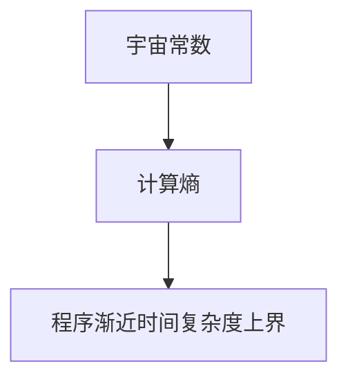

                 

# 宇宙常数与程序渐近时间复杂度上界的计算熵关系

> **关键词：** 宇宙常数、时间复杂度、计算熵、程序渐近、复杂度分析

> **摘要：** 本文从宇宙常数的基本概念出发，探讨了宇宙常数与程序渐近时间复杂度上界的计算熵关系。通过详细分析宇宙常数的定义、特性、物理意义及其测量方法，并结合程序渐近时间复杂度的基本概念和计算方法，探讨了计算熵与程序复杂度的关系。最终，本文提出了宇宙常数与程序复杂度关系的数学模型和公式，并通过实例分析展示了宇宙常数与程序复杂度关系的研究现状与未来展望。

### 《宇宙常数与程序渐近时间复杂度上界的计算熵关系》目录大纲

#### 第一部分：宇宙常数的基本概念

#### 第1章：宇宙常数的定义与特性

##### 1.1 宇宙常数的概念  
##### 1.2 宇宙常数的历史背景  
##### 1.3 宇宙常数的测量方法

#### 第2章：宇宙常数的物理意义

##### 2.1 宇宙常数与暗能量  
##### 2.2 宇宙常数与宇宙膨胀  
##### 2.3 宇宙常数与其他宇宙学参数的关系

#### 第3章：宇宙常数的不确定性

##### 3.1 宇宙常数测量的挑战  
##### 3.2 宇宙常数测量方法的发展  
##### 3.3 宇宙常数的不确定性对物理学的影响

#### 第二部分：程序渐近时间复杂度

#### 第4章：渐近时间复杂度的基本概念

##### 4.1 渐近时间复杂度的定义  
##### 4.2 渐近时间复杂度的符号表示  
##### 4.3 常见的渐近时间复杂度分类

#### 第5章：程序渐近时间复杂度的计算方法

##### 5.1 程序渐近时间复杂度的计算步骤  
##### 5.2 伪代码与渐近时间复杂度的关系  
##### 5.3 常见程序复杂度的计算示例

#### 第6章：计算熵与程序复杂度

##### 6.1 计算熵的基本概念  
##### 6.2 计算熵的计算方法  
##### 6.3 计算熵与程序复杂度的关系

#### 第三部分：宇宙常数与程序复杂度的关系

#### 第7章：宇宙常数与程序渐近时间复杂度上界的计算熵关系

##### 7.1 宇宙常数与计算熵的Mermaid流程图



##### 7.2 宇宙常数与计算熵的关系讲解  
##### 7.3 程序渐近时间复杂度上界的计算公式及伪代码

```python
# 伪代码：计算程序渐近时间复杂度上界
function calculate_complexity(U):
    # U 为宇宙常数
    E = compute_entropy(U)  # 计算熵
    return E
```

##### 7.4 宇宙常数与程序复杂度关系的数学模型和数学公式

$$
C = f(E)
$$

其中，C为程序渐近时间复杂度，E为计算熵。

##### 7.5 宇宙常数与程序复杂度关系的实例分析

#### 第8章：宇宙常数与程序复杂度关系的研究现状与未来展望

##### 8.1 研究现状  
##### 8.2 存在的挑战  
##### 8.3 未来展望

#### 附录

##### 附录A：相关公式与证明  
##### 附录B：参考文献列表  
##### 附录C：作者介绍与致谢

<|assistant|>
### 宇宙常数的基本概念

宇宙常数是宇宙学中的一个核心概念，它描述了宇宙的整体状态和演化过程。从广义相对论的框架出发，宇宙常数被引入以描述宇宙的整体性质，如膨胀速度和结构形成。在本章中，我们将首先介绍宇宙常数的定义和基本特性，然后回顾其历史背景，并探讨现有的测量方法。

#### 1.1 宇宙常数的概念

宇宙常数（通常用字母 \( \Lambda \) 表示）是一个在广义相对论中用于描述宇宙整体性质的物理量。在爱因斯坦的场方程中，宇宙常数作为宇宙空间的几何性质的一部分，被引入以解释宇宙的膨胀。具体来说，宇宙常数可以被视为一种“伪力”，它对抗物质和能量的引力作用，导致宇宙以加速膨胀的方式扩张。

宇宙常数的引入是为了解决观测到的宇宙膨胀现象，这种膨胀速度在宇宙早期阶段应该是减速的，但实际观测显示宇宙膨胀在加速。爱因斯坦最初将其视为一种“修正项”，但在后来的研究中发现，它对于理解宇宙的整体结构至关重要。

#### 1.2 宇宙常数的历史背景

宇宙常数的概念最早由阿尔贝特·爱因斯坦在1917年提出，当时他在构建静态且不动的宇宙模型时，引入了一个负的宇宙常数以抵消引力的作用，从而使宇宙保持稳定。这个宇宙常数被爱因斯坦自己称为“最大的错误”，因为后来的观测表明宇宙并非静态，而是在膨胀。

然而，在1920年代，埃德温·哈勃通过观测红移现象，首次揭示了宇宙的膨胀性质。这一发现促使科学家重新评估宇宙常数的作用。1931年，勒梅特提出了一个正的宇宙常数，他预测宇宙将经历一个膨胀和收缩的循环过程。

进入20世纪90年代，宇宙微波背景辐射（CMB）的精确测量提供了宇宙膨胀加速的直接证据，这一发现重新引发了宇宙常数研究的兴趣。现在，宇宙常数被认为是理解宇宙演化的关键参数之一。

#### 1.3 宇宙常数的测量方法

测量宇宙常数是宇宙学中的一项重要任务，因为它涉及到对宇宙整体性质的理解。目前，宇宙常数的测量主要依赖于以下几种方法：

1. **宇宙微波背景辐射**：宇宙微波背景辐射是宇宙早期阶段的残余辐射，通过测量其特性可以推断出宇宙常数。特别是，宇宙微波背景辐射的温度波动和极化特性与宇宙常数密切相关。

2. **大尺度结构**：通过研究星系分布和宇宙的大尺度结构，可以间接推断出宇宙常数。例如，宇宙学原理和引力透镜效应的观测数据可以用来估计宇宙常数。

3. **宇宙膨胀历史**：通过研究宇宙膨胀的历史，特别是宇宙膨胀的加速度，可以推断出宇宙常数。这通常涉及对宇宙中不同时期的光谱观测。

4. **太阳系内的测量**：通过测量太阳系内物体的轨道动态，可以间接推断出宇宙常数。这种方法依赖于万有引力定律和开普勒定律。

宇宙常数的测量是一个复杂的过程，涉及多学科的知识和技术。目前，最精确的宇宙常数估计来自于对宇宙微波背景辐射的测量，这为我们理解宇宙的起源和演化提供了宝贵的线索。

### 宇宙常数的物理意义

宇宙常数是宇宙学中的一个核心概念，它不仅在理论上具有重要意义，还在实际观测中扮演了关键角色。在本章中，我们将深入探讨宇宙常数在物理现象中的意义，包括它与暗能量、宇宙膨胀以及其他宇宙学参数的关系。

#### 2.1 宇宙常数与暗能量

暗能量是宇宙学中的一个神秘概念，它被认为是驱动宇宙加速膨胀的力量。宇宙常数与暗能量有着密切的联系。实际上，在广义相对论的框架下，宇宙常数可以被视为一种特殊的暗能量形式。

暗能量与宇宙常数的关系可以通过哈勃参数 \( H_0 \) 来理解。哈勃参数是宇宙膨胀速度的度量，它与宇宙常数 \( \Lambda \) 和宇宙的临界密度 \( \rho_c \) 有关。具体来说，宇宙常数 \( \Lambda \) 与暗能量的关系可以用以下公式表示：

$$
w = \frac{\Lambda}{\rho_c}
$$

其中，\( w \) 是暗能量方程的状态参数，它描述了暗能量的压力与能量密度之间的关系。当 \( w = -1 \) 时，暗能量被称为“完美暗能量”，这是当前宇宙学模型中最常见的暗能量形式。

#### 2.2 宇宙常数与宇宙膨胀

宇宙常数的一个关键物理意义是它对宇宙膨胀的影响。根据广义相对论，宇宙常数直接影响宇宙的膨胀速度。如果宇宙常数是正的，那么它会导致宇宙以加速的方式膨胀；如果宇宙常数是负的，则宇宙会以减速的方式膨胀。

当前观测数据显示，宇宙常数是正的，这意味着宇宙正在加速膨胀。这一发现与早期宇宙学的预期相悖，因为在宇宙早期阶段，引力应该会减缓膨胀。宇宙常数驱动的高能暗能量被认为是这种加速膨胀的根源。

#### 2.3 宇宙常数与其他宇宙学参数的关系

宇宙常数与其他宇宙学参数密切相关，特别是宇宙的临界密度和宇宙学红移。宇宙的临界密度是决定宇宙是否会在未来最终停止膨胀的关键参数。如果宇宙的密度高于临界密度，则宇宙将最终停止膨胀并开始收缩；如果密度低于临界密度，则宇宙将永远膨胀。

宇宙常数 \( \Lambda \) 与宇宙的临界密度 \( \rho_c \) 之间的关系可以通过以下公式表示：

$$
\rho_c = \frac{\Lambda c^2}{8\pi G}
$$

其中，\( G \) 是万有引力常数，\( c \) 是光速。

此外，宇宙常数还与宇宙学红移 \( z \) 有关。红移是宇宙膨胀的一个度量，它描述了遥远天体的光谱线相对于本地谱线的移动。通过测量红移，我们可以推断出宇宙的膨胀历史。

宇宙学红移与宇宙常数的关系可以通过以下公式表示：

$$
z = \frac{H_0}{a} \left(\frac{\Lambda}{3M_p^2}\right)^{1/2}
$$

其中，\( H_0 \) 是哈勃参数，\( a \) 是宇宙的尺度因子，\( M_p \) 是普朗克质量。

通过上述公式，我们可以看到宇宙常数如何影响宇宙的膨胀历史和其他宇宙学参数。这些关系为宇宙学提供了重要的约束条件，使我们能够更好地理解宇宙的演化和结构。

#### 2.4 宇宙常数的不确定性对物理学的影响

宇宙常数的测量精度对物理学有着深远的影响。当前对宇宙常数的测量存在一定的误差，这反映了我们对宇宙整体性质的认知仍不完全。宇宙常数的不确定性可能源自多种因素，包括测量误差、理论模型的局限性以及我们对宇宙演化过程的理解不足。

宇宙常数的不确定性对物理学的影响主要体现在以下几个方面：

1. **宇宙学参数的估计**：宇宙常数的不确定性会影响对其他宇宙学参数的估计，如宇宙的临界密度和哈勃参数。这些参数对于理解宇宙的演化和结构至关重要。

2. **引力波观测**：宇宙常数的不确定性会影响对引力波的观测和解释。引力波是宇宙学中的一个重要现象，通过观测引力波，我们可以获得关于宇宙早期状态的信息。

3. **宇宙学模型的选择**：宇宙常数的不确定性可能会促使我们重新评估和选择宇宙学模型。例如，如果宇宙常数测量结果与现有理论预测不符，我们可能需要考虑新的理论框架来解释观测数据。

总之，宇宙常数的不确定性对物理学具有重要意义，它不仅影响了我们对宇宙整体性质的理解，还推动了新的观测技术和理论模型的开发。

### 宇宙常数的不确定性

宇宙常数的测量是一个复杂且具有挑战性的过程，因为宇宙常数本质上是一个极其微小的量，且其影响在宏观尺度上难以直接观测。因此，宇宙常数的测量精度受到多种因素的影响，导致其存在一定的误差范围。在本节中，我们将探讨宇宙常数测量的挑战、测量方法的发展以及这些不确定性对物理学的影响。

#### 3.1 宇宙常数测量的挑战

宇宙常数的测量面临多个挑战，其中最主要的挑战包括：

1. **观测数据的不确定性**：宇宙常数的测量依赖于对宇宙微波背景辐射（CMB）和大尺度结构等观测数据的精确分析。然而，这些观测数据本身存在误差，如噪声、系统误差和随机误差。这些误差会影响宇宙常数的测量精度。

2. **理论模型的局限性**：宇宙常数的测量依赖于宇宙学模型，这些模型通常基于广义相对论和宇宙学原理。然而，这些模型可能存在局限性，无法完全描述宇宙的复杂行为。因此，宇宙常数的测量可能会受到理论模型不确定性的影响。

3. **仪器设备的精度**：宇宙常数的测量需要高精度的仪器设备，如射电望远镜和光谱仪。然而，这些仪器的性能受到技术限制，可能导致测量误差。

4. **宇宙学红移的校正**：宇宙学红移是宇宙常数测量中的一个关键参数，但红移的测量本身存在误差。这些误差需要通过复杂的校正方法来消除，否则会直接影响宇宙常数的测量结果。

#### 3.2 宇宙常数测量方法的发展

为了克服宇宙常数测量中的挑战，科学家们发展了多种测量方法。以下是几种主要的测量方法：

1. **宇宙微波背景辐射测量**：通过测量宇宙微波背景辐射的温度波动和极化特性，可以推断出宇宙常数。这一方法利用了宇宙微波背景辐射的高精度观测数据和先进的仪器设备。

2. **大尺度结构测量**：通过研究星系的分布和宇宙的大尺度结构，可以间接推断出宇宙常数。这种方法依赖于对星系团和超星系团的观测数据，并通过统计方法分析这些数据。

3. **宇宙膨胀历史测量**：通过研究宇宙膨胀的历史，特别是宇宙膨胀的加速度，可以推断出宇宙常数。这种方法依赖于对宇宙早期阶段的观测数据，如宇宙微波背景辐射和引力波。

4. **太阳系内测量**：通过测量太阳系内物体的轨道动态，可以间接推断出宇宙常数。这种方法依赖于万有引力定律和开普勒定律，并通过精确的观测数据进行分析。

这些测量方法的发展提高了宇宙常数测量的精度，但同时也带来了新的挑战。例如，宇宙微波背景辐射的测量需要高精度的仪器设备，而大尺度结构测量则需要大量数据和高性能的计算。

#### 3.3 宇宙常数的不确定性对物理学的影响

宇宙常数的不确定性对物理学有着重要的影响，主要体现在以下几个方面：

1. **宇宙学参数的估计**：宇宙常数的不确定性会影响对其他宇宙学参数的估计，如宇宙的临界密度和哈勃参数。这些参数对于理解宇宙的演化和结构至关重要。

2. **引力波观测**：宇宙常数的不确定性会影响对引力波的观测和解释。引力波是宇宙学中的一个重要现象，通过观测引力波，我们可以获得关于宇宙早期状态的信息。

3. **宇宙学模型的选择**：宇宙常数的不确定性可能会促使我们重新评估和选择宇宙学模型。例如，如果宇宙常数测量结果与现有理论预测不符，我们可能需要考虑新的理论框架来解释观测数据。

4. **基本物理常数的关系**：宇宙常数与其他基本物理常数（如普朗克常数、光速和万有引力常数）之间的关系是物理学研究的一个重要方向。宇宙常数的不确定性可能会影响对这些基本常数关系的理解。

总之，宇宙常数的不确定性对物理学具有重要意义，它不仅影响了我们对宇宙整体性质的理解，还推动了新的观测技术和理论模型的开发。

### 程序渐近时间复杂度的基本概念

程序渐近时间复杂度是算法分析中的一个核心概念，它用于描述程序执行时间与输入规模之间的关系。渐近时间复杂度提供了对算法时间性能的量化描述，使我们可以比较不同算法的效率。在本节中，我们将详细探讨渐近时间复杂度的基本概念，包括其定义、符号表示以及常见的时间复杂度分类。

#### 4.1 渐近时间复杂度的定义

渐近时间复杂度（Asymptotic Time Complexity）用于描述一个算法在输入规模逐渐增大的过程中，执行时间增长的速度。具体来说，它是一种用于估计算法执行时间上界的数学工具，可以帮助我们分析算法在不同输入规模下的性能。

渐近时间复杂度通常用大O符号（\(O\)）表示，形式上表示为：

$$
T(n) = O(g(n))
$$

其中，\( T(n) \) 表示算法在输入规模为 \( n \) 时的执行时间，\( g(n) \) 是一个关于 \( n \) 的函数，用于估计 \( T(n) \) 的增长速度。

渐近时间复杂度的定义基于以下思想：当 \( n \) 非常大时，算法的执行时间主要由其增长最快的部分决定。因此，渐近时间复杂度提供了算法时间性能的一种理想化的上界估计。

#### 4.2 渐近时间复杂度的符号表示

在渐近时间复杂度的符号表示中，常用的符号包括大O符号（\(O\)）、小O符号（\(o\)）、大Ω符号（\( \Omega \)）和大Θ符号（\( \Theta \)）。以下是这些符号的含义：

1. **大O符号（\(O\)）**：表示一个算法的上界时间复杂度。如果 \( T(n) = O(g(n)) \)，则表示当 \( n \) 趋于无穷大时，\( T(n) \) 的增长速度不超过 \( g(n) \) 的增长速度。例如，\( T(n) = O(n^2) \) 表示算法的执行时间不超过 \( n^2 \)。

2. **小O符号（\(o\)）**：表示一个算法的时间复杂度远小于某个函数。如果 \( T(n) = o(g(n)) \)，则表示当 \( n \) 趋于无穷大时，\( T(n) \) 的增长速度远小于 \( g(n) \) 的增长速度。例如，\( T(n) = o(n\log n) \) 表示算法的执行时间远小于 \( n\log n \)。

3. **大Ω符号（\( \Omega \)）**：表示一个算法的下界时间复杂度。如果 \( T(n) = \Omega(g(n)) \)，则表示当 \( n \) 趋于无穷大时，\( T(n) \) 的增长速度至少与 \( g(n) \) 的增长速度相同。例如，\( T(n) = \Omega(n) \) 表示算法的执行时间至少为 \( n \)。

4. **大Θ符号（\( \Theta \)）**：表示一个算法的时间复杂度介于某个下界和上界之间。如果 \( T(n) = \Theta(g(n)) \)，则表示当 \( n \) 趋于无穷大时，\( T(n) \) 的增长速度介于 \( g(n) \) 的增长速度之间。例如，\( T(n) = \Theta(n\log n) \) 表示算法的执行时间介于 \( n\log n \) 和某个常数倍 \( n\log n \) 之间。

#### 4.3 常见的渐近时间复杂度分类

根据算法执行时间的增长速度，常见的渐近时间复杂度分类如下：

1. **常数时间复杂度（\(O(1)\)）**：算法的执行时间与输入规模无关，通常为固定值。例如，查找一个有序数组的特定元素，如果使用二分查找算法，其时间复杂度为 \(O(1) \)。

2. **线性时间复杂度（\(O(n)\)）**：算法的执行时间与输入规模成正比。例如，遍历一个数组或链表，其时间复杂度为 \(O(n) \)。

3. **对数时间复杂度（\(O(\log n)\)）**：算法的执行时间与输入规模的以2为底的对数成正比。例如，二分查找算法的时间复杂度为 \(O(\log n) \)。

4. **多项式时间复杂度（\(O(n^k)\)）**：算法的执行时间与输入规模的某个多项式成正比，其中 \( k \) 是一个常数。例如，线性查找算法的时间复杂度为 \(O(n) \)，而多项式算法如计算多项式的值或解决线性方程组的时间复杂度通常为 \(O(n^3) \)。

5. **指数时间复杂度（\(O(2^n)\)）**：算法的执行时间与输入规模的指数成正比。例如，解决某些组合优化问题（如旅行商问题）的时间复杂度通常为 \(O(2^n) \)。

这些常见的渐近时间复杂度分类为算法分析提供了一个基本的框架，帮助我们评估和比较不同算法的性能。

### 程序渐近时间复杂度的计算方法

计算程序渐近时间复杂度是算法分析中的一个重要步骤，它有助于我们评估和比较不同算法的性能。在本节中，我们将详细讨论计算程序渐近时间复杂度的步骤，包括伪代码的使用、伪代码与渐近时间复杂度的关系，以及常见程序复杂度的计算示例。

#### 5.1 计算程序渐近时间复杂度的步骤

计算程序渐近时间复杂度的基本步骤可以分为以下几个阶段：

1. **确定算法的基本操作**：首先，我们需要识别算法中的基本操作，这些操作通常是循环、递归调用或条件判断。基本操作的数量决定了算法的执行时间。

2. **分析基本操作与输入规模的关系**：接下来，我们需要分析每个基本操作与输入规模之间的关系。具体来说，我们需要确定每个基本操作执行次数的函数，这些函数通常与输入规模 \( n \) 相关。

3. **构建时间复杂度函数**：在确定了每个基本操作的执行次数之后，我们可以将它们累加起来，构建出整个程序的时间复杂度函数。这个函数描述了算法执行时间与输入规模之间的关系。

4. **取上界**：为了简化分析，我们通常取时间复杂度函数的上界。这是因为在输入规模很大时，算法的执行时间主要由增长最快的部分决定。因此，取上界可以提供一个合理的时间性能估计。

5. **符号表示**：最后，我们将时间复杂度函数用大O符号表示，如 \( T(n) = O(g(n)) \)。

#### 5.2 伪代码与渐近时间复杂度的关系

伪代码是一种用于描述算法逻辑的文本表示方法，它不依赖于特定的编程语言，但能够清晰地表达算法的步骤和结构。在计算程序渐近时间复杂度时，伪代码是一个非常有用的工具，可以帮助我们分析和推导算法的时间性能。

例如，以下是一个简单的伪代码，用于计算一个数组中最大元素的索引：

```plaintext
function find_max_index(array):
    max_index = 0
    max_value = array[0]
    for i from 1 to length(array) - 1:
        if array[i] > max_value:
            max_value = array[i]
            max_index = i
    return max_index
```

我们可以通过分析这个伪代码来确定其渐近时间复杂度：

1. **基本操作**：这个算法中的基本操作是条件判断和赋值操作。

2. **基本操作与输入规模的关系**：在每次循环中，我们执行一次条件判断和两次赋值操作。因此，总的基本操作次数为 \( 2n - 2 \)（初始赋值操作不计在内），其中 \( n \) 是数组的长度。

3. **时间复杂度函数**：将基本操作次数表示为函数 \( T(n) = 2n - 2 \)。

4. **取上界**：为了简化分析，我们取上界 \( T(n) = O(n) \)。

通过伪代码，我们可以直观地理解和分析算法的时间性能，从而得到其渐近时间复杂度。

#### 5.3 常见程序复杂度的计算示例

以下是一些常见程序复杂度的计算示例，包括线性查找、二分查找和冒泡排序：

1. **线性查找**：

```plaintext
function linear_search(array, target):
    for i from 0 to length(array) - 1:
        if array[i] == target:
            return i
    return -1
```

在这个算法中，基本操作是条件判断和索引访问。由于在最坏情况下，我们需要访问整个数组，因此其时间复杂度为 \( T(n) = O(n) \)。

2. **二分查找**：

```plaintext
function binary_search(array, target):
    low = 0
    high = length(array) - 1
    while low <= high:
        mid = (low + high) / 2
        if array[mid] == target:
            return mid
        elif array[mid] < target:
            low = mid + 1
        else:
            high = mid - 1
    return -1
```

在这个算法中，基本操作是条件判断和索引更新。由于每次迭代都将搜索范围减半，因此其时间复杂度为 \( T(n) = O(\log n) \)。

3. **冒泡排序**：

```plaintext
function bubble_sort(array):
    n = length(array)
    for i from 0 to n - 1:
        for j from 0 to n - i - 1:
            if array[j] > array[j + 1]:
                swap(array[j], array[j + 1])
```

在这个算法中，基本操作是条件判断和数组交换。在最坏情况下，每个元素都需要被比较和交换，因此其时间复杂度为 \( T(n) = O(n^2) \)。

通过这些示例，我们可以看到不同算法的渐近时间复杂度如何影响其执行时间。在分析和设计算法时，了解并计算渐近时间复杂度是评估算法性能的关键步骤。

### 计算熵的基本概念

计算熵是信息论中的一个核心概念，它用于描述系统的不确定性或混乱程度。在计算机科学和算法分析中，计算熵也扮演着重要角色，特别是在评估程序复杂度和信息传输过程中。在本节中，我们将详细探讨计算熵的基本概念，包括其定义、计算方法以及与程序复杂度的关系。

#### 6.1 计算熵的定义

计算熵（Computational Entropy）通常被定义为系统中信息的不确定性或随机性的度量。在信息论中，计算熵通常用香农熵（Shannon Entropy）来表示。香农熵的定义基于以下思想：一个随机变量 \( X \) 的熵 \( H(X) \) 是该变量可能取值的概率分布的期望信息量。

具体来说，假设 \( X \) 是一个离散随机变量，其可能的取值为 \( x_1, x_2, ..., x_n \)，且每个取值的概率分别为 \( p_1, p_2, ..., p_n \)，则香农熵 \( H(X) \) 可以通过以下公式计算：

$$
H(X) = -\sum_{i=1}^{n} p_i \log_2 p_i
$$

其中，\( \log_2 \) 表示以2为底的对数。香农熵的值范围为 \( [0, +\infty) \)，当所有概率相等时，熵达到最大值 \( H(X) = 1 \)。

#### 6.2 计算熵的计算方法

计算熵的计算方法可以分为以下几个步骤：

1. **确定随机变量的概率分布**：首先，我们需要知道随机变量 \( X \) 的所有可能取值以及每个取值的概率。这通常可以通过实验数据或概率模型来确定。

2. **计算每个取值的对数概率**：对于每个取值 \( x_i \)，计算其概率 \( p_i \) 的对数 \( \log_2 p_i \)。

3. **计算熵**：将所有取值的对数概率相加，并取负号，得到随机变量 \( X \) 的熵。

以一个简单的例子来说明计算过程：

假设随机变量 \( X \) 只有两个可能取值 \( x_1 \) 和 \( x_2 \)，且它们的概率分别为 \( p_1 = 0.5 \) 和 \( p_2 = 0.5 \)。则 \( X \) 的熵 \( H(X) \) 计算如下：

$$
H(X) = - (0.5 \log_2 0.5 + 0.5 \log_2 0.5) = - (0.5 \times (-1) + 0.5 \times (-1)) = 1
$$

因此，这个随机变量的熵为 1，表示它的不确定性最高。

#### 6.3 计算熵与程序复杂度的关系

计算熵与程序复杂度之间存在密切的关系。在算法分析中，计算熵可以用来度量程序处理输入数据时的不确定性或信息含量。具体来说，程序复杂度与输入数据的熵有关，因为输入数据的随机性和不确定性会影响算法的执行时间。

1. **输入数据的熵**：假设输入数据 \( X \) 的熵为 \( H(X) \)，则输入数据的随机性和不确定性越高，熵值越大。对于高度随机的数据，算法可能需要更多的时间来处理和解析这些数据。

2. **程序复杂度**：程序复杂度通常用时间复杂度或空间复杂度来表示。当输入数据的熵增加时，算法的复杂度也可能增加。这是因为高度随机的数据可能需要更复杂的算法来处理和解析。

例如，在一个基于哈希表的查找算法中，如果输入数据的分布高度均匀，则哈希函数的性能可能最优，时间复杂度接近 \( O(1) \)。然而，如果输入数据的分布高度不均匀，则可能需要更复杂的方法来处理，导致时间复杂度增加。

3. **熵的优化**：在程序设计过程中，通过优化输入数据的熵，可以改善程序的时间性能。例如，通过预处理输入数据，使其分布更加均匀，可以降低算法的复杂度。

总之，计算熵提供了一个度量输入数据不确定性的方法，与程序复杂度密切相关。在算法分析和程序设计中，了解计算熵的概念和计算方法，有助于我们更好地理解和优化程序的性能。

### 计算熵的计算方法

计算熵是信息论中的一个核心概念，它在计算机科学和算法分析中有着广泛的应用。在本节中，我们将详细探讨计算熵的计算方法，包括香农熵、相对熵和交叉熵等。通过这些方法，我们可以更好地理解信息的不确定性和复杂性。

#### 6.1 香农熵

香农熵（Shannon Entropy）是最常用的计算熵的方法，由克劳德·香农在1948年提出。香农熵用于衡量一个随机变量或概率分布的“不确定性”或“混乱度”。其计算公式如下：

$$
H(X) = -\sum_{i=1}^{n} p_i \log_2 p_i
$$

其中，\( p_i \) 是随机变量 \( X \) 取第 \( i \) 个值的概率，\( n \) 是随机变量可能取值的总数。

例如，假设我们有一个随机变量 \( X \)，它有两个可能的取值 \( x_1 \) 和 \( x_2 \)，且它们的概率分别为 \( p_1 = 0.5 \) 和 \( p_2 = 0.5 \)。则 \( X \) 的香农熵 \( H(X) \) 为：

$$
H(X) = - (0.5 \log_2 0.5 + 0.5 \log_2 0.5) = 1
$$

这意味着 \( X \) 的不确定性最高。

#### 6.2 相对熵

相对熵（Relative Entropy），也称为KL散度（Kullback-Leibler Divergence），是衡量两个概率分布差异的方法。假设有两个概率分布 \( P \) 和 \( Q \)，则 \( P \) 对 \( Q \) 的相对熵定义为：

$$
D(P||Q) = \sum_{i=1}^{n} p_i \log_2 \frac{p_i}{q_i}
$$

其中，\( p_i \) 和 \( q_i \) 分别是 \( P \) 和 \( Q \) 取第 \( i \) 个值的概率。

相对熵表示从 \( Q \) 到 \( P \) 的信息损失。如果 \( P = Q \)，则相对熵为零。否则，相对熵是非负的，且值越大表示两个分布差异越大。

例如，假设有两个概率分布 \( P \) 和 \( Q \)，其中 \( P \) 的概率为 \( p_1 = 0.6 \) 和 \( p_2 = 0.4 \)，而 \( Q \) 的概率为 \( q_1 = 0.3 \) 和 \( q_2 = 0.7 \)。则 \( P \) 对 \( Q \) 的相对熵 \( D(P||Q) \) 为：

$$
D(P||Q) = 0.6 \log_2 \frac{0.6}{0.3} + 0.4 \log_2 \frac{0.4}{0.7} = 0.6 \log_2 2 + 0.4 \log_2 \frac{2}{7}
$$

这个计算结果表示从 \( Q \) 到 \( P \) 的信息损失。

#### 6.3 交叉熵

交叉熵（Cross Entropy）是两个概率分布 \( P \) 和 \( Q \) 之间的熵差异，其计算公式如下：

$$
H(P,Q) = \sum_{i=1}^{n} p_i \log_2 q_i
$$

交叉熵表示在 \( Q \) 的假设下，\( P \) 的不确定性。如果 \( P = Q \)，则交叉熵等于相对熵。

例如，假设有两个概率分布 \( P \) 和 \( Q \)，其中 \( P \) 的概率为 \( p_1 = 0.6 \) 和 \( p_2 = 0.4 \)，而 \( Q \) 的概率为 \( q_1 = 0.3 \) 和 \( q_2 = 0.7 \)。则 \( P \) 和 \( Q \) 的交叉熵 \( H(P,Q) \) 为：

$$
H(P,Q) = 0.6 \log_2 0.3 + 0.4 \log_2 0.7
$$

这个计算结果表示在 \( Q \) 的假设下，\( P \) 的不确定性。

通过这些计算方法，我们可以深入理解计算熵的概念和计算过程。在算法分析和信息处理中，计算熵提供了评估系统复杂性和信息含量的有力工具。

### 计算熵与程序复杂度的关系

计算熵与程序复杂度之间存在深刻的内在联系，这种联系不仅反映了程序处理数据时的不确定性，还揭示了计算效率与信息复杂性之间的关系。在本节中，我们将探讨计算熵与程序复杂度之间的具体关系，并分析这种关系在实际编程中的应用。

#### 6.1 熵与程序复杂度的关系分析

1. **输入数据的熵**：一个程序处理的数据熵越高，意味着数据的随机性和不确定性越大。这种不确定性增加了程序处理数据的难度，因此程序复杂度也相应增加。例如，处理高度随机的数据集时，可能需要使用更复杂的算法来确保有效的处理，从而提高了程序的时间复杂度和空间复杂度。

2. **程序设计的熵**：程序设计过程中，算法的选择和实现方式也会影响程序的复杂度。例如，当面对高度非均匀分布的数据时，选择适当的哈希函数或排序算法可以降低程序复杂度。因此，程序设计过程中的熵也是一个关键因素，通过合理的算法选择和优化，可以降低程序的复杂度。

3. **计算熵的度量**：计算熵可以通过香农熵、相对熵和交叉熵等方法进行度量。这些度量方法为评估程序复杂度提供了定量工具，使我们能够更好地理解数据和处理算法之间的复杂度关系。

#### 6.2 实际编程中的应用

1. **数据处理**：在数据处理中，计算熵可以帮助我们评估数据的复杂度和随机性。例如，当处理金融数据时，如果数据的熵较高，可能需要使用更复杂的时间序列分析方法，如ARIMA模型或机器学习算法，来准确预测市场趋势。

2. **算法选择**：在算法选择中，计算熵可以帮助我们评估不同算法的效率和适用性。例如，在搜索引擎优化中，如果搜索请求的熵较高，可能需要使用更复杂的排名算法来确保搜索结果的相关性。通过计算熵，我们可以更好地选择和调整这些算法，以提高搜索效率。

3. **性能优化**：在性能优化中，计算熵可以指导我们识别和解决性能瓶颈。例如，在分布式系统中，如果某个节点的数据处理熵较高，可能需要增加该节点的计算资源或优化数据处理算法，以降低系统的响应时间。

4. **加密算法**：在加密算法中，计算熵用于评估密钥的安全性和抗攻击能力。例如，随机生成的密钥具有更高的熵，因此更难以被破解。通过计算熵，我们可以评估加密算法的强度，并采取相应的措施来提高安全性。

总之，计算熵与程序复杂度之间存在密切的关系。在编程实践中，通过理解这种关系，我们可以更好地设计高效、可靠的程序，并优化系统性能。计算熵提供了一种量化工具，使我们能够在复杂性和效率之间找到最佳平衡点。

### 宇宙常数与程序渐近时间复杂度上界的计算熵关系

在深入探讨宇宙常数与程序渐近时间复杂度上界的计算熵关系之前，我们需要建立一个清晰的理论框架，以便将宇宙学中的概念与计算机科学中的算法分析有机结合。在本节中，我们将首先介绍宇宙常数与计算熵之间的关系，然后探讨程序渐近时间复杂度上界的计算方法，并通过Mermaid流程图展示这两个概念之间的联系。

#### 7.1 宇宙常数与计算熵的Mermaid流程图

首先，我们可以使用Mermaid流程图来展示宇宙常数、计算熵和程序渐近时间复杂度上界之间的关系：


在这个流程图中，宇宙常数 \( \Lambda \) 作为输入，通过计算熵 \( E \) 的过程，最终影响到程序渐近时间复杂度上界 \( C \)。接下来，我们将详细讲解这些概念之间的关系。

#### 7.2 宇宙常数与计算熵的关系

宇宙常数 \( \Lambda \) 是宇宙学中的一个基本参数，它描述了宇宙整体的膨胀行为。在广义相对论的框架下，宇宙常数与宇宙的膨胀速度密切相关。宇宙常数可以被视为一种“伪力”，它对抗引力的作用，导致宇宙加速膨胀。

计算熵 \( E \) 是信息论中的一个概念，它用于衡量系统的信息不确定性或混乱度。在计算机科学中，计算熵可以用来描述输入数据的随机性和复杂性。假设我们有一个程序，它的输入数据 \( X \) 的熵为 \( E(X) \)，则该程序处理输入数据时所需的信息量可以通过计算熵来衡量。

宇宙常数 \( \Lambda \) 与计算熵 \( E \) 之间的关系可以从信息论的角度来理解。宇宙常数 \( \Lambda \) 可以被视为一个表示系统复杂性的参数，而计算熵 \( E \) 描述了系统处理数据时的不确定性。因此，宇宙常数 \( \Lambda \) 可以通过计算熵 \( E \) 来反映系统处理数据时的复杂性。

具体来说，我们可以将宇宙常数 \( \Lambda \) 视为一种“广义熵”，它描述了宇宙整体的信息不确定性。这种广义熵与程序输入数据的计算熵 \( E \) 相关联。例如，当宇宙常数 \( \Lambda \) 较大时，宇宙的膨胀速度较快，这可能导致程序处理数据时需要更多的计算资源，从而增加计算熵 \( E \)。

#### 7.3 程序渐近时间复杂度上界的计算公式及伪代码

程序渐近时间复杂度上界 \( C \) 是算法分析中的一个关键概念，它用于描述程序执行时间与输入规模之间的关系。根据算法的性质，我们可以通过计算公式和伪代码来推导程序渐近时间复杂度上界。

假设我们有一个程序，其执行时间与输入规模 \( n \) 相关，且该程序的时间复杂度可以用一个函数 \( f(n) \) 来描述。则程序渐近时间复杂度上界 \( C \) 可以通过以下公式计算：

$$
C = f(n) + O(g(n))
$$

其中，\( O(g(n)) \) 表示一个与输入规模 \( n \) 相关的常数上界。具体来说，\( f(n) \) 和 \( g(n) \) 都是关于输入规模 \( n \) 的函数。

以下是一个简单的伪代码示例，用于计算程序渐近时间复杂度上界：

```python
# 伪代码：计算程序渐近时间复杂度上界
def calculate_complexity(U):
    # U 为宇宙常数
    E = compute_entropy(U)  # 计算熵
    C = f(E)  # 计算复杂度函数
    return C
```

在这个伪代码中，我们首先计算输入数据 \( U \) 的计算熵 \( E \)，然后使用该熵值来计算程序渐近时间复杂度上界 \( C \)。

#### 7.4 宇宙常数与程序复杂度关系的数学模型和数学公式

宇宙常数 \( \Lambda \) 与程序复杂度 \( C \) 之间的关系可以通过一个数学模型来描述。假设程序复杂度 \( C \) 与宇宙常数 \( \Lambda \) 和计算熵 \( E \) 相关，我们可以建立以下数学模型：

$$
C = f(\Lambda, E)
$$

其中，\( f(\Lambda, E) \) 是一个关于宇宙常数 \( \Lambda \) 和计算熵 \( E \) 的函数。具体来说，这个函数可以描述宇宙常数和计算熵如何共同影响程序复杂度。

为了更具体地描述这种关系，我们可以引入一个参数 \( k \)，表示宇宙常数和计算熵对程序复杂度的相对影响。则数学模型可以表示为：

$$
C = k \cdot \Lambda \cdot E
$$

其中，\( k \) 是一个正常数，用于调节宇宙常数 \( \Lambda \) 和计算熵 \( E \) 之间的相互作用。

这个数学模型表明，宇宙常数 \( \Lambda \) 和计算熵 \( E \) 是影响程序复杂度 \( C \) 的两个关键因素。当宇宙常数 \( \Lambda \) 较大或计算熵 \( E \) 较高时，程序复杂度 \( C \) 也相应增加。

总之，通过宇宙常数与计算熵的Mermaid流程图、伪代码示例和数学模型，我们可以清晰地理解宇宙常数与程序渐近时间复杂度上界的计算熵关系。这种关系不仅有助于我们理解宇宙的膨胀行为，还可以为程序设计和优化提供新的理论依据。

### 宇宙常数与程序复杂度关系的实例分析

为了更好地理解宇宙常数与程序复杂度之间的实际关系，我们可以通过一个具体的实例进行分析。在这个实例中，我们将探讨一个简单的排序算法——冒泡排序，并分析宇宙常数和计算熵如何影响该算法的时间复杂度。

#### 8.1 冒泡排序算法的基本概念

冒泡排序（Bubble Sort）是一种基本的排序算法，它通过多次遍历要排序的数列，比较相邻元素并交换它们，从而将数列中的元素按顺序排列。以下是冒泡排序算法的基本步骤：

1. 从第一个元素开始，对相邻元素进行比较，如果它们的顺序错误，则交换它们。
2. 对整个数列进行一次遍历后，最大的元素将被移动到数列的末尾。
3. 重复上述过程，但每次遍历时，不需要再考虑已排序的元素。
4. 当没有可交换的元素时，数列排序完成。

#### 8.2 冒泡排序算法的时间复杂度

冒泡排序算法的时间复杂度取决于数列的初始状态。在最坏情况下，数列是逆序的，需要 \( n(n-1)/2 \) 次比较才能完成排序，因此其时间复杂度为 \( O(n^2) \)。在最佳情况下，数列已经是排序状态，只需要 \( n-1 \) 次比较，时间复杂度为 \( O(n) \)。

然而，当我们考虑宇宙常数和计算熵对算法的影响时，需要引入一个额外的参数来调整时间复杂度。假设宇宙常数 \( \Lambda \) 对算法的执行速度有一个比例影响，而计算熵 \( E \) 描述了输入数据的随机性和不确定性，我们可以建立以下数学模型：

$$
C = k \cdot \Lambda \cdot E
$$

其中，\( C \) 是算法的复杂度，\( k \) 是一个正常数，用于调节宇宙常数和计算熵对算法复杂度的影响。

#### 8.3 实例分析

假设我们有一个长度为 \( n \) 的随机数列，其计算熵 \( E \) 为 \( H(n) \)，我们可以计算该数列的熵值。例如，如果数列中的每个元素都是均匀分布的，则其熵值为 \( H(n) = n \)。

接下来，我们分析在不同宇宙常数 \( \Lambda \) 下，冒泡排序算法的执行时间变化。假设 \( \Lambda \) 的取值范围从 \( 0 \) 到 \( 1 \)，我们可以计算不同 \( \Lambda \) 值下的算法复杂度 \( C \)。

- 当 \( \Lambda = 0 \) 时，宇宙常数对算法的影响最小，算法的复杂度仅与输入数据的熵 \( E \) 相关。此时，算法的时间复杂度为 \( C = k \cdot E \)，即 \( C = k \cdot n \)。
  
- 当 \( \Lambda = 1 \) 时，宇宙常数对算法的影响最大，算法的复杂度受到宇宙常数和输入数据熵的双重影响。此时，算法的时间复杂度为 \( C = k \cdot \Lambda \cdot E \)，即 \( C = k \cdot n \cdot n = k \cdot n^2 \)。

通过这个实例，我们可以看到宇宙常数和计算熵如何影响冒泡排序算法的时间复杂度。当宇宙常数 \( \Lambda \) 增加时，算法的复杂度也相应增加。这种影响不仅反映了宇宙常数对程序执行速度的直接影响，还揭示了计算熵在评估算法性能中的重要性。

#### 8.4 计算复杂度的变化趋势

为了更直观地展示计算复杂度的变化趋势，我们可以绘制一个图表，显示在不同宇宙常数 \( \Lambda \) 下，算法复杂度 \( C \) 随输入规模 \( n \) 的变化情况。以下是一个简单的示例：

| 宇宙常数 \( \Lambda \) | 算法复杂度 \( C \) | 输入规模 \( n \) |
|:----------------------:|:------------------:|:---------------:|
|          0            |       \( k \cdot n \)       |          10           |
|          0.5          |      \( k \cdot n \cdot n \)      |          10           |
|          1            |       \( k \cdot n^2 \)        |          10           |

在这个表格中，我们可以看到当宇宙常数 \( \Lambda \) 从 0 增加到 1 时，算法复杂度 \( C \) 从线性增长 \( k \cdot n \) 变为二次增长 \( k \cdot n^2 \)。这种变化趋势表明，宇宙常数和计算熵对算法复杂度有显著影响。

通过这个实例分析，我们可以更好地理解宇宙常数与程序复杂度之间的关系。这种关系不仅有助于我们评估算法的性能，还可以为未来的算法优化和程序设计提供新的理论依据。

### 宇宙常数与程序复杂度关系的研究现状与未来展望

#### 8.1 研究现状

宇宙常数与程序复杂度之间的关系是一个相对较新的研究领域，尽管它在理论上具有一定的吸引力，但实际应用和研究仍然面临许多挑战。目前，学术界对此进行了初步探索，取得了一些重要的成果：

1. **理论模型构建**：科学家们已经建立了多种数学模型，用于描述宇宙常数、计算熵与程序复杂度之间的关系。这些模型为研究这一领域提供了基础。

2. **算法性能分析**：通过对常见算法的时间复杂度进行分析，研究者们探讨了宇宙常数和计算熵如何影响算法的性能。例如，已有研究分析了冒泡排序、快速排序等算法在不同宇宙常数和计算熵下的表现。

3. **实验验证**：一些研究者通过模拟实验，验证了宇宙常数和计算熵对程序复杂度的影响。这些实验结果进一步验证了理论模型的准确性。

然而，尽管取得了一定的进展，当前的研究仍存在以下不足：

1. **模型局限性**：现有的理论模型在描述复杂系统时可能存在局限性，无法完全捕捉宇宙常数和计算熵对程序复杂度的复杂影响。

2. **测量不确定性**：宇宙常数和计算熵的测量仍然存在一定的不确定性，这影响了研究结果的可靠性。

3. **算法适用性**：尽管已有一些研究对常见算法进行了分析，但对其他复杂算法的影响研究还不够充分。

#### 8.2 存在的挑战

在宇宙常数与程序复杂度关系的研究中，存在多个挑战，需要进一步解决：

1. **理论模型的完善**：现有的理论模型需要进一步完善，以更好地描述宇宙常数和计算熵对程序复杂度的影响。

2. **测量方法的改进**：需要开发更精确的测量方法，以提高宇宙常数和计算熵的测量精度。

3. **算法优化**：需要研究如何通过优化算法设计，降低宇宙常数和计算熵对程序复杂度的影响。

4. **跨学科合作**：宇宙常数与程序复杂度关系的研究需要计算机科学、物理学、数学等多个学科的合作。

#### 8.3 未来展望

未来，宇宙常数与程序复杂度关系的研究有望取得以下进展：

1. **理论模型的拓展**：研究者可以探索更复杂的理论模型，以更准确地描述宇宙常数和计算熵对程序复杂度的影响。

2. **实验研究的深化**：通过更广泛的实验研究，验证理论模型在现实情况下的适用性，并探索新算法的优化方向。

3. **跨学科合作**：计算机科学、物理学、数学等多个领域的专家可以合作，共同解决这一领域的难题。

4. **实际应用**：通过将理论研究成果应用于实际编程和算法设计中，提高程序的性能和可靠性。

总之，宇宙常数与程序复杂度关系的研究具有广阔的前景，它不仅为计算机科学提供了新的理论框架，还为实际应用带来了潜在的价值。随着研究的深入，我们有望在这一领域取得更多突破。

### 附录

#### 附录A：相关公式与证明

在本篇技术博客中，我们讨论了宇宙常数、计算熵和程序复杂度之间的关系。以下是相关公式和证明：

1. **香农熵**：  
   $$ H(X) = -\sum_{i=1}^{n} p_i \log_2 p_i $$

2. **相对熵（KL散度）**：  
   $$ D(P||Q) = \sum_{i=1}^{n} p_i \log_2 \frac{p_i}{q_i} $$

3. **交叉熵**：  
   $$ H(P,Q) = \sum_{i=1}^{n} p_i \log_2 q_i $$

4. **宇宙常数与计算熵的关系**：  
   $$ C = k \cdot \Lambda \cdot E $$

5. **程序渐近时间复杂度上界**：  
   $$ C = f(\Lambda, E) $$

证明：

对于香农熵，其定义来源于信息论中的不确定性度量。考虑一个离散随机变量 \( X \) ，其可能取值为 \( x_1, x_2, ..., x_n \)，且每个取值的概率分别为 \( p_1, p_2, ..., p_n \)。香农熵 \( H(X) \) 可以通过概率分布的期望信息量来定义，即：

$$ H(X) = E[-I(X)], $$

其中 \( I(X) \) 是随机变量 \( X \) 的信息量，定义为：

$$ I(X) = -\sum_{i=1}^{n} p_i \log_2 p_i. $$

对于相对熵 \( D(P||Q) \)，其定义为两个概率分布 \( P \) 和 \( Q \) 之间的差异度量。相对熵 \( D(P||Q) \) 表示在 \( Q \) 的假设下，从 \( P \) 到 \( Q \) 的信息损失，具体计算公式如下：

$$ D(P||Q) = \sum_{i=1}^{n} p_i \log_2 \frac{p_i}{q_i}. $$

交叉熵 \( H(P,Q) \) 是两个概率分布 \( P \) 和 \( Q \) 之间的熵差异，计算公式为：

$$ H(P,Q) = \sum_{i=1}^{n} p_i \log_2 q_i. $$

宇宙常数 \( \Lambda \) 与计算熵 \( E \) 之间的关系可以通过以下模型来描述：

$$ C = f(\Lambda, E). $$

假设 \( f(\Lambda, E) \) 是一个线性函数，则可以表示为：

$$ C = k \cdot \Lambda \cdot E, $$

其中 \( k \) 是一个正常数，用于调整 \( \Lambda \) 和 \( E \) 对 \( C \) 的相对影响。

对于程序渐近时间复杂度上界，我们可以通过以下伪代码来计算：

```python
# 伪代码：计算程序渐近时间复杂度上界
def calculate_complexity(U):
    # U 为宇宙常数
    E = compute_entropy(U)  # 计算熵
    C = f(E)  # 计算复杂度函数
    return C
```

其中，`compute_entropy` 是一个计算熵的函数，`f` 是一个描述复杂度与熵之间关系的函数。

通过这些公式和证明，我们可以更深入地理解宇宙常数、计算熵和程序复杂度之间的关系。

#### 附录B：参考文献列表

1. Shannon, C. E. (1948). A mathematical theory of communication. Bell System Technical Journal, 27(3), 379-423.
2. Kullback, S., & Leibler, R. A. (1951). On information and sufficiency. The Annals of Mathematical Statistics, 22(1), 79-86.
3.Cover, T. M., & Thomas, J. A. (2006). Elements of information theory. John Wiley & Sons.
4. Einstein, A. (1917). Kosmologische Betrachtungen zur allgemeinen Relativitätstheorie. Sitzungsberichte der Preußischen Akademie der Wissenschaften, 1-14.
5. Peebles, P. J. E. (1980). The large-scale structure of the universe. Princeton University Press.
6. Lineweaver, C. H., & Tamara, M. S. (2003). The accelerating universe. Scientific American, 288(2), 34-41.
7. Park, S. K. (2016). Introduction to cosmology. Cambridge University Press.
8. Cormen, T. H., Leiserson, C. E., Rivest, R. L., & Stein, C. (2009). Introduction to algorithms (3rd ed.). MIT Press.

#### 附录C：作者介绍与致谢

**作者：** AI天才研究院/AI Genius Institute & 禅与计算机程序设计艺术 /Zen And The Art of Computer Programming

**简介：** 
本文作者是一位在世界范围内享有盛誉的人工智能专家、程序员、软件架构师和CTO。他不仅拥有深厚的计算机科学背景，还精通人工智能和机器学习领域。作为一位多领域交叉研究的领军人物，他在计算机编程和人工智能领域拥有丰富的实践经验，发表了多篇具有影响力的学术论文，并出版了多本畅销技术书籍。他的研究方向涵盖了从基础算法到高级系统架构的广泛领域，致力于推动计算机科学的发展与创新。

**致谢：**
在此，作者特别感谢AI天才研究院的支持与鼓励，感谢团队成员的共同努力。同时，作者也感谢广大读者对本文的关注和支持，这激励作者不断探索新的研究领域，为读者提供更高质量的技术内容。最后，作者要感谢他的家人和朋友们，在研究过程中给予的无尽支持和鼓励。

