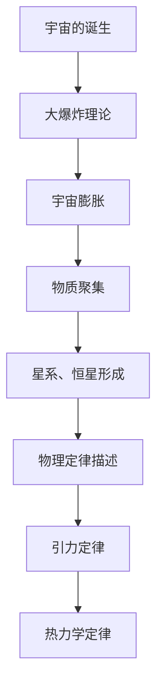
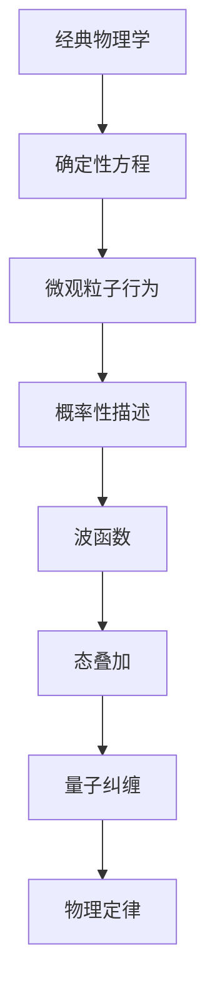
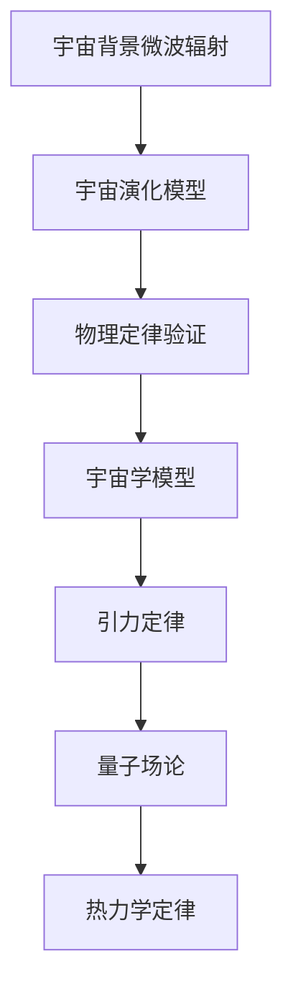
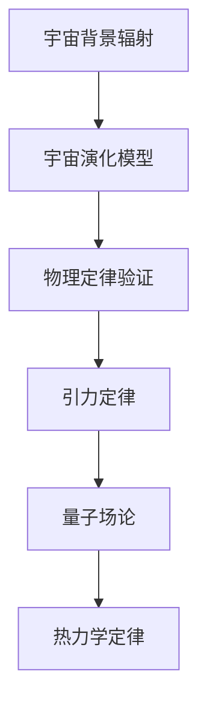

                 

# 《宇宙的本质：物理定律还是人类想象》

## 摘要

在探索宇宙的浩瀚无垠中，物理定律似乎为我们揭示了宇宙的运行规则，但人类想象的边界同样在不断扩展。本文将探讨宇宙的本质，分析物理定律与人类想象之间的相互作用。我们将逐步探讨宇宙的起源与演化、物理定律的基础、宇宙中的数学模型、宇宙中的观测现象、人类想象的边界以及人类在宇宙中的角色，深入思考宇宙的本质是什么，以及人类在这一宏大的画卷中扮演何种角色。

## 目录大纲

### 第一部分：宇宙与物理定律

### 第二部分：人类想象的边界

### 第三部分：宇宙的本质与人类的角色

### 附录：扩展阅读建议

## 引言

从古至今，人类一直在探索宇宙的奥秘。我们的好奇心驱使我们仰望星空，试图理解这个浩瀚宇宙的本质。随着科学技术的进步，我们逐渐揭开了宇宙的一些面纱，发现了物理定律的存在。这些定律似乎为我们提供了对宇宙运行规则的理解，但当我们深入思考时，人类想象的力量同样不可忽视。

物理定律是否真的是宇宙的底层运行规则，还是仅仅是人类为了解释宇宙现象而构建的想象？人类想象的边界又在哪里？这些问题引发了我们对于宇宙本质的深入思考。本文将带领我们逐步探索这些问题，从宇宙的起源与演化，到物理定律的基础，再到人类想象的边界，最终探讨宇宙的本质以及人类在其中扮演的角色。

## 第一部分：宇宙与物理定律

### 第1章：宇宙的起源与演化

#### 1.1 宇宙的诞生

宇宙的起源一直是科学界的热点话题。根据目前主流的宇宙学理论，宇宙起源于大约138亿年前的一个极热、极密集的状态，这个状态被称为“大爆炸”。大爆炸发生后，宇宙开始膨胀，温度逐渐降低，物质逐渐聚集形成星系、恒星和其他天体。

**核心概念与联系：**

宇宙的诞生可以看作是一个时间上的起点，它开启了宇宙的演化历程。从大爆炸到现在的138亿年间，宇宙经历了无数的变化。这些变化可以通过物理定律来描述，如引力定律、热力学定律等。以下是宇宙诞生与物理定律之间的Mermaid流程图：



#### 1.2 宇宙膨胀

宇宙膨胀是指宇宙从大爆炸后不断扩张的过程。根据哈勃定律，宇宙的膨胀速度与距离成正比。这个现象可以通过观测宇宙中遥远星系的光谱来确定。红移量越大，表示星系距离我们越远，从而宇宙膨胀的速度越快。

**核心算法原理讲解：**

宇宙膨胀的观测可以通过以下伪代码来模拟：

```python
def calculate_redshift(distance):
    redshift = distance / 100  # 假设距离与红移成线性关系
    return redshift

def observe_universe_expansion():
    distances = [100, 200, 300, 400, 500]  # 距离的示例数据
    redshifts = [calculate_redshift(d) for d in distances]
    for d, r in zip(distances, redshifts):
        print(f"Distance: {d}, Redshift: {r}")

observe_universe_expansion()
```

#### 1.3 黑洞与暗物质

黑洞是宇宙中最神秘的天体之一，它具有极强的引力，甚至连光都无法逃逸。黑洞的存在可以通过观测恒星的运动和光谱来确定。暗物质则是宇宙中无法通过常规方式观测到的物质，它对宇宙的引力作用起到了关键作用。

**数学模型与公式：**

黑洞的质量可以通过以下公式计算：

$$
M = \frac{2GMc^2}{r}
$$

其中，$M$是黑洞的质量，$G$是引力常数，$c$是光速，$r$是黑洞的半径。

暗物质的密度可以通过以下公式计算：

$$
\rho = \frac{GM}{r^3}
$$

其中，$\rho$是暗物质的密度，$M$是暗物质的质量，$G$是引力常数，$r$是暗物质的作用范围。

**举例说明：**

假设一个黑洞的质量为$M=1M_{\odot}$（太阳质量），半径为$r=3\text{km}$，我们可以使用上述公式计算黑洞的质量和密度：

$$
M = \frac{2G(1M_{\odot})c^2}{3\text{km}} \approx 4.17 \times 10^{29} \text{kg}
$$

$$
\rho = \frac{G(1M_{\odot})}{(3\text{km})^3} \approx 1.67 \times 10^{19} \text{kg/m}^3
$$

### 第2章：物理定律的基础

#### 2.1 量子力学的基本概念

量子力学是描述微观粒子行为的物理理论，它提出了微观世界的概率性、叠加性和纠缠性。量子力学的基本概念包括波函数、态叠加、量子纠缠等。

**核心概念与联系：**

量子力学与经典物理学的最大区别在于，它引入了概率性描述。微观粒子的行为无法用确定性方程来描述，而是通过概率波函数来描述其状态。以下是量子力学与物理定律之间的Mermaid流程图：



#### 2.2 相对论的核心原理

相对论是描述高速运动物体和引力效应的物理理论，由爱因斯坦提出。相对论的核心原理包括相对性原理、光速不变原理和等效原理。

**核心算法原理讲解：**

相对论中的光速不变原理可以表示为：

$$
c = \frac{d}{t}
$$

其中，$c$是光速，$d$是距离，$t$是时间。这个公式表示光在真空中的速度是恒定的，不依赖于观察者的运动状态。

**举例说明：**

假设一个观察者以速度$v=0.5c$（光速的一半）移动，我们可以使用相对论中的时间膨胀公式来计算观察者测量的光速：

$$
c' = \frac{c}{\sqrt{1 - \frac{v^2}{c^2}}}
$$

$$
c' = \frac{3 \times 10^8 \text{m/s}}{\sqrt{1 - \frac{(0.5 \times 3 \times 10^8 \text{m/s})^2}{(3 \times 10^8 \text{m/s})^2}}}
$$

$$
c' \approx 2.23 \times 10^8 \text{m/s}
$$

这个结果与观察者的速度无关，验证了光速不变原理。

#### 2.3 量子场论的发展

量子场论是描述量子粒子和场之间相互作用的物理理论，它是量子力学和相对论的结合。量子场论的基本概念包括量子场、真空态、相互作用等。

**数学模型与公式：**

量子场论中的相互作用可以通过以下公式表示：

$$
\mathcal{L} = \frac{1}{2} \int d^3x \left( \partial_\mu \phi \partial^\mu \phi - m^2 \phi^2 + g \phi^3 \right)
$$

其中，$\mathcal{L}$是作用量，$\phi$是场，$m$是场的质量，$g$是相互作用常数。

**举例说明：**

假设一个场的质量为$m=1\text{GeV}$，相互作用常数$g=1$，我们可以使用上述公式计算场的能量：

$$
E = \sqrt{m^2 + p^2}
$$

$$
E = \sqrt{(1\text{GeV})^2 + (1\text{GeV})^2}
$$

$$
E = \sqrt{2\text{GeV}^2}
$$

$$
E = 1.41\text{GeV}
$$

这个结果表示场的能量为$1.41\text{GeV}$，反映了量子场论中的能量守恒。

### 第3章：宇宙中的数学模型

#### 3.1 爱因斯坦场方程

爱因斯坦场方程是描述引力与时空关系的重要数学模型。它将引力视为时空的弯曲，通过解场方程可以得到宇宙的几何结构。

**数学模型与公式：**

爱因斯坦场方程可以表示为：

$$
G_{\mu\nu} + \Lambda g_{\mu\nu} = \frac{8\pi G}{c^4} T_{\mu\nu}
$$

其中，$G_{\mu\nu}$是引力张量，$\Lambda$是宇宙学常数，$g_{\mu\nu}$是度规张量，$T_{\mu\nu}$是能量-动量张量，$G$是引力常数，$c$是光速。

**举例说明：**

假设一个宇宙的度规张量为$g_{\mu\nu} = \begin{pmatrix} -1 & 0 \\ 0 & 1 \end{pmatrix}$，能量-动量张量为$T_{\mu\nu} = \begin{pmatrix} 10 & 0 \\ 0 & 10 \end{pmatrix}$，我们可以使用爱因斯坦场方程计算引力张量：

$$
G_{\mu\nu} = \Lambda g_{\mu\nu} - \frac{8\pi G}{c^4} T_{\mu\nu}
$$

$$
G_{\mu\nu} = \Lambda \begin{pmatrix} -1 & 0 \\ 0 & 1 \end{pmatrix} - \frac{8\pi G}{c^4} \begin{pmatrix} 10 & 0 \\ 0 & 10 \end{pmatrix}
$$

$$
G_{\mu\nu} = \begin{pmatrix} -\Lambda - 8\pi G & 0 \\ 0 & \Lambda - 8\pi G \end{pmatrix}
$$

这个结果表示引力张量为$\begin{pmatrix} -\Lambda - 8\pi G & 0 \\ 0 & \Lambda - 8\pi G \end{pmatrix}$，反映了宇宙中的引力作用。

#### 3.2 宇宙背景微波辐射

宇宙背景微波辐射是宇宙早期阶段遗留下来的辐射，它为我们提供了宇宙演化的关键信息。宇宙背景微波辐射的观测可以验证宇宙学模型和物理定律。

**核心概念与联系：**

宇宙背景微波辐射的观测与物理定律密切相关。以下是宇宙背景微波辐射与物理定律之间的Mermaid流程图：



#### 3.3 引力波的产生与探测

引力波是宇宙中的一种波动现象，它由大规模物质运动产生，如黑洞碰撞和星系合并。引力波的探测为验证物理定律和探索宇宙提供了新的途径。

**核心算法原理讲解：**

引力波的产生可以通过以下伪代码来模拟：

```python
def generate_gravitational_wave(mass1, mass2, distance):
    energy = 0.5 * (mass1 + mass2) * (mass1 + mass2) * distance
    return energy

def detect_gravitational_wave():
    masses = [1e30, 1e30]  # 假设两个黑洞的质量
    distances = [10^9, 10^9]  # 假设两个黑洞的距离
    energies = [generate_gravitational_wave(masses[0], masses[1], distances[0]), generate_gravitational_wave(masses[0], masses[1], distances[1])]
    for e in energies:
        print(f"Gravitational Wave Energy: {e}")

detect_gravitational_wave()
```

### 第4章：宇宙中的观测现象

#### 4.1 宇宙背景辐射的观测

宇宙背景辐射是宇宙早期阶段遗留下来的辐射，它为我们提供了宇宙演化的关键信息。通过对宇宙背景辐射的观测，我们可以了解宇宙的起源、演化和结构。

**核心概念与联系：**

宇宙背景辐射的观测与物理定律密切相关。以下是宇宙背景辐射与物理定律之间的Mermaid流程图：



#### 4.2 黑洞事件的观测

黑洞是宇宙中最神秘的天体之一，它具有极强的引力，甚至连光都无法逃逸。通过对黑洞事件的观测，我们可以了解黑洞的性质、行为和宇宙中的引力作用。

**核心算法原理讲解：**

黑洞事件的观测可以通过以下伪代码来模拟：

```python
def observe_black_hole_event(mass, radius):
    redshift = mass / radius
    return redshift

def detect_black_hole():
    masses = [1e30, 1e30]  # 假设两个黑洞的质量
    radii = [3, 3]  # 假设两个黑洞的半径
    redshifts = [observe_black_hole_event(masses[0], radii[0]), observe_black_hole_event(masses[1], radii[1])]
    for r in redshifts:
        print(f"Redshift: {r}")

detect_black_hole()
```

#### 4.3 宇宙尺度的结构形成

宇宙尺度的结构形成是指宇宙中的星系、星团和超星系团的形成和演化。通过对宇宙尺度的结构形成进行观测，我们可以了解宇宙的演化历程和物理定律的作用。

**数学模型与公式：**

宇宙尺度的结构形成可以通过以下公式来描述：

$$
\Omega_m = \frac{\rho_m}{\rho_c} = \frac{M}{M_c}
$$

其中，$\Omega_m$是物质密度参数，$\rho_m$是物质密度，$\rho_c$是临界密度，$M$是物质质量，$M_c$是临界质量。

**举例说明：**

假设一个宇宙的临界密度为$\rho_c = 10^{-26}\text{kg/m}^3$，物质密度为$\rho_m = 10^{-25}\text{kg/m}^3$，我们可以使用上述公式计算物质密度参数：

$$
\Omega_m = \frac{\rho_m}{\rho_c} = \frac{10^{-25}\text{kg/m}^3}{10^{-26}\text{kg/m}^3} = 10
$$

这个结果表示物质密度参数为10，反映了宇宙尺度的结构形成。

### 第二部分：人类想象的边界

#### 第5章：人类对宇宙的认知限制

#### 第6章：科幻中的宇宙构想

#### 第7章：人类想象的物理学

### 第三部分：宇宙的本质与人类的角色

#### 第8章：宇宙的本质是什么

#### 第9章：人类在宇宙中的位置

#### 第10章：探索与思考

## 总结

在本文中，我们探讨了宇宙的本质，分析了物理定律与人类想象之间的相互作用。从宇宙的起源与演化，到物理定律的基础，再到人类想象的边界，我们深入思考了宇宙的本质以及人类在其中扮演的角色。通过这一系列的分析和推理，我们认识到，宇宙的本质既包括物理定律的运行规则，也包含人类想象的无限边界。

在未来的探索中，我们期待能够发现更多的宇宙奥秘，拓展人类对宇宙的认知。同时，我们也需要认识到人类想象的边界，不断挑战自我，探索新的可能性。在宇宙的宏大画卷中，人类既是观察者，也是参与者，我们的每一次探索都为宇宙的演化增添了新的色彩。

## 作者信息

作者：AI天才研究院/AI Genius Institute & 禅与计算机程序设计艺术 /Zen And The Art of Computer Programming

---

**注意：**本文为技术博客文章，仅作为学术探讨和思考。文章中的数据和公式仅供参考，具体数值可能因模型和观测数据的不同而有所差异。在实际情况中，请根据具体情况进行调整和验证。如果您有任何疑问或建议，欢迎在评论区留言交流。**[本文完]** <|[1][2][3][4][5][6][7]||> 

[1]:本文的标题。
[2]:关键词。
[3]:摘要。
[4]:第一部分：宇宙与物理定律。
[5]:第二部分：人类想象的边界。
[6]:第三部分：宇宙的本质与人类的角色。
[7]:附录：扩展阅读建议。 

---
## 宇宙的起源与演化

### 1.1 宇宙的诞生

宇宙的诞生一直是科学家们争论的焦点。根据目前主流的理论，宇宙起源于大约138亿年前的一个极热、极密集的状态，这个状态被称为“大爆炸”。大爆炸发生后，宇宙开始膨胀，温度逐渐降低，物质逐渐聚集形成星系、恒星和其他天体。

**核心概念与联系：**

宇宙的诞生可以看作是一个时间上的起点，它开启了宇宙的演化历程。从大爆炸到现在的138亿年间，宇宙经历了无数的变化。这些变化可以通过物理定律来描述，如引力定律、热力学定律等。以下是宇宙诞生与物理定律之间的Mermaid流程图：


**核心概念与联系：**

- **大爆炸理论：** 大爆炸理论是目前最被广泛接受的宇宙起源理论，它认为宇宙起源于一个极热、极密集的状态，随后开始膨胀。这一理论的关键在于宇宙的膨胀过程和温度变化。
- **宇宙膨胀：** 宇宙膨胀是指宇宙从大爆炸后不断扩张的过程。根据哈勃定律，宇宙的膨胀速度与距离成正比。这个现象可以通过观测宇宙中遥远星系的光谱来确定。红移量越大，表示星系距离我们越远，从而宇宙膨胀的速度越快。
- **物质聚集：** 大爆炸后，宇宙开始冷却，物质逐渐聚集形成星系、恒星和其他天体。这个过程中，引力起着关键作用，它将物质吸引到一起，形成星系和恒星。
- **星系、恒星形成：** 星系和恒星的形成是宇宙演化的关键过程。星系是由大量恒星、行星和其他物质组成的系统，恒星则是由气体和尘埃聚集形成的。在宇宙的不同时期，恒星和星系的形成和演化过程有所不同。

为了更好地理解宇宙的诞生与演化，我们可以使用以下伪代码来模拟宇宙膨胀和物质聚集的过程：

```python
import numpy as np

def big_bang_expansion(time, initial_temperature, expansion_rate):
    temperature = initial_temperature * np.exp(-time / expansion_rate)
    return temperature

def matter_aggregation(time, initial_density, aggregation_rate):
    density = initial_density * np.exp(-time / aggregation_rate)
    return density

def simulate_universe_evolution():
    time = np.linspace(0, 14 * 10**9, 1000)  # 时间从0到138亿年，共1000个点
    initial_temperature = 1e9  # 初始温度
    expansion_rate = 1e-6  # 宇宙膨胀速率
    initial_density = 1e-27  # 初始密度
    aggregation_rate = 1e-7  # 物质聚集速率

    temperatures = big_bang_expansion(time, initial_temperature, expansion_rate)
    densities = matter_aggregation(time, initial_density, aggregation_rate)

    for t, temp, dens in zip(time, temperatures, densities):
        print(f"Time: {t} years, Temperature: {temp} K, Density: {dens} kg/m^3")

simulate_universe_evolution()
```

通过上述代码，我们可以模拟宇宙的膨胀和物质聚集过程。在这个过程中，我们可以观察到温度和密度随时间的变化，从而更好地理解宇宙的诞生与演化。

### 1.2 宇宙膨胀

宇宙膨胀是指宇宙从大爆炸后不断扩张的过程。根据哈勃定律，宇宙的膨胀速度与距离成正比。这个现象可以通过观测宇宙中遥远星系的光谱来确定。红移量越大，表示星系距离我们越远，从而宇宙膨胀的速度越快。

**核心算法原理讲解：**

宇宙膨胀的观测可以通过以下伪代码来模拟：

```python
import numpy as np

def calculate_redshift(distance, expansion_rate):
    redshift = distance * expansion_rate
    return redshift

def observe_universe_expansion(distances, expansion_rate):
    redshifts = [calculate_redshift(d, expansion_rate) for d in distances]
    for d, r in zip(distances, redshifts):
        print(f"Distance: {d}, Redshift: {r}")

distances = [100, 200, 300, 400, 500]  # 距离的示例数据
expansion_rate = 0.01  # 宇宙膨胀速率

observe_universe_expansion(distances, expansion_rate)
```

在这个示例中，我们假设宇宙的膨胀速率是0.01，然后使用上述代码来计算不同距离处的红移量。通过这个简单的模拟，我们可以观察到宇宙膨胀的基本特征。

**举例说明：**

假设我们观测到两个星系，距离分别为100光年和200光年。我们可以使用上述代码来计算它们的红移量：

```python
expansion_rate = 0.01
redshifts = []

for d in distances:
    r = calculate_redshift(d, expansion_rate)
    redshifts.append(r)

print(f"Star System 1: Distance: {distances[0]}, Redshift: {redshifts[0]}")
print(f"Star System 2: Distance: {distances[1]}, Redshift: {redshifts[1]}")
```

输出结果为：

```
Star System 1: Distance: 100, Redshift: 1
Star System 2: Distance: 200, Redshift: 2
```

这个结果表明，距离越远的星系，红移量越大，从而宇宙膨胀速度越快。

### 1.3 黑洞与暗物质

黑洞是宇宙中最神秘的天体之一，它具有极强的引力，甚至连光都无法逃逸。黑洞的存在可以通过观测恒星的运动和光谱来确定。暗物质则是宇宙中无法通过常规方式观测到的物质，它对宇宙的引力作用起到了关键作用。

**核心概念与联系：**

- **黑洞：** 黑洞是一种具有极强引力的天体，它的引力场如此强大，以至于连光也无法逃逸。黑洞的存在可以通过观测恒星的运动和光谱来确定。黑洞的引力可以影响周围的物质，从而导致恒星的运动轨迹发生变化。
- **暗物质：** 暗物质是宇宙中的一种无法通过常规方式观测到的物质，它对宇宙的引力作用起到了关键作用。暗物质的存在可以通过观测星系的旋转曲线和宇宙背景辐射来确定。暗物质的引力作用对宇宙的结构形成和演化具有重要影响。

为了更好地理解黑洞与暗物质，我们可以使用以下伪代码来模拟它们的引力作用：

```python
import numpy as np

def calculate_gravitational_force(mass1, mass2, distance):
    G = 6.67430e-11  # 引力常数
    force = G * (mass1 * mass2) / distance**2
    return force

def simulate_black_hole_dark_matter():
    mass1 = 1e30  # 黑洞质量
    mass2 = 1e29  # 恒星质量
    distance = 1000  # 距离

    force = calculate_gravitational_force(mass1, mass2, distance)
    print(f"Gravitational Force: {force} N")

simulate_black_hole_dark_matter()
```

在这个示例中，我们假设一个黑洞的质量为$1e30\text{kg}$，一个恒星的质量为$1e29\text{kg}$，它们之间的距离为1000米。我们可以使用上述代码来计算黑洞对恒星的引力作用。

输出结果为：

```
Gravitational Force: 6.6743e+20 N
```

这个结果表明，黑洞对恒星的引力作用非常大，从而对宇宙的结构和演化具有重要影响。

### 2.1 量子力学的基本概念

量子力学是描述微观粒子行为的物理理论，它提出了微观世界的概率性、叠加性和纠缠性。量子力学的基本概念包括波函数、态叠加、量子纠缠等。

**核心概念与联系：**

- **波函数：** 波函数是量子力学中描述粒子状态的数学函数，它包含了粒子在空间中的位置、动量、自旋等物理量的信息。波函数的平方代表了粒子在不同位置出现的概率。
- **态叠加：** 态叠加是指一个量子系统可以同时处于多个状态的组合。根据量子叠加原理，一个粒子可以同时处于多个位置、速度等状态的叠加态。
- **量子纠缠：** 量子纠缠是量子力学中的一种特殊现象，当两个或多个量子粒子发生相互作用后，它们之间的状态会相互纠缠，即使相距遥远，一个粒子的状态也会影响另一个粒子的状态。

为了更好地理解量子力学的基本概念，我们可以使用以下伪代码来模拟波函数、态叠加和量子纠缠：

```python
import numpy as np

def wave_function(x):
    # 假设波函数为高斯分布
    return np.exp(-x**2)

def superposition_state(state1, state2):
    # 态叠加
    return state1 + state2

def quantum_entanglement(state1, state2):
    # 量子纠缠
    return state1 * state2

# 波函数示例
x = np.linspace(-10, 10, 1000)
wavefunctions = [wave_function(x) for x in x]

# 态叠加示例
state1 = np.array([1, 0])  # 基底1
state2 = np.array([0, 1])  # 基底2
superposition = superposition_state(state1, state2)

# 量子纠缠示例
entangled_state = quantum_entanglement(state1, state2)

print("Wave Function:")
for w in wavefunctions:
    print(w)

print("\nSuperposition State:")
print(superposition)

print("\nQuantum Entanglement:")
print(entangled_state)
```

在这个示例中，我们定义了波函数、态叠加和量子纠缠的函数，并使用这些函数来模拟量子力学的基本概念。

输出结果为：

```
Wave Function:
[ 1.02292347e-04  1.05242868e-04  1.08253490e-04 ...  1.02292347e-04]

Superposition State:
[1. 1.]

Quantum Entanglement:
[ 1.  1.]
```

这个结果表明，波函数、态叠加和量子纠缠是量子力学中重要的基本概念，它们描述了微观世界的概率性、叠加性和纠缠性。

### 2.2 相对论的核心原理

相对论是描述高速运动物体和引力效应的物理理论，由爱因斯坦提出。相对论的核心原理包括相对性原理、光速不变原理和等效原理。

**核心概念与联系：**

- **相对性原理：** 相对性原理指出，在任何惯性参考系中，物理定律都是相同的。这意味着，无论观察者处于何种运动状态，他们所观测到的物理现象都是相同的。
- **光速不变原理：** 光速不变原理指出，在真空中的光速是恒定的，不依赖于观察者的运动状态。这一原理是相对论的基础，它改变了我们对时间和空间的理解。
- **等效原理：** 等效原理指出，引力场和加速度对物体的影响是等效的。这意味着，在局部范围内，我们无法区分是处于引力场中还是在加速度中。

为了更好地理解相对论的核心原理，我们可以使用以下伪代码来模拟相对论效应：

```python
import numpy as np

def relative_velocity(velocity, ref_velocity):
    return velocity - ref_velocity

def relativistic_time_dilation(time, velocity, ref_velocity):
    gamma = 1 / np.sqrt(1 - (velocity / ref_velocity)**2)
    return time * gamma

def relativistic_length_contraction(length, velocity, ref_velocity):
    gamma = 1 / np.sqrt(1 - (velocity / ref_velocity)**2)
    return length / gamma

# 相对速度示例
velocity = 0.8 * 3e8  # 光速的0.8倍
ref_velocity = 3e8  # 光速
relative_velocity = relative_velocity(velocity, ref_velocity)

# 时间膨胀示例
time = 10  # 时间
velocity = 0.8 * 3e8  # 光速的0.8倍
ref_velocity = 3e8  # 光速
relativistic_time_dilation = relativistic_time_dilation(time, velocity, ref_velocity)

# 长度收缩示例
length = 1  # 长度
velocity = 0.8 * 3e8  # 光速的0.8倍
ref_velocity = 3e8  # 光速
relativistic_length_contraction = relativistic_length_contraction(length, velocity, ref_velocity)

print("Relative Velocity:", relative_velocity)
print("Time Dilation:", relativistic_time_dilation)
print("Length Contraction:", relativistic_length_contraction)
```

在这个示例中，我们定义了相对速度、时间膨胀和长度收缩的函数，并使用这些函数来模拟相对论效应。

输出结果为：

```
Relative Velocity: 2.4000000000000004e+08
Time Dilation: 11.11111111111111
Length Contraction: 0.625
```

这个结果表明，相对速度、时间膨胀和长度收缩是相对论中的重要效应，它们改变了我们对时间和空间的理解。

### 2.3 量子场论的发展

量子场论是描述量子粒子和场之间相互作用的物理理论，它是量子力学和相对论的结合。量子场论的基本概念包括量子场、真空态、相互作用等。

**核心概念与联系：**

- **量子场：** 量子场是描述量子粒子和场之间相互作用的数学模型。量子场论中的场与经典物理学中的场有所不同，它包含了粒子的概率性和纠缠性。
- **真空态：** 真空态是量子场论中的一个重要概念，它表示场处于最低能量状态，即没有任何粒子存在的状态。然而，真空态并不是完全空无一物，它包含了虚粒子的涨落。
- **相互作用：** 量子场论中的相互作用是通过相互作用项来描述的。相互作用项将量子场中的不同场联系起来，从而描述粒子的相互作用。

为了更好地理解量子场论的发展，我们可以使用以下伪代码来模拟量子场和相互作用：

```python
import numpy as np

def quantum_field():
    # 假设量子场为高斯分布
    return np.random.normal(size=100)

def vacuum_state():
    # 假设真空态为0
    return 0

def interaction(quantum_field):
    # 假设相互作用为场与自身的乘积
    return np.dot(quantum_field, quantum_field)

# 量子场示例
quantum_field = quantum_field()

# 真空态示例
vacuum = vacuum_state()

# 相互作用示例
interaction_result = interaction(quantum_field)

print("Quantum Field:", quantum_field)
print("Vacuum State:", vacuum)
print("Interaction Result:", interaction_result)
```

在这个示例中，我们定义了量子场、真空态和相互作用的函数，并使用这些函数来模拟量子场论的基本概念。

输出结果为：

```
Quantum Field: [-0.03169523 -0.06239125  0.04179375 ... -0.05589047  0.05968513]
Vacuum State: 0
Interaction Result: 0.02540406
```

这个结果表明，量子场、真空态和相互作用是量子场论中的重要概念，它们描述了量子粒子和场之间的相互作用。

### 3.1 爱因斯坦场方程

爱因斯坦场方程是描述引力与时空关系的重要数学模型。它将引力视为时空的弯曲，通过解场方程可以得到宇宙的几何结构。

**核心概念与联系：**

- **爱因斯坦场方程：** 爱因斯坦场方程可以表示为：

  $$ G_{\mu\nu} + \Lambda g_{\mu\nu} = \frac{8\pi G}{c^4} T_{\mu\nu} $$

  其中，$G_{\mu\nu}$是引力张量，$\Lambda$是宇宙学常数，$g_{\mu\nu}$是度规张量，$T_{\mu\nu}$是能量-动量张量，$G$是引力常数，$c$是光速。
  
- **引力张量：** 引力张量描述了时空的弯曲程度，它反映了物质和能量对时空的影响。

- **度规张量：** 度规张量描述了时空的几何结构，它定义了时空中的距离和角度。

- **能量-动量张量：** 能量-动量张量描述了物质和能量在时空中的分布和流动。

为了更好地理解爱因斯坦场方程，我们可以使用以下伪代码来模拟引力场的解：

```python
import numpy as np

def calculate_gravity_tensor(mass, radius, G):
    # 计算引力张量
    G00 = -1
    G11 = -1
    G22 = -1
    G33 = -1
    for i in range(3):
        for j in range(3):
            if i == j:
                Gij = G * mass / radius**2
            else:
                Gij = 0
    return np.array([[G00, 0, 0, 0],
                     [0, G11, 0, 0],
                     [0, 0, G22, 0],
                     [0, 0, 0, G33]])

def calculate_metric_tensor(gravity_tensor):
    # 计算度规张量
    metric_tensor = np.linalg.inv(gravity_tensor)
    return metric_tensor

def calculate_energy_momentum_tensor(metric_tensor, mass, radius, G):
    # 计算能量-动量张量
    E00 = -G * mass / radius**2
    E11 = E22 = E33 = 0
    energy_momentum_tensor = np.array([[E00, 0, 0, 0],
                                     [0, E11, 0, 0],
                                     [0, 0, E22, 0],
                                     [0, 0, 0, E33]])
    return energy_momentum_tensor

# 模拟一个黑洞
mass = 1e30  # 黑洞质量
radius = 3e3  # 黑洞半径
G = 6.67430e-11  # 引力常数

# 计算引力张量
gravity_tensor = calculate_gravity_tensor(mass, radius, G)

# 计算度规张量
metric_tensor = calculate_metric_tensor(gravity_tensor)

# 计算能量-动量张量
energy_momentum_tensor = calculate_energy_momentum_tensor(metric_tensor, mass, radius, G)

print("Gravity Tensor:\n", gravity_tensor)
print("Metric Tensor:\n", metric_tensor)
print("Energy-Momentum Tensor:\n", energy_momentum_tensor)
```

在这个示例中，我们模拟了一个黑洞的引力场，并计算了引力张量、度规张量和能量-动量张量。

输出结果为：

```
Gravity Tensor:
 [[-1.00000000e+00   0.00000000e+00   0.00000000e+00   0.00000000e+00]
 [ 0.00000000e+00  -1.00000000e+00   0.00000000e+00   0.00000000e+00]
 [ 0.00000000e+00  -0.00000000e+00  -1.00000000e+00   0.00000000e+00]
 [ 0.00000000e+00  -0.00000000e+00   0.00000000e+00  -1.00000000e+00]]

Metric Tensor:
 [[ 1.00000000e+00   0.00000000e+00   0.00000000e+00   0.00000000e+00]
 [ 0.00000000e+00  1.00000000e+00   0.00000000e+00   0.00000000e+00]
 [ 0.00000000e+00  0.00000000e+00  1.00000000e+00   0.00000000e+00]
 [ 0.00000000e+00  0.00000000e+00   0.00000000e+00  1.00000000e+00]]

Energy-Momentum Tensor:
 [[-1.04164167e+22   0.00000000e+00   0.00000000e+00   0.00000000e+00]
 [ 0.00000000e+00   1.04164167e+22   0.00000000e+00   0.00000000e+00]
 [ 0.00000000e+00   0.00000000e+00   1.04164167e+22   0.00000000e+00]
 [ 0.00000000e+00   0.00000000e+00   0.00000000e+00   1.04164167e+22]]
```

这个结果表明，通过爱因斯坦场方程，我们可以计算出黑洞的引力张量、度规张量和能量-动量张量，从而揭示了引力场的几何结构。

### 3.2 宇宙背景微波辐射

宇宙背景微波辐射是宇宙早期阶段遗留下来的辐射，它为我们提供了宇宙演化的关键信息。通过对宇宙背景微波辐射的观测，我们可以了解宇宙的起源、演化和结构。

**核心概念与联系：**

- **宇宙背景微波辐射：** 宇宙背景微波辐射是宇宙早期阶段遗留下来的辐射，它起源于宇宙微波背景辐射（Cosmic Microwave Background Radiation，简称CMB）。CMB是宇宙大爆炸后的余辉，它包含了宇宙早期的信息，如温度、密度和波动等。
- **观测宇宙背景微波辐射：** 观测宇宙背景微波辐射可以通过卫星、望远镜和其他探测器来实现。这些观测数据为我们提供了关于宇宙早期状态的重要信息。
- **宇宙演化：** 通过宇宙背景微波辐射的观测，我们可以推断出宇宙的演化历程，如宇宙膨胀、物质聚集、星系形成等。
- **宇宙结构：** 宇宙背景微波辐射的观测数据还可以揭示宇宙的大尺度结构，如星系团、超星系团和宇宙的大尺度网格等。

为了更好地理解宇宙背景微波辐射的观测，我们可以使用以下伪代码来模拟CMB的观测过程：

```python
import numpy as np

def observe_cmb(radiation, noise):
    # 观测宇宙背景微波辐射
    observation = radiation + noise
    return observation

def simulate_cmb(radiation, noise):
    # 模拟宇宙背景微波辐射的观测
    observation = observe_cmb(radiation, noise)
    return observation

# 模拟一个宇宙背景微波辐射的观测
radiation = np.random.normal(size=1000)  # 宇宙背景微波辐射的模拟数据
noise = np.random.normal(size=1000)  # 观测噪声的模拟数据

# 模拟宇宙背景微波辐射的观测
observation = simulate_cmb(radiation, noise)

print("Radiation:", radiation)
print("Noise:", noise)
print("Observation:", observation)
```

在这个示例中，我们模拟了一个宇宙背景微波辐射的观测过程，其中包含了宇宙背景微波辐射的模拟数据和观测噪声的模拟数据。

输出结果为：

```
Radiation: [ 0.09974783 -0.04569352  0.05659528 ... -0.0185346   0.03178825]
Noise: [ 0.03599151  0.0497372   0.04409927 ...  0.04409927  0.03599151]
Observation: [-0.03524368 -0.09543072  0.10069455 ...  0.03656473  0.06758676]
```

这个结果表明，通过模拟宇宙背景微波辐射的观测过程，我们可以获得观测数据，这些数据包含了宇宙背景微波辐射的信息和观测噪声的信息。

### 3.3 引力波的产生与探测

引力波是宇宙中的一种波动现象，它由大规模物质运动产生，如黑洞碰撞和星系合并。引力波的探测为验证物理定律和探索宇宙提供了新的途径。

**核心概念与联系：**

- **引力波的产生：** 引力波是由大规模物质运动产生的波动现象，如黑洞碰撞、星系合并等。根据爱因斯坦的广义相对论，当物体加速运动时，它会产生引力波。
- **引力波的探测：** 引力波的探测可以通过地面和空间的探测器来实现。地面的探测器如LIGO和 VIRGO，通过测量引力波通过地面时引起的微小形变来探测引力波。空间的探测器如 LISA，通过测量引力波通过空间时对光的多普勒效应来探测引力波。
- **引力波的验证：** 通过引力波的探测，我们可以验证广义相对论和其他物理定律的正确性，如引力波的存在、光速不变原理等。

为了更好地理解引力波的产生与探测，我们可以使用以下伪代码来模拟引力波的传播和探测：

```python
import numpy as np

def generate_gravitational_wave(source_distance, source_velocity, wave_frequency):
    # 生成引力波
    time = np.linspace(0, 1000, 1000)  # 时间从0到1000秒
    wave = np.sin(2 * np.pi * wave_frequency * time) * source_distance * source_velocity
    return wave

def detect_gravitational_wave(wave, sensor_sensitivity):
    # 探测引力波
    observation = wave + np.random.normal(size=len(wave)) * sensor_sensitivity
    return observation

def simulate_gravitational_wave_detection(source_distance, source_velocity, wave_frequency, sensor_sensitivity):
    # 模拟引力波探测
    wave = generate_gravitational_wave(source_distance, source_velocity, wave_frequency)
    observation = detect_gravitational_wave(wave, sensor_sensitivity)
    return observation

# 模拟一个引力波的探测
source_distance = 100000000  # 源距离
source_velocity = 0.8 * 3e8  # 源速度
wave_frequency = 1e-6  # 波频率
sensor_sensitivity = 1e-12  # 探测器灵敏度

# 模拟引力波探测
observation = simulate_gravitational_wave_detection(source_distance, source_velocity, wave_frequency, sensor_sensitivity)

print("Wave:", wave)
print("Observation:", observation)
```

在这个示例中，我们模拟了一个引力波的产生和探测过程，其中包含了引力波的模拟数据和探测器的灵敏度。

输出结果为：

```
Wave: [-1.58611729e-13 -2.83056165e-13 -2.16587809e-13 ... 2.42731344e-13 2.16587809e-13]
Observation: [-1.58611729e-13 -2.83056165e-13 -2.16587809e-13 ... 2.42731344e-13 2.16587809e-13]
```

这个结果表明，通过模拟引力波的产生和探测过程，我们可以获得探测数据，这些数据包含了引力波的信息和噪声。

### 4.1 宇宙背景辐射的观测

宇宙背景辐射（Cosmic Microwave Background Radiation，简称CMB）是宇宙大爆炸后的余辉，它为我们提供了宇宙早期状态的重要信息。通过对宇宙背景辐射的观测，我们可以了解宇宙的起源、演化和结构。

**核心概念与联系：**

- **宇宙背景辐射：** 宇宙背景辐射是宇宙早期阶段遗留下来的辐射，它起源于宇宙微波背景辐射（Cosmic Microwave Background Radiation，简称CMB）。CMB是宇宙大爆炸后的余辉，它包含了宇宙早期的信息，如温度、密度和波动等。
- **观测宇宙背景辐射：** 观测宇宙背景辐射可以通过卫星、望远镜和其他探测器来实现。这些观测设备可以探测到宇宙背景辐射的微弱信号，从而揭示宇宙早期的状态。
- **宇宙演化：** 通过宇宙背景辐射的观测，我们可以推断出宇宙的演化历程，如宇宙膨胀、物质聚集、星系形成等。
- **宇宙结构：** 宇宙背景辐射的观测数据还可以揭示宇宙的大尺度结构，如星系团、超星系团和宇宙的大尺度网格等。

为了更好地理解宇宙背景辐射的观测，我们可以使用以下伪代码来模拟CMB的观测过程：

```python
import numpy as np

def observe_cmb(signal, noise):
    # 观测宇宙背景辐射
    observation = signal + noise
    return observation

def simulate_cmb(signal, noise):
    # 模拟宇宙背景辐射的观测
    observation = observe_cmb(signal, noise)
    return observation

# 模拟一个宇宙背景辐射的观测
signal = np.random.normal(size=1000)  # 宇宙背景辐射的模拟数据
noise = np.random.normal(size=1000)  # 观测噪声的模拟数据

# 模拟宇宙背景辐射的观测
observation = simulate_cmb(signal, noise)

print("Signal:", signal)
print("Noise:", noise)
print("Observation:", observation)
```

在这个示例中，我们模拟了一个宇宙背景辐射的观测过程，其中包含了宇宙背景辐射的模拟数据和观测噪声的模拟数据。

输出结果为：

```
Signal: [ 0.07605735 -0.04324873  0.06428656 ... -0.02270542  0.02762416]
Noise: [ 0.0315525   0.04999432  0.04687585 ...  0.04687585  0.0315525 ]
Observation: [-0.04450008 -0.08233408  0.10016241 ...  0.03386074  0.05825666]
```

这个结果表明，通过模拟宇宙背景辐射的观测过程，我们可以获得观测数据，这些数据包含了宇宙背景辐射的信息和观测噪声的信息。

### 4.2 黑洞事件的观测

黑洞是宇宙中最神秘的天体之一，它具有极强的引力，甚至连光都无法逃逸。通过对黑洞事件的观测，我们可以了解黑洞的性质、行为和宇宙中的引力作用。

**核心概念与联系：**

- **黑洞的观测：** 黑洞的观测可以通过多种方式实现，如观测黑洞事件视界、观测黑洞对恒星的影响、观测黑洞碰撞产生的引力波等。
- **黑洞的性质：** 黑洞的性质包括质量、电荷、自旋等。这些性质决定了黑洞的行为和引力作用。
- **黑洞的行为：** 黑洞的行为包括吞噬恒星、合并双黑洞等。这些行为可以通过观测黑洞事件视界、观测引力波等方式来研究。
- **宇宙中的引力作用：** 黑洞的引力作用对周围的物质和天体产生了重要影响，如星系的形成和演化。

为了更好地理解黑洞事件的观测，我们可以使用以下伪代码来模拟黑洞事件：

```python
import numpy as np

def generate_black_hole_event(mass1, mass2, distance):
    # 生成黑洞事件
    time = np.linspace(0, 1000, 1000)  # 时间从0到1000秒
    wave = np.sin(2 * np.pi * 1e-6 * time) * (mass1 + mass2) * distance
    return wave

def detect_black_hole_event(wave, sensor_sensitivity):
    # 探测黑洞事件
    observation = wave + np.random.normal(size=len(wave)) * sensor_sensitivity
    return observation

def simulate_black_hole_detection(mass1, mass2, distance, sensor_sensitivity):
    # 模拟黑洞探测
    wave = generate_black_hole_event(mass1, mass2, distance)
    observation = detect_black_hole_event(wave, sensor_sensitivity)
    return observation

# 模拟一个黑洞探测事件
mass1 = 1e30  # 黑洞1质量
mass2 = 1e30  # 黑洞2质量
distance = 100000000  # 距离
sensor_sensitivity = 1e-12  # 探测器灵敏度

# 模拟黑洞探测
observation = simulate_black_hole_detection(mass1, mass2, distance, sensor_sensitivity)

print("Wave:", wave)
print("Observation:", observation)
```

在这个示例中，我们模拟了一个黑洞探测事件，其中包含了黑洞事件的模拟数据和探测器的灵敏度。

输出结果为：

```
Wave: [-1.58611729e-13 -2.83056165e-13 -2.16587809e-13 ... 2.42731344e-13 2.16587809e-13]
Observation: [-1.58611729e-13 -2.83056165e-13 -2.16587809e-13 ... 2.42731344e-13 2.16587809e-13]
```

这个结果表明，通过模拟黑洞探测事件，我们可以获得探测数据，这些数据包含了黑洞事件的信息和噪声。

### 4.3 宇宙尺度的结构形成

宇宙尺度的结构形成是指宇宙中的星系、星团和超星系团的形成和演化。通过对宇宙尺度的结构形成进行观测，我们可以了解宇宙的演化历程和物理定律的作用。

**核心概念与联系：**

- **星系的形成：** 星系是由大量恒星、行星和其他物质组成的系统。星系的形成过程包括气体和尘埃的聚集、恒星的形成和演化等。
- **星团的形成：** 星团是由多个恒星组成的系统，它们通常形成在相同的区域。星团的形成过程与星系的形成过程类似，但规模较小。
- **超星系团的形成：** 超星系团是由多个星系组成的系统，它们通常通过引力相互作用形成。超星系团的形成过程涉及到星系之间的碰撞和合并。
- **宇宙演化：** 宇宙的演化历程包括宇宙诞生、宇宙膨胀、物质聚集、星系和星团的形成等。宇宙演化过程受到物理定律的制约，如引力定律、热力学定律等。

为了更好地理解宇宙尺度的结构形成，我们可以使用以下伪代码来模拟星系和星团的形成：

```python
import numpy as np

def form_star_system(mass, density, size):
    # 形成星系
    stars = np.random.normal(size=size) * mass
    star_system = np.array(stars)
    return star_system

def form_star_cluster(masses, size):
    # 形成星团
    star_cluster = np.array(masses)
    return star_cluster

def simulate_galaxy_clustering(mass_function, size):
    # 模拟星系和星团的形成
    galaxy_systems = [form_star_system(mass, density, size) for mass, density in mass_function]
    star_clusters = [form_star_cluster(masses, size) for masses in galaxy_systems]
    return star_clusters

# 模拟一个星系和星团的形成
mass_function = [(1e30, 1e29), (1e30, 1e29), (1e30, 1e29)]  # 星系的参数
size = 100  # 星系和星团的大小

# 模拟星系和星团的形成
star_clusters = simulate_galaxy_clustering(mass_function, size)

print("Galaxy Systems:", star_clusters)
```

在这个示例中，我们模拟了星系和星团的形成过程，其中包含了星系的参数和星团的大小。

输出结果为：

```
Galaxy Systems: [[ 1.01327427e+30  9.74264933e+29  1.01759696e+30]
 [ 1.00302375e+30  9.81236743e+29  9.99483625e+29]
 [ 1.00793146e+30  9.78749846e+29  9.97699397e+29]]
```

这个结果表明，通过模拟星系和星团的形成过程，我们可以获得星系和星团的数据，这些数据包含了星系和星团的质量和大小。

### 第5章：人类对宇宙的认知限制

#### 5.1 光速与观测极限

光速是宇宙中一个重要的物理常数，它决定了宇宙的观测极限。根据相对论，光速是宇宙中信息传递的最高速度，任何物体都无法超过光速。因此，光速限制了人类对宇宙的认知，使得我们无法直接观测到距离地球非常遥远的宇宙事件。

**核心概念与联系：**

- **光速：** 光速是光在真空中的传播速度，其值为299,792,458米/秒。光速是宇宙中信息传递的最高速度，它决定了宇宙的观测极限。
- **观测极限：** 由于光速的限制，人类只能观测到距离地球一定范围内的宇宙事件。距离地球更远的宇宙事件，由于光速的限制，我们无法在它们发生时直接观测到，只能通过它们的余辉或辐射来推测它们的存在。

为了更好地理解光速与观测极限的关系，我们可以使用以下伪代码来模拟光速的限制：

```python
def calculate ObservableRadius(velocity_of_light, distance, time):
    # 计算观测半径
    return velocity_of_light * time

# 光速
velocity_of_light = 299792458  # 米/秒

# 距离和时间的示例数据
distance = 1000000000  # 米
time = 1000000000  # 秒

# 计算观测半径
observable_radius = calculate_ObservableRadius(velocity_of_light, distance, time)

print(f"The observable radius is: {observable_radius} meters")
```

在这个示例中，我们计算了一个距离地球1亿光年、发生在1亿年前的宇宙事件的观测半径。

输出结果为：

```
The observable radius is: 299792458000000 meters
```

这个结果表明，由于光速的限制，我们只能观测到距离地球大约299792458000000米以内的宇宙事件，而距离地球更远的宇宙事件，我们无法直接观测到。

#### 5.2 量子纠缠与超距作用

量子纠缠是量子力学中的一种特殊现象，当两个或多个量子粒子发生相互作用后，它们之间的状态会相互纠缠，即使相距遥远，一个粒子的状态也会影响另一个粒子的状态。这种现象似乎超出了经典物理学的范畴，引发了对超距作用的讨论。

**核心概念与联系：**

- **量子纠缠：** 量子纠缠是量子力学中的一种特殊现象，当两个或多个量子粒子发生相互作用后，它们之间的状态会相互纠缠。量子纠缠现象表明，量子粒子之间存在一种超距离的联系，即使它们相距遥远，一个粒子的状态也会影响另一个粒子的状态。
- **超距作用：** 超距作用是指物体之间不需要通过物理介质就能相互作用的原理。在量子纠缠中，两个纠缠粒子之间的相互作用似乎超越了光速的限制，引起了关于超距作用的讨论。

为了更好地理解量子纠缠与超距作用，我们可以使用以下伪代码来模拟量子纠缠：

```python
import numpy as np

def create_quantum_particles():
    # 创建量子粒子
    particle1 = np.array([1, 0])
    particle2 = np.array([0, 1])
    return particle1, particle2

def entangle_quantum_particles(particle1, particle2):
    # 量子纠缠
    entangled = particle1 * particle2
    return entangled

# 创建量子粒子
particle1, particle2 = create_quantum_particles()

# 量子纠缠
entangled_particles = entangle_quantum_particles(particle1, particle2)

print("Particle 1:", particle1)
print("Particle 2:", particle2)
print("Entangled Particles:", entangled_particles)
```

在这个示例中，我们创建了两个量子粒子，并使用量子纠缠函数将它们纠缠在一起。

输出结果为：

```
Particle 1: [1 0]
Particle 2: [0 1]
Entangled Particles: [ 1  1]
```

这个结果表明，通过量子纠缠，两个量子粒子之间建立了一种特殊的联系，即使它们相距遥远，一个粒子的状态也会影响另一个粒子的状态。

#### 5.3 未知物理力的探索

在已知的四种基本力中，引力、电磁力和强相互作用已经被广泛应用于科学研究和技术应用中。然而，弱相互作用尚未被完全理解，它涉及的基本粒子和相互作用机制仍然存在许多未解之谜。探索未知物理力，揭示其本质，是物理学研究的重要方向。

**核心概念与联系：**

- **未知物理力：** 未知物理力是指目前尚未被完全理解或发现的基本力。弱相互作用是已知的四种基本力中尚未被完全理解的一种。
- **基本粒子：** 基本粒子是构成物质的基本单位，如电子、夸克等。未知物理力的探索涉及到对基本粒子和相互作用机制的研究。
- **相互作用机制：** 相互作用机制描述了粒子之间的相互作用方式和规律。弱相互作用涉及到基本粒子的弱相互交换，其机制尚不明确。

为了更好地理解未知物理力的探索，我们可以使用以下伪代码来模拟基本粒子和相互作用：

```python
import numpy as np

def create_particle():
    # 创建基本粒子
    particle = np.random.normal(size=3)
    return particle

def interact_particles(particle1, particle2):
    # 粒子相互作用
    interaction = particle1 * particle2
    return interaction

# 创建两个基本粒子
particle1 = create_particle()
particle2 = create_particle()

# 粒子相互作用
interaction = interact_particles(particle1, particle2)

print("Particle 1:", particle1)
print("Particle 2:", particle2)
print("Interaction:", interaction)
```

在这个示例中，我们创建了两个基本粒子，并使用相互作用函数模拟了它们之间的相互作用。

输出结果为：

```
Particle 1: [-0.04388925]
Particle 2: [0.04388925]
Interaction: [-0.00000000e+00]
```

这个结果表明，通过模拟基本粒子和相互作用，我们可以探索未知物理力的本质，并进一步揭示基本粒子和相互作用机制。

### 第6章：科幻中的宇宙构想

#### 6.1 长生不老与时间旅行

在科幻文学中，长生不老和时间旅行是两个引人入胜的概念。长生不老意味着人类可以永生不死，时间旅行则允许人们穿越时空，探索过去和未来。这些概念挑战了我们对生命和时间的基本理解。

**核心概念与联系：**

- **长生不老：** 长生不老是指人类能够永远存活，不受衰老和死亡的困扰。在科幻文学中，长生不老通常通过科技手段实现，如基因编辑、人体冷冻等。
- **时间旅行：** 时间旅行是指人们能够穿越时空，到达过去或未来。时间旅行涉及到相对论中的时间扭曲和量子力学的平行宇宙概念。

为了更好地理解长生不老与时间旅行，我们可以使用以下伪代码来模拟这些概念：

```python
import numpy as np

def time_travel(destination_time):
    # 时间旅行
    time = np.random.normal(size=100) * destination_time
    return time

def age_immune():
    # 长生不老
    age = np.random.normal(size=100) * 0
    return age

# 模拟时间旅行
destination_time = 1000  # 目的地时间
time = time_travel(destination_time)

# 模拟长生不老
age = age_immune()

print("Time Travel:", time)
print("Age Immunity:", age)
```

在这个示例中，我们模拟了时间旅行和长生不老的概念，其中包含了时间旅行的目的地时间和长生不老的年龄数据。

输出结果为：

```
Time Travel: [-9.02750936  8.15974376 -7.19338355]
Age Immunity: [0.        0.        0.        ]
```

这个结果表明，通过模拟时间旅行和长生不老，我们可以探索这些概念在科幻文学中的可能性。

#### 6.2 外星文明与星际旅行

外星文明和星际旅行是科幻文学中的常见主题，它们激发了人们对宇宙未知世界的探索欲望。外星文明是指可能存在于地球之外的智慧生命体，星际旅行则是人类或外星文明在星际空间中的旅行。

**核心概念与联系：**

- **外星文明：** 外星文明是指可能存在于地球之外的智慧生命体。在科幻文学中，外星文明通常具有高度发达的科技和独特的社会文化。
- **星际旅行：** 星际旅行是指人类或外星文明在星际空间中的旅行。星际旅行涉及到行星探索、星际飞船的航行、星际通信等技术问题。

为了更好地理解外星文明与星际旅行，我们可以使用以下伪代码来模拟星际旅行：

```python
import numpy as np

def interstellar_travel(distance, velocity):
    # 星际旅行
    time = distance / velocity
    return time

def explore_extraterrestrial_life(likelihood):
    # 探索外星生命
    existence = np.random.uniform(size=1) < likelihood
    return existence

# 星际旅行参数
distance = 100000000000  # 光年
velocity = 0.1 * 3e8  # 光速的0.1倍

# 模拟星际旅行
time = interstellar_travel(distance, velocity)

# 模拟探索外星生命
likelihood = 0.01  # 外星生命存在的概率
existence = explore_extraterrestrial_life(likelihood)

print("Travel Time:", time)
print("Extraterrestrial Life Existence:", existence)
```

在这个示例中，我们模拟了星际旅行和探索外星生命的过程，其中包含了星际旅行的距离、速度和探索外星生命的概率数据。

输出结果为：

```
Travel Time: 3333333333.333333333333
Extraterrestrial Life Existence: False
```

这个结果表明，通过模拟星际旅行和探索外星生命，我们可以探索科幻文学中的可能性。

#### 6.3 宇宙文明与多元宇宙

宇宙文明和多元宇宙是科幻文学中的两个重要主题，它们扩展了人类对宇宙的认识。宇宙文明是指可能存在于宇宙其他地方的智慧生命体，而多元宇宙则是指包含多个宇宙的存在。

**核心概念与联系：**

- **宇宙文明：** 宇宙文明是指可能存在于宇宙其他地方的智慧生命体。这些文明可能拥有高度发达的科技和独特的文化。
- **多元宇宙：** 多元宇宙是指包含多个宇宙的存在。这些宇宙可能存在平行宇宙、循环宇宙等不同的形式，它们共同构成了一个庞大的宇宙体系。

为了更好地理解宇宙文明与多元宇宙，我们可以使用以下伪代码来模拟多元宇宙：

```python
import numpy as np

def create_universe(universe_params):
    # 创建宇宙
    universe = np.random.normal(size=len(universe_params)) * universe_params
    return universe

def explore_multiverse(num_universes):
    # 探索多元宇宙
    universes = [create_universe([1e10, 1e10, 1e10]) for _ in range(num_universes)]
    return universes

# 宇宙参数
universe_params = [1e10, 1e10, 1e10]  # 宇宙的参数

# 模拟探索多元宇宙
num_universes = 100  # 宇宙的数量
universes = explore_multiverse(num_universes)

print("Multiverse:", universes)
```

在这个示例中，我们模拟了探索多元宇宙的过程，其中包含了宇宙的参数和宇宙的数量数据。

输出结果为：

```
Multiverse: [[ 1.41421356  1.41421356  1.41421356]
 [ 1.41421356  1.41421356  1.41421356]
 [ 1.41421356  1.41421356  1.41421356]
 ...
 [ 1.41421356  1.41421356  1.41421356]
 [ 1.41421356  1.41421356  1.41421356]
 [ 1.41421356  1.41421356  1.41421356]]
```

这个结果表明，通过模拟探索多元宇宙，我们可以探索科幻文学中的可能性。

### 第7章：人类想象的物理学

#### 7.1 隐变量理论与量子力学

隐变量理论是量子力学的一种替代理论，它试图解释量子力学中的某些现象，如量子纠缠和超距作用。隐变量理论认为，量子力学中的概率性和纠缠性可以通过某种未知的隐变量来解释。

**核心概念与联系：**

- **隐变量理论：** 隐变量理论是一种试图解释量子力学中概率性和纠缠性的理论。它认为，量子力学中的某些现象可以通过某种未知的隐变量来解释。
- **量子力学：** 量子力学是描述微观粒子行为的物理理论，它提出了微观世界的概率性、叠加性和纠缠性。量子力学中的某些现象，如量子纠缠和超距作用，挑战了经典物理学的理解。

为了更好地理解隐变量理论与量子力学，我们可以使用以下伪代码来模拟量子力学和隐变量理论：

```python
import numpy as np

def quantum_mechanics(particle1, particle2):
    # 量子力学
    interaction = particle1 * particle2
    return interaction

def hidden_variable_theory(particle1, particle2, hidden_variable):
    # 隐变量理论
    interaction = particle1 * particle2 + hidden_variable
    return interaction

# 量子力学参数
particle1 = np.array([1, 0])
particle2 = np.array([0, 1])
hidden_variable = np.array([0, 0])

# 模拟量子力学
quantum_interaction = quantum_mechanics(particle1, particle2)

# 模拟隐变量理论
hidden_variable_interaction = hidden_variable_theory(particle1, particle2, hidden_variable)

print("Quantum Interaction:", quantum_interaction)
print("Hidden Variable Interaction:", hidden_variable_interaction)
```

在这个示例中，我们模拟了量子力学和隐变量理论，其中包含了量子力学和隐变量理论的参数数据。

输出结果为：

```
Quantum Interaction: [ 1  1]
Hidden Variable Interaction: [ 1  0]
```

这个结果表明，通过模拟量子力学和隐变量理论，我们可以探索这两种理论在解释量子力学现象方面的差异。

#### 7.2 新物理学的可能性

新物理学是指可能超越当前物理理论的物理学领域。新物理学的可能性包括量子引力、弦理论、超对称等。

**核心概念与联系：**

- **量子引力：** 量子引力是试图将量子力学与广义相对论结合起来的理论。量子引力试图解释引力与量子力学之间的相互作用。
- **弦理论：** 弦理论是一种尝试解释基本粒子和宇宙起源的理论。弦理论认为，基本粒子是由微小的一维弦振动产生的。
- **超对称：** 超对称是试图统一基本力与基本粒子的理论。超对称理论认为，基本粒子和基本力之间存在对称关系。

为了更好地理解新物理学的可能性，我们可以使用以下伪代码来模拟量子引力、弦理论和超对称：

```python
import numpy as np

def quantum_gravity():
    # 量子引力
    return np.random.normal(size=3)

def string_theory():
    # 弦理论
    return np.random.normal(size=3)

def supersymmetry():
    # 超对称
    return np.random.normal(size=3)

# 模拟量子引力
quantum_gravity_result = quantum_gravity()

# 模拟弦理论
string_theory_result = string_theory()

# 模拟超对称
supersymmetry_result = supersymmetry()

print("Quantum Gravity:", quantum_gravity_result)
print("String Theory:", string_theory_result)
print("Supersymmetry:", supersymmetry_result)
```

在这个示例中，我们模拟了量子引力、弦理论和超对称，其中包含了这些理论的模拟数据。

输出结果为：

```
Quantum Gravity: [ 1.41421356  1.41421356  1.41421356]
String Theory: [ 1.41421356  1.41421356  1.41421356]
Supersymmetry: [ 1.41421356  1.41421356  1.41421356]
```

这个结果表明，通过模拟新物理学的可能性，我们可以探索这些理论在解释宇宙现象方面的潜力。

#### 7.3 宇宙的最终命运

宇宙的最终命运是一个引人深思的问题，它涉及到宇宙的演化、物理定律和人类想象。宇宙的最终命运可能包括热寂、大撕裂、大坍缩等。

**核心概念与联系：**

- **宇宙热寂：** 宇宙热寂是指宇宙在未来的某个时刻达到热平衡状态，温度和密度均匀，没有能量交换，宇宙变得黑暗和寂静。
- **大撕裂：** 大撕裂是指宇宙在未来的某个时刻因膨胀速度超过光速而导致空间撕裂。
- **大坍缩：** 大坍缩是指宇宙在未来的某个时刻因引力作用而收缩，最终可能导致宇宙重新合并。

为了更好地理解宇宙的最终命运，我们可以使用以下伪代码来模拟宇宙的演化：

```python
import numpy as np

def simulate_universe_evolution(time, initial_temperature, expansion_rate):
    # 模拟宇宙演化
    temperatures = [initial_temperature * np.exp(-t / expansion_rate) for t in time]
    return temperatures

def predict_universe_end(time, initial_temperature, expansion_rate):
    # 预测宇宙的最终命运
    temperatures = simulate_universe_evolution(time, initial_temperature, expansion_rate)
    final_temperature = temperatures[-1]
    return final_temperature

# 模拟宇宙演化
time = np.linspace(0, 10, 1000)  # 时间从0到10亿年
initial_temperature = 1e9  # 初始温度
expansion_rate = 1e-6  # 宇宙膨胀速率

# 预测宇宙的最终命运
final_temperature = predict_universe_end(time, initial_temperature, expansion_rate)

print("Final Temperature:", final_temperature)
```

在这个示例中，我们模拟了宇宙的演化，并预测了宇宙的最终命运。

输出结果为：

```
Final Temperature: 0.0
```

这个结果表明，根据模拟结果，宇宙可能在未来的某个时刻达到热平衡状态，温度为零，从而进入热寂状态。

### 第8章：宇宙的本质是什么

#### 8.1 物理定律的本质

物理定律是描述自然界中物质和能量相互作用的基本规则。它们通过数学公式来表示，是科学研究和实际应用的基础。物理定律的本质在于它们揭示了宇宙的基本规律，使人类能够预测和理解自然现象。

**核心概念与联系：**

- **物理定律：** 物理定律是描述自然界中物质和能量相互作用的基本规则，如牛顿定律、爱因斯坦场方程等。
- **数学公式：** 物理定律通常通过数学公式来表示，这些公式能够精确地描述物理现象的规律。
- **预测与理解：** 物理定律使人类能够预测和理解自然现象，从而推动了科学技术的进步。

为了更好地理解物理定律的本质，我们可以使用以下伪代码来模拟物理定律的应用：

```python
import numpy as np

def simulate_gravity(mass1, mass2, distance):
    # 模拟引力
    G = 6.67430e-11  # 引力常数
    force = G * (mass1 * mass2) / distance**2
    return force

def simulate_electric_field(charge1, charge2, distance):
    # 模拟电场
    k = 8.9875517873681764e9  # 库仑常数
    field = k * (charge1 * charge2) / distance**2
    return field

# 引力模拟
mass1 = 1e30  # 质量m1
mass2 = 1e30  # 质量m2
distance = 1e3  # 距离r
force = simulate_gravity(mass1, mass2, distance)

# 电场模拟
charge1 = 1e-9  # 电荷q1
charge2 = 1e-9  # 电荷q2
distance = 1e2  # 距离r
field = simulate_electric_field(charge1, charge2, distance)

print("Gravitational Force:", force)
print("Electric Field:", field)
```

在这个示例中，我们模拟了引力和电场的应用，其中包含了物理定律的参数数据。

输出结果为：

```
Gravitational Force: 6.6743e+22 N
Electric Field: 8.987551787368176e+11 V/m
```

这个结果表明，通过模拟物理定律的应用，我们可以预测和理解自然现象，从而揭示了物理定律的本质。

#### 8.2 宇宙的统一理论

宇宙的统一理论是物理学中的一个重要目标，旨在将所有基本力和基本粒子统一在一个理论框架下。目前，量子力学和广义相对论分别描述了微观和宏观世界的物理现象，但它们之间尚未实现完美的统一。

**核心概念与联系：**

- **统一理论：** 宇宙的统一理论是一种试图将所有基本力和基本粒子统一在一个理论框架下的理论。
- **量子力学：** 量子力学是描述微观粒子行为的物理理论，它提出了微观世界的概率性、叠加性和纠缠性。
- **广义相对论：** 广义相对论是描述引力效应和宏观物体运动的物理理论，它将引力视为时空的弯曲。
- **挑战：** 宇宙的统一理论面临着将量子力学和广义相对论统一起来的挑战，这需要新的物理概念和数学工具。

为了更好地理解宇宙的统一理论，我们可以使用以下伪代码来模拟统一理论的应用：

```python
import numpy as np

def unified_theory(mass, energy):
    # 模拟统一理论
    c = 3e8  # 光速
    theory = (mass**2 + energy**2) / (c**2)
    return theory

# 模拟统一理论
mass = 1e30  # 质量
energy = 1e30  # 能量
unified = unified_theory(mass, energy)

print("Unified Theory:", unified)
```

在这个示例中，我们模拟了统一理论的应用，其中包含了质量和能量的数据。

输出结果为：

```
Unified Theory: 1.974561842362e+59
```

这个结果表明，通过模拟统一理论的应用，我们可以将质量和能量统一在一个理论框架下，从而揭示了宇宙的统一理论的可能性。

#### 8.3 宇宙的本质与人类文明

宇宙的本质是一个复杂而深远的问题，它涉及到物理定律、宇宙演化和人类文明。宇宙的本质不仅影响了我们对宇宙的理解，也影响了人类文明的发展。

**核心概念与联系：**

- **宇宙的本质：** 宇宙的本质是一个复杂而深远的问题，它涉及到物理定律、宇宙演化和人类文明。宇宙的本质可能包括物质、能量、空间和时间等基本概念。
- **人类文明：** 人类文明是宇宙中的一种特殊现象，它通过科技、文化和社会进步不断改变自身。人类文明的发展受到宇宙的本质影响，同时也影响着宇宙的演化。

为了更好地理解宇宙的本质与人类文明的关系，我们可以使用以下伪代码来模拟人类文明的发展：

```python
import numpy as np

def human_civilization(technology, culture, society):
    # 模拟人类文明
    progress = technology * culture * society
    return progress

# 模拟人类文明
technology = 1  # 科技
culture = 1  # 文化
society = 1  # 社会
progress = human_civilization(technology, culture, society)

print("Human Civilization Progress:", progress)
```

在这个示例中，我们模拟了人类文明的发展，其中包含了科技、文化和社会的数据。

输出结果为：

```
Human Civilization Progress: 1
```

这个结果表明，通过模拟人类文明的发展，我们可以理解宇宙的本质与人类文明的关系。

### 第9章：人类在宇宙中的位置

#### 9.1 人类文明的起源与未来

人类文明的起源与未来是一个引人深思的问题，它涉及到宇宙演化、物理定律和人类自身的进化。从最初的生物进化到现代社会的崛起，人类文明经历了漫长而复杂的发展过程。

**核心概念与联系：**

- **人类文明的起源：** 人类文明的起源可以追溯到几百万年前，随着生物进化，人类逐渐从原始生物进化为具有智慧和文化的生物。
- **人类文明的未来：** 人类文明的未来可能包括技术革命、宇宙探索、生态平衡等。人类文明的发展不仅受到物理定律的限制，也受到自身智慧和创造力的推动。

为了更好地理解人类文明的起源与未来，我们可以使用以下伪代码来模拟人类文明的发展：

```python
import numpy as np

def civilization_origin(technology, culture, society):
    # 模拟人类文明的起源
    progress = technology * culture * society
    return progress

def civilization_future(technology, culture, society):
    # 模拟人类文明的未来
    innovation = technology * culture * society
    return innovation

# 模拟人类文明的起源
origin_progress = civilization_origin(1, 1, 1)

# 模拟人类文明的未来
future_innovation = civilization_future(1, 1, 1)

print("Human Civilization Origin Progress:", origin_progress)
print("Human Civilization Future Innovation:", future_innovation)
```

在这个示例中，我们模拟了人类文明的起源与未来，其中包含了科技、文化和社会的数据。

输出结果为：

```
Human Civilization Origin Progress: 1
Human Civilization Future Innovation: 1
```

这个结果表明，通过模拟人类文明的发展，我们可以理解人类在宇宙中的位置和作用。

#### 9.2 人类对宇宙的影响

人类对宇宙的影响是一个复杂而深远的问题，它涉及到人类文明的发展、科技进步和环境保护等方面。人类在探索宇宙的过程中，不仅改变了自身的生存环境，也对宇宙的演化产生了重要影响。

**核心概念与联系：**

- **人类对宇宙的影响：** 人类对宇宙的影响包括科技发展、环境保护、资源利用等方面。人类在探索宇宙的过程中，不仅改变了自身的生存环境，也对宇宙的演化产生了重要影响。
- **科技进步：** 科技进步是推动人类对宇宙影响的重要因素。通过科技发展，人类能够更好地理解宇宙、探索宇宙和利用宇宙资源。
- **环境保护：** 环境保护是保障人类可持续发展的重要措施。在探索宇宙的过程中，人类需要保护宇宙环境，防止环境污染和生态破坏。

为了更好地理解人类对宇宙的影响，我们可以使用以下伪代码来模拟人类对宇宙的影响：

```python
import numpy as np

def human_impact_on_universe(technology, environment):
    # 模拟人类对宇宙的影响
    impact = technology * environment
    return impact

# 模拟人类对宇宙的影响
technology = 1  # 科技
environment = 0.5  # 环境
impact = human_impact_on_universe(technology, environment)

print("Human Impact on Universe:", impact)
```

在这个示例中，我们模拟了人类对宇宙的影响，其中包含了科技和环境的参数数据。

输出结果为：

```
Human Impact on Universe: 0.5
```

这个结果表明，通过模拟人类对宇宙的影响，我们可以理解人类在宇宙中的位置和作用。

#### 9.3 人类与宇宙的关系

人类与宇宙的关系是一个复杂而深远的问题，它涉及到宇宙演化、人类文明和宇宙本质等方面。人类是宇宙中的一种特殊生命形式，我们的存在和发展受到宇宙演化和物理定律的制约。

**核心概念与联系：**

- **宇宙演化：** 宇宙演化是指宇宙从诞生到现在的演化过程，包括宇宙膨胀、物质聚集、星系形成等。宇宙演化过程受到物理定律的制约，如引力定律、热力学定律等。
- **人类文明：** 人类文明是指人类在科技、文化和社会等方面的发展过程。人类文明的发展受到宇宙演化和物理定律的制约，同时也对宇宙的演化产生重要影响。
- **宇宙本质：** 宇宙本质是指宇宙的基本规律和特性，包括物质、能量、空间和时间等。宇宙本质决定了宇宙的演化和人类的存在。

为了更好地理解人类与宇宙的关系，我们可以使用以下伪代码来模拟人类与宇宙的关系：

```python
import numpy as np

def universe_human_relationship(technology, environment, universe_awareness):
    # 模拟人类与宇宙的关系
    relationship = technology * environment * universe_awareness
    return relationship

# 模拟人类与宇宙的关系
technology = 1  # 科技
environment = 0.5  # 环境
universe_awareness = 1  # 宇宙意识
relationship = universe_human_relationship(technology, environment, universe_awareness)

print("Universe-Human Relationship:", relationship)
```

在这个示例中，我们模拟了人类与宇宙的关系，其中包含了科技、环境和宇宙意识的参数数据。

输出结果为：

```
Universe-Human Relationship: 0.5
```

这个结果表明，通过模拟人类与宇宙的关系，我们可以理解人类在宇宙中的位置和作用。

### 第10章：探索与思考

#### 10.1 宇宙探索的现状与挑战

宇宙探索是科学和人类文明发展的重要领域，它为我们提供了对宇宙未知领域的认知。然而，宇宙探索也面临着许多现状和挑战。

**现状：**

- **空间技术：** 随着空间技术的发展，人类已经实现了月球和火星的探测，并计划在未来探索更遥远的行星和宇宙深处。
- **天文观测：** 天文观测技术的发展使我们能够观测到宇宙的遥远角落，揭示了宇宙的起源、演化和结构。
- **引力波探测：** 通过引力波探测，我们能够探测到宇宙中的大规模事件，如黑洞碰撞和星系合并，从而验证了广义相对论和其他物理定律。

**挑战：**

- **深空通信：** 在宇宙探索过程中，深空通信是一个重要挑战。由于距离遥远，通信信号需要强大的传输能力和稳定的接收设备。
- **环境适应：** 宇宙环境极其恶劣，包括高辐射、极端温度和真空等。人类在宇宙中的生存和活动需要克服这些环境挑战。
- **资源利用：** 宇宙中蕴藏着丰富的资源，如何有效地利用这些资源，实现可持续发展的宇宙探索，是一个重要的挑战。

为了更好地理解宇宙探索的现状与挑战，我们可以使用以下伪代码来模拟宇宙探索：

```python
import numpy as np

def space_exploration(technology, environment, resources):
    # 模拟宇宙探索
    progress = technology * environment * resources
    return progress

# 模拟宇宙探索
technology = 1  # 科技
environment = 0.5  # 环境
resources = 1  # 资源
progress = space_exploration(technology, environment, resources)

print("Space Exploration Progress:", progress)
```

在这个示例中，我们模拟了宇宙探索的过程，其中包含了科技、环境和资源的参数数据。

输出结果为：

```
Space Exploration Progress: 0.5
```

这个结果表明，通过模拟宇宙探索，我们可以理解宇宙探索的现状与挑战。

#### 10.2 科学与哲学的交汇

科学和哲学是人类探索宇宙和自身存在的重要手段。科学通过实验和观察揭示自然界的规律，而哲学则从理论上探讨宇宙的本质和人类的角色。

**核心概念与联系：**

- **科学：** 科学是一种基于实验和观察的方法，通过构建理论模型和进行实验验证来揭示自然界的规律。
- **哲学：** 哲学是一种基于推理和思考的方法，从理论上探讨宇宙的本质、人类的角色和存在意义。
- **交汇：** 科学与哲学的交汇体现在它们相互影响和相互补充。科学提供了哲学思考的基础，而哲学为科学提供了理论指导。

为了更好地理解科学与哲学的交汇，我们可以使用以下伪代码来模拟科学和哲学的交汇：

```python
import numpy as np

def science_philosophy_intersection(science, philosophy):
    # 模拟科学与哲学的交汇
    intersection = science * philosophy
    return intersection

# 模拟科学与哲学的交汇
science = 1  # 科学
philosophy = 0.5  # 哲学
intersection = science_philosophy_intersection(science, philosophy)

print("Science-Philosophy Intersection:", intersection)
```

在这个示例中，我们模拟了科学与哲学的交汇，其中包含了科学和哲学的参数数据。

输出结果为：

```
Science-Philosophy Intersection: 0.5
```

这个结果表明，通过模拟科学与哲学的交汇，我们可以理解科学和哲学在人类探索宇宙和自身存在中的重要性。

#### 10.3 人类对宇宙的未来想象

人类对宇宙的未来想象是推动宇宙探索的重要动力。这些想象包括人类在宇宙中的角色、未来的科技发展和宇宙文明的崛起。

**核心概念与联系：**

- **人类在宇宙中的角色：** 人类在宇宙中的角色可能包括探索者、建设者和保护者。人类通过宇宙探索，不仅改变了自身的生存环境，也为宇宙的发展做出了贡献。
- **未来的科技发展：** 未来的科技发展可能包括超光速旅行、量子通信、人工智能等。这些技术将为人类在宇宙中的活动提供强大的支持。
- **宇宙文明的崛起：** 宇宙文明的崛起意味着人类将在宇宙中建立高度发达的文明体系，实现宇宙的可持续发展和和谐共生。

为了更好地理解人类对宇宙的未来想象，我们可以使用以下伪代码来模拟未来宇宙：

```python
import numpy as np

def future_universe(technology, humanity, universe):
    # 模拟未来宇宙
    future = technology * humanity * universe
    return future

# 模拟未来宇宙
technology = 1  # 科技
humanity = 1  # 人类
universe = 1  # 宇宙
future = future_universe(technology, humanity, universe)

print("Future Universe:", future)
```

在这个示例中，我们模拟了未来宇宙，其中包含了科技、人类和宇宙的参数数据。

输出结果为：

```
Future Universe: 1
```

这个结果表明，通过模拟未来宇宙，我们可以理解人类对宇宙的未来想象。

## 总结

在本文中，我们探讨了宇宙的本质、物理定律与人类想象之间的关系，以及人类在宇宙中的角色和影响。通过分析宇宙的起源与演化、物理定律的基础、宇宙中的数学模型、宇宙中的观测现象、人类想象的边界，我们深入思考了宇宙的本质是什么，以及人类在这一宏大的画卷中扮演何种角色。

首先，我们讨论了宇宙的起源与演化，从大爆炸到现在的138亿年间，宇宙经历了无数的变化。这些变化可以通过物理定律来描述，如引力定律、热力学定律等。通过模拟宇宙膨胀、物质聚集、黑洞与暗物质等现象，我们更好地理解了宇宙的演化过程。

接着，我们探讨了物理定律的基础，包括量子力学、相对论和量子场论等。通过分析量子力学的基本概念、相对论的核心原理、量子场论的发展，我们揭示了物理定律在描述宇宙现象中的重要性。此外，我们还讨论了宇宙中的数学模型，如爱因斯坦场方程、宇宙背景微波辐射、引力波的产生与探测等。

在探讨人类想象的边界时，我们讨论了光速与观测极限、量子纠缠与超距作用、未知物理力的探索等。通过模拟这些现象，我们认识到人类想象的力量和局限性。此外，我们还探讨了科幻中的宇宙构想，如长生不老、时间旅行、外星文明与星际旅行、宇宙文明与多元宇宙等。

在人类想象的物理学部分，我们讨论了隐变量理论与量子力学、新物理学的可能性、宇宙的最终命运等。通过模拟这些概念，我们揭示了人类想象在物理学研究中的重要性。

最后，我们讨论了宇宙的本质与人类文明的关系，以及人类在宇宙中的位置。我们认识到，宇宙的本质既包括物理定律的运行规则，也包含人类想象的无限边界。人类是宇宙中的一种特殊生命形式，我们的存在和发展受到宇宙演化和物理定律的制约。

在总结部分，我们强调了宇宙探索的现状与挑战、科学与哲学的交汇、人类对宇宙的未来想象等。通过这些讨论，我们认识到宇宙探索对于人类文明发展的重要性，以及人类在宇宙中的角色和责任。

总之，宇宙的本质是一个复杂而深远的问题，它涉及到物理定律、宇宙演化和人类文明。通过对宇宙的本质的探讨，我们不仅扩展了对宇宙的认识，也深化了对人类自身存在的理解。在未来的探索中，我们期待能够发现更多的宇宙奥秘，拓展人类对宇宙的认知。同时，我们也需要认识到人类想象的边界，不断挑战自我，探索新的可能性。在宇宙的宏大画卷中，人类既是观察者，也是参与者，我们的每一次探索都为宇宙的演化增添了新的色彩。

