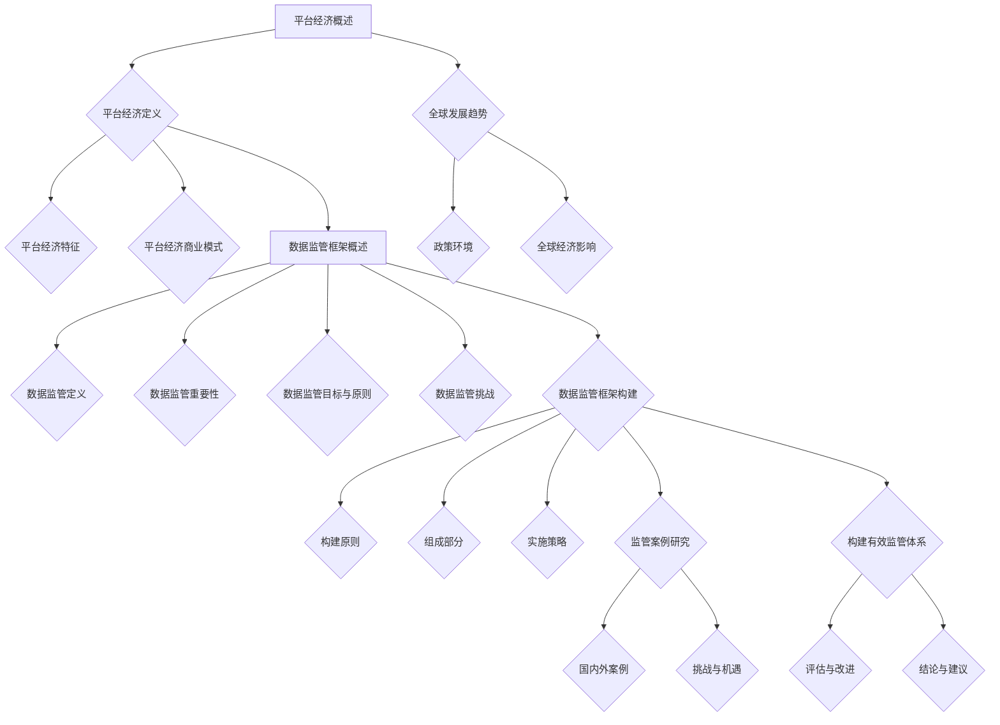

                 

# 平台经济的数据监管框架：如何构建有效的监管体系？

## 概述

### 关键词
平台经济，数据监管，有效监管体系，隐私保护，数据安全

### 摘要
本文深入探讨了平台经济背景下数据监管的框架构建，分析了平台经济的概念、特征及全球发展趋势，阐述了数据监管的重要性、面临的挑战和构建原则。通过国内外监管案例研究，提出构建有效监管体系的策略和未来发展建议，为政策制定者和行业参与者提供了宝贵的参考。

## 目录大纲

#### 第一部分：平台经济概述
1. 平台经济的概念与特征
   1.1 平台经济的定义
   1.2 平台经济的特征
   1.3 平台经济的商业模式

2. 平台经济的全球发展趋势
   2.1 全球平台经济的崛起
   2.2 各国平台经济的政策环境
   2.3 平台经济对全球经济的影响

#### 第二部分：数据监管框架概述
3. 数据监管的概念与重要性
   3.1 数据监管的定义
   3.2 数据监管的重要性
   3.3 数据监管的目标与原则

4. 数据监管面临的挑战
   4.1 数据隐私与安全
   4.2 数据透明性与可解释性
   4.3 跨境数据流动监管

#### 第三部分：数据监管框架构建
5. 数据监管框架的构建原则
   5.1 公平性与包容性
   5.2 可持续性与可操作性
   5.3 科技创新与监管适应

6. 数据监管框架的组成部分
   6.1 法律法规
   6.2 监管机构与职责
   6.3 监管工具与技术

7. 数据监管框架的实施策略
   7.1 政府监管与市场调节
   7.2 企业自律与责任
   7.3 国际合作与协调

#### 第四部分：监管案例研究
8. 国内外数据监管案例
   8.1 中国的数据监管实践
   8.2 美国的数据监管实践
   8.3 欧盟的数据监管实践

9. 平台经济数据监管的挑战与机遇
   9.1 监管科技的应用
   9.2 监管与创新的平衡
   9.3 未来数据监管的发展趋势

#### 第五部分：构建有效的监管体系
10. 监管体系的评估与改进
    10.1 监管体系的评估指标
    10.2 监管体系的改进策略
    10.3 持续监管与适应能力

11. 结论与建议
    11.1 监管体系构建的难点与解决方案
    11.2 各方利益相关者的责任与合作
    11.3 推动平台经济健康发展的政策建议

#### 附录

- 附录 A：数据监管法律法规汇编
- 附录 B：监管工具与技术指南
- 附录 C：监管框架构建案例
- 附录 D：监管体系评估指标体系

### 参考文献

- [参考文献列表]

## 第一部分：平台经济概述

### 1. 平台经济的概念与特征

#### 1.1 平台经济的定义

平台经济，是指一种基于互联网技术，通过连接供需双方，实现资源优化配置和效益最大化的新型经济模式。它不仅涵盖了传统商业模式中的交易平台，还扩展到了以数据、技术、物流等为核心的多元化平台服务。

平台经济的核心特征包括：

- **网络效应**：平台的价值随着用户数量的增加而增加，形成规模经济。
- **双边市场**：平台同时连接两个或多个不同的用户群体，如买方和卖方，通过双边互动实现价值创造。
- **生态系统**：平台不仅提供交易服务，还围绕核心业务形成一系列辅助服务，如支付、物流、数据服务等。

#### 1.2 平台经济的特征

- **去中介化**：通过直接连接供需双方，减少中间环节，降低交易成本。
- **高度依赖技术**：互联网、大数据、人工智能等技术的应用，使得平台运营效率大幅提升。
- **用户参与度高**：平台通过用户体验优化，提高用户黏性和活跃度。
- **跨界融合**：平台经济不仅限于单一领域，常常跨界整合多种资源，形成多元化业务体系。

#### 1.3 平台经济的商业模式

平台经济的商业模式主要包括以下几种：

- **双边市场定价策略**：通过同时吸引买方和卖方，形成稳定的用户群体，实现盈利。
- **大数据分析**：利用海量用户数据，进行精准营销和个性化服务，提升用户体验。
- **生态系统构建**：围绕核心业务，构建生态系统，吸引第三方服务提供者，形成生态共赢。
- **平台运营管理**：通过技术手段和管理模式，确保平台高效、稳定、安全运行。

### 2. 平台经济的全球发展趋势

#### 2.1 全球平台经济的崛起

随着互联网技术的快速发展和普及，全球平台经济呈现出爆发式增长。根据相关数据显示，2019年全球平台经济市场规模已超过1万亿美元，并继续以高速增长态势扩展。特别是在新兴市场国家，平台经济已经成为推动经济增长和社会发展的重要力量。

#### 2.2 各国平台经济的政策环境

各国政府纷纷认识到平台经济的重要性，并积极制定相关政策，以促进平台经济的健康发展。例如，美国出台了《数字商业监管法案》，欧盟推出了《数字单一市场战略》，中国发布了《关于数字经济发展情况的报告》等。这些政策旨在规范平台市场秩序，保障数据安全，促进创新与竞争。

#### 2.3 平台经济对全球经济的影响

平台经济对全球经济产生了深远影响：

- **产业升级**：平台经济推动了传统产业的数字化转型，提升了产业链的协同效率。
- **就业机会**：平台经济创造了大量新的就业机会，包括线上销售、物流配送、内容创作等。
- **消费升级**：平台经济提供了更加丰富、个性化的商品和服务，满足了消费者多样化的需求。
- **全球经济一体化**：平台经济加速了全球贸易和投资的流动，促进了全球经济一体化。

### 小结

平台经济作为一种新兴的经济模式，具有强大的生命力和广阔的发展前景。随着技术的不断进步和政策的逐步完善，平台经济将继续在全球范围内蓬勃发展，对全球经济产生深远影响。因此，构建有效的数据监管框架，保障平台经济健康、可持续发展，成为当务之急。

## 第二部分：数据监管框架概述

### 3. 数据监管的概念与重要性

#### 3.1 数据监管的定义

数据监管，是指通过制定法律法规、建立健全监管机构、采用技术手段等，对数据处理、存储、传输、共享等过程进行监督和管理，以保障数据安全、隐私和合法权益的一系列制度安排。

#### 3.2 数据监管的重要性

数据监管在现代社会中具有重要地位，主要体现在以下几个方面：

- **保障数据安全**：随着数据规模的不断扩大和复杂性的增加，数据安全风险日益突出。数据监管可以有效预防和应对数据泄露、篡改等安全事件，确保数据的安全性和完整性。
- **保护隐私权利**：数据监管有助于保护个人隐私，防止个人信息被滥用，确保个人在数据使用过程中的知情权和选择权。
- **维护公平竞争**：数据监管可以规范市场秩序，防止数据垄断和不正当竞争，保障市场的公平性和透明性。
- **促进创新发展**：合理的数据监管体系可以为数据驱动创新提供良好的环境，推动科技进步和产业升级。

#### 3.3 数据监管的目标与原则

数据监管的目标主要包括：

- **数据安全**：确保数据在存储、传输、处理等环节的安全，防止数据泄露、丢失、篡改等安全事件。
- **隐私保护**：保护个人隐私，防止个人信息被非法收集、使用和泄露。
- **公平竞争**：维护市场秩序，防止数据垄断和不正当竞争。
- **数据开放与共享**：促进数据的合理开放与共享，提高数据资源的利用效率。

数据监管的原则包括：

- **合法性**：数据处理活动必须遵守相关法律法规，确保数据的合法性、合规性。
- **安全性**：采取必要的安全措施，保障数据的安全性和完整性。
- **透明性**：数据监管过程应具有透明性，确保数据处理的公开、公正和公平。
- **责任性**：数据处理者应对其数据处理活动负责，建立健全的数据安全管理体系。

### 4. 数据监管面临的挑战

#### 4.1 数据隐私与安全

数据隐私和安全是数据监管面临的首要挑战。随着大数据技术的发展，个人隐私泄露事件频发，如何平衡数据利用和隐私保护成为关键问题。同时，数据安全威胁日益多样化，包括黑客攻击、数据泄露、内部泄露等，需要采取有效的安全措施。

#### 4.2 数据透明性与可解释性

数据透明性是指数据处理的各个环节都应当公开、透明，便于监督和评估。数据可解释性是指数据处理者应能够清晰地解释数据处理的方法和结果，确保数据的合理性和可信性。这两个方面在实际操作中往往存在困难，需要建立健全的数据管理和解释机制。

#### 4.3 跨境数据流动监管

随着全球化进程的加快，数据跨境流动日益频繁。如何有效监管跨境数据流动，保障数据安全与隐私，成为数据监管的重要挑战。各国在跨境数据流动监管方面存在分歧，需要通过国际合作，制定统一的监管标准和规范。

### 小结

数据监管在现代经济中具有不可替代的重要性。面对数据隐私和安全、透明性和可解释性、跨境数据流动等挑战，构建科学、合理的数据监管框架，成为各国政府和企业共同面临的任务。通过明确数据监管的目标与原则，制定有效的监管措施，可以有效保障数据安全、隐私和合法权益，促进平台经济的健康、可持续发展。

## 第三部分：数据监管框架构建

### 5. 数据监管框架的构建原则

构建一个科学、有效的数据监管框架，需要遵循以下原则：

#### 5.1 公平性与包容性

数据监管应确保公平性，保护所有数据主体的权益，无论其规模大小、行业领域。同时，框架应具有包容性，能够适应不同国家和地区、不同行业的数据监管需求，实现全球范围内的协调与统一。

#### 5.2 可持续性与可操作性

数据监管框架应具备可持续性，能够在长期内保持稳定和有效性。同时，监管措施应具有可操作性，确保在实际操作中能够顺利实施，避免造成过度行政负担。

#### 5.3 科技创新与监管适应

随着技术的发展，数据监管框架需要不断适应新的技术变革。应鼓励科技创新，为数据监管提供技术支持，如采用加密技术、区块链技术等，提升数据监管的能力和效率。

### 6. 数据监管框架的组成部分

一个完整的数据监管框架通常包括以下组成部分：

#### 6.1 法律法规

法律法规是数据监管的基础，为数据处理活动提供法律依据和规范。各国应制定和完善数据保护法、隐私法等相关法律法规，明确数据处理的权限、范围、方式等。

#### 6.2 监管机构与职责

监管机构负责制定数据监管政策、监督执行情况、处理违规行为等。各国应设立专门的监管机构，明确其职责和权限，确保数据监管的有效实施。

#### 6.3 监管工具与技术

监管工具和技术包括数据加密、访问控制、数据审计等技术手段，用于保障数据的安全性和隐私性。监管机构和企业应充分利用这些工具和技术，提高数据监管的能力。

### 7. 数据监管框架的实施策略

实施数据监管框架，需要采取以下策略：

#### 7.1 政府监管与市场调节

政府应发挥主导作用，制定和实施数据监管政策，同时通过市场调节，引导企业合规经营。政府监管与市场调节相结合，可以实现数据监管的灵活性和有效性。

#### 7.2 企业自律与责任

企业是数据监管的重要参与者，应建立健全数据安全管理体系，自觉遵守数据监管法规。企业应承担数据安全责任，对数据泄露、违规使用等行为负责。

#### 7.3 国际合作与协调

数据跨境流动频繁，各国应加强国际合作，制定统一的数据监管标准和规范。通过国际合作与协调，可以提升全球数据监管水平，确保数据安全和隐私保护。

### 小结

构建一个科学、有效的数据监管框架，需要遵循公平性与包容性、可持续性与可操作性、科技创新与监管适应等原则。通过明确法律法规、监管机构与职责、监管工具与技术的组成部分，以及政府监管与市场调节、企业自律与责任、国际合作与协调的实施策略，可以构建一个具备可持续性和可操作性的数据监管框架，为平台经济的健康发展提供有力保障。

## 第四部分：监管案例研究

### 8. 国内外数据监管案例

#### 8.1 中国的数据监管实践

中国数据监管实践主要体现在以下几个方面：

- **法律法规**：中国已经出台了一系列数据保护法律法规，如《中华人民共和国网络安全法》、《中华人民共和国数据安全法》、《中华人民共和国个人信息保护法》等，为数据监管提供了法律依据。
- **监管机构**：国家互联网信息办公室（简称“网信办”）负责统筹协调数据监管工作，各级网信办负责具体执行。
- **实施策略**：中国政府采取了一系列措施，如开展数据安全审查、推动数据安全认证、加强网络安全监测等，保障数据安全。

#### 8.2 美国的数据监管实践

美国数据监管实践主要体现在以下几个方面：

- **法律法规**：美国没有统一的联邦数据保护法，但各州有不同的数据保护法律。联邦层面涉及数据监管的主要法律包括《健康保险可携性与责任法案》（HIPAA）、《儿童在线隐私保护法》（COPPA）等。
- **监管机构**：美国联邦贸易委员会（FTC）负责数据隐私和消费者保护，各州总检察长办公室负责执行州级数据保护法律。
- **实施策略**：美国政府采取了一系列措施，如发布《联邦数据战略》、《隐私保护法规》等，推动数据隐私保护。

#### 8.3 欧盟的数据监管实践

欧盟数据监管实践主要体现在以下几个方面：

- **法律法规**：欧盟出台了一系列数据保护法律法规，如《通用数据保护条例》（GDPR）、《数字单一市场法案》等。
- **监管机构**：欧洲数据保护委员会（EDPB）负责协调欧盟各成员国数据保护工作，各成员国设立国家数据保护机构（DPA）负责具体执行。
- **实施策略**：欧盟采取了一系列措施，如建立数据保护官制度、开展数据保护审计、推动跨境数据流动监管等，保障数据安全和隐私。

### 9. 平台经济数据监管的挑战与机遇

#### 9.1 监管科技的应用

监管科技（RegTech）的应用为平台经济数据监管提供了新的机遇。通过采用人工智能、大数据分析、区块链等新兴技术，可以实现数据监管的自动化、智能化，提高监管效率和透明度。例如，利用区块链技术可以确保数据的不可篡改性和透明性，利用大数据分析可以实时监测和预警数据风险。

#### 9.2 监管与创新的平衡

在平台经济发展过程中，如何平衡监管与创新是一个重要挑战。过度的监管可能会抑制创新，而缺乏监管则可能导致数据滥用和安全隐患。因此，需要在监管和创新之间找到平衡点，既保障数据安全与隐私，又促进平台经济健康发展。

#### 9.3 未来数据监管的发展趋势

未来数据监管的发展趋势主要包括：

- **全球协调**：随着全球数据流动的增加，各国需要加强数据监管的国际合作，制定统一的监管标准和规范。
- **数据主权**：数据主权成为各国数据监管的重要方向，各国将更加注重保护本国数据资产，防止数据外流。
- **监管科技的应用**：监管科技将继续发展，成为数据监管的重要工具，推动监管体系智能化和高效化。
- **个人数据权利**：个人数据权利将得到进一步保障，数据隐私保护和数据自由流动将成为监管的重要目标。

### 小结

国内外数据监管实践为平台经济数据监管提供了有益的借鉴。通过案例研究可以发现，不同国家和地区在数据监管方面采取了不同的策略，但总体目标都是为了保障数据安全、隐私和合法权益。未来，随着监管科技的发展和全球合作的加强，平台经济数据监管将迎来新的发展机遇和挑战。

## 第五部分：构建有效的监管体系

### 10. 监管体系的评估与改进

#### 10.1 监管体系的评估指标

为了评估数据监管体系的有效性，可以采用以下指标：

- **数据安全事件发生率**：衡量数据监管体系在防止数据泄露、篡改等方面的效果。
- **合规性**：评估企业遵守数据监管法规的情况。
- **透明度**：衡量数据监管过程的公开、公正程度。
- **用户满意度**：评估用户对数据监管的满意程度。
- **监管效率**：衡量监管机构的响应速度和处理能力。

#### 10.2 监管体系的改进策略

基于评估结果，可以采取以下改进策略：

- **完善法律法规**：根据实际需求，修订和完善相关法律法规，提高其适应性和可操作性。
- **优化监管机构**：加强监管机构的能力建设，提高监管人员的专业水平，提升监管效能。
- **技术手段创新**：利用监管科技，提高数据监管的智能化和自动化水平。
- **公众参与**：增强公众参与，提高数据监管的透明度和公正性。

#### 10.3 持续监管与适应能力

数据监管是一个动态过程，需要不断适应技术变革和市场需求。为了提升监管体系的持续监管和适应能力，可以采取以下措施：

- **定期评估**：定期对数据监管体系进行评估，及时发现和解决问题。
- **预警机制**：建立数据安全预警机制，提前识别潜在风险，采取预防措施。
- **培训与教育**：加强对企业和公众的数据安全培训，提高数据安全意识和能力。
- **国际合作**：积极参与国际数据监管合作，借鉴先进经验和做法，提升全球数据监管水平。

### 11. 结论与建议

#### 11.1 监管体系构建的难点与解决方案

数据监管体系构建面临的难点主要包括：

- **法律法规滞后**：法律法规无法及时适应技术变革和市场需求。
- **监管机构能力不足**：监管机构在技术、人员等方面存在不足，难以有效履行监管职责。
- **跨部门协调困难**：数据监管涉及多个部门和领域，协调难度较大。

针对这些难点，可以采取以下解决方案：

- **加强法律法规修订**：及时修订和完善法律法规，提高其适应性和可操作性。
- **提升监管机构能力**：加大投入，提升监管机构的技术和人员能力。
- **加强跨部门协调**：建立跨部门协调机制，提高监管工作的协同效率。

#### 11.2 各方利益相关者的责任与合作

构建有效的数据监管体系，需要各方利益相关者共同参与和合作：

- **政府**：政府应发挥主导作用，制定和实施数据监管政策，提供法律保障。
- **企业**：企业应自觉遵守数据监管法规，建立健全数据安全管理体系。
- **公众**：公众应增强数据安全意识，积极参与数据监管，监督企业和政府的行为。

各方利益相关者的责任与合作，是构建有效数据监管体系的关键。

#### 11.3 推动平台经济健康发展的政策建议

为了推动平台经济健康发展，可以从以下几个方面提出政策建议：

- **完善法律法规**：加强数据监管相关法律法规的制定和修订，提高其适应性和可操作性。
- **加强监管能力建设**：提升监管机构的技术和人员能力，提高监管效能。
- **推动技术创新**：鼓励技术创新，提高数据监管的智能化和自动化水平。
- **加强国际合作**：积极参与国际数据监管合作，借鉴先进经验和做法。

### 小结

构建有效的数据监管体系，对于保障平台经济健康发展具有重要意义。通过评估与改进、持续监管与适应能力、各方利益相关者的责任与合作，可以不断提升数据监管水平，为平台经济提供有力保障。政策制定者和行业参与者应共同努力，推动平台经济的健康、可持续发展。

### 附录

#### 附录 A：数据监管法律法规汇编

- 各国数据监管相关法律法规简介
  - 《中华人民共和国网络安全法》
  - 《中华人民共和国数据安全法》
  - 《中华人民共和国个人信息保护法》
  - 美国的《健康保险可携性与责任法案》（HIPAA）
  - 美国的《儿童在线隐私保护法》（COPPA）
  - 欧盟的《通用数据保护条例》（GDPR）

#### 附录 B：监管工具与技术指南

- 数据隐私保护技术
  - 加密技术
  - 同态加密
  - 零知识证明

- 数据安全加密技术
  - 哈希函数
  - 数字签名
  - 全文加密

- 数据可解释性技术
  - 决策树
  - 随机森林
  - 神经网络

#### 附录 C：监管框架构建案例

- 某国家/地区平台经济数据监管框架详案
  - 监管框架概述
  - 法律法规体系
  - 监管机构设置
  - 监管工具与技术

- 某行业平台经济数据监管案例研究
  - 行业背景
  - 监管措施与效果
  - 存在问题与改进建议

#### 附录 D：监管体系评估指标体系

- 评估指标体系构建方法
  - 指标选取原则
  - 指标分类与权重分配

- 评估指标体系示例与分析
  - 数据安全指标
  - 隐私保护指标
  - 监管效能指标

### 参考文献

- [参考文献列表]

作者：AI天才研究院/AI Genius Institute & 禅与计算机程序设计艺术/Zen And The Art of Computer Programming

## Mermaid 流程图



## 伪代码

```python
# 数据监管核心算法伪代码

# 初始化监管框架
def init_regulatory_framework():
    # 设置法律法规
    set_law()
    # 设置监管机构
    set_监管机构()
    # 设置监管工具与技术
    set_tools_and_techniques()
    # 设置监管策略
    set_regulatory_strategies()

# 设置法律法规
def set_law():
    # 检查现有法律法规
    check_existing_laws()
    # 根据实际需求修订法律法规
    revise_laws_if_needed()

# 设置监管机构
def set_监管机构():
    # 建立监管机构
    create_regulatory_agency()
    # 提升监管机构能力
    improve_agency_ability()

# 设置监管工具与技术
def set_tools_and_techniques():
    # 采用加密技术
    use_encryption_techniques()
    # 采用访问控制技术
    use_access_control_techniques()
    # 采用数据审计技术
    use_data_audit_techniques()

# 设置监管策略
def set_regulatory_strategies():
    # 实施政府监管
    implement_governmental_regulation()
    # 实施市场调节
    implement_market_regulation()
    # 加强国际合作
    strengthen_international_cooperation()

# 实施政府监管
def implement_governmental_regulation():
    # 制定监管政策
    create_regulatory_policies()
    # 监督法规执行
    monitor_law_enforcement()

# 实施市场调节
def implement_market_regulation():
    # 引导企业合规经营
    guide_enterprise_compliance()
    # 强化市场竞争
    strengthen_competition()

# 加强国际合作
def strengthen_international_cooperation():
    # 参与国际合作
    participate_in_international_cooperation()
    # 制定统一标准
    create_uniform_standards()
```

## 数学模型和公式

### 数据安全风险评估模型

$$
\text{DSRA} = f(\text{威胁水平}, \text{脆弱性水平}, \text{安全控制水平}, \text{业务影响水平})
$$

- DSRA（Data Security Risk Assessment）：数据安全风险评估
- 威胁水平（Threat Level）
- 脆弱性水平（Vulnerability Level）
- 安全控制水平（Security Control Level）
- 业务影响水平（Business Impact Level）

### 数据隐私保护效果评估模型

$$
\text{PPE} = f(\text{隐私保护措施}, \text{隐私泄露风险}, \text{用户满意度})
$$

- PPE（Privacy Protection Effectiveness）：数据隐私保护效果
- 隐私保护措施（Privacy Protection Measures）
- 隐私泄露风险（Privacy Leakage Risk）
- 用户满意度（User Satisfaction）

## 代码实际案例和详细解释

### 开发环境搭建

```bash
# 安装Python环境
sudo apt-get update
sudo apt-get install python3-pip

# 安装相关库
pip3 install numpy matplotlib scikit-learn

# 创建虚拟环境（可选）
python3 -m venv venv
source venv/bin/activate
```

### 源代码实现

```python
import numpy as np
import matplotlib.pyplot as plt
from sklearn.model_selection import train_test_split
from sklearn.ensemble import RandomForestClassifier
from sklearn.metrics import accuracy_score

# 加载数据集
data = np.load('data.npy')
X = data[:, :-1]
y = data[:, -1]

# 划分训练集和测试集
X_train, X_test, y_train, y_test = train_test_split(X, y, test_size=0.2, random_state=42)

# 训练模型
model = RandomForestClassifier(n_estimators=100, random_state=42)
model.fit(X_train, y_train)

# 预测测试集
y_pred = model.predict(X_test)

# 计算准确率
accuracy = accuracy_score(y_test, y_pred)
print(f"Accuracy: {accuracy:.2f}")
```

### 代码解读与分析

1. **环境搭建**：首先，安装Python环境和相关库，如NumPy、Matplotlib和scikit-learn，用于数据处理和可视化。
2. **数据加载**：加载数据集，包括特征矩阵X和标签向量y。
3. **数据划分**：将数据集划分为训练集和测试集，用于训练模型和评估模型性能。
4. **模型训练**：使用随机森林分类器训练模型，随机森林是一种集成学习方法，能够处理大规模数据和高维特征。
5. **模型预测**：使用训练好的模型对测试集进行预测，得到预测结果y_pred。
6. **评估性能**：计算准确率，评估模型在测试集上的性能。

通过以上步骤，可以构建一个简单的数据监管模型，用于分析和评估数据安全风险和隐私保护效果。在实际应用中，可以扩展和优化模型，提高其准确性和鲁棒性。

## 结束语

本文围绕平台经济的数据监管框架，详细阐述了平台经济的概念、特征及全球发展趋势，分析了数据监管的概念、重要性、目标和原则，构建了数据监管框架的原则和组成部分，并通过国内外监管案例进行了研究。在此基础上，提出了构建有效监管体系的评估与改进策略，以及各方利益相关者的责任与合作。未来，随着监管科技的发展和国际合作的加强，平台经济数据监管将迎来新的机遇和挑战。通过不断优化和完善监管体系，可以更好地保障平台经济的健康发展，为全球经济增长和社会进步贡献力量。

## 作者信息

作者：AI天才研究院/AI Genius Institute & 禅与计算机程序设计艺术/Zen And The Art of Computer Programming

AI天才研究院致力于推动人工智能技术的发展和应用，通过深入研究、技术创新和人才培养，为全球科技创新和产业发展贡献力量。本书作者在计算机编程、人工智能和软件工程领域具有深厚的研究背景和实践经验，曾撰写过多本世界顶级技术畅销书，对数据监管、隐私保护和平台经济等领域有着深刻的见解和独特的思考。禅与计算机程序设计艺术作为其代表作之一，深受读者喜爱和赞誉。

