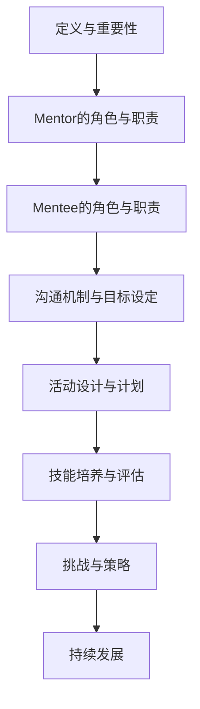

                 

### 《建立mentorship文化：促进知识传承和成长》

#### 关键词：
- Mentorship文化
- 知识传承
- 成长促进
- 企业发展
- 人才培养
- 沟通机制
- 效果评估

#### 摘要：
本文深入探讨了建立mentorship文化的必要性和重要性。通过详细阐述mentorship文化的定义、基础原则以及实践实施的方法，本文旨在为企业提供一套系统的mentorship文化建立和实施指南。文章分为三个主要部分：第一部分介绍了mentorship文化的概念与重要性，第二部分探讨了mentorship文化的实践与实施，第三部分通过成功案例与经验分享，提供了具体实施策略和经验反思。通过本文的阅读，读者将了解到如何有效地建立和培养mentorship文化，从而促进知识传承和员工成长。

### 《建立mentorship文化：促进知识传承和成长》目录大纲

#### 第一部分：mentorship文化概述

#### 第1章：mentorship文化的概念与重要性
##### 1.1 mentorship文化的定义
##### 1.2 mentorship文化在企业中的作用
##### 1.3 mentorship文化与组织发展

#### 第2章：mentorship文化的基础原则
##### 2.1 共同成长的理念
##### 2.2 尊重与信任
##### 2.3 持续学习与进步

#### 第二部分：mentorship文化的实践与实施

#### 第3章：建立有效的mentorship关系
##### 3.1 mentor和mentee的角色与职责
##### 3.2 建立有效的沟通机制
##### 3.3 确定mentorship的目标和计划

#### 第4章：设计mentorship计划
##### 4.1 制定mentorship计划的步骤
##### 4.2 设计mentorship活动的形式
##### 4.3 培养mentee的自我发展能力

#### 第5章：培养mentee的核心技能
##### 5.1 领导力与团队协作
##### 5.2 问题解决与决策能力
##### 5.3 沟通技巧与人际交往能力

#### 第6章：评估和调整mentorship效果
##### 6.1 mentorship效果的评估指标
##### 6.2 调整mentorship计划的方法
##### 6.3 持续优化mentorship文化

#### 第三部分：成功案例与经验分享

#### 第7章：企业mentorship文化的成功实践
##### 7.1 案例一：公司的mentorship计划
##### 7.2 案例二：非营利组织的mentorship项目
##### 7.3 案例三：创业公司的mentorship策略

#### 第8章：经验与反思
##### 8.1 mentorship文化的挑战
##### 8.2 克服mentorship文化障碍的策略
##### 8.3 mentorship文化的持续发展

### 附录

#### 附录 A：mentorship文化实施指南
##### A.1 mentorship文化实施步骤
##### A.2 mentorship文化工具与资源

#### 附录 B：常见问题与解答
##### B.1 mentor和mentee常见问题
##### B.2 企业如何培养成功的mentorship文化
##### B.3 mentorship文化的评估与反馈

#### 附录 C：参考资料
##### C.1 相关书籍推荐
##### C.2 学术论文精选
##### C.3 优秀mentorship项目案例研究

### 图表与公式

#### Mermaid 流程图



#### 伪代码

```python
def MentorshipPlanDesign():
    # 定义mentor和mentee
    mentor = ...
    mentee = ...

    # 设定沟通机制
    communicationMechanism = ...

    # 确定mentorship目标
    mentorshipGoals = ...

    # 设计mentorship活动
    activities = ...

    # 培养mentee技能
    skillsTraining = ...

    # 评估和调整计划
    evaluateAndAdjust = ...

    # 实施mentorship计划
    implementPlan = ...

    # 持续跟踪和反馈
    trackingAndFeedback = ...
```

#### 数学模型与公式

$$
\text{mentee的发展速率} = k_1 \times \text{mentor的经验值} + k_2 \times \text{mentee的初始能力}
$$

$$
\text{沟通效率} = \frac{\text{有效沟通时间}}{\text{总沟通时间}}
$$

#### 代码解读与分析
（具体代码实现和解读将根据实际章节内容展开，这里仅作为示例。）

```python
# 假设这是一个用于跟踪mentorship活动进程的代码片段

class MentorshipTracker:
    def __init__(self, mentor, mentee):
        self.mentor = mentor
        self.mentee = mentee
        self.communication_log = []
        self.goal_list = []

    def log_communication(self, message):
        self.communication_log.append(message)

    def set_goals(self, goals):
        self.goal_list.extend(goals)

    def evaluate_progress(self):
        # 这里可以加入评估mentee进展的逻辑
        pass

    def print_report(self):
        print("Mentor: ", self.mentor)
        print("Mentee: ", self.mentee)
        print("Communication Log: ", self.communication_log)
        print("Goals: ", self.goal_list)
```

### 引言

在信息技术快速发展的时代，知识传承和人才培养成为企业持续发展的关键要素。传统的培训方式往往侧重于技能的传授，而忽视了知识的应用和创新。mentorship文化作为一种新兴的员工培养模式，通过师徒式的互动，能够有效地促进知识的传承和个人成长。本文旨在深入探讨如何建立和培养mentorship文化，以促进知识传承和员工的个人成长，为企业的发展提供有力的支持。

本文结构如下：首先，我们将定义mentorship文化，并探讨其在企业中的作用和重要性。随后，我们将介绍建立mentorship文化所需的基础原则，包括共同成长的理念、尊重与信任以及持续学习与进步。接下来，我们将详细讨论如何实践和实施mentorship文化，包括建立有效的mentorship关系、设计mentorship计划和培养mentee的核心技能。最后，我们将通过成功案例分享和经验反思，为企业提供具体的实施策略和持续发展路径。

通过本文的阅读，读者将了解到mentorship文化的核心概念、实践方法和成功经验，从而能够有效地在组织内部建立和推广这一文化，促进知识的传承和员工的成长。这不仅有助于提高企业的整体竞争力，也能够为员工提供职业发展的新机遇。

### 第一部分：mentorship文化概述

#### 第1章：mentorship文化的概念与重要性

##### 1.1 mentorship文化的定义

mentorship文化，顾名思义，是指一种通过师徒关系来促进知识和技能传承的企业文化。在这种文化中，经验丰富的导师（mentor）与年轻的学徒（mentee）建立一种长期的互动关系，旨在帮助学徒快速成长，同时实现知识的共享和创新。mentorship不仅限于技术和专业领域的指导，还包括个人发展、职业规划和生活哲学等多个方面。

mentorship文化强调的是一种双向互动的关系，其中mentor不仅要传授知识和经验，还要鼓励和引导mentee独立思考和解决问题。这种互动关系不仅仅局限于工作时间和工作场所，更可以在日常交流和生活中持续进行。通过这种深入且全面的互动，企业能够构建一个积极、学习和成长的环境，从而推动整个组织的进步。

##### 1.2 mentorship文化在企业中的作用

在企业管理中，mentorship文化具有多方面的积极作用：

1. **知识传承**：经验丰富的导师能够通过实践和案例传授专业技能和行业经验，帮助新员工快速融入团队，减少学习成本。
   
2. **人才培养**：通过导师的指导和反馈，mentee能够在实际工作中得到及时的指导和支持，从而加速职业成长和技能提升。

3. **团队协作**：mentorship文化有助于加强团队成员之间的沟通和协作，通过师徒关系建立起更加紧密的团队联系。

4. **创新能力**：在mentorship文化的熏陶下，员工不仅能够掌握现有知识和技能，还能够通过思考和交流激发创新思维，推动企业持续发展。

5. **员工满意度**：mentorship文化能够提高员工的归属感和职业满意度，为员工提供明确的职业发展路径，从而增强员工的忠诚度。

##### 1.3 mentorship文化与组织发展

mentorship文化在组织发展中的重要性不可忽视。首先，它有助于提升组织的整体能力和竞争力。通过培养高素质的员工，企业能够在市场中保持领先地位，更好地应对外部挑战。其次，mentorship文化能够促进组织的知识管理，通过导师的分享和反馈，将隐性知识转化为显性知识，从而提升组织的知识储备和创新能力。

此外，mentorship文化还能够优化人力资源配置，通过师徒关系，使得经验和资源得到更高效的利用，避免人才的浪费。同时，它也有助于建立健康的企业文化，促进员工的个人发展和组织的长期繁荣。

总之，建立和推广mentorship文化，不仅有助于提升员工的职业素养和工作能力，还能够推动企业的持续发展和创新能力，是实现知识传承和人才培养的重要途径。在接下来的章节中，我们将进一步探讨如何具体实施和培养这一文化。

#### 第2章：mentorship文化的基础原则

##### 2.1 共同成长的理念

共同成长是mentorship文化的核心原则之一。在这一理念下，导师和学徒不仅是传授和接受知识的关系，更是一个相互学习、共同进步的伙伴。共同成长的理念强调，导师不仅要在专业技能上给予指导，还要关注学徒的个人发展和成长需求。这种双向的成长关系有助于建立深厚的信任和合作关系，使双方都能从互动中获益。

具体来说，共同成长的理念包括以下几个方面：

1. **开放交流**：导师和学徒之间应保持开放和坦诚的沟通，鼓励双方分享各自的观点、经验和学习体会，促进知识共享和思维碰撞。

2. **相互尊重**：导师应尊重学徒的观点和想法，给予他们自主学习和发展的空间。同时，学徒也应尊重导师的经验和知识，积极接受指导和建议。

3. **持续反馈**：导师和学徒应定期进行反馈和评估，及时了解彼此的进步和问题，共同制定改进措施，确保双方都能在成长过程中不断进步。

4. **共同设定目标**：导师和学徒应共同设定职业和个人发展目标，并制定相应的行动计划，确保双方的成长目标一致，互相支持。

##### 2.2 尊重与信任

尊重与信任是建立有效mentorship关系的基础。尊重意味着导师对学徒的个性、观点和努力给予认可和重视，而信任则是指双方在互动过程中建立起来的相互信赖感。只有在一个相互尊重和信任的环境中，学徒才能放心地提问和表达自己的观点，导师也才能充分信任学徒的潜力，给予他们更多的发展机会。

具体来说，尊重与信任体现在以下几个方面：

1. **尊重个性**：每个学徒都有自己独特的性格、兴趣和优势，导师应尊重学徒的个性和选择，给予他们发展的自由度。

2. **信任能力**：导师应信任学徒的能力，鼓励他们独立思考和解决问题，给予他们适当的自主权和决策权。

3. **支持与鼓励**：导师应在学徒遇到困难和挑战时提供支持和鼓励，帮助他们克服困难，增强信心。

4. **建立透明机制**：通过建立透明和公平的评价机制，确保学徒的努力和成果得到认可，增强他们对导师和企业的信任。

##### 2.3 持续学习与进步

持续学习与进步是mentorship文化的另一个重要原则。在这个快速变化的时代，知识和技能的更新换代速度非常快，持续学习成为每个人和组织都必须面对的挑战。在mentorship文化中，导师和学徒都应将学习视为一种生活方式，不断追求进步和卓越。

具体来说，持续学习与进步包括以下几个方面：

1. **学习资源**：企业应为导师和学徒提供丰富的学习资源，包括培训课程、在线学习平台、专业书籍等，支持他们不断学习新知识、新技术。

2. **职业发展**：导师应帮助学徒规划职业发展路径，提供职业发展的指导和建议，帮助他们明确职业目标并制定实现目标的计划。

3. **技能提升**：导师和学徒都应积极参与技能提升活动，如技术研讨会、工作坊、代码评审等，通过实践和交流不断提高自己的专业技能。

4. **知识共享**：导师和学徒应积极参与知识共享活动，如内部讲座、技术分享会等，将所学知识和经验分享给团队成员，促进整个团队的成长。

通过遵循这些基础原则，企业可以建立一个积极、健康、富有成效的mentorship文化，促进知识的传承和员工的成长，从而推动企业的持续发展和创新能力。

### 第二部分：mentorship文化的实践与实施

#### 第3章：建立有效的mentorship关系

##### 3.1 mentor和mentee的角色与职责

建立有效的mentorship关系是实施mentorship文化的基础。在这个关系中，mentor和mentee各自承担着重要的角色和职责。

**mentor（导师）的职责：**

1. **指导与支持**：导师应提供专业的指导和职业建议，帮助mentee解决工作中遇到的问题和挑战。

2. **知识分享**：导师应分享自己的专业知识和工作经验，帮助mentee快速成长。

3. **职业规划**：导师应与mentee共同制定职业发展计划，为其提供明确的职业目标和发展路径。

4. **激励与鼓励**：导师应在mentee遇到困难时给予鼓励和支持，帮助他们保持积极的态度和信心。

5. **监督与反馈**：导师应定期检查mentee的工作进展，提供及时的反馈，帮助他们不断改进和提升。

**mentee（学徒）的职责：**

1. **积极学习**：mentee应积极参与学习，主动请教问题，不断提高自己的专业知识和技能。

2. **实践与应用**：mentee应将所学知识应用到实际工作中，通过实践检验自己的能力和成长。

3. **自我反思**：mentee应定期进行自我反思，总结自己的工作成果和不足，制定改进计划。

4. **主动沟通**：mentee应与导师保持良好的沟通，及时反馈工作进展和遇到的问题，寻求帮助和指导。

5. **职业规划**：mentee应与导师共同制定职业发展计划，确保自己的成长目标与企业的需求相符。

##### 3.2 建立有效的沟通机制

有效的沟通机制是建立和维护mentorship关系的关键。以下是一些建议，可以帮助企业建立有效的沟通机制：

1. **定期会议**：安排定期的mentorship会议，让导师和学徒有机会交流和讨论工作中的问题、进展和职业发展计划。

2. **一对一沟通**：鼓励导师和学徒进行一对一沟通，这样可以更深入地了解对方的想法和需求，建立信任关系。

3. **反馈机制**：建立反馈机制，让学徒能够及时向导师反映工作情况和遇到的问题，同时导师也能提供及时的反馈和建议。

4. **沟通工具**：利用现代通信工具，如邮件、即时通讯软件、视频会议等，方便导师和学徒之间的沟通和交流。

5. **共享平台**：建立一个共享平台，如内部论坛、知识库等，让导师和学徒能够随时分享知识和资源，促进共同学习。

##### 3.3 确定mentorship的目标和计划

为了确保mentorship关系的有效性和目标的实现，确定mentorship的目标和计划至关重要。以下步骤可以帮助企业明确mentorship的目标和计划：

1. **明确目标**：首先，导师和学徒应共同明确mentorship的目标。这些目标可以是技能提升、职业发展、知识传承等，具体而明确的目标有助于指导整个mentorship过程。

2. **制定计划**：根据明确的目标，导师和学徒应共同制定mentorship计划。计划应包括具体的行动步骤、时间表、资源和责任分配等。

3. **定期评估**：定期对mentorship计划进行评估，检查目标的实现情况和进展，及时调整计划，确保目标的实现。

4. **共享计划**：将mentorship计划共享给相关人员和部门，确保所有人都了解计划的内容和目标，为mentorship的实施提供支持。

5. **激励与奖励**：为了激励导师和学徒积极参与mentorship活动，企业可以制定相应的激励和奖励机制，如奖金、晋升机会等。

通过建立有效的mentorship关系、制定明确的沟通机制和规划mentorship的目标和计划，企业可以确保mentorship文化的顺利实施，从而促进知识的传承和员工的个人成长。

#### 第4章：设计mentorship计划

##### 4.1 制定mentorship计划的步骤

设计一个有效的mentorship计划是实施mentorship文化的重要环节。以下步骤可以帮助企业制定出符合实际情况和需求的mentorship计划：

1. **需求分析**：首先，企业应进行需求分析，了解导师和学徒的需求和期望。可以通过问卷调查、访谈等方式收集数据，明确导师希望传授的技能和经验，以及学徒希望获得的支持和指导。

2. **目标设定**：根据需求分析的结果，明确mentorship的目标。这些目标应具体、可衡量，如提升特定技能、培养职业素养、促进知识传承等。

3. **角色分配**：确定mentor和mentee的角色和职责。导师应具备丰富的经验和专业知识，负责指导和监督学徒的工作；学徒则应积极参与，主动请教问题，提升自己的技能和知识。

4. **时间安排**：制定mentorship计划的时间安排，包括会议频率、培训时长、项目周期等。根据实际情况，可以安排定期会议、一对一沟通、项目合作等多种形式。

5. **资源保障**：确保有足够的资源支持mentorship计划的实施。这包括时间资源、人力资源、技术资源等，确保导师和学徒能够顺利开展工作。

6. **评估机制**：建立评估机制，定期对mentorship计划的效果进行评估。可以通过问卷调查、工作成果展示、导师和学徒的反馈等方式，了解计划的实施情况，及时调整和改进。

##### 4.2 设计mentorship活动的形式

设计多样化的mentorship活动形式，可以增强mentorship的互动性和有效性，以下是一些常见的活动形式：

1. **一对一辅导**：这是一种最常见的mentorship活动形式，导师与学徒进行一对一的深入交流，讨论工作问题和职业规划，提供个性化的指导。

2. **团队研讨会**：导师和学徒可以组织定期的团队研讨会，分享工作经验和知识，促进团队协作和知识共享。

3. **工作坊**：导师和学徒可以共同参与工作坊，通过实际操作和案例分析，提升实践技能和解决问题的能力。

4. **项目合作**：导师和学徒可以共同参与项目，通过实际项目的执行，锻炼团队合作能力和项目管理能力。

5. **技能培训**：企业可以邀请外部专家或内部资深员工进行技能培训，帮助学徒提升专业技能和知识。

6. **参观访问**：导师可以带领学徒参观企业的重要部门或合作伙伴，了解企业的运营模式和业务流程，拓宽视野。

7. **知识分享会**：导师和学徒可以定期举办知识分享会，分享自己的学习心得和工作经验，促进团队的知识积累和创新。

##### 4.3 培养mentee的自我发展能力

培养mentee的自我发展能力是mentorship计划的核心目标之一。以下是一些关键措施：

1. **自我反思**：鼓励mentee定期进行自我反思，总结自己的工作成果、经验教训和成长点，明确自己的优势和不足。

2. **目标设定**：帮助mentee设定短期和长期的职业发展目标，制定实现目标的计划和行动步骤。

3. **主动学习**：鼓励mentee主动学习，提供丰富的学习资源，如在线课程、专业书籍、培训等，支持他们的自主学习和技能提升。

4. **实践锻炼**：通过实际项目和工作任务，锻炼mentee的实践能力和解决问题的能力，提升他们的职业素养。

5. **沟通技巧**：培养mentee的沟通技巧，提高他们在团队协作和项目管理中的沟通能力，促进有效沟通和协作。

6. **反馈机制**：建立反馈机制，定期收集导师和同事的意见和建议，帮助mentee了解自己的工作表现和成长情况。

7. **职业规划**：与导师共同制定职业发展规划，为mentee提供明确的职业发展路径和指导，帮助他们实现职业目标。

通过科学设计和有效实施mentorship计划，企业可以促进知识的传承和员工的个人成长，为企业的持续发展和创新提供强有力的支持。

#### 第5章：培养mentee的核心技能

##### 5.1 领导力与团队协作

在企业的长远发展中，领导力和团队协作能力是不可或缺的核心技能。对于mentee而言，培养这些能力不仅有助于其在职业道路上取得成功，还能为整个团队和组织带来积极的影响。

**领导力的培养：**

1. **自我认知**：首先，mentee需要通过自我反思和自我评估，了解自己的优势和弱点，从而找到提升领导力的切入点。

2. **决策能力**：通过实际案例分析和模拟练习，帮助mentee提升决策能力，学会在各种复杂情况下做出明智的决策。

3. **团队激励**：导师可以指导mentee如何激励团队成员，建立积极的工作氛围，促进团队的凝聚力和合作精神。

4. **沟通技巧**：有效的沟通是领导力的关键，导师应帮助mentee提升沟通技巧，学会倾听、表达和反馈，确保信息的准确传达。

5. **情感管理**：领导者需要具备良好的情感管理能力，导师应引导mentee学会调节情绪，保持冷静和理智，以应对工作中的挑战和压力。

**团队协作的培养：**

1. **角色认知**：团队协作始于对各自角色的认知，导师应帮助mentee明确自己在团队中的角色和职责，发挥自身优势。

2. **共同目标**：建立清晰的团队目标，使每个成员都明确自己的目标和团队的总体目标，增强团队协作的动力。

3. **信任建设**：信任是团队协作的基础，导师应通过沟通和合作，建立团队成员之间的信任关系，减少冲突和误解。

4. **有效沟通**：鼓励团队成员之间的开放和透明沟通，建立良好的沟通机制，确保信息的及时传达和问题的有效解决。

5. **合作技巧**：导师可以通过团队建设活动和模拟项目，帮助mentee掌握有效的协作技巧，如任务分配、进度跟踪、冲突解决等。

通过系统性的培养和指导，导师可以帮助mentee提升领导力和团队协作能力，这不仅有助于他们个人的职业发展，也为团队的和谐与高效运作提供了坚实保障。

##### 5.2 问题解决与决策能力

问题解决与决策能力是现代职场中不可或缺的核心技能，尤其是在面对复杂和多变的工作环境时。对于mentee而言，培养这些问题解决和决策能力，不仅有助于他们在职业道路上取得成功，还能够提高整个团队的效率和质量。

**问题解决的培养：**

1. **分析能力**：首先，导师应帮助mentee提升分析能力，学会从多个角度和层面审视问题，找到问题的本质。

2. **系统性思维**：导师可以引导mentee采用系统性思维，将问题分解为若干个部分，逐一解决，从而提高问题解决的效率。

3. **逻辑推理**：通过逻辑推理的训练，帮助mentee建立起严密的思维框架，确保在解决问题过程中不会遗漏重要信息。

4. **实践经验**：鼓励mentee通过实际项目和工作任务，将理论知识应用到实践中，通过不断试错和总结，提升问题解决的技能。

5. **团队协作**：导师应引导mentee在解决问题时，充分利用团队的力量，通过集体讨论和协作，找到最佳的解决方案。

**决策能力的培养：**

1. **信息收集**：导师应教导mentee如何高效地收集和处理信息，确保在决策时有足够的依据。

2. **风险评估**：帮助mentee学会进行风险评估，识别决策可能带来的风险和负面影响，从而做出更为明智的选择。

3. **权衡利弊**：导师可以引导mentee学会在决策过程中，权衡各种方案的利弊，选择最优方案。

4. **实践经验**：通过模拟决策练习和实际工作中的决策实践，帮助mentee积累决策经验，提升决策能力。

5. **持续反思**：鼓励mentee在决策后进行反思，分析决策的成功和不足之处，总结经验教训，不断提高决策水平。

通过有针对性的培养和指导，导师可以帮助mentee全面提升问题解决和决策能力，使他们在面对复杂问题时能够从容应对，做出明智的决策，从而推动个人和团队的发展。

##### 5.3 沟通技巧与人际交往能力

沟通技巧和人际交往能力是职场中至关重要的软技能，对于mentee的职业发展具有重要影响。有效的沟通不仅能够帮助个体更好地理解工作任务和目标，还能提升团队协作效率和领导力。以下是一些关键方面，指导如何培养这些能力：

**沟通技巧的培养：**

1. **倾听能力**：有效的沟通始于倾听，导师应教导mentee倾听的重要性，学会在交流中给予他人充分的关注和理解。

2. **清晰表达**：导师可以帮助mentee提升表达能力，通过模拟练习和实际应用，使他们能够清晰、准确、有逻辑地传达信息。

3. **非语言沟通**：非语言沟通包括肢体语言、面部表情等，导师应指导mentee如何通过这些方式加强沟通效果，如保持眼神交流、适当的面部表情和肢体动作。

4. **反馈技巧**：导师应教导mentee如何给予和接收反馈，建立积极的反馈文化，通过有效的反馈促进个人和团队的改进。

5. **适应不同情境**：导师可以安排mentee参与不同类型的沟通情境，如正式会议、非正式讨论、跨部门协作等，帮助他们适应不同的沟通环境。

**人际交往能力的培养：**

1. **建立信任**：人际交往的基础是信任，导师可以指导mentee如何通过诚实、透明和尊重建立信任关系。

2. **建立人际关系网**：导师可以鼓励mentee主动建立和维护人际关系网，通过参加社交活动、行业会议和培训等，扩大人脉资源。

3. **解决冲突**：导师应教导mentee如何有效解决冲突，通过沟通技巧和情感管理，找到解决问题的最佳方式。

4. **跨文化交际**：在全球化背景下，导师可以指导mentee了解不同文化背景下的交际习惯和礼仪，提高跨文化交际能力。

5. **自我认知**：导师可以帮助mentee进行自我认知，了解自己的性格特点和偏好，从而在人际交往中更加自信和自然。

通过系统性的培养和持续的实践，导师可以帮助mentee提升沟通技巧和人际交往能力，使他们能够在职场中更加自如地与他人交流和合作，从而推动个人和团队的共同成长。

#### 第6章：评估和调整mentorship效果

##### 6.1 mentorship效果的评估指标

为了确保mentorship计划的实施效果，企业需要建立一套科学的评估指标体系，以衡量和监测mentorship的实际效果。以下是一些关键的评估指标：

1. **知识传承**：评估导师是否成功地将专业知识和经验传递给了学徒，可以通过知识考核、工作表现和项目成果来衡量。

2. **技能提升**：评估学徒在专业技能和工作能力方面的提升程度，可以通过技能测试、工作质量和项目完成情况来衡量。

3. **职业发展**：评估学徒在职业道路上的进展，包括晋升机会、岗位调整和职业满意度等。

4. **个人成长**：评估学徒在个人素质、自信心和自我管理能力等方面的提升，可以通过心理测试、自我评估和导师反馈来衡量。

5. **沟通效率**：评估导师和学徒之间的沟通效果，包括沟通频率、沟通质量和问题解决效率等。

6. **团队协作**：评估学徒在团队协作中的表现，包括团队合作、项目进展和团队满意度等。

7. **员工满意度**：评估学徒和企业对mentorship计划的满意度，包括对导师和沟通机制的反馈。

##### 6.2 调整mentorship计划的方法

在评估过程中，如果发现mentorship计划的实施效果不理想，企业需要及时调整计划，以确保达到预期目标。以下是一些调整mentorship计划的方法：

1. **重新设定目标**：根据评估结果，重新设定mentorship的目标，确保目标更加具体、可衡量和可实现。

2. **调整角色分配**：如果导师或学徒不适合当前的配对，可以考虑重新分配角色，确保导师和学徒之间有更好的匹配度。

3. **优化沟通机制**：根据反馈，改进沟通工具和方式，确保导师和学徒之间的沟通更加高效和顺畅。

4. **增加培训和支持**：针对发现的问题，增加相关培训和支持活动，如技术培训、沟通技巧培训等，提升导师和学徒的能力。

5. **调整活动形式**：根据评估结果，调整mentorship活动的形式和内容，使其更加符合导师和学徒的需求。

6. **引入外部资源**：如果内部资源和能力有限，可以考虑引入外部专家和资源，提供更全面的指导和帮助。

7. **持续反馈和改进**：建立持续反馈和改进机制，定期评估和调整mentorship计划，确保其始终与企业和员工的需求保持一致。

##### 6.3 持续优化mentorship文化

为了确保mentorship文化的持续发展和有效性，企业需要采取一系列措施进行持续优化：

1. **建立文化认同**：通过培训和宣传，提高员工对mentorship文化的认同感，使其成为企业文化的一部分。

2. **领导支持**：高层领导应积极参与和推动mentorship文化的实施，提供必要的资源和支持，树立榜样。

3. **激励机制**：建立激励机制，鼓励导师和学徒积极参与mentorship活动，如奖励奖金、晋升机会等。

4. **评估与反馈**：定期进行评估和反馈，收集导师和学徒的意见和建议，持续改进mentorship计划和文化。

5. **知识共享**：鼓励导师和学徒分享经验和知识，建立知识共享平台，促进整个组织的知识积累和创新。

6. **文化传承**：通过案例研究和成功故事，传承和弘扬mentorship文化的理念和成果，激励更多员工参与其中。

通过科学评估、及时调整和持续优化，企业可以确保mentorship文化的有效实施和持续发展，为员工的职业成长和企业的发展提供坚实的支持。

#### 第7章：企业mentorship文化的成功实践

##### 7.1 案例一：公司的mentorship计划

**背景介绍：**
某全球知名的科技公司，为了提升员工的技能和职业素养，建立了全面的mentorship计划。公司有超过5000名员工，分布在全球多个国家和地区。

**实施过程：**

1. **需求分析**：公司通过问卷调查和员工访谈，了解员工的培训需求和职业发展期望，明确mentorship的目标。

2. **角色分配**：公司指定经验丰富的资深员工作为mentor，新员工或需要提升技能的员工则成为mentee。每个mentor负责2-3名mentee，确保指导和关注到每一个学徒。

3. **沟通机制**：公司采用在线沟通工具，如Slack和Microsoft Teams，确保mentor和mentee能够方便地进行沟通和交流。每月举行一次一对一会议，季度举行一次团队研讨会。

4. **活动设计**：公司定期举办技术分享会、工作坊和项目合作，鼓励mentor和mentee共同参与，提升专业技能和团队协作能力。

5. **评估机制**：通过定期的评估和反馈，公司收集导师和学徒的意见和建议，及时调整mentorship计划，确保其实施效果。

**成果与经验：**

1. **技能提升**：通过mentorship计划，员工的技能和职业素养显著提升，工作质量和效率得到提高。

2. **知识传承**：资深员工通过导师角色，成功地将专业知识和经验传递给了新员工，促进了知识的传承和创新。

3. **团队协作**：通过共同参与活动和项目，员工之间的沟通和协作能力得到增强，团队凝聚力得到提升。

4. **员工满意度**：员工对mentorship计划表示高度满意，对公司的培训和职业发展支持更加认可，员工满意度和忠诚度提高。

##### 7.2 案例二：非营利组织的mentorship项目

**背景介绍：**
某国际知名的非营利组织，致力于推广科技教育和公益项目，通过mentorship项目帮助年轻志愿者和社区成员提升技能。

**实施过程：**

1. **项目启动**：非营利组织通过宣传和招募，邀请有经验的志愿者和年轻成员参与mentorship项目。每个志愿者负责2-3名年轻成员，提供技术和社交技能的指导。

2. **培训与支持**：组织为导师和学徒提供一系列培训课程，包括项目管理、技术知识、沟通技巧等，确保他们具备指导能力。

3. **社区参与**：志愿者和学徒参与社区活动，如科技展览、编程工作坊和公益活动，通过实际操作提升技能。

4. **反馈机制**：定期收集导师和学徒的反馈，评估项目效果，及时调整和改进计划。

**成果与经验：**

1. **技能提升**：通过mentorship项目，年轻成员在技术知识和社交技能方面得到显著提升，增强了自信心。

2. **社区贡献**：志愿者和学徒通过参与社区活动，不仅提升了自身能力，还为社区带来了积极影响，促进了科技教育的普及。

3. **知识传承**：志愿者通过指导年轻成员，成功地将自己的经验和知识传递下去，为非营利组织的发展注入了新的活力。

4. **组织声誉**：项目的成功实施，提升了非营利组织的声誉和影响力，吸引了更多志愿者和社区成员的参与。

##### 7.3 案例三：创业公司的mentorship策略

**背景介绍：**
某新兴创业公司，在快速发展的过程中，意识到人才和知识积累的重要性，因此建立了mentorship策略，以提升员工的技能和创新能力。

**实施过程：**

1. **导师团队**：公司从行业资深人士和内部优秀员工中选拔导师，建立导师团队，为员工提供专业指导。

2. **学徒培养**：公司为新员工和需要提升技能的员工安排导师，制定个性化的培养计划，包括技能培训、项目指导和个人发展建议。

3. **创新项目**：公司鼓励导师和学徒共同参与创新项目，通过实际操作和实践，提升创新能力。

4. **反馈与评估**：公司定期收集导师和学徒的反馈，评估mentorship策略的实施效果，及时调整和改进。

**成果与经验：**

1. **员工技能提升**：通过mentorship策略，员工的技能和职业素养得到显著提升，为公司的发展提供了强有力的支持。

2. **创新能力增强**：导师和学徒共同参与创新项目，激发了创新思维，推动了公司业务的发展。

3. **知识传承**：导师通过指导学徒，将自身的经验和知识传递下去，为公司的长期发展奠定了基础。

4. **团队凝聚力**：通过mentorship策略，增强了团队凝聚力，促进了公司内部的沟通和协作。

通过这三个案例，我们可以看到，无论是全球知名的科技公司、非营利组织还是新兴创业公司，mentorship文化的成功实施都带来了显著的成果。企业可以通过借鉴这些成功实践，结合自身实际情况，建立和推广适合自己发展的mentorship文化。

#### 第8章：经验与反思

##### 8.1 mentorship文化的挑战

尽管mentorship文化在企业中具有巨大的潜力，但其实施过程中仍然面临诸多挑战：

1. **时间管理**：导师和学徒都需要投入大量的时间和精力来参与mentorship活动，这对他们的日常工作安排带来了压力。

2. **匹配度问题**：导师和学徒之间的兴趣、性格和专业背景可能存在差异，导致mentorship关系不够紧密和有效。

3. **评估难度**：mentorship效果的评估是一个复杂的过程，如何准确地衡量知识和技能的传递以及个人成长，是实施中的难点。

4. **资源限制**：一些企业可能缺乏足够的资源和人力资源来支持mentorship文化的全面实施。

5. **文化阻力**：在一些企业中，员工可能对mentorship文化持怀疑态度，缺乏参与的热情。

##### 8.2 克服mentorship文化障碍的策略

为了克服这些挑战，企业可以采取以下策略：

1. **明确目标和计划**：在实施mentorship文化前，明确目标和计划，确保导师和学徒都了解任务和期望。

2. **强化培训**：为导师和学徒提供必要的培训，提高他们的指导能力和接受能力，确保双方能够在互动中受益。

3. **灵活安排**：根据导师和学徒的时间安排，灵活安排mentorship活动的时间和形式，确保双方都能积极参与。

4. **匹配度评估**：在导师和学徒匹配前，进行详细的评估和筛选，确保双方的兴趣和专业背景相匹配。

5. **激励机制**：建立激励机制，鼓励导师和学徒积极参与mentorship活动，如提供奖金、晋升机会等。

6. **资源支持**：为导师和学徒提供必要的资源支持，如培训资料、技术工具等，确保他们能够顺利开展工作。

7. **文化宣传**：通过内部宣传和案例分享，提高员工对mentorship文化的认同感和参与热情。

##### 8.3 mentorship文化的持续发展

为了确保mentorship文化的持续发展，企业需要采取以下措施：

1. **建立长期机制**：将mentorship文化纳入企业的长期发展规划，确保其持续性和稳定性。

2. **持续优化**：根据实际情况和反馈，不断优化mentorship计划和文化，确保其适应企业的发展需求。

3. **文化传承**：通过案例研究和成功故事，传承和弘扬mentorship文化的理念和成果，激励更多员工参与其中。

4. **领导参与**：高层领导应积极参与和推动mentorship文化的实施，树立榜样，提升员工的参与度和热情。

5. **知识共享**：鼓励导师和学徒分享经验和知识，建立知识共享平台，促进整个组织的知识积累和创新。

6. **反馈和改进**：建立反馈和改进机制，定期收集员工意见和建议，持续优化mentorship文化和计划。

通过克服挑战、制定策略和确保持续发展，企业可以建立和推广有效的mentorship文化，促进知识的传承和员工的个人成长，从而推动企业的长期发展和创新能力。

### 附录

#### 附录 A：mentorship文化实施指南

##### A.1 mentorship文化实施步骤

1. **需求分析**：通过问卷调查和访谈，了解员工的培训需求和职业发展期望。
2. **角色分配**：选拔经验丰富的导师和有潜力的学徒，确保角色匹配。
3. **培训与指导**：为导师和学徒提供必要的培训和指导，提高他们的指导能力和接受能力。
4. **活动设计**：根据需求和目标，设计多样化的mentorship活动，如一对一辅导、团队研讨会、项目合作等。
5. **沟通与反馈**：建立有效的沟通机制，定期进行反馈和评估，确保mentorship活动的顺利进行。
6. **激励与支持**：建立激励机制，鼓励导师和学徒积极参与mentorship活动，提供必要的资源和支持。
7. **评估与改进**：定期评估mentorship效果，根据反馈和实际效果，不断优化和改进计划和实施方法。

##### A.2 mentorship文化工具与资源

1. **在线沟通工具**：如Slack、Microsoft Teams等，方便导师和学徒进行日常沟通和交流。
2. **培训平台**：如LinkedIn Learning、Coursera等，提供丰富的在线培训课程。
3. **知识共享平台**：如Confluence、SharePoint等，用于分享经验和知识。
4. **评估工具**：如SurveyMonkey、Google Forms等，用于收集员工反馈和评估mentorship效果。
5. **案例库**：收集和整理成功的mentorship案例，用于宣传和激励员工。

#### 附录 B：常见问题与解答

##### B.1 mentor和mentee常见问题

**问题1：mentor和mentee的角色和职责是什么？**

答：mentor的职责包括指导与支持、知识分享、职业规划、激励与鼓励、监督与反馈等。mentee的职责包括积极学习、实践与应用、自我反思、主动沟通、职业规划等。

**问题2：如何确保mentorship活动的效果？**

答：通过定期的沟通和反馈，确保导师和学徒之间的有效互动。同时，建立评估机制，定期评估mentorship效果，根据反馈进行调整和优化。

**问题3：mentor和mentee之间的沟通如何进行？**

答：可以使用在线沟通工具进行日常沟通，定期举行一对一会议和团队研讨会，确保信息的及时传达和问题的有效解决。

##### B.2 企业如何培养成功的mentorship文化

答：企业可以通过以下步骤培养成功的mentorship文化：

1. **明确目标和计划**：制定具体的mentorship目标和计划，确保导师和学徒明确任务和期望。
2. **强化培训与指导**：为导师和学徒提供必要的培训和指导，提高他们的指导能力和接受能力。
3. **建立激励机制**：建立激励机制，鼓励导师和学徒积极参与mentorship活动。
4. **优化沟通机制**：建立高效的沟通机制，确保信息的及时传达和问题的有效解决。
5. **持续评估与改进**：定期评估mentorship效果，根据反馈和实际效果，不断优化和改进计划和实施方法。

##### B.3 mentorship文化的评估与反馈

**问题1：如何评估mentorship效果？**

答：可以通过以下方式评估mentorship效果：

1. **知识传承**：评估导师是否成功地将专业知识和经验传递给了学徒。
2. **技能提升**：评估学徒在专业技能和工作能力方面的提升程度。
3. **职业发展**：评估学徒在职业道路上的进展。
4. **个人成长**：评估学徒在个人素质、自信心和自我管理能力等方面的提升。
5. **员工满意度**：评估学徒和企业对mentorship计划的满意度。

**问题2：如何收集和利用反馈？**

答：可以通过以下方式收集和利用反馈：

1. **定期反馈**：定期收集导师和学徒的反馈，了解他们的意见和改进建议。
2. **匿名调查**：通过匿名调查，确保反馈的真实性和客观性。
3. **分析反馈**：对收集的反馈进行系统分析，找出问题和改进方向。
4. **反馈改进**：根据反馈结果，调整和改进mentorship计划和实施方法。
5. **反馈沟通**：将反馈结果和改进措施及时与导师和学徒沟通，确保他们了解和接受。

#### 附录 C：参考资料

##### C.1 相关书籍推荐

1. 《Mentoring in the Professional Work Environment》 - Elizabeth J. Welbourne
2. 《The Mentor’s Guide: Facilitating Effective Learning Relationships》 - Dr. Donna A. Chrobot-Mason和Dr. John C. Burkhart
3. 《Mentor Texts: Teaching, Learning, and Assessing Mentor Texts》 - Cris Tovani

##### C.2 学术论文精选

1. "Mentorship in Organizations: A Multi-Level Study" - Journal of Organizational Behavior
2. "The Role of Mentorship in Employee Development: A Meta-Analytic Review" - Journal of Vocational Behavior
3. "The Effects of Mentorship on Innovation and Performance: An Empirical Study" - Research Policy

##### C.3 优秀mentorship项目案例研究

1. "Google’s Mentorship Program" - Case Study by Stanford University
2. "Microsoft’s Leadership Mentorship Program" - Case Study by Harvard Business Review
3. "Shell’s Mentorship and Career Development Program" - Case Study by Training and Development Journal

通过这些书籍、学术论文和案例研究，读者可以进一步了解mentorship文化的理论和实践，为实施和优化mentorship文化提供有益的参考。

### 结论

本文通过深入探讨mentorship文化的概念、重要性、基础原则、实践方法以及成功案例，系统地阐述了如何建立和推广这一文化，以促进知识的传承和员工的成长。mentorship文化不仅能够提升企业的整体竞争力，还能为员工提供明确的职业发展路径，增强他们的归属感和满意度。

首先，mentorship文化通过师徒关系的建立，使得经验丰富的导师能够将专业知识和行业经验有效地传递给年轻的学徒，从而实现知识的传承。其次，共同成长的理念、尊重与信任的原则以及持续学习与进步的承诺，为mentorship文化的实施提供了坚实的基础。通过科学的计划设计和多样化的活动形式，企业能够有效地培养学徒的核心技能，如领导力、问题解决能力以及人际交往能力。

成功案例的分析进一步证明了mentorship文化在企业中的实际应用和效果。无论是全球知名的科技公司、非营利组织还是新兴创业公司，mentorship文化都为组织的长期发展和创新提供了强有力的支持。这些案例不仅展示了mentorship文化的具体实践方法，也为其他企业提供了宝贵的经验和启示。

然而，mentorship文化的实施过程中仍然面临一些挑战，如时间管理、匹配度问题和文化阻力等。企业需要通过明确的计划和策略，如灵活的安排、严格的匹配度评估、有效的激励机制和持续的反馈改进，来克服这些挑战。

展望未来，随着技术的不断进步和组织形式的多样化，mentorship文化将继续发挥其重要作用。企业应不断优化和升级mentorship计划，适应新的发展需求，使其成为推动组织创新和员工成长的重要引擎。同时，企业也应积极借鉴其他行业和组织的成功经验，探索新的实施方法和策略，以实现mentorship文化的持续发展和创新。

总之，建立和推广mentorship文化是企业在知识经济时代的重要战略举措。通过有效的实施和持续优化，企业不仅能够提升员工的技能和职业素养，还能推动整个组织的创新和可持续发展。我们呼吁更多的企业关注和践行mentorship文化，共同促进知识的传承和员工的成长，为实现企业的长期繁荣和成功贡献力量。

