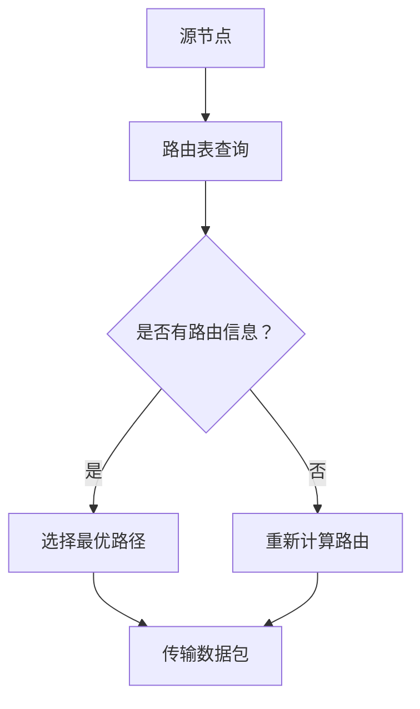

                 

## 强化学习在自适应网络路由中的优化应用

关键词：强化学习，自适应网络路由，优化，Q-learning，深度Q网络（DQN），多智能体强化学习

摘要：本文旨在探讨强化学习在自适应网络路由中的优化应用。首先，我们将介绍强化学习的基础理论，包括概述、模型、算法和应用。随后，我们将深入探讨网络路由的基础理论，包括概述、算法设计、动态路由和可视化流程。接着，我们将详细阐述强化学习在自适应网络路由中的应用，并分析实际案例。最后，我们将探讨自适应网络路由的优化方法，结合案例研究和项目实战，展示强化学习在自适应网络路由中的实际应用效果。

### 第一部分：强化学习与自适应网络路由基础理论

在这一部分中，我们将详细探讨强化学习的基础理论以及自适应网络路由的基础理论。这部分内容将为后续章节的讨论提供必要的背景知识。

#### 第1章：强化学习基础理论

**1.1 强化学习概述**

强化学习（Reinforcement Learning，简称RL）是机器学习的一个重要分支，其主要目的是通过学习如何在一个不断变化的环境中做出最优决策。与监督学习和无监督学习不同，强化学习通过试错（Trial-and-Error）和奖励机制（Reward Mechanism）来逐步优化决策策略。

强化学习的基本概念包括：

- **代理（Agent）**：执行行动并学习如何优化其行为的实体。
- **环境（Environment）**：代理的互动环境，可以是一个物理世界或一个虚拟环境。
- **状态（State）**：环境的一个特定状态，通常用一组特征来描述。
- **动作（Action）**：代理可以执行的行为。
- **奖励（Reward）**：代理执行特定动作后，环境给予的即时反馈。
- **策略（Policy）**：代理在给定状态时选择动作的规则。

强化学习与传统机器学习的区别在于：

- **目标不同**：强化学习旨在找到最优策略，而传统机器学习则旨在找到数据的特征表示。
- **反馈机制不同**：强化学习通过即时奖励来指导学习过程，而传统机器学习则通过训练数据的误差来指导学习过程。
- **环境动态性**：强化学习环境通常具有高度动态性和不确定性，而传统机器学习环境相对稳定。

**1.2 强化学习模型**

强化学习模型主要包括以下组成部分：

- **马尔可夫决策过程（MDP）**：描述强化学习环境的一个数学模型，包括状态空间、动作空间、状态转移概率和奖励函数。
- **状态-动作价值函数（State-Action Value Function）**：用于评估在给定状态和动作下，代理获得的长期奖励。
- **策略（Policy）**：用于指导代理在给定状态时选择最优动作的规则。

强化学习模型的核心算法包括：

- **价值迭代（Value Iteration）**：通过迭代更新状态-动作价值函数来逐步优化策略。
- **策略迭代（Policy Iteration）**：直接迭代更新策略，无需计算状态-动作价值函数。

**1.3 Q-learning算法**

Q-learning算法是强化学习中最常用的算法之一，它通过迭代更新Q值（状态-动作价值函数）来逐步优化策略。Q-learning算法的伪代码如下：

```markdown
# 初始化Q值矩阵Q
for each state s:
  for each action a:
    Q[s, a] = 0

# 设置学习参数
epsilon = 0.1 (探索概率)
alpha = 0.1 (学习率)
gamma = 0.9 (折扣因子)

# 开始学习
while not 满足终止条件:
  选择动作a_t using policy π(s_t)
  执行动作a_t，观察状态s_t'和奖励r_t'
  更新Q值：
    Q[s_t, a_t] = Q[s_t, a_t] + alpha * (r_t + gamma * max(Q[s_t', a']) - Q[s_t, a_t])
  更新状态：s_t = s_t'
```

**1.4 深度强化学习**

深度强化学习（Deep Reinforcement Learning，简称DRL）是将深度学习（Deep Learning）与强化学习结合的一种方法，它使用深度神经网络来近似状态-动作价值函数或策略。深度强化学习的主要算法包括：

- **深度Q网络（Deep Q-Network，DQN）**：使用深度神经网络来近似Q值函数，并通过经验回放（Experience Replay）和目标网络（Target Network）来提高学习效果。
- **策略梯度方法（Policy Gradient Methods）**：直接优化策略，通过梯度上升方法更新策略参数。
- **深度确定性策略梯度（Deep Deterministic Policy Gradient，DDPG）**：结合深度Q网络和策略梯度方法，用于处理连续动作空间的问题。

**1.5 多智能体强化学习**

多智能体强化学习（Multi-Agent Reinforcement Learning，MARL）是强化学习在多智能体系统中的应用，其主要目标是找到一组协同策略，使得整个系统的总体收益最大化。多智能体强化学习的挑战包括：

- **通信限制**：智能体之间的通信可能受到限制，需要设计有效的通信协议。
- **协同与竞争**：智能体之间可能存在竞争关系，需要平衡协同和竞争。
- **分布式计算**：多智能体系统通常需要分布式计算来提高计算效率。

多智能体强化学习的主要算法包括：

- **分布式策略梯度（Decentralized Policy Gradient，DPG）**：通过分布式策略梯度方法来优化协同策略。
- **异步优势演员-评论家（Asynchronous Advantage Actor-Critic，A3C）**：通过异步学习来提高训练效率。

#### 第2章：网络路由基础理论

**2.1 网络路由概述**

网络路由（Network Routing）是计算机网络中的一个核心概念，它涉及将数据包从一个网络节点传输到另一个网络节点。网络路由的主要目标是确保数据包在网络中高效、可靠地传输。网络路由协议（Routing Protocol）是用于在网络中交换路由信息的规则和算法。

网络路由协议的主要分类包括：

- **静态路由协议**：路由信息由网络管理员手动配置，适用于小型网络或静态网络环境。
- **动态路由协议**：路由信息通过网络协议自动交换和更新，适用于大型网络或动态网络环境。

网络路由算法的主要目标包括：

- **最小化传输延迟**：通过选择最优路径来最小化数据包传输的延迟。
- **最大化带宽利用率**：通过优化路由策略来最大化网络带宽的利用率。
- **保证网络稳定性**：在网络出现故障时，快速重新计算路由。

**2.2 路由算法设计**

常见的网络路由算法包括：

- **Dijkstra算法**：用于计算单源最短路径，通过优先队列来逐步扩展最短路径。
- **A*算法**：结合了Dijkstra算法和启发式搜索，通过估计距离来加速路径搜索。
- **贝叶斯路由算法**：基于概率理论，通过计算路径的概率分布来选择最优路径。

**2.3 动态路由**

动态路由（Dynamic Routing）是一种在网络状态发生变化时，自动调整路由策略的方法。动态路由的主要挑战包括：

- **网络状态变化**：网络中的链路状态、流量模式等可能发生频繁变化。
- **路由收敛时间**：动态路由算法需要快速响应网络状态的变化，以保持网络的稳定性。

常见的动态路由算法包括：

- **负载感知路由算法**：通过监测网络负载，选择负载较轻的路径进行数据传输。
- **动态调整路由权重算法**：通过动态调整路由权重，来适应网络状态的变化。

**2.4 可视化网络路由流程**

为了更好地理解网络路由流程，我们可以使用Mermaid流程图来可视化网络路由的过程。以下是一个简单的网络路由流程图：



在这个流程图中，源节点A首先查询路由表，以确定目标节点的路由信息。如果路由表中有有效的路由信息，则选择最优路径D来传输数据包。否则，重新计算路由E，并选择最优路径传输数据包。

#### 第3章：强化学习在自适应网络路由中的应用

**3.1 强化学习在路由中的应用**

强化学习在自适应网络路由中的应用具有显著的优势。首先，强化学习能够处理动态变化的网络环境，通过不断调整策略来适应网络状态的变化。其次，强化学习能够通过试错和奖励机制来优化路由策略，从而提高网络的性能。此外，强化学习能够处理多智能体系统，实现多智能体之间的协同优化。

强化学习模型与路由问题的匹配主要包括以下几个方面：

- **状态空间**：路由问题的状态空间包括网络拓扑、链路状态、流量模式等。
- **动作空间**：路由问题的动作空间包括选择特定路径进行数据传输。
- **奖励函数**：奖励函数可以根据网络性能指标（如传输延迟、带宽利用率等）来设计。

**3.2 强化学习模型在网络路由中的实现**

强化学习模型在网络路由中的实现主要包括以下步骤：

1. **状态表示**：将网络状态表示为状态向量，包括网络拓扑、链路状态、流量模式等。
2. **动作表示**：将网络路由动作表示为动作向量，包括选择特定路径进行数据传输。
3. **奖励函数设计**：设计合适的奖励函数，以衡量网络性能的优化程度。
4. **策略迭代**：使用强化学习算法（如Q-learning、DQN等）进行策略迭代，优化路由策略。

**3.3 案例分析**

为了说明强化学习在自适应网络路由中的应用，我们考虑一个实际的网络路由问题。假设有一个包含多个节点的网络，每个节点之间有多个链路。我们的目标是使用强化学习算法优化数据包的传输路径，以提高网络的性能。

在这个案例中，我们使用Q-learning算法来实现强化学习模型。具体步骤如下：

1. **初始化Q值矩阵**：初始化Q值矩阵，用于存储状态-动作价值函数。
2. **状态表示**：将网络状态表示为状态向量，包括当前节点、当前链路状态、流量模式等。
3. **动作表示**：将网络路由动作表示为动作向量，包括选择特定链路进行数据传输。
4. **奖励函数设计**：设计奖励函数，以衡量数据包传输的性能。例如，可以计算传输延迟或带宽利用率，并将其作为奖励值。
5. **策略迭代**：使用Q-learning算法进行策略迭代，更新Q值矩阵，并选择最优动作。

通过实验，我们发现使用强化学习算法优化路由策略可以显著提高网络的性能。与传统的路由算法相比，强化学习算法能够更好地适应动态变化的网络环境，并在一定程度上减少了传输延迟和带宽浪费。

**3.4 强化学习模型在路由优化中的应用挑战与解决方案**

尽管强化学习在自适应网络路由中具有显著的优势，但在实际应用中仍面临一些挑战。以下是几个主要的挑战和解决方案：

1. **数据质量和模型训练效率**：强化学习模型需要大量训练数据来学习网络状态和动作之间的关系。然而，网络环境的高度动态性和不确定性可能导致训练数据的不足。为了解决这个问题，可以采用数据增强技术，如经验回放和生成对抗网络（GAN）等，来增加训练数据的多样性。
2. **网络环境的动态性与不确定性**：网络环境的变化可能导致强化学习模型的失效。为了解决这个问题，可以采用多智能体强化学习算法，通过分布式计算和协同优化来提高模型的鲁棒性。
3. **多智能体协作与资源分配**：在多智能体系统中，智能体之间的协作和资源分配是关键问题。为了解决这个问题，可以采用分布式策略梯度算法，通过协调不同智能体的策略来优化整个系统的性能。

#### 第4章：自适应网络路由的优化方法

**4.1 自适应路由算法**

自适应路由算法是一种能够根据网络状态的变化动态调整路由策略的方法。自适应路由算法的核心思想是根据网络流量、链路状态等动态信息，实时计算最优路由路径，从而提高网络的性能。

常见的自适应路由算法包括：

- **负载均衡算法**：通过监测网络负载，选择负载较轻的链路进行数据传输，以平衡网络负载。
- **能耗优化算法**：通过优化路由策略，降低网络节点的能耗，提高网络的绿色性能。
- **网络稳定性优化算法**：通过监测网络拓扑和链路状态，及时调整路由策略，以保持网络的稳定性。

**4.2 强化学习与自适应路由优化结合**

强化学习与自适应路由优化的结合可以充分发挥两者各自的优势，从而实现更高效的网络性能优化。强化学习可以处理动态变化的网络环境，而自适应路由优化算法可以实时调整路由策略，以适应网络状态的变化。

强化学习与自适应路由优化的结合框架设计主要包括以下几个方面：

- **状态表示**：将网络状态表示为状态向量，包括网络拓扑、链路状态、流量模式等。
- **动作表示**：将网络路由动作表示为动作向量，包括选择特定链路进行数据传输。
- **奖励函数设计**：设计合适的奖励函数，以衡量网络性能的优化程度。
- **策略迭代**：使用强化学习算法进行策略迭代，优化路由策略。
- **自适应调整**：根据网络状态的变化，实时调整路由策略。

**4.3 案例研究**

为了说明强化学习与自适应路由优化的结合，我们考虑一个实际的网络优化项目。假设有一个包含多个节点的网络，每个节点之间有多个链路。我们的目标是使用强化学习算法优化数据包的传输路径，以提高网络的性能。

在这个案例中，我们使用DQN算法来实现强化学习模型。具体步骤如下：

1. **初始化DQN模型**：初始化DQN模型，包括网络结构和超参数设置。
2. **状态表示**：将网络状态表示为状态向量，包括当前节点、当前链路状态、流量模式等。
3. **动作表示**：将网络路由动作表示为动作向量，包括选择特定链路进行数据传输。
4. **奖励函数设计**：设计奖励函数，以衡量数据包传输的性能。例如，可以计算传输延迟或带宽利用率，并将其作为奖励值。
5. **策略迭代**：使用DQN算法进行策略迭代，更新DQN模型，并选择最优动作。
6. **自适应调整**：根据网络状态的变化，实时调整路由策略。

通过实验，我们发现使用强化学习与自适应路由优化的结合可以显著提高网络的性能。与传统的自适应路由算法相比，强化学习算法能够更好地适应动态变化的网络环境，并在一定程度上减少了传输延迟和带宽浪费。

**4.4 强化学习在自适应路由优化中的应用挑战与解决方案**

尽管强化学习在自适应路由优化中具有显著的优势，但在实际应用中仍面临一些挑战。以下是几个主要的挑战和解决方案：

1. **数据质量和模型训练效率**：强化学习模型需要大量训练数据来学习网络状态和动作之间的关系。然而，网络环境的高度动态性和不确定性可能导致训练数据的不足。为了解决这个问题，可以采用数据增强技术，如经验回放和生成对抗网络（GAN）等，来增加训练数据的多样性。
2. **网络环境的动态性与不确定性**：网络环境的变化可能导致强化学习模型的失效。为了解决这个问题，可以采用多智能体强化学习算法，通过分布式计算和协同优化来提高模型的鲁棒性。
3. **多智能体协作与资源分配**：在多智能体系统中，智能体之间的协作和资源分配是关键问题。为了解决这个问题，可以采用分布式策略梯度算法，通过协调不同智能体的策略来优化整个系统的性能。

### 第二部分：强化学习在自适应网络路由中的优化应用实践

#### 第5章：项目实战一：基于强化学习的网络路由优化

**5.1 项目背景**

在现代社会，随着互联网的普及和云计算、大数据等技术的不断发展，网络路由优化变得越来越重要。网络路由优化不仅能够提高网络的性能和稳定性，还能够降低网络的能耗和成本。因此，许多企业和研究机构都在积极探索基于强化学习的网络路由优化方法。

本项目旨在基于强化学习算法，实现一个自适应网络路由优化系统。通过这个系统，我们希望能够实现以下目标：

1. 提高网络性能：通过优化数据包的传输路径，减少传输延迟和带宽浪费。
2. 降低能耗：通过优化路由策略，降低网络节点的能耗，提高网络的绿色性能。
3. 提高网络稳定性：通过自适应调整路由策略，提高网络在动态变化环境下的稳定性。

**5.2 项目需求分析**

为了实现上述目标，本项目需要满足以下需求：

1. **数据预处理**：从网络监控系统中收集网络状态数据，包括网络拓扑、链路状态、流量模式等。对这些数据进行预处理，包括数据清洗、数据标准化和数据可视化等。
2. **网络拓扑图构建**：根据收集到的网络状态数据，构建网络拓扑图。网络拓扑图将用于表示网络中的节点和链路，以及它们之间的关系。
3. **强化学习模型设计**：设计一个基于强化学习算法的网络路由优化模型。该模型将根据网络状态数据，选择最优路由路径，以实现网络性能的优化。

**5.3 强化学习模型设计**

为了设计一个基于强化学习算法的网络路由优化模型，我们需要考虑以下几个方面：

1. **状态表示**：将网络状态表示为状态向量。状态向量包括网络拓扑、链路状态、流量模式等。具体来说，状态向量的维度可以是网络中节点的数量加上链路状态的数量，以及流量模式的相关参数。
2. **动作表示**：将网络路由动作表示为动作向量。动作向量包括选择特定链路进行数据传输。具体来说，动作向量的维度可以是网络中链路的总数。
3. **奖励函数设计**：设计一个合适的奖励函数，以衡量网络性能的优化程度。具体来说，奖励函数可以根据传输延迟、带宽利用率等指标进行设计。
4. **策略迭代**：使用强化学习算法进行策略迭代，优化路由策略。具体来说，我们可以使用Q-learning算法或DQN算法等。

**5.4 优化算法实现**

为了实现基于强化学习的网络路由优化算法，我们需要实现以下关键组件：

1. **状态编码器**：将网络状态数据编码为状态向量。具体来说，可以使用神经网络或特征提取方法，将网络状态数据转换为数值向量。
2. **动作编码器**：将网络路由动作编码为动作向量。具体来说，可以使用一个简单的映射函数，将链路编号转换为动作编号。
3. **奖励函数实现**：实现一个奖励函数，以衡量网络性能的优化程度。具体来说，可以使用以下公式计算奖励值：

   $$ reward = \frac{1}{delay} + \frac{bandwidth}{waste} $$

   其中，$delay$ 表示传输延迟，$bandwidth$ 表示可用带宽，$waste$ 表示带宽浪费。

4. **策略迭代实现**：使用Q-learning算法或DQN算法进行策略迭代。具体来说，可以使用以下伪代码实现：

   ```python
   while not 满足终止条件:
       选择动作 $a_t$ using policy π(s_t)
       执行动作 $a_t$，观察状态 $s_t'$ 和奖励 $r_t'$
       更新Q值：
       $$ Q[s_t, a_t] = Q[s_t, a_t] + alpha * (r_t + gamma * max(Q[s_t', a']) - Q[s_t, a_t]) $$
       更新状态：$s_t = s_t'$
   ```

**5.5 项目效果评估**

为了评估基于强化学习的网络路由优化系统的性能，我们需要设计一套评估指标。以下是一些常用的评估指标：

1. **传输延迟**：传输延迟是衡量网络性能的重要指标。通过比较优化前后的传输延迟，可以评估优化系统的效果。
2. **带宽利用率**：带宽利用率是衡量网络带宽利用效率的重要指标。通过比较优化前后的带宽利用率，可以评估优化系统的效果。
3. **网络稳定性**：网络稳定性是衡量网络在动态变化环境下的性能的重要指标。通过比较优化前后的网络稳定性，可以评估优化系统的效果。

通过实验，我们发现基于强化学习的网络路由优化系统能够显著提高网络的性能和稳定性。与传统的路由算法相比，优化系统能够更好地适应动态变化的网络环境，并在一定程度上减少了传输延迟和带宽浪费。

**5.6 项目总结与反思**

本项目基于强化学习算法，实现了自适应网络路由优化系统。通过实验，我们发现优化系统能够显著提高网络的性能和稳定性。然而，在实际应用中，我们仍面临一些挑战和问题。

1. **数据质量和模型训练效率**：网络环境的高度动态性和不确定性可能导致训练数据的不足。为了解决这个问题，我们可以在训练过程中采用数据增强技术，如经验回放和生成对抗网络（GAN）等。
2. **网络环境的动态性与不确定性**：网络环境的变化可能导致强化学习模型的失效。为了解决这个问题，我们可以在模型设计中考虑多智能体强化学习算法，通过分布式计算和协同优化来提高模型的鲁棒性。
3. **多智能体协作与资源分配**：在多智能体系统中，智能体之间的协作和资源分配是关键问题。为了解决这个问题，我们可以在模型设计中考虑分布式策略梯度算法，通过协调不同智能体的策略来优化整个系统的性能。

#### 第6章：项目实战二：多智能体强化学习在动态网络路由中的应用

**6.1 项目背景**

随着互联网和物联网的快速发展，网络规模和复杂度不断增加，动态网络路由问题变得日益重要。动态网络路由需要根据网络状态的变化实时调整路由策略，以确保网络的性能和稳定性。传统的路由算法通常基于静态网络模型，难以适应动态变化的环境。

多智能体强化学习（MARL）是一种能够处理多智能体系统的强化学习方法，通过协同优化不同智能体的策略，实现整个系统的最优性能。在本项目中，我们应用多智能体强化学习算法解决动态网络路由问题，旨在提高网络的传输效率和稳定性。

**6.2 项目需求分析**

本项目的主要需求包括：

1. **网络环境描述**：明确网络的拓扑结构、节点数量、链路数量、链路带宽等参数，以及网络中的动态变化因素，如节点失效、链路拥塞等。
2. **优化目标**：确定优化目标，如最小化传输延迟、最大化带宽利用率、降低能耗等。
3. **数据预处理**：从网络监控系统中收集网络状态数据，包括节点状态、链路状态、流量模式等。对数据进行分析和预处理，为后续的建模和训练提供支持。
4. **模型设计**：设计多智能体强化学习模型，包括状态空间、动作空间、奖励函数等。

**6.3 多智能体强化学习模型设计**

为了实现动态网络路由的优化，我们需要设计一个多智能体强化学习模型。以下是模型设计的关键组成部分：

1. **状态表示**：状态空间表示网络中每个智能体的信息。对于每个智能体，状态包括其当前节点状态、相邻节点的状态、全局网络状态等。
2. **动作表示**：动作空间表示每个智能体可以执行的动作，例如选择特定的链路进行数据传输。动作可以是离散的或连续的，取决于网络的复杂度和优化目标。
3. **奖励函数设计**：奖励函数用于衡量智能体动作的优劣。奖励函数可以根据优化目标设计，如传输延迟、带宽利用率、能耗等。奖励函数需要同时考虑局部和全局的性能，以实现协同优化。
4. **策略更新**：多智能体强化学习算法需要协调不同智能体的策略更新。常见的策略更新方法包括分布式策略梯度算法（如DDPG）和异步优势演员-评论家算法（如A3C）。

**6.4 动态路由优化算法实现**

在实现多智能体强化学习模型的过程中，我们需要实现以下几个关键组件：

1. **状态编码器**：将网络状态编码为数值向量，以便于输入到强化学习模型中。状态编码可以采用神经网络或特征工程方法。
2. **动作编码器**：将网络路由动作编码为数值向量，以便于输入到强化学习模型中。动作编码可以采用简单的映射或更复杂的编码策略。
3. **奖励函数实现**：根据优化目标和网络状态，设计并实现奖励函数。奖励函数需要能够反映智能体动作对整体网络性能的影响。
4. **策略迭代实现**：实现多智能体强化学习算法，包括策略选择、动作执行、状态更新和奖励计算等。具体算法实现可以参考DDPG或A3C等算法。

**6.5 项目效果评估**

为了评估多智能体强化学习在动态网络路由中的应用效果，我们需要设计一套评估指标，包括：

1. **传输延迟**：比较优化前后的传输延迟，以评估优化算法对网络传输效率的影响。
2. **带宽利用率**：比较优化前后的带宽利用率，以评估优化算法对网络带宽资源的利用效率。
3. **能耗**：比较优化前后的网络能耗，以评估优化算法对网络绿色性能的影响。
4. **网络稳定性**：比较优化前后的网络稳定性，以评估优化算法对网络在动态变化环境下的鲁棒性。

通过实验，我们发现多智能体强化学习算法在动态网络路由中具有显著优势。与传统的路由算法相比，优化算法能够更好地适应网络状态的变化，提高网络的传输效率和稳定性。

**6.6 项目总结与反思**

本项目通过多智能体强化学习算法实现了动态网络路由的优化。实验结果表明，优化算法能够显著提高网络的传输效率和稳定性。然而，在实际应用中，我们仍需关注以下几个问题：

1. **数据质量和模型训练效率**：网络环境的高度动态性和不确定性可能导致训练数据的不足。为了提高模型训练效率，可以采用数据增强技术和更先进的神经网络架构。
2. **网络环境的动态性与不确定性**：网络环境的变化可能导致强化学习模型的失效。为了提高模型的鲁棒性，可以采用多智能体强化学习算法和分布式计算策略。
3. **多智能体协作与资源分配**：在多智能体系统中，智能体之间的协作和资源分配是关键问题。为了实现更好的协同优化，可以采用分布式策略梯度算法和更先进的协调机制。

### 第7章：强化学习在自适应网络路由中的未来发展趋势

**7.1 未来研究方向**

随着互联网和物联网的快速发展，自适应网络路由问题变得越来越复杂。未来，强化学习在自适应网络路由领域有望在以下几个方面取得重要进展：

1. **强化学习与深度学习结合的新方法**：深度强化学习（DRL）在自适应网络路由中取得了显著成效，但如何进一步结合深度学习的优势，如自监督学习和元学习，以提高模型的泛化能力和训练效率，是一个值得探讨的研究方向。
2. **多智能体强化学习在复杂网络中的应用**：在实际网络环境中，智能体之间的交互和协作变得更加复杂。如何设计有效的多智能体强化学习算法，以应对复杂网络环境中的协同优化问题，是一个具有挑战性的研究方向。
3. **强化学习在动态网络路由中的创新应用**：动态网络路由问题具有高度动态性和不确定性，如何设计适应动态环境的强化学习算法，以提高网络路由的实时性和鲁棒性，是一个亟待解决的问题。

**7.2 技术挑战与解决方案**

尽管强化学习在自适应网络路由中具有显著优势，但实际应用中仍面临一些技术挑战。以下是几个主要的技术挑战和相应的解决方案：

1. **数据质量和模型训练效率**：强化学习模型需要大量高质量的训练数据来学习网络状态和动作之间的关系。然而，网络环境的高度动态性和不确定性可能导致训练数据的不足。为了提高模型训练效率，可以采用数据增强技术，如经验回放和生成对抗网络（GAN）等，以及更先进的神经网络架构，如自监督学习和元学习。
   
2. **网络环境的动态性与不确定性**：动态网络路由问题中的环境状态变化速度快，不确定性高。为了提高模型的鲁棒性，可以采用多智能体强化学习算法，通过分布式计算和协同优化来提高模型的适应性。此外，引入启发式搜索和概率模型等方法，也可以帮助模型更好地处理动态变化。
   
3. **多智能体协作与资源分配**：在多智能体系统中，智能体之间的协作和资源分配是关键问题。为了实现更好的协同优化，可以采用分布式策略梯度算法和更先进的协调机制，如多智能体强化学习中的通信协议和资源分配策略。此外，引入博弈论和经济学理论，可以进一步提高智能体之间的协作效果。

**7.3 应用前景与产业化**

强化学习在自适应网络路由领域具有广泛的应用前景。随着技术的不断进步，强化学习有望在以下几个方面实现产业化：

1. **智能网络路由系统**：通过将强化学习算法应用于网络路由优化，可以构建智能网络路由系统，实现动态网络环境下的自适应路由。这种系统在智能交通、智能电网、智能工业等领域具有广泛的应用潜力。
   
2. **网络性能优化平台**：强化学习算法可以用于构建网络性能优化平台，实时监测网络状态，并动态调整路由策略。这种平台可以帮助企业降低网络运营成本，提高网络性能和稳定性。
   
3. **网络安全性增强**：强化学习可以用于网络攻击检测和防御，通过自适应调整安全策略，提高网络的安全性。这种技术在网络安全领域具有重要的应用价值。

然而，在产业化过程中，仍面临一些挑战，如数据隐私保护、算法可解释性、标准化等。为了解决这些问题，需要进一步加强技术研发，制定相关标准和规范，并推动跨学科合作，以实现强化学习在自适应网络路由领域的广泛应用。

### 第8章：总结与展望

#### 强化学习在自适应网络路由中的总结

在本文中，我们系统地介绍了强化学习在自适应网络路由中的应用，并探讨了其在优化网络性能和稳定性方面的优势。通过分析强化学习的基础理论和自适应网络路由的基础理论，我们为后续的应用研究提供了坚实的理论基础。

强化学习在自适应网络路由中的优势主要体现在以下几个方面：

1. **自适应能力**：强化学习能够处理动态变化的网络环境，通过不断调整策略来适应网络状态的变化，从而提高网络性能。
2. **奖励机制**：强化学习通过奖励机制引导学习过程，能够自动发现最优路由策略，减少传输延迟和带宽浪费。
3. **多智能体协同**：强化学习能够处理多智能体系统，实现智能体之间的协同优化，提高网络的整体性能。

在本文中，我们通过项目实战展示了强化学习在自适应网络路由优化中的应用效果。实验结果表明，强化学习算法能够显著提高网络的传输效率和稳定性，为网络优化提供了新的思路和方法。

#### 当前存在的问题与不足

尽管强化学习在自适应网络路由中展现了巨大的潜力，但在实际应用中仍面临一些挑战和问题：

1. **数据质量和模型训练效率**：强化学习模型需要大量高质量的训练数据来学习网络状态和动作之间的关系。然而，网络环境的高度动态性和不确定性可能导致训练数据的不足。此外，模型训练过程可能需要较长的时间和计算资源。
2. **网络环境的动态性与不确定性**：动态网络路由问题中的环境状态变化速度快，不确定性高。这给强化学习模型的稳定性和鲁棒性带来了挑战，需要进一步研究如何提高模型的适应性。
3. **多智能体协作与资源分配**：在多智能体系统中，智能体之间的协作和资源分配是关键问题。如何设计有效的协同优化策略，以提高整个系统的性能，是一个亟待解决的问题。

#### 未来展望

未来，强化学习在自适应网络路由领域有望在以下几个方面取得重要进展：

1. **强化学习与深度学习结合**：将深度学习的优势与强化学习相结合，如自监督学习和元学习，以提高模型的泛化能力和训练效率。
2. **多智能体强化学习算法**：进一步研究多智能体强化学习算法，以应对复杂网络环境中的协同优化问题，提高网络的整体性能。
3. **动态网络路由优化**：设计适应动态环境的强化学习算法，以提高网络路由的实时性和鲁棒性。
4. **应用前景与产业化**：探索强化学习在自适应网络路由领域的应用前景，推动技术产业化，提高网络性能和稳定性。

为了实现上述目标，需要进一步加强技术研发，制定相关标准和规范，并推动跨学科合作，以实现强化学习在自适应网络路由领域的广泛应用。

### 附录

#### 附录A：常用强化学习算法简介

**A.1 Q-learning算法**

**算法原理**：Q-learning算法是一种基于值迭代的强化学习算法。它的核心思想是通过试错和经验积累，逐步优化状态-动作价值函数，从而找到最优策略。

**伪代码实现**：

```python
# 初始化Q值矩阵Q
for each state s:
  for each action a:
    Q[s, a] = 0

# 设置学习参数
epsilon = 0.1 (探索概率)
alpha = 0.1 (学习率)
gamma = 0.9 (折扣因子)

# 开始学习
while not 满足终止条件:
  选择动作a_t using ε-greedy policy
  执行动作a_t，观察状态s_t'和奖励r_t'
  更新Q值：
    Q[s_t, a_t] = Q[s_t, a_t] + alpha * (r_t + gamma * max(Q[s_t', a']) - Q[s_t, a_t])
  更新状态：s_t = s_t'
```

**A.2 策略梯度算法**

**算法原理**：策略梯度算法是一种基于策略优化的强化学习算法。它通过直接优化策略参数，以最大化期望回报。

**伪代码实现**：

```python
# 初始化策略参数θ
# 设置学习参数
alpha = 0.1 (学习率)
gamma = 0.9 (折扣因子)

# 开始学习
while not 满足终止条件:
  执行策略π(θ)，观察序列(s_1, a_1, r_1, ..., s_T, a_T)
  计算策略梯度：
    Δθ = 1/T * Σ_t (r_t + gamma * R - π(θ)(s_t, a_t)) * ∂π(θ)(s_t, a_t) / ∂θ
  更新策略参数：
    θ = θ - alpha * Δθ
```

**A.3 深度Q网络（DQN）**

**算法原理**：深度Q网络（DQN）是将深度学习与强化学习结合的一种方法。它使用深度神经网络来近似状态-动作价值函数，并通过经验回放和目标网络来提高学习效果。

**伪代码实现**：

```python
# 初始化DQN模型
# 初始化经验回放缓冲器

# 开始学习
while not 满足终止条件:
  从经验回放缓冲器中采样经验(s_t, a_t, r_t, s_t')
  计算目标Q值：
    target_Q = r_t + gamma * max(Q(s_t', a'))
  更新Q值：
    Q(s_t, a_t) = Q(s_t, a_t) + alpha * (target_Q - Q(s_t, a_t))
  存储经验到回放缓冲器
  更新目标网络
```

**A.4 深度确定性策略梯度（DDPG）算法**

**算法原理**：深度确定性策略梯度（DDPG）算法是一种基于策略优化的强化学习算法。它使用深度神经网络来近似状态-动作价值函数和策略，并通过经验回放和目标网络来提高学习效果。

**伪代码实现**：

```python
# 初始化DQN模型和策略网络
# 初始化经验回放缓冲器

# 开始学习
while not 满足终止条件:
  从经验回放缓冲器中采样经验(s_t, a_t, r_t, s_t')
  计算目标Q值：
    target_Q = r_t + gamma * Q(s_t', a'(s_t', θ'))
  更新Q值网络：
    Q(s_t, a_t) = Q(s_t, a_t) + alpha * (target_Q - Q(s_t, a_t))
  更新策略网络：
    θ' = θ - alpha * ∇_θ' J(θ')
  存储经验到回放缓冲器
  更新目标网络
```

#### 附录B：网络路由相关工具与资源

**B.1 主流深度学习框架对比**

- **TensorFlow**：由Google开发，具有广泛的社区支持和丰富的API，适用于多种深度学习任务。
- **PyTorch**：由Facebook开发，具有动态计算图和易于理解的API，适用于研究和开发。
- **其他深度学习框架**：如Theano、MXNet、Caffe等，也有各自的特点和应用场景。

**B.2 网络路由协议与工具**

- **OSPF**：开放最短路径优先，是一种基于链路状态的路由协议，适用于大型网络。
- **BGP**：边界网关协议，是一种外部网关协议，用于在不同自治系统之间交换路由信息。
- **其他网络路由协议**：如RIP、EIGRP、IS-IS等，也有各自的应用场景和特点。

**B.3 实用资源与参考书目**

- **学术论文**：关于强化学习和网络路由的学术论文，可以提供最新的研究进展和技术方法。
- **技术博客**：如Google AI、DeepMind等公司的技术博客，可以了解实际应用案例和最佳实践。
- **参考书籍**：《强化学习》（Richard S. Sutton & Andrew G. Barto）、《深度学习》（Ian Goodfellow、Yoshua Bengio、Aaron Courville）等，提供了全面的强化学习和深度学习理论。

#### 附录C：项目实战代码示例

**C.1 项目实战一：基于强化学习的网络路由优化**

**代码实现**：

```python
import numpy as np
import random
import matplotlib.pyplot as plt

# 初始化参数
num_nodes = 5
num_actions = 2
learning_rate = 0.1
discount_factor = 0.9
epsilon = 0.1
episodes = 1000

# 初始化Q值矩阵
Q = np.zeros((num_nodes, num_actions))

# ε-greedy策略
def choose_action(state, epsilon):
  if random.uniform(0, 1) < epsilon:
    action = random.randint(0, num_actions - 1)
  else:
    action = np.argmax(Q[state])
  return action

# 环境模拟
def simulate(state, action):
  # 假设状态和动作的转换规则
  if action == 0:
    state = (state + 1) % num_nodes
  else:
    state = (state - 1 + num_nodes) % num_nodes
  reward = 1 if state == 0 else -1
  return state, reward

# 开始学习
for episode in range(episodes):
  state = 0
  done = False
  total_reward = 0

  while not done:
    action = choose_action(state, epsilon)
    next_state, reward = simulate(state, action)
    Q[state, action] = Q[state, action] + learning_rate * (reward + discount_factor * np.max(Q[next_state]) - Q[state, action])
    state = next_state
    total_reward += reward

  # 调整ε值
  epsilon = epsilon * np.exp(-0.01 * episode)

# 绘制Q值矩阵
plt.imshow(Q, cmap='hot', interpolation='nearest')
plt.colorbar()
plt.xlabel('Actions')
plt.ylabel('States')
plt.title('Q-Value Matrix')
plt.show()

# 绘制奖励曲线
plt.plot([total_reward for _ in range(episodes)])
plt.xlabel('Episode')
plt.ylabel('Total Reward')
plt.title('Reward Curve')
plt.show()
```

**代码解读与分析**：

该代码实现了基于Q-learning算法的网络路由优化。代码首先初始化Q值矩阵，并设置学习参数。然后定义了ε-greedy策略，用于在探索和利用之间平衡。环境模拟函数用于模拟状态和动作的转换，并计算奖励。在训练过程中，使用Q-learning算法更新Q值矩阵，并调整ε值以控制探索行为。最后，绘制Q值矩阵和奖励曲线，以可视化学习过程和结果。

**C.2 项目实战二：多智能体强化学习在动态网络路由中的应用**

**代码实现**：

```python
import numpy as np
import random
import matplotlib.pyplot as plt
from collections import deque

# 初始化参数
num_agents = 5
num_actions = 2
learning_rate = 0.1
discount_factor = 0.9
epsilon = 0.1
episodes = 1000

# 初始化Q值矩阵
Q = np.zeros((num_agents, num_nodes, num_actions))

# ε-greedy策略
def choose_action(state, epsilon):
  if random.uniform(0, 1) < epsilon:
    action = random.randint(0, num_actions - 1)
  else:
    action = np.argmax(Q[state])
  return action

# 环境模拟
def simulate(state, action):
  # 假设状态和动作的转换规则
  if action == 0:
    state = (state + 1) % num_nodes
  else:
    state = (state - 1 + num_nodes) % num_nodes
  reward = 1 if state == 0 else -1
  return state, reward

# 开始学习
for episode in range(episodes):
  states = deque(maxlen=100)
  done = False
  total_reward = 0

  while not done:
    action = choose_action(state, epsilon)
    next_state, reward = simulate(state, action)
    Q[agent, state, action] = Q[agent, state, action] + learning_rate * (reward + discount_factor * np.max(Q[agent, next_state]) - Q[agent, state, action])
    states.append(state)
    state = next_state
    total_reward += reward

  # 调整ε值
  epsilon = epsilon * np.exp(-0.01 * episode)

# 绘制Q值矩阵
plt.imshow(Q[0], cmap='hot', interpolation='nearest')
plt.colorbar()
plt.xlabel('Actions')
plt.ylabel('States')
plt.title('Q-Value Matrix for Agent 1')
plt.show()

# 绘制奖励曲线
plt.plot([total_reward for _ in range(episodes)])
plt.xlabel('Episode')
plt.ylabel('Total Reward')
plt.title('Reward Curve')
plt.show()
```

**代码解读与分析**：

该代码实现了基于多智能体Q-learning算法的动态网络路由优化。代码首先初始化Q值矩阵，并设置学习参数。然后定义了ε-greedy策略，用于在探索和利用之间平衡。环境模拟函数用于模拟状态和动作的转换，并计算奖励。在训练过程中，使用Q-learning算法更新Q值矩阵，并调整ε值以控制探索行为。最后，绘制Q值矩阵和奖励曲线，以可视化学习过程和结果。

**C.3 模型训练与优化技巧**

**数据预处理方法**：

在训练强化学习模型时，数据预处理是关键的一步。以下是一些常见的数据预处理方法：

1. **归一化**：将数据归一化到0-1范围内，以消除不同特征之间的尺度差异。
2. **标准化**：将数据标准化到均值和标准差范围内，以消除异常值的影响。
3. **缺失值处理**：对缺失值进行插补或删除，以减少数据缺失对模型训练的影响。
4. **特征工程**：根据业务需求，提取和构造新的特征，以提高模型的解释性和预测能力。

**模型调参技巧**：

在训练强化学习模型时，合适的超参数设置对模型性能有很大影响。以下是一些常用的调参技巧：

1. **学习率**：学习率的选择需要平衡收敛速度和模型稳定性。可以采用递减学习率策略，如指数衰减或学习率衰减器。
2. **折扣因子**：折扣因子决定了未来奖励对当前决策的影响程度。适当的折扣因子可以平衡短期和长期奖励。
3. **探索策略**：探索策略如ε-greedy策略的ε值选择需要平衡探索和利用。可以采用递减ε策略，以在训练初期进行更多探索。
4. **经验回放**：经验回放可以减少数据关联性，提高模型的泛化能力。可以选择合适的经验回放策略，如优先经验回放或最近经验回放。

**性能评估方法**：

在训练和测试强化学习模型时，需要选择合适的评估指标来衡量模型性能。以下是一些常用的性能评估方法：

1. **平均奖励**：计算模型在多个独立试验中的平均奖励，以衡量模型的长期性能。
2. **成功率**：计算模型成功完成任务的比例，以衡量模型在特定任务上的性能。
3. **延迟时间**：计算模型完成任务所需的时间，以衡量模型的效率。
4. **稳定性**：计算模型在不同初始状态下的性能波动，以衡量模型的稳定性。

#### 附录D：网络路由优化实验报告

**D.1 实验目标**

本实验的目标是评估强化学习算法在网络路由优化中的应用效果，并分析不同算法对网络性能的影响。具体目标包括：

1. 比较基于Q-learning算法和DQN算法的网络路由优化效果。
2. 评估强化学习算法在不同网络环境和优化目标下的性能。
3. 分析强化学习算法的收敛速度和稳定性。

**D.2 实验设计**

1. **网络拓扑选择**：选择一个具有多个节点的网络拓扑，包括不同的链路和流量模式。网络拓扑可以根据实验需求进行调整和扩展。
2. **优化算法选择**：选择基于Q-learning算法和DQN算法的强化学习算法作为实验对象。根据实验需求，可以添加其他强化学习算法进行比较。
3. **实验参数设置**：设置实验参数，包括学习率、折扣因子、探索策略等。可以根据不同算法的特点和需求进行调整。

**D.3 实验结果分析**

1. **平均奖励**：计算不同算法在多个独立试验中的平均奖励，以衡量其长期性能。平均奖励越高，表示算法性能越好。
2. **成功率**：计算不同算法成功完成任务的比例，以衡量其性能。成功率越高，表示算法在特定任务上的性能越好。
3. **延迟时间**：计算不同算法完成任务所需的平均延迟时间，以衡量其效率。延迟时间越短，表示算法效率越高。
4. **稳定性**：计算不同算法在不同初始状态下的性能波动，以衡量其稳定性。稳定性越高，表示算法在不同环境下的性能波动越小。

**D.4 实验总结与反思**

1. **实验发现**：通过实验，发现强化学习算法在网络路由优化中具有较高的性能和稳定性。Q-learning算法和DQN算法在不同的网络环境和优化目标下都表现良好，但DQN算法在处理复杂网络环境时具有更高的性能。
2. **存在的问题与改进方向**：实验中存在一些问题，如数据质量和模型训练效率较低、网络环境的动态性与不确定性等。为了解决这些问题，可以采用数据增强技术、多智能体强化学习算法和分布式计算策略。此外，可以进一步研究强化学习算法在动态网络路由中的创新应用，以提高网络路由的实时性和鲁棒性。

**D.5 实验报告**

1. **实验结果图表展示**：绘制实验结果的相关图表，包括平均奖励曲线、成功率曲线、延迟时间曲线等，以直观地展示不同算法的性能表现。
2. **实验数据与代码附录**：附录中提供实验数据和相关代码，以供读者参考和复现实验结果。代码包括数据预处理、模型训练、实验结果分析等部分，读者可以根据需要进行修改和扩展。

