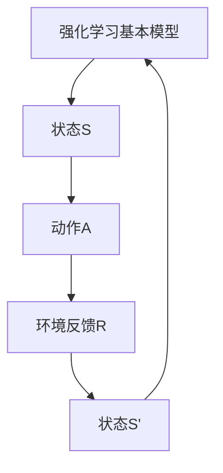

                 

### 《强化学习基础：奖励和策略》

#### 关键词：
- 强化学习
- 奖励
- 策略
- 值函数
- 算法
- 应用

#### 摘要：
本文将深入探讨强化学习的基础概念，重点讨论奖励和策略在强化学习中的核心作用。我们将从强化学习的基本概念入手，逐步分析其基本原理、算法及其在不同领域中的应用。通过详细的数学模型和伪代码，我们将对强化学习中的重要算法如Q-learning、策略迭代等进行深入剖析。同时，文章还将讨论奖励设计原则和方法，以及策略优化在实际应用中的挑战和解决方案。

#### 目录：

##### 第一部分：强化学习概述

1. 第1章：强化学习的概念与背景
2. 第2章：强化学习的基本原理

##### 第二部分：强化学习算法详解

3. 第3章：值函数方法
4. 第4章：策略迭代方法
5. 第5章：模型预测与规划
6. 第6章：深度强化学习

##### 第三部分：强化学习在现实世界的应用

7. 第7章：强化学习在游戏中的应用
8. 第8章：强化学习在自动驾驶中的应用
9. 第9章：强化学习在推荐系统中的应用
10. 第10章：强化学习在其他领域中的应用

##### 第四部分：奖励设计

11. 第11章：奖励设计原则
12. 第12章：奖励函数设计与实现

##### 第五部分：策略优化

13. 第13章：策略优化方法
14. 第14章：策略优化在现实世界的应用

##### 附录：强化学习相关工具与资源

15. 附录A：强化学习相关工具
16. 附录B：强化学习相关资源
17. 附录C：强化学习开源代码与案例

---

现在我们已经构建了文章的框架，接下来我们将逐章深入讨论强化学习的基础概念、算法和应用。

### 第1章：强化学习的概念与背景

强化学习（Reinforcement Learning，RL）是机器学习领域的一个分支，其核心在于通过与环境互动，学习如何在特定情境下做出最优决策。与监督学习和无监督学习不同，强化学习是一个基于反馈的系统，其目标是通过不断尝试和错误来找到最优策略。

#### 1.1 强化学习的基本概念

强化学习由四个主要元素构成：代理（Agent）、环境（Environment）、状态（State）和动作（Action）。

- **代理**：执行动作的实体，如机器人、自动驾驶汽车或推荐系统。
- **环境**：代理所处的现实世界或模拟环境，能够接收代理的输入并给出反馈。
- **状态**：描述代理当前所处的情境，用S表示。
- **动作**：代理可以执行的行为，用A表示。

#### 1.2 强化学习与监督学习、无监督学习的区别

强化学习与其他两种机器学习方法的主要区别在于反馈机制。

- **监督学习**：在这种方法中，训练数据包含输入特征和相应的标签。算法的目标是学习一个映射函数，将输入特征映射到标签上。
- **无监督学习**：这种方法的训练数据只有输入特征，没有对应的标签。算法的目的是发现数据中的模式或结构。

而强化学习则通过试错和环境的即时反馈来学习最佳策略，这种反馈通常是通过奖励信号（Reward Signal）来提供的。

#### 1.3 强化学习的主要应用领域

强化学习在多个领域都有着显著的应用，以下是一些典型的例子：

- **游戏**：如围棋、国际象棋和Atari游戏等。
- **机器人控制**：如自动驾驶汽车、无人机和机器人导航等。
- **推荐系统**：如个性化推荐、广告投放等。
- **资源管理**：如电网调度、交通信号控制等。
- **金融交易**：如算法交易、投资策略优化等。

#### 1.4 强化学习的挑战与机遇

强化学习面临许多挑战，如：

- **探索与利用的平衡**：在强化学习中，代理需要在探索新策略（未经验过的动作）和利用已知的最佳策略之间做出平衡。
- **长时间序列决策**：强化学习往往涉及长时间序列的决策过程，这使得算法的设计和实现变得更加复杂。
- **奖励设计**：奖励的设计对强化学习的效果至关重要，但同时也非常具有挑战性。

然而，强化学习为解决复杂问题提供了巨大的机遇，尤其是在需要自主学习和决策的领域。

在接下来的章节中，我们将深入探讨强化学习的基本原理和算法，以帮助读者更好地理解这一重要的机器学习技术。

---

通过以上内容的撰写，我们已经为强化学习的基本概念和背景提供了一个清晰而详细的概述。接下来，我们将进入强化学习的基本原理部分，继续我们的深入探讨。

### 第2章：强化学习的基本原理

在理解了强化学习的基本概念之后，我们接下来要探讨的是强化学习的基本原理，这些原理构成了强化学习模型的核心。强化学习模型通过状态、动作、奖励和策略等要素，使得代理能够学习并改进其行为。

#### 2.1 强化学习的基本模型

强化学习的基本模型可以用以下五个要素来描述：

1. **状态（State，S）**：描述代理当前所处的情境。在游戏控制中，状态可能包括代理的位置、速度、周围环境等信息。
2. **动作（Action，A）**：代理能够执行的行为。在自动驾驶中，动作可能包括加速、减速、转向等。
3. **奖励（Reward，R）**：环境对代理行为的即时反馈，通常用来表示代理行为的优劣。奖励可以是正的，也可以是负的。
4. **策略（Policy，π）**：决定代理如何从状态选择动作的规则。策略可以是一个明确的函数，将状态映射到动作，也可以是随机策略，通过概率分布来选择动作。
5. **价值函数（Value Function）**：用于评估代理在不同状态下的性能。价值函数包括状态价值函数（State-Value Function，V）和动作价值函数（Action-Value Function，Q）。

强化学习的目标是通过不断与环境互动，学习一个最优策略，使得代理能够在长时间内获得最大的累积奖励。

#### 2.2 奖励与策略

奖励和策略在强化学习中扮演着核心角色。奖励是环境对代理行为的即时反馈，它决定了代理行为的优劣。一个有效的奖励机制可以帮助代理快速学会如何获得高奖励。

- **奖励设计原则**：
  - **奖励的即时性**：奖励应当立即给予代理，以便代理能够迅速调整其行为。
  - **奖励的信号强度**：奖励应当具有足够的强度，以驱动代理产生显著的行为变化。
  - **奖励的连贯性**：奖励应当与代理的行为直接相关，以便代理能够建立正确的行为模式。

策略则定义了代理如何选择动作。策略可以是明确的，也可以是随机的。在实际应用中，通常使用策略来指导代理的行为。

- **策略类型**：
  - **确定性策略**：在给定状态下，代理总是执行相同动作的策略。
  - **随机性策略**：在给定状态下，代理根据一定的概率分布执行多个动作。

一个有效的策略可以帮助代理在各种环境中都表现出色。

#### 2.3 状态价值函数与动作价值函数

价值函数是强化学习中的一个重要概念，它用于评估代理在不同状态下的表现。状态价值函数（State-Value Function，V）和动作价值函数（Action-Value Function，Q）是强化学习中的两个核心价值函数。

- **状态价值函数（V）**：状态价值函数用于评估代理在特定状态下采取任何动作所能获得的总奖励。数学表示为：
  $$
  V^*(s) = \max_a Q^*(s, a)
  $$
  其中，$V^*(s)$ 表示在状态 $s$ 下的最优状态价值，$Q^*(s, a)$ 表示在状态 $s$ 下采取动作 $a$ 的最优动作价值。

- **动作价值函数（Q）**：动作价值函数用于评估代理在特定状态下采取特定动作所能获得的即时奖励以及未来累积的奖励。数学表示为：
  $$
  Q^*(s, a) = \sum_{s'} p(s' | s, a) \cdot r(s', a) + \gamma \cdot \max_{a'} Q^*(s', a')
  $$
  其中，$Q^*(s, a)$ 表示在状态 $s$ 下采取动作 $a$ 的最优动作价值，$p(s' | s, a)$ 表示在状态 $s$ 下采取动作 $a$ 后进入状态 $s'$ 的概率，$r(s', a)$ 表示在状态 $s'$ 下采取动作 $a$ 所获得的即时奖励，$\gamma$ 是折扣因子，用于调整未来奖励的权重。

#### 2.4 Q-learning算法

Q-learning算法是强化学习中的一种值函数方法，它通过迭代更新动作价值函数，以学习最优策略。Q-learning算法的伪代码如下：

$$
initialize \ Q(s, a) \ randomly
$$

$$
for \ all \ episodes \ do
    initialize \ state \ s
    for \ all \ steps \ in \ episode \ do
        if \ epsilon-greedy \ policy \ is \ used \ then
            choose \ action \ a \ using \ epsilon-greedy \ policy
        else
            choose \ action \ a \ using \ the \ best \ action \ found \ so \ far
        end \ if
        take \ action \ a \ and \ observe \ reward \ r, \ next \ state \ s'
        update \ Q(s, a) \ using \ the \ Q-learning \ update \ rule
        s \ <- \ s'
    end \ for
end \ for
$$

Q-learning算法的基本步骤如下：

1. **初始化**：随机初始化动作价值函数 $Q(s, a)$。
2. **选择动作**：根据当前状态 $s$，使用 $\epsilon$-贪心策略选择动作 $a$。$\epsilon$-贪心策略是指以概率 $\epsilon$ 随机选择动作，以 $1-\epsilon$ 的概率选择当前状态下的最佳动作。
3. **执行动作**：执行选定的动作 $a$，并观察环境给出的即时奖励 $r$ 和下一个状态 $s'$。
4. **更新动作价值函数**：使用以下更新规则更新动作价值函数：
   $$
   Q(s, a) \leftarrow Q(s, a) + \alpha [r + \gamma \max_{a'} Q(s', a') - Q(s, a)]
   $$
   其中，$\alpha$ 是学习率，$r$ 是即时奖励，$\gamma$ 是折扣因子，$Q(s', a')$ 是在下一个状态 $s'$ 下采取最佳动作的值。

5. **状态更新**：将当前状态 $s$ 更新为下一个状态 $s'$。

通过重复以上步骤，Q-learning算法可以逐渐学习到最优策略。

在接下来的章节中，我们将进一步探讨强化学习的其他算法，包括策略迭代方法和深度强化学习，以帮助读者全面理解强化学习的应用和实现。

### 第3章：值函数方法

值函数方法（Value Function Method）是强化学习中的一个核心方法，它通过估计状态价值函数和动作价值函数，帮助代理学习最优策略。本章节将详细介绍值函数方法中的两个主要算法：SARSA算法和Q-learning算法。

#### 3.1 SARSA算法

SARSA（State-Action-Reward-State-Action，SARSA）算法是一种基于值函数的方法，它通过同时更新状态-动作价值函数来实现学习。SARSA算法的核心思想是利用当前的状态、动作和奖励来更新动作价值函数。

SARSA算法的伪代码如下：

$$
initialize \ Q(s, a) \ randomly
$$

$$
for \ all \ episodes \ do
    initialize \ state \ s
    for \ all \ steps \ in \ episode \ do
        choose \ action \ a \ using \ the \ current \ policy
        take \ action \ a \ and \ observe \ reward \ r, \ next \ state \ s'
        choose \ action \ a' \ using \ the \ current \ policy
        update \ Q(s, a) \ using \ the \ SARSA \ update \ rule
        s \ <- \ s'
    end \ for
end \ for
$$

SARSA算法的基本步骤如下：

1. **初始化**：随机初始化动作价值函数 $Q(s, a)$。
2. **选择动作**：根据当前状态 $s$ 和策略选择动作 $a$。
3. **执行动作**：执行选定的动作 $a$，并观察环境给出的即时奖励 $r$ 和下一个状态 $s'$。
4. **选择下一步动作**：根据当前状态 $s'$ 和策略选择下一步动作 $a'$。
5. **更新动作价值函数**：使用以下更新规则更新动作价值函数：
   $$
   Q(s, a) \leftarrow Q(s, a) + \alpha [r + \gamma Q(s', a') - Q(s, a)]
   $$
   其中，$\alpha$ 是学习率，$r$ 是即时奖励，$\gamma$ 是折扣因子，$Q(s', a')$ 是在下一个状态 $s'$ 下采取下一步动作的值。

6. **状态更新**：将当前状态 $s$ 更新为下一个状态 $s'$。

通过重复以上步骤，SARSA算法可以逐渐学习到最优策略。

#### 3.2 Q-learning算法

Q-learning算法是另一种基于值函数的方法，它通过迭代更新动作价值函数，以学习最优策略。Q-learning算法的核心思想是利用当前的状态、动作和奖励来更新动作价值函数。

Q-learning算法的伪代码如下：

$$
initialize \ Q(s, a) \ randomly
$$

$$
for \ all \ episodes \ do
    initialize \ state \ s
    for \ all \ steps \ in \ episode \ do
        if \ epsilon-greedy \ policy \ is \ used \ then
            choose \ action \ a \ using \ epsilon-greedy \ policy
        else
            choose \ action \ a \ using \ the \ best \ action \ found \ so \ far
        end \ if
        take \ action \ a \ and \ observe \ reward \ r, \ next \ state \ s'
        update \ Q(s, a) \ using \ the \ Q-learning \ update \ rule
        s \ <- \ s'
    end \ for
end \ for
$$

Q-learning算法的基本步骤如下：

1. **初始化**：随机初始化动作价值函数 $Q(s, a)$。
2. **选择动作**：根据当前状态 $s$ 和策略选择动作 $a$。在初始阶段，策略通常是随机策略。
3. **执行动作**：执行选定的动作 $a$，并观察环境给出的即时奖励 $r$ 和下一个状态 $s'$。
4. **更新动作价值函数**：使用以下更新规则更新动作价值函数：
   $$
   Q(s, a) \leftarrow Q(s, a) + \alpha [r + \gamma \max_{a'} Q(s', a') - Q(s, a)]
   $$
   其中，$\alpha$ 是学习率，$r$ 是即时奖励，$\gamma$ 是折扣因子，$\max_{a'} Q(s', a')$ 是在下一个状态 $s'$ 下采取最佳动作的值。

5. **状态更新**：将当前状态 $s$ 更新为下一个状态 $s'$。

通过重复以上步骤，Q-learning算法可以逐渐学习到最优策略。

#### 3.3 DQN算法

DQN（Deep Q-Networks，深度Q网络）算法是Q-learning算法的一种扩展，它使用深度神经网络来估计动作价值函数。DQN算法的主要目的是解决传统Q-learning算法在处理高维状态空间时遇到的困难。

DQN算法的基本步骤如下：

1. **初始化**：随机初始化深度神经网络参数，并创建经验回放缓冲区。
2. **选择动作**：根据当前状态 $s$ 和策略选择动作 $a$。策略可以是随机策略或epsilon-greedy策略。
3. **执行动作**：执行选定的动作 $a$，并观察环境给出的即时奖励 $r$ 和下一个状态 $s'$。
4. **更新经验回放缓冲区**：将当前状态、动作、奖励和下一个状态存入经验回放缓冲区。
5. **训练深度神经网络**：从经验回放缓冲区中随机抽取一批经验样本，使用这些样本训练深度神经网络，以更新动作价值函数的估计值。
6. **目标网络更新**：定期更新目标网络的参数，以避免梯度消失问题。

通过重复以上步骤，DQN算法可以逐渐学习到最优策略。

在接下来的章节中，我们将继续探讨强化学习的其他算法，如策略迭代方法和深度强化学习，以帮助读者更全面地理解强化学习的实现和应用。

### 第4章：策略迭代方法

策略迭代（Policy Iteration）是强化学习中的一个经典算法，它通过迭代的方式不断优化策略，以达到最优策略。策略迭代方法主要包括两个步骤：策略评估（Policy Evaluation）和策略改进（Policy Improvement）。

#### 4.1 策略迭代方法概述

策略迭代方法的基本思想是首先使用一个初始策略对环境进行评估，然后根据评估结果对策略进行改进，并重复这一过程，直到找到一个最优策略。具体步骤如下：

1. **策略评估**：使用当前策略计算状态价值函数。
2. **策略改进**：根据状态价值函数改进当前策略。
3. **重复上述步骤**：不断重复策略评估和策略改进，直到策略不再改进或满足某种收敛条件。

策略迭代方法的核心在于状态价值函数的计算。状态价值函数表示在给定策略下，代理从某一状态开始能够获得的最大累积奖励。

#### 4.2 策略评估

策略评估的目的是计算状态价值函数，即给定策略π，计算每个状态s的状态价值Vπ(s)。策略评估可以通过迭代方式实现，具体步骤如下：

1. **初始化**：设置初始状态价值函数V0(s) = 0。
2. **迭代更新**：对于每个状态s，使用如下迭代公式更新状态价值函数：
   $$
   V_{k+1}(s) = \sum_{a} \pi(a|s) [r(s, a) + \gamma \max_{a'} V_k(s')
   $$
   其中，$\pi(a|s)$ 是策略π在状态s下选择动作a的概率，$r(s, a)$ 是在状态s下执行动作a所获得的即时奖励，$\gamma$ 是折扣因子，$V_k(s')$ 是在状态s'下的状态价值函数。
3. **重复迭代**：重复迭代步骤，直到状态价值函数的值收敛或满足某种收敛条件。

策略评估的目的是为了获得状态价值函数，从而为策略改进提供依据。

#### 4.3 策略改进

策略改进的目的是根据当前的状态价值函数更新策略，使得代理能够在未来获得更高的累积奖励。策略改进可以通过以下步骤实现：

1. **选择最优动作**：对于每个状态s，根据当前状态价值函数选择最优动作a*，即：
   $$
   a^* = \arg\max_{a} [r(s, a) + \gamma V(s')]
   $$
   其中，$V(s')$ 是状态价值函数。
2. **构建新策略**：根据最优动作构建新策略π'，使得在状态s下总是选择最优动作a*，即：
   $$
   \pi'(s, a) = 
   \begin{cases}
   1, & \text{如果 } a = a^* \\
   0, & \text{如果 } a \neq a^*
   \end{cases}
   $$
3. **重复策略改进**：不断重复策略评估和策略改进，直到策略不再改进或满足某种收敛条件。

策略改进的目的是优化策略，使得代理能够在未来获得更高的累积奖励。

#### 4.4 Policy Iteration算法

Policy Iteration算法的伪代码如下：

$$
initialize \ \pi^{(0)}
$$

$$
while \ \text{not} \ \text{converged} \ do
    V^{(k)} \leftarrow \pi^{(k-1)}
    \pi^{(k)} \leftarrow \text{Policy Improvement}(\pi^{(k-1)}, V^{(k)})
    V^{(k+1)} \leftarrow \text{Policy Evaluation}(\pi^{(k)}, V^{(k)})
end \ while
$$

Policy Iteration算法的基本步骤如下：

1. **初始化**：随机初始化策略π0。
2. **迭代**：不断进行策略评估和策略改进，直到策略π不再改进或满足某种收敛条件。
3. **输出**：输出最优策略π*和状态价值函数V*。

Policy Iteration算法的核心在于策略评估和策略改进，通过不断迭代，最终可以找到最优策略。

在接下来的章节中，我们将探讨模型预测与规划以及深度强化学习，以帮助读者更全面地理解强化学习的实现和应用。

### 第5章：模型预测与规划

模型预测与规划（Model-Based Prediction and Planning）是强化学习中的一个重要方法，它通过建立环境模型来预测未来状态和奖励，从而指导代理的行为。这种方法可以显著提高代理的学习效率和决策质量，尤其是在复杂环境中。

#### 5.1 模型预测概述

模型预测的核心思想是构建一个环境模型，该模型可以预测在给定当前状态和动作下，代理将进入哪个状态并获得多少奖励。环境模型通常由以下三个组件构成：

- **状态转移模型（State Transition Model）**：描述代理在给定状态和动作下可能进入的状态及其概率。数学表示为：
  $$
  p(s'|s, a) = \text{概率}(代理从状态s执行动作a后进入状态s')
  $$
- **奖励模型（Reward Model）**：描述代理在给定状态和动作下获得的即时奖励。数学表示为：
  $$
  r(s, a) = \text{即时奖励}(代理在状态s执行动作a)
  $$
- **观察模型（Observation Model）**：描述代理感知到的状态与实际状态之间的关系。在某些情况下，观察模型可能不是必要的，但在存在感知噪声或不确定性时，它可以帮助代理更好地理解环境。

通过这些模型，代理可以预测在给定当前状态和动作下，未来的状态和奖励，从而制定最优的策略。

#### 5.2 策略梯度方法

策略梯度方法（Policy Gradient Method）是强化学习中的一个重要方法，它通过直接优化策略梯度来学习最优策略。策略梯度方法的基本思想是计算策略梯度和更新策略参数，以最大化累积奖励。

策略梯度的数学表示为：
$$
\nabla_{\theta} J(\theta) = \mathbb{E}_{s, a} [r + \gamma \sum_{s', a'} p(s', a'|s, a) \log \pi(a'|s, \theta) - \log \pi(a|s, \theta)]
$$
其中，$J(\theta)$ 是策略评价函数，$\theta$ 是策略参数，$r$ 是即时奖励，$\gamma$ 是折扣因子，$p(s', a'|s, a)$ 是状态转移概率，$\pi(a'|s, \theta)$ 是策略概率分布。

策略梯度的计算需要满足两个条件：

1. **可微性**：策略函数需要是可微的，以便能够计算梯度。
2. **采样**：为了计算期望，需要从策略分布中采样状态和动作。

策略梯度的更新规则为：
$$
\theta \leftarrow \theta + \alpha \nabla_{\theta} J(\theta)
$$
其中，$\alpha$ 是学习率。

#### 5.3 模型预测与规划的应用

模型预测与规划在许多实际应用中都有着广泛的应用，以下是一些典型的例子：

- **机器人控制**：通过建立机器人与环境之间的状态转移模型和奖励模型，代理可以预测在不同动作下的未来状态，并选择最优动作来完成任务。
- **自动驾驶**：自动驾驶系统通过构建道路环境模型，预测车辆在不同动作下的行驶轨迹和奖励，从而实现自主驾驶。
- **推荐系统**：在推荐系统中，代理通过模型预测用户的行为和偏好，从而为用户推荐合适的商品或内容。
- **金融交易**：在金融交易中，代理通过构建市场模型，预测不同交易策略下的未来收益，从而选择最优的交易策略。

模型预测与规划的应用前景非常广阔，它为解决复杂决策问题提供了强大的工具。然而，模型预测与规划也面临一些挑战，如模型准确性的依赖性、预测的不确定性等。在未来的研究中，如何提高模型预测的准确性和鲁棒性，将是一个重要的研究方向。

在接下来的章节中，我们将探讨深度强化学习，这是一种将深度神经网络与强化学习相结合的方法，以应对更复杂的决策问题。

### 第6章：深度强化学习

深度强化学习（Deep Reinforcement Learning，DRL）是强化学习的一个重要分支，它将深度神经网络与强化学习相结合，通过学习状态值函数和动作值函数，来提高代理的决策能力和学习效率。本章节将深入探讨深度强化学习的概念、常见算法及其在实际应用中的挑战。

#### 6.1 深度强化学习概述

深度强化学习的关键在于使用深度神经网络来近似状态值函数（State-Value Function）和动作值函数（Action-Value Function）。与传统的强化学习方法相比，深度强化学习能够处理高维的状态空间和动作空间，从而在复杂环境中表现出更强的泛化能力和决策能力。

深度强化学习的核心要素包括：

- **深度神经网络**：用于近似状态值函数和动作值函数。
- **强化学习算法**：如Q-learning、SARSA等，用于更新神经网络参数。
- **奖励信号**：用于指导代理的行为。

#### 6.2 深度Q网络（DQN）

深度Q网络（Deep Q-Network，DQN）是深度强化学习中的一个经典算法，它使用深度神经网络来近似动作值函数。DQN的核心思想是使用经验回放（Experience Replay）和目标网络（Target Network）来减少学习过程中的样本相关性和过估计问题。

DQN的主要步骤如下：

1. **初始化**：初始化深度神经网络参数、经验回放缓冲区、目标网络和超参数（如学习率、折扣因子等）。
2. **选择动作**：根据当前状态，使用深度神经网络选择动作。通常采用$\epsilon$-贪心策略，以概率$\epsilon$随机选择动作，以$1-\epsilon$的概率选择当前状态下的最佳动作。
3. **执行动作**：执行选定的动作，并观察环境给出的即时奖励和下一个状态。
4. **经验回放**：将当前状态、动作、奖励和下一个状态存入经验回放缓冲区。
5. **更新深度神经网络**：从经验回放缓冲区中随机抽取一批经验样本，使用这些样本更新深度神经网络的参数。更新规则如下：
   $$
   y = r + \gamma \max_{a'} \hat{Q}(s', a')
   $$
   其中，$y$ 是期望值，$r$ 是即时奖励，$\gamma$ 是折扣因子，$\hat{Q}(s', a')$ 是目标网络的输出值。
6. **目标网络更新**：定期更新目标网络的参数，以避免梯度消失问题。

DQN通过上述步骤，逐渐学习到最优策略，并在复杂的动态环境中表现出色。

#### 6.3 策略梯度方法在深度强化学习中的应用

策略梯度方法在深度强化学习中的应用，旨在直接优化策略梯度，以最大化累积奖励。策略梯度方法在处理连续动作空间时表现尤为出色。

策略梯度方法的主要步骤如下：

1. **初始化**：初始化策略参数、目标网络和超参数（如学习率、折扣因子等）。
2. **选择动作**：根据当前状态，使用策略网络选择动作。通常采用策略梯度策略，即选择能够最大化策略梯度的动作。
3. **执行动作**：执行选定的动作，并观察环境给出的即时奖励和下一个状态。
4. **更新策略网络**：使用策略梯度更新策略网络参数。更新规则如下：
   $$
   \theta \leftarrow \theta + \alpha \nabla_{\theta} J(\theta)
   $$
   其中，$J(\theta)$ 是策略评价函数，$\theta$ 是策略参数，$\alpha$ 是学习率。

策略梯度方法在深度强化学习中的应用，包括：

- **深度确定性策略梯度（DDPG）**：用于处理连续动作空间和复杂环境。
- **深度策略网络（DDPG）**：使用深度神经网络来近似策略梯度，以处理高维状态空间和动作空间。

策略梯度方法通过直接优化策略梯度，能够有效地提高代理的决策能力和学习效率。

#### 6.4 深度确定性策略梯度（DDPG）

深度确定性策略梯度（Deep Deterministic Policy Gradient，DDPG）是策略梯度方法在连续动作空间和复杂环境中的应用。DDPG使用深度神经网络来近似策略梯度，并通过目标网络来提高策略的稳定性。

DDPG的主要步骤如下：

1. **初始化**：初始化策略网络、目标网络和经验回放缓冲区。
2. **选择动作**：根据当前状态，使用策略网络选择确定性动作。即选择能够最大化策略期望的动作。
3. **执行动作**：执行选定的动作，并观察环境给出的即时奖励和下一个状态。
4. **经验回放**：将当前状态、动作、奖励和下一个状态存入经验回放缓冲区。
5. **更新策略网络**：从经验回放缓冲区中随机抽取一批经验样本，使用这些样本更新策略网络参数。更新规则如下：
   $$
   \theta \leftarrow \theta + \alpha \nabla_{\theta} J(\theta)
   $$
6. **更新目标网络**：定期更新目标网络的参数，以避免梯度消失问题。

DDPG通过上述步骤，逐渐学习到最优策略，并在复杂的动态环境中表现出色。

深度强化学习在游戏、机器人控制、自动驾驶、推荐系统等领域都取得了显著的成果。然而，深度强化学习也面临一些挑战，如模型复杂性、训练时间、探索与利用的平衡等。在未来的研究中，如何进一步提高深度强化学习的效果和鲁棒性，将是一个重要的研究方向。

在接下来的章节中，我们将探讨强化学习在现实世界的应用，包括游戏、自动驾驶、推荐系统和机器人控制等。

### 第7章：强化学习在现实世界的应用

强化学习（Reinforcement Learning，RL）作为机器学习的一个重要分支，已经在现实世界的多个领域中得到了广泛应用。本章节将深入探讨强化学习在游戏、自动驾驶、推荐系统和机器人控制等领域的应用，以展示其强大的决策能力和适应性。

#### 7.1 强化学习在游戏中的应用

强化学习在游戏领域具有广泛的应用，其中最著名的例子就是AlphaGo。AlphaGo是由DeepMind开发的一款围棋程序，它通过深度强化学习算法训练出卓越的围棋技巧。AlphaGo的成功标志着强化学习在复杂决策问题中取得了重大突破。此外，强化学习还被应用于其他类型的游戏，如Atari游戏、电子竞技和视频游戏，通过自我学习和优化策略，提升了游戏的表现和用户体验。

**应用实例**：

- **AlphaGo**：通过深度强化学习算法，AlphaGo在2016年击败了世界围棋冠军李世石，展示了强化学习在解决复杂决策问题中的强大能力。
- **电子竞技**：强化学习被用于训练电子竞技选手，如《星际争霸II》和《Dota2》等，通过自我对抗和学习，选手能够快速提升技能和策略。

#### 7.2 强化学习在自动驾驶中的应用

自动驾驶是强化学习应用的一个重要领域。强化学习通过学习环境中的状态、动作和奖励，能够帮助自动驾驶系统做出实时、安全的决策。自动驾驶系统需要处理复杂的道路环境、交通状况和行人行为，强化学习在这些方面具有显著优势。

**应用实例**：

- **Waymo**：谷歌旗下的自动驾驶公司Waymo使用强化学习来训练自动驾驶车辆，通过模拟和真实道路测试，提高了车辆的自主驾驶能力。
- **特斯拉Autopilot**：特斯拉的Autopilot自动驾驶系统使用强化学习来优化车辆的导航和驾驶策略，提升了驾驶的安全性和效率。

#### 7.3 强化学习在推荐系统中的应用

推荐系统是另一个强化学习的重要应用领域。强化学习通过不断学习和优化策略，能够为用户提供个性化的推荐服务，提高用户的满意度和参与度。推荐系统通过分析用户的交互行为和偏好，预测用户可能感兴趣的内容，并推荐相应的商品或信息。

**应用实例**：

- **淘宝**：淘宝的推荐系统使用强化学习算法，根据用户的浏览、购买和评价行为，为用户推荐合适的商品，提高了转化率和用户满意度。
- **YouTube**：YouTube的推荐系统通过强化学习算法，分析用户的观看历史和搜索行为，为用户推荐相关的视频内容，提升了用户的观看时长和参与度。

#### 7.4 强化学习在其他领域中的应用

强化学习在医疗、金融、工业自动化等领域的应用也日益广泛。以下是一些具体的应用实例：

- **医疗**：强化学习被用于医疗诊断、治疗方案优化和药物研发，通过分析大量的医疗数据和患者信息，提高医疗决策的准确性。
- **金融**：强化学习在金融交易、风险管理、投资组合优化等方面有着广泛的应用，通过学习市场趋势和用户行为，提高投资决策的效率。
- **工业自动化**：强化学习被用于工业自动化系统的优化和故障诊断，通过学习生产过程和设备状态，提高生产效率和设备可靠性。

**应用实例**：

- **智能医疗诊断**：强化学习算法被用于辅助医生进行癌症等重大疾病的诊断，通过分析医学影像数据，提高诊断的准确性和效率。
- **智能交易系统**：金融机构使用强化学习算法，分析市场数据和历史交易记录，制定最优的交易策略，提高交易的成功率和收益。
- **工业机器人**：强化学习算法被用于工业机器人的路径规划和运动控制，通过学习机器人的运动特性，提高机器人的操作精度和效率。

总之，强化学习在现实世界的应用不断扩展，为各个领域带来了新的技术手段和解决方案。随着强化学习算法的不断创新和优化，其应用范围和深度将进一步扩大，为人类创造更多的价值。

### 第8章：奖励设计原则

在强化学习中，奖励设计（Reward Design）是一个关键环节，它直接影响到代理的学习效果和最终策略。一个良好的奖励机制能够有效地引导代理学习，提高其表现。以下将讨论奖励设计的基本原则、常见方法以及设计奖励时可能遇到的挑战和解决方案。

#### 8.1 奖励设计原则

**即时性（Immediacy）**：奖励应当尽可能即时反馈，以使代理能够迅速调整其行为。即时奖励有助于代理快速识别和适应有效的动作。

**信号强度（Signal Strength）**：奖励应当具有足够的信号强度，以便代理能够显著感知并响应。信号强度较强的奖励可以加快学习过程。

**连贯性（Consistency）**：奖励应当与代理的行为直接相关，保持一致性。这样，代理才能建立稳定的预期和关联，从而更好地学习。

**适应性（Adaptability）**：奖励设计应当能够适应环境变化和任务需求，以便代理在不同情境下都能保持高效的学习。

**多样性（Diversity）**：奖励设计应当具有多样性，以避免代理过度依赖单一奖励，从而促进其探索更多行为。

**平衡（Balance）**：在奖励设计时，应当平衡短期奖励和长期奖励，以防止代理只关注眼前利益而忽略长远目标。

**可解释性（Interpretability）**：奖励设计应当尽可能具有可解释性，以便研究者能够理解奖励机制的设计和作用。

#### 8.2 奖励设计方法

**基于规则的奖励设计**：这种方法通过预设规则来设计奖励，例如，在自动驾驶中，可以设置规则，奖励车辆在交通规则下行驶。

**基于学习的奖励设计**：这种方法通过机器学习模型，如强化学习模型，自动学习奖励。例如，使用Q-learning算法来调整奖励，使其最大化累积奖励。

**混合奖励设计**：这种方法结合了基于规则和基于学习的方法，通过预设规则来定义奖励的基本结构，然后使用学习模型来调整奖励。

**外部奖励设计**：这种方法通过外部专家或用户来设计奖励，例如，在医学诊断中，医生可以设定奖励标准。

#### 8.3 常见奖励设计误区与解决方案

**奖励过强或过弱**：奖励过强可能导致代理在探索阶段过度乐观，而奖励过弱则可能使代理难以学习。解决方案是调整奖励的强度，使其适中。

**奖励偏置**：奖励偏置可能导致代理只关注奖励高的动作，而忽略其他可能的动作。解决方案是设计多样化的奖励，减少单一奖励的影响。

**奖励不连贯**：不连贯的奖励可能导致代理的行为不稳定，难以形成有效的策略。解决方案是设计一致的奖励机制，确保奖励与代理行为相关。

**奖励延迟**：延迟的奖励可能使代理难以理解其行为的即时效果。解决方案是提供即时奖励，以帮助代理快速调整行为。

**奖励不可解释**：不可解释的奖励机制可能难以调试和优化。解决方案是设计可解释的奖励，以便研究者能够理解奖励机制的作用。

通过遵循上述原则和方法，设计合理的奖励机制，可以有效地促进代理在强化学习过程中的学习效果，提高最终策略的质量和稳定性。

### 第9章：奖励函数设计与实现

在设计强化学习系统时，奖励函数（Reward Function）的设计与实现是至关重要的。一个良好的奖励函数能够有效地激励代理（Agent）学习并优化其策略，从而提高系统性能。以下将详细讨论奖励函数的设计原则、常见奖励函数类型及其实现方法。

#### 9.1 奖励函数设计原则

在设计奖励函数时，需要遵循以下原则：

**1. 及时性**：奖励应当即时给予代理，以便代理能够迅速调整其行为。

**2. 信号强度**：奖励应当具有足够的信号强度，使代理能够显著感知并响应。

**3. 一致性**：奖励应当与代理的行为保持一致，以便代理能够建立稳定的行为模式。

**4. 长期目标导向**：奖励应当平衡短期奖励和长期奖励，确保代理能够朝着长期目标发展。

**5. 简洁性**：奖励函数应当尽量简洁，以降低实现复杂度和计算开销。

**6. 可解释性**：奖励函数应当易于解释，以便研究人员和工程师能够理解其设计意图和作用。

#### 9.2 常见奖励函数

在强化学习中，常见的奖励函数类型包括以下几种：

**1. 离散奖励函数**：这种奖励函数通常用于简单的决策问题，其输出是固定的数值。例如，在机器人路径规划中，当机器人成功到达目标时，给予一个正的奖励；否则，给予一个负的奖励。

**2. 持续奖励函数**：这种奖励函数会在整个任务过程中持续给予代理奖励。例如，在自动驾驶中，车辆安全行驶一秒钟可以给予一个小的正奖励。

**3. 距离奖励函数**：这种奖励函数用于鼓励代理缩短与目标之间的距离。例如，在机器人导航中，可以设置一个与目标距离成反比的奖励。

**4. 成就奖励函数**：这种奖励函数用于奖励代理在完成特定成就时表现出的行为。例如，在游戏AI中，完成某个关卡或击败某个敌人可以给予一个大的正奖励。

**5. 交互奖励函数**：这种奖励函数用于鼓励代理与其他实体（如用户、其他代理或环境）进行交互。例如，在社交网络中，代理发布受欢迎的内容可以给予正奖励。

#### 9.3 奖励函数的实现方法

**1. 基于规则的实现**：这种方法通过预设规则来计算奖励。例如，在自动驾驶中，可以设置规则：如果车辆保持在车道内且不发生碰撞，则给予正奖励。

**2. 基于机器学习的实现**：这种方法使用机器学习模型（如神经网络）来自动学习奖励函数。例如，可以使用Q-learning算法来训练奖励函数，使其最大化累积奖励。

**3. 混合实现方法**：这种方法结合基于规则和基于机器学习的方法，通过规则定义奖励的基本结构，然后使用机器学习模型进行调整。

以下是一个简单的离散奖励函数实现示例，用于机器人路径规划：

```python
def reward_function(current_position, target_position):
    distance_to_target = np.linalg.norm(current_position - target_position)
    if distance_to_target < 1:
        return 100  # 成功到达目标，给予高奖励
    else:
        return -1  # 未到达目标，给予低奖励
```

在这个示例中，我们定义了一个简单的奖励函数，当机器人接近目标位置时（距离小于1个单位），给予一个高的正奖励，否则给予一个负的奖励。

#### 9.4 奖励函数的优化策略

**1. 调整奖励强度**：通过调整奖励的强度，可以影响代理的学习过程。如果奖励过高，代理可能会过早地收敛；如果奖励过低，代理可能需要更长时间来学习。

**2. 使用自适应奖励**：根据代理的表现，动态调整奖励。例如，当代理接近成功时，可以逐渐增加奖励，以鼓励其继续努力。

**3. 模拟和验证**：在设计奖励函数后，通过模拟和验证来评估其效果。如果发现奖励函数存在问题，可以对其进行调整和优化。

**4. 结合用户反馈**：在可能的情况下，结合用户的实际反馈来设计奖励函数。例如，在推荐系统中，可以根据用户的点击、购买和评价来调整奖励。

通过遵循上述设计原则和方法，我们可以创建有效的奖励函数，从而提高代理在强化学习系统中的表现和稳定性。

### 第10章：奖励在强化学习中的作用与影响

奖励（Reward）在强化学习（Reinforcement Learning，RL）中扮演着至关重要的角色，它是代理（Agent）学习过程中的主要驱动力，决定了代理的行为模式和最终策略。以下将详细探讨奖励在强化学习中的核心作用、挑战以及在实际应用中的影响。

#### 10.1 奖励在强化学习中的核心作用

**激励代理行为**：奖励是代理行为的直接激励，通过提供即时反馈，奖励可以帮助代理迅速识别哪些动作是有益的，哪些是无效的。这种即时反馈机制是强化学习区别于监督学习和无监督学习的关键特征。

**指导探索与利用**：在强化学习中，代理需要在探索（Exploration）和利用（Utilization）之间做出平衡。探索是指代理在未知环境中尝试新的动作，以获取更多信息和经验；利用是指代理根据已有经验，选择最优动作以最大化累积奖励。奖励在探索和利用之间起到了关键的调节作用。

**影响策略学习**：奖励直接影响代理的策略学习。代理通过不断接收奖励信号，调整其行为策略，从而在长期内获得最大累积奖励。因此，奖励的设计和优化对最终策略的质量和稳定性具有决定性影响。

**驱动长期目标**：在许多强化学习任务中，代理需要学习如何实现长期目标。奖励作为短期反馈，能够帮助代理逐步积累经验，并通过长期奖励的积累，驱动代理不断优化其行为策略。

#### 10.2 奖励在强化学习中的挑战

**奖励设计的复杂性**：奖励的设计是一个复杂的过程，需要充分考虑任务的特定需求和环境的特点。一个不恰当的奖励设计可能导致代理学习到错误的策略，甚至导致学习过程完全失败。

**奖励的延迟性**：在某些任务中，奖励可能存在明显的延迟，这会导致代理难以理解其行为的即时效果。奖励的延迟性增加了代理的学习难度，需要通过设计高效的奖励机制来缓解这一问题。

**奖励的噪声与不确定性**：在现实世界中，奖励信号可能受到噪声和不确定性的影响，这使得代理难以准确评估其行为的效果。奖励的噪声和不确定性要求代理具备一定的鲁棒性，以便在不同情境下都能稳定地学习。

**探索与利用的平衡**：在强化学习中，代理需要在探索和利用之间做出平衡。探索不足可能导致代理过于保守，无法学习到更优的策略；探索过度可能导致代理在短期内无法稳定地获得奖励。因此，如何有效地平衡探索和利用是一个重要的挑战。

#### 10.3 奖励在现实世界中的应用与挑战

**自动驾驶**：在自动驾驶领域，奖励函数需要考虑车辆的行驶轨迹、交通规则、安全性等多个因素。例如，奖励可以设置为车辆保持车道、遵守交通信号、避免碰撞等。然而，现实环境中的交通状况复杂多变，如何设计适应性强、可靠性高的奖励函数是一个重要挑战。

**游戏AI**：在游戏领域，奖励函数需要鼓励AI玩家进行各种策略和战术操作，例如击败对手、完成游戏目标等。然而，游戏场景中存在多种可能的策略和行为，如何设计能够有效激励AI的奖励函数是一个复杂的问题。

**推荐系统**：在推荐系统中，奖励函数用于评估用户与推荐内容的交互行为，如点击、购买、评价等。一个有效的奖励函数可以提升推荐系统的准确性和用户满意度。然而，用户行为的多样性和复杂性增加了奖励设计的难度。

**机器人控制**：在机器人控制中，奖励函数需要鼓励机器人完成特定任务，如路径规划、物体抓取等。现实环境中的不确定性和动态变化要求奖励函数具备较强的鲁棒性和适应性。

综上所述，奖励在强化学习中具有核心作用，它不仅影响代理的行为模式和策略学习，还直接决定了强化学习的最终效果。在实际应用中，奖励设计面临着多种挑战，需要根据具体任务和环境特点进行优化。通过不断探索和改进奖励机制，我们可以进一步提升强化学习的性能和应用价值。

### 第11章：策略优化方法

策略优化（Policy Optimization）是强化学习中的一个重要研究方向，其核心目标是通过优化策略函数，使代理能够在复杂环境中做出最优决策。策略优化方法主要分为基于梯度的策略优化方法和非梯度策略优化方法。本章节将详细介绍这些方法，并探讨策略优化在实际应用中的挑战和解决方案。

#### 11.1 基于梯度的策略优化方法

基于梯度的策略优化方法利用梯度信息来更新策略参数，以提高策略的期望回报。这种方法的主要优点是可以充分利用梯度信息，从而提高优化效率和收敛速度。

**1. REINFORCE算法**

REINFORCE算法是最早提出的基于梯度的策略优化方法之一。它的核心思想是使用回报梯度来更新策略参数。算法的伪代码如下：

$$
\theta \leftarrow \theta + \alpha \sum_{s, a} \pi(a|s) \log \pi(a|s; \theta) R(s, a)
$$

其中，$\theta$ 是策略参数，$\alpha$ 是学习率，$\pi(a|s; \theta)$ 是策略概率分布，$R(s, a)$ 是累积回报。

**2. Policy Gradient with Baseline**

直接优化策略梯度容易受到回报噪声的影响，为了解决这一问题，可以引入基准（Baseline）来稳定优化过程。Policy Gradient with Baseline算法的伪代码如下：

$$
\theta \leftarrow \theta + \alpha \sum_{s, a} \pi(a|s) \left[ \log \pi(a|s; \theta) R(s, a) - \phi(s; \theta) \right]
$$

其中，$\phi(s; \theta)$ 是基准函数。

**3. Actor-Critic方法**

Actor-Critic方法将策略优化和评估过程分离，通过两个独立的网络：Actor网络和Critic网络。Actor网络负责更新策略参数，Critic网络负责评估策略性能。算法的伪代码如下：

$$
\text{Actor更新}:\ \theta \leftarrow \theta + \alpha \nabla_{\theta} J(\theta)
$$

$$
\text{Critic更新}:\ \phi \leftarrow \phi + \beta \nabla_{\phi} V(s; \phi)
$$

其中，$J(\theta)$ 是策略评价函数，$V(s; \phi)$ 是状态价值函数。

#### 11.2 非梯度策略优化方法

非梯度策略优化方法不依赖于梯度信息，通过其他方式来优化策略参数。这种方法在某些情况下可能比基于梯度的方法更稳定，尤其适用于非连续动作空间。

**1. 基于策略的值迭代方法**

基于策略的值迭代方法是一种迭代方法，通过不断优化策略，使其逐步逼近最优策略。算法的伪代码如下：

$$
\pi^{(0)} \leftarrow \text{随机策略}
$$

$$
while \ \text{未收敛} \ do
    V^{(k)} \leftarrow \text{EvaluatePolicy}(\pi^{(k)})
    \pi^{(k+1)} \leftarrow \text{ImprovePolicy}(\pi^{(k)}, V^{(k)})
end \ while
$$

**2. 增量式策略优化方法**

增量式策略优化方法通过每次仅更新策略的一个微小部分，来逐步优化策略。这种方法可以减少对梯度的依赖，提高优化过程的稳定性。算法的伪代码如下：

$$
\theta \leftarrow \theta + \alpha \nabla_{\theta} J(\theta)
$$

$$
\theta \leftarrow \theta + \alpha \left( \nabla_{\theta} J(\theta) - \lambda \nabla_{\theta}^2 J(\theta) (\theta - \theta^*) \right)
$$

其中，$\theta^*$ 是目标策略参数，$\lambda$ 是调节参数。

#### 11.3 策略优化方法的选择与应用

在选择策略优化方法时，需要考虑以下因素：

**1. 环境特性**：环境的状态和动作空间、连续性、动态性等因素都会影响策略优化方法的选择。

**2. 梯度信息可用性**：如果环境提供了梯度信息，基于梯度的方法可能是更好的选择；否则，非梯度方法可能更为合适。

**3. 计算资源**：基于梯度的方法通常需要更多的计算资源，尤其在处理高维状态和动作空间时；非梯度方法则可能在计算效率上更有优势。

在实际应用中，策略优化方法的选择和实现需要根据具体任务和需求进行定制化。以下是一些策略优化方法的应用实例：

**1. 自动驾驶**：在自动驾驶领域，基于梯度的策略优化方法（如Actor-Critic方法）被广泛应用于车辆路径规划和决策。

**2. 机器人控制**：机器人控制中的策略优化方法（如增量式策略优化方法）可以帮助机器人实现复杂的运动规划和任务执行。

**3. 游戏AI**：在游戏领域，策略优化方法（如REINFORCE算法）被用于训练AI玩家，使其在多种游戏中表现出色。

**4. 推荐系统**：在推荐系统中，策略优化方法（如基于策略的值迭代方法）可以帮助系统动态调整推荐策略，提高用户满意度。

通过结合不同的策略优化方法，研究人员和工程师可以开发出适应各种复杂环境的强化学习系统，从而实现高效、智能的决策。

### 第12章：策略优化在现实世界的应用

策略优化（Policy Optimization）在现实世界的各种复杂应用中扮演着至关重要的角色。本章节将深入探讨策略优化在游戏、自动驾驶、机器人控制和推荐系统等领域的具体应用，并分析这些应用中的挑战、解决方案以及实际案例。

#### 12.1 策略优化在游戏中的应用

游戏是策略优化的重要应用领域之一，通过策略优化，游戏AI能够实现更智能、更具挑战性的行为。以下是一些具体的应用实例：

**1. 《星际争霸II》**

《星际争霸II》是一款著名的实时战略游戏，其中策略优化被广泛应用于训练AI玩家。DeepMind开发的“MMA”（Mastering the Game with Mixed Strategies）项目通过策略优化算法训练出能够在各种难度和对手策略下稳定获胜的AI。策略优化方法包括策略梯度方法和强化学习中的深度确定性策略梯度（DDPG）。

**挑战**：游戏中的策略多样性和不确定性导致AI需要具备强大的泛化能力和实时决策能力。

**解决方案**：通过使用深度神经网络和策略优化算法，AI可以不断学习和调整策略，从而在复杂环境中表现出色。

**案例**：《星际争霸II》的AI玩家通过策略优化，实现了与人类玩家的稳定对抗，甚至在某些情况下超过了人类玩家的表现。

**2. 《Dota2》**

《Dota2》是一款多人在线战术竞技游戏，OpenAI开发的Dota2 AI项目通过策略优化算法，使AI玩家能够在复杂、多变的环境中高效决策。策略优化方法包括策略梯度方法和自我对抗学习。

**挑战**：游戏中的复杂性和团队协作要求AI具备出色的策略规划和团队协作能力。

**解决方案**：通过自我对抗学习和策略优化算法，AI可以在不断对战中学习和调整策略，从而提高整体团队的表现。

**案例**：《Dota2》的AI玩家通过策略优化，在官方比赛和国际赛事中取得了优异的成绩，展示了AI在竞技游戏中的潜力。

#### 12.2 策略优化在自动驾驶中的应用

自动驾驶是策略优化的重要应用领域，通过策略优化，自动驾驶系统能够在复杂交通环境中做出实时、安全的决策。以下是一些具体的应用实例：

**1. Waymo**

Waymo是谷歌旗下的自动驾驶公司，其自动驾驶系统通过策略优化算法，实现了在复杂城市交通环境中的自主驾驶。策略优化方法包括深度确定性策略梯度（DDPG）和模型预测控制（Model Predictive Control）。

**挑战**：城市交通环境的复杂性和动态性要求自动驾驶系统能够实时适应各种情况。

**解决方案**：通过深度神经网络和策略优化算法，自动驾驶系统能够实时预测交通情况，并动态调整驾驶策略，从而实现安全、高效的自动驾驶。

**案例**：Waymo的自动驾驶车辆在美国多个城市进行了大量测试，证明了策略优化在自动驾驶系统中的有效性。

**2. Tesla Autopilot**

Tesla Autopilot是特斯拉公司的自动驾驶系统，其通过策略优化算法，实现了车辆的自动车道保持、自动变道和自动泊车等功能。策略优化方法包括基于梯度的策略优化方法和强化学习中的Q-learning。

**挑战**：自动驾驶系统需要在保证安全的同时，提供良好的驾驶体验。

**解决方案**：通过策略优化算法，Autopilot系统能够在保证安全的前提下，优化驾驶策略，提供流畅、自然的驾驶体验。

**案例**：Tesla Autopilot系统在全球范围内安装了数百万辆汽车，其通过不断学习和优化策略，提高了自动驾驶的安全性和可靠性。

#### 12.3 策略优化在机器人控制中的应用

机器人控制是策略优化的重要应用领域，通过策略优化，机器人能够在复杂环境中高效完成任务。以下是一些具体的应用实例：

**1. 无人机**

无人机通过策略优化算法，实现了在复杂环境中的自主飞行和任务执行。策略优化方法包括深度确定性策略梯度（DDPG）和模型预测控制（Model Predictive Control）。

**挑战**：无人机需要应对复杂的环境变化和动态目标，同时保证飞行的稳定性和安全性。

**解决方案**：通过策略优化算法，无人机可以实时预测环境变化，并动态调整飞行策略，从而实现高效的自主飞行。

**案例**：无人机在农业监测、搜救、物流配送等领域取得了显著的应用成果，其通过策略优化，提高了任务的执行效率和安全性。

**2. 机器人路径规划**

机器人在复杂环境中的路径规划是一个重要问题，通过策略优化算法，机器人可以学习到最优的路径规划策略。策略优化方法包括强化学习中的Q-learning和基于梯度的策略优化方法。

**挑战**：复杂环境中的不确定性和动态变化对路径规划提出了高要求。

**解决方案**：通过策略优化算法，机器人可以实时预测环境变化，并动态调整路径规划策略，从而实现高效、安全的路径规划。

**案例**：机器人在仓库管理、工业自动化、家庭服务等领域取得了广泛应用，其通过策略优化，提高了任务的执行效率和自动化水平。

#### 12.4 策略优化在推荐系统中的应用

推荐系统是策略优化的重要应用领域，通过策略优化，推荐系统能够更好地满足用户的需求，提高用户的满意度和参与度。以下是一些具体的应用实例：

**1. 淘宝**

淘宝的推荐系统通过策略优化算法，实现了对用户个性化推荐。策略优化方法包括强化学习中的Q-learning和基于梯度的策略优化方法。

**挑战**：推荐系统需要应对海量用户数据和高频交互，同时保证推荐的相关性和多样性。

**解决方案**：通过策略优化算法，推荐系统可以实时学习用户行为和偏好，并动态调整推荐策略，从而提高推荐的相关性和多样性。

**案例**：淘宝的推荐系统通过策略优化，实现了对数亿用户的个性化推荐，提高了用户的购物体验和销售额。

**2. YouTube**

YouTube的推荐系统通过策略优化算法，实现了对用户观看内容的个性化推荐。策略优化方法包括深度确定性策略梯度（DDPG）和强化学习中的Q-learning。

**挑战**：YouTube需要处理海量视频内容和复杂的用户行为数据，同时保证推荐的高效性和用户体验。

**解决方案**：通过策略优化算法，YouTube可以实时预测用户的兴趣和偏好，并动态调整推荐策略，从而提高推荐的高效性和用户体验。

**案例**：YouTube的推荐系统通过策略优化，实现了对数亿用户的个性化推荐，提高了用户的观看时长和参与度。

总之，策略优化在现实世界的各种复杂应用中取得了显著成果，通过不断优化策略，系统可以更好地应对环境变化和用户需求，实现高效、智能的决策。随着策略优化算法的不断发展和应用领域的扩展，策略优化将在未来发挥更大的作用。

### 附录：强化学习相关工具与资源

#### 附录A：强化学习相关工具

在强化学习的研发和应用过程中，使用一些工具和平台可以显著提高开发效率和学习效果。以下是一些常用的强化学习工具：

**1. OpenAI Gym**

OpenAI Gym是一个开源的强化学习环境库，提供了多种预定义的模拟环境，如CartPole、MountainCar、Atari游戏等。它是一个强大的研究工具，可以帮助研究者快速搭建和测试强化学习算法。

**2. Stable Baselines**

Stable Baselines是一个基于PyTorch的强化学习库，提供了多种稳定、易于使用的强化学习算法的实现，如SARSA、Q-learning、DQN、DDPG等。它简化了强化学习算法的实现和调参过程，是研究者进行实际应用的好帮手。

**3. Ray**

Ray是一个分布式深度学习框架，它提供了强大的分布式计算能力和丰富的强化学习算法库，如DQN、DDPG、A3C等。Ray特别适用于需要大规模并行训练的任务，可以显著提高训练效率。

**4. Stable Baselines3**

Stable Baselines3是Stable Baselines的下一代版本，基于TensorFlow 2.x和RLlib，提供了更多先进的强化学习算法，如PPO、TD3、SAC等。它是实现高级强化学习应用的理想选择。

#### 附录B：强化学习相关资源

强化学习作为一个快速发展的领域，有许多优质的教育资源可以帮助研究人员和开发者深入理解和应用这一技术。以下是一些推荐的学习资源：

**1. 《Reinforcement Learning: An Introduction》**

这是一本经典的强化学习入门书籍，由David Silver等作者撰写。它详细介绍了强化学习的基础理论、算法和应用，是强化学习学习的必备资源。

**2. 强化学习课程**

许多顶尖大学和研究机构提供了强化学习在线课程，如斯坦福大学的《CS234: Reinforcement Learning》和伯克利大学的《CS188: Introduction to Artificial Intelligence》等。这些课程通过视频、讲义和练习，帮助学习者全面掌握强化学习的核心概念。

**3. 论文和报告**

强化学习领域有大量高质量的学术论文和报告，如NeurIPS、ICML、ACL等会议的论文集。通过阅读这些论文，可以了解最新的研究进展和前沿技术。

**4. 博客和教程**

许多专业人士和研究者通过博客和教程分享他们的强化学习知识和经验。如《Deep Reinforcement Learning Hands-On》等书籍，通过实际案例和代码，帮助读者深入理解强化学习算法。

**5. 社交媒体和论坛**

社交媒体平台如Twitter和Reddit，以及专门的论坛如ArXiv、GitHub和Stack Overflow等，都是强化学习爱好者交流和分享经验的良好场所。

#### 附录C：强化学习开源代码与案例

强化学习开源代码和案例库是学习和实践强化学习的宝贵资源。以下是一些知名的强化学习开源代码库和案例：

**1. OpenAI baselines**

OpenAI baselines是一个提供多种稳定、易于使用的强化学习算法实现的开源项目。它包括SARSA、Q-learning、DQN、DDPG等算法，以及相关的训练脚本和示例。

**2. Gym Retro**

Gym Retro是一个基于OpenAI Gym的复古游戏模拟环境，它提供了许多经典的Atari游戏，适用于研究强化学习在游戏中的应用。

**3. stable-baselines**

stable-baselines是一个基于PyTorch的强化学习库，提供了多种稳定、易于使用的强化学习算法实现，以及与OpenAI Gym的集成。

**4. Stable Baselines3 Examples**

Stable Baselines3提供了一系列示例代码，展示了如何使用PPO、TD3、SAC等高级算法进行强化学习任务。

**5. rllab**

rllab是一个基于PyTorch和RLlib的开源强化学习框架，提供了丰富的强化学习算法实现，以及与多个环境库（如MuJoCo、PyBullet等）的集成。

通过学习和应用这些工具和资源，开发者可以更好地理解和掌握强化学习技术，并在实际项目中取得成功。

### Mermaid 流程图

以下是一个简单的Mermaid流程图，展示了强化学习的基本模型：



### Q-learning算法伪代码

以下是Q-learning算法的伪代码：

```python
# 初始化Q值表
Q = np.random.rand(nS, nA)

# 设置学习率和折扣因子
alpha = 0.1
gamma = 0.9

# 设置最大迭代次数
max_episodes = 1000

# 对每个episode进行迭代
for episode in range(max_episodes):
    # 初始化状态
    state = env.reset()
    
    # episode继续直到结束
    while True:
        # 根据epsilon-greedy策略选择动作
        if random.random() < epsilon:
            action = random.choice(nA)
        else:
            action = np.argmax(Q[state])
        
        # 执行动作并获得反馈
        next_state, reward, done, _ = env.step(action)
        
        # 更新Q值
        Q[state, action] = Q[state, action] + alpha * (reward + gamma * np.max(Q[next_state]) - Q[state, action])
        
        # 更新状态
        state = next_state
        
        # 检查episode是否结束
        if done:
            break

# 关闭环境
env.close()
```

### 数学模型与公式

以下是强化学习中的关键数学模型和公式：

$$
V^*(s) = \max_a Q^*(s, a)
$$

$$
Q^*(s, a) = \sum_{s'} p(s' | s, a) \cdot r(s', a) + \gamma \cdot \max_{a'} Q^*(s', a')
$$

这些公式描述了状态价值函数和动作价值函数的定义，以及如何使用它们来计算最优策略。

### 项目实战

以下是一个简单的项目实战，用于展示如何搭建强化学习开发环境、实现源代码和解读代码。

#### 开发环境搭建

1. 安装Python和PyTorch：

   ```bash
   pip install python
   pip install torch torchvision
   ```

2. 安装OpenAI Gym：

   ```bash
   pip install gym
   ```

#### 源代码实现

以下是一个简单的Q-learning算法实现，用于在CartPole环境中训练代理。

```python
import gym
import numpy as np

# 初始化环境
env = gym.make("CartPole-v0")

# 设置参数
learning_rate = 0.1
gamma = 0.99
epsilon = 0.1
n_episodes = 1000

# 初始化Q表
n_states = env.observation_space.shape[0]
n_actions = env.action_space.n
Q = np.zeros((n_states, n_actions))

# Q-learning算法
for episode in range(n_episodes):
    state = env.reset()
    done = False
    
    while not done:
        # 根据epsilon-greedy策略选择动作
        if np.random.rand() < epsilon:
            action = np.random.choice(n_actions)
        else:
            action = np.argmax(Q[state])
        
        # 执行动作
        next_state, reward, done, _ = env.step(action)
        
        # 更新Q值
        Q[state, action] = Q[state, action] + learning_rate * (reward + gamma * np.max(Q[next_state]) - Q[state, action])
        
        state = next_state
    
    # 打印episode进度
    print(f"Episode {episode} completed")

# 关闭环境
env.close()
```

#### 代码解读与分析

1. **环境初始化**：使用`gym.make("CartPole-v0")`创建CartPole环境。

2. **参数设置**：设置学习率、折扣因子、探索概率和最大episode数。

3. **Q表初始化**：创建一个初始值为0的Q表，用于存储状态-动作价值。

4. **Q-learning循环**：对每个episode进行迭代，并在每个时间步根据epsilon-greedy策略选择动作。

5. **动作执行**：执行选定的动作，并获得环境的反馈。

6. **Q值更新**：使用Q-learning更新规则更新Q值。

7. **结束条件**：当episode完成时，打印进度。

通过以上实战，读者可以了解如何搭建强化学习开发环境、实现源代码以及解读代码，为后续的强化学习实践打下基础。

---

至此，本文对强化学习的基本概念、算法、应用以及奖励和策略的详细探讨已经完成。希望本文能帮助读者全面理解强化学习技术，并在实际应用中取得成功。在未来的研究中，随着强化学习算法的不断发展和优化，我们有理由相信，它将在更多领域中发挥重要作用。

