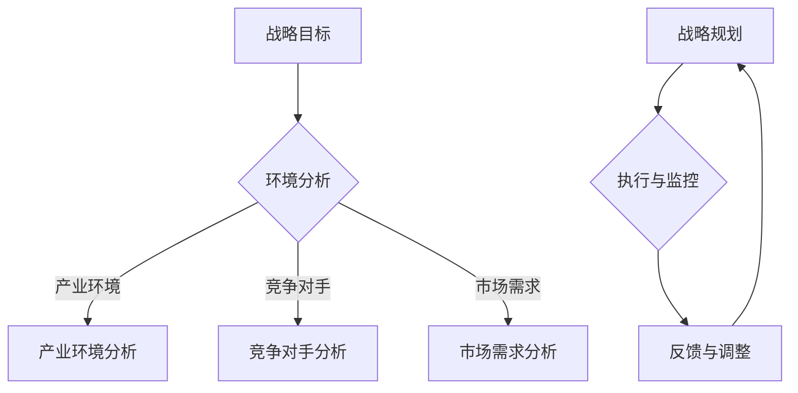
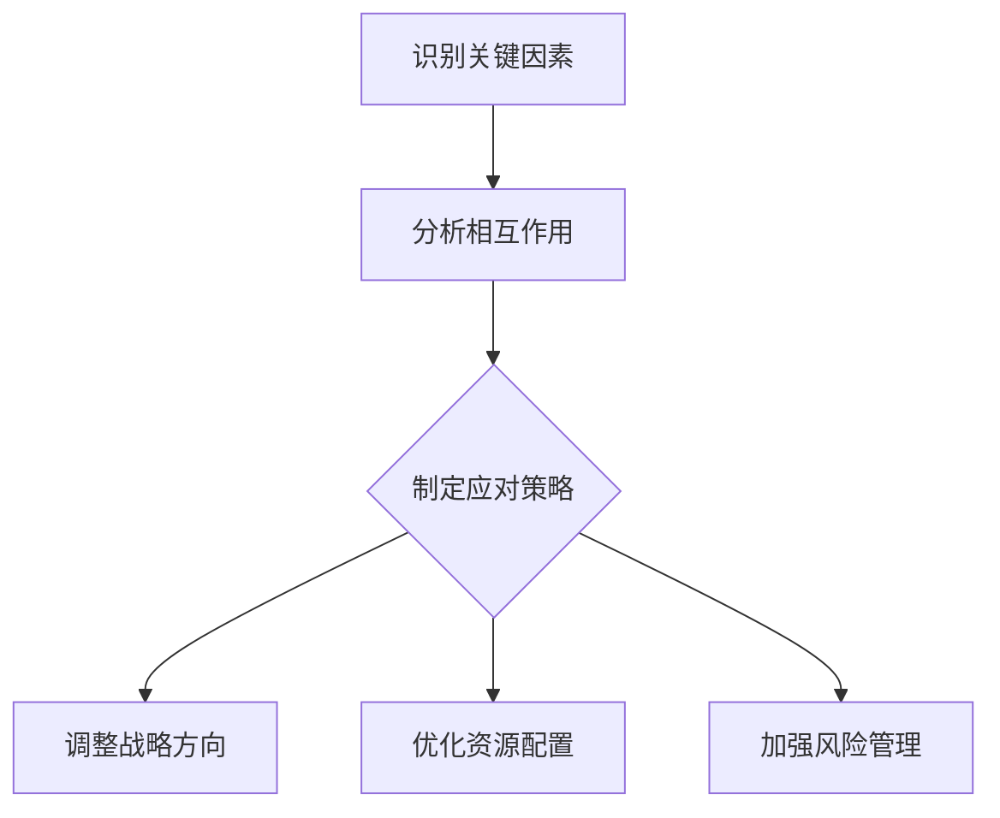
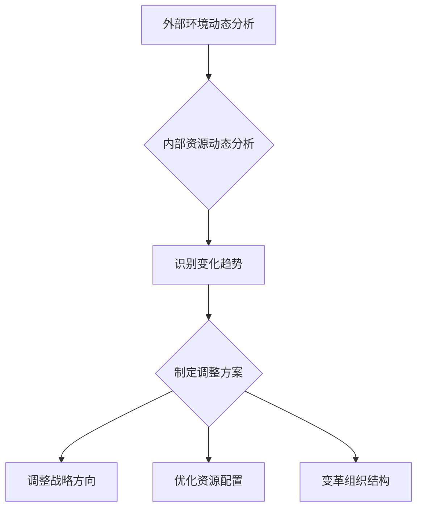
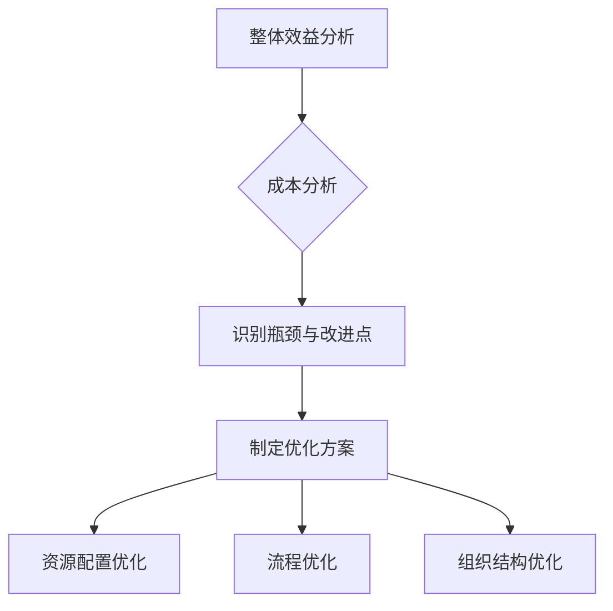
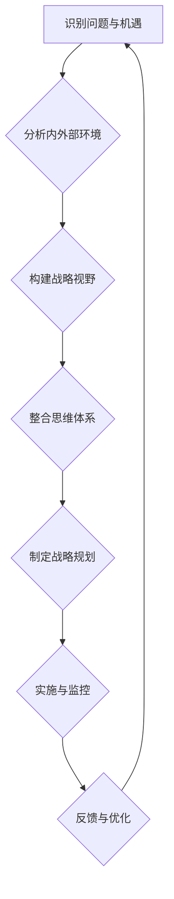
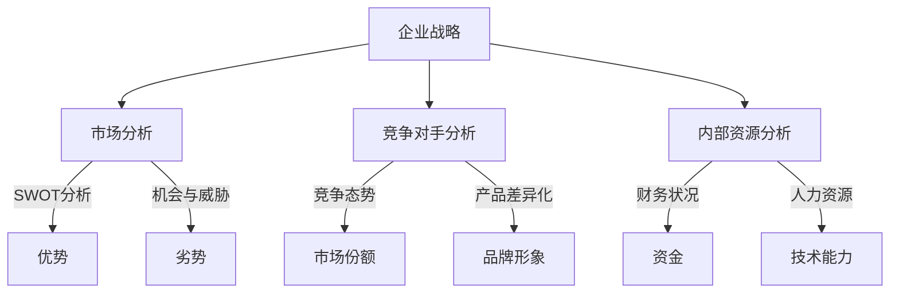
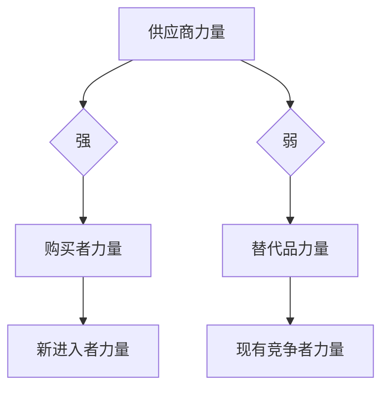

                 

### 思维体系概述

#### 第一部分：思维体系的概念与类型

思维体系，即一套系统化的思考方法，它不仅涵盖了个体认知的多个维度，还涉及了处理信息、解决问题和制定决策的多种策略。在这一部分，我们将详细探讨思维体系的定义、主要类型，以及它们对管理者战略视野的重要影响。

##### 1.1 思维体系的基本概念

首先，我们需要明确什么是思维。思维是人类大脑处理信息、解决问题和进行推理的过程。根据不同的分类标准，思维可以被分为多种类型，例如逻辑思维、形象思维、创新思维等。思维体系则是对这些思维类型的系统化和体系化，使其成为一个整体，为管理者在复杂环境中做出科学、合理的决策提供理论依据和实践指导。

###### 1.1.1 思维的定义与分类

思维的定义涉及多个层面。从认知心理学的角度来看，思维是人类大脑对信息进行加工、整合和运用的过程。根据不同的功能和特点，思维可以分为以下几种类型：

- **逻辑思维**：以逻辑规则为基础，通过推理和演绎来解决问题。
- **形象思维**：通过形象和直觉来理解问题，强调感知和直观。
- **创新思维**：强调新颖性和创造性，通过独特的视角和思路来解决问题。
- **系统思维**：关注整体和部分之间的关系，强调整体优化。
- **辩证思维**：强调对立统一和动态发展，通过分析矛盾来解决问题。

不同类型的思维在管理者的战略视野中发挥着独特的作用，如何有效地运用这些思维类型是构建战略视野的关键。

###### 1.1.2 思维体系的概念

思维体系是一个包含多种思维类型的综合体，它不仅包括上述的各种思维类型，还包括将这些思维类型有机结合在一起的方法和原则。一个完善的思维体系应具备以下特征：

- **系统性**：将各种思维类型整合为一个统一的整体，形成系统化的思考框架。
- **动态性**：能够根据外部环境和内部需求的变化，灵活调整和优化。
- **综合性**：不仅关注单一维度的优化，还强调各个维度之间的协同作用。
- **实践性**：紧密结合实际管理活动，指导管理者做出科学合理的决策。

思维体系作为管理者的核心能力之一，对战略视野的构建具有深远的影响。一个良好的思维体系不仅能够提升管理者的决策能力，还能提高组织的整体效能。

##### 1.2 主要思维体系类型

在了解了思维体系的基本概念后，接下来我们将探讨几种主要的思维体系类型，包括系统思维、创新思维和情境思维，并分析它们在构建战略视野中的作用。

###### 1.2.1 系统思维

系统思维是一种全面的、整体的思维方式，它强调从系统的角度来分析和解决问题。系统思维的基本原理包括：

- **整体性**：关注系统内部各个组成部分之间的相互作用和影响。
- **动态性**：认识到系统是不断变化的，需要动态调整和优化。
- **反馈性**：系统内部各部分的相互作用会产生反馈，影响系统的整体表现。

在管理实践中，系统思维有助于管理者全面了解企业所处的环境，分析企业内部各个部门、环节之间的相互关系，从而制定出科学合理的战略规划。

###### 1.2.2 创新思维

创新思维是一种以创造性为核心，强调突破传统、寻求新颖解决方案的思维方式。创新思维的特点包括：

- **新颖性**：追求与众不同的、独特的思路和方法。
- **灵活性**：能够在不同的情境下快速适应和创新。
- **开放性**：愿意接受新的想法和观点，不断拓展思维的边界。

创新思维在战略视野的构建中起着至关重要的作用。管理者通过运用创新思维，可以发掘新的市场机会，开发新产品和服务，从而保持企业的持续竞争力。

###### 1.2.3 情境思维

情境思维是一种以情境为核心，强调根据不同情境调整策略的思维方式。情境思维的基本原理包括：

- **情境依赖性**：认识到不同情境下需要不同的策略和方法。
- **动态适应性**：能够根据情境的变化灵活调整和优化策略。
- **情境分析**：深入分析情境因素，制定针对性的解决方案。

在战略视野的构建过程中，情境思维有助于管理者准确把握外部环境和内部资源的动态变化，从而做出快速反应和调整，提高企业的应变能力。

##### 1.3 思维体系与管理者战略视野的关系

思维体系是构建管理者战略视野的基础，它不仅决定了管理者对问题的认知和理解，还直接影响决策的科学性和合理性。具体来说，思维体系与管理者战略视野的关系可以从以下几个方面进行阐述：

- **思维体系对战略视野的影响**：思维体系决定了管理者看待问题的角度和方法，进而影响战略视野的广度和深度。一个完善的思维体系可以帮助管理者从全局出发，全面分析企业内外部的各种因素，制定出具有前瞻性和可行性的战略规划。

- **建立战略视野的思维能力**：建立战略视野需要一系列的思维能力，如系统思维、创新思维和情境思维等。管理者需要通过不断学习和实践，培养和提高这些思维能力，从而构建出强大的战略视野。

综上所述，思维体系是管理者构建战略视野的重要工具和手段。一个良好的思维体系不仅能够提升管理者的决策能力，还能为企业的长远发展提供坚实的理论基础和实践指导。

### 战略视野的核心要素

在构建管理者战略视野的过程中，明确战略视野的核心要素是至关重要的。这些核心要素不仅构成了战略视野的基本框架，还提供了管理者分析和决策的重要依据。以下是战略视野的三个基本要素：产业环境分析、竞争对手分析和市场需求分析。

#### 2.1 战略视野的基本要素

##### 2.1.1 产业环境分析

产业环境分析是战略视野构建的基础，它涉及到对行业发展趋势、市场规模、竞争格局以及政策法规等外部环境的全面了解。通过产业环境分析，管理者可以把握行业的基本态势，发现潜在的机遇和挑战。

- **行业发展趋势**：分析行业的技术创新、市场规模、增长速度等关键指标，预测未来的发展方向。
- **市场规模**：评估行业整体市场规模和潜在市场，为企业的战略定位提供数据支持。
- **竞争格局**：分析行业内的主要竞争对手，了解他们的市场地位、竞争策略和市场占有率，从而制定出有针对性的应对策略。
- **政策法规**：了解国家和地区的政策法规，尤其是那些对行业有重大影响的法规，如税收政策、环保法规等。

##### 2.1.2 竞争对手分析

竞争对手分析是战略视野构建的重要环节，它涉及到对行业内主要竞争对手的全面了解和评估。通过竞争对手分析，管理者可以明确自身的竞争优势和劣势，从而制定出有效的竞争策略。

- **竞争对手的市场地位**：分析竞争对手在市场中的地位，包括市场份额、品牌影响力等。
- **竞争对手的竞争策略**：了解竞争对手的市场策略，如产品策略、定价策略、营销策略等，从中吸取经验教训。
- **竞争对手的优劣势**：分析竞争对手的优劣势，包括技术实力、管理能力、市场响应速度等，为自身的战略规划提供参考。

##### 2.1.3 市场需求分析

市场需求分析是战略视野构建的关键要素，它涉及到对消费者需求、市场趋势和潜在客户群的全面了解。通过市场需求分析，管理者可以准确把握市场需求，为产品开发、市场定位和营销策略提供依据。

- **消费者需求**：分析消费者的需求和偏好，包括需求特征、消费习惯、购买意愿等。
- **市场趋势**：了解市场的发展趋势，如新技术的应用、消费者行为的变化等，从而把握市场发展的方向。
- **潜在客户群**：识别和评估潜在客户群，包括他们的需求、购买力和潜在市场规模。

#### 2.2 构建战略视野的步骤

构建战略视野需要一系列系统化的步骤，以下为构建战略视野的三个主要步骤：

##### 2.2.1 明确企业愿景与使命

明确企业愿景与使命是构建战略视野的首要步骤。企业愿景是对企业未来发展方向和目标的描述，而企业使命则是企业存在的根本目的和意义。通过明确愿景与使命，管理者可以确立企业的战略方向，为后续的战略规划提供指导。

- **制定企业愿景**：描述企业长期发展的目标，如成为行业的领导者、实现全球市场覆盖等。
- **制定企业使命**：明确企业的社会责任和商业目标，如为客户提供优质产品、为社会创造价值等。

##### 2.2.2 设定长期与短期目标

在明确企业愿景与使命的基础上，管理者需要设定长期和短期目标。长期目标通常涉及企业的发展战略，如市场份额扩大、产品线拓展等；而短期目标则更具体，如提高产品质量、降低生产成本等。通过设定长期与短期目标，管理者可以明确企业的行动方向和优先级。

- **设定长期目标**：基于企业愿景和使命，制定企业中长期的发展战略和目标。
- **设定短期目标**：为实现长期目标，制定具体的短期目标，如年度经营计划、季度目标等。

##### 2.2.3 制定战略规划与执行方案

战略规划与执行方案是将企业愿景、使命和目标转化为具体行动的蓝图。通过制定战略规划，管理者可以明确企业的战略方向和路径，并通过执行方案确保战略的有效实施。

- **制定战略规划**：根据长期和短期目标，制定具体的战略规划和行动方案，包括市场开发、产品研发、营销策略等。
- **制定执行方案**：为保障战略规划的实施，制定详细的执行方案，包括责任分配、时间节点、资源调配等。

通过上述三个步骤，管理者可以系统地构建战略视野，为企业的长远发展提供坚实的基础。同时，这也有助于提高管理者的决策能力，确保企业能够在复杂多变的市场环境中保持竞争优势。

### 苹果公司的战略视野分析

在科技行业中，苹果公司无疑是一个标杆。其成功不仅得益于卓越的产品设计，更重要的是其在战略视野上的前瞻性和精准性。本文将通过对苹果公司的产业环境、竞争对手和市场需求进行详细分析，来探讨其战略视野的构建过程。

#### 3.1 苹果公司的产业环境分析

苹果公司所处的产业环境非常复杂，涵盖了硬件制造、软件开发、内容服务等多个领域。从行业发展趋势来看，苹果公司主要受到以下几个因素的影响：

- **技术创新**：苹果公司一直致力于推动技术创新，尤其是在硬件和软件方面。例如，苹果公司在智能手机领域推出了刘海屏、Face ID 等创新设计，同时在软件方面不断优化操作系统，提高用户体验。
- **市场竞争**：科技行业竞争激烈，苹果公司面临来自三星、华为等国内外竞争对手的挑战。这些竞争对手在产品性能、价格和市场份额方面都有一定的优势，迫使苹果公司不断优化产品和服务，以保持市场竞争力。
- **政策法规**：全球范围内的政策法规对苹果公司的业务运营也有重要影响。例如，美国的贸易政策对苹果公司出口和进口都有一定的限制，而欧盟的数据隐私法规也对苹果公司的数据管理提出了更高的要求。

在市场规模方面，苹果公司主要关注全球智能手机市场和个人电脑市场。根据市场研究公司的数据，全球智能手机市场近年来保持了稳定的增长，而个人电脑市场则呈现下降趋势。尽管如此，苹果公司在这些市场中仍然具有很高的市场份额和品牌影响力。

#### 3.2 苹果公司的竞争对手分析

苹果公司的主要竞争对手包括三星、华为、小米等国内外知名科技企业。这些竞争对手在市场地位、竞争策略和市场占有率等方面都有其独特之处：

- **三星**：作为全球最大的智能手机制造商，三星在技术创新和市场布局方面具有优势。三星在硬件技术上不断突破，推出了一系列高端智能手机，同时在市场份额方面与苹果公司争夺全球领先地位。
- **华为**：华为在智能手机市场表现出色，尤其是在中国市场占据了重要地位。华为通过技术创新和本地化营销策略，成功扩大了市场份额。此外，华为还在5G技术方面取得了重大突破，为其未来发展奠定了坚实基础。
- **小米**：小米作为新兴科技企业，以其高性价比产品迅速崛起。小米通过互联网营销和生态链企业合作，实现了快速的市场扩张。尽管小米在高端市场与苹果公司存在差距，但其在大众市场中的竞争力不容忽视。

#### 3.3 苹果公司的市场需求分析

苹果公司的市场需求分析主要关注消费者需求、市场趋势和潜在客户群。以下是苹果公司市场需求分析的几个关键点：

- **消费者需求**：苹果公司的产品定位主要是高端市场，消费者对于其产品有较高的品牌忠诚度和购买意愿。消费者对苹果产品的需求主要集中在以下几个方面：设计时尚、性能强大、系统稳定和安全可靠。
- **市场趋势**：随着科技的发展，消费者对智能手机和个人电脑的需求不断变化。例如，随着5G技术的普及，消费者对高速网络和高效处理能力的要求越来越高。此外，消费者对智能穿戴设备和智能家居产品的需求也在不断增长。
- **潜在客户群**：苹果公司的潜在客户群主要包括高端消费者、科技爱好者和商务人士。这些消费者对于产品品质和用户体验有较高的要求，他们对苹果品牌的认可度也较高。

通过上述分析，我们可以看出苹果公司战略视野的构建是基于对产业环境、竞争对手和市场需求的多维度、系统化分析。苹果公司通过不断创新、精准市场定位和前瞻性战略规划，成功保持了其市场领先地位。这种战略视野不仅为苹果公司带来了持续的增长和成功，也为其他企业提供了宝贵的经验和借鉴。

### 谷歌公司的战略视野分析

谷歌公司，作为全球领先的科技巨头，其战略视野的构建同样具有前瞻性和系统性。本文将通过对谷歌公司的产业环境、竞争对手和市场需求进行详细分析，来探讨谷歌公司的战略视野构建过程。

#### 3.1 谷歌公司的产业环境分析

谷歌公司所处的产业环境非常复杂，涵盖了搜索引擎、云计算、人工智能、广告技术等多个领域。从行业发展趋势来看，谷歌公司主要受到以下几个因素的影响：

- **技术创新**：谷歌公司在技术创新方面一直处于领先地位，特别是在人工智能和云计算领域。谷歌通过不断投入研发，推出了一系列创新产品和服务，如TensorFlow、Google Cloud等，为公司的未来发展奠定了坚实基础。
- **市场竞争**：科技行业的竞争激烈，谷歌公司面临来自微软、亚马逊、Facebook等科技巨头的竞争。这些竞争对手在技术实力、市场布局和用户基数方面都有一定的优势，迫使谷歌公司不断优化产品和服务，以保持市场竞争力。
- **政策法规**：全球范围内的政策法规对谷歌公司的业务运营也有重要影响。例如，欧盟的数据隐私法规（GDPR）对美国科技公司的全球业务产生了较大影响，而美国的贸易政策也对谷歌公司的海外业务产生了一定限制。

在市场规模方面，谷歌公司主要关注全球互联网市场、云计算市场和人工智能市场。根据市场研究公司的数据，全球互联网市场规模持续增长，而云计算和人工智能市场则呈现爆炸式增长。尽管面临激烈的市场竞争，谷歌公司在这些市场中仍然具有很高的市场份额和品牌影响力。

#### 3.2 谷歌公司的竞争对手分析

谷歌公司的主要竞争对手包括微软、亚马逊、Facebook等全球知名科技企业。这些竞争对手在市场地位、竞争策略和市场占有率等方面都有其独特之处：

- **微软**：微软在云计算、办公软件和操作系统领域具有优势。微软通过不断扩展Azure云服务和Office 365办公软件，成功占据了大量市场份额。此外，微软在人工智能领域也取得了显著进展，与谷歌形成了有力的竞争。
- **亚马逊**：亚马逊在云计算市场表现出色，其AWS云服务在全球范围内具有很高的市场份额。亚马逊还在电商、物流和人工智能领域有所布局，通过多元化业务模式提升了市场竞争力。
- **Facebook**：Facebook在社交媒体和广告技术领域具有明显优势。Facebook通过不断优化其广告平台，为广告主提供精准投放和数据分析服务，从而实现了稳定的收入增长。

#### 3.3 谷歌公司的市场需求分析

谷歌公司的市场需求分析主要关注消费者需求、市场趋势和潜在客户群。以下是谷歌公司市场需求分析的几个关键点：

- **消费者需求**：谷歌公司的产品和服务主要面向全球消费者，消费者对谷歌的需求主要集中在以下几个方面：搜索引擎功能强大、云计算服务高效可靠、人工智能应用便捷实用。
- **市场趋势**：随着互联网技术的快速发展，消费者对高质量、智能化和便捷化的产品和服务需求不断增加。例如，5G技术的普及推动了移动互联网的快速发展，为谷歌提供了新的市场机遇；人工智能技术的应用场景不断拓展，为谷歌提供了广阔的市场空间。
- **潜在客户群**：谷歌的潜在客户群主要包括全球企业和个人用户。这些客户对谷歌的搜索引擎、云计算和人工智能产品有较高的需求，尤其是在企业级市场和消费市场。

通过上述分析，我们可以看出谷歌公司战略视野的构建是基于对产业环境、竞争对手和市场需求的多维度、系统化分析。谷歌公司通过持续创新、精准市场定位和前瞻性战略规划，成功保持了其市场领先地位。这种战略视野不仅为谷歌公司带来了持续的增长和成功，也为其他企业提供了宝贵的经验和借鉴。

### 系统思维的运用

系统思维是一种全面的、整体的思维方式，强调从系统的角度来分析和解决问题。在战略视野的构建过程中，系统思维发挥着至关重要的作用，能够帮助管理者更好地理解企业内外部的复杂关系，从而制定出科学合理的战略规划。以下是系统思维的基本原理和其在战略视野中的应用。

#### 4.1 系统思维的基本原理

系统思维的核心原则包括整体性、动态性和反馈性。

- **整体性**：系统思维强调将研究对象视为一个整体，关注系统内部各个组成部分之间的相互作用和影响。管理者需要从全局出发，全面分析企业的各项业务、部门以及合作伙伴之间的关系，从而制定出协调一致的策略。

- **动态性**：系统思维认识到系统是不断变化的，强调根据外部环境和内部需求的变化，动态调整和优化系统。管理者需要密切关注市场环境的变化，以及企业内部资源、能力的变动，及时调整战略方向和实施计划。

- **反馈性**：系统思维关注系统内部各部分之间的相互作用和反馈，认识到系统的运行状态会受到各部分反馈的影响。管理者需要通过有效的反馈机制，收集和分析各种信息，对战略实施效果进行评估和调整，确保战略目标得以实现。

#### 4.2 系统思维在战略视野中的应用

在战略视野的构建过程中，系统思维可以帮助管理者从以下几个方面进行深入分析和规划：

- **复杂性分析**：系统思维能够帮助管理者识别和分析系统中的复杂性。管理者需要深入了解企业内外部的各种因素，如市场竞争、政策法规、技术变革等，以及这些因素之间的相互作用，从而制定出应对复杂性的策略。

- **动态分析**：系统思维强调系统的动态性，管理者需要关注外部环境和内部资源的动态变化，以及这些变化对系统运行状态的影响。通过动态分析，管理者可以及时调整战略规划，确保企业在不断变化的市场环境中保持竞争优势。

- **系统优化**：系统思维强调整体优化，管理者需要从系统层面出发，综合考虑各个部分的效益和成本，进行系统优化。管理者可以通过资源配置、流程优化、组织变革等手段，提高企业的整体运行效率，实现战略目标的最佳实现。

以下是一个简单的Mermaid流程图，展示了系统思维在战略视野构建中的应用：



在这个流程图中，战略目标是构建战略视野的起点，通过环境分析（包括产业环境、竞争对手和市场需求分析）来制定战略规划。执行与监控阶段，管理者需要根据实际情况对战略规划进行调整和优化，确保战略目标的实现。

#### 4.3 复杂性分析

复杂性分析是系统思维在战略视野中的应用之一。在复杂系统中，各种因素相互交织、相互作用，导致系统行为具有不可预测性和不确定性。管理者需要通过复杂性分析，识别系统中的关键因素，理解它们之间的相互关系，从而制定出有效的应对策略。

- **关键因素识别**：管理者需要识别系统中的关键因素，包括市场竞争、技术变革、政策法规等。这些关键因素对系统的运行状态具有重要影响，是制定战略规划的重要依据。

- **相互作用分析**：管理者需要分析关键因素之间的相互作用，理解它们如何相互影响，以及这些相互作用对系统整体行为的影响。通过相互作用分析，管理者可以更好地把握系统的复杂性，为战略规划提供指导。

- **应对策略制定**：基于关键因素识别和相互作用分析，管理者可以制定出针对复杂性的应对策略。这些策略包括调整战略方向、优化资源配置、加强风险管理等，以确保企业在复杂环境中保持竞争优势。

以下是一个简单的Mermaid流程图，展示了复杂性分析在战略视野构建中的应用：



在这个流程图中，管理者首先识别系统中的关键因素，然后分析这些关键因素之间的相互作用，并根据分析结果制定出应对策略，包括调整战略方向、优化资源配置和加强风险管理等。

#### 4.4 动态分析

动态分析是系统思维在战略视野构建中的另一个重要应用。在动态分析中，管理者需要关注外部环境和内部资源的动态变化，以及这些变化对系统运行状态的影响。通过动态分析，管理者可以及时调整战略规划，确保企业在不断变化的市场环境中保持竞争优势。

- **外部环境动态分析**：管理者需要关注外部环境的动态变化，如市场竞争、政策法规、技术变革等。这些变化可能对企业的战略方向和实施计划产生重大影响，管理者需要及时识别和应对这些变化。

- **内部资源动态分析**：管理者还需要关注内部资源的动态变化，如人力资源、财务资源、技术资源等。这些资源的变动可能影响企业的运营效率和战略实施效果，管理者需要通过动态分析，合理配置和利用内部资源。

- **战略调整**：基于外部环境和内部资源的动态分析，管理者需要及时调整战略规划，确保企业能够应对变化，保持竞争优势。战略调整可能涉及战略方向的调整、资源配置的优化、组织结构的变革等。

以下是一个简单的Mermaid流程图，展示了动态分析在战略视野构建中的应用：



在这个流程图中，管理者首先分析外部环境和内部资源的动态变化，识别变化趋势，然后根据分析结果制定调整方案，包括调整战略方向、优化资源配置和变革组织结构等。

#### 4.5 系统优化

系统优化是系统思维在战略视野构建中的最后一个重要应用。在系统优化中，管理者需要从整体出发，综合考虑各个部分的效益和成本，进行系统优化。通过系统优化，管理者可以提高企业的整体运行效率，实现战略目标的最佳实现。

- **整体效益分析**：管理者需要分析系统各个部分的效益，了解各部分对企业整体效益的贡献。通过整体效益分析，管理者可以识别出系统的瓶颈和改进点。

- **成本分析**：管理者还需要分析系统各个部分的成本，了解各部分的成本结构。通过成本分析，管理者可以找出成本较高的环节，制定降低成本的措施。

- **优化方案制定**：基于整体效益分析和成本分析，管理者可以制定系统优化方案。优化方案可能包括资源配置优化、流程优化、组织结构优化等，以提高企业的整体运行效率。

以下是一个简单的Mermaid流程图，展示了系统优化在战略视野构建中的应用：



在这个流程图中，管理者首先分析系统的整体效益和成本，识别系统的瓶颈和改进点，然后根据分析结果制定优化方案，包括资源配置优化、流程优化和组织结构优化等。

通过系统思维的运用，管理者可以更好地理解企业内外部的复杂关系，制定出科学合理的战略规划，从而在复杂多变的市场环境中保持竞争优势。

### 创新思维的培养

创新思维是一种以创造性为核心，强调突破传统、寻求新颖解决方案的思维方式。在战略视野的构建过程中，创新思维发挥着至关重要的作用，能够帮助管理者发现新的市场机会，开发新产品和服务，优化企业流程，从而提升企业的竞争力。

#### 5.1 创新思维的定义与特点

创新思维，顾名思义，是一种注重创新的思维方式。它不仅仅是简单地提出新的想法，更重要的是通过创新的方法和工具，将这样新的想法转化为实际的产品和服务，从而创造价值。

创新思维的特点包括：

- **新颖性**：创新思维追求的是独特性和新颖性。这意味着在解决问题时，创新思维不仅关注现有方法的有效性，更注重寻找新的、更优的解决方案。

- **灵活性**：创新思维强调在不同情境下快速适应和调整。它能够根据外部环境和内部需求的变化，灵活地调整思路和方法。

- **开放性**：创新思维鼓励接受新的想法和观点，不断拓展思维的边界。它不拘泥于传统观念，愿意尝试不同领域、不同方法，以实现创新目标。

- **系统性**：创新思维不仅关注单一的创新点，还强调系统的、全面的创新。它通过整合各种资源、知识和能力，构建起一个创新的整体框架。

#### 5.2 创新思维在战略视野中的运用

在战略视野的构建过程中，创新思维可以应用于以下几个方面：

##### 5.2.1 发现新市场机会

创新思维能够帮助管理者发现新的市场机会。通过创新的方法和工具，管理者可以从不同角度审视市场和行业，发掘潜在的、未被满足的需求。以下是一些常用的方法：

- **头脑风暴**：通过集体讨论，激发团队成员的创意思维，产生大量的新想法。这些想法可以是关于新产品、新市场或新业务模式。

- **用户研究**：深入了解目标用户的需求和行为，从用户的角度出发，发现潜在的市场机会。用户研究可以通过访谈、问卷调查、观察等方法进行。

- **市场趋势分析**：分析行业和市场的发展趋势，寻找新兴市场或细分市场。例如，随着5G技术的普及，物联网市场有望快速增长。

##### 5.2.2 开发新产品与服务

创新思维在开发新产品和服务方面同样重要。通过创新思维，管理者可以突破传统的产品开发模式，创造出具有独特价值和竞争力的产品和服务。以下是一些常用的方法：

- **原型设计**：快速构建产品的原型，通过迭代和用户反馈，不断优化产品设计和功能。原型设计有助于降低产品开发风险，提高市场适应性。

- **跨界合作**：与其他行业或领域的公司进行合作，整合各自的优势资源，共同开发新产品和服务。例如，科技公司与医疗公司合作开发智能医疗设备。

- **开放式创新**：通过开放平台，鼓励外部创新者和开发者参与产品开发。这种方式可以吸引更多的创意和技术，加快产品开发进程。

##### 5.2.3 优化企业流程

创新思维不仅适用于产品和服务开发，还可以应用于企业流程的优化。通过创新思维，管理者可以识别和改进现有流程中的问题和瓶颈，提高企业的运营效率。以下是一些常用的方法：

- **流程重组**：对现有的业务流程进行全面评估和重新设计，以实现流程的优化和效率提升。流程重组可能涉及组织结构、工作流程、技术工具等多方面的改进。

- **精益管理**：通过消除浪费、优化流程，提高企业的运营效率和质量。精益管理强调以客户需求为导向，持续改进，不断优化流程。

- **敏捷开发**：在软件开发领域，敏捷开发方法强调快速迭代、灵活调整，以提高开发效率和产品质量。敏捷开发方法可以应用于企业的各项业务流程，提高响应速度和创新能力。

#### 5.3 培养创新思维的方法

要培养创新思维，管理者需要采取一系列措施，从组织文化、培训和学习、激励机制等方面入手，为员工创造一个有利于创新的环境。

- **组织文化**：建立鼓励创新、容忍失败的组织文化。管理者应倡导创新思维，鼓励员工勇于尝试新的方法和思路。

- **培训和学习**：提供创新思维相关的培训和学习资源，帮助员工掌握创新方法和工具。例如，可以通过内部培训、外部研讨会、在线课程等方式，提升员工的创新素养。

- **激励机制**：建立激励机制，奖励创新行为和成果。例如，可以设立创新奖项、提供额外的绩效奖金、晋升机会等，激发员工的创新热情。

- **协作与交流**：鼓励团队合作和跨部门交流，促进知识共享和思维碰撞。通过团队合作，可以激发更多的创意和创新点。

通过上述方法，管理者可以有效地培养和激发员工的创新思维，为企业的战略视野构建提供源源不断的创新动力。

### 情境思维的实践

情境思维是一种以情境为核心，强调根据不同情境调整策略的思维方式。在战略视野的构建过程中，情境思维能够帮助管理者更好地应对不确定性、处理复杂环境，并灵活调整策略，从而在动态变化的市场环境中保持竞争优势。

#### 6.1 情境思维的概念与原理

情境思维，又称为情境意识或情境分析，指的是在决策过程中，管理者需要根据具体情境，考虑各种相关因素，包括外部环境、内部资源、市场趋势等，从而制定出适应特定情境的解决方案。情境思维的核心原则包括情境依赖性、动态适应性和情境分析。

- **情境依赖性**：情境思维强调决策的情境依赖性，即不同情境下需要采取不同的策略和方法。管理者需要根据具体情境，分析各种因素之间的关系，从而制定出具有针对性的策略。

- **动态适应性**：情境思维强调动态适应性，即管理者需要根据外部环境和内部资源的变化，灵活调整和优化策略。这种动态适应性能够帮助管理者及时应对市场变化，保持竞争优势。

- **情境分析**：情境思维强调情境分析，即管理者需要对特定情境进行全面分析和评估。通过情境分析，管理者可以识别出关键因素，明确决策的方向和重点。

#### 6.2 情境思维在战略视野中的应用

在战略视野的构建过程中，情境思维可以帮助管理者从以下几个方面进行实践：

##### 6.2.1 应对不确定性

在复杂多变的市场环境中，不确定性是管理者面临的主要挑战之一。情境思维能够帮助管理者更好地应对不确定性，以下是一些具体方法：

- **情景规划**：通过情景规划，管理者可以预测未来可能出现的各种情景，并制定相应的应对策略。情景规划包括识别可能的关键因素、评估情景发生的概率和影响，以及制定应对措施。

- **风险分析**：情境思维强调对风险进行全面分析，包括识别风险、评估风险的影响和概率，以及制定风险管理策略。通过风险分析，管理者可以提前识别潜在风险，并采取预防措施。

- **弹性规划**：情境思维提倡弹性规划，即在制定战略规划时，考虑多种可能性，并为不同情境下的调整留有余地。这种弹性规划能够帮助企业在不确定性中保持稳定和持续发展。

##### 6.2.2 处理复杂环境

在复杂环境中，管理者需要处理多种因素之间的相互作用和影响。情境思维能够帮助管理者更好地处理复杂环境，以下是一些具体方法：

- **系统分析**：情境思维强调系统分析，即从整体和系统的角度来分析和解决问题。通过系统分析，管理者可以识别出系统中的关键因素，理解它们之间的相互作用，从而制定出更有效的解决方案。

- **多因素权衡**：情境思维强调多因素权衡，即管理者需要综合考虑各种因素，包括成本、风险、效益等，进行权衡和取舍。通过多因素权衡，管理者可以做出更全面、科学的决策。

- **动态调整**：情境思维强调动态调整，即根据实际情况的变化，及时调整战略规划。通过动态调整，管理者可以适应复杂环境的变化，保持竞争优势。

##### 6.2.3 灵活调整策略

在动态变化的市场环境中，管理者需要具备灵活调整策略的能力。情境思维能够帮助管理者实现这一目标，以下是一些具体方法：

- **情境模拟**：通过情境模拟，管理者可以模拟不同的情境，评估不同策略的效果，从而制定出更适应特定情境的解决方案。情境模拟有助于管理者提前预测情境变化，为实际操作做好准备。

- **敏捷管理**：情境思维强调敏捷管理，即通过快速响应和调整，适应市场变化。敏捷管理强调灵活性和适应性，能够帮助企业更快地调整战略，抓住市场机遇。

- **持续改进**：情境思维提倡持续改进，即不断收集和分析反馈信息，对策略进行调整和优化。通过持续改进，管理者可以不断优化策略，提高企业的运营效率和竞争力。

通过情境思维的实践，管理者能够更好地应对不确定性、处理复杂环境，并灵活调整策略，从而在动态变化的市场环境中保持竞争优势。情境思维不仅为管理者的决策提供了理论依据，也为企业的战略规划提供了实践指导。

### 战略视野评估方法

在构建战略视野的过程中，有效的评估方法至关重要。评估不仅能够帮助管理者验证战略规划的有效性，还能发现潜在问题，为后续调整和优化提供依据。以下是几种常见的战略视野评估方法，包括SWOT分析、波士顿矩阵和五力模型。

#### 7.1 战略视野评估的原则

在进行战略视野评估时，管理者需要遵循以下原则：

- **客观性原则**：评估过程应尽量客观，避免主观偏见和情感因素的影响。
- **全面性原则**：评估应覆盖战略视野的各个方面，包括内部和外部环境、竞争优势和劣势等。
- **动态性原则**：战略视野的评估应是一个持续的过程，需要根据环境变化和业务发展进行调整。

#### 7.2 战略视野评估的工具与方法

以下介绍几种常用的战略视野评估工具与方法：

##### 7.2.1 SWOT分析

SWOT分析是一种常用的战略评估工具，用于分析企业的优势（Strengths）、劣势（Weaknesses）、机会（Opportunities）和威胁（Threats）。

- **优势（Strengths）**：分析企业内部的优势，如技术优势、市场地位、品牌影响力等。
- **劣势（Weaknesses）**：识别企业内部存在的劣势，如管理不善、资源不足、创新能力不足等。
- **机会（Opportunities）**：分析外部环境中存在的机遇，如市场增长、技术创新、政策支持等。
- **威胁（Threats）**：识别外部环境中可能对企业构成威胁的因素，如竞争对手的崛起、政策变化、市场波动等。

SWOT分析的目的是帮助企业明确自身的优势和劣势，抓住机遇，应对威胁，从而制定出更加科学合理的战略规划。

##### 7.2.2 波士顿矩阵

波士顿矩阵是一种用于评估企业产品或业务组合的方法，通过将产品或业务分为四个象限，帮助企业确定资源配置和战略方向。

- **明星业务（Stars）**：位于波士顿矩阵的右上角，代表高增长、高市场份额的业务。这类业务是企业的重点投资对象，需要继续扩大市场份额和提升竞争力。
- **现金牛业务（Cash Cows）**：位于波士顿矩阵的左上角，代表低增长、高市场份额的业务。这类业务为企业的现金流提供了稳定的支持，需要维持市场份额并控制成本。
- **问题业务（Question Marks）**：位于波士顿矩阵的右上角，代表高增长、低市场份额的业务。这类业务具有潜力，但风险较大，企业需要评估是否继续投入资源以提升市场份额。
- **瘦狗业务（Dogs）**：位于波士顿矩阵的左下角，代表低增长、低市场份额的业务。这类业务通常不具有投资价值，企业可以考虑减少或退出相关业务。

波士顿矩阵可以帮助企业合理配置资源，优化业务组合，提升整体竞争力。

##### 7.2.3 五力模型

五力模型是由迈克尔·波特提出的一种用于分析行业竞争力的工具，通过分析行业中的五种竞争力量，评估企业的竞争地位。

- **供应商力量**：分析供应商的集中度、议价能力和行业影响力，评估供应商对企业成本和供应稳定性的影响。
- **购买者力量**：分析购买者的集中度、议价能力和购买行为，评估购买者对企业定价策略和市场影响力的制约。
- **替代品力量**：分析替代品的数量、质量和市场接受度，评估替代品对企业市场份额和利润的威胁。
- **新进入者力量**：分析新进入者的障碍、潜在竞争和行业反应，评估新进入者对市场格局的影响。
- **现有竞争者力量**：分析现有竞争者的数量、竞争策略和市场反应，评估现有竞争者对企业市场竞争地位的影响。

五力模型可以帮助企业了解行业竞争态势，制定相应的竞争策略，提升市场竞争力。

通过上述评估方法和原则，管理者可以全面、客观地评估战略视野的有效性，发现潜在问题，为战略调整和优化提供依据。

### 战略视野的调整与优化

在动态变化的市场环境中，战略视野的调整与优化是企业管理者必须面对的挑战。随着外部环境和内部资源的不断变化，管理者需要及时调整战略视野，以确保企业能够持续发展和保持竞争优势。以下是战略视野调整的原因、调整过程和调整后的实施方法。

#### 8.1 战略视野调整的原因

战略视野调整的原因主要包括以下几个方面：

- **外部环境变化**：外部环境的变化，如市场趋势、政策法规、技术变革等，可能对企业的战略规划产生重大影响。例如，全球疫情可能导致市场需求和供应链发生变化，管理者需要及时调整战略以应对这些变化。

- **内部资源变化**：企业内部资源的变动，如人力资源、财务状况、技术能力等，也可能影响战略视野的有效性。例如，企业财务状况的恶化可能导致无法实现既定的投资计划，需要调整战略以适应新的资源状况。

- **企业发展阶段变化**：企业的发展阶段变化，如从初创期进入成长期或成熟期，也会导致战略视野的调整。每个阶段都有不同的战略重点和目标，管理者需要根据发展阶段调整战略视野，以实现企业的长远发展。

#### 8.2 战略视野的调整过程

战略视野的调整过程通常包括以下几个步骤：

- **战略评估**：首先，管理者需要对现有战略视野进行评估，分析其效果和存在的问题。通过SWOT分析、波士顿矩阵、五力模型等工具，了解企业的优势、劣势、机会和威胁，以及行业竞争态势。

- **问题识别**：在战略评估的基础上，管理者需要识别出需要调整的具体问题。这些问题可能涉及市场定位、产品策略、竞争策略、资源分配等方面。

- **目标设定**：根据问题识别的结果，管理者需要设定新的战略目标。这些目标应具有明确性、可行性和前瞻性，能够指导企业在新的环境中实现持续发展。

- **方案制定**：在目标设定后，管理者需要制定具体的战略调整方案。方案应包括调整的方向、措施、时间表和责任人等，以确保战略调整的有序进行。

- **反馈与修正**：战略调整方案实施过程中，管理者需要不断收集反馈信息，对方案进行修正和优化。通过定期评估和调整，确保战略视野能够适应新的环境变化。

#### 8.3 战略视野的调整后的实施方法

战略视野调整后，管理者需要采取一系列措施确保战略的实施效果。以下是一些具体的实施方法：

- **资源配置**：根据调整后的战略目标，重新配置企业资源，包括人力资源、财务资源、技术资源等。通过优化资源配置，确保战略能够得到充分的支持和保障。

- **组织变革**：战略调整可能涉及组织结构的变革，如部门调整、职责划分、人员调配等。管理者需要根据战略需求，优化组织结构，以提高组织的灵活性和响应速度。

- **文化塑造**：战略调整需要企业的全体员工共同参与和支持。管理者需要通过文化塑造，建立与战略目标相一致的企业价值观和行为规范，增强员工的认同感和归属感。

- **激励机制**：为了激励员工积极参与战略实施，管理者需要建立合理的激励机制，包括绩效奖励、晋升机会等。通过激励机制，激发员工的积极性和创造力，确保战略目标的实现。

- **监控与评估**：战略调整后的实施过程需要持续监控和评估。管理者需要建立有效的监控和评估体系，定期检查战略实施情况，及时发现和解决存在的问题，确保战略目标的实现。

通过战略视野的调整与优化，企业管理者可以更好地应对外部环境的变化，优化内部资源配置，提升企业的核心竞争力，实现持续发展和成功。

### 思维体系与战略视野的整合

思维体系与战略视野的整合是企业管理者提升战略决策效率和增强企业竞争力的关键。通过将思维体系与战略视野有机结合，管理者可以在复杂多变的市场环境中做出科学、合理的决策，从而实现企业的长远发展。

#### 9.1 整合思维体系与战略视野的意义

整合思维体系与战略视野具有以下几个方面的意义：

- **提高战略决策效率**：思维体系提供了系统化、结构化的思考方法，可以帮助管理者快速分析问题、制定决策。通过整合思维体系与战略视野，管理者可以更高效地识别和应对市场变化，确保战略决策的及时性和有效性。

- **增强企业竞争力**：战略视野的构建需要全面的、多维度的分析，而思维体系则提供了不同类型的思维方式，如系统思维、创新思维和情境思维等。整合这些思维方式，管理者可以更好地把握市场机会、应对竞争挑战，从而提升企业的竞争力。

- **促进持续发展**：思维体系与战略视野的整合有助于企业不断优化和调整战略，以适应外部环境和内部资源的变化。这种动态调整和持续优化的能力，是企业在激烈的市场竞争中保持持续发展的关键。

#### 9.2 整合思维体系与战略视野的方法

为了实现思维体系与战略视野的有效整合，管理者可以采取以下方法：

- **建立协同工作机制**：整合思维体系与战略视野需要全员参与和协同合作。管理者应建立跨部门、跨层级的工作机制，鼓励员工积极参与战略思考和决策。通过定期召开战略研讨会、工作坊等形式，促进各部门之间的沟通与协作，共同推动战略的实施。

- **强化学习与培训**：思维体系和战略视野的构建需要管理者具备相应的知识和能力。管理者应重视学习和培训，不断提升自身的思维能力和战略管理能力。可以通过聘请外部专家进行培训、参加行业会议、阅读相关书籍和文章等方式，不断丰富知识和经验。

- **创新管理模式**：整合思维体系与战略视野要求企业采取灵活、创新的管理模式。管理者可以引入项目管理、敏捷管理、精益管理等现代管理方法，提高组织的响应速度和创新能力。通过建立快速反应机制，确保战略决策能够迅速转化为实际行动。

以下是一个简单的Mermaid流程图，展示了整合思维体系与战略视野的过程：



在这个流程图中，管理者首先识别问题和机遇，然后分析内外部环境，构建战略视野，整合思维体系，制定战略规划，实施并监控战略规划，根据反馈进行优化和调整，形成一个闭环的动态管理过程。

通过整合思维体系与战略视野，管理者可以更科学、合理地制定和实施战略规划，提升企业的战略决策效率和竞争力，实现企业的持续发展。

### 华为公司的实践

华为公司，作为全球领先的科技公司，其战略视野的构建和实践为其他企业提供了宝贵的经验和借鉴。本文将分析华为公司的思维体系、战略视野构建过程以及战略视野调整，以探讨其成功之道。

#### 10.1 华为公司的思维体系概述

华为公司的思维体系以“客户为中心”为核心，同时强调系统思维、创新思维和情境思维。

- **客户为中心**：华为公司始终坚持以客户需求为导向，通过深入了解客户需求，提供高质量的产品和服务。这种以客户为中心的思维体系，使得华为在激烈的市场竞争中始终保持领先地位。

- **系统思维**：华为公司强调从整体和系统的角度来分析和解决问题。在战略规划中，华为公司会综合考虑市场、技术、政策和人力资源等多个因素，确保战略的全面性和系统性。

- **创新思维**：华为公司重视创新，通过持续投入研发，推出了一系列具有领先地位的技术和产品。创新思维使得华为能够在科技领域保持领先地位，不断开拓新的市场机会。

- **情境思维**：华为公司具备较强的情境意识，能够根据外部环境和内部资源的变化，灵活调整战略方向和实施计划。这种情境思维使得华为在应对市场变化和竞争挑战时具有更高的适应性和灵活性。

#### 10.2 华为公司的战略视野构建

华为公司的战略视野构建是一个系统化、持续优化的过程，主要分为以下几个步骤：

- **明确战略方向**：华为公司通过深入分析市场环境和自身优势，明确公司的发展方向。例如，华为在智能手机、5G技术和企业业务等领域制定了明确的战略方向。

- **制定战略规划**：华为公司根据战略方向，制定具体的战略规划，包括市场拓展、技术研发、人才引进等方面。战略规划既有长期目标，也有短期目标，确保战略的连贯性和可操作性。

- **资源配置**：华为公司会根据战略规划，合理配置资源，包括资金、人力和技术等。通过资源的高效配置，确保战略规划能够得到充分的支持和保障。

- **实施与监控**：华为公司通过建立有效的实施和监控机制，确保战略规划的顺利执行。在实施过程中，华为公司会不断收集反馈信息，对战略规划进行动态调整和优化。

#### 10.3 华为公司的战略视野调整

随着外部环境和内部资源的变化，华为公司也会对战略视野进行相应的调整。以下是一些主要的调整原因和调整过程：

- **外部环境变化**：例如，全球贸易摩擦、市场变化和疫情等外部环境变化，对华为公司的战略视野产生了重大影响。华为公司需要及时调整战略，以应对这些变化。

- **内部资源变化**：随着公司规模的扩大和业务的多元化，华为公司的内部资源也在不断调整。例如，技术团队的组织结构、研发资金的分配等，都需要根据实际情况进行调整。

- **战略目标调整**：在战略实施过程中，华为公司会根据实际情况对战略目标进行调整。例如，在5G技术领域，华为公司可能会根据市场反馈和技术进展，调整研发重点和市场布局。

调整过程包括以下几个步骤：

- **战略评估**：华为公司会对现有的战略视野进行评估，分析其效果和存在的问题。通过SWOT分析、波士顿矩阵等工具，了解公司的优势、劣势、机会和威胁。

- **问题识别**：根据战略评估的结果，华为公司会识别出需要调整的具体问题。这些问题可能涉及市场定位、产品策略、竞争策略等方面。

- **目标设定**：华为公司会根据问题识别的结果，设定新的战略目标。这些目标应具有明确性、可行性和前瞻性，能够指导公司在新的环境中实现持续发展。

- **方案制定**：华为公司会制定具体的战略调整方案，包括调整的方向、措施、时间表和责任人等。确保战略调整的有序进行。

- **实施与监控**：华为公司会通过建立有效的实施和监控机制，确保战略调整的顺利执行。在实施过程中，华为公司会不断收集反馈信息，对方案进行动态调整和优化。

通过上述战略视野的构建和调整，华为公司能够在复杂多变的市场环境中保持竞争优势，持续推动企业的发展。华为公司的实践不仅证明了思维体系与战略视野整合的重要性，也为其他企业提供了宝贵的经验和借鉴。

### 特斯拉公司的实践

特斯拉公司，作为全球新能源汽车行业的领军者，其战略视野的构建和实践同样为其他企业提供了宝贵的经验和启示。本文将分析特斯拉公司的思维体系、战略视野构建过程以及战略视野调整，以探讨其成功之道。

#### 10.1 特斯拉公司的思维体系概述

特斯拉公司的思维体系以“创新、环保和用户体验”为核心，同时强调系统思维、创新思维和情境思维。

- **创新**：特斯拉公司始终坚持技术创新，通过持续研发，推出了一系列具有颠覆性的产品和技术。例如，特斯拉在电池技术、自动驾驶和能源管理等方面取得了重大突破，成为行业的标杆。

- **环保**：特斯拉公司致力于推动可持续发展，通过生产和使用清洁能源，减少对环境的影响。公司愿景是实现全世界的交通电气化，减少碳排放。

- **用户体验**：特斯拉公司注重用户需求，通过提供高质量的产品和服务，提升用户体验。特斯拉车型拥有出色的性能和智能化的配置，同时提供灵活的充电解决方案，赢得了用户的广泛认可。

- **系统思维**：特斯拉公司强调从整体和系统的角度来分析和解决问题。在战略规划中，特斯拉公司会综合考虑市场、技术、政策和供应链等多个因素，确保战略的全面性和系统性。

- **创新思维**：特斯拉公司注重创新，通过持续研发，推出了一系列具有颠覆性的产品和技术。例如，特斯拉在电池技术、自动驾驶和能源管理等方面取得了重大突破，成为行业的标杆。

- **情境思维**：特斯拉公司具备较强的情境意识，能够根据外部环境和内部资源的变化，灵活调整战略方向和实施计划。这种情境思维使得特斯拉在应对市场变化和竞争挑战时具有更高的适应性和灵活性。

#### 10.2 特斯拉公司的战略视野构建

特斯拉公司的战略视野构建是一个系统化、持续优化的过程，主要分为以下几个步骤：

- **明确战略方向**：特斯拉公司通过深入分析市场环境和自身优势，明确公司的发展方向。例如，特斯拉在新能源汽车、能源管理和自动驾驶等领域制定了明确的战略方向。

- **制定战略规划**：特斯拉公司根据战略方向，制定具体的战略规划，包括市场拓展、技术研发、人才引进等方面。战略规划既有长期目标，也有短期目标，确保战略的连贯性和可操作性。

- **资源配置**：特斯拉公司会根据战略规划，合理配置资源，包括资金、人力和技术等。通过资源的高效配置，确保战略规划能够得到充分的支持和保障。

- **实施与监控**：特斯拉公司通过建立有效的实施和监控机制，确保战略规划的顺利执行。在实施过程中，特斯拉公司会不断收集反馈信息，对战略规划进行动态调整和优化。

#### 10.3 特斯拉公司的战略视野调整

随着外部环境和内部资源的变化，特斯拉公司也会对战略视野进行相应的调整。以下是一些主要的调整原因和调整过程：

- **外部环境变化**：例如，全球能源政策的变化、市场需求的波动和竞争态势的演变，对特斯拉公司的战略视野产生了重大影响。特斯拉公司需要及时调整战略，以应对这些变化。

- **内部资源变化**：随着公司规模的扩大和业务的多元化，特斯拉公司的内部资源也在不断调整。例如，研发团队的组织结构、生产线的布局等，都需要根据实际情况进行调整。

- **战略目标调整**：在战略实施过程中，特斯拉公司会根据实际情况对战略目标进行调整。例如，在自动驾驶技术领域，特斯拉公司可能会根据市场反馈和技术进展，调整研发重点和市场布局。

调整过程包括以下几个步骤：

- **战略评估**：特斯拉公司会对现有的战略视野进行评估，分析其效果和存在的问题。通过SWOT分析、波士顿矩阵等工具，了解公司的优势、劣势、机会和威胁。

- **问题识别**：根据战略评估的结果，特斯拉公司会识别出需要调整的具体问题。这些问题可能涉及市场定位、产品策略、竞争策略等方面。

- **目标设定**：特斯拉公司会根据问题识别的结果，设定新的战略目标。这些目标应具有明确性、可行性和前瞻性，能够指导公司在新的环境中实现持续发展。

- **方案制定**：特斯拉公司会制定具体的战略调整方案，包括调整的方向、措施、时间表和责任人等。确保战略调整的有序进行。

- **实施与监控**：特斯拉公司会通过建立有效的实施和监控机制，确保战略调整的顺利执行。在实施过程中，特斯拉公司会不断收集反馈信息，对方案进行动态调整和优化。

通过上述战略视野的构建和调整，特斯拉公司能够在复杂多变的市场环境中保持竞争优势，持续推动企业的发展。特斯拉公司的实践不仅证明了思维体系与战略视野整合的重要性，也为其他企业提供了宝贵的经验和借鉴。

### 思维体系与战略视野工具集

在构建和调整战略视野的过程中，管理者可以借助一系列工具和方法，以增强分析的深度和广度。以下是一些常用的思维体系与战略视野工具，包括思维导图、SWOT分析表、波士顿矩阵图和五力模型图。

#### A.1 思维导图

思维导图是一种图形化的思考工具，它能够帮助管理者清晰地表达和整理思维过程。通过将概念、想法、关键词和图像有机地连接在一起，思维导图可以帮助管理者发现潜在的关联和新的视角。

- **构建方法**：首先确定中心主题，然后围绕中心主题绘制分支，每个分支代表一个关键概念或子主题。接着，在分支下进一步细化，添加相关的子分支和关键词。

- **应用场景**：在战略规划初期，用于梳理思路和明确关键问题；在项目执行过程中，用于协调团队成员的工作和监控项目进度。

以下是一个简单的思维导图示例，用于分析企业战略：



#### A.2 SWOT分析表

SWOT分析表是一种常用的战略分析工具，用于分析企业的优势（Strengths）、劣势（Weaknesses）、机会（Opportunities）和威胁（Threats）。通过SWOT分析，管理者可以全面了解企业的内外部环境，为战略决策提供依据。

- **构建方法**：将SWOT分析表分为四个部分，分别填写优势、劣势、机会和威胁的具体内容。每个部分可以进一步细化，例如优势包括产品优势、市场优势等；威胁包括市场竞争、政策法规等。

- **应用场景**：在新产品开发、市场进入、合作伙伴选择等决策过程中，用于评估企业的优劣势以及市场环境的变化。

以下是一个简单的SWOT分析表示例：

|          | 优势         | 劣势          | 机会          | 威胁          |
|----------|--------------|---------------|---------------|---------------|
| 内部因素 | 技术领先     | 人才流失      | 市场需求增长  | 竞争加剧      |
| 外部因素 | 品牌知名度高 | 市场份额小    | 政策支持      | 环境法规变化  |

#### A.3 波士顿矩阵图

波士顿矩阵图是一种用于分析企业产品或业务组合的工具，通过将产品或业务分为四个象限，管理者可以了解各业务的发展潜力和资源配置策略。

- **构建方法**：首先确定两个维度，通常为市场份额和增长率。然后根据这两个维度，将产品或业务分为四个象限，分别是明星业务、现金牛业务、问题业务和瘦狗业务。

- **应用场景**：在新产品规划、资源分配和业务调整过程中，用于确定重点发展和维持的业务。

以下是一个简单的波士顿矩阵图示例：

```mermaid
graph TD
    A[明星业务] --> B[高增长率、高市场份额]
    A --> C[现金牛业务]{低增长率、高市场份额}
    A --> D[问题业务][低增长率、低市场份额]
    A --> E[瘦狗业务][高增长率、低市场份额]
```

#### A.4 五力模型图

五力模型是由迈克尔·波特提出的一种行业竞争分析工具，用于评估企业所在行业的竞争强度。五力模型包括供应商力量、购买者力量、替代品力量、新进入者力量和现有竞争者力量。

- **构建方法**：分别分析每个力量的具体情况，并评估其对企业的潜在影响。例如，供应商力量的强弱会影响企业的采购成本和供应稳定性；替代品力量的强弱会影响企业的市场份额和利润。

- **应用场景**：在市场进入、竞争策略制定和业务调整过程中，用于评估行业竞争环境和潜在威胁。

以下是一个简单的五力模型图示例：



通过上述工具和方法，管理者可以更系统地分析和构建战略视野，提高决策的科学性和有效性。这些工具不仅有助于明确企业的战略方向，还能够为企业的长期发展提供有力的支持。

### 作者信息

本文由AI天才研究院（AI Genius Institute）的专家撰写，该研究院专注于人工智能、计算机科学和软件工程等领域的前沿研究和实践。作者对思维体系与战略视野有着深入的理解和丰富的实践经验，曾在多家知名科技企业和研究机构担任高级职位，并在相关领域发表了大量高水平的研究论文和技术博客。感谢您对本文的关注和支持，如果您对本文有任何疑问或建议，欢迎随时与我们联系。

作者：AI天才研究院/AI Genius Institute & 禅与计算机程序设计艺术 /Zen And The Art of Computer Programming

