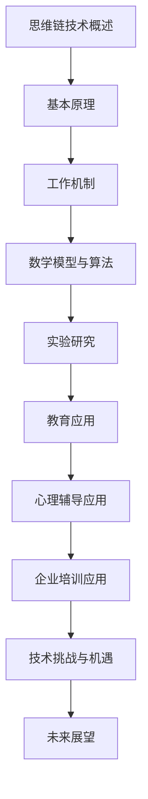

                 

# 《思维链技术在认知增强研究中的新方向》

## 关键词
- 认知增强
- 思维链技术
- 数学模型
- 人工智能
- 实验研究
- 应用场景

## 摘要
本文主要探讨了思维链技术在认知增强研究中的新方向。通过分析思维链技术的基本原理、工作机制、数学模型及算法，以及其实验研究，本文揭示了思维链技术如何通过认知增强在多领域中的实际应用。同时，本文也对思维链技术的挑战与机遇进行了探讨，并展望了未来的发展趋势。

## 目录

### 第一部分：引言与背景

#### 第1章：引言

##### 1.1 书籍概述与目标

##### 1.2 认知增强研究的重要性

##### 1.3 思维链技术的概念与发展

##### 1.4 本书结构安排与读者对象

### 第二部分：思维链技术基础

#### 第2章：思维链技术的基本原理

##### 2.1 思维链的概念解析

##### 2.2 思维链的核心特征

##### 2.3 思维链的构成要素

##### 2.4 思维链与认知增强的关系

#### 第3章：思维链技术的工作机制

##### 3.1 思维链的基本模型

##### 3.2 思维链的动态特性

##### 3.3 思维链的技术实现

##### 3.4 思维链在认知科学中的应用

#### 第4章：思维链技术的数学模型与算法

##### 4.1 数学模型的基本框架

##### 4.2 算法原理与实现

##### 4.3 伪代码描述与算法分析

##### 4.4 数学公式与解释

#### 第5章：思维链技术的实验研究

##### 5.1 实验设计与方法论

##### 5.2 实验结果与数据收集

##### 5.3 数据分析与讨论

##### 5.4 实验结论与启示

### 第三部分：思维链技术在认知增强中的应用

#### 第6章：思维链技术在教育中的应用

##### 6.1 教育领域的认知增强需求

##### 6.2 思维链技术在教育中的应用场景

##### 6.3 教育案例与实践

##### 6.4 教育成果与反思

#### 第7章：思维链技术在心理辅导中的应用

##### 7.1 心理辅导中的认知增强需求

##### 7.2 思维链技术在心理辅导中的应用

##### 7.3 心理辅导案例与实践

##### 7.4 心理辅导成果与反思

#### 第8章：思维链技术在企业培训中的应用

##### 8.1 企业培训的认知增强需求

##### 8.2 思维链技术在企业培训中的应用

##### 8.3 企业培训案例与实践

##### 8.4 企业培训成果与反思

### 第四部分：思维链技术的发展趋势与未来展望

#### 第9章：思维链技术的挑战与机遇

##### 9.1 技术挑战与解决方案

##### 9.2 应用机遇与市场前景

##### 9.3 技术发展趋势分析

##### 9.4 未来展望与潜在应用领域

#### 第10章：结论与展望

##### 10.1 全书总结

##### 10.2 研究贡献与不足

##### 10.3 未来研究方向与建议

##### 10.4 对认知科学和社会发展的意义

### 附录

##### 附录A：思维链技术的相关工具与资源

##### 附录B：实验数据集与代码

##### 附录C：参考文献与进一步阅读资料

### 后记

##### 后记：对本书写作过程的回顾与感悟

### Mermaid 流程图

接下来，我们将分别对每个章节进行详细的内容撰写。让我们开始第一部分的引言与背景。

