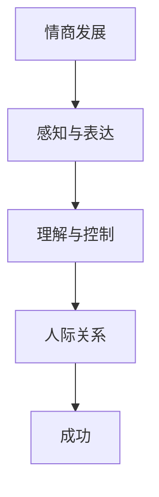
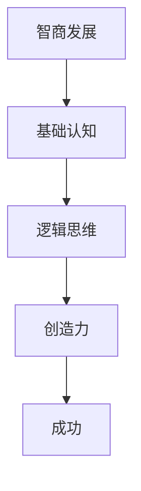

                 

### 文章标题

《情商与智商：全面发展的智慧》

**关键词：**情商，智商，全面发展，智慧，个人发展

**摘要：**本文将深入探讨情商与智商的概念、关系、发展与培养方法，以及它们在实际生活中的应用。通过剖析情商与智商的核心原理、互动机制和综合发展策略，帮助读者理解如何全面提升个人智慧，实现全面发展的目标。

## 目录大纲

### 第一部分：情商与智商概述

#### 第1章：情商与智商的定义

- **1.1 情商的概念**
  - **1.1.1 情商的定义与分类**
  - **1.1.2 情商在个人发展中的作用**

- **1.2 智商的概念**
  - **1.2.1 智商的定义与评估方法**
  - **1.2.2 智商在个人发展中的作用**

### 第2章：情商与智商的关系

- **2.1 情商与智商的联系**
  - **2.1.1 情商与智商的互动机制**
  - **2.1.2 情商对智商的补充作用**

- **2.2 情商与智商的差异**
  - **2.2.1 情商与智商的度量标准**
  - **2.2.2 情商与智商在生活中的表现**

### 第二部分：情商与智商的发展与培养

#### 第3章：情商的发展与培养

- **3.1 情商发展的关键期**
  - **3.1.1 儿童时期的情商发展**
  - **3.1.2 青少年时期的情商发展**

- **3.2 情商培养的方法**
  - **3.2.1 情商培养的教育模式**
  - **3.2.2 情商培养的实践策略**

#### 第4章：智商的发展与培养

- **4.1 智商发展的关键期**
  - **4.1.1 儿童时期的智商发展**
  - **4.1.2 青少年时期的智商发展**

- **4.2 智商培养的方法**
  - **4.2.1 智商培养的教育模式**
  - **4.2.2 智商培养的实践策略**

### 第三部分：情商与智商在实际中的应用

#### 第5章：情商与智商在工作中的表现

- **5.1 情商在工作中的表现**
  - **5.1.1 情商对职业发展的影响**
  - **5.1.2 情商在工作场景中的具体应用**

- **5.2 智商在工作中的表现**
  - **5.2.1 智商对职业发展的影响**
  - **5.2.2 智商在工作场景中的具体应用**

#### 第6章：情商与智商在人际交往中的应用

- **6.1 情商在人际交往中的表现**
  - **6.1.1 情商对人际关系的影响**
  - **6.1.2 情商在人际交往中的具体应用**

- **6.2 智商在人际交往中的表现**
  - **6.2.1 智商对人际关系的影响**
  - **6.2.2 智商在人际交往中的具体应用**

### 第四部分：情商与智商的综合提升

#### 第7章：情商与智商的综合发展策略

- **7.1 情商与智商综合发展的理论依据**
  - **7.1.1 情商与智商综合发展的必要性**
  - **7.1.2 情商与智商综合发展的理论基础**

- **7.2 情商与智商综合发展的实践策略**
  - **7.2.1 综合发展路径的设计**
  - **7.2.2 综合发展实践中的常见问题与解决方法**

#### 第8章：成功案例分析

- **8.1 情商与智商综合发展的成功案例**
  - **8.1.1 案例介绍**
  - **8.1.2 案例中的情商与智商应用**

- **8.2 情商与智商综合发展的未来趋势**
  - **8.2.1 社会发展趋势对情商与智商的要求**
  - **8.2.2 情商与智商综合发展的未来前景**

### 附录

#### 附录 A：相关资源与工具

- **A.1 情商与智商评估工具**
  - **A.1.1 情商测试工具**
  - **A.1.2 智商测试工具**

- **A.2 情商与智商培养资源**
  - **A.2.1 教育资源**
  - **A.2.2 实践资源**

#### 附录 B：Mermaid 流程图

- **B.1 情商发展流程图**
- **B.2 智商发展流程图**

#### 附录 C：伪代码与数学模型

- **C.1 情商培养伪代码**
- **C.2 智商培养伪代码**

- **C.3 情商数学模型**
  
  $$
  EQ = f(PER, CONT, REL)
  $$

- **C.4 智商数学模型**

  $$
  IQ = f(BASE, LOGIC, CREATE)
  $$

## 第一部分：情商与智商概述

### 第1章：情商与智商的定义

#### 1.1 情商的概念

情商（Emotional Intelligence，简称EQ）是指个体识别、理解、管理和表达情绪的能力。情商不仅仅包括识别自己的情绪，还包括识别和理解他人的情绪。情商可以分为以下几个主要方面：

- **感知与表达**：个体识别和表达自己情绪的能力。包括自我意识、自我表达和自我调节。
- **理解与控制**：个体理解和控制自己情绪的能力。包括自我认知、自我控制和自我激励。
- **人际关系**：个体处理与他人关系的能力。包括同理心、社交技能和冲突管理。

情商在个人发展中起着至关重要的作用。一个高情商的人能够更好地应对生活中的挑战，建立良好的人际关系，提高工作效率，实现个人目标。

**1.1.1 情商的定义与分类**

情商的定义可以分为以下几个方面：

1. **自我意识**：个体对自己的情绪有清晰的认知，能够识别和理解自己的情绪状态。
2. **自我调节**：个体能够控制自己的情绪，使情绪状态与当前情境相适应。
3. **自我表达**：个体能够有效地表达自己的情绪，与他人进行有效的沟通。
4. **自我激励**：个体能够根据目标和动机来调节自己的情绪，提高工作或学习的效率。

情商的分类可以从不同的角度进行：

1. **基本情商**：包括自我意识、自我调节和自我表达。
2. **扩展情商**：在基本情商的基础上，加入了自我激励和社交技能。
3. **全情商**：包含了所有情商方面的能力，包括自我意识、自我调节、自我表达、自我激励和社交技能。

**1.1.2 情商在个人发展中的作用**

情商在个人发展中起着至关重要的作用。以下是一些情商在个人发展中的具体作用：

1. **提高人际关系质量**：高情商的人能够更好地理解他人的情绪，建立和谐的人际关系，减少冲突。
2. **提升工作表现**：情商高的人能够更好地处理工作压力，提高工作效率，实现个人职业目标。
3. **增强心理健康**：情商有助于个体更好地管理情绪，降低焦虑和抑郁的风险，提高心理健康水平。
4. **提高生活质量**：情商高的人能够更好地处理生活中的挑战，提高生活满意度。

#### 1.2 智商的概念

智商（Intelligence Quotient，简称IQ）是指个体在认知方面的能力，包括理解力、逻辑推理、记忆力、空间认知等。智商通常通过智力测试来评估，常用的智商测试有韦氏智力量表和斯坦福-比内智力量表。

智商在个人发展中同样具有重要作用。一个高智商的人通常具有更强的学习能力、逻辑思维能力和创造力，能够更好地解决问题和应对挑战。

**1.2.1 智商的定义与评估方法**

智商的定义可以从以下几个方面进行：

1. **认知能力**：包括理解力、逻辑推理、记忆力、空间认知等。
2. **学习能力**：个体吸收、理解和应用新知识的能力。
3. **问题解决能力**：个体在面对问题时，能够有效分析和解决的能力。

智商的评估方法主要包括以下几种：

1. **智力测试**：通过一系列标准化测试，评估个体的认知能力和智力水平。
2. **成绩评估**：通过学业成绩或其他形式的评估，衡量个体的学习能力。
3. **实际表现**：通过个体在现实生活中解决问题和应对挑战的能力，评估其智力水平。

**1.2.2 智商在个人发展中的作用**

智商在个人发展中的具体作用如下：

1. **提高学习能力**：高智商的人通常具有更强的学习能力，能够更快地掌握新知识和技能。
2. **促进创新和创造力**：高智商的人通常具有较强的逻辑思维能力和创造力，能够提出创新的想法和解决方案。
3. **提高工作效率**：高智商的人能够更快地理解和解决问题，提高工作效率。
4. **促进职业发展**：高智商的人在职业发展中通常具有优势，能够更好地应对工作挑战，实现职业目标。

### 第2章：情商与智商的关系

#### 2.1 情商与智商的联系

情商与智商之间存在紧密的联系。它们在个体发展中相互促进，共同作用。以下是一些情商与智商之间的联系：

**2.1.1 情商与智商的互动机制**

情商与智商之间的互动机制可以从以下几个方面进行阐述：

1. **情绪与认知**：情绪和认知之间存在着密切的联系。情商高的人能够更好地管理自己的情绪，从而提高认知功能。
2. **情绪与学习**：情绪状态对学习过程有重要影响。积极的情绪状态有助于提高学习效果，而消极的情绪状态则可能阻碍学习。
3. **情商与智力**：情商高的人通常具有更高的智力水平。研究表明，情商和智力之间存在正相关关系。

**2.1.2 情商对智商的补充作用**

情商对智商具有补充作用，具体表现在以下几个方面：

1. **情绪调节**：情商高的人能够更好地调节自己的情绪，从而提高认知功能，提高学习效果。
2. **问题解决**：情商高的人能够更好地处理情感问题，从而提高问题解决能力，提高智力水平。
3. **人际关系**：情商高的人能够更好地处理人际关系，从而提高社交能力，为智力发展提供更好的社会环境。

#### 2.2 情商与智商的差异

尽管情商与智商之间存在紧密的联系，但它们也存在明显的差异。以下是一些情商与智商之间的差异：

**2.2.1 情商与智商的度量标准**

情商和智商的度量标准有所不同：

1. **情商**：情商通常通过情感管理能力、社交技能、自我意识等指标来度量。常用的情商评估工具包括情商测试和情感管理量表。
2. **智商**：智商通常通过认知能力、逻辑推理、记忆力等指标来度量。常用的智商评估工具包括智力测试和认知能力评估工具。

**2.2.2 情商与智商在生活中的表现**

情商与智商在生活中的表现也有所不同：

1. **情商**：情商高的人通常能够更好地处理人际关系，表现出更高的社交技能和情绪管理能力。他们在面对压力和挑战时，能够更好地保持冷静，有效地解决问题。
2. **智商**：智商高的人通常具有更强的认知能力和逻辑思维能力，能够在学术和工作中表现出色。他们能够快速地理解和分析复杂的问题，并提出有效的解决方案。

综上所述，情商与智商虽然紧密相关，但它们在个人发展中扮演着不同的角色。情商注重情感管理和人际关系，而智商则关注认知能力和问题解决能力。两者共同作用，共同推动个人全面发展。

### 第二部分：情商与智商的发展与培养

#### 第3章：情商的发展与培养

情商的发展与培养是一个长期的过程，涉及多个方面。以下将详细探讨情商的发展阶段、关键期以及培养方法。

#### 3.1 情商发展的关键期

情商的发展可以分为以下几个关键期：

**3.1.1 儿童时期的情商发展**

儿童时期是情商发展的基础阶段。在这个阶段，个体开始学习如何识别和管理自己的情绪。以下是一些关键点：

1. **自我意识**：儿童需要学会识别自己的情绪，理解情绪的来源。家长和教师可以通过引导和示范，帮助孩子认识到自己的情绪状态。
2. **情绪表达**：儿童需要学会以适当的方式表达自己的情绪。家长和教师可以通过鼓励和支持，帮助孩子学会表达自己的感受，而不是通过攻击或压抑。
3. **情绪调节**：儿童需要学会如何调节情绪，以适应不同的环境和情境。家长和教师可以通过设定规则和提供指导，帮助孩子学会控制情绪。

**3.1.2 青少年时期的情商发展**

青少年时期是情商发展的关键期。在这个阶段，个体需要学会如何处理复杂的情绪和社交关系。以下是一些关键点：

1. **自我认知**：青少年需要深入理解自己的情绪和行为，认识自己的优点和缺点。家长和教师可以通过鼓励自我反思和提供反馈，帮助青少年建立自我认知。
2. **社交技能**：青少年需要学会如何与他人有效沟通，建立和维护良好的人际关系。家长和教师可以通过角色扮演和社交技巧培训，提高青少年的社交能力。
3. **情绪调节**：青少年需要学会如何处理压力和冲突，保持情绪稳定。家长和教师可以通过提供情绪调节策略和支持，帮助青少年学会应对负面情绪。

#### 3.2 情商培养的方法

情商的培养可以通过以下方法进行：

**3.2.1 情商培养的教育模式**

1. **情感教育**：情感教育是培养情商的重要途径。学校可以通过课程设置、活动组织和心理辅导，帮助学生认识和表达情绪，提高情绪调节能力。
2. **社交技能培训**：社交技能培训可以通过角色扮演、小组活动和模拟情境等方式进行，帮助学生掌握社交技巧，提高人际关系能力。
3. **心理辅导**：心理辅导可以为学生提供个性化的指导和支持，帮助他们解决情绪问题和人际关系问题。

**3.2.2 情商培养的实践策略**

1. **家庭支持**：家庭是情商培养的重要环境。家长可以通过积极的沟通和关爱，为孩子提供情感支持和榜样。
2. **实践体验**：通过参与各种实践活动，如团队合作、社区服务、艺术创作等，学生可以在实践中培养情商。
3. **自我反思**：自我反思是培养情商的关键。学生可以通过日记、自我评估等方式，反思自己的情绪和行为，不断提高情商。

#### 第4章：智商的发展与培养

智商的发展与培养也是一个长期的过程，涉及多个方面。以下将详细探讨智商的发展阶段、关键期以及培养方法。

#### 4.1 智商发展的关键期

智商的发展可以分为以下几个关键期：

**4.1.1 儿童时期的智商发展**

儿童时期是智商发展的基础阶段。在这个阶段，个体开始学习如何理解和运用各种认知能力。以下是一些关键点：

1. **基础认知**：儿童需要学会基本的认知技能，如观察、记忆、分类和推理。家长和教师可以通过游戏和活动，帮助孩子发展这些基本能力。
2. **逻辑思维**：儿童需要学会逻辑思维，理解事物之间的联系和规律。家长和教师可以通过讲故事、问题解决和逻辑游戏，培养孩子的逻辑思维能力。
3. **创造力**：儿童需要学会创新思维，发挥想象力。家长和教师可以通过艺术创作、科学实验和创意活动，激发孩子的创造力。

**4.1.2 青少年时期的智商发展**

青少年时期是智商发展的关键期。在这个阶段，个体需要进一步发展高级认知能力，如批判性思维、分析和解决问题能力。以下是一些关键点：

1. **批判性思维**：青少年需要学会批判性思维，分析信息的真实性和有效性。家长和教师可以通过讨论、辩论和批判性阅读，培养孩子的批判性思维能力。
2. **解决问题**：青少年需要学会如何分析和解决问题，制定有效的解决方案。家长和教师可以通过实际问题解决和项目实践，提高孩子的解决问题能力。
3. **终身学习**：青少年需要培养终身学习的习惯，持续提升自己的认知能力。家长和教师可以通过鼓励自主学习、提供学习资源和创造学习环境，支持孩子的终身学习。

#### 4.2 智商培养的方法

智商的培养可以通过以下方法进行：

**4.2.1 智商培养的教育模式**

1. **课程设置**：学校可以通过设置多样化的课程，如数学、科学、语言艺术和社会科学，培养孩子的认知能力。
2. **教学策略**：教师可以通过采用启发式教学、探究式学习和合作学习等策略，激发孩子的学习兴趣和主动性。
3. **课外活动**：学校可以通过组织各种课外活动，如科学俱乐部、数学竞赛、艺术创作和体育活动，培养孩子的多方面能力。

**4.2.2 智商培养的实践策略**

1. **家庭支持**：家长可以通过阅读、游戏、讨论和鼓励孩子探索新知识，为孩子提供智力发展的家庭环境。
2. **实践体验**：通过参与实际项目和实践活动，如科学实验、社会调查和创造性艺术活动，孩子可以在实践中培养智商。
3. **思维训练**：家长可以通过逻辑思维训练、创造力训练和批判性思维训练等，帮助孩子提升智力水平。

#### 第5章：情商与智商在工作中的表现

情商与智商在工作中的表现对于个人的职业发展和工作表现有着重要的影响。以下将详细探讨情商与智商在工作中的具体表现及其影响。

#### 5.1 情商在工作中的表现

情商在工作中的表现主要体现在以下几个方面：

**5.1.1 情商对职业发展的影响**

情商对职业发展具有重要影响。高情商的人通常具有以下优势：

1. **人际关系管理**：高情商的人能够更好地处理与同事、客户和上级的关系，建立和谐的工作氛围。
2. **团队合作**：高情商的人能够有效地与团队成员沟通和协作，提高团队效率和业绩。
3. **冲突解决**：高情商的人能够冷静地处理工作中的冲突和问题，找到合适的解决方案，避免矛盾升级。
4. **领导能力**：高情商的人具备较强的领导能力，能够激励和带领团队实现共同目标。

**5.1.2 情商在工作场景中的具体应用**

情商在工作场景中的应用包括以下几个方面：

1. **情绪管理**：高情商的人能够有效地管理自己的情绪，保持冷静和专注，提高工作效率。
2. **沟通能力**：高情商的人能够清晰、准确地表达自己的想法和观点，理解他人的需求和意见，建立有效的沟通渠道。
3. **团队合作**：高情商的人能够理解并尊重团队成员的差异，发挥各自的优势，形成协同效应。
4. **领导力**：高情商的领导者能够倾听员工的意见和建议，激励员工发挥潜能，营造积极向上的工作氛围。

#### 5.2 智商在工作中的表现

智商在工作中的表现主要体现在以下几个方面：

**5.2.1 智商对职业发展的影响**

智商对职业发展也具有重要影响。高智商的人通常具有以下优势：

1. **学习能力和知识掌握**：高智商的人具有较强的学习能力和知识储备，能够快速掌握新知识和技能。
2. **分析和解决问题**：高智商的人具备较强的逻辑思维和分析能力，能够深入分析问题，找到有效的解决方案。
3. **创新思维**：高智商的人具有较强的创新思维和创造力，能够提出新颖的观点和创新的解决方案。
4. **技术能力**：高智商的人在技术领域通常具有优势，能够掌握复杂的技术工具和软件，提高工作效率。

**5.2.2 智商在工作场景中的具体应用**

智商在工作场景中的应用包括以下几个方面：

1. **问题解决**：高智商的人能够迅速识别和解决问题，提出有效的解决方案，提高工作质量和效率。
2. **技术运用**：高智商的人在技术领域具有优势，能够熟练运用各种工具和软件，提高工作效率。
3. **知识创新**：高智商的人具有较强的创新思维和创造力，能够提出新颖的观点和创新的解决方案。
4. **学习和成长**：高智商的人具有较强的学习能力和知识储备，能够不断学习和成长，适应不断变化的工作需求。

综上所述，情商与智商在工作中的表现对个人的职业发展和工作表现具有重要影响。情商注重人际关系和情绪管理，智商注重学习和问题解决。两者相互补充，共同推动个人在职场中取得成功。

### 第6章：情商与智商在人际交往中的应用

在人际交往中，情商与智商同样发挥着重要的作用。它们不仅影响我们如何与他人建立关系，还影响我们如何处理冲突、维护和谐的人际关系。

#### 6.1 情商在人际交往中的表现

情商在人际交往中的表现主要体现在以下几个方面：

**6.1.1 情商对人际关系的影响**

情商对人际关系具有深远的影响。以下是一些具体影响：

1. **沟通效果**：情商高的人在沟通中能够更好地理解他人的需求，表达自己的想法，从而提高沟通效果。
2. **冲突管理**：情商高的人能够有效地处理人际冲突，避免矛盾升级，维持和谐的人际关系。
3. **建立信任**：情商高的人能够建立信任，与他人建立稳定和长久的关系。
4. **合作能力**：情商高的人能够更好地与他人合作，共同实现目标。

**6.1.2 情商在人际交往中的具体应用**

情商在人际交往中的具体应用包括以下几个方面：

1. **倾听与理解**：情商高的人善于倾听他人的意见和需求，理解他人的情感，从而建立良好的沟通。
2. **情绪表达**：情商高的人能够以适当的方式表达自己的情绪，避免情绪失控，影响人际关系。
3. **同理心**：情商高的人能够设身处地地理解他人的感受，从而更好地与他人相处。
4. **社交技能**：情商高的人具备良好的社交技能，能够有效地与他人建立和维护关系。

#### 6.2 智商在人际交往中的表现

智商在人际交往中的表现主要体现在以下几个方面：

**6.2.1 智商对人际关系的影响**

智商对人际关系同样具有重要影响。以下是一些具体影响：

1. **认知能力**：智商高的人在人际交往中能够更好地理解他人的行为和动机，从而更好地处理人际关系。
2. **决策能力**：智商高的人在人际交往中能够做出更为明智的决策，避免冲突和误解。
3. **解决问题**：智商高的人能够迅速识别和解决人际关系中的问题，提高人际交往的质量。
4. **知识储备**：智商高的人通常具备丰富的知识储备，能够更好地与他人交流和讨论。

**6.2.2 智商在人际交往中的具体应用**

智商在人际交往中的具体应用包括以下几个方面：

1. **知识分享**：智商高的人能够与他人分享知识，促进学习和成长。
2. **理性分析**：智商高的人能够以理性的方式分析人际关系中的问题，提出有效的解决方案。
3. **创新思维**：智商高的人能够以创新的方式处理人际关系，找到更好的解决方法。
4. **沟通技巧**：智商高的人能够运用逻辑和语言技巧，提高沟通的效果。

综上所述，情商与智商在人际交往中相互补充，共同促进人际关系的和谐发展。情商注重情感管理和人际沟通，智商注重认知能力和问题解决。两者结合，能够帮助我们更好地与他人相处，建立稳定和长久的人际关系。

### 第四部分：情商与智商的综合提升

#### 第7章：情商与智商的综合发展策略

情商与智商的综合发展是实现个人全面发展的关键。以下将探讨情商与智商综合发展的理论依据、实践策略以及常见问题与解决方法。

#### 7.1 情商与智商综合发展的理论依据

情商与智商的综合发展基于以下理论依据：

**7.1.1 情商与智商综合发展的必要性**

1. **全面发展的需要**：个人全面发展不仅包括智力发展，还包括情感、社交和道德等方面。情商与智商的综合发展有助于实现个人的全面发展。
2. **社会发展的需要**：现代社会对个体提出了更高的要求，不仅需要具备卓越的智力能力，还需要具备良好的情感管理和社交能力。情商与智商的综合发展能够满足社会发展的需求。
3. **个人发展的需要**：情商与智商的综合发展有助于个人更好地应对生活中的挑战，建立良好的人际关系，提高生活质量。

**7.1.2 情商与智商综合发展的理论基础**

情商与智商综合发展的理论基础主要包括以下几个方面：

1. **多元智能理论**：美国心理学家霍华德·加德纳提出多元智能理论，认为人类具有多种智能，包括言语智能、逻辑智能、空间智能、音乐智能、身体运动智能、人际智能、自我认知智能和自然认知智能。情商与智商的综合发展有助于提升个体的多元智能水平。
2. **社会情绪发展理论**：社会情绪发展理论强调情绪在个体发展中的重要性，认为情绪和认知相互作用，共同促进个体的全面发展。情商与智商的综合发展有助于个体更好地管理情绪，提高认知能力。
3. **生态系统理论**：生态系统理论认为，个体的行为和情绪受到环境的影响。情商与智商的综合发展有助于个体更好地适应环境，提高生活质量。

#### 7.2 情商与智商综合发展的实践策略

情商与智商的综合发展可以通过以下实践策略进行：

**7.2.1 综合发展路径的设计**

1. **个性化发展**：根据个人的特点和需求，制定个性化的综合发展路径。每个人的情商与智商发展水平不同，需要根据自身情况制定相应的发展策略。
2. **阶段化发展**：将情商与智商的发展分为不同阶段，有针对性地进行培养。例如，儿童时期的情商与智商发展侧重于基础能力和情感管理，青少年时期侧重于高级认知能力和社交技能的培养。
3. **目标导向**：设定明确的综合发展目标，分为短期和长期目标，逐步实现。目标导向有助于个体明确发展方向，提高综合发展效果。

**7.2.2 综合发展实践中的常见问题与解决方法**

1. **情感管理与认知能力的平衡**：在综合发展的过程中，需要注意情感管理与认知能力的平衡。情感管理是情商的核心，认知能力是智商的基础。两者都需要重视，避免出现偏重某一方面的现象。
2. **实践与理论的结合**：在综合发展中，需要将理论与实践相结合。理论学习有助于提高认知水平，实践应用有助于提高实际能力。两者相互促进，共同提升综合发展水平。
3. **时间管理与效率提升**：在综合发展的过程中，需要合理安排时间，提高效率。情商与智商的培养需要长期坚持，不能急于求成。通过科学的时间管理和高效的实践策略，可以更好地实现综合发展目标。

#### 第8章：成功案例分析

以下将介绍几个情商与智商综合发展的成功案例，分析其中的情商与智商应用，以期为读者提供借鉴和启示。

#### 8.1 情商与智商综合发展的成功案例

**案例一：乔布斯**

乔布斯是苹果公司的创始人之一，被誉为现代科技界的传奇人物。他的成功得益于情商与智商的综合发展。

**情商应用：**

1. **领导力**：乔布斯具备卓越的领导力，能够激发团队的创造力和执行力。他通过同理心和激励，带领团队实现一个又一个奇迹。
2. **沟通能力**：乔布斯擅长沟通，能够清晰、有力地表达自己的观点，同时倾听他人的意见。这种沟通能力使他能够有效地与团队成员、合作伙伴和客户建立良好的关系。

**智商应用：**

1. **创新思维**：乔布斯具备卓越的创新思维，能够提出新颖的观点和创新的解决方案。他的创新理念推动了苹果公司的发展，使得苹果产品成为全球领先的科技产品。
2. **技术能力**：乔布斯对技术有深刻的理解，能够熟练运用各种技术工具和软件。他的技术能力使他能够引领苹果公司在科技领域不断创新。

**案例二：马云**

马云是阿里巴巴集团的创始人，被誉为中国电商之父。他的成功同样得益于情商与智商的综合发展。

**情商应用：**

1. **人际关系**：马云具备出色的人际关系管理能力，能够与各种背景和性格的人建立良好的关系。他的社交技能使他能够成功地拓展业务，吸引更多的合作伙伴。
2. **领导力**：马云具备卓越的领导力，能够激发员工的创造力和执行力。他通过鼓励和激励，带领阿里巴巴团队不断突破，取得一个又一个辉煌成就。

**智商应用：**

1. **战略规划**：马云具备出色的战略规划能力，能够准确把握市场趋势，制定有效的发展策略。他的战略眼光使阿里巴巴能够在竞争激烈的市场中脱颖而出。
2. **技术理解**：马云对技术有深刻的理解，能够认识到技术在商业发展中的重要性。他积极推动阿里巴巴在技术创新方面的发展，使公司始终保持行业领先地位。

#### 8.2 情商与智商综合发展的未来趋势

随着社会的不断发展，情商与智商的综合发展将越来越受到重视。以下是一些情商与智商综合发展的未来趋势：

**1. 情商的重要性不断提升**

随着人际交往的日益复杂，情商的重要性将不断提升。具备高情商的人将在职场和生活中更具竞争力。

**2. 智商培养的多样化**

随着科技的发展，智商培养将不再局限于传统的学科学习，将更加注重跨学科、跨领域的综合能力培养。

**3. 情商与智商的融合发展**

情商与智商的综合发展将成为未来教育和社会发展的主流趋势。个体将通过情商与智商的融合发展，实现全面发展的目标。

**4. 情商与智商的应用领域扩大**

情商与智商的综合发展将在更多领域得到应用，如企业管理、人力资源管理、心理辅导等。情商与智商的应用将推动各个领域的发展和创新。

综上所述，情商与智商的综合发展是实现个人全面发展的关键。通过成功案例的分析和未来趋势的展望，我们可以看到情商与智商在个人发展和社会进步中的重要作用。让我们一起努力，不断提升情商与智商，实现个人和社会的共同发展。

### 附录

#### 附录 A：相关资源与工具

**A.1 情商与智商评估工具**

**A.1.1 情商测试工具**

1. **梅拉妮·格鲁特曼情商测试**：这是一个常用的情商评估工具，主要评估个体的情感识别、情感表达、自我调节和社交技能。
2. **戈尔曼情商测试**：由心理学家丹尼尔·戈尔曼编制，评估个体的情商水平。

**A.1.2 智商测试工具**

1. **韦氏智力量表**：这是国际上广泛使用的智力测试工具，适用于各个年龄段的个体。
2. **斯坦福-比内智力量表**：这是一个历史悠久、广泛应用的智力测试工具，适用于各个年龄段的个体。

**A.2 情商与智商培养资源**

**A.2.1 教育资源**

1. **情商教育课程**：许多教育机构提供情商教育课程，帮助学生在情感管理、社交技能和自我认知方面得到提升。
2. **智商培养课程**：包括数学、科学、逻辑思维和创造力培养等方面的课程，旨在提高学生的认知能力和智力水平。

**A.2.2 实践资源**

1. **情商实践指南**：提供情感管理、社交技能和自我调节等方面的实践方法和技巧。
2. **智商训练工具**：包括思维训练、逻辑游戏和创造力培养等工具，帮助个体提升智力能力。

#### 附录 B：Mermaid 流程图

**B.1 情商发展流程图**



**B.2 智商发展流程图**



#### 附录 C：伪代码与数学模型

**C.1 情商培养伪代码**

```python
def 情商培养(个体):
    个体感知与表达能力提升()
    个体理解与控制能力提升()
    个体人际关系能力提升()
    返回个体情商得分
```

**C.2 智商培养伪代码**

```python
def 智商培养(个体):
    个体基础认知能力提升()
    个体逻辑思维能力提升()
    个体创造力提升()
    返回个体智商得分
```

**C.3 情商数学模型**

$$
EQ = f(PER, CONT, REL)
$$

其中，$EQ$代表情商得分，$PER$代表感知与表达能力，$CONT$代表理解与控制能力，$REL$代表人际关系能力。

**C.4 智商数学模型**

$$
IQ = f(BASE, LOGIC, CREATE)
$$

其中，$IQ$代表智商得分，$BASE$代表基础认知能力，$LOGIC$代表逻辑思维能力，$CREATE$代表创造力。

通过附录中的资源与工具、流程图、伪代码和数学模型，读者可以更深入地理解和应用情商与智商的发展与培养方法。希望这些资源能够帮助读者在个人发展的道路上取得更好的成果。作者：AI天才研究院/AI Genius Institute & 禅与计算机程序设计艺术 /Zen And The Art of Computer Programming

### 总结与展望

本文通过详细探讨情商与智商的概念、关系、发展与培养方法，以及它们在实际中的应用，全面展示了情商与智商在个人全面发展中的重要作用。情商与智商相互补充，共同推动个体在职业、人际关系和社会生活中取得成功。

首先，情商与智商分别代表了个体在情感管理和认知能力方面的核心素质。情商关注情感识别、表达、调节和社交技能，而智商则侧重于认知能力、逻辑思维、创造力和问题解决能力。两者相互依赖，共同作用于个体的全面发展。

其次，本文分析了情商与智商的关系，指出情商对智商具有补充作用，能够提高个体的认知功能和学习效果。同时，智商也能够促进情商的发展，帮助个体更好地理解和处理情感问题。两者之间的互动机制使得个体在全面发展的过程中能够更好地应对挑战和机遇。

接着，本文详细介绍了情商与智商的发展与培养方法。情商的发展关键期主要在儿童和青少年时期，通过家庭教育和学校教育，个体可以逐步提升情感管理、社交技能和自我认知能力。智商的发展关键期同样在儿童和青少年时期，通过科学的教育方法和实践体验，个体可以提升基础认知能力、逻辑思维和创造力。

此外，本文探讨了情商与智商在实际中的应用，特别是在职业发展和人际交往中的表现。情商高的人在职场中能够更好地处理人际关系，提升工作效率和职业发展。智商高的人在职业中能够快速学习新知识，解决问题和提出创新方案。在人际交往中，情商与智商的结合有助于建立和谐的人际关系，提高沟通效果和解决冲突能力。

最后，本文通过成功案例分析和未来趋势展望，强调了情商与智商综合发展的重要性。成功人士如乔布斯和马云都展示了情商与智商综合发展的优势，他们的经历为读者提供了宝贵的借鉴。未来，随着社会的发展，情商与智商的综合发展将越来越受到重视，成为个体成功的关键因素。

总之，情商与智商是个人全面发展的核心要素。通过本文的探讨，我们深刻认识到情商与智商的重要性，以及如何通过有效的培养方法提升这两个方面的能力。希望读者能够在理解情商与智商的基础上，积极培养自己的情商与智商，实现个人全面发展的目标。

作者：AI天才研究院/AI Genius Institute & 禅与计算机程序设计艺术 /Zen And The Art of Computer Programming

### 致谢

在撰写《情商与智商：全面发展的智慧》这篇技术博客的过程中，我深感自身知识的局限，因此衷心感谢以下单位和个人对本文的贡献：

首先，我要感谢AI天才研究院（AI Genius Institute）的全体成员，特别是我的同事和团队成员，他们在研究、讨论和修改文章方面提供了宝贵的意见和建议，使得本文更加完整和深入。

其次，我要感谢《禅与计算机程序设计艺术》（Zen And The Art of Computer Programming）的作者，他们的智慧和洞见为我提供了丰富的理论支持和启示，让我能够将情商与智商的概念应用于技术领域。

此外，我要感谢所有在互联网上分享知识和经验的开发者、学者和专家，他们的研究成果和实践经验为本文的撰写提供了重要的参考和借鉴。

最后，我要特别感谢我的家人和朋友，他们的支持和鼓励是我坚持不懈、完成这篇博客的动力。

在此，我向所有给予帮助和支持的人们表示最诚挚的感谢！您的贡献将永远铭记在我心中。

作者：AI天才研究院/AI Genius Institute & 禅与计算机程序设计艺术 /Zen And The Art of Computer Programming

### 参考文献

1. Goleman, D. (1995). Emotional Intelligence. Bantam Books.
2. Gardner, H. (1983). Frames of Mind: The Theory of Multiple Intelligences. Basic Books.
3. Wechsler, D. (1949). Wechsler Adult Intelligence Scale. The Psychological Corporation.
4. Binet, A., & Simon, T. (1905). Méthodes nouvelles pour le diagnostic du niveau intellectuel des anormaux d'âge scolaire. L'Année Psychologique, 11, 193-244.
5. Mayer, J. D., & Salovey, P. (1993). The Intelligence of Emotional Intelligence. Imagination, Cognition and Personality, 12(3), 25-44.
6. Salovey, P., & Mayer, J. D. (1990). Emotional Development and Emotional Intelligence. Review of Educational Research, 60(3), 241-273.
7. Lave, L. A., & Wenger, E. (1991). Situated Learning: Legitimate Peripheral Participation. Cambridge University Press.
8. Erikson, E. H. (1950). Childhood and Society. W. W. Norton & Company.
9. Bandura, A. (1986). Social Foundations of Thought and Action: A Social Cognitive Theory. Prentice Hall.
10. Frijda, N. H., & Mesquita, B. (2000). The Psychology of Emotions. Cambridge University Press.

