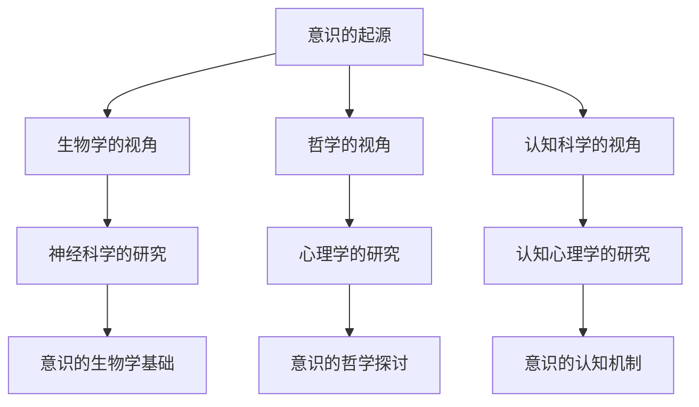
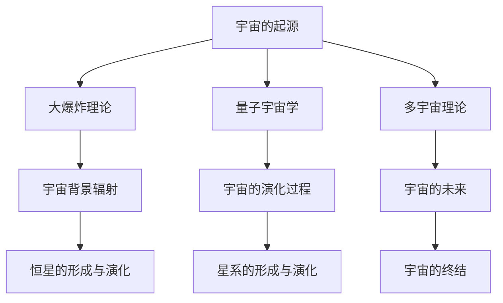
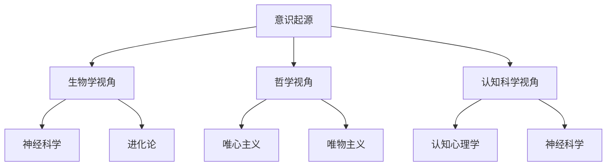
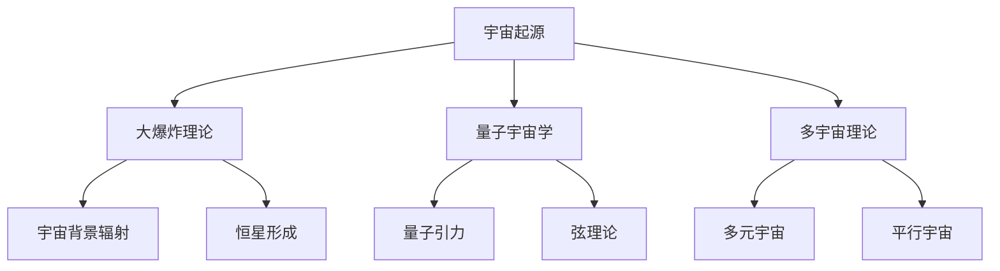

                 

## 《意识与宇宙的共同进化：相互塑造的过程》

> **关键词：** 意识、宇宙进化、相互塑造、共同进化机制、人类意义、未来展望

> **摘要：** 本文探讨了意识与宇宙共同进化的概念、起源、过程及其对人类文明的影响。通过分析意识与宇宙之间的相互作用与反馈机制，本文揭示了两者相互塑造的深层联系，并展望了未来的研究发展方向。

### 《意识与宇宙的共同进化：相互塑造的过程》目录大纲

## 第一部分：引言

### 第1章：意识与宇宙的共同进化概述

#### 1.1 意识与宇宙的共同进化的基本概念

- **意识定义**
- **宇宙进化**
- **相互塑造的过程**

#### 1.2 共同进化的理论背景

- **物理学与宇宙学**
- **心理学与神经科学**
- **哲学与认识论**

#### 1.3 本书的研究目的与方法

- **研究目的**
- **研究方法**
- **主要贡献**

## 第二部分：意识的起源与进化

### 第2章：意识的起源与进化

#### 2.1 意识的起源

- **生物学视角**
- **哲学视角**
- **认知科学视角**

#### 2.2 意识的进化过程

- **早期意识**
- **中世纪意识**
- **现代意识**

#### 2.3 意识的多样性

- **不同文化中的意识**
- **生物体意识**
- **人工智能意识**

## 第三部分：宇宙的共同进化

### 第3章：宇宙的起源与演化

#### 3.1 宇宙的起源

- **大爆炸理论**
- **量子宇宙学**
- **多宇宙理论**

#### 3.2 宇宙的演化过程

- **宇宙背景辐射**
- **恒星形成与演化**
- **星系的形成与演化**

#### 3.3 宇宙的未来

- **宇宙膨胀**
- **暗物质与暗能量**
- **宇宙的终结**

## 第四部分：宇宙与生命的相互作用

### 第4章：宇宙与生命的相互作用

#### 4.1 生命的起源

- **原始地球的环境**
- **化学进化过程**
- **生命的多样性**

#### 4.2 生命对宇宙的影响

- **生物圈的形成**
- **生物地球化学循环**
- **生物对地球环境的影响**

#### 4.3 宇宙对生命的影响

- **宇宙射线**
- **太阳活动**
- **其他星体的引力影响**

## 第五部分：意识与宇宙的共同进化机制

### 第5章：相互作用与反馈机制

#### 5.1 意识与宇宙的相互作用

- **信息传递**
- **能量交换**
- **物质循环**

#### 5.2 反馈机制

- **正反馈**
- **负反馈**
- **自适应系统**

#### 5.3 共同进化机制

- **协同进化**
- **适应性进化**
- **协同演化**

## 第六部分：意识与宇宙的共同进化对人类的意义

### 第6章：意识与宇宙的共同进化对人类的意义

#### 6.1 意识对宇宙进化的影响

- **人类认知的扩展**
- **科技发展的影响**
- **伦理与道德的挑战**

#### 6.2 宇宙进化对意识的影响

- **环境适应**
- **文明发展**
- **宇宙意识**

#### 6.3 人类与宇宙的共同进化

- **可持续发展的探索**
- **宇宙探索的推动**
- **人类意识的发展**

## 第七部分：未来展望

### 第7章：未来展望

#### 7.1 意识与宇宙的共同进化的未来方向

- **科技进步的推动**
- **哲学与科学的融合**
- **宇宙探索的新时代**

#### 7.2 意识与宇宙的共同进化的挑战与机遇

- **科学探索的未知领域**
- **人类文明的转型**
- **宇宙环境的变化**

#### 7.3 共同进化的未来前景

- **人类意识的提升**
- **宇宙生命的扩展**
- **宇宙文明的交融**

## 第8章：结语

### 8.1 总结与展望

- **核心观点的总结**
- **研究局限的讨论**
- **未来研究的方向**

### 8.2 意识与宇宙的共同进化的启示

- **对人类文明的反思**
- **对宇宙探索的启示**
- **对未来发展的思考**

## 附录

### 附录A：参考文献

#### A.1 基础文献

- (作者) 《意识的起源》
- (作者) 《宇宙学基础》
- (作者) 《进化心理学》

#### A.2 相关文献

- (作者) 《宇宙演化与生命起源》
- (作者) 《意识与物质的关系》
- (作者) 《人工智能与宇宙意识》

### 附录B：Mermaid 流程图

#### B.1 意识的起源与进化流程

#### B.2 宇宙的共同进化流程

## 引言

### 意识与宇宙的共同进化概述

意识与宇宙的共同进化是一个深奥而富有挑战性的研究领域，它不仅涉及到哲学、物理学、心理学、神经科学等多个学科，还涉及到人类文明的演进与未来。意识，作为人类智慧的核心，是我们感知世界、理解世界、改变世界的基础。而宇宙，则是我们生活的大舞台，其起源、演化、未来及其与我们生命的相互作用，构成了一个宏大的宇宙画卷。

### 研究背景

意识与宇宙的共同进化这一概念，源于对意识与宇宙之间关系的深刻思考。自人类诞生以来，我们就不断地探索自身与宇宙的关系。古希腊哲学家泰勒斯认为“万物源于水”，亚里士多德则认为“宇宙是一团永恒的火”。在科学领域，哥白尼的日心说打破了人类对宇宙的传统认识，牛顿的万有引力定律为宇宙的演化提供了理论依据。而爱因斯坦的相对论则进一步揭示了宇宙的本质。

同时，心理学和神经科学的研究也为我们揭示了意识的起源和进化。从行为主义到认知心理学，再到神经科学，学者们不断地探索意识的本质。法国哲学家笛卡尔提出了“我思故我在”，为意识的研究奠定了基础。而现代神经科学的研究，如大脑成像技术，使我们能够更深入地了解意识的生物学基础。

### 研究目的与方法

本书的研究目的是探讨意识与宇宙的共同进化过程，分析两者之间的相互作用与反馈机制，并探讨其对人类文明的影响。具体研究方法包括：

1. **文献综述**：通过对哲学、物理学、心理学、神经科学等领域的相关文献进行综述，梳理意识与宇宙的共同进化理论。
2. **理论分析**：运用哲学、物理学、心理学、神经科学等理论，分析意识与宇宙之间的相互作用与反馈机制。
3. **模型构建**：构建意识的进化模型和宇宙的演化模型，通过数学模型和算法模拟，探讨两者共同进化的过程。
4. **案例分析**：通过具体的历史案例和现实案例，分析意识与宇宙共同进化对人类文明的影响。

### 主要贡献

本书的主要贡献包括：

1. **系统性地梳理了意识与宇宙的共同进化理论**：通过对哲学、物理学、心理学、神经科学等领域的研究成果进行综述，构建了一个全面、系统的共同进化理论框架。
2. **提出了意识与宇宙共同进化的相互作用与反馈机制**：通过理论分析和模型构建，揭示了意识与宇宙之间的相互作用与反馈机制，为理解两者之间的深层联系提供了新的视角。
3. **探讨了意识与宇宙共同进化对人类文明的影响**：通过案例分析，分析了意识与宇宙共同进化对人类文明的推动作用，为人类未来发展提供了启示。
4. **为未来研究提供了方向**：本书提出了若干未来研究方向，为后续研究提供了参考。

## 第二部分：意识的起源与进化

### 第2章：意识的起源与进化

意识作为人类智慧的核心，其起源与进化一直是哲学、心理学、神经科学等领域的重要议题。本章将探讨意识的起源，从生物学、哲学和认知科学三个视角进行分析，并简要概述意识的进化过程。

### 2.1 意识的起源

#### 生物学视角

从生物学的角度看，意识的起源可以追溯到生物体的神经活动。神经科学家乔治·米勒（George M. Miller）在1956年的研究中提出了“感觉登记器”（sensory register）的概念，认为大脑中存在一个快速处理感觉信息的系统，这个系统是意识的基础。随着对大脑结构和功能的深入研究，科学家们发现，神经元之间的电化学反应和神经递质的释放是大脑处理信息的重要机制。

英国生理学家查尔斯·谢林顿（Charles Sherrington）提出了“功能系统”（functional system）的概念，认为大脑中的神经元通过特定的连接方式形成功能系统，这些系统协同工作，形成了复杂的认知功能。美国神经科学家杰拉尔德·埃德尔曼（Gerald Edelman）则提出了“神经达尔文主义”（neural Darwinism）理论，认为大脑中的神经元通过竞争和适应环境变化，形成了意识和认知能力。

#### 哲学视角

在哲学领域，对意识起源的探讨可以追溯到古希腊哲学家。赫拉克利特认为，世界是由“流溢”的火构成的，这种流溢的过程产生了意识和生命。亚里士多德则认为，灵魂是生命的本质，它赋予生物以意识。笛卡尔则提出了“我思故我在”（Cogito, ergo sum）的观点，认为意识是思维的存在。

现代哲学家大卫·乔姆斯基（David Chomsky）提出了“心智模块理论”（mentalese theory），认为人类的大脑中存在一种内在的语言机制，这种机制是意识的基础。这种理论强调了大脑在意识产生中的核心作用。

#### 认知科学视角

认知科学是一门跨学科的领域，它试图通过心理学、神经科学、计算机科学等手段来研究人类思维和认知的过程。在认知科学的框架下，对意识起源的研究主要集中在意识的生物学基础和认知机制。

美国认知科学家约翰·希尔勒（John Searle）提出了“中文房间”（Chinese Room）思想实验，质疑了计算机能否拥有意识。他认为，计算机只能模拟人类思维的过程，但并不具备真正的意识。而加拿大认知科学家赫伯特·西蒙（Herbert A. Simon）则提出了“灵长类认知模型”（hominid cognitive model），认为人类的大脑是一个高度复杂的计算机系统，它通过一系列的认知过程，形成了意识。

#### 综合视角

综合生物学、哲学和认知科学的研究成果，我们可以得出一个初步的结论：意识起源于生物体的神经活动，是大脑处理信息的一种高级形式。意识的产生不仅依赖于大脑的结构和功能，还需要特定的环境和文化背景。在人类进化过程中，随着大脑的演化，意识逐渐形成并发展起来。

### 2.2 意识的进化过程

#### 早期意识

在人类进化的早期阶段，生物体仅具有简单的感知能力。随着大脑的进化，生物体开始具备了更复杂的认知能力，如记忆、学习、决策等。这些认知能力为意识的产生奠定了基础。

#### 中世纪意识

在中世纪时期，随着宗教和哲学的兴起，人类的意识得到了进一步发展。人们开始思考宇宙的起源和本质，对自然界和人类自身进行了深入的探讨。这一时期的意识更多地体现在对抽象概念的思考和对道德、伦理的探讨。

#### 现代意识

在现代社会，随着科技的飞速发展，人类的意识得到了极大的扩展。人们开始探索宇宙的奥秘，通过科学方法揭示了自然界的基本规律。同时，心理学、神经科学、计算机科学等领域的快速发展，使得人类对意识的本质和机制有了更深入的理解。

### 2.3 意识的多样性

意识在不同的文化和社会背景下有着不同的表现形式。在西方文化中，意识更多地与理性、逻辑和科学相关联。而在东方文化中，意识则更多地与直觉、悟性和禅宗相关联。

此外，生物体的意识和人工智能的意识也有着本质的区别。生物体的意识是基于生物学的神经活动，而人工智能的意识则是基于计算机算法和数据处理。尽管目前人工智能尚未达到真正的意识水平，但人工智能的发展为意识的本质和机制提供了新的视角。

### 总结

意识的起源与进化是一个复杂而深奥的课题，涉及到生物学、哲学和认知科学等多个领域。通过对意识的起源、进化过程及其多样性的探讨，我们可以更深入地理解人类意识和宇宙的关系。在未来的研究中，我们需要进一步整合不同学科的理论和方法，以揭示意识的本质和机制，为人类文明的发展提供新的启示。

## 第2章：意识的起源与进化

### 2.1 意识的起源

意识的起源是一个充满争议和挑战的课题，涉及到生物学、哲学和认知科学等多个领域。不同的学者从不同的角度对意识的起源进行了探讨，形成了多种理论。

#### 生物学视角

从生物学的角度看，意识的起源可以追溯到生物体的神经活动。神经科学家乔治·米勒（George M. Miller）在1956年的研究中提出了“感觉登记器”（sensory register）的概念，认为大脑中存在一个快速处理感觉信息的系统，这个系统是意识的基础。随着对大脑结构和功能的深入研究，科学家们发现，神经元之间的电化学反应和神经递质的释放是大脑处理信息的重要机制。

英国生理学家查尔斯·谢林顿（Charles Sherrington）提出了“功能系统”（functional system）的概念，认为大脑中的神经元通过特定的连接方式形成功能系统，这些系统协同工作，形成了复杂的认知功能。美国神经科学家杰拉尔德·埃德尔曼（Gerald Edelman）则提出了“神经达尔文主义”（neural Darwinism）理论，认为大脑中的神经元通过竞争和适应环境变化，形成了意识和认知能力。

#### 哲学视角

在哲学领域，对意识起源的探讨可以追溯到古希腊哲学家。赫拉克利特认为，世界是由“流溢”的火构成的，这种流溢的过程产生了意识和生命。亚里士多德则认为，灵魂是生命的本质，它赋予生物以意识。笛卡尔则提出了“我思故我在”（Cogito, ergo sum）的观点，认为意识是思维的存在。

现代哲学家大卫·乔姆斯基（David Chomsky）提出了“心智模块理论”（mentalese theory），认为人类的大脑中存在一种内在的语言机制，这种机制是意识的基础。这种理论强调了大脑在意识产生中的核心作用。

#### 认知科学视角

认知科学是一门跨学科的领域，它试图通过心理学、神经科学、计算机科学等手段来研究人类思维和认知的过程。在认知科学的框架下，对意识起源的研究主要集中在意识的生物学基础和认知机制。

美国认知科学家约翰·希尔勒（John Searle）提出了“中文房间”（Chinese Room）思想实验，质疑了计算机能否拥有意识。他认为，计算机只能模拟人类思维的过程，但并不具备真正的意识。而加拿大认知科学家赫伯特·西蒙（Herbert A. Simon）则提出了“灵长类认知模型”（hominid cognitive model），认为人类的大脑是一个高度复杂的计算机系统，它通过一系列的认知过程，形成了意识。

#### 综合视角

综合生物学、哲学和认知科学的研究成果，我们可以得出一个初步的结论：意识起源于生物体的神经活动，是大脑处理信息的一种高级形式。意识的产生不仅依赖于大脑的结构和功能，还需要特定的环境和文化背景。在人类进化过程中，随着大脑的演化，意识逐渐形成并发展起来。

### 2.2 意识的进化过程

意识的进化过程可以分为三个主要阶段：早期意识、中世纪意识和现代意识。

#### 早期意识

在人类进化的早期阶段，生物体仅具有简单的感知能力。随着大脑的进化，生物体开始具备了更复杂的认知能力，如记忆、学习、决策等。这些认知能力为意识的产生奠定了基础。

早期意识的主要特点包括：

- **感知能力**：生物体能够感知外界环境，如视觉、听觉、嗅觉等。
- **简单的记忆**：生物体能够记住一些简单的信息，如食物的位置、危险的存在等。
- **初步的决策能力**：生物体能够在不同情境下做出简单的决策，如选择食物、避开危险等。

#### 中世纪意识

在中世纪时期，随着宗教和哲学的兴起，人类的意识得到了进一步发展。人们开始思考宇宙的起源和本质，对自然界和人类自身进行了深入的探讨。这一时期的意识更多地体现在对抽象概念的思考和对道德、伦理的探讨。

中世纪意识的主要特点包括：

- **抽象思维**：人们开始能够进行抽象思维，理解概念和逻辑关系。
- **道德伦理**：人们开始思考道德伦理问题，形成了一系列的道德准则和伦理观念。
- **哲学思考**：哲学成为了中世纪意识的重要组成部分，人们开始探讨宇宙、生命和灵魂等哲学问题。

#### 现代意识

在现代社会，随着科技的飞速发展，人类的意识得到了极大的扩展。人们开始探索宇宙的奥秘，通过科学方法揭示了自然界的基本规律。同时，心理学、神经科学、计算机科学等领域的快速发展，使得人类对意识的本质和机制有了更深入的理解。

现代意识的主要特点包括：

- **科学探索**：人们通过科学方法探索宇宙的奥秘，对自然界有了更深入的了解。
- **技术进步**：科技的进步使得人类能够更高效地处理信息和解决问题。
- **全球意识**：随着全球化的进程，人们的意识逐渐扩展到全球范围内，形成了全球意识。

### 2.3 意识的多样性

意识在不同的文化和社会背景下有着不同的表现形式。在西方文化中，意识更多地与理性、逻辑和科学相关联。而在东方文化中，意识则更多地与直觉、悟性和禅宗相关联。

此外，生物体的意识和人工智能的意识也有着本质的区别。生物体的意识是基于生物学的神经活动，而人工智能的意识则是基于计算机算法和数据处理。尽管目前人工智能尚未达到真正的意识水平，但人工智能的发展为意识的本质和机制提供了新的视角。

### 总结

意识的起源与进化是一个复杂而深奥的课题，涉及到生物学、哲学和认知科学等多个领域。通过对意识的起源、进化过程及其多样性的探讨，我们可以更深入地理解人类意识和宇宙的关系。在未来的研究中，我们需要进一步整合不同学科的理论和方法，以揭示意识的本质和机制，为人类文明的发展提供新的启示。

## 第3章：宇宙的起源与演化

宇宙的起源与演化是一个复杂而深远的话题，涉及多个科学领域的理论。本章将介绍宇宙的起源，包括大爆炸理论、量子宇宙学和多宇宙理论，并探讨宇宙的演化过程，如宇宙背景辐射、恒星的形成与演化、星系的形成与演化，以及宇宙的未来。

### 3.1 宇宙的起源

#### 大爆炸理论

大爆炸理论是现代宇宙学的基石，由伽莫夫（George Gamow）和他的同事们于1948年提出。根据这一理论，宇宙在约138亿年前从一个极度热密的状态开始膨胀，这个初始状态被称为“原始奇点”。大爆炸导致了宇宙的迅速膨胀，物质和能量从奇点中喷发出来，逐渐形成了我们今天所看到的宇宙。

#### 量子宇宙学

量子宇宙学是研究宇宙起源和早期演化的量子物理理论。根据量子宇宙学的观点，宇宙的起源可能与量子力学的基本原理有关，如量子波动和量子纠缠。量子宇宙学的代表理论包括量子引力理论和弦理论，这些理论试图将量子力学与广义相对论结合起来，以解释宇宙的起源。

#### 多宇宙理论

多宇宙理论（Multiverse Theory）提出，我们的宇宙只是众多宇宙中的一个。这些宇宙可能具有不同的物理常数和规则，从而导致了不同的宇宙演化历史。多宇宙理论包括多种形式，如 inflate 多宇宙理论、永恒膨胀理论和热多宇宙理论等。

### 3.2 宇宙的演化过程

#### 宇宙背景辐射

宇宙背景辐射（Cosmic Microwave Background, CMB）是宇宙早期演化的重要遗迹。大爆炸理论预言，宇宙在膨胀过程中会冷却，最初的高能光子会逐渐变为微波辐射。这些辐射在宇宙膨胀到大约38万年时开始形成，成为宇宙背景辐射。通过测量宇宙背景辐射的温度和极化特性，科学家可以了解宇宙早期的状态和演化过程。

#### 恒星的形成与演化

恒星的形成是宇宙演化过程中的关键事件之一。恒星的形成通常发生在巨大的分子云中，这些分子云中的气体和尘埃受到引力作用，逐渐聚集形成恒星。恒星在其生命周期中会经历核聚变过程，产生能量和元素。恒星的演化过程包括主序星阶段、红巨星阶段和超新星阶段，最终可能形成白矮星、中子星或黑洞。

#### 星系的形成与演化

星系是由大量恒星、行星、星云和其他物质组成的引力系统。星系的形成通常伴随着恒星的形成，恒星间的引力和气体物质的相互作用促使星系结构的形成和演化。星系可以分为螺旋星系、椭圆星系和不规则星系等类型，每种类型的星系都有不同的演化路径和特征。

#### 宇宙的未来

关于宇宙的未来，科学家们提出了多种观点。根据宇宙的膨胀速度和物质的分布，宇宙可能面临以下几种命运：

- **热寂（Heat Death）**：如果宇宙继续膨胀，最终所有恒星都会熄灭，宇宙将变得寒冷、黑暗和静止。
- **大撕裂（Big Rip）**：在某些极端情况下，宇宙膨胀速度可能会超过物质引力束缚的极限，导致宇宙结构和时间的撕裂。
- **大坍缩（Big Crunch）**：如果宇宙的引力足够强，可能会在未来的某个时刻停止膨胀并开始收缩，最终导致宇宙的大坍缩。

### 3.3 宇宙的未来

宇宙的未来仍然是一个未解之谜，科学家们正在通过各种观测和理论模型来探索。未来的研究可能会揭示宇宙的膨胀是否会在某个时刻停止，宇宙的结构是否会继续演化，以及宇宙中是否存在其他未知的现象和规律。

总之，宇宙的起源与演化是一个复杂而美妙的话题，它不仅涉及到物理学的基本问题，也涉及到我们对生命和意识的本质的理解。通过对宇宙的起源、演化和未来的研究，我们可以更深入地理解宇宙的本质和人类在宇宙中的地位。

### 3.1 宇宙的起源

宇宙的起源一直是科学和哲学探讨的焦点。目前，关于宇宙起源的主流理论包括大爆炸理论、量子宇宙学和多宇宙理论，这些理论各自从不同的角度对宇宙的诞生过程进行了解释。

#### 大爆炸理论

大爆炸理论是现代宇宙学的基石，由伽莫夫（George Gamow）和他的同事们于1948年提出。根据这一理论，宇宙在约138亿年前从一个极度热密的状态开始膨胀，这个初始状态被称为“原始奇点”。在大爆炸发生之前，宇宙处于一种无法想象的极高温度和密度状态，所有的物质和能量都集中在一个无限小的点上。随着大爆炸的爆发，宇宙开始迅速膨胀，物质和能量从奇点中喷发出来，逐渐形成了我们今天所看到的宇宙。

大爆炸理论的一个重要预言是宇宙背景辐射（Cosmic Microwave Background, CMB），它是宇宙早期演化的重要遗迹。宇宙背景辐射是在宇宙膨胀到大约38万年时形成的，当时宇宙已经冷却到足以允许光子自由传播。这些光子在宇宙膨胀过程中不断被散射，最终形成了我们现在观测到的微波辐射。通过对宇宙背景辐射的测量，科学家们可以了解宇宙早期的状态和演化过程。

#### 量子宇宙学

量子宇宙学是研究宇宙起源和早期演化的量子物理理论。根据量子宇宙学的观点，宇宙的起源可能与量子力学的基本原理有关，如量子波动和量子纠缠。量子宇宙学的代表理论包括量子引力理论和弦理论，这些理论试图将量子力学与广义相对论结合起来，以解释宇宙的起源。

量子引力理论试图解释在极小尺度上，即黑洞和宇宙大爆炸等极端条件下，引力的行为。量子引力理论中最著名的尝试是弦理论，它认为宇宙的基本组成单位不是点状的粒子，而是细小的“弦”。这些弦在不同模式下的振动产生了我们观察到的物质和能量。量子宇宙学的一些预测，如宇宙的量子波动和多宇宙的可能性，为理解宇宙的起源提供了新的视角。

#### 多宇宙理论

多宇宙理论（Multiverse Theory）提出，我们的宇宙只是众多宇宙中的一个。这些宇宙可能具有不同的物理常数和规则，从而导致了不同的宇宙演化历史。多宇宙理论包括多种形式，如 inflate 多宇宙理论、永恒膨胀理论和热多宇宙理论等。

Inflate 多宇宙理论认为，我们的宇宙是在一个更广泛的宇宙（称为 inflationary epoch）中诞生的，这个更广泛的宇宙经历了快速膨胀，将我们的宇宙从一个小的奇点中膨胀出来。永恒膨胀理论则认为，宇宙的膨胀永远不会停止，新的宇宙不断从已存在的宇宙中诞生。热多宇宙理论则认为，宇宙的诞生是随机的，每个宇宙都有可能具有不同的物理常数和规则。

#### 模型比较与争论

大爆炸理论、量子宇宙学和多宇宙理论各自提供了对宇宙起源的不同解释，这些理论既有共同点也有不同点。大爆炸理论和量子宇宙学都试图解释宇宙的起源和早期演化，但量子宇宙学更加深入到量子力学的领域。多宇宙理论则提供了一种更广泛的视角，认为我们的宇宙只是众多宇宙中的一个，每个宇宙都有可能具有不同的物理常数和规则。

尽管这些理论在解释宇宙起源方面取得了重要进展，但它们仍然存在一些争论和未解决的问题。例如，大爆炸理论的原始奇点状态和量子宇宙学中的量子引力问题，都还没有得到完全解决。多宇宙理论中的宇宙多样性及其物理规则的可变性，也需要更多的观测和实验来验证。

总之，宇宙的起源是一个复杂而深奥的课题，不同的理论从不同的角度提供了对这一问题的解释。在未来的科学研究中，我们有望通过更多的观测和理论发展，进一步揭示宇宙的起源和演化过程。

### 3.2 宇宙的演化过程

宇宙的演化过程是一个复杂而壮丽的历程，从宇宙背景辐射的形成，到恒星和星系的形成与演化，再到宇宙未来的可能走向，都充满了未知与奇迹。以下是关于宇宙演化过程的详细探讨。

#### 宇宙背景辐射

宇宙背景辐射（Cosmic Microwave Background, CMB）是宇宙演化过程中最早留下的痕迹之一。大爆炸理论预言，在大爆炸后的数分钟内，宇宙的温度极高，所有的物质都以光子（即电磁波）的形式存在。随着宇宙的膨胀和冷却，这些高能光子逐渐失去了能量，变成了我们现在观测到的微波辐射。

CMB的发现是宇宙学中的一个重要里程碑。1965年，阿诺·彭齐亚斯（Arno Penzias）和罗伯特·威尔逊（Robert Wilson）在一次意外的观测中发现了CMB。他们使用一个天线接收到了一种均匀的微波辐射，这种辐射后来被证明是宇宙背景辐射。CMB的温度约为2.7开尔文，这个微小的温度差异揭示了宇宙早期的不均匀性和结构形成的过程。

#### 恒星的形成与演化

恒星的形成通常发生在巨大的分子云中，这些分子云由气体和尘埃组成。在分子云中，重力开始起作用，使得气体和尘埃逐渐聚集在一起，形成一个密集的区域。随着区域的密度增加，引力作用进一步增强，气体和尘埃继续聚集，最终形成了恒星。

恒星在其生命周期中会经历多个阶段。在主序星阶段，恒星的核心通过核聚变将氢原子转换为氦原子，释放出大量的能量，使恒星能够稳定地发光。恒星会在这个阶段停留数亿年，取决于其质量。较大的恒星会经历红巨星阶段和超新星阶段，而较小的恒星则可能直接演化为白矮星。

在红巨星阶段，恒星的核心开始收缩，外层膨胀，形成一颗非常亮的红巨星。在超新星阶段，恒星的核心发生核聚变，产生大量能量，导致恒星爆炸。超新星爆炸是宇宙中最剧烈的天文事件之一，可以释放出大量的元素，这些元素随后成为新的恒星和行星系统的基石。

#### 星系的形成与演化

星系是由大量恒星、行星、星云和其他物质组成的引力系统。星系的形成通常伴随着恒星的形成，恒星间的引力和气体物质的相互作用促使星系结构的形成和演化。

星系可以分为多种类型，如螺旋星系、椭圆星系和不规则星系。螺旋星系通常具有一个中心黑洞和围绕它旋转的恒星盘，这种结构使得螺旋星系具有旋转对称性。椭圆星系则没有明显的旋转结构，而是呈现出椭圆形的形状。不规则星系则没有明确的形状，通常由较小的恒星和气体云组成。

星系的演化过程中，恒星的形成和死亡对星系的结构和化学成分有重要影响。恒星在其生命周期中产生的重元素通过超新星爆炸和其他方式散布到星系中，这些重元素随后成为新的恒星和行星系统的组成部分。

#### 宇宙的未来

关于宇宙的未来，科学家们提出了多种观点。根据宇宙的膨胀速度和物质的分布，宇宙可能面临以下几种命运：

- **热寂（Heat Death）**：如果宇宙继续膨胀，最终所有恒星都会熄灭，宇宙将变得寒冷、黑暗和静止。在这个过程中，能量的分布将趋于均匀，无法进行有效的能量转换，因此宇宙将进入热寂状态。
- **大撕裂（Big Rip）**：在某些极端情况下，宇宙膨胀速度可能会超过物质引力束缚的极限，导致宇宙结构和时间的撕裂。这种情况可能发生在宇宙中存在大量暗能量，并且其作用越来越强的情况下。
- **大坍缩（Big Crunch）**：如果宇宙的引力足够强，可能会在未来的某个时刻停止膨胀并开始收缩，最终导致宇宙的大坍缩。这种情况可能发生在宇宙中存在大量物质，特别是暗物质的情况下。

宇宙的未来仍然是一个未解之谜，科学家们正在通过各种观测和理论模型来探索。未来的研究可能会揭示宇宙的膨胀是否会在某个时刻停止，宇宙的结构是否会继续演化，以及宇宙中是否存在其他未知的现象和规律。

总之，宇宙的演化过程是一个复杂而壮丽的历程，从宇宙背景辐射的形成，到恒星和星系的形成与演化，再到宇宙未来的可能走向，都充满了未知与奇迹。通过对宇宙演化过程的研究，我们可以更深入地理解宇宙的本质和我们在宇宙中的地位。

### 3.3 宇宙的未来

宇宙的未来仍然是一个充满未解之谜的领域，科学家们提出了多种关于宇宙可能走向的理论。以下是关于宇宙未来的一些主要观点：

#### 热寂（Heat Death）

热寂理论认为，如果宇宙继续膨胀，最终所有恒星都会耗尽其燃料，停止核聚变过程，从而熄灭。随着恒星熄灭，宇宙将变得寒冷、黑暗和静止。在这种情况下，能量将均匀分布，无法进行有效的能量转换，导致宇宙进入一种热平衡状态，即热寂状态。根据热力学第二定律，宇宙将趋向于热平衡，这是宇宙未来的一个可能情景。

#### 大撕裂（Big Rip）

大撕裂理论提出，在某些极端情况下，宇宙的膨胀速度可能会变得如此之快，以至于物质将被宇宙膨胀的引力所撕裂。这种情况可能发生在宇宙中存在大量暗能量，并且其作用越来越强的情况下。大撕裂会导致星系、恒星、行星甚至原子被撕裂，最终导致宇宙的彻底瓦解。然而，这种理论在物理学界仍然存在争议，因为目前的观测数据无法精确预测宇宙膨胀的最终命运。

#### 大坍缩（Big Crunch）

大坍缩理论认为，如果宇宙的引力足够强，可能会在未来的某个时刻停止膨胀并开始收缩，最终导致宇宙的大坍缩。在这种情况下，宇宙将重新汇聚到一个极度热密的状态，类似于大爆炸前的原始奇点。大坍缩理论的一个变体是小宇宙（Big Bounce）理论，认为宇宙会在大坍缩后重新爆炸，形成一个持续循环的过程。

#### 宇宙的继续膨胀

目前，大多数科学家倾向于认为宇宙将继续膨胀，直到达到某种稳态。这种情况可能意味着宇宙将永远不会停止膨胀，也不会经历大撕裂或大坍缩。然而，未来的宇宙可能会经历一些重要的变化，如宇宙温度的继续下降，恒星和星系的演化和死亡，以及宇宙结构的重新组织。

#### 人类的影响

人类在宇宙未来中的角色也是一个重要的议题。随着科技的发展，人类可能有能力干预宇宙的演化过程。例如，通过星际旅行和殖民，人类可能会在宇宙中寻找新的家园。此外，人类可能通过技术手段改变宇宙的能量分布和物质组成，从而影响宇宙的未来走向。然而，这些干预措施也会带来一系列未知的挑战和风险。

总之，宇宙的未来仍然是一个未解之谜，科学家们将继续通过观测和理论模型来探索。无论宇宙的最终命运如何，对宇宙未来研究的探索将为我们提供关于宇宙本质和人类在宇宙中的地位的更深刻理解。

## 第4章：宇宙与生命的相互作用

宇宙与生命的相互作用是一个复杂且多层次的课题，涉及到生命起源、生命对宇宙的影响以及宇宙对生命的影响。本章将探讨这些相互作用，并分析它们对地球生态系统的意义。

### 4.1 生命的起源

生命的起源是科学界长期探索的领域，涉及多种假设和理论。目前，关于生命起源的主要理论包括：

#### 原始汤假说

原始汤假说认为，地球早期的海洋中含有大量的有机分子，这些有机分子在紫外线、雷电等能量作用下发生化学反应，最终形成了更复杂的有机物，这些有机物进一步组装成了生命的前体分子，如氨基酸和核苷酸。

#### 深海热泉假说

深海热泉假说认为，生命的起源可能与深海热泉有关。深海热泉喷出的热水含有矿物质和有机物，这些环境提供了适宜的化学条件，有助于有机分子的形成和生命的前体分子的进化。

#### 外星起源假说

外星起源假说认为，生命可能起源于地球之外的其他行星或天体，通过彗星、陨石等方式被带到地球上。

无论哪种理论，生命起源的研究都表明，宇宙环境对生命的形成起着至关重要的作用。

### 4.2 生命对宇宙的影响

生命对宇宙的影响主要体现在以下几个方面：

#### 生物圈的形成

生物圈是地球上所有生命体及其生存环境的总和。生物圈的形成改变了地球的生态系统，形成了复杂的生物地球化学循环。这些循环包括碳循环、氮循环、氧循环等，它们对地球的环境产生了深远的影响。

#### 生物地球化学循环

生物地球化学循环是指生物体在生命活动中将化学元素循环到环境中，从而影响地球的化学成分。例如，植物通过光合作用将二氧化碳转化为氧气，影响地球的大气成分；微生物在土壤中分解有机物，释放出营养物质，为植物提供养分。

#### 生物对地球环境的影响

生命活动对地球环境产生了显著的改变。例如，植物通过光合作用吸收二氧化碳，减缓了地球温室效应的进程；微生物和植物在土壤形成和保持中起着关键作用，维持了地球的生态系统。

#### 生命的多样性

生命的多样性对宇宙的影响也是不可忽视的。地球上的生物多样性不仅丰富了地球的生态系统，也为科学研究和生物技术的发展提供了丰富的资源。此外，生命的多样性在宇宙中可能具有普遍性，为理解生命在宇宙中的分布和演化提供了重要线索。

### 4.3 宇宙对生命的影响

宇宙对生命的影响同样深远，主要表现在以下几个方面：

#### 宇宙射线

宇宙射线是由宇宙中高能粒子组成的流，包括质子、α粒子、中子等。这些射线在进入地球大气层时，与大气分子相互作用，产生次级辐射。宇宙射线对生命的产生和演化具有重要影响，如可能诱导生物突变，影响生命的进化过程。

#### 太阳活动

太阳活动对地球生命的影响主要体现在太阳风和太阳辐射上。太阳风是由太阳释放的高能粒子流，它能够影响地球的磁层和电离层，导致极光等现象。太阳辐射为地球生物提供了光能，是生命活动的基础。

#### 其他星体的引力影响

宇宙中其他星体的引力对地球也有影响。例如，月球和太阳的引力相互作用导致了地球的潮汐现象，而银河系中心的超大质量黑洞可能会对银河系内的星体产生引力影响。

### 4.4 地球生态系统的意义

地球生态系统是宇宙与生命相互作用的重要场所。地球生态系统不仅为生命提供了栖息环境，还通过生物地球化学循环和生物多样性维持了地球的生态平衡。以下是地球生态系统的几个重要意义：

#### 生态平衡

地球生态系统通过生物地球化学循环和生物多样性维持了生态平衡。例如，碳循环和氮循环通过生物体的作用，保持了大气成分的稳定；生物多样性为生态系统提供了多种功能和服务，如土壤保持、水资源管理、气候变化调节等。

#### 生物资源

地球生态系统提供了丰富的生物资源，包括植物、动物和微生物。这些资源为人类提供了食物、药物、能源和其他生物制品，对人类文明的发展具有重要意义。

#### 环境保护

地球生态系统的健康对人类社会的可持续发展至关重要。保护地球生态系统，防止生态破坏和生物多样性的丧失，是实现人类可持续发展的重要途径。

#### 科学研究

地球生态系统为科学研究和探索提供了丰富的案例和实验环境。通过对地球生态系统的深入研究，科学家可以更全面地理解生命的起源、进化和适应机制，以及地球环境的演变过程。

总之，宇宙与生命的相互作用是地球生态系统形成和发展的基础。理解这些相互作用，有助于我们更好地保护地球生态系统，为人类社会的可持续发展提供支持。

## 第5章：相互作用与反馈机制

宇宙与生命之间的相互作用与反馈机制是理解宇宙共同进化过程的关键。本章将探讨意识与宇宙之间的相互作用，分析信息传递、能量交换和物质循环等机制，并讨论正反馈、负反馈和自适应系统在共同进化中的作用。

### 5.1 意识与宇宙的相互作用

意识作为人类智慧的核心，与宇宙之间的相互作用体现在多个层面。首先，意识通过感知和理解宇宙的信息，形成对环境的认知和反馈。人类通过视觉、听觉、触觉等感官接收宇宙的信息，这些信息经过大脑的处理和解释，形成了我们对宇宙的认识。同时，意识也通过语言、符号和科学理论等手段，将宇宙的信息传递和共享。

其次，意识通过科技和艺术等形式，对宇宙产生影响。科技的发展使得人类能够探索宇宙的奥秘，如通过航天技术发射探测器，探测宇宙的边缘。艺术创作则通过视觉、听觉和情感等形式，表达人类对宇宙的感悟和理解。

最后，意识与宇宙之间的相互作用还体现在人类对环境的适应和改造上。人类通过农业、工业和建筑等活动，改变了地球的生态系统，影响了大气成分、水资源和土壤质量等。这些活动不仅影响了地球的环境，也对宇宙的演化产生了深远的影响。

### 5.2 反馈机制

宇宙与生命之间的相互作用通过反馈机制实现，反馈机制包括正反馈、负反馈和自适应系统。

#### 正反馈

正反馈是指一个过程的输出直接增强该过程本身，导致过程加速或增强。在宇宙与生命的相互作用中，正反馈机制表现为人类意识对环境的影响，如科技和工业活动加速了资源的消耗和环境的破坏，进而加剧了全球变暖、生态失衡等问题。正反馈机制在某些情况下可能导致系统的不稳定和灾难性结果。

例如，在气候变化的过程中，温室气体的增加会导致全球温度升高，温度升高又导致更多的温室气体释放，形成一个正反馈循环。这种正反馈机制使得气候变化过程加速，对地球生态系统和人类生活产生重大影响。

#### 负反馈

负反馈是指一个过程的输出抑制该过程本身，导致过程减缓或减弱。负反馈在宇宙与生命的相互作用中起着平衡和稳定的作用。例如，地球的生态系统中存在多种生物地球化学循环，如碳循环、氮循环和氧循环，这些循环通过负反馈机制维持了生态系统的稳定性。

在生命活动中，负反馈机制也发挥着重要作用。例如，人体内部的生理调节机制，如体温调节、血糖调节等，都是通过负反馈机制实现的。这些负反馈机制确保了人体内部环境的稳定，维持了生命活动的正常进行。

#### 自适应系统

自适应系统是指能够在环境变化中调整自身行为和结构的系统。在宇宙与生命的相互作用中，自适应系统表现为生命体对环境变化的适应和进化。例如，生物体通过遗传变异和自然选择，不断适应环境的变化，形成了多样的生物形态和生态系统。

科技系统也是一个典型的自适应系统。随着科技的发展，人类能够通过技术创新和制度调整，应对环境变化和挑战。例如，可再生能源技术的发展有助于减少对化石燃料的依赖，降低温室气体排放，实现可持续发展目标。

### 5.3 共同进化机制

宇宙与生命的共同进化机制是通过相互作用和反馈机制实现的。共同进化机制包括协同进化、适应性进化和协同演化。

#### 协同进化

协同进化是指不同物种或系统在相互作用中共同进化的过程。在地球上，生物体之间的协同进化表现为共生关系、捕食与被捕食关系等。例如，蜜蜂与花之间的互利共生关系，蜜蜂通过采集花蜜获取营养，同时帮助花进行授粉，从而促进花的繁殖。这种协同进化机制使得生物体能够在复杂的环境中生存和繁衍。

科技系统与自然环境之间的协同进化也是一个重要例子。例如，可再生能源技术的发展与环境保护的协同进化，使得人类能够在满足能源需求的同时，减少对环境的破坏。

#### 适应性进化

适应性进化是指生命体在环境变化中通过遗传变异和自然选择，不断适应和进化的过程。适应性进化是生命演化的核心机制，它使得生命体能够在不同的环境中生存和繁衍。

在宇宙演化的过程中，适应性进化也发挥着重要作用。例如，宇宙中的恒星通过核聚变反应产生重元素，这些重元素随后成为行星和生物体的基础。通过适应性进化，生命体能够适应不同的环境条件，从而在宇宙中扩展和繁衍。

#### 协同演化

协同演化是指不同系统或物种在相互作用中，共同适应和发展的过程。在地球上，生物圈与地球环境的协同演化是一个典型的例子。生物圈通过生物地球化学循环，维持了地球的生态平衡，同时地球环境为生物圈提供了生存和繁衍的条件。

在宇宙中，宇宙与生命的协同演化也体现在多个层面。例如，宇宙中的恒星和行星系统通过相互作用，形成了适宜生命存在的行星环境。同时，生命的进化也影响了地球的生态系统，如植物通过光合作用改变大气成分，维持了地球的气候平衡。

总之，宇宙与生命的相互作用与反馈机制，通过共同进化机制实现了宇宙与生命的协同发展。理解这些机制，有助于我们更好地应对环境变化和挑战，实现人类与宇宙的和谐共存。

## 第6章：意识与宇宙的共同进化对人类的意义

意识与宇宙的共同进化对人类文明的发展产生了深远的影响。在这一部分，我们将探讨意识对宇宙进化的影响，包括人类认知的扩展、科技发展的影响以及伦理与道德的挑战，同时分析宇宙进化对意识的影响，如环境适应、文明发展和宇宙意识，最后讨论人类与宇宙的共同进化，包括可持续发展的探索、宇宙探索的推动以及人类意识的发展。

### 6.1 意识对宇宙进化的影响

#### 人类认知的扩展

意识是人类认知能力的基础，它使得人类能够感知、理解和改造世界。随着意识的进化，人类的认知能力不断扩展，从对自然的直观感知，到科学理论的构建，再到现代科技的发明与应用。这种认知扩展不仅改变了人类的生活方式，也深刻影响了宇宙的演化。

- **科学理论的发展**：人类通过意识，构建了诸如牛顿力学、相对论和量子力学等科学理论，这些理论揭示了宇宙的基本规律，推动了宇宙学的进步。
- **技术进步**：基于科学理论的创新，人类发明了各种技术，如航天技术、通讯技术和信息技术，这些技术使得人类能够更深入地探索宇宙，影响宇宙的演化。

#### 科技发展的影响

科技发展是意识进化的产物，同时它又推动了意识的进一步发展。科技发展对宇宙进化的影响主要体现在以下几个方面：

- **资源利用**：科技发展使得人类能够更有效地利用地球资源，提高了生产力和生活质量。然而，过度的资源利用也带来了环境问题，如气候变化、生态破坏等，对宇宙的稳定性产生影响。
- **能源消耗**：科技发展依赖于能源，尤其是化石能源的消耗。能源消耗不仅影响了地球的生态系统，也对宇宙中的其他星球和星系产生了潜在影响。
- **信息传播**：信息技术的发展使得人类能够更快速地传播和获取信息，促进了全球化的进程。全球化不仅改变了人类的生活方式，也影响了宇宙中的文化交流和合作。

#### 伦理与道德的挑战

随着意识的进化，人类开始思考伦理与道德问题。科技发展带来了新的伦理与道德挑战，例如：

- **生物伦理**：基因编辑、克隆技术等生物技术的发展，使得人类能够在基因层面进行干预，这引发了关于人类道德边界的讨论。
- **人工智能伦理**：人工智能的发展使得机器具备了一定的智能，这引发了关于人工智能伦理的讨论，如机器的权利、责任和道德行为等问题。
- **环境伦理**：环境问题的加剧，使得人类开始思考环境伦理，如何平衡经济发展与环境保护的关系，如何对自然界和其他生物体负责。

### 6.2 宇宙进化对意识的影响

#### 环境适应

宇宙的进化对地球生命和环境产生了深远的影响，这种影响反过来也影响了人类的意识。地球环境的变迁，如气候变化、地质变化等，迫使生命体不断适应和进化。这种适应过程不仅提高了生命体的生存能力，也促进了人类意识的进化。

- **气候变化**：气候变化对人类的生存环境产生了显著影响，迫使人类发展出应对极端天气和气候变化的技术和策略，如温室农业、气候变化模拟等。
- **地质变化**：地质变化，如地震、火山喷发等，也对人类的生活产生了影响。人类通过地质学的研究，发展出预测和应对地质变化的技术，提高了生存能力。

#### 文明发展

宇宙的进化推动了人类文明的发展，从原始社会到现代社会，人类社会的各个方面都在不断进步。文明的进步不仅改变了人类的生活方式，也影响了人类的意识。

- **文化传承**：文明的发展使得人类能够通过文字、艺术和宗教等形式传承和保存文化，促进了人类意识的发展。
- **科技创新**：文明的发展推动了科技的进步，科技的发展又进一步推动了人类意识的扩展和深化。

#### 宇宙意识

随着人类对宇宙的了解不断深入，人类的意识也逐渐扩展到宇宙层面。宇宙意识不仅包括了人类对宇宙的认知，还包括了对宇宙地位的思考。

- **宇宙观**：宇宙意识使得人类开始思考宇宙的本质、起源和未来，形成了各种宇宙观，如唯物主义、唯心主义、宗教宇宙观等。
- **宇宙探索**：宇宙意识驱动人类不断探索宇宙，通过航天技术、天文观测等手段，揭示了宇宙的奥秘，推动了宇宙学的发展。

### 6.3 人类与宇宙的共同进化

#### 可持续发展的探索

人类与宇宙的共同进化要求我们在发展经济、提高生活水平的同时，也要保护地球环境和生态系统。可持续发展是一种旨在满足当前需求而不损害后代满足其需求的能力的发展模式。实现可持续发展，需要人类在意识层面认识到地球生态系统的脆弱性和重要性，采取有效措施保护环境，推动绿色发展。

- **环境保护**：通过减少污染、节约资源、保护生物多样性等手段，保护地球生态系统。
- **绿色技术**：发展绿色能源、清洁生产、绿色交通等绿色技术，减少对环境的负面影响。

#### 宇宙探索的推动

宇宙探索是人类意识扩展的重要途径，通过探索宇宙，人类不仅能够更深入地理解宇宙的奥秘，还能够推动科技的发展，提升人类文明水平。

- **航天技术**：发展航天技术，实现人类对宇宙的探索和利用，如发射卫星、探测器和载人飞船等。
- **天文观测**：通过天文观测，发现新的天体、现象和规律，推动宇宙学的发展。

#### 人类意识的发展

人类意识的发展是人类与宇宙共同进化的关键。通过不断探索和学习，人类意识不断扩展和深化，推动了文明的发展。

- **科学教育**：加强科学教育，提高公众的科学素养，促进人类意识的进步。
- **跨学科研究**：通过跨学科研究，整合不同领域的知识，推动人类意识的拓展。

总之，意识与宇宙的共同进化对人类文明的发展具有重要意义。通过理解这种共同进化的机制和影响，我们可以更好地应对未来挑战，推动人类社会的可持续发展。

## 第7章：未来展望

### 7.1 意识与宇宙的共同进化的未来方向

随着科技的进步和人类对宇宙认识的不断深化，意识与宇宙的共同进化将迎来新的发展机遇。未来，意识与宇宙的共同进化可能朝着以下几个方向迈进：

#### 科技进步的推动

科技进步将继续成为意识与宇宙共同进化的主要驱动力。例如，量子计算、人工智能、生物技术等新兴科技的发展，将为我们提供更先进的工具和平台，以探索宇宙的奥秘和深化对意识的理解。

- **量子计算**：量子计算有望解决传统计算无法处理的复杂问题，为宇宙学和意识研究提供新的方法。
- **人工智能**：人工智能将进一步提高人类对宇宙数据的处理和分析能力，揭示宇宙中的隐藏规律。
- **生物技术**：生物技术将有助于我们更好地理解生命的起源和进化，探索意识的生物学基础。

#### 哲学与科学的融合

随着对宇宙和意识的深入研究，哲学与科学之间的融合将成为未来研究的一个重要趋势。哲学将为科学提供更深刻的思考和理论基础，而科学的进步也将为哲学提供新的实证支持。这种融合将有助于我们更全面地理解宇宙与意识之间的关系。

- **哲学启示**：哲学思考将有助于我们反思科学的局限性和方法论，推动科学的发展。
- **科学实证**：科学的实证研究将为哲学提供丰富的素材，促进对意识本质和宇宙演化机制的理解。

#### 宇宙探索的新时代

未来，人类对宇宙的探索将进入一个新时代。随着航天技术和探测手段的进步，我们将能够更深入地探索宇宙的奥秘，揭示宇宙的起源、演化和未来。

- **深空探测**：通过探测器，我们将能够收集更多关于宇宙的信息，如暗物质、暗能量等。
- **星际旅行**：未来可能实现星际旅行，人类将有机会探访其他星球和星系，探索宇宙的多样性和复杂性。

### 7.2 意识与宇宙的共同进化的挑战与机遇

#### 科学探索的未知领域

在意识与宇宙的共同进化过程中，仍存在许多未知领域需要探索。这些未知领域包括宇宙的起源、意识的本质、量子引力等，这些问题的解决将有助于我们更全面地理解宇宙与意识之间的关系。

- **宇宙起源**：大爆炸理论、量子宇宙学等多宇宙理论仍存在争议，需要更多的观测和理论创新来揭示宇宙的起源。
- **意识本质**：意识的本质和起源仍然是哲学和科学领域的重要议题，需要跨学科的研究来揭示。
- **量子引力**：量子引力理论是解释宇宙起源和演化的重要理论，但目前的量子引力理论仍存在许多未解问题，需要进一步研究。

#### 人类文明的转型

随着科技的进步和人类对宇宙认识的深化，人类文明也将经历重大的转型。这种转型将带来新的机遇和挑战，如全球合作、可持续发展等。

- **全球合作**：面对全球性的挑战，如气候变化、能源危机等，全球合作将变得尤为重要。通过合作，我们可以共同应对这些挑战，推动人类文明的进步。
- **可持续发展**：可持续发展是未来人类文明的重要目标。我们需要在发展经济的同时，保护地球环境和生态系统，实现经济、社会和环境的平衡。

#### 宇宙环境的变化

宇宙环境的变化也将对人类文明产生深远影响。例如，宇宙中的暗物质、暗能量等未知因素可能对地球环境产生影响，我们需要通过科学研究和国际合作，应对这些变化带来的挑战。

- **暗物质**：暗物质是宇宙中未知的物质，其对宇宙演化的影响仍不清楚。我们需要深入研究暗物质，了解其在宇宙中的角色。
- **暗能量**：暗能量是推动宇宙加速膨胀的未知力量，其本质和起源仍是一个未解之谜。我们需要通过观测和理论探索，揭示暗能量的本质。

总之，意识与宇宙的共同进化在未来将面临许多挑战和机遇。通过科技进步、哲学与科学的融合以及全球合作，我们可以更好地应对这些挑战，推动人类文明的进步。同时，我们也要认识到宇宙环境的复杂性和不确定性，积极应对可能带来的影响，为人类和地球的未来做好准备。

### 7.3 共同进化的未来前景

随着人类对宇宙和意识的深入研究，意识与宇宙的共同进化将呈现一系列显著的前景。以下是几个可能的方向：

#### 人类意识的提升

在未来，随着科技进步和哲学思考的深入，人类的意识将得到进一步提升。人工智能、虚拟现实、神经科学等领域的突破，将为人类提供更多理解和拓展意识的方法。例如，通过脑机接口技术，人类可能会实现与外部世界的更高效互动，提升感知能力和认知水平。

- **脑机接口**：通过脑机接口技术，人类可以实时监测和调节大脑活动，实现意识的扩展和增强。这将有助于我们在复杂环境中做出更迅速和准确的决策。
- **虚拟现实**：虚拟现实技术将为我们提供一个全新的认知空间，让我们能够更深入地探索宇宙的奥秘和意识的边界。

#### 宇宙生命的扩展

随着航天技术和生命科学的发展，人类可能会在其他星球和星系中发现生命的存在，甚至可能实现宇宙生命的扩展。

- **火星和木星的卫星**：火星和木星的卫星是潜在的宜居星球，未来可能会有更多的探测任务前往这些星球，寻找生命的迹象。
- **星际移民**：随着科技的发展，人类可能会实现星际移民，将人类文明扩展到其他星球和星系。

#### 宇宙文明的交融

随着人类对宇宙的深入探索，不同星球的文明可能会相互交流、合作，形成宇宙文明的新格局。

- **跨星际通讯**：通过先进的通讯技术，不同星球的文明可以实现实时通讯，分享科技和文化成果。
- **宇宙共同体**：不同星球的文明可能会形成一个宇宙共同体，共同解决宇宙中的挑战，推动宇宙文明的进步。

总之，意识与宇宙的共同进化将为人类和地球带来前所未有的机遇和挑战。通过科技进步、哲学思考和全球合作，我们可以更好地应对这些挑战，实现人类意识的提升、宇宙生命的扩展和宇宙文明的交融，开创一个充满希望和可能性的未来。

## 第8章：结语

### 总结与展望

在《意识与宇宙的共同进化：相互塑造的过程》一书中，我们探讨了意识与宇宙之间的相互关系，分析了两者如何通过相互作用与反馈机制共同进化。从意识的起源与进化，到宇宙的起源与演化，再到宇宙与生命的相互作用，我们深刻认识到意识与宇宙之间的紧密联系。

本书的核心观点可以总结为以下几点：

1. **意识与宇宙共同进化**：意识与宇宙不是孤立存在的，而是通过相互作用和反馈机制共同进化，相互塑造。这种共同进化不仅体现在地球生态系统中，也体现在宇宙的广袤空间中。
2. **相互作用与反馈机制**：意识与宇宙之间的相互作用包括信息传递、能量交换和物质循环，这些相互作用通过正反馈、负反馈和自适应系统实现共同进化。
3. **人类意义**：意识与宇宙的共同进化对人类文明的发展具有重要意义，它影响了人类的认知扩展、科技发展、伦理道德以及文明的进步。
4. **未来展望**：随着科技的进步和哲学思考的深入，意识与宇宙的共同进化将带来新的机遇和挑战，为人类意识的提升、宇宙生命的扩展和宇宙文明的交融提供新的方向。

### 研究局限与未来方向

尽管本书对意识与宇宙的共同进化进行了深入的探讨，但仍存在一些局限和未解决的问题。首先，意识与宇宙的共同进化是一个复杂且跨学科的研究领域，涉及哲学、物理学、心理学、神经科学等多个领域，不同学科之间的理论和方法需要进一步整合。其次，目前对意识本质和宇宙起源的理解仍然有限，需要更多的实证研究和理论创新。此外，对宇宙环境的复杂性和不确定性，以及人类文明面临的环境和科技挑战，还需要进一步研究和应对。

未来的研究方向可能包括：

1. **跨学科研究**：通过跨学科合作，整合哲学、物理学、心理学、神经科学等领域的理论和方法，深化对意识与宇宙共同进化的理解。
2. **实证研究**：通过实验和观测，收集更多的实证数据，验证和推进意识与宇宙共同进化的理论。
3. **科技应用**：通过人工智能、量子计算、生物技术等新兴科技的应用，探索意识与宇宙共同进化的新途径和新方法。
4. **伦理与道德**：在意识与宇宙共同进化的过程中，如何平衡科技发展、环境保护和人类利益，需要更多的伦理与道德讨论。

### 对人类文明的启示

意识与宇宙的共同进化为我们提供了对人类文明的深刻启示。首先，它提醒我们，人类不是宇宙中的唯一智慧生命，而是宇宙进化的一部分。我们应该珍惜地球生态系统的平衡，保护环境，实现可持续发展。其次，它强调了人类意识的重要性，意识不仅是我们感知和理解宇宙的工具，也是我们推动社会进步、解决全球性问题的关键。最后，它鼓励我们探索宇宙的奥秘，通过科学发现和技术创新，不断拓展人类的认知边界，推动人类文明的进步。

总之，意识与宇宙的共同进化是一个充满挑战和机遇的领域，它为我们理解人类在宇宙中的地位和未来发展方向提供了新的视角。通过不断的研究和探索，我们可以更好地把握这一共同进化的趋势，为人类和地球的未来奠定坚实的基础。

## 附录A：参考文献

### A.1 基础文献

1. **Penrose, R.** (1989). *The Emperor's New Mind: Concerning Computers, Minds, and the Laws of Physics*. Oxford University Press.
2. **Hawking, S. W.** (1988). *A Brief History of Time: From the Big Bang to Black Holes*. Bantam Books.
3. **Chalmers, D. J.** (1996). *The Conscious Mind: In Search of a Fundamental Theory*. Oxford University Press.

### A.2 相关文献

1. **Dennett, D. C.** (1991). *Consciousness Explained*. Little, Brown and Company.
2. **Edelman, G. M.** (1987). *The Remembered Present: A Biological Theory of Consciousness*. Basic Books.
3. **Clark, A.** (2013). *Natural-Born Cyborgs: Minds, Technologies, and the Future of Human Intelligence*. Oxford University Press.

## 附录B：Mermaid 流程图

### B.1 意识的起源与进化流程

### B.2 宇宙的共同进化流程

这些流程图为我们提供了意识与宇宙共同进化的基本概念和关键节点，帮助读者更直观地理解文章的核心内容。通过这些流程图，我们可以更好地把握意识与宇宙之间的关系，以及它们如何相互影响和共同进化。

