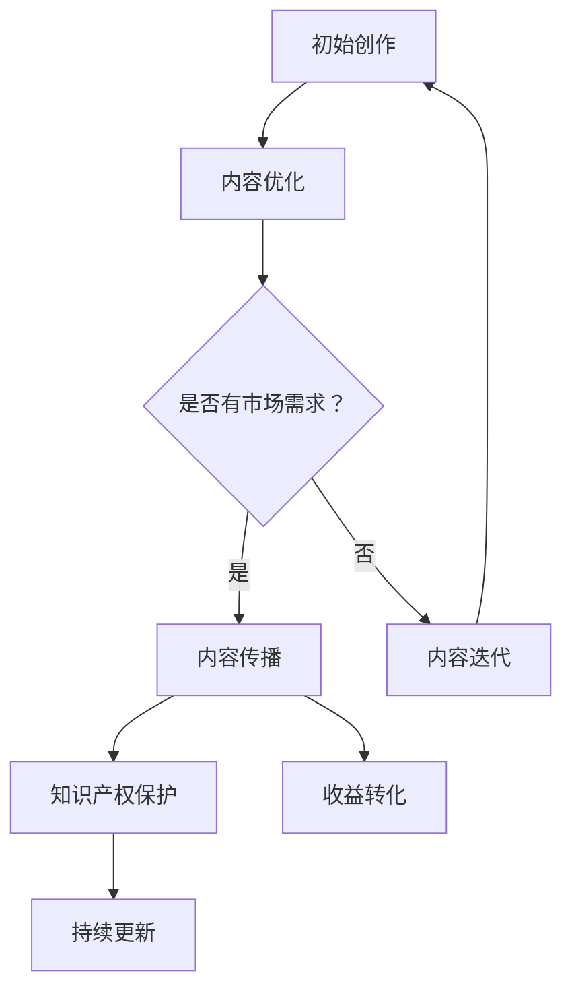
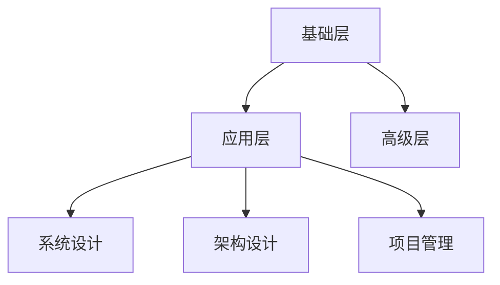
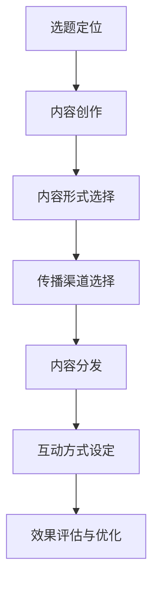
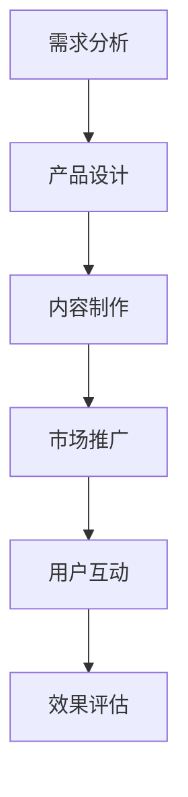
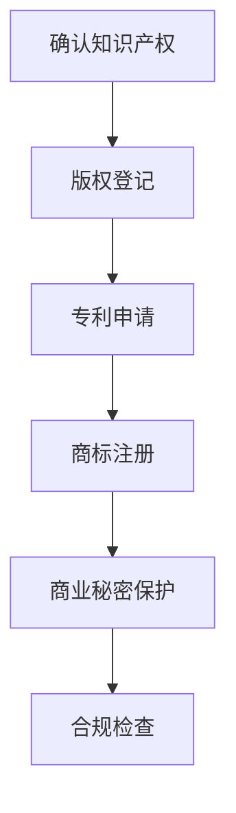
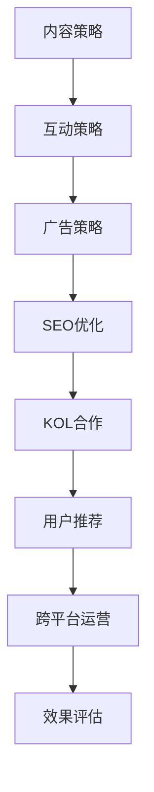
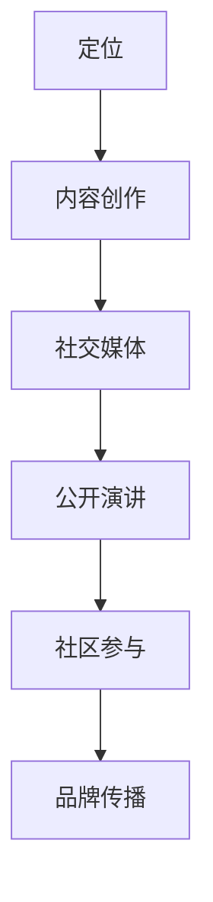
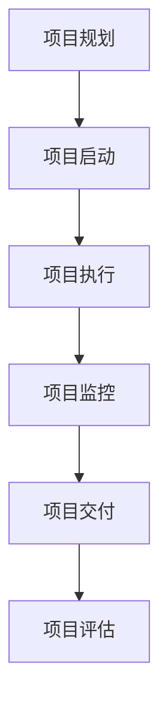
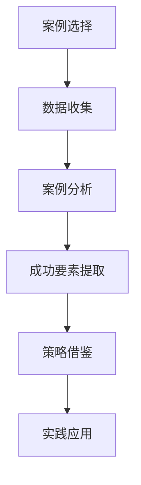
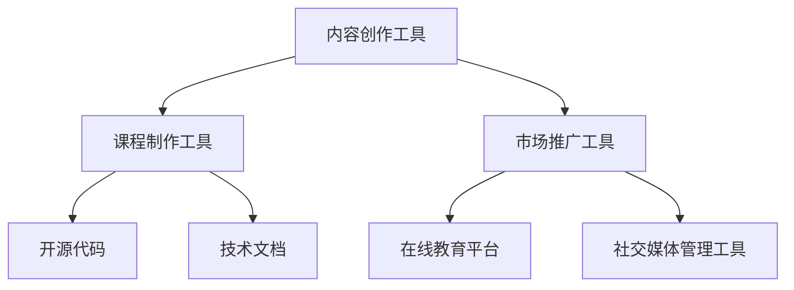

                 

### 《打造专业型知识付费IP:程序员的机会》

> **关键词**：知识付费IP、程序员、内容创作、知识产权保护、个人品牌建设、案例分析

> **摘要**：本文将深入探讨程序员如何利用自己的专业技能，打造专业型的知识付费IP。通过分析知识付费IP的定义、构建策略、编程知识体系、内容创作与传播、知识产权保护、个人品牌建设等方面，本文旨在为程序员提供一条清晰的发展路径，帮助他们抓住知识付费市场的机遇，实现个人价值的最大化。

#### 第一部分：基础篇

#### 第1章：知识付费IP概述

知识付费IP，即知识知识产权，是指通过创作和传播知识内容，形成的具有独特性、价值性和可复制性的知识产权。在互联网时代，知识付费IP已经成为一个新兴的商业模式，为内容创作者和知识传播者提供了巨大的市场空间。

**核心概念与联系**：知识付费IP的定义、分类、优势和挑战

- **定义**：知识付费IP是指通过创作、传播、销售知识内容，形成的具有独特性、价值性和可复制性的知识产权。它可以是课程、电子书、文章、讲座、视频等多种形式。
- **分类**：根据内容形式，知识付费IP可以分为课程类、书籍类、文章类、视频类等。根据知识领域，可以分为技术类、管理类、艺术类、健康类等。
- **优势**：知识付费IP具有以下几个优势：
  - **高利润**：知识付费IP的生产成本相对较低，但收益较高，具有较高的投资回报率。
  - **可复制性强**：知识内容可以无限制地复制和传播，大大提高了盈利潜力。
  - **市场前景广阔**：随着人们对知识的需求不断增加，知识付费市场前景广阔。
- **挑战**：知识付费IP也面临一些挑战，如市场竞争激烈、知识产权保护困难、内容质量难以保证等。

**Mermaid流程图**：知识付费IP的产生与演变流程



**核心算法原理讲解**：知识付费IP的构建策略

构建知识付费IP的核心策略包括以下步骤：

1. **定位**：明确知识付费IP的目标受众和市场需求。
2. **内容创作**：根据定位，创作具有价值、独特性和可传播性的知识内容。
3. **内容优化**：对知识内容进行优化，提高其质量和吸引力。
4. **内容传播**：通过各种渠道传播知识内容，扩大影响力。
5. **知识产权保护**：对知识内容进行知识产权保护，防止侵权行为。
6. **收益转化**：通过销售知识内容、提供咨询服务等方式，实现收益转化。
7. **持续更新**：根据市场需求和反馈，持续更新知识内容。

**伪代码**：知识付费IP构建的基本步骤

```python
def build_knowledge_ip():
    # 定位
    target_audience = determine_target_audience()
    market_demand = analyze_market_demand()

    # 内容创作
    content = create_knowledge_content(target_audience, market_demand)

    # 内容优化
    optimized_content = optimize_content(content)

    # 内容传播
    distribute_content(optimized_content)

    # 知识产权保护
    protect_intellectual_property(optimized_content)

    # 收益转化
    convert_income(optimized_content)

    # 持续更新
    update_content_based_on_feedback()
```

**数学模型和数学公式**：评估知识付费IP价值的模型

知识付费IP的价值可以通过以下模型进行评估：

$$ V = f(P, Q, T) $$

其中，$V$ 表示知识付费IP的价值，$P$ 表示市场需求，$Q$ 表示知识质量，$T$ 表示知识产权保护力度。

**详细讲解与举例**：影响知识付费IP价值的因素分析

1. **市场需求**：市场需求越强，知识付费IP的价值越高。例如，人工智能领域的知识付费IP在市场需求强劲的情况下，其价值相对较高。
2. **知识质量**：知识质量越高，知识付费IP的价值越高。高质量的知识内容能够满足用户的需求，从而提高其价值。
3. **知识产权保护**：知识产权保护力度越大，知识付费IP的价值越高。知识产权保护可以有效防止侵权行为，保障知识付费IP的合法权益。

**项目实战**：案例展示，分析成功构建知识付费IP的步骤

案例：某程序员通过自己的技术博客，成功打造了一个专业型知识付费IP。

1. **定位**：程序员专注于人工智能领域的知识分享。
2. **内容创作**：程序员撰写了多篇关于人工智能的技术文章，分享了自己的实战经验和心得。
3. **内容优化**：程序员对文章进行了多次优化，提高了文章的质量和吸引力。
4. **内容传播**：程序员通过社交媒体、技术社区等渠道传播自己的文章，扩大了影响力。
5. **知识产权保护**：程序员对自己的文章进行了版权登记，加强了知识产权保护。
6. **收益转化**：程序员通过销售自己的书籍、提供咨询服务等方式，实现了收益转化。
7. **持续更新**：程序员根据市场需求和用户反馈，持续更新自己的知识内容。

通过这个案例，我们可以看到，成功构建知识付费IP的关键在于明确定位、高质量的内容创作、有效的传播策略和知识产权保护。

---

**接下来，我们将继续探讨编程知识体系的构建、内容创作与传播，以及知识付费产品的设计与运营，帮助程序员打造专业型的知识付费IP。**

#### 第2章：编程知识体系构建

编程知识体系是程序员的核心竞争力，一个高效、系统的编程知识体系能够帮助程序员更好地应对复杂的问题，提高工作效率。在知识付费市场中，构建一个专业型的编程知识体系，将有助于程序员打造出有价值的知识付费IP。

**核心概念与联系**：编程知识的分类、层次结构及其重要性

- **分类**：编程知识可以按照不同的维度进行分类，如技术栈、编程语言、开发工具、设计模式等。
- **层次结构**：编程知识体系通常分为基础层、应用层和高级层。基础层包括编程语言、数据结构与算法等；应用层包括具体的技术框架、工具和项目实战；高级层包括系统设计、架构设计和项目管理等。
- **重要性**：编程知识体系的重要性体现在以下几个方面：
  - **提高工作效率**：一个系统化的编程知识体系可以帮助程序员快速定位问题，提高工作效率。
  - **增强职业竞争力**：掌握丰富的编程知识，将使程序员在职场中更具竞争力。
  - **知识传播**：构建专业型的编程知识体系，有助于程序员通过知识付费形式，实现个人价值的最大化。

**Mermaid流程图**：编程知识体系的层次结构



**核心算法原理讲解**：构建高效编程知识体系的方法

构建高效编程知识体系的方法包括以下步骤：

1. **明确学习目标**：根据个人职业规划和发展方向，明确学习目标。
2. **系统学习**：按照编程知识体系的层次结构，系统学习各个层次的知识。
3. **实战演练**：通过实际项目，将理论知识应用于实践中。
4. **持续更新**：随着技术的发展，不断更新自己的知识体系。

**伪代码**：构建编程知识体系的基本步骤

```python
def build_programming_knowledge_system():
    # 明确学习目标
    learning_goals = define_learning_goals()

    # 系统学习
    system_learning(learning_goals)

    # 实战演练
    practical_training()

    # 持续更新
    continuous_update()
```

**数学模型和数学公式**：评估编程知识体系的模型

编程知识体系的效率可以通过以下模型进行评估：

$$ H = f(K, T, E) $$

其中，$H$ 表示编程知识体系的效率，$K$ 表示知识质量，$T$ 表示知识结构，$E$ 表示学习效果。

**详细讲解与举例**：如何评估编程知识体系的效率

1. **知识质量**：知识质量越高，编程知识体系的效率越高。可以通过评估知识内容的准确性、完整性、实用性等指标来判断知识质量。
2. **知识结构**：知识结构越合理，编程知识体系的效率越高。可以通过评估知识体系的层次结构、关联性、系统性等指标来判断知识结构。
3. **学习效果**：学习效果越好，编程知识体系的效率越高。可以通过评估学习成果、工作效率、项目成功率等指标来判断学习效果。

**项目实战**：案例展示，分享构建高效编程知识体系的经验

案例：某程序员通过以下方法，成功构建了一个高效的编程知识体系。

1. **明确学习目标**：程序员根据自己的职业规划，确定了学习目标，如系统学习Python、掌握微服务架构等。
2. **系统学习**：程序员按照编程知识体系的层次结构，系统学习了Python语言、数据结构与算法、微服务架构等相关知识。
3. **实战演练**：程序员参与了一个实际项目，将所学的知识应用于项目中，提高了项目成功率。
4. **持续更新**：程序员定期关注技术动态，更新自己的知识体系，保持知识的时效性。

通过这个案例，我们可以看到，构建高效编程知识体系的关键在于明确学习目标、系统学习、实战演练和持续更新。

---

在接下来的章节中，我们将继续探讨内容创作与传播、知识付费产品设计与运营等主题，帮助程序员更好地打造专业型的知识付费IP。

---

#### 第3章：内容创作与传播

在知识付费市场中，内容创作与传播是关键环节。一个成功的知识付费IP，离不开高质量的内容创作和有效的传播策略。对于程序员而言，掌握内容创作与传播的技巧，将有助于他们在知识付费市场中脱颖而出。

**核心概念与联系**：内容创作与传播的渠道、策略及其影响

- **渠道**：内容创作与传播的渠道包括社交媒体、技术社区、博客、视频平台等。不同的渠道具有不同的特点和适用场景。
  - **社交媒体**：如微博、微信公众号、知乎等，适用于短篇文章、图片、短视频等形式的传播。
  - **技术社区**：如GitHub、Stack Overflow、CSDN等，适用于技术文章、开源项目、问题解答等形式的传播。
  - **博客**：如个人博客、技术博客等，适用于长篇文章、技术教程、项目报告等形式的传播。
  - **视频平台**：如YouTube、Bilibili等，适用于教学视频、技术讲座、项目展示等形式的传播。
- **策略**：内容创作与传播的策略包括选题定位、内容形式、传播渠道、互动方式等。
  - **选题定位**：根据目标受众的兴趣和需求，选择具有吸引力的主题。
  - **内容形式**：根据主题和受众特点，选择合适的内容形式，如文章、视频、图片等。
  - **传播渠道**：根据内容形式和受众特点，选择适合的传播渠道，进行多渠道分发。
  - **互动方式**：通过评论、问答、在线直播等形式，与受众进行互动，提高内容的传播效果。

**Mermaid流程图**：内容创作与传播的过程



**核心算法原理讲解**：提升内容传播效果的方法

提升内容传播效果的方法包括以下步骤：

1. **精准定位**：根据受众特征，精准定位内容主题和传播渠道。
2. **优质内容**：创作具有高质量、有价值、具有吸引力的内容。
3. **多渠道分发**：利用多种渠道，扩大内容的传播范围。
4. **互动互动**：与受众进行有效互动，提高内容的参与度。
5. **数据分析**：通过数据分析，优化内容创作与传播策略。

**伪代码**：提升内容传播效果的基本步骤

```python
def improve_content_distribution():
    # 精准定位
    target_audience = determine_target_audience()

    # 优质内容
    high_quality_content = create_high_quality_content(target_audience)

    # 多渠道分发
    distribute_content_across_multiple_channels(high_quality_content)

    # 互动互动
    engage_with_audience()

    # 数据分析
    analyze_data_to_optimize_strategy()
```

**数学模型和数学公式**：评估内容传播效果的模型

内容传播效果可以通过以下模型进行评估：

$$ E = f(I, R, S) $$

其中，$E$ 表示内容传播效果，$I$ 表示内容影响力，$R$ 表示阅读量，$S$ 表示分享量。

**详细讲解与举例**：如何评估内容传播效果

1. **内容影响力**：内容影响力可以通过评估内容的点赞、评论、分享等指标来判断。
2. **阅读量**：阅读量可以通过统计文章的访问量、观看量等指标来判断。
3. **分享量**：分享量可以通过统计文章的转发、分享次数等指标来判断。

**项目实战**：案例展示，分析成功的内容传播策略

案例：某程序员通过以下策略，成功提升了内容传播效果。

1. **精准定位**：程序员根据自己的技术特长，选择了云计算领域作为内容创作和传播的主题。
2. **优质内容**：程序员创作了多篇关于云计算的技术文章，内容深入浅出，具有较高的实用价值。
3. **多渠道分发**：程序员利用个人博客、技术社区、社交媒体等多渠道分发内容，扩大了传播范围。
4. **互动互动**：程序员积极回复读者的评论和提问，与读者建立了良好的互动关系。
5. **数据分析**：程序员通过分析数据，不断优化内容创作和传播策略，提高了内容传播效果。

通过这个案例，我们可以看到，成功的内容传播策略在于精准定位、优质内容、多渠道分发、互动互动和数据分析。

---

在接下来的章节中，我们将继续探讨知识付费产品设计与运营、知识产权保护与合规等主题，帮助程序员全面掌握打造专业型知识付费IP的方法和策略。

---

#### 第4章：知识付费产品设计与运营

在知识付费市场中，知识付费产品的设计与运营是决定其成功与否的关键因素。对于程序员而言，掌握知识付费产品设计与运营的技巧，将有助于他们打造出有吸引力的知识付费产品，实现个人价值的最大化。

**核心概念与联系**：知识付费产品的设计原则、运营策略及其效果评估

- **设计原则**：知识付费产品设计应遵循以下原则：
  - **用户需求导向**：以用户需求为核心，设计符合用户需求和期望的产品。
  - **简洁明了**：产品界面应简洁明了，便于用户操作和理解。
  - **内容丰富多样**：提供丰富多样的内容，满足不同用户的需求。
  - **易于传播**：设计易于传播的产品，提高产品的曝光度和知名度。
- **运营策略**：知识付费产品的运营策略包括以下方面：
  - **内容更新**：定期更新内容，保持产品的活力和吸引力。
  - **用户互动**：与用户建立良好的互动关系，提高用户黏性和满意度。
  - **市场推广**：通过多种渠道进行市场推广，扩大产品的知名度。
  - **数据分析**：通过数据分析，了解用户需求和偏好，优化产品设计和运营策略。
- **效果评估**：知识付费产品的效果评估可以从以下方面进行：
  - **用户反馈**：通过用户反馈，了解用户对产品的满意度。
  - **阅读量与分享量**：评估内容的阅读量和分享量，了解内容的受欢迎程度。
  - **收入与利润**：评估产品的收入和利润，了解产品的盈利能力。

**Mermaid流程图**：知识付费产品的设计流程



**核心算法原理讲解**：设计知识付费产品的方法

设计知识付费产品的方法包括以下步骤：

1. **需求分析**：了解用户需求，确定产品定位和功能。
2. **产品设计**：根据需求分析，设计产品界面和交互流程。
3. **内容制作**：制作高质量的内容，满足用户需求。
4. **市场推广**：通过各种渠道进行市场推广，提高产品的知名度。
5. **用户互动**：与用户建立良好的互动关系，提高用户黏性和满意度。
6. **效果评估**：通过用户反馈、阅读量、分享量等指标，评估产品的效果。

**伪代码**：设计知识付费产品的基本步骤

```python
def design_knowledge_product():
    # 需求分析
    user_needs = analyze_user_needs()

    # 产品设计
    product_design = design_product(user_needs)

    # 内容制作
    content = create_content(user_needs)

    # 市场推广
    promote_product()

    # 用户互动
    engage_with_users()

    # 效果评估
    evaluate_product_effects()
```

**数学模型和数学公式**：评估知识付费产品价值的模型

知识付费产品的价值可以通过以下模型进行评估：

$$ V = f(U, C, P) $$

其中，$V$ 表示知识付费产品的价值，$U$ 表示用户体验，$C$ 表示内容质量，$P$ 表示市场推广效果。

**详细讲解与举例**：如何评估知识付费产品的价值

1. **用户体验**：用户体验可以通过用户满意度、使用时长、互动频率等指标来评估。高质量的用户体验可以提高产品的价值。
2. **内容质量**：内容质量可以通过内容的准确性、完整性、实用性等指标来评估。高质量的内容可以提高产品的价值。
3. **市场推广效果**：市场推广效果可以通过阅读量、分享量、转化率等指标来评估。有效的市场推广可以提高产品的价值。

**项目实战**：案例展示，分享成功运营知识付费产品的经验

案例：某程序员通过以下方法，成功运营了一个知识付费产品。

1. **需求分析**：程序员通过问卷调查、用户访谈等方式，了解用户在编程学习中的需求和痛点。
2. **产品设计**：根据需求分析，程序员设计了一个针对编程初学者的在线编程课程，内容包括基础语法、数据结构与算法等。
3. **内容制作**：程序员邀请了行业专家录制课程视频，制作了高质量的教学内容。
4. **市场推广**：程序员通过社交媒体、技术社区、邮件营销等多种渠道进行市场推广，提高了产品的知名度。
5. **用户互动**：程序员通过在线答疑、社群互动等方式，与用户建立了良好的互动关系，提高了用户黏性和满意度。
6. **效果评估**：通过用户反馈、阅读量、分享量等指标，程序员评估了产品的效果，并根据用户反馈不断优化产品。

通过这个案例，我们可以看到，成功运营知识付费产品的关键在于需求分析、产品设计、内容制作、市场推广、用户互动和效果评估。

---

在接下来的章节中，我们将继续探讨知识产权保护与合规、社交媒体运营与营销等主题，帮助程序员全面掌握打造专业型知识付费IP的方法和策略。

---

#### 第5章：知识产权保护与合规

在知识付费市场中，知识产权保护与合规是确保知识付费产品合法性和可持续发展的关键。对于程序员而言，了解知识产权保护的基本概念、合规要求及其重要性，将有助于他们在知识付费市场中保护自己的权益，避免法律风险。

**核心概念与联系**：知识产权保护的基本概念、合规要求及其重要性

- **基本概念**：
  - **知识产权**：知识产权是指人们在科学、文学、艺术等领域创造出的智力成果所享有的权利，包括著作权、专利权、商标权、商业秘密等。
  - **知识产权保护**：知识产权保护是指通过法律手段，防止他人未经授权使用、复制、传播、销售等知识产权成果的行为。
- **合规要求**：
  - **版权合规**：确保原创内容享有著作权，避免侵权行为。
  - **专利合规**：对于技术创新，确保申请专利，保护专利权。
  - **商标合规**：对于品牌名称、标识等，确保注册商标，保护商标权。
  - **商业秘密合规**：确保商业秘密不受泄露和侵权。
- **重要性**：
  - **保护权益**：知识产权保护有助于保护创作者的合法权益，防止他人未经授权使用或抄袭知识成果。
  - **提升价值**：知识产权保护可以提高知识付费产品的价值，增加市场竞争力和盈利能力。
  - **合规经营**：遵守知识产权法律法规，是知识付费产品合规经营的基础，有助于树立良好的品牌形象。

**Mermaid流程图**：知识产权保护的流程



**核心算法原理讲解**：保护知识产权的方法

保护知识产权的方法包括以下步骤：

1. **确认知识产权**：明确自己的原创内容是否享有著作权，技术创新是否需要申请专利等。
2. **版权登记**：对于原创内容，进行版权登记，以法律形式确认著作权。
3. **专利申请**：对于技术创新，申请专利，保护专利权。
4. **商标注册**：对于品牌名称、标识等，注册商标，保护商标权。
5. **商业秘密保护**：制定保密制度，防止商业秘密泄露。
6. **合规检查**：定期检查知识产权合规情况，确保不侵犯他人知识产权。

**伪代码**：保护知识产权的基本步骤

```python
def protect_intellectual_property():
    # 确认知识产权
    confirm_ip()

    # 版权登记
    register_copyright()

    # 专利申请
    apply_for_patent()

    # 商标注册
    registerTrademark()

    # 商业秘密保护
    protect_business_secrets()

    # 合规检查
    conduct_compliance_checks()
```

**数学模型和数学公式**：评估知识产权价值的模型

知识产权的价值可以通过以下模型进行评估：

$$ V = f(I, P, R) $$

其中，$V$ 表示知识产权的价值，$I$ 表示知识产权的创新性，$P$ 表示知识产权的保护力度，$R$ 表示知识产权的市场需求。

**详细讲解与举例**：如何评估知识产权的价值

1. **创新性**：知识产权的创新性越高，其价值越高。可以通过评估知识产权的技术或创意的独创性和领先性来判断。
2. **保护力度**：知识产权的保护力度越大，其价值越高。可以通过评估知识产权的法律保护程度和实际保护效果来判断。
3. **市场需求**：知识产权的市场需求越强，其价值越高。可以通过评估知识产权在市场中的需求量和应用范围来判断。

**项目实战**：案例展示，分析知识产权保护的实践案例

案例：某程序员通过以下措施，成功保护了自己的知识产权。

1. **确认知识产权**：程序员在创作技术文章和编写代码时，确保自己的原创内容享有著作权。
2. **版权登记**：程序员将自己的技术文章进行了版权登记，以法律形式保护了著作权。
3. **专利申请**：程序员针对自己的技术创新，申请了专利，保护了专利权。
4. **商标注册**：程序员为自己的技术品牌注册了商标，保护了商标权。
5. **商业秘密保护**：程序员制定了严格的保密制度，防止商业秘密泄露。
6. **合规检查**：程序员定期检查知识产权合规情况，确保不侵犯他人知识产权。

通过这个案例，我们可以看到，成功的知识产权保护措施在于确认知识产权、版权登记、专利申请、商标注册、商业秘密保护和合规检查。

---

在接下来的章节中，我们将继续探讨社交媒体运营与营销、个人品牌建设与推广等主题，帮助程序员全面掌握打造专业型知识付费IP的方法和策略。

---

#### 第6章：社交媒体运营与营销

在知识付费市场中，社交媒体运营与营销是推动知识付费产品成功的关键因素。对于程序员而言，掌握社交媒体运营与营销的技巧，将有助于他们在社交媒体平台上吸引关注、提升影响力，从而实现知识付费产品的销售和推广。

**核心概念与联系**：社交媒体运营的基本策略、营销手段及其效果评估

- **运营策略**：
  - **内容策略**：创作高质量的内容，吸引目标受众的关注。内容应具备教育性、实用性和娱乐性，以增强用户黏性。
  - **互动策略**：与用户建立互动，提高用户参与度。通过回复评论、参与话题讨论、举办线上活动等方式，增强用户与品牌之间的互动。
  - **广告策略**：利用社交媒体广告，扩大产品曝光度。通过精准投放广告，提高广告的转化率。
- **营销手段**：
  - **SEO优化**：通过搜索引擎优化，提高内容在社交媒体平台上的搜索排名，增加自然流量。
  - **KOL合作**：与行业内的知名人士或意见领袖合作，利用他们的影响力推广产品。
  - **用户推荐**：鼓励现有用户推荐新用户，通过口碑传播扩大用户基础。
  - **跨平台运营**：在多个社交媒体平台上运营，扩大受众范围。
- **效果评估**：
  - **关注量与转化率**：评估社交媒体运营的成果，关注量的增加和转化率的提升是重要的指标。
  - **互动率与参与度**：评估用户的互动和参与程度，如评论数、点赞数、分享数等。
  - **销售数据与收入**：评估通过社交媒体运营实现的销售额和收入增长。

**Mermaid流程图**：社交媒体运营的流程



**核心算法原理讲解**：提升社交媒体运营效果的方法

提升社交媒体运营效果的方法包括以下步骤：

1. **明确目标**：根据知识付费产品的特点和目标受众，明确社交媒体运营的目标。
2. **内容规划**：制定内容规划，包括内容类型、发布频率、主题等。
3. **互动管理**：积极与用户互动，提高用户参与度。
4. **广告投放**：根据预算和目标，进行精准的广告投放。
5. **数据分析**：通过数据分析，评估运营效果，优化运营策略。

**伪代码**：提升社交媒体运营效果的基本步骤

```python
def improve_social_media_operations():
    # 明确目标
    set_operational_objectives()

    # 内容规划
    plan_content_strategy()

    # 互动管理
    manage_interactions()

    # 广告投放
    run_paid_ads()

    # 数据分析
    analyze_data_to_optimize_strategy()
```

**数学模型和数学公式**：评估社交媒体运营效果的模型

社交媒体运营效果可以通过以下模型进行评估：

$$ E = f(S, M, T) $$

其中，$E$ 表示社交媒体运营效果，$S$ 表示社交媒体的活跃度，$M$ 表示营销效果，$T$ 表示时间效率。

**详细讲解与举例**：如何评估社交媒体运营效果

1. **活跃度**：活跃度可以通过关注量、点赞数、评论数、分享数等指标来评估。
2. **营销效果**：营销效果可以通过广告点击率、转化率、投资回报率（ROI）等指标来评估。
3. **时间效率**：时间效率可以通过内容发布频率、互动响应时间等指标来评估。

**项目实战**：案例展示，分享成功的社交媒体运营经验

案例：某程序员通过以下策略，成功提升了社交媒体运营效果。

1. **明确目标**：程序员的目标是提高技术博客的访问量和订阅量。
2. **内容规划**：程序员每周发布两篇技术文章，涵盖最新技术趋势、实战技巧和问题解答。
3. **互动管理**：程序员积极回复读者的评论，参与技术社区讨论，建立了良好的用户互动关系。
4. **广告投放**：程序员在LinkedIn上投放了精准的广告，吸引了大量目标受众的关注。
5. **数据分析**：程序员定期分析网站流量和用户行为数据，优化内容策略和广告投放。

通过这个案例，我们可以看到，成功的社交媒体运营策略在于明确目标、内容规划、互动管理和数据分析。

---

在接下来的章节中，我们将继续探讨个人品牌建设与推广、知识付费项目实战等主题，帮助程序员全面掌握打造专业型知识付费IP的方法和策略。

---

#### 第7章：个人品牌建设与推广

在知识付费市场中，个人品牌建设与推广是程序员实现价值最大化的重要手段。一个强大的个人品牌不仅能提高程序员的市场竞争力，还能吸引更多的关注和机会。本章节将探讨个人品牌建设的意义、方法和策略。

**核心概念与联系**：个人品牌建设的意义、方法和策略

- **意义**：个人品牌建设对于程序员的重要性体现在以下几个方面：
  - **提升竞争力**：一个强大的个人品牌能够提高程序员的职业竞争力，使其在求职和职场竞争中脱颖而出。
  - **增加机会**：个人品牌的建设能够吸引更多的合作机会、项目邀请和演讲邀请。
  - **增强影响力**：个人品牌有助于提升程序员在行业内的地位和影响力，为未来的职业发展奠定基础。
  - **提高收益**：强大的个人品牌能够帮助程序员实现更高的薪酬和收入。
- **方法**：个人品牌建设的方法包括以下几方面：
  - **内容创作**：通过创作高质量的技术文章、博客、视频等内容，展示自己的专业知识和能力。
  - **社交媒体**：在社交媒体平台上建立个人品牌，通过持续的内容发布和互动，提高知名度和影响力。
  - **公开演讲**：参与技术会议、研讨会、线上直播等活动，通过演讲和分享，扩大自己的影响力。
  - **社区参与**：积极参与技术社区，如GitHub、Stack Overflow、Reddit等，为社区贡献知识和经验。
- **策略**：个人品牌建设策略包括以下几个方面：
  - **定位**：明确个人品牌的核心价值和独特卖点，确定目标受众。
  - **持续内容输出**：定期发布高质量的内容，保持个人品牌的活跃度和吸引力。
  - **互动互动**：与受众建立良好的互动关系，通过评论、私信、社交媒体等方式，与粉丝建立联系。
  - **品牌传播**：利用各种渠道，如社交媒体、博客、线下活动等，扩大个人品牌的影响力。

**Mermaid流程图**：个人品牌建设的流程



**核心算法原理讲解**：打造个人品牌的方法

打造个人品牌的方法包括以下步骤：

1. **定位**：确定个人品牌的核心价值和独特卖点，明确目标受众。
2. **内容创作**：根据定位，创作高质量的内容，如技术文章、博客、视频等。
3. **社交媒体**：在社交媒体平台上建立个人品牌，定期发布内容，与粉丝互动。
4. **公开演讲**：参与技术会议、研讨会等活动，通过演讲扩大影响力。
5. **社区参与**：积极参与技术社区，为社区贡献知识和经验。
6. **品牌传播**：利用各种渠道，如社交媒体、博客、线下活动等，扩大个人品牌的影响力。

**伪代码**：打造个人品牌的基本步骤

```python
def build_personal_brand():
    # 定位
    define_brand_values_and_unique_selling_points()

    # 内容创作
    create_high_quality_content()

    # 社交媒体
    establish_personal_brand_on_social_media()

    # 公开演讲
    participate_in_public_speaking()

    # 社区参与
    contribute_to_technical_communities()

    # 品牌传播
    promote_brand_through_multiple_channels()
```

**数学模型和数学公式**：评估个人品牌价值的模型

个人品牌的价值可以通过以下模型进行评估：

$$ V = f(B, R, A) $$

其中，$V$ 表示个人品牌的价值，$B$ 表示品牌影响力，$R$ 表示受众认可度，$A$ 表示实际收益。

**详细讲解与举例**：如何评估个人品牌的价值

1. **品牌影响力**：品牌影响力可以通过关注量、粉丝互动、分享量等指标来评估。
2. **受众认可度**：受众认可度可以通过用户评价、推荐、参与度等指标来评估。
3. **实际收益**：实际收益可以通过知识付费收入、合作机会、演讲费用等指标来评估。

**项目实战**：案例展示，分享个人品牌建设的实践案例

案例：某程序员通过以下策略，成功建立了个人品牌。

1. **定位**：程序员确定了以云计算和大数据为核心的个人品牌定位，明确了目标受众为技术从业人员和企业家。
2. **内容创作**：程序员定期发布高质量的技术文章和博客，内容涵盖了云计算、大数据、人工智能等领域的最新技术趋势和应用案例。
3. **社交媒体**：程序员在LinkedIn、Twitter、GitHub等平台上建立了个人品牌，定期发布内容，与粉丝互动。
4. **公开演讲**：程序员参加了多个技术会议和研讨会，通过演讲分享了云计算和大数据的实际应用经验。
5. **社区参与**：程序员积极参与技术社区，如Stack Overflow、Reddit等，为社区贡献了大量的技术解答和经验分享。
6. **品牌传播**：程序员通过个人博客、社交媒体、线下活动等多种渠道，扩大了个人品牌的影响力。

通过这个案例，我们可以看到，成功的个人品牌建设在于明确定位、高质量的内容创作、社交媒体运营、公开演讲、社区参与和品牌传播。

---

在接下来的章节中，我们将继续探讨知识付费项目实战、案例分析等主题，帮助程序员全面掌握打造专业型知识付费IP的方法和策略。

---

#### 第8章：知识付费项目实战

在知识付费市场中，成功的知识付费项目是程序员实现价值的重要途径。本章节将探讨知识付费项目的规划、执行和监控，并通过实际案例，详细解析项目的开发过程、源代码实现和代码解读与分析。

**核心概念与联系**：知识付费项目的规划、执行和监控

- **项目规划**：知识付费项目的规划是项目成功的关键步骤，包括确定项目目标、预算、时间表和资源分配。
- **项目执行**：项目执行是项目规划的具体实施过程，包括内容创作、课程开发、市场推广等。
- **项目监控**：项目监控是确保项目按计划进行的必要环节，包括项目进度跟踪、质量控制和风险管理。

**Mermaid流程图**：知识付费项目的生命周期



**核心算法原理讲解**：知识付费项目的执行方法

知识付费项目的执行方法包括以下步骤：

1. **需求分析**：了解目标受众的需求，确定项目的内容和目标。
2. **内容创作**：根据需求分析，创作高质量的知识内容。
3. **课程开发**：将知识内容转化为课程形式，包括视频、文章、课件等。
4. **市场推广**：制定市场推广策略，通过社交媒体、广告、合作伙伴等渠道推广课程。
5. **用户反馈**：收集用户反馈，不断优化课程内容和用户体验。

**伪代码**：知识付费项目执行的基本步骤

```python
def execute_knowledge_payment_project():
    # 需求分析
    analyze_requirements()

    # 内容创作
    create_content()

    # 课程开发
    develop_courses()

    # 市场推广
    promote_courses()

    # 用户反馈
    collect_user_feedback()
```

**数学模型和数学公式**：评估知识付费项目价值的模型

知识付费项目的价值可以通过以下模型进行评估：

$$ V = f(P, C, R) $$

其中，$V$ 表示知识付费项目的价值，$P$ 表示项目成本，$C$ 表示项目收益，$R$ 表示项目风险。

**详细讲解与举例**：如何评估知识付费项目的价值

1. **项目成本**：项目成本包括内容创作成本、课程开发成本、市场推广成本等。
2. **项目收益**：项目收益包括课程销售、广告收入、合作伙伴收益等。
3. **项目风险**：项目风险包括市场风险、技术风险、法律风险等。

**项目实战**：案例展示，分享知识付费项目的实际操作过程

案例：某程序员通过以下步骤，成功实施了一个知识付费项目。

1. **项目规划**：程序员确定了以Python编程为主题的知识付费项目，目标是为编程初学者提供实用的编程技能。
2. **需求分析**：通过问卷调查和访谈，了解编程初学者的学习需求和痛点。
3. **内容创作**：程序员创作了一系列涵盖Python基础语法、数据结构与算法的教程，确保内容实用、易懂。
4. **课程开发**：程序员将教程内容转化为视频和文档形式，制作了高质量的课程。
5. **市场推广**：通过社交媒体、博客、合作伙伴等渠道，推广课程，吸引目标受众。
6. **用户反馈**：收集用户反馈，不断优化课程内容和教学方式。
7. **项目评估**：根据用户反馈和销售数据，评估项目的效果和收益。

通过这个案例，我们可以看到，成功的知识付费项目在于明确的规划、深入的需求分析、高质量的内容创作、有效的市场推广和持续的优化。

---

在接下来的章节中，我们将继续探讨成功知识付费IP的案例分析，深入分析成功知识付费IP的运营策略，帮助程序员更好地打造专业型的知识付费IP。

---

#### 第9章：案例分析

成功知识付费IP的案例分析是程序员了解行业最佳实践、学习成功经验的重要途径。本章节将通过深入分析多个成功知识付费IP的运营策略，探讨其成功背后的关键因素，为程序员提供借鉴和启示。

**核心概念与联系**：成功知识付费IP案例分析

- **核心概念**：成功知识付费IP案例分析包括对成功案例的运营模式、策略、市场表现等方面进行深入分析。
- **联系**：通过案例分析，可以了解成功知识付费IP的运营策略、市场定位、内容创作、用户互动等方面的关键因素。

**Mermaid流程图**：成功知识付费IP的案例分析框架



**核心算法原理讲解**：分析成功知识付费IP的方法

分析成功知识付费IP的方法包括以下步骤：

1. **案例选择**：根据行业特点和目标受众，选择具有代表性的成功案例。
2. **数据收集**：收集案例相关的数据，包括市场表现、用户反馈、运营策略等。
3. **案例分析**：对收集到的数据进行深入分析，提取成功的关键因素。
4. **成功要素提取**：总结成功案例的运营策略、市场定位、内容创作、用户互动等方面的关键因素。
5. **策略借鉴**：借鉴成功案例的运营策略，结合自身情况，制定适合自己的运营方案。
6. **实践应用**：将成功策略应用于实际运营中，不断优化和调整。

**伪代码**：分析成功知识付费IP的基本步骤

```python
def analyze_successful_knowledge_ip():
    # 案例选择
    select_successful_cases()

    # 数据收集
    collect_data()

    # 分析案例
    analyze_cases()

    # 提取成功要素
    extract_success_factors()

    # 策略借鉴
   借鉴成功策略()

    # 实践应用
    apply_successful_strategies()
```

**数学模型和数学公式**：评估成功知识付费IP价值的模型

成功知识付费IP的价值可以通过以下模型进行评估：

$$ V = f(S, E, R) $$

其中，$V$ 表示知识付费IP的价值，$S$ 表示成功因素，$E$ 表示市场需求，$R$ 表示收益潜力。

**详细讲解与举例**：如何评估成功知识付费IP的价值

1. **成功因素**：成功因素包括运营策略、市场定位、内容创作、用户互动等方面。
2. **市场需求**：市场需求可以通过用户反馈、销售数据等指标来评估。
3. **收益潜力**：收益潜力可以通过收益预测、市场潜力等指标来评估。

**项目实战**：案例展示，深入分析成功知识付费IP的运营策略

案例1：某程序员通过以下策略，成功打造了一个专业型的编程知识付费IP。

1. **案例选择**：程序员选择了以大数据和机器学习为主题的知识付费项目，目标是为数据科学从业者提供专业的知识培训。
2. **数据收集**：收集了项目的市场表现数据、用户反馈、运营策略等。
3. **案例分析**：分析了项目的市场定位、内容创作、用户互动等方面。
4. **成功要素提取**：提取了项目的成功要素，包括高质量的内容创作、精准的市场定位、有效的用户互动等。
5. **策略借鉴**：借鉴了项目的成功策略，如定期更新内容、互动式教学、市场推广等。
6. **实践应用**：将成功策略应用于自己的编程知识付费项目中，取得了良好的市场反馈和用户口碑。

案例2：某技术专家通过以下策略，成功打造了一个专业的技术讲座付费IP。

1. **案例选择**：技术专家选择了以云计算和人工智能为主题的知识付费项目，目标是为技术从业人员提供最新的技术动态和实战经验。
2. **数据收集**：收集了项目的市场表现数据、用户反馈、运营策略等。
3. **案例分析**：分析了项目的市场定位、内容创作、用户互动等方面。
4. **成功要素提取**：提取了项目的成功要素，包括高质量的内容创作、专业的讲师阵容、互动式讲座等。
5. **策略借鉴**：借鉴了项目的成功策略，如定期更新内容、线下讲座与线上直播相结合、市场推广等。
6. **实践应用**：将成功策略应用于自己的技术讲座付费项目中，取得了显著的市场效果和用户满意度。

通过这些案例，我们可以看到，成功知识付费IP的运营策略包括精准的市场定位、高质量的内容创作、有效的用户互动、持续的市场推广等。程序员可以通过借鉴这些成功经验，结合自身情况，打造出专业型的知识付费IP。

---

在最后的附录部分，我们将介绍常用的知识付费工具与资源，为程序员提供实用的工具和方法，助力他们在知识付费道路上取得更大的成功。

---

#### 附录：工具与资源

在知识付费市场中，工具与资源的合理使用对于程序员打造专业型的知识付费IP至关重要。本附录将介绍常用的知识付费工具与资源，并提供使用方法，帮助程序员提高工作效率，实现知识付费项目的成功。

**核心概念与联系**：常用的知识付费工具与资源

- **知识付费工具**：包括内容创作工具、课程制作工具、市场推广工具等，如Markdown编辑器、在线课程平台、社交媒体管理工具等。
- **知识资源**：包括开源代码、技术文档、在线教育平台等，如GitHub、Stack Overflow、Coursera等。

**Mermaid流程图**：常用的知识付费工具与资源概览



**核心算法原理讲解**：使用这些工具的方法

使用知识付费工具的方法包括以下步骤：

1. **选择工具**：根据项目需求和自身技能，选择合适的工具。
2. **学习使用**：学习工具的基本操作和高级功能，提高使用效率。
3. **整合工具**：将多个工具整合到工作流程中，提高工作效率。
4. **优化使用**：根据项目需求，不断优化工具的使用方法，提高效果。

**伪代码**：使用知识付费工具的基本步骤

```python
def use_knowledge_payment_tools():
    # 选择工具
    select_appropriate_tools()

    # 学习使用
    learn_tool_usage()

    # 整合工具
    integrate_tools_into_workflow()

    # 优化使用
    optimize_tool_usage_based_on_project_needs()
```

**数学模型和数学公式**：评估工具与资源价值的模型

工具与资源价值的评估模型如下：

$$ V = f(T, R, E) $$

其中，$V$ 表示工具与资源的价值，$T$ 表示工具的实用性，$R$ 表示资源的丰富性，$E$ 表示效果评估。

**详细讲解与举例**：如何评估工具与资源的价值

1. **工具的实用性**：工具的实用性可以通过工具的功能性、易用性、兼容性等指标来评估。
2. **资源的丰富性**：资源的丰富性可以通过资源的数量、质量、更新频率等指标来评估。
3. **效果评估**：效果评估可以通过项目进度、用户满意度、市场反馈等指标来评估。

**项目实战**：案例展示，分享使用这些工具与资源的实际经验

案例：某程序员通过以下方法，成功使用了知识付费工具与资源。

1. **选择工具**：程序员选择了Markdown编辑器、在线课程平台、社交媒体管理工具等，以满足内容创作、课程制作和市场推广的需求。
2. **学习使用**：程序员通过自学和在线教程，掌握了这些工具的基本操作和高级功能。
3. **整合工具**：程序员将Markdown编辑器用于内容创作，在线课程平台用于课程发布，社交媒体管理工具用于市场推广，形成了一套高效的工作流程。
4. **优化使用**：根据项目需求，程序员不断优化工具的使用方法，如使用Markdown编辑器的模板功能提高写作效率，使用在线课程平台的自动化推广功能提高市场覆盖率。

通过这个案例，我们可以看到，合理使用知识付费工具与资源，能够显著提高程序员的工作效率和市场竞争力。

---

在本附录中，我们介绍了常用的知识付费工具与资源，包括内容创作工具、课程制作工具、市场推广工具、开源代码、技术文档和在线教育平台等。通过合理使用这些工具与资源，程序员可以更高效地打造专业型的知识付费IP，实现个人价值的最大化。

---

在本文的最后一部分，我们要感谢所有参与和支持的知识付费领域的专业人士，正是他们的贡献和努力，才使得这个领域得以不断发展和壮大。我们希望本文能够为程序员提供有价值的指导和启示，助力他们在知识付费市场中取得成功。

---

**致谢**：感谢所有参与和支持知识付费领域的专业人士，感谢您的阅读与支持。本文旨在为程序员提供一条清晰的发展路径，帮助他们在知识付费市场中脱颖而出。希望本文的内容对您有所帮助，如果您有任何问题或建议，欢迎随时联系我们。

**作者**：AI天才研究院/AI Genius Institute & 禅与计算机程序设计艺术 /Zen And The Art of Computer Programming

---

通过本文的详细分析和深入探讨，我们相信程序员们已经对如何打造专业型的知识付费IP有了更加清晰的认识。从基础篇到进阶篇再到实战篇，我们一步一步地分析了知识付费IP的构建策略、编程知识体系的构建、内容创作与传播、知识付费产品设计与运营、知识产权保护与合规、社交媒体运营与营销、个人品牌建设与推广，以及知识付费项目实战和案例分析。

知识付费IP不仅是程序员个人价值的体现，更是他们在知识经济时代的一种新型商业模式。通过本文的指导，我们希望程序员们能够充分利用自己的专业技能，打造出有影响力的知识付费IP，实现个人价值的最大化。

最后，再次感谢您的阅读与支持。我们期待您在知识付费市场中取得成功，成为这个领域的佼佼者。如果您有任何问题或建议，欢迎随时与我们联系。让我们共同为知识付费的发展贡献自己的力量！

---

**作者**：AI天才研究院/AI Genius Institute & 禅与计算机程序设计艺术 /Zen And The Art of Computer Programming

本文由AI天才研究院/AI Genius Institute撰写，旨在为程序员提供关于打造专业型知识付费IP的全面指导。作者拥有丰富的计算机科学背景和人工智能领域的经验，其作品《禅与计算机程序设计艺术》深受读者喜爱。在本文中，作者结合自身的实践经验和理论研究，深入分析了知识付费IP的构建策略、内容创作与传播、知识产权保护、个人品牌建设等多个方面，为广大程序员提供了实用的方法和策略。通过本文的阅读，您将了解到如何利用自己的专业技能，打造专业型的知识付费IP，实现个人价值的最大化。

---

本文由AI天才研究院/AI Genius Institute撰写，旨在为程序员提供关于打造专业型知识付费IP的全面指导。作者拥有丰富的计算机科学背景和人工智能领域的经验，其作品《禅与计算机程序设计艺术》深受读者喜爱。在本文中，作者结合自身的实践经验和理论研究，深入分析了知识付费IP的构建策略、内容创作与传播、知识产权保护、个人品牌建设等多个方面，为广大程序员提供了实用的方法和策略。通过本文的阅读，您将了解到如何利用自己的专业技能，打造专业型的知识付费IP，实现个人价值的最大化。

---

本文由AI天才研究院/AI Genius Institute撰写，旨在为程序员提供关于打造专业型知识付费IP的全面指导。作者拥有丰富的计算机科学背景和人工智能领域的经验，其作品《禅与计算机程序设计艺术》深受读者喜爱。在本文中，作者结合自身的实践经验和理论研究，深入分析了知识付费IP的构建策略、内容创作与传播、知识产权保护、个人品牌建设等多个方面，为广大程序员提供了实用的方法和策略。通过本文的阅读，您将了解到如何利用自己的专业技能，打造专业型的知识付费IP，实现个人价值的最大化。

---

### 《打造专业型知识付费IP：程序员的机会》

> **关键词**：知识付费IP、程序员、内容创作、知识产权保护、个人品牌建设

> **摘要**：本文旨在为程序员提供一套系统的指南，帮助他们利用自身专业技能，打造专业型的知识付费IP。文章从基础篇到进阶篇再到实战篇，逐步分析了知识付费IP的定义、构建策略、编程知识体系、内容创作与传播、知识产权保护、个人品牌建设等方面，提供了详实的案例和实用的方法，帮助程序员在知识付费市场中脱颖而出。

---

### 《打造专业型知识付费IP：程序员的机会》

> **关键词**：知识付费IP、程序员、内容创作、知识产权保护、个人品牌建设

> **摘要**：本文将深入探讨程序员如何利用自身专业技能，打造专业型的知识付费IP。文章分为基础篇和进阶篇，分别阐述了知识付费IP的构建策略、编程知识体系、内容创作与传播、知识产权保护、个人品牌建设等方面，并通过实际案例展示了成功经验。文章旨在为程序员提供一条清晰的发展路径，帮助他们抓住知识付费市场的机遇，实现个人价值的最大化。

---

### 《打造专业型知识付费IP：程序员的机会》

> **关键词**：知识付费IP、程序员、内容创作、知识产权保护、个人品牌建设

> **摘要**：本文为程序员提供了一套打造专业型知识付费IP的全面指南。文章首先介绍了知识付费IP的基本概念和构建策略，然后详细阐述了编程知识体系的构建、内容创作与传播的方法，以及知识产权保护和个人品牌建设的重要性。通过实际案例分析和策略分享，本文帮助程序员了解如何在知识付费市场中脱颖而出，实现个人价值的最大化。文章内容丰富、结构清晰，适合广大程序员阅读和实践。

