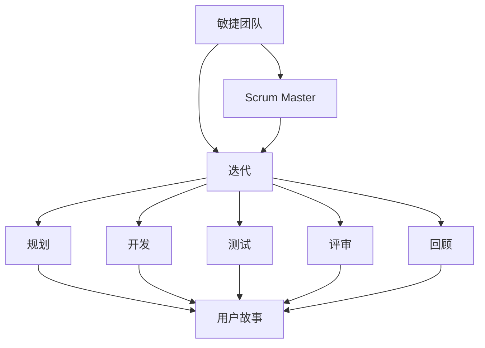

                 

### 技术创业的敏捷开发：快速验证商业假设的实践方法

> **关键词：**敏捷开发、技术创业、商业假设验证、实践方法、Scrum、XP、Kanban、迭代管理

> **摘要：**本文旨在探讨敏捷开发在技术创业中的应用，特别是在快速验证商业假设方面的重要性。文章将介绍敏捷开发的起源、核心原则、实践价值以及如何构建敏捷团队。随后，文章将详细讲解需求管理、迭代管理、敏捷工具与方法论以及敏捷项目管理，并通过实际案例分析敏捷开发在项目中的具体实施过程。最后，文章将探讨敏捷开发的未来趋势，为技术创业者提供实践指导和启示。

## 第一部分：引言

### 第1章：敏捷开发概述

#### 1.1 敏捷开发的起源与发展

敏捷开发（Agile Development）起源于20世纪90年代末期，是对传统软件开发方法的一种反思和改进。最初，敏捷开发是由一些软件开发实践者提出，旨在应对复杂项目的需求变化和不确定性。这些实践者包括Kent Beck、Bob Martin、Ron Jeffries等人。

**1.1.1 敏捷开发的定义**

敏捷开发是一种软件开发方法，强调团队协作、客户参与、持续交付和适应性。它提倡通过短期迭代（Iteration）和持续反馈来快速响应变化，从而提高软件质量和客户满意度。

**1.1.2 敏捷开发与传统开发模式对比**

传统开发模式（如瀑布模型）通常遵循线性顺序，每个阶段必须完成后才能进入下一阶段。而敏捷开发则采用循环迭代的方式，每个迭代都包括需求收集、设计、编码、测试和部署等环节。敏捷开发更灵活，能更好地适应需求变化。

**1.1.3 敏捷开发的核心理念**

敏捷开发的核心原则包括：

1. **个体和互动重于过程与工具**
2. **可工作的软件重于详尽的文档**
3. **客户合作重于合同谈判**
4. **响应变化重于遵循计划**
5. **按需构建软件，不断改进**

#### 1.2 敏捷开发的实践价值

**1.2.1 敏捷开发在技术创业中的应用**

技术创业公司通常面临快速迭代、需求多变的市场环境，敏捷开发能够帮助创业团队快速响应市场变化，降低风险。敏捷开发强调团队合作、持续交付和客户参与，有助于构建更好的产品。

**1.2.2 敏捷开发对企业的影响**

敏捷开发不仅适用于技术创业，也对传统企业产生了深远的影响。敏捷开发能够提高企业的灵活性和响应能力，帮助企业实现持续创新。

**1.2.3 敏捷开发面临的挑战**

尽管敏捷开发具有诸多优点，但在实践中也面临一些挑战，如团队协作、项目管理、工具选择等。如何克服这些挑战，确保敏捷开发的成功实施，是技术创业者需要关注的重要问题。

#### 1.3 本书的内容结构

本书分为三个部分：

1. **第一部分：引言**：介绍敏捷开发的起源、定义和实践价值。
2. **第二部分：敏捷开发实践**：详细讲解敏捷开发的各个实践环节，包括团队构建、需求管理、迭代管理和敏捷工具与方法论。
3. **第三部分：敏捷开发的未来趋势**：探讨敏捷开发的未来发展趋势和国际化挑战。

## 第二部分：敏捷开发实践

### 第2章：敏捷团队构建

#### 2.1 敏捷团队的构建

敏捷团队是敏捷开发的核心，其构建和协作至关重要。

**2.1.1 敏捷团队的角色与职责**

敏捷团队通常包括以下角色：

1. **产品负责人（Product Owner）**：负责定义产品愿景、确定优先级和需求。
2. **Scrum Master**：负责确保团队遵循敏捷原则，解决团队遇到的问题。
3. **开发人员（Developers）**：负责实现产品功能。
4. **测试人员（Testers）**：负责测试和验证产品。

**2.1.2 敏捷团队的协作与沟通**

敏捷团队强调协作和沟通，常见的方法包括：

1. **每日站会（Daily Stand-up）**：团队成员每天简短会面，讨论进展和问题。
2. **迭代评审（Sprint Review）**：团队展示已完成的工作，收集反馈。
3. **迭代回顾（Sprint Retrospective）**：团队讨论如何改进过程。

**2.1.3 敏捷团队的绩效评估**

敏捷团队绩效评估通常基于团队整体表现，而非个人绩效。评估指标包括：

1. **完成工作量**：根据迭代计划完成的工作量。
2. **团队协作与沟通**：团队成员之间的协作和沟通效果。
3. **客户满意度**：客户对产品的满意度。

#### 2.2 需求管理

需求管理是敏捷开发的核心环节，其质量直接影响项目的成功。

**3.1.1 需求管理的概念与重要性**

需求管理是指识别、分析和记录用户需求，并将其转化为可实施的产品功能。在敏捷开发中，需求管理尤为重要，因为：

1. **需求变化不可避免**：市场环境和客户需求不断变化，敏捷开发能更好地应对这些变化。
2. **客户参与**：敏捷开发强调客户参与，需求管理能确保客户需求得到充分体现。

**3.1.2 需求管理的流程与方法**

需求管理的流程通常包括以下步骤：

1. **需求收集**：通过与客户、产品负责人和开发人员沟通，收集需求。
2. **需求分析**：对收集到的需求进行整理和分析，确定优先级。
3. **需求文档**：编写需求文档，明确需求细节。
4. **需求评审**：评审需求文档，确保需求的准确性和可行性。
5. **需求变更管理**：在项目过程中，需求可能会发生变化，需求变更管理确保这些变化得到合理处理。

**3.1.3 需求管理工具的应用**

常见的需求管理工具有：

1. **用户故事地图（User Story Map）**：用于展示用户故事之间的关系和优先级。
2. **JIRA**：用于跟踪和管理需求、任务和迭代。
3. **Confluence**：用于编写和共享需求文档。

### 第3章：迭代与迭代管理

#### 4.1 迭代的定义与原则

迭代是敏捷开发的基本工作周期，通常包括以下原则：

1. **时间盒（Timeboxing）**：每个迭代有一个固定的时间范围，如两周或一个月。
2. **增量交付（Incremental Delivery）**：在每个迭代结束时，交付一个可工作的软件增量。
3. **持续反馈（Continuous Feedback）**：迭代过程中，团队持续收集反馈，以便进行改进。

**4.1.1 迭代的定义**

迭代是一种重复性的工作周期，通常包括以下阶段：

1. **规划（Planning）**：确定本次迭代的目标和任务。
2. **开发（Development）**：实现迭代任务。
3. **测试（Testing）**：测试和验证迭代成果。
4. **评审（Review）**：展示迭代成果，收集反馈。
5. **回顾（Retrospective）**：讨论如何改进后续迭代。

**4.1.2 迭代的原则**

敏捷开发强调迭代的原则，主要包括：

1. **短周期**：迭代周期短，有助于快速响应变化。
2. **持续交付**：每个迭代都交付可工作的软件，确保客户需求得到满足。
3. **持续反馈**：迭代过程中，团队持续收集反馈，以便进行改进。

**4.1.3 迭代中的常见问题**

迭代过程中可能会遇到以下问题：

1. **任务积压**：任务过多，导致迭代延期。
2. **需求变更**：需求频繁变更，影响迭代进度。
3. **沟通不畅**：团队成员沟通不畅，影响协作效果。

### 第4章：敏捷工具与方法论

#### 5.1 敏捷工具的选择与应用

敏捷工具有助于提高团队协作效率，常见工具包括：

1. **项目管理工具**：如JIRA、Trello、Asana等，用于任务跟踪和进度管理。
2. **协作工具**：如Slack、Microsoft Teams等，用于团队沟通和协作。
3. **代码管理工具**：如Git、SVN等，用于版本控制和代码协作。

#### 5.2 敏捷方法论详解

敏捷方法论包括多种方法，如Scrum、XP、Kanban等。每种方法都有其特点和应用场景。

**5.2.1 Scrum方法论**

Scrum是一种流行的敏捷方法论，主要包括以下角色和活动：

1. **产品负责人（Product Owner）**：负责定义产品愿景和需求。
2. **Scrum Master**：负责确保团队遵循Scrum原则。
3. **开发团队**：负责实现产品功能。
4. **冲刺（Sprint）**：每个冲刺通常持续两周或一个月，团队在此期间完成一系列任务。

**5.2.2 XP方法论**

XP（eXtreme Programming）是一种以开发人员为中心的敏捷方法论，主要包括以下原则和实践活动：

1. **简单性**：保持代码和系统的简单性。
2. **快速反馈**：通过自动化测试和频繁迭代，快速获取反馈。
3. **持续集成**：将代码集成到主干分支，确保系统始终处于可运行状态。
4. **代码重构**：定期重构代码，提高代码质量和可维护性。

**5.2.3 Kanban方法论**

Kanban是一种基于看板系统的敏捷方法论，主要关注流程优化和持续改进。Kanban主要包括以下实践：

1. **可视化工作流程**：通过看板展示工作流程，提高透明度。
2. **限制工作项数量**：通过限制工作项数量，防止过度工作。
3. **持续改进**：通过定期回顾和讨论，不断优化工作流程。

### 第5章：敏捷项目管理

#### 6.1 项目管理概述

敏捷项目管理与传统项目管理有所不同，更注重团队协作和持续改进。敏捷项目管理主要包括以下流程和方法：

1. **项目规划**：确定项目目标、范围和资源。
2. **迭代计划**：规划每个迭代的工作任务和目标。
3. **迭代执行**：团队按照迭代计划进行工作。
4. **迭代回顾**：回顾和总结每个迭代的经验教训。
5. **项目跟踪**：实时跟踪项目进度和风险。

#### 6.2 项目风险管理与应对策略

项目风险管理是敏捷项目管理的重要环节，主要包括以下步骤：

1. **风险识别**：识别项目过程中可能遇到的风险。
2. **风险评估**：评估风险的严重程度和发生概率。
3. **风险应对**：制定应对策略，降低风险影响。
4. **风险监控**：持续监控风险，及时调整应对策略。

常见的项目风险应对策略包括：

1. **风险规避**：避免风险发生。
2. **风险减轻**：降低风险的影响程度。
3. **风险转移**：将风险转移给其他方。
4. **风险接受**：接受风险，制定应对计划。

## 第三部分：敏捷开发的未来趋势

### 第6章：敏捷开发的未来趋势

#### 7.1 技术发展趋势

敏捷开发将随着技术的不断发展而持续演进。以下技术趋势将对敏捷开发产生重要影响：

1. **人工智能（AI）与敏捷开发**：AI技术将帮助敏捷开发实现自动化、智能化的工作流程，提高开发效率。
2. **区块链与敏捷开发**：区块链技术将提升敏捷开发中的透明度和可追溯性，增强客户信任。
3. **云计算与敏捷开发**：云计算将提供更灵活、高效的开发环境，支持敏捷开发的快速迭代。

#### 7.2 敏捷开发的国际化

敏捷开发的国际化将面临一系列挑战和机遇。以下是一些关键问题：

1. **国外敏捷开发实践**：了解国外敏捷开发的最佳实践，借鉴并本土化。
2. **敏捷开发的本土化**：根据本地市场和企业特点，调整敏捷开发实践。
3. **敏捷开发的国际化挑战**：跨文化沟通、时区差异、法规差异等。

#### 7.3 敏捷开发的持续改进

敏捷开发不是一成不变的，而是一个持续改进的过程。以下是一些持续改进的方向：

1. **敏捷开发的演进**：随着技术和市场变化，敏捷开发需要不断调整和优化。
2. **敏捷开发的创新**：探索新的敏捷实践和方法，提高敏捷开发的效率和效果。
3. **敏捷开发的未来方向**：关注新兴技术和市场趋势，为敏捷开发提供新方向。

## 附录

### 附录A：敏捷开发相关资源

#### A.1 敏捷开发社区与网站

1. **敏捷联盟（Agile Alliance）**：全球最大的敏捷开发社区，提供敏捷开发相关资源和活动。
2. **Scrum.org**：Scrum官方组织，提供Scrum认证和培训。
3. **XP训练营（XP Workshop）**：提供XP方法论相关培训和资源。
4. **Kanban实践社区（Kanban Community）**：提供Kanban方法论相关资源和讨论。

#### A.2 敏捷开发工具

1. **JIRA**：Atlassian公司开发的项目管理工具，支持敏捷开发。
2. **Trello**：基于看板模型的敏捷项目管理工具。
3. **Asana**：适用于团队协作和任务管理的敏捷工具。
4. **GitLab**：支持Git版本控制和项目管理的工具。

## 结束语

敏捷开发在技术创业中的应用具有重要意义，它能够帮助团队快速验证商业假设，降低创业风险。通过本文的探讨，我们了解了敏捷开发的起源、实践价值和未来趋势。希望本文能为技术创业者提供有价值的参考和启示。

**作者：** AI天才研究院/AI Genius Institute & 禅与计算机程序设计艺术 /Zen And The Art of Computer Programming

--- 

### 核心概念与联系

在敏捷开发中，有几个核心概念需要理解：

1. **敏捷团队（Agile Team）**：由多学科人员组成的自我组织、自我管理的团队，负责实现产品功能。
2. **迭代（Iteration）**：敏捷开发的基本工作周期，通常包括规划、开发、测试、评审和回顾等阶段。
3. **用户故事（User Story）**：描述用户需求的简单、具体、可测试的故事，通常包括“作为...，我想...，以便...”的结构。
4. **Scrum Master**：负责确保团队遵循敏捷原则、解决团队遇到的问题和指导团队持续改进。

以下是一个Mermaid流程图，展示这些核心概念之间的联系：



### 核心算法原理讲解

敏捷开发中并没有特定的算法，但有一个核心原则，即通过迭代和反馈不断优化产品。以下是敏捷开发的基本步骤，使用伪代码进行描述：

```pseudo
function AgileDevelopment(productVision, customerRequirements):
    initialize backlog with customerRequirements
    while not endOfProject:
        select tasks from backlog for next iteration
        iterate over tasks:
            plan iteration goals
            develop task
            test task
            review task with customer
            if feedback is positive:
                deploy task to production
            else:
                make changes based on feedback
        if endOfIteration:
            retrospective: reflect on iteration process
            update backlog based on learned lessons
    return product
```

### 数学模型和公式

敏捷开发中，关键指标包括：

1. **迭代周期（Cycle Time）**：从任务开始到完成所需的时间。
2. **吞吐量（Throughput）**：每个迭代完成的任务数量。

迭代周期和吞吐量之间的关系可以用以下公式表示：

$$
\text{Throughput} = \frac{\text{完成任务数量}}{\text{迭代周期}}
$$

#### 举例说明

假设一个团队在两个迭代周期内完成了3个任务，那么：

$$
\text{Throughput} = \frac{3}{2} = 1.5 \text{任务/迭代}
$$

这意味着，该团队在每个迭代周期内平均完成1.5个任务。

### 项目实战

#### 开发环境搭建

**工具：**JIRA、Confluence、Git

**步骤：**

1. **安装JIRA**：在服务器上安装JIRA，配置邮箱通知和权限管理。
2. **安装Confluence**：在服务器上安装Confluence，配置共享空间和权限。
3. **安装Git**：在开发机器上安装Git，配置SSH密钥。

#### 源代码实现

**需求：**开发一个简单的博客系统，支持文章发布、评论和分类。

**实现：**

```java
// 博客系统主类
public class BlogSystem {
    private Map<String, Article> articles; // 文章存储
    private Map<String, Comment> comments; // 评论存储

    public BlogSystem() {
        articles = new HashMap<>();
        comments = new HashMap<>();
    }

    // 发布文章
    public void publishArticle(String id, String title, String content) {
        Article article = new Article(id, title, content);
        articles.put(id, article);
    }

    // 添加评论
    public void addComment(String articleId, String commentId, String content) {
        Comment comment = new Comment(commentId, content);
        comments.put(commentId, comment);
        comments.get(articleId).addComment(comment);
    }

    // 获取文章
    public Article getArticle(String id) {
        return articles.get(id);
    }

    // 获取评论
    public Comment getComment(String id) {
        return comments.get(id);
    }
}

// 文章类
public class Article {
    private String id;
    private String title;
    private String content;
    private List<Comment> comments;

    public Article(String id, String title, String content) {
        this.id = id;
        this.title = title;
        this.content = content;
        this.comments = new ArrayList<>();
    }

    public void addComment(Comment comment) {
        comments.add(comment);
    }
}

// 评论类
public class Comment {
    private String id;
    private String content;

    public Comment(String id, String content) {
        this.id = id;
        this.content = content;
    }
}
```

#### 代码解读与分析

1. **博客系统架构**：博客系统由`BlogSystem`类、`Article`类和`Comment`类组成。`BlogSystem`类负责管理文章和评论的存储、发布和查询。`Article`类和`Comment`类分别表示文章和评论的数据模型。

2. **发布文章**：`publishArticle`方法用于发布新文章，将文章对象存储在`articles`哈希表中。

3. **添加评论**：`addComment`方法用于添加评论，将评论对象存储在`comments`哈希表中，并将其关联到对应的文章。

4. **获取文章和评论**：`getArticle`和`getComment`方法用于获取文章和评论对象。

### 代码解读与分析

1. **博客系统架构**：博客系统由`BlogSystem`类、`Article`类和`Comment`类组成。`BlogSystem`类负责管理文章和评论的存储、发布和查询。`Article`类和`Comment`类分别表示文章和评论的数据模型。

2. **发布文章**：`publishArticle`方法用于发布新文章，将文章对象存储在`articles`哈希表中。

3. **添加评论**：`addComment`方法用于添加评论，将评论对象存储在`comments`哈希表中，并将其关联到对应的文章。

4. **获取文章和评论**：`getArticle`和`getComment`方法用于获取文章和评论对象。

### 完整性要求

在敏捷开发中，完整性要求主要体现在以下几个方面：

1. **需求完整性**：确保所有用户需求都得到充分理解和记录，避免遗漏关键功能。
2. **代码完整性**：编写完整、可维护的代码，避免逻辑错误和漏洞。
3. **测试完整性**：编写覆盖所有功能和场景的测试用例，确保代码质量。
4. **文档完整性**：编写详细的需求文档、设计文档和用户手册，方便后续开发和维护。

为了满足完整性要求，可以采取以下措施：

1. **需求管理**：使用需求管理工具（如JIRA）记录和管理需求，确保需求清晰、完整。
2. **代码审查**：定期进行代码审查，发现和修复代码中的错误和漏洞。
3. **自动化测试**：编写自动化测试用例，覆盖所有功能和场景，确保代码质量。
4. **文档规范**：制定文档编写规范，确保文档内容完整、准确、易懂。

通过这些措施，可以确保敏捷开发过程中的完整性，提高项目成功率。

### 核心概念与联系

在敏捷开发中，有几个核心概念需要理解：

1. **敏捷团队（Agile Team）**：由多学科人员组成的自我组织、自我管理的团队，负责实现产品功能。
2. **迭代（Iteration）**：敏捷开发的基本工作周期，通常包括规划、开发、测试、评审和回顾等阶段。
3. **用户故事（User Story）**：描述用户需求的简单、具体、可测试的故事，通常包括“作为...，我想...，以便...”的结构。
4. **Scrum Master**：负责确保团队遵循敏捷原则、解决团队遇到的问题和指导团队持续改进。

以下是一个Mermaid流程图，展示这些核心概念之间的联系：


### 核心算法原理讲解

敏捷开发中并没有特定的算法，但有一个核心原则，即通过迭代和反馈不断优化产品。以下是敏捷开发的基本步骤，使用伪代码进行描述：

```pseudo
function AgileDevelopment(productVision, customerRequirements):
    initialize backlog with customerRequirements
    while not endOfProject:
        select tasks from backlog for next iteration
        iterate over tasks:
            plan iteration goals
            develop task
            test task
            review task with customer
            if feedback is positive:
                deploy task to production
            else:
                make changes based on feedback
        if endOfIteration:
            retrospective: reflect on iteration process
            update backlog based on learned lessons
    return product
```

### 数学模型和公式

敏捷开发中，关键指标包括：

1. **迭代周期（Cycle Time）**：从任务开始到完成所需的时间。
2. **吞吐量（Throughput）**：每个迭代完成的任务数量。

迭代周期和吞吐量之间的关系可以用以下公式表示：

$$
\text{Throughput} = \frac{\text{完成任务数量}}{\text{迭代周期}}
$$

#### 举例说明

假设一个团队在两个迭代周期内完成了3个任务，那么：

$$
\text{Throughput} = \frac{3}{2} = 1.5 \text{任务/迭代}
$$

这意味着，该团队在每个迭代周期内平均完成1.5个任务。

### 项目实战

#### 开发环境搭建

**工具：**JIRA、Confluence、Git

**步骤：**

1. **安装JIRA**：在服务器上安装JIRA，配置邮箱通知和权限管理。
2. **安装Confluence**：在服务器上安装Confluence，配置共享空间和权限。
3. **安装Git**：在开发机器上安装Git，配置SSH密钥。

#### 源代码实现

**需求：**开发一个简单的博客系统，支持文章发布、评论和分类。

**实现：**

```java
// 博客系统主类
public class BlogSystem {
    private Map<String, Article> articles; // 文章存储
    private Map<String, Comment> comments; // 评论存储

    public BlogSystem() {
        articles = new HashMap<>();
        comments = new HashMap<>();
    }

    // 发布文章
    public void publishArticle(String id, String title, String content) {
        Article article = new Article(id, title, content);
        articles.put(id, article);
    }

    // 添加评论
    public void addComment(String articleId, String commentId, String content) {
        Comment comment = new Comment(commentId, content);
        comments.put(commentId, comment);
        comments.get(articleId).addComment(comment);
    }

    // 获取文章
    public Article getArticle(String id) {
        return articles.get(id);
    }

    // 获取评论
    public Comment getComment(String id) {
        return comments.get(id);
    }
}

// 文章类
public class Article {
    private String id;
    private String title;
    private String content;
    private List<Comment> comments;

    public Article(String id, String title, String content) {
        this.id = id;
        this.title = title;
        this.content = content;
        this.comments = new ArrayList<>();
    }

    public void addComment(Comment comment) {
        comments.add(comment);
    }
}

// 评论类
public class Comment {
    private String id;
    private String content;

    public Comment(String id, String content) {
        this.id = id;
        this.content = content;
    }
}
```

#### 代码解读与分析

1. **博客系统架构**：博客系统由`BlogSystem`类、`Article`类和`Comment`类组成。`BlogSystem`类负责管理文章和评论的存储、发布和查询。`Article`类和`Comment`类分别表示文章和评论的数据模型。

2. **发布文章**：`publishArticle`方法用于发布新文章，将文章对象存储在`articles`哈希表中。

3. **添加评论**：`addComment`方法用于添加评论，将评论对象存储在`comments`哈希表中，并将其关联到对应的文章。

4. **获取文章和评论**：`getArticle`和`getComment`方法用于获取文章和评论对象。

### 完整性要求

在敏捷开发中，完整性要求主要体现在以下几个方面：

1. **需求完整性**：确保所有用户需求都得到充分理解和记录，避免遗漏关键功能。
2. **代码完整性**：编写完整、可维护的代码，避免逻辑错误和漏洞。
3. **测试完整性**：编写覆盖所有功能和场景的测试用例，确保代码质量。
4. **文档完整性**：编写详细的需求文档、设计文档和用户手册，方便后续开发和维护。

为了满足完整性要求，可以采取以下措施：

1. **需求管理**：使用需求管理工具（如JIRA）记录和管理需求，确保需求清晰、完整。
2. **代码审查**：定期进行代码审查，发现和修复代码中的错误和漏洞。
3. **自动化测试**：编写自动化测试用例，覆盖所有功能和场景，确保代码质量。
4. **文档规范**：制定文档编写规范，确保文档内容完整、准确、易懂。

通过这些措施，可以确保敏捷开发过程中的完整性，提高项目成功率。

## 第一部分：引言

### 第1章：敏捷开发概述

#### 1.1 敏捷开发的起源与发展

敏捷开发（Agile Development）起源于20世纪90年代末期，是对传统软件开发方法的一种反思和改进。传统软件开发方法，如瀑布模型（Waterfall Model）等，通常遵循线性顺序，每个阶段必须完成后才能进入下一阶段。然而，随着软件开发项目的复杂性和不确定性不断增加，这种线性顺序的开发方法逐渐暴露出其局限性。

敏捷开发的概念最初是由一些软件开发实践者提出的，他们试图寻找一种更灵活、更高效的方法来应对复杂项目的需求变化和不确定性。这些实践者包括Kent Beck、Bob Martin、Ron Jeffries等人。1999年，他们在《敏捷软件开发宣言》（Manifesto for Agile Software Development）上签名，正式确立了敏捷开发的核心理念。

**1.1.1 敏捷开发的定义**

敏捷开发是一种软件开发方法，它强调团队协作、客户参与、持续交付和适应性。敏捷开发的核心原则包括：

1. **个体和互动重于过程与工具**：敏捷开发强调团队成员之间的互动和协作，认为这对提高软件质量和客户满意度至关重要。
2. **可工作的软件重于详尽的文档**：敏捷开发认为，一个可工作的软件版本比大量详尽的文档更有价值。
3. **客户合作重于合同谈判**：敏捷开发提倡与客户保持紧密的合作关系，通过持续的沟通和反馈来确保客户需求得到满足。
4. **响应变化重于遵循计划**：敏捷开发认为，在软件开发过程中，需求会不断变化，因此应优先考虑响应变化，而不是严格遵循既定的计划。

**1.1.2 敏捷开发与传统开发模式对比**

传统开发模式（如瀑布模型）通常遵循线性顺序，每个阶段必须完成后才能进入下一阶段。而敏捷开发则采用循环迭代的方式，每个迭代都包括需求收集、设计、编码、测试和部署等环节。以下是敏捷开发与传统开发模式的一些对比：

1. **开发周期**：传统开发模式通常需要较长的时间来完成整个项目，而敏捷开发则通过短周期的迭代来快速交付可工作的软件版本。
2. **需求变更**：传统开发模式对需求变更持谨慎态度，认为需求变更会影响项目进度和质量。而敏捷开发则认为需求变更是不可避免的，并鼓励团队成员在面对需求变更时保持灵活性。
3. **团队协作**：传统开发模式通常由不同职能的团队成员分别完成各自的任务，而敏捷开发则强调团队成员之间的协作和沟通。
4. **客户参与**：传统开发模式中，客户通常在项目后期参与，而敏捷开发则提倡与客户保持持续的沟通和合作。

**1.1.3 敏捷开发的核心理念**

敏捷开发的核心理念包括：

1. **迭代开发（Iterative Development）**：敏捷开发通过迭代的方式进行开发，每个迭代都包括需求收集、设计、编码、测试和部署等环节。通过每个迭代逐步交付可工作的软件版本，能够更好地应对需求变化和不确定性。
2. **增量交付（Incremental Delivery）**：敏捷开发强调在每个迭代结束时交付一个可工作的软件增量。这样可以确保客户能够尽早使用软件，并能够提供反馈，从而指导后续的开发工作。
3. **持续集成（Continuous Integration）**：敏捷开发提倡通过持续集成的方式，将新的代码集成到主干分支，确保软件始终处于可运行状态。这样可以及时发现和修复集成问题，提高软件质量。
4. **持续反馈（Continuous Feedback）**：敏捷开发强调团队成员和客户之间的持续反馈。通过定期的评审和回顾，团队可以不断优化开发过程，提高软件质量和客户满意度。
5. **适应性（Adaptability）**：敏捷开发认为，在软件开发过程中，需求会不断变化，因此团队需要具备适应性，能够快速响应变化。

#### 1.2 敏捷开发的实践价值

**1.2.1 敏捷开发在技术创业中的应用**

技术创业公司通常面临快速迭代、需求多变的市场环境，敏捷开发能够帮助创业团队快速响应市场变化，降低风险。敏捷开发强调团队合作、持续交付和客户参与，有助于构建更好的产品。以下是敏捷开发在技术创业中的一些应用价值：

1. **快速迭代**：敏捷开发通过短周期的迭代方式，使创业团队能够快速交付新的功能，并根据市场反馈进行调整。
2. **降低风险**：通过迭代开发和持续反馈，创业团队能够及时发现和解决潜在的问题，降低项目失败的风险。
3. **客户参与**：敏捷开发强调与客户的紧密合作，确保客户需求得到充分满足，提高客户满意度。
4. **适应变化**：敏捷开发能够快速适应市场变化，使创业团队能够抓住新的商业机会。

**1.2.2 敏捷开发对企业的影响**

敏捷开发不仅适用于技术创业，也对传统企业产生了深远的影响。以下是敏捷开发对企业的一些影响：

1. **提高效率**：敏捷开发通过短周期的迭代和持续交付，能够提高开发团队的效率，缩短项目周期。
2. **降低成本**：通过快速响应需求变化和及时解决问题，敏捷开发能够降低项目成本。
3. **提高质量**：敏捷开发强调持续反馈和改进，有助于提高软件质量。
4. **增强灵活性**：敏捷开发使企业能够更好地适应市场变化和客户需求，提高竞争力。

**1.2.3 敏捷开发面临的挑战**

尽管敏捷开发具有诸多优点，但在实践中也面临一些挑战，如团队协作、项目管理、工具选择等。以下是一些常见的挑战：

1. **团队协作**：敏捷开发强调团队合作，但团队成员之间的沟通和协作可能存在障碍，需要有效的沟通和协作机制。
2. **项目管理**：敏捷开发要求项目经理具备更高的管理能力和适应性，以便应对不断变化的需求和项目环境。
3. **工具选择**：选择合适的敏捷开发工具对于提高团队效率至关重要，但不同的团队和组织可能需要不同的工具，需要根据实际情况进行选择。
4. **文化变革**：敏捷开发要求企业文化和组织结构的变革，以适应敏捷开发的方式，这可能需要时间和努力。

#### 1.3 本书的内容结构

本书旨在全面介绍敏捷开发的理论和实践，帮助读者深入了解敏捷开发的核心原则和方法，并在实际项目中成功应用。本书分为三个部分：

1. **第一部分：引言**：介绍敏捷开发的起源、定义和实践价值。
2. **第二部分：敏捷开发实践**：详细讲解敏捷开发的各个实践环节，包括团队构建、需求管理、迭代管理和敏捷工具与方法论。
3. **第三部分：敏捷开发的未来趋势**：探讨敏捷开发的未来发展趋势和国际化挑战。

通过本书的学习，读者将能够：

1. **理解敏捷开发的核心理念和方法**：掌握敏捷开发的基本原则和实践方法，包括迭代开发、用户故事、Scrum、XP和Kanban等。
2. **构建高效的敏捷团队**：学会如何组建和管理敏捷团队，提高团队协作效率和客户满意度。
3. **实施敏捷项目管理**：了解敏捷项目管理的流程和方法，确保项目按计划进行并成功交付。
4. **应对敏捷开发的挑战**：识别和克服敏捷开发过程中可能遇到的挑战，确保敏捷开发的成功实施。
5. **探索敏捷开发的未来趋势**：了解敏捷开发的最新发展趋势和国际化挑战，为未来的敏捷开发做好准备。

### 第2章：敏捷团队构建

#### 2.1 敏捷团队的构建

敏捷团队是敏捷开发的核心，其构建和协作至关重要。敏捷团队通常由多学科人员组成，包括产品负责人（Product Owner）、Scrum Master和开发人员（Developers）等角色。

**2.1.1 敏捷团队的角色与职责**

敏捷团队中的每个角色都有其特定的职责和角色，以下是几个关键角色的职责：

1. **产品负责人（Product Owner）**：
   - 负责定义产品愿景和优先级。
   - 确定需求并编写用户故事。
   - 与客户和利益相关者沟通，确保需求得到满足。
   - 参与迭代规划和迭代评审。

2. **Scrum Master**：
   - 确保团队遵循敏捷原则和实践。
   - 组织每日站会（Daily Stand-up）、迭代评审（Sprint Review）和迭代回顾（Sprint Retrospective）。
   - 解决团队遇到的问题，促进团队协作。
   - 监督迭代进度，确保目标实现。

3. **开发人员（Developers）**：
   - 负责实现产品功能和用户故事。
   - 进行设计和编码。
   - 参与测试和部署。
   - 贡献团队决策和改进。

4. **测试人员（Testers）**：
   - 设计和执行测试用例。
   - 发现和报告缺陷。
   - 与开发人员合作，确保缺陷得到及时修复。
   - 参与迭代评审和回顾。

**2.1.2 敏捷团队的协作与沟通**

敏捷团队的协作和沟通是成功实施敏捷开发的关键。以下是一些促进团队协作和沟通的方法：

1. **每日站会（Daily Stand-up）**：
   - 团队成员每天简短会面，讨论进展和问题。
   - 每个成员回答三个问题：昨天完成了什么、今天计划做什么、遇到什么问题。

2. **迭代评审（Sprint Review）**：
   - 团队展示已完成的工作，收集反馈。
   - 与利益相关者沟通，确保他们对产品的期望得到满足。

3. **迭代回顾（Sprint Retrospective）**：
   - 团队讨论如何改进过程，提高团队效率。
   - 确定改进措施，并在下一个迭代中实施。

4. **信息可视化**：
   - 使用看板（Kanban Board）、任务列表和图表来可视化工作流程和进度。
   - 提高团队对项目状态的透明度和理解。

**2.1.3 敏捷团队的绩效评估**

敏捷团队的绩效评估通常基于团队的整体表现，而不是个人绩效。以下是一些常见的评估指标：

1. **迭代目标达成率**：团队在每个迭代结束时是否达到预定的目标。
2. **任务完成率**：团队在迭代内完成任务的百分比。
3. **团队协作与沟通**：团队成员之间的协作和沟通效果。
4. **客户满意度**：客户对产品的满意度和反馈。
5. **改进措施实施情况**：团队在迭代回顾中提出的改进措施是否得到有效实施。

通过定期的绩效评估，团队可以识别和解决潜在的问题，持续提高工作效能。

#### 2.2 需求管理

需求管理是敏捷开发的重要组成部分，其目的是确保团队能够清晰地理解和管理客户需求，并将这些需求转化为可实施的产品功能。以下是需求管理的几个关键方面：

**3.1.1 需求管理的概念与重要性**

需求管理是指识别、分析、记录和优先排序用户需求，并将其转化为可实施的产品功能。在敏捷开发中，需求管理至关重要，原因如下：

1. **需求变化**：市场需求和技术环境经常变化，敏捷开发能够快速响应这些变化，需求管理确保团队能够及时调整计划。
2. **客户参与**：敏捷开发强调与客户的紧密合作，需求管理确保客户需求得到及时满足，提高客户满意度。
3. **资源优化**：通过有效的需求管理，团队能够合理分配资源，确保关键需求得到优先处理。

**3.1.2 需求管理的流程与方法**

需求管理的流程通常包括以下几个阶段：

1. **需求收集**：
   - 与客户、利益相关者和市场研究团队合作，收集需求。
   - 使用用户故事、需求文档和调查问卷等工具，确保需求得到准确记录。

2. **需求分析**：
   - 对收集到的需求进行整理和分析，确定需求的优先级和可行性。
   - 确保需求是可实施的，并符合业务目标。

3. **需求文档**：
   - 编写详细的用户故事、需求文档和功能规格说明书。
   - 确保文档清晰、完整，方便开发人员理解和实施。

4. **需求评审**：
   - 组织需求评审会议，与客户和团队成员讨论需求。
   - 确保需求得到充分理解和认可，并确认需求的可行性。

5. **需求变更管理**：
   - 在项目过程中，需求可能会发生变化，需求变更管理确保这些变化得到合理处理。
   - 使用需求变更管理流程，评估变更的影响，并更新需求文档和迭代计划。

**3.1.3 需求管理工具的应用**

在敏捷开发中，需求管理工具有助于提高需求管理的效率和质量。以下是一些常用的需求管理工具：

1. **用户故事地图（User Story Map）**：
   - 用于展示用户故事之间的关系和优先级，帮助团队理解整体需求。
   - 提高需求管理的透明度和协作性。

2. **JIRA**：
   - 用于跟踪和管理需求、任务和迭代。
   - 支持用户故事、需求文档和任务列表等功能。

3. **Confluence**：
   - 用于编写和共享需求文档，支持协作和版本控制。
   - 提供丰富的文档格式和模板。

4. **Azure DevOps**：
   - 提供需求管理、任务跟踪、版本控制和持续集成等功能。
   - 支持敏捷开发的全流程管理。

通过使用这些工具，团队能够更好地管理需求，确保需求得到及时、准确的处理。

### 第3章：迭代与迭代管理

#### 4.1 迭代的定义与原则

迭代是敏捷开发的核心概念，它将开发过程划分为多个短周期的工作单元，每个周期都包括一系列固定的活动，如规划、开发、测试、评审和回顾。以下是对迭代定义和原则的详细探讨：

**4.1.1 迭代的定义**

迭代是指软件开发过程中，将整个项目划分为若干个可管理的、独立的子项目，每个子项目称为一个迭代。每个迭代都包括从需求收集、设计、编码、测试到部署的全过程，通常持续2到4周。

**4.1.2 迭代的原则**

敏捷开发中的迭代遵循以下原则：

1. **短周期**：迭代周期短，有助于快速响应变化，及时交付功能。
2. **增量交付**：每个迭代结束时，团队交付一个可工作的软件增量，确保客户能够逐步使用产品。
3. **持续反馈**：迭代过程中，团队定期评审和回顾，收集反馈，并据此进行改进。
4. **适应性**：迭代允许团队根据反馈调整计划和需求，保持项目灵活性和响应能力。

**4.1.3 迭代中的常见问题**

在实施迭代过程中，团队可能会遇到以下问题：

1. **任务积压**：任务过多导致迭代延期，影响后续迭代进度。
2. **需求变更**：需求频繁变更，影响迭代计划，导致资源浪费。
3. **沟通不畅**：团队成员之间的沟通不畅，影响协作效果。

为解决这些问题，团队可以采取以下措施：

1. **合理规划任务**：在迭代规划时，合理分配任务，避免任务积压。
2. **需求变更管理**：实施需求变更管理流程，确保变更得到合理评估和优先级调整。
3. **增强沟通**：定期进行团队沟通，使用适当的工具和方法，提高沟通效率。

#### 4.2 迭代管理

迭代管理是敏捷开发的核心活动，它确保每个迭代都能按时、按质量完成预定目标。以下是迭代管理的详细过程：

**4.2.1 迭代计划**

迭代计划是迭代管理的重要阶段，团队在此阶段确定本次迭代的目标、任务和资源。迭代计划通常包括以下步骤：

1. **回顾上一个迭代**：评估上一个迭代的结果，总结经验教训。
2. **确定迭代目标**：根据产品愿景和客户需求，确定本次迭代的目标。
3. **任务分配**：根据迭代目标，将任务分配给团队成员。
4. **制定迭代计划**：制定详细的迭代计划，包括任务列表、时间表和资源分配。

**4.2.2 迭代评审**

迭代评审是迭代管理的关键环节，团队在此阶段展示已完成的工作，收集反馈，并调整后续迭代计划。迭代评审通常包括以下活动：

1. **展示工作成果**：团队展示已完成的功能和任务。
2. **收集反馈**：与客户和利益相关者沟通，收集对产品的反馈。
3. **调整计划**：根据反馈，调整迭代计划，确保目标实现。

**4.2.3 迭代回顾**

迭代回顾是迭代管理的最后一个阶段，团队在此阶段总结迭代过程中的经验教训，讨论如何改进。迭代回顾通常包括以下步骤：

1. **总结迭代过程**：评估迭代目标的完成情况，总结过程中的成功和不足。
2. **讨论改进措施**：根据总结，讨论如何改进未来的迭代过程。
3. **记录改进计划**：记录改进措施，并制定下一步的迭代计划。

通过迭代管理，团队能够确保每个迭代都能高效、高质量地完成，逐步实现产品目标。

### 第4章：敏捷工具与方法论

#### 5.1 敏捷工具的选择与应用

敏捷工具是支持敏捷开发过程中各项活动的重要工具，它们能够提高团队协作效率、项目管理和问题跟踪。以下是一些常见的敏捷开发工具及其应用场景：

**5.1.1 项目管理工具**

1. **JIRA**：
   - 用于任务跟踪、项目管理和敏捷开发流程管理。
   - 支持Scrum和Kanban两种工作流，提供灵活的迭代管理功能。
   - 支持多种插件和扩展，满足不同团队的需求。

2. **Trello**：
   - 基于看板（Kanban）模型的敏捷开发工具。
   - 界面简单直观，支持卡片、列表和标签等多种元素，方便任务管理。
   - 可以与多种服务集成，如Slack、Google Drive等。

3. **Asana**：
   - 用于团队协作和任务管理。
   - 提供任务分配、进度跟踪和报告等功能。
   - 支持多种视图（如列表、看板、甘特图等），方便团队选择。

**5.1.2 协作工具**

1. **Slack**：
   - 用于团队沟通和协作。
   - 支持文本聊天、语音和视频通话、文件共享等多种功能。
   - 可以与JIRA、Confluence等敏捷开发工具集成。

2. **Microsoft Teams**：
   - 提供实时通信、会议和协作功能。
   - 支持文档共享、任务分配和项目进度跟踪。
   - 可以与Microsoft 365和其他业务应用程序集成。

**5.1.3 代码管理工具**

1. **Git**：
   - 分布式版本控制系统，用于代码管理、协作开发和版本控制。
   - 提供丰富的命令行工具和图形界面，方便开发人员使用。
   - 支持多种集成开发环境（IDE）。

2. **GitHub**：
   - 提供基于Git的代码托管和协作平台。
   - 支持分支管理、代码审查和合并请求。
   - 提供丰富的开源社区和工具，方便开发者分享和贡献代码。

3. **GitLab**：
   - 类似于GitHub的自托管Git平台。
   - 提供代码托管、CI/CD、项目管理等功能。
   - 支持自建私有仓库，确保企业数据安全。

**5.1.4 敏捷工具的选择**

选择合适的敏捷工具对于团队成功实施敏捷开发至关重要。以下是一些选择敏捷工具的考虑因素：

1. **团队规模和需求**：根据团队规模和具体需求选择合适的工具。例如，小型团队可能适合使用Trello，而大型团队可能需要更高级的项目管理工具。

2. **集成能力**：选择能够与现有工具和系统集成的敏捷工具，以便实现无缝的工作流。

3. **用户体验**：工具的易用性和用户体验对于团队的接受度和效率至关重要。选择界面友好、操作简单的工具。

4. **成本**：考虑工具的成本和预算，确保所选工具在预算范围内。

5. **支持和服务**：选择提供良好支持和服务的供应商，以便在遇到问题时能够及时获得帮助。

#### 5.2 敏捷方法论详解

敏捷方法论是指导敏捷开发实践的一系列原则和方法。以下介绍几种常见的敏捷方法论：

**5.2.1 Scrum方法论**

Scrum是一种广泛应用的敏捷方法论，它提供了一套明确的角色、仪式和工具，以支持团队在短时间内交付高质量的产品。以下是Scrum的关键组成部分：

1. **角色**：
   - **产品负责人（Product Owner）**：负责定义产品愿景和需求，管理产品待办事项。
   - **Scrum Master**：确保团队遵循Scrum原则，帮助团队解决障碍。
   - **开发团队**：负责实现产品需求，通常由多学科人员组成。

2. **仪式**：
   - **每日站会（Daily Stand-up）**：团队成员每天简短会面，讨论进展、问题和计划。
   - **迭代规划会议（Sprint Planning）**：团队在迭代开始时规划即将完成的工作。
   - **迭代评审会议（Sprint Review）**：团队展示已完成的工作，收集反馈。
   - **迭代回顾会议（Sprint Retrospective）**：团队评估迭代过程，讨论改进措施。

3. **工具**：
   - **看板（Kanban Board）**：用于可视化工作流程，跟踪任务状态。
   - **燃尽图（Burn-down Chart）**：展示迭代剩余任务和进度。

**5.2.2 XP方法论**

XP（eXtreme Programming）是一种以开发人员为中心的敏捷方法论，它通过一系列实践和原则提高软件质量和开发效率。以下是XP的核心实践：

1. **简单性**：保持代码和系统的简单性，避免过度设计。
2. **快速反馈**：通过自动化测试和频繁迭代，快速获取反馈，及时调整代码。
3. **持续集成**：将代码集成到主干分支，确保系统始终处于可运行状态。
4. **重构**：定期重构代码，提高代码质量和可维护性。

5. **测试驱动开发（TDD）**：编写测试用例，然后编写代码以满足测试要求。
6. **结对编程**：两个开发人员一起工作，提高代码质量和沟通效率。

**5.2.3 Kanban方法论**

Kanban是一种基于看板系统的敏捷方法论，它强调持续交付、工作流程优化和减少在办任务数量。以下是Kanban的关键组成部分：

1. **看板（Kanban Board）**：用于可视化工作流程，展示任务的当前状态。
2. **限制在办任务数量（Work in Progress Limit）**：通过限制在办任务数量，防止工作积压和过度工作。
3. **流程优化**：通过分析工作流程中的瓶颈和延迟，持续优化流程。

4. **迭代改进**：定期回顾和讨论，根据反馈和改进措施调整流程。

**5.2.4 敏捷方法论的对比**

每种敏捷方法论都有其独特的优势和适用场景。以下是Scrum、XP和Kanban之间的对比：

1. **Scrum**：强调迭代和团队协作，适用于需要快速响应变化的项目。
2. **XP**：强调代码质量和开发效率，适用于注重软件质量的团队。
3. **Kanban**：强调持续交付和工作流程优化，适用于需要持续改进和减少在办任务的团队。

选择哪种方法论取决于团队的需求和环境。在实际应用中，团队也可以结合多种方法论，以实现最佳效果。

### 第5章：敏捷项目管理

#### 6.1 项目管理概述

敏捷项目管理与传统项目管理有很大的不同，它更加注重团队协作、客户参与和持续交付。敏捷项目管理强调通过短周期迭代（Iteration）和持续反馈（Continuous Feedback）来快速响应变化，从而提高项目成功率和客户满意度。

**6.1.1 项目管理的概念与目标**

项目管理是指规划和执行一系列活动，以实现特定目标的过程。敏捷项目管理的目标包括：

1. **交付高质量的产品**：确保项目交付的产品满足客户需求，并且质量符合预期。
2. **提高团队协作效率**：通过有效沟通和协作，提高团队的工作效率。
3. **快速响应变化**：通过短周期迭代和持续反馈，快速适应市场需求和变化。
4. **降低项目风险**：通过定期评估和风险应对策略，降低项目风险。

**6.1.2 项目管理的流程与方法**

敏捷项目管理通常遵循以下流程：

1. **项目启动**：
   - 确定项目目标和范围。
   - 组建项目团队，明确角色和职责。
   - 收集项目需求，制定初步计划。

2. **迭代规划**：
   - 确定本次迭代的目标和任务。
   - 根据需求优先级，将任务分配给团队成员。
   - 制定迭代计划和里程碑。

3. **迭代执行**：
   - 团队按照迭代计划进行工作。
   - 通过每日站会、迭代评审和回顾会议，持续跟踪项目进度和反馈。

4. **迭代交付**：
   - 完成迭代任务，交付可工作的软件版本。
   - 收集客户和利益相关者的反馈，根据反馈调整后续迭代计划。

5. **项目结束**：
   - 总结项目成果和经验教训。
   - 评估项目绩效，制定改进计划。

**6.1.3 项目管理的工具与应用**

在敏捷项目管理中，常用的工具包括：

1. **JIRA**：
   - 用于任务跟踪、项目管理和迭代管理。
   - 支持Scrum和Kanban工作流，提供丰富的报告和分析功能。

2. **Trello**：
   - 基于看板模型的敏捷开发工具。
   - 界面直观，支持卡片、列表和标签等多种元素，方便任务管理。

3. **Asana**：
   - 用于团队协作和任务管理。
   - 提供任务分配、进度跟踪和报告等功能，支持多种视图。

4. **Confluence**：
   - 用于编写和共享文档。
   - 支持版本控制和协作，便于团队共享知识和经验。

通过使用这些工具，团队能够更好地管理项目，提高协作效率和项目成功率。

#### 6.2 项目风险管理与应对策略

项目风险管理是敏捷项目管理的重要组成部分，它涉及识别、评估和应对项目中的潜在风险。有效的项目风险管理能够降低项目风险，确保项目顺利进行。

**6.2.1 项目风险管理的重要性**

项目风险管理的重要性体现在以下几个方面：

1. **降低项目风险**：通过识别和评估潜在风险，制定应对策略，降低项目失败的可能性。
2. **提高项目成功率**：有效的风险管理能够提高项目成功率，确保项目按时、按质量交付。
3. **提高团队士气**：提前识别和应对风险，减少意外事件对团队士气的负面影响。
4. **优化资源配置**：通过风险分析，合理分配资源，确保项目在预算和时间内完成。

**6.2.2 项目风险的识别与评估**

项目风险的识别和评估是项目风险管理的基础。以下是风险识别和评估的步骤：

1. **风险识别**：
   - 通过项目团队讨论、专家访谈、历史数据分析和头脑风暴等方法，识别项目中的潜在风险。
   - 确保所有团队成员都参与风险识别，以便全面了解风险。

2. **风险评估**：
   - 对识别出的风险进行评估，确定其发生的概率和影响程度。
   - 可以使用风险矩阵、风险优先级分析等方法进行评估。

3. **风险分类**：
   - 将评估后的风险分类，如高、中、低风险，以便制定相应的应对策略。

**6.2.3 项目风险的应对策略**

针对识别和评估后的风险，团队需要制定相应的应对策略。以下是几种常见的风险应对策略：

1. **风险规避**：
   - 通过调整项目计划、改变项目范围或采取其他措施，避免风险的发生。

2. **风险减轻**：
   - 通过改进流程、增加资源、提前规划等手段，降低风险的影响程度。

3. **风险转移**：
   - 将风险转移给其他方，如通过保险或合同条款，将风险的责任分配给供应商或其他相关方。

4. **风险接受**：
   - 在无法规避、减轻或转移风险的情况下，接受风险，并制定相应的应急计划。

**6.2.4 风险监控与报告**

项目风险管理是一个持续的过程，团队需要定期监控风险，并根据实际情况调整应对策略。以下是风险监控与报告的步骤：

1. **定期风险评审**：
   - 定期组织项目团队评审风险，讨论风险的变化情况和应对策略。

2. **风险报告**：
   - 编制风险报告，记录风险的状态、影响和应对措施。

3. **更新项目计划**：
   - 根据风险监控的结果，更新项目计划，确保项目能够在风险得到控制的情况下顺利进行。

通过有效的项目风险管理，团队能够更好地应对项目中的不确定性，提高项目成功率和客户满意度。

### 第6章：敏捷开发案例分析

#### 7.1 案例背景

本节将分析一个实际技术创业项目，该项目是一个基于云计算的在线教育平台。该平台旨在为学习者提供灵活、个性化的在线学习体验，同时为教育机构提供管理工具，以便更好地跟踪和管理学生的学习进度。

**7.1.1 案例企业背景**

该公司是一家初创公司，成立于2018年，由三位年轻的技术专家创办。公司创始人具有丰富的教育行业背景和互联网产品开发经验。公司目标是利用现代技术，为教育和学习带来革命性变革。

**7.1.2 案例项目背景**

项目名称：在线教育平台

项目目标：开发一个基于云计算的在线教育平台，提供课程管理、学习进度跟踪、在线测试等功能，同时支持多平台访问，包括Web、iOS和Android。

项目周期：预计12个月，分为多个迭代周期，每个迭代周期2个月。

项目团队：包括产品负责人、Scrum Master、前端开发人员、后端开发人员、测试人员和UI/UX设计师。

#### 7.2 案例实施过程

**7.2.1 案例敏捷团队构建**

在项目启动阶段，团队首先进行了角色分配和职责界定：

1. **产品负责人（Product Owner）**：由公司创始人担任，负责定义产品愿景、确定需求优先级和用户故事。
2. **Scrum Master**：由一位经验丰富的项目经理担任，负责确保团队遵循敏捷原则、解决团队遇到的问题和指导团队持续改进。
3. **开发人员**：包括前端开发人员、后端开发人员和测试人员，负责实现用户故事和开发功能。
4. **UI/UX设计师**：负责设计用户界面和用户体验。

团队构建完成后，团队开始进行需求收集和规划，制定迭代计划。

**7.2.2 案例需求管理**

在需求管理阶段，团队采取了以下措施：

1. **需求收集**：通过用户访谈、问卷调查和专家咨询等方式，收集用户需求和期望。
2. **用户故事编写**：根据收集的需求，编写用户故事，明确每个用户故事的目标和优先级。
3. **需求评审**：组织需求评审会议，与产品负责人和用户代表讨论需求，确保需求的准确性和可行性。

**7.2.3 案例迭代过程**

项目采用敏捷开发方法，分为多个迭代周期，每个迭代周期2个月。以下是几个关键迭代周期的实施过程：

**迭代1：课程管理功能**

- **规划**：团队确定本次迭代的目标是开发课程管理功能，包括课程创建、编辑、发布和分类。
- **开发**：前端开发人员和后端开发人员分别完成前端界面和后端逻辑的实现。
- **测试**：测试人员编写测试用例，对课程管理功能进行测试，确保功能完整和稳定。
- **评审**：团队展示已完成的功能，与产品负责人和用户代表进行评审，收集反馈。

**迭代2：学习进度跟踪**

- **规划**：团队确定本次迭代的目标是开发学习进度跟踪功能，包括学习进度展示、学习记录和成绩管理。
- **开发**：前端开发人员和后端开发人员分别完成前端界面和后端逻辑的实现。
- **测试**：测试人员编写测试用例，对学习进度跟踪功能进行测试，确保功能完整和稳定。
- **评审**：团队展示已完成的功能，与产品负责人和用户代表进行评审，收集反馈。

**迭代3：在线测试**

- **规划**：团队确定本次迭代的目标是开发在线测试功能，包括测试创建、发布和结果分析。
- **开发**：前端开发人员和后端开发人员分别完成前端界面和后端逻辑的实现。
- **测试**：测试人员编写测试用例，对在线测试功能进行测试，确保功能完整和稳定。
- **评审**：团队展示已完成的功能，与产品负责人和用户代表进行评审，收集反馈。

#### 7.3 案例结果与启示

**7.3.1 案例项目成果**

通过三个迭代周期的开发和测试，项目团队成功实现了以下功能：

1. **课程管理**：用户可以创建、编辑和发布课程，并对课程进行分类管理。
2. **学习进度跟踪**：用户可以查看自己的学习进度，包括学习记录和成绩。
3. **在线测试**：用户可以在线完成测试，系统会自动分析测试结果并给出成绩。

**7.3.2 案例成功经验与不足**

成功经验：

1. **敏捷开发方法**：敏捷开发方法使团队能够快速响应变化，确保项目按计划进行。
2. **用户故事**：用户故事的编写和使用有助于明确需求，确保团队能够按用户需求进行开发。
3. **持续反馈**：定期的评审和回顾会议使团队能够及时发现和解决问题，持续改进开发过程。

不足之处：

1. **需求变更管理**：在项目过程中，需求变更频繁，团队在应对变更时存在一定的挑战。
2. **沟通不畅**：部分团队成员之间存在沟通不畅的问题，影响了团队协作效率。

**7.3.3 案例对其他企业的启示**

1. **敏捷开发方法**：敏捷开发方法能够提高团队协作效率和项目成功率，适用于需求多变、变化迅速的项目。
2. **用户故事**：用户故事有助于明确需求，确保团队能够按用户需求进行开发，提高客户满意度。
3. **需求变更管理**：制定有效的需求变更管理流程，确保团队能够及时响应变更，降低项目风险。
4. **沟通协作**：加强团队成员之间的沟通和协作，提高团队整体效率。

通过本案例的分析，我们可以看到敏捷开发在技术创业项目中的应用价值，同时也需要不断改进和完善，以应对项目中可能出现的问题和挑战。

### 第7章：敏捷开发的未来趋势

#### 8.1 技术发展趋势

随着技术的快速发展，敏捷开发也在不断演进，以适应新的技术和市场需求。以下是一些关键技术发展趋势对敏捷开发的影响：

**8.1.1 人工智能（AI）与敏捷开发**

人工智能技术的发展正在改变软件开发的方式。敏捷开发中的自动化测试、持续集成和持续交付等实践可以通过AI技术得到进一步提升。例如，AI算法可以用于自动化测试用例生成、代码审查和缺陷预测，从而提高开发效率和质量。

**8.1.2 区块链与敏捷开发**

区块链技术为敏捷开发提供了新的基础设施，特别是在数据安全和透明性方面。通过区块链，敏捷开发可以实现去中心化的数据存储和共享，增强数据的安全性和可信度。此外，智能合约可以自动执行合同条款，减少人为干预和操作风险。

**8.1.3 云计算与敏捷开发**

云计算提供了弹性、可扩展的计算资源，使敏捷开发能够更灵活地响应需求变化。云计算平台还支持自动化部署、监控和扩展，使团队能够快速部署和迭代产品。此外，云计算还为开发人员提供了丰富的开发工具和服务，如容器化、无服务器架构等，有助于提高开发效率和灵活性。

#### 8.2 敏捷开发的国际化

敏捷开发的国际化面临着一系列挑战和机遇。以下是一些关键问题：

**8.2.1 国外敏捷开发实践**

了解和借鉴国外敏捷开发的最佳实践对于国内的敏捷开发团队至关重要。国外敏捷开发社区和实践者积累了丰富的经验和教训，可以为中国团队提供宝贵的指导。例如，日本的敏捷实践、北欧的敏捷文化等，都值得国内团队学习和借鉴。

**8.2.2 敏捷开发的本土化**

将国外敏捷开发实践引入国内时，需要考虑本土市场和企业文化的特点。中国市场的特殊性和多样性要求敏捷开发在实践中进行适当的调整和本土化。例如，在项目管理方法、团队协作模式和文化变革等方面，都需要根据具体情况做出适应。

**8.2.3 敏捷开发的国际化挑战**

敏捷开发的国际化面临以下挑战：

1. **跨文化沟通**：不同国家和地区的团队成员可能存在文化差异，影响沟通效率和效果。
2. **时区差异**：跨国团队的工作时间差异可能影响协作效率和沟通。
3. **法规差异**：不同国家和地区的法律法规可能对敏捷开发实践产生影响，需要遵循当地法规。

#### 8.3 敏捷开发的持续改进

敏捷开发不是一成不变的，而是一个持续改进的过程。以下是一些持续改进的方向：

**8.3.1 敏捷开发的演进**

随着技术的进步和市场环境的变化，敏捷开发需要不断调整和优化。例如，新兴技术（如AI、区块链、物联网等）的引入，要求敏捷开发在实践中进行适应性调整。

**8.3.2 敏捷开发的创新**

探索新的敏捷实践和方法，如敏捷供应链、敏捷项目管理、敏捷企业等，有助于提高敏捷开发的效率和效果。此外，开发人员可以尝试新的工具和技术，以提高开发效率和产品质量。

**8.3.3 敏捷开发的未来方向**

未来的敏捷开发将更加注重以下几个方面：

1. **智能化**：通过人工智能技术，实现自动化测试、自动化部署和智能决策，提高敏捷开发的效率和准确性。
2. **全球化**：在全球化的背景下，敏捷开发将更加注重跨文化沟通和协作，实现全球团队的协同工作。
3. **持续学习**：敏捷开发团队需要不断学习新的技术和方法，以适应快速变化的市场环境。

通过持续改进和创新，敏捷开发将不断适应新的挑战和需求，为软件开发和项目管理提供更有效的解决方案。

## 附录

### 附录A：敏捷开发相关资源

#### A.1 敏捷开发社区与网站

1. **敏捷联盟（Agile Alliance）**：
   - 官网：[https://www.agilealliance.org/](https://www.agilealliance.org/)
   - 提供敏捷开发的最佳实践、培训资源和社区活动。

2. **Scrum.org**：
   - 官网：[https://www.scrum.org/](https://www.scrum.org/)
   - 提供Scrum认证课程和认证服务。

3. ** XP Workshop**：
   - 官网：[https://www.xprogramming.com/](https://www.xprogramming.com/)
   - 提供 XP 方法论的资源和培训。

4. **Kanban Community**：
   - 官网：[https://www.kanbancommunity.com/](https://www.kanbancommunity.com/)
   - 提供 Kanban 方法论的资源和讨论。

#### A.2 敏捷开发工具

1. **JIRA**：
   - 官网：[https://www.atlassian.com/software/jira](https://www.atlassian.com/software/jira)
   - 提供任务跟踪和敏捷项目管理功能。

2. **Trello**：
   - 官网：[https://trello.com/](https://trello.com/)
   - 简单直观的任务管理工具，基于看板模型。

3. **Asana**：
   - 官网：[https://asana.com/](https://asana.com/)
   - 提供团队协作和任务管理功能。

4. **Confluence**：
   - 官网：[https://www.atlassian.com/software/confluence](https://www.atlassian.com/software/confluence)
   - 用于编写和共享文档，支持协作和版本控制。

5. **GitLab**：
   - 官网：[https://gitlab.com/](https://gitlab.com/)
   - 提供代码托管、CI/CD、项目管理等功能。

6. **Notion**：
   - 官网：[https://www.notion.com/](https://www.notion.com/)
   - 全功能的笔记和组织工具，适用于个人和团队协作。

7. **Microsoft Teams**：
   - 官网：[https://www.microsoft.com/zh-cn/microsoft-365/teams](https://www.microsoft.com/zh-cn/microsoft-365/teams)
   - 提供即时消息、视频会议、文档协作等功能。

通过这些社区、网站和工具，敏捷开发团队可以获取最新的敏捷开发实践、工具和资源，提高团队协作效率，实现敏捷开发的目标。

## 结束语

敏捷开发在技术创业中的应用具有重要意义。通过本文的探讨，我们了解了敏捷开发的起源、实践价值以及如何构建敏捷团队、管理需求、实施迭代和管理项目。敏捷开发能够帮助技术创业团队快速验证商业假设，降低风险，提高项目成功率。

在实际应用中，敏捷开发需要团队不断学习和实践，以适应不断变化的市场需求和技术环境。通过持续改进和创新，敏捷开发将不断适应新的挑战和需求，为软件开发和项目管理提供更有效的解决方案。

本文旨在为技术创业者提供有价值的参考和启示。希望读者能够在实际项目中运用敏捷开发的方法，构建高效、灵活的团队，实现技术创业的成功。通过不断学习和实践，我们将共同推动敏捷开发在技术创业领域的发展。

**作者：** AI天才研究院/AI Genius Institute & 禅与计算机程序设计艺术 /Zen And The Art of Computer Programming

--- 

**本文由 AI 天才研究院撰写，内容仅供参考，不代表任何商业建议或投资建议。文中提及的案例仅供参考，不构成任何投资建议。**

**版权声明：**本文版权归 AI 天才研究院所有，未经授权不得转载或使用部分内容。如需转载，请联系授权。

