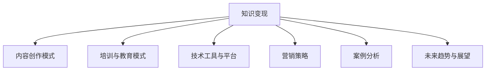

                 

# 技术培训视频：知识变现途径

## 关键词
知识变现、内容创作、培训教育、技术工具、营销策略、案例分析

## 摘要
本文将深入探讨知识变现的途径，特别是通过技术培训视频实现知识变现的方法。我们将从定义、模式、技术工具、营销策略、案例分析以及未来趋势等多个方面进行详细分析，帮助读者了解如何利用技术培训视频实现个人知识的商业价值。

### 《技术培训视频：知识变现途径》目录大纲

#### 第一部分：知识变现概述

#### 第二部分：知识变现模式

##### 第1章：知识变现的定义与意义
- 1.1 知识变现的概念
- 1.2 知识变现的内涵与外延
- 1.3 知识变现的时代背景
- 1.4 知识变现的重要性
- 1.5 知识变现的挑战与机遇

##### 第2章：内容创作模式
- 2.1 内容创作的原则与方法
- 2.2 知识变现的常见形式
- 2.3 社群运营与知识变现
- 2.4 社交媒体与知识变现

##### 第3章：培训与教育模式
- 3.1 培训课程设计
- 3.2 培训教学法的应用
- 3.3 在线教育与知识变现
- 3.4 案例分析：成功的培训与教育知识变现案例

#### 第三部分：技术工具与平台

##### 第4章：知识变现的技术工具
- 4.1 视频编辑工具
- 4.2 互动式学习平台
- 4.3 搜索引擎优化（SEO）
- 4.4 社交媒体管理工具

##### 第5章：知识变现的营销策略
- 5.1 营销渠道的选择
- 5.2 营销内容制作
- 5.3 社交媒体营销
- 5.4 电子邮件营销

#### 第四部分：案例与实践

##### 第6章：成功案例分析
- 6.1 国内知名知识变现案例
- 6.2 国外成功知识变现案例
- 6.3 案例分析与启示

##### 第7章：知识变现项目实践
- 7.1 项目策划与启动
- 7.2 项目运营与管理
- 7.3 项目评估与优化
- 7.4 知识变现项目实战案例

#### 第五部分：未来趋势与展望

##### 第8章：知识变现的未来发展趋势
- 8.1 新型知识变现模式
- 8.2 技术创新对知识变现的影响
- 8.3 知识变现行业未来展望

#### 附录

##### 附录A：知识变现工具与资源推荐
- 附加资源链接
- 常用知识变现工具介绍
- 社群与网络资源推荐

### 核心概念与联系
知识变现：**知识变现**指的是将个人的知识、技能或经验转化为经济利益的过程。在数字时代，知识变现已成为一种重要的收入来源，通过内容创作、教育培训、技术工具和营销策略等多种途径实现。

核心概念与联系图：



#### 核心算法原理讲解

本文主要关注的是知识变现的策略和实践，因此不会涉及复杂的算法原理。然而，我们可以提及一些与知识变现相关的技术概念，如推荐系统、机器学习算法等。

**推荐系统算法伪代码示例：**
```python
def recommend_system(user_profile, item_database):
    # 根据用户画像和物品数据库推荐相关内容
    user_similarity = calculate_similarity(user_profile, item_database)
    item_popularity = calculate_item_popularity(item_database)
    recommendation_score = user_similarity * item_popularity
    recommended_items = select_top_n(recommendation_score)
    return recommended_items
```

**数学模型和公式**

本文不会使用复杂的数学模型和公式，但在涉及数据分析时，可以简单提及相关概念，如用户行为分析、数据挖掘等。

**举例说明：**

用户行为分析模型：
$$
R = f(U, I, C, T)
$$
其中，$R$ 表示用户对内容的评分，$U$ 表示用户特征，$I$ 表示内容特征，$C$ 表示内容分类，$T$ 表示时间。

#### 项目实战

在本文的最后一部分，我们将通过实际案例来展示如何通过技术培训视频实现知识变现。

**案例：**
开发一个在线编程课程，以教授Python编程语言为主。以下是项目实战的详细步骤：

1. **开发环境搭建：**
   - 选择合适的编程语言和环境（如Python、PyCharm）。
   - 安装必要的库和工具（如Jupyter Notebook、Pandas、NumPy）。

2. **源代码实现：**
   - 编写教学视频脚本，包括课程内容、实例代码和讲解。
   - 使用视频编辑工具（如Adobe Premiere Pro、Final Cut Pro）进行视频剪辑和制作。

3. **代码解读与分析：**
   - 对每个教学视频中的代码进行详细解读，分析其原理和应用。
   - 制作代码示例和演示视频，以帮助学生更好地理解。

4. **营销策略实施：**
   - 利用社交媒体平台（如YouTube、LinkedIn、Twitter）进行课程推广。
   - 设计吸引人的课程海报和宣传文案。
   - 通过电子邮件营销向潜在用户发送课程介绍和优惠信息。

5. **项目运营与管理：**
   - 监控课程流量和用户反馈，优化课程内容和营销策略。
   - 定期更新课程内容，以保持课程的新鲜感和吸引力。
   - 建立用户社群，提供在线支持和互动。

**代码示例：**
```python
# Python编程基础教程示例代码

# 打印问候语
print("Hello, world!")

# 变量声明与赋值
name = "Alice"
age = 30

# 条件语句
if age > 18:
    print(f"{name} is an adult.")
else:
    print(f"{name} is a minor.")

# 循环语句
for i in range(5):
    print(i)
```

**代码解读与分析：**
- 以上代码演示了Python编程语言的基础语法，包括打印输出、变量声明、条件语句和循环语句。
- 通过这个示例，学生可以了解Python编程的基本结构，并掌握常见编程概念。

**结论：**
通过技术培训视频，个人可以将其专业知识和技能转化为经济利益。本文提供了一系列的步骤和策略，帮助读者理解如何通过技术培训视频实现知识变现。同时，我们也展示了如何通过实际案例来应用这些策略，实现知识变现的目标。

### 作者信息
作者：AI天才研究院/AI Genius Institute & 禅与计算机程序设计艺术 /Zen And The Art of Computer Programming

---

在接下来的部分，我们将详细探讨知识变现的概念、模式、技术工具、营销策略、案例分析以及未来趋势，帮助读者全面了解并通过技术培训视频实现知识变现。让我们一步一步地深入分析每个部分，提供详细的指导和建议。

