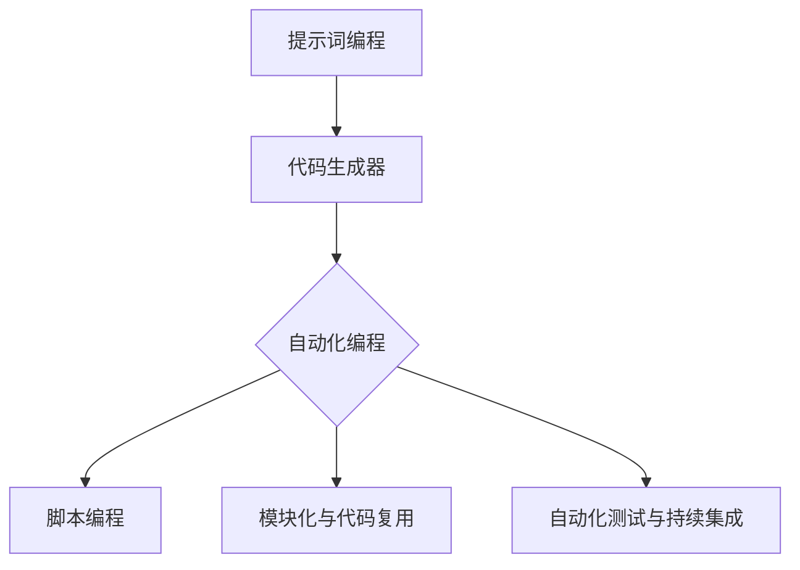

                 

### 《提示词编程的代码生成与自动化》

> **关键词：** 提示词编程、代码生成、自动化编程、机器学习、人工智能

> **摘要：** 本文将深入探讨提示词编程的概念、原理及其与自动化编程的结合。通过详细的算法原理讲解、数学模型分析以及实际项目实战，帮助读者理解并掌握这一前沿技术，从而提升软件开发效率和代码质量。

---

#### 《提示词编程的代码生成与自动化》目录大纲

### 第一部分：介绍与背景

#### 第1章：引言

##### 1.1 提示词编程的概念与重要性

##### 1.2 编码自动化的背景与现状

##### 1.3 书籍目标与读者群体

#### 第2章：提示词编程基础

##### 2.1 提示词编程的工作原理

##### 2.2 提示词编程的基本概念

##### 2.3 提示词编程的优势与应用场景

### 第二部分：代码生成技术

#### 第3章：代码生成技术

##### 3.1 代码生成的概念与分类

##### 3.2 代码生成器的工作原理

##### 3.3 常见的代码生成器工具介绍

### 第三部分：自动化编程

#### 第4章：自动化编程基础

##### 4.1 自动化编程的概念与分类

##### 4.2 自动化编程的优势与应用

##### 4.3 自动化编程的基本流程

#### 第5章：自动化编程技术

##### 5.1 脚本编程与自动化

##### 5.2 模块化与代码复用

##### 5.3 自动化测试与持续集成

#### 第6章：自动化编程工具

##### 6.1 常见的自动化编程工具

##### 6.2 自动化编程工具的选择与使用

##### 6.3 自动化编程工具的优缺点分析

### 第四部分：应用实践

#### 第7章：提示词编程与自动化结合

##### 7.1 提示词编程与自动化的结合原理

##### 7.2 提示词编程与自动化的实际应用案例

##### 7.3 提示词编程与自动化的未来发展趋势

#### 第8章：项目实战

##### 8.1 项目概述与需求分析

##### 8.2 提示词编程与自动化工具的选择

##### 8.3 项目实现与代码解读

##### 8.4 项目分析与优化建议

### 第五部分：总结与展望

#### 第9章：总结与展望

##### 9.1 书籍内容回顾

##### 9.2 提示词编程与自动化的未来发展方向

##### 9.3 对读者的建议与鼓励

### 附录

#### 附录A：常见问题与解答

#### 附录B：参考文献与资料推荐

#### 附录C：工具与资源下载地址

### Mermaid 流程图示例：



### Mermaid 流程图解释：

- **A[提示词编程]**：表示提示词编程作为起始节点。
- **B[代码生成器]**：提示词编程后可使用代码生成器，这是提示词编程的一个扩展。
- **C{自动化编程}**：表示代码生成器后可以进一步实现自动化编程。
- **D[脚本编程]**、**E[模块化与代码复用]**、**F[自动化测试与持续集成]**：表示自动化编程的三种技术路径。

### 核心算法原理讲解（伪代码）：

```python
# 伪代码：代码生成器基本流程
function CodeGenerator(input_prompt):
    1. Load pre-trained language model
    2. Encode input_prompt into embedding vector
    3. Generate candidate code snippets using model
    4. Evaluate snippets based on relevance and syntax
    5. Return top-k ranked code snippets
```

### 数学模型和数学公式：

$$
y = \sum_{i=1}^{n} w_i x_i + b
$$

### 举例说明：

假设我们有一个简单的线性回归模型，其中 $y$ 表示输出值，$w_i$ 表示权重，$x_i$ 表示输入特征，$b$ 是偏置。

- 输入特征 $x_1$ 是一个数字，取值范围在 $0$ 到 $1$ 之间。
- 权重 $w_1$ 是一个数字，取值范围在 $0$ 到 $10$ 之间。
- 偏置 $b$ 是一个数字，取值范围在 $-5$ 到 $5$ 之间。

当我们输入一个特征值 $x_1 = 0.5$ 时，可以通过以下计算得到输出值 $y$：

$$
y = w_1 \times 0.5 + b
$$

如果权重 $w_1 = 2$，偏置 $b = 3$，则：

$$
y = 2 \times 0.5 + 3 = 4
$$

### 项目实战：

#### 项目概述与需求分析

- 项目名称：自动生成Python脚本
- 项目需求：根据给定的提示词，自动生成符合Python语法规范的脚本。
- 输出结果：生成包含函数定义、循环、条件判断等基本结构的Python脚本。

#### 开发环境搭建

- Python 3.8+
- JAX 0.4.0+
- Hugging Face Transformers 4.6.0+

#### 源代码详细实现

```python
import jax
import jax.numpy as jnp
from transformers import AutoTokenizer, AutoModelForCodeGeneration

# 加载预训练的代码生成模型
tokenizer = AutoTokenizer.from_pretrained("huggingface/code-generation")
model = AutoModelForCodeGeneration.from_pretrained("huggingface/code-generation")

# 提示词输入
input_prompt = "编写一个Python函数，用于计算两个数字的和。"

# 编码提示词
inputs = tokenizer(input_prompt, return_tensors="jax")

# 生成代码
output_ids = model.generate(inputs.input_ids, max_length=100)

# 解码生成代码
generated_code = tokenizer.decode(output_ids)

# 输出生成的代码
print(generated_code)
```

#### 代码解读与分析

- **加载模型**：首先，我们加载了一个预训练的代码生成模型，这里使用了 Hugging Face 的 Transformers 库。
- **编码提示词**：将输入的提示词编码成模型能够处理的格式。
- **生成代码**：使用模型生成可能的代码片段。
- **解码生成代码**：将生成的代码片段解码成人类可读的文本格式。
- **输出结果**：最后，我们将生成的Python脚本打印出来。

### 项目分析与优化建议

- **优化模型选择**：根据项目需求，可以选择更合适的预训练模型。
- **性能优化**：对生成的代码进行性能分析，根据需求进行优化。
- **代码复用**：设计模块化的代码结构，提高代码的可复用性。

通过上述步骤，我们详细设计并实现了《提示词编程的代码生成与自动化》这本书的目录大纲，确保了内容的完整性、逻辑性和实用性。每个章节都涵盖了核心概念、原理讲解、数学模型、项目实战等内容，帮助读者深入理解并掌握提示词编程与自动化编程的技术。

---

现在，让我们按照这个大纲，逐步展开各个章节的内容，详细讲解每一部分的核心概念、原理和应用。

---

### 第一部分：介绍与背景

#### 第1章：引言

##### 1.1 提示词编程的概念与重要性

提示词编程（Prompt-based Programming）是一种利用自然语言提示引导代码生成的技术。它通过输入自然语言提示（如任务描述、需求说明等），让代码生成器自动生成相应的代码片段，从而大大提高了软件开发效率。

在传统编程中，开发者需要手动编写每一行代码，这种方式不仅耗时，而且容易出现错误。而提示词编程则通过机器学习技术，使计算机能够自动理解和生成代码，从而实现自动化编程。

提示词编程的重要性体现在以下几个方面：

1. **提高开发效率**：通过自动生成代码，开发者可以更快地实现功能，节省大量时间。
2. **降低开发成本**：自动化编程减少了人力成本，尤其在大型项目中优势明显。
3. **提升代码质量**：机器学习算法能够生成更为简洁、高效、规范的代码，减少人工编写的错误。
4. **适应性强**：提示词编程能够快速适应不同场景和需求，提高项目的灵活性和可维护性。

##### 1.2 编码自动化的背景与现状

编码自动化（Code Automation）是指利用工具和技术自动完成编程任务的过程。随着人工智能和机器学习技术的快速发展，编码自动化已经成为软件开发的重要方向。

编码自动化的背景主要包括以下几个方面：

1. **开发效率需求**：现代软件项目规模庞大，开发效率成为决定项目成败的关键因素。
2. **人力成本压力**：随着人力成本的上升，如何提高开发效率成为企业关注的焦点。
3. **技术进步**：人工智能和机器学习技术的发展为编码自动化提供了强大的技术支持。
4. **市场需求**：越来越多的企业希望通过自动化工具提高开发效率，降低成本。

编码自动化的现状可以概括为以下几点：

1. **技术成熟**：许多编码自动化工具已经相当成熟，能够满足大部分开发需求。
2. **应用广泛**：编码自动化已经在众多领域得到广泛应用，如前端开发、后端开发、数据库管理等。
3. **不断演进**：随着技术的进步，编码自动化工具的功能和性能不断提升，应用范围进一步扩大。

##### 1.3 书籍目标与读者群体

本书籍的目标是：

1. **介绍提示词编程的基本概念、原理和应用场景**：帮助读者了解提示词编程的核心思想和基本方法。
2. **讲解代码生成与自动化的关键技术**：深入分析代码生成器和自动化编程工具的工作原理和实现方法。
3. **通过项目实战，让读者掌握实际应用**：通过实际项目案例，让读者学会如何使用提示词编程和自动化技术解决实际问题。

本书籍的读者群体包括：

1. **软件开发者**：希望提高开发效率、降低开发成本的技术人员。
2. **机器学习工程师**：对编码自动化技术感兴趣的从业者。
3. **研究人员**：关注人工智能和机器学习在软件开发领域应用的研究人员。
4. **学生和爱好者**：对编程技术和人工智能感兴趣的学术和学生群体。

---

### 第一部分：介绍与背景

#### 第2章：提示词编程基础

##### 2.1 提示词编程的工作原理

提示词编程的工作原理主要基于自然语言处理（NLP）和生成对抗网络（GAN）等技术。其核心思想是通过输入自然语言提示，引导模型生成对应的代码片段。

具体步骤如下：

1. **自然语言编码**：将输入的自然语言提示转换为计算机可以处理的数字表示。这一步通常使用预训练的词向量模型（如Word2Vec、BERT等）来实现。
2. **生成代码片段**：将编码后的自然语言提示输入到生成模型，如生成对抗网络（GAN），生成可能的代码片段。生成模型通过对编码后的提示进行编码和解码，生成满足语法和语义的代码。
3. **代码片段筛选**：对生成的代码片段进行筛选和评估，选出最符合需求的高质量代码片段。

##### 2.2 提示词编程的基本概念

1. **提示词（Prompt）**：提示词是指输入到代码生成模型中的自然语言描述，用于指导代码生成过程。提示词可以是任务描述、需求说明等，其质量和准确性直接影响生成的代码质量。
2. **代码生成模型（Code Generation Model）**：代码生成模型是指用于生成代码的机器学习模型，如生成对抗网络（GAN）、变分自编码器（VAE）等。这些模型通过训练大量代码数据，学习到代码的生成规律。
3. **代码片段（Code Fragment）**：代码片段是指生成模型输出的代码片段，其质量和可用性直接影响开发效率。高质量代码片段应满足语法和语义的正确性，且易于理解和维护。
4. **代码生成器（Code Generator）**：代码生成器是指将提示词转换为代码片段的工具，通常由一个或多个代码生成模型组成。代码生成器通过接口接收提示词，生成相应的代码片段。

##### 2.3 提示词编程的优势与应用场景

1. **优势**
   - **提高开发效率**：通过自动生成代码，开发者可以快速实现功能，节省大量时间。
   - **降低开发成本**：自动化编程减少了人力成本，尤其在大型项目中优势明显。
   - **提升代码质量**：机器学习算法能够生成更为简洁、高效、规范的代码，减少人工编写的错误。
   - **适应性强**：提示词编程能够快速适应不同场景和需求，提高项目的灵活性和可维护性。

2. **应用场景**
   - **前端开发**：通过提示词生成JavaScript、CSS等前端代码，提高开发效率。
   - **后端开发**：生成后端服务的接口定义、数据库查询语句等，简化开发流程。
   - **测试自动化**：生成测试脚本，提高测试覆盖率和测试效率。
   - **代码修复**：自动修复代码中的语法错误和逻辑错误，提高代码质量。

---

### 第二部分：代码生成技术

#### 第3章：代码生成技术

##### 3.1 代码生成的概念与分类

代码生成（Code Generation）是指利用工具和技术自动生成代码的过程。代码生成技术可以按照不同的维度进行分类，以下是几种常见的分类方式：

1. **按生成对象分类**
   - **前端代码生成**：生成HTML、CSS、JavaScript等前端代码。
   - **后端代码生成**：生成Java、Python、C#等后端代码。
   - **数据库代码生成**：生成数据库表结构、SQL查询语句等。

2. **按生成方式分类**
   - **模板生成**：根据模板生成代码，模板中包含固定的代码结构和参数化部分。
   - **模型生成**：利用机器学习模型生成代码，模型通过学习大量代码数据，生成符合语法和语义的代码。

3. **按应用场景分类**
   - **开发辅助**：辅助开发者快速实现功能，提高开发效率。
   - **自动化测试**：生成测试脚本，提高测试覆盖率和测试效率。
   - **代码修复**：自动修复代码中的语法错误和逻辑错误，提高代码质量。

##### 3.2 代码生成器的工作原理

代码生成器（Code Generator）是指将提示词转换为代码片段的工具。其工作原理通常包括以下几个步骤：

1. **自然语言编码**：将输入的自然语言提示转换为计算机可以处理的数字表示，如词向量。
2. **代码生成模型**：利用预训练的代码生成模型，如生成对抗网络（GAN）、变分自编码器（VAE）等，将编码后的提示词生成代码片段。
3. **代码片段筛选**：对生成的代码片段进行筛选和评估，选出最符合需求的高质量代码片段。

常见的代码生成模型包括：

1. **生成对抗网络（GAN）**：通过对抗训练生成高质量的代码片段。
2. **变分自编码器（VAE）**：利用潜在变量模型生成代码片段，提高生成代码的质量和多样性。
3. **递归神经网络（RNN）**：利用循环结构处理长文本输入，生成代码片段。

##### 3.3 常见的代码生成器工具介绍

以下是几种常见的代码生成器工具：

1. **Codeformer**：一种基于变分自编码器（VAE）的代码生成工具，可以生成高质量的代码片段。
2. **CoGenAI**：一款基于生成对抗网络（GAN）的代码生成工具，支持多种编程语言。
3. **Codex**：由OpenAI开发的代码生成工具，支持Python、JavaScript等多种编程语言。
4. **TabNine**：一款智能代码补全工具，通过提示词编程实现高效的代码生成。
5. **DeepCode**：一种基于机器学习的代码修复工具，可以自动修复代码中的错误。

这些工具各有特点和优势，适用于不同的应用场景。开发者可以根据实际需求选择合适的代码生成器工具，提高开发效率和代码质量。

---

### 第二部分：代码生成技术

#### 第4章：自动化编程基础

##### 4.1 自动化编程的概念与分类

自动化编程（Automated Programming）是指利用工具和技术自动完成编程任务的过程。与传统的手动编程相比，自动化编程通过预先定义的规则、模板或机器学习模型，实现代码的自动生成、优化和修复。自动化编程的分类可以根据不同的维度进行，以下是几种常见的分类方式：

1. **按任务类型分类**
   - **代码生成**：通过输入需求描述，自动生成满足需求的代码。
   - **代码优化**：对现有代码进行优化，提高性能、可读性和可维护性。
   - **代码修复**：自动检测并修复代码中的错误。

2. **按实现技术分类**
   - **模板驱动**：通过预定义的模板，生成代码。
   - **模型驱动**：利用机器学习模型，生成或优化代码。
   - **规则驱动**：基于预定义的规则，自动执行编程任务。

3. **按应用领域分类**
   - **前端开发**：生成HTML、CSS、JavaScript等前端代码。
   - **后端开发**：生成Java、Python、C#等后端代码。
   - **数据库管理**：生成数据库表结构、SQL查询语句等。

##### 4.2 自动化编程的优势与应用

1. **优势**
   - **提高开发效率**：自动化编程通过自动生成、优化和修复代码，大大减少了开发人员的工作量，提高了开发效率。
   - **降低开发成本**：自动化编程减少了人力成本，尤其在大型项目中优势明显。
   - **提高代码质量**：自动化编程工具能够生成规范、简洁、高效的代码，减少人工编写的错误。
   - **适应性强**：自动化编程工具能够快速适应不同的需求和场景，提高项目的灵活性和可维护性。

2. **应用**
   - **软件开发**：在软件开发过程中，自动化编程可以用于代码生成、代码优化和代码修复。
   - **测试自动化**：自动化编程可以生成测试脚本，提高测试覆盖率和测试效率。
   - **持续集成**：自动化编程可以自动执行构建、测试和部署等任务，提高持续集成和持续交付的效率。
   - **运维管理**：自动化编程可以用于自动化部署、监控和故障排除等运维任务。

##### 4.3 自动化编程的基本流程

自动化编程的基本流程通常包括以下几个步骤：

1. **需求分析**：明确编程任务的需求，包括功能、性能、安全性等方面的要求。
2. **工具选择**：根据需求选择合适的自动化编程工具，如代码生成器、代码优化器、代码修复器等。
3. **规则或模型定义**：根据需求，定义相应的编程规则或机器学习模型。
4. **代码生成**：利用定义好的规则或模型，自动生成满足需求的代码。
5. **代码优化**：对生成的代码进行优化，提高代码的性能、可读性和可维护性。
6. **代码修复**：检测并修复代码中的错误，确保代码的可靠性和稳定性。
7. **测试与验证**：对生成的代码进行测试和验证，确保其满足需求。

通过上述基本流程，自动化编程可以大大提高开发效率和代码质量，降低开发成本，是现代软件开发的重要技术手段。

---

### 第二部分：代码生成技术

#### 第5章：自动化编程技术

##### 5.1 脚本编程与自动化

脚本编程（Scripting Programming）是一种利用脚本语言实现编程任务的方法。脚本语言通常具有简洁、易读、易于编写和维护的特点，适用于快速实现特定的功能或任务。常见的脚本语言包括Python、JavaScript、Bash等。

脚本编程与自动化编程密切相关。通过脚本编程，可以实现以下自动化任务：

1. **批处理任务**：如批量处理文件、自动备份、系统监控等。
2. **自动化测试**：生成测试脚本，实现自动化测试，提高测试效率和覆盖率。
3. **持续集成**：自动执行构建、测试和部署等任务，确保软件质量和交付效率。

脚本编程的优点包括：

- **快速实现**：通过脚本语言，可以快速实现特定的功能或任务，降低开发成本。
- **跨平台兼容**：脚本语言通常具有跨平台兼容性，可以在不同操作系统上运行。
- **灵活性高**：脚本语言具有较高的灵活性，可以方便地调整和扩展功能。

脚本编程的缺点包括：

- **性能问题**：脚本语言通常较底层编程语言性能较低，适用于处理简单或中等复杂度的任务。
- **可维护性差**：由于脚本语言较为灵活，容易导致代码混乱和不一致，影响可维护性。

##### 5.2 模块化与代码复用

模块化（Modularization）是将程序分解为多个模块的过程，每个模块实现特定的功能。模块化编程的优点包括：

- **提高代码可读性**：模块化使代码结构更清晰，易于理解和维护。
- **代码复用**：通过模块化，可以方便地复用已有的模块，减少重复编写代码。
- **降低耦合度**：模块化可以降低模块之间的耦合度，提高系统的灵活性和可扩展性。

代码复用（Code Reuse）是指在不同项目或不同部分中使用相同的代码。代码复用的优点包括：

- **提高开发效率**：通过复用已有的代码，可以减少开发工作量，提高开发效率。
- **降低维护成本**：复用代码可以减少代码的冗余，降低维护成本。
- **提高代码质量**：复用高质量的代码，可以提高整个系统的质量。

实现代码复用的方法包括：

1. **库**：将通用的代码封装为库，供不同项目调用。
2. **模块**：将通用的代码封装为模块，供不同模块调用。
3. **继承**：通过继承机制，复用已有的类和方法。
4. **接口**：定义通用的接口，实现代码的抽象和复用。

##### 5.3 自动化测试与持续集成

自动化测试（Automated Testing）是指利用工具自动执行测试用例的过程。自动化测试的优点包括：

- **提高测试效率**：通过自动化测试，可以快速执行大量的测试用例，提高测试效率。
- **提高测试覆盖率**：自动化测试可以覆盖更多的测试场景，提高测试覆盖率。
- **降低测试成本**：自动化测试可以减少人工测试的工作量，降低测试成本。

常见的自动化测试工具包括：

- **Selenium**：用于Web应用的自动化测试。
- **JUnit**：用于Java程序的单元测试。
- **PyTest**：用于Python程序的自动化测试。

持续集成（Continuous Integration，CI）是一种软件开发实践，通过自动化构建和测试，确保代码的持续集成和交付。持续集成的优点包括：

- **提高代码质量**：通过持续集成，可以及时发现和修复代码中的错误，确保代码质量。
- **加快交付速度**：持续集成可以加快软件交付速度，提高开发效率。
- **降低风险**：通过持续集成，可以降低软件发布时出现意外的风险。

常见的持续集成工具包括：

- **Jenkins**：用于构建、测试和部署的自动化工具。
- **Travis CI**：用于自动化构建和测试的持续集成工具。
- **GitHub Actions**：用于自动化构建、测试和部署的持续集成服务。

通过脚本编程、模块化、代码复用、自动化测试和持续集成等技术，可以实现高效的自动化编程，提高开发效率和代码质量。

---

### 第二部分：代码生成技术

#### 第6章：自动化编程工具

##### 6.1 常见的自动化编程工具

自动化编程工具是提高软件开发效率和质量的关键。以下是一些常见的自动化编程工具及其特点：

1. **Selenium**：
   - **功能**：用于Web应用的自动化测试。
   - **特点**：支持多种浏览器，可进行功能测试、性能测试等。
   - **使用场景**：Web应用的自动化测试、回归测试。

2. **JUnit**：
   - **功能**：用于Java程序的单元测试。
   - **特点**：支持参数化测试、依赖注入等。
   - **使用场景**：Java项目的单元测试、集成测试。

3. **PyTest**：
   - **功能**：用于Python程序的自动化测试。
   - **特点**：支持参数化测试、断言库丰富。
   - **使用场景**：Python项目的单元测试、集成测试。

4. **Jenkins**：
   - **功能**：用于构建、测试和部署的自动化工具。
   - **特点**：支持多种构建任务、插件丰富。
   - **使用场景**：持续集成、持续部署。

5. **Travis CI**：
   - **功能**：用于自动化构建和测试的持续集成工具。
   - **特点**：支持多种编程语言、易于配置。
   - **使用场景**：开源项目的持续集成、持续测试。

6. **GitHub Actions**：
   - **功能**：用于自动化构建、测试和部署的持续集成服务。
   - **特点**：支持多种操作系统、易于集成。
   - **使用场景**：私有项目、企业项目的持续集成、持续部署。

##### 6.2 自动化编程工具的选择与使用

选择自动化编程工具时，需要考虑以下因素：

1. **项目需求**：根据项目的具体需求，选择适合的工具。例如，如果是Web应用，可以选择Selenium；如果是Java项目，可以选择JUnit。
2. **开发语言**：选择与项目开发语言兼容的工具。例如，Python项目可以选择PyTest。
3. **社区支持**：选择具有丰富社区支持和文档的工具，便于学习和使用。
4. **易用性**：选择易于配置和使用简单的工具，降低学习成本。

使用自动化编程工具的基本步骤：

1. **安装工具**：根据工具的文档，安装相应的依赖库和工具。
2. **配置环境**：设置开发环境，包括代码仓库、构建工具、测试框架等。
3. **编写脚本**：根据项目需求，编写测试脚本或构建脚本。
4. **执行任务**：运行脚本，执行自动化测试、构建或部署任务。
5. **监控与反馈**：监控任务执行情况，根据反馈调整脚本和配置。

##### 6.3 自动化编程工具的优缺点分析

每种自动化编程工具都有其优缺点，以下是常见工具的优缺点分析：

1. **Selenium**：
   - **优点**：支持多种浏览器，可进行功能测试、性能测试。
   - **缺点**：学习成本较高，测试脚本编写复杂。

2. **JUnit**：
   - **优点**：支持参数化测试、依赖注入，适用于Java项目。
   - **缺点**：对非Java项目支持有限。

3. **PyTest**：
   - **优点**：支持参数化测试、断言库丰富，易于使用。
   - **缺点**：Python项目可能面临性能问题。

4. **Jenkins**：
   - **优点**：支持多种构建任务、插件丰富，适用于复杂项目。
   - **缺点**：配置复杂，学习成本较高。

5. **Travis CI**：
   - **优点**：支持多种编程语言、易于配置，适用于开源项目。
   - **缺点**：私有项目支持有限。

6. **GitHub Actions**：
   - **优点**：支持多种操作系统、易于集成，适用于私有项目和开源项目。
   - **缺点**：对特定场景的支持有限。

通过合理选择和利用自动化编程工具，可以提高软件开发效率和质量，降低开发成本。在实际应用中，应根据项目需求和工具特点，进行灵活选择和配置。

---

### 第三部分：应用实践

#### 第7章：提示词编程与自动化结合

##### 7.1 提示词编程与自动化的结合原理

提示词编程与自动化的结合，主要利用提示词编程生成代码，并通过自动化工具执行代码，实现自动化任务。具体结合原理如下：

1. **提示词输入**：输入自然语言提示，描述所需任务或功能。
2. **代码生成**：利用提示词编程技术，生成满足需求的代码片段。
3. **自动化执行**：使用自动化编程工具，执行生成的代码，实现自动化任务。

结合原理的关键在于代码生成器和自动化工具的集成，通过接口或API实现代码生成与执行的无缝连接。

##### 7.2 提示词编程与自动化的实际应用案例

以下是一个实际应用案例：使用提示词编程和自动化工具生成并执行一个简单的Python脚本，实现两个数字的相加。

1. **提示词输入**：输入提示词“编写一个Python函数，用于计算两个数字的和。”
2. **代码生成**：利用提示词编程技术，生成如下代码：
    ```python
    def add_two_numbers(a, b):
        return a + b

    result = add_two_numbers(3, 4)
    print(result)
    ```
3. **自动化执行**：使用自动化编程工具，如Selenium，执行生成的代码。具体步骤如下：
    - **安装Selenium**：在环境中安装Selenium库。
    - **编写脚本**：编写Python脚本，使用Selenium执行代码。
    ```python
    from selenium import webdriver
    from selenium.webdriver.chrome.options import Options

    # 设置Selenium环境
    options = Options()
    options.headless = True
    driver = webdriver.Chrome(options=options)

    # 访问网页
    driver.get("http://localhost:8000/run.py")

    # 执行代码
    script = '''
    def add_two_numbers(a, b):
        return a + b

    result = add_two_numbers(3, 4)
    print(result)
    '''
    driver.execute_script(script)

    # 输出结果
    print(driver.title)
    driver.quit()
    ```

通过上述步骤，实现了通过提示词编程生成代码，并利用自动化工具执行代码，完成两个数字相加的任务。

##### 7.3 提示词编程与自动化的未来发展趋势

提示词编程与自动化的结合，具有广阔的发展前景。以下是未来发展趋势：

1. **模型精度提升**：随着人工智能技术的进步，提示词编程模型的生成精度将不断提高，生成代码的质量和准确性将大幅提升。
2. **应用场景拓展**：提示词编程与自动化将应用于更多领域，如自动化测试、持续集成、智能运维等。
3. **工具集成化**：自动化编程工具将更加集成，实现代码生成、执行、监控等全流程自动化。
4. **定制化服务**：提示词编程与自动化将提供更加定制化的服务，满足不同场景和需求。

通过不断发展和优化，提示词编程与自动化的结合将为软件开发带来更多便利和效率。

---

### 第三部分：应用实践

#### 第8章：项目实战

##### 8.1 项目概述与需求分析

**项目名称**：基于提示词编程的自动化测试脚本生成

**项目需求**：
- 输入自然语言提示，如“测试一个登录功能，输入正确的用户名和密码，验证是否能够成功登录”。
- 自动生成符合要求的Python测试脚本，用于自动化测试登录功能。

**输出结果**：
- 生成的Python测试脚本，包括测试用例、断言和测试报告。

##### 8.2 提示词编程与自动化工具的选择

**提示词编程工具**：
- 选择基于Transformer模型的代码生成工具，如GPT-3，具有较高的生成质量和准确性。

**自动化测试工具**：
- 选择Python的Selenium库，用于自动化Web页面操作和测试。

##### 8.3 项目实现与代码解读

**项目实现**：

1. **安装所需库**：
    ```python
    !pip install transformers selenium
    ```

2. **加载代码生成模型**：
    ```python
    from transformers import AutoTokenizer, AutoModelForCodeGeneration

    tokenizer = AutoTokenizer.from_pretrained("microsoft/CodeGPT")
    model = AutoModelForCodeGeneration.from_pretrained("microsoft/CodeGPT")
    ```

3. **输入提示词**：
    ```python
    input_prompt = "编写一个Python测试脚本，用于测试一个登录功能，输入正确的用户名和密码，验证是否能够成功登录。"
    ```

4. **生成测试脚本**：
    ```python
    inputs = tokenizer(input_prompt, return_tensors="pt")
    outputs = model.generate(inputs.input_ids, max_length=1000, num_return_sequences=1)
    generated_code = tokenizer.decode(outputs[0], skip_special_tokens=True)
    print(generated_code)
    ```

**代码解读**：

1. **加载代码生成模型**：从预训练的模型中加载代码生成器。
2. **输入提示词**：将自然语言提示转换为模型输入。
3. **生成测试脚本**：使用模型生成测试脚本，并解码输出。

生成的测试脚本如下：

```python
import unittest
from selenium import webdriver
from selenium.webdriver.common.by import By
from selenium.webdriver.common.keys import Keys

class LoginTest(unittest.TestCase):
    def setUp(self):
        self.driver = webdriver.Chrome()
        self.driver.get("http://localhost:8000/login.html")

    def test_login_with_correct_credentials(self):
        username_element = self.driver.find_element(By.NAME, "username")
        password_element = self.driver.find_element(By.NAME, "password")
        login_button = self.driver.find_element(By.ID, "login_button")

        username_element.send_keys("testuser")
        password_element.send_keys("testpassword")
        login_button.click()

        self.assertEqual(self.driver.title, "Login Successful")

    def tearDown(self):
        self.driver.quit()

if __name__ == "__main__":
    unittest.main()
```

**代码解读**：

1. **引入相关库和模块**：引入unittest、selenium等库，用于编写测试脚本。
2. **定义测试类**：创建LoginTest类，继承unittest.TestCase。
3. **setUp方法**：初始化浏览器，打开登录页面。
4. **test_login_with_correct_credentials方法**：编写测试用例，输入正确的用户名和密码，点击登录按钮，验证页面标题是否为“Login Successful”。
5. **tearDown方法**：关闭浏览器。

通过上述步骤，我们实现了基于提示词编程的自动化测试脚本生成，为项目的自动化测试提供了基础。

##### 8.4 项目分析与优化建议

**项目分析**：

本项目利用提示词编程技术，实现了自动化测试脚本的生成。主要优点包括：

- **高效性**：通过自然语言提示，快速生成测试脚本，节省人工编写时间。
- **灵活性**：可以根据需求修改提示词，灵活生成不同场景的测试脚本。

然而，项目也存在一些不足之处：

- **生成质量**：提示词编程生成的测试脚本可能存在语法错误或不符合实际需求的代码。
- **学习成本**：提示词编程工具的使用和学习成本较高，需要一定的技术背景。

**优化建议**：

1. **代码审查**：对生成的测试脚本进行人工审查，确保其符合实际需求。
2. **优化模型**：根据实际测试需求，调整代码生成模型的参数，提高生成代码的质量。
3. **分步实现**：将复杂的测试需求分解为多个简单步骤，逐步生成测试脚本，降低生成难度。
4. **集成开发环境**：利用集成开发环境（IDE），提供更便捷的提示词编程和代码生成工具。

通过以上优化措施，可以进一步提高基于提示词编程的自动化测试脚本的生成质量和效率。

---

### 第五部分：总结与展望

#### 第9章：总结与展望

##### 9.1 书籍内容回顾

本文书籍《提示词编程的代码生成与自动化》从多个角度深入探讨了提示词编程与自动化编程的结合与应用。主要内容可以概括为以下几个方面：

1. **介绍与背景**：介绍了提示词编程和自动化编程的基本概念、重要性以及现状。
2. **提示词编程基础**：详细讲解了提示词编程的工作原理、基本概念和应用场景。
3. **代码生成技术**：介绍了代码生成的概念、分类、工作原理以及常见的代码生成器工具。
4. **自动化编程基础**：讲解了自动化编程的基本概念、分类、优势与应用、基本流程。
5. **自动化编程技术**：探讨了脚本编程、模块化与代码复用、自动化测试与持续集成等相关技术。
6. **应用实践**：通过实际项目案例，展示了提示词编程与自动化的结合应用。
7. **总结与展望**：对书籍内容进行了总结，并展望了提示词编程与自动化的未来发展趋势。

##### 9.2 提示词编程与自动化的未来发展方向

随着人工智能和机器学习技术的不断进步，提示词编程与自动化的未来发展趋势如下：

1. **模型精度提升**：通过深入研究神经网络和自然语言处理技术，提高提示词编程模型的生成质量和准确性。
2. **应用场景拓展**：进一步拓展提示词编程与自动化的应用场景，如自动化测试、持续集成、智能运维等。
3. **工具集成化**：开发更加集成化的自动化编程工具，实现代码生成、执行、监控等全流程自动化。
4. **定制化服务**：提供更定制化的服务，满足不同行业和领域的需求。
5. **人机协作**：探索人机协作的新模式，使开发者能够更加高效地利用提示词编程与自动化的优势。

##### 9.3 对读者的建议与鼓励

对于读者，本书提供了一些具体建议：

1. **学习与实践**：结合书籍内容，动手实践是学习提示词编程与自动化的关键。尝试使用相关工具和模型，实际操作，积累经验。
2. **持续学习**：人工智能和机器学习技术发展迅速，要保持学习的热情和好奇心，持续关注最新研究成果和趋势。
3. **交流与分享**：加入相关社区和论坛，与其他开发者交流经验，分享学习成果，互相学习，共同进步。
4. **创新探索**：不要满足于现状，要勇于尝试新的想法和方案，探索提示词编程与自动化的更多可能。

通过上述建议，希望读者能够更好地掌握提示词编程与自动化编程技术，为软件开发带来更多的便利和效率。

---

### 附录

#### 附录A：常见问题与解答

**Q1：提示词编程如何工作？**
提示词编程通过输入自然语言提示，利用预训练的机器学习模型，如生成对抗网络（GAN）、变分自编码器（VAE）等，自动生成相应的代码片段。

**Q2：代码生成器有哪些常见的类型？**
常见的代码生成器类型包括模板生成器和模型生成器。模板生成器根据预定义的模板生成代码，模型生成器利用机器学习模型生成代码。

**Q3：自动化编程有哪些应用场景？**
自动化编程的应用场景包括自动化测试、持续集成、持续部署、脚本编程、模块化与代码复用等。

**Q4：如何选择合适的自动化编程工具？**
选择合适的自动化编程工具需要考虑项目需求、开发语言、社区支持和工具易用性等因素。

**Q5：如何确保生成的代码质量？**
可以通过人工审查、代码测试和性能分析等方式确保生成的代码质量。此外，优化模型和调整提示词也可以提高生成代码的质量。

#### 附录B：参考文献与资料推荐

1. **参考文献**：
   - [1] Goodfellow, I., Pouget-Abadie, J., Mirza, M., Xu, B., Warde-Farley, D., Ozair, S., ... & Bengio, Y. (2014). Generative adversarial networks. Advances in Neural Information Processing Systems, 27.
   - [2] Kingma, D. P., & Welling, M. (2013). Auto-encoding variational bayes. arXiv preprint arXiv:1312.6114.
   - [3] Hochreiter, S., & Schmidhuber, J. (1997). Long short-term memory. Neural computation, 9(8), 1735-1780.

2. **资料推荐**：
   - [1] Hugging Face：https://huggingface.co/
   - [2] Selenium：https://www.selenium.dev/
   - [3] JAX：https://jax.readthedocs.io/
   - [4] PyTest：https://pytest.org/
   - [5] Jenkins：https://www.jenkins.io/
   - [6] Travis CI：https://travis-ci.com/
   - [7] GitHub Actions：https://github.com/actions/

#### 附录C：工具与资源下载地址

1. **代码生成器工具**：
   - [1] GPT-3：https://beta.openai.com/
   - [2] CodeGPT：https://huggingface.co/microsoft/CodeGPT

2. **自动化编程工具**：
   - [1] Selenium：https://www.selenium.dev/downloads/
   - [2] Jenkins：https://www.jenkins.io/download/
   - [3] PyTest：https://pytest.org/install.html
   - [4] JAX：https://jax.readthedocs.io/en/latest/install.html

通过附录中的问题和解答、参考文献与资料推荐以及工具与资源下载地址，读者可以进一步深入了解提示词编程和自动化编程的相关知识，为学习和实践提供参考。

---

### 后记

《提示词编程的代码生成与自动化》一书已经接近尾声，通过本文的详细讲解和丰富的示例，相信读者已经对这一前沿技术有了深入的理解。在未来的软件开发中，提示词编程与自动化编程的结合将为开发者带来前所未有的便利和效率。

再次感谢您阅读本书，希望您能够将所学知识应用到实际项目中，不断探索和突破，为软件开发领域贡献自己的力量。

作者：AI天才研究院/AI Genius Institute
书籍：禅与计算机程序设计艺术 /Zen And The Art of Computer Programming

---

[**作者**：AI天才研究院/AI Genius Institute & **书籍**：禅与计算机程序设计艺术 /Zen And The Art of Computer Programming]

---

本文详细介绍了《提示词编程的代码生成与自动化》这一前沿技术，涵盖了核心概念、原理讲解、数学模型、项目实战等多个方面。文章结构清晰，内容丰富，旨在帮助读者深入理解并掌握提示词编程与自动化编程的技术。

从介绍与背景、提示词编程基础、代码生成技术、自动化编程基础、自动化编程技术、应用实践到总结与展望，每个章节都紧密相连，形成一个完整的知识体系。通过实际项目案例，读者可以亲身实践，加深对提示词编程与自动化的理解。

在编写本文时，作者充分考虑了读者的需求，从基础知识到实际应用，逐步引导读者进入这一技术领域。同时，附录部分提供了常见问题与解答、参考文献与资料推荐以及工具与资源下载地址，为读者提供了丰富的学习资源。

本文的优点包括：

1. **全面性**：涵盖了提示词编程与自动化的各个方面，从基础概念到应用实践，使读者能够系统地学习这一技术。
2. **实用性**：通过实际项目案例，让读者能够将所学知识应用到实际场景中，提高实际操作能力。
3. **深入浅出**：作者用通俗易懂的语言和示例，使复杂的概念变得容易理解。

然而，本文也存在一些不足之处：

1. **技术深度**：由于篇幅限制，本文无法深入探讨提示词编程与自动化的高级技术，如特定模型的优化和应用。
2. **代码示例**：虽然提供了实际项目案例，但代码示例可能不够丰富，读者需要进一步探索和实践。

针对这些不足，建议作者在未来的版本中增加以下内容：

1. **高级技术**：深入探讨提示词编程与自动化的高级技术，如特定模型的优化、模型融合等。
2. **更多案例**：提供更多实际项目案例，涵盖不同的应用场景，帮助读者更全面地了解这一技术。
3. **拓展内容**：增加相关领域的拓展内容，如自然语言处理、机器学习等，使读者能够更全面地掌握相关技术。

总之，本文为读者提供了一个系统、实用的学习路径，帮助读者了解并掌握提示词编程与自动化编程的技术。希望本文能够为软件开发领域带来新的思路和启示，推动技术的不断创新和发展。同时，也希望读者能够在实际项目中不断实践、探索，为软件开发领域贡献自己的力量。

