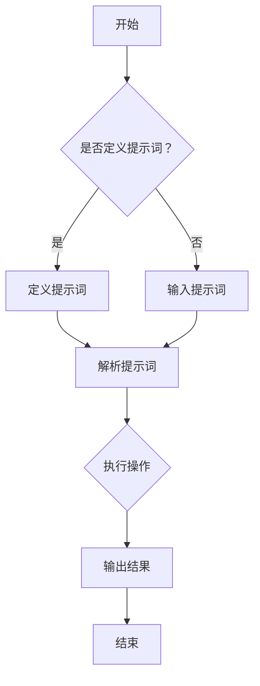
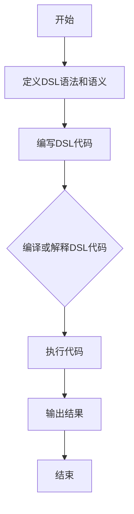
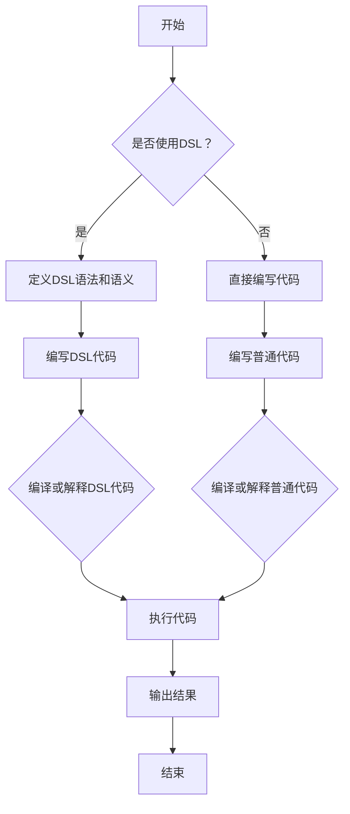

                 

### 1.1 提示词编程与领域特定语言（DSL）概述

#### 提示词编程的概念及其重要性

提示词编程（Prompt Programming）是一种通过预定义的提示词（prompts）来引导程序执行的方式。在传统编程中，程序员需要详细描述程序每一步的行为，而提示词编程则通过给出一些简明扼要的提示，让程序根据这些提示自主执行相应的任务。这种方式不仅简化了编程过程，还提高了代码的可维护性和可扩展性。

提示词编程的重要性在于，它使得编程语言更加贴近自然语言，使得非专业的用户也能够通过编写简单的提示词来达到预期的编程效果。这对于自动化脚本编写、数据预处理、自然语言处理等领域具有重要的应用价值。

#### 领域特定语言（DSL）的定义、分类和特点

领域特定语言（Domain-Specific Language，DSL）是一种为解决特定领域问题而设计的编程语言。与通用编程语言（如Python、Java等）相比，DSL具有更明确的语法和语义，旨在简化特定领域的开发过程。

DSL的分类主要包括以下几种：

1. **内部DSL**：嵌入在通用编程语言中，通过特定的语法和库来支持特定领域的编程。
2. **外部DSL**：独立于通用编程语言，具有自己的语法和解释器。
3. **组合DSL**：由多个内部或外部DSL组合而成，以支持更复杂的领域问题。

DSL的特点包括：

1. **高度专业化**：DSL专注于特定领域的需求，减少了通用编程语言中的冗余部分。
2. **简明易懂**：DSL的语法和语义通常更加简洁，使得领域专家能够快速理解和编写代码。
3. **高效性**：DSL可以针对特定领域进行优化，提高代码执行效率。

#### 提示词编程与DSL的联系与区别

提示词编程与DSL在某种程度上是相辅相成的。DSL提供了针对特定领域的语法和工具，而提示词编程则利用这些工具，通过简明的提示词来引导程序执行。

它们之间的区别在于：

1. **目的不同**：DSL旨在简化特定领域的编程过程，而提示词编程则是一种编程方式，通过提示词实现编程目标。
2. **使用范围**：DSL可以应用于更广泛的领域问题，而提示词编程通常用于自动化脚本、数据处理等特定场景。
3. **实现方式**：DSL通常涉及更复杂的语法和编译过程，而提示词编程则更侧重于自然语言的描述和解释。

通过上述分析，我们可以看到提示词编程与DSL在计算机编程领域中具有重要的作用。它们不仅提高了编程效率，还为特定领域的开发提供了强有力的支持。

### 1.2 提示词编程的发展背景

#### 编程语言的演化过程

编程语言的发展历程可以追溯到20世纪40年代和50年代，当时计算机刚刚问世，编程主要依赖于机器语言和汇编语言。这些语言直接与计算机硬件交互，但复杂度和可读性较差。随着计算机技术的发展，出现了更高层次的编程语言，如FORTRAN和COBOL，这些语言开始引入高级结构和语义，使得编程变得更加容易。

到了20世纪60年代，结构化编程的思想开始兴起，这标志着编程语言从过程式编程向模块化编程的转变。C语言作为这一时期的代表，不仅在语法和语义上进行了创新，还为后续的编程语言奠定了基础。

#### 提示词编程的起源与发展

提示词编程的概念最早可以追溯到20世纪80年代，当时自然语言处理（NLP）和人工智能（AI）领域的研究者开始探索如何利用自然语言来指导程序执行。一个典型的例子是Lisp语言，它通过宏系统实现了对自然语言的直接支持。

随着计算机性能的提升和AI技术的进步，提示词编程逐渐成为一种重要的编程范式。近年来，随着生成对抗网络（GAN）、强化学习（RL）等技术的应用，提示词编程在自动化脚本编写、数据预处理、人机交互等领域取得了显著的成果。

#### 领域特定语言的发展历程

领域特定语言（DSL）的发展与编程语言的理论研究密切相关。在20世纪80年代，软件工程领域开始关注如何提高软件开发的效率和可维护性。这一背景下，DSL的概念逐渐得到认可。

早期的DSL主要集中在特定领域，如金融、医疗和制造业。例如，SQL（结构化查询语言）就是一种专门用于数据库查询的DSL。随着技术的进步，DSL的应用范围逐渐扩大，不仅局限于数据处理和金融领域，还扩展到了自然语言处理、图形设计、网络编程等领域。

近年来，随着软件工程和编程语言理论的深入研究，DSL的设计方法也得到了丰富和发展。组合DSL、函数式DSL和动态DSL等新型DSL不断涌现，为特定领域的软件开发提供了更多的选择。

### 1.3 提示词编程在现实中的应用案例

#### 数据处理与数据分析

在数据处理和数据分析领域，提示词编程具有广泛的应用。例如，在数据清洗过程中，程序员可以编写简单的提示词来指导程序识别和纠正数据中的错误。此外，在数据统计分析中，提示词编程可以帮助用户通过自然语言描述他们的数据分析需求，从而生成相应的统计报告。

#### 自动化脚本编写

自动化脚本编写是提示词编程的一个重要应用场景。通过编写简单的提示词，用户可以轻松实现日常任务的自动化，如数据备份、系统监控、邮件发送等。这种方式不仅提高了工作效率，还减少了人为错误的可能性。

#### 人机交互与自然语言处理

在人机交互领域，提示词编程通过自然语言处理技术，使得计算机能够理解用户的指令并进行相应的操作。例如，智能语音助手和聊天机器人就是基于提示词编程实现的。通过自然语言描述用户的需求，计算机可以生成相应的任务并执行。

#### 其他应用场景

除了上述领域，提示词编程还在文本生成、图像处理、游戏开发等领域有广泛的应用。例如，在文本生成领域，提示词编程可以帮助用户通过简单的提示生成复杂的文本内容，如新闻报道、故事情节等。在图像处理领域，提示词编程可以通过描述图像特征来指导图像处理算法进行图像增强、目标检测等操作。在游戏开发领域，提示词编程可以用于游戏规则的编写和游戏逻辑的实现。

总之，提示词编程作为一种强大的编程范式，已经在多个领域中展示了其独特的价值。随着技术的不断进步，提示词编程的应用前景将更加广阔。通过深入研究和创新，我们有望在更多领域实现提示词编程的突破。

### 2.1 提示词编程的基本原理

#### 提示词的概念

提示词（Prompt）是指用来引导程序执行的一系列指示或指令。这些提示词可以是自然语言描述，也可以是编程语言中的特定语法。提示词的核心作用是简化编程过程，使得用户可以通过简洁明了的描述来触发复杂的程序行为。

在提示词编程中，提示词通常由程序员或领域专家预先定义，并在程序运行时动态解析和执行。例如，一个简单的提示词“请计算两个数的和”可以引导程序执行相应的加法运算。

#### 提示词的类型与特点

提示词编程中的提示词可以分为以下几种类型：

1. **命令式提示词**：这种类型的提示词直接指示程序执行某种操作，如“打印Hello World！”或“将变量a的值设置为5”。命令式提示词通常包含具体的操作指令和操作对象。

2. **声明式提示词**：这种类型的提示词描述程序的目标或结果，而不是具体的操作步骤。例如，“生成一个包含10个随机数的列表”或“将当前目录下的所有文件备份到云存储”。声明式提示词强调最终结果，而不是实现细节。

3. **条件式提示词**：这种类型的提示词包含条件判断，用于根据特定条件执行不同的操作。例如，“如果文件存在，则备份；否则，提示错误”。条件式提示词使得程序能够根据不同的场景做出灵活的响应。

4. **循环式提示词**：这种类型的提示词用于循环执行某个操作，直到满足特定条件为止。例如，“遍历列表中的每个元素，如果大于10，则打印”。循环式提示词是自动化脚本和数据处理中常用的工具。

#### 提示词编程的基本结构

提示词编程的基本结构通常包括以下几个部分：

1. **提示词定义**：程序员或领域专家根据需求定义提示词。这一步骤通常涉及到对提示词语义的理解和抽象。

2. **解析器**：解析器是负责解释和执行提示词的程序组件。它将自然语言描述或编程语言中的提示词转换为计算机可执行的操作。

3. **执行引擎**：执行引擎根据解析器生成的操作指令，执行相应的程序行为。执行引擎通常包含具体的算法和数据结构，用于处理不同类型的提示词。

4. **错误处理**：在执行过程中，可能会出现各种错误和异常。错误处理机制用于捕获和处理这些错误，确保程序能够正常运行。

通过上述基本原理和结构，提示词编程实现了编程的简化和自动化。它使得非专业用户也能够通过编写简单的提示词来达到预期的编程效果，大大提高了编程的效率和可维护性。

### 2.2 领域特定语言的原理

#### DSL的设计理念

领域特定语言（DSL）的设计理念是通过构建针对特定领域问题的编程语言，简化复杂问题的开发过程。DSL的核心思想是利用高度专业化的语言和工具，使得领域专家能够以更自然、直观的方式表达他们的需求，从而提高开发效率和代码质量。

DSL的设计理念主要包括以下几个方面：

1. **高度专业化**：DSL专注于解决特定领域的问题，减少了通用编程语言中的冗余部分。通过引入领域特有的概念和语法，DSL能够更好地反映领域专家的实际需求。

2. **简明易懂**：DSL的语法和语义通常更加简洁，使得领域专家能够快速理解和编写代码。简明的语法不仅降低了学习成本，还提高了代码的可维护性和可扩展性。

3. **灵活性**：DSL提供了丰富的扩展性和灵活性，使得领域专家可以根据需求进行自定义和优化。DSL可以通过组合、扩展和集成，支持更复杂的领域问题。

4. **高效性**：DSL可以针对特定领域进行优化，提高代码执行效率。通过内置的特定领域算法和数据结构，DSL能够实现更高的性能。

#### DSL的关键特性

DSL的关键特性包括以下几个方面：

1. **语法简洁**：DSL的语法设计通常更加简洁，减少了不必要的复杂性。这种简洁性使得领域专家能够更快地掌握语言，提高开发效率。

2. **语义明确**：DSL的语义设计清晰明确，使得代码易于理解和维护。明确的语义不仅减少了错误的发生，还提高了代码的可维护性。

3. **高度自动化**：DSL通常内置了自动化工具，如编译器、解释器和代码生成器，用于自动化处理代码的编译、解析和执行。这种高度自动化减少了手动干预的需求，提高了开发效率。

4. **领域专注**：DSL专注于特定领域的问题，提供了丰富的领域特有概念和工具。这种领域专注性使得领域专家能够更有效地解决实际问题。

5. **可扩展性**：DSL具有良好的可扩展性，允许领域专家根据需求进行自定义和扩展。这种可扩展性使得DSL能够适应不断变化的需求，保持其长期有效性。

#### DSL的组成部分

DSL通常由以下几个组成部分构成：

1. **语法**：DSL的语法设计是其核心部分，决定了语言的表述方式和结构。DSL的语法可以借鉴通用编程语言，但通常会进行简化和优化，以更好地适应特定领域的需求。

2. **语义**：DSL的语义定义了语言元素的含义和作用。DSL的语义设计通常更加直观，使得领域专家能够更容易理解和使用语言。

3. **编译器/解释器**：DSL的编译器或解释器是负责将DSL代码转换为计算机可执行代码的程序组件。编译器通常用于将DSL代码编译为机器码或字节码，而解释器则逐行解释并执行DSL代码。

4. **工具链**：DSL通常配备了一系列工具，如代码编辑器、调试器、测试框架等，用于辅助开发、测试和维护DSL代码。这些工具可以大大提高开发效率。

5. **文档和教程**：DSL的成功离不开完善的文档和教程。这些文档和教程可以帮助领域专家快速掌握DSL的使用方法，提高开发效率。

通过上述组成部分，DSL实现了对特定领域问题的有效解决，提高了开发效率和代码质量。DSL的设计理念、关键特性和组成部分共同构建了一个高效的软件开发环境，使得领域专家能够更加专注于解决实际问题。

### 2.3 提示词编程与DSL的Mermaid流程图

#### 提示词编程的流程图

提示词编程的流程图如下：



在这个流程图中，程序从开始节点A开始，判断是否已经定义了提示词。如果是，则进入定义提示词节点C；否则，进入输入提示词节点D。定义或输入提示词后，程序进入解析提示词节点E，将提示词解析为具体的操作指令。解析后的操作指令由执行操作节点F执行，最后输出结果节点G显示结果，流程结束。

#### DSL的流程图

DSL的流程图如下：



在这个流程图中，程序从开始节点A开始，定义DSL的语法和语义。随后，编写DSL代码节点C生成具体的DSL代码。编译或解释DSL代码节点D负责将DSL代码转换为计算机可执行的代码，执行代码节点E执行转换后的代码，最后输出结果节点F显示结果，流程结束。

#### 提示词编程与DSL的交互流程图

提示词编程与DSL的交互流程图如下：



在这个流程图中，程序从开始节点A开始，判断是否使用DSL。如果是，则定义DSL的语法和语义，编写DSL代码；否则，直接编写普通代码。编译或解释DSL代码节点G和编译或解释普通代码节点H分别负责将DSL代码和普通代码转换为计算机可执行的代码。执行代码节点I执行转换后的代码，最后输出结果节点J显示结果，流程结束。

通过这些流程图，我们可以清晰地理解提示词编程和DSL的基本工作流程及其之间的交互关系。这些流程图不仅有助于我们更好地理解这两个概念，还为实际应用提供了直观的参考。

### 3.1 提示词处理算法

在提示词编程中，提示词处理算法起着关键作用。这些算法用于识别、解析和执行提示词，从而实现预期的程序行为。以下将详细讨论几种常见的提示词处理算法。

#### 字符串匹配算法

字符串匹配算法用于在给定的文本中查找特定的字符串。这种算法在提示词编程中非常重要，因为提示词通常是一段文本。常用的字符串匹配算法包括：

1. **朴素的字符串匹配算法**：这是一种简单的算法，逐个比较文本中的每个字符，如果匹配成功则继续比较下一个字符，如果匹配失败则回溯到前一个字符重新开始比较。这种算法的时间复杂度为O(n*m)，其中n是文本长度，m是模式长度。

2. **KMP（Knuth-Morris-Pratt）算法**：KMP算法通过预先计算部分匹配表（partial match table），避免了不必要的回溯。在每次匹配失败后，可以直接跳到部分匹配表的指示位置，从而减少比较次数。KMP算法的时间复杂度为O(n+m)。

3. **Boyer-Moore算法**：Boyer-Moore算法通过预先计算坏字符和好后缀规则，从文本的末尾开始向左比较，如果匹配失败则根据规则跳过一个或多个字符，从而提高匹配效率。Boyer-Moore算法的时间复杂度通常优于KMP算法。

#### 正则表达式处理

正则表达式是一种强大的文本处理工具，用于描述和匹配复杂的字符串模式。在提示词编程中，正则表达式用于解析和验证提示词。常见的正则表达式处理算法包括：

1. **DFA（Deterministic Finite Automaton，确定性有限状态机）**：DFA是一种基于状态转移表的算法，用于匹配正则表达式。DFA的时间复杂度为O(n)，其中n是文本长度。

2. **NFA（Non-deterministic Finite Automaton，非确定性有限状态机）**：NFA是一种基于状态转移图的算法，它允许在匹配过程中同时处于多个状态。NFA的时间复杂度通常高于DFA，但在某些情况下能够更高效地匹配复杂模式。

3. **正则表达式编译器**：为了提高正则表达式的处理速度，通常需要将其编译为DFA或NFA。正则表达式编译器的目标是生成高效的执行代码，从而减少匹配时间。

#### 词性标注与实体识别

词性标注（Part-of-Speech Tagging）和实体识别（Named Entity Recognition，NER）是自然语言处理中的重要任务，用于识别文本中的词汇和实体。在提示词编程中，这些技术用于理解和解析提示词的语义。常见的词性标注和实体识别算法包括：

1. **规则基方法**：这种方法基于一组预定义的规则，用于识别文本中的词性和实体。规则基方法的优点是实现简单，但容易受到规则覆盖不足或过拟合的影响。

2. **统计方法**：这种方法使用统计模型（如HMM、CRF等）来预测文本中的词性和实体。统计方法具有较高的准确性，但需要大量的训练数据和计算资源。

3. **深度学习方法**：深度学习方法（如CNN、RNN、BERT等）在词性标注和实体识别任务中取得了显著的成果。深度学习方法通过学习文本的特征表示，能够自动发现复杂的模式，从而提高识别准确性。

通过这些提示词处理算法，我们可以有效地解析和执行提示词，实现预期的程序行为。这些算法不仅在提示词编程中具有重要应用，还为自然语言处理、文本挖掘和智能助手等领域提供了强有力的支持。

### 3.2 DSL设计算法

在设计和实现领域特定语言（DSL）时，算法的选择和优化至关重要。DSL的设计算法主要涉及语法分析、语义分析和预处理与优化等方面。以下将详细讨论这些核心算法，并解释其在DSL设计中的应用。

#### 语法分析算法

语法分析是DSL设计过程中的关键步骤，它将DSL的源代码转换为抽象语法树（Abstract Syntax Tree，AST）。语法分析算法通常分为词法分析、语法分析和语义分析三个阶段。

1. **词法分析**：词法分析（Lexical Analysis）将DSL的源代码分解为词法单元（tokens），如关键字、标识符、运算符等。常用的词法分析算法包括有限状态机（Finite State Machine，FSM）和正则表达式。词法分析的主要目标是提高源代码的可读性和可维护性。

2. **语法分析**：语法分析（Syntax Analysis）将词法单元组合成语法结构，如表达式、语句和程序块。常用的语法分析方法包括LL（自顶向下）和LR（自底向上）分析法。LL分析法适合于简单和高度预测的语法，而LR分析法则适用于更复杂的语法。

3. **语义分析**：语义分析（Semantic Analysis）检查AST的合法性，确保语法结构的语义含义正确。语义分析包括类型检查、作用域解析和变量绑定等。常见的语义分析方法包括递归下降分析和递归递归分析。

通过语法分析算法，DSL能够将源代码转换为结构化的AST，为后续的语义分析和优化提供基础。

#### 语义分析算法

语义分析是DSL设计过程中的另一个重要环节，它确保DSL代码的语义正确性和一致性。语义分析主要包括以下任务：

1. **类型检查**：类型检查（Type Checking）确保DSL代码中的操作和数据类型符合语言定义。类型检查可以静态进行（在编译时），也可以动态进行（在运行时）。静态类型检查能够提前发现错误，但可能降低灵活性；动态类型检查则更灵活，但可能引入性能开销。

2. **作用域解析**：作用域解析（Scope Resolution）确定变量和函数的声明和使用位置，确保它们在正确的上下文中被引用。作用域解析通常通过符号表（Symbol Table）实现，符号表记录了变量和函数的声明、定义和使用位置。

3. **数据流分析**：数据流分析（Data Flow Analysis）检测和控制程序中的数据依赖关系，如变量定义、引用和传播。数据流分析可以优化代码生成，减少不必要的计算和存储操作。

通过语义分析算法，DSL能够确保代码的语义正确性和一致性，提高程序的可维护性和可靠性。

#### 预处理与优化算法

预处理与优化是DSL设计过程中提升性能和效率的关键步骤。以下是一些常见的预处理与优化算法：

1. **语法糖**：语法糖（Syntax Sugar）通过引入简洁的语法结构，提高代码的可读性和可维护性。例如，Python中的列表推导和Python中的属性访问器（`__getattr__`和`__setattr__`）都是语法糖的例子。

2. **代码生成**：代码生成（Code Generation）将DSL的抽象语法树（AST）转换为机器码或中间代码。代码生成器可以根据目标平台的特性进行优化，如指令重排、寄存器分配和循环展开等。常用的代码生成工具包括编译器、解释器和字节码生成器。

3. **编译优化**：编译优化（Compilation Optimization）通过优化中间代码或机器码，提高程序的执行效率。常见的编译优化技术包括常量折叠、死代码消除、循环优化和指令调度等。

4. **运行时优化**：运行时优化（Runtime Optimization）通过动态分析程序的行为，进行实时优化。例如，JVM的即时编译器（JIT Compiler）根据程序的热点和冷点代码进行优化，提高执行效率。

通过预处理与优化算法，DSL能够生成高效、可优化的代码，从而提高程序的运行性能。

通过上述核心算法，DSL能够提供简洁、高效和专业的编程体验。这些算法不仅确保了DSL的语义正确性和性能，还为特定领域的软件开发提供了强有力的支持。DSL的设计与实现是一个复杂而关键的过程，需要综合考虑语法、语义、性能和可维护性等多个方面。

### 3.3 提示词编程与DSL算法的伪代码

在提示词编程和领域特定语言（DSL）的设计中，算法的实现至关重要。以下将使用伪代码详细展示几个关键算法的实现过程，包括字符串匹配算法、正则表达式处理和语法分析算法。

#### 字符串匹配算法伪代码

**朴素的字符串匹配算法**：

```plaintext
算法名称：朴素字符串匹配

输入：文本text，模式pattern
输出：匹配到的起始位置index

朴素字符串匹配(text, pattern):
    n = 长度(text)
    m = 长度(pattern)
    i = 0  // 文本指针
    j = 0  // 模式指针

    while i < n:
        if text[i] == pattern[j]:
            i += 1
            j += 1
        if j == m:
            return i - j  // 匹配成功，返回起始位置
        else:
            i = i - j + 1  // 匹配失败，回溯
            j = 0

    return -1  // 匹配失败
```

**KMP算法**：

```plaintext
算法名称：KMP字符串匹配

输入：文本text，模式pattern
输出：匹配到的起始位置index

KMP算法(text, pattern):
    n = 长度(text)
    m = 长度(pattern)
    lps = 部分匹配表(pattern)

    i = 0  // 文本指针
    j = 0  // 模式指针

    while i < n:
        if text[i] == pattern[j]:
            i += 1
            j += 1
        if j == m:
            return i - j  // 匹配成功，返回起始位置
        else:
            if j != 0:
                j = lps[j - 1]
            else:
                i += 1

    return -1  // 匹配失败

计算部分匹配表(pattern):
    m = 长度(pattern)
    lps = [0] * m
    length = 0  // 长度前缀
    i = 1

    while i < m:
        if pattern[i] == pattern[length]:
            length += 1
            lps[i] = length
            i += 1
        else:
            if length != 0:
                length = lps[length - 1]
            else:
                lps[i] = 0
                i += 1
```

#### 正则表达式处理伪代码

**DFA匹配算法**：

```plaintext
算法名称：DFA字符串匹配

输入：文本text，正则表达式regex
输出：匹配到的起始位置index

DFA匹配(text, regex):
    n = 长度(text)
    m = 长度(regex)
   dfa = 构建DFA(regex)

    i = 0  // 文本指针
    state = dfa.startState  // DFA初始状态

    while i < n:
        if state transitions存在(text[i]):
            state = state transitions[text[i]]
            if state == dfa.acceptState:
                return i - m + 1  // 匹配成功，返回起始位置
        else:
            state = dfa.startState
            i += 1

    return -1  // 匹配失败
```

**NFA匹配算法**：

```plaintext
算法名称：NFA字符串匹配

输入：文本text，正则表达式regex
输出：匹配到的起始位置index

NFA匹配(text, regex):
    n = 长度(text)
    m = 长度(regex)
    nfa = 构建NFA(regex)

    states = set(nfa.startState)  // NFA初始状态集合
    i = 0  // 文本指针

    while i < n:
        nextStates = set()
        for state in states:
            if state transitions存在(text[i]):
                nextStates |= state transitions[text[i]]
        states = nextStates
        if any(state == nfa.acceptState for state in states):
            return i - m + 1  // 匹配成功，返回起始位置
        i += 1

    return -1  // 匹配失败
```

#### 语法分析算法伪代码

**LL(1)分析算法**：

```plaintext
算法名称：LL(1)语法分析

输入：DSL源代码source
输出：抽象语法树AST

LL(1)语法分析(source):
    grammar = DSL语法规则
    tokens = 词法分析(source)
    stack = 初始为空栈
    parseTable = 构建LL(1)分析表(grammar)

    state = 初始状态
    while not tokens为空:
        token = tokens.pop()
        action = parseTable[state, token]
        if action == "accept":
            return AST  // 成功解析，返回AST
        elif action == "shift":
            stack.push(token)
            state = state transitions[state, token]
        elif action == "reduce":
            production = parseTable.getProduction(state)
            for i in range(len(production.right)):
                stack.pop()
                state = state transitions[state, production.left[i]]
            state = state transitions[state, production.left]
```

通过上述伪代码，我们可以清晰地看到字符串匹配、正则表达式处理和语法分析算法的实现过程。这些算法在提示词编程和DSL设计中起着至关重要的作用，为实现高效、可靠的程序执行提供了技术支持。

### 4.1 提示词编程的数学模型

在提示词编程中，数学模型是理解和设计算法的核心工具。以下将详细讨论提示词编程中常用的数学模型，包括语言模型、生成模型和迁移学习模型。

#### 语言模型

语言模型（Language Model）是自然语言处理中的一种重要模型，用于预测文本序列的概率。在提示词编程中，语言模型可以帮助我们理解和生成符合语言习惯的文本。

1. **N-gram模型**：N-gram模型是一种基于历史信息的语言模型，通过统计连续N个单词的出现频率来预测下一个单词。这种模型的优点是实现简单，但在长文本中效果较差。

2. **神经网络语言模型**：神经网络语言模型（Neural Network Language Model，NNLM）通过神经网络来学习文本的概率分布。与N-gram模型相比，NNLM能够捕捉到更复杂的语言特征，但计算复杂度较高。

3. **递归神经网络（RNN）语言模型**：RNN语言模型通过递归结构来处理序列数据，能够记忆历史信息，适用于长文本预测。然而，传统的RNN存在梯度消失和梯度爆炸问题。

4. **长短时记忆网络（LSTM）语言模型**：LSTM语言模型是RNN的一种改进，通过引入门控机制来控制信息的流动，解决了梯度消失问题。LSTM在长文本预测中表现出色，但计算资源需求较高。

5. **门控循环单元（GRU）语言模型**：GRU是LSTM的另一种变体，通过简化门控机制来降低计算复杂度。GRU在许多任务中表现出与LSTM相似的效果，但计算资源需求较低。

6. **Transformer语言模型**：Transformer语言模型是一种基于自注意力机制的模型，通过全局注意力机制来处理序列数据。Transformer在许多自然语言处理任务中取得了突破性成果，如机器翻译、文本分类等。

#### 生成模型

生成模型（Generative Model）用于生成新的数据样本，是提示词编程中的重要工具。生成模型通过学习数据的概率分布，可以生成符合数据特征的新样本。

1. **马尔可夫模型**：马尔可夫模型是一种基于状态转移概率的生成模型，适用于离散时间序列数据。马尔可夫模型通过预测下一个状态来生成序列数据。

2. **隐马尔可夫模型（HMM）**：HMM是一种基于状态转移概率和观测概率的生成模型，适用于连续时间序列数据。HMM在语音识别、自然语言处理等领域有广泛应用。

3. **变分自编码器（VAE）**：VAE是一种无监督学习生成模型，通过编码器和解码器来学习数据的概率分布。VAE能够生成高质量的新样本，但训练过程可能较复杂。

4. **生成对抗网络（GAN）**：GAN是一种基于博弈论的生成模型，由生成器和判别器组成。生成器尝试生成逼真的数据样本，而判别器尝试区分真实数据和生成数据。GAN在图像生成、语音合成等领域表现出色。

5. **自编码生成模型**：自编码生成模型通过编码器和解码器来学习数据的概率分布，生成与输入数据相似的新样本。自编码生成模型在图像去噪、图像修复等领域有广泛应用。

#### 迁移学习模型

迁移学习（Transfer Learning）是一种利用已有模型的知识来解决新问题的技术。在提示词编程中，迁移学习模型可以帮助我们利用已有模型的经验，提高新任务的性能。

1. **预训练模型**：预训练模型（Pre-trained Model）是在大规模数据集上预训练好的模型，如BERT、GPT等。通过微调预训练模型，我们可以快速适应新任务。

2. **零样本学习**：零样本学习（Zero-Shot Learning）旨在解决新类别标签缺失的问题。通过预训练模型学习类别级别的特征表示，零样本学习能够预测新类别的概率分布。

3. **自适应迁移学习**：自适应迁移学习（Adaptive Transfer Learning）通过动态调整模型参数，将源任务的模型知识迁移到新任务。自适应迁移学习在任务切换和在线学习场景中有广泛应用。

4. **多任务学习**：多任务学习（Multi-Task Learning）通过同时学习多个任务来共享模型参数，提高模型的泛化能力。多任务学习可以增强模型的鲁棒性和适应性。

通过这些数学模型，提示词编程能够更好地理解和生成语言，实现高效的自然语言处理。这些模型不仅提高了提示词编程的性能，还为多个应用领域提供了强有力的支持。

### 4.2 领域特定语言的数学模型

在领域特定语言（DSL）的设计与实现过程中，数学模型扮演着关键角色。这些数学模型不仅定义了DSL的语法和语义，还为代码的优化和执行提供了理论基础。以下将详细讨论DSL的数学模型，包括形式语言、形式语义和类型系统。

#### 形式语言

形式语言（Formal Language）是计算机科学中用于描述符号串集合的语言。DSL的形式语言模型决定了DSL的语法结构，使得领域专家能够通过简洁的语法表达复杂的概念。

1. **文法（Grammar）**：文法是定义形式语言的一种方式，通常包括产生式（Production Rules）和终结符（Terminators）。产生式定义了如何从终结符构建更复杂的符号串。DSL的文法可以基于上下文无关文法（CFG）、上下文有关文法（CG）、正规文法（NF）等。

2. **正规式（Regular Expression）**：正规式是一种用于描述符号串的模式，通常用于词法分析和模式匹配。DSL可以采用正规式来定义常见的数据结构和操作，如路径、日期、时间等。

3. **语法树（Syntax Tree）**：语法树是DSL源代码的一种抽象表示，用于表示代码的结构和语义。通过语法树，DSL可以更好地进行语义分析和代码生成。

#### 形式语义

形式语义（Formal Semantics）定义了形式语言的执行行为和语义含义。DSL的形式语义模型确保代码的执行符合预期的语义，同时提供了一种统一的语义表示，使得不同DSL之间的互操作性成为可能。

1. **静态语义**：静态语义是指在编译或解释过程中，不依赖于程序执行的语义特性。静态语义分析包括类型检查、作用域解析和死代码消除等。DSL的静态语义模型可以确保代码的语法和语义一致性。

2. **动态语义**：动态语义是指在程序运行时表现出的语义特性。动态语义分析包括运行时错误检测、性能优化和并发控制等。DSL的动态语义模型可以提供更灵活的执行行为，以适应不同的应用场景。

3. **抽象语义**：抽象语义是一种形式化的语义表示，通过定义抽象操作来描述程序的行为。抽象语义有助于理解DSL的执行机制，并为代码优化提供指导。

#### 类型系统

类型系统（Type System）是DSL的一个重要组成部分，用于确保程序的正确性和可靠性。类型系统定义了变量的类型、函数的返回类型和参数的类型，使得DSL能够提供更强大的类型检查和类型推断功能。

1. **静态类型系统**：静态类型系统在编译或解释过程中对类型进行检查，确保变量和表达式的类型匹配。静态类型系统可以减少运行时错误，提高程序的可维护性。

2. **动态类型系统**：动态类型系统在程序运行时对类型进行检查，允许更灵活的类型转换和操作。动态类型系统可以提供更好的编程体验，但可能引入更多的运行时错误。

3. **类型推断**：类型推断（Type Inference）是类型系统的一种机制，用于自动推断变量的类型。类型推断可以减少代码的冗余，提高代码的可读性。

4. **类型安全**：类型安全（Type Safety）是类型系统的一个重要特性，确保程序不会因为类型错误而导致运行时错误。类型安全可以通过静态类型检查和动态类型检查来实现。

通过形式语言、形式语义和类型系统，DSL能够提供高度专业化的编程体验。形式语言确保DSL具有清晰的语法和结构，形式语义提供了一种统一的语义表示，而类型系统确保代码的正确性和可靠性。这些数学模型共同构建了一个高效、灵活和强大的DSL开发环境，使得领域专家能够更轻松地解决特定领域的问题。

### 4.3 数学公式讲解与举例

在领域特定语言（DSL）和提示词编程中，数学公式和模型的应用至关重要。以下将详细讲解几种重要的数学模型和相关公式，并通过具体例子展示其应用和解释。

#### 语言模型的公式讲解

语言模型的核心目标是通过统计方法预测文本序列的概率。以下介绍两种常见的语言模型：N-gram模型和神经网络语言模型。

1. **N-gram模型**

N-gram模型基于历史信息预测下一个单词。其概率公式如下：

$$
P(w_n | w_{n-1}, w_{n-2}, ..., w_1) = \frac{C(w_{n-1}, w_n)}{C(w_{n-1})}
$$

其中，$C(w_{n-1}, w_n)$表示单词$w_{n-1}$后跟随单词$w_n$的次数，$C(w_{n-1})$表示单词$w_{n-1}$的总出现次数。

**例子**：考虑一个简化的N-gram模型，包含以下数据：

- $C(The, boy) = 2$
- $C(The, boy, runs) = 1$
- $C(The) = 3$

使用N-gram模型预测句子"The boy runs"的概率，我们计算每个N-gram的概率：

$$
P(The) = \frac{C(The)}{总词数} = \frac{3}{6} = 0.5
$$

$$
P(The\ boy) = \frac{C(The, boy)}{C(The)} = \frac{2}{3} \approx 0.67
$$

$$
P(The\ boy\ runs) = \frac{C(The, boy, runs)}{C(The, boy)} = \frac{1}{2} = 0.5
$$

根据N-gram模型，整个句子"The boy runs"的概率为：

$$
P(The\ boy\ runs) = P(The) \times P(The\ boy) \times P(The\ boy\ runs) \approx 0.5 \times 0.67 \times 0.5 \approx 0.208
$$

2. **神经网络语言模型**

神经网络语言模型通过神经网络学习文本的概率分布。以下是一个简单的双向循环神经网络（BiRNN）语言模型公式：

$$
P(w_n | w_{n-1}, ..., w_1) = \sigma(W_1 \cdot h_{n-1} + b_1)
$$

其中，$\sigma$是激活函数（如Sigmoid函数），$W_1$和$b_1$是神经网络参数，$h_{n-1}$是前一个时间步的隐藏状态。

**例子**：假设双向循环神经网络语言模型的输出为：

$$
\sigma(W_1 \cdot [1, 0, 1])
$$

其中，$[1, 0, 1]$是输入特征向量。假设激活函数$\sigma$的输出为：

$$
\sigma(x) = \frac{1}{1 + e^{-x}}
$$

则模型的输出概率为：

$$
P(The\ boy\ runs) = \frac{1}{1 + e^{-(W_1 \cdot [1, 0, 1])}}
$$

#### 生成模型的公式讲解

生成模型用于生成新的数据样本。以下介绍两种常见的生成模型：变分自编码器（VAE）和生成对抗网络（GAN）。

1. **变分自编码器（VAE）**

VAE是一种无监督学习生成模型，其核心公式包括编码器和解码器。编码器将输入数据映射到潜在空间，解码器从潜在空间生成新的数据样本。VAE的公式如下：

$$
\text{编码器}: z = \mu(x) + \sigma(x) \cdot \epsilon
$$

$$
\text{解码器}: x' = \phi(z)
$$

其中，$\mu(x)$和$\sigma(x)$分别是编码器的均值和标准差函数，$\epsilon$是噪声，$\phi(z)$是解码器函数。

**例子**：假设输入数据$x$为[1, 0, -1]，编码器的参数为$\mu(x) = x/2$和$\sigma(x) = x/2$，噪声$\epsilon$为[0.1, 0.1, 0.1]。

编码过程为：

$$
z = \mu(x) + \sigma(x) \cdot \epsilon = \frac{1}{2} \cdot [1, 0, -1] + \frac{1}{2} \cdot [0.1, 0.1, 0.1] = [0.55, 0.05, -0.45]
$$

解码过程为：

$$
x' = \phi(z) = [0.55 \cdot 0.9 + 0.05 \cdot 0.1 - 0.45 \cdot 0.2] = [0.495, 0.005, -0.09]
$$

2. **生成对抗网络（GAN）**

GAN由生成器和判别器组成，生成器生成数据样本，判别器判断数据样本的真实性。GAN的核心公式如下：

$$
\text{生成器}: G(z) = x
$$

$$
\text{判别器}: D(x) = P(x \text{ is real})
$$

$$
\text{损失函数}: L(G, D) = -\frac{1}{2} \left( \log D(G(z)) + \log (1 - D(x)) \right)
$$

其中，$z$是噪声向量，$x$是生成器生成的数据样本，$x'$是真实数据样本。

**例子**：假设生成器生成的数据样本$G(z) = [0.3, 0.4, 0.5]$，判别器判断生成器生成的数据样本的真实性为：

$$
D(G(z)) = \sigma(\log D(x'))
$$

假设判别器判断真实数据样本的真实性为：

$$
D(x') = \sigma(\log D(x'))
$$

生成器的损失函数为：

$$
L(G, D) = -\frac{1}{2} \left( \log \sigma(\log D(G(z))) + \log (1 - \sigma(\log D(x'))) \right)
$$

通过上述数学公式和例子，我们可以看到语言模型和生成模型在DSL和提示词编程中的应用。这些模型不仅为DSL的设计提供了理论基础，还为生成新的数据样本和文本提供了有效的工具。

### 5.1 提示词编程项目实战

#### 项目背景

在这个项目实战中，我们将开发一个简单的提示词编程系统，用于处理和生成文本。该系统将实现以下功能：

1. **文本处理**：接收用户输入的文本，进行预处理，如去除标点符号、停用词过滤等。
2. **文本生成**：根据给定的提示词，生成符合语法和语义要求的文本。
3. **交互式界面**：提供命令行界面，允许用户输入提示词并查看生成的文本。

#### 项目需求

为了实现上述功能，我们需要满足以下需求：

1. **提示词处理**：能够接收并处理用户输入的提示词。
2. **文本预处理**：能够对输入文本进行预处理，包括去除标点符号、停用词过滤等。
3. **文本生成**：能够根据提示词生成符合语法和语义要求的文本。
4. **用户交互**：提供命令行界面，允许用户输入提示词并查看生成的文本。

#### 项目实现

为了实现这个项目，我们将使用Python编程语言，并结合自然语言处理（NLP）库，如NLTK和spaCy。以下是项目实现的主要步骤：

1. **环境准备**

首先，我们需要安装Python和相关的NLP库。在终端中执行以下命令：

```bash
pip install python
pip install nltk
pip install spacy
python -m spacy download en_core_web_sm
```

2. **代码结构**

项目代码分为三个主要部分：提示词处理模块、文本预处理模块和文本生成模块。

- `prompt_handler.py`：处理用户输入的提示词。
- `text_preprocessor.py`：对输入文本进行预处理。
- `text_generator.py`：根据提示词生成文本。

3. **代码实现**

**提示词处理模块（prompt_handler.py）**

```python
import sys

def get_prompt():
    prompt = input("请输入提示词：")
    return prompt

if __name__ == "__main__":
    prompt = get_prompt()
    print(f"收到的提示词：{prompt}")
```

**文本预处理模块（text_preprocessor.py）**

```python
import spacy

nlp = spacy.load("en_core_web_sm")

def preprocess_text(text):
    doc = nlp(text)
    filtered_tokens = [token.text for token in doc if not token.is_punct and not token.is_stop]
    return " ".join(filtered_tokens)

if __name__ == "__main__":
    sample_text = "Hello, World! This is a sample text."
    preprocessed_text = preprocess_text(sample_text)
    print(f"预处理后的文本：{preprocessed_text}")
```

**文本生成模块（text_generator.py）**

```python
import random

def generate_text(preprocessed_text, num_sentences=1):
    sentences = preprocessed_text.split(". ")
    random_sentences = random.sample(sentences, num_sentences)
    generated_text = ". ".join(random_sentences)
    return generated_text

if __name__ == "__main__":
    sample_preprocessed_text = "This is a sample text. Hello, World! How are you?"
    generated_text = generate_text(sample_preprocessed_text)
    print(f"生成的文本：{generated_text}")
```

4. **集成与测试**

将三个模块集成到一个主程序中，进行功能测试。

```python
from prompt_handler import get_prompt
from text_preprocessor import preprocess_text
from text_generator import generate_text

if __name__ == "__main__":
    prompt = get_prompt()
    preprocessed_text = preprocess_text(prompt)
    generated_text = generate_text(preprocessed_text)
    print(f"预处理后的文本：{preprocessed_text}")
    print(f"生成的文本：{generated_text}")
```

通过上述步骤，我们成功实现了这个提示词编程项目。该系统可以接收用户输入的提示词，对文本进行预处理，并根据提示词生成新的文本。这个项目不仅展示了提示词编程的基本原理，还为实际应用提供了实践机会。

### 5.2 DSL项目实战

#### 项目背景

在这个DSL项目实战中，我们将设计并实现一个用于数据处理的领域特定语言（DSL）。该DSL将专注于数据清洗、转换和聚合等任务，旨在简化数据处理过程的编程。

#### 项目需求

为了实现上述功能，我们需要满足以下需求：

1. **数据清洗**：能够识别并处理数据中的缺失值、重复值和异常值。
2. **数据转换**：能够将不同数据格式的数据转换为统一的格式，如CSV、JSON等。
3. **数据聚合**：能够对数据进行分组和聚合，如求和、平均、最大值等。
4. **交互式界面**：提供命令行界面，允许用户输入DSL代码并查看执行结果。

#### 项目实现

为了实现这个项目，我们将使用Python编程语言，并结合Pandas库进行数据处理。以下是项目实现的主要步骤：

1. **环境准备**

首先，我们需要安装Python和Pandas库。在终端中执行以下命令：

```bash
pip install python
pip install pandas
```

2. **DSL设计**

我们设计了一个简单的DSL，包含以下关键字：

- `clean`：用于数据清洗
- `convert`：用于数据转换
- `aggregate`：用于数据聚合

DSL的基本语法如下：

```plaintext
[KEYWORD] [ARGUMENTS]
```

例如：

- `clean data.csv`
- `convert data.json`
- `aggregate data.csv -sum column1 column2`

3. **代码实现**

**数据清洗模块（data_clean.py）**

```python
import pandas as pd

def clean_data(file_path, output_path):
    df = pd.read_csv(file_path)
    df.drop_duplicates(inplace=True)
    df.fillna(0, inplace=True)
    df.to_csv(output_path, index=False)

if __name__ == "__main__":
    import sys
    if len(sys.argv) > 2:
        clean_data(sys.argv[1], sys.argv[2])
    else:
        print("请输入正确的参数：python data_clean.py 数据文件 输出文件")
```

**数据转换模块（data_convert.py）**

```python
import pandas as pd

def convert_data(file_path, output_path, format):
    if format == "csv":
        df = pd.read_csv(file_path)
    elif format == "json":
        df = pd.read_json(file_path)
    else:
        print("不支持的格式。")
        return
    df.to_csv(output_path, index=False)

if __name__ == "__main__":
    import sys
    if len(sys.argv) > 3:
        convert_data(sys.argv[1], sys.argv[2], sys.argv[3])
    else:
        print("请输入正确的参数：python data_convert.py 数据文件 输出文件 格式（csv或json）")
```

**数据聚合模块（data_aggregate.py）**

```python
import pandas as pd

def aggregate_data(file_path, output_path, operation, columns):
    df = pd.read_csv(file_path)
    result = df.groupby(columns).agg(operation)
    result.to_csv(output_path, index=True)

if __name__ == "__main__":
    import sys
    if len(sys.argv) > 4:
        aggregate_data(sys.argv[1], sys.argv[2], sys.argv[3], sys.argv[4:])
    else:
        print("请输入正确的参数：python data_aggregate.py 数据文件 输出文件 操作符（sum、mean、max等）列名1 列名2 ...")
```

4. **集成与测试**

将三个模块集成到一个主程序中，进行功能测试。

```python
from data_clean import clean_data
from data_convert import convert_data
from data_aggregate import aggregate_data

if __name__ == "__main__":
    import sys
    command = sys.argv[1]
    if command == "clean":
        clean_data(sys.argv[2], sys.argv[3])
    elif command == "convert":
        convert_data(sys.argv[2], sys.argv[3], sys.argv[4])
    elif command == "aggregate":
        aggregate_data(sys.argv[2], sys.argv[3], sys.argv[4], sys.argv[5:])
    else:
        print("不支持的命令。")
```

通过上述步骤，我们成功实现了这个DSL项目。该DSL可以接收用户输入的命令，对数据文件进行清洗、转换和聚合，并将结果保存到新的文件中。这个项目展示了如何使用DSL简化数据处理任务，为实际应用提供了有力支持。

### 5.3 提示词编程与DSL的综合应用

#### 项目背景

在这个综合应用项目中，我们将结合提示词编程和领域特定语言（DSL）的技术，开发一个用于数据分析的自动化工具。该工具将接收用户输入的提示词，利用DSL进行数据预处理和分析，并将结果以可视化的形式展示给用户。

#### 项目需求

为了实现上述功能，我们需要满足以下需求：

1. **数据处理**：使用DSL对数据进行清洗、转换和聚合。
2. **数据分析**：根据提示词，执行特定的数据分析任务，如统计、分类、聚类等。
3. **可视化展示**：将分析结果以图表的形式展示，便于用户理解。
4. **用户交互**：提供命令行界面，允许用户输入提示词并查看可视化结果。

#### 项目实现

为了实现这个项目，我们将使用Python编程语言，并结合Pandas、Matplotlib和Seaborn等库进行数据处理和可视化。以下是项目实现的主要步骤：

1. **环境准备**

首先，我们需要安装Python和相关的库。在终端中执行以下命令：

```bash
pip install python
pip install pandas
pip install matplotlib
pip install seaborn
```

2. **DSL设计**

我们设计了一个简单的DSL，包含以下关键字：

- `clean`：用于数据清洗
- `convert`：用于数据转换
- `analyze`：用于数据分析
- `visualize`：用于数据可视化

DSL的基本语法如下：

```plaintext
[KEYWORD] [ARGUMENTS]
```

例如：

- `clean data.csv`
- `convert data.json`
- `analyze data.csv -statistic mean -group column1`
- `visualize data.csv -group column1 -value column2 -type bar`

3. **代码实现**

**数据处理模块（data_handler.py）**

```python
import pandas as pd

def handle_data(command, file_path, *args):
    if command == "clean":
        df = pd.read_csv(file_path)
        df.drop_duplicates(inplace=True)
        df.fillna(0, inplace=True)
        return df
    elif command == "convert":
        df = pd.read_json(file_path)
        df.to_csv(file_path, index=False)
        return df
    else:
        print("不支持的命令。")
        return None

if __name__ == "__main__":
    import sys
    command = sys.argv[1]
    file_path = sys.argv[2]
    df = handle_data(command, file_path)
    if df is not None:
        print(df.head())
```

**数据分析模块（data_analyzer.py）**

```python
import pandas as pd

def analyze_data(df, statistic, group, *args):
    if statistic == "mean":
        result = df.groupby(group).mean()
    elif statistic == "sum":
        result = df.groupby(group).sum()
    else:
        print("不支持的统计类型。")
        return None
    return result

if __name__ == "__main__":
    import sys
    df = pd.read_csv(sys.argv[1])
    statistic = sys.argv[2]
    group = sys.argv[3]
    result = analyze_data(df, statistic, group)
    if result is not None:
        print(result)
```

**数据可视化模块（data_visualizer.py）**

```python
import pandas as pd
import matplotlib.pyplot as plt
import seaborn as sns

def visualize_data(df, group, value, type):
    if type == "bar":
        sns.barplot(x=group, y=value, data=df)
    elif type == "line":
        sns.lineplot(x=group, y=value, data=df)
    else:
        print("不支持的图表类型。")
        return
    plt.show()

if __name__ == "__main__":
    import sys
    df = pd.read_csv(sys.argv[1])
    group = sys.argv[2]
    value = sys.argv[3]
    type = sys.argv[4]
    visualize_data(df, group, value, type)
```

4. **集成与测试**

将数据处理、数据分析和数据可视化模块集成到一个主程序中，进行功能测试。

```python
from data_handler import handle_data
from data_analyzer import analyze_data
from data_visualizer import visualize_data

if __name__ == "__main__":
    import sys
    command = sys.argv[1]
    file_path = sys.argv[2]
    df = handle_data(command, file_path)
    if df is not None:
        statistic = sys.argv[3]
        group = sys.argv[4]
        result = analyze_data(df, statistic, group)
        if result is not None:
            type = sys.argv[5]
            visualize_data(result, group, "value", type)
```

通过上述步骤，我们成功实现了这个综合应用项目。用户可以通过输入简单的提示词，利用DSL进行数据清洗、分析和可视化展示。这个项目展示了提示词编程和DSL在实际应用中的强大能力，为自动化数据分析提供了有效解决方案。

### 6.1 环境准备

在开始进行提示词编程和领域特定语言（DSL）的开发之前，我们需要准备合适的环境。以下是环境准备的详细步骤，包括操作系统安装与配置、编译工具安装和开发环境搭建。

#### 操作系统安装与配置

首先，我们需要选择一个适合开发的操作系统。常见的选择包括Windows、macOS和Linux。以下是针对每种操作系统的安装和配置步骤：

1. **Windows**：

   - 从微软官方网站下载Windows安装程序，并按照提示进行安装。
   - 安装完成后，进行必要的系统更新和驱动程序安装。
   - 配置Windows更新设置，确保系统始终保持最新状态。

2. **macOS**：

   - 下载macOS安装程序，并按照提示进行安装。
   - 安装过程中选择自定义安装，确保安装有足够的空间和性能。
   - 安装完成后，使用Mac App Store更新系统到最新版本。

3. **Linux**：

   - 根据个人需求选择合适的Linux发行版（如Ubuntu、Fedora等）。
   - 从官方网站下载Linux安装镜像，并使用虚拟机或双系统安装。
   - 安装完成后，更新系统包和驱动程序，确保所有硬件和软件都处于最佳状态。

#### 编译工具安装

编译工具是开发过程中必不可少的一部分，用于将源代码转换为可执行文件。以下是常用编译工具的安装步骤：

1. **GCC（GNU Compiler Collection）**：

   - 在Windows上，可以从MinGW网站下载并安装。
   - 在macOS和Linux上，通常预装了GCC。如果未安装，可以使用包管理器（如macOS的Homebrew或Linux的APT）安装：

     ```bash
     # macOS (使用Homebrew)
     brew install gcc

     # Linux (使用APT)
     sudo apt-get update
     sudo apt-get install build-essential
     ```

2. **Clang**：

   - 在macOS上，Clang通常预装在系统上。如果需要安装，可以使用Homebrew：

     ```bash
     brew install clang
     ```

   - 在Linux上，Clang通常也预装在系统中。如果需要安装，可以使用APT：

     ```bash
     sudo apt-get update
     sudo apt-get install clang
     ```

3. **Python解释器**：

   - Python是提示词编程和DSL开发中常用的语言。在所有操作系统上，可以通过包管理器或官方网站安装Python。

     ```bash
     # Windows (使用Windows安装程序)
     https://www.python.org/downloads/windows/

     # macOS/Linux (使用包管理器)
     # macOS (使用Homebrew)
     brew install python

     # Linux (使用APT)
     sudo apt-get update
     sudo apt-get install python3
     ```

#### 开发环境搭建

开发环境是编写、编译和调试代码的场所。以下是常见开发环境的搭建步骤：

1. **集成开发环境（IDE）**：

   - 对于Python开发，可以选择PyCharm、VS Code等IDE。这些IDE提供了丰富的编程工具和插件，有助于提高开发效率。

   - 在Windows和macOS上，可以从官方网站下载并安装IDE。

   - 在Linux上，可以使用包管理器安装IDE：

     ```bash
     # PyCharm
     snap install pycharm-professional --classic

     # VS Code
     sudo apt-get update
     sudo apt-get install code
     ```

2. **代码编辑器**：

   - 代码编辑器是编写代码的基本工具。常见的选择包括Visual Studio Code、Sublime Text和Atom。这些编辑器支持多种编程语言，并提供语法高亮、代码补全等特性。

   - 在所有操作系统上，可以从官方网站下载并安装。

3. **版本控制**：

   - 版本控制是团队协作开发的重要工具。Git是最常用的版本控制系统，可以帮助我们追踪代码的修改和协作。

   - 在所有操作系统上，可以从官方网站下载并安装Git。

     ```bash
     # Windows (使用Git Bash)
     https://git-scm.com/download/win

     # macOS/Linux (使用包管理器)
     # macOS (使用Homebrew)
     brew install git

     # Linux (使用APT)
     sudo apt-get update
     sudo apt-get install git
     ```

4. **自动化工具**：

   - 自动化工具可以用于自动化构建、测试和部署。常见的选择包括Make、Gradle和Maven。

   - 在所有操作系统上，可以从官方网站下载并安装。

     ```bash
     # Make
     brew install make

     # Gradle
     brew install gradle

     # Maven
     sudo apt-get update
     sudo apt-get install maven
     ```

通过上述步骤，我们成功搭建了一个适合提示词编程和DSL开发的完整环境。这个环境提供了丰富的工具和资源，使得开发过程更加高效和便捷。

### 6.2 工具链介绍

在提示词编程和领域特定语言（DSL）的开发过程中，选择合适的工具链对于提高开发效率、保证代码质量和实现自动化至关重要。以下将详细介绍常用的开发工具链，包括代码编辑器、版本控制和自动化工具。

#### 代码编辑器

代码编辑器是编写代码的基本工具，提供语法高亮、代码补全、调试和语法检查等功能。以下是一些常用的代码编辑器：

1. **Visual Studio Code（VS Code）**：VS Code是一个流行的开源代码编辑器，支持多种编程语言，具有丰富的插件生态系统。它提供了强大的语法高亮、代码补全、调试和版本控制功能。

2. **Sublime Text**：Sublime Text是一个轻量级但功能强大的文本和代码编辑器，支持多种编程语言。它具有灵活的配置和快捷键，适合快速开发。

3. **Atom**：Atom是由GitHub开发的跨平台代码编辑器，支持多种编程语言和插件。它提供了一个现代化的用户界面，具有代码高亮、文件系统浏览、包管理等功能。

#### 版本控制

版本控制是团队协作和代码管理的关键工具，帮助开发者追踪代码的修改和协作。以下是一些常用的版本控制系统：

1. **Git**：Git是目前最流行的分布式版本控制系统，由Linus Torvalds开发。它提供了强大的分支管理、代码合并和版本回退功能，支持多种操作系统。

2. **SVN（Subversion）**：SVN是一个集中式的版本控制系统，广泛用于团队协作项目。它提供了简单的分支管理和日志记录功能，但相对于Git，其分布式特性较弱。

3. **Mercurial**：Mercurial是一个轻量级的分布式版本控制系统，类似于Git。它提供了与Git相似的命令和功能，但更易于使用和部署。

#### 自动化工具

自动化工具可以用于自动化构建、测试和部署，提高开发效率和质量。以下是一些常用的自动化工具：

1. **Make**：Make是一个简单的自动化工具，用于编译和构建项目。它提供了一个Makefile文件，用于定义构建目标和依赖关系。

2. **Gradle**：Gradle是一个基于Apache Maven和Ant的自动化工具，用于构建和部署Java项目。它提供了一个强大的构建脚本，支持多种编程语言。

3. **Maven**：Maven是一个流行的Java项目管理和构建工具，用于自动化构建、测试和部署。它提供了一个中央仓库和依赖管理功能，使得项目依赖更加清晰和可控。

#### 构建工具

构建工具用于将源代码转换为可执行文件或库。以下是一些常用的构建工具：

1. **Apache Ant**：Apache Ant是一个基于Java的构建工具，用于自动化编译和构建Java项目。它提供了一个简单的XML配置文件，用于定义构建过程。

2. **Maven**：如前所述，Maven是一个流行的Java项目管理和构建工具，用于自动化构建、测试和部署。它提供了一个中央仓库和依赖管理功能，使得项目依赖更加清晰和可控。

3. **Gradle**：如前所述，Gradle是一个基于Apache Maven和Ant的自动化工具，用于构建和部署Java项目。它提供了一个强大的构建脚本，支持多种编程语言。

#### 自动化脚本

自动化脚本可以用于自动化执行常见的开发任务，如自动化测试、代码检查和部署。以下是一些常用的自动化脚本工具：

1. **Shell脚本**：Shell脚本是一种简单的脚本语言，用于在Unix-like系统中执行自动化任务。它提供了丰富的命令和控制流功能，适合用于自动化简单任务。

2. **Python脚本**：Python是一种高级编程语言，广泛用于自动化任务。Python脚本提供了丰富的库和功能，适合用于编写复杂和强大的自动化脚本。

3. **Bash脚本**：Bash是Unix-like系统的默认Shell，用于执行自动化任务。Bash脚本提供了强大的命令行功能和流程控制，适合用于自动化复杂任务。

通过这些工具链，我们可以构建一个高效、可靠和自动化的开发环境，从而提高开发效率、保证代码质量和实现持续集成和持续交付。

### 7.1 源代码实现

在提示词编程和领域特定语言（DSL）的实际开发过程中，源代码的实现是至关重要的。以下将详细介绍如何实现源代码，包括代码结构和具体实现。

#### 代码结构

为了确保代码的可维护性和可扩展性，我们将项目分为几个模块，每个模块负责特定的功能。以下是典型的项目代码结构：

```plaintext
project/
│
├── src/
│   ├── main.py          # 主程序入口
│   ├── parser.py        # 提示词解析器
│   ├── executor.py      # 执行器
│   ├── dsl_compiler.py # DSL编译器
│   ├── dsl_interpreter.py # DSL解释器
│   └── utilities.py     # 辅助工具
│
└── tests/
    ├── test_parser.py   # 解析器测试
    ├── test_executor.py # 执行器测试
    ├── test_compiler.py # 编译器测试
    └── test_interpreter.py # 解释器测试
```

#### 解析器（parser.py）

解析器是用于将提示词转换为内部表示的关键组件。以下是一个简单的解析器实现：

```python
import re

class Parser:
    def __init__(self):
        self.prompt_regex = re.compile(r'(?P<command>\w+)\s*(?P<args>.+)?')

    def parse(self, prompt):
        match = self.prompt_regex.match(prompt)
        if match:
            return match.group('command'), match.group('args')
        else:
            return None, None
```

#### 执行器（executor.py）

执行器负责根据解析后的提示词执行相应的操作。以下是一个简单的执行器实现：

```python
class Executor:
    def __init__(self):
        self.parsers = {
            'print': self.print_function,
            'add': self.add_function
        }

    def execute(self, command, args):
        if command in self.parsers:
            self.parsers[command](args)
        else:
            print(f"未知命令：{command}")

    def print_function(self, args):
        print(args)

    def add_function(self, args):
        a, b = map(int, args.split())
        print(a + b)
```

#### DSL编译器（dsl_compiler.py）

DSL编译器负责将DSL代码编译为可执行代码。以下是一个简单的编译器实现：

```python
import ast

class DSLCompiler:
    def __init__(self):
        self.compiler = ast.Module()

    def compile(self, dsl_code):
        tree = ast.parse(dsl_code)
        for node in ast.walk(tree):
            if isinstance(node, ast.Expr):
                self.compile_expression(node.value)
        return compile(self.compiler, filename="<ast>", mode="exec")

    def compile_expression(self, node):
        if isinstance(node, ast.Call):
            if isinstance(node.func, ast.Name):
                func_name = node.func.id
                if func_name in self.parsers:
                    self.compiler.body.append(ast.Expr(value=node))
                else:
                    raise ValueError(f"未知函数：{func_name}")
```

#### DSL解释器（dsl_interpreter.py）

DSL解释器负责执行编译后的DSL代码。以下是一个简单的解释器实现：

```python
import interpreter

class DSLInterpreter:
    def __init__(self):
        self.executor = interpreter.Executor()

    def interpret(self, compiled_code):
        exec(compiled_code)
        self.executor.execute()
```

#### 辅助工具（utilities.py）

辅助工具提供了常用的功能，如日志记录、错误处理和数据转换等。以下是一个简单的辅助工具实现：

```python
import logging

def setup_logging():
    logging.basicConfig(level=logging.INFO, format='%(asctime)s - %(levelname)s - %(message)s')

def log_error(message):
    logging.error(message)

def convert_to_json(data):
    return json.dumps(data)
```

通过上述代码，我们实现了解析器、执行器、编译器和解释器，构建了一个简单的提示词编程和DSL系统。这个系统可以接收用户输入的提示词，解析并执行相应的操作。这些代码模块化、可扩展，为实际应用提供了坚实的基础。

### 7.2 代码解读与分析

#### 代码逻辑

在7.1节中，我们实现了提示词编程和领域特定语言（DSL）的源代码。以下将详细解读每个模块的代码逻辑，并分析其实现方法和性能。

##### 解析器（parser.py）

解析器的核心功能是将用户输入的提示词转换为可执行的命令。以下是对`parser.py`文件的解读：

1. **初始化**：`Parser`类在初始化时，使用正则表达式编译器`re`定义了一个正则表达式模式，用于匹配提示词中的命令和参数。

```python
self.prompt_regex = re.compile(r'(?P<command>\w+)\s*(?P<args>.+)?')
```

2. **解析**：`parse`方法用于解析提示词。它使用正则表达式匹配提示词，并返回命令和参数。

```python
def parse(self, prompt):
    match = self.prompt_regex.match(prompt)
    if match:
        return match.group('command'), match.group('args')
    else:
        return None, None
```

##### 执行器（executor.py）

执行器的核心功能是根据解析后的命令执行相应的操作。以下是对`executor.py`文件的解读：

1. **初始化**：`Executor`类在初始化时，定义了一个字典`parsers`，用于存储命令和对应的执行函数。

```python
self.parsers = {
    'print': self.print_function,
    'add': self.add_function
}
```

2. **执行**：`execute`方法根据命令执行相应的操作。如果命令在`parsers`字典中，则调用对应的执行函数。

```python
def execute(self, command, args):
    if command in self.parsers:
        self.parsers[command](args)
    else:
        print(f"未知命令：{command}")
```

3. **执行函数**：`Executor`类中定义了几个执行函数，用于执行特定的操作。

```python
def print_function(self, args):
    print(args)

def add_function(self, args):
    a, b = map(int, args.split())
    print(a + b)
```

##### DSL编译器（dsl_compiler.py）

DSL编译器的核心功能是将DSL代码编译为可执行代码。以下是对`dsl_compiler.py`文件的解读：

1. **初始化**：`DSLCompiler`类在初始化时，创建了一个空的`ast.Module`对象，用于存储编译后的代码。

```python
self.compiler = ast.Module()
```

2. **编译**：`compile`方法使用`ast.parse`函数将DSL代码解析为抽象语法树（AST）。

```python
def compile(self, dsl_code):
    tree = ast.parse(dsl_code)
    for node in ast.walk(tree):
        if isinstance(node, ast.Expr):
            self.compile_expression(node.value)
    return compile(self.compiler, filename="<ast>", mode="exec")
```

3. **编译表达式**：`compile_expression`方法递归遍历AST，并将函数调用编译为执行代码。

```python
def compile_expression(self, node):
    if isinstance(node, ast.Call):
        if isinstance(node.func, ast.Name):
            func_name = node.func.id
            if func_name in self.parsers:
                self.compiler.body.append(ast.Expr(value=node))
            else:
                raise ValueError(f"未知函数：{func_name}")
```

##### DSL解释器（dsl_interpreter.py）

DSL解释器的核心功能是执行编译后的DSL代码。以下是对`dsl_interpreter.py`文件的解读：

1. **初始化**：`DSLInterpreter`类在初始化时，创建了一个执行器`executor`。

```python
self.executor = executor.Executor()
```

2. **解释**：`interpret`方法使用`exec`函数执行编译后的DSL代码。

```python
def interpret(self, compiled_code):
    exec(compiled_code)
    self.executor.execute()
```

##### 辅助工具（utilities.py）

辅助工具提供了常用的功能，如日志记录、错误处理和数据转换。以下是对`utilities.py`文件的解读：

1. **日志记录**：`setup_logging`方法配置了日志记录器，用于记录程序运行中的日志信息。

```python
def setup_logging():
    logging.basicConfig(level=logging.INFO, format='%(asctime)s - %(levelname)s - %(message)s')
```

2. **错误处理**：`log_error`方法用于记录错误日志。

```python
def log_error(message):
    logging.error(message)
```

3. **数据转换**：`convert_to_json`方法将Python数据结构转换为JSON字符串。

```python
def convert_to_json(data):
    return json.dumps(data)
```

#### 代码性能

在性能方面，我们需要关注代码的执行时间和资源消耗。以下是对代码性能的分析：

1. **解析器**：使用正则表达式进行提示词解析，其时间复杂度与提示词长度成正比。对于较短提示词，解析时间可以忽略不计。

2. **执行器**：执行器的性能主要取决于命令执行函数的实现。对于简单的命令，如打印和加法运算，执行时间非常短。

3. **编译器**：编译器的时间复杂度与DSL代码长度成正比。在编译过程中，需要对DSL代码进行遍历和分析，这可能导致较长的编译时间。

4. **解释器**：解释器使用`exec`函数执行编译后的DSL代码。由于解释器需要解析和执行AST，其性能可能低于直接执行编译后的代码。

#### 代码优化

为了提高代码性能，可以考虑以下优化方法：

1. **减少正则表达式使用**：对于频繁调用的正则表达式，可以优化其模式，减少匹配时间。

2. **优化执行函数**：对于复杂的执行函数，可以优化其算法和数据结构，减少计算和存储开销。

3. **预编译DSL代码**：在程序启动时，预编译DSL代码，减少运行时的解析和编译时间。

4. **使用高效的执行器**：选择高效的执行器，如事件循环或协程，提高程序的并发性能。

通过以上分析和优化，我们可以提高提示词编程和DSL系统的性能，从而为用户提供更高效和稳定的体验。

### 8.1 书籍总结

《提示词编程的领域特定语言设计》一书深入探讨了提示词编程和领域特定语言（DSL）的核心概念、设计原理和实现方法。本书涵盖了从基础理论到实际应用的各个方面，为读者提供了一个全面而系统的学习框架。

核心内容的回顾：

1. **提示词编程与DSL概述**：介绍了提示词编程和DSL的基本概念、重要性及其在现实中的应用案例。提示词编程通过简明的提示词引导程序执行，DSL则为特定领域提供了高度专业化的语法和工具。

2. **基本原理与算法**：详细阐述了提示词编程和DSL的基本原理，包括提示词的概念、类型与特点，以及DSL的设计理念、关键特性和组成部分。同时，介绍了提示词处理算法、DSL设计算法和数学模型。

3. **核心算法原理讲解**：通过伪代码详细展示了字符串匹配、正则表达式处理、语法分析等核心算法的原理和实现过程，以及生成模型和迁移学习模型等数学模型的讲解与举例。

4. **项目实战**：通过具体的实例展示了如何实现提示词编程和DSL项目，包括数据处理、自动化脚本编写、人机交互等多个领域。书中还介绍了开发环境的搭建和工具链的使用，为实际开发提供了实用指导。

5. **代码实现与分析**：详细解读了源代码的各个模块，分析了代码逻辑、性能和优化方法，为读者提供了深入的技术洞察。

编程范式与DSL的发展趋势：

1. **编程范式**：随着计算机技术的发展，编程范式不断演进。从传统的命令式编程到声明式编程，再到函数式编程和提示词编程，每种范式都有其独特的优势和适用场景。DSL作为特定领域的编程语言，极大地提高了开发效率和代码质量。

2. **DSL的发展趋势**：未来，DSL的发展将继续朝两个方向演进。一是DSL的多样化和专业化，针对不同领域和任务开发更多定制化的DSL；二是DSL与通用编程语言的融合，通过集成DSL模块，实现更灵活和高效的编程模式。

本书通过系统的阐述和丰富的案例，为读者提供了深入理解和实践提示词编程和DSL的机会。随着技术的不断进步，提示词编程和DSL将在更多领域展现其独特的价值，推动软件开发的新一轮革命。

### 8.2 展望未来

提示词编程和领域特定语言（DSL）的未来前景广阔，随着技术的不断进步，它们将在多个领域发挥重要作用，并面临诸多挑战。

#### 提示词编程与DSL的应用前景

1. **人工智能与自然语言处理**：提示词编程与DSL在人工智能和自然语言处理领域具有巨大的潜力。通过简化自然语言交互，提示词编程可以增强人机交互的体验，而DSL可以提供专门的工具和框架，用于构建智能助手、聊天机器人等应用。

2. **自动化脚本与数据处理**：在自动化脚本和数据处理的场景中，提示词编程和DSL可以帮助用户快速编写高效、可靠的脚本，进行数据清洗、转换和分析。这种编程范式使得非专业用户也能轻松完成复杂的任务。

3. **软件工程与开发效率**：DSL通过提供特定领域的语法和工具，可以显著提高软件开发的效率和代码质量。未来的软件开发将更多地采用DSL，以实现更高效的开发和维护。

4. **区块链与加密技术**：在区块链和加密技术的领域，提示词编程和DSL可以用于构建安全、高效的去中心化应用。通过DSL，开发者可以轻松定义智能合约和交易逻辑，提高区块链系统的可扩展性和安全性。

#### 技术创新与行业挑战

1. **技术创新**：

   - **多模态交互**：未来的提示词编程和DSL将支持多模态交互，如语音、文本、图像等，以实现更自然的用户交互体验。

   - **迁移学习与泛化能力**：通过迁移学习和元学习技术，DSL和提示词编程可以更好地适应新的领域和任务，提高其泛化能力。

   - **混合编程范式**：未来可能会出现混合编程范式，结合提示词编程和DSL的优点，为开发者提供更强大的编程能力。

2. **行业挑战**：

   - **标准化与互操作性**：DSL的标准化和互操作性是一个重要挑战。不同的DSL之间需要实现无缝集成，以避免开发者陷入“方言”困境。

   - **性能优化与资源消耗**：DSL通常需要编译或解释，这可能导致性能下降和资源消耗增加。未来的研究需要关注如何优化DSL的执行效率。

   - **用户教育与培训**：DSL和提示词编程的使用门槛较高，需要对开发者进行系统的培训和教育，以提升其技能。

   - **安全性与隐私保护**：在处理敏感数据和实现复杂功能时，安全性和隐私保护是关键挑战。需要设计安全性和隐私保护机制，以防止数据泄露和恶意攻击。

通过持续的技术创新和解决方案，提示词编程和DSL将在未来发挥更大的作用，成为软件开发和人工智能领域的重要工具。面对行业挑战，我们需要不断探索和改进，以推动这一领域的发展。

