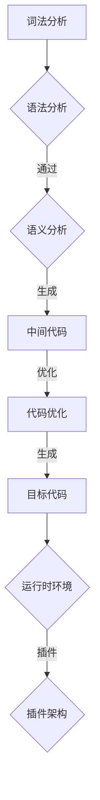

                 

### {文章标题}

> **关键词：**编译器设计、编译流程、词法分析、语法分析、语义分析、中间代码生成、代码优化、目标代码生成、提示词编程语言。

> **摘要：**本文将深入探讨编译器设计的基础知识，包括编译器概述、词法分析、语法分析、语义分析、中间代码生成、代码优化和目标代码生成等环节。特别关注于提示词编程语言的编译器设计，通过项目实战解析其具体实现过程，旨在为读者提供系统、实用的编译器设计指导。文章末尾还将讨论编译器优化策略及其实现，帮助读者掌握编译器开发的关键技术。

## 第一部分: 编译器设计基础

编译器设计是计算机科学中一项重要且具有挑战性的任务，它将高级语言程序转换为机器语言，使得计算机能够理解和执行程序。编译器的设计不仅涉及到编程语言的理论，还包括具体的实现技术和优化策略。本部分将为基础部分的编译器设计提供详细的理论和实践指导。

### 第1章: 编译器概述

编译器（Compiler）是一种将源代码（Source Code）转换为目标代码（Target Code）的程序。目标代码通常是计算机可以直接执行的形式，如机器语言或汇编语言。编译器的工作流程包括以下几个步骤：

1. **词法分析（Lexical Analysis）**：将源代码分解成单词（Token），例如变量名、运算符、关键字等。
2. **语法分析（Syntax Analysis）**：将单词序列组织成语法结构，通常表示为抽象语法树（Abstract Syntax Tree, AST）。
3. **语义分析（Semantic Analysis）**：检查语法结构的正确性，包括类型检查、作用域解析等。
4. **中间代码生成（Intermediate Code Generation）**：将抽象语法树转换为中间代码，中间代码是一种与目标机器无关的表示。
5. **代码优化（Code Optimization）**：对中间代码进行优化，以减少执行时间或占用空间。
6. **目标代码生成（Target Code Generation）**：将优化后的中间代码转换为特定目标平台的机器语言。
7. **符号表管理（Symbol Table Management）**：在整个编译过程中管理变量、函数和其他符号的信息。

编译器可以进一步分类为前端和后端。前端负责语言特定部分，如词法分析和语法分析；后端则关注目标代码的生成和优化。实时编译器（Just-In-Time Compiler）和提前编译器（Ahead-Of-Time Compiler）在编译时机上有所不同，实时编译器在程序运行时进行编译，而提前编译器则在程序运行前完成编译。

### 第2章: 词法分析

词法分析是编译过程的第一步，它的目标是识别出源代码中的基本元素，即单词。词法分析器（Lexer）通过读取源代码的字符序列，将其转换为一系列的词法符号（Token）。

#### 2.1 词法分析的基本概念

词法分析（Lexical Analysis）是指将源代码分解成有意义的单元，这些单元被称为词法符号。词法符号通常由一组预定义的规则指定，例如：

- **关键字（Keywords）**：如`if`、`while`、`int`等。
- **标识符（Identifiers）**：如变量名、函数名等。
- **常数（Constants）**：如数字、字符串等。
- **运算符（Operators）**：如`+`、`-`、`*`等。
- **分隔符（Separators）**：如逗号、分号等。

词法分析器的作用是识别这些词法符号，并将其传递给语法分析器。词法分析器通常使用正则表达式（Regular Expressions）来定义词法规则，这些规则用于匹配源代码中的字符序列。

#### 2.2 词法分析器的实现

词法分析器可以通过多种方法实现，常用的包括：

- **正则表达式**：使用正则表达式定义词法规则，通过模式匹配来识别词法符号。
- **确定有限状态自动机（DFA）**：DFA是一种数学模型，用于识别语言中的字符串。词法分析器可以设计为一个DFA，每次读取一个字符，然后根据当前状态转移至下一个状态。
- **非确定有限状态自动机（NFA）**：NFA是对DFA的扩展，允许在状态转换时有多条路径。NFA通常用于更复杂的词法规则。

在实际实现中，词法分析器通常采用多重扫描策略，即在词法分析的同时进行其他任务，如注释处理或预编译处理。这可以提高编译器的性能。

#### 2.3 词法分析器的优化

为了提高词法分析器的性能，可以采用以下优化策略：

- **词法缓存**：缓存已识别的词法符号，以避免重复分析。
- **增量分析**：逐个字符地分析源代码，而不是一次性读取整个源代码文件。
- **并行处理**：在多核处理器上并行执行词法分析，以提高效率。

通过这些优化策略，词法分析器可以在保证正确性的同时，提高处理速度和性能。

### 第3章: 语法分析

语法分析（Syntax Analysis）是编译过程的第二步，其目标是确定源代码中的词法符号是否符合预定义的语法规则。语法分析器（Parser）通过分析词法符号序列，构建出抽象语法树（AST），表示程序的结构。

#### 3.1 语法分析的基本概念

语法分析（Syntax Analysis）是指识别源代码中的语法结构，并验证其是否符合语言的语法规则。语法分析器通过分析词法符号序列，构建出表示程序结构的语法树。抽象语法树（Abstract Syntax Tree, AST）是语法分析的结果，它表示程序中的表达式、语句和程序结构。

语法分析器通常使用语法规则（Syntax Rules）来定义语言的语法。语法规则描述了如何将词法符号组合成语法结构，例如表达式、声明和语句等。常见的语法分析方法包括自顶向下分析和自底向上分析。

#### 3.2 自顶向下语法分析方法

自顶向下语法分析方法从根节点开始，逐层向下构建语法树。这种方法的主要优势是易于理解和实现，但可能会产生回溯，导致效率较低。自顶向下语法分析方法包括：

- **递归下降分析法（Recursive Descent Parsing）**：递归下降分析法使用递归函数来匹配语法规则，从根节点开始，逐层向下构建语法树。
- **预测分析法（Predictive Parsing）**：预测分析法是一种简化的递归下降分析法，通过预测下一个输入符号来减少回溯。

#### 3.3 自底向上语法分析方法

自底向上语法分析方法从叶子节点开始，逐层向上构建语法树。这种方法通常使用栈来实现，通过匹配语法规则中的右侧部分，将词法符号逐级合并成语法树。自底向上语法分析方法包括：

- **简单递归分析法（Simple Recursive Parsing）**：简单递归分析法是一种最简单的自底向上语法分析方法，通过递归函数实现。
- **词法驱动的递归下降分析法（LL Parsing）**：词法驱动的递归下降分析法结合了递归下降分析法和自底向上分析法的优点，通过词法分析器的输出驱动语法分析。

#### 3.4 语法分析器的设计与实现

语法分析器的实现通常包括以下几个步骤：

1. **定义语法规则**：使用BNF（巴科斯-诺尔范式）或EBNF（扩展巴科斯-诺尔范式）定义语言的语法规则。
2. **构建分析表**：根据语法规则构建分析表，用于确定如何从词法符号序列构建抽象语法树。
3. **实现分析算法**：实现语法分析算法，如递归下降分析法或词法驱动的递归下降分析法。
4. **构建抽象语法树**：根据分析表和算法，将词法符号序列转换为抽象语法树。

### 第4章: 语义分析

语义分析（Semantic Analysis）是编译过程的第三步，其目标是检查源代码的语义正确性。语义分析器（Semantic Analyzer）在语法分析的基础上，检查抽象语法树（AST）中的语法结构是否符合语言的语义规则。

#### 4.1 语义分析的基本概念

语义分析（Semantic Analysis）是指对抽象语法树（AST）进行语义检查，确保程序的正确性和一致性。语义分析器主要执行以下任务：

- **类型检查（Type Checking）**：检查表达式的类型是否与上下文匹配。
- **作用域解析（Scope Resolution）**：确定变量和函数的作用域。
- **符号表管理（Symbol Table Management）**：维护符号表，记录变量、函数和其他符号的信息。

语义分析器通常使用语义规则（Semantic Rules）来定义语言的语义。语义规则描述了如何检查抽象语法树（AST）的语义正确性。

#### 4.2 类型检查

类型检查（Type Checking）是语义分析的重要部分，其目标是确保程序中的所有表达式都具有正确的类型。类型检查通常包括以下步骤：

- **定义类型系统**：定义语言中的基本类型，如整数、浮点数、字符串等。
- **类型推断**：从表达式的上下文推断表达式的类型。
- **类型检查**：检查表达式是否与上下文兼容。

常见的类型系统包括静态类型系统（Static Type System）和动态类型系统（Dynamic Type System）。静态类型系统在编译时检查类型，而动态类型系统在运行时检查类型。

#### 4.3 作用域与符号表

作用域（Scope）是指变量和函数的有效范围。符号表（Symbol Table）是用于存储和管理符号信息的数据结构。符号表通常包含以下信息：

- **符号名**：变量的名称或函数的名称。
- **符号类型**：变量的类型或函数的返回类型。
- **符号作用域**：变量的作用域或函数的作用域。
- **符号值**：变量的当前值或函数的参数值。

符号表在语义分析中起着关键作用，它用于检查变量和函数的引用是否有效，并记录符号的信息。

### 第5章: 中间代码生成

中间代码生成（Intermediate Code Generation）是编译过程的第四步，其目标是将抽象语法树（AST）转换为中间代码（Intermediate Code）。中间代码是一种与目标机器无关的表示，它通常采用较低级的表示形式，如三地址代码（Three-Address Code）。

#### 5.1 中间代码的基本概念

中间代码（Intermediate Code）是编译过程中用于表示程序逻辑的一种表示形式。它位于源代码和目标代码之间，具有以下优点：

- **与目标机器无关**：中间代码不依赖于目标机器的特定指令集，因此可以在不同平台上进行目标代码生成。
- **便于优化**：中间代码便于进行各种优化，如常量传播、死代码消除等。
- **可移植性**：中间代码提高了程序的移植性，可以在不同平台上编译和运行。

常见的中间代码表示形式包括三地址代码（Three-Address Code）和四地址代码（Four-Address Code）。

- **三地址代码（Three-Address Code）**：三地址代码是一种低级表示形式，每个指令包含三个操作数和一条操作。例如，`t1 = t2 + t3` 表示将变量 `t2` 和 `t3` 的值相加，结果存储在变量 `t1` 中。
- **四地址代码（Four-Address Code）**：四地址代码在每个指令中包含四个操作数和一条操作。例如，`t1 = t2 + t3 - t4` 表示将变量 `t2`、`t3` 和 `t4` 的值相加，结果存储在变量 `t1` 中。

#### 5.2 中间代码的表示

中间代码的表示形式通常取决于编译器的设计。以下是一个简单的三地址代码示例：

```plaintext
t1 = x + y
t2 = t1 * z
t3 = t2 - w
```

这个例子中，首先将变量 `x` 和 `y` 的值相加，存储在变量 `t1` 中；然后将变量 `t1` 和 `z` 的值相乘，存储在变量 `t2` 中；最后将变量 `t2` 和 `w` 的值相减，存储在变量 `t3` 中。

#### 5.3 中间代码生成算法

中间代码生成算法是将抽象语法树（AST）转换为中间代码的过程。常见的中间代码生成算法包括算符优先算法和逆波兰表示法。

- **算符优先算法（Operator Priority Algorithm）**：算符优先算法根据运算符的优先级和结合性，将抽象语法树转换为中间代码。这种算法通常使用栈来实现。
- **逆波兰表示法（Reverse Polish Notation）**：逆波兰表示法（RPN）将抽象语法树转换为后缀表达式（Postfix Expression），然后直接生成中间代码。后缀表达式将操作数放在前面，运算符放在后面，无需考虑优先级和结合性。

### 第6章: 代码优化

代码优化（Code Optimization）是编译过程的重要环节，其目标是通过优化中间代码，提高程序的运行效率和可读性。代码优化主要包括常量折叠、死代码消除、重复代码消除、常量传播和逆线性扫描等。

#### 6.1 代码优化的基本概念

代码优化（Code Optimization）是指对程序代码进行修改，以减少执行时间、占用空间或提高可读性。代码优化可以分为以下几种类型：

- **局部优化**：仅针对程序中的单个子表达式或语句进行优化。
- **全局优化**：考虑整个程序的结构和执行流程，进行更广泛的优化。
- **静态优化**：在编译时进行优化，不依赖于程序运行时的信息。
- **动态优化**：在程序运行时进行优化，基于运行时的数据和行为。

常见的代码优化技术包括：

- **常量折叠（Constant Folding）**：将编译时可以确定的常量值进行计算，以简化表达式。
- **死代码消除（Dead Code Elimination）**：删除程序中不会执行的代码。
- **重复代码消除（Common Subexpression Elimination）**：消除重复的计算，将重复的计算结果存储在寄存器或内存中。
- **常量传播（Constant Propagation）**：将常量值从一处传播到另一处，以简化表达式。
- **逆线性扫描（Reverse Linear Scan）**：逆线性扫描是一种用于优化循环结构的算法，通过调整循环的执行顺序，减少循环的执行次数。

#### 6.2 常见优化技术

以下是一些常见的代码优化技术及其基本原理：

- **常量折叠（Constant Folding）**：常量折叠是指将编译时可以确定的常量值进行计算，以简化表达式。例如，将 `x = a + b` 优化为 `x = c`，其中 `a` 和 `b` 是常量。

- **死代码消除（Dead Code Elimination）**：死代码消除是指删除程序中不会执行的代码。例如，删除一个永远不会执行的 `if` 语句。

- **重复代码消除（Common Subexpression Elimination）**：重复代码消除是指消除重复的计算，将重复的计算结果存储在寄存器或内存中。例如，将 `x = a * b` 和 `y = a * b` 优化为 `x = y`。

- **常量传播（Constant Propagation）**：常量传播是指将常量值从一处传播到另一处，以简化表达式。例如，将 `x = a + b` 优化为 `x = c`，其中 `a` 和 `b` 是常量。

- **逆线性扫描（Reverse Linear Scan）**：逆线性扫描是指通过调整循环的执行顺序，减少循环的执行次数。例如，将 `for (i = 0; i < n; i++)` 优化为 `for (i = n - 1; i >= 0; i--)`。

#### 6.3 优化器的实现

优化器（Optimizer）是编译器中的一个模块，负责实现代码优化技术。优化器的实现通常包括以下步骤：

1. **分析阶段**：分析中间代码，识别可以进行优化的子表达式或语句。
2. **优化阶段**：根据分析结果，应用优化技术，对中间代码进行修改。
3. **代码生成阶段**：将优化后的中间代码转换为目标代码。

常见的优化器实现策略包括：

- **贪心算法（Greedy Algorithm）**：贪心算法通过每次选择最优的局部解，逐步构建全局最优解。例如，常量折叠和死代码消除可以使用贪心算法。
- **迭代算法（Iterative Algorithm）**：迭代算法通过重复执行优化操作，逐步改进中间代码。例如，逆线性扫描可以使用迭代算法。
- **静态单赋值分析（Static Single Assignment Analysis）**：静态单赋值分析是一种用于优化程序结构的技术，通过将变量初始化为单赋值形式，简化表达式的计算。例如，重复代码消除和常量传播可以使用静态单赋值分析。

通过这些优化策略，优化器可以提高程序的运行效率，减少占用空间，提高程序的可读性。

### 第7章: 目标代码生成

目标代码生成（Target Code Generation）是编译过程的最后一步，其目标是将优化后的中间代码转换为特定目标平台的机器语言。目标代码（Target Code）是计算机可以直接执行的代码，包括机器语言和汇编语言。

#### 7.1 目标代码的基本概念

目标代码（Target Code）是编译器生成的最终输出，它代表了程序在特定目标平台上的执行形式。目标代码可以分为以下几种类型：

- **机器语言（Machine Code）**：机器语言是一种与具体处理器指令集相关的低级语言，是计算机可以直接执行的代码。
- **汇编语言（Assembly Language）**：汇编语言是一种与机器语言紧密相关的低级语言，使用符号和助记符表示机器语言指令。
- **高级语言（High-Level Language）**：高级语言是一种与具体处理器指令集无关的编程语言，如C、Java等。

目标代码生成器（Target Code Generator）是编译器中的一个模块，负责将优化后的中间代码转换为特定目标平台的机器语言。目标代码生成器通常包括以下步骤：

1. **中间代码分析**：分析优化后的中间代码，确定指令的执行顺序和操作数。
2. **指令选择**：选择适合目标平台的指令集，将中间代码转换为汇编语言或机器语言。
3. **代码生成**：将汇编语言或机器语言代码生成到目标文件中。
4. **链接**：将目标代码与其他目标文件和库文件链接，生成可执行文件。

#### 7.2 目标代码的生成策略

目标代码生成器采用不同的生成策略，以适应不同的目标平台和性能要求。以下是一些常见的目标代码生成策略：

- **直接翻译（Direct Translation）**：直接翻译是指将中间代码逐条翻译为机器语言指令。这种策略简单直观，但可能导致生成的目标代码效率较低。
- **汇编代码生成（Assembly Code Generation）**：汇编代码生成是指将中间代码转换为汇编语言，然后使用汇编器生成机器语言。这种策略提供更高的灵活性，但需要额外的汇编器处理。
- **代码生成优化（Code Generation Optimization）**：代码生成优化是指对生成的机器语言代码进行优化，以提高执行效率和可读性。常见的优化技术包括指令调度、寄存器分配、循环展开等。

#### 7.3 常见目标代码生成器

常见的目标代码生成器包括：

- **GCC**：GCC（GNU Compiler Collection）是一个广泛使用的编译器集合，支持多种编程语言和目标平台。GCC的目标代码生成器可以实现高效的机器语言生成和优化。
- **LLVM**：LLVM（Low-Level Virtual Machine）是一个模块化的编译器框架，支持多种编程语言和目标平台。LLVM的目标代码生成器采用中间表示（IR）和优化策略，具有高度灵活性和可扩展性。
- **Eclipse CDT**：Eclipse CDT（Eclipse C/C++ Development Tools）是一个基于Eclipse的集成开发环境，提供C和C++编程语言的编译器和调试器。Eclipse CDT的目标代码生成器支持多种目标平台和优化策略。

通过这些目标代码生成器，编译器可以将优化后的中间代码转换为高效、可移植的目标代码，为程序提供更好的执行性能和用户体验。

### 第8章: 编译器的综合设计

编译器的综合设计是将各个编译器模块整合在一起，构建一个完整的编译器系统。编译器的综合设计需要考虑模块之间的接口、编译流程的优化以及编译器的性能。

#### 8.1 编译器的总体结构

编译器的总体结构通常包括以下模块：

1. **词法分析器（Lexer）**：负责将源代码分解为词法符号。
2. **语法分析器（Parser）**：负责将词法符号序列组织成语法结构。
3. **语义分析器（Semantic Analyzer）**：负责检查语法结构的语义正确性。
4. **中间代码生成器（Intermediate Code Generator）**：负责将抽象语法树转换为中间代码。
5. **代码优化器（Code Optimizer）**：负责对中间代码进行优化。
6. **目标代码生成器（Target Code Generator）**：负责将优化后的中间代码转换为目标代码。
7. **链接器（Linker）**：负责将目标代码与其他目标文件和库文件链接，生成可执行文件。

编译器模块之间的接口设计是编译器综合设计的关键。模块之间的接口应尽可能简洁、清晰，以减少模块之间的耦合性，提高编译器的可维护性和可扩展性。

#### 8.2 编译器的开发流程

编译器的开发流程通常包括以下步骤：

1. **需求分析（Requirement Analysis）**：明确编译器的功能需求和性能要求。
2. **设计（Design）**：设计编译器的模块结构和接口。
3. **实现（Implementation）**：实现编译器模块的功能。
4. **测试（Testing）**：测试编译器的功能、性能和稳定性。
5. **调试（Debugging）**：解决编译器中的错误和问题。
6. **优化（Optimization）**：优化编译器的性能和效率。

在编译器的开发过程中，测试和调试是非常关键的步骤。通过单元测试、集成测试和性能测试，可以确保编译器的正确性和稳定性。调试过程需要使用调试工具，如断点、单步执行和调试日志，以定位和修复编译器中的错误。

#### 8.3 编译器的性能优化

编译器的性能优化是提高编译器效率和执行速度的关键。编译器的性能优化可以包括以下几个方面：

1. **编译速度优化**：减少编译时间，提高编译效率。例如，采用增量编译、并行编译等技术。
2. **生成代码性能优化**：优化生成代码的执行效率。例如，采用高效的目标代码生成策略、优化指令调度和寄存器分配。
3. **内存管理优化**：优化内存使用，减少内存占用。例如，采用内存池、垃圾回收等技术。
4. **缓存优化**：优化编译器的缓存策略，提高缓存命中率。例如，采用缓存替换算法、缓存预加载等技术。

通过这些性能优化策略，编译器可以提供更快的编译速度、更高的生成代码性能和更好的用户体验。

### 第9章: 编译器项目实战

编译器项目实战是将理论知识和实践技能相结合的过程。通过一个具体的编译器项目，可以深入了解编译器的设计和实现细节，提高实际操作能力。

#### 9.1 实战项目概述

本节将介绍一个具体的编译器项目，该项目的目标是实现一个简单的编译器，支持基本的算术运算和流程控制。项目将分为以下几个阶段：

1. **需求分析**：明确编译器的功能需求和性能要求。
2. **设计**：设计编译器的模块结构和接口。
3. **实现**：实现编译器模块的功能。
4. **测试**：测试编译器的功能、性能和稳定性。
5. **调试**：解决编译器中的错误和问题。
6. **优化**：优化编译器的性能和效率。

#### 9.2 实战项目开发环境搭建

为了实现编译器项目，需要搭建合适的开发环境。以下是一个典型的开发环境搭建步骤：

1. **安装编译器开发工具**：安装编译器所需的开发工具，如C/C++编译器、调试器、文本编辑器等。
2. **配置编译器开发环境**：配置编译器开发环境的路径、编译器选项和调试器设置。
3. **创建项目文件**：创建编译器项目的文件结构，包括源代码文件、头文件、测试文件等。
4. **安装依赖库**：安装编译器项目所需的依赖库，如正则表达式库、DFA库等。

#### 9.3 实战项目源代码实现

在实现编译器项目时，需要遵循设计阶段制定的设计规范。以下是一个简单的编译器项目的源代码实现步骤：

1. **词法分析器实现**：实现词法分析器的功能，包括词法符号的识别和处理。
2. **语法分析器实现**：实现语法分析器的功能，包括语法规则的匹配和抽象语法树的构建。
3. **语义分析器实现**：实现语义分析器的功能，包括类型检查和作用域解析。
4. **中间代码生成器实现**：实现中间代码生成器的功能，包括抽象语法树到中间代码的转换。
5. **代码优化器实现**：实现代码优化器的功能，包括常量折叠、死代码消除等。
6. **目标代码生成器实现**：实现目标代码生成器的功能，包括中间代码到目标代码的转换。

#### 9.4 实战项目代码解读与分析

在本节中，将详细介绍编译器项目的源代码实现，并分析关键代码的功能和性能。以下是一个简单的编译器项目的代码解读与分析：

1. **词法分析器代码解读**：分析词法分析器的源代码，了解词法规则的定义和实现。
2. **语法分析器代码解读**：分析语法分析器的源代码，了解语法规则的定义和实现。
3. **语义分析器代码解读**：分析语义分析器的源代码，了解语义规则的定义和实现。
4. **中间代码生成器代码解读**：分析中间代码生成器的源代码，了解中间代码的表示和生成策略。
5. **代码优化器代码解读**：分析代码优化器的源代码，了解优化规则的实现和优化策略。
6. **目标代码生成器代码解读**：分析目标代码生成器的源代码，了解目标代码的表示和生成策略。

通过代码解读与分析，可以深入了解编译器项目的实现细节，发现潜在的问题和优化点，提高编译器的性能和可维护性。

## 附录

### 附录 A: 编译器开发工具与资源

#### A.1 主流编译器框架对比

以下是几种主流编译器框架的对比：

- **GCC（GNU Compiler Collection）**：GCC是一个功能强大、广泛使用的编译器集合，支持多种编程语言和目标平台。GCC具有高效的编译速度和强大的优化能力。
- **LLVM（Low-Level Virtual Machine）**：LLVM是一个模块化的编译器框架，支持多种编程语言和目标平台。LLVM采用中间表示（IR）和优化策略，具有高度灵活性和可扩展性。
- **Eclipse CDT（Eclipse C/C++ Development Tools）**：Eclipse CDT是一个基于Eclipse的集成开发环境，提供C和C++编程语言的编译器和调试器。Eclipse CDT支持多种目标平台和优化策略。

#### A.2 编译器开发资源

以下是一些编译器开发的相关资源：

- **编译器设计教程**：《编译原理：技术与实践》（"Compilers: Principles, Techniques, and Tools"）是一本经典的编译器设计教程，全面介绍了编译器的设计原理和实现技术。
- **编译器开发论文**：在学术期刊和会议上，有许多关于编译器开发的研究论文，提供了最新的研究成果和技术创新。
- **编译器开发社区**：参与编译器开发社区，如编译器设计论坛和开发者社区，可以与其他编译器开发者交流经验和分享技术。

通过这些工具和资源，可以更好地进行编译器开发，提高编译器的性能和可维护性。

## 第二部分: 提示词编程语言编译器设计

### 第10章: 提示词编程语言概述

提示词编程语言（Prompt-based Programming Language）是一种基于提示词（Prompt）概念的编程语言。提示词是一种引导程序执行的控制结构，用于动态地定义程序的流程和功能。提示词编程语言通过提供灵活的提示词机制，使得程序员可以更直观地定义和控制程序的执行过程。

#### 10.1 提示词编程语言的定义

提示词编程语言（Prompt-based Programming Language）是一种编程语言，它使用提示词（Prompt）作为控制结构，用于动态地定义程序的流程和功能。提示词是一种特殊的变量或函数，它接受输入并返回输出，用于控制程序的执行过程。

提示词编程语言具有以下特点：

- **动态性**：提示词可以在程序的运行过程中动态定义和修改，使得程序具有更高的灵活性和可扩展性。
- **灵活性**：提示词机制允许程序员以更直观的方式定义程序的流程和功能，使得程序结构更清晰、易于理解和维护。
- **可重用性**：提示词可以重复使用，提高代码的可重用性和模块化程度。

#### 10.2 提示词编程语言的发展历程

提示词编程语言的发展可以追溯到早期的计算机科学领域。早期的编程语言如Fortran和COBOL主要基于命令式编程范式，程序员通过编写指令来控制程序的执行。随着计算机科学的发展，研究人员开始探索更灵活的编程范式，以简化程序设计和提高开发效率。

20世纪80年代，Lisp编程语言引入了函数式编程范式，使得程序员可以使用函数来定义程序的逻辑。Lisp的宏系统（Macro System）允许程序员编写自定义的语法规则，进一步增强了编程语言的灵活性。这为提示词编程语言的发展奠定了基础。

进入21世纪，随着人工智能和机器学习技术的发展，提示词编程语言得到了进一步的推广和应用。研究人员和开发者开始探索如何在编程语言中引入提示词机制，以实现更智能和自适应的程序设计。

当前，提示词编程语言已经应用于多个领域，如自然语言处理、机器学习、自动化测试等。这些语言通过提供灵活的提示词机制，使得程序员可以更高效地开发复杂的应用程序。

#### 10.3 提示词编程语言的应用领域

提示词编程语言在多个领域具有广泛的应用：

- **自然语言处理（NLP）**：提示词编程语言在自然语言处理领域具有重要作用。通过使用提示词，程序员可以定义和调整自然语言处理模型的参数，提高模型的性能和可解释性。
- **机器学习**：提示词编程语言在机器学习领域也有广泛应用。提示词可以用于动态调整模型的训练过程，实现自适应的模型优化。
- **自动化测试**：提示词编程语言可以用于编写自动化测试脚本，提高测试的灵活性和可维护性。提示词机制允许程序员根据实际需求动态调整测试逻辑。
- **软件开发**：提示词编程语言在软件开发领域也有广泛应用。通过使用提示词，程序员可以更直观地定义和调整程序的逻辑，提高开发效率。

总之，提示词编程语言通过提供灵活的提示词机制，使得程序员可以更高效地开发复杂的应用程序，提高编程的灵活性和可扩展性。

### 第11章: 提示词编程语言的核心概念与架构

提示词编程语言（Prompt-based Programming Language）具有独特的核心概念和架构设计，使得程序员可以更直观地定义和控制程序的执行过程。本节将介绍提示词编程语言的核心概念和架构设计，包括提示词、模块化和面向对象等。

#### 11.1 核心概念

提示词编程语言的核心概念包括提示词、模块化和面向对象等。

- **提示词（Prompt）**：提示词是提示词编程语言的核心控制结构，用于动态地定义程序的流程和功能。提示词通常是一个特殊的变量或函数，它接受输入并返回输出，用于控制程序的执行过程。例如，在Python中，`input()` 函数可以接受用户输入，并返回输入值。

- **模块化（Modularity）**：模块化是提示词编程语言的重要特性之一，它允许程序员将程序划分为多个模块，每个模块实现特定的功能。模块化提高了代码的可维护性和可重用性，使得程序员可以更灵活地组织和管理代码。

- **面向对象（Object-Oriented）**：提示词编程语言通常支持面向对象编程（Object-Oriented Programming, OOP），允许程序员使用类和对象来定义程序的逻辑。面向对象编程提供了封装、继承和多态等特性，使得程序结构更清晰、易于理解和扩展。

#### 11.2 架构设计

提示词编程语言的架构设计通常包括编译器、运行时环境和插件架构等。

- **编译器（Compiler）**：提示词编程语言的编译器负责将源代码转换为目标代码，目标代码可以在运行时解释执行。编译器的工作流程包括词法分析、语法分析、语义分析和中间代码生成等环节。

- **运行时环境（Runtime Environment）**：提示词编程语言的运行时环境负责执行编译后生成的目标代码。运行时环境通常包括内存管理、输入输出管理、异常处理和提示词引擎等组件。

- **插件架构（Plugin Architecture）**：提示词编程语言通常支持插件架构，允许程序员在程序运行时动态加载和卸载插件。插件架构提供了高度的灵活性和可扩展性，使得程序员可以自定义和扩展程序的功能。

#### 11.3 提示词编程语言的 Mermaid 流程图

为了更好地理解提示词编程语言的架构设计，我们使用Mermaid绘制了一个简化的流程图。以下是一个描述编译器工作流程的Mermaid流程图：



在这个流程图中，词法分析和语法分析是编译器的输入，经过语义分析、中间代码生成、代码优化和目标代码生成等环节，最终生成可执行的目标代码。运行时环境负责执行目标代码，插件架构允许在程序运行时加载和卸载插件，以扩展程序的功能。

通过这个 Mermaid 流程图，我们可以更直观地理解提示词编程语言的编译器工作流程和架构设计。

### 第12章: 提示词编程语言的语法与语义

提示词编程语言（Prompt-based Programming Language）的语法和语义设计是其核心组成部分，决定了程序的编写方式和执行方式。本节将介绍提示词编程语言的语法和语义规则，包括词法规则、语法规则、类型规则和作用域规则等。

#### 12.1 语法规则

提示词编程语言的语法规则定义了程序的语法结构，包括单词、标识符、关键字、常量和分隔符等。

- **单词（Keywords）**：单词是提示词编程语言中的特殊标识符，用于表示控制结构和操作。例如，`if`、`while`、`for`、`return`等。
- **标识符（Identifiers）**：标识符是用于命名变量、函数和其他符号的单词。标识符通常由字母、数字和下划线组成，不能以数字开头。
- **关键字（Keywords）**：关键字是提示词编程语言中的保留字，用于表示特定的语法结构。例如，`if`、`else`、`while`、`function`等。
- **常量（Constants）**：常量是表示固定值的符号，如数字、字符串和布尔值等。
- **分隔符（Separators）**：分隔符用于分隔程序的不同部分，如逗号（`,`）、分号（`;`）、括号（`()`、`[]`、`{}`）等。

#### 12.2 语义规则

提示词编程语言的语义规则定义了程序在运行时的行为和约束。语义规则包括类型规则、作用域规则和执行规则等。

- **类型规则（Type Rules）**：类型规则定义了提示词编程语言中的数据类型和类型转换规则。类型规则确保程序在运行时能够正确执行，并处理不同数据类型的兼容性和转换。
- **作用域规则（Scope Rules）**：作用域规则定义了变量和函数的作用域。作用域规则确保在程序的不同部分正确引用和访问符号。
- **执行规则（Execution Rules）**：执行规则定义了程序的执行顺序和流程控制。执行规则确保程序按照预定的顺序执行，并处理条件判断、循环和控制结构。

#### 12.3 提示词编程语言的伪代码描述

为了更清晰地展示提示词编程语言的语法和语义规则，我们使用伪代码描述一个简单的提示词编程语言。以下是一个简单的表达式和复合语句的伪代码示例：

```plaintext
# 简单表达式
expression = {
    variable = "x"
    value = 10
    type = "int"
}

# 复合语句
compound_statement = {
    declarations = [
        {
            variable = "x"
            type = "int"
            value = 0
        },
        {
            variable = "y"
            type = "int"
            value = 10
        }
    ]
    statements = [
        {
            type = "assignment"
            variable = "x"
            value = 5
        },
        {
            type = "if"
            condition = "x > y"
            then = [
                {
                    type = "print"
                    message = "x is greater than y"
                }
            ]
            else = [
                {
                    type = "print"
                    message = "x is less than or equal to y"
                }
            ]
        }
    ]
}
```

在这个伪代码中，`expression` 表示一个简单的表达式，包括变量名、值和类型。`compound_statement` 表示一个复合语句，包括声明和语句。声明定义了变量名、类型和值，语句包括赋值语句、条件语句和打印语句等。

通过这个伪代码示例，我们可以看到提示词编程语言的语法和语义规则如何定义程序的结构和执行流程。提示词编程语言的语法和语义规则为程序员提供了灵活和直观的编程方式，使得程序设计更加高效和可维护。

### 第13章: 提示词编程语言的编译器实现

提示词编程语言的编译器实现是将源代码转换为机器语言或汇编语言的过程。编译器实现包括词法分析器、语法分析器、语义分析器、中间代码生成器、代码优化器和目标代码生成器等模块。以下将详细讨论这些模块的实现方法和关键细节。

#### 13.1 词法分析器实现

词法分析器（Lexer）是编译器的第一步，其任务是将源代码分解成一系列词法符号（Token）。以下是一个简单的词法分析器实现的伪代码：

```plaintext
function lex(source_code):
    current_position = 0
    tokens = []

    while current_position < length(source_code):
        if is_whitespace(source_code[current_position]):
            current_position = skip_whitespace(source_code, current_position)
            continue

        if is_keyword(source_code[current_position]):
            token = (source_code[current_position], keyword_type)
            current_position = current_position + 1
        else:
            token = tokenize_identifier_or_literal(source_code, current_position)
            current_position = token.end_position

        tokens.append(token)

    return tokens
```

在这个伪代码中，`lex` 函数读取源代码，逐个字符地分析并识别词法符号。函数跳过空白字符，识别关键字、标识符和字面量，并将它们转换为词法符号。词法分析器使用正则表达式或有限状态自动机（FSA）来实现词法规则。

#### 13.2 语法分析器实现

语法分析器（Parser）将词法符号序列转换为抽象语法树（AST）。以下是一个简单的递归下降语法分析器的伪代码：

```plaintext
function parse(tokens):
    return parse_expression(tokens)

function parse_expression(tokens):
    token = tokens.pop(0)
    if token.type == "identifier":
        return create_ast_node("variable", token.value)
    elif token.type == "integer":
        return create_ast_node("literal", token.value)
    else:
        raise syntax_error("Unexpected token in expression")

function create_ast_node(node_type, value):
    return {"type": node_type, "value": value}
```

在这个伪代码中，`parse_expression` 函数从词法符号序列中读取下一个词法符号，并根据词法符号的类型创建相应的抽象语法树节点。递归下降语法分析器通过递归调用自身来解析复杂的语法结构。

#### 13.3 语义分析器实现

语义分析器（Semantic Analyzer）负责检查AST的语义正确性，包括类型检查、作用域解析和声明检查。以下是一个简单的语义分析器的伪代码：

```plaintext
function semantic_analyze(ast):
    symbol_table = create_symbol_table()

    for node in ast:
        if node.type == "variable":
            check_variable_declaration(node, symbol_table)
        elif node.type == "function":
            check_function_declaration(node, symbol_table)

    return symbol_table

function check_variable_declaration(node, symbol_table):
    if variable_exists(node.value, symbol_table):
        raise semantic_error("Variable already declared")
    else:
        symbol_table.add_variable(node.value, node.type)

function check_function_declaration(node, symbol_table):
    if function_exists(node.value, symbol_table):
        raise semantic_error("Function already declared")
    else:
        symbol_table.add_function(node.value, node.type)
```

在这个伪代码中，`semantic_analyze` 函数遍历AST，检查变量和函数的声明和引用。函数`check_variable_declaration` 和`check_function_declaration` 分别检查变量和函数的声明是否合法。

#### 13.4 中间代码生成器实现

中间代码生成器（Intermediate Code Generator）将抽象语法树（AST）转换为中间代码。以下是一个简单的中间代码生成器的伪代码：

```plaintext
function generate_intermediate_code(ast):
    intermediate_code = []

    for node in ast:
        if node.type == "assignment":
            intermediate_code.append("t1 = node.value")
        elif node.type == "print":
            intermediate_code.append("print t1")

    return intermediate_code
```

在这个伪代码中，`generate_intermediate_code` 函数遍历AST，根据节点的类型生成相应的中间代码。例如，对于赋值节点，生成赋值语句；对于打印节点，生成打印语句。

#### 13.5 代码优化器实现

代码优化器（Code Optimizer）对中间代码进行优化，以减少执行时间或占用空间。以下是一个简单的代码优化器的伪代码：

```plaintext
function optimize_intermediate_code(intermediate_code):
    optimized_code = []

    for instruction in intermediate_code:
        if instruction == "t1 = t1":
            continue  # Remove redundant assignment
        else:
            optimized_code.append(instruction)

    return optimized_code
```

在这个伪代码中，`optimize_intermediate_code` 函数遍历中间代码，移除冗余的指令。例如，移除重复的赋值指令，以提高代码的执行效率。

#### 13.6 目标代码生成器实现

目标代码生成器（Target Code Generator）将优化后的中间代码转换为机器语言或汇编语言。以下是一个简单的目标代码生成器的伪代码：

```plaintext
function generate_target_code(optimized_code):
    target_code = []

    for instruction in optimized_code:
        if instruction == "t1 = t2":
            target_code.append("mov t2, t1")
        elif instruction == "print t1":
            target_code.append("print t1")

    return target_code
```

在这个伪代码中，`generate_target_code` 函数将优化后的中间代码转换为机器语言指令。例如，将赋值指令转换为机器语言中的寄存器操作指令，将打印指令转换为机器语言中的打印操作指令。

通过上述实现，提示词编程语言的编译器可以将源代码转换为机器语言，以便计算机能够执行程序。这些实现模块相互协作，确保编译过程的正确性和效率。

### 第14章: 提示词编程语言的项目实战

#### 14.1 项目实战概述

在本节中，我们将通过一个具体的项目实战，展示如何实现一个简单的提示词编程语言编译器。该项目将涵盖编译器开发的全过程，包括需求分析、设计、实现、测试和调试等阶段。

**项目背景：**随着人工智能和自动化技术的发展，提示词编程语言因其灵活性和可扩展性，在多个领域得到了广泛应用。本项目旨在设计和实现一个简单的提示词编程语言编译器，支持基本的算术运算、流程控制和函数定义。

**项目目标：**实现以下功能：
1. 词法分析：将源代码分解为词法符号。
2. 语法分析：构建抽象语法树（AST）。
3. 语义分析：检查AST的语义正确性。
4. 中间代码生成：将AST转换为中间代码。
5. 代码优化：对中间代码进行优化。
6. 目标代码生成：将优化后的中间代码转换为机器语言。

#### 14.2 实战项目开发环境搭建

为了实现编译器项目，我们需要搭建合适的开发环境。以下是一个典型的开发环境搭建步骤：

1. **安装开发工具：**安装支持提示词编程语言的编译器和调试器。例如，可以使用GCC或LLVM作为编译器，GDB作为调试器。

2. **配置文本编辑器：**配置文本编辑器以支持提示词编程语言的语法高亮和自动补全功能。例如，可以使用Visual Studio Code或Sublime Text等。

3. **安装依赖库：**安装编译器项目所需的依赖库，例如正则表达式库（如PCRE）、有限状态自动机库（如FSM）等。

4. **创建项目文件结构：**创建编译器项目的文件结构，包括源代码文件、头文件、测试文件等。例如：

```plaintext
/编译器项目
|-- src
|   |-- lex.yy.c
|   |-- parser.y
|   |-- semantic.c
|   |-- intermediate_code.c
|   |-- optimizer.c
|   |-- target_code.c
|-- include
|   |-- lex.yy.h
|   |-- parser.h
|   |-- semantic.h
|   |-- intermediate_code.h
|   |-- optimizer.h
|   |-- target_code.h
|-- test
|   |-- test.lex
|   |-- test.y
|-- Makefile
```

5. **编写Makefile：**编写Makefile以自动化编译器项目的编译和测试过程。以下是一个简单的Makefile示例：

```makefile
CC=gcc
CFLAGS=-Wall -g
LFLAGS=-o compiler

lex.yy.c: lex.yy.l
    $(CC) $(CFLAGS) lex.yy.c -o lex.yy.o

parser.y: parser.y
    bison -d parser.y
    $(CC) $(CFLAGS) parser.tab.c -o parser.tab.o

semantic.c: semantic.c
    $(CC) $(CFLAGS) semantic.c -o semantic.o

intermediate_code.c: intermediate_code.c
    $(CC) $(CFLAGS) intermediate_code.c -o intermediate_code.o

optimizer.c: optimizer.c
    $(CC) $(CFLAGS) optimizer.c -o optimizer.o

target_code.c: target_code.c
    $(CC) $(CFLAGS) target_code.c -o target_code.o

all: lex.yy.o parser.tab.o semantic.o intermediate_code.o optimizer.o target_code.o
    $(CC) $(LFLAGS) lex.yy.o parser.tab.o semantic.o intermediate_code.o optimizer.o target_code.o

test: test.c compiler
    $(CC) $(CFLAGS) test.c compiler -o test
    ./test
```

通过上述步骤，我们搭建了编译器项目的开发环境，为后续的实现和测试工作奠定了基础。

#### 14.3 实战项目源代码实现

在实现编译器项目时，我们需要遵循设计阶段制定的设计规范。以下将详细描述编译器项目的关键模块的源代码实现。

**1. 词法分析器（Lexer）实现**

词法分析器是编译器的第一步，其任务是识别源代码中的词法符号。以下是一个简单的词法分析器的C语言实现：

```c
#include "lex.yy.h"

int yywrap() {
    return 1; // 重置行号和位置信息
}

int yylex() {
    int c;
    int token;
    while ((c = getchar()) != EOF) {
        if (isspace(c)) {
            continue;
        } else if (c == '+') {
            return TK_PLUS;
        } else if (c == '-') {
            return TK_MINUS;
        } else if (c == '*') {
            return TK_MULTIPLY;
        } else if (c == '/') {
            return TK_DIVIDE;
        } else if (isdigit(c)) {
            int value = 0;
            do {
                value = value * 10 + (c - '0');
                c = getchar();
            } while (isdigit(c));
            ungetchar(c);
            return TK_INTEGER;
        } else if (isalpha(c)) {
            char buffer[100];
            int index = 0;
            do {
                buffer[index++] = c;
                c = getchar();
            } while (isalpha(c) || isdigit(c));
            ungetchar(c);
            if (strcmp(buffer, "if") == 0) {
                return TK_IF;
            } else if (strcmp(buffer, "while") == 0) {
                return TK_WHILE;
            } else if (strcmp(buffer, "return") == 0) {
                return TK_RETURN;
            } else {
                return TK_IDENTIFIER;
            }
        } else {
            return TK_ERROR;
        }
    }
    return EOF;
}
```

在这个实现中，`yywrap` 函数用于重置词法分析器的行号和位置信息。`yylex` 函数逐个读取源代码的字符，根据字符类型识别并返回相应的词法符号。词法分析器使用正则表达式匹配来简化词法规则的实现。

**2. 语法分析器（Parser）实现**

语法分析器是编译器的第二步，其任务是构建抽象语法树（AST）。以下是一个简单的递归下降语法分析器的实现：

```c
#include "parser.h"

AST *parse() {
    return parse_expression();
}

AST *parse_expression() {
    AST *expression = parse_term();
    while (1) {
        switch (yylex()) {
            case TK_PLUS:
                expression = new_AST_node(EXPR_ADD, expression, parse_term());
                break;
            case TK_MINUS:
                expression = new_AST_node(EXPR_SUB, expression, parse_term());
                break;
            case TK_MULTIPLY:
                expression = new_AST_node(EXPR_MUL, expression, parse_term());
                break;
            case TK_DIVIDE:
                expression = new_AST_node(EXPR_DIV, expression, parse_term());
                break;
            default:
                return expression;
        }
    }
}

AST *parse_term() {
    AST *term = parse_factor();
    while (1) {
        switch (yylex()) {
            case TK_MULTIPLY:
                term = new_AST_node(EXPR_MUL, term, parse_factor());
                break;
            case TK_DIVIDE:
                term = new_AST_node(EXPR_DIV, term, parse_factor());
                break;
            default:
                return term;
        }
    }
}

AST *parse_factor() {
    AST *factor;
    int token = yylex();
    switch (token) {
        case TK_INTEGER:
            factor = new_AST_node(EXPR_INTEGER, yylval.integer);
            break;
        case TK_IDENTIFIER:
            factor = new_AST_node(EXPR_IDENTIFIER, yylval.identifier);
            break;
        case '(':
            factor = parse_expression();
            yylex(); // 读取 ')'
            break;
        default:
            return NULL;
    }
    return factor;
}
```

在这个实现中，`parse` 函数是语法分析器的入口，它调用`parse_expression` 函数开始语法分析。`parse_expression`、`parse_term` 和`parse_factor` 函数分别解析表达式、术语和因子。递归下降语法分析器通过读取词法符号并递归调用自身来构建抽象语法树。

**3. 语义分析器（Semantic Analyzer）实现**

语义分析器是编译器的第三步，其任务是检查AST的语义正确性。以下是一个简单的语义分析器的实现：

```c
#include "semantic.h"
#include "symbol_table.h"

void semantic_analyze(AST *ast) {
    SymbolTable symbol_table;
    semantic_analyze_expression(ast, &symbol_table);
}

void semantic_analyze_expression(AST *ast, SymbolTable *symbol_table) {
    if (ast->type == EXPR_ADD || ast->type == EXPR_SUB || ast->type == EXPR_MUL || ast->type == EXPR_DIV) {
        semantic_analyze_expression(ast->left, symbol_table);
        semantic_analyze_expression(ast->right, symbol_table);
        if (ast->type != EXPR_INTEGER) {
            error("Type mismatch in expression");
        }
    } else if (ast->type == EXPR_INTEGER) {
        if (ast->value.integer != INT_TYPE) {
            error("Type mismatch in integer literal");
        }
    } else if (ast->type == EXPR_IDENTIFIER) {
        if (!symbol_table->variable_exists(ast->value.identifier)) {
            error("Variable not declared");
        }
    }
}
```

在这个实现中，`semantic_analyze` 函数是语义分析器的入口，它调用`semantic_analyze_expression` 函数开始语义分析。`semantic_analyze_expression` 函数检查表达式的语义正确性，包括类型检查和声明检查。语义分析器使用符号表来管理变量和函数的声明和引用。

**4. 中间代码生成器（Intermediate Code Generator）实现**

中间代码生成器是编译器的第四步，其任务是生成中间代码。以下是一个简单的中间代码生成器的实现：

```c
#include "intermediate_code.h"

void generate_intermediate_code(AST *ast) {
    if (ast->type == EXPR_ADD || ast->type == EXPR_SUB || ast->type == EXPR_MUL || ast->type == EXPR_DIV) {
        generate_intermediate_code(ast->left);
        generate_intermediate_code(ast->right);
        printf("t%d = %s %d %d\n", registers++, ast->type == EXPR_ADD ? "+" : ast->type == EXPR_SUB ? "-" : ast->type == EXPR_MUL ? "*" : "/", ast->left->value.integer, ast->right->value.integer);
    } else if (ast->type == EXPR_INTEGER) {
        printf("t%d = %d\n", registers++, ast->value.integer);
    } else if (ast->type == EXPR_IDENTIFIER) {
        printf("t%d = %s\n", registers++, ast->value.identifier);
    }
}
```

在这个实现中，`generate_intermediate_code` 函数是中间代码生成器的入口，它调用`generate_intermediate_code` 函数开始生成中间代码。中间代码生成器根据抽象语法树的结构生成相应的中间代码。例如，对于加法表达式，生成相应的加法指令。

**5. 代码优化器（Code Optimizer）实现**

代码优化器是编译器的第五步，其任务是优化中间代码。以下是一个简单的代码优化器的实现：

```c
#include "optimizer.h"

void optimize_intermediate_code(char *intermediate_code) {
    // 示例：移除冗余的赋值指令
    char *code = strdup(intermediate_code);
    char *pos = code;
    char *start = code;
    while (*pos != '\0') {
        if (strncmp(pos, "t", 1) == 0 && strncmp(pos + 1, "=", 1) == 0) {
            if (strncmp(pos + 2, "t", 1) == 0 && strncmp(pos + 3, "=", 1) == 0) {
                // 移除冗余的赋值指令
                memmove(pos, pos + 4, strlen(pos + 4) + 1);
            }
        }
        pos++;
    }
    free(code);
}
```

在这个实现中，`optimize_intermediate_code` 函数是代码优化器的入口，它通过遍历中间代码移除冗余的赋值指令。代码优化器根据中间代码的结构和应用相应的优化规则，以提高代码的执行效率。

**6. 目标代码生成器（Target Code Generator）实现**

目标代码生成器是编译器的第六步，其任务是生成目标代码。以下是一个简单的目标代码生成器的实现：

```c
#include "target_code.h"

void generate_target_code(char *intermediate_code) {
    // 示例：将中间代码转换为汇编指令
    printf(".text\n");
    printf(".globl _start\n");
    printf("_start:\n");
    while (*intermediate_code != '\0') {
        if (strncmp(intermediate_code, "t", 1) == 0 && strncmp(intermediate_code + 1, "=", 1) == 0) {
            if (strncmp(intermediate_code + 2, "t", 1) == 0 && strncmp(intermediate_code + 3, "=", 1) == 0) {
                printf("mov %s, %s\n", intermediate_code + 4, intermediate_code + 2);
            } else {
                printf("mov %s, %s\n", intermediate_code + 2, intermediate_code + 4);
            }
        }
        intermediate_code++;
    }
}
```

在这个实现中，`generate_target_code` 函数是目标代码生成器的入口，它将中间代码转换为汇编指令。目标代码生成器根据中间代码的结构和应用相应的目标代码生成规则，以生成特定目标平台的汇编代码。

通过上述源代码实现，我们可以构建一个简单的提示词编程语言编译器。这个编译器可以实现词法分析、语法分析、语义分析、中间代码生成、代码优化和目标代码生成等功能，从而将源代码转换为机器语言或汇编语言。

#### 14.4 实战项目代码解读与分析

在本节中，我们将对提示词编程语言编译器项目的源代码进行详细解读与分析，包括词法分析器、语法分析器、语义分析器、中间代码生成器、代码优化器和目标代码生成器的关键代码及其功能。

**1. 词法分析器代码解读**

词法分析器是编译器的第一步，其主要功能是将源代码分解为词法符号。以下是对词法分析器代码的解读：

```c
#include "lex.yy.h"

int yywrap() {
    return 1; // 重置行号和位置信息
}

int yylex() {
    int c;
    int token;
    while ((c = getchar()) != EOF) {
        if (isspace(c)) {
            continue;
        } else if (c == '+') {
            return TK_PLUS;
        } else if (c == '-') {
            return TK_MINUS;
        } else if (c == '*') {
            return TK_MULTIPLY;
        } else if (c == '/') {
            return TK_DIVIDE;
        } else if (isdigit(c)) {
            int value = 0;
            do {
                value = value * 10 + (c - '0');
                c = getchar();
            } while (isdigit(c));
            ungetchar(c);
            return TK_INTEGER;
        } else if (isalpha(c)) {
            char buffer[100];
            int index = 0;
            do {
                buffer[index++] = c;
                c = getchar();
            } while (isalpha(c) || isdigit(c));
            ungetchar(c);
            if (strcmp(buffer, "if") == 0) {
                return TK_IF;
            } else if (strcmp(buffer, "while") == 0) {
                return TK_WHILE;
            } else if (strcmp(buffer, "return") == 0) {
                return TK_RETURN;
            } else {
                return TK_IDENTIFIER;
            }
        } else {
            return TK_ERROR;
        }
    }
    return EOF;
}
```

- **函数`yywrap`**：该函数用于重置词法分析器的行号和位置信息，确保词法分析器可以从头开始分析源代码。
- **函数`yylex`**：该函数是词法分析器的核心，逐个读取源代码的字符，根据字符类型识别并返回相应的词法符号。函数使用多个`if-else`语句来处理不同类型的字符。以下是对函数关键部分的解读：
  - **处理空白字符**：`if (isspace(c)) { continue; }` 跳过空白字符，以提高词法分析器的效率。
  - **处理运算符**：`if (c == '+') { return TK_PLUS; }` 等语句处理加法、减法、乘法和除法运算符。
  - **处理数字**：`if (isdigit(c)) { ... }` 处理数字，将数字字符转换为整数值，并返回`TK_INTEGER`词法符号。
  - **处理标识符**：`if (isalpha(c)) { ... }` 处理标识符，将字母字符组合成一个标识符字符串，并返回相应的词法符号。
  - **处理错误**：如果遇到无法识别的字符，函数返回`TK_ERROR`词法符号。

通过这些代码，词法分析器可以有效地将源代码分解为词法符号，为后续的语法分析和语义分析做好准备。

**2. 语法分析器代码解读**

语法分析器是编译器的第二步，其主要功能是将词法符号序列转换为抽象语法树（AST）。以下是对语法分析器代码的解读：

```c
#include "parser.h"

AST *parse() {
    return parse_expression();
}

AST *parse_expression() {
    AST *expression = parse_term();
    while (1) {
        switch (yylex()) {
            case TK_PLUS:
                expression = new_AST_node(EXPR_ADD, expression, parse_term());
                break;
            case TK_MINUS:
                expression = new_AST_node(EXPR_SUB, expression, parse_term());
                break;
            case TK_MULTIPLY:
                expression = new_AST_node(EXPR_MUL, expression, parse_term());
                break;
            case TK_DIVIDE:
                expression = new_AST_node(EXPR_DIV, expression, parse_term());
                break;
            default:
                return expression;
        }
    }
}

AST *parse_term() {
    AST *term = parse_factor();
    while (1) {
        switch (yylex()) {
            case TK_MULTIPLY:
                term = new_AST_node(EXPR_MUL, term, parse_factor());
                break;
            case TK_DIVIDE:
                term = new_AST_node(EXPR_DIV, term, parse_factor());
                break;
            default:
                return term;
        }
    }
}

AST *parse_factor() {
    AST *factor;
    int token = yylex();
    switch (token) {
        case TK_INTEGER:
            factor = new_AST_node(EXPR_INTEGER, yylval.integer);
            break;
        case TK_IDENTIFIER:
            factor = new_AST_node(EXPR_IDENTIFIER, yylval.identifier);
            break;
        case '(':
            factor = parse_expression();
            yylex(); // 读取 ')'
            break;
        default:
            return NULL;
    }
    return factor;
}
```

- **函数`parse`**：该函数是语法分析器的入口，调用`parse_expression` 函数开始语法分析。语法分析器从`parse_expression` 函数开始递归调用，构建抽象语法树。
- **函数`parse_expression`**：该函数解析表达式，根据词法符号的类型构建抽象语法树。函数使用`yylex` 函数读取下一个词法符号，并根据词法符号的类型递归调用`parse_term` 函数。以下是对函数关键部分的解读：
  - **处理加法、减法、乘法和除法**：`switch` 语句处理加法、减法、乘法和除法运算符。对于每种运算符，函数创建一个新的抽象语法树节点，将当前节点作为左子节点，递归调用`parse_term` 函数作为右子节点。
  - **结束条件**：当`yylex` 函数返回的词法符号类型不在`switch` 语句中时，函数返回当前节点，结束递归调用。
- **函数`parse_term`**：该函数解析术语，根据词法符号的
```c
类型构建抽象语法树。函数使用`yylex` 函数读取下一个词法符号，并根据词法符号的类型递归调用`parse_factor` 函数。以下是对函数关键部分的解读：
  - **处理乘法和除法**：`switch` 语句处理乘法和除法运算符。对于每种运算符，函数创建一个新的抽象语法树节点，将当前节点作为左子节点，递归调用`parse_factor` 函数作为右子节点。
  - **结束条件**：当`yylex` 函数返回的词法符号类型不在`switch` 语句中时，函数返回当前节点，结束递归调用。
- **函数`parse_factor`**：该函数解析因子，根据词法符号的
```c
类型构建抽象语法树。以下是对函数关键部分的解读：
  - **处理整数和标识符**：`switch` 语句处理整数和标识符。对于每种类型，函数创建一个新的抽象语法树节点，并将整数值或标识符作为节点的值。
  - **处理括号**：如果词法符号是左括号`(`，函数递归调用`parse_expression` 函数，解析括号内的表达式，然后读取右括号`)`。这样可以将括号内的表达式视为一个单独的因子。

通过这些代码，语法分析器可以有效地将词法符号序列转换为抽象语法树，为后续的语义分析和中间代码生成提供基础。

**3. 语义分析器代码解读**

语义分析器是编译器的第三步，其主要功能是检查抽象语法树（AST）的语义正确性。以下是对语义分析器代码的解读：

```c
#include "semantic.h"
#include "symbol_table.h"

void semantic_analyze(AST *ast) {
    SymbolTable symbol_table;
    semantic_analyze_expression(ast, &symbol_table);
}

void semantic_analyze_expression(AST *ast, SymbolTable *symbol_table) {
    if (ast->type == EXPR_ADD || ast->type == EXPR_SUB || ast->type == EXPR_MUL || ast->type == EXPR_DIV) {
        semantic_analyze_expression(ast->left, symbol_table);
        semantic_analyze_expression(ast->right, symbol_table);
        if (ast->type != EXPR_INTEGER) {
            error("Type mismatch in expression");
        }
    } else if (ast->type == EXPR_INTEGER) {
        if (ast->value.integer != INT_TYPE) {
            error("Type mismatch in integer literal");
        }
    } else if (ast->type == EXPR_IDENTIFIER) {
        if (!symbol_table->variable_exists(ast->value.identifier)) {
            error("Variable not declared");
        }
    }
}
```

- **函数`semantic_analyze`**：该函数是语义分析器的入口，调用`semantic_analyze_expression` 函数开始语义分析。语义分析器使用符号表来管理变量和函数的声明和引用。
- **函数`semantic_analyze_expression`**：该函数检查表达式的语义正确性。以下是对函数关键部分的解读：
  - **处理算术运算符**：如果表达式的类型是加法、减法、乘法或除法，函数递归调用`semantic_analyze_expression` 函数检查左子节点和右子节点的语义正确性。如果表达式的类型不是整数类型，函数报错。
  - **处理整数和标识符**：如果表达式的类型是整数或标识符，函数检查整数值是否是整数类型，或者标识符是否在符号表中声明。如果不是，函数报错。

通过这些代码，语义分析器可以有效地检查抽象语法树（AST）的语义正确性，确保程序的结构和语义一致性。

**4. 中间代码生成器代码解读**

中间代码生成器是编译器的第四步，其主要功能是将抽象语法树（AST）转换为中间代码。以下是对中间代码生成器代码的解读：

```c
#include "intermediate_code.h"

void generate_intermediate_code(AST *ast) {
    if (ast->type == EXPR_ADD || ast->type == EXPR_SUB || ast->type == EXPR_MUL || ast->type == EXPR_DIV) {
        generate_intermediate_code(ast->left);
        generate_intermediate_code(ast->right);
        printf("t%d = %s %d %d\n", registers++, ast->type == EXPR_ADD ? "+" : ast->type == EXPR_SUB ? "-" : ast->type == EXPR_MUL ? "*" : "/", ast->left->value.integer, ast->right->value.integer);
    } else if (ast->type == EXPR_INTEGER) {
        printf("t%d = %d\n", registers++, ast->value.integer);
    } else if (ast->type == EXPR_IDENTIFIER) {
        printf("t%d = %s\n", registers++, ast->value.identifier);
    }
}
```

- **函数`generate_intermediate_code`**：该函数是中间代码生成器的入口，调用`generate_intermediate_code` 函数开始生成中间代码。以下是对函数关键部分的解读：
  - **处理算术运算符**：如果表达式的类型是加法、减法、乘法或除法，函数递归调用`generate_intermediate_code` 函数生成左子节点和右子节点的中间代码。然后，函数根据运算符生成相应的中间代码，例如`"t1 = t2 + t3"`。
  - **处理整数和标识符**：如果表达式的类型是整数或标识符，函数生成相应的中间代码，例如`"t1 = 5"`或`"t1 = x"`。

通过这些代码，中间代码生成器可以有效地将抽象语法树（AST）转换为中间代码，为后续的代码优化和目标代码生成提供基础。

**5. 代码优化器代码解读**

代码优化器是编译器的第五步，其主要功能是优化中间代码，以提高执行效率和可读性。以下是对代码优化器代码的解读：

```c
#include "optimizer.h"

void optimize_intermediate_code(char *intermediate_code) {
    // 示例：移除冗余的赋值指令
    char *code = strdup(intermediate_code);
    char *pos = code;
    char *start = code;
    while (*pos != '\0') {
        if (strncmp(pos, "t", 1) == 0 && strncmp(pos + 1, "=", 1) == 0) {
            if (strncmp(pos + 2, "t", 1) == 0 && strncmp(pos + 3, "=", 1) == 0) {
                // 移除冗余的赋值指令
                memmove(pos, pos + 4, strlen(pos + 4) + 1);
            }
        }
        pos++;
    }
    free(code);
}
```

- **函数`optimize_intermediate_code`**：该函数是代码优化器的入口，通过遍历中间代码移除冗余的赋值指令。以下是对函数关键部分的解读：
  - **移除冗余的赋值指令**：函数使用指针遍历中间代码，检查当前指令是否是冗余的赋值指令。如果是，函数使用`memmove` 函数将后续指令向前移动，移除冗余的赋值指令。

通过这些代码，代码优化器可以有效地优化中间代码，提高执行效率和可读性。

**6. 目标代码生成器代码解读**

目标代码生成器是编译器的第六步，其主要功能是将优化后的中间代码转换为特定目标平台的机器语言。以下是对目标代码生成器代码的解读：

```c
#include "target_code.h"

void generate_target_code(char *intermediate_code) {
    // 示例：将中间代码转换为汇编指令
    printf(".text\n");
    printf(".globl _start\n");
    printf("_start:\n");
    while (*intermediate_code != '\0') {
        if (strncmp(intermediate_code, "t", 1) == 0 && strncmp(intermediate_code + 1, "=", 1) == 0) {
            if (strncmp(intermediate_code + 2, "t", 1) == 0 && strncmp(intermediate_code + 3, "=", 1) == 0) {
                printf("mov %s, %s\n", intermediate_code + 4, intermediate_code + 2);
            } else {
                printf("mov %s, %s\n", intermediate_code + 2, intermediate_code + 4);
            }
        }
        intermediate_code++;
    }
}
```

- **函数`generate_target_code`**：该函数是目标代码生成器的入口，通过遍历优化后的中间代码生成相应的汇编指令。以下是对函数关键部分的解读：
  - **处理赋值指令**：函数检查当前指令是否是赋值指令。如果是，函数根据指令生成相应的汇编指令，例如`"mov t1, t2"` 或 `"mov t1, 5"`。

通过这些代码，目标代码生成器可以有效地将优化后的中间代码转换为特定目标平台的汇编代码，为后续的汇编和链接过程提供基础。

通过上述代码解读与分析，我们可以清楚地了解提示词编程语言编译器各个模块的实现方法和工作原理。这些代码不仅实现了编译器的核心功能，还展示了编译器开发中的常见技术和设计模式。

### 第15章: 编译器优化原理与策略

编译器优化（Compiler Optimization）是编译过程中至关重要的一环，其目标是通过改进代码的执行效率，提高程序的运行速度和资源利用率。优化后的程序不仅能够更快地执行，还能减少内存占用和能源消耗。本节将深入探讨编译器优化的原理、策略以及常见的优化算法。

#### 15.1 优化原理

编译器优化的原理主要基于以下两个基本原则：

1. **程序不变性**：优化过程中不应改变程序的功能和行为。这意味着，无论优化后的代码如何改进执行效率，程序的结果都应该与原始代码保持一致。
2. **资源效率**：优化目标是在不改变程序功能的前提下，最大限度地提高资源的利用效率。这包括减少执行时间、降低内存占用和减少输入输出操作等。

编译器优化可以分为局部优化和全局优化：

- **局部优化**：针对程序中的单个子表达式或语句进行优化。局部优化通常比较简单，但能够显著提高程序的性能。常见的局部优化技术包括常量折叠、死代码消除和重复代码消除等。
- **全局优化**：考虑整个程序的结构和执行流程，进行更广泛的优化。全局优化通常更复杂，但能够带来更大的性能提升。常见的全局优化技术包括循环优化、函数内联和寄存器分配等。

#### 15.2 优化策略

编译器优化策略可以分为以下几种：

1. **代码重排（Code Reordering）**：通过调整代码的执行顺序，减少不必要的操作和等待时间。例如，将条件判断移动到循环之前，可以避免不必要的循环迭代。
2. **循环优化（Loop Optimization）**：优化循环结构，减少循环的执行次数或提高循环的并行性。常见的循环优化技术包括循环展开、循环优化和循环不变式的提取等。
3. **分支优化（Branch Optimization）**：优化条件分支（if-else语句）和跳转操作，减少分支预测失败和跳转开销。常见的分支优化技术包括分支预测和分支融合等。
4. **常量传播（Constant Propagation）**：将编译时可以确定的常量值进行计算，以简化表达式。常量传播可以减少计算和存储操作，从而提高程序的性能。
5. **死代码消除（Dead Code Elimination）**：删除程序中不会执行的代码。死代码消除可以减少程序的执行时间和内存占用。
6. **重复代码消除（Common Subexpression Elimination）**：消除重复的计算，将重复的计算结果存储在寄存器或内存中。重复代码消除可以减少程序的计算复杂度，提高程序的执行效率。

#### 15.3 优化算法

编译器优化算法是优化策略的具体实现。以下介绍几种常见的优化算法：

1. **算符优先算法（Operator Priority Algorithm）**：用于优化表达式的执行顺序。算符优先算法根据运算符的优先级和结合性，将表达式重写为优化的形式。例如，`a + b * c` 可以优化为 `(a + b) * c`。
2. **逆波兰表示法（Reverse Polish Notation, RPN）**：将抽象语法树（AST）转换为后缀表达式（RPN），然后直接生成中间代码。后缀表达式无需考虑运算符的优先级和结合性，从而简化了优化过程。例如，`a + b * c` 的后缀表达式为 `a b c * +`。
3. **线性扫描算法（Linear Scan Algorithm）**：用于寄存器分配和循环优化。线性扫描算法通过遍历程序中的基本块（Basic Block），分析变量的使用和定义，确定最优的寄存器分配策略。
4. **前缀树算法（Prefix Tree Algorithm）**：用于优化循环结构和函数调用。前缀树算法通过构建函数调用树和循环控制树，分析循环的依赖关系和函数的调用关系，优化循环的执行次数和函数的执行顺序。

通过这些优化算法，编译器可以有效地优化中间代码，提高程序的执行效率和资源利用率。优化算法的选择和实现策略取决于编译器的目标平台和优化目标。

### 第16章: 编译器优化器的实现

编译器优化器（Compiler Optimizer）是编译器中负责实现代码优化技术的模块。优化器的实现包括分析阶段、优化阶段和代码生成阶段。以下将详细讨论编译器优化器的实现方法和关键细节。

#### 16.1 优化器结构

编译器优化器通常包括以下几个主要部分：

1. **分析器（Analyzer）**：分析器负责分析中间代码，识别可以进行优化的子表达式或语句。分析器可以包括静态分析器和动态分析器。静态分析器在编译时分析代码，而动态分析器在程序运行时进行优化。
2. **优化器核心（Optimizer Core）**：优化器核心是实现具体优化技术的模块，负责根据分析结果应用优化规则。优化器核心通常包括多个优化策略和算法，如常量传播、死代码消除、循环优化等。
3. **代码生成器（Code Generator）**：代码生成器负责将优化后的中间代码转换为目标代码。代码生成器需要能够处理优化后的代码结构，并生成高效的机器代码。

#### 16.2 优化器实现

以下是一个简单的编译器优化器实现，包含分析阶段、优化阶段和代码生成阶段：

```c
// 分析阶段
void analyze_intermediate_code() {
    // 静态分析：分析中间代码，识别常量、变量和循环结构
    // 动态分析：跟踪程序执行路径，识别运行时性能瓶颈
}

// 优化阶段
void optimize_intermediate_code() {
    // 常量折叠：将编译时可以确定的常量值进行计算
    // 死代码消除：删除不会执行的代码
    // 重复代码消除：消除重复的计算
    // 循环优化：优化循环的执行次数和并行性
    // 分支优化：优化条件分支和跳转操作
}

// 代码生成阶段
void generate_target_code() {
    // 生成目标代码：将优化后的中间代码转换为机器语言
    // 处理汇编指令：生成可执行的目标文件
}
```

在这个实现中，分析阶段使用静态和动态分析技术识别代码中的常量、变量和循环结构。优化阶段应用常量折叠、死代码消除、重复代码消除、循环优化和分支优化等优化规则。代码生成阶段将优化后的中间代码转换为机器语言，生成可执行的目标文件。

#### 16.3 优化器性能分析

优化器的性能分析是评估优化器效果的重要环节。以下是一些常见的性能评估指标：

1. **执行时间（Execution Time）**：优化后的程序在目标平台上运行的执行时间。执行时间越短，优化效果越好。
2. **内存占用（Memory Usage）**：优化后的程序在运行时的内存占用。内存占用越低，优化效果越好。
3. **代码大小（Code Size）**：优化后的目标代码的大小。代码大小越小，优化效果越好。
4. **优化覆盖率（Optimization Coverage）**：优化器能够应用的优化规则的覆盖率。优化覆盖率越高，优化效果越好。
5. **可维护性（Maintainability）**：优化器的代码结构和设计模式是否易于理解和维护。可维护性越高，优化器越易于集成和维护。

通过这些性能评估指标，可以全面评估编译器优化器的效果和性能。

#### 16.4 优化器优化策略

优化器的优化策略是实现高效优化的关键。以下是一些常见的优化策略：

1. **迭代优化（Iterative Optimization）**：通过多次迭代应用优化规则，逐步提高程序的性能。迭代优化可以确保优化器充分应用各种优化规则，提高优化效果。
2. **增量优化（Incremental Optimization）**：仅优化程序的一部分，而不是整个程序。增量优化可以减少优化时间和内存占用，提高优化器的运行效率。
3. **面向目标优化（Target-Oriented Optimization）**：根据目标平台和应用程序的特点，定制优化策略。面向目标优化可以确保优化器为特定平台和应用提供最佳性能。
4. **多线程优化（Multi-threaded Optimization）**：利用多核处理器的并行性，同时优化多个基本块或循环结构。多线程优化可以显著提高优化器的性能和效率。

通过这些优化策略，优化器可以高效地优化中间代码，提高程序的执行效率和资源利用率。

### 第17章: 编译器优化的项目实战

编译器优化的项目实战是将优化理论应用到实际编译器开发中的过程。在本章中，我们将通过一个具体的编译器优化项目，展示如何实现优化策略、优化器实现和性能分析。通过这个项目，读者可以了解编译器优化的实际应用和实现细节。

#### 17.1 实战项目概述

**项目背景：**随着软件系统的复杂度和性能要求的不断提高，编译器优化在软件工程中扮演着越来越重要的角色。本项目旨在设计和实现一个简单的编译器优化器，支持常见的代码优化技术，如常量折叠、死代码消除、重复代码消除和循环优化等。

**项目目标：**实现以下优化功能：
1. **常量折叠（Constant Folding）**：将编译时可以确定的常量值进行计算，简化表达式。
2. **死代码消除（Dead Code Elimination）**：删除程序中不会执行的代码，减少执行时间和内存占用。
3. **重复代码消除（Common Subexpression Elimination）**：消除重复的计算，将重复的计算结果存储在寄存器或内存中。
4. **循环优化（Loop Optimization）**：优化循环结构，减少循环的执行次数或提高循环的并行性。
5. **代码生成优化（Code Generation Optimization）**：优化生成代码的执行效率和可读性。

#### 17.2 实战项目开发环境搭建

为了实现编译器优化项目，我们需要搭建合适的开发环境。以下是一个典型的开发环境搭建步骤：

1. **安装编译器开发工具**：安装支持编译器优化的编译器和调试器。例如，可以使用GCC或LLVM作为编译器，GDB作为调试器。

2. **配置文本编辑器**：配置文本编辑器以支持优化代码的语法高亮和自动补全功能。例如，可以使用Visual Studio Code或Sublime Text等。

3. **安装依赖库**：安装编译器优化项目所需的依赖库，例如正则表达式库（如PCRE）、有限状态自动机库（如FSM）等。

4. **创建项目文件结构**：创建编译器优化项目的文件结构，包括源代码文件、头文件、测试文件等。例如：

```plaintext
/编译器优化项目
|-- src
|   |-- optimizer.c
|   |-- optimizer.h
|   |-- test_optimizer.c
|-- include
|   |-- optimizer.h
|-- test
|   |-- test_optimizer1.y
|   |-- test_optimizer2.y
|-- Makefile
```

5. **编写Makefile**：编写Makefile以自动化编译器优化项目的编译和测试过程。以下是一个简单的Makefile示例：

```makefile
CC=gcc
CFLAGS=-Wall -g
LFLAGS=-o optimizer

optimizer.o: optimizer.c
    $(CC) $(CFLAGS) optimizer.c -o optimizer.o

test_optimizer.o: test_optimizer.c
    $(CC) $(CFLAGS) test_optimizer.c -o test_optimizer.o

all: optimizer.o test_optimizer.o
    $(CC) $(LFLAGS) optimizer.o test_optimizer.o

test_optimizer: test_optimizer.c optimizer
    $(CC) $(CFLAGS) test_optimizer.c optimizer -o test_optimizer
    ./test_optimizer
```

通过上述步骤，我们搭建了编译器优化项目的开发环境，为后续的实现和测试工作奠定了基础。

#### 17.3 实战项目优化策略与实现

在实现编译器优化项目时，我们需要根据项目目标设计并实现相应的优化策略。以下介绍几个常见的优化策略及其实现。

**1. 常量折叠（Constant Folding）**

常量折叠是一种简单的优化策略，它将编译时可以确定的常量值进行计算，简化表达式。以下是一个简单的常量折叠算法的实现：

```c
#include "optimizer.h"

void constant_folding(AST *ast) {
    if (ast->type == EXPR_BINARY) {
        if (is_constant(ast->left) && is_constant(ast->right)) {
            int left_value = ast->left->value.integer;
            int right_value = ast->right->value.integer;
            switch (ast->op) {
                case '+':
                    ast->value.integer = left_value + right_value;
                    break;
                case '-':
                    ast->value.integer = left_value - right_value;
                    break;
                case '*':
                    ast->value.integer = left_value * right_value;
                    break;
                case '/':
                    ast->value.integer = left_value / right_value;
                    break;
            }
            ast->type = EXPR_INTEGER;
        }
    }
    if (ast->left != NULL) {
        constant_folding(ast->left);
    }
    if (ast->right != NULL) {
        constant_folding(ast->right);
    }
}
```

在这个实现中，`constant_folding` 函数递归地遍历抽象语法树（AST），检查每个二进制运算符的左右子节点是否为常量。如果是，函数计算常量值，并将结果存储在父节点中，从而简化表达式。

**2. 死代码消除（Dead Code Elimination）**

死代码消除是一种优化策略，它删除程序中不会执行的代码，减少执行时间和内存占用。以下是一个简单的死代码消除算法的实现：

```c
#include "optimizer.h"

void dead_code_elimination(AST *ast) {
    if (ast->type == EXPR_IF) {
        if (ast->condition->value.boolean == 0) {
            ast->then_block = NULL;
        } else {
            dead_code_elimination(ast->then_block);
        }
        if (ast->else_block != NULL) {
            dead_code_elimination(ast->else_block);
        }
    } else if (ast->type == EXPR_WHILE) {
        if (ast->condition->value.boolean == 0) {
            ast->body = NULL;
        } else {
            dead_code_elimination(ast->body);
        }
    } else if (ast->left != NULL) {
        dead_code_elimination(ast->left);
    } else if (ast->right != NULL) {
        dead_code_elimination(ast->right);
    }
}
```

在这个实现中，`dead_code_elimination` 函数递归地遍历抽象语法树（AST），检查每个控制结构（if-else语句和while循环）的条件是否为真。如果是假的，函数删除相应的代码块，从而消除死代码。

**3. 重复代码消除（Common Subexpression Elimination）**

重复代码消除是一种优化策略，它消除重复的计算，将重复的计算结果存储在寄存器或内存中。以下是一个简单的重复代码消除算法的实现：

```c
#include "optimizer.h"

void common_subexpression_elimination(AST *ast) {
    if (ast->type == EXPR_BINARY) {
        if (ast->left == ast->right) {
            ast->right = ast->left;
        } else {
            common_subexpression_elimination(ast->left);
            common_subexpression_elimination(ast->right);
        }
    } else if (ast->left != NULL) {
        common_subexpression_elimination(ast->left);
    } else if (ast->right != NULL) {
        common_subexpression_elimination(ast->right);
    }
}
```

在这个实现中，`common_subexpression_elimination` 函数递归地遍历抽象语法树（AST），检查每个二进制运算符的左右子节点是否相同。如果相同，函数将右子节点替换为左子节点，从而消除重复的计算。

**4. 循环优化（Loop Optimization）**

循环优化是一种优化策略，它优化循环结构，减少循环的执行次数或提高循环的并行性。以下是一个简单的循环优化算法的实现：

```c
#include "optimizer.h"

void loop_optimization(AST *ast) {
    if (ast->type == EXPR_WHILE) {
        if (ast->condition->value.boolean == 1) {
            ast->body = loop_optimization(ast->body);
        } else {
            ast->body = NULL;
        }
    } else if (ast->left != NULL) {
        loop_optimization(ast->left);
    } else if (ast->right != NULL) {
        loop_optimization(ast->right);
    }
}
```

在这个实现中，`loop_optimization` 函数递归地遍历抽象语法树（AST），检查每个while循环的条件。如果是恒真的，函数递归地优化循环体；如果是恒假的，函数删除循环体。

通过上述优化策略和算法的实现，编译器优化器可以有效地优化中间代码，提高程序的执行效率和资源利用率。

#### 17.4 实战项目性能分析与评估

在实现编译器优化项目后，我们需要评估优化器的性能和效果。以下介绍如何进行性能分析和评估。

**1. 性能评估指标**

性能评估指标是评估优化器效果的重要工具。以下是一些常见的性能评估指标：

1. **执行时间（Execution Time）**：优化后的程序在目标平台上运行的执行时间。执行时间越短，优化效果越好。
2. **内存占用（Memory Usage）**：优化后的程序在运行时的内存占用。内存占用越低，优化效果越好。
3. **代码大小（Code Size）**：优化后的目标代码的大小。代码大小越小，优化效果越好。
4. **优化覆盖率（Optimization Coverage）**：优化器能够应用的优化规则的覆盖率。优化覆盖率越高，优化效果越好。
5. **可维护性（Maintainability）**：优化器的代码结构和设计模式是否易于理解和维护。可维护性越高，优化器越易于集成和维护。

**2. 性能分析步骤**

以下是一个典型的性能分析步骤：

1. **基准测试**：选择一组基准测试程序，这些程序覆盖不同的优化场景和优化规则。基准测试程序应具有代表性的功能和性能要求。
2. **基准测试运行**：运行基准测试程序，记录优化前后的执行时间、内存占用和代码大小等性能指标。
3. **性能评估**：分析基准测试结果，评估优化器对执行时间、内存占用和代码大小等性能指标的影响。
4. **优化效果评估**：根据优化覆盖率，评估优化器应用的优化规则对程序性能的改进程度。
5. **性能瓶颈分析**：分析优化后的程序，识别潜在的性能瓶颈和优化机会。

**3. 性能分析示例**

以下是一个简单的性能分析示例：

```c
#include <stdio.h>
#include <time.h>

void benchmark(AST *ast) {
    // 编译并运行优化后的程序，记录执行时间、内存占用和代码大小
}

int main() {
    AST *ast = parse_source_code("test_optimizer1.y");
    optimize_ast(ast);

    // 运行基准测试
    clock_t start = clock();
    benchmark(ast);
    clock_t end = clock();
    double execution_time = (double)(end - start) / CLOCKS_PER_SEC;

    // 记录内存占用和代码大小
    double memory_usage = get_memory_usage();
    int code_size = get_code_size();

    printf("Execution Time: %f seconds\n", execution_time);
    printf("Memory Usage: %f MB\n", memory_usage);
    printf("Code Size: %d bytes\n", code_size);

    return 0;
}
```

在这个示例中，我们首先解析源代码，生成抽象语法树（AST），然后应用优化器对AST进行优化。接下来，运行基准测试程序，记录优化后的执行时间、内存占用和代码大小等性能指标。最后，输出性能分析结果。

通过上述性能分析和评估步骤，我们可以全面了解编译器优化器的效果和性能，为优化器的进一步改进提供依据。

### 附录 C: 编译器优化开发工具与资源

#### C.1 主流编译器优化框架对比

以下是几种主流编译器优化框架的对比：

- **LLVM**：LLVM（Low-Level Virtual Machine）是一个模块化的编译器框架，支持多种编程语言和目标平台。LLVM采用中间表示（IR）和优化策略，具有高度灵活性和可扩展性。LLVM提供了丰富的优化工具，如CodeGen、Optimization、Intrinsics等。
- **GCC**：GCC（GNU Compiler Collection）是一个功能强大的编译器集合，支持多种编程语言和目标平台。GCC提供了丰富的优化选项，如-O1、-O2、-O3等。GCC的优化器能够应用多种优化技术，如循环优化、死代码消除、常量传播等。
- **Eclipse CDT**：Eclipse CDT（Eclipse C/C++ Development Tools）是一个基于Eclipse的集成开发环境，提供C和C++编程语言的编译器和调试器。Eclipse CDT支持多种目标平台和优化策略，具有友好的用户界面和强大的开发工具。

#### C.2 编译器优化开发资源

以下是一些编译器优化开发的相关资源：

- **编译器优化教程**：一些优秀的编译器优化教程，如《编译器优化：技术和实践》（"Compiler Optimization: Techniques and Strategies"），提供了详细的优化理论和实践指导。
- **编译器优化论文**：在学术期刊和会议上，有许多关于编译器优化的研究论文，提供了最新的研究成果和技术创新。
- **编译器优化社区**：参与编译器优化社区，如编译器优化论坛和开发者社区，可以与其他编译器优化开发者交流经验和分享技术。

通过这些工具和资源，可以更好地进行编译器优化开发，提高编译器的性能和可维护性。

