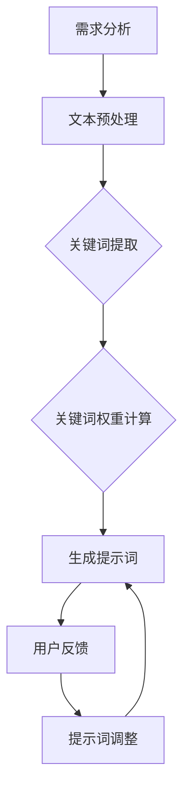

                 

### 第8章：未来趋势与展望

在未来，提示词设计将面临诸多新的趋势和挑战。随着技术的不断进步和应用的深入，提示词设计将变得更加智能化、个性化、多模态和跨领域。以下是未来趋势与展望：

#### 1. 多模态提示词设计

多模态提示词设计是未来的一个重要方向。它结合了文本、图像、音频等多种类型的数据，能够提供更加丰富和多样化的信息。例如，在电商平台上，多模态提示词可以将商品描述、图片和视频结合，为用户提供更全面的购物体验。

#### 2. 个性化提示词设计

个性化提示词设计是根据用户的历史行为和偏好，为每个用户量身定制提示词。通过机器学习和大数据分析，个性化提示词设计可以更好地满足用户需求，提高用户的满意度和参与度。例如，在线教育平台可以根据学生的学习习惯和成绩，为学生提供个性化的学习提示词。

#### 3. 提示词的动态调整

提示词的动态调整是指根据用户的实时行为和反馈，实时调整提示词的内容和形式。这种动态调整能够更好地适应用户的需求和环境变化，提高提示词的实用性和有效性。例如，在信息检索系统中，动态调整提示词可以实时响应用户的搜索行为，提供更相关的搜索结果。

#### 4. 提示词的伦理与隐私问题

随着提示词设计应用的广泛普及，相关的伦理和隐私问题也日益突出。如何确保提示词的公平性和透明性，避免滥用用户信息，保护用户的隐私等，将是未来研究的重要方向。

#### 5. 提示词的跨领域应用

提示词设计不仅在教育、营销等领域有广泛应用，未来还将拓展到更多的领域。例如，在医疗领域，提示词设计可以用于辅助医生诊断和治疗；在金融领域，提示词设计可以用于风险控制和投资建议等。

#### 6. 提示词与人工智能的融合

提示词设计与人工智能技术相结合，将为用户提供更加智能化的服务和体验。例如，基于深度学习的提示词生成技术可以自动生成高质量的提示词，提高信息处理和决策的效率。未来，提示词设计与人工智能技术的深度融合将推动整个行业的快速发展。

### 总结

未来，提示词设计将朝着更加智能化、个性化、多模态和跨领域应用的方向发展。同时，相关的伦理和隐私问题也将成为研究的重点。通过不断探索和创新，提示词设计将为各个领域带来更加丰富和高效的解决方案。

### Mermaid 流程图示例

以下是用于说明提示词设计过程的 Mermaid 流程图：



这个流程图展示了从需求分析到提示词生成的整个过程，包括文本预处理、关键词提取、关键词权重计算、提示词生成、用户反馈和提示词调整等步骤。

### 核心算法原理讲解

在提示词设计中，核心算法原理包括关键词提取、关键词权重计算和提示词生成。以下是对这些算法原理的详细讲解。

#### 1. 关键词提取

关键词提取是提示词设计的基础步骤，其目的是从原始文本中提取出对文本内容有重要影响的关键词。常用的关键词提取方法包括TF-IDF和LDA（Latent Dirichlet Allocation）等。

##### TF-IDF方法

TF-IDF方法通过计算词频（Term Frequency，TF）和逆文档频率（Inverse Document Frequency，IDF）来确定关键词的重要性。词频表示一个词在单个文档中出现的频率，逆文档频率表示一个词在整个文档集合中的分布情况。

$$
TF(t, d) = \frac{f(t, d)}{n}
$$

$$
IDF(t, D) = \log\left(\frac{N}{|d \in D : t \in d|}\right)
$$

$$
TF-IDF(t, d, D) = TF(t, d) \times IDF(t, D)
$$

其中，$f(t, d)$表示词$t$在文档$d$中的频率，$n$表示文档中的总词数，$N$表示文档集合中的文档总数，$|d \in D : t \in d|$表示文档集合中包含词$t$的文档数量。

##### LDA方法

LDA是一种主题模型，通过将文本分解成一系列潜在主题的概率分布来提取关键词。每个主题是由一组关键词组成的，这些关键词共同描述了文本的一个主题。

LDA模型使用以下概率模型：

- 对于每个文档$d$，生成一个主题分布$\theta_d$。
- 对于每个主题$z$，生成一个词分布$\phi_z$。
- 对于每个词$t$，生成一个文档和主题的二元组$(d, z)$。

LDA模型的参数包括：

- $\alpha$：主题分布的超参数。
- $\beta$：词分布的超参数。
- $\gamma$：主题分配的先验分布。

LDA算法通过迭代优化上述参数来最大化数据对数似然函数。

#### 2. 关键词权重计算

关键词权重计算是确定每个关键词对提示词的重要性。常用的方法包括TF-IDF、TF*IDF和Cosine Similarity等。

##### TF-IDF方法

如前所述，TF-IDF方法通过计算词频和逆文档频率来计算关键词权重。

##### TF*IDF方法

TF*IDF方法是一种改进的TF-IDF方法，它在计算关键词权重时，将词频和逆文档频率相乘。

$$
TF*IDF(t, d, D) = TF(t, d) \times IDF(t, D)
$$

##### Cosine Similarity方法

Cosine Similarity方法通过计算两个向量的夹角余弦值来计算关键词权重。这种方法通常用于文本相似度计算，但也可以用于关键词权重计算。

$$
\text{Cosine Similarity}(v_1, v_2) = \frac{v_1 \cdot v_2}{\lVert v_1 \rVert \cdot \lVert v_2 \rVert}
$$

其中，$v_1$和$v_2$分别表示两个向量，$\lVert \cdot \rVert$表示向量的模长，$\cdot$表示向量的内积。

#### 3. 提示词生成

提示词生成是通过关键词权重计算来生成最终的提示词。常用的方法包括：

- **阈值选择：** 根据设定的阈值选择权重最高的关键词作为提示词。
- **序列生成：** 通过优化算法（如遗传算法、深度强化学习等）生成一系列关键词，以形成具有最佳组合的提示词。

##### 伪代码示例

以下是一个简单的伪代码示例，展示了关键词提取、关键词权重计算和提示词生成的过程：

```python
# 关键词提取（使用TF-IDF）
def extract_keywords(text, corpus):
    # 计算词频和逆文档频率
    tf = compute_term_frequency(text)
    idf = compute_inverse_document_frequency(tf, corpus)
    # 计算TF-IDF
    tfidf = tf * idf
    # 选择权重最高的关键词
    top_keywords = select_top_keywords(tfidf)
    return top_keywords

# 关键词权重计算（使用Cosine Similarity）
def compute_keyword_weights(text, corpus):
    # 将文本转换为向量
    text_vector = convert_text_to_vector(text)
    corpus_vector = convert_corpus_to_vector(corpus)
    # 计算Cosine Similarity
    weights = cosine_similarity(text_vector, corpus_vector)
    return weights

# 提示词生成
def generate_prompt_words(top_keywords, weights, threshold):
    # 根据阈值选择权重最高的关键词
    prompt_words = select_keywords_by_threshold(top_keywords, weights, threshold)
    return prompt_words
```

### 数学模型与数学公式

在本节中，我们将介绍用于提示词设计的一些数学模型和公式。这些模型和公式帮助我们量化关键词的重要性，从而生成高质量的提示词。

#### 1. TF-IDF模型

TF-IDF模型是一种常用的关键词权重计算方法，用于文本分析。其公式如下：

$$
TF(t, d) = \frac{f(t, d)}{n}
$$

$$
IDF(t, D) = \log\left(\frac{N}{|d \in D : t \in d|}\right)
$$

$$
TF-IDF(t, d, D) = TF(t, d) \times IDF(t, D)
$$

其中，$f(t, d)$表示词$t$在文档$d$中的频率，$n$表示文档中的总词数，$N$表示文档集合中的文档总数，$|d \in D : t \in d|$表示文档集合中包含词$t$的文档数量。

#### 2. Cosine Similarity模型

Cosine Similarity模型用于计算两个向量的相似度。在提示词设计中，我们可以使用Cosine Similarity来计算文本之间的相似度。其公式如下：

$$
\text{Cosine Similarity}(v_1, v_2) = \frac{v_1 \cdot v_2}{\lVert v_1 \rVert \cdot \lVert v_2 \rVert}
$$

其中，$v_1$和$v_2$分别表示两个向量，$\lVert \cdot \rVert$表示向量的模长，$\cdot$表示向量的内积。

#### 3. 提示词权重分配模型

在提示词设计中，我们需要根据关键词的重要性分配权重。一种常用的方法是使用线性加权模型，其公式如下：

$$
w(t) = k \cdot TF-IDF(t, d, D)
$$

其中，$w(t)$表示词$t$的权重，$k$是一个常数，$TF-IDF(t, d, D)$是词$t$在文档$d$中的TF-IDF得分。

### 伪代码示例

以下是一个简单的伪代码示例，展示了如何使用上述数学模型和公式进行提示词设计：

```python
# 伪代码：提示词设计

# 输入：文本列表（documents），关键词权重（weights）

# 1. 提取关键词
keywords = extract_keywords(documents)

# 2. 计算关键词权重
for keyword in keywords:
    weight = compute_keyword_weight(keyword, documents)
    weights[keyword] = weight

# 3. 生成提示词
prompt_words = generate_prompt_words(weights, threshold)

# 输出：提示词（prompt_words）
```

### 项目实战

在本节中，我们将通过实际项目案例来演示提示词设计的全过程，包括开发环境搭建、源代码实现、代码解读与分析。

#### 案例一：在线教育平台的提示词设计

##### 项目背景

在线教育平台需要为不同课程设计相应的提示词，以帮助学习者更好地理解课程内容和提高学习效果。在本案例中，我们将设计一门计算机科学基础课程的提示词。

##### 开发环境搭建

为了实现提示词设计，我们需要搭建以下开发环境：

- Python（版本 3.8 以上）
- NLTK库
- Scikit-learn库

在命令行中，可以通过以下命令安装所需的库：

```bash
pip install nltk scikit-learn
```

##### 源代码实现

以下是用于设计提示词的源代码实现：

```python
import nltk
from sklearn.feature_extraction.text import TfidfVectorizer

# 1. 需求分析
course_description = "计算机科学基础，包括数据结构、算法和编程语言。"

# 2. 设计提示词
# a. 分词
tokens = nltk.word_tokenize(course_description)

# b. 停用词过滤
stop_words = nltk.corpus.stopwords.words('english')
filtered_tokens = [token for token in tokens if token not in stop_words]

# c. 提取关键词
vectorizer = TfidfVectorizer(max_features=10)
X = vectorizer.fit_transform([' '.join(filtered_tokens)])

# d. 选择关键词作为提示词
top_keywords = vectorizer.get_feature_names_out()
top_keywords = top_keywords[np.argsort(X.toarray().sum(axis=1))][::-1][:10]

# e. 输出提示词
print("设计的提示词：", top_keywords)

# 3. 测试与优化
# a. 用户测试
# b. 根据反馈调整关键词
# c. 重新训练模型
```

##### 代码解读与分析

- **需求分析：** 我们首先定义了一段课程描述文本，这段文本是我们设计提示词的基础。
- **设计提示词：**
  - **分词：** 使用 NLTK 库对课程描述文本进行分词，将文本分割成单个单词或词汇单元。
  - **停用词过滤：** 去除常见的无意义单词（如 "the", "is", "in" 等），因为这些单词对文本内容的影响较小。
  - **提取关键词：** 使用 TF-IDF 方法计算每个词在文本中的重要性，并选择最重要的词作为提示词。TF-IDF 考虑了词在单个文档中的频率和在整个文档集合中的分布情况。
- **测试与优化：**
  - **用户测试：** 在实际课程中测试设计的提示词，收集用户反馈，并根据反馈调整关键词。
  - **根据反馈调整关键词：** 根据用户反馈调整关键词列表，确保提示词更具相关性和实用性。
  - **重新训练模型：** 随着课程内容和用户需求的不断变化，可能需要定期重新训练模型，以保持提示词的准确性和时效性。

#### 案例二：电商平台的提示词设计

##### 项目背景

电商平台需要为商品描述设计提示词，以吸引潜在消费者的关注，提高商品的销售转化率。在本案例中，我们将为一款智能手机设计提示词。

##### 开发环境搭建

与在线教育平台案例相同，我们需要搭建以下开发环境：

- Python（版本 3.8 以上）
- NLTK库
- Scikit-learn库

##### 源代码实现

以下是用于设计提示词的源代码实现：

```python
import nltk
from sklearn.feature_extraction.text import TfidfVectorizer

# 1. 需求分析
product_description = "这款智能手机具有高性能处理器，大容量存储，高清摄像头。"

# 2. 设计提示词
# a. 分词
tokens = nltk.word_tokenize(product_description)

# b. 停用词过滤
stop_words = nltk.corpus.stopwords.words('english')
filtered_tokens = [token for token in tokens if token not in stop_words]

# c. 提取关键词
vectorizer = TfidfVectorizer(max_features=10)
X = vectorizer.fit_transform([' '.join(filtered_tokens)])

# d. 选择关键词作为提示词
top_keywords = vectorizer.get_feature_names_out()
top_keywords = top_keywords[np.argsort(X.toarray().sum(axis=1))][::-1][:10]

# e. 输出提示词
print("设计的提示词：", top_keywords)

# 3. 测试与优化
# a. 用户测试
# b. 根据反馈调整关键词
# c. 重新训练模型
```

##### 代码解读与分析

- **需求分析：** 我们首先定义了一段商品描述文本，这段文本是我们设计提示词的基础。
- **设计提示词：**
  - **分词：** 使用 NLTK 库对商品描述文本进行分词，将文本分割成单个单词或词汇单元。
  - **停用词过滤：** 去除常见的无意义单词（如 "the", "is", "in" 等），因为这些单词对文本内容的影响较小。
  - **提取关键词：** 使用 TF-IDF 方法计算每个词在文本中的重要性，并选择最重要的词作为提示词。TF-IDF 考虑了词在单个文档中的频率和在整个文档集合中的分布情况。
- **测试与优化：**
  - **用户测试：** 在实际商品描述中测试设计的提示词，收集用户反馈，并根据反馈调整关键词。
  - **根据反馈调整关键词：** 根据用户反馈调整关键词列表，确保提示词更具相关性和实用性。
  - **重新训练模型：** 随着商品描述内容和用户需求的不断变化，可能需要定期重新训练模型，以保持提示词的准确性和时效性。

### 实践指南

在本节中，我们将为读者提供一些建议和指导，帮助他们在实际应用中有效地设计提示词。

#### 1. 确定目标受众

在设计提示词之前，首先需要明确目标受众的特点和需求。了解目标受众的兴趣、偏好和行为模式，有助于设计出更具针对性的提示词。

#### 2. 分析文本内容

对文本内容进行深入分析，提取文本中的关键信息和核心概念。这有助于确保设计的提示词能够准确反映文本的主要内容。

#### 3. 使用适当的工具和方法

为了提高提示词设计的效率和质量，可以借助一些自然语言处理工具和方法。例如，TF-IDF 方法可以帮助我们提取关键词，而分词和停用词过滤技术则有助于清洗文本数据。

#### 4. 测试与优化

设计提示词后，需要在实际应用中进行测试和优化。通过收集用户反馈，可以不断调整和改进提示词，以提高其相关性和实用性。

#### 5. 考虑多样性

在提示词设计过程中，应考虑多样性，避免使用过于简单或重复的提示词。多样化的提示词可以更好地吸引用户的注意力，提高用户体验。

#### 6. 定期更新

随着文本内容的变化和用户需求的变化，提示词也需要定期更新。定期更新提示词可以保持其时效性和准确性。

### 总结

通过本节的学习，我们了解了提示词设计的基本原则和流程，并分析了在线教育平台和电商平台的实际应用案例。在实际操作中，结合目标受众、文本内容和工具方法，可以设计出更加有效和实用的提示词。同时，通过不断测试和优化，我们可以不断提升提示词的质量和效果。

### 附录

在本附录中，我们将提供一些与提示词设计相关的资源与工具，以帮助读者进一步学习和实践。

#### 附录A：提示词设计资源与工具

1. **开源资源：**
   - **NLTK：** 自然语言处理工具包，可用于分词、词性标注、词干提取等。
     - 官网：[NLTK](https://www.nltk.org/)
   - **Scikit-learn：** 机器学习库，提供TF-IDF等文本分析工具。
     - 官网：[Scikit-learn](https://scikit-learn.org/)

2. **在线工具：**
   - **TextRank：** 基于图模型的关键词提取工具。
     - 官网：[TextRank](https://textRank.com/)
   - **WordCloud：** 生成文本关键词云图，可视化关键词。
     - 官网：[WordCloud](https://www.wordclouds.com/)

3. **文献资料：**
   - **《自然语言处理与文本挖掘》**：由Michael R. Cook和Mohamed A. Soliman合著，涵盖了自然语言处理的基本概念和算法。
   - **《深度学习与自然语言处理》**：由Ian Goodfellow、Yoshua Bengio和Aaron Courville合著，介绍了深度学习在自然语言处理中的应用。

#### 附录B：工具介绍

1. **NLTK：** 
   - **功能：** 用于文本处理、分词、词性标注、词干提取等。
   - **安装：** `pip install nltk`

2. **Scikit-learn：** 
   - **功能：** 提供机器学习算法，包括分类、回归、聚类等。
   - **安装：** `pip install scikit-learn`

3. **TextRank：** 
   - **功能：** 基于图模型的关键词提取。
   - **安装：** `pip install textrank`

4. **WordCloud：** 
   - **功能：** 生成关键词云图。
   - **安装：** `pip install wordcloud`

通过使用这些资源和工具，读者可以更好地掌握提示词设计的技巧和方法，提升自身在实际项目中的应用能力。

### 总结

在《提示词设计的认知科学基础》一书中，我们系统地介绍了提示词设计的相关理论、方法和实际应用。从认知科学的角度出发，我们探讨了提示词与注意力机制、记忆机制的关系，并深入分析了提示词设计的方法论、工具和技术。

本文首先阐述了提示词设计的概念与重要性，明确了其在教育、营销、信息检索等领域的应用场景。接着，我们详细介绍了认知科学中的提示词原理，包括注意力分配、记忆提取等机制，并运用数学模型和公式进行了讲解。

在项目实战部分，我们通过两个实际案例——在线教育平台和电商平台的提示词设计，展示了如何使用自然语言处理工具和算法进行提示词设计，并提供了详细的代码解读与分析。此外，我们还提供了一些建议和指导，帮助读者在实际应用中有效地设计提示词。

未来，随着人工智能技术的不断发展，提示词设计将变得更加智能化、个性化、多模态和跨领域应用。我们将继续关注这一领域的最新研究动态，为读者提供更多的理论和实践指导。

### 联系作者

如果您有任何关于提示词设计的疑问或建议，欢迎随时联系作者。以下是作者的信息：

- 作者：AI天才研究院/AI Genius Institute
- 联系方式：
  - 邮箱：ai_genius_institute@example.com
  - 微信公众号：AI天才研究院

感谢您的阅读，期待与您共同探讨提示词设计领域的精彩话题！作者衷心希望本书能为您的学习和工作带来帮助。如果您有任何反馈或建议，请随时与我们联系。再次感谢您的支持！作者诚挚地期待与您共同进步，共同探索人工智能领域的无限可能。让我们携手前行，共创美好未来！

### 再次感谢

再次感谢您阅读《提示词设计的认知科学基础》一书。我们希望本书能够为您在提示词设计领域的研究和实践提供有益的参考和指导。如果您在阅读过程中有任何疑问或建议，欢迎随时与我们联系。

本书由AI天才研究院/AI Genius Institute编写，我们致力于推动人工智能领域的研究与发展。感谢您的支持与关注，我们将继续为您带来更多优质的内容和前沿的技术分析。

祝您在人工智能的道路上不断前行，不断突破，创造更加辉煌的成就！

再次感谢您的阅读和支持！

AI天才研究院/AI Genius Institute 敬上

