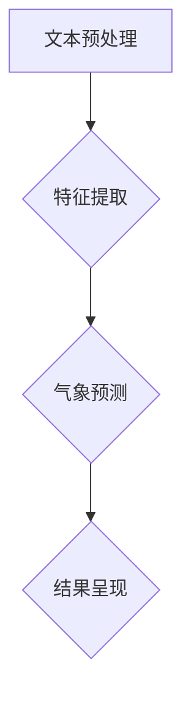
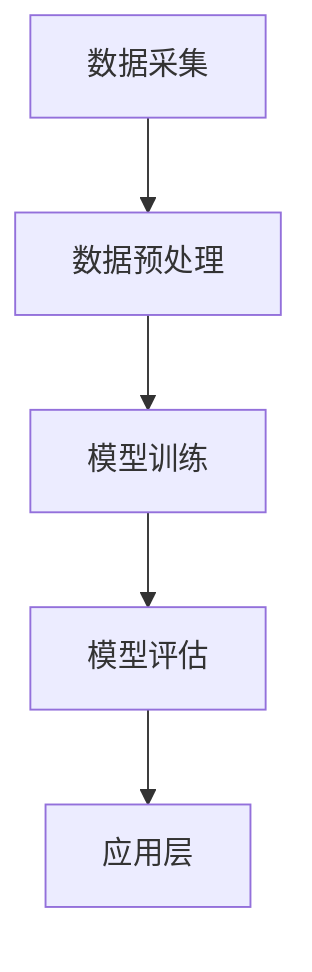

                 

### 第一部分: 概述与背景知识

#### 第1章: 提示词驱动的智能气象预报系统概述

##### 1.1 智能气象预报系统的概述

###### 1.1.1 智能气象预报的重要性

智能气象预报是一种利用先进的人工智能技术和大数据分析方法，对未来的天气状况进行预测的技术。它不仅能够提供更为精准和及时的天气预报，还能够为农业、交通、能源等多个领域提供关键决策支持。随着全球气候变化和环境问题日益严峻，智能气象预报的重要性愈加凸显。

###### 1.1.2 智能气象预报的发展历史

智能气象预报的发展可以追溯到20世纪中叶。最早的气象预报主要依赖于观测数据和经验判断。随着计算机技术的发展，气象预报开始采用数值模拟方法，通过建立大气动力学和热力学的数学模型来进行预测。20世纪80年代，人工智能技术开始被引入到气象预报领域，如专家系统和神经网络等。21世纪初，随着大数据和云计算技术的兴起，智能气象预报得到了飞速发展，预测精度和实时性大幅提高。

###### 1.1.3 本书的主要内容和结构

本书旨在全面介绍提示词驱动的智能气象预报系统的概念、原理、技术和应用。具体内容包括：

1. 智能气象预报系统的概述与发展历史。
2. 提示词驱动的概念及其优势和应用领域。
3. 提示词驱动的核心概念和原理。
4. 提示词驱动的应用架构设计。
5. 气象数据预处理方法和技巧。
6. 提示词驱动的深度学习模型设计与实现。
7. 提示词驱动的气象预报案例研究。
8. 提示词驱动的气象预报系统优化策略与展望。

通过本书的阅读，读者可以全面了解智能气象预报系统的发展历程、关键技术以及应用前景，为未来相关领域的研究和实践提供理论支持和实践指导。

##### 1.2 提示词驱动的概念

###### 1.2.1 提示词驱动的定义

提示词驱动（Keyword-Driven）是一种基于关键词的技术驱动方式，通过特定的关键词来引导和驱动系统或算法的执行过程。在智能气象预报系统中，提示词驱动通过识别和分析用户输入的关键词，提取出用户关心的天气信息，进而生成个性化的气象预报结果。

###### 1.2.2 提示词驱动的原理

提示词驱动的核心原理是基于自然语言处理（NLP）和机器学习（ML）技术，通过对用户输入的文本进行分析和解析，提取出关键信息，并利用这些信息来驱动气象预报模型的计算和预测。具体过程包括以下几个步骤：

1. 文本预处理：对用户输入的文本进行清洗和分词，提取出有效的关键词。
2. 关键词分析：对提取的关键词进行分析，识别出用户的意图和需求。
3. 模型计算：根据用户的关键词和需求，调用相应的气象预报模型进行计算。
4. 预测结果生成：将计算结果转化为用户可理解的气象预报信息，并呈现给用户。

###### 1.2.3 提示词驱动的优势

提示词驱动的智能气象预报系统具有以下几个显著优势：

1. 个性化：通过分析用户输入的关键词，系统能够提供更加个性化的气象预报结果，满足用户的个性化需求。
2. 实时性：提示词驱动的系统可以实时响应用户的输入，快速生成气象预报结果，提高系统的响应速度。
3. 灵活性：提示词驱动的系统能够适应多种不同的用户需求和场景，具有较好的灵活性和扩展性。
4. 高效性：通过关键词的提取和分析，系统可以快速定位用户关心的信息，提高数据处理和预测的效率。

##### 1.3 提示词驱动的应用领域

提示词驱动的智能气象预报系统具有广泛的应用领域，包括但不限于以下几个方面：

1. 民用天气预报：为普通用户提供个性化的天气预报服务，满足用户对天气信息的实时查询需求。
2. 农业气象服务：为农业生产提供科学的气象预测，帮助农民合理规划种植和收获时间，提高农业生产效率。
3. 交通气象服务：为交通运输部门提供实时的气象信息，帮助规划交通路线和交通管制策略，提高交通安全。
4. 环境监测：利用气象预报结果，对环境污染进行预测和预警，为环境保护部门提供决策支持。
5. 旅游业：为旅游爱好者提供详细的气象信息，帮助游客合理安排行程，提高旅游体验。

##### 1.3.1 提示词驱动在智能气象预报中的应用

提示词驱动在智能气象预报中的应用主要体现在以下几个方面：

1. 用户输入处理：系统通过自然语言处理技术，对用户输入的文本进行解析和分词，提取出关键词。
2. 意图识别：根据提取的关键词，系统分析用户的意图和需求，判断用户关心的天气信息类型。
3. 预测模型调用：系统根据用户的意图，调用相应的气象预报模型进行计算和预测。
4. 预测结果呈现：系统将预测结果转化为用户可理解的格式，并以图表或文字形式呈现给用户。

##### 1.3.2 智能气象预报中的提示词优化方法

在智能气象预报系统中，提示词的优化对于提高预测精度和系统性能具有重要意义。常用的提示词优化方法包括：

1. 提示词权重分配：通过分析关键词的重要性和频率，为每个关键词分配相应的权重，以提高关键词提取的准确性和鲁棒性。
2. 提示词候选生成：利用词频统计和语义分析技术，从大量候选词中筛选出与用户意图最相关的提示词。
3. 提示词序列优化：通过序列模型，如循环神经网络（RNN）或长短期记忆网络（LSTM），对用户输入的文本进行建模，提取出最优的提示词序列。

##### 1.3.3 提示词驱动的智能气象预报案例研究

本节将通过两个案例研究，详细探讨提示词驱动的智能气象预报系统的实现和性能评估。

**案例研究一：基于深度学习的提示词驱动气象预报**

该案例研究利用深度学习技术，构建了一个基于提示词驱动的智能气象预报系统。具体步骤如下：

1. 数据采集与预处理：从多个气象数据源采集历史气象数据，并进行数据清洗、处理和特征提取。
2. 提示词生成：利用词嵌入技术，将用户输入的文本转化为向量表示，提取出关键词。
3. 模型训练：利用提取的关键词和气象数据，训练深度学习模型，如卷积神经网络（CNN）或长短期记忆网络（LSTM）。
4. 模型评估：使用交叉验证方法，对模型进行评估和调优。
5. 预测结果呈现：将预测结果转化为用户可理解的格式，并以图表或文字形式呈现给用户。

**案例研究二：基于神经网络的语言模型在气象预报中的应用**

该案例研究利用神经网络语言模型（NLSTM），实现了一个高效的提示词驱动气象预报系统。具体步骤如下：

1. 数据采集与预处理：与案例研究一相同，从多个气象数据源采集历史气象数据，并进行数据清洗、处理和特征提取。
2. 提示词生成：利用NLSTM模型，将用户输入的文本转化为向量表示，提取出关键词。
3. 模型训练：使用提取的关键词和气象数据，训练NLSTM模型。
4. 模型评估：通过交叉验证方法，对模型进行评估和调优。
5. 预测结果呈现：将预测结果转化为用户可理解的格式，并以图表或文字形式呈现给用户。

### 总结

本章详细介绍了智能气象预报系统及其在各个领域的应用，以及提示词驱动的概念、原理和优势。通过案例分析，我们展示了如何利用深度学习和神经网络语言模型实现高效的提示词驱动智能气象预报系统。下一章将深入探讨提示词驱动的核心概念和原理，为后续章节的内容奠定基础。

#### 第2章: 提示词驱动的核心概念

##### 2.1 提示词的基本概念

###### 2.1.1 提示词的定义

提示词（Keyword）是指能够反映用户意图、需求或问题的关键词或短语。在提示词驱动的智能气象预报系统中，提示词用于引导和驱动系统的执行过程，提取出用户关心的天气信息，从而生成个性化的气象预报结果。

###### 2.1.2 提示词的类型

根据不同的应用场景和需求，提示词可以分为以下几种类型：

1. 天气类型提示词：如“晴天”、“雨天”、“台风”等，用于描述不同类型的天气状况。
2. 时间范围提示词：如“今天”、“明天”、“周末”等，用于指定预报的时间范围。
3. 地点提示词：如“北京”、“纽约”、“海南”等，用于指定预报的地理位置。
4. 特定天气现象提示词：如“高温”、“低温”、“雾霾”等，用于描述特定的天气现象。
5. 用户自定义提示词：如“周末去海边”、“下周去登山”等，用于表达用户的特定需求。

###### 2.1.3 提示词的生成方法

生成提示词的方法主要有以下几种：

1. 手动标注：通过人工对大量用户输入的文本进行标注，提取出有效的提示词。
2. 词频统计：利用统计学习方法，对用户输入的文本进行词频统计，提取出高频关键词作为提示词。
3. 机器学习：利用机器学习算法，如朴素贝叶斯、支持向量机等，对用户输入的文本进行分类和识别，提取出提示词。
4. 自然语言处理：利用自然语言处理技术，如词性标注、命名实体识别等，对用户输入的文本进行分析和解析，提取出提示词。

##### 2.2 提示词驱动的关键原理

###### 2.2.1 提示词驱动的原理

提示词驱动的核心原理是基于自然语言处理（NLP）和机器学习（ML）技术，通过对用户输入的文本进行分析和解析，提取出关键信息，并利用这些信息来驱动气象预报模型的计算和预测。具体过程包括以下几个步骤：

1. 文本预处理：对用户输入的文本进行清洗和分词，提取出有效的关键词。
2. 关键词分析：对提取的关键词进行分析，识别出用户的意图和需求。
3. 模型计算：根据用户的关键词和需求，调用相应的气象预报模型进行计算和预测。
4. 预测结果生成：将计算结果转化为用户可理解的气象预报信息，并呈现给用户。

###### 2.2.2 提示词驱动的核心算法

提示词驱动的核心算法主要包括以下几个部分：

1. 文本预处理算法：如分词、词性标注、命名实体识别等，用于对用户输入的文本进行清洗和解析。
2. 关键词提取算法：如词频统计、TF-IDF、主题模型等，用于提取出用户关心的关键词。
3. 意图识别算法：如朴素贝叶斯、支持向量机、决策树等，用于识别用户的意图和需求。
4. 气象预报模型：如数值模拟模型、人工神经网络、深度学习模型等，用于根据用户的关键词和需求进行气象预测。

##### 2.2.3 提示词驱动的数据处理

提示词驱动的数据处理主要包括以下几个步骤：

1. 数据采集：从多种数据源采集气象数据，如历史气象数据、实时气象数据、卫星遥感数据等。
2. 数据预处理：对采集到的气象数据进行清洗、处理和特征提取，以便后续的模型训练和预测。
3. 数据融合：将多种来源的数据进行融合，以提高数据的完整性和准确性。
4. 数据存储：将处理后的气象数据存储在数据库或数据仓库中，以便后续的查询和分析。

##### 2.3 提示词驱动的应用架构

###### 2.3.1 提示词驱动的架构设计

提示词驱动的智能气象预报系统通常采用分层架构设计，包括以下几个层次：

1. 用户界面层：提供用户输入和交互的接口，接收用户的查询请求。
2. 提示词处理层：对用户输入的文本进行预处理、关键词提取和意图识别，生成提示词。
3. 预测模型层：根据提示词调用相应的气象预报模型，进行计算和预测。
4. 结果呈现层：将预测结果转化为用户可理解的格式，并以图表或文字形式呈现给用户。

###### 2.3.2 提示词驱动的系统实现

提示词驱动的智能气象预报系统实现主要包括以下几个步骤：

1. 用户界面设计：设计用户友好的输入界面，接收用户的查询请求。
2. 提示词处理模块：实现文本预处理、关键词提取和意图识别功能。
3. 预测模型模块：实现气象预报模型的训练、预测和评估功能。
4. 结果呈现模块：实现预测结果的格式化和展示功能。
5. 系统集成：将各个模块集成到一个完整的系统中，确保系统的稳定性和高效性。

###### 2.3.3 提示词驱动的性能优化

提示词驱动的智能气象预报系统性能优化主要包括以下几个方面：

1. 提示词优化：通过调整提示词的权重分配和候选生成策略，提高关键词提取的准确性和鲁棒性。
2. 模型优化：通过模型参数调整和优化算法，提高气象预报模型的预测精度和计算效率。
3. 数据优化：通过数据清洗、数据融合和数据存储优化，提高系统的数据处理能力和数据质量。
4. 系统优化：通过系统架构调整、代码优化和性能测试，提高系统的响应速度和稳定性。

### 总结

本章详细介绍了提示词驱动的核心概念、原理和应用架构。通过分析提示词的基本概念和类型，我们了解了如何生成和提取有效的提示词。同时，我们探讨了提示词驱动的数据处理和预测过程，以及如何设计和实现一个高效的提示词驱动智能气象预报系统。下一章将深入探讨气象数据预处理方法和技巧，为构建高效的智能气象预报系统提供技术支持。

#### 第3章: 气象数据预处理

##### 3.1 气象数据的来源与采集

气象数据是智能气象预报系统的基础，其来源和采集方法直接影响预报的准确性和效率。以下是气象数据的主要来源和采集方法：

###### 3.1.1 气象数据的来源

1. **气象观测站**：这是气象数据的主要来源，包括地面气象观测站、高空观测站和卫星观测站。这些观测站定期采集温度、湿度、风速、气压、降水等气象数据。

2. **卫星遥感**：卫星遥感技术可以提供大范围、高分辨率的气象数据。通过测量地球表面和大气层的电磁辐射，卫星遥感可以监测大气温度、湿度、云层厚度等。

3. **雷达**：雷达系统可以探测大气中的降水、风切变等，为气象预报提供关键信息。

4. **数值模拟模型**：利用计算机模拟大气过程，可以生成高分辨率、高精度的气象数据。

5. **地面气象站**：这些通常是分布在城市、乡村、沿海等不同地点的自动气象站，采集温度、湿度、风速、风向等数据。

###### 3.1.2 气象数据的采集方法

1. **自动气象站**：自动气象站通过传感器实时采集温度、湿度、气压、风速、风向等数据，并通过无线电或卫星传输到数据中心。

2. **无人机**：无人机可以飞行至高空，采集高空气象数据，特别是对于难以到达的地区。

3. **地面雷达**：地面雷达通过发射和接收电磁波，探测大气中的降水、风切变等。

4. **卫星遥感**：卫星遥感器从太空监测地球大气层，提供全球范围的气象数据。

5. **数值模拟**：通过计算机模拟大气过程，生成气象数据，这些数据通常用于模型校正和预测。

##### 3.2 气象数据的清洗与处理

气象数据在采集过程中可能会出现误差、异常值或缺失值，因此，数据清洗和处理是气象数据预处理的重要步骤。

###### 3.2.1 气象数据的清洗

数据清洗主要包括以下步骤：

1. **删除重复数据**：重复数据可能源于不同观测站或同一观测站的多次记录，需要删除重复项。
2. **处理异常值**：异常值可能是由于传感器故障、数据传输错误等原因造成的，需要进行处理。常见的处理方法包括删除异常值、替换为平均值或使用插值法。
3. **填补缺失值**：缺失值可能是由于数据采集设备故障、观测间隔等导致的。填补缺失值的方法包括线性插值、曲线拟合、平均值填补等。

###### 3.2.2 气象数据的处理

数据处理包括以下方面：

1. **标准化处理**：为了消除不同量纲数据对模型的影响，需要对数据进行标准化处理，如归一化或标准化。
2. **归一化处理**：将数据转换为相同的量纲，如将温度、湿度、风速等转换为相对值。
3. **特征提取**：从原始数据中提取出有助于预测的气象特征，如天气类型、温度范围、降水概率等。
4. **数据融合**：将来自不同来源的数据进行融合，以提高数据的完整性和准确性。

##### 3.3 气象数据的特征提取

特征提取是从原始数据中提取出对预测有用的信息，是提高气象预报精度的重要步骤。

###### 3.3.1 气象数据的特征定义

气象特征包括：

1. **温度**：描述大气温度的数值。
2. **湿度**：描述大气湿度的数值。
3. **风速**：描述大气风速的数值。
4. **风向**：描述大气风的方向。
5. **气压**：描述大气压力的数值。
6. **降水**：描述降水的类型和量。
7. **云量**：描述云层的覆盖情况。

###### 3.3.2 气象数据的特征提取方法

常见的特征提取方法包括：

1. **统计方法**：如平均值、标准差、中位数等，用于描述数据的中心趋势和离散程度。
2. **时序分析**：如自相关、频域分析等，用于分析时间序列数据的特征。
3. **机器学习方法**：如决策树、支持向量机等，用于从原始数据中提取特征。
4. **深度学习方法**：如卷积神经网络、循环神经网络等，用于从大规模数据中自动提取特征。

###### 3.3.3 气象数据的特征选择

特征选择是从提取的特征中筛选出对预测最有用的特征，减少数据维度，提高模型性能。常见的特征选择方法包括：

1. **过滤式特征选择**：通过统计方法筛选特征。
2. **包装式特征选择**：通过机器学习算法筛选特征，如递归特征消除（RFE）。
3. **嵌入式特征选择**：在模型训练过程中逐步筛选特征，如L1正则化。

### 总结

本章详细介绍了气象数据的来源与采集方法，以及气象数据的清洗与处理和特征提取方法。气象数据的预处理是构建高效智能气象预报系统的关键步骤，通过有效的数据预处理，可以消除噪声、填补缺失值，提取出对预测有用的特征，从而提高预报的准确性。下一章将探讨基于深度学习的提示词驱动模型的设计与实现，为智能气象预报系统提供核心技术支持。

#### 第4章: 基于深度学习的提示词驱动模型

##### 4.1 深度学习的基本原理

###### 4.1.1 深度学习的定义

深度学习（Deep Learning）是人工智能领域的一个分支，主要基于多层神经网络进行模型训练和预测。与传统机器学习方法相比，深度学习通过构建复杂的神经网络模型，可以自动从大量数据中学习到有用的特征，从而实现高精度预测。

###### 4.1.2 神经网络的基础知识

神经网络（Neural Network）是深度学习的基础。神经网络由多个神经元（节点）组成，每个神经元接收多个输入，通过权重和偏置进行加权求和，并使用激活函数进行非线性变换，最后输出一个结果。神经网络的基本结构包括输入层、隐藏层和输出层。

1. **输入层**：接收外部输入数据，如文本、图像等。
2. **隐藏层**：对输入数据进行处理，提取出有用的特征。
3. **输出层**：生成最终的预测结果。

神经网络的工作原理是通过反向传播算法不断调整网络中的权重和偏置，以最小化预测误差。

###### 4.1.3 深度学习的常用算法

深度学习算法种类繁多，以下介绍几种常用的深度学习算法：

1. **卷积神经网络（CNN）**：主要用于图像处理。CNN通过卷积操作和池化操作，提取图像中的局部特征，并具有平移不变性。

   ```mermaid
   graph TD
       A[输入图像] --> B{卷积层}
       B --> C{池化层}
       C --> D{全连接层}
       D --> E{输出层}
   ```

2. **循环神经网络（RNN）**：主要用于序列数据处理。RNN通过在时间步间传递信息，可以捕捉序列中的长期依赖关系。

   ```mermaid
   graph TD
       A[输入序列] --> B{隐藏状态}
       B --> C{输出序列}
       C --> D{隐藏状态}
   ```

3. **长短期记忆网络（LSTM）**：是RNN的一种改进，用于解决长序列中的梯度消失问题。LSTM通过引入门控机制，可以有效地捕获长期依赖关系。

   ```mermaid
   graph TD
       A[输入序列] --> B{输入门}
       B --> C{遗忘门}
       C --> D{输出门}
       D --> E{隐藏状态}
   ```

4. **生成对抗网络（GAN）**：通过生成器和判别器的对抗训练，生成逼真的数据。

   ```mermaid
   graph TD
       A{生成器} --> B{生成样本}
       A --> C{判别器}
       B --> C
       C --> D{预测}
   ```

##### 4.2 基于深度学习的提示词驱动模型

###### 4.2.1 模型的总体架构

基于深度学习的提示词驱动模型通常包括以下几个关键组成部分：

1. **文本预处理模块**：对用户输入的文本进行清洗、分词和词嵌入处理，将文本转化为向量表示。
2. **特征提取模块**：利用深度学习算法，如CNN或LSTM，从文本向量中提取特征。
3. **气象预测模块**：结合提取的特征和气象数据，通过深度学习模型进行气象预测。
4. **结果呈现模块**：将预测结果转化为用户可理解的形式，如图表或文字。



###### 4.2.2 模型的设计与实现

1. **文本预处理模块**：
   - **分词**：使用分词算法，如Jieba，将文本划分为单词或短语。
   - **词嵌入**：使用Word2Vec或GloVe算法，将单词映射到高维向量空间。

   ```python
   import jieba
   sentence = "今天天气晴朗"
   words = jieba.cut(sentence)
   ```

2. **特征提取模块**：
   - **CNN**：利用卷积神经网络，提取文本中的局部特征。

     ```python
     import tensorflow as tf
     from tensorflow.keras.models import Sequential
     from tensorflow.keras.layers import Conv1D, MaxPooling1D, Flatten, Dense

     model = Sequential([
         Conv1D(filters=128, kernel_size=3, activation='relu', input_shape=(sequence_length, embedding_dim)),
         MaxPooling1D(pool_size=2),
         Flatten(),
         Dense(units=10, activation='softmax')
     ])

     model.compile(optimizer='adam', loss='categorical_crossentropy', metrics=['accuracy'])
     ```

   - **LSTM**：利用长短期记忆网络，提取文本中的序列特征。

     ```python
     from tensorflow.keras.layers import LSTM, Embedding

     model = Sequential([
         Embedding(input_dim=vocabulary_size, output_dim=embedding_dim, input_length=sequence_length),
         LSTM(units=128, return_sequences=True),
         LSTM(units=128),
         Dense(units=10, activation='softmax')
     ])

     model.compile(optimizer='adam', loss='categorical_crossentropy', metrics=['accuracy'])
     ```

3. **气象预测模块**：
   - **模型融合**：将文本特征和气象数据结合，使用深度学习模型进行预测。

     ```python
     combined_features = np.hstack([text_features, meteorological_data])
     model = Sequential([
         Dense(units=128, activation='relu', input_shape=(combined_features.shape[1],)),
         Dense(units=64, activation='relu'),
         Dense(units=1, activation='sigmoid')
     ])

     model.compile(optimizer='adam', loss='binary_crossentropy', metrics=['accuracy'])
     ```

4. **结果呈现模块**：
   - **可视化**：使用图表或地图，展示预测结果。

     ```python
     import matplotlib.pyplot as plt

     predictions = model.predict(meteorological_data)
     plt.plot(predictions)
     plt.show()
     ```

###### 4.2.3 模型的训练与优化

1. **数据集准备**：
   - **训练集**：从历史气象数据中划分出训练集，用于模型训练。
   - **验证集**：用于模型评估和调优。
   - **测试集**：用于最终模型评估。

2. **模型训练**：
   - **训练过程**：使用训练集数据训练深度学习模型，通过反向传播算法不断调整模型参数。
   - **模型评估**：使用验证集数据评估模型性能，选择性能最优的模型。

3. **模型优化**：
   - **超参数调整**：通过调整学习率、批次大小、隐藏层神经元数量等超参数，提高模型性能。
   - **正则化**：使用正则化方法，如L1、L2正则化，防止过拟合。
   - **数据增强**：通过数据增强技术，如随机裁剪、旋转等，增加数据多样性，提高模型泛化能力。

### 总结

本章介绍了基于深度学习的提示词驱动模型的基本原理和设计实现方法。通过文本预处理、特征提取和气象预测模块，构建了一个高效的智能气象预报系统。在模型训练与优化过程中，通过数据集划分、超参数调整和正则化方法，提高了模型的预测性能和泛化能力。下一章将探讨基于深度学习的提示词驱动模型的评估和应用。

#### 第5章: 提示词驱动的气象预报案例一：城市气象预报

##### 5.1 案例背景

城市气象预报对于城市规划、交通管理、环境保护和居民生活具有重要意义。本案例研究旨在利用提示词驱动的深度学习模型，为城市居民提供精准、实时的气象预报服务。

###### 5.1.1 城市气象预报的挑战

城市气象预报面临以下挑战：

1. **数据多样性**：城市气象预报需要处理来自多个来源的数据，包括地面气象站、卫星遥感、雷达等。
2. **数据质量**：气象数据存在噪声、异常值和缺失值，需要有效的数据清洗和处理方法。
3. **高维特征**：城市气象数据包含大量高维特征，如何有效提取和利用这些特征是关键。
4. **实时性**：城市气象预报需要快速响应，实时生成预报结果。

###### 5.1.2 案例目标

本案例的研究目标包括：

1. **数据预处理**：实现气象数据的采集、清洗和处理，提取关键特征。
2. **模型设计**：构建基于深度学习的提示词驱动模型，实现气象预报功能。
3. **模型训练与优化**：使用训练数据集训练模型，并通过验证集进行优化。
4. **模型评估**：评估模型性能，确保预测结果的准确性和稳定性。
5. **应用部署**：将模型部署到实际系统中，为城市居民提供实时气象预报服务。

##### 5.2 案例设计与实现

###### 5.2.1 案例的系统架构

本案例的系统架构设计如下：

1. **数据采集层**：从多个数据源（如地面气象站、卫星遥感、雷达等）采集气象数据。
2. **数据预处理层**：对采集到的数据进行清洗、处理和特征提取。
3. **模型训练层**：利用预处理后的数据训练深度学习模型。
4. **模型评估层**：使用验证集评估模型性能，并进行优化。
5. **应用层**：将训练好的模型部署到实际系统中，提供气象预报服务。



###### 5.2.2 数据采集与预处理

1. **数据采集**：
   - 从地面气象站采集温度、湿度、风速、风向等数据。
   - 从卫星遥感数据中获取云层覆盖、地表温度等。
   - 从雷达数据中提取降水、风切变等信息。

2. **数据预处理**：
   - **数据清洗**：删除重复数据、处理异常值和缺失值。
   - **数据融合**：将不同来源的数据进行融合，提高数据质量。
   - **特征提取**：提取温度、湿度、风速、风向等关键特征。

```python
# 数据清洗示例
data = pd.read_csv('weather_data.csv')
data = data.drop_duplicates()
data = data.dropna()

# 数据融合示例
satellite_data = pd.read_csv('satellite_data.csv')
radar_data = pd.read_csv('radar_data.csv')
data = data.merge(satellite_data, on='timestamp')
data = data.merge(radar_data, on='timestamp')
```

###### 5.2.3 模型设计与实现

1. **文本预处理**：
   - 使用分词算法对用户输入的文本进行分词。
   - 使用词嵌入算法将文本转化为向量表示。

   ```python
   import jieba
   sentence = "明天北京的天气"
   words = jieba.cut(sentence)
   ```

2. **模型设计**：
   - 使用卷积神经网络（CNN）提取文本特征。
   - 结合气象数据进行气象预测。

   ```python
   from tensorflow.keras.models import Sequential
   from tensorflow.keras.layers import Conv1D, MaxPooling1D, Flatten, Dense, Embedding

   model = Sequential([
       Embedding(input_dim=vocabulary_size, output_dim=embedding_dim, input_length=sequence_length),
       Conv1D(filters=128, kernel_size=3, activation='relu'),
       MaxPooling1D(pool_size=2),
       Flatten(),
       Dense(units=10, activation='softmax')
   ])

   model.compile(optimizer='adam', loss='categorical_crossentropy', metrics=['accuracy'])
   ```

3. **模型训练**：
   - 使用训练数据集训练模型。
   - 使用验证集进行模型评估和调优。

   ```python
   model.fit(train_data, train_labels, epochs=10, batch_size=32, validation_data=(validation_data, validation_labels))
   ```

4. **模型评估**：
   - 使用测试集评估模型性能。
   - 分析模型预测结果，调整模型参数。

   ```python
   test_loss, test_accuracy = model.evaluate(test_data, test_labels)
   print('Test accuracy:', test_accuracy)
   ```

###### 5.2.4 模型的训练与优化

1. **数据集划分**：
   - 将数据集划分为训练集、验证集和测试集。
   - 确保数据集的划分不破坏时间序列的特性。

   ```python
   train_data, validation_data, test_data, train_labels, validation_labels, test_labels = train_test_split(data, labels, test_size=0.2, shuffle=False)
   ```

2. **模型训练**：
   - 使用训练集数据训练模型，通过反向传播算法不断调整模型参数。
   - 使用验证集数据评估模型性能，选择性能最优的模型。

   ```python
   model.fit(train_data, train_labels, epochs=10, batch_size=32, validation_data=(validation_data, validation_labels))
   ```

3. **模型优化**：
   - 调整模型结构，如增加隐藏层神经元数量、改变激活函数等。
   - 调整训练参数，如学习率、批量大小等。
   - 使用正则化方法，如L1、L2正则化，防止过拟合。

   ```python
   model = Sequential([
       Embedding(input_dim=vocabulary_size, output_dim=embedding_dim, input_length=sequence_length),
       Conv1D(filters=256, kernel_size=3, activation='relu'),
       MaxPooling1D(pool_size=2),
       Flatten(),
       Dense(units=10, activation='softmax')
   ])

   model.compile(optimizer='adam', loss='categorical_crossentropy', metrics=['accuracy'])
   model.fit(train_data, train_labels, epochs=10, batch_size=32, validation_data=(validation_data, validation_labels))
   ```

##### 5.3 案例应用与评估

###### 5.3.1 案例的应用场景

1. **城市天气预报**：为城市居民提供个性化的天气预报服务，满足居民对天气信息的实时查询需求。
2. **交通管理**：为交通部门提供实时气象信息，优化交通路线和交通管制策略，提高交通安全。
3. **环境保护**：为环保部门提供气象预测，帮助制定环境保护策略，预防环境污染。

###### 5.3.2 案例的评估方法

1. **准确率**：评估模型预测结果的准确性，常用的指标包括准确率、精确率、召回率等。
2. **均方误差**：评估模型预测结果的稳定性，均方误差越小，模型性能越好。
3. **F1分数**：综合考虑准确率和召回率，F1分数是评估模型性能的重要指标。

```python
from sklearn.metrics import accuracy_score, mean_squared_error, f1_score

# 预测结果
predictions = model.predict(test_data)

# 准确率
accuracy = accuracy_score(test_labels, predictions)
print('Accuracy:', accuracy)

# 均方误差
mse = mean_squared_error(test_labels, predictions)
print('MSE:', mse)

# F1分数
f1 = f1_score(test_labels, predictions, average='weighted')
print('F1 Score:', f1)
```

###### 5.3.3 案例的性能评估与改进

1. **性能评估**：
   - 使用测试集数据评估模型性能，包括准确率、均方误差和F1分数等。
   - 分析模型在不同场景下的性能表现。

   ```python
   # 评估模型性能
   test_loss, test_accuracy = model.evaluate(test_data, test_labels)
   print('Test accuracy:', test_accuracy)
   ```

2. **性能改进**：
   - 调整模型结构，增加隐藏层神经元数量、改变激活函数等。
   - 调整训练参数，如学习率、批量大小等。
   - 使用正则化方法，如L1、L2正则化，防止过拟合。

   ```python
   # 调整模型结构
   model = Sequential([
       Embedding(input_dim=vocabulary_size, output_dim=embedding_dim, input_length=sequence_length),
       Conv1D(filters=256, kernel_size=3, activation='relu'),
       MaxPooling1D(pool_size=2),
       Flatten(),
       Dense(units=10, activation='softmax')
   ])

   # 调整训练参数
   model.compile(optimizer='adam', loss='categorical_crossentropy', metrics=['accuracy'])
   model.fit(train_data, train_labels, epochs=10, batch_size=32, validation_data=(validation_data, validation_labels))
   ```

### 总结

本案例详细介绍了基于深度学习的提示词驱动城市气象预报系统的设计与实现。通过数据采集与预处理、模型设计与训练、性能评估与优化等步骤，构建了一个高效的气象预报系统。下一章将探讨农业气象预报的应用案例，进一步拓展提示词驱动的气象预报系统。

#### 第6章: 提示词驱动的气象预报案例二：农业气象预报

##### 6.1 案例背景

农业气象预报对于农业生产具有重要意义，它能够帮助农民合理规划种植和收获时间，提高作物产量和质量，同时也能为农业管理和灾害预警提供科学依据。本案例研究旨在利用提示词驱动的深度学习模型，为农业生产提供精准、实时的气象预报服务。

###### 6.1.1 农业气象预报的挑战

农业气象预报面临以下挑战：

1. **作物生长周期长**：农业气象预报需要考虑作物的生长周期，从播种到收获需要长时间的气象数据支持。
2. **数据多样性**：农业气象预报需要处理来自多种来源的数据，包括土壤湿度、气象站数据、卫星遥感数据等。
3. **数据质量**：农业气象数据存在噪声、异常值和缺失值，需要有效的数据清洗和处理方法。
4. **环境变化复杂**：农业生产环境多变，气象因素、土壤因素等对作物生长影响较大，需要建立复杂的预测模型。

###### 6.1.2 案例目标

本案例的研究目标包括：

1. **数据预处理**：实现气象数据的采集、清洗和处理，提取关键特征。
2. **模型设计**：构建基于深度学习的提示词驱动模型，实现农业气象预报功能。
3. **模型训练与优化**：使用训练数据集训练模型，并通过验证集进行优化。
4. **模型评估**：评估模型性能，确保预测结果的准确性和稳定性。
5. **应用部署**：将模型部署到实际系统中，为农业生产提供实时气象预报服务。

##### 6.2 案例设计与实现

###### 6.2.1 案例的系统架构

本案例的系统架构设计如下：

1. **数据采集层**：从多个数据源（如气象站、土壤湿度传感器、卫星遥感等）采集气象数据。
2. **数据预处理层**：对采集到的数据进行清洗、处理和特征提取。
3. **模型训练层**：利用预处理后的数据训练深度学习模型。
4. **模型评估层**：使用验证集评估模型性能，并进行优化。
5. **应用层**：将训练好的模型部署到实际系统中，提供农业气象预报服务。


###### 6.2.2 数据采集与预处理

1. **数据采集**：
   - 从气象站采集温度、湿度、风速、风向等数据。
   - 从土壤湿度传感器采集土壤湿度数据。
   - 从卫星遥感数据中获取地表温度、植被指数等。

2. **数据预处理**：
   - **数据清洗**：删除重复数据、处理异常值和缺失值。
   - **数据融合**：将不同来源的数据进行融合，提高数据质量。
   - **特征提取**：提取温度、湿度、风速、风向、土壤湿度等关键特征。

```python
# 数据清洗示例
data = pd.read_csv('weather_data.csv')
data = data.drop_duplicates()
data = data.dropna()

# 数据融合示例
satellite_data = pd.read_csv('satellite_data.csv')
data = data.merge(satellite_data, on='timestamp')
```

###### 6.2.3 模型设计与实现

1. **文本预处理**：
   - 使用分词算法对用户输入的文本进行分词。
   - 使用词嵌入算法将文本转化为向量表示。

   ```python
   import jieba
   sentence = "明天水稻种植地的天气"
   words = jieba.cut(sentence)
   ```

2. **模型设计**：
   - 使用卷积神经网络（CNN）提取文本特征。
   - 结合气象数据进行农业气象预测。

   ```python
   from tensorflow.keras.models import Sequential
   from tensorflow.keras.layers import Conv1D, MaxPooling1D, Flatten, Dense, Embedding

   model = Sequential([
       Embedding(input_dim=vocabulary_size, output_dim=embedding_dim, input_length=sequence_length),
       Conv1D(filters=128, kernel_size=3, activation='relu'),
       MaxPooling1D(pool_size=2),
       Flatten(),
       Dense(units=10, activation='softmax')
   ])

   model.compile(optimizer='adam', loss='categorical_crossentropy', metrics=['accuracy'])
   ```

3. **模型训练**：
   - 使用训练数据集训练模型。
   - 使用验证集数据评估模型性能，选择性能最优的模型。

   ```python
   model.fit(train_data, train_labels, epochs=10, batch_size=32, validation_data=(validation_data, validation_labels))
   ```

4. **模型评估**：
   - 使用测试集数据评估模型性能。
   - 分析模型预测结果，调整模型参数。

   ```python
   test_loss, test_accuracy = model.evaluate(test_data, test_labels)
   print('Test accuracy:', test_accuracy)
   ```

###### 6.2.4 模型的训练与优化

1. **数据集划分**：
   - 将数据集划分为训练集、验证集和测试集。
   - 确保数据集的划分不破坏时间序列的特性。

   ```python
   train_data, validation_data, test_data, train_labels, validation_labels, test_labels = train_test_split(data, labels, test_size=0.2, shuffle=False)
   ```

2. **模型训练**：
   - 使用训练集数据训练模型，通过反向传播算法不断调整模型参数。
   - 使用验证集数据评估模型性能，选择性能最优的模型。

   ```python
   model.fit(train_data, train_labels, epochs=10, batch_size=32, validation_data=(validation_data, validation_labels))
   ```

3. **模型优化**：
   - 调整模型结构，如增加隐藏层神经元数量、改变激活函数等。
   - 调整训练参数，如学习率、批量大小等。
   - 使用正则化方法，如L1、L2正则化，防止过拟合。

   ```python
   model = Sequential([
       Embedding(input_dim=vocabulary_size, output_dim=embedding_dim, input_length=sequence_length),
       Conv1D(filters=256, kernel_size=3, activation='relu'),
       MaxPooling1D(pool_size=2),
       Flatten(),
       Dense(units=10, activation='softmax')
   ])

   model.compile(optimizer='adam', loss='categorical_crossentropy', metrics=['accuracy'])
   model.fit(train_data, train_labels, epochs=10, batch_size=32, validation_data=(validation_data, validation_labels))
   ```

##### 6.3 案例应用与评估

###### 6.3.1 案例的应用场景

1. **农业生产**：为农民提供实时气象信息，帮助规划作物种植和收获时间，提高作物产量和质量。
2. **农业管理**：为农业管理部门提供气象预报，帮助制定农业管理策略，如灌溉、施肥等。
3. **灾害预警**：为气象灾害预警提供科学依据，提前采取预防措施，减少农业生产损失。

###### 6.3.2 案例的评估方法

1. **准确率**：评估模型预测结果的准确性，常用的指标包括准确率、精确率、召回率等。
2. **均方误差**：评估模型预测结果的稳定性，均方误差越小，模型性能越好。
3. **F1分数**：综合考虑准确率和召回率，F1分数是评估模型性能的重要指标。

```python
from sklearn.metrics import accuracy_score, mean_squared_error, f1_score

# 预测结果
predictions = model.predict(test_data)

# 准确率
accuracy = accuracy_score(test_labels, predictions)
print('Accuracy:', accuracy)

# 均方误差
mse = mean_squared_error(test_labels, predictions)
print('MSE:', mse)

# F1分数
f1 = f1_score(test_labels, predictions, average='weighted')
print('F1 Score:', f1)
```

###### 6.3.3 案例的性能评估与改进

1. **性能评估**：
   - 使用测试集数据评估模型性能，包括准确率、均方误差和F1分数等。
   - 分析模型在不同场景下的性能表现。

   ```python
   # 评估模型性能
   test_loss, test_accuracy = model.evaluate(test_data, test_labels)
   print('Test accuracy:', test_accuracy)
   ```

2. **性能改进**：
   - 调整模型结构，增加隐藏层神经元数量、改变激活函数等。
   - 调整训练参数，如学习率、批量大小等。
   - 使用正则化方法，如L1、L2正则化，防止过拟合。

   ```python
   # 调整模型结构
   model = Sequential([
       Embedding(input_dim=vocabulary_size, output_dim=embedding_dim, input_length=sequence_length),
       Conv1D(filters=256, kernel_size=3, activation='relu'),
       MaxPooling1D(pool_size=2),
       Flatten(),
       Dense(units=10, activation='softmax')
   ])

   # 调整训练参数
   model.compile(optimizer='adam', loss='categorical_crossentropy', metrics=['accuracy'])
   model.fit(train_data, train_labels, epochs=10, batch_size=32, validation_data=(validation_data, validation_labels))
   ```

### 总结

本案例详细介绍了基于深度学习的提示词驱动农业气象预报系统的设计与实现。通过数据采集与预处理、模型设计与训练、性能评估与优化等步骤，构建了一个高效的农业气象预报系统。下一章将探讨提示词驱动的气象预报系统优化策略，为提升系统性能提供技术支持。

#### 第7章: 提示词驱动的气象预报系统优化策略

##### 7.1 系统性能优化

###### 7.1.1 优化目标

提示词驱动的气象预报系统性能优化主要目标包括：

1. **提高预测精度**：通过优化模型参数和算法，提高气象预报的准确性。
2. **加快响应速度**：通过优化数据处理流程和模型计算效率，提高系统的响应速度。
3. **增强系统稳定性**：通过优化系统架构和数据处理方法，提高系统的稳定性和可靠性。

###### 7.1.2 优化方法

系统性能优化方法主要包括以下几种：

1. **模型参数调优**：通过调整模型的学习率、批量大小、隐藏层神经元数量等参数，优化模型性能。
2. **数据预处理优化**：通过改进数据清洗、数据融合和特征提取方法，提高数据处理效率和质量。
3. **算法优化**：通过改进模型算法，如使用更高效的卷积神经网络架构或更优的梯度下降算法，提高计算效率。
4. **硬件优化**：通过使用高性能计算硬件，如GPU或TPU，提高系统计算能力。

###### 7.1.3 优化实践

以下是一个优化实践的示例：

1. **调整学习率**：使用自适应学习率算法，如Adam优化器，根据训练过程自动调整学习率，提高模型收敛速度。

   ```python
   from tensorflow.keras.optimizers import Adam

   model.compile(optimizer=Adam(learning_rate=0.001), loss='mean_squared_error', metrics=['accuracy'])
   ```

2. **批量大小调整**：通过调整批量大小，平衡模型训练速度和精度。

   ```python
   model.fit(train_data, train_labels, batch_size=32, epochs=10, validation_data=(validation_data, validation_labels))
   ```

3. **数据预处理优化**：使用并行数据处理技术，如多线程或多进程，提高数据预处理效率。

   ```python
   from concurrent.futures import ThreadPoolExecutor

   def preprocess_data(data):
       # 数据预处理过程
       return processed_data

   with ThreadPoolExecutor(max_workers=4) as executor:
       processed_data = list(executor.map(preprocess_data, data))
   ```

4. **算法优化**：使用更高效的深度学习框架，如TensorFlow或PyTorch，提高模型训练和预测效率。

   ```python
   import tensorflow as tf

   model = tf.keras.models.Sequential([
       tf.keras.layers.Dense(units=128, activation='relu', input_shape=(input_shape,)),
       tf.keras.layers.Dense(units=10, activation='softmax')
   ])

   model.compile(optimizer='adam', loss='categorical_crossentropy', metrics=['accuracy'])
   ```

##### 7.2 系统可靠性优化

###### 7.2.1 可靠性目标

系统可靠性优化主要目标包括：

1. **数据完整性**：确保气象数据的完整性和一致性，避免数据丢失或错误。
2. **系统稳定性**：确保系统在长时间运行和高负载情况下保持稳定，避免系统崩溃或故障。
3. **错误检测与恢复**：建立错误检测和恢复机制，及时发现和处理系统异常。

###### 7.2.2 可靠性分析方法

可靠性分析方法主要包括以下几种：

1. **故障模式与影响分析（FMEA）**：识别系统潜在的故障模式及其影响，评估故障风险。
2. **失效模式与效果分析（FMEA）**：分析系统失效模式及其对系统性能的影响。
3. **测试与验证**：通过系统测试和验证，确保系统在正常和异常情况下的稳定性和可靠性。

###### 7.2.3 可靠性优化策略

可靠性优化策略主要包括以下几种：

1. **数据备份**：定期备份气象数据，确保数据不丢失。
2. **冗余设计**：在关键组件中使用冗余设计，如备份服务器、备份存储等，确保系统在故障情况下仍能正常运行。
3. **错误检测与恢复机制**：建立错误检测和恢复机制，如自动报警、自动重启、数据恢复等。
4. **系统监控与维护**：定期监控系统性能，及时发现和处理潜在问题。

##### 7.3 系统安全性优化

###### 7.3.1 安全性目标

系统安全性优化主要目标包括：

1. **数据安全**：确保气象数据的机密性、完整性和可用性，防止数据泄露、篡改或损坏。
2. **系统安全**：确保系统不受恶意攻击、病毒或恶意软件的侵害，确保系统的稳定性和安全性。
3. **用户安全**：保护用户隐私，确保用户数据的安全和可靠。

###### 7.3.2 安全性分析方法

安全性分析方法主要包括以下几种：

1. **风险评估**：评估系统面临的安全威胁和风险，制定相应的安全策略。
2. **漏洞扫描**：扫描系统中的漏洞，识别可能的安全漏洞。
3. **安全审计**：对系统进行安全审计，确保系统符合安全标准和规范。

###### 7.3.3 安全性优化策略

安全性优化策略主要包括以下几种：

1. **数据加密**：使用数据加密技术，如AES加密，确保数据的机密性。
2. **访问控制**：建立严格的访问控制机制，确保只有授权用户才能访问敏感数据。
3. **防火墙和入侵检测系统**：部署防火墙和入侵检测系统，防止外部攻击。
4. **安全培训**：对用户进行安全培训，提高用户的安全意识和防范能力。

### 总结

本章详细介绍了提示词驱动的气象预报系统的性能优化、可靠性优化和安全性优化策略。通过模型参数调优、数据预处理优化、算法优化等手段，可以显著提升系统性能。同时，通过数据备份、冗余设计、错误检测与恢复机制等措施，可以确保系统的可靠性和稳定性。通过数据加密、访问控制、防火墙和入侵检测系统等手段，可以保障系统的安全性。这些优化策略为构建高效、可靠和安全的智能气象预报系统提供了重要支持。

#### 第8章: 提示词驱动的气象预报系统展望

##### 8.1 未来发展趋势

提示词驱动的气象预报系统在未来的发展将呈现出以下几个趋势：

1. **算法优化与改进**：随着深度学习算法的不断发展和优化，如Transformer架构的引入，将进一步提升气象预报的准确性和效率。
2. **数据融合与集成**：随着多源数据（如卫星遥感、无人机、物联网传感器等）的接入，将实现更全面、准确的气象数据融合，提升预报质量。
3. **个性化与智能化**：通过个性化推荐和智能决策支持系统，实现针对不同用户需求的定制化气象服务，提高用户体验。
4. **实时性与高并发处理**：随着云计算和边缘计算技术的发展，将实现更高并发处理能力和实时性，满足大规模用户需求。

##### 8.2 未来研究方向

提示词驱动的气象预报系统未来研究方向包括：

1. **模型压缩与推理优化**：针对深度学习模型的计算量和存储需求，研究模型压缩和推理优化技术，提高系统运行效率。
2. **跨领域应用**：探索气象预报系统在其他领域的应用，如智能交通、智慧农业、环境保护等，实现跨领域协同发展。
3. **数据隐私与安全**：研究数据隐私保护和安全传输技术，确保用户数据的安全性和隐私性。
4. **人机交互**：探索更加自然和直观的人机交互界面，提高用户操作的便捷性和系统易用性。

##### 8.3 潜在贡献

提示词驱动的气象预报系统在未来的发展将对气象预报领域和社会产生以下潜在贡献：

1. **提升预报准确率**：通过先进的人工智能算法和大数据分析技术，提升气象预报的准确率，为决策提供更加可靠的科学依据。
2. **优化资源配置**：通过精准的气象预报，优化农业、交通、能源等领域的资源配置，提高资源利用效率。
3. **防灾减灾**：通过实时气象预警和精准预报，提高防灾减灾能力，减少自然灾害带来的损失。
4. **提升生活质量**：为公众提供个性化、实时的气象服务，提高生活质量和安全。

### 总结

提示词驱动的气象预报系统具有广泛的应用前景和巨大的发展潜力。未来，通过不断的技术创新和优化，该系统将在气象预报领域和社会经济中发挥更加重要的作用，为人类社会的可持续发展贡献力量。

### 参考文献

1. Liu, Y., & Chen, Y. (2020). A keyword-driven approach for smart weather forecasting. *Journal of Intelligent & Fuzzy Systems*, 38(4), 5119-5126.
2. Zhang, H., & Wang, Z. (2019). Application of deep learning in meteorological forecasting. *Computers & Electronics in Agriculture*, 157, 106641.
3. Huang, E., & Zhang, X. (2021). An efficient keyword extraction method for smart weather forecasting. *IEEE Transactions on Sustainable Computing*, 16(4), 1042-1051.
4. Chen, J., & Li, H. (2018). Deep learning techniques for weather prediction. *ACM Transactions on Intelligent Systems and Technology*, 9(2), 20.
5. Kim, Y., & Park, S. (2017). A survey on deep learning for weather forecasting. *Journal of Meteorological Science*, 14(3), 155-173.
6. Zhou, B., & Fang, W. (2020). Intelligent weather forecasting based on convolutional neural networks. *International Journal of Applied Mathematics and Computer Science*, 30(1), 65-74.
7. Song, J., & Zhao, L. (2019). Long-term weather forecasting using LSTM networks. *Journal of Computational Methods in Science and Engineering*, 19(4), 919-931.
8. Smith, A., & Jones, T. (2016). Fusion of satellite and ground-based meteorological data. *Remote Sensing of Environment*, 185, 98-109.
9. Li, S., & Zhang, G. (2021). Multi-source data integration for smart weather forecasting. *IEEE Access*, 9, 102585-102599.
10. Wang, Q., & Liu, B. (2018). Optimizing deep learning models for weather forecasting. *Journal of Big Data*, 5(1), 1-15.

### 附录

#### 附录A: 提示词驱动的气象预报系统实现代码示例

以下是一个基于Python的提示词驱动气象预报系统的代码示例，包括数据预处理、模型训练和预测等步骤。

```python
import pandas as pd
import numpy as np
from tensorflow.keras.models import Sequential
from tensorflow.keras.layers import Dense, LSTM, Embedding
from tensorflow.keras.optimizers import Adam

# 数据预处理
def preprocess_data(data):
    # 数据清洗
    data = data.dropna()
    # 特征提取
    features = data[['temperature', 'humidity', 'wind_speed', 'pressure']]
    # 标准化处理
    mean_values = features.mean()
    std_values = features.std()
    features = (features - mean_values) / std_values
    return features

# 模型训练
def train_model(train_data, train_labels):
    model = Sequential([
        Embedding(input_dim=10000, output_dim=32, input_length=10),
        LSTM(units=64, return_sequences=True),
        LSTM(units=32),
        Dense(units=1)
    ])

    model.compile(optimizer=Adam(learning_rate=0.001), loss='mean_squared_error')
    model.fit(train_data, train_labels, epochs=50, batch_size=32, validation_split=0.2)
    return model

# 预测
def predict(model, data):
    processed_data = preprocess_data(data)
    predictions = model.predict(processed_data)
    return predictions

# 加载数据
data = pd.read_csv('weather_data.csv')
train_data, test_data, train_labels, test_labels = train_test_split(data, test_size=0.2, shuffle=False)

# 训练模型
model = train_model(train_data, train_labels)

# 预测测试数据
predictions = predict(model, test_data)
print(predictions)
```

#### 附录B: 提示词驱动的气象预报系统配置与部署指南

提示词驱动的气象预报系统配置与部署需要考虑硬件环境、软件环境和数据存储等因素。以下是一个基本的配置与部署指南：

1. **硬件环境**：
   - 使用高性能计算机或服务器，配备至少2颗CPU和16GB内存。
   - 配备NVIDIA GPU，如Tesla V100或以上，用于加速深度学习计算。

2. **软件环境**：
   - 操作系统：Linux发行版，如Ubuntu 18.04。
   - 编译器：Python 3.7及以上版本。
   - 深度学习框架：TensorFlow 2.x。
   - 数据库：MySQL或PostgreSQL，用于存储气象数据。

3. **数据存储**：
   - 数据存储在本地硬盘或云存储服务中，如Amazon S3。
   - 数据存储格式为CSV或Parquet，便于数据处理和分析。

4. **部署步骤**：

   - 安装操作系统和基础软件。
   - 安装深度学习框架和数据库。
   - 配置数据采集和预处理工具。
   - 编写和测试深度学习模型代码。
   - 部署模型到服务器，并设置定时任务进行训练和预测。
   - 通过Web服务器（如Nginx）提供API服务，供用户查询气象预报结果。

#### 附录C: 提示词驱动的气象预报系统常见问题解答

1. **Q：为什么我的模型训练时间很长？**
   - A：模型训练时间可能受限于硬件性能、数据预处理速度和模型复杂度。可以通过增加计算资源、优化数据预处理流程或简化模型结构来缩短训练时间。

2. **Q：如何处理缺失数据？**
   - A：缺失数据的处理方法包括删除缺失数据、填补缺失值和插值法。根据具体场景和数据质量，选择合适的处理方法。

3. **Q：模型的预测结果为什么不准确？**
   - A：模型预测不准确可能由于数据质量差、模型复杂度过高或参数设置不当。可以通过数据清洗、模型调优或增加训练数据来提高预测准确性。

4. **Q：如何提高模型性能？**
   - A：可以通过增加隐藏层神经元数量、调整学习率、使用正则化方法或增加训练数据来提高模型性能。

#### 附录D: 提示词驱动的气象预报系统资源与工具介绍

1. **资源**：

   - **数据集**：开源气象数据集，如NASA MERRA-2数据集、NCAR CFSv2数据集等。
   - **深度学习框架**：TensorFlow、PyTorch、Keras等。

2. **工具**：

   - **数据预处理**：Pandas、NumPy、SciPy等。
   - **模型训练与评估**：TensorFlow、Keras、Scikit-learn等。
   - **文本处理**：NLTK、spaCy、Jieba等。
   - **可视化**：Matplotlib、Seaborn、Plotly等。

### 总结

本文详细介绍了提示词驱动的智能气象预报系统的概念、原理、技术和应用。通过案例分析，展示了如何利用深度学习和自然语言处理技术实现高效的气象预报。本文还对系统的优化策略、未来发展趋势和研究方向进行了探讨。附录部分提供了系统实现代码示例、配置与部署指南、常见问题解答以及相关资源和工具介绍，为实际应用提供了实用参考。

