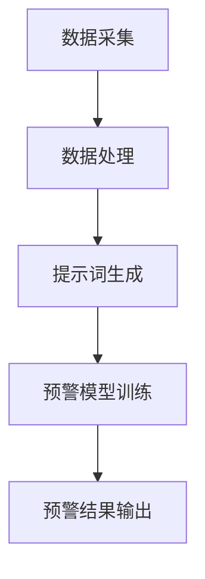

                 

### 《提示词驱动的智能灾害预警：提高应急响应》

关键词：智能灾害预警、提示词、应急响应、系统架构、核心算法、优化与改进

摘要：本文将探讨基于提示词驱动的智能灾害预警系统，通过深入分析其技术基础、系统架构、实际应用和未来展望，阐述如何利用先进的人工智能技术提高灾害预警的准确性和应急响应的效率。文章将从核心概念、原理出发，结合实际案例，详细解析灾害预警系统开发的各个环节，为相关部门和企业提供参考。

---

### 第一部分：智能灾害预警技术基础

在当今世界，灾害事故的发生频率和影响范围越来越大，如何及时、准确地预警灾害，提高应急响应效率成为全球关注的焦点。智能灾害预警系统作为灾害管理的重要组成部分，其重要性愈发凸显。本部分将深入探讨智能灾害预警的基本概念、原理和优势，为后续章节的内容奠定基础。

#### 第1章：智能灾害预警概述

##### 1.1 智能灾害预警的重要性

自然灾害如地震、洪水、台风等，不仅对人们的生命财产造成巨大损失，还会对社会经济造成严重影响。灾害预警在应急响应中的作用至关重要，它能够提前发现灾害迹象，及时发出警报，为应急决策和行动争取宝贵时间。提高应急响应效率不仅能够最大限度地减少灾害损失，还能提升社会整体的抗灾能力。

##### 1.2 灾害预警的基本原理

灾害预警的基本原理主要包括灾害监测与预警技术、提示词驱动的智能预警机制等。灾害监测技术利用各种传感器和监测设备，实时采集灾害相关数据，如气象参数、地质信息、水文数据等。提示词驱动的智能预警机制则通过分析这些数据，提取关键特征，生成提示词，进而构建预警模型，实现对灾害的智能预测和预警。

##### 1.3 主流灾害预警系统介绍

当前，国内外已经有许多成熟的灾害预警系统，如美国的NWS、中国的国家地震局预警系统等。这些系统在技术架构、数据处理、预警模型等方面各有特色，为灾害预警提供了有力支持。

##### 1.4 提示词驱动的智能灾害预警技术优势

提示词驱动的智能灾害预警技术具有以下优势：提高预警准确率、提高预警响应速度、提高预警的可解释性。通过结合大数据分析和深度学习算法，提示词驱动的预警系统能够更准确地捕捉灾害迹象，更快地做出预警响应，并且能够提供清晰的预警原因和依据，增强应急决策的科学性。

#### 第2章：提示词驱动的灾害预警系统架构

##### 2.1 系统架构设计原则

提示词驱动的灾害预警系统架构设计需要遵循以下原则：数据采集与处理、提示词生成与优化、预警模型构建与训练。这些原则确保了系统的完整性、可靠性和高效性。

##### 2.2 灾害预警模型核心概念与联系

提示词驱动的灾害预警模型涉及多个核心概念，如提示词、特征提取、模型训练、预测输出等。通过Mermaid流程图，可以清晰地展示这些概念之间的联系。



##### 2.3 预警模型核心算法原理讲解

预警模型的核心算法包括特征提取、机器学习算法、深度学习算法等。通过伪代码，可以详细阐述这些算法的实现过程。

```python
# 提示词驱动的灾害预警模型
def warning_system(data, prompt):
    processed_data = data_preprocessing(data)
    prompts = generate_prompts(processed_data)
    model = train_model(prompts)
    result = model.predict(data)
    return result
```

##### 2.4 数学模型与公式讲解

在灾害预警模型中，数学模型和公式起到关键作用。通过解释公式和举例说明，可以更好地理解这些模型的工作原理。

$$
f(x) = \alpha \cdot (1 + \beta \cdot x)
$$

该公式表示预警模型对灾害事件的响应程度，其中$x$为灾害事件特征，$\alpha$和$\beta$为模型参数。

#### 第3章：提示词驱动的灾害预警系统实现

##### 3.1 系统实现环境搭建

系统实现环境搭建包括开发工具与库的选择、环境配置与安装步骤等。这些准备工作是确保系统顺利运行的基础。

##### 3.2 代码实现与解读

代码实现与解读包括数据预处理、提示词生成、预警模型训练、预警结果输出等环节。通过详细解读代码，可以更好地理解系统的实现原理。

##### 3.3 代码解读与分析

对代码的解读与分析可以帮助读者深入了解系统的运行机制，发现潜在的问题和改进空间。

#### 第二部分：智能灾害预警在应急响应中的应用

在本部分，我们将探讨智能灾害预警系统在应急响应中的实际应用，分析其对应急响应的影响，并提供具体的案例进行分析。

##### 第4章：智能灾害预警在应急响应中的作用

##### 第5章：智能灾害预警系统的优化与改进

##### 第6章：提示词驱动的智能灾害预警系统建设与实践

在本章，我们将详细介绍智能灾害预警系统建设的过程，包括技术选型、系统架构设计、开发与实施流程等，并分享实际案例的经验和效果评估。

##### 第7章：未来展望与挑战

##### 附录

在附录部分，我们将提供与智能灾害预警系统开发相关的工具与资源，包括深度学习框架对比、提示词生成与优化方法等，为读者提供进一步学习和实践的资源。

---

通过上述的内容布局，本文将逐步深入探讨提示词驱动的智能灾害预警技术，从基础理论到实际应用，从系统架构到优化改进，全面阐述如何利用先进的人工智能技术提高灾害预警的准确性和应急响应的效率。希望本文能够为相关领域的研究者、工程师和决策者提供有价值的参考和启示。

