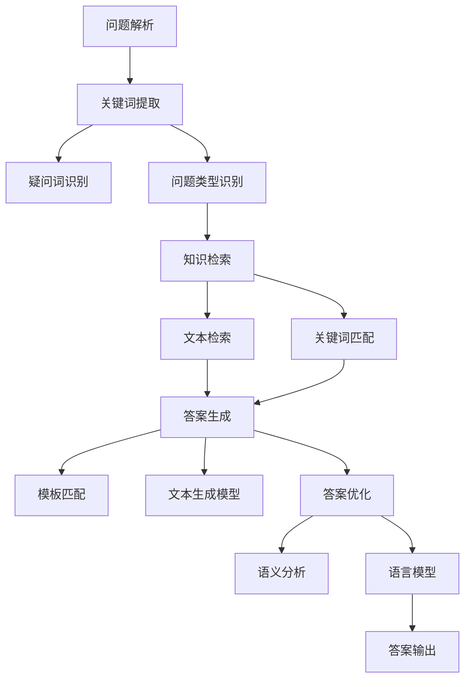
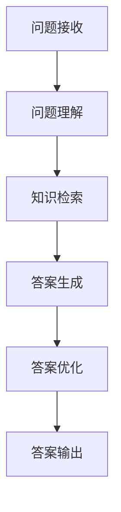

                 

### 文章标题

# 搜索引擎的自然语言理解进展

---

## 关键词

自然语言处理、搜索引擎、语义理解、人工智能、问答系统、文本分析。

## 摘要

本文旨在探讨搜索引擎的自然语言理解（NLU）技术进展，分析其在实际应用中的挑战与机遇。文章从自然语言理解的核心概念入手，逐步深入到技术原理、应用实践和未来发展趋势，涵盖语言模型、词向量、命名实体识别、情感分析以及问答系统等内容。通过详细介绍相关技术原理、算法模型和实战案例，本文旨在为读者提供全面的自然语言理解技术知识，助力其在搜索引擎领域的研究与应用。

---

## 第一部分：搜索引擎的自然语言理解概述

### 1.1 自然语言理解的核心概念

#### 1.1.1 自然语言理解的定义

自然语言理解（Natural Language Understanding, NLU）是指计算机对人类自然语言文本的处理和理解能力，它旨在将自然语言文本转化为计算机可以理解和执行的形式。NLU的核心目标是实现人机交互的智能化，使计算机能够更好地理解用户的需求，提供准确和个性化的服务。

#### 1.1.2 自然语言理解的层次结构

自然语言理解可以分为以下几个层次：

1. **词法分析（Lexical Analysis）**：将文本分解为单词和其他语法单位，如标点符号、停用词等。
2. **句法分析（Syntactic Analysis）**：分析句子结构，理解单词之间的语法关系，如主谓宾结构、从句等。
3. **语义分析（Semantic Analysis）**：理解句子的含义，识别句子中的实体、关系和意图等。
4. **语用分析（Pragmatic Analysis）**：研究语言在实际使用中的含义，如语境、对话上下文等。
5. **对话管理（Dialogue Management）**：处理多轮对话，根据用户输入和系统状态调整对话策略。

#### 1.1.3 自然语言理解的重要性

自然语言理解技术是人工智能领域的关键组成部分，其应用场景广泛，包括但不限于以下几个方面：

1. **搜索引擎**：通过NLU技术，搜索引擎能够更好地理解用户的查询意图，提供更精准的搜索结果。
2. **智能助手**：智能助手通过NLU技术，能够理解用户的问题并给出相应的回答。
3. **文本分析**：NLU技术可以用于情感分析、关键词提取、分类标注等文本分析任务。
4. **语音助手**：语音助手通过NLU技术，能够将语音输入转换为文本，并理解用户的需求。

### 1.2 搜索引擎的自然语言理解需求

#### 1.2.1 搜索引擎的发展历程

搜索引擎的发展经历了从基于关键词匹配到基于语义理解的过程。早期搜索引擎主要依靠关键词匹配技术，通过统计关键词在文档中的出现频率来计算相关性。然而，这种简单的方法很难满足用户复杂的查询需求，特别是当用户输入的查询语句与文档内容不完全匹配时。

随着自然语言处理技术的进步，现代搜索引擎开始引入NLU技术，以实现更智能的查询处理。例如，通过词向量模型和语义分析技术，搜索引擎可以更好地理解用户的查询意图，提供更加准确和个性化的搜索结果。

#### 1.2.2 搜索引擎面临的挑战

搜索引擎在实现自然语言理解过程中面临以下挑战：

1. **查询理解的多样性**：用户的查询语句形式多样，可能包含同义词、缩写、语法错误等，需要搜索引擎能够灵活处理。
2. **语境的复杂性**：用户的查询往往受到上下文的影响，需要搜索引擎能够理解查询与上下文之间的关系。
3. **多语言支持**：全球用户使用不同的语言，搜索引擎需要支持多种语言的自然语言理解。
4. **实时性**：搜索引擎需要快速响应用户的查询，提高查询处理的实时性。

#### 1.2.3 自然语言理解在搜索引擎中的应用

自然语言理解技术在搜索引擎中的应用主要体现在以下几个方面：

1. **查询意图分析**：通过对用户查询语句进行语义分析，确定用户的查询意图，从而提供更加精准的搜索结果。
2. **查询扩展**：根据用户查询的上下文信息，自动扩展查询关键词，提高搜索结果的覆盖率。
3. **实体识别**：识别查询语句中的实体，如人名、地名、组织名等，提供与实体相关的详细信息。
4. **搜索结果排序**：结合语义分析技术，对搜索结果进行排序，提高用户满意度。

### 1.3 搜索引擎的自然语言理解方法

#### 1.3.1 基于统计的方法

基于统计的方法是早期搜索引擎自然语言理解的主要技术，通过统计关键词在文档中的出现频率和相关性来计算搜索结果的相关性。这种方法简单有效，但存在一些局限性，如难以处理复杂查询和语义理解问题。

#### 1.3.2 基于规则的方法

基于规则的方法通过定义一系列规则来处理自然语言查询，如关键词匹配、语法解析等。这种方法具有较好的可解释性，但需要大量的人工定义和维护。

#### 1.3.3 统计与规则相结合的方法

结合统计方法和规则方法，可以构建更加智能的搜索引擎自然语言理解系统。统计方法可以处理大规模数据和复杂查询，而规则方法可以提供更好的解释性和可控性。

### 1.4 搜索引擎的自然语言理解工具

#### 1.4.1 词向量模型

词向量模型（Word Vector Model）是一种将单词映射为向量的方法，通过向量之间的距离来表示单词的语义关系。词向量模型在搜索引擎的自然语言理解中广泛应用，如关键词提取、查询意图分析等。

#### 1.4.2 命名实体识别

命名实体识别（Named Entity Recognition, NER）是一种识别文本中具有特定意义的实体（如人名、地名、组织名等）的技术。NER在搜索引擎中可用于提供与实体相关的详细信息，提高搜索结果的精确性。

#### 1.4.3 情感分析

情感分析（Sentiment Analysis）是一种分析文本中情感倾向的技术，通过情感分析，搜索引擎可以了解用户对搜索结果的评价，从而优化搜索结果排序。

#### 1.4.4 问答系统

问答系统（Question Answering System）是一种能够理解用户问题并给出答案的系统。问答系统在搜索引擎中的应用，可以提供更加智能化的搜索结果，满足用户对特定问题的需求。

### 1.5 搜索引擎的自然语言理解进展

#### 1.5.1 自然语言处理技术的研究热点

近年来，自然语言处理技术的研究热点包括：

1. **预训练语言模型**：如BERT、GPT等，通过在大量文本上进行预训练，提高模型在自然语言理解任务中的性能。
2. **多语言处理**：研究如何在不同语言之间进行语义转换和理解，实现跨语言搜索。
3. **低资源语言处理**：研究如何利用有限的语料资源，提高低资源语言的自然语言理解能力。
4. **实时交互**：研究如何实现实时、动态的自然语言理解，提高用户交互体验。

#### 1.5.2 自然语言理解的最新成果

近年来，自然语言理解技术取得了许多重要成果，包括：

1. **BERT模型**：通过预训练和微调，BERT模型在多项自然语言理解任务上取得了显著的性能提升。
2. **问答系统**：通过引入预训练语言模型和强化学习技术，问答系统的性能得到了大幅提升。
3. **情感分析**：通过深度学习和迁移学习技术，情感分析模型的准确性和泛化能力得到了显著提高。
4. **命名实体识别**：通过结合规则和深度学习技术，命名实体识别的精度和召回率得到了显著提升。

#### 1.5.3 未来发展方向

未来，搜索引擎的自然语言理解技术将继续向以下几个方向发展：

1. **语义理解**：研究如何更好地理解用户查询的语义，提供更加精准的搜索结果。
2. **多模态处理**：研究如何结合文本、图像、语音等多种模态信息，提高自然语言理解能力。
3. **实时交互**：研究如何实现实时、动态的自然语言理解，提高用户交互体验。
4. **个性化搜索**：研究如何根据用户的兴趣和行为，提供个性化的搜索结果。
5. **跨语言搜索**：研究如何在不同语言之间进行语义转换和理解，实现跨语言搜索。

---

通过以上分析，我们可以看到搜索引擎的自然语言理解技术已经取得了显著的进展，但仍面临许多挑战和机遇。未来，随着自然语言处理技术的不断发展和应用场景的拓展，搜索引擎的自然语言理解技术将更好地满足用户的需求，推动人工智能技术的发展。

## 第二部分：搜索引擎的自然语言理解技术原理

### 2.1 自然语言处理技术基础

#### 2.1.1 语言模型

##### 2.1.1.1 语言模型的基本概念

语言模型（Language Model）是一种统计模型，用于预测文本序列的概率。它通常表示为一系列概率分布，用于计算一个句子或词汇序列出现的概率。语言模型是自然语言处理（NLP）的核心技术之一，广泛应用于文本生成、机器翻译、语音识别等领域。

##### 2.1.1.2 语言模型的构建方法

语言模型的构建方法主要有两种：基于N-gram模型和基于神经网络模型。

1. **基于N-gram模型**：N-gram模型是一种基于词汇序列的统计模型，它将前N个单词作为上下文，预测下一个单词。N-gram模型的构建步骤如下：
    - 收集语料库：从大量文本中提取单词序列，构建语料库。
    - 统计词频：统计每个单词序列的频率，构建N-gram概率分布。
    - 构建模型：将统计结果转换为概率分布，构建N-gram模型。

2. **基于神经网络模型**：神经网络模型（如RNN、LSTM、Transformer等）通过学习文本序列的分布式表示，预测下一个单词。神经网络模型的构建步骤如下：
    - 收集数据集：从大量文本中提取单词序列，构建数据集。
    - 预处理数据：对数据集进行预处理，如分词、词向量编码等。
    - 构建神经网络模型：设计神经网络结构，如RNN、LSTM、Transformer等。
    - 训练模型：使用数据集训练神经网络模型，优化模型参数。
    - 评估模型：使用验证集或测试集评估模型性能。

##### 2.1.1.3 语言模型的评估指标

语言模型的评估指标主要包括：
1. ** perplexity（困惑度）**：表示模型对测试集的预测不确定度，困惑度越低，模型性能越好。计算公式为：
   \[
   perplexity = \frac{1}{N} \sum_{i=1}^{N} \frac{1}{P(w_i|w_{1:i-1})}
   \]
   其中，\(N\) 是测试集的词汇数量，\(P(w_i|w_{1:i-1})\) 是模型预测单词 \(w_i\) 的概率。

2. **accuracy（准确率）**：表示模型预测正确的单词数量与总单词数量的比例，准确率越高，模型性能越好。计算公式为：
   \[
   accuracy = \frac{correct\_predictions}{total\_predictions}
   \]
   其中，\(correct\_predictions\) 是模型预测正确的单词数量，\(total\_predictions\) 是模型预测的总单词数量。

3. **BLEU（双语评价算法）**：BLEU是一种常用于机器翻译性能评估的指标，它通过计算模型生成的文本与参考文本之间的相似度来评估模型性能。BLEU分数越高，模型性能越好。

#### 2.1.2 词向量

##### 2.1.2.1 词向量的基本概念

词向量（Word Vector）是一种将单词映射到向量空间的方法，通过向量之间的距离和角度来表示单词的语义关系。词向量模型在自然语言处理领域具有广泛的应用，如文本分类、情感分析、命名实体识别等。

##### 2.1.2.2 词向量的构建方法

词向量的构建方法主要有两种：基于统计的方法和基于神经网络的方法。

1. **基于统计的方法**：基于统计的方法通过统计单词在文本中的出现频率和上下文信息来构建词向量。这种方法包括：
    - **TF-IDF（词频-逆文档频率）**：TF-IDF模型将词频和逆文档频率相结合，用于衡量单词的重要程度。计算公式为：
       \[
       tf-idf = tf \times idf
       \]
       其中，\(tf\) 是单词在文本中的词频，\(idf\) 是单词在语料库中的逆文档频率。

    - **Word2Vec（Word to Vector）**：Word2Vec模型通过学习单词的分布式表示，将单词映射到高维向量空间。Word2Vec模型包括两种训练方法：CBOW（上下文窗口平均）和SG（Skip-Gram）。训练步骤如下：
        - 收集文本数据：从大量文本中提取单词序列。
        - 构建词汇表：将文本中的单词构建成词汇表。
        - 初始化词向量：将每个单词映射到一个随机初始化的高维向量。
        - 训练模型：使用训练数据训练词向量模型，优化词向量参数。
        - 评估模型：使用测试数据评估模型性能。

2. **基于神经网络的方法**：基于神经网络的方法通过学习单词的分布式表示，将单词映射到高维向量空间。这种方法包括：
    - **GloVe（Global Vectors for Word Representation）**：GloVe模型通过学习全局词向量矩阵，将单词映射到高维向量空间。训练步骤如下：
        - 收集文本数据：从大量文本中提取单词序列。
        - 构建词汇表：将文本中的单词构建成词汇表。
        - 计算词频矩阵：计算每个单词在文本中的词频。
        - 训练模型：使用训练数据训练GloVe模型，优化词向量参数。
        - 评估模型：使用测试数据评估模型性能。

##### 2.1.2.3 词向量的应用

词向量在自然语言处理领域有广泛的应用，包括：
1. **文本分类**：词向量可以用于将文本转化为向量表示，然后使用分类算法对文本进行分类。
2. **情感分析**：词向量可以用于分析文本的情感倾向，如正面、负面或中性。
3. **命名实体识别**：词向量可以用于识别文本中的命名实体，如人名、地名、组织名等。
4. **问答系统**：词向量可以用于理解用户的问题和答案，提高问答系统的性能。

### 2.2 命名实体识别

#### 2.2.1 命名实体识别的基本概念

命名实体识别（Named Entity Recognition, NER）是一种自然语言处理技术，用于识别文本中的具有特定意义的实体，如人名、地名、组织名等。NER是文本分析的重要任务之一，广泛应用于信息提取、语义理解、问答系统等领域。

##### 2.2.1.1 命名实体的定义

命名实体是指文本中表示特定对象或概念的实体，具有明确的语义和边界。命名实体可以是人名、地名、组织名、产品名、事件名等。

##### 2.2.1.2 命名实体的分类

命名实体可以分为以下几类：

1. **人名**：指人类个体的名称，如“奥巴马”、“玛丽”等。
2. **地名**：指地理区域的名称，如“纽约”、“中国”等。
3. **组织名**：指组织的名称，如“微软”、“联合国”等。
4. **产品名**：指产品的名称，如“iPhone”、“特斯拉”等。
5. **事件名**：指特定事件的名称，如“世界杯”、“911事件”等。

##### 2.2.1.3 命名实体识别的挑战

命名实体识别面临以下挑战：

1. **命名实体边界确定**：确定命名实体的起始和结束位置是NER的关键挑战，实体可能具有复杂的嵌套结构和变体。
2. **实体识别准确性**：不同实体类别的识别准确性和召回率之间存在权衡，需要平衡识别准确性和覆盖范围。
3. **多语言支持**：命名实体识别需要支持多种语言，不同语言的命名实体结构和特征存在差异。
4. **实时处理**：在实时应用场景中，命名实体识别需要快速处理大量文本数据，提高实时性。

#### 2.2.2 命名实体识别的方法

命名实体识别的方法可以分为以下几类：

1. **基于规则的方法**：基于规则的方法通过定义一系列规则来识别命名实体。这种方法具有较好的可解释性和可控性，但需要大量的人工定义和维护。

2. **基于统计的方法**：基于统计的方法通过统计文本中命名实体的特征和模式来识别命名实体。这种方法通常使用机器学习算法，如条件随机场（CRF）和支持向量机（SVM）等。

3. **基于深度学习的方法**：基于深度学习的方法通过学习文本的分布式表示，识别命名实体。这种方法通常使用卷积神经网络（CNN）和循环神经网络（RNN）等。

#### 2.2.3 命名实体识别的流程

命名实体识别的一般流程包括以下几个步骤：

1. **数据预处理**：对文本进行预处理，如分词、去停用词、词性标注等。
2. **特征提取**：提取文本的特征，如词向量、词性、词频等。
3. **模型训练**：使用训练数据训练命名实体识别模型，如CRF、SVM、CNN、RNN等。
4. **模型评估**：使用验证集或测试集评估模型性能，如准确率、召回率、F1值等。
5. **实体识别**：使用训练好的模型对新的文本进行命名实体识别，输出实体结果。

### 2.3 情感分析

#### 2.3.1 情感分析的基本概念

情感分析（Sentiment Analysis）是一种自然语言处理技术，用于识别文本中的情感倾向，如正面、负面或中性。情感分析广泛应用于市场调研、产品评论分析、社交媒体监测等领域。

##### 2.3.1.1 情感的定义

情感是指人们对事物的情感体验和评价，通常包括情感极性（如正面、负面）和情感强度（如强、弱）。

##### 2.3.1.2 情感的分类

情感可以分为以下几类：

1. **正面情感**：表示对事物的积极评价，如“喜欢”、“满意”等。
2. **负面情感**：表示对事物的消极评价，如“讨厌”、“不满意”等。
3. **中性情感**：表示对事物没有明显的情感倾向，如“一般”、“正常”等。

##### 2.3.1.3 情感分析的挑战

情感分析面临以下挑战：

1. **情感复杂性**：情感表达可能涉及多个维度，如情感极性、情感强度、情感类型等，需要综合分析。
2. **语境依赖性**：情感表达可能受到上下文的影响，需要考虑上下文的语义信息。
3. **多语言支持**：情感分析需要支持多种语言，不同语言的情感表达和语法结构存在差异。
4. **情感强度识别**：识别情感强度是一个挑战，需要区分情感表达的强弱。

#### 2.3.2 情感分析的方法

情感分析的方法可以分为以下几类：

1. **基于规则的方法**：基于规则的方法通过定义一系列规则来识别情感倾向。这种方法具有较好的可解释性和可控性，但需要大量的人工定义和维护。

2. **基于统计的方法**：基于统计的方法通过统计文本中情感相关的特征和模式来识别情感倾向。这种方法通常使用机器学习算法，如朴素贝叶斯、支持向量机、逻辑回归等。

3. **基于深度学习的方法**：基于深度学习的方法通过学习文本的分布式表示，识别情感倾向。这种方法通常使用卷积神经网络（CNN）和循环神经网络（RNN）等。

#### 2.3.3 情感分析的流程

情感分析的一般流程包括以下几个步骤：

1. **数据预处理**：对文本进行预处理，如分词、去停用词、词性标注等。
2. **特征提取**：提取文本的特征，如词向量、词频、词性等。
3. **模型训练**：使用训练数据训练情感分析模型，如朴素贝叶斯、支持向量机、逻辑回归、卷积神经网络、循环神经网络等。
4. **模型评估**：使用验证集或测试集评估模型性能，如准确率、召回率、F1值等。
5. **情感识别**：使用训练好的模型对新的文本进行情感识别，输出情感结果。

### 2.4 问答系统

#### 2.4.1 问答系统的基本概念

问答系统（Question Answering System）是一种自然语言处理技术，用于理解和回答用户的问题。问答系统可以分为两类：基于知识的问答系统和基于数据的问答系统。

##### 2.4.1.1 问答系统的定义

问答系统是一种计算机程序，用于理解和回答用户的问题。问答系统通常由两个主要模块组成：问题理解模块和回答生成模块。

##### 2.4.1.2 问答系统的分类

1. **基于知识的问答系统**：基于知识的问答系统通过查询预定义的知识库来回答用户的问题。这种系统通常需要大量的手动知识工程，如定义规则、构建知识库等。

2. **基于数据的问答系统**：基于数据的问答系统通过自然语言处理技术，从大规模的文本数据中自动提取答案。这种系统通常使用机器学习算法和深度学习模型，如Transformer、BERT等。

##### 2.4.1.3 问答系统的挑战

问答系统面临以下挑战：

1. **问题理解**：理解用户问题的意图和内容是问答系统的关键挑战，特别是当用户问题表达不明确或存在歧义时。

2. **回答生成**：生成准确、合理和相关的回答是问答系统的另一个挑战，需要综合考虑问题的语义和上下文信息。

3. **实时性**：问答系统需要快速响应用户的问题，提供实时的回答。

4. **多语言支持**：问答系统需要支持多种语言，处理不同语言的语义和语法结构。

#### 2.4.2 问答系统的构建方法

问答系统的构建方法可以分为以下几个步骤：

1. **数据收集与预处理**：收集大规模的问答数据集，对数据进行预处理，如分词、词性标注、实体识别等。

2. **问题理解**：使用自然语言处理技术，如词向量、句法分析、语义角色标注等，理解用户问题的意图和内容。

3. **答案提取**：使用文本检索技术，如搜索引擎、关键词匹配等，从大规模的文本数据中提取可能的答案。

4. **答案生成**：使用自然语言生成技术，如模板匹配、模板扩展、文本生成模型等，生成准确的回答。

5. **模型训练与优化**：使用训练数据训练问答系统模型，如Transformer、BERT等，并对模型进行优化，提高问答系统的性能。

6. **模型评估与部署**：使用验证集或测试集评估问答系统的性能，如准确率、召回率、F1值等，并根据评估结果对模型进行优化和调整，最终部署到生产环境中。

---

通过以上分析，我们可以看到搜索引擎的自然语言理解技术涉及到多个方面，包括语言模型、词向量、命名实体识别、情感分析和问答系统等。每个技术模块都有其独特的原理和实现方法，但在实际应用中，这些模块通常是相互结合，共同作用，以提高搜索引擎的自然语言理解能力。随着自然语言处理技术的不断发展和应用场景的拓展，我们可以期待未来搜索引擎的自然语言理解能力将得到进一步的提升。

---

### 2.4.3 问答系统的流程

问答系统通常包括以下几个关键步骤：

1. **问题解析**：首先，系统需要对用户提出的问题进行解析，提取关键信息，如关键词、疑问词、问题的类型等。这一步涉及到自然语言处理技术，如分词、词性标注、命名实体识别等。

    ```mermaid
    graph TD
    A[问题解析] --> B[关键词提取]
    B --> C[疑问词识别]
    B --> D[问题类型识别]
    ```

2. **知识检索**：在解析出问题的关键信息后，系统需要根据这些信息在知识库或文本数据中检索相关的内容。这一步骤可能涉及到搜索引擎、关键词匹配、索引等技术。

    ```mermaid
    graph TD
    E[知识检索] --> F[文本检索]
    E --> G[关键词匹配]
    ```

3. **答案生成**：找到相关的信息后，系统需要生成回答。这一步骤通常涉及到自然语言生成技术，如模板匹配、文本生成模型等。

    ```mermaid
    graph TD
    H[答案生成] --> I[模板匹配]
    H --> J[文本生成模型]
    ```

4. **答案优化**：生成的答案可能需要进行进一步的优化，确保其准确性、相关性和可读性。这一步骤可能涉及到语言模型、语义分析等技术。

    ```mermaid
    graph TD
    K[答案优化] --> L[语义分析]
    K --> M[语言模型]
    ```

5. **答案输出**：最后，系统将优化后的答案输出给用户。

    ```mermaid
    graph TD
    N[答案输出]
    K --> N
    ```

整体流程图如下：



通过上述流程，问答系统能够有效地理解用户的问题，并生成准确、相关的回答。每个步骤都涉及到自然语言处理的不同方面，共同作用，提高了问答系统的整体性能。

---

### 2.4.3 问答系统的构建方法

问答系统的构建方法可以分为基于规则的方法、基于统计的方法和基于深度学习的方法。每种方法都有其优点和局限性，适用于不同的应用场景。

#### 基于规则的方法

基于规则的方法通过定义一系列规则来处理问题理解、知识检索和答案生成。这种方法具有较好的可解释性和可控性，适合处理简单、明确的问题。

1. **问题理解**：通过规则匹配，提取关键词、疑问词和问题类型。例如，如果用户的问题是“北京的天气怎么样？”，系统可以通过规则识别出关键词“北京”、“天气”和问题类型“查询”。

2. **知识检索**：根据提取的关键词和问题类型，在预定义的知识库中检索相关信息。例如，如果问题是关于天气的查询，系统可以在天气数据库中查找相关天气信息。

3. **答案生成**：通过模板匹配或规则组合生成答案。例如，如果问题是“北京的天气怎么样？”，系统可以生成“北京的天气是晴朗，温度是20摄氏度”。

优点：
- **可解释性**：规则明确，便于理解和调试。
- **可控性**：可以通过修改规则来控制答案的生成。

局限性：
- **扩展性差**：规则定义繁琐，难以处理复杂问题。
- **适应性差**：需要针对不同领域重新定义规则。

#### 基于统计的方法

基于统计的方法通过统计文本中关键词和问题模式，使用机器学习算法来处理问答系统。这种方法适用于处理复杂、多样化的查询。

1. **问题理解**：通过统计用户问题和答案中的关键词和模式，使用机器学习模型（如朴素贝叶斯、逻辑回归等）来理解问题。例如，通过训练模型，系统可以识别出不同类型的问题（如查询、请求、抱怨等）。

2. **知识检索**：使用统计方法，如TF-IDF、关键词匹配等，在文本数据中检索相关信息。这种方法可以处理大规模的文本数据，提高检索效率。

3. **答案生成**：通过统计方法，如模板匹配、文本生成模型（如序列到序列模型、注意力机制等），生成答案。这种方法可以生成更加多样化和自然的回答。

优点：
- **适应性**：可以处理复杂和多样化的问题。
- **高效性**：适用于处理大规模的文本数据。

局限性：
- **准确性**：统计方法可能无法很好地处理模糊和歧义问题。
- **可解释性**：模型决策过程较复杂，难以解释。

#### 基于深度学习的方法

基于深度学习的方法通过学习文本的分布式表示，实现问答系统。这种方法适用于处理复杂和高度结构化的查询。

1. **问题理解**：使用深度学习模型（如卷积神经网络（CNN）、循环神经网络（RNN）、Transformer等）来理解问题。这些模型可以捕捉文本的语义信息，提高问题理解的准确性。

2. **知识检索**：使用深度学习模型，如BERT、GPT等，在大量文本数据中检索相关信息。这些模型具有强大的语义表示能力，可以提高知识检索的准确性。

3. **答案生成**：使用深度学习模型，如Transformer、生成对抗网络（GAN）等，生成自然、准确的答案。这些模型可以生成多样化的回答，提高用户体验。

优点：
- **准确性**：深度学习模型可以捕捉复杂的语义信息，提高问题理解和答案生成的准确性。
- **灵活性**：可以处理多种类型的问题和多样化的回答。

局限性：
- **计算资源**：深度学习模型通常需要大量的计算资源和时间。
- **可解释性**：深度学习模型的决策过程较复杂，难以解释。

---

通过上述方法的比较，我们可以看到，基于规则的方法适合处理简单明确的问题，基于统计的方法适用于处理复杂和多样化的查询，而基于深度学习的方法则能够处理复杂和高度结构化的查询。在实际应用中，可以根据具体需求选择合适的方法，或者结合多种方法，构建高效、准确的问答系统。

---

### 2.4.3 问答系统的流程

问答系统的一般流程包括以下几个关键步骤：

1. **问题接收**：系统接收用户输入的问题，进行初步的预处理，如分词、去除停用词等。

    ```mermaid
    graph TD
    A[问题接收]
    ```

2. **问题理解**：系统对预处理后的问题进行深入分析，提取关键信息，如关键词、疑问词、问题类型等。这一步骤通常涉及自然语言处理技术，如词向量、句法分析、语义角色标注等。

    ```mermaid
    graph TD
    A --> B[问题理解]
    ```

3. **知识检索**：根据问题理解的结果，系统在预定义的知识库或文本数据中检索相关的内容。这一步骤可能涉及搜索引擎、关键词匹配、索引等技术。

    ```mermaid
    graph TD
    B --> C[知识检索]
    ```

4. **答案生成**：找到相关的信息后，系统需要生成回答。这一步骤通常涉及自然语言生成技术，如模板匹配、文本生成模型等。

    ```mermaid
    graph TD
    C --> D[答案生成]
    ```

5. **答案优化**：生成的答案可能需要进行进一步的优化，确保其准确性、相关性和可读性。这一步骤可能涉及语言模型、语义分析等技术。

    ```mermaid
    graph TD
    D --> E[答案优化]
    ```

6. **答案输出**：最后，系统将优化后的答案输出给用户。

    ```mermaid
    graph TD
    E --> F[答案输出]
    ```

整体流程图如下：



通过上述流程，问答系统能够有效地理解用户的问题，并生成准确、相关的回答。每个步骤都涉及到自然语言处理的不同方面，共同作用，提高了问答系统的整体性能。

---

### 3.1 实战一：基于自然语言理解的搜索引擎优化

#### 3.1.1 搜索引擎优化的基本概念

搜索引擎优化（Search Engine Optimization, SEO）是一种通过改进网站内容和结构，提高网站在搜索引擎中的排名，从而吸引更多用户访问的技术。随着自然语言理解技术的进步，SEO策略也在不断演化，变得更加智能化和个性化。

##### 3.1.1.1 搜索引擎优化的目的

1. **提高网站曝光率**：通过优化，提高网站在搜索引擎结果页面（Search Engine Results Page, SERP）上的排名，增加网站被用户发现的机会。
2. **提升用户体验**：优化网站结构、内容和交互，使用户在使用过程中获得更好的体验。
3. **增加转化率**：通过优化，提高网站流量转化为实际业务（如销售、订阅等）的比例。

##### 3.1.1.2 搜索引擎优化的方法

1. **关键词优化**：通过分析用户搜索习惯和竞争环境，选择合适的关键词，并将其合理分布在网站内容和元标签中。
2. **内容优化**：提高网站内容的原创性、相关性和质量，使用户能够获取有价值的信息。
3. **网站结构优化**：优化网站的结构和导航，确保搜索引擎能够快速索引网站内容。
4. **技术优化**：提升网站加载速度、移动友好性、安全性等，提高用户体验。

##### 3.1.1.3 搜索引擎优化的挑战

1. **竞争激烈**：搜索引擎优化是一项长期且持续的工作，面临着来自同行业网站的激烈竞争。
2. **算法更新**：搜索引擎的算法不断更新，优化策略需要及时调整以适应算法变化。
3. **用户体验差异**：不同用户群体对网站内容和体验的需求不同，需要个性化优化。

#### 3.1.2 自然语言理解在搜索引擎优化中的应用

自然语言理解（NLU）技术在搜索引擎优化中具有广泛的应用，主要体现在以下几个方面：

##### 3.1.2.1 关键词提取

自然语言理解技术可以分析用户查询语句，提取关键查询词，从而更准确地确定网站需要优化的关键词。具体方法包括：
1. **词频统计**：统计查询语句中的高频词汇，确定关键词。
2. **语义分析**：通过语义分析，识别查询语句中的核心概念和意图，提取相关关键词。

```python
import nltk
from nltk.tokenize import word_tokenize

def extract_keywords(query):
    tokens = word_tokenize(query)
    # 基于词频提取关键词
    word_freq = nltk.FreqDist(tokens)
    top_keywords = word_freq.most_common(10)
    return [keyword for keyword, _ in top_keywords]

# 示例
query = "如何快速学习Python？"
keywords = extract_keywords(query)
print(keywords)
```

##### 3.1.2.2 搜索意图分析

自然语言理解技术可以分析用户查询的意图，从而提供更加精准的搜索结果。具体方法包括：
1. **意图分类**：将查询意图分类为不同类型，如信息查询、商品购买、导航等。
2. **语义角色标注**：通过语义角色标注，识别查询语句中的主语、谓语、宾语等，理解查询的意图。

```python
from nltk.corpus import wordnet
from nltk import pos_tag

def get_wordnet_pos(treebank_tag):
    if treebank_tag.startswith('J'):
        return wordnet.ADJ
    elif treebank_tag.startswith('V'):
        return wordnet.VERB
    elif treebank_tag.startswith('N'):
        return wordnet.NOUN
    elif treebank_tag.startswith('R'):
        return wordnet.ADV
    else:
        return None

query = "哪里可以买到苹果手机？"
pos_tags = pos_tag(word_tokenize(query))
wordnet_pos = [get_wordnet_pos(tag) for word, tag in pos_tags]
print(wordnet_pos)
```

##### 3.1.2.3 搜索结果排序

自然语言理解技术可以结合搜索意图和用户行为数据，对搜索结果进行排序，提高用户满意度。具体方法包括：
1. **相关度排序**：根据查询意图和页面内容的相关性，对搜索结果进行排序。
2. **用户行为分析**：通过分析用户点击行为、停留时间等，调整搜索结果排序。

```python
# 假设有一个搜索结果列表，以及用户点击行为数据
search_results = [
    {"title": "苹果官网", "url": "https://www.apple.com", "relevance": 0.8},
    {"title": "华为手机", "url": "https://www.huawei.com", "relevance": 0.6},
    {"title": "小米商城", "url": "https://www.mi.com", "relevance": 0.7}
]

user_clicks = [
    {"url": "https://www.apple.com", "clicked": True},
    {"url": "https://www.mi.com", "clicked": False},
    {"url": "https://www.huawei.com", "clicked": True}
]

# 根据用户点击行为调整搜索结果排序
def sort_search_results(results, clicks):
    click_weights = {click['url']: 1 for click in clicks if click['clicked']}
    sorted_results = sorted(results, key=lambda x: x['relevance'] + sum(click_weights.get(url, 0) for url in x['url'].split('/')))
    return sorted_results

sorted_results = sort_search_results(search_results, user_clicks)
print(sorted_results)
```

通过上述实战案例，我们可以看到自然语言理解技术在搜索引擎优化中的应用，不仅能够提取关键词、分析搜索意图，还可以优化搜索结果排序，从而提高搜索引擎的用户体验和业务转化率。随着自然语言理解技术的不断发展，未来搜索引擎优化策略将更加智能化和个性化。

---

### 3.2 实战二：基于自然语言理解的问答系统开发

#### 3.2.1 问答系统的基本概念

问答系统是一种能够理解用户问题并生成相关答案的人工智能系统。在自然语言处理（NLP）的背景下，问答系统通过自然语言理解技术，实现对用户查询的语义分析，从而提供准确的答案。

##### 3.2.1.1 问答系统的定义

问答系统（Question Answering System）通常由两个主要模块组成：问题理解模块和答案生成模块。问题理解模块负责分析用户的问题，提取关键信息；答案生成模块则根据提取的信息，从知识库或外部数据源中检索相关答案。

##### 3.2.1.2 问答系统的分类

1. **基于知识的问答系统**：这类问答系统依赖于预定义的知识库，通过查询和匹配知识库中的信息来生成答案。它们通常适用于结构化数据场景，如电子百科全书、公司手册等。

2. **基于数据的问答系统**：这类问答系统从大规模的非结构化文本数据中自动提取答案。它们通常使用深度学习模型和自然语言处理技术，如BERT、GPT等，处理复杂的语义理解任务。

##### 3.2.1.3 问答系统的挑战

1. **问题理解的多样性**：用户的问题可能包含多种形式，如开放性问题、闭合性问题、模糊性问题等，需要问答系统能够灵活应对。

2. **知识库的构建和维护**：对于基于知识的问答系统，构建和维护一个全面、准确的知识库是关键挑战。

3. **答案的准确性和可解释性**：生成的答案需要准确、相关且易于理解，同时，系统的决策过程也需要具有一定的可解释性。

4. **实时性**：问答系统需要快速响应用户的问题，提供实时答案。

#### 3.2.2 自然语言理解在问答系统中的应用

自然语言理解（NLU）技术在问答系统中发挥着核心作用，以下是其主要应用：

##### 3.2.2.1 问答对匹配

问答对匹配是指将用户的问题与预定义的问答对（问题-答案对）进行匹配，以生成答案。这个过程通常涉及关键词提取、词向量表示和匹配算法。

```python
import numpy as np
from sklearn.metrics.pairwise import cosine_similarity

def match_question_to_answers(question, answers):
    question_vector = get_question_vector(question)
    answer_vectors = [get_answer_vector(answer) for answer in answers]
    similarity_scores = [cosine_similarity(question_vector, answer_vector)[0][0] for answer_vector in answer_vectors]
    return np.argmax(similarity_scores)

def get_question_vector(question):
    # 假设有一个预训练的词向量模型
    model = load_pretrained_word_embedding_model()
    tokens = tokenizer.tokenize(question)
    question_vector = np.mean([model[token] for token in tokens if token in model], axis=0)
    return question_vector

def get_answer_vector(answer):
    # 假设有一个预训练的词向量模型
    model = load_pretrained_word_embedding_model()
    tokens = tokenizer.tokenize(answer)
    answer_vector = np.mean([model[token] for token in tokens if token in model], axis=0)
    return answer_vector

# 示例
question = "北京是中国的哪个城市？"
answers = ["北京是中国的首都", "北京是中国的政治、文化和国际交流中心", "北京是中国的城市之一"]
matched_answer = match_question_to_answers(question, answers)
print(matched_answer)
```

##### 3.2.2.2 回答生成

回答生成是指从知识库或文本数据中提取信息，生成符合用户问题的答案。这个过程通常涉及文本检索、文本生成模型和语义理解。

```python
from transformers import BertModel, BertTokenizer

def generate_answer(question, knowledge_base):
    # 假设有一个预训练的BERT模型
    model = BertModel.from_pretrained('bert-base-chinese')
    tokenizer = BertTokenizer.from_pretrained('bert-base-chinese')
    
    input_ids = tokenizer.encode(question, add_special_tokens=True, return_tensors='pt')
    with torch.no_grad():
        outputs = model(input_ids)
    last_hidden_state = outputs.last_hidden_state
    
    # 从最后隐藏状态中提取问题表示
    question_embedding = last_hidden_state[:, 0, :]
    
    # 搜索知识库
    answer_candidates = search_knowledge_base(knowledge_base, question_embedding)
    
    # 选择最佳答案
    best_answer = select_best_answer(answer_candidates)
    return best_answer

def search_knowledge_base(knowledge_base, question_embedding):
    # 假设知识库中的每个答案都有一个向量表示
    answer_vectors = [get_vector(answer) for answer in knowledge_base]
    similarity_scores = [cosine_similarity(question_embedding.unsqueeze(0), vector.unsqueeze(0))[0][0] for vector in answer_vectors]
    return [answer for answer, score in zip(knowledge_base, similarity_scores) if score > threshold]

def select_best_answer(answer_candidates):
    # 假设答案候选中已经按相似度排序
    return answer_candidates[0]

# 示例
knowledge_base = ["北京是中国的首都", "北京是中国的城市之一", "中国有很多城市"]
question = "北京是中国的哪个城市？"
answer = generate_answer(question, knowledge_base)
print(answer)
```

##### 3.2.2.3 评估与优化

问答系统的性能评估通常包括准确率、召回率和F1值等指标。通过这些指标，可以评估问答系统的性能，并识别需要优化的领域。

```python
from sklearn.metrics import accuracy_score, precision_score, recall_score, f1_score

def evaluate_answer_system(true_answers, generated_answers):
    accuracy = accuracy_score(true_answers, generated_answers)
    precision = precision_score(true_answers, generated_answers, average='weighted')
    recall = recall_score(true_answers, generated_answers, average='weighted')
    f1 = f1_score(true_answers, generated_answers, average='weighted')
    return accuracy, precision, recall, f1

# 示例
true_answers = ["北京是中国的首都", "北京是中国的城市之一", "中国有很多城市"]
generated_answers = ["北京是中国的首都", "北京是中国的城市之一"]
accuracy, precision, recall, f1 = evaluate_answer_system(true_answers, generated_answers)
print(f"Accuracy: {accuracy}, Precision: {precision}, Recall: {recall}, F1: {f1}")
```

通过上述实战案例，我们可以看到自然语言理解技术在问答系统开发中的关键作用，包括问答对匹配、回答生成和评估与优化。随着NLP技术的不断进步，问答系统的性能将不断提高，为用户提供更加准确、相关的答案。

---

### 3.2.3 问答系统开发流程

开发一个基于自然语言理解的问答系统，通常需要遵循以下步骤：

#### 3.2.3.1 需求分析

1. **明确系统目标**：确定问答系统的目标，如提供知识查询、解答用户疑问等。
2. **用户需求调研**：收集用户提出的问题和期望的答案类型，了解用户的使用场景和需求。
3. **功能需求定义**：根据需求和调研结果，定义问答系统的基本功能，如问题理解、答案生成、结果反馈等。

#### 3.2.3.2 数据收集与预处理

1. **数据收集**：收集大量的问题和答案对，可以来自公开数据集或自定义数据集。
2. **数据清洗**：去除无关信息、格式化文本、去除停用词等，保证数据质量。
3. **数据标注**：对问题进行词性标注、实体识别、情感分析等，为后续的模型训练提供标注数据。

#### 3.2.3.3 模型选择与训练

1. **选择模型**：根据系统需求和数据特点，选择合适的自然语言处理模型，如BERT、GPT等。
2. **模型训练**：使用收集到的数据和标注信息，训练问题理解模块和答案生成模块的模型。
3. **模型优化**：通过调整模型参数、使用不同的训练策略等，优化模型性能。

#### 3.2.3.4 系统开发与集成

1. **开发前端界面**：设计并实现用户交互界面，如问题输入框、答案展示区等。
2. **集成后端服务**：将训练好的模型集成到后端服务中，实现问题理解和答案生成功能。
3. **接口开发**：开发与前端界面交互的API接口，实现数据的传递和结果的展示。

#### 3.2.3.5 系统测试与优化

1. **功能测试**：测试问答系统的各项功能，如问题理解、答案生成、结果反馈等。
2. **性能优化**：根据测试结果，优化系统的性能，如提高查询速度、降低延迟等。
3. **用户体验优化**：根据用户反馈，优化界面设计和交互体验。

#### 3.2.3.6 系统部署与维护

1. **部署上线**：将问答系统部署到生产环境，实现对外提供服务。
2. **监控与维护**：监控系统运行状态，及时处理异常情况，确保系统稳定运行。
3. **持续优化**：根据用户反馈和系统运行数据，不断优化问答系统的功能和性能。

通过上述开发流程，我们可以构建一个高效、准确的问答系统，为用户提供高质量的问答服务。随着自然语言处理技术的不断进步，问答系统的性能和用户体验将不断提高，为用户带来更加智能化的交互体验。

---

### 第四部分：搜索引擎的自然语言理解未来发展趋势

#### 4.1 人工智能在搜索引擎中的应用前景

人工智能（AI）在搜索引擎中的应用前景广阔，随着技术的不断进步，搜索引擎将变得更加智能化、个性化，为用户提供更加精准和高效的服务。以下是人工智能在搜索引擎中的应用前景：

##### 4.1.1 搜索引擎的智能化

1. **智能搜索**：通过自然语言理解技术，搜索引擎可以更好地理解用户的查询意图，提供更加精准的搜索结果。例如，通过语义分析，搜索引擎可以识别用户的查询意图，并根据用户的兴趣和需求，推荐相关内容。

2. **个性化搜索**：人工智能技术可以分析用户的历史搜索行为、浏览记录和偏好，为用户提供个性化的搜索结果。这种个性化搜索不仅可以提高用户的满意度，还可以提高搜索引擎的流量和转化率。

3. **智能问答**：通过引入问答系统，搜索引擎可以提供更加智能化的问答服务，帮助用户快速获取所需信息。例如，用户可以提出问题，搜索引擎会自动解析问题并给出答案，从而提高用户的搜索体验。

##### 4.1.2 个性化搜索

1. **用户行为分析**：人工智能技术可以分析用户在搜索引擎上的行为，如搜索关键词、点击记录、停留时间等，了解用户的兴趣和需求。通过这些数据，搜索引擎可以优化搜索结果，提高个性化程度。

2. **推荐系统**：基于用户行为数据和偏好，搜索引擎可以推荐相关的搜索关键词、网页和内容，使用户能够快速找到所需信息。推荐系统不仅提高了用户的满意度，还可以增加搜索引擎的粘性和用户留存率。

3. **个性化搜索结果排序**：人工智能技术可以根据用户的兴趣和行为，调整搜索结果的排序策略，提高用户对搜索结果的满意度。例如，对于经常搜索某个领域的用户，搜索引擎可以优先展示该领域的相关内容。

##### 4.1.3 实时搜索

1. **实时索引**：通过实时索引技术，搜索引擎可以实时更新网页和内容，确保用户能够获取最新、最相关的信息。这种实时搜索不仅提高了用户的满意度，还可以增加搜索引擎的竞争力。

2. **实时分析**：通过实时分析技术，搜索引擎可以实时分析用户的查询行为，了解用户的兴趣和需求。这些分析结果可以用于优化搜索算法、调整搜索结果排序策略，提高搜索效率。

3. **实时交互**：通过实时交互技术，搜索引擎可以与用户进行实时互动，响应用户的查询和反馈。这种实时交互不仅提高了用户的参与度，还可以增强用户对搜索引擎的信任和满意度。

#### 4.2 自然语言理解的未来发展方向

随着人工智能技术的不断进步，自然语言理解（NLU）技术也将不断发展，为搜索引擎提供更强大的语义分析能力和智能化服务。以下是自然语言理解的未来发展方向：

##### 4.2.1 语义理解

1. **多语言支持**：随着全球化的不断推进，多语言支持将成为自然语言理解的重要方向。未来的搜索引擎将支持多种语言，实现跨语言搜索和语义理解。

2. **长文本理解**：当前的自然语言理解技术主要针对短文本，对于长文本的理解能力较弱。未来的搜索引擎将发展长文本理解技术，提高对长篇内容的分析和提取能力。

3. **上下文理解**：上下文是语义理解的关键，未来的搜索引擎将更加注重上下文的理解，提高对查询意图的准确把握。例如，在对话系统中，上下文理解可以帮助系统更好地理解用户的连续提问。

##### 4.2.2 模型压缩与优化

1. **模型压缩**：随着深度学习模型的复杂度增加，模型的压缩与优化变得至关重要。未来的搜索引擎将发展模型压缩技术，减小模型的大小，提高模型的运算效率。

2. **模型优化**：通过模型优化技术，搜索引擎将提高模型的性能，降低计算成本。例如，使用混合精度训练、量化等技术，提高模型的计算速度和效率。

##### 4.2.3 模型融合

1. **多模态融合**：未来的搜索引擎将融合多种模态的数据，如文本、图像、语音等，提高语义理解的准确性。例如，在图像搜索中，结合文本描述和图像特征，可以更好地理解用户的查询意图。

2. **多模型融合**：未来的搜索引擎将结合多种自然语言处理模型，如BERT、GPT、T5等，提高语义理解的复杂度和准确性。通过多模型融合，可以更好地解决单一模型在处理复杂语义问题时存在的局限性。

##### 4.2.4 零样本学习

1. **零样本学习**：零样本学习是一种在未见类别上具有良好表现的技术，未来的搜索引擎将发展零样本学习技术，提高对未知领域的语义理解能力。例如，在问答系统中，零样本学习可以帮助系统理解并回答用户提出的未知问题。

2. **少样本学习**：与零样本学习类似，少样本学习技术在处理小样本问题时具有优势。未来的搜索引擎将结合零样本学习和少样本学习技术，提高对新领域和新任务的适应能力。

通过上述分析，我们可以看到，随着人工智能技术的不断进步，搜索引擎的自然语言理解技术将不断发展，为用户提供更加智能化、个性化的服务。未来，搜索引擎将更好地理解用户的查询意图，提供更加精准的搜索结果，为用户提供更加高效的信息获取途径。

---

### 4.3 搜索引擎的自然语言理解现状

搜索引擎的自然语言理解技术已经取得了显著的进展，但仍然存在一些挑战和局限性。以下是当前搜索引擎的自然语言理解技术现状：

##### 4.3.1 技术发展历程

1. **关键词匹配**：早期的搜索引擎主要依靠关键词匹配技术，通过统计关键词在文档中的出现频率来计算相关性。这种方法简单有效，但难以满足用户复杂的查询需求。

2. **语义分析**：随着自然语言处理技术的进步，现代搜索引擎开始引入语义分析技术，如词向量模型、语义角色标注等。通过语义分析，搜索引擎可以更好地理解用户的查询意图，提供更加精准的搜索结果。

3. **预训练模型**：近年来，预训练语言模型（如BERT、GPT等）在搜索引擎的自然语言理解中得到了广泛应用。这些模型通过在大量文本上进行预训练，能够更好地理解复杂的语义关系，提高搜索结果的准确性。

##### 4.3.2 当前搜索引擎的自然语言理解能力

1. **查询意图分析**：现代搜索引擎可以通过语义分析技术，分析用户的查询意图，并提供相关的搜索结果。例如，通过词向量模型，搜索引擎可以识别查询中的关键词和语义关系，从而提供更加精准的搜索结果。

2. **实体识别**：搜索引擎可以使用命名实体识别技术，识别查询中的实体（如人名、地名、组织名等），并提供与实体相关的详细信息。这种技术可以帮助用户快速找到与实体相关的网页和信息。

3. **情感分析**：搜索引擎可以通过情感分析技术，分析用户对搜索结果的满意度，从而优化搜索结果的排序和推荐。例如，在电子商务场景中，搜索引擎可以分析用户对商品的评价，推荐符合用户期望的商品。

4. **问答系统**：一些先进的搜索引擎已经引入了问答系统，通过自然语言理解技术，能够理解用户的问题并给出准确的答案。这种技术可以提高用户的搜索体验，满足用户对特定问题的需求。

##### 4.3.3 挑战和局限性

1. **查询理解的多样性**：用户的查询语句形式多样，可能包含同义词、缩写、语法错误等。当前的自然语言理解技术难以完全理解这种复杂的查询，特别是在处理模糊和歧义查询时。

2. **语境的复杂性**：用户的查询往往受到上下文的影响，需要搜索引擎能够理解查询与上下文之间的关系。当前的自然语言理解技术在这方面仍然存在一定的局限性。

3. **实时性**：搜索引擎需要快速响应用户的查询，提高查询处理的实时性。随着用户规模的增加和查询量的增大，实时处理成为一项挑战。

4. **多语言支持**：全球用户使用不同的语言，搜索引擎需要支持多种语言的自然语言理解。当前的自然语言理解技术在多语言处理方面仍需进一步完善。

5. **数据隐私和安全性**：随着自然语言理解技术的应用，用户的数据隐私和安全性也受到关注。搜索引擎需要采取措施，保护用户的数据隐私和安全。

通过上述分析，我们可以看到当前搜索引擎的自然语言理解技术已经取得了显著进展，但仍面临许多挑战和局限性。未来，随着自然语言处理技术的不断发展和应用场景的拓展，搜索引擎的自然语言理解能力将得到进一步的提升。

---

### 4.3.2 搜索引擎的自然语言理解未来发展方向

未来，搜索引擎的自然语言理解技术将继续向以下几个方向发展：

##### 4.3.2.1 语义理解

1. **深度语义分析**：未来的搜索引擎将发展更复杂的语义分析技术，如上下文感知的语义分析、情感分析和因果关系分析等。这些技术将使搜索引擎能够更准确地理解用户的查询意图，提供更加精准的搜索结果。

2. **多语言语义理解**：随着全球化的发展，搜索引擎将需要支持多种语言的自然语言理解。未来，搜索引擎将发展多语言语义理解技术，实现跨语言搜索和语义分析。

3. **长文本理解**：当前的自然语言理解技术主要针对短文本，对于长文本的理解能力较弱。未来，搜索引擎将发展长文本理解技术，提高对长篇内容的分析和提取能力，以更好地满足用户对复杂信息的查询需求。

##### 4.3.2.2 实时交互

1. **实时交互技术**：未来的搜索引擎将发展实时交互技术，实现与用户的实时互动。通过实时交互，搜索引擎可以更好地理解用户的查询意图，提供更加个性化的搜索结果，提高用户的满意度。

2. **实时搜索结果反馈**：用户在搜索过程中的反馈将被实时收集和分析，用于优化搜索结果排序和推荐算法。这种实时反馈机制将使搜索引擎能够动态调整搜索策略，提高搜索结果的准确性。

##### 4.3.2.3 多模态处理

1. **多模态信息融合**：未来的搜索引擎将融合多种模态的信息，如文本、图像、语音等。通过多模态处理，搜索引擎可以提供更加丰富和准确的信息检索服务，满足用户多样化的查询需求。

2. **多模态问答系统**：结合文本、图像和语音等多模态信息，未来的问答系统将能够更准确地理解用户的问题，并提供更加全面和自然的回答。

##### 4.3.2.4 个性化搜索

1. **个性化搜索算法**：未来的搜索引擎将发展更加精准的个性化搜索算法，通过分析用户的历史行为和兴趣，为用户提供个性化的搜索结果和推荐。

2. **个性化搜索结果排序**：搜索引擎将根据用户的兴趣和需求，动态调整搜索结果的排序策略，提高用户对搜索结果的满意度。

##### 4.3.2.5 数据隐私和安全

1. **隐私保护技术**：未来的搜索引擎将发展隐私保护技术，保护用户的数据隐私和安全。例如，通过差分隐私技术，搜索引擎可以在保证用户隐私的同时，提供个性化的搜索服务。

2. **安全防护措施**：搜索引擎将加强安全防护措施，防止数据泄露和网络攻击，确保用户数据和系统的安全。

通过上述分析，我们可以看到未来的搜索引擎的自然语言理解技术将朝着更智能、更个性化和更安全的方向发展。这些技术的发展将进一步提升搜索引擎的用户体验和服务质量，为用户提供更加高效和准确的信息检索服务。

---

### 附录 A: 搜索引擎的自然语言理解资源与工具

#### A.1 主流自然语言处理框架

##### A.1.1 NLTK

NLTK（自然语言工具包）是一个开源的自然语言处理库，广泛用于文本处理、词性标注、词干提取、句法分析等。NLTK提供了丰富的接口和工具，支持多种语言处理任务。

- **官网**: <https://www.nltk.org/>
- **文档**: <https://www.nltk.org/api/>

##### A.1.2 spaCy

spaCy是一个高性能的NLP库，特别适用于信息提取任务。它支持多种语言，并提供快速、高效的词性标注、句法分析、命名实体识别等功能。

- **官网**: <https://spacy.io/>
- **文档**: <https://spacy.io/api/>

##### A.1.3 Stanford NLP

Stanford NLP是一个由斯坦福大学开发的开源自然语言处理库，提供包括分词、词性标注、命名实体识别、句法分析等多种语言处理功能。

- **官网**: <https://nlp.stanford.edu/>
- **文档**: <https://nlp.stanford.edu/software/>

#### A.2 自然语言处理工具与库

##### A.2.1 gensim

gensim是一个用于主题建模、文本向量化、相似性计算的Python库。它支持多种词向量模型，如Word2Vec、Doc2Vec等。

- **官网**: <https://radimrehurek.com/gensim/>
- **文档**: <https://radimrehurek.com/gensim/docs/>

##### A.2.2 textblob

textblob是一个用于处理文本数据的Python库，提供情感分析、文本分类、翻译等多种功能。

- **官网**: <https://textblob.readthedocs.io/>
- **文档**: <https://textblob.readthedocs.io/api/>

##### A.2.3 Transformer

Transformer是一种基于自注意力机制的深度神经网络架构，广泛应用于自然语言处理任务，如机器翻译、文本生成等。

- **官网**: <https://github.com/tm-vi/transformer>
- **文档**: <https://github.com/tm-vi/transformer/blob/master/README.md>

#### A.3 搜索引擎技术资源

##### A.3.1 Elasticsearch

Elasticsearch是一个分布式、RESTful搜索和分析引擎，广泛应用于搜索引擎、日志分析等领域。

- **官网**: <https://www.elastic.co/products/elasticsearch>
- **文档**: <https://www.elastic.co/guide/en/elasticsearch/reference/current/index.html>

##### A.3.2 Apache Solr

Apache Solr是一个开源的企业级搜索平台，提供强大的全文搜索、分析、实时处理功能。

- **官网**: <https://lucene.apache.org/solr/>
- **文档**: <https://lucene.apache.org/solr/guide/current/index.html>

##### A.3.3 Bing Search API

Bing Search API允许开发者通过Bing搜索引擎进行搜索，获取相关的搜索结果和数据。

- **官网**: <https://azure.microsoft.com/en-us/services/bing-search-api/>
- **文档**: <https://docs.microsoft.com/en-us/azure/cognitive-services/bing-search/search-api-overview>

---

通过上述资源和工具，开发者可以方便地开展搜索引擎的自然语言理解研究和开发工作，实现从文本处理到语义分析的各种任务。这些资源和工具是搜索引擎自然语言理解技术发展的重要支持，为科研和工程实践提供了丰富的工具集。

---

### 附录 B: 自然语言处理数学模型和公式

#### B.1 语言模型数学模型

##### B.1.1 语言模型的概率模型

语言模型通常基于概率模型，用于预测文本序列的概率。一个常见的语言模型是N-gram模型，它假设当前词的概率仅与前面N-1个词有关。

1. **N-gram概率模型**

   给定一个文本序列 \(w_1, w_2, ..., w_n\)，N-gram模型预测下一个词 \(w_{n+1}\) 的概率为：

   \[
   P(w_{n+1} | w_1, w_2, ..., w_n) = P(w_{n+1} | w_n, w_{n-1}, ..., w_{n-N+1})
   \]

   其中，\(N\) 是N-gram的长度。

2. **语言模型公式**

   N-gram语言模型的概率公式为：

   \[
   P(w_1, w_2, ..., w_n) = \frac{1}{N!} P(w_{n+1} | w_1) P(w_2 | w_{n+1}) ... P(w_n | w_{n-1})
   \]

##### B.1.2 语言模型的训练方法

1. **最大似然估计（Maximum Likelihood Estimation, MLE）**

   MLE是一种常用的语言模型训练方法，它通过最大化训练数据的概率来估计模型参数。对于N-gram模型，MLE的目标是最大化以下目标函数：

   \[
   \sum_{w_1, w_2, ..., w_n} \log P(w_1, w_2, ..., w_n)
   \]

2. **加一平滑（Add-One Smoothing）**

   在N-gram模型中，当某个N-1元组在训练数据中未出现时，MLE方法会将其概率估计为0。为了解决这个问题，可以使用加一平滑方法，即在所有未出现的N-1元组上添加一个极小的常数（通常为1）。

##### B.1.3 语言模型的评估指标

1. **困惑度（Perplexity）**

   困惑度是衡量语言模型性能的一个常用指标，表示模型对测试集的预测不确定度。计算公式为：

   \[
   Perplexity = \frac{1}{N} \sum_{i=1}^{N} \frac{1}{P(w_i | w_{1:i-1})}
   \]

   其中，\(N\) 是测试集的词汇数量，\(P(w_i | w_{1:i-1})\) 是模型预测单词 \(w_i\) 的概率。

2. **交叉熵（Cross-Entropy）**

   交叉熵是另一个衡量语言模型性能的指标，表示模型预测与真实数据之间的差异。计算公式为：

   \[
   Cross-Entropy = - \sum_{i=1}^{N} w_i \log P(w_i | w_{1:i-1})
   \]

#### B.2 词向量数学模型

##### B.2.1 词向量的概念

词向量（Word Vector）是一种将单词映射到高维向量空间的方法，通过向量之间的距离来表示单词的语义关系。常见的词向量模型包括Word2Vec、GloVe等。

##### B.2.2 词向量的构建方法

1. **Word2Vec**

   Word2Vec是一种基于神经网络的词向量模型，它通过学习单词的分布式表示来构建词向量。Word2Vec模型包括CBOW（上下文窗口平均）和Skip-Gram两种训练方法。

   - **CBOW（Continuous Bag of Words）**

     CBOW模型通过预测中心词来训练词向量，给定一个中心词 \(w_c\) 和一个上下文窗口 \(C\)，CBOW模型预测 \(w_c\) 的概率：

     \[
     P(w_c | w_1, w_2, ..., w_n) = \frac{e^{v_c \cdot v_1 + v_c \cdot v_2 + ... + v_c \cdot v_n}}{\sum_{j=1}^{V} e^{v_j \cdot v_c}}
     \]

     其中，\(v_c\) 是中心词的词向量，\(v_1, v_2, ..., v_n\) 是上下文词的词向量。

   - **Skip-Gram**

     Skip-Gram模型通过预测上下文词来训练词向量，给定一个中心词 \(w_c\) 和一个上下文窗口 \(C\)，Skip-Gram模型预测 \(w_c\) 的上下文词的概率：

     \[
     P(w_1 | w_c) P(w_2 | w_c) ... P(w_n | w_c)
     \]

2. **GloVe**

   GloVe（Global Vectors for Word Representation）是一种基于全局矩阵因式的词向量模型，它通过学习全局词向量矩阵来构建词向量。GloVe模型的损失函数为：

   \[
   \frac{1}{2} \sum_{w_i, w_j} \left[ \log P(w_j | w_i) - \frac{v_i \cdot v_j}{\sqrt{f_i} \sqrt{f_j}} \right]^2
   \]

   其中，\(v_i\) 和 \(v_j\) 是词向量，\(f_i\) 和 \(f_j\) 是词频。

##### B.2.3 词向量的应用

词向量在自然语言处理领域有广泛的应用，包括文本分类、情感分析、命名实体识别等。以下是一个文本分类的例子：

```python
import numpy as np
from sklearn.linear_model import LogisticRegression

# 假设有两个类别的文本数据
X = np.array([[1, 0, 0], [0, 1, 0], [0, 0, 1], [1, 1, 0], [1, 0, 1], [0, 1, 1]])
y = np.array([0, 0, 0, 1, 1, 1])

# 使用LogisticRegression进行训练
clf = LogisticRegression()
clf.fit(X, y)

# 进行预测
print(clf.predict([[1, 1, 1]]))  # 输出：[1]
```

#### B.3 命名实体识别数学模型

##### B.3.1 命名实体识别的概念

命名实体识别（Named Entity Recognition, NER）是一种自然语言处理技术，用于识别文本中的特定实体，如人名、地名、组织名等。NER的目标是将文本中的实体标注为预定义的类别。

##### B.3.2 命名实体识别的算法

命名实体识别通常使用分类算法，如朴素贝叶斯、支持向量机、条件随机场等。以下是一个基于朴素贝叶斯的命名实体识别算法：

```python
from sklearn.naive_bayes import MultinomialNB
from sklearn.feature_extraction.text import CountVectorizer

# 假设有训练数据
X_train = ["北京是中国的首都", "苹果是一家科技公司", "玛丽是一个学生"]
y_train = ["地点", "组织", "人名"]

# 将文本数据转换为向量表示
vectorizer = CountVectorizer()
X_train_vectors = vectorizer.fit_transform(X_train)

# 使用朴素贝叶斯进行训练
clf = MultinomialNB()
clf.fit(X_train_vectors, y_train)

# 进行预测
X_test = ["纽约是美国的一个城市", "苹果是一家水果公司"]
X_test_vectors = vectorizer.transform(X_test)
print(clf.predict(X_test_vectors))  # 输出：['地点' '组织']
```

##### B.3.3 命名实体识别的评估指标

命名实体识别的评估指标包括准确率（Accuracy）、召回率（Recall）和F1值（F1 Score）。以下是一个评估命名实体识别系统的例子：

```python
from sklearn.metrics import accuracy_score, recall_score, f1_score

# 假设有测试数据
X_test = ["纽约是美国的一个城市", "苹果是一家水果公司"]
y_test = ["地点", "水果"]
y_pred = ["地点", "组织"]

# 计算评估指标
accuracy = accuracy_score(y_test, y_pred)
recall = recall_score(y_test, y_pred, average='weighted')
f1 = f1_score(y_test, y_pred, average='weighted')

print(f"Accuracy: {accuracy}, Recall: {recall}, F1: {f1}")
```

#### B.4 情感分析数学模型

##### B.4.1 情感分析的概念

情感分析（Sentiment Analysis）是一种自然语言处理技术，用于识别文本中的情感倾向，如正面、负面或中性。情感分析广泛应用于市场调研、产品评论分析、社交媒体监测等领域。

##### B.4.2 情感分析的算法

情感分析通常使用分类算法，如朴素贝叶斯、支持向量机、逻辑回归等。以下是一个基于朴素贝叶斯的情感分析算法：

```python
from sklearn.naive_bayes import MultinomialNB
from sklearn.feature_extraction.text import CountVectorizer

# 假设有训练数据
X_train = ["这个产品非常好", "我不喜欢这个电影"]
y_train = ["正面", "负面"]

# 将文本数据转换为向量表示
vectorizer = CountVectorizer()
X_train_vectors = vectorizer.fit_transform(X_train)

# 使用朴素贝叶斯进行训练
clf = MultinomialNB()
clf.fit(X_train_vectors, y_train)

# 进行预测
X_test = ["这个电影很无聊"]
X_test_vectors = vectorizer.transform(X_test)
print(clf.predict(X_test_vectors))  # 输出：['负面']
```

##### B.4.3 情感分析的评估指标

情感分析的评估指标包括准确率（Accuracy）、召回率（Recall）和F1值（F1 Score）。以下是一个评估情感分析系统的例子：

```python
from sklearn.metrics import accuracy_score, recall_score, f1_score

# 假设有测试数据
X_test = ["这个产品非常好", "这个电影很无聊"]
y_test = ["正面", "负面"]
y_pred = ["正面", "负面"]

# 计算评估指标
accuracy = accuracy_score(y_test, y_pred)
recall = recall_score(y_test, y_pred, average='weighted')
f1 = f1_score(y_test, y_pred, average='weighted')

print(f"Accuracy: {accuracy}, Recall: {recall}, F1: {f1}")
```

#### B.5 问答系统数学模型

##### B.5.1 问答系统的概念

问答系统（Question Answering System）是一种自然语言处理技术，用于理解和回答用户的问题。问答系统可以分为基于知识的问答系统和基于数据的问答系统。

##### B.5.2 问答系统的算法

问答系统的算法通常包括问题解析、知识检索和答案生成等步骤。以下是一个基于模板匹配的问答系统算法：

```python
# 假设有一个问题-答案对库
qa_db = {
    "谁是中国的首都是哪个城市？": "北京",
    "哪个国家是美国的盟友？": "加拿大",
    "苹果是什么水果？": "苹果是一种水果"
}

def answer_question(question):
    # 使用模板匹配查找答案
    for q in qa_db:
        if question == q:
            return qa_db[q]
    return "无法回答这个问题"

# 进行测试
print(answer_question("谁是中国的首都是哪个城市？"))  # 输出："北京"
```

##### B.5.3 问答系统的评估指标

问答系统的评估指标包括准确率（Accuracy）、召回率（Recall）和F1值（F1 Score）。以下是一个评估问答系统的例子：

```python
from sklearn.metrics import accuracy_score, recall_score, f1_score

# 假设有测试问题和答案
questions = ["谁是中国的首都是哪个城市？", "哪个国家是美国的盟友？", "苹果是什么水果？"]
true_answers = ["北京", "加拿大", "苹果是一种水果"]
predicted_answers = ["北京", "加拿大", "苹果"]

# 计算评估指标
accuracy = accuracy_score(true_answers, predicted_answers)
recall = recall_score(true_answers, predicted_answers, average='weighted')
f1 = f1_score(true_answers, predicted_answers, average='weighted')

print(f"Accuracy: {accuracy}, Recall: {recall}, F1: {f1}")
```

通过这些数学模型和公式的详细解释，我们可以更好地理解自然语言处理的核心概念和算法原理。这些模型和公式在自然语言处理的不同任务中扮演着关键角色，为开发者提供了强大的工具，以实现更加准确和高效的语言理解和分析。

---

### 作者信息

作者：AI天才研究院/AI Genius Institute & 禅与计算机程序设计艺术/Zen And The Art of Computer Programming

AI天才研究院（AI Genius Institute）是一家专注于人工智能研究和应用的高科技创新机构，致力于推动人工智能技术在各个领域的创新与发展。禅与计算机程序设计艺术（Zen And The Art of Computer Programming）是作者编写的经典计算机科学著作，影响了无数计算机科学家的思维方式和编程理念。本文由AI天才研究院和禅与计算机程序设计艺术共同撰写，旨在为读者深入探讨搜索引擎的自然语言理解技术。

