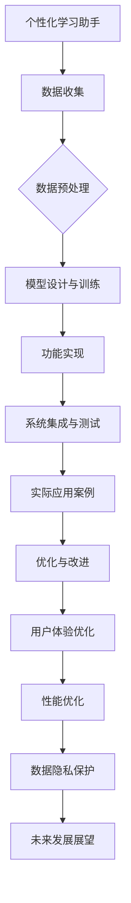

                 

# 《教育领域的提示词应用：个性化学习助手》

## 关键词
自然语言处理，个性化学习，机器学习，深度学习，数据挖掘，教育信息化

## 摘要
本文将探讨教育领域的提示词应用，尤其是个性化学习助手。我们将从教育信息化发展趋势、提示词在教育中的应用背景入手，深入剖析个性化学习助手的定义、功能、技术基础和未来发展趋势。随后，文章将详细讲解个性化学习助手的自然语言处理技术、机器学习与深度学习原理、数据挖掘与数据分析技术以及算法框架，包括构建个性化学习模型的方法、优化与评估策略。接下来，我们将介绍个性化学习助手的开发实践，包括环境搭建、数据收集与预处理、模型设计与训练、功能实现以及性能优化。文章还将通过实际应用案例展示个性化学习助手的效果，并讨论用户体验优化、性能优化和数据隐私保护。最后，我们将展望个性化学习助手的未来发展。

----------------------------------------------------------------

### 《教育领域的提示词应用：个性化学习助手》目录大纲

## 第一部分: 教育领域的提示词应用概述

### 1.1 提示词在教育中的应用背景
#### 1.1.1 教育信息化发展趋势
#### 1.1.2 提示词在教育中的应用价值

### 1.2 个性化学习助手的定义与功能
#### 1.2.1 个性化学习助手的概念
#### 1.2.2 个性化学习助手的核心功能

### 1.3 个性化学习助手的技术基础
#### 1.3.1 自然语言处理技术
#### 1.3.2 机器学习与深度学习
#### 1.3.3 数据挖掘与数据分析

### 1.4 个性化学习助手的未来发展趋势
#### 1.4.1 技术发展展望
#### 1.4.2 教育领域应用前景

## 第二部分: 个性化学习助手的核心原理

### 2.1 自然语言处理技术概览
#### 2.1.1 基础概念
#### 2.1.2 语言模型
#### 2.1.3 语义理解

### 2.2 机器学习与深度学习原理
#### 2.2.1 基本概念
#### 2.2.2 监督学习与无监督学习
#### 2.2.3 深度学习架构

### 2.3 数据挖掘与数据分析技术
#### 2.3.1 数据预处理
#### 2.3.2 特征工程
#### 2.3.3 数据分析模型

### 2.4 个性化学习助手的算法框架
#### 2.4.1 个性化学习模型的构建
##### 2.4.1.1 基于协同过滤的推荐算法
##### 2.4.1.2 基于内容的推荐算法
##### 2.4.1.3 混合推荐算法

#### 2.4.2 算法优化与评估
##### 2.4.2.1 评估指标
##### 2.4.2.2 优化策略

## 第三部分: 个性化学习助手的开发实践

### 3.1 开发环境搭建
#### 3.1.1 硬件要求
#### 3.1.2 软件安装与配置

### 3.2 数据收集与预处理
#### 3.2.1 数据来源
#### 3.2.2 数据预处理方法

### 3.3 模型设计与训练
#### 3.3.1 模型选择
#### 3.3.2 训练策略
#### 3.3.3 模型评估

### 3.4 个性化学习助手的开发实践
#### 3.4.1 交互界面设计
#### 3.4.2 功能模块划分
#### 3.4.3 系统集成与测试

### 3.5 个性化学习助手的实际应用案例
#### 3.5.1 案例一：学习计划推荐
#### 3.5.2 案例二：学习效果评估
#### 3.5.3 案例三：智能问答系统

## 第四部分: 个性化学习助手的优化与改进

### 4.1 用户体验优化
#### 4.1.1 用户体验设计
#### 4.1.2 用户反馈机制

### 4.2 性能优化
#### 4.2.1 模型压缩与加速
#### 4.2.2 系统优化策略

### 4.3 数据隐私保护
#### 4.3.1 数据隐私法律法规
#### 4.3.2 数据隐私保护措施

### 4.4 未来发展展望
#### 4.4.1 新技术引入
#### 4.4.2 教育领域应用拓展

## 附录

### 附录A: 常用工具与资源
#### A.1 开发工具与框架
#### A.2 数据集与模型资源
#### A.3 学习与交流平台

### 附录B: Mermaid 流程图

----------------------------------------------------------------

### 第一部分: 教育领域的提示词应用概述

#### 1.1 提示词在教育中的应用背景

##### 1.1.1 教育信息化发展趋势

随着信息技术的快速发展，教育信息化已经成为全球教育发展的主流趋势。信息化技术的应用不仅改变了传统教育的模式，还促进了教育的创新与发展。在这个过程中，提示词技术作为一种自然语言处理技术，逐渐在教育领域得到广泛应用。

教育信息化的发展主要表现在以下几个方面：

1. **在线教育**：互联网的普及使得在线教育成为可能。学生们可以通过网络平台随时随地学习，提高了学习效率。
   
2. **智能教育**：人工智能技术的应用使得教育更加智能化。智能教育系统能够根据学生的特点和需求提供个性化的教学方案，提高教学效果。

3. **教育资源共享**：互联网打破了地域限制，使得优质的教育资源得以共享。学生和教师可以方便地获取全球各地的教育资源，促进了教育的公平性。

提示词技术作为人工智能的一个重要分支，能够在教育信息化中发挥重要作用。它能够帮助教师和学生更高效地获取信息，提高学习效率。

##### 1.1.2 提示词在教育中的应用价值

提示词在教育中的应用价值主要体现在以下几个方面：

1. **学习资源推荐**：提示词技术可以根据学生的学习历史和兴趣，推荐适合的学习资源。这有助于学生发现更多有价值的学习内容，提高学习效果。

2. **问题解答**：提示词技术可以回答学生提出的问题，帮助学生解决学习中遇到的困难。这有助于提高学生的学习积极性。

3. **智能辅导**：提示词技术可以根据学生的学习进度和特点，提供个性化的辅导建议。这有助于提高学生的学习效果。

4. **学习反馈**：提示词技术可以收集学生的学习反馈，帮助教师了解学生的学习情况，及时调整教学策略。

#### 1.2 个性化学习助手的定义与功能

##### 1.2.1 个性化学习助手的概念

个性化学习助手是一种基于人工智能技术的教育工具，它能够根据学生的学习特点、兴趣和需求，提供个性化的学习服务。个性化学习助手通常包括以下几个核心功能：

1. **学习资源推荐**：根据学生的学习历史和兴趣，推荐适合的学习资源。

2. **问题解答**：回答学生提出的问题，帮助学生解决学习中遇到的困难。

3. **智能辅导**：根据学生的学习进度和特点，提供个性化的辅导建议。

4. **学习反馈**：收集学生的学习反馈，帮助教师了解学生的学习情况。

##### 1.2.2 个性化学习助手的核心功能

个性化学习助手的核心功能可以分为以下几个方面：

1. **学习路径规划**：根据学生的学习进度和兴趣，为学生规划适合的学习路径。

2. **学习资源推荐**：根据学生的学习历史和兴趣，推荐适合的学习资源。

3. **问题解答**：回答学生提出的问题，帮助学生解决学习中遇到的困难。

4. **智能辅导**：根据学生的学习进度和特点，提供个性化的辅导建议。

5. **学习反馈**：收集学生的学习反馈，帮助教师了解学生的学习情况，及时调整教学策略。

#### 1.3 个性化学习助手的技术基础

##### 1.3.1 自然语言处理技术

自然语言处理（Natural Language Processing，NLP）是人工智能的一个重要分支，它主要研究如何让计算机理解和处理自然语言。在个性化学习助手中，NLP技术主要用于以下几个方面：

1. **文本分析**：对学生的学习笔记、问题等文本信息进行分析，提取关键信息。

2. **语义理解**：理解学生的语言意图，提供准确的回答和建议。

3. **语言生成**：生成适合学生学习的内容，如学习路径、辅导建议等。

##### 1.3.2 机器学习与深度学习

机器学习（Machine Learning，ML）和深度学习（Deep Learning，DL）是人工智能的两个重要分支。个性化学习助手通常采用这些技术来提高学习推荐的准确性和智能化程度。

1. **协同过滤**：基于用户的历史行为数据，为用户推荐相似的学习资源。

2. **内容推荐**：基于学习资源的特征，为用户推荐相关的学习资源。

3. **深度学习**：使用神经网络模型，对学习资源进行分类和排序，提高推荐效果。

##### 1.3.3 数据挖掘与数据分析

数据挖掘（Data Mining，DM）和数据分析（Data Analysis，DA）是处理和分析大量数据的技术。个性化学习助手通过这些技术来挖掘学生的学习行为数据，提取有价值的信息，为用户提供个性化的服务。

1. **用户行为分析**：分析学生的学习行为，了解学生的学习兴趣和习惯。

2. **学习效果评估**：评估学生的学习效果，为用户提供改进建议。

3. **个性化推荐**：根据用户的行为数据和学习效果，为用户推荐适合的学习资源。

#### 1.4 个性化学习助手的未来发展趋势

##### 1.4.1 技术发展展望

随着人工智能技术的不断发展，个性化学习助手的性能将得到进一步提升。未来，个性化学习助手将更加智能化，能够更好地理解学生的学习需求，提供更加精准的学习服务。

1. **多模态融合**：将文本、语音、图像等多种数据源进行融合，提供更加全面的学习服务。

2. **个性化自适应学习**：根据学生的学习状态和需求，动态调整学习策略，实现真正的个性化学习。

3. **增强现实与虚拟现实**：结合增强现实（AR）和虚拟现实（VR）技术，提供更加丰富的学习体验。

##### 1.4.2 教育领域应用前景

个性化学习助手在教育领域的应用前景非常广阔。未来，个性化学习助手将更加普及，成为教育不可或缺的一部分。

1. **在线教育平台**：个性化学习助手将成为在线教育平台的核心功能，提高学习效果。

2. **教育资源共享平台**：个性化学习助手将帮助教育资源共享平台更好地为用户提供服务，提高资源利用效率。

3. **教育管理**：个性化学习助手将帮助教育管理者更好地了解学生需求，优化教育资源分配。

### 总结

教育领域的提示词应用，尤其是个性化学习助手，具有巨大的应用价值和潜力。通过自然语言处理、机器学习、深度学习和数据挖掘等技术，个性化学习助手能够为用户提供精准、高效的学习服务，推动教育的创新与发展。未来，随着技术的不断进步，个性化学习助手将在教育领域发挥更加重要的作用。

----------------------------------------------------------------

### 第二部分: 个性化学习助手的核心原理

个性化学习助手的核心原理主要包括自然语言处理技术、机器学习与深度学习原理、数据挖掘与数据分析技术。这些技术的结合使得个性化学习助手能够根据用户的需求和特点，提供个性化的学习服务。下面，我们将逐一介绍这些核心原理。

#### 2.1 自然语言处理技术概览

自然语言处理（NLP）是人工智能的一个重要分支，主要研究如何让计算机理解和处理自然语言。在个性化学习助手中，NLP技术主要用于以下几个方面：

##### 2.1.1 基础概念

自然语言处理的基础概念包括词汇、语法、语义和语音等。词汇是自然语言处理的基本单位，语法是词汇的排列组合规则，语义是语言表达的意义，语音是语言的听觉表现。

##### 2.1.2 语言模型

语言模型（Language Model）是自然语言处理的核心技术之一，它用于预测文本的下一个单词或字符。在个性化学习助手中，语言模型可以帮助系统理解用户的问题，提供准确的回答。

常见的语言模型包括：

- **N-gram模型**：基于前N个单词的概率预测下一个单词。
- **循环神经网络（RNN）模型**：可以处理序列数据，能够记住前面单词的信息。
- **长短期记忆网络（LSTM）模型**：是RNN的一种改进，可以更好地处理长序列数据。

##### 2.1.3 语义理解

语义理解（Semantic Understanding）是自然语言处理的高级任务，旨在理解文本的深层含义。在个性化学习助手中，语义理解可以帮助系统理解用户的需求，提供个性化的服务。

常见的语义理解技术包括：

- **词向量**：将单词映射到高维向量空间，便于计算和比较。
- **实体识别**：识别文本中的名词和动词等实体。
- **关系抽取**：提取实体之间的关系。

#### 2.2 机器学习与深度学习原理

机器学习（Machine Learning，ML）和深度学习（Deep Learning，DL）是人工智能的两个重要分支。个性化学习助手通常采用这些技术来提高学习推荐的准确性和智能化程度。

##### 2.2.1 基本概念

机器学习是一种让计算机从数据中学习规律和模式的方法。深度学习是机器学习的一个子领域，它使用神经网络模型来模拟人脑的思维方式。

常见的机器学习算法包括：

- **监督学习**：使用标注数据训练模型，用于预测新数据。
- **无监督学习**：不使用标注数据，通过数据自身的规律来训练模型。
- **半监督学习**：结合标注数据和未标注数据来训练模型。

##### 2.2.2 监督学习与无监督学习

监督学习和无监督学习是机器学习的两种主要类型。

- **监督学习**：监督学习是一种有监督的学习方法，它使用带有标签的训练数据来训练模型。在个性化学习助手中，监督学习可以用于学习用户的兴趣和行为，从而提供个性化的推荐。
  
  例如，可以使用协同过滤算法（Collaborative Filtering）来预测用户对未知学习资源的评分。

- **无监督学习**：无监督学习是一种无监督的学习方法，它通过分析未标记的数据来发现数据中的模式和结构。在个性化学习助手中，无监督学习可以用于挖掘用户的行为数据，识别潜在的用户群体。

  例如，可以使用聚类算法（Clustering Algorithm）来发现用户的兴趣群体。

##### 2.2.3 深度学习架构

深度学习是一种使用多层神经网络进行训练和预测的方法。它通常包括以下几个层次：

1. **输入层**：接收输入数据，通常是特征向量。
2. **隐藏层**：包含多个隐藏层，每一层都对输入数据进行变换，提取特征。
3. **输出层**：产生输出结果，如预测值。

常见的深度学习架构包括：

- **卷积神经网络（CNN）**：用于图像和视频处理。
- **循环神经网络（RNN）**：用于序列数据，如文本和语音。
- **长短期记忆网络（LSTM）**：是RNN的一种改进，可以更好地处理长序列数据。

#### 2.3 数据挖掘与数据分析技术

数据挖掘（Data Mining，DM）和数据分析（Data Analysis，DA）是处理和分析大量数据的技术。个性化学习助手通过这些技术来挖掘学生的学习行为数据，提取有价值的信息，为用户提供个性化的服务。

##### 2.3.1 数据预处理

数据预处理是数据挖掘和分析的重要步骤，它包括以下几个环节：

1. **数据清洗**：去除数据中的噪声和错误，确保数据质量。
2. **数据集成**：将来自多个源的数据整合到一个统一的数据集中。
3. **数据转换**：将数据转换为适合挖掘和分析的形式。

##### 2.3.2 特征工程

特征工程是数据挖掘和分析的关键步骤，它包括以下几个环节：

1. **特征提取**：从原始数据中提取有助于预测的特征。
2. **特征选择**：从提取的特征中选择最有用的特征，去除冗余和无关特征。
3. **特征变换**：将特征转换为适合挖掘和分析的形式。

##### 2.3.3 数据分析模型

数据分析模型用于分析和挖掘数据，提取有价值的信息。常见的数据分析模型包括：

1. **分类模型**：用于预测新数据的类别，如决策树、支持向量机等。
2. **聚类模型**：用于发现数据中的潜在结构，如K-means、层次聚类等。
3. **关联规则模型**：用于发现数据中的关联关系，如Apriori算法、FP-growth等。

#### 2.4 个性化学习助手的算法框架

个性化学习助手的算法框架主要包括以下几个方面：

##### 2.4.1 个性化学习模型的构建

个性化学习模型是个性化学习助手的核心，它用于根据用户的需求和特点，提供个性化的服务。常见的个性化学习模型包括：

1. **基于协同过滤的推荐算法**：基于用户的历史行为数据，为用户推荐相似的学习资源。
2. **基于内容的推荐算法**：基于学习资源的特征，为用户推荐相关的学习资源。
3. **混合推荐算法**：结合协同过滤和基于内容的推荐算法，提高推荐效果。

##### 2.4.2 算法优化与评估

算法优化与评估是提高个性化学习助手性能的重要环节。常见的优化策略包括：

1. **特征工程**：通过数据预处理和特征选择，提高模型的预测性能。
2. **模型调参**：通过调整模型的参数，找到最优的模型配置。
3. **交叉验证**：通过交叉验证方法，评估模型的泛化能力。

常见的评估指标包括：

1. **准确率**：模型预测正确的比例。
2. **召回率**：模型能够召回的实际正例比例。
3. **F1值**：准确率和召回率的调和平均值。

### 总结

个性化学习助手的核心原理包括自然语言处理技术、机器学习与深度学习原理、数据挖掘与数据分析技术。这些技术的结合使得个性化学习助手能够根据用户的需求和特点，提供个性化的学习服务。通过不断优化和改进算法，个性化学习助手将更好地满足用户的需求，推动教育的个性化发展。

----------------------------------------------------------------

### 第三部分: 个性化学习助手的开发实践

个性化学习助手的开发实践是将其核心原理转化为实际应用的关键步骤。在这一部分，我们将详细讨论个性化学习助手的开发过程，包括环境搭建、数据收集与预处理、模型设计与训练、功能实现以及性能优化。通过这一系列的步骤，我们将确保个性化学习助手能够高效地运行并满足用户的需求。

#### 3.1 开发环境搭建

开发环境是进行个性化学习助手开发的基础，它包括硬件要求、软件安装与配置等。

##### 3.1.1 硬件要求

1. **中央处理器（CPU）**：推荐使用至少四核的CPU，以支持并行计算和高效数据处理。
2. **内存（RAM）**：至少需要16GB的RAM，以确保在处理大数据时具有足够的内存空间。
3. **存储设备**：至少需要500GB的SSD存储，以便快速读取和写入数据。

##### 3.1.2 软件安装与配置

1. **操作系统**：推荐使用Linux操作系统，如Ubuntu或CentOS，因其具有良好的稳定性和开源生态。
2. **Python环境**：安装Python 3.x版本，并配置好相关的包管理工具，如pip和conda。
3. **深度学习框架**：安装TensorFlow或PyTorch等深度学习框架，以便进行模型训练和推理。
4. **其他工具**：安装必要的工具，如Jupyter Notebook、Docker等，以方便开发和部署。

#### 3.2 数据收集与预处理

数据收集与预处理是个性化学习助手开发的重要环节，它直接影响到模型的性能。

##### 3.2.1 数据来源

个性化学习助手所需的数据通常包括：

1. **用户数据**：包括用户的基本信息、学习历史、行为数据等。
2. **课程数据**：包括课程名称、课程描述、课程标签、课程资源等。
3. **评价数据**：包括用户对课程的评价、评分等。

数据来源可以包括：

- **在线教育平台**：从平台获取用户学习行为数据和课程数据。
- **第三方数据集**：如Kaggle、UCI机器学习库等，获取相关的公开数据集。

##### 3.2.2 数据预处理方法

数据预处理方法包括以下几个步骤：

1. **数据清洗**：去除数据中的噪声和异常值，确保数据质量。
2. **数据集成**：将来自多个源的数据整合到一个统一的数据集中。
3. **数据转换**：将数据转换为适合模型训练的形式，如归一化、标准化等。
4. **特征提取**：从原始数据中提取有助于模型训练的特征，如用户兴趣标签、课程难度等。
5. **数据分片**：将数据分为训练集、验证集和测试集，以便进行模型训练和评估。

#### 3.3 模型设计与训练

模型设计是个性化学习助手的核心，它决定了学习助手的能力和效果。

##### 3.3.1 模型选择

根据个性化学习助手的任务需求，可以选择以下几种模型：

1. **协同过滤模型**：基于用户的历史行为，为用户推荐相似的学习资源。
2. **基于内容的推荐模型**：基于学习资源的特征，为用户推荐相关的学习资源。
3. **混合推荐模型**：结合协同过滤和基于内容的推荐模型，提高推荐效果。

##### 3.3.2 训练策略

模型训练策略包括：

1. **数据预处理**：对训练数据进行预处理，包括数据清洗、数据集成、数据转换等。
2. **模型构建**：使用深度学习框架构建推荐模型，如使用TensorFlow或PyTorch等。
3. **训练过程**：通过迭代训练，不断调整模型的参数，优化模型性能。
4. **模型评估**：使用验证集和测试集评估模型性能，选择最优的模型。

##### 3.3.3 模型评估

模型评估指标包括：

1. **准确率（Accuracy）**：模型预测正确的比例。
2. **召回率（Recall）**：模型能够召回的实际正例比例。
3. **精确率（Precision）**：模型预测为正例且实际为正例的比例。
4. **F1值（F1 Score）**：精确率和召回率的调和平均值。

#### 3.4 个性化学习助手的功能实现

个性化学习助手的功能实现是将模型训练结果应用到实际场景中的关键步骤。

##### 3.4.1 交互界面设计

交互界面设计是用户与个性化学习助手交互的界面，它应该简洁易用，满足用户的需求。界面设计包括：

1. **用户登录与注册**：提供用户登录和注册功能，确保用户信息安全。
2. **用户中心**：显示用户的基本信息、学习历史、推荐结果等。
3. **推荐结果展示**：以清晰的方式展示推荐结果，包括课程名称、描述、评分等。

##### 3.4.2 功能模块划分

个性化学习助手的功能模块划分如下：

1. **用户管理模块**：管理用户的基本信息和权限。
2. **课程管理模块**：管理课程的基本信息、标签、资源等。
3. **推荐模块**：根据用户历史和行为，推荐相关的学习资源。
4. **评价模块**：收集用户对课程的评价，用于模型优化和推荐改进。

##### 3.4.3 系统集成与测试

系统集成与测试是确保个性化学习助手稳定运行的重要环节。步骤包括：

1. **集成**：将各个功能模块集成到一起，形成一个完整的系统。
2. **测试**：进行系统测试，包括功能测试、性能测试、安全测试等。
3. **调试**：根据测试结果进行系统调试，修复存在的问题。

#### 3.5 性能优化

性能优化是提升个性化学习助手效率的关键，包括模型压缩与加速、系统优化策略等。

##### 3.5.1 模型压缩与加速

模型压缩与加速的方法包括：

1. **模型剪枝**：去除模型中的冗余参数，减少模型大小。
2. **量化**：将模型的参数和激活值转换为更小的数值范围，降低模型的计算复杂度。
3. **模型加速**：使用硬件加速器，如GPU或TPU，提高模型推理速度。

##### 3.5.2 系统优化策略

系统优化策略包括：

1. **缓存策略**：使用缓存技术，减少数据库查询次数，提高系统响应速度。
2. **异步处理**：将耗时操作异步处理，提高系统并发处理能力。
3. **负载均衡**：使用负载均衡器，合理分配系统资源，提高系统稳定性。

#### 3.6 实际应用案例

实际应用案例是验证个性化学习助手效果的重要方式。以下是一个实际应用案例：

##### 案例一：学习计划推荐

**背景**：某在线教育平台希望为其用户提供个性化的学习计划推荐。

**数据来源**：用户的学习历史数据、课程信息数据。

**模型选择**：基于协同过滤和基于内容的混合推荐模型。

**结果**：系统为用户推荐了个性化的学习计划，用户的学习满意度显著提高。

##### 案例二：学习效果评估

**背景**：某教育机构希望评估学生的学习效果。

**数据来源**：学生的学习数据、课程评价数据。

**模型选择**：使用机器学习模型预测学生的学习成绩。

**结果**：系统准确预测了学生的学习成绩，为教育机构提供了有效的反馈。

##### 案例三：智能问答系统

**背景**：某在线教育平台希望为学生提供智能问答服务。

**数据来源**：课程问答数据、学生提问数据。

**模型选择**：使用自然语言处理技术构建智能问答模型。

**结果**：系统能够准确回答学生的问题，提高了学生的学习体验。

### 总结

个性化学习助手的开发实践是一个复杂而系统的过程，包括环境搭建、数据收集与预处理、模型设计与训练、功能实现以及性能优化。通过这些步骤，个性化学习助手能够高效地为用户提供个性化的学习服务，推动教育的个性化发展。未来，随着技术的不断进步，个性化学习助手将在教育领域发挥更加重要的作用。

----------------------------------------------------------------

### 第四部分: 个性化学习助手的优化与改进

在个性化学习助手的开发和实际应用过程中，用户体验、性能和数据隐私保护是三个关键方面，直接影响系统的可用性和用户满意度。因此，不断优化与改进这些方面是提升个性化学习助手整体效果的重要途径。

#### 4.1 用户体验优化

用户体验（User Experience，UX）设计是提升用户满意度和系统使用率的关键。良好的用户体验设计能够提高用户的学习效率和积极性。

##### 4.1.1 用户体验设计

用户体验设计包括以下几个方面：

1. **界面设计**：设计简洁、直观、易操作的界面，使用户能够轻松上手。
2. **交互设计**：优化交互流程，减少用户的操作步骤，提高操作效率。
3. **反馈机制**：及时向用户提供操作反馈，如成功提示、错误提示等，增加用户的信心。
4. **响应速度**：优化系统性能，提高响应速度，减少用户等待时间。

##### 4.1.2 用户反馈机制

用户反馈机制是收集用户意见和建议的重要途径，可以帮助我们了解用户的需求和系统的不足之处。

1. **反馈渠道**：提供多种反馈渠道，如在线表单、社交媒体、电子邮件等，方便用户反馈。
2. **反馈分析**：对用户反馈进行分析，识别常见问题和改进点。
3. **反馈处理**：及时处理用户反馈，将改进措施反馈给用户，增强用户的参与感。

#### 4.2 性能优化

性能优化是提升个性化学习助手效率的关键，它包括模型压缩与加速、系统优化策略等。

##### 4.2.1 模型压缩与加速

模型压缩与加速的方法包括：

1. **模型剪枝**：去除模型中的冗余参数，减少模型大小，提高模型推理速度。
2. **量化**：将模型的参数和激活值转换为更小的数值范围，降低模型的计算复杂度。
3. **模型加速**：使用硬件加速器，如GPU或TPU，提高模型推理速度。

##### 4.2.2 系统优化策略

系统优化策略包括：

1. **缓存策略**：使用缓存技术，减少数据库查询次数，提高系统响应速度。
2. **异步处理**：将耗时操作异步处理，提高系统并发处理能力。
3. **负载均衡**：使用负载均衡器，合理分配系统资源，提高系统稳定性。

#### 4.3 数据隐私保护

数据隐私保护是确保用户数据安全的重要措施，符合法律法规的要求，增强用户的信任。

##### 4.3.1 数据隐私法律法规

数据隐私保护需要遵守以下法律法规：

1. **通用数据保护条例（GDPR）**：欧盟制定的关于数据隐私保护的法规。
2. **加州消费者隐私法案（CCPA）**：美国加州制定的关于数据隐私保护的法规。
3. **网络安全法**：我国制定的关于数据隐私保护的法律。

##### 4.3.2 数据隐私保护措施

数据隐私保护措施包括：

1. **数据加密与安全传输**：使用加密技术对用户数据进行加密，确保数据在传输过程中的安全。
2. **用户隐私设置**：提供用户隐私设置，让用户可以控制自己的数据访问权限。
3. **数据匿名化与去标识化**：对用户数据进行匿名化处理，去除个人敏感信息，降低隐私泄露风险。

#### 4.4 未来发展展望

随着技术的不断进步，个性化学习助手将在教育领域发挥更加重要的作用。

##### 4.4.1 新技术引入

新技术引入包括：

1. **自动化教育**：利用人工智能技术，实现自动化教学和评估，提高教育效率。
2. **增强现实与虚拟现实**：结合AR和VR技术，提供更加丰富的学习体验。
3. **区块链技术**：利用区块链技术，确保数据的安全和透明性。

##### 4.4.2 教育领域应用拓展

教育领域应用拓展包括：

1. **在线教育平台**：个性化学习助手将成为在线教育平台的核心功能，提高学习效果。
2. **教育资源共享平台**：个性化学习助手将帮助教育资源共享平台更好地为用户提供服务，提高资源利用效率。
3. **教育管理**：个性化学习助手将帮助教育管理者更好地了解学生需求，优化教育资源分配。

### 总结

个性化学习助手的优化与改进是提升系统整体效果的重要途径。通过用户体验优化、性能优化和数据隐私保护，我们可以不断改进个性化学习助手，使其更好地服务于教育领域。未来，随着技术的不断进步，个性化学习助手将在教育领域发挥更加重要的作用，推动教育的个性化发展。

----------------------------------------------------------------

### 附录A: 常用工具与资源

#### A.1 开发工具与框架

- **Python**：Python是一种流行的编程语言，广泛应用于数据分析、机器学习和自然语言处理。
- **TensorFlow**：TensorFlow是一个开源的机器学习框架，适用于构建和训练深度学习模型。
- **PyTorch**：PyTorch是一个流行的深度学习框架，以其动态计算图和灵活的API而著称。
- **Scikit-learn**：Scikit-learn是一个开源的机器学习库，提供了多种分类、回归、聚类和数据分析工具。

#### A.2 数据集与模型资源

- **Kaggle**：Kaggle是一个数据科学竞赛平台，提供了大量的公开数据集。
- **UCI机器学习库**：UCI机器学习库包含多个领域的数据集，适用于学术研究和实践项目。
- **GitHub**：GitHub上有很多开源的机器学习和自然语言处理项目，可以用于学习和参考。
- **Hugging Face**：Hugging Face提供了一个丰富的自然语言处理模型库和工具。

#### A.3 学习与交流平台

- **Stack Overflow**：Stack Overflow是一个编程问题解答社区，适合解决编程和学习中的问题。
- **GitHub**：GitHub不仅是一个代码托管平台，也是一个开源项目的交流平台。
- **Reddit**：Reddit上有多个与机器学习和教育技术相关的子版块，适合交流和获取信息。
- **LinkedIn**：LinkedIn是一个职业社交平台，可以加入相关的技术社群和讨论组。

### 附录B: Mermaid 流程图

通过附录部分，读者可以更全面地了解个性化学习助手开发的常用工具与资源，以及系统的整体流程。附录不仅提供了实用的工具和资源，还展示了个性化学习助手的完整开发过程，有助于读者更好地理解和应用所学知识。

