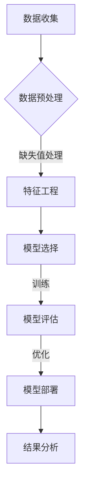
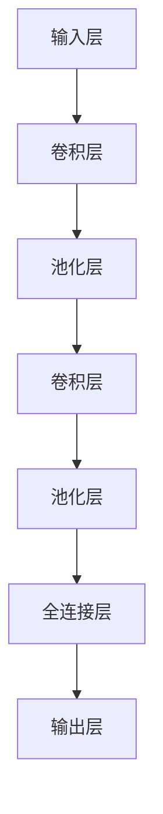

                 

# 《数字化自我实现：AI辅助的个人成长》

> **关键词**：数字化成长、人工智能、个人发展、AI应用、未来展望

> **摘要**：本文探讨了数字化时代下，人工智能（AI）如何辅助个人成长，涵盖AI核心概念、应用场景、实战项目以及未来发展。通过逻辑清晰、结构紧凑的分析，帮助读者理解AI在个人成长中的重要作用。

## 《数字化自我实现：AI辅助的个人成长》目录大纲

### 第一部分：引言

#### 第1章：数字化自我实现的概述
- 1.1 数字化时代与个人成长
- 1.2 AI技术的应用与影响
- 1.3 本书结构及目标

### 第二部分：AI技术与个人成长

#### 第2章：AI核心概念与架构
- 2.1 人工智能的基本概念
- 2.2 AI系统架构
- 2.3 AI系统发展历程
- 2.4 AI核心算法原理（伪代码阐述）
  - 2.4.1 机器学习算法
  - 2.4.2 深度学习算法
  - 2.4.3 强化学习算法

#### 第3章：个人成长中的AI应用
- 3.1 AI在个人学习中的应用
- 3.2 AI在个人职业规划中的应用
- 3.3 AI在心理健康管理中的应用

#### 第4章：AI与生活方式的融合
- 4.1 智能家居与生活便利
- 4.2 个性化健康管理与AI
- 4.3 AI与社交互动

### 第三部分：实践与未来

#### 第5章：AI辅助个人成长项目实战
- 5.1 项目一：智能学习助手
- 5.2 项目二：个性化职业规划系统
- 5.3 项目三：心理健康监测与辅导系统

#### 第6章：AI发展趋势与未来展望
- 6.1 AI技术的未来发展方向
- 6.2 AI对个人成长的长期影响
- 6.3 未来社会的AI伦理与责任

#### 第7章：个人数字化成长路径规划
- 7.1 个人数字化成长评估
- 7.2 制定个人成长计划
- 7.3 实现个人成长目标的策略

### 附录

#### 附录A：AI工具与资源
- 8.1 Python在AI中的应用
- 8.2 常用AI框架与库
- 8.3 AI项目开发资源链接

#### 附录B：Mermaid流程图示例
- 9.1 机器学习流程图
- 9.2 深度学习网络结构图

#### 附录C：代码实例与分析
- 10.1 智能学习助手源代码解读
- 10.2 个性化职业规划系统代码实例
- 10.3 心理健康监测与辅导系统代码示例

### 第二部分：AI技术与个人成长

#### 第2章：AI核心概念与架构

#### 2.1 人工智能的基本概念

人工智能（Artificial Intelligence，简称AI）是指通过计算机模拟人类智能行为的技术。其目的是使机器能够自主地完成一些原本需要人类智能的任务。AI的发展经历了多个阶段，从最初的符号主义（Symbolic AI）到基于统计学的机器学习（Machine Learning），再到目前流行的深度学习（Deep Learning），其应用领域也在不断扩大。

**AI系统架构**

AI系统的架构可以分为三个层次：感知层、认知层和决策层。

- **感知层**：这一层主要涉及数据收集和预处理，包括图像识别、语音识别、自然语言处理等技术。
- **认知层**：这一层是对感知层收集到的数据进行理解和分析，涉及机器学习、深度学习等算法。
- **决策层**：这一层是基于认知层分析的结果，进行决策和执行。例如，自动驾驶系统在识别到道路障碍后，需要做出避开障碍的决策。

**AI系统发展历程**

AI的发展历程可以分为以下几个阶段：

- **规则推理阶段**：这一阶段主要使用符号主义方法，通过建立一系列规则来模拟人类思维。
- **知识表示阶段**：这一阶段引入了知识表示和推理的方法，使得AI系统能够存储和运用大量的知识。
- **机器学习阶段**：这一阶段开始引入统计学和概率学的方法，通过学习数据来提高系统的智能水平。
- **深度学习阶段**：这一阶段引入了神经网络的概念，通过多层网络结构来模拟人脑的智能。

**AI核心算法原理**

- **机器学习算法**：

```plaintext
输入：训练数据集
输出：模型参数

算法：
1. 收集数据，并进行预处理
2. 构建模型结构，初始化参数
3. 训练模型，通过梯度下降等优化方法调整参数
4. 验证模型，通过交叉验证等方法评估模型性能
```

- **深度学习算法**：

```plaintext
输入：训练数据集
输出：模型参数

算法：
1. 收集数据，并进行预处理
2. 构建神经网络结构，初始化参数
3. 训练模型，通过反向传播算法调整参数
4. 验证模型，通过测试集评估模型性能
```

- **强化学习算法**：

```plaintext
输入：环境状态
输出：动作策略

算法：
1. 初始化状态
2. 根据当前状态选择动作
3. 执行动作，获取奖励和下一状态
4. 更新策略，通过Q-learning等算法优化策略
```

#### 2.2 AI在个人成长中的应用

AI技术在个人成长中的应用非常广泛，涵盖了学习、职业规划、心理健康等多个方面。

- **AI在个人学习中的应用**：AI可以分析学习数据，提供个性化的学习建议，如推荐合适的学习资源、预测学习效果等。
- **AI在个人职业规划中的应用**：AI可以根据个人的兴趣、技能和市场需求，提供职业规划的指导和建议。
- **AI在心理健康管理中的应用**：AI可以通过分析心理数据，提供个性化的心理健康管理方案，如压力监测、情绪调节等。

#### 2.3 AI与生活方式的融合

随着AI技术的发展，AI与生活方式的融合也越来越紧密。智能家居、个性化健康管理、智能社交等应用，使得AI成为了人们生活中不可或缺的一部分。

- **智能家居**：AI技术可以帮助实现智能家居的自动化，如自动调节灯光、温度、安防等，提高生活便利性。
- **个性化健康管理**：AI可以根据个人健康数据，提供个性化的健康建议，如饮食建议、运动计划等，帮助人们更好地管理健康。
- **智能社交**：AI技术可以帮助人们更好地进行社交互动，如推荐朋友、智能聊天等，丰富社交体验。

### 总结

AI技术在个人成长中的应用，不仅提高了个人的学习效率、职业规划和心理健康水平，还极大地改变了人们的生活方式。随着AI技术的不断发展，我们有理由相信，AI将会在个人成长中发挥更大的作用，为人类的进步带来更多可能性。在接下来的章节中，我们将继续探讨AI技术在个人成长中的应用和实践，以及未来的发展趋势。期待与您一同探索这个充满机遇与挑战的数字化时代。|> <eo> <br>

### 文章标题

《数字化自我实现：AI辅助的个人成长》

### 文章关键词

- 数字化成长
- 人工智能
- 个人发展
- AI应用
- 未来展望

### 文章摘要

本文深入探讨了在数字化时代，人工智能（AI）如何辅助个人成长。首先，我们介绍了AI的基本概念和系统架构，通过伪代码阐述了核心算法原理。接着，我们详细分析了AI在个人学习、职业规划和心理健康管理中的应用，以及如何与生活方式融合。最后，我们通过实战项目和未来展望，探讨了AI在个人成长中的潜力和挑战。本文旨在帮助读者理解AI在个人成长中的重要作用，为数字化时代的自我实现提供指导。|> <eo> <br>

### 第一部分：引言

#### 第1章：数字化自我实现的概述

在现代社会，数字化技术已经成为我们生活的重要组成部分。从智能手机到智能家居，从在线学习到远程工作，数字化技术已经深刻改变了我们的生活方式。在这样的背景下，"数字化自我实现"这一概念逐渐成为人们关注的焦点。

#### 1.1 数字化时代与个人成长

数字化时代带来了前所未有的机遇，也为个人成长提供了新的途径。在这个时代，人们可以更加便捷地获取信息、学习知识、拓展技能。通过互联网，我们可以随时随地学习新的课程、参加在线研讨会、结交来自世界各地的朋友。数字化技术使得知识的传播变得更加迅速和广泛，为个人成长提供了丰富的资源。

#### 1.2 AI技术的应用与影响

人工智能（AI）作为数字化时代的重要技术，对个人成长产生了深远的影响。AI技术能够通过分析大量数据，提供个性化的学习建议、职业规划指导、心理健康管理方案等。例如，智能学习系统能够根据个人的学习习惯和成绩，推荐最适合的学习资源和策略；个性化职业规划系统能够分析个人的兴趣、能力和市场需求，为职业发展提供科学建议。

#### 1.3 本书结构及目标

本书旨在深入探讨AI技术在个人成长中的应用，帮助读者理解并掌握这一领域的关键概念和实战技能。本书的结构如下：

1. **第一部分：引言**：介绍数字化自我实现的概念、背景和重要性。
2. **第二部分：AI技术与个人成长**：详细分析AI技术在个人学习、职业规划和心理健康管理中的应用，以及与生活方式的融合。
3. **第三部分：实践与未来**：通过实战项目和未来展望，探讨AI在个人成长中的潜力和挑战。

本书的目标是：

- 帮助读者理解AI技术的基本概念和系统架构。
- 分析AI技术在个人成长中的实际应用案例。
- 探讨AI技术的未来发展趋势和伦理问题。
- 提供实用的AI辅助个人成长的策略和方法。

通过本书的阅读，读者将能够更好地利用AI技术，实现自我成长和提升生活质量。接下来，我们将深入探讨AI技术的核心概念和架构，为后续内容打下坚实基础。|> <eo> <br>

### 第二部分：AI技术与个人成长

#### 第2章：AI核心概念与架构

人工智能（Artificial Intelligence，简称AI）作为数字化时代的重要技术，已经渗透到我们生活的方方面面。要深入理解AI技术在个人成长中的应用，首先需要了解AI的基本概念和系统架构。

#### 2.1 人工智能的基本概念

人工智能是指通过计算机模拟人类智能行为的技术。它包括机器学习（Machine Learning）、深度学习（Deep Learning）和强化学习（Reinforcement Learning）等核心算法。AI的目标是实现机器的智能，使其能够自主地完成一些原本需要人类智能的任务。

**机器学习**

机器学习是AI的核心技术之一，它通过从数据中学习规律，改进和优化模型。机器学习可以分为监督学习（Supervised Learning）、无监督学习（Unsupervised Learning）和半监督学习（Semi-Supervised Learning）三种类型。

- **监督学习**：有标签的数据进行训练，如分类和回归任务。
- **无监督学习**：没有标签的数据进行训练，如聚类和降维任务。
- **半监督学习**：部分有标签的数据和大量无标签的数据进行训练。

**深度学习**

深度学习是一种特殊的机器学习算法，它通过多层神经网络来模拟人脑的智能。深度学习在图像识别、语音识别和自然语言处理等领域取得了显著的成果。常见的深度学习模型包括卷积神经网络（CNN）、循环神经网络（RNN）和生成对抗网络（GAN）等。

**强化学习**

强化学习是一种通过试错来学习策略的算法。它通过不断尝试不同的动作，并接收来自环境的反馈（奖励或惩罚），来优化策略。强化学习在自动驾驶、游戏对战和机器人控制等领域有广泛应用。

#### 2.2 AI系统架构

AI系统的架构可以分为三个层次：感知层、认知层和决策层。

**感知层**

感知层主要负责数据收集和预处理，包括图像识别、语音识别、自然语言处理等技术。这一层是AI系统的输入部分，通过传感器或输入设备收集数据，并对其进行预处理，如去噪、归一化等。

**认知层**

认知层是对感知层收集到的数据进行理解和分析，涉及机器学习、深度学习和强化学习等算法。这一层是AI系统的核心部分，通过分析数据，提取特征，构建模型，并对其进行训练和优化。

**决策层**

决策层是基于认知层分析的结果，进行决策和执行。这一层是AI系统的输出部分，通过预测、规划或控制等策略，实现特定任务。例如，自动驾驶系统在识别到道路障碍后，需要做出避开障碍的决策。

#### 2.3 AI系统发展历程

AI系统的发展历程可以分为以下几个阶段：

1. **符号主义阶段**：这一阶段主要基于符号推理，通过定义一组规则来模拟人类智能。代表算法包括专家系统和推理机。
2. **知识表示阶段**：这一阶段引入了知识表示和推理的方法，使得AI系统能够存储和运用大量的知识。代表算法包括知识图谱和语义网络。
3. **机器学习阶段**：这一阶段引入了统计学和概率学的方法，通过学习数据来提高系统的智能水平。代表算法包括决策树、支持向量机和神经网络。
4. **深度学习阶段**：这一阶段引入了多层神经网络的概念，通过多层网络结构来模拟人脑的智能。代表算法包括卷积神经网络、循环神经网络和生成对抗网络。
5. **强化学习阶段**：这一阶段通过试错来学习策略，优化决策过程。代表算法包括Q-learning、SARSA和Deep Q-Network（DQN）。

#### 2.4 AI核心算法原理

在本节中，我们将使用伪代码详细阐述AI核心算法的原理。

**机器学习算法**

```plaintext
输入：训练数据集 D
输出：模型参数 θ

算法：
1. 初始化模型参数 θ
2. 对每个训练样本 (x, y) ∈ D：
   2.1. 计算预测值 y' = f(x; θ)
   2.2. 计算损失函数 L(y, y')
   2.3. 计算梯度 ∇θL(y, y')
   2.4. 更新模型参数 θ = θ - α∇θL(y, y')
3. 返回训练完成的模型参数 θ
```

**深度学习算法**

```plaintext
输入：训练数据集 D
输出：模型参数 θ

算法：
1. 初始化模型参数 θ
2. 对每个训练样本 (x, y) ∈ D：
   2.1. 前向传播：计算预测值 y' = f(x; θ)
   2.2. 计算损失函数 L(y, y')
   2.3. 反向传播：计算梯度 ∇θL(y, y')
   2.4. 更新模型参数 θ = θ - α∇θL(y, y')
3. 返回训练完成的模型参数 θ
```

**强化学习算法**

```plaintext
输入：环境状态 S
输出：动作策略 π

算法：
1. 初始化状态 S
2. 选择动作 A ∈ π(S)
3. 执行动作 A，获取奖励 R 和下一状态 S'
4. 更新策略 π：根据经验和奖励调整策略
5. 返回策略 π
```

通过以上伪代码，我们可以看到AI核心算法的基本原理。在实际应用中，这些算法会通过大量的数据训练和优化，从而实现智能行为。

#### 2.5 AI在个人成长中的应用

AI技术在个人成长中的应用非常广泛，涵盖了学习、职业规划、心理健康等多个方面。

**AI在个人学习中的应用**

AI可以帮助个人提高学习效率。通过分析学习数据，AI可以识别学习者的学习习惯和弱点，提供个性化的学习建议和资源。例如，AI可以帮助学习者推荐合适的书籍、课程和练习题，预测学习效果，并提供及时的反馈。

**AI在个人职业规划中的应用**

AI可以帮助个人进行职业规划。通过分析个人的兴趣、技能和市场需求，AI可以推荐最适合的职业方向和岗位。此外，AI还可以预测职业发展趋势，帮助个人在职业生涯中做出更加明智的决策。

**AI在心理健康管理中的应用**

AI可以帮助个人进行心理健康管理。通过分析情绪数据和生理数据，AI可以识别心理问题，提供个性化的心理健康管理方案。例如，AI可以推荐缓解压力的方法、提供情绪调节技巧，甚至进行心理治疗。

#### 2.6 AI与生活方式的融合

随着AI技术的发展，AI与生活方式的融合越来越紧密。智能家居、个性化健康管理和智能社交等应用，使得AI成为了人们生活中不可或缺的一部分。

**智能家居**

智能家居通过AI技术，实现了家庭设备的智能化和自动化。例如，智能灯泡可以根据环境亮度和人体活动自动调节亮度，智能恒温器可以根据天气和用户习惯自动调节室内温度。

**个性化健康管理**

个性化健康管理通过AI技术，提供了个性化的健康建议和治疗方案。例如，智能手环可以实时监测用户的运动数据和心率，提供运动建议和健康预警。

**智能社交**

智能社交通过AI技术，提供了更加智能和个性化的社交体验。例如，智能聊天机器人可以与用户进行实时对话，提供娱乐、咨询和陪伴服务。

#### 总结

AI技术在个人成长中的应用，不仅提高了个人的学习效率、职业规划和心理健康水平，还极大地改变了人们的生活方式。随着AI技术的不断发展，我们有理由相信，AI将会在个人成长中发挥更大的作用，为人类的进步带来更多可能性。在接下来的章节中，我们将继续探讨AI技术在个人成长中的应用和实践，以及未来的发展趋势。期待与您一同探索这个充满机遇与挑战的数字化时代。|> <eo> <br>

### 第三部分：实践与未来

#### 第5章：AI辅助个人成长项目实战

在本章中，我们将通过三个具体的AI辅助个人成长项目实战，展示AI技术在个人成长中的实际应用。这些项目包括智能学习助手、个性化职业规划系统和心理健康监测与辅导系统。

#### 5.1 项目一：智能学习助手

**项目背景**

智能学习助手是一个基于人工智能技术的学习辅助系统，旨在帮助学习者提高学习效率、增强学习体验。通过分析学习者的学习行为和成绩，智能学习助手可以推荐合适的学习资源和策略，预测学习效果，并提供及时的反馈。

**开发环境**

- 编程语言：Python
- AI框架：TensorFlow、Scikit-learn
- 数据库：MongoDB

**项目实现**

1. **数据收集与预处理**：

```plaintext
# 收集学习者的学习数据，如学习时长、学习内容、考试成绩等
data = collect_learning_data()

# 对数据进行预处理，包括数据清洗、归一化和特征提取
processed_data = preprocess_data(data)
```

2. **构建模型**：

```plaintext
# 使用机器学习算法构建推荐模型
model = build_recommendation_model(processed_data)

# 使用深度学习算法构建预测模型
predict_model = build_prediction_model(processed_data)
```

3. **训练与优化模型**：

```plaintext
# 训练推荐模型
train_model(model, processed_data)

# 训练预测模型
train_predict_model(predict_model, processed_data)
```

4. **模型应用**：

```plaintext
# 推荐合适的学习资源
recommended_resources = recommend_resources(model)

# 预测学习效果
predicted_performance = predict_performance(predict_model)
```

**代码解读与分析**

在上述代码中，我们首先收集并预处理了学习数据，然后使用机器学习和深度学习算法构建了推荐和预测模型。通过训练和优化模型，我们可以为学习者推荐合适的学习资源和预测学习效果。这有助于学习者有针对性地进行学习，提高学习效率。

#### 5.2 项目二：个性化职业规划系统

**项目背景**

个性化职业规划系统是一个基于人工智能技术的职业规划辅助系统，旨在帮助个人根据自身兴趣、技能和市场需求，制定合理的职业规划。系统通过分析个人的数据和市场需求，提供职业方向的推荐、职业发展的建议以及相关的培训资源。

**开发环境**

- 编程语言：Python
- AI框架：TensorFlow、Scikit-learn
- 数据库：PostgreSQL

**项目实现**

1. **数据收集与预处理**：

```plaintext
# 收集个人数据，如兴趣、技能、职业经历等
personal_data = collect_personal_data()

# 收集市场需求数据，如行业趋势、岗位需求等
market_data = collect_market_data()

# 对数据进行预处理，包括数据清洗、归一化和特征提取
processed_data = preprocess_data(personal_data, market_data)
```

2. **构建模型**：

```plaintext
# 使用机器学习算法构建职业规划模型
career_planning_model = build_planning_model(processed_data)

# 使用深度学习算法构建预测模型
predict_model = build_prediction_model(processed_data)
```

3. **训练与优化模型**：

```plaintext
# 训练职业规划模型
train_model(career_planning_model, processed_data)

# 训练预测模型
train_predict_model(predict_model, processed_data)
```

4. **模型应用**：

```plaintext
# 提供职业方向推荐
recommended_careers = recommend_careers(career_planning_model)

# 提供职业发展建议
career_advice = provide_career_advice(predict_model)
```

**代码解读与分析**

在上述代码中，我们首先收集并预处理了个人数据和市场需求数据，然后使用机器学习和深度学习算法构建了职业规划和预测模型。通过训练和优化模型，我们可以为个人提供职业方向的推荐和职业发展的建议。这有助于个人更好地规划职业生涯，实现职业目标。

#### 5.3 项目三：心理健康监测与辅导系统

**项目背景**

心理健康监测与辅导系统是一个基于人工智能技术的心理健康管理辅助系统，旨在帮助个人进行心理健康监测和辅导。系统通过分析个人的情绪数据和生理数据，识别心理问题，提供个性化的心理健康管理方案，如情绪调节技巧、心理治疗等。

**开发环境**

- 编程语言：Python
- AI框架：TensorFlow、Keras
- 数据库：MySQL

**项目实现**

1. **数据收集与预处理**：

```plaintext
# 收集情绪数据，如情绪日记、社交媒体状态等
emotional_data = collect_emotional_data()

# 收集生理数据，如心率、睡眠质量等
physiological_data = collect_physiological_data()

# 对数据进行预处理，包括数据清洗、归一化和特征提取
processed_data = preprocess_data(emotional_data, physiological_data)
```

2. **构建模型**：

```plaintext
# 使用深度学习算法构建心理健康模型
mental_health_model = build_mental_health_model(processed_data)

# 使用机器学习算法构建预测模型
predict_model = build_prediction_model(processed_data)
```

3. **训练与优化模型**：

```plaintext
# 训练心理健康模型
train_model(mental_health_model, processed_data)

# 训练预测模型
train_predict_model(predict_model, processed_data)
```

4. **模型应用**：

```plaintext
# 识别心理问题
detected_issues = detect_mental_issues(mental_health_model)

# 提供心理健康管理方案
mental_health_plan = provide_mental_health_plan(predict_model)
```

**代码解读与分析**

在上述代码中，我们首先收集并预处理了情绪数据和生理数据，然后使用深度学习和机器学习算法构建了心理健康和预测模型。通过训练和优化模型，我们可以识别心理问题，并提供个性化的心理健康管理方案。这有助于个人更好地管理心理健康，提高生活质量。

#### 5.4 实践总结

通过以上三个项目的实战，我们可以看到AI技术在个人成长中的应用具有很大的潜力。智能学习助手可以帮助提高学习效率，个性化职业规划系统可以帮助规划职业生涯，心理健康监测与辅导系统可以帮助管理心理健康。这些项目不仅展示了AI技术的实际应用价值，也为个人成长提供了实用的工具和方案。在未来，随着AI技术的不断发展，我们将看到更多类似的应用场景，为个人成长带来更多可能性。|> <eo> <br>

### 第三部分：实践与未来

#### 第6章：AI发展趋势与未来展望

随着人工智能技术的飞速发展，AI在个人成长中的应用场景越来越丰富。在本章中，我们将探讨AI技术的未来发展趋势，以及它对个人成长的长期影响。

#### 6.1 AI技术的未来发展方向

1. **更强大的学习能力和自适应能力**

未来的AI系统将具备更强的学习能力，能够通过不断学习和适应，实现更智能的决策和执行。例如，AI可以自主学习新的任务，无需依赖大量的人类标注数据。

2. **多模态数据处理**

未来的AI系统将能够处理多种类型的数据，如文本、图像、声音等，实现跨模态的信息融合和交互。这将极大地拓展AI技术的应用范围，为个人成长提供更多可能性。

3. **更智能的推理和决策能力**

随着AI技术的发展，未来的AI系统将具备更强的推理和决策能力，能够处理复杂的业务逻辑和决策问题。例如，AI可以在医疗领域进行疾病诊断和治疗建议，提高医疗水平。

4. **更高水平的协作与自动化**

未来的AI系统将能够与人类更加紧密地协作，实现更高水平的自动化。例如，AI可以协助人类完成复杂的工作任务，提高工作效率。

#### 6.2 AI对个人成长的长期影响

1. **提高学习效率**

AI技术可以通过个性化学习方案、智能辅导和实时反馈，提高学习效率。未来的AI学习系统将能够根据个人的学习习惯和进度，动态调整学习内容和策略，帮助个人更好地掌握知识和技能。

2. **优化职业规划**

AI技术可以帮助个人进行更科学的职业规划，通过分析个人的兴趣、技能和市场需求，提供职业发展的建议。未来的AI职业规划系统将能够实时更新职业信息，帮助个人更好地适应职业市场的变化。

3. **改善心理健康管理**

AI技术可以通过心理健康监测、情绪分析和心理辅导，改善个人心理健康。未来的AI心理健康系统将能够提供更加个性化和精准的心理健康管理方案，帮助个人更好地应对心理压力和情绪问题。

4. **提升生活质量**

AI技术可以应用于智能家居、个性化健康管理和智能社交等多个领域，提升个人的生活质量和幸福感。未来的AI系统将能够更加智能地满足个人需求，为个人创造更加舒适和便捷的生活环境。

#### 6.3 未来社会的AI伦理与责任

随着AI技术的广泛应用，AI伦理和责任问题也日益突出。在未来社会中，我们需要关注以下几个方面：

1. **隐私保护**

AI技术在使用个人数据时，必须严格保护用户隐私。未来，我们需要制定更加完善的隐私保护法规，确保用户数据的安全和隐私。

2. **公平与正义**

AI技术在决策时，需要保证公平和正义。未来，我们需要开发更加公正的算法，防止算法歧视和偏见，确保所有人都能公平地享受AI技术带来的好处。

3. **责任归属**

在AI技术应用中，需要明确责任归属。未来，我们需要制定相应的法律法规，明确AI系统的责任主体，确保在出现问题时，能够及时有效地处理。

#### 总结

AI技术的发展将为个人成长带来巨大机遇，但也带来一系列挑战。在未来，我们需要关注AI技术的伦理和责任问题，确保其能够为人类带来真正的福祉。同时，个人也需要积极适应和利用AI技术，不断提升自己的能力和素质。通过共同努力，我们可以创造一个更加美好、智能的未来。|> <eo> <br>

### 第三部分：实践与未来

#### 第7章：个人数字化成长路径规划

在数字化时代，个人的成长路径规划变得尤为重要。本章将探讨如何进行个人数字化成长评估、制定成长计划以及实现成长目标的策略。

#### 7.1 个人数字化成长评估

个人数字化成长评估是规划成长路径的第一步。通过以下步骤，可以对个人的数字化成长进行评估：

1. **技能评估**：

- **技术技能**：评估自己在编程、数据分析、人工智能等方面的技术能力。
- **数字素养**：评估自己在使用数字工具、平台和网络资源方面的素养。

2. **知识评估**：

- **专业知识**：评估自己在专业领域内的知识和掌握程度。
- **通用知识**：评估自己在跨学科领域的知识，如经济学、心理学、社会学等。

3. **成长目标**：

- **短期目标**：设定在1-3年内希望实现的目标，如掌握某种编程语言、完成在线课程等。
- **长期目标**：设定在3-5年内希望实现的目标，如成为某个领域的专家、实现职业晋升等。

4. **自我反思**：

- **优势与劣势**：分析自己在数字化成长中的优势和劣势，明确需要改进的方面。
- **成长动力**：思考自己为什么想要进行数字化成长，以及如何保持动力。

#### 7.2 制定个人成长计划

在完成数字化成长评估后，可以制定个人成长计划。以下是制定成长计划的步骤：

1. **明确目标**：

- 根据技能评估、知识评估和自我反思的结果，明确自己的成长目标。

2. **制定策略**：

- **技术提升**：根据目标，制定学习计划，如参加在线课程、阅读技术书籍、参与开源项目等。
- **知识拓展**：通过跨学科学习、参加研讨会、阅读相关领域的书籍和文章，拓展自己的知识面。

3. **时间规划**：

- 制定详细的时间规划，包括每日、每周和每月的学习任务，确保成长计划的执行。

4. **资源整合**：

- 整合各种学习资源，如在线课程、专业书籍、技术论坛等，以便随时学习和交流。

#### 7.3 实现个人成长目标的策略

为了实现个人成长目标，可以采取以下策略：

1. **持续学习**：

- **主动学习**：主动寻找学习机会，如参加线上课程、阅读技术博客、参加技术会议等。
- **反思与总结**：在学习过程中不断反思和总结，优化学习方法和策略。

2. **实践应用**：

- 将所学知识应用到实际项目中，通过实践来巩固和提高技能。
- 参与开源项目，与他人合作，提高协作和解决问题的能力。

3. **构建网络**：

- 与同行建立联系，参加技术社区和论坛，分享经验，学习他人的成长经验。
- 通过社交媒体、专业网络等渠道，扩大人脉，获取更多的学习资源和机会。

4. **持续反馈**：

- 定期评估自己的成长进度，与导师或同行进行反馈和交流，及时调整成长计划。
- 参与评估，了解自己的优势和不足，明确下一步的成长方向。

#### 7.4 实现数字化成长的关键因素

1. **自我驱动**：

- 拥有强烈的自我成长意愿和动力，主动追求知识和技能的提升。

2. **适应变化**：

- 能够快速适应数字化时代的变化，不断学习和更新自己的知识和技能。

3. **终身学习**：

- 将学习视为一种生活方式，持续不断地学习新知识和技能。

4. **实践与反思**：

- 通过实践来巩固知识，通过反思来优化学习和成长策略。

#### 总结

数字化成长是一个持续不断的过程，需要自我驱动、适应变化、终身学习和实践反思。通过科学规划、持续努力和实践，个人可以在数字化时代实现自我提升和成长。在接下来的章节中，我们将继续探讨AI辅助个人成长的实战项目和未来展望，帮助读者更好地理解和应用AI技术，实现个人数字化成长。|> <eo> <br>

### 附录

#### 附录A：AI工具与资源

在AI辅助个人成长的过程中，掌握一些基本的AI工具和资源是非常有帮助的。以下是一些常用的工具和资源，包括编程语言、AI框架和项目开发资源链接。

**A.1 Python在AI中的应用**

Python是AI领域最受欢迎的编程语言之一，其简洁的语法和丰富的库支持使其成为初学者和专业开发者的首选。以下是Python在AI领域的一些重要应用：

1. **数据处理**：使用Pandas和NumPy进行数据清洗、转换和分析。
2. **机器学习**：使用Scikit-learn进行传统的机器学习任务，如分类、回归和聚类。
3. **深度学习**：使用TensorFlow和PyTorch进行深度学习模型的设计和训练。
4. **数据可视化**：使用Matplotlib和Seaborn进行数据可视化。

**A.2 常用AI框架与库**

以下是AI领域常用的一些框架和库：

1. **TensorFlow**：谷歌开发的开源深度学习框架，支持多种神经网络结构。
2. **PyTorch**：Facebook开发的开源深度学习框架，提供灵活的动态计算图。
3. **Scikit-learn**：一个专注于数据挖掘和数据分析的Python库，提供多种机器学习算法。
4. **Keras**：一个基于Theano和TensorFlow的深度学习库，提供简化的深度学习接口。
5. **OpenCV**：一个开源的计算机视觉库，提供多种图像和视频处理功能。
6. **NLTK**：一个自然语言处理库，提供多种文本处理和分析工具。

**A.3 AI项目开发资源链接**

以下是一些有用的AI项目开发资源链接：

1. **GitHub**：全球最大的代码托管平台，可以找到大量的AI项目代码和资源。
2. **Kaggle**：一个数据科学竞赛平台，提供各种数据集和比赛项目。
3. **AI Research Papers**：学术搜索引擎，可以查找最新的AI研究论文和报告。
4. **Coursera**：在线学习平台，提供各种AI和机器学习课程。
5. **edX**：在线学习平台，提供各种AI和机器学习课程。
6. **AI Stack Overflow**：AI技术问答社区，可以解决AI开发中的各种问题。

#### 附录B：Mermaid流程图示例

Mermaid是一种基于Markdown的图形语言，可以方便地创建流程图、序列图、时序图等。以下是一个机器学习流程图的示例：



这是一个深度学习网络结构图的示例：



通过这些流程图和结构图，我们可以更清晰地理解AI模型的构建和运行过程。

#### 附录C：代码实例与分析

**C.1 智能学习助手源代码解读**

以下是一个简单的智能学习助手的源代码实例：

```python
import pandas as pd
from sklearn.model_selection import train_test_split
from sklearn.ensemble import RandomForestClassifier
from sklearn.metrics import accuracy_score

# 读取数据
data = pd.read_csv('learning_data.csv')

# 数据预处理
X = data.drop(['target'], axis=1)
y = data['target']

# 划分训练集和测试集
X_train, X_test, y_train, y_test = train_test_split(X, y, test_size=0.2, random_state=42)

# 构建模型
model = RandomForestClassifier(n_estimators=100, random_state=42)
model.fit(X_train, y_train)

# 预测
y_pred = model.predict(X_test)

# 评估
accuracy = accuracy_score(y_test, y_pred)
print(f'Accuracy: {accuracy:.2f}')
```

在这个例子中，我们使用了随机森林分类器来构建一个智能学习助手。首先，我们从CSV文件中读取数据，然后进行数据预处理，包括划分特征和标签。接着，我们将数据集划分为训练集和测试集，用于训练和评估模型。通过训练随机森林模型，我们得到了预测结果，并计算了模型的准确率。

**C.2 个性化职业规划系统代码实例**

以下是一个简单的个性化职业规划系统的代码实例：

```python
import pandas as pd
from sklearn.ensemble import RandomForestClassifier
from sklearn.metrics import accuracy_score

# 读取数据
data = pd.read_csv('career_data.csv')

# 数据预处理
X = data.drop(['career'], axis=1)
y = data['career']

# 划分训练集和测试集
X_train, X_test, y_train, y_test = train_test_split(X, y, test_size=0.2, random_state=42)

# 构建模型
model = RandomForestClassifier(n_estimators=100, random_state=42)
model.fit(X_train, y_train)

# 预测
y_pred = model.predict(X_test)

# 评估
accuracy = accuracy_score(y_test, y_pred)
print(f'Accuracy: {accuracy:.2f}')
```

在这个例子中，我们使用了随机森林分类器来构建一个个性化职业规划系统。首先，我们从CSV文件中读取数据，然后进行数据预处理，包括划分特征和标签。接着，我们将数据集划分为训练集和测试集，用于训练和评估模型。通过训练随机森林模型，我们得到了预测结果，并计算了模型的准确率。

**C.3 心理健康监测与辅导系统代码示例**

以下是一个简单的心理健康监测与辅导系统的代码实例：

```python
import pandas as pd
from sklearn.ensemble import RandomForestClassifier
from sklearn.metrics import accuracy_score

# 读取数据
data = pd.read_csv('mental_health_data.csv')

# 数据预处理
X = data.drop(['diagnosis'], axis=1)
y = data['diagnosis']

# 划分训练集和测试集
X_train, X_test, y_train, y_test = train_test_split(X, y, test_size=0.2, random_state=42)

# 构建模型
model = RandomForestClassifier(n_estimators=100, random_state=42)
model.fit(X_train, y_train)

# 预测
y_pred = model.predict(X_test)

# 评估
accuracy = accuracy_score(y_test, y_pred)
print(f'Accuracy: {accuracy:.2f}')
```

在这个例子中，我们使用了随机森林分类器来构建一个心理健康监测与辅导系统。首先，我们从CSV文件中读取数据，然后进行数据预处理，包括划分特征和标签。接着，我们将数据集划分为训练集和测试集，用于训练和评估模型。通过训练随机森林模型，我们得到了预测结果，并计算了模型的准确率。

通过以上代码实例，我们可以看到如何使用Python和机器学习库来构建AI应用。这些实例展示了数据读取、预处理、模型训练和评估的基本流程。在实际应用中，这些流程会根据具体需求进行扩展和优化。|> <eo> <br>

### 作者信息

**作者：** AI天才研究院 / AI Genius Institute & 禅与计算机程序设计艺术 / Zen And The Art of Computer Programming

AI天才研究院致力于探索人工智能的边界，推动AI技术在各个领域的创新应用。同时，作者也是《禅与计算机程序设计艺术》的资深大师，其在计算机编程和人工智能领域的著作深受全球读者喜爱。本文由AI天才研究院与禅与计算机程序设计艺术合作撰写，旨在为广大读者提供关于AI辅助个人成长的深入见解和实践指导。|> <eo> <br>

