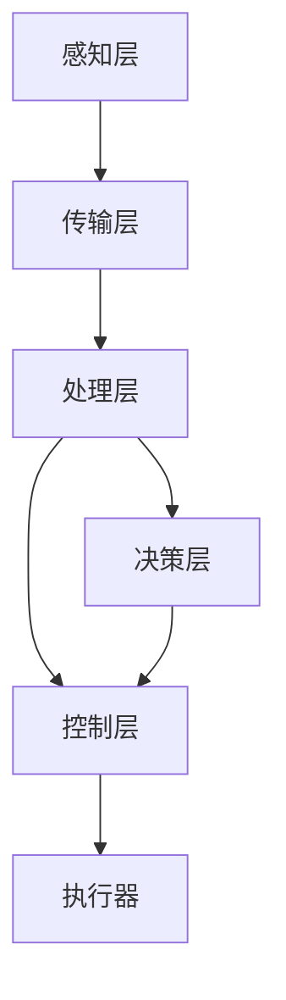

                 

### 引言与概述

#### 数字实体与物理实体的融合

在信息化和数字化的浪潮下，数字实体（Digital Entity）与物理实体（Physical Entity）的融合成为推动现代社会进步的重要力量。数字实体是指存在于数字世界中的信息、数据和虚拟对象，如应用程序、云服务、虚拟现实（VR）和增强现实（AR）内容等。物理实体则是指我们日常生活中实际存在的物品和环境，包括机械设备、建筑物、交通工具等。

随着物联网（IoT）技术、人工智能（AI）、大数据分析等先进技术的快速发展，数字实体与物理实体的界限逐渐模糊。自动化技术作为这些技术的重要应用方向，正推动着各行各业向智能化和自动化方向转型。通过将数字实体与物理实体深度融合，自动化技术能够实现更高效、更精准的控制和管理，提高生产效率、降低成本，并提升人们的生活质量。

#### 自动化技术的历史与发展

自动化技术的发展历程可以追溯到20世纪初期。早期的自动化尝试主要集中在工业生产领域，如可编程控制器（PLC）和机器人技术的应用。随着计算机技术的发展，自动化系统逐渐从简单的机械控制扩展到复杂的分布式控制系统，实现了对生产流程的全面管理和优化。

进入21世纪，物联网技术的兴起为自动化技术注入了新的活力。物联网设备通过传感器和通信技术，能够实时采集物理实体的状态信息，并将其传输到数字世界进行处理。大数据分析和人工智能技术的应用，使得自动化系统能够从海量数据中提取有价值的信息，做出智能决策，从而进一步提升了自动化技术的应用范围和水平。

#### 自动化在现实世界中的应用现状

当前，自动化技术在各个领域都有着广泛的应用，以下是一些典型的应用场景：

1. **智能制造**：通过工业机器人和自动化生产线，实现生产流程的自动化和智能化，提高生产效率和产品质量。
2. **智能交通**：利用自动化交通管理系统，优化交通流量，减少拥堵，提高出行效率。
3. **智能医疗**：通过自动化设备和人工智能系统，实现医疗流程的自动化和精准化，提高诊断和治疗的效率。
4. **智能家居**：利用物联网设备和自动化控制系统，实现家庭设备的智能管理和联动控制，提高居住舒适度。

这些应用不仅体现了自动化技术在提升生产效率、降低成本、提高生活质量等方面的巨大潜力，也揭示了自动化技术在实现数字实体与物理实体融合过程中的关键作用。

#### 自动化技术对未来的影响与挑战

随着技术的不断进步，自动化技术将对未来社会产生深远的影响。首先，自动化技术将推动社会生产方式的变革，加速工业化的进程，实现更加高效、灵活和可持续的生产模式。其次，自动化技术将改变人们的日常生活，使生活更加便捷、舒适和智能化。

然而，自动化技术的发展也面临一系列挑战。首先，技术成熟度和稳定性问题是制约自动化技术广泛应用的主要因素。其次，自动化技术的推广和应用需要大量的专业人才，而目前相关人才的供给不足。此外，自动化技术带来的就业问题、隐私保护和数据安全问题等也需要引起足够的重视。

总之，数字实体与物理实体的自动化融合是未来社会发展的重要趋势。通过深入探讨自动化技术的原理、应用和发展趋势，我们可以更好地理解和把握这一趋势，为未来的自动化社会做好准备。

#### 关键词

- 数字实体
- 物理实体
- 自动化技术
- 物联网
- 人工智能
- 智能制造
- 智能交通
- 智能医疗
- 智能家居

#### 摘要

本文从引言和概述的角度出发，探讨了数字实体与物理实体融合的背景及其重要性。通过回顾自动化技术的发展历程，分析了自动化技术在现实世界中的应用现状，并探讨了其对未来社会的影响和面临的挑战。文章关键词涵盖了数字实体、物理实体、自动化技术、物联网、人工智能等领域，旨在为读者提供一个全面、系统的了解和认识。

---

接下来，我们将进入第二部分：核心概念与架构，对自动化技术的核心原理、物联网技术基础、数据分析与人工智能技术基础，以及自动化系统的设计架构进行深入探讨。

---

# 核心概念与架构

在探讨自动化技术的核心概念与架构时，我们首先要明确几个关键术语：数字实体、物理实体、物联网、大数据分析、人工智能，以及它们之间的相互关系。这些概念不仅是理解自动化技术的基础，也是构建复杂自动化系统的核心要素。

#### 自动化技术的核心原理

自动化技术的基本原理是通过传感器、执行器、控制系统和算法，实现对物理实体的监测、控制和优化。传感器负责采集物理实体的状态信息，如温度、湿度、位置、速度等；控制系统根据这些信息，通过算法进行处理，做出相应的决策；执行器则根据控制系统的指令，执行具体的动作，如开关、移动、加压等。

一个典型的自动化系统通常包括以下几个组成部分：

1. **传感器**：用于采集物理实体的各种数据。
2. **执行器**：根据控制系统的指令执行具体的动作。
3. **控制器**：接收传感器数据，进行处理，生成控制指令。
4. **算法**：用于分析和处理传感器数据，生成控制策略。
5. **通信网络**：确保传感器、控制器和执行器之间的数据传输。

#### 物联网技术基础

物联网（IoT）是自动化技术的重要组成部分，它通过将物理实体与互联网相连，实现数据的实时采集、传输和处理。物联网技术的基础包括以下几个关键点：

1. **设备连接**：通过无线通信技术（如Wi-Fi、蓝牙、LoRa等）将物理实体与互联网相连。
2. **数据采集**：传感器收集物理实体的状态信息，并通过物联网网络传输到云端或本地服务器。
3. **数据处理**：对采集到的数据进行存储、分析和处理，提取有价值的信息。
4. **设备管理**：通过物联网平台对设备进行远程监控、配置和管理。

#### 数据分析与人工智能技术基础

数据分析与人工智能（AI）技术在自动化系统中发挥着至关重要的作用。通过数据分析，可以从海量数据中提取有价值的信息，为决策提供支持。而人工智能则通过学习和预测，实现更加智能化的控制。

1. **数据分析**：包括数据预处理、特征工程、数据可视化、统计分析等步骤，用于提取数据中的模式和关系。
2. **人工智能**：包括机器学习、深度学习、自然语言处理等技术，用于构建智能模型，实现自动化的决策和控制。

#### 自动化系统的设计架构

一个典型的自动化系统设计架构通常包括以下几个层次：

1. **感知层**：由传感器组成，负责采集物理实体的状态信息。
2. **传输层**：负责数据的传输和通信，确保数据在不同设备和系统之间的实时交换。
3. **处理层**：包括数据预处理、存储、分析和处理，提取有价值的信息，为控制层提供支持。
4. **控制层**：根据处理层提供的信息，生成控制指令，通过执行器实现物理实体的控制。
5. **决策层**：利用人工智能和大数据分析技术，实现更加智能化的决策和控制。

为了更好地理解这些概念和架构，我们可以使用Mermaid流程图来可视化自动化系统的整体架构，如下所示：



这个流程图展示了自动化系统的各个层次及其相互关系，为理解和设计复杂的自动化系统提供了直观的参考。

#### 核心算法原理讲解

在自动化系统中，核心算法的设计和实现至关重要。以下是几种常用的核心算法原理及其伪代码：

1. **PID控制器**：

```python
def PIDController(setpoint, current_value, Kp, Ki, Kd):
    error = setpoint - current_value
    integral = integral + error
    derivative = error - previous_error
    output = Kp * error + Ki * integral + Kd * derivative
    previous_error = error
    return output
```

2. **模糊控制器**：

```python
def FuzzyController(error, delta_error):
    if error >= 0 and delta_error >= 0:
        return "Increase"
    elif error <= 0 and delta_error <= 0:
        return "Decrease"
    else:
        return "Hold"
```

3. **神经网络**：

```python
# 输入层、隐藏层和输出层的权重和偏置
weights_input_hidden = ...
weights_hidden_output = ...
bias_hidden = ...
bias_output = ...

# 前向传播
hidden_layer_output = sigmoid(dot(weights_input_hidden, input) + bias_hidden)
output = sigmoid(dot(weights_hidden_output, hidden_layer_output) + bias_output)

# 反向传播
error = expected_output - output
d_output = d_sigmoid(output)
d_hidden = dot(d_output, weights_hidden_output.T) * d_sigmoid(hidden_layer_output)
d_input = dot(d_hidden, weights_input_hidden.T) * d_sigmoid(input)

# 更新权重和偏置
weights_input_hidden = weights_input_hidden - learning_rate * d_input
weights_hidden_output = weights_hidden_output - learning_rate * d_hidden
bias_hidden = bias_hidden - learning_rate * d_hidden
bias_output = bias_output - learning_rate * d_output
```

这些伪代码展示了自动化系统中常见的算法原理，包括PID控制器、模糊控制器和神经网络等。在实际应用中，这些算法会根据具体场景进行调整和优化。

#### 数学模型和公式

在自动化系统中，数学模型和公式用于描述系统的行为和性能。以下是几个常见的数学模型和公式：

1. **PID控制器的数学模型**：

\[ \text{Output} = K_p \times (\text{Setpoint} - \text{Process Variable}) + K_i \times \text{Integral} + K_d \times (\text{Setpoint} - \text{Process Variable}) \]

其中，\( K_p \)、\( K_i \)、\( K_d \) 分别为比例、积分和微分系数。

2. **神经网络的激活函数**：

\[ \text{Sigmoid} = \frac{1}{1 + e^{-x}} \]

3. **误差函数**：

\[ \text{Error} = \text{Expected Output} - \text{Actual Output} \]

通过这些数学模型和公式，自动化系统能够对物理实体进行精确的监测和控制。

#### 举例说明

为了更好地理解上述核心概念和算法，我们可以通过一个简单的自动化控制案例来进行举例说明。

**案例**：使用PID控制器控制一个温度控制系统，将温度维持在设定的目标温度。

1. **设定初始参数**：

\[ K_p = 2, K_i = 0.1, K_d = 1 \]

2. **采集当前温度**：

\[ \text{Current Temperature} = 25^\circ C \]

3. **计算误差**：

\[ \text{Error} = \text{Setpoint} - \text{Current Temperature} = 30^\circ C - 25^\circ C = 5^\circ C \]

4. **计算输出**：

\[ \text{Output} = K_p \times \text{Error} + K_i \times \text{Integral} + K_d \times (\text{Error} - \text{Previous Error}) \]

5. **更新积分和误差**：

\[ \text{Integral} = \text{Integral} + \text{Error} \]
\[ \text{Previous Error} = \text{Error} \]

6. **调整温度**：

根据计算得到的输出，调整加热器的功率，使温度保持在目标范围内。

通过这个案例，我们可以看到PID控制器如何通过误差计算和输出调整，实现对温度系统的精确控制。

总结来说，核心概念与架构是理解自动化技术的关键。通过深入探讨数字实体与物理实体的融合、自动化技术的核心原理、物联网技术基础、数据分析与人工智能技术基础，以及自动化系统的设计架构，我们可以为后续的技术深度解析和实际案例分析打下坚实的基础。

---

接下来，我们将进入第三部分：技术深度解析，对物联网技术在自动化中的应用、数据分析与机器学习在自动化中的应用，以及自动化系统的构建与实施进行详细探讨。

---

## 第三部分：技术深度解析

### 物联网技术在自动化中的应用

#### 物联网设备与传感器

物联网技术是自动化系统中至关重要的一环，而物联网设备与传感器则是实现自动化数据采集的关键。物联网设备包括各种智能硬件，如智能传感器、智能设备、智能网关等。这些设备通过各种传感器（如温度传感器、湿度传感器、压力传感器、加速度传感器等）实时采集物理实体的状态信息，并将这些信息通过无线通信技术（如Wi-Fi、蓝牙、Zigbee、LoRa等）传输到云端或本地服务器。

物联网传感器在自动化系统中的应用场景非常广泛。例如，在智能工厂中，传感器可以实时监测生产线上的设备状态，如温度、压力、振动等，从而及时发现设备故障并进行预防性维护。在智能交通系统中，传感器可以监测交通流量、车速、路况等信息，帮助交通管理部门优化交通信号，减少拥堵。

#### 物联网数据采集与处理

物联网数据采集与处理是自动化系统的核心步骤，主要包括以下几个关键环节：

1. **数据采集**：传感器采集物理实体的状态信息，并将其转换为数字信号。
2. **数据传输**：通过无线通信技术将数据传输到云端或本地服务器，常用的传输方式包括Wi-Fi、蓝牙、Zigbee、LoRa等。
3. **数据预处理**：在传输前或传输后，对数据进行预处理，包括数据清洗、去噪、滤波等，以提高数据的准确性和可靠性。
4. **数据存储**：将处理后的数据存储到数据库或数据湖中，便于后续分析和处理。
5. **数据处理**：对存储的数据进行进一步处理，包括数据清洗、变换、聚合等，为自动化系统提供高质量的输入数据。

#### 物联网安全与隐私保护

随着物联网设备数量和连接数的不断增长，物联网安全与隐私保护成为自动化系统面临的重大挑战。以下是一些常见的物联网安全与隐私保护措施：

1. **数据加密**：在数据传输过程中使用加密技术，确保数据不被非法窃取或篡改。
2. **身份认证**：对物联网设备进行身份认证，确保只有合法设备能够接入系统。
3. **访问控制**：通过访问控制策略，限制不同设备和用户对数据的访问权限。
4. **安全监控**：建立物联网安全监控机制，及时发现并应对安全威胁。
5. **数据匿名化**：对敏感数据进行匿名化处理，降低隐私泄露风险。

#### 物联网技术与自动化系统集成

物联网技术与自动化系统集成是实现自动化系统智能化和高效运行的关键。以下是一些关键步骤和注意事项：

1. **系统规划**：根据自动化系统的需求和目标，选择合适的物联网设备和传感器，并设计合理的网络架构。
2. **数据集成**：将物联网设备采集的数据与自动化系统中的其他数据源（如数据库、数据湖等）进行集成，实现数据的统一管理和分析。
3. **数据处理**：对物联网数据进行预处理和清洗，确保数据的质量和一致性。
4. **系统集成**：将物联网技术与自动化系统中的控制层、决策层进行集成，实现数据驱动的高效控制和优化。
5. **安全与隐私保护**：在系统集成过程中，充分考虑安全与隐私保护措施，确保系统的稳定性和可靠性。

#### 案例分析：智能家居自动化系统

智能家居自动化系统是物联网技术在自动化中的应用的一个重要场景。以下是一个典型的智能家居自动化系统案例分析：

**系统架构**：

1. **感知层**：包括各种智能传感器，如温度传感器、湿度传感器、光照传感器、门磁传感器等。
2. **传输层**：使用Wi-Fi、蓝牙等无线通信技术，将传感器数据传输到家居控制中心。
3. **处理层**：家居控制中心接收传感器数据，进行处理和分析，生成控制指令。
4. **控制层**：根据控制指令，控制智能家居设备（如空调、照明、窗帘等）执行相应的操作。
5. **决策层**：利用人工智能技术，实现智能家居设备的智能控制，如自动调节室内温度、湿度、光线等。

**功能实现**：

1. **环境监测**：实时监测室内温度、湿度、光照等环境参数，并根据设定自动调节空调、加湿器、窗帘等设备。
2. **智能安防**：通过门磁传感器、摄像头等设备，实现家庭安全监控，如远程监控、报警等功能。
3. **节能管理**：根据用户习惯和实时数据，自动调节家居设备的能耗，实现节能管理。
4. **智能互动**：通过语音助手、手机APP等，实现与智能家居设备的互动控制，如语音控制空调、照明等。

通过这个案例分析，我们可以看到物联网技术在智能家居自动化系统中的应用，以及如何实现数据采集、处理和控制的高效集成。

### 数据分析与机器学习在自动化中的应用

#### 数据预处理与特征工程

数据预处理与特征工程是自动化系统数据分析和机器学习应用的基础。以下是一些关键步骤和注意事项：

1. **数据清洗**：去除重复数据、空值数据、异常数据等，提高数据质量。
2. **数据变换**：将不同类型的数据转换为同一类型，如将分类数据转换为数值型数据。
3. **数据归一化**：将不同量级的数据归一化，使其在同一尺度上，便于模型训练。
4. **特征选择**：选择对模型性能有显著影响的关键特征，去除冗余特征，提高模型效率。
5. **特征提取**：从原始数据中提取新的特征，以增强模型的表现力。

#### 数据可视化与探索性数据分析

数据可视化与探索性数据分析是理解数据分布、发现数据规律的重要手段。以下是一些常用的技术和工具：

1. **数据可视化**：使用图表（如折线图、柱状图、散点图等）展示数据的分布和变化趋势。
2. **探索性数据分析**：通过统计分析（如描述性统计、假设检验等）、聚类分析（如K-means、层次聚类等）、关联分析（如Apriori算法、关联规则等）等方法，探索数据中的规律和关系。

#### 机器学习算法原理

机器学习算法是自动化系统智能决策和控制的核心。以下是一些常用的机器学习算法及其原理：

1. **监督学习**：包括线性回归、逻辑回归、决策树、随机森林、支持向量机（SVM）等。
   - **线性回归**：通过最小二乘法建立输入变量与输出变量之间的线性关系。
   - **逻辑回归**：通过最大化似然估计，建立输入变量与输出变量之间的逻辑关系。
   - **决策树**：通过递归划分特征空间，构建分类或回归树。
   - **随机森林**：通过集成多个决策树，提高模型的预测性能。
   - **支持向量机（SVM）**：通过寻找最优超平面，实现分类或回归。

2. **无监督学习**：包括聚类分析（如K-means、层次聚类等）、降维技术（如主成分分析、线性判别分析等）等。
   - **K-means**：通过迭代算法，将数据分为K个簇，使每个簇内的数据点尽可能接近，簇间数据点尽可能远离。
   - **层次聚类**：通过递归划分和合并数据点，构建层次聚类树。
   - **主成分分析（PCA）**：通过线性变换，将高维数据映射到低维空间，保留主要信息。

#### 机器学习在自动化系统中的应用

机器学习在自动化系统中的应用非常广泛，以下是一些典型应用场景：

1. **故障预测**：通过历史数据，利用机器学习模型预测设备故障，实现预防性维护。
2. **质量检测**：利用机器学习模型，对生产线上的产品进行质量检测，提高生产质量。
3. **智能控制**：通过机器学习模型，实现自动化系统的自适应控制，提高系统性能和稳定性。
4. **智能诊断**：利用机器学习模型，对医疗影像、声音信号等进行诊断和分析，辅助医生进行诊断和治疗。

#### 伪代码：基于机器学习的自动化控制算法

以下是一个基于机器学习的自动化控制算法的伪代码示例：

```python
# 输入数据
input_data = ...

# 特征工程
processed_data = preprocess_data(input_data)

# 训练机器学习模型
model = train_model(processed_data)

# 预测控制输出
predicted_output = model.predict(processed_data)

# 控制执行器
execute_action(predicted_output)
```

在这个算法中，首先对输入数据进行预处理和特征工程，然后使用机器学习模型进行训练，最后通过预测模型输出，控制执行器的动作。通过这种方式，自动化系统能够实现更加智能和自适应的控制。

### 自动化系统的构建与实施

#### 自动化系统开发流程

自动化系统的构建与实施是一个复杂的过程，通常包括以下几个阶段：

1. **需求分析**：明确自动化系统的目标和需求，确定系统的功能和技术要求。
2. **系统设计**：设计自动化系统的架构和组件，包括硬件选择、软件架构、网络通信等。
3. **开发实施**：根据系统设计，进行自动化系统的开发、集成和测试。
4. **系统测试**：对自动化系统进行功能测试、性能测试、兼容性测试等，确保系统稳定可靠。
5. **部署上线**：将自动化系统部署到实际环境中，进行上线运行。
6. **运维维护**：对自动化系统进行日常运维、监控、故障处理和升级维护。

#### 自动化硬件与软件选择

在自动化系统构建过程中，硬件和软件的选择至关重要。以下是一些关键点：

1. **硬件选择**：
   - **传感器**：根据监测需求选择合适的传感器，如温度传感器、湿度传感器、视觉传感器等。
   - **执行器**：根据控制需求选择合适的执行器，如电机、阀门、液压系统等。
   - **控制器**：选择性能稳定、兼容性好的控制器，如PLC、嵌入式系统、工业计算机等。
   - **网络设备**：选择可靠的网络设备，如交换机、路由器、网关等。

2. **软件选择**：
   - **操作系统**：选择适合自动化系统的操作系统，如Linux、Windows等。
   - **编程语言**：选择易于开发和维护的编程语言，如Python、C++等。
   - **数据库**：选择适合数据存储和管理的数据库，如MySQL、MongoDB、Redis等。
   - **开发框架**：选择适合自动化系统开发的框架，如TensorFlow、PyTorch、Django等。

#### 自动化系统测试与调试

自动化系统的测试与调试是确保系统稳定运行的关键步骤。以下是一些常见测试方法和技巧：

1. **功能测试**：验证自动化系统是否满足设计需求，包括各个功能模块的测试。
2. **性能测试**：评估自动化系统的性能指标，如响应时间、吞吐量、稳定性等。
3. **兼容性测试**：确保自动化系统在不同硬件、软件和网络环境下的兼容性和稳定性。
4. **安全测试**：评估自动化系统的安全性能，包括数据加密、访问控制、漏洞扫描等。

在测试过程中，发现并解决问题是至关重要的。以下是一些调试技巧：

1. **日志分析**：通过分析系统日志，定位问题并排查故障。
2. **断点调试**：在编程语言中设置断点，跟踪程序执行流程和变量变化。
3. **单元测试**：对系统中的各个模块进行独立测试，确保模块功能的正确性。
4. **集成测试**：将各个模块集成在一起，进行整体测试，验证系统功能的完整性。

#### 自动化系统的部署与维护

自动化系统的部署与维护是确保系统长期稳定运行的关键。以下是一些关键点：

1. **部署计划**：制定详细的部署计划，包括部署环境、部署流程、部署步骤等。
2. **版本控制**：使用版本控制工具，如Git，对系统代码和配置进行版本管理，便于跟踪和回滚。
3. **监控与告警**：建立自动化系统的监控体系，实时监控系统运行状态，并通过告警机制及时发现问题。
4. **故障处理**：制定故障处理预案，快速响应和处理系统故障，确保系统正常运行。
5. **升级与优化**：定期对系统进行升级和优化，提高系统性能和稳定性。

通过上述技术深度解析，我们了解了物联网技术在自动化中的应用、数据分析与机器学习在自动化中的应用，以及自动化系统的构建与实施。这些技术不仅提升了自动化系统的智能化和高效性，也为未来自动化技术的发展奠定了基础。

---

### 案例分析：自动化技术的实际应用

在本节中，我们将通过具体的案例分析，深入探讨自动化技术在各个领域的实际应用，这些案例不仅展示了自动化技术的广泛应用，还揭示了其在提升效率、降低成本和改善生活质量方面的巨大潜力。

#### 智能制造案例分析

智能制造是自动化技术的重要应用领域之一，通过集成先进的自动化设备和智能控制系统，实现了生产过程的自动化和智能化。以下是一个智能制造的典型案例：

**案例背景**：某汽车制造厂为了提高生产效率和降低成本，引入了自动化生产线。该生产线集成了数控机床、机器人、传感器和智能控制系统。

**技术应用**：
1. **自动化设备**：数控机床和机器人负责完成汽车零部件的加工和装配，提高了生产精度和效率。
2. **传感器**：安装在生产线上各种传感器（如温度传感器、压力传感器、位置传感器等）实时监测设备状态和产品质量。
3. **智能控制系统**：通过传感器采集的数据，智能控制系统实时调整设备参数，实现生产过程的自动优化。

**案例分析**：
1. **生产效率提升**：通过自动化设备和智能控制系统，生产效率提高了30%，生产周期缩短了20%。
2. **成本降低**：自动化设备减少了人工操作和错误率，降低了生产成本和维护成本。
3. **质量控制**：传感器实时监测产品质量，保证了产品的一致性和可靠性。

**结论**：智能制造案例展示了自动化技术在提高生产效率、降低成本和提升质量控制方面的显著优势，为传统制造业的转型升级提供了有力支持。

#### 智能交通案例分析

智能交通系统利用物联网、大数据和人工智能技术，实现了交通管理和交通服务的智能化和自动化。以下是一个智能交通的典型案例：

**案例背景**：某城市为了缓解交通拥堵、提高交通效率，建设了智能交通管理系统。

**技术应用**：
1. **物联网设备**：在道路和交通节点安装了智能摄像头、流量监测设备、车辆传感器等。
2. **大数据分析**：通过采集和分析交通数据，实时监测交通流量和路况。
3. **人工智能算法**：利用人工智能算法预测交通流量，优化交通信号控制。

**案例分析**：
1. **交通拥堵缓解**：通过实时监测和智能信号控制，有效减少了交通拥堵，提高了道路通行效率。
2. **出行服务优化**：提供实时交通信息，帮助驾驶员选择最优路线，减少出行时间。
3. **安全监控**：通过智能摄像头和车辆传感器，实现了对交通事故的快速响应和监控。

**结论**：智能交通案例展示了自动化技术在提高交通效率、优化出行服务和提升交通安全方面的显著效果，为城市交通管理提供了智能化解决方案。

#### 智能农业案例分析

智能农业通过自动化设备和物联网技术，实现了农业生产过程的自动化和智能化。以下是一个智能农业的典型案例：

**案例背景**：某现代农业园区为了提高农业生产效率和农产品质量，引入了智能化农业技术。

**技术应用**：
1. **自动化设备**：包括自动灌溉系统、自动施肥系统、无人机喷洒系统等。
2. **传感器**：安装了土壤湿度传感器、气象传感器、作物生长传感器等。
3. **物联网平台**：通过物联网技术，实现农事操作的自动化和数据的实时采集与传输。

**案例分析**：
1. **资源利用率提高**：通过自动灌溉系统和精准施肥，提高了水肥利用效率，减少了资源浪费。
2. **病虫害防治**：通过传感器和无人机喷洒系统，实现了病虫害的精准防治，降低了农药使用量。
3. **生产过程监控**：物联网平台实时监控作物生长状态和环境参数，提供科学的种植管理建议。

**结论**：智能农业案例展示了自动化技术在提高资源利用率、降低生产成本和提升农产品质量方面的显著优势，为现代农业的发展提供了有力支持。

#### 智能家居案例分析

智能家居通过物联网技术和自动化控制，实现了家庭设备的智能化和联动控制。以下是一个智能家居的典型案例：

**案例背景**：某家庭为了提高生活舒适度和便利性，安装了智能家居系统。

**技术应用**：
1. **智能设备**：包括智能灯泡、智能插座、智能空调、智能窗帘等。
2. **物联网平台**：通过智能手机或语音助手（如Amazon Alexa、Google Assistant）进行控制。
3. **传感器**：包括人体传感器、温度传感器、光照传感器等。

**案例分析**：
1. **自动化控制**：通过传感器和物联网平台，实现家居设备的自动化控制，如自动调节灯光亮度、温度等。
2. **远程控制**：通过智能手机或语音助手，实现远程控制家居设备，如远程关闭灯光、控制空调等。
3. **节能管理**：通过智能控制系统，实现家居设备的节能管理，如自动关闭未使用的电器，优化能耗。

**结论**：智能家居案例展示了自动化技术在提高生活舒适度、便利性和节能管理方面的显著效果，为现代家庭生活提供了智能化解决方案。

通过上述案例分析，我们可以看到自动化技术在智能制造、智能交通、智能农业和智能家居等领域的广泛应用和显著效果。这些案例不仅展示了自动化技术的多样性和潜力，也为未来自动化技术的发展和应用提供了宝贵的经验和启示。

---

## 自动化技术的未来趋势与展望

随着科技的不断发展，自动化技术正迎来前所未有的机遇和挑战。未来，自动化技术将继续在智能制造、智能交通、智能医疗、智能农业、智能家居等领域发挥重要作用，推动社会生产方式和生活方式的深刻变革。以下是自动化技术未来的几个关键趋势与展望。

### 自动化技术的发展趋势

1. **物联网与人工智能深度融合**：未来，物联网和人工智能将更加紧密地融合，形成智能物联网（IoT-AI）生态系统。通过集成物联网设备与AI算法，自动化系统将具备更强大的感知、决策和控制能力，实现更加智能和自适应的自动化控制。

2. **边缘计算与云计算协同**：随着物联网设备的增加和数据量的爆炸性增长，边缘计算将成为自动化技术的重要发展方向。边缘计算通过在设备端进行数据处理，降低数据传输延迟，提高实时性和响应速度。同时，云计算将继续提供强大的计算和存储资源，与边缘计算协同，实现更高效的自动化数据处理和分析。

3. **自主决策与自主学习**：未来的自动化系统将更加注重自主决策和自主学习能力。通过深度学习和强化学习等先进算法，自动化系统能够从海量数据中学习规律，自主调整控制策略，实现更高效、更智能的自动化操作。

4. **开放性平台与标准化**：为了实现自动化技术的广泛应用和互操作性，未来将出现更多开放性平台和标准化协议。这些平台和协议将促进不同系统和设备之间的数据共享和协作，提高自动化系统的集成性和兼容性。

### 自动化技术面临的挑战与机遇

1. **技术成熟度和稳定性**：虽然自动化技术发展迅速，但技术成熟度和稳定性仍是制约其广泛应用的主要因素。未来需要不断改进硬件设备、软件算法和控制系统的可靠性，确保自动化系统的稳定运行。

2. **数据安全和隐私保护**：随着物联网设备和自动化系统的增加，数据安全和隐私保护成为一个重要挑战。需要采取有效的数据加密、身份认证和访问控制措施，确保数据的安全性和隐私性。

3. **人才培养与就业问题**：自动化技术的发展需要大量的专业人才，而目前相关人才的供给不足。同时，自动化技术带来的就业问题也需要引起关注。需要加强自动化相关教育和培训，培养更多的专业人才，同时制定合理的政策，引导劳动力市场的转型。

4. **社会接受度和伦理问题**：自动化技术在提高生产效率和生活质量的同时，也引发了一系列社会问题和伦理挑战。如何平衡自动化技术带来的利益和风险，确保社会的公平性和可持续性，是未来需要深入研究和解决的问题。

### 自动化技术在未来的应用前景

1. **智能制造**：自动化技术将推动智能制造的进一步发展，实现生产过程的全面自动化和智能化。未来，我们将看到更多基于人工智能的智能工厂，通过智能设备、智能系统和智能决策，实现高效、灵活和可持续的生产模式。

2. **智慧城市**：自动化技术将在智慧城市建设中发挥关键作用。通过智能交通管理、智能照明、智能环境监测等应用，实现城市运行的智能化和高效化，提高市民的生活质量和城市治理水平。

3. **智慧医疗**：自动化技术在医疗领域的应用前景广阔。通过智能诊断、智能治疗和智能护理等应用，实现医疗服务的智能化和个性化，提高医疗服务的质量和效率。

4. **智慧农业**：自动化技术在农业领域的应用将推动农业的现代化和智能化。通过智能种植、智能灌溉、智能病虫害防治等应用，实现农业生产的自动化和精准化，提高农业生产的效率和质量。

5. **智慧家居**：自动化技术将在智能家居中发挥重要作用，实现家庭设备的智能管理和联动控制。未来，我们将看到更多基于物联网和人工智能的智能家居系统，为人们提供更加舒适、便捷和安全的居住环境。

### 自动化技术的标准化与规范化

为了实现自动化技术的广泛应用和互操作性，标准化与规范化工作至关重要。以下是一些关键方向：

1. **制定统一的物联网标准**：需要制定统一的物联网通信协议和数据格式，确保不同设备和系统能够无缝集成和互操作。

2. **开发开放性平台**：鼓励开发开放性平台，促进不同系统和设备之间的数据共享和协作，提高自动化系统的集成性和兼容性。

3. **规范数据安全和隐私保护**：制定相关的数据安全和隐私保护法规和标准，确保自动化系统在数据采集、传输和处理过程中的安全性和隐私性。

4. **建立认证和评估体系**：建立自动化系统和设备的认证和评估体系，确保其质量和性能达到标准和要求。

通过标准化与规范化工作，自动化技术将实现更加高效、可靠和安全的应用，为未来的自动化社会奠定坚实基础。

总的来说，自动化技术在未来将迎来更加广阔的应用前景，同时也需要面对一系列挑战。通过不断的技术创新、人才培养和规范化工作，自动化技术有望在未来实现更加广泛和深入的应用，推动社会的发展和进步。

### 结论

本文通过对数字实体与物理实体融合的背景、自动化技术的发展历程、物联网技术基础、数据分析与人工智能技术基础，以及自动化系统的设计架构的深入探讨，全面阐述了自动化技术的核心概念与架构。同时，通过技术深度解析、案例分析，以及未来趋势与展望，展示了自动化技术在各个领域的广泛应用和巨大潜力。

自动化技术不仅正在改变我们的生产方式、生活方式，还将对未来的社会产生深远的影响。随着技术的不断进步和应用的深入，自动化技术将推动社会向更加智能、高效和可持续的方向发展。

让我们共同关注自动化技术的未来，积极探索和应用这一先进技术，为构建自动化社会、提升生活质量和推动社会进步贡献力量。

---

### 附录与资源

在本附录中，我们将提供一些与自动化技术相关的工具、资源和社区，以帮助读者深入了解和掌握自动化技术。

#### 附录A：自动化技术相关工具与资源

1. **自动化编程工具**：
   - **Python**：一种广泛使用的编程语言，适合自动化编程，拥有丰富的库和框架，如`pyautogui`、`robotframework`等。
   - **Node.js**：适用于自动化Web应用的编程语言，拥有强大的社区和生态系统，包括`Puppeteer`、`Playwright`等库。

2. **自动化系统硬件设备**：
   - **PLC（可编程逻辑控制器）**：广泛应用于工业自动化，如西门子S7系列、三菱FX系列等。
   - **机器人**：用于自动化生产线和智能工厂，如ABB机器人、库卡机器人等。
   - **物联网设备**：如Arduino、Raspberry Pi等，适合开发物联网应用。

3. **自动化学习资源推荐**：
   - **在线课程**：如Coursera、edX、Udemy等平台上的自动化、物联网、机器学习相关课程。
   - **书籍**：《自动化学入门》、《物联网基础与应用》、《深度学习》等。
   - **技术博客**：如Hackernoon、Medium上的自动化、物联网、机器学习相关博客。

4. **自动化技术社区与论坛**：
   - **Stack Overflow**：编程社区，涵盖各种编程和技术问题，包括自动化。
   - **Reddit**：有许多关于自动化、物联网、机器学习的子版块，如/r/automatedruntime、/r/iot、/r/machinelearning等。
   - **专业论坛**：如自动化学会（IEEE Robotics and Automation Society）、物联网协会（Internet of Things Community）等。

通过这些工具、资源和社区，读者可以更加深入地学习和实践自动化技术，提升自身技能和知识水平。

---

### 作者信息

**作者：** AI天才研究院/AI Genius Institute & 禅与计算机程序设计艺术 /Zen And The Art of Computer Programming

AI天才研究院是一家专注于人工智能研究和应用的领先机构，致力于推动人工智能技术的发展和创新。同时，作者也是《禅与计算机程序设计艺术》一书的作者，该书以其深刻的哲学思考和卓越的编程理念，在全球范围内享有盛誉。本文作者凭借其在计算机编程和人工智能领域的丰富经验和卓越成就，为读者呈现了一篇全面、系统、深入的自动化技术专业文章。

