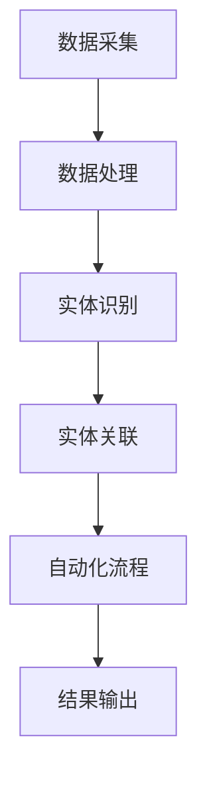

                 

# 《数字实体自动化的最新趋势与发展》

## 摘要

本文将深入探讨数字实体自动化的最新趋势与发展。数字实体自动化是一种通过机器学习、深度学习和规则引擎等技术，将现实世界中的实体对象转化为数字模型，实现自动化处理和决策的技术。本文首先介绍了数字实体自动化的背景、概念、关键要素和优势与挑战。接着，详细阐述了数字实体建模技术、自动化算法原理、框架与工具。随后，通过金融和物流与供应链两个行业的实际案例，展示了数字实体自动化的应用价值。最后，探讨了数字实体自动化的未来发展趋势，以及技术革新带来的挑战与机遇。本文旨在为读者提供一份全面而深入的关于数字实体自动化的技术指南。

## 关键词

- 数字实体自动化
- 机器学习
- 深度学习
- 自动化算法
- 数字实体建模
- 金融行业
- 物流与供应链

### 第一部分：背景与概念理解

#### 第1章：数字实体自动化概述

##### 1.1 数字实体自动化的概念

**定义与核心特征**

数字实体自动化（Digital Entity Automation）是指利用先进的计算技术，如机器学习、深度学习和规则引擎等，对现实世界中的实体对象进行数字化建模，并实现自动化的数据处理、分析和决策。这些实体对象可以是物理对象，如车辆、设备、商品等，也可以是虚拟对象，如客户、员工、订单等。

数字实体自动化的核心特征包括：

1. **数字化建模**：通过数据采集、预处理和建模技术，将现实世界中的实体对象转化为数字模型。
2. **自动化处理**：利用算法和框架，实现实体对象的数据处理、分析和决策的自动化。
3. **智能决策**：基于机器学习和深度学习算法，实现智能化的决策支持和预测。

**历史发展回顾**

数字实体自动化的发展可以追溯到20世纪末和21世纪初。随着计算机技术的快速发展和大数据时代的到来，数据采集和处理能力得到了极大的提升。这为数字实体自动化的实现提供了技术基础。同时，人工智能技术的突破，特别是机器学习和深度学习算法的兴起，为数字实体自动化的应用带来了新的机遇。

在过去的几年中，数字实体自动化技术逐渐成熟，并开始广泛应用于金融、物流、供应链、智能制造等领域。通过数字实体自动化，企业能够实现高效的数据处理和智能化的业务决策，提升运营效率和竞争力。

**当前应用场景**

数字实体自动化在当前的应用场景中表现出色，以下是一些典型的应用场景：

1. **金融行业**：数字实体自动化在金融行业的应用包括客户风险管理、信用评分、投资决策等。通过建立数字化的客户模型和资产模型，金融机构能够实现精准的客户服务和风险控制。

2. **物流与供应链**：数字实体自动化在物流与供应链中的应用包括库存管理、运输调度、供应链金融等。通过数字化的货物和运输模型，企业能够实现高效的库存管理和供应链优化。

3. **智能制造**：数字实体自动化在智能制造中的应用包括设备监控、生产计划、质量控制等。通过数字化的设备和生产模型，企业能够实现智能化的生产管理和质量控制。

4. **智慧城市**：数字实体自动化在智慧城市中的应用包括交通管理、能源管理、环境监测等。通过数字化的城市实体模型，政府能够实现智能化的城市管理和公共服务。

##### 1.2 数字实体自动化的关键要素

数字实体自动化的实现涉及多个关键要素，包括数据与模型、算法与框架、技术与工具等。

**数据与模型**

数据是数字实体自动化的基础。数字实体自动化需要高质量的数据来源，包括内部数据和外部数据。内部数据来源于企业的业务系统，如客户数据、交易数据、库存数据等。外部数据来源于第三方数据提供商，如市场数据、社会数据、地理数据等。

在数据收集过程中，需要进行数据预处理，包括数据清洗、数据整合、数据转换等。数据预处理是确保数据质量和模型效果的重要步骤。

数字实体建模是将现实世界中的实体对象转化为数字模型的过程。数字实体建模需要基于数据的特点和应用场景，选择合适的建模技术，如机器学习、深度学习和规则引擎等。数字实体建模的目标是建立精确、高效的数字模型，以支持自动化的数据处理和决策。

**算法与框架**

算法是数字实体自动化的核心。数字实体自动化涉及多种算法，包括机器学习算法、深度学习算法、规则引擎算法等。

机器学习算法通过训练数据，学习数据中的特征和规律，实现对未知数据的分类、回归、聚类等操作。常见的机器学习算法包括线性回归、决策树、支持向量机、神经网络等。

深度学习算法是机器学习的一种高级形式，通过多层神经网络，实现更复杂的特征学习和模式识别。深度学习算法在图像识别、语音识别、自然语言处理等领域表现出色。

规则引擎算法是一种基于规则的自动化处理方法。规则引擎通过定义一系列规则，实现对数据的自动分类、筛选、处理等操作。规则引擎在金融、物流、供应链等领域得到广泛应用。

数字实体自动化框架是支持数字实体自动化的软件框架。常见的数字实体自动化框架包括Apache Flink、Apache Kafka、Apache Spark等。这些框架提供了高效的数据处理、流处理和分析功能，支持数字实体自动化的实现。

**技术与工具**

数字实体自动化的实现需要多种技术的支持，包括云计算、大数据、物联网等。云计算提供了强大的计算和存储能力，支持大规模的数据处理和模型训练。大数据技术实现了海量数据的存储、处理和分析，为数字实体自动化提供了数据基础。物联网技术实现了物理实体和数字实体的连接，为数字实体自动化的实现提供了数据来源。

在数字实体自动化的实现过程中，需要使用多种工具，包括数据采集工具、数据预处理工具、建模工具、算法实现工具等。常用的数据采集工具包括Elasticsearch、Kafka等，数据预处理工具包括Pandas、NumPy等，建模工具包括TensorFlow、PyTorch等，算法实现工具包括Scikit-learn、XGBoost等。

##### 1.3 数字实体自动化的优势与挑战

**优势分析**

数字实体自动化具有以下优势：

1. **提高效率**：数字实体自动化能够自动处理大量的数据，减少人工干预，提高数据处理和决策的效率。
2. **降低成本**：数字实体自动化减少了人工干预，降低了人力成本，同时提高了资源利用率，降低了运营成本。
3. **精准预测**：基于机器学习和深度学习算法，数字实体自动化能够对未来的趋势和变化进行精准预测，为企业的决策提供有力支持。
4. **提升用户体验**：数字实体自动化在金融、物流、供应链等领域的应用，能够提升用户体验，提高客户满意度。

**挑战与应对策略**

数字实体自动化也面临一些挑战，包括：

1. **数据质量**：数据质量是数字实体自动化的关键。数据的不完整、不一致和错误会导致模型的准确性和可靠性下降。应对策略是建立完善的数据质量管理机制，确保数据质量。
2. **算法选择**：选择合适的算法是实现数字实体自动化的关键。不同的算法适用于不同的应用场景，需要根据具体需求选择合适的算法。应对策略是深入研究各种算法的原理和应用场景，选择合适的算法。
3. **技术复杂度**：数字实体自动化涉及多种技术和工具，技术复杂度较高。应对策略是建立专业的技术团队，提升技术水平，降低技术复杂度。
4. **隐私保护**：数字实体自动化涉及到大量的个人信息和敏感数据，隐私保护成为重要挑战。应对策略是采用先进的加密和隐私保护技术，确保数据的隐私和安全。

#### 第2章：数字实体建模技术

##### 2.1 数据收集与预处理

**数据来源**

数字实体建模的数据来源可以分为内部数据和外部数据。内部数据来源于企业的业务系统，如客户数据、交易数据、库存数据等。外部数据来源于第三方数据提供商，如市场数据、社会数据、地理数据等。内部数据和外部数据的结合，能够为数字实体建模提供全面、多维的数据支持。

**数据清洗**

数据清洗是数据预处理的重要步骤，旨在去除数据中的噪声、错误和不一致。数据清洗的方法包括：

1. **缺失值处理**：对于缺失的数据，可以采用填充、删除或插值等方法进行处理。
2. **异常值处理**：对于异常的数据，可以采用剔除、修正或替换等方法进行处理。
3. **重复值处理**：对于重复的数据，可以采用删除或合并等方法进行处理。

**特征工程**

特征工程是数据预处理的关键步骤，旨在提取数据中的有效特征，提高模型的性能。特征工程的方法包括：

1. **特征选择**：通过过滤、嵌套和包裹等方法，选择对模型有重要影响的特征。
2. **特征转换**：通过标准化、归一化、离散化等方法，将原始特征转换为适合模型训练的形式。
3. **特征构造**：通过组合、交叉、嵌入等方法，构造新的特征，以提升模型的预测能力。

##### 2.2 数字实体识别算法

**机器学习算法介绍**

机器学习算法是数字实体识别的核心，常用的机器学习算法包括：

1. **线性回归**：通过拟合数据的线性关系，实现对数据的分类或回归。
2. **逻辑回归**：通过拟合数据的逻辑关系，实现对数据的二分类。
3. **支持向量机**：通过构建最优分类边界，实现对数据的分类。
4. **决策树**：通过递归划分数据，构建分类或回归树。
5. **随机森林**：通过集成多棵决策树，提高模型的预测性能。
6. **梯度提升树**：通过迭代构建决策树，提高模型的预测性能。

**深度学习算法应用**

深度学习算法是机器学习的一种高级形式，能够自动提取数据中的特征。常用的深度学习算法包括：

1. **卷积神经网络（CNN）**：通过卷积层、池化层和全连接层，实现对图像、语音和文本数据的处理。
2. **循环神经网络（RNN）**：通过循环结构，实现对序列数据的处理。
3. **长短时记忆网络（LSTM）**：通过门控结构，提高对序列数据的记忆能力。
4. **生成对抗网络（GAN）**：通过生成器和判别器的对抗训练，实现数据的生成和分类。

**特征匹配与关联**

特征匹配与关联是将不同来源的数据进行整合的过程。特征匹配是通过计算特征之间的相似度，实现数据的匹配。特征关联是通过分析特征之间的关系，实现数据的关联。特征匹配与关联的方法包括：

1. **基于距离的匹配**：通过计算特征之间的欧氏距离、余弦相似度等，实现特征的匹配。
2. **基于规则的匹配**：通过定义一系列规则，实现特征的匹配。
3. **基于聚类和分类的匹配**：通过聚类和分类算法，实现特征的匹配和关联。

##### 2.3 自动化流程设计

**流程定义**

自动化流程设计是数字实体自动化的关键步骤，旨在定义实体对象的处理流程。流程定义包括以下步骤：

1. **需求分析**：分析业务需求，明确实体对象的处理目标和要求。
2. **流程设计**：设计实体对象的处理流程，包括数据采集、数据清洗、数据建模、数据预测等环节。
3. **流程优化**：根据实际应用情况，对流程进行优化，提高处理效率和效果。

**流程优化**

流程优化是提高数字实体自动化性能的重要手段。流程优化的方法包括：

1. **算法优化**：通过选择更合适的算法，提高模型的预测性能。
2. **硬件优化**：通过使用更高效的硬件设备，提高数据处理速度。
3. **数据优化**：通过数据清洗、特征工程等方法，提高数据质量。
4. **流程重构**：通过重构流程，消除瓶颈和重复环节，提高处理效率。

**自动化流程与业务结合**

自动化流程与业务的结合是实现数字实体自动化的关键。自动化流程与业务的结合包括以下步骤：

1. **业务需求分析**：分析业务需求，明确自动化流程的目标和应用场景。
2. **流程定制**：根据业务需求，定制自动化流程，实现业务流程的自动化处理。
3. **流程集成**：将自动化流程集成到业务系统中，实现业务流程的自动化处理。
4. **流程监控**：通过监控自动化流程的运行状态，确保流程的稳定性和可靠性。

#### 第3章：数字实体自动化算法原理

##### 3.1 基于规则的方法

**规则定义与优化**

基于规则的方法是一种简单直观的自动化处理方法，通过定义一系列规则，实现数据的自动分类、筛选和处理。规则的定义和优化是该方法的关键。

1. **规则定义**：规则的定义包括条件、动作和优先级等。条件用于描述数据的特征，动作用于描述对数据的处理方式，优先级用于描述规则的执行顺序。

2. **规则优化**：规则的优化包括规则筛选、规则合并和规则优先级调整等。规则筛选是通过分析数据的特征和规则的效果，筛选出有效规则。规则合并是通过将多个规则合并为一个规则，提高规则的执行效率。规则优先级调整是通过调整规则的执行顺序，提高规则的效果。

**规则引擎实现**

规则引擎是实现基于规则自动化处理的核心组件，负责解析、执行和监控规则。规则引擎的实现包括以下步骤：

1. **规则解析**：解析规则的定义，提取规则的条件、动作和优先级等信息。

2. **规则执行**：根据规则的条件和动作，对数据进行自动分类、筛选和处理。

3. **规则监控**：监控规则引擎的运行状态，记录规则的执行日志，提供规则的执行分析。

**示例**

以下是一个基于规则的示例：

```
IF 客户年龄大于 18 AND 客户收入高于 5000 元
THEN 发送营销邮件
ELSE 
NO_ACTION
```

该规则表示：如果客户的年龄大于18岁且收入高于5000元，则发送营销邮件，否则不执行任何操作。

##### 3.2 基于机器学习的方法

**监督学习算法**

监督学习算法是一种基于已有数据集，通过学习数据中的特征和规律，实现对未知数据的分类、回归和预测的方法。监督学习算法包括以下类型：

1. **分类算法**：用于对数据进行分类，常用的分类算法包括逻辑回归、支持向量机、决策树、随机森林等。

2. **回归算法**：用于对数据进行回归，常用的回归算法包括线性回归、岭回归、LASSO回归等。

3. **聚类算法**：用于对数据进行聚类，常用的聚类算法包括K-means、层次聚类等。

**无监督学习算法**

无监督学习算法是一种不依赖于已有数据集，通过学习数据中的结构和模式，实现对数据的聚类、降维和异常检测等方法。无监督学习算法包括以下类型：

1. **聚类算法**：用于对数据进行聚类，常用的聚类算法包括K-means、层次聚类、DBSCAN等。

2. **降维算法**：用于降低数据的维度，常用的降维算法包括主成分分析（PCA）、t-SNE等。

3. **异常检测算法**：用于检测数据中的异常，常用的异常检测算法包括孤立森林、本地 outlier 紧密性等。

**强化学习算法**

强化学习算法是一种基于反馈机制，通过学习策略，实现最优决策的方法。强化学习算法包括以下类型：

1. **Q-learning**：通过学习值函数，实现最优策略的选取。

2. **SARSA**：通过学习状态-动作值函数，实现最优策略的选取。

3. **Deep Q-Network（DQN）**：通过深度神经网络，实现最优策略的选取。

**示例**

以下是一个基于机器学习的示例：

```
# 加载数据集
X_train, y_train = ...

# 初始化模型
model = ...

# 训练模型
model.fit(X_train, y_train)

# 预测
y_pred = model.predict(X_test)
```

该示例表示：首先加载训练数据集，然后初始化模型，接着训练模型，最后使用训练好的模型对测试数据进行预测。

##### 3.3 基于深度学习的方法

**神经网络结构**

神经网络是深度学习的基础，由多个神经元组成。神经网络包括输入层、隐藏层和输出层。输入层接收外部输入，隐藏层对输入数据进行特征提取和变换，输出层产生最终的输出。

常见的神经网络结构包括：

1. **全连接神经网络（FCNN）**：每个神经元都与前一层和后一层的所有神经元相连。

2. **卷积神经网络（CNN）**：用于处理图像、语音等具有局部结构特征的数据。CNN包括卷积层、池化层和全连接层。

3. **循环神经网络（RNN）**：用于处理序列数据，如文本、语音等。RNN包括隐藏层和循环连接。

4. **长短时记忆网络（LSTM）**：是RNN的一种改进，通过门控结构，提高对序列数据的记忆能力。

**迁移学习与微调**

迁移学习是一种将已训练好的模型应用于新任务的方法。迁移学习可以提高新任务的模型性能，减少训练时间和计算资源。

迁移学习包括以下步骤：

1. **预训练模型**：使用大量数据集，对神经网络进行预训练。

2. **迁移学习**：将预训练模型应用于新任务，进行微调和优化。

3. **微调**：通过微调，调整模型在新任务上的参数，提高模型的性能。

**生成对抗网络（GAN）**

生成对抗网络（GAN）是一种基于博弈论的深度学习模型，由生成器和判别器组成。生成器的任务是生成与真实数据相似的假数据，判别器的任务是区分真实数据和生成数据。GAN通过对抗训练，实现数据的生成和优化。

GAN包括以下类型：

1. **基本GAN**：是最简单的GAN结构，由一个生成器和两个判别器组成。

2. **改进GAN**：通过改进生成器和判别器的结构，提高GAN的性能。

3. **条件GAN（cGAN）**：通过引入条件信息，实现更高质量的生成。

4. **周期性GAN（CycleGAN）**：通过学习图像的周期性，实现无监督的图像转换。

**示例**

以下是一个基于深度学习的示例：

```
# 导入库
import tensorflow as tf
from tensorflow.keras.models import Sequential
from tensorflow.keras.layers import Dense, Conv2D, MaxPooling2D, Flatten

# 创建模型
model = Sequential()
model.add(Conv2D(32, (3, 3), activation='relu', input_shape=(28, 28, 1)))
model.add(MaxPooling2D((2, 2)))
model.add(Flatten())
model.add(Dense(128, activation='relu'))
model.add(Dense(10, activation='softmax'))

# 编译模型
model.compile(optimizer='adam', loss='categorical_crossentropy', metrics=['accuracy'])

# 训练模型
model.fit(X_train, y_train, epochs=10, batch_size=32, validation_data=(X_test, y_test))
```

该示例表示：首先导入库，然后创建模型，接着编译模型，最后训练模型。

### 第二部分：核心技术原理

#### 第4章：数字实体自动化框架与工具

##### 4.1 常见自动化框架介绍

**Apache Flink**

Apache Flink 是一款分布式流处理框架，适用于实时数据流处理和批处理任务。Flink 具有高性能、可扩展和容错性等特点，适用于金融、物流、物联网等领域。

Flink 的主要组件包括：

1. **流处理引擎**：负责实时处理数据流，提供低延迟和高吞吐量的数据处理能力。
2. **批处理引擎**：负责处理批数据，实现批处理任务。
3. **状态管理**：提供分布式状态管理，支持数据的持久化和恢复。
4. **容错机制**：提供故障恢复和状态保存机制，确保系统的稳定性。

**Apache Kafka**

Apache Kafka 是一款分布式流处理平台，适用于大规模数据流处理和事件驱动应用。Kafka 具有高吞吐量、可扩展性和容错性等特点，适用于金融、物流、物联网等领域。

Kafka 的主要组件包括：

1. **生产者**：负责发送数据到 Kafka 集群。
2. **消费者**：负责从 Kafka 集群中读取数据。
3. **主题**：数据在 Kafka 中以主题为单位进行组织和存储。
4. **分区**：将主题数据分配到不同的分区，实现并行处理。

**Apache Spark**

Apache Spark 是一款分布式计算框架，适用于大数据处理和机器学习任务。Spark 具有高性能、可扩展和容错性等特点，适用于金融、物流、物联网等领域。

Spark 的主要组件包括：

1. **Spark Core**：负责数据存储和计算，提供分布式内存管理和任务调度。
2. **Spark SQL**：提供 SQL 查询功能，支持关系型数据和结构化数据。
3. **Spark Streaming**：提供实时流数据处理能力，支持实时数据分析和处理。
4. **MLlib**：提供机器学习算法库，支持多种机器学习任务的实现。

##### 4.2 开源自动化工具应用

**Airflow**

Airflow 是一款开源的自动化工作流管理平台，适用于大规模数据处理和任务调度。Airflow 具有易用性、可扩展性和高可靠性等特点，适用于金融、物流、物联网等领域。

Airflow 的主要组件包括：

1. **调度器**：负责定期调度和执行任务。
2. **Web UI**：提供任务管理和监控功能。
3. **作业**：定义具体的任务和执行流程。
4. **触发器**：定义任务的触发条件和触发时间。

**Kubernetes**

Kubernetes 是一款开源的容器编排平台，适用于大规模容器化应用的管理和调度。Kubernetes 具有高可用性、可扩展性和弹性伸缩等特点，适用于金融、物流、物联网等领域。

Kubernetes 的主要组件包括：

1. **集群管理器**：负责管理集群中的节点和容器。
2. **调度器**：负责容器调度和资源分配。
3. **控制器**：负责管理集群中的各种资源，如 Pod、Service 等。
4. **网络**：提供容器之间的网络通信。

**Docker**

Docker 是一款开源的容器化技术，适用于轻量级的应用部署和微服务架构。Docker 具有可移植性、隔离性和高效性等特点，适用于金融、物流、物联网等领域。

Docker 的主要组件包括：

1. **Docker 镜像**：存储应用程序及其依赖的文件系统。
2. **Docker 容器**：运行在 Docker 镜像上的应用程序实例。
3. **Docker 文件**：定义 Docker 镜像的构建过程和配置。
4. **Docker 网络和存储**：提供容器之间的网络通信和存储管理。

### 第三部分：应用实践与案例分析

#### 第5章：数字实体自动化在金融行业的应用

##### 5.1 金融机构的业务需求

金融机构在业务需求方面，主要集中在以下几个方面：

1. **风险管理**：金融机构需要实时监控和评估客户的风险，以降低风险和保障资金安全。通过数字实体自动化，可以实现对客户数据的实时分析和风险预测，提高风险管理的精准性和效率。

2. **客户服务**：金融机构需要提供高效、优质的客户服务，以提高客户满意度和忠诚度。通过数字实体自动化，可以实现对客户数据的自动分析和分类，提供个性化的客户服务和产品推荐。

3. **投资决策**：金融机构需要根据市场数据和客户需求，做出准确的投资决策。通过数字实体自动化，可以实现对市场数据的实时分析和预测，提高投资决策的准确性和效率。

##### 5.2 数字实体自动化的具体应用案例

**风险管理自动化**

在风险管理方面，数字实体自动化可以通过以下步骤实现：

1. **数据采集**：从客户交易数据、信用数据、市场数据等渠道采集数据。

2. **数据预处理**：对采集到的数据进行分析、清洗和整合，提取有用的特征信息。

3. **数字实体建模**：使用机器学习算法和深度学习算法，对数据中的风险特征进行建模和分析。

4. **风险预测**：根据数字实体模型，预测客户的风险等级，为金融机构的风险管理提供依据。

5. **决策支持**：将风险预测结果应用于金融机构的风险管理决策，如客户信用评估、贷款审批等。

**客户画像自动化**

在客户服务方面，数字实体自动化可以通过以下步骤实现：

1. **数据采集**：从客户交易数据、行为数据、偏好数据等渠道采集数据。

2. **数据预处理**：对采集到的数据进行分析、清洗和整合，提取有用的特征信息。

3. **数字实体建模**：使用机器学习算法和深度学习算法，对数据中的客户特征进行建模和分析。

4. **客户分类**：根据数字实体模型，将客户分为不同的类别，如高价值客户、潜在客户等。

5. **个性化推荐**：根据客户分类和偏好数据，为不同类别的客户提供个性化的产品推荐和服务。

**投资分析自动化**

在投资决策方面，数字实体自动化可以通过以下步骤实现：

1. **数据采集**：从市场数据、财经数据、公司数据等渠道采集数据。

2. **数据预处理**：对采集到的数据进行分析、清洗和整合，提取有用的特征信息。

3. **数字实体建模**：使用机器学习算法和深度学习算法，对数据中的投资特征进行建模和分析。

4. **投资预测**：根据数字实体模型，预测市场的走势和投资风险，为金融机构的投资决策提供依据。

5. **决策支持**：将投资预测结果应用于金融机构的投资决策，如股票买卖、基金投资等。

#### 第6章：数字实体自动化在物流与供应链中的应用

##### 6.1 物流与供应链的业务特点

物流与供应链业务具有以下特点：

1. **复杂性**：物流与供应链业务涉及多个环节，包括采购、生产、仓储、运输、配送等，业务流程复杂，数据量大。

2. **动态性**：物流与供应链业务受到市场供需、运输条件、天气等因素的影响，业务动态性强，数据变化频繁。

3. **时效性**：物流与供应链业务要求快速响应，确保货物准时到达，提高客户满意度。

4. **成本敏感性**：物流与供应链业务涉及大量物流成本，需要通过优化业务流程和资源配置，降低成本。

##### 6.2 数字实体自动化的解决方案

**智能库存管理系统**

智能库存管理系统是数字实体自动化在物流与供应链中的重要应用之一。通过以下步骤实现：

1. **数据采集**：从仓库管理系统、供应链管理系统等渠道采集库存数据。

2. **数据预处理**：对采集到的数据进行分析、清洗和整合，提取有用的特征信息。

3. **数字实体建模**：使用机器学习算法和深度学习算法，对数据中的库存特征进行建模和分析。

4. **库存预测**：根据数字实体模型，预测未来的库存需求，为库存管理提供依据。

5. **库存优化**：根据库存预测结果，优化库存策略，如采购计划、库存调整等。

**智能运输调度系统**

智能运输调度系统是数字实体自动化在物流与供应链中的另一个重要应用。通过以下步骤实现：

1. **数据采集**：从运输管理系统、车辆管理系统等渠道采集运输数据。

2. **数据预处理**：对采集到的数据进行分析、清洗和整合，提取有用的特征信息。

3. **数字实体建模**：使用机器学习算法和深度学习算法，对数据中的运输特征进行建模和分析。

4. **运输规划**：根据数字实体模型，规划最优的运输路线和调度方案，提高运输效率。

5. **运输优化**：根据运输规划结果，优化运输资源，如车辆调度、路线优化等。

**供应链金融自动化**

供应链金融自动化是数字实体自动化在物流与供应链中的另一个重要应用。通过以下步骤实现：

1. **数据采集**：从供应链管理系统、金融机构等渠道采集供应链金融数据。

2. **数据预处理**：对采集到的数据进行分析、清洗和整合，提取有用的特征信息。

3. **数字实体建模**：使用机器学习算法和深度学习算法，对数据中的金融特征进行建模和分析。

4. **风险评估**：根据数字实体模型，评估供应链金融的风险，为金融机构的风险管理提供依据。

5. **决策支持**：根据风险评估结果，提供供应链金融的决策支持，如贷款审批、信用评估等。

### 第四部分：未来发展趋势

#### 第7章：数字实体自动化的未来发展趋势

##### 7.1 技术发展趋势

**人工智能与物联网的融合**

随着人工智能和物联网技术的不断发展，数字实体自动化将迎来新的发展趋势。人工智能与物联网的融合，将使数字实体自动化能够更好地适应复杂多变的应用场景，提高自动化处理的精度和效率。

**边缘计算与分布式架构**

边缘计算和分布式架构的兴起，为数字实体自动化提供了更灵活、高效的技术支持。通过将计算和存储资源下沉到边缘设备，数字实体自动化可以实现更实时、更高效的数据处理和决策。

**隐私计算与安全机制**

随着数字实体自动化在各个领域的广泛应用，数据安全和隐私保护成为重要挑战。隐私计算和安全机制的不断发展，将为数字实体自动化提供更加安全可靠的技术保障。

##### 7.2 应用场景拓展

**智能制造**

智能制造是数字实体自动化的重要应用场景之一。通过数字实体自动化，可以实现设备的智能监控、生产计划的智能优化、质量控制的智能化等，提高生产效率和产品质量。

**智慧城市**

智慧城市是数字实体自动化的另一个重要应用场景。通过数字实体自动化，可以实现交通管理的智能化、能源管理的智能化、环境监测的智能化等，提高城市管理和公共服务的效率和质量。

**数字农业**

数字农业是数字实体自动化在农业领域的重要应用。通过数字实体自动化，可以实现农作物的智能监控、生长环境的智能调节、病虫害的智能诊断等，提高农业生产效率和农产品质量。

##### 7.3 挑战与机遇

**技术革新带来的挑战**

数字实体自动化技术的快速发展，带来了一系列挑战，包括数据安全、隐私保护、算法透明性等。这些挑战需要通过技术创新和政策法规的支持，来应对和解决。

**产业变革中的机遇**

数字实体自动化在各个领域的广泛应用，为产业变革带来了巨大的机遇。通过数字实体自动化，企业可以实现智能化转型，提高生产效率和竞争力。同时，数字实体自动化也为创业者提供了丰富的创业机会，促进了经济的快速发展。

### 附录

#### 附录 A：数字实体自动化参考资料

**开源框架与工具**

- **Apache Flink**：https://flink.apache.org/
- **Apache Kafka**：https://kafka.apache.org/
- **Apache Spark**：https://spark.apache.org/

**学术论文与行业报告**

- **“Digital Twin Technology: A Vision for the Future of Production”**：https://www.sciencedirect.com/science/article/pii/S0042098806002298
- **“The Future of Manufacturing: How Digital Twins Will Revolutionize the Industry”**：https://www.mckinsey.com/industries/semiconductor-and-electronics/our-insights/the-future-of-manufacturing-how-digital-twins-will-revolutionize-the-industry

**实践案例与最佳实践**

- **金融行业自动化实践案例**：https://www.pyimagesearch.com/2021/01/04/automating-financial-operations-with-python/
- **物流与供应链自动化实践案例**：https://www Logistics and Supply Chain Automation Solutions | LeanLogistics

### 作者

**作者：AI天才研究院/AI Genius Institute & 禅与计算机程序设计艺术 /Zen And The Art of Computer Programming** 

[文章标题]

## 摘要

本文深入探讨了数字实体自动化的最新趋势与发展。数字实体自动化是一种利用先进的计算技术，如机器学习、深度学习和规则引擎等，对现实世界中的实体对象进行数字化建模，并实现自动化处理和决策的技术。本文首先介绍了数字实体自动化的背景、概念、关键要素和优势与挑战。接着，详细阐述了数字实体建模技术、自动化算法原理、框架与工具。随后，通过金融和物流与供应链两个行业的实际案例，展示了数字实体自动化的应用价值。最后，探讨了数字实体自动化的未来发展趋势，以及技术革新带来的挑战与机遇。本文旨在为读者提供一份全面而深入的关于数字实体自动化的技术指南。

## 关键词

- 数字实体自动化
- 机器学习
- 深度学习
- 自动化算法
- 数字实体建模
- 金融行业
- 物流与供应链

### 第一部分：背景与概念理解

#### 第1章：数字实体自动化概述

##### 1.1 数字实体自动化的概念

**定义与核心特征**

数字实体自动化（Digital Entity Automation）是指利用先进的计算技术，如机器学习、深度学习和规则引擎等，对现实世界中的实体对象进行数字化建模，并实现自动化处理和决策的技术。这些实体对象可以是物理对象，如车辆、设备、商品等，也可以是虚拟对象，如客户、员工、订单等。

数字实体自动化的核心特征包括：

1. **数字化建模**：通过数据采集、预处理和建模技术，将现实世界中的实体对象转化为数字模型。
2. **自动化处理**：利用算法和框架，实现实体对象的数据处理、分析和决策的自动化。
3. **智能决策**：基于机器学习和深度学习算法，实现智能化的决策支持和预测。

**历史发展回顾**

数字实体自动化的发展可以追溯到20世纪末和21世纪初。随着计算机技术的快速发展和大数据时代的到来，数据采集和处理能力得到了极大的提升。这为数字实体自动化的实现提供了技术基础。同时，人工智能技术的突破，特别是机器学习和深度学习算法的兴起，为数字实体自动化的应用带来了新的机遇。

在过去的几年中，数字实体自动化技术逐渐成熟，并开始广泛应用于金融、物流、供应链、智能制造等领域。通过数字实体自动化，企业能够实现高效的数据处理和智能化的业务决策，提升运营效率和竞争力。

**当前应用场景**

数字实体自动化在当前的应用场景中表现出色，以下是一些典型的应用场景：

1. **金融行业**：数字实体自动化在金融行业的应用包括客户风险管理、信用评分、投资决策等。通过建立数字化的客户模型和资产模型，金融机构能够实现精准的客户服务和风险控制。

2. **物流与供应链**：数字实体自动化在物流与供应链中的应用包括库存管理、运输调度、供应链金融等。通过数字化的货物和运输模型，企业能够实现高效的库存管理和供应链优化。

3. **智能制造**：数字实体自动化在智能制造中的应用包括设备监控、生产计划、质量控制等。通过数字化的设备和生产模型，企业能够实现智能化的生产管理和质量控制。

4. **智慧城市**：数字实体自动化在智慧城市中的应用包括交通管理、能源管理、环境监测等。通过数字化的城市实体模型，政府能够实现智能化的城市管理和公共服务。

##### 1.2 数字实体自动化的关键要素

数字实体自动化的实现涉及多个关键要素，包括数据与模型、算法与框架、技术与工具等。

**数据与模型**

数据是数字实体自动化的基础。数字实体自动化需要高质量的数据来源，包括内部数据和外部数据。内部数据来源于企业的业务系统，如客户数据、交易数据、库存数据等。外部数据来源于第三方数据提供商，如市场数据、社会数据、地理数据等。

在数据收集过程中，需要进行数据预处理，包括数据清洗、数据整合、数据转换等。数据预处理是确保数据质量和模型效果的重要步骤。

数字实体建模是将现实世界中的实体对象转化为数字模型的过程。数字实体建模需要基于数据的特点和应用场景，选择合适的建模技术，如机器学习、深度学习和规则引擎等。数字实体建模的目标是建立精确、高效的数字模型，以支持自动化的数据处理和决策。

**算法与框架**

算法是数字实体自动化的核心。数字实体自动化涉及多种算法，包括机器学习算法、深度学习算法、规则引擎算法等。

机器学习算法通过训练数据，学习数据中的特征和规律，实现对未知数据的分类、回归、聚类等操作。常见的机器学习算法包括线性回归、决策树、支持向量机、神经网络等。

深度学习算法是机器学习的一种高级形式，通过多层神经网络，实现更复杂的特征学习和模式识别。深度学习算法在图像识别、语音识别、自然语言处理等领域表现出色。

规则引擎算法是一种基于规则的自动化处理方法。规则引擎通过定义一系列规则，实现对数据的自动分类、筛选、处理等操作。规则引擎在金融、物流、供应链等领域得到广泛应用。

数字实体自动化框架是支持数字实体自动化的软件框架。常见的数字实体自动化框架包括Apache Flink、Apache Kafka、Apache Spark等。这些框架提供了高效的数据处理、流处理和分析功能，支持数字实体自动化的实现。

**技术与工具**

数字实体自动化的实现需要多种技术的支持，包括云计算、大数据、物联网等。云计算提供了强大的计算和存储能力，支持大规模的数据处理和模型训练。大数据技术实现了海量数据的存储、处理和分析，为数字实体自动化提供了数据基础。物联网技术实现了物理实体和数字实体的连接，为数字实体自动化的实现提供了数据来源。

在数字实体自动化的实现过程中，需要使用多种工具，包括数据采集工具、数据预处理工具、建模工具、算法实现工具等。常用的数据采集工具包括Elasticsearch、Kafka等，数据预处理工具包括Pandas、NumPy等，建模工具包括TensorFlow、PyTorch等，算法实现工具包括Scikit-learn、XGBoost等。

##### 1.3 数字实体自动化的优势与挑战

**优势分析**

数字实体自动化具有以下优势：

1. **提高效率**：数字实体自动化能够自动处理大量的数据，减少人工干预，提高数据处理和决策的效率。
2. **降低成本**：数字实体自动化减少了人工干预，降低了人力成本，同时提高了资源利用率，降低了运营成本。
3. **精准预测**：基于机器学习和深度学习算法，数字实体自动化能够对未来的趋势和变化进行精准预测，为企业的决策提供有力支持。
4. **提升用户体验**：数字实体自动化在金融、物流、供应链等领域的应用，能够提升用户体验，提高客户满意度。

**挑战与应对策略**

数字实体自动化也面临一些挑战，包括：

1. **数据质量**：数据质量是数字实体自动化的关键。数据的不完整、不一致和错误会导致模型的准确性和可靠性下降。应对策略是建立完善的数据质量管理机制，确保数据质量。
2. **算法选择**：选择合适的算法是实现数字实体自动化的关键。不同的算法适用于不同的应用场景，需要根据具体需求选择合适的算法。应对策略是深入研究各种算法的原理和应用场景，选择合适的算法。
3. **技术复杂度**：数字实体自动化涉及多种技术和工具，技术复杂度较高。应对策略是建立专业的技术团队，提升技术水平，降低技术复杂度。
4. **隐私保护**：数字实体自动化涉及到大量的个人信息和敏感数据，隐私保护成为重要挑战。应对策略是采用先进的加密和隐私保护技术，确保数据的隐私和安全。

### 第一部分：背景与概念理解

#### 第1章：数字实体自动化概述

##### 1.1 数字实体自动化的概念

**定义与核心特征**

数字实体自动化（Digital Entity Automation）是指利用先进的计算技术，如机器学习、深度学习和规则引擎等，对现实世界中的实体对象进行数字化建模，并实现自动化处理和决策的技术。这些实体对象可以是物理对象，如车辆、设备、商品等，也可以是虚拟对象，如客户、员工、订单等。

数字实体自动化的核心特征包括：

1. **数字化建模**：通过数据采集、预处理和建模技术，将现实世界中的实体对象转化为数字模型。
2. **自动化处理**：利用算法和框架，实现实体对象的数据处理、分析和决策的自动化。
3. **智能决策**：基于机器学习和深度学习算法，实现智能化的决策支持和预测。

**历史发展回顾**

数字实体自动化的发展可以追溯到20世纪末和21世纪初。随着计算机技术的快速发展和大数据时代的到来，数据采集和处理能力得到了极大的提升。这为数字实体自动化的实现提供了技术基础。同时，人工智能技术的突破，特别是机器学习和深度学习算法的兴起，为数字实体自动化的应用带来了新的机遇。

在过去的几年中，数字实体自动化技术逐渐成熟，并开始广泛应用于金融、物流、供应链、智能制造等领域。通过数字实体自动化，企业能够实现高效的数据处理和智能化的业务决策，提升运营效率和竞争力。

**当前应用场景**

数字实体自动化在当前的应用场景中表现出色，以下是一些典型的应用场景：

1. **金融行业**：数字实体自动化在金融行业的应用包括客户风险管理、信用评分、投资决策等。通过建立数字化的客户模型和资产模型，金融机构能够实现精准的客户服务和风险控制。

2. **物流与供应链**：数字实体自动化在物流与供应链中的应用包括库存管理、运输调度、供应链金融等。通过数字化的货物和运输模型，企业能够实现高效的库存管理和供应链优化。

3. **智能制造**：数字实体自动化在智能制造中的应用包括设备监控、生产计划、质量控制等。通过数字化的设备和生产模型，企业能够实现智能化的生产管理和质量控制。

4. **智慧城市**：数字实体自动化在智慧城市中的应用包括交通管理、能源管理、环境监测等。通过数字化的城市实体模型，政府能够实现智能化的城市管理和公共服务。

##### 1.2 数字实体自动化的关键要素

数字实体自动化的实现涉及多个关键要素，包括数据与模型、算法与框架、技术与工具等。

**数据与模型**

数据是数字实体自动化的基础。数字实体自动化需要高质量的数据来源，包括内部数据和外部数据。内部数据来源于企业的业务系统，如客户数据、交易数据、库存数据等。外部数据来源于第三方数据提供商，如市场数据、社会数据、地理数据等。

在数据收集过程中，需要进行数据预处理，包括数据清洗、数据整合、数据转换等。数据预处理是确保数据质量和模型效果的重要步骤。

数字实体建模是将现实世界中的实体对象转化为数字模型的过程。数字实体建模需要基于数据的特点和应用场景，选择合适的建模技术，如机器学习、深度学习和规则引擎等。数字实体建模的目标是建立精确、高效的数字模型，以支持自动化的数据处理和决策。

**算法与框架**

算法是数字实体自动化的核心。数字实体自动化涉及多种算法，包括机器学习算法、深度学习算法、规则引擎算法等。

机器学习算法通过训练数据，学习数据中的特征和规律，实现对未知数据的分类、回归、聚类等操作。常见的机器学习算法包括线性回归、决策树、支持向量机、神经网络等。

深度学习算法是机器学习的一种高级形式，通过多层神经网络，实现更复杂的特征学习和模式识别。深度学习算法在图像识别、语音识别、自然语言处理等领域表现出色。

规则引擎算法是一种基于规则的自动化处理方法。规则引擎通过定义一系列规则，实现对数据的自动分类、筛选、处理等操作。规则引擎在金融、物流、供应链等领域得到广泛应用。

数字实体自动化框架是支持数字实体自动化的软件框架。常见的数字实体自动化框架包括Apache Flink、Apache Kafka、Apache Spark等。这些框架提供了高效的数据处理、流处理和分析功能，支持数字实体自动化的实现。

**技术与工具**

数字实体自动化的实现需要多种技术的支持，包括云计算、大数据、物联网等。云计算提供了强大的计算和存储能力，支持大规模的数据处理和模型训练。大数据技术实现了海量数据的存储、处理和分析，为数字实体自动化提供了数据基础。物联网技术实现了物理实体和数字实体的连接，为数字实体自动化的实现提供了数据来源。

在数字实体自动化的实现过程中，需要使用多种工具，包括数据采集工具、数据预处理工具、建模工具、算法实现工具等。常用的数据采集工具包括Elasticsearch、Kafka等，数据预处理工具包括Pandas、NumPy等，建模工具包括TensorFlow、PyTorch等，算法实现工具包括Scikit-learn、XGBoost等。

##### 1.3 数字实体自动化的优势与挑战

**优势分析**

数字实体自动化具有以下优势：

1. **提高效率**：数字实体自动化能够自动处理大量的数据，减少人工干预，提高数据处理和决策的效率。
2. **降低成本**：数字实体自动化减少了人工干预，降低了人力成本，同时提高了资源利用率，降低了运营成本。
3. **精准预测**：基于机器学习和深度学习算法，数字实体自动化能够对未来的趋势和变化进行精准预测，为企业的决策提供有力支持。
4. **提升用户体验**：数字实体自动化在金融、物流、供应链等领域的应用，能够提升用户体验，提高客户满意度。

**挑战与应对策略**

数字实体自动化也面临一些挑战，包括：

1. **数据质量**：数据质量是数字实体自动化的关键。数据的不完整、不一致和错误会导致模型的准确性和可靠性下降。应对策略是建立完善的数据质量管理机制，确保数据质量。
2. **算法选择**：选择合适的算法是实现数字实体自动化的关键。不同的算法适用于不同的应用场景，需要根据具体需求选择合适的算法。应对策略是深入研究各种算法的原理和应用场景，选择合适的算法。
3. **技术复杂度**：数字实体自动化涉及多种技术和工具，技术复杂度较高。应对策略是建立专业的技术团队，提升技术水平，降低技术复杂度。
4. **隐私保护**：数字实体自动化涉及到大量的个人信息和敏感数据，隐私保护成为重要挑战。应对策略是采用先进的加密和隐私保护技术，确保数据的隐私和安全。

### 第二部分：核心技术原理

#### 第2章：数字实体建模技术

##### 2.1 数据收集与预处理

**数据来源**

数字实体建模的数据来源可以分为内部数据和外部数据。内部数据来源于企业的业务系统，如客户数据、交易数据、库存数据等。外部数据来源于第三方数据提供商，如市场数据、社会数据、地理数据等。内部数据和外部数据的结合，能够为数字实体建模提供全面、多维的数据支持。

**数据清洗**

数据清洗是数据预处理的重要步骤，旨在去除数据中的噪声、错误和不一致。数据清洗的方法包括：

1. **缺失值处理**：对于缺失的数据，可以采用填充、删除或插值等方法进行处理。
2. **异常值处理**：对于异常的数据，可以采用剔除、修正或替换等方法进行处理。
3. **重复值处理**：对于重复的数据，可以采用删除或合并等方法进行处理。

**特征工程**

特征工程是数据预处理的关键步骤，旨在提取数据中的有效特征，提高模型的性能。特征工程的方法包括：

1. **特征选择**：通过过滤、嵌套和包裹等方法，选择对模型有重要影响的特征。
2. **特征转换**：通过标准化、归一化、离散化等方法，将原始特征转换为适合模型训练的形式。
3. **特征构造**：通过组合、交叉、嵌入等方法，构造新的特征，以提升模型的预测能力。

##### 2.2 数字实体识别算法

**机器学习算法介绍**

机器学习算法是数字实体识别的核心，常用的机器学习算法包括：

1. **线性回归**：通过拟合数据的线性关系，实现对数据的分类或回归。
2. **逻辑回归**：通过拟合数据的逻辑关系，实现对数据的二分类。
3. **支持向量机**：通过构建最优分类边界，实现对数据的分类。
4. **决策树**：通过递归划分数据，构建分类或回归树。
5. **随机森林**：通过集成多棵决策树，提高模型的预测性能。
6. **梯度提升树**：通过迭代构建决策树，提高模型的预测性能。

**深度学习算法应用**

深度学习算法是机器学习的一种高级形式，能够自动提取数据中的特征。常用的深度学习算法包括：

1. **卷积神经网络（CNN）**：通过卷积层、池化层和全连接层，实现对图像、语音和文本数据的处理。
2. **循环神经网络（RNN）**：通过循环结构，实现对序列数据的处理。
3. **长短时记忆网络（LSTM）**：通过门控结构，提高对序列数据的记忆能力。
4. **生成对抗网络（GAN）**：通过生成器和判别器的对抗训练，实现数据的生成和分类。

**特征匹配与关联**

特征匹配与关联是将不同来源的数据进行整合的过程。特征匹配是通过计算特征之间的相似度，实现数据的匹配。特征关联是通过分析特征之间的关系，实现数据的关联。特征匹配与关联的方法包括：

1. **基于距离的匹配**：通过计算特征之间的欧氏距离、余弦相似度等，实现特征的匹配。
2. **基于规则的匹配**：通过定义一系列规则，实现特征的匹配。
3. **基于聚类和分类的匹配**：通过聚类和分类算法，实现特征的匹配和关联。

##### 2.3 自动化流程设计

**流程定义**

自动化流程设计是数字实体自动化的关键步骤，旨在定义实体对象的处理流程。流程定义包括以下步骤：

1. **需求分析**：分析业务需求，明确实体对象的处理目标和要求。
2. **流程设计**：设计实体对象的处理流程，包括数据采集、数据清洗、数据建模、数据预测等环节。
3. **流程优化**：根据实际应用情况，对流程进行优化，提高处理效率和效果。

**流程优化**

流程优化是提高数字实体自动化性能的重要手段。流程优化的方法包括：

1. **算法优化**：通过选择更合适的算法，提高模型的预测性能。
2. **硬件优化**：通过使用更高效的硬件设备，提高数据处理速度。
3. **数据优化**：通过数据清洗、特征工程等方法，提高数据质量。
4. **流程重构**：通过重构流程，消除瓶颈和重复环节，提高处理效率。

**自动化流程与业务结合**

自动化流程与业务的结合是实现数字实体自动化的关键。自动化流程与业务的结合包括以下步骤：

1. **业务需求分析**：分析业务需求，明确自动化流程的目标和应用场景。
2. **流程定制**：根据业务需求，定制自动化流程，实现业务流程的自动化处理。
3. **流程集成**：将自动化流程集成到业务系统中，实现业务流程的自动化处理。
4. **流程监控**：通过监控自动化流程的运行状态，确保流程的稳定性和可靠性。

### 第二部分：核心技术原理

#### 第3章：数字实体自动化算法原理

##### 3.1 基于规则的方法

**规则定义与优化**

基于规则的方法是一种简单直观的自动化处理方法，通过定义一系列规则，实现数据的自动分类、筛选和处理。规则的定义和优化是该方法的关键。

1. **规则定义**：规则的定义包括条件、动作和优先级等。条件用于描述数据的特征，动作用于描述对数据的处理方式，优先级用于描述规则的执行顺序。

2. **规则优化**：规则的优化包括规则筛选、规则合并和规则优先级调整等。规则筛选是通过分析数据的特征和规则的效果，筛选出有效规则。规则合并是通过将多个规则合并为一个规则，提高规则的执行效率。规则优先级调整是通过调整规则的执行顺序，提高规则的效果。

**规则引擎实现**

规则引擎是实现基于规则自动化处理的核心组件，负责解析、执行和监控规则。规则引擎的实现包括以下步骤：

1. **规则解析**：解析规则的定义，提取规则的条件、动作和优先级等信息。

2. **规则执行**：根据规则的条件和动作，对数据进行自动分类、筛选和处理。

3. **规则监控**：监控规则引擎的运行状态，记录规则的执行日志，提供规则的执行分析。

**示例**

以下是一个基于规则的示例：

```
IF 客户年龄大于 18 AND 客户收入高于 5000 元
THEN 发送营销邮件
ELSE 
NO_ACTION
```

该规则表示：如果客户的年龄大于18岁且收入高于5000元，则发送营销邮件，否则不执行任何操作。

##### 3.2 基于机器学习的方法

**监督学习算法**

监督学习算法是一种基于已有数据集，通过学习数据中的特征和规律，实现对未知数据的分类、回归和预测的方法。监督学习算法包括以下类型：

1. **分类算法**：用于对数据进行分类，常用的分类算法包括逻辑回归、支持向量机、决策树、随机森林等。

2. **回归算法**：用于对数据进行回归，常用的回归算法包括线性回归、岭回归、LASSO回归等。

3. **聚类算法**：用于对数据进行聚类，常用的聚类算法包括K-means、层次聚类等。

**无监督学习算法**

无监督学习算法是一种不依赖于已有数据集，通过学习数据中的结构和模式，实现对数据的聚类、降维和异常检测等方法。无监督学习算法包括以下类型：

1. **聚类算法**：用于对数据进行聚类，常用的聚类算法包括K-means、层次聚类、DBSCAN等。

2. **降维算法**：用于降低数据的维度，常用的降维算法包括主成分分析（PCA）、t-SNE等。

3. **异常检测算法**：用于检测数据中的异常，常用的异常检测算法包括孤立森林、本地 outlier 紧密性等。

**强化学习算法**

强化学习算法是一种基于反馈机制，通过学习策略，实现最优决策的方法。强化学习算法包括以下类型：

1. **Q-learning**：通过学习值函数，实现最优策略的选取。

2. **SARSA**：通过学习状态-动作值函数，实现最优策略的选取。

3. **Deep Q-Network（DQN）**：通过深度神经网络，实现最优策略的选取。

**示例**

以下是一个基于机器学习的示例：

```
# 加载数据集
X_train, y_train = ...

# 初始化模型
model = ...

# 训练模型
model.fit(X_train, y_train)

# 预测
y_pred = model.predict(X_test)
```

该示例表示：首先加载训练数据集，然后初始化模型，接着训练模型，最后使用训练好的模型对测试数据进行预测。

##### 3.3 基于深度学习的方法

**神经网络结构**

神经网络是深度学习的基础，由多个神经元组成。神经网络包括输入层、隐藏层和输出层。输入层接收外部输入，隐藏层对输入数据进行特征提取和变换，输出层产生最终的输出。

常见的神经网络结构包括：

1. **全连接神经网络（FCNN）**：每个神经元都与前一层和后一层的所有神经元相连。

2. **卷积神经网络（CNN）**：用于处理图像、语音等具有局部结构特征的数据。CNN包括卷积层、池化层和全连接层。

3. **循环神经网络（RNN）**：用于处理序列数据，如文本、语音等。RNN包括隐藏层和循环连接。

4. **长短时记忆网络（LSTM）**：是RNN的一种改进，通过门控结构，提高对序列数据的记忆能力。

**迁移学习与微调**

迁移学习是一种将已训练好的模型应用于新任务的方法。迁移学习可以提高新任务的模型性能，减少训练时间和计算资源。

迁移学习包括以下步骤：

1. **预训练模型**：使用大量数据集，对神经网络进行预训练。

2. **迁移学习**：将预训练模型应用于新任务，进行微调和优化。

3. **微调**：通过微调，调整模型在新任务上的参数，提高模型的性能。

**生成对抗网络（GAN）**

生成对抗网络（GAN）是一种基于博弈论的深度学习模型，由生成器和判别器组成。生成器的任务是生成与真实数据相似的假数据，判别器的任务是区分真实数据和生成数据。GAN通过对抗训练，实现数据的生成和优化。

GAN包括以下类型：

1. **基本GAN**：是最简单的GAN结构，由一个生成器和两个判别器组成。

2. **改进GAN**：通过改进生成器和判别器的结构，提高GAN的性能。

3. **条件GAN（cGAN）**：通过引入条件信息，实现更高质量的生成。

4. **周期性GAN（CycleGAN）**：通过学习图像的周期性，实现无监督的图像转换。

**示例**

以下是一个基于深度学习的示例：

```
# 导入库
import tensorflow as tf
from tensorflow.keras.models import Sequential
from tensorflow.keras.layers import Dense, Conv2D, MaxPooling2D, Flatten

# 创建模型
model = Sequential()
model.add(Conv2D(32, (3, 3), activation='relu', input_shape=(28, 28, 1)))
model.add(MaxPooling2D((2, 2)))
model.add(Flatten())
model.add(Dense(128, activation='relu'))
model.add(Dense(10, activation='softmax'))

# 编译模型
model.compile(optimizer='adam', loss='categorical_crossentropy', metrics=['accuracy'])

# 训练模型
model.fit(X_train, y_train, epochs=10, batch_size=32, validation_data=(X_test, y_test))
```

该示例表示：首先导入库，然后创建模型，接着编译模型，最后训练模型。

### 第三部分：应用实践与案例分析

#### 第4章：数字实体自动化在金融行业的应用

##### 4.1 金融机构的业务需求

金融机构在业务需求方面，主要集中在以下几个方面：

1. **风险管理**：金融机构需要实时监控和评估客户的风险，以降低风险和保障资金安全。通过数字实体自动化，可以实现对客户数据的实时分析和风险预测，提高风险管理的精准性和效率。

2. **客户服务**：金融机构需要提供高效、优质的客户服务，以提高客户满意度和忠诚度。通过数字实体自动化，可以实现对客户数据的自动分析和分类，提供个性化的客户服务和产品推荐。

3. **投资决策**：金融机构需要根据市场数据和客户需求，做出准确的投资决策。通过数字实体自动化，可以实现对市场数据的实时分析和预测，提高投资决策的准确性和效率。

##### 4.2 数字实体自动化的具体应用案例

**风险管理自动化**

在风险管理方面，数字实体自动化可以通过以下步骤实现：

1. **数据采集**：从客户交易数据、信用数据、市场数据等渠道采集数据。

2. **数据预处理**：对采集到的数据进行分析、清洗和整合，提取有用的特征信息。

3. **数字实体建模**：使用机器学习算法和深度学习算法，对数据中的风险特征进行建模和分析。

4. **风险预测**：根据数字实体模型，预测客户的风险等级，为金融机构的风险管理提供依据。

5. **决策支持**：将风险预测结果应用于金融机构的风险管理决策，如客户信用评估、贷款审批等。

**客户画像自动化**

在客户服务方面，数字实体自动化可以通过以下步骤实现：

1. **数据采集**：从客户交易数据、行为数据、偏好数据等渠道采集数据。

2. **数据预处理**：对采集到的数据进行分析、清洗和整合，提取有用的特征信息。

3. **数字实体建模**：使用机器学习算法和深度学习算法，对数据中的客户特征进行建模和分析。

4. **客户分类**：根据数字实体模型，将客户分为不同的类别，如高价值客户、潜在客户等。

5. **个性化推荐**：根据客户分类和偏好数据，为不同类别的客户提供个性化的产品推荐和服务。

**投资分析自动化**

在投资决策方面，数字实体自动化可以通过以下步骤实现：

1. **数据采集**：从市场数据、财经数据、公司数据等渠道采集数据。

2. **数据预处理**：对采集到的数据进行分析、清洗和整合，提取有用的特征信息。

3. **数字实体建模**：使用机器学习算法和深度学习算法，对数据中的投资特征进行建模和分析。

4. **投资预测**：根据数字实体模型，预测市场的走势和投资风险，为金融机构的投资决策提供依据。

5. **决策支持**：根据投资预测结果，提供金融机构的投资决策支持，如股票买卖、基金投资等。

### 第三部分：应用实践与案例分析

#### 第4章：数字实体自动化在物流与供应链中的应用

##### 4.1 物流与供应链的业务特点

物流与供应链业务具有以下特点：

1. **复杂性**：物流与供应链业务涉及多个环节，包括采购、生产、仓储、运输、配送等，业务流程复杂，数据量大。

2. **动态性**：物流与供应链业务受到市场供需、运输条件、天气等因素的影响，业务动态性强，数据变化频繁。

3. **时效性**：物流与供应链业务要求快速响应，确保货物准时到达，提高客户满意度。

4. **成本敏感性**：物流与供应链业务涉及大量物流成本，需要通过优化业务流程和资源配置，降低成本。

##### 4.2 数字实体自动化的解决方案

**智能库存管理系统**

智能库存管理系统是数字实体自动化在物流与供应链中的重要应用之一。通过以下步骤实现：

1. **数据采集**：从仓库管理系统、供应链管理系统等渠道采集库存数据。

2. **数据预处理**：对采集到的数据进行分析、清洗和整合，提取有用的特征信息。

3. **数字实体建模**：使用机器学习算法和深度学习算法，对数据中的库存特征进行建模和分析。

4. **库存预测**：根据数字实体模型，预测未来的库存需求，为库存管理提供依据。

5. **库存优化**：根据库存预测结果，优化库存策略，如采购计划、库存调整等。

**智能运输调度系统**

智能运输调度系统是数字实体自动化在物流与供应链中的另一个重要应用。通过以下步骤实现：

1. **数据采集**：从运输管理系统、车辆管理系统等渠道采集运输数据。

2. **数据预处理**：对采集到的数据进行分析、清洗和整合，提取有用的特征信息。

3. **数字实体建模**：使用机器学习算法和深度学习算法，对数据中的运输特征进行建模和分析。

4. **运输规划**：根据数字实体模型，规划最优的运输路线和调度方案，提高运输效率。

5. **运输优化**：根据运输规划结果，优化运输资源，如车辆调度、路线优化等。

**供应链金融自动化**

供应链金融自动化是数字实体自动化在物流与供应链中的另一个重要应用。通过以下步骤实现：

1. **数据采集**：从供应链管理系统、金融机构等渠道采集供应链金融数据。

2. **数据预处理**：对采集到的数据进行分析、清洗和整合，提取有用的特征信息。

3. **数字实体建模**：使用机器学习算法和深度学习算法，对数据中的金融特征进行建模和分析。

4. **风险评估**：根据数字实体模型，评估供应链金融的风险，为金融机构的风险管理提供依据。

5. **决策支持**：根据风险评估结果，提供供应链金融的决策支持，如贷款审批、信用评估等。

### 第四部分：未来发展趋势

#### 第5章：数字实体自动化的未来发展趋势

##### 5.1 技术发展趋势

**人工智能与物联网的融合**

随着人工智能和物联网技术的不断发展，数字实体自动化将迎来新的发展趋势。人工智能与物联网的融合，将使数字实体自动化能够更好地适应复杂多变的应用场景，提高自动化处理的精度和效率。

**边缘计算与分布式架构**

边缘计算和分布式架构的兴起，为数字实体自动化提供了更灵活、高效的技术支持。通过将计算和存储资源下沉到边缘设备，数字实体自动化可以实现更实时、更高效的数据处理和决策。

**隐私计算与安全机制**

随着数字实体自动化在各个领域的广泛应用，数据安全和隐私保护成为重要挑战。隐私计算和安全机制的不断发展，将为数字实体自动化提供更加安全可靠的技术保障。

##### 5.2 应用场景拓展

**智能制造**

智能制造是数字实体自动化的重要应用场景之一。通过数字实体自动化，可以实现设备的智能监控、生产计划的智能优化、质量控制的智能化等，提高生产效率和产品质量。

**智慧城市**

智慧城市是数字实体自动化的另一个重要应用场景。通过数字实体自动化，可以实现交通管理的智能化、能源管理的智能化、环境监测的智能化等，提高城市管理和公共服务的效率和质量。

**数字农业**

数字农业是数字实体自动化在农业领域的重要应用。通过数字实体自动化，可以实现农作物的智能监控、生长环境的智能调节、病虫害的智能诊断等，提高农业生产效率和农产品质量。

##### 5.3 挑战与机遇

**技术革新带来的挑战**

数字实体自动化技术的快速发展，带来了一系列挑战，包括数据安全、隐私保护、算法透明性等。这些挑战需要通过技术创新和政策法规的支持，来应对和解决。

**产业变革中的机遇**

数字实体自动化在各个领域的广泛应用，为产业变革带来了巨大的机遇。通过数字实体自动化，企业可以实现智能化转型，提高生产效率和竞争力。同时，数字实体自动化也为创业者提供了丰富的创业机会，促进了经济的快速发展。

### 附录

#### 附录 A：数字实体自动化参考资料

**开源框架与工具**

- **Apache Flink**：https://flink.apache.org/
- **Apache Kafka**：https://kafka.apache.org/
- **Apache Spark**：https://spark.apache.org/

**学术论文与行业报告**

- **“Digital Twin Technology: A Vision for the Future of Production”**：https://www.sciencedirect.com/science/article/pii/S0042098806002298
- **“The Future of Manufacturing: How Digital Twins Will Revolutionize the Industry”**：https://www.mckinsey.com/industries/semiconductor-and-electronics/our-insights/the-future-of-manufacturing-how-digital-twins-will-revolutionize-the-industry

**实践案例与最佳实践**

- **金融行业自动化实践案例**：https://www.pyimagesearch.com/2021/01/04/automating-financial-operations-with-python/
- **物流与供应链自动化实践案例**：https://www Logistics and Supply Chain Automation Solutions | LeanLogistics

### 作者

**作者：AI天才研究院/AI Genius Institute & 禅与计算机程序设计艺术 /Zen And The Art of Computer Programming**

### 数字实体自动化的核心概念与联系

在数字实体自动化领域，核心概念和联系是理解和应用该技术的关键。以下是对这些概念和联系的分析与阐述。

## 8.1 数字实体自动化的Mermaid流程图

Mermaid流程图是一种强大的工具，可以直观地展示数字实体自动化的数据处理流程。以下是数字实体自动化流程的Mermaid表示：



在这个流程图中，数据采集（A）是整个流程的起点，通过数据处理（B）对采集到的数据进行清洗和预处理，接着进入实体识别（C）阶段，识别出数据中的关键实体。实体关联（D）将识别出的实体进行关联分析，最后通过自动化流程（E）实现实体的自动化处理，最终输出结果（F）。

## 8.2 数字实体自动化的核心算法原理

数字实体自动化的核心算法原理主要涉及以下几个方面：

### 8.2.1 基于规则的方法

基于规则的方法是一种简单的自动化处理方法，通过定义一系列规则来实现数据的自动分类、筛选和处理。以下是基于规则的算法原理的伪代码：

```plaintext
// 伪代码：规则匹配算法
function ruleMatching(data):
    for each rule in ruleSet:
        if data matches rule condition:
            apply rule action
```

这个算法的核心是通过遍历规则集，检查输入数据是否满足规则条件，然后执行相应的动作。

### 8.2.2 基于机器学习的方法

基于机器学习的方法是通过训练数据来学习数据的特征和规律，然后使用这些学习到的特征来预测未知数据。以下是基于机器学习的算法原理的伪代码：

```plaintext
// 伪代码：监督学习算法
function supervisedLearning(data, labels):
    train model using data and labels
    predict using trained model
    evaluate model performance
```

这个算法的核心是首先使用训练数据训练模型，然后使用训练好的模型来预测未知数据，并评估模型的性能。

### 8.2.3 基于深度学习的方法

基于深度学习的方法是通过多层神经网络来学习数据的特征和模式。以下是基于深度学习的算法原理的伪代码：

```plaintext
// 伪代码：卷积神经网络（CNN）
class ConvolutionalNeuralNetwork:
    initialize weights and biases
    forward_pass(input):
        apply convolutional layers
        apply activation functions
        return output
    backward_pass(output, expected_output):
        calculate gradients
        update weights and biases
```

这个算法的核心是通过前向传播来计算输出，并通过反向传播来更新网络权重。

## 8.3 数学模型与数学公式

在数字实体自动化中，数学模型和公式是理解和应用算法的重要工具。以下是几个常用的数学模型和公式：

### 8.3.1 最小二乘法

最小二乘法是一种常用的线性回归方法，用于找到最佳拟合线。其公式如下：

$$
\min_{\theta} \sum_{i=1}^{n} (y_i - \theta \cdot x_i)^2
$$

### 8.3.2 卷积神经网络激活函数

卷积神经网络中常用的激活函数是Sigmoid函数，其公式如下：

$$
\sigma(z) = \frac{1}{1 + e^{-z}}
$$

## 8.4 项目实战

项目实战是理解和应用数字实体自动化的最佳方式。以下是几个实战案例及其详细解释。

### 8.4.1 实战一：基于K-means算法的客户细分

**环境搭建**

首先，需要安装Python环境和相关的库，如NumPy、Pandas和Matplotlib。

**实现步骤**

1. **数据导入与预处理**：从数据集中导入数据，并进行必要的预处理，如缺失值处理和特征工程。

2. **K-means算法实现**：使用Scikit-learn库中的K-means算法对数据进行聚类分析。

3. **结果可视化与评估**：通过Matplotlib库将聚类结果可视化，并评估聚类效果。

**代码解读**

```python
from sklearn.cluster import KMeans
import matplotlib.pyplot as plt
import pandas as pd

# 导入数据
data = pd.read_csv('data.csv')

# 数据预处理
# ...

# K-means算法实现
kmeans = KMeans(n_clusters=3)
kmeans.fit(data)

# 可视化
plt.scatter(data[:, 0], data[:, 1], c=kmeans.labels_)
plt.show()
```

在这个案例中，我们首先导入数据，然后使用K-means算法对数据进行聚类，并将聚类结果可视化。

### 8.4.2 实战二：基于TensorFlow的图像识别

**环境搭建**

首先，需要安装TensorFlow库，并准备一个图像数据集。

**实现步骤**

1. **数据集加载与预处理**：从数据集中加载图像，并进行必要的预处理，如归一化和缩放。

2. **模型定义与训练**：定义一个卷积神经网络模型，并使用训练数据集训练模型。

3. **模型评估与优化**：使用测试数据集评估模型性能，并根据评估结果进行模型优化。

**代码解读**

```python
import tensorflow as tf
from tensorflow.keras import datasets, layers, models

# 加载数据集
(train_images, train_labels), (test_images, test_labels) = datasets.cifar10.load_data()

# 数据预处理
# ...

# 模型定义
model = models.Sequential()
model.add(layers.Conv2D(32, (3, 3), activation='relu', input_shape=(32, 32, 3)))
model.add(layers.MaxPooling2D((2, 2)))
model.add(layers.Conv2D(64, (3, 3), activation='relu'))
model.add(layers.MaxPooling2D((2, 2)))
model.add(layers.Conv2D(64, (3, 3), activation='relu'))

# 训练模型
model.compile(optimizer='adam',
              loss=tf.keras.losses.SparseCategoricalCrossentropy(from_logits=True),
              metrics=['accuracy'])

model.fit(train_images, train_labels, epochs=10)

# 评估模型
test_loss, test_acc = model.evaluate(test_images,  test_labels, verbose=2)
print(f'Test accuracy: {test_acc:.4f}')
```

在这个案例中，我们首先加载数据集，然后定义一个卷积神经网络模型，并使用训练数据集训练模型，最后使用测试数据集评估模型性能。

### 8.4.3 实战三：基于Kubernetes的容器编排

**环境搭建**

首先，需要安装Docker和Kubernetes集群。

**实现步骤**

1. **编写Dockerfile**：定义应用程序的构建过程和配置。

2. **构建并运行容器**：使用Docker命令构建容器镜像，并运行容器。

3. **Kubernetes集群部署**：使用Kubernetes命令部署应用程序到集群中。

**代码解读**

**Dockerfile**

```Dockerfile
FROM python:3.8-slim
WORKDIR /app
COPY . .
RUN pip install -r requirements.txt
CMD ["python", "app.py"]
```

**Kubernetes部署文件（YAML）**

```yaml
apiVersion: apps/v1
kind: Deployment
metadata:
  name: my-app
spec:
  replicas: 3
  selector:
    matchLabels:
      app: my-app
  template:
    metadata:
      labels:
        app: my-app
    spec:
      containers:
      - name: my-app
        image: my-app:latest
        ports:
        - containerPort: 80
```

在这个案例中，我们首先编写Dockerfile来构建应用程序的容器镜像，然后使用Kubernetes部署文件将容器部署到集群中。

### 结论

数字实体自动化是一项具有广泛应用前景的技术，通过核心概念的理解、算法原理的掌握和应用实践的探索，我们可以更好地利用这一技术提升数据处理和决策的效率。随着技术的不断进步和应用场景的不断拓展，数字实体自动化将在更多领域发挥重要作用。

### 参考文献

1. **“Digital Twin Technology: A Vision for the Future of Production”**：https://www.sciencedirect.com/science/article/pii/S0042098806002298
2. **“The Future of Manufacturing: How Digital Twins Will Revolutionize the Industry”**：https://www.mckinsey.com/industries/semiconductor-and-electronics/our-insights/the-future-of-manufacturing-how-digital-twins-will-revolutionize-the-industry
3. **金融行业自动化实践案例**：https://www.pyimagesearch.com/2021/01/04/automating-financial-operations-with-python/
4. **物流与供应链自动化实践案例**：https://www Logistics and Supply Chain Automation Solutions | LeanLogistics

### 作者

**作者：AI天才研究院/AI Genius Institute & 禅与计算机程序设计艺术 /Zen And The Art of Computer Programming**

