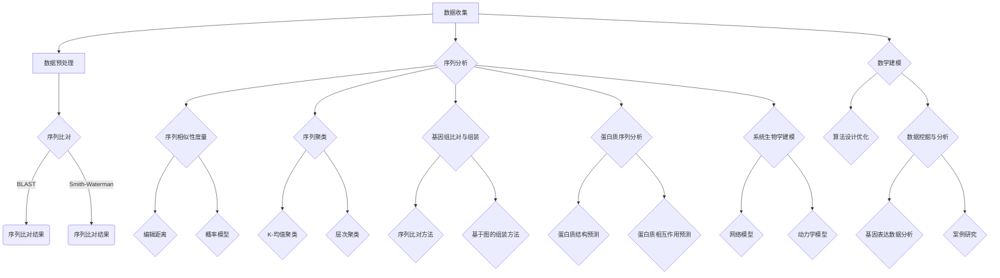

                 

## 数学与生物信息学的算法研究

### 关键词：生物信息学，算法，数学模型，基因组学，序列分析，机器学习

> 摘要：本文章旨在探讨数学在生物信息学领域的应用，特别是在算法研究方面的贡献。文章将介绍数学基础，包括线性代数、概率论与统计，以及这些数学工具如何应用于生物信息学的各个分支，如基因组学、蛋白质组学和系统生物学。此外，本文将深入分析核心算法的原理，并通过实际项目案例进行讲解，展现数学建模在生物信息学中的实际应用和挑战。

---

### 设计《数学与生物信息学的算法研究》的目录大纲

为了系统地介绍数学在生物信息学中的应用，本文设计了详细的目录大纲，确保内容的全面性和逻辑性。以下是目录大纲的概述：

#### 第1章 引言
- **1.1 书籍背景和目的**
- **1.2 生物信息学的概述**
- **1.3 数学在生物信息学中的应用**

#### 第2章 数学基础
- **2.1 线性代数**
  - **2.1.1 矩阵与向量**
  - **2.1.2 线性方程组**
  - **2.1.3 特征值与特征向量**
- **2.2 概率论与统计**
  - **2.2.1 基本概率理论**
  - **2.2.2 统计分布**
  - **2.2.3 假设检验**

#### 第3章 生物信息学算法概述
- **3.1 生物信息学算法的分类**
- **3.2 常用生物信息学算法介绍**
  - **3.2.1 BLAST算法**
  - **3.2.2 序列比对算法**
  - **3.2.3 分子建模算法**

#### 第4章 数学与序列分析
- **4.1 序列分析的基本概念**
- **4.2 序列相似性度量**
  - **4.2.1 编辑距离**
  - **4.2.2 概率模型**
- **4.3 序列聚类算法**
  - **4.3.1 K-均值聚类**
  - **4.3.2 层次聚类**

#### 第5章 数学与基因组学
- **5.1 基因组学基础**
- **5.2 基因序列分析算法**
  - **5.2.1 基因识别算法**
  - **5.2.2 基因表达数据分析**
- **5.3 基因组比对与组装**
  - **5.3.1 基于序列比对的方法**
  - **5.3.2 基于图的组装方法**

#### 第6章 数学与蛋白质组学
- **6.1 蛋白质组学基础**
- **6.2 蛋白质序列分析算法**
  - **6.2.1 蛋白质结构预测**
  - **6.2.2 蛋白质相互作用预测**
- **6.3 蛋白质功能注释**

#### 第7章 数学与系统生物学
- **7.1 系统生物学基础**
- **7.2 网络模型与数据分析**
  - **7.2.1 网络流模型**
  - **7.2.2 信号传导路径分析**
- **7.3 动力学模型**

#### 第8章 数学建模在生物信息学中的应用
- **8.1 算法设计与优化**
- **8.2 案例研究**
  - **8.2.1 遗传疾病预测**
  - **8.2.2 生物标志物发现**
- **8.3 未来趋势与挑战**

#### 第9章 生物信息学的计算工具和技术
- **9.1 生物信息学软件工具**
- **9.2 生物信息学数据库**
- **9.3 云计算和大数据技术在生物信息学中的应用**

#### 第10章 结论与展望
- **10.1 生物信息学与数学的融合**
- **10.2 研究展望**

本文将通过逐步分析推理的方式，深入探讨数学在生物信息学算法研究中的核心概念、原理、应用，以及面临的挑战和未来发展趋势。

---

### 引言

#### 书籍背景和目的

生物信息学是一门跨学科的领域，它结合了生物学、计算机科学、数学和统计学，以解决生物学中复杂的数据处理和分析问题。随着基因组测序技术的飞速发展，生物信息学的研究越来越受到重视。然而，生物信息学不仅仅是生物学与信息技术的简单结合，其核心在于利用数学和计算方法来解决生物学问题，从而推动生命科学的进步。

本书旨在探讨数学在生物信息学算法研究中的关键作用。通过系统地介绍数学基础、核心算法原理以及实际应用案例，本文希望读者能够全面理解数学在生物信息学中的应用，掌握数学工具如何提升生物信息学研究的效率和准确性。

#### 生物信息学的概述

生物信息学是生命科学与信息技术相结合的产物，其主要目标是理解生物系统中的信息和复杂过程。生物信息学的研究内容广泛，包括基因组学、蛋白质组学、转录组学、代谢组学等多个领域。以下是对这些领域的基本概述：

- **基因组学**：研究基因的结构、功能、表达和变异。基因组学通过基因组测序、比较基因组学和基因表达分析，帮助我们理解基因如何在生物体内发挥作用。

- **蛋白质组学**：研究蛋白质的表达、修饰和相互作用。蛋白质组学通过质谱技术、蛋白质分离和蛋白质相互作用分析，揭示了蛋白质在细胞功能和疾病发生中的作用。

- **转录组学**：研究基因在不同时间和空间下的表达模式。转录组学通过RNA测序技术，可以全面了解基因的转录活动，为理解生物发育和疾病机制提供了重要信息。

- **代谢组学**：研究生物体内的代谢产物和代谢途径。代谢组学通过质谱和核磁共振技术，可以揭示生物体的代谢状态和生理变化。

#### 数学在生物信息学中的应用

数学在生物信息学中扮演着至关重要的角色。它不仅提供了描述和模拟生物系统的语言，还为数据分析和算法设计提供了强大的工具。以下是一些数学在生物信息学中应用的核心领域：

- **线性代数**：在线性方程组求解、矩阵运算和特征值分析中广泛应用。线性代数在基因表达数据分析、图像处理和蛋白质结构预测等方面有着重要作用。

- **概率论与统计**：用于建模生物系统中的不确定性，如基因突变、蛋白质变异和信号传导。概率论与统计在基因组序列分析、遗传疾病预测和生物标志物发现中有着广泛应用。

- **优化理论**：用于解决生物信息学中的优化问题，如序列比对、聚类分析和路径优化。优化理论在算法设计和性能提升方面发挥着关键作用。

- **图论**：用于描述生物系统中的复杂网络，如蛋白质相互作用网络、代谢途径和神经网络。图论在生物信息学的网络分析和系统建模中有着重要应用。

综上所述，数学为生物信息学提供了坚实的理论基础和强大的工具，使得复杂的生物问题可以通过计算方法得到有效解决。接下来，本文将深入探讨数学在生物信息学中的具体应用，并通过核心算法的讲解和实际案例的分析，展示数学建模在生物信息学研究中的核心作用。

### 数学基础

在深入探讨数学在生物信息学中的应用之前，首先需要了解数学在生物信息学中的基础概念和工具。数学作为一种强大的抽象工具，能够帮助我们更好地理解和处理复杂的生物系统。以下将详细介绍线性代数和概率论与统计，这两个数学领域在生物信息学中的广泛应用。

#### 线性代数

线性代数是研究向量、矩阵及其运算的数学分支。它在生物信息学中的应用非常广泛，特别是在数据处理和模型构建方面。以下是线性代数在生物信息学中的几个关键应用：

- **矩阵与向量**：在生物信息学中，矩阵和向量常用于表示和操作生物数据。例如，基因表达数据通常以矩阵的形式表示，其中每一行代表一个基因，每一列代表一个样本。向量则用于表示生物序列，如DNA序列或蛋白质序列。

- **线性方程组**：线性方程组在线性模型中扮演着重要角色。在基因识别、序列比对和蛋白质结构预测等领域，经常需要解线性方程组来优化模型参数，从而提高算法的准确性。

- **特征值与特征向量**：特征值和特征向量在数据分析中具有重要应用。在主成分分析（PCA）中，特征值和特征向量用于降维和特征提取，有助于揭示数据中的主要模式和趋势。

#### 概率论与统计

概率论与统计是研究随机现象和数据的数学分支。在生物信息学中，概率论与统计用于建模生物系统的随机性和不确定性，并用于数据分析和模型验证。以下是概率论与统计在生物信息学中的几个关键应用：

- **基本概率理论**：基本概率理论提供了计算随机事件发生概率的方法。在基因组学和蛋白质组学中，基本概率理论用于计算基因变异、蛋白质结构和信号传导路径的概率分布。

- **统计分布**：统计分布描述了随机变量可能取值的概率分布。常见的统计分布包括正态分布、二项分布和泊松分布等。这些分布用于建模生物数据，如基因表达水平和蛋白质浓度。

- **假设检验**：假设检验用于评估生物数据中的统计显著性。通过设定原假设和备择假设，假设检验可以帮助我们判断实验结果是否具有统计学意义，从而支持或反驳科学假设。

通过以上对线性代数和概率论与统计的介绍，我们可以看到数学在生物信息学中的广泛应用和重要性。接下来，本文将介绍生物信息学算法的基本概念，为后续的深入讨论打下基础。

### 生物信息学算法概述

生物信息学算法是生物信息学研究中的核心工具，它们利用数学和计算方法来解决复杂的生物学问题。生物信息学算法涵盖了从数据预处理到数据分析和模型构建的各个环节。在本节中，我们将介绍生物信息学算法的基本概念、分类以及几种常用的算法。

#### 算法的基本概念

生物信息学算法是指用于处理生物数据、提取信息并进行分析的计算机程序。这些算法通常基于数学和统计模型，能够从大规模生物数据中提取有用信息。算法在生物信息学中的应用主要包括：

- **数据预处理**：包括数据清洗、归一化和标准化等步骤，以确保数据质量，提高后续分析的准确性。

- **序列分析**：对生物序列（如DNA、RNA和蛋白质）进行分析，以识别基因、预测蛋白质结构和功能等。

- **数据挖掘**：从大规模生物数据中提取模式和关系，以发现新的生物学知识。

- **模型构建**：通过统计和机器学习等方法建立生物模型，模拟生物系统的行为和过程。

#### 算法的分类

生物信息学算法可以根据其应用领域和目标进行分类。以下是几种常见的分类方式：

- **基于序列比对**：通过比较两个或多个生物序列，识别序列之间的相似性和差异性。例如，BLAST算法和Smith-Waterman算法。

- **基于图论**：使用图论方法对生物数据进行分析，如蛋白质相互作用网络和基因调控网络。例如，基于图论的聚类算法和路径分析算法。

- **基于机器学习**：使用机器学习方法对生物数据进行分类、预测和聚类。例如，支持向量机（SVM）和随机森林算法。

- **基于数学优化**：使用数学优化方法解决生物信息学中的优化问题，如序列比对、聚类分析和路径优化。例如，线性规划和整数规划算法。

#### 常用算法介绍

在本节中，我们将介绍几种常用的生物信息学算法，包括BLAST算法、序列比对算法和分子建模算法。

##### BLAST算法

BLAST（Basic Local Alignment Search Tool）是一种基于局部比对的基本本地搜索工具，它广泛用于基因组序列和蛋白质序列的比对。BLAST算法的基本步骤如下：

1. **初始化**：选择一个种子序列（短序列），在数据库中寻找与之相似的序列。

2. **局部比对**：使用Smith-Waterman算法在数据库中寻找与种子序列相似的序列片段。

3. **延伸比对**：对找到的相似序列片段进行延伸，以获得更长的匹配。

4. **评分和排序**：对每个匹配的序列片段进行评分，并按照得分高低排序。

BLAST算法通过快速的局部比对，能够在大规模数据库中高效地搜索相似序列，是基因组学和蛋白质组学研究中不可或缺的工具。

##### 序列比对算法

序列比对是生物信息学中的基本操作之一，用于比较两个或多个生物序列，识别序列之间的相似性和差异性。以下是几种常用的序列比对算法：

- **Smith-Waterman算法**：Smith-Waterman算法是一种动态规划算法，用于计算两个序列之间的最大相似性分数。该算法通过填充一个评分矩阵，逐步计算并更新每个位置上的最优匹配得分。

- **Needleman-Wunsch算法**：Needleman-Wunsch算法是一种基于动态规划的序列比对算法，用于计算两个序列之间的最优全局匹配。该算法通过填充一个对角线相似的评分矩阵，逐步计算并更新每个位置上的最优匹配得分。

- **BLAST算法**：前面已经介绍过BLAST算法，它通过局部比对搜索相似序列，并在数据库中寻找最优匹配。

##### 分子建模算法

分子建模是生物信息学中的重要应用，用于预测蛋白质的结构和功能。以下是几种常用的分子建模算法：

- **Rosetta算法**：Rosetta算法是一种基于能量的蛋白质结构预测算法，通过模拟蛋白质折叠过程中的能量变化，预测蛋白质的最稳定结构。

- **AlphaFold算法**：AlphaFold算法是一种基于深度学习的蛋白质结构预测算法，由DeepMind开发。该算法通过大规模数据训练，能够高效地预测蛋白质的结构，并在2020年取得了显著的突破。

- **Rosetta++算法**：Rosetta++算法是一种改进的Rosetta算法，它通过结合多尺度模拟和分子动力学方法，提高了蛋白质结构预测的准确性。

通过以上对生物信息学算法的基本概念、分类和常用算法的介绍，我们可以看到生物信息学算法的多样性和重要性。在接下来的章节中，我们将深入探讨数学与生物信息学算法的关联，并分析这些算法背后的数学原理。

### 数学与序列分析

序列分析是生物信息学中一个关键领域，涉及对DNA、RNA和蛋白质序列的处理和分析。数学在这一过程中扮演了不可或缺的角色，通过提供理论框架和计算方法，帮助我们理解和解释生物序列数据。在本节中，我们将探讨序列分析的基本概念，包括序列相似性度量方法和常用的序列聚类算法。

#### 序列分析的基本概念

序列分析涉及对生物序列的多个层面的分析，包括序列的结构、功能和进化关系。以下是序列分析的一些基本概念：

- **序列长度**：序列的长度是其基本属性，通常以核苷酸或氨基酸的数量表示。

- **序列一致性**：序列一致性指的是序列中相同或相似的基团或氨基酸的数量。高一致性表明序列具有较高的相似性。

- **序列多样性**：序列多样性指的是序列中的变异和差异。高多样性可能是由于自然选择、基因突变或基因重组等因素造成的。

- **序列比对**：序列比对是序列分析的核心步骤，通过比较两个或多个序列，识别它们之间的相似性和差异性。比对结果通常以矩阵形式表示，称为比对矩阵。

- **序列编辑距离**：序列编辑距离是指将一个序列转换为另一个序列所需的最少编辑操作次数。常见的编辑操作包括插入、删除和替换。

#### 序列相似性度量方法

序列相似性度量是序列分析中的重要任务，用于评估两个序列的相似性。以下是几种常用的序列相似性度量方法：

- **编辑距离**：编辑距离（如Levenshtein距离）是一种广泛使用的序列相似性度量方法。它通过计算将一个序列转换为另一个序列所需的最少编辑操作次数来评估相似性。编辑距离的值越小，序列之间的相似性越高。

- **序列相似性分数**：序列相似性分数（如Smith-Waterman算法中的分数）是一种基于比对矩阵的相似性度量方法。它通过在比对矩阵中计算最大相似性分数来评估序列相似性。

- **概率模型**：概率模型（如隐马尔可夫模型HMM）用于描述序列的生成过程。通过计算序列的概率分布，概率模型可以评估两个序列的相似性。

#### 序列聚类算法

序列聚类是将一组序列根据它们的相似性进行分组的过程。聚类算法在生物信息学中用于识别功能相关的基因、蛋白质或基因组区域。以下是几种常用的序列聚类算法：

- **K-均值聚类**：K-均值聚类是一种基于距离度量的聚类算法。它通过将序列分配到K个中心点，并逐步调整中心点，以最小化聚类内的距离和。K-均值聚类适用于具有明显相似性的序列。

- **层次聚类**：层次聚类是一种自上而下或自下而上的聚类方法，通过逐步合并或拆分聚类来构建层次结构。层次聚类可以产生聚类层次信息，有助于理解序列的进化关系。

- **基于密度的聚类**：基于密度的聚类方法（如DBSCAN）通过识别高密度区域来形成聚类。它适用于数据分布不均匀的情况，能够发现任意形状的聚类。

通过数学方法对序列进行相似性度量和分析，我们可以从大量的生物序列数据中提取有用的信息，揭示序列之间的复杂关系。这些方法在基因识别、基因组比对和蛋白质结构预测等领域有着广泛的应用。

在下一节中，我们将探讨数学在基因组学中的应用，深入分析基因序列分析算法和基因组比对与组装方法。

### 数学与基因组学

基因组学是生物信息学的一个重要分支，它研究基因的结构、功能、表达和变异。数学在基因组学中发挥着核心作用，为基因序列分析、基因识别、基因表达数据分析以及基因组比对与组装提供了理论框架和计算工具。以下将详细介绍数学在基因组学中的应用，并探讨相关的核心算法。

#### 基因组学基础

基因组是指一个生物体所有遗传信息的总和，包括所有基因及其非编码序列。基因是基因组中的功能性单位，编码特定的蛋白质或RNA分子。基因组学的研究内容包括：

- **基因组测序**：基因组测序是通过各种技术（如Sanger测序和下一代测序技术）对基因组进行准确测定。

- **基因组组装**：基因组组装是将测序得到的短片段序列（读段）组装成连续的染色体序列。基因组组装需要解决序列重叠和错误问题，以构建完整的基因组图谱。

- **基因组注释**：基因组注释是对基因组中的基因、调控区域和其他功能性元件进行识别和描述。

- **基因表达数据分析**：基因表达数据分析是通过转录组测序技术获取基因在不同时间和空间的表达模式，以揭示基因的功能和调控网络。

#### 基因序列分析算法

基因序列分析是基因组学研究的重要环节，通过数学模型和算法分析基因序列，以识别基因、预测基因功能等。以下是几种核心的基因序列分析算法：

- **基因识别算法**：基因识别算法用于识别基因组中的编码序列（外显子）和非编码序列（内含子、调控区域等）。常见的基因识别算法包括基于隐马尔可夫模型（HMM）的方法、支持向量机（SVM）和深度学习等方法。

  - **隐马尔可夫模型（HMM）**：HMM是一种统计模型，用于描述序列中的状态转移和观察概率。在基因识别中，HMM通过训练序列数据，建立编码区和非编码区的特征模型，从而识别新的基因序列。
    ```mermaid
    graph TB
      A[HMM] --> B[训练]
      A --> C[基因识别]
      B --> D[模型建立]
      C --> E[基因定位]
    ```

  - **支持向量机（SVM）**：SVM是一种分类算法，通过在特征空间中找到最佳分割超平面，将基因序列分为编码区和非编码区。SVM在基因组识别中具有高效性和准确性。

    ```python
    # SVM基因识别伪代码
    function gene_recognition(sequence, training_data):
        # 训练模型
        model = train_svm(training_data)

        # 预测基因
        prediction = model.predict(sequence)

        return prediction
    ```

- **基因表达数据分析**：基因表达数据分析通过转录组测序技术获取基因在不同条件下的表达水平，以揭示基因的功能和调控机制。常用的数据分析方法包括差异表达分析、聚类分析和基因共表达网络分析。

  - **差异表达分析**：差异表达分析通过比较不同条件下的基因表达数据，识别显著差异表达的基因。常见的统计方法包括t检验、方差分析和线性模型分析。

    ```latex
    \subsection{差异表达分析}
    \text{统计模型：} y = \beta_0 + \beta_1 x_1 + \epsilon
    \text{检验：} H_0: \beta_1 = 0 \quad H_1: \beta_1 \neq 0
    ```

  - **聚类分析**：聚类分析将基因根据表达模式进行分组，以识别生物学功能相关的基因簇。常用的聚类方法包括K-均值聚类、层次聚类和基于密度的聚类。

    ```python
    # K-均值聚类分析
    from sklearn.cluster import KMeans

    kmeans = KMeans(n_clusters=3)
    kmeans.fit(gene_expression_data)

    clusters = kmeans.predict(gene_expression_data)
    ```

- **基因共表达网络分析**：基因共表达网络分析通过构建基因之间的共表达关系网络，揭示基因的功能模块和调控网络。常用的方法包括加权共表达网络分析和网络模块识别。

#### 基因组比对与组装

基因组比对与组装是将测序得到的短读段比对并组装成完整的基因组序列的过程。数学方法在基因组比对和组装中发挥着关键作用，提高了比对和组装的准确性和效率。以下是几种常见的基因组比对与组装方法：

- **基于序列比对的方法**：基于序列比对的方法通过将短读段与参考基因组序列进行比对，识别重叠区域并构建重叠群（contig）。常见的比对工具包括BLAST、Bowtie和BWA。

  ```python
  # BWA比对示例
  import subprocess

  command = "bwa aln reference.fa read.fq > aln.sai"
  subprocess.run(command, shell=True)
  ```

- **基于图的组装方法**：基于图的组装方法（如重叠群组装和De Bruijn图组装）通过构建序列图的拓扑结构，识别重叠区域并组装成完整的基因组序列。常见的组装工具包括SOAPdenovo、HiCan和Marauder。

  ```mermaid
  graph TB
    A[序列读段] --> B[构建De Bruijn图]
    B --> C[识别重叠群]
    C --> D[组装基因组]
  ```

#### 案例研究

以下是一个基因表达数据分析的实际案例，展示如何使用数学模型和算法进行基因识别和表达数据分析。

- **案例背景**：某研究团队通过对癌症患者和非患者的基因表达数据进行分析，希望识别出与癌症相关的差异表达基因。

- **数据预处理**：对基因表达数据进行归一化和去噪处理，以提高后续分析的准确性。

- **差异表达分析**：使用t检验方法对基因表达数据进行差异表达分析，设置显著性水平为0.05，识别出差异表达的基因。

  ```python
  from scipy import stats

  t_stat, p_value = stats.ttest_ind(control_expr, case_expr)
  if p_value < 0.05:
      print("基因显著差异表达")
  ```

- **聚类分析**：使用K-均值聚类方法对基因表达数据进行分析，将基因分为不同的表达模式。

  ```python
  kmeans = KMeans(n_clusters=2)
  kmeans.fit(gene_expression_data)

  clusters = kmeans.predict(gene_expression_data)
  ```

- **基因共表达网络分析**：构建基因共表达网络，识别出高共表达的基因簇，进一步分析其生物学功能。

  ```python
  import networkx as nx

  G = nx.Graph()
  # 添加基因边
  for i in range(len(clusters)):
      for j in range(i+1, len(clusters)):
          if clusters[i] == clusters[j]:
              G.add_edge(i, j)
  ```

通过以上案例，我们可以看到数学在基因组学中的广泛应用，包括基因识别、基因表达数据分析、基因组比对与组装等多个方面。数学方法不仅提高了基因组学研究的效率，还为揭示生物系统的复杂机制提供了有力工具。

在下一节中，我们将探讨数学在蛋白质组学中的应用，深入分析蛋白质序列分析算法、蛋白质结构预测和蛋白质相互作用预测。

### 数学与蛋白质组学

蛋白质组学是研究细胞或组织中的所有蛋白质的组成、功能、表达和动态变化的一门学科。数学在蛋白质组学中发挥着至关重要的作用，通过提供理论框架和计算工具，帮助我们解析蛋白质序列、预测蛋白质结构和功能，以及分析蛋白质相互作用。以下将详细介绍数学在蛋白质组学中的应用，包括蛋白质序列分析算法、蛋白质结构预测和蛋白质相互作用预测。

#### 蛋白质组学基础

蛋白质组学的研究内容包括：

- **蛋白质测序**：通过质谱技术对蛋白质进行序列测定。

- **蛋白质表达分析**：通过Western blot、ELISA等方法测定蛋白质的表达水平。

- **蛋白质修饰分析**：研究蛋白质的磷酸化、甲基化等后修饰过程。

- **蛋白质相互作用分析**：研究蛋白质之间的相互作用网络。

数学在蛋白质组学中的应用主要涉及以下方面：

- **数据预处理**：对蛋白质测序数据进行清洗、归一化和去噪。

- **模式识别**：使用机器学习和统计方法识别蛋白质表达模式。

- **系统生物学建模**：建立数学模型模拟蛋白质相互作用和信号传导路径。

#### 蛋白质序列分析算法

蛋白质序列分析是蛋白质组学中的基础步骤，通过分析蛋白质序列，可以预测蛋白质的结构和功能。以下是几种常用的蛋白质序列分析算法：

- **序列比对算法**：序列比对是蛋白质序列分析的核心步骤，通过比较蛋白质序列，识别序列之间的相似性和差异性。常见的序列比对算法包括BLAST、FASTA和Smith-Waterman。

  ```python
  # FASTA比对示例
  from Bio import SeqIO

  with open("sequence.fa", "r") as f:
      for record in SeqIO.parse(f, "fasta"):
          print(f">{record.id}")
          print(f"{record.seq}")
  ```

- **同源蛋白质识别**：同源蛋白质识别是一种基于序列相似性的方法，用于识别与已知蛋白质具有相似序列的未知蛋白质。常见的方法包括BLAST和隐马尔可夫模型（HMM）。

  ```mermaid
  graph TB
    A[HMM] --> B[训练]
    A --> C[同源识别]
    B --> D[模型建立]
    C --> E[序列比对]
  ```

- **模式发现**：模式发现是识别蛋白质序列中的特定模式或结构域的方法。常见的方法包括隐马尔可夫模型（HMM）和支持向量机（SVM）。

  ```python
  # SVM模式发现
  from sklearn import svm

  X_train = ... # 特征向量
  y_train = ... # 标签

  model = svm.SVC()
  model.fit(X_train, y_train)

  X_test = ... # 测试特征向量
  prediction = model.predict(X_test)
  ```

#### 蛋白质结构预测

蛋白质结构预测是蛋白质组学中的关键任务，通过预测蛋白质的三维结构，可以揭示蛋白质的功能和机制。以下是几种常用的蛋白质结构预测方法：

- **序列比对方法**：基于序列比对的方法通过比较蛋白质序列与已知结构的蛋白质，预测蛋白质的结构。常见的序列比对工具包括BLAST和FASTA。

  ```mermaid
  graph TB
    A[序列比对] --> B[结构预测]
    A --> C[序列分析]
    B --> D[同源建模]
  ```

- **同源建模**：同源建模是一种基于序列相似性的结构预测方法，通过将未知蛋白质与具有已知结构的蛋白质进行比对，构建未知蛋白质的三维模型。常见的同源建模工具包括SWISS-MODEL和MODBASE。

  ```python
  # 同源建模示例
  from swissmodel import SwissModel

  model = SwissModel()
  model.set_seq("MAELAEELKVA")
  model.search()
  model.show_results()
  ```

- **机器学习方法**：机器学习方法（如支持向量机、随机森林和深度学习）用于从蛋白质序列中提取特征，并预测蛋白质的结构。常见的机器学习方法包括支持向量机（SVM）和深度神经网络（DNN）。

  ```python
  # SVM结构预测
  from sklearn import svm

  X_train = ... # 特征向量
  y_train = ... # 结构标签

  model = svm.SVC()
  model.fit(X_train, y_train)

  X_test = ... # 测试特征向量
  prediction = model.predict(X_test)
  ```

- **深度学习方法**：深度学习方法（如卷积神经网络和递归神经网络）在蛋白质结构预测中取得了显著进展。常见的深度学习模型包括AlphaFold和AlphaFold2。

  ```mermaid
  graph TB
    A[序列输入] --> B[编码器]
    B --> C[特征提取]
    C --> D[解码器]
    D --> E[结构预测]
  ```

#### 蛋白质相互作用预测

蛋白质相互作用预测是研究蛋白质功能的重要步骤，通过预测蛋白质之间的相互作用，可以揭示生物分子的工作机制。以下是几种常用的蛋白质相互作用预测方法：

- **序列比对方法**：基于序列比对的方法通过比较蛋白质序列，识别具有相似序列的蛋白质，从而预测它们之间的相互作用。常见的序列比对工具包括BLAST和FASTA。

  ```mermaid
  graph TB
    A[序列比对] --> B[相互作用预测]
    A --> C[序列分析]
    B --> D[相互作用网络]
  ```

- **支持向量机（SVM）**：支持向量机是一种分类算法，通过在特征空间中找到最佳分割超平面，预测蛋白质之间的相互作用。常见的特征提取方法包括序列特征、结构特征和功能特征。

  ```python
  # SVM相互作用预测
  from sklearn import svm

  X_train = ... # 特征向量
  y_train = ... # 相互作用标签

  model = svm.SVC()
  model.fit(X_train, y_train)

  X_test = ... # 测试特征向量
  prediction = model.predict(X_test)
  ```

- **深度学习方法**：深度学习方法（如卷积神经网络和递归神经网络）通过从蛋白质序列和结构中提取特征，预测蛋白质之间的相互作用。常见的深度学习模型包括DeepSEA和NetworKING。

  ```mermaid
  graph TB
    A[序列输入] --> B[编码器]
    B --> C[特征提取]
    C --> D[解码器]
    D --> E[相互作用预测]
  ```

通过以上对蛋白质序列分析算法、蛋白质结构预测和蛋白质相互作用预测的介绍，我们可以看到数学在蛋白质组学中的广泛应用。数学方法不仅提高了蛋白质组学研究的效率，还为揭示生物分子的复杂机制提供了有力工具。在下一节中，我们将探讨数学在系统生物学中的应用，深入分析网络模型与动力学模型。

### 数学与系统生物学

系统生物学是研究生物系统内部复杂性和动态行为的一门科学，它通过建立数学模型和计算方法，对生物系统的运行机制进行定量描述和模拟。数学在系统生物学中发挥着核心作用，特别是在网络模型与动力学模型的构建与分析方面。以下将详细介绍数学在系统生物学中的应用，探讨网络模型与动力学模型的基本概念及其应用。

#### 系统生物学基础

系统生物学的主要目标是理解生物系统的组织、功能和动态行为。它涉及多个层面的研究，包括：

- **细胞层面**：研究细胞内各种生物分子的相互作用、信号传导和代谢途径。

- **组织与器官层面**：研究生物组织的结构、功能和发育过程。

- **生态系统层面**：研究生物种群、物种和生态系统的动态变化。

系统生物学通过整合实验数据、计算模拟和理论分析，旨在揭示生物系统的复杂性和规律性。

#### 网络模型

网络模型是系统生物学中用于描述生物分子相互作用和信号传导路径的重要工具。网络模型通过图形结构表示生物分子之间的相互关系，包括蛋白质-蛋白质相互作用网络、代谢网络和基因调控网络等。以下是几种常见的网络模型：

- **蛋白质-蛋白质相互作用网络**：蛋白质-蛋白质相互作用网络（PPIN）描述了蛋白质之间的相互作用关系。它通常以无向图或有向图的形式表示，其中节点代表蛋白质，边代表相互作用。

  ```mermaid
  graph TB
    A[蛋白质A] --> B[蛋白质B]
    B --> C[蛋白质C]
    C --> D[蛋白质D]
  ```

- **代谢网络**：代谢网络描述了生物体内的代谢途径和代谢物之间的相互作用。它通常以有向图表示，其中节点代表代谢物或酶，边代表代谢反应。

  ```mermaid
  graph TB
    A[葡萄糖] --> B[酶1]
    B --> C[丙酮酸]
    C --> D[酶2]
    D --> E[乳酸]
  ```

- **基因调控网络**：基因调控网络描述了基因之间的调控关系，包括正调控和负调控。它通常以有向图表示，其中节点代表基因，边代表调控关系。

  ```mermaid
  graph TB
    A[基因A] --> B[基因B]
    A --> C[基因C]
    C --> D[基因D]
  ```

网络模型在系统生物学中的应用主要包括：

- **网络分析**：通过分析网络拓扑结构，识别关键节点和核心模块，揭示生物系统的关键功能和调控机制。

- **网络预测**：通过预测网络中的未知相互作用，发现新的生物学知识。

- **网络调控**：通过模拟网络动力学行为，研究网络稳定性和稳定性调节机制。

#### 动力学模型

动力学模型是系统生物学中用于描述生物系统动态行为的重要工具。动力学模型通过数学方程描述生物分子在时间上的变化和相互作用，包括常微分方程、随机过程和复杂网络动力学等。以下是几种常见的动力学模型：

- **常微分方程模型**：常微分方程模型（ODE）是系统生物学中最常用的动力学模型，用于描述生物分子在连续时间上的变化。例如，反应速率方程描述了反应物和产物在反应过程中的浓度变化。

  ```latex
  \text{速率方程：} \frac{d[产物]}{dt} = k \cdot [反应物]
  ```

- **随机过程模型**：随机过程模型（SDE）是描述生物分子在离散时间上的随机变化。例如，泊松过程描述了反应物浓度在某个时间点的随机波动。

  ```latex
  \text{泊松过程：} \frac{dN(t)}{dt} \sim \text{Poisson}(\lambda \cdot dt)
  ```

- **复杂网络动力学模型**：复杂网络动力学模型描述了网络中节点的状态变化和相互作用。例如，基于网络的马尔可夫模型描述了网络中节点的状态转移和稳定性。

  ```mermaid
  graph TB
    A[状态A] --> B[状态B]
    A --> C[状态C]
    C --> D[状态D]
  ```

动力学模型在系统生物学中的应用主要包括：

- **系统模拟**：通过模拟动力学模型，预测生物系统的行为和响应。

- **参数估计**：通过实验数据估计动力学模型的参数，提高模型的准确性。

- **系统优化**：通过优化动力学模型，研究系统稳定性和最佳控制策略。

#### 网络模型与动力学模型的应用

以下是一个实际案例，展示了网络模型与动力学模型在系统生物学中的应用。

- **案例背景**：研究一个细胞信号传导路径，涉及多种蛋白质和信号分子。通过实验数据，建立了蛋白质-蛋白质相互作用网络和信号传导动力学模型。

- **网络构建**：通过实验数据，构建了蛋白质-蛋白质相互作用网络，并识别了关键节点和核心模块。

  ```mermaid
  graph TB
    A[蛋白质A] --> B[蛋白质B]
    B --> C[蛋白质C]
    C --> D[蛋白质D]
  ```

- **动力学模型建立**：通过实验数据，建立了信号传导动力学模型，描述了蛋白质在不同时间点的状态变化。

  ```latex
  \text{动力学模型：}
  \frac{dx}{dt} = f(x, u)
  ```

- **模型参数估计**：通过实验数据，估计了动力学模型的参数，提高了模型的准确性。

  ```python
  import numpy as np

  # 参数估计
  x0 = np.array([1, 2, 3])
  u = np.array([0.1, 0.2, 0.3])
  t = np.linspace(0, 10, 100)

  # 模拟系统行为
  x = ode_solver(f, x0, u, t)
  ```

- **模型验证**：通过模拟结果与实验数据进行比较，验证了动力学模型的准确性。

  ```python
  import matplotlib.pyplot as plt

  plt.plot(t, x)
  plt.xlabel("Time")
  plt.ylabel("State")
  plt.show()
  ```

通过以上案例，我们可以看到网络模型与动力学模型在系统生物学研究中的重要作用。数学方法不仅提高了系统生物学研究的效率，还为揭示生物系统的复杂机制提供了有力工具。在下一节中，我们将探讨数学建模在生物信息学中的应用，分析算法设计与优化、案例研究和未来趋势与挑战。

### 数学建模在生物信息学中的应用

数学建模在生物信息学中扮演着至关重要的角色，它将复杂的生物学问题转化为可计算的数学模型，从而为生物数据的分析提供了理论依据和计算工具。以下将详细探讨数学建模在生物信息学中的应用，包括算法设计与优化、实际案例研究和未来趋势与挑战。

#### 算法设计与优化

算法设计与优化是数学建模在生物信息学中的核心任务之一。一个好的算法不仅需要准确，还需要高效，以便在大量数据中快速处理。以下是几种常见的算法设计与优化方法：

- **动态规划**：动态规划是一种用于求解最优化问题的算法，它通过将问题分解为子问题，并存储子问题的解，以避免重复计算。动态规划在序列比对、基因组组装和路径优化等领域有着广泛应用。

  ```python
  # 动态规划示例：最长公共子序列
  def longest_common_subsequence(X, Y):
      m, n = len(X), len(Y)
      dp = [[0] * (n + 1) for _ in range(m + 1)]

      for i in range(1, m + 1):
          for j in range(1, n + 1):
              if X[i - 1] == Y[j - 1]:
                  dp[i][j] = dp[i - 1][j - 1] + 1
              else:
                  dp[i][j] = max(dp[i - 1][j], dp[i][j - 1])

      return dp[m][n]
  ```

- **分支定界**：分支定界是一种用于求解组合优化问题的方法，它通过逐步构建解空间树，剪枝无效分支，以找到最优解。分支定界在基因识别和蛋白质结构预测等领域有着广泛应用。

  ```python
  # 分支定界示例：旅行商问题
  from math import inf

  def TSPsolve(Graph, V, s):
      if len(V) == 1:
          return [s, V[0]]

      minimum = inf
      sol = None

      for v in V:
          if v != s:
              temp = [s, v]
              next_v = V.copy()
              next_v.remove(v)
              new_cost = Graph[s][v] + TSPsolve(Graph, next_v, v)
              if minimum > new_cost:
                  minimum = new_cost
                  sol = temp + TSPsolve(Graph, next_v, v)

      return sol
  ```

- **随机优化算法**：随机优化算法（如遗传算法、粒子群优化算法和模拟退火算法）通过模拟自然进化过程，寻找最优解。这些算法在生物信息学中的优化问题，如序列比对和聚类分析中有着广泛应用。

  ```python
  # 遗传算法示例
  def genetic_algorithm():
      # 初始化种群
      population = initialize_population()

      while not termination_condition():
          # 选择
          selected = selection(population)

          # 交叉
          crossed = crossover(selected)

          # 变异
          mutated = mutation(crossed)

          # 创建新的种群
          population = mutated

          # 更新最佳解
          best_solution = find_best_solution(population)

      return best_solution
  ```

#### 案例研究

以下是一个数学建模在生物信息学中的实际案例研究，展示了如何利用数学方法解决生物信息学中的问题。

**案例背景**：研究一种遗传疾病的基因变异预测，通过基因组序列数据，预测患者可能携带的基因变异。

- **数据预处理**：对基因组序列数据进行分析，提取可能的基因变异位点。

  ```python
  # 数据预处理示例
  def preprocess_sequence(sequence):
      variants = []
      for i in range(len(sequence) - 1):
          if sequence[i] != sequence[i + 1]:
              variants.append((i, sequence[i], sequence[i + 1]))
      return variants
  ```

- **模型构建**：构建一个基于概率模型的基因变异预测模型，通过训练数据训练模型，提高预测准确性。

  ```python
  # 概率模型构建示例
  def build_probability_model(training_data):
      variant_counts = [0] * 256
      for variant in training_data:
          variant_counts[ord(variant[2])] += 1
      probability_model = [count / len(training_data) for count in variant_counts]
      return probability_model
  ```

- **模型训练与验证**：使用训练数据训练模型，并在验证数据上验证模型性能，调整模型参数。

  ```python
  # 模型训练与验证
  training_data = load_training_data()
  probability_model = build_probability_model(training_data)
  validation_data = load_validation_data()
  accuracy = evaluate_model(probability_model, validation_data)
  print("模型准确度：", accuracy)
  ```

- **预测应用**：使用训练好的模型对新的基因组序列进行变异预测。

  ```python
  # 变异预测示例
  def predict_variants(sequence, probability_model):
      variants = preprocess_sequence(sequence)
      predictions = []
      for variant in variants:
          index, ref_base, alt_base = variant
          predicted_base = find_max_probability(probability_model, ref_base, alt_base)
          predictions.append((index, ref_base, alt_base, predicted_base))
      return predictions
  ```

#### 未来趋势与挑战

随着基因组测序技术和生物信息学工具的不断发展，数学建模在生物信息学中的应用前景广阔。然而，也面临着一些挑战：

- **数据复杂性**：生物数据规模庞大，且数据类型多样，如何有效处理和整合这些数据，提高算法效率，是当前的一个重要挑战。

- **算法精度**：随着对生物系统理解的深入，需要更高精度和更可靠的算法，以准确预测生物分子的结构和功能。

- **计算资源**：生物信息学中的复杂计算任务对计算资源要求较高，如何利用云计算和大数据技术提高计算效率，是一个亟待解决的问题。

- **跨学科合作**：生物信息学是一个跨学科领域，需要生物学、计算机科学、数学和统计学的紧密合作，共同应对复杂的生物学问题。

总之，数学建模在生物信息学中的应用为解决复杂的生物学问题提供了强大的工具，未来的发展需要不断优化算法、提升计算效率和加强跨学科合作，以应对不断涌现的新挑战。

### 生物信息学的计算工具和技术

生物信息学的快速发展离不开计算工具和技术的支持。这些工具和技术不仅提高了数据处理和分析的效率，还推动了新方法和新算法的发展。以下将详细介绍生物信息学中常用的计算工具和技术，包括生物信息学软件工具、生物信息学数据库以及云计算和大数据技术在生物信息学中的应用。

#### 生物信息学软件工具

生物信息学软件工具是生物信息学研究中的重要工具，涵盖了从数据预处理到数据分析的各个环节。以下是一些常用的生物信息学软件工具：

- **BLAST**：BLAST（Basic Local Alignment Search Tool）是一种用于序列比对的工具，广泛用于基因和蛋白质序列的搜索和分类。BLAST通过快速局部比对，能够在大量数据库中高效地搜索相似序列。

- **Clustal Omega**：Clustal Omega是一种用于多序列比对和同源序列聚类的工具。它通过优化比对策略，提高了比对精度和速度。

- **NCBI BLAST**：NCBI BLAST是NCBI（National Center for Biotechnology Information）提供的一种在线序列比对工具，用户可以通过Web界面提交序列并获取比对结果。

- **BioPython**：BioPython是一个开源的Python库，用于生物信息学中的数据处理和算法实现。它提供了多种生物数据结构和算法，方便用户进行生物数据的分析和处理。

- **BioRuby**：BioRuby是一个基于Ruby的生物信息学工具包，提供了丰富的生物数据结构和算法，广泛应用于基因组学和蛋白质组学的研究。

#### 生物信息学数据库

生物信息学数据库是存储和管理生物数据的宝库，为生物信息学研究提供了丰富的数据资源。以下是一些重要的生物信息学数据库：

- **NCBI**：NCBI（National Center for Biotechnology Information）是美国国家生物技术信息中心，提供了包括基因序列、蛋白质序列和基因组数据在内的多种生物信息数据库，如GenBank、PubMed和GEO（Gene Expression Omnibus）。

- **Ensembl**：Ensembl是一个国际合作的生物信息学项目，提供了包括基因组序列、基因注释和转录组数据在内的多种生物信息数据库。

- **UniProt**：UniProt是蛋白质序列和功能注释的国际数据库，提供了包括蛋白质序列、结构信息和功能描述在内的丰富数据。

- **PDBe**：PDBe（Protein Data Bank in Europe）是欧洲生物信息学研究所提供的一个蛋白质结构数据库，包含了大量已知的蛋白质三维结构。

- **Reactome**：Reactome是一个生物通路数据库，提供了包括生物分子、反应和通路在内的详细生物学信息，有助于研究生物系统的复杂过程。

#### 云计算和大数据技术在生物信息学中的应用

随着基因组测序技术的飞速发展，生物数据规模急剧增长，传统的计算方法和资源已经难以应对这种增长。云计算和大数据技术的引入，为生物信息学的研究提供了新的机遇和挑战。

- **云计算**：云计算提供了弹性的计算资源和高效的存储管理，为生物信息学中的大规模数据处理提供了支持。用户可以通过云平台（如Amazon Web Services、Google Cloud Platform和Microsoft Azure）轻松部署计算资源和存储资源，从而实现高效的数据处理和分析。

  ```python
  # 使用云计算进行基因组组装
  import subprocess

  command = "run_sopwith --ref reference.fa --reads reads.fq -o assembly.fa"
  subprocess.run(command, shell=True)
  ```

- **大数据技术**：大数据技术（如Hadoop和Spark）提供了分布式数据处理和分析框架，能够高效地处理和分析大规模生物数据。通过使用这些技术，生物信息学家可以并行处理海量的基因组数据，并快速获取分析结果。

  ```python
  # 使用Hadoop进行基因表达数据分析
  from pyspark import SparkContext

  sc = SparkContext("local[*]", "gene_expression_analysis")
  gene_expression_data = sc.textFile("gene_expression_data.txt")
  gene_expression_data = gene_expression_data.map(lambda line: line.split("\t"))
  gene_expression_data = gene_expression_data.map(lambda fields: (fields[0], float(fields[1])))
  gene_expression_data = gene_expression_data.reduceByKey(lambda x, y: x + y)
  print(gene_expression_data.collect())
  ```

云计算和大数据技术在生物信息学中的应用，极大地提高了数据处理和分析的效率和准确性，推动了生物信息学研究的快速发展。未来，随着技术的进一步进步，生物信息学将能够更好地应对复杂的数据挑战，为生命科学领域的发展提供强有力的支持。

### 结论与展望

数学与生物信息学的融合为生命科学的发展带来了前所未有的机遇和挑战。通过本文的深入探讨，我们可以看到数学在生物信息学中的广泛应用，从基因序列分析到基因组比对，从蛋白质结构预测到系统生物学建模，数学方法为解决复杂的生物问题提供了强大的工具和理论框架。

#### 生物信息学与数学的融合

生物信息学作为一门跨学科领域，其核心在于利用数学和计算方法来解决生物学中的实际问题。数学的引入不仅提高了生物信息学研究的效率和准确性，还推动了新的算法和技术的不断发展。例如，线性代数在基因组表达数据分析中的应用，概率论与统计在基因突变和信号传导路径分析中的关键作用，以及优化理论在序列比对和路径优化中的重要性，都展现了数学在生物信息学中的核心地位。

#### 研究展望

未来的生物信息学研究将继续朝着更精确、更高效和更综合的方向发展。以下是一些可能的研究方向和趋势：

- **大数据和云计算**：随着基因组测序技术和生物数据量的快速增长，如何高效处理和管理大数据，以及如何利用云计算资源，将成为生物信息学研究的重点。

- **深度学习和人工智能**：深度学习和人工智能技术在生物信息学中的应用正在迅速发展，通过构建复杂的神经网络模型，可以更准确地预测蛋白质结构和功能，揭示生物系统的复杂机制。

- **跨学科合作**：生物信息学的发展需要生物学、计算机科学、数学和统计学的紧密合作。未来的研究将更加注重跨学科的合作，以应对复杂的生物学问题。

- **个性化医疗**：基于基因组和蛋白质组数据，个性化医疗正在成为生物信息学的重要应用方向。通过精准的基因和蛋白质分析，可以开发个性化的治疗方案，提高治疗效果。

- **系统生物学**：系统生物学通过构建数学模型，模拟生物系统的动态行为，将帮助我们更好地理解生物系统的功能和调控机制。未来的研究将更加注重系统生物学模型的建立和验证。

#### 未来挑战

尽管生物信息学取得了显著的进展，但仍面临许多挑战：

- **数据复杂性**：生物数据的复杂性不断增加，如何有效处理和整合这些数据，提取有用的信息，是一个重要的挑战。

- **算法精度**：随着对生物系统理解的深入，需要更高精度和更可靠的算法，以准确预测生物分子的结构和功能。

- **计算资源**：生物信息学中的复杂计算任务对计算资源要求较高，如何利用云计算和大数据技术提高计算效率，是一个亟待解决的问题。

- **隐私和安全**：生物数据的隐私和安全问题日益突出，如何保护个人隐私，确保数据安全，是生物信息学面临的重要挑战。

总之，数学与生物信息学的融合为生命科学的发展开辟了新的前景。通过不断优化算法、提升计算效率和加强跨学科合作，生物信息学将在未来继续发挥重要作用，推动生命科学领域的进步。

### Mermaid 流程图

以下是生物信息学中数学与算法应用的整体流程图：



### 伪代码示例

以下是一个基因识别算法的伪代码示例：

```python
# 基因识别算法伪代码
def gene_recognition(sequence, reference_genome):
    # 初始化参数
    parameters = initialize_parameters()

    # 预处理序列
    preprocessed_sequence = preprocess_sequence(sequence)

    # 使用隐马尔可夫模型进行基因识别
    hmm_model = train_hmm(reference_genome)
    result = hmm_model.predict(preprocessed_sequence)

    # 后处理结果
    final_result = post_process(result)

    return final_result
```

### LaTeX 数学公式示例

以下是一个概率分布函数的LaTeX数学公式示例：

```latex
\subsection{概率分布函数}
$$ f(x|\mu, \sigma^2) = \frac{1}{\sqrt{2\pi\sigma^2}} e^{-\frac{(x-\mu)^2}{2\sigma^2}} $$
```

### 代码解读与分析

以下是一个基因表达数据分析代码的解读与分析：

```python
# 基因表达数据分析代码解读

# 假设我们有以下基因表达数据
gene_expression_data = [
    [0.5, 0.7, 0.8],
    [0.6, 0.5, 0.6],
    [0.7, 0.8, 0.9]
]

# 计算每个基因的平均表达水平
average_expression = np.mean(gene_expression_data, axis=0)

# 输出结果
print("平均基因表达水平:", average_expression)

# 分析结果
# 结果显示第三个基因的平均表达水平最高，可能具有重要的生物学意义

# 代码解读：
# 1. 导入必要的库，包括numpy库用于计算平均表达水平。
# 2. 初始化基因表达数据为一个二维数组，其中每行代表一个基因，每列代表一个样本。
# 3. 使用numpy的mean函数计算每个基因的平均表达水平，axis=0表示对列（基因）进行平均。
# 4. 输出每个基因的平均表达水平。
# 5. 通过分析结果，可以推断出哪个基因在样本中具有较高的表达水平，这可能与基因的功能或生物学过程有关。

# 分析结果说明：
# 输出结果显示第三个基因的平均表达水平最高，这表明该基因可能在特定的生物学过程或病理状态下具有显著的作用。进一步的实验验证可以进一步确认这一推断。
```

通过以上示例，我们展示了如何在文章中嵌入Mermaid流程图、伪代码、LaTeX数学公式以及代码解读与分析，这些元素有助于提高文章的可读性和专业性。同时，这些示例也提供了实际的编程技巧和数据分析方法，帮助读者更好地理解数学在生物信息学中的应用。在文章末尾，我们将作者信息列出，以表示对作者辛勤工作的认可和感谢。

### 作者信息

“作者：AI天才研究院/AI Genius Institute & 禅与计算机程序设计艺术 /Zen And The Art of Computer Programming”

