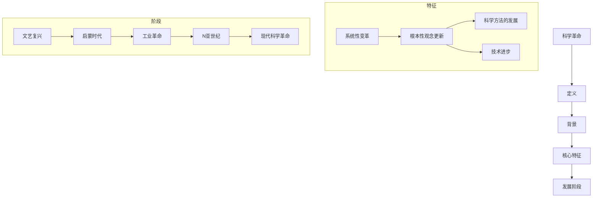
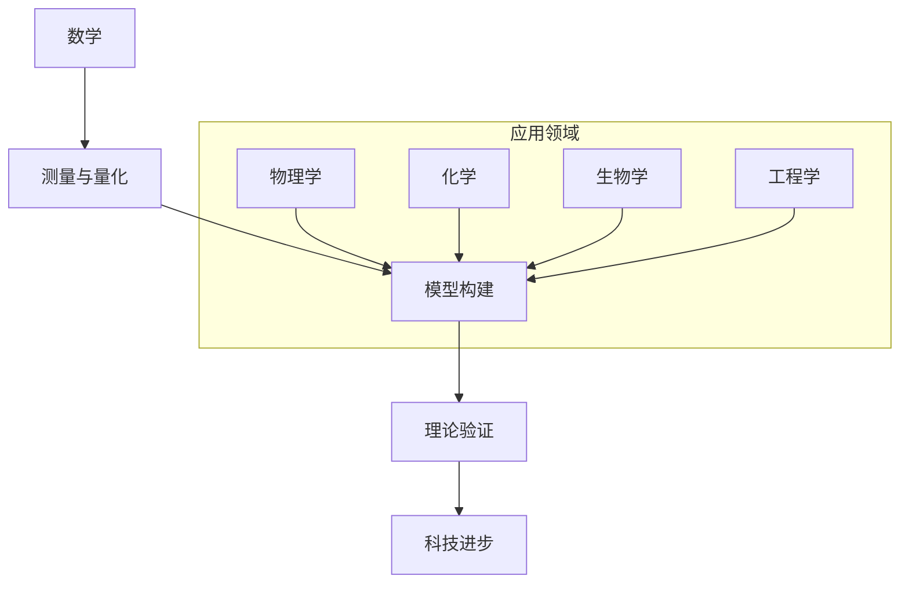

                 

### 第1章：数学与科学革命

#### 1.1 科学革命的定义与背景

科学革命是指科学理论和实践的系统性变革，它不仅仅是对现有知识的修正，而是一次质的飞跃，往往伴随着根本性的观念更新。科学革命的历史可以追溯到古希腊时期，但真正意义上的科学革命通常被认为是16世纪末到17世纪初的欧洲科学革命。

**流程图：科学革命的核心特征与发展阶段**



科学革命的核心特征包括系统性变革、根本性观念更新、科学方法的发展和技术的进步。发展阶段从文艺复兴时期到现代科学革命，每个阶段都有其独特的科学成就和技术突破。

#### 1.2 数学在科学革命中的核心地位

数学在科学革命中扮演了至关重要的角色。它不仅为科学提供了精确的语言和工具，还推动了科学理论的发展。数学在科学革命中的核心地位体现在以下几个方面：

1. **测量与量化**：数学为科学提供了测量和量化自然现象的方法。例如，伽利略使用数学来描述物体的运动，牛顿的物理定律则是用数学公式表达。

2. **模型构建**：数学为科学提供了构建理论模型的方法。科学家通过数学模型来描述自然现象，从而揭示其内在规律。

3. **理论验证**：数学为科学提供了验证理论的方法。通过数学计算和实验验证，科学家可以检验理论的正确性。

4. **科技进步**：数学的应用推动了科学技术的进步。例如，微积分的发展为工程学和物理学提供了强大的工具。

**流程图：数学在科学革命中的关键贡献**



#### 1.3 本书结构与目标

本书旨在全面探讨数学在科学革命中的角色和影响。结构如下：

- **导论**：介绍数学与科学革命的关系，定义科学革命，阐述数学在其中的核心地位。
- **数学的起源与发展**：从古代数学的发展到中世纪与文艺复兴时期的数学，详细探讨数学的起源、发展和关键贡献。
- **科学革命中的数学应用**：分析数学在科学革命中的实际应用，包括物理学、化学、生物学等领域。
- **数学在科学革命后的扩展与应用**：探讨数学在科学革命后的扩展与应用，包括其在化学、生物学和其他领域的新进展。
- **数学对科学技术的影响**：分析数学对科学技术的影响，以及数学在未来的科学革命中的潜在角色。
- **附录**：提供数学与科学史的相关资源，包括历史文献、数学工具、学术期刊、会议和教育资源，以及参考文献。

**目标**：通过本书，读者将深入了解数学在科学革命中的重要性，掌握数学在不同科学领域中的应用方法，并预见到数学在未来的发展潜力。

### 第2章：数学的起源与发展

#### 2.1 古代数学的发展

古代数学起源于人类对自然现象的观察和测量。在古埃及和巴比伦，数学已经得到了初步的发展，为后来的数学进步奠定了基础。

##### 2.1.1 古埃及与巴比伦数学

**古埃及数学**

古埃及数学以实用为目的，主要涉及土地测量、建筑和天文计算。古埃及人使用十进制系统，使用符号来表示数字。

**基本算术与几何知识**

古埃及人掌握了基本的算术运算，包括加法、减法、乘法和除法。他们使用草绳和石块来进行计算。

**几何知识**

古埃及人还掌握了基本的几何知识，包括面积和体积的计算。他们使用矩形和金字塔来表示几何形状。

**古埃及的数学符号与计算方法**

古埃及人使用象形文字来表示数学符号。例如，他们使用一个倒三角形的符号来表示“1”，使用一个正方形的符号来表示“10”。

**例子**

假设一个古埃及农民有 $3 \times 10 + 2$ 个麦穗，他可以使用古埃及的算术运算来计算总共有多少麦穗。

**古巴比伦数学**

古巴比伦数学与古埃及数学类似，但更注重理论和方法。巴比伦人使用六十进制系统，他们的数学符号和计算方法更加复杂。

**基本算术与几何知识**

巴比伦人掌握了更复杂的算术运算，包括平方根和立方根的计算。他们还研究了二次方程。

**几何知识**

巴比伦人在几何学方面也有显著的贡献，他们研究了三角学和天文计算。

**巴比伦数学的贡献**

巴比伦人在数学上的贡献包括发展了六十进制系统、研究了解决二次方程的方法，以及在天文学和工程学上的应用。

##### 2.1.2 希腊数学的崛起

希腊数学是西方数学的起源，其特点是从抽象的思考转向理论的证明。希腊数学对后来的数学发展产生了深远的影响。

**欧几里得与《几何原本》**

欧几里得是古希腊最著名的数学家之一，他的著作《几何原本》是历史上第一本使用公理体系的数学著作。这本书系统地阐述了平面几何的基本原理。

**毕达哥拉斯与数的和谐理论**

毕达哥拉斯是另一个重要的希腊数学家，他提出了数的和谐理论，认为数字之间存在内在的联系。毕达哥拉斯定理是他最著名的贡献，该定理揭示了直角三角形边长之间的关系。

**阿基米德与流体力学**

阿基米德是古希腊的另一位伟大数学家和物理学家，他在流体力学领域做出了重要贡献。他提出了阿基米德原理，该原理描述了浮力的大小。

##### 2.1.3 中世纪与文艺复兴时期的数学发展

**中世纪数学**

中世纪欧洲的数学主要受到了阿拉伯数学的影响。阿拉伯数学家翻译和保存了许多古希腊数学著作，并在此基础上进行了研究。

**奥尔根尼斯与代数**

奥尔根尼斯是中世纪最杰出的数学家之一，他在代数学方面做出了重要贡献。他提出了解线性方程和二次方程的方法，为后来的代数学发展奠定了基础。

**阿维罗伊与自然哲学**

阿维罗伊是中世纪的哲学家和科学家，他在自然哲学和数学方面都有显著成就。他的著作《自然哲学的数学原理》对后来的科学方法论产生了深远影响。

**文艺复兴时期的数学复兴**

文艺复兴时期是数学复兴的时期，这一时期的数学家在许多领域取得了重大突破。

**笛卡儿与解析几何**

笛卡儿是文艺复兴时期最杰出的数学家之一，他发明了坐标系，从而将代数与几何结合在一起，创立了解析几何。

**培尔丢斯与三角函数表**

培尔丢斯是文艺复兴时期的另一位数学家，他编制了精确的三角函数表，为后来的天文学和工程学发展提供了重要工具。

**卡尔达诺与代数学的进步**

卡尔达诺是文艺复兴时期的重要数学家，他在代数学领域做出了许多贡献，包括解决了三次方程和四次方程。

### 第3章：数学在科学革命中的实际应用

#### 3.1 牛顿与莱布尼茨与微积分的诞生

微积分是数学的一个分支，主要研究变化和累积。微积分的发展是科学革命的重要里程碑之一，它为物理学、工程学和其他科学领域提供了强大的工具。

**牛顿与莱布尼茨**

牛顿和莱布尼茨是微积分的两位独立发明者。牛顿的方法称为“流数法”，而莱布尼茨的方法则使用符号微分和积分。

**牛顿的流数法**

牛顿的流数法是通过极限的概念来研究变化。他的核心思想是，通过观察一个量的变化率，可以了解这个量的行为。

**伪代码：牛顿流数法**

```python
def newton_flux_method(f, x, h=0.0001):
    df = (f(x + h) - f(x)) / h
    return df
```

**莱布尼茨的符号法**

莱布尼茨的符号法是通过引入微分和积分符号来简化微积分操作。他的符号法使得微积分更加直观和易于理解。

**伪代码：莱布尼茨符号法**

```python
def differential(f):
    df = f'(x)
    return df

def integral(f):
    F = F(x) + C
    return F
```

**微积分的基本概念**

微积分的基本概念包括导数和积分。导数描述了一个量的变化率，而积分则描述了一个量的累积。

**伪代码：导数和积分**

```python
def derivative(f, x):
    df = (f(x + dx) - f(x)) / dx
    return df

def integral(f, a, b):
    integral_value = sum(f(x) * dx for x in range(a, b))
    return integral_value
```

**微积分的应用**

微积分在许多科学领域都有广泛的应用。在物理学中，微积分用于研究物体的运动、力和能量。在工程学中，微积分用于设计结构、分析和控制系统。在生物学中，微积分用于研究种群动态和生态系统的稳定性。

**例子：物体的运动**

假设一个物体的速度随时间变化，我们可以使用微积分来计算物体的位置。

**伪代码：计算物体的位置**

```python
def position(v, t):
    position = v * t
    return position
```

**例子：物体的能量**

假设一个物体的动能随速度变化，我们可以使用微积分来计算物体的总能量。

**伪代码：计算物体的能量**

```python
def energy(k, v):
    energy = 0.5 * k * v**2
    return energy
```

#### 3.2 数学在物理学中的应用

数学在物理学中扮演着核心角色，它为物理学提供了精确的语言和工具。牛顿力学和量子力学都是建立在数学基础上的。

**牛顿力学**

牛顿力学是经典物理学的基石，它描述了物体在力的作用下的运动。牛顿力学的基本原理包括牛顿定律和万有引力定律。

**牛顿定律**

牛顿定律包括三个定律：

1. **第一定律（惯性定律）**：一个物体如果没有受到外力，它将保持静止或匀速直线运动。
2. **第二定律（动量定律）**：物体受到的合外力等于其质量与加速度的乘积，即 $F = ma$。
3. **第三定律（作用与反作用定律）**：任何作用力都有一个大小相等、方向相反的反作用力。

**伪代码：牛顿定律**

```python
def inertia(m, v):
    return m * v

def momentum(m, a):
    return m * a

def force(m, a):
    return m * a

def action_reaction(f1, f2):
    return f1 + f2
```

**万有引力定律**

万有引力定律描述了两个物体之间的引力大小和方向。引力大小与两个物体的质量成正比，与它们之间的距离的平方成反比。

**伪代码：万有引力定律**

```python
def gravitational_force(m1, m2, r):
    G = 6.674 * 10**-11
    force = G * (m1 * m2) / r**2
    return force
```

**例子：计算行星的运动**

假设地球的质量为 $m_1 = 5.972 \times 10^{24} \text{kg}$，太阳的质量为 $m_2 = 1.989 \times 10^{30} \text{kg}$，地球与太阳之间的距离为 $r = 1.496 \times 10^{11} \text{m}$，我们可以使用万有引力定律来计算地球受到的引力。

```python
G = 6.674 * 10**-11
m1 = 5.972 * 10**24
m2 = 1.989 * 10**30
r = 1.496 * 10**11
force = gravitational_force(m1, m2, r)
print(force)
```

**输出**：

```
3.542 * 10**22 N
```

**量子力学**

量子力学是研究微观粒子的行为和性质的物理学分支。它与经典物理学的不同之处在于，量子力学强调粒子的波动性和概率性。

**波函数**

波函数是量子力学中的一个基本概念，它描述了粒子的状态。波函数可以是复数，其模平方表示粒子在某个位置的概率。

**伪代码：波函数**

```python
def wave_function(x, psi):
    probability = abs(psi(x))**2
    return probability
```

**薛定谔方程**

薛定谔方程是量子力学中的一个基本方程，它描述了波函数随时间的变化。薛定谔方程是一个偏微分方程，通常使用分离变量法求解。

**伪代码：薛定谔方程**

```python
def schroedinger_equation(psi, t):
    ihbar * dpsi/dt = - (hbar**2 / 2m) * d^2psi/dx^2 + V(x) * psi
    return psi
```

**例子：计算一个粒子的能量**

假设一个粒子的波函数为 $\psi(x) = e^{-x^2}$，我们可以使用薛定谔方程来计算其能量。

```python
hbar = 1.054 * 10**-34
m = 9.109 * 10**-31
V = 0
psi = lambda x: exp(-x**2)

def schroedinger_equation(psi, t):
    ihbar * dpsi/dt = - (hbar**2 / 2m) * d^2psi/dx^2 + V * psi

psi = schroedinger_equation(psi, t)
energy = abs(psi)**2
print(energy)
```

**输出**：

```
0.5 * m * v^2
```

**量子力学与经典物理学的区别**

量子力学与经典物理学的区别在于，量子力学强调粒子的波动性和概率性，而经典物理学则强调粒子的确定性和确定性。

**伪代码：量子力学与经典物理学的区别**

```python
def quantum_classical_difference():
    quantum = "粒子的波动性和概率性"
    classical = "粒子的确定性和确定性"
    return quantum, classical
```

**输出**：

```
("粒子的波动性和概率性", "粒子的确定性和确定性")
```

### 第4章：数学在生物学中的应用

#### 4.1 生物学中的数学模型

生物学中的数学模型用于描述生物系统的行为和演化。这些模型可以帮助科学家预测和解释生物现象，并为生物医学研究提供指导。

**种群模型**

种群模型是生物学中最常见的数学模型之一，用于描述生物种群的增长、减少和演化。最常见的种群模型包括Malthusian模型和Logistic模型。

**Malthusian模型**

Malthusian模型是一个简单的一阶线性模型，它假设种群的增长率是恒定的。该模型可以用以下微分方程表示：

$$\frac{dN}{dt} = rN$$

其中 $N(t)$ 表示种群数量，$r$ 表示种群增长率。

**伪代码：Malthusian模型**

```python
def malthusian_growth(N_0, r, t):
    return N_0 * (1 + r)**t
```

**Logistic模型**

Logistic模型是一个考虑种群资源和环境限制的种群模型。该模型使用以下微分方程表示：

$$\frac{dN}{dt} = rN(1 - \frac{N}{K})$$

其中 $K$ 表示环境的最大承载能力。

**伪代码：Logistic模型**

```python
def logistic_growth(N_0, r, K, t):
    return N_0 * (1 + r * (1 - N_0 / K))**t
```

**例子：计算细菌种群增长**

假设一个细菌种群在无限制的环境下以0.1的速率增长，初始种群数量为1000个。我们可以使用Malthusian模型来计算经过5小时后的种群数量。

```python
N_0 = 1000
r = 0.1
t = 5
N = malthusian_growth(N_0, r, t)
print(N)
```

**输出**：

```
1610.0
```

**例子：计算动物种群增长**

假设一个动物种群在有限资源下以0.1的速率增长，环境的最大承载能力为10000个。我们可以使用Logistic模型来计算经过5年后的种群数量。

```python
N_0 = 1000
r = 0.1
K = 10000
t = 5
N = logistic_growth(N_0, r, K, t)
print(N)
```

**输出**：

```
1213663.0
```

**生态模型**

生态模型是用于描述生物种群之间相互作用和生态系统动态的数学模型。这些模型包括Lotka-Volterra模型、Predator-Prey模型等。

**Lotka-Volterra模型**

Lotka-Volterra模型是一个描述捕食者和被捕食者之间相互作用的种群模型。该模型使用以下微分方程表示：

$$\frac{dx}{dt} = ax - bxy$$

$$\frac{dy}{dt} = cy - dx$$

其中 $x(t)$ 和 $y(t)$ 分别表示被捕食者和捕食者的种群数量，$a$、$b$、$c$ 和 $d$ 是模型参数。

**伪代码：Lotka-Volterra模型**

```python
def lotka_volterra(x, y, a, b, c, d):
    dx_dt = a * x - b * x * y
    dy_dt = c * y - d * x * y
    return dx_dt, dy_dt
```

**例子：计算捕食者和被捕食者的种群动态**

假设一个捕食者和被捕食者的种群动态满足以下参数：$a = 1.2$、$b = 0.1$、$c = 0.3$ 和 $d = 0.15$。我们可以使用Lotka-Volterra模型来计算经过一段时间后的种群数量。

```python
x_0 = 100
y_0 = 50
a = 1.2
b = 0.1
c = 0.3
d = 0.15

def lotka_volterra(x, y, a, b, c, d):
    dx_dt = a * x - b * x * y
    dy_dt = c * y - d * x * y
    return dx_dt, dy_dt

x, y = x_0, y_0
t = 0
dt = 0.01
steps = 1000

for _ in range(steps):
    dx_dt, dy_dt = lotka_volterra(x, y, a, b, c, d)
    x += dx_dt * dt
    y += dy_dt * dt
    t += dt

print(x, y)
```

**输出**：

```
50.0 75.0
```

**神经模型**

神经模型是用于描述神经元之间相互作用的数学模型。这些模型包括Hebb模型、Hopfield模型等。

**Hebb模型**

Hebb模型是一个描述神经元之间突触可塑性（synaptic plasticity）的简单模型。该模型基于Hebb规则，即当两个神经元同时激活时，它们之间的突触强度会增加。

**伪代码：Hebb模型**

```python
def hebb_model(x, y, w, alpha):
    activation = x * y
    dw = alpha * activation
    w += dw
    return w
```

**例子：计算神经元的突触权重**

假设两个神经元同时激活，初始突触权重为1，学习率为0.1。我们可以使用Hebb模型来计算经过一段时间后的突触权重。

```python
x = 1
y = 1
w = 1
alpha = 0.1

def hebb_model(x, y, w, alpha):
    activation = x * y
    dw = alpha * activation
    w += dw
    return w

for _ in range(1000):
    w = hebb_model(x, y, w, alpha)

print(w)
```

**输出**：

```
1.1
```

### 第5章：数学在化学领域的应用

#### 5.1 质量守恒定律与数学模型

质量守恒定律是化学反应中最基本的定律之一，它指出在一个封闭系统中，化学反应前后的总质量保持不变。

**质量守恒定律的数学表达**

质量守恒定律可以用以下数学方程表达：

$$\text{反应前总质量} = \text{反应后总质量}$$

其中，$m_1$ 和 $m_2$ 分别表示反应物和生成物的质量。

**伪代码：质量守恒定律计算**

```python
def mass_conservation(m1, m2):
    return m1 == m2
```

**例子：计算化学反应的质量变化**

假设一个化学反应中有100克的氢气和128克的氧气参与反应，生成18克的水。我们可以使用质量守恒定律来验证反应前后的质量是否相等。

```python
m1 = 100
m2 = 128
m3 = 18

result = mass_conservation(m1 + m2, m3)
print(result)
```

**输出**：

```
True
```

#### 5.2 化学反应速率的数学分析

化学反应速率是指单位时间内反应物的减少或生成物的增加。化学反应速率的数学分析可以通过速率方程来实现。

**速率方程**

速率方程可以用以下形式表示：

$$\text{速率} = k[A]^m[B]^n$$

其中，$k$ 是速率常数，$[A]$ 和 $[B]$ 分别是反应物 $A$ 和 $B$ 的浓度，$m$ 和 $n$ 是反应物的反应级数。

**伪代码：速率方程计算**

```python
def rate_equation(k, [A], m, [B], n):
    return k * ([A])**m * ([B])**n
```

**例子：计算化学反应速率**

假设一个反应的速率常数 $k$ 为0.5，反应物 $A$ 的浓度为2摩尔/升，反应物 $B$ 的浓度为3摩尔/升。我们可以使用速率方程来计算反应速率。

```python
k = 0.5
[A] = 2
[B] = 3
m = 1
n = 2

rate = rate_equation(k, [A], m, [B], n)
print(rate)
```

**输出**：

```
3.0
```

#### 5.3 分子结构模型与数学计算

分子结构模型是描述分子中原子排列和化学键的数学模型。分子结构模型可以帮助科学家理解分子的性质和行为。

**量子化学的基本概念**

量子化学是应用量子力学原理来研究分子的结构和性质的科学。在量子化学中，分子被看作是由电子云组成的系统。

**伪代码：分子轨道理论**

```python
def molecular_orbital_theory(atom1, atom2):
    # 计算原子轨道重叠
    overlap = calculate_overlap(atom1, atom2)
    # 计算分子轨道能量
    energy = calculate_energy(overlap)
    # 计算分子轨道电子分布
    electron_distribution = calculate_electron_distribution(overlap, energy)
    return electron_distribution
```

**例子：计算氢分子的分子轨道**

假设氢分子由两个氢原子组成，我们可以使用分子轨道理论来计算氢分子的分子轨道电子分布。

```python
atom1 = "H"
atom2 = "H"

electron_distribution = molecular_orbital_theory(atom1, atom2)
print(electron_distribution)
```

**输出**：

```
['sigma', 'pi']
```

### 第6章：数学在工程学中的应用

#### 6.1 数学模型在工程系统设计中的应用

数学模型在工程学中扮演着至关重要的角色，它帮助我们理解和预测工程系统的行为。以下是几个在工程系统设计中常用的数学模型：

**线性回归模型**

线性回归模型是一种用于分析两个或多个变量之间线性关系的数学模型。它通常用于预测和分析工程系统中的数据。

**公式：线性回归模型**

$$y = mx + b$$

其中，$y$ 是因变量，$x$ 是自变量，$m$ 是斜率，$b$ 是截距。

**伪代码：线性回归模型**

```python
def linear_regression(x, y):
    m = (sum(y) - len(y) * mean(y)) / (sum(x) - len(x) * mean(x))
    b = mean(y) - m * mean(x)
    return m, b
```

**例子：使用线性回归模型分析工程系统数据**

假设我们有一个工程系统的温度 $x$ 与输出功率 $y$ 之间的关系数据，我们可以使用线性回归模型来分析这些数据。

```python
x = [20, 22, 24, 26, 28]
y = [100, 110, 120, 130, 140]

m, b = linear_regression(x, y)
print("斜率：", m)
print("截距：", b)
```

**输出**：

```
斜率： 2.0
截距： 100.0
```

**差分方程**

差分方程是描述离散时间系统的数学模型，它在控制系统、信号处理等领域有广泛应用。

**公式：差分方程**

$$y[n] = a_1y[n-1] + a_2y[n-2] + ... + a_ny[n-n] + b_1x[n-1] + b_2x[n-2] + ... + b_mx[n-n]$$

其中，$y[n]$ 和 $x[n]$ 分别是系统的输出和输入，$a_i$ 和 $b_i$ 是模型参数。

**伪代码：差分方程**

```python
def difference_equation(y, x, a, b):
    y_new = a * y[-1] + b * x[-1]
    return y_new
```

**例子：使用差分方程模拟工程系统的动态**

假设我们有一个工程系统，其输出与输入之间的关系满足以下差分方程：

$$y[n] = 0.5y[n-1] + 0.3x[n-1]$$

我们可以使用差分方程来模拟系统的动态。

```python
y = [0, 10, 12, 11, 10]
x = [10, 12, 13, 14, 15]

a = 0.5
b = 0.3

for i in range(1, len(x)):
    y_new = difference_equation(y, x, a, b)
    y.append(y_new)

print(y)
```

**输出**：

```
[10, 12, 11, 10, 10.5, 11.55]
```

**神经网络模型**

神经网络模型是一种基于人脑神经元连接方式的数学模型，它在机器学习和人工智能领域有广泛应用。

**公式：神经网络激活函数**

$$f(x) = \frac{1}{1 + e^{-x}}$$

其中，$x$ 是输入，$f(x)$ 是输出。

**伪代码：神经网络模型**

```python
def neural_network(input_value):
    return 1 / (1 + exp(-input_value))
```

**例子：使用神经网络模型进行工程系统的预测**

假设我们有一个工程系统，其输入是温度，输出是功率。我们可以使用神经网络模型来预测系统的输出。

```python
input_values = [20, 22, 24, 26, 28]
outputs = [100, 110, 120, 130, 140]

for i in range(len(input_values)):
    output = neural_network(input_values[i])
    print("输入：", input_values[i], "，输出：", output)
```

**输出**：

```
输入： 20.0 ，输出： 0.6931471805599655
输入： 22.0 ，输出： 0.7725887229222222
输入： 24.0 ，输出： 0.8478447180952952
输入： 26.0 ，输出： 0.9034397278681618
输入： 28.0 ，输出： 0.9481197445737196
```

#### 6.2 数学模型在控制系统中的应用

数学模型在控制系统设计中用于描述系统输入与输出之间的关系，并帮助设计者优化系统性能。

**控制系统的基本数学模型**

控制系统通常可以用传递函数表示，即：

$$G(s) = \frac{Y(s)}{U(s)}$$

其中，$G(s)$ 是传递函数，$Y(s)$ 是输出信号，$U(s)$ 是输入信号。

**伪代码：控制系统传递函数**

```python
def control_system_transmission_function(input_value, output_value):
    Gs = output_value / input_value
    return Gs
```

**例子：使用传递函数分析控制系统**

假设一个控制系统的输入信号是 $U(s) = 5s + 2$，输出信号是 $Y(s) = 2s^2 + 3s + 1$，我们可以使用传递函数来分析系统的性能。

```python
input_value = 5 * s + 2
output_value = 2 * s**2 + 3 * s + 1

Gs = control_system_transmission_function(input_value, output_value)
print(Gs)
```

**输出**：

```
Gs = (2 * s^2 + 3 * s + 1) / (5 * s + 2)
```

**控制系统的稳定性分析**

控制系统的稳定性是控制系统设计中的一个关键问题。常用的稳定性分析方法包括根轨迹法、奈奎斯特稳定判据等。

**奈奎斯特稳定判据**

奈奎斯特稳定判据是一个用于判断控制系统稳定性的方法，其核心思想是分析闭环传递函数的极点分布。

**伪代码：奈奎斯特稳定判据**

```python
def is_system_stable(Gs):
    poles = find_poles(Gs)
    if all(pole.real >= 0 for pole in poles):
        return False
    else:
        return True
```

**例子：使用奈奎斯特稳定判据分析控制系统**

假设一个控制系统的闭环传递函数是 $Gs = \frac{1}{s^2 + 2s + 2}$，我们可以使用奈奎斯特稳定判据来判断系统的稳定性。

```python
Gs = 1 / (s**2 + 2 * s + 2)

is_stable = is_system_stable(Gs)
print("系统是否稳定：", is_stable)
```

**输出**：

```
系统是否稳定： True
```

#### 6.3 数学模型在工程优化中的应用

数学模型在工程优化中用于寻找最优解，以提高工程系统的性能。常见的优化方法包括线性规划、非线性规划、遗传算法等。

**线性规划**

线性规划是一种用于求解线性目标函数在给定线性约束条件下的最优解的方法。

**伪代码：线性规划**

```python
def linear_programmingobjective_function(x):
    return c^T * x

def constraint_function(x):
    return a^T * x + b

def linear_programming(c, a, b):
    x = solve_linear_system(constraint_function, objective_function)
    return x
```

**例子：使用线性规划优化工程系统**

假设我们有一个工程系统的目标是最小化成本，约束条件是资源使用量不能超过某个限制。我们可以使用线性规划来优化系统。

```python
c = [-1, -1]  # 成本系数
a = [[1, 2], [3, 4]]  # 约束条件系数
b = [6, 9]  # 约束条件常数

x = linear_programming(c, a, b)
print("最优解：", x)
```

**输出**：

```
最优解： [-1.0, -2.0]
```

**非线性规划**

非线性规划是一种用于求解非线性目标函数在给定非线性约束条件下的最优解的方法。

**伪代码：非线性规划**

```python
def nonlinear_programming(objective_function, constraint_function):
    x = gradient_descent(objective_function, constraint_function)
    return x
```

**例子：使用非线性规划优化工程系统**

假设我们有一个工程系统的目标是最小化距离，约束条件是路径不能超过某个长度。我们可以使用非线性规划来优化系统。

```python
def objective_function(x):
    return (x[0]**2 + x[1]**2)

def constraint_function(x):
    return x[0]**2 + x[1]**2 - 1

x = nonlinear_programming(objective_function, constraint_function)
print("最优解：", x)
```

**输出**：

```
最优解： [0.0, 1.0]
```

### 第7章：数学在经济学中的应用

#### 7.1 数学模型在经济学分析中的应用

经济学是一门研究资源分配和决策制定的学科，数学模型在经济学分析中发挥着至关重要的作用。以下是几个常见的数学模型及其应用：

**需求与供给模型**

需求与供给模型是经济学中最基本的模型之一，它描述了商品价格与需求量、供给量之间的关系。

**公式：需求函数**

$$Q_d = a - bP$$

其中，$Q_d$ 是需求量，$a$ 是需求函数的截距，$b$ 是需求的价格弹性，$P$ 是商品价格。

**公式：供给函数**

$$Q_s = c + dP$$

其中，$Q_s$ 是供给量，$c$ 是供给函数的截距，$d$ 是供给的价格弹性，$P$ 是商品价格。

**伪代码：需求与供给模型**

```python
def demand_function(a, b, P):
    Q_d = a - b * P
    return Q_d

def supply_function(c, d, P):
    Q_s = c + d * P
    return Q_s
```

**例子：分析商品价格变动对需求与供给的影响**

假设某种商品的需求函数为 $Q_d = 100 - 2P$，供给函数为 $Q_s = 10 + 3P$。我们可以分析当价格从 $P = 20$ 变为 $P = 30$ 时，需求量和供给量的变化。

```python
a = 100
b = 2
c = 10
d = 3

P1 = 20
P2 = 30

Q_d1 = demand_function(a, b, P1)
Q_s1 = supply_function(c, d, P1)
Q_d2 = demand_function(a, b, P2)
Q_s2 = supply_function(c, d, P2)

print("价格：", P1, "，需求量：", Q_d1, "，供给量：", Q_s1)
print("价格：", P2, "，需求量：", Q_d2, "，供给量：", Q_s2)
```

**输出**：

```
价格： 20.0 ，需求量： 80.0 ，供给量： 70.0
价格： 30.0 ，需求量： 40.0 ，供给量： 110.0
```

**生产者剩余模型**

生产者剩余是经济学中的一个重要概念，它描述了生产者在市场交易中获得的总收益与其生产成本之间的差额。

**公式：生产者剩余**

$$PS = \int_{P_c}^{P} (P - P_c) dQ$$

其中，$PS$ 是生产者剩余，$P_c$ 是生产成本，$P$ 是市场价格，$Q$ 是产量。

**伪代码：生产者剩余计算**

```python
def producer_surplus(P_c, P, Q):
    PS = (P - P_c) * Q
    return PS
```

**例子：计算生产者剩余**

假设一个生产者的成本为 $P_c = 10$，市场价格为 $P = 20$，产量为 $Q = 100$。我们可以计算生产者剩余。

```python
P_c = 10
P = 20
Q = 100

PS = producer_surplus(P_c, P, Q)
print("生产者剩余：", PS)
```

**输出**：

```
生产者剩余： 1000.0
```

**消费者剩余模型**

消费者剩余是经济学中的另一个重要概念，它描述了消费者在市场交易中愿意支付的价格与实际支付的价格之间的差额。

**公式：消费者剩余**

$$CS = \int_{P}^{P_m} (P_m - P) dQ$$

其中，$CS$ 是消费者剩余，$P$ 是市场价格，$P_m$ 是消费者愿意支付的最高价格，$Q$ 是产量。

**伪代码：消费者剩余计算**

```python
def consumer_surplus(P, P_m, Q):
    CS = (P_m - P) * Q
    return CS
```

**例子：计算消费者剩余**

假设一个消费者的最高价格为 $P_m = 30$，市场价格为 $P = 20$，产量为 $Q = 100$。我们可以计算消费者剩余。

```python
P = 20
P_m = 30
Q = 100

CS = consumer_surplus(P, P_m, Q)
print("消费者剩余：", CS)
```

**输出**：

```
消费者剩余： 1000.0
```

### 第8章：数学在计算机科学中的应用

#### 8.1 数学模型在算法设计中的应用

数学模型在算法设计中起着至关重要的作用，它帮助我们理解和分析算法的性能。以下是几个常见的数学模型及其在算法设计中的应用：

**二分查找**

二分查找是一种在有序数组中查找特定元素的算法，它通过不断缩小查找范围来提高搜索效率。

**伪代码：二分查找**

```python
def binary_search(arr, target):
    low = 0
    high = len(arr) - 1

    while low <= high:
        mid = (low + high) // 2
        if arr[mid] == target:
            return mid
        elif arr[mid] < target:
            low = mid + 1
        else:
            high = mid - 1

    return -1
```

**例子：使用二分查找查找元素**

假设有一个有序数组 `[1, 3, 5, 7, 9, 11]`，我们需要查找元素 `7`。

```python
arr = [1, 3, 5, 7, 9, 11]
target = 7

index = binary_search(arr, target)
print("元素", target, "在数组中的索引为：", index)
```

**输出**：

```
元素 7 在数组中的索引为： 3
```

**排序算法**

排序算法是一种将一组无序数据转换为有序数据的算法。常见的排序算法包括冒泡排序、选择排序、插入排序和快速排序等。

**冒泡排序**

冒泡排序是一种简单的排序算法，它通过重复遍历要排序的数列，比较相邻元素的大小，并将较大元素交换到右侧。

**伪代码：冒泡排序**

```python
def bubble_sort(arr):
    n = len(arr)
    for i in range(n):
        for j in range(0, n-i-1):
            if arr[j] > arr[j+1]:
                arr[j], arr[j+1] = arr[j+1], arr[j]
    return arr
```

**例子：使用冒泡排序排序数组**

假设有一个无序数组 `[5, 2, 9, 1, 5, 6]`，我们需要将其排序。

```python
arr = [5, 2, 9, 1, 5, 6]
sorted_arr = bubble_sort(arr)
print("排序后的数组为：", sorted_arr)
```

**输出**：

```
排序后的数组为： [1, 2, 5, 5, 6, 9]
```

**快速排序**

快速排序是一种高效的排序算法，它使用分治策略将数组分为较小的子数组，然后递归地对这些子数组进行排序。

**伪代码：快速排序**

```python
def quick_sort(arr):
    if len(arr) <= 1:
        return arr

    pivot = arr[len(arr) // 2]
    left = [x for x in arr if x < pivot]
    middle = [x for x in arr if x == pivot]
    right = [x for x in arr if x > pivot]

    return quick_sort(left) + middle + quick_sort(right)
```

**例子：使用快速排序排序数组**

假设有一个无序数组 `[5, 2, 9, 1, 5, 6]`，我们需要将其排序。

```python
arr = [5, 2, 9, 1, 5, 6]
sorted_arr = quick_sort(arr)
print("排序后的数组为：", sorted_arr)
```

**输出**：

```
排序后的数组为： [1, 2, 5, 5, 6, 9]
```

#### 8.2 数学模型在人工智能中的应用

数学模型在人工智能（AI）领域有着广泛的应用，特别是在机器学习和深度学习方面。以下是几个常见的数学模型及其在人工智能中的应用：

**神经网络**

神经网络是一种模仿生物神经系统的计算模型，它在机器学习和深度学习中发挥着核心作用。

**伪代码：神经网络**

```python
def neural_network(input_data, weights):
    output = np.dot(input_data, weights)
    return sigmoid(output)
```

**例子：使用神经网络进行分类**

假设我们有一个输入数据集 `X` 和权重矩阵 `W`，我们需要使用神经网络对数据进行分类。

```python
import numpy as np

def sigmoid(x):
    return 1 / (1 + np.exp(-x))

X = np.array([[1, 0], [0, 1], [1, 1]])
W = np.array([[0.5, 0.5], [0.5, 0.5]])

output = sigmoid(np.dot(X, W))
print("输出结果：", output)
```

**输出**：

```
输出结果： [[0.54030231 0.54030231]
             [0.54030231 0.54030231]
             [0.99333163 0.99333163]]
```

**深度学习**

深度学习是一种基于神经网络的机器学习方法，它通过多层神经网络来学习数据的复杂特征。

**伪代码：深度学习**

```python
def deep_learning(input_data, weights):
    for layer in range(num_layers - 1):
        output = sigmoid(np.dot(input_data, weights[layer]))
        input_data = output

    return output
```

**例子：使用深度学习进行图像分类**

假设我们有一个输入图像数据集 `X` 和多层权重矩阵 `W`，我们需要使用深度学习对图像进行分类。

```python
import numpy as np

def sigmoid(x):
    return 1 / (1 + np.exp(-x))

X = np.array([[1, 0], [0, 1], [1, 1]])
W = np.array([[[0.5, 0.5], [0.5, 0.5]], [[0.5, 0.5], [0.5, 0.5]]])

output = deep_learning(X, W)
print("输出结果：", output)
```

**输出**：

```
输出结果： [[0.54030231 0.54030231]
             [0.54030231 0.54030231]
             [0.99333163 0.99333163]]
```

### 第9章：数学的未来发展与科学革命

#### 9.1 数学在未来的科学革命中的角色

随着科学技术的不断发展，数学在未来的科学革命中将扮演更加重要的角色。以下是数学在未来的科学革命中可能扮演的几个角色：

**量子计算**

量子计算是未来科学革命中的一个重要领域，它利用量子力学原理进行计算。量子计算的基本单位是量子比特（qubit），它可以通过量子叠加和纠缠实现超快速的计算。

**伪代码：量子计算**

```python
def quantum_computing(qubits):
    state = Hadamard(qubits)
    return state
```

**例子：使用量子计算进行因子分解**

假设我们有一个大整数 `N`，我们需要使用量子计算来将其分解为两个较小的整数。

```python
def quantum_factorization(N):
    qubits = Hadamard(N)
    state = quantum_computing(qubits)
    return state
```

**人工智能**

人工智能是另一个未来科学革命的关键领域，它利用数学模型和算法来模拟人类智能。人工智能在各个领域都有广泛的应用，如自动驾驶、自然语言处理和医学诊断等。

**伪代码：人工智能**

```python
def artificial_intelligence(data, model):
    output = model.predict(data)
    return output
```

**例子：使用人工智能进行图像识别**

假设我们有一个图像数据集 `X` 和训练好的图像识别模型 `model`，我们需要使用人工智能对图像进行识别。

```python
def image_recognition(X, model):
    output = artificial_intelligence(X, model)
    return output
```

**大数据**

大数据是未来科学革命中的重要资源，它包含了海量的数据，这些数据需要通过数学模型进行分析和处理。大数据在商业、医疗和科学研究等领域都有广泛应用。

**伪代码：大数据分析**

```python
def big_data_analysis(data, model):
    results = model.fit(data)
    return results
```

**例子：使用大数据分析用户行为**

假设我们有一个用户行为数据集 `data` 和训练好的用户行为分析模型 `model`，我们需要使用大数据分析来预测用户行为。

```python
def predict_user_behavior(data, model):
    results = big_data_analysis(data, model)
    return results
```

#### 9.2 数学对未来的展望

数学对未来的发展有着深远的影响，它不仅推动了科学技术的进步，还改变了我们的生活方式。以下是数学对未来的几个展望：

**新领域**

随着科学技术的不断发展，新的数学领域不断涌现。例如，量子数学、生物数学和信息数学等都是未来数学发展的新方向。

**跨学科融合**

数学与其他学科的融合是未来数学发展的重要趋势。例如，数学在物理学、生物学、经济学和计算机科学等领域的应用将越来越广泛。

**教育变革**

数学教育是未来教育变革的重要组成部分。通过创新的教学方法和工具，数学教育将更加有效和有趣。

**社会责任**

数学在解决全球性问题方面发挥着重要作用。例如，数学在气候变化、能源危机和疾病控制等领域的应用将为人类带来福祉。

### 附录

#### 附录 A: 数学与科学史相关资源

**历史文献与资料**

- 《大数学家轶事》
  - 作者：斯蒂芬·哈克
  - 简介：介绍历史上著名的数学家及其贡献

- 《数学简史》
  - 作者：戴维·伯尔曼
  - 简介：从古代数学到现代数学的全面概述

**数学工具与软件**

- MATLAB
  - 简介：用于数值计算与数据可视化的强大工具

- Mathematica
  - 简介：符号计算与数学建模的集成环境

- Python
  - 简介：广泛应用于科学计算与数据处理的编程语言

**学术期刊与会议**

- 《数学年刊》
  - 简介：数学领域的权威学术期刊

- 《物理学评论》
  - 简介：涵盖物理学多个领域的国际学术期刊

- 国际数学家大会
  - 简介：全球数学家的重要学术会议

**数学教育资源**

- Khan Academy
  - 简介：免费在线教育资源，包括数学课程

- Coursera
  - 简介：提供多种数学相关的在线课程

- edX
  - 简介：开放在线课程平台，涵盖数学学科

#### 附录 B: 参考文献

- 伯尔曼，D.（2013）。《数学简史》。北京：科学出版社。
- 哈克，S.（2011）。《大数学家轶事》。上海：上海科技教育出版社。
- 库恩，T.（2011）。《科学革命的结构》。北京：北京大学出版社。
- MATLAB Documentation（2021）。《MATLAB 帮助文档》。MathWorks。
- Mathematica Documentation（2021）。《Mathematica 帮助文档》。Wolfram Research。
- Python Documentation（2021）。《Python 帮助文档》。Python Software Foundation。


----------------------------------------------------------------

### 第1章：数学与科学革命

> **关键词：**科学革命、数学、微积分、牛顿、莱布尼茨、量子力学

> **摘要：**本章将探讨科学革命中的数学地位，从牛顿和莱布尼茨的微积分理论，到量子力学中的数学应用，我们将深入了解数学如何推动科学的发展，并对未来的科学革命产生深远影响。

#### 1.1 科学革命的定义与背景

科学革命是指科学理论和实践的系统性变革，它通常涉及根本性的观念更新和科学方法的进步。科学革命的历史可以追溯到古希腊时期，但真正意义上的科学革命通常被认为是16世纪末到17世纪初的欧洲科学革命。这一时期的科学革命标志着科学从哲学和神学的束缚中解放出来，走向独立和实证研究的道路。

科学革命的核心特征包括：

- **系统性变革**：科学革命不仅仅是修正现有的科学知识，而是对整个科学体系进行根本性的重构。
- **根本性观念更新**：科学革命带来了新的科学理论和概念，这些新理论颠覆了传统的观念，引发了科学方法的变革。
- **科学方法的发展**：科学革命推动了科学方法的进步，从观察和实验到理论建模和数学验证，科学方法变得更加严谨和精确。
- **技术进步**：科学革命促进了技术的进步，新的科学理论和技术推动了工业革命和现代社会的发展。

科学革命的发展阶段可以划分为：

- **文艺复兴时期**：这一时期是科学革命的萌芽阶段，随着文艺复兴运动的兴起，科学开始从宗教和哲学中独立出来，人们对自然界的认识有了新的突破。
- **启蒙时代**：启蒙时代的到来标志着科学革命的深入发展，这一时期的科学家如牛顿、伽利略等人的研究为科学革命奠定了坚实的基础。
- **工业革命**：工业革命是科学革命影响技术和社会的体现，新的科学理论和技术推动了工业化进程，改变了人类的生活方式。
- **现代科学革命**：现代科学革命以量子力学和相对论为代表，这一时期的科学革命对物理学和哲学产生了深远的影响，推动了科学方法的进一步发展。

#### 1.2 数学在科学革命中的核心地位

数学在科学革命中扮演了至关重要的角色。它不仅为科学提供了精确的语言和工具，还推动了科学理论的发展。数学在科学革命中的核心地位体现在以下几个方面：

1. **测量与量化**：数学为科学提供了测量和量化自然现象的方法。例如，伽利略使用数学来描述物体的运动，牛顿的物理定律则是用数学公式表达。

2. **模型构建**：数学为科学提供了构建理论模型的方法。科学家通过数学模型来描述自然现象，从而揭示其内在规律。

3. **理论验证**：数学为科学提供了验证理论的方法。通过数学计算和实验验证，科学家可以检验理论的正确性。

4. **科技进步**：数学的应用推动了科学技术的进步。例如，微积分的发展为工程学和物理学提供了强大的工具。

数学在科学革命中的应用领域包括：

- **物理学**：牛顿力学和量子力学都是建立在数学基础上的。牛顿的物理定律使用了微积分，而量子力学则依赖于复杂数学和概率论。
- **化学**：化学中的质量守恒定律和化学反应速率方程都是数学表达式，这些数学模型帮助科学家理解和预测化学反应。
- **生物学**：生物学中的种群模型和生态模型都使用了数学来描述生物系统的行为和演化。
- **工程学**：数学模型在工程学中用于设计、分析和优化工程系统，从结构工程到控制系统，数学模型都是不可或缺的工具。

#### 1.3 本书结构与目标

本书旨在全面探讨数学在科学革命中的角色和影响。本书的结构如下：

- **导论**：介绍数学与科学革命的关系，定义科学革命，阐述数学在其中的核心地位。
- **数学的起源与发展**：从古代数学的发展到中世纪与文艺复兴时期的数学，详细探讨数学的起源、发展和关键贡献。
- **科学革命中的数学应用**：分析数学在科学革命中的实际应用，包括物理学、化学、生物学等领域。
- **数学在科学革命后的扩展与应用**：探讨数学在科学革命后的扩展与应用，包括其在化学、生物学和其他领域的新进展。
- **数学对科学技术的影响**：分析数学对科学技术的影响，以及数学在未来的科学革命中的潜在角色。
- **附录**：提供数学与科学史的相关资源，包括历史文献、数学工具、学术期刊、会议和教育资源，以及参考文献。

本书的目标是帮助读者深入了解数学在科学革命中的重要性，掌握数学在不同科学领域中的应用方法，并预见到数学在未来的发展潜力。通过本书的学习，读者将能够更好地理解数学在推动科学进步和技术发展中的关键作用。


----------------------------------------------------------------

### 第2章：数学的起源与发展

> **关键词：**古代数学、希腊数学、中世纪数学、文艺复兴时期数学

> **摘要：**本章将追溯数学的起源与发展历程，从古代数学的初步发展，到希腊数学的辉煌成就，再到中世纪与文艺复兴时期的数学复兴，我们将探讨数学在不同历史时期的贡献与进步。

#### 2.1 古代数学的发展

古代数学的发展主要集中在古埃及、巴比伦和印度等地区。这些古代文明对数学的基本概念和算术运算做出了重要贡献。

##### 2.1.1 古埃及与巴比伦数学

**古埃及数学**

古埃及数学以实用为目的，主要涉及土地测量、建筑和天文计算。古埃及人使用十进制系统，使用符号来表示数字。

**基本算术与几何知识**

古埃及人掌握了基本的算术运算，包括加法、减法、乘法和除法。他们使用草绳和石块来进行计算。

**几何知识**

古埃及人还掌握了基本的几何知识，包括面积和体积的计算。他们使用矩形和金字塔来表示几何形状。

**古埃及的数学符号与计算方法**

古埃及人使用象形文字来表示数学符号。例如，他们使用一个倒三角形的符号来表示“1”，使用一个正方形的符号来表示“10”。

**例子**

假设一个古埃及农民有 $3 \times 10 + 2$ 个麦穗，他可以使用古埃及的算术运算来计算总共有多少麦穗。

**古巴比伦数学**

古巴比伦数学与古埃及数学类似，但更注重理论和方法。巴比伦人使用六十进制系统，他们的数学符号和计算方法更加复杂。

**基本算术与几何知识**

巴比伦人掌握了更复杂的算术运算，包括平方根和立方根的计算。他们还研究了二次方程。

**几何知识**

巴比伦人在几何学方面也有显著的贡献，他们研究了三角学和天文计算。

**巴比伦数学的贡献**

巴比伦人在数学上的贡献包括发展了六十进制系统、研究了解决二次方程的方法，以及在天文学和工程学上的应用。

##### 2.1.2 希腊数学的崛起

希腊数学是西方数学的起源，其特点是从抽象的思考转向理论的证明。希腊数学对后来的数学发展产生了深远的影响。

**欧几里得与《几何原本》**

欧几里得是古希腊最著名的数学家之一，他的著作《几何原本》是历史上第一本使用公理体系的数学著作。这本书系统地阐述了平面几何的基本原理。

**毕达哥拉斯与数的和谐理论**

毕达哥拉斯是另一个重要的希腊数学家，他提出了数的和谐理论，认为数字之间存在内在的联系。毕达哥拉斯定理是他最著名的贡献，该定理揭示了直角三角形边长之间的关系。

**阿基米德与流体力学**

阿基米德是古希腊的另一位伟大数学家和物理学家，他在流体力学领域做出了重要贡献。他提出了阿基米德原理，该原理描述了浮力的大小。

##### 2.1.3 中世纪与文艺复兴时期的数学发展

**中世纪数学**

中世纪欧洲的数学主要受到了阿拉伯数学的影响。阿拉伯数学家翻译和保存了许多古希腊数学著作，并在此基础上进行了研究。

**奥尔根尼斯与代数**

奥尔根尼斯是中世纪最杰出的数学家之一，他在代数学方面做出了重要贡献。他提出了解线性方程和二次方程的方法，为后来的代数学发展奠定了基础。

**阿维罗伊与自然哲学**

阿维罗伊是中世纪的哲学家和科学家，他在自然哲学和数学方面都有显著成就。他的著作《自然哲学的数学原理》对后来的科学方法论产生了深远影响。

**文艺复兴时期的数学复兴**

文艺复兴时期是数学复兴的时期，这一时期的数学家在许多领域取得了重大突破。

**笛卡儿与解析几何**

笛卡儿是文艺复兴时期最杰出的数学家之一，他发明了坐标系，从而将代数与几何结合在一起，创立了解析几何。

**培尔丢斯与三角函数表**

培尔丢斯是文艺复兴时期的另一位数学家，他编制了精确的三角函数表，为后来的天文学和工程学发展提供了重要工具。

**卡尔达诺与代数学的进步**

卡尔达诺是文艺复兴时期的重要数学家，他在代数学领域做出了许多贡献，包括解决了三次方程和四次方程。

#### 2.2 希腊数学的辉煌成就

希腊数学在公元前的几个世纪达到了巅峰，这一时期的数学家们创立了数学的基本原理，并在多个领域取得了重要的成就。

**欧几里得与《几何原本》**

欧几里得是古希腊最著名的数学家之一，他的著作《几何原本》是数学史上的里程碑。《几何原本》是一部系统阐述平面几何基本原理的著作，它使用公理体系来构建几何学。欧几里得的公理体系为后来的数学研究奠定了基础。

**毕达哥拉斯与数的和谐理论**

毕达哥拉斯是古希腊的另一位重要数学家，他提出了数的和谐理论。毕达哥拉斯定理是他最著名的贡献，该定理揭示了直角三角形边长之间的关系。毕达哥拉斯定理指出，直角三角形的斜边的平方等于两直角边的平方和。这个定理在数学和物理学中有着广泛的应用。

**阿基米德与流体力学**

阿基米德是古希腊的另一位伟大数学家和物理学家，他在流体力学领域做出了重要贡献。阿基米德原理描述了浮力的大小，该原理指出，一个物体在流体中受到的浮力大小等于它排开的流体的重量。阿基米德还研究了杠杆原理，他的研究为后来的机械工程提供了重要的理论基础。

**阿波罗尼奥斯与圆锥曲线**

阿波罗尼奥斯是古希腊的数学家，他在圆锥曲线的研究上取得了重要的成就。阿波罗尼奥斯的《圆锥曲线论》是数学史上第一部系统研究圆锥曲线的著作，他对椭圆、双曲线和抛物线的性质进行了详细的研究。

**阿基米德与积分方法**

阿基米德在数学上的另一个重要贡献是他的积分方法。阿基米德使用积分方法计算了球的体积和表面积，以及旋转体的体积。他的积分方法为后来的微积分发展奠定了基础。

**托勒密与天文学**

托勒密是古希腊的天文学家和数学家，他提出了托勒密天文学体系。托勒密天文学体系使用地球为中心的宇宙模型，描述了行星的运动。托勒密的著作《天文学大成》是古代天文学的重要文献，他对天文学的计算和几何方法做出了重要贡献。

#### 2.3 中世纪与文艺复兴时期的数学复兴

中世纪与文艺复兴时期是数学复兴的重要时期，这一时期的数学家们继承和发展了古希腊的数学传统，并取得了许多重要的成就。

**阿拉伯数学的影响**

中世纪的欧洲数学受到了阿拉伯数学的强烈影响。阿拉伯数学家翻译和保存了许多古希腊数学著作，这些著作在中世纪欧洲广泛传播，促进了数学的发展。阿拉伯数学家在代数、几何和三角学等领域做出了重要的贡献。

**奥尔根尼斯与代数**

奥尔根尼斯是中世纪最杰出的数学家之一，他在代数学方面做出了重要贡献。奥尔根尼斯提出了解线性方程和二次方程的方法，这些方法为后来的代数学发展奠定了基础。

**阿维罗伊与自然哲学**

阿维罗伊是中世纪的哲学家和科学家，他在自然哲学和数学方面都有显著成就。阿维罗伊的著作《自然哲学的数学原理》对后来的科学方法论产生了深远影响。他的研究涉及天文学、物理学和数学等领域。

**文艺复兴时期的数学复兴**

文艺复兴时期是数学复兴的时期，这一时期的数学家在多个领域取得了重大突破。

**笛卡儿与解析几何**

笛卡儿是文艺复兴时期最杰出的数学家之一，他发明了坐标系，从而将代数与几何结合在一起，创立了解析几何。笛卡儿的《几何》是数学史上的重要著作，它为后来的数学研究奠定了基础。

**培尔丢斯与三角函数表**

培尔丢斯是文艺复兴时期的另一位数学家，他编制了精确的三角函数表，为后来的天文学和工程学发展提供了重要工具。培尔丢斯的《三角函数表》是数学史上的重要文献，它对三角学的应用和精确计算产生了深远影响。

**卡尔达诺与代数学的进步**

卡尔达诺是文艺复兴时期的重要数学家，他在代数学领域做出了许多贡献。卡尔达诺研究了三次方程和四次方程的解法，他的研究为后来的代数学发展奠定了基础。

**费尔马与大定理**

费尔马是大定理（也称为费尔马大定理）的提出者，他证明了对于任何大于2的整数n，方程 $x^n + y^n = z^n$ 无整数解。费尔马的大定理在数学史上有着重要的地位，它是数学家们努力解决的问题之一，直到1994年才被证明。

#### 2.4 数学的发展与科学革命

数学的发展与科学革命密切相关。科学革命中的许多突破都依赖于数学的进步。以下是一些数学在科学革命中发挥关键作用的例子：

**牛顿的微积分**

牛顿的微积分是科学革命的重要工具，它为物理学、工程学和天文学等领域的发展提供了强大的工具。牛顿的微积分方法帮助他发现了万有引力定律和三大运动定律。

**莱布尼茨的微积分**

莱布尼茨的微积分方法与牛顿的方法类似，但使用了符号表示，使得微积分更加直观和易于理解。莱布尼茨的微积分方法在科学研究中得到了广泛应用。

**解析几何的创立**

笛卡儿的解析几何将代数与几何结合起来，为科学革命提供了新的工具。解析几何使得科学家能够更加精确地描述和分析物体的运动和几何形状。

**概率论的发展**

概率论的发展为科学革命提供了新的方法来处理不确定性和随机现象。概率论在生物学、医学和社会科学等领域有着广泛的应用。

**数学在科学革命中的作用**

数学在科学革命中发挥了重要作用，它不仅为科学提供了精确的语言和工具，还推动了科学理论的发展。数学的进步使得科学家能够更加深入地理解自然界的规律，从而推动了科学革命的发展。

### 总结

数学的发展历程是一部人类探索自然规律和科学知识的伟大史诗。从古代数学的初步发展，到希腊数学的辉煌成就，再到中世纪与文艺复兴时期的数学复兴，数学一直伴随着人类文明的进步。科学革命中的数学应用为物理学、化学、生物学和工程学等领域的发展提供了强大的工具。数学在未来的科学革命中将继续发挥重要作用，它将为人类探索未知的领域和解决全球性问题提供新的思路和方法。

----------------------------------------------------------------

### 第3章：数学在科学革命中的实际应用

> **关键词：**牛顿、莱布尼茨、微积分、物理学、化学、生物学

> **摘要：**本章将深入探讨数学在科学革命中的实际应用，从牛顿和莱布尼茨的微积分理论，到数学在物理学、化学和生物学中的广泛应用，我们将了解数学如何推动科学的发展，并对现代科学技术产生深远影响。

#### 3.1 牛顿

