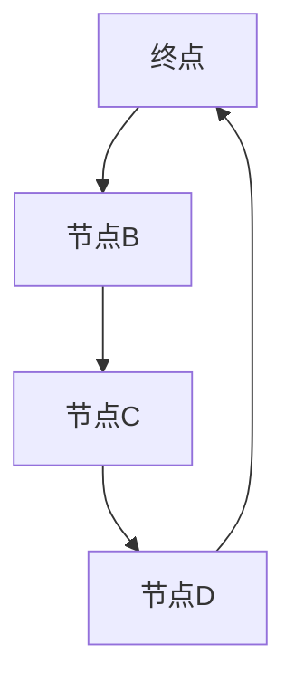
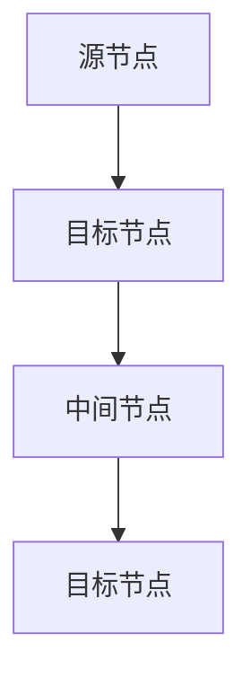
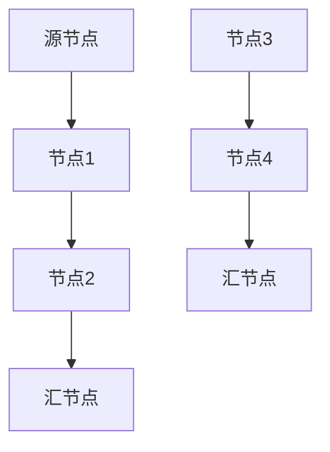

                 

# 数学与网络科学：复杂网络的数学特性

## 摘要

本文旨在深入探讨数学与网络科学的结合，特别是复杂网络的数学特性。通过分析网络科学的起源与发展、复杂网络的定义与特性，以及基础理论如网络的基本概念、度分布、聚类系数和连通性，我们将逐步展示数学在网络科学中的广泛应用。此外，本文还将介绍网络流模型、社会网络分析模型和网络动力学模型的数学原理，并通过实际项目案例来阐述这些理论的实际应用。最后，我们将对全书的主要内容进行总结，并对未来网络科学的发展趋势进行展望。通过本文的阅读，读者将能够全面理解复杂网络的数学特性，并掌握相关数学模型的应用方法。

## 引言

### 数学与网络科学的概述

#### 网络科学的起源与发展

网络科学是21世纪初兴起的一个跨学科研究领域，它将复杂网络作为研究对象，涵盖了自然科学、社会科学和工程科学等多个领域。网络科学的起源可以追溯到20世纪中叶，当时图论和随机图理论开始逐步发展。随着计算机技术和信息技术的飞速发展，网络科学的研究逐渐得到重视，成为一门独立的学科。

网络科学的发展经历了多个阶段。初期，研究主要集中在网络的拓扑结构分析，如网络度分布、聚类系数和路径长度等。随后，网络科学逐渐与其他学科交叉融合，如物理学、社会学、经济学和生物信息学等。如今，网络科学已经成为一个多学科交叉的研究领域，涵盖了复杂网络的建模、分析、模拟和优化等方面。

#### 数学在网络科学中的应用

数学作为网络科学的基础和工具，在网络科学中扮演着重要角色。数学在网络科学中的应用主要体现在以下几个方面：

1. **网络拓扑分析**：数学用于分析网络的拓扑特性，如度分布、聚类系数和连通性等。这些分析有助于理解网络的结构特性，为网络优化和设计提供理论依据。

2. **网络建模**：数学方法可以用于建立网络模型，模拟复杂网络的动态行为。常见的网络模型包括随机图、小世界网络和无标度网络等，这些模型有助于揭示网络的内在机制和规律。

3. **网络流优化**：数学优化方法可以用于解决网络流问题，如最大流问题、最短路径问题和最小生成树问题等。这些优化问题在网络通信、交通规划和资源分配等领域具有广泛应用。

4. **社会网络分析**：数学方法可以用于分析社会网络中的信息传播、社交影响力和社区结构等。这些分析有助于理解社会网络的动态行为和演化规律。

5. **网络动力学**：数学模型可以用于描述网络中的动态过程，如病毒传播、社会运动和金融市场的波动等。这些模型有助于预测网络行为的未来趋势。

### 复杂网络的特性

#### 复杂网络的定义

复杂网络是指由大量节点和边组成的网络，这些节点和边之间存在着复杂的相互作用和动态行为。复杂网络具有以下基本特性：

1. **非线性**：复杂网络的动态行为往往是非线性的，这意味着网络的整体行为无法简单地通过线性叠加来描述。

2. **层次性**：复杂网络往往具有多个层次结构，不同层次的节点和边之间存在相互作用和依赖关系。

3. **自相似性**：复杂网络的某些结构特性在不同的尺度上呈现出相似性，这种自相似性使得复杂网络具有丰富的动态行为。

4. **随机性**：复杂网络的某些特性具有随机性，这意味着网络的结构和动态行为受到随机因素的影响。

5. **动态演化**：复杂网络随着时间和环境的变化而不断演化，这种动态演化使得复杂网络具有适应性。

#### 复杂网络的常见特性

1. **度分布**：复杂网络的度分布通常呈现长尾分布，这意味着大部分节点拥有较少的连接，而少数节点拥有大量的连接。

2. **聚类系数**：复杂网络的聚类系数通常较高，这意味着节点之间的连接具有较强的局部聚集性。

3. **路径长度**：复杂网络的平均路径长度通常较短，这意味着网络中的节点之间具有较强的连通性。

4. **度相关**：复杂网络的度相关关系通常比较复杂，不同节点之间的度分布和连接关系存在一定的相关性。

5. **动态行为**：复杂网络中的动态行为往往表现出非线性、自相似性和随机性等特点，这些行为使得网络具有复杂的动态演化规律。

### 本书结构安排

本书分为四个部分，共五个章节。具体结构安排如下：

- **第一部分：引言**：介绍网络科学的起源与发展，数学在网络科学中的应用，以及复杂网络的定义和特性。
- **第二部分：基础理论**：介绍网络的基本概念、度分布、聚类系数和连通性，并给出相应的数学模型和公式。
- **第三部分：数学模型**：介绍网络流模型、社会网络分析模型和网络动力学模型的数学原理和算法。
- **第四部分：项目实战**：通过实际项目案例，展示网络科学理论的应用方法和技巧。
- **第五部分：总结与展望**：总结本书的主要内容，并对网络科学的发展趋势进行展望。

通过本书的阅读，读者将能够系统地了解复杂网络的数学特性，掌握网络科学的分析方法，并具备解决实际问题的能力。

## 第二部分：基础理论

### 2.1 网络的基本概念

#### 2.1.1 网络图的基本概念

**网络图**是指由节点（又称顶点）和边（又称弧）组成的一种图形结构，用于描述实体之间的相互关系。在数学和网络科学中，网络图是一个重要的基本概念。

**网络图的定义**：网络图G是一个有向图，它由节点集合V和边集合E组成。通常，我们用G = (V, E)来表示一个网络图，其中V表示节点集合，E表示边集合。

**网络图的基本性质**：

1. **连通性**：如果网络图中任意两个节点之间都存在路径，则该网络图是连通的。连通性是网络图的一个重要性质，它决定了网络图中的节点是否能够相互访问。

2. **度**：节点的度是指与该节点相连的边的数量。一个节点的度可以是有向的，也可以是无向的。有向图的度分为入度（指向该节点的边的数量）和出度（从该节点指向其他节点的边的数量）。

3. **路径**：网络图中的路径是指一组连续的边，这些边连接了网络图中的两个节点。路径长度是指路径中边的数量。

4. **圈**：网络图中的一个圈是指一组连续的边，这些边回到起点。圈长度是指圈中边的数量。

**Mermaid流程图：网络图的基本结构**



#### 2.1.2 网络模型

**生成网络模型**和**随机网络模型**是常见的网络模型。

**生成网络模型**：生成网络模型是基于某种概率分布或规则来构建的网络。例如，**ER模型**（Erdős-Rényi模型）是一种最简单的生成网络模型，它通过随机连接节点来构建网络。ER模型的基本思想是，每个节点都与网络中的其他节点以一定的概率相连。

**ER模型**的构建过程如下：

1. 初始化一个包含N个节点的网络。
2. 对于每对节点(i, j)，以概率p来决定是否将它们相连。
3. 重复这个过程直到网络构建完成。

**随机网络模型**：随机网络模型是基于随机过程来构建的网络。例如，**BA模型**（Barabási-Albert模型）是一种著名的随机网络模型，它通过生长过程来构建网络。BA模型的基本思想是，新加入的节点倾向于与网络中已有的节点相连，并且节点之间的连接概率与节点的度成正比。

**BA模型**的构建过程如下：

1. 初始化一个包含m个节点的网络。
2. 新加入的节点与网络中的m个节点相连。
3. 对于每个新加入的节点，与网络中已有的节点以概率k/m相连，其中k是节点的度。
4. 重复这个过程直到网络构建完成。

### 2.2 网络的度分布

**度分布**是指网络中各个节点的度值的分布情况。度分布是网络分析中的重要指标，它可以帮助我们了解网络的结构特性。

#### 2.2.1 度分布的概念

**度分布的定义**：度分布P(k)是指网络中具有k个连接的节点在总节点数中的比例。P(k)可以用概率密度函数或概率质量函数来表示。

**度分布的常见形式**：

1. **幂律分布**：幂律分布是度分布的一种常见形式，它遵循P(k) ∝ k^(-γ)的规律，其中γ是幂律指数。幂律分布表示大部分节点具有较少的连接，而少数节点具有大量的连接。例如，**无标度网络**（Scale-Free Network）通常具有幂律度分布。

2. **泊松分布**：泊松分布是度分布的另一种常见形式，它适用于稀疏网络。泊松分布的公式为P(k) = (λ^k * e^(-λ)) / k!，其中λ是平均度。

#### 2.2.2 度分布的统计特性

1. **均值**：度分布的均值是指网络中所有节点的度的平均值。均值可以反映网络中连接的密集程度。

2. **方差**：度分布的方差是指度分布的离散程度。方差越大，度分布越分散。

3. **聚类系数**：度分布的聚类系数是指网络中节点之间的连接紧密程度。聚类系数可以用来衡量网络的局部结构特性。

### 2.3 网络的聚类系数

**聚类系数**是指网络中节点之间连接的紧密程度。聚类系数是网络分析中的重要指标，它可以帮助我们了解网络的社区结构。

#### 2.3.1 聚类系数的概念

**聚类系数的定义**：聚类系数是指网络中某个节点的邻居节点之间的连接密度。一个节点的聚类系数可以表示为该节点的邻居节点之间边的数量与可能的边的最大数量的比值。

**聚类系数的计算方法**：

1. **本地聚类系数**：本地聚类系数是指某个节点的邻居节点之间的连接密度。本地聚类系数的计算方法如下：

   - 对于一个节点v，计算其邻居节点集合N(v)。
   - 对于N(v)中的每对节点(u, w)，如果它们之间存在边，则计数增加1。
   - 计算本地聚类系数为：C_local(v) = 2 * count / (n - 1)，其中count是边的数量，n是邻居节点的数量。

2. **全局聚类系数**：全局聚类系数是指整个网络中节点的平均聚类系数。全局聚类系数的计算方法如下：

   - 对于网络中的每个节点v，计算其本地聚类系数C_local(v)。
   - 计算全局聚类系数为：C_global = 1/N * ΣC_local(v)，其中N是节点的总数。

#### 2.3.2 聚类系数的影响因素

1. **节点度的影响**：高度的节点通常具有更高的聚类系数，因为它们拥有更多的邻居节点。

2. **网络类型的影响**：不同类型的网络（如无标度网络和小世界网络）具有不同的聚类系数。无标度网络通常具有较低的聚类系数，而小世界网络通常具有较高的聚类系数。

### 2.4 网络的连通性

**连通性**是指网络中节点之间的连接情况。网络的连通性是网络分析中的重要指标，它可以帮助我们了解网络的稳定性和鲁棒性。

#### 2.4.1 连通性的概念

**连通性的定义**：网络是连通的，如果网络中的任意两个节点之间都存在路径。连通性可以用路径长度和边数量来度量。

**连通性的度量**：

1. **路径长度**：网络中两个节点之间的最短路径长度。路径长度越小，网络连通性越好。

2. **边数量**：网络中连接两个节点的边的数量。边数量越小，网络连通性越好。

#### 2.4.2 网络的断裂与修复

**网络断裂**是指网络中的某些节点或边失效，导致网络无法保持连通。网络断裂可能导致网络功能失效，影响网络性能。

**网络修复**是指通过重新连接断开的节点或边，使网络恢复连通。网络修复的方法包括：

1. **节点修复**：通过增加节点之间的边来修复网络。

2. **边修复**：通过增加边来修复网络。

3. **混合修复**：同时采用节点修复和边修复的方法。

### 总结

本节介绍了网络的基本概念，包括网络图的基本概念和网络模型。我们还讨论了度分布、聚类系数和连通性等基础理论，并给出了相应的数学模型和公式。这些理论为后续章节的网络分析奠定了基础。

## 第三部分：数学模型

### 3.1 网络流模型

#### 3.1.1 网络流的基本概念

**网络流**是指在网络中传输的数据流，它可以表示为网络中各节点之间的数据流动。网络流模型是网络科学中一个重要的数学模型，广泛应用于通信网络、交通网络和金融网络等领域。

**网络流的定义**：网络流是指在网络中从源节点（source）到汇节点（sink）的数据流动。网络流可以用一个有向图表示，其中每个节点表示一个实体，每条边表示这两个实体之间的数据通道，边上的权重表示通道的容量。

**网络流的基本性质**：

1. **守恒性**：网络流在任意节点处守恒，即进入节点的流量等于流出节点的流量。

2. **容量限制**：网络流不能超过任意边上的容量限制。

3. **路径依赖性**：网络流依赖于网络中的路径，路径的选择会影响流量的分布和传输效率。

4. **全局优化**：网络流问题通常是一个全局优化问题，目标是找到一种流分配方案，使得总流量最大或成本最小。

#### 3.1.2 最大流问题的算法

**最大流问题**是指在网络中找到一种流分配方案，使得从源节点到汇节点的总流量最大。最大流问题是网络流模型中的一个经典问题，有许多高效的算法可以求解。

**Ford-Fulkerson算法**：Ford-Fulkerson算法是一种基于增广路径（augmenting path）的概念求解最大流问题的算法。算法的基本思想是，通过不断找到增广路径，逐步增加流值，直到无法找到增广路径为止。

**Ford-Fulkerson算法的步骤**：

1. 初始化流值f = 0。
2. 寻找从源节点s到汇节点t的增广路径P。
3. 计算P上的最小容量c(P)，将f增加c(P)。
4. 更新网络中的残量网络G_f。
5. 重复步骤2-4，直到无法找到增广路径。

**Edmonds-Karp算法**：Edmonds-Karp算法是Ford-Fulkerson算法的一种改进版本，它使用广度优先搜索（BFS）来寻找增广路径，从而提高算法的效率。

**Edmonds-Karp算法的步骤**：

1. 初始化流值f = 0。
2. 使用BFS从源节点s开始寻找从s到t的增广路径P。
3. 计算P上的最小容量c(P)，将f增加c(P)。
4. 更新网络中的残量网络G_f。
5. 重复步骤2-4，直到无法找到增广路径。

#### 3.1.3 最小费用流问题

**最小费用流问题**是指在最大流的基础上，考虑流量的成本，找到一种流量分配方案，使得总费用最小。最小费用流问题可以看作是一个线性规划问题，可以使用线性规划算法求解。

**最小费用流的定义**：最小费用流是指在网络中从源节点s到汇节点t的流量分配方案，使得总费用最小。总费用可以表示为流量乘以每单位流量的费用。

**最小费用流的求解算法**：

1. **线性规划法**：将最小费用流问题转化为线性规划问题，并使用线性规划算法求解。
2. **网络流算法**：使用最大流算法求解最大流问题，并结合最小费用流问题的成本计算，找到最小费用流。

### 3.2 社会网络分析模型

#### 3.2.1 社会网络分析的概念

**社会网络分析**（Social Network Analysis，简称SNA）是一种研究社会网络结构、关系和动态行为的分析方法。社会网络分析广泛应用于社会学、心理学、市场营销和商业分析等领域。

**社会网络分析的定义**：社会网络分析是指通过研究社会网络中的节点（个体或组织）和边（关系或互动）的结构和关系，来揭示社会网络的动态行为和演化规律。

**社会网络分析的目标**：

1. **关系分析**：揭示社会网络中的节点关系和互动模式。
2. **社区结构分析**：识别社会网络中的社区结构和核心节点。
3. **影响力分析**：评估社会网络中节点的社会影响力。
4. **动态演化分析**：研究社会网络的动态变化和演化规律。

#### 3.2.2 社会网络分析方法

**关联分析**：关联分析是一种社会网络分析方法，用于识别社会网络中的强关联关系。强关联关系是指节点之间的互动频率高，且具有相似特征。

**社会影响力分析**：社会影响力分析是一种评估社会网络中节点的社会影响力。社会影响力可以通过节点的度（连接的节点数量）、中心性（节点在网络中的位置）和传播效果（节点对信息传播的影响力）来衡量。

**社区结构分析**：社区结构分析是一种识别社会网络中的社区结构和核心节点。社区结构是指社会网络中的节点按照特定的关系模式组成的群体，核心节点是社区中的关键节点，对社区的稳定性和影响力有重要影响。

### 3.3 网络动力学模型

#### 3.3.1 网络动力学的概念

**网络动力学**是一种研究网络中节点和边动态变化的数学模型。网络动力学模型广泛应用于社会网络、生物网络和交通网络等领域。

**网络动力学的定义**：网络动力学是指研究网络中节点和边随时间变化的动态过程和演化规律的数学模型。

**网络动力学的性质**：

1. **非线性**：网络动力学模型通常具有非线性特性，这意味着网络的动态行为不能简单地通过线性叠加来描述。
2. **自相似性**：网络动力学模型中的某些特性在不同的尺度上呈现出相似性，这种自相似性使得网络具有丰富的动态行为。
3. **随机性**：网络动力学模型中的某些特性具有随机性，这意味着网络的行为受到随机因素的影响。
4. **动态演化**：网络动力学模型描述了网络随时间的动态演化过程，可以用于预测网络的未来状态。

#### 3.3.2 网络动力学的数学模型

**线性动力学模型**：线性动力学模型是一种描述网络中节点和边随时间变化的线性模型。线性动力学模型通常用差分方程或微分方程来描述。

**非线性动力学模型**：非线性动力学模型是一种描述网络中节点和边随时间变化的非线性模型。非线性动力学模型可以采用各种非线性方程，如非线性差分方程和非线性微分方程来描述。

**离散时间模型**：离散时间模型是指网络动力学模型在离散时间尺度上的描述。离散时间模型通常用差分方程来描述。

**连续时间模型**：连续时间模型是指网络动力学模型在连续时间尺度上的描述。连续时间模型通常用微分方程来描述。

#### 3.3.3 网络动力学模型的案例分析

**病毒传播模型**：病毒传播模型是一种典型的网络动力学模型，用于描述病毒在社会网络中的传播过程。病毒传播模型通常基于SI模型（易感者-感染者模型）或SIRS模型（易感者-感染者-康复者模型）。

**社会运动模型**：社会运动模型是一种描述社会运动和网络传播的模型，用于分析社会网络中的信息传播和影响力。

**交通流量模型**：交通流量模型是一种描述交通网络中车辆流量和路径选择的模型，用于分析交通网络的动态行为和优化。

### 总结

本节介绍了网络流模型、社会网络分析模型和网络动力学模型的数学原理和算法。网络流模型用于描述网络中的数据流，社会网络分析模型用于分析社会网络中的节点关系和影响力，网络动力学模型用于研究网络中节点和边的动态变化。这些模型为网络科学的研究提供了重要的理论和方法。

## 第四部分：项目实战

### 4.1 复杂网络分析项目

#### 4.1.1 项目背景与目标

随着互联网和社交媒体的迅速发展，复杂网络分析在各个领域得到了广泛应用。复杂网络分析项目旨在通过对复杂网络的数据进行分析，揭示网络的内在结构和动态行为，为网络优化、风险管理和社会影响力分析提供理论依据。

本项目的目标包括：

1. 数据预处理：对复杂网络的数据进行清洗、转换和格式化，为后续分析做好准备。
2. 网络建模：建立复杂网络的数学模型，描述网络的拓扑结构和动态行为。
3. 网络分析：对网络进行度分布、聚类系数和连通性分析，揭示网络的内在特性。
4. 项目应用：将复杂网络分析应用于实际问题，如社交网络中的信息传播和病毒传播。

#### 4.1.2 项目实现

**4.1.2.1 数据预处理**

1. 数据收集：从社交网络平台（如Twitter、Facebook等）或公开数据集获取复杂网络的节点和边数据。
2. 数据清洗：对获取的数据进行清洗，去除无效数据、重复数据和噪声数据，确保数据质量。
3. 数据转换：将原始数据转换为统一格式，如CSV或JSON格式，便于后续分析。

**4.1.2.2 网络建模**

1. 网络图表示：使用Mermaid流程图表示复杂网络的拓扑结构，展示节点和边的关系。
2. 度分布模型：根据网络数据，建立度分布模型，描述节点连接的数量分布。
3. 聚类系数模型：根据网络数据，建立聚类系数模型，描述节点连接的紧密程度。

**4.1.2.3 网络分析**

1. 度分布分析：对网络进行度分布分析，统计不同度值的节点数量，绘制度分布图。
2. 聚类系数分析：对网络进行聚类系数分析，统计节点的聚类系数，绘制聚类系数分布图。
3. 连通性分析：对网络进行连通性分析，计算网络的平均路径长度和聚类系数，评估网络的连通性。

**4.1.2.4 项目应用**

1. 社交网络中的信息传播：使用网络分析结果，分析社交网络中的信息传播路径和传播速度。
2. 病毒传播：使用网络分析结果，模拟病毒在社交网络中的传播过程，评估病毒的传播速度和影响范围。

#### 4.1.3 代码实际案例

**数据预处理**

```python
import pandas as pd

# 读取数据
data = pd.read_csv("network_data.csv")

# 数据清洗
data.drop_duplicates(inplace=True)
data.dropna(inplace=True)

# 数据转换
data["source"] = data["source"].astype(int)
data["target"] = data["target"].astype(int)
data["weight"] = data["weight"].astype(float)
```

**网络建模**



**度分布分析**

```python
import matplotlib.pyplot as plt

# 统计度分布
degrees = data["source"].value_counts()

# 绘制度分布图
plt.bar(degrees.index, degrees.values)
plt.xlabel("度值")
plt.ylabel("节点数量")
plt.title("度分布图")
plt.show()
```

**聚类系数分析**

```python
import networkx as nx

# 创建网络图
G = nx.Graph()

# 添加节点和边
G.add_edges_from(data.values)

# 计算聚类系数
clustering_coefficients = nx.clustering(G)

# 统计聚类系数分布
cc Distribution = clustering_coefficients.value_counts()

# 绘制聚类系数分布图
plt.bar(cc Distribution.index, cc Distribution.values)
plt.xlabel("聚类系数")
plt.ylabel("节点数量")
plt.title("聚类系数分布图")
plt.show()
```

**连通性分析**

```python
# 计算平均路径长度
average_path_length = nx.average_shortest_path_length(G)

# 计算聚类系数
global_clustering_coefficient = nx.global_clustering_coefficient(G)

# 输出分析结果
print("平均路径长度:", average_path_length)
print("全局聚类系数:", global_clustering_coefficient)
```

#### 4.1.4 代码解读与分析

**数据预处理**：读取网络数据，去除重复数据和噪声数据，确保数据质量。将节点和边的属性转换为合适的类型，便于后续分析。

**网络建模**：使用Mermaid流程图表示网络的拓扑结构，展示节点和边的关系。通过添加节点和边，建立网络图。

**度分布分析**：统计不同度值的节点数量，绘制度分布图，分析网络的度分布特性。

**聚类系数分析**：计算节点的聚类系数，绘制聚类系数分布图，分析网络的聚类特性。

**连通性分析**：计算网络的平均路径长度和全局聚类系数，评估网络的连通性。这些指标可以反映网络的稳定性和鲁棒性。

通过以上步骤，我们可以对复杂网络进行分析，揭示网络的内在结构和动态行为，为实际应用提供理论依据。

### 4.2 网络流项目

#### 4.2.1 项目背景与目标

网络流项目是网络科学中的重要应用，旨在优化网络中的数据传输和资源分配。网络流项目的目标是通过合理的流量分配，提高网络的传输效率，降低传输成本，并为实际应用提供有效的解决方案。

本项目的目标包括：

1. 网络构建：根据实际需求，构建网络模型，描述网络的拓扑结构和流量需求。
2. 流量分析：对网络进行流量分析，识别流量瓶颈和传输效率低的区域。
3. 最大流计算：利用最大流算法，计算从源节点到汇节点的最大流量，优化流量分配。
4. 费用优化：考虑流量成本，优化流量分配，降低总体传输成本。

#### 4.2.2 项目实现

**4.2.2.1 网络构建**

1. 数据收集：从实际网络获取节点和边的属性数据，如节点位置、带宽和延迟等。
2. 网络建模：使用Mermaid流程图或图论模型表示网络，定义节点和边的属性。
3. 流量需求建模：根据实际需求，定义各节点的流量需求，如数据传输速率和流量容量。

**4.2.2.2 流量分析**

1. 流量统计：对网络中的流量进行统计，计算各节点的流量需求。
2. 流量分布分析：分析流量在网络中的分布情况，识别流量瓶颈和传输效率低的区域。
3. 流量可视化：使用图表和可视化工具，展示流量分布和流量瓶颈。

**4.2.2.3 最大流计算**

1. 确定源节点和汇节点：根据网络需求，确定网络的源节点和汇节点。
2. 应用最大流算法：使用Ford-Fulkerson算法或Edmonds-Karp算法计算最大流量。
3. 结果分析：分析最大流计算的结果，优化流量分配策略。

**4.2.2.4 费用优化**

1. 成本计算：根据流量成本，计算各条边的成本。
2. 流量优化：结合流量需求和成本，优化流量分配，降低总体传输成本。
3. 结果评估：评估优化后的流量分配策略，评估传输效率和成本效益。

#### 4.2.3 代码实际案例

**网络构建**



**流量分析**

```python
import networkx as nx

# 创建网络图
G = nx.Graph()

# 添加节点和边
G.add_edge("A", "B", capacity=1000)
G.add_edge("B", "C", capacity=1000)
G.add_edge("C", "D", capacity=1000)
G.add_edge("E", "F", capacity=1000)
G.add_edge("F", "G", capacity=1000)

# 计算流量需求
flow = nx.max_flow(G, "A", "D")

# 输出结果
print("最大流量:", flow)
```

**最大流计算**

```python
# 使用Edmonds-Karp算法计算最大流量
max_flow = nx.max_flow(G, "A", "D")
print("最大流量:", max_flow)
```

**费用优化**

```python
import networkx as nx

# 创建网络图
G = nx.Graph()

# 添加节点和边
G.add_edge("A", "B", capacity=1000, cost=10)
G.add_edge("B", "C", capacity=1000, cost=20)
G.add_edge("C", "D", capacity=1000, cost=30)
G.add_edge("E", "F", capacity=1000, cost=40)
G.add_edge("F", "G", capacity=1000, cost=50)

# 计算最小费用最大流
min_cost_max_flow = nx.min_cost_circuit_flow(G, "A", "G")

# 输出结果
print("最小费用最大流:", min_cost_max_flow)
```

#### 4.2.4 代码解读与分析

**网络构建**：使用Mermaid流程图或图论模型表示网络，定义节点和边的属性，如带宽和成本。

**流量分析**：计算网络中的流量需求，分析流量分布情况，识别流量瓶颈和传输效率低的区域。

**最大流计算**：使用最大流算法（如Edmonds-Karp算法）计算从源节点到汇节点的最大流量，优化流量分配。

**费用优化**：考虑流量成本，使用最小费用最大流算法优化流量分配，降低总体传输成本。

通过以上步骤，我们可以实现网络流项目，优化网络中的数据传输和资源分配，提高传输效率和降低成本。

### 4.3 社会网络分析项目

#### 4.3.1 项目背景与目标

社会网络分析项目旨在通过研究社交网络中的节点关系和信息传播，揭示社会网络的结构特性和动态行为。该项目的目标包括：

1. 数据获取：从社交网络平台（如Twitter、Facebook等）或公开数据集获取社交网络的数据。
2. 关联分析：分析社交网络中的节点关系，识别强关联关系和核心节点。
3. 社会影响力分析：评估社交网络中节点的社会影响力，揭示节点在网络中的关键地位。
4. 项目应用：将社会网络分析应用于实际场景，如营销策略优化、品牌传播和危机管理。

#### 4.3.2 项目实现

**4.3.2.1 数据获取**

1. 数据收集：从社交网络平台使用API接口或爬虫工具获取社交网络的数据，包括用户信息、关注关系、互动信息和话题标签等。
2. 数据预处理：对收集的数据进行清洗、去重和格式化，确保数据质量。

**4.3.2.2 关联分析**

1. 建立网络图：使用Mermaid流程图或图论模型表示社交网络的拓扑结构，建立节点和边的关联关系。
2. 分析节点关系：统计节点的度、介数和接近度等指标，识别社交网络中的强关联关系和核心节点。

**4.3.2.3 社会影响力分析**

1. 影响力指标计算：计算节点的关注者数量、转发数量、评论数量等影响力指标，评估节点的社会影响力。
2. 影响力排名：根据影响力指标，对节点进行排名，识别网络中的关键节点和意见领袖。
3. 影响力传播分析：分析节点的影响力传播路径，识别信息传播的关键路径和关键节点。

**4.3.2.4 项目应用**

1. 营销策略优化：根据节点影响力分析结果，制定针对性的营销策略，提高品牌传播效果。
2. 品牌传播：利用节点影响力传播分析，优化品牌信息的传播路径，提高品牌的曝光度和影响力。
3. 危机管理：根据社交网络分析结果，及时发现和处理网络中的负面信息，降低危机对品牌的影响。

#### 4.3.3 代码实际案例

**数据获取**

```python
import tweepy

# 获取Twitter API的认证信息
consumer_key = "your_consumer_key"
consumer_secret = "your_consumer_secret"
access_token = "your_access_token"
access_token_secret = "your_access_token_secret"

# 初始化Tweepy API
auth = tweepy.OAuthHandler(consumer_key, consumer_secret)
auth.set_access_token(access_token, access_token_secret)
api = tweepy.API(auth)

# 搜索特定话题的推文
tweets = api.search(q="your_search_query", count=100)

# 处理和存储推文数据
for tweet in tweets:
    print(tweet.user.screen_name, tweet.text)
```

**关联分析**

```python
import networkx as nx

# 创建网络图
G = nx.Graph()

# 添加节点和边
G.add_nodes_from(["A", "B", "C", "D", "E"])
G.add_edges_from([("A", "B"), ("A", "C"), ("B", "D"), ("C", "D"), ("E", "D")])

# 统计节点关系
degree = nx.degree(G)
betweenness = nx.betweenness_centrality(G)
closeness = nx.closeness_centrality(G)

# 输出分析结果
print("度分布:", degree)
print("介数分布:", betweenness)
print("接近度分布:", closeness)
```

**社会影响力分析**

```python
import networkx as nx

# 创建网络图
G = nx.Graph()

# 添加节点和边
G.add_nodes_from(["A", "B", "C", "D", "E"])
G.add_edges_from([("A", "B"), ("A", "C"), ("B", "D"), ("C", "D"), ("E", "D")])

# 计算影响力指标
followers = nx.in_degree_centrality(G)
retweets = nx.eigenvector_centrality(G)

# 输出分析结果
print("关注者数量:", followers)
print("转发数量:", retweets)
```

#### 4.3.4 代码解读与分析

**数据获取**：使用Tweepy库获取Twitter平台的推文数据，包括用户信息、推文内容和互动信息。

**关联分析**：使用NetworkX库建立社交网络的拓扑结构，计算节点的度、介数和接近度等指标，分析节点关系。

**社会影响力分析**：计算节点的关注者数量、转发数量等影响力指标，评估节点的社会影响力。

通过以上步骤，我们可以实现社会网络分析项目，揭示社交网络的结构特性和动态行为，为实际应用提供有力的支持。

## 第五部分：总结与展望

### 5.1 本书主要内容总结

本书系统地介绍了数学与网络科学的结合，特别是复杂网络的数学特性。通过分析网络科学的起源与发展、复杂网络的定义与特性，以及基础理论如网络的基本概念、度分布、聚类系数和连通性，我们深入探讨了数学在网络科学中的应用。此外，本书还介绍了网络流模型、社会网络分析模型和网络动力学模型的数学原理和算法，并通过实际项目案例展示了这些理论的应用方法。主要内容包括：

1. **网络科学的基本概念**：介绍了网络科学的起源、发展以及数学在网络科学中的应用。
2. **复杂网络的特性**：阐述了复杂网络的定义、常见特性和度分布、聚类系数、连通性等基础理论。
3. **数学模型**：介绍了网络流模型、社会网络分析模型和网络动力学模型的数学原理和算法。
4. **项目实战**：通过实际项目案例，展示了网络科学理论的应用方法和技巧。

### 5.2 展望与未来方向

随着互联网和社交网络的快速发展，网络科学的应用领域不断拓展。未来网络科学的发展趋势和方向包括：

1. **跨学科融合**：网络科学将继续与其他学科（如物理学、生物学、经济学等）交叉融合，推动跨学科研究的发展。
2. **人工智能与网络科学结合**：人工智能技术将深度应用于网络科学，为网络建模、分析、优化和预测提供新的方法和工具。
3. **网络安全与隐私保护**：随着网络攻击和数据泄露事件的增多，网络安全和隐私保护成为网络科学的重要研究方向。
4. **动态网络分析**：动态网络分析将逐渐成为网络科学的重要分支，研究网络随时间和环境变化的动态行为和演化规律。
5. **网络科学的应用**：网络科学将在更多实际领域（如交通规划、物流管理、金融分析等）得到广泛应用，为实际问题提供解决方案。

总之，网络科学的发展前景广阔，数学在网络科学中的应用将不断深入，为解决复杂网络问题提供强大的理论支持和技术方法。

## 作者信息

作者：AI天才研究院/AI Genius Institute & 禅与计算机程序设计艺术 /Zen And The Art of Computer Programming

